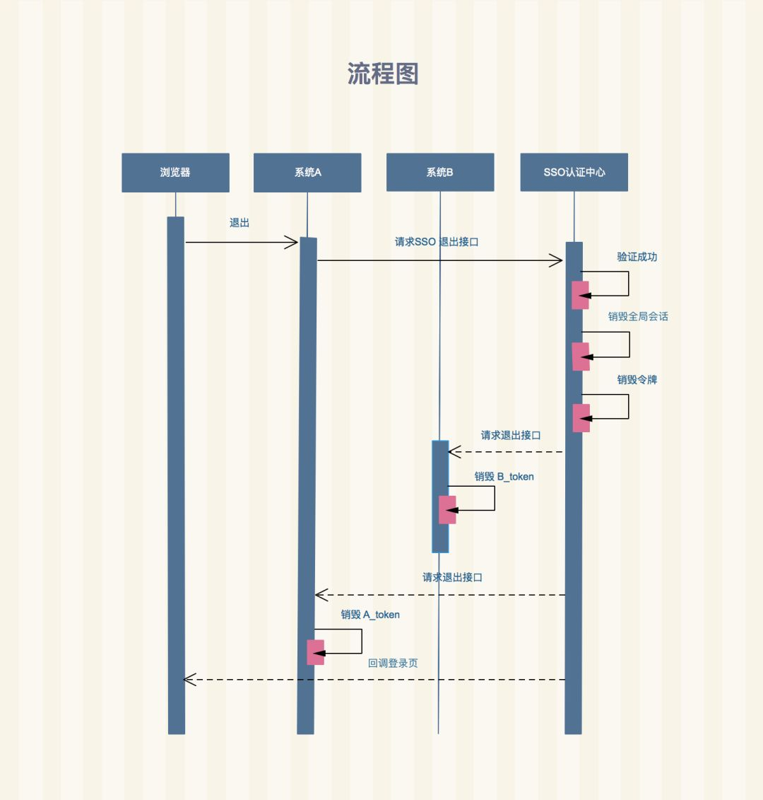

# Admin

## 概念

* 系统资源
    - 菜单管理:路径 打开方式
    - 字典码表：系统内部定义的具有业务属性的数据字典
        + 字典类型：对数据进行分类管理
        + 字典数据项：需要管理的枚举数据
    - 应用管理
        + 在多应用系统以及单应用系统下，实现对应用的服务功能的权限控制。实现角色、用户、功能的灵活绑定。
* 权限管理
    - 角色：权限集
    - 用户
        + 本地登录：用户账号及其认证密码在本地存储
        + 单点登录：即与IAM集成的sso方式登录
    - 授权管理
        + 菜单授权
        + 服务授权
* 组织管理
    - 机构管理
    - 工作组管理
* 基础服务
    - 缓存
    - 持久化
    - 日志
    - 配置
    - 权限管理
    - 设计
    - 服务发现
    - 服务路由
* 模版复用

## 登录

## SSO(Single Sign On)单点登录

多个应用系统中，只需要登录一次，就可以访问其他相互信任的应用系统

* 系统A和系统B都是前后端分离的，比如前端框架用的 React / Vue / Angular，都是通过 NPM 编译后独立部署的，前后端完全通过HTTP接口的方式进行交互
* SSO认证中心不是前后端分离的，就是前端代码和后端代码部署在一个项目中
* 对比OAuth
    - SSO是处理一个公司内的不同应用系统之间的登录问题
    - OAuth是不同公司遵循的一种授权方案，也是一种授权协议，通常都是由大公司提供,好处是可以使用其他第三方账号进行登录系统，减少了因用户懒，不愿注册而导致用户流失的风险




## 模块

* 模板(Bootstrap+Js)
    - 页面布局
        + 头部
        + 尾部
        + 侧边栏
    - 页面插件
        + 日历：Datetimepicker
        + 弹窗：bootstrap 的 Modal
        + 分页：拖拽 Draggable 排序 Sortable
        + 图表：Echarts
    - 适配
        + PC
        + M
        + Pad
* 常用逻辑操作
    - 登录、登出
    - 增、删、改
    - 查询 + 批量操作
    - 导入、导出
        + Excel、csv
    - 上传文件
        + 图片
        + 附件
    - 权限控制
    - 操作日志
* 公共代码
    - 异常处理
        + Ajax Json
        + 错误page
    - 表单验证
        + 数据不合法提示：BootstrapValidator
        + 富文本：Summernote
    - 安全过滤
        + xss过滤
        + sql攻击
    - 参数加密
        + hashids

## 图标

* [FontAwesome](http://fontawesome.io/)
* [矢量图标库](http://www.iconfont.cn/)

## 扩展

* [apache/mesos](https://github.com/apache/mesos):a cluster manager that provides efficient resource isolation and sharing across distributed applications, or frameworks. It can run Hadoop, Jenkins, Spark, Aurora, and other frameworks on a dynamically shared pool of nodes.
* [Airflow](https://github.com/apache/incubator-airflow) is a platform to programmatically author, schedule, and monitor workflows.
* [open-falcon/falcon-plus](https://github.com/open-falcon/falcon-plus)An open-source and enterprise-level monitoring system

## [tabler/tabler](https://github.com/tabler/tabler)

Tabler is free and open-source HTML Dashboard UI Kit built on Bootstrap 4 https://tabler.github.io/

```sh
git clone https://github.com/tabler/tabler.git

cd tabler
npm install

gem install bundler
bundle install

npm run serve
#  http://localhost:4000
```

## 框架

* [kahun/awesome-sysadmin](https://github.com/kahun/awesome-sysadmin)：A curated list of amazingly awesome open source sysadmin resources inspired by Awesome PHP.
* [zuiidea/antd-admin](https://github.com/zuiidea/antd-admin):A admin dashboard application demo built upon Ant Design and Dva.js http://antd-admin.zuiidea.com
* [akveo/blur-admin](https://github.com/akveo/blur-admin):Angular Bootstrap Admin Panel Framework http://akveo.github.io/blur-admin/
* [ant-design/ant-design-pro](https://github.com/ant-design/ant-design-pro): 👨🏻‍💻👩🏻‍💻 An out-of-box UI solution for enterprise applications http://pro.ant.design/
* [akveo/ngx-admin](https://github.com/akveo/ngx-admin):Admin dashboard template based on Angular 5+, Bootstrap 4 (previously known as ng2-admin) http://akveo.com/ngx-admin/
* [PanJiaChen/vue-element-admin](https://github.com/PanJiaChen/vue-element-admin): 🎉 A magical vue admin http://panjiachen.github.io/vue-element-admin
* [withspectrum/spectrum](https://github.com/withspectrum/spectrum):Simple, powerful online communities. https://spectrum.chat
* [vue-bulma/vue-admin](https://github.com/vue-bulma/vue-admin):Vue Admin Panel Framework, Powered by Vue 2.0 and Bulma 0.3 https://admin.vuebulma.com
* [creativetimofficial/material-dashboard](https://github.com/creativetimofficial/material-dashboard):Material Dashboard - Open Source Bootstrap 4 Material Design Admin https://demos.creative-tim.com/material-dashboard/examples/dashboard.html
* [mgbq/nx-admin](https://github.com/mgbq/nx-admin):👍 A magical 🐮 ⚔ vue admin，
* [misterGF/CoPilot](https://github.com/misterGF/CoPilot):Responsive Bootstrap 3 Admin Template based on AdminLTE with vue.js https://copilot.misterGF.io
* [coreui/coreui-free-bootstrap-admin-template](https://github.com/coreui/coreui-free-bootstrap-admin-template):CoreUI is free bootstrap admin template http://coreui.io
* [EasyCorp/EasyAdminBundle](https://github.com/EasyCorp/EasyAdminBundle):The new (and simple) admin generator for Symfony applications.
* [BlackrockDigital/startbootstrap-sb-admin-2](https://github.com/BlackrockDigital/startbootstrap-sb-admin-2):A free, open source, Bootstrap admin theme created by Start Bootstrap https://startbootstrap.com/themes/sb-admin-2/

## UI

* [bopoda/ace](https://github.com/bopoda/ace):Twitter bootstrap 3 admin template http://ace.jeka.by
* [almasaeed2010/AdminLTE](https://github.com/almasaeed2010/AdminLTE):AdminLTE - Free Premium Admin control Panel Theme Based On Bootstrap 3.x https://adminlte.io
* [ColorlibHQ/AdminLTE](https://github.com/ColorlibHQ/AdminLTE):AdminLTE - Free Premium Admin control Panel Theme Based On Bootstrap 3.x https://adminlte.io
* [keen/dashboards](https://github.com/keen/dashboards):Responsive dashboard templates 📊✨ http://keen.github.io/dashboards/
