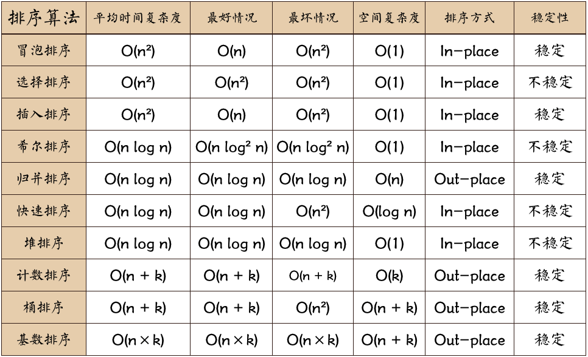
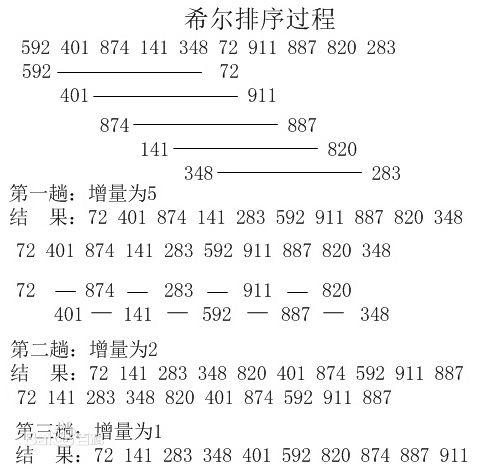
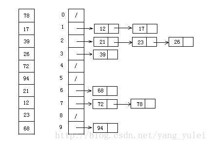

# 排序

策略从正向开始还是反向开始，正向放最小，反向放最大


- 选择考虑
  
  - 时间复杂度
  - 空间复杂度(对内存空间的消耗）
  - 算法稳定性:如果待排序序列中存在值相等的元素，经过排序之后，相等元素之间原有的先后顺序不变
    - 插入排序、合并排序、冒泡排序等都是稳定
    - 堆排序、快速排序 不稳定
    - 不稳定缺点:多重排序时可能会产生问题

- 总结
  
  - 遍历作用
    - 数据范围控制
    - 次数控制

- 思路
  
  - 外层遍历数组：限定边界条件
  - 处理方法：取什么元素，怎么放

- bubble sort 冒泡
  
  - 一次冒泡会让至少一个元素移动到应该在的位置
  - 外层控制执行次数n：i o~n
  - 内层控制比较范围：j从0开始到n-i-1,j 与 j+1 俩俩比较（比较次数 n-1 n-2 1）
  - 时间复杂度:O(n2)
  - 空间复杂度：只涉及相邻元素的交换，是原地排序算法
  - 算法稳定性：元素相等不会交换，是稳定的排序算法

- Insert Sort **插入**
  
  - 将数组数据分为已排序区间和未排序区间两个区间，初始已排序区间只有数组第一个元素
  - **取未排序区间中元素，在已排序区间中插入合适位置** 外层i从 1~n（未排序区间），0 为已排序区间,i 取出 value(必须取出，后面i 要与i-1位比较，需要i个位置)
  - 保证插入已排序区间数据有序：直到未排序区间中元素为空
    - 内层 j 从i-1到0 与value比较
    - 比value大后移一位
    - 循环到0，a[j+1] = value 其实是a[0] = value
    - 或者遇见a[j] <= value 停止, a[j+1] = value
  - 冒泡逆操作
  - 没有额外存储空间，是原地排序算法
  - 不涉及相等元素位置交换，是稳定排序算法
  - 不涉及数据交换
  - 时间复杂度是O(n2)

- Selection Sort 选择
  
  - 分已排序区间和未排序区间
  - **从未排序区间中选择最小元素** 外层i从 0～n-1，最小 min = i
    - 与j 从i+1 到 n 对比
    - when a[j] < a[min], min = j
    - min != i, 互换
  - **放到已排序区间末尾** 放到i位置
  - 对比插入：排序空间不一样
    - 选择：未排序中最小
    - 插入：插入到已排序中合适位置
    - 冒泡：**未排序中找到最大，放到已排序头部**
  - 遍历
  - 时间复杂度也是 O(n2)
  - 不涉及额外的存储空间，所以是原地排序
  - 由于涉及非相邻元素位置交换，所以是不稳定的排序算法

- 插入排序 > 冒泡排序 >> 选择排序

- Quick sort 快速
  
  - 子数组有序时，整个数组也就有序了，合并排序相似
  - 排序数组中下标从 p 到 r 之间一组数据，选择 p 到 r 之间任意一个数据a[q]作为 pivot（分区点）
    - 一般会将数组最后一个元素或者第一个元素作为 pivot
  - 数据分成三个部分：遍历 p 到 r 间数据，将小于 pivot 放到左边，将大于 pivot 放到右边，将 pivot 放到中间
    - p 到 q-1 之间都是小于 pivot
    - 中间是 pivot
    - 后面 q+1 到 r 之间是大于 pivot
  - 循环
    - 通过两个变量 i 和 j 作为下标循环数组
    - 下标 j 对应数据小于 pivot，交换 i 和 j 对应数据，并且将 i 往前移动一位
    - 否则 i 不动，下标 j 始终是往前移动的，j 到达终点后，将 pivot 与下标 i 对应数据交换
    - 最终将 pivot 置于数组中间，[0...i-1] 区间的数据都比 pivot 小，[i+1...j] 之间的数据都比 pivot 大
  - 递归排序下标从 p 到 q-1 之间的数据和下标从 q+1 到 r 之间的数据，直到区间缩小为 1，就说明所有数据都有序
  - 原地排序算法，时间复杂度和归并排序一样，也是 O(nlogn)
  - 缺点:涉及到数据的交换，有可能破坏原来相等元素的位置排序，所以是不稳定排序算法
  - PHP 数组的 sort 函数底层就是基于快速排序来实现

- Merge sort 归并
  
  - 使用分治思想，就是分而治之，将一个大问题分解成小的子问题来解决
  - 把数组从中间分成前后两部分，然后对前后两部分分别排序，再将排好序两部分合并在一起
  - 递归将传入待排序数组一分为二，直到不能分割，然后将排序后序列合并，最终返回排序后的数组
  - 合并的边界
    - left[i] < left_end && right[j] < right_end
      - left[i] <= right[i] => arr[] = left[i]
      - else arr[] = right[j]
        - left[i] < left_end arr[] = left[i]
        - right[j] < right_end arr[] = right[j]
  - 不涉及相等元素位置交换，是稳定排序算法
  - 时间复杂度是 O(nlogn) `T(n) = 2*T(n/2) + n = 2^k*T(n/2^k) + k*n`，优于冒泡排序和插入排序的 O(n2)
  - 需要额外空间存放排序数据，不是原地排序，最多需要和待排序数组同样大小的空间，空间复杂度是 O(n)

- External Merge Sort:数据量特别大时，或者说比内存容量还要大时，数据就无法一次性放入内存中，只能放在硬盘等外存储器上
  
  - 要对 900MB 的数据进行排序，但是内存只有 100MB
  - 读取 10MB 的数据，那就相当于把 900MB 的数据分成了 90 份
  - 在内存中排序完成后写入磁盘
  - 把这 90 份数据都排好序，那就会产生 90 个临时文件
  - 用 k-way merge 对着 90 个文件进行合并，比如每次读取每个文件中的 1MB 拿到内存里来 merge，保证加起来是小于内存容量且能保证程序能够运行的

- Heap sort 堆排序

- Shell Sort 希尔排序

- Bucket Sort 桶排序

- 基数排序 Dadix Sort

- 贪心

- 剪枝

- 图算法

## 计数排序（Counting Sort）

- 针对于特定范围之间的整数进行排序的算法。通过统计给定数组中不同元素的数量（类似于哈希映射），然后对映射后的数组进行排序输出即可
- 步骤
  - 给定一个数组 arr，生成一个以 arr 的 value 为下标范围的空数组（count）
  - 计数：遍历 arr，value 存在,则 ++ count[value],得到所有 value 的 count，此时得到不稳定的排序结果
  - 地址范围（位置信息）：遍历 count[i] = count[i] + count[i-1]。i 范围 [count[i-1],count[i - 1]]
  - 从后向前遍历:output[arr[i]] = count[arr[i]] -1; --count[arr[i]];
    
    

## 指标

* 稳定：如果a原本在b前面，而a=b，排序之后a仍然在b的前面；
* 不稳定：如果a原本在b的前面，而a=b，排序之后a可能会出现在b的后面；
* 内排序：所有排序操作都在内存中完成；
* 外排序：由于数据太大，因此把数据放在磁盘中，而排序通过磁盘和内存的数据传输才能进行；
* 时间复杂度: 一个算法执行所耗费的时间。
* 空间复杂度: 运行完一个程序所需内存的大小。

## Javascript实现

排序算法总结  n: 数据规模 k:"桶"的个数 In-place: 占用常数内存，不占用额外内存 Out-place: 占用额外内存

### 冒泡排序（Bubble Sort）

冒泡排序是一种简单的排序算法。它重复地走访过要排序的数列，一次比较两个元素，如果它们的顺序错误就把它们交换过来。走访数列的工作是重复地进行直到没有再需要交换，也就是说该数列已经排序完成。这个算法的名字由来是因为越小的元素会经由交换慢慢"浮"到数列的顶端。

冒出最大的 反向依次置位，要在过程中依次找到相对最大的

算法描述如下：

- 比较相邻的元素。如果第一个比第二个大，就交换它们两个；
- 对每一对相邻元素作同样的工作，从开始第一对到结尾的最后一对，这样在最后的元素应该会是最大的数；
- 针对所有的元素重复以上的步骤，除了最后一个;
- 重复步骤1~3，直到排序完成。
- 改进方法：考虑利用在每趟排序中进行正向和反向两遍冒泡的方法一次可以得到两个最终值(最大者和最小者) , 从而使排序趟数几乎减少了一半。

```js
function bubbleSort3(arr3) {
    var low = 0;
    var high= arr.length-1; //设置变量的初始值
    var tmp,j;
    console.time('2.改进后冒泡排序耗时');
    while (low < high) {
        for (j= low; j< high; ++j) //正向冒泡,找到最大者
            if (arr[j]> arr[j+1]) {
                tmp = arr[j]; 
                arr[j]=arr[j+1]; 
                arr[j+1]=tmp;
            }
        --high;                 //修改high值, 前移一位
        for (j=high; j>low; --j) //反向冒泡,找到最小者
        if (arr[j] < arr[j+1]) {
            tmp = arr[j]; 
            arr[j]=arr[j+1]; 
            arr[j+1]=tmp;
        } 
    } 
  }
var arr=[3,44,38,5,47,15,36,26,27,2,46,4,19,50,48];
console.log(bubbleSort2(arr));//[2, 3, 4, 5, 15, 19, 26, 27, 36, 38, 44, 46, 47, 48, 50]
```

冒泡排序动图演示: 

算法分析:

- 最佳情况：T(n) = O(n) 当输入的数据已经是正序时（都已经是正序了，为毛何必还排序呢....）
- 最差情况：T(n) = O(n2) 当输入的数据是反序时(卧槽，我直接反序不就完了....)
- 平均情况：T(n) = O(n2)

### 选择排序（Selection Sort）

表现最稳定的排序算法之一(这个稳定不是指算法层面上的稳定)，因为无论什么数据进去都是O(n²)的时间复杂度.....所以用到它的时候，数据规模越小越好。唯一的好处可能就是不占用额外的内存空间了吧。理论上讲，选择排序可能也是平时排序一般人想到的最多的排序方法了吧。

选择排序(Selection-sort)是一种简单直观的排序算法。它的工作原理：首先在未排序序列中找到最小（大）元素，存放到排序序列的起始位置，然后，再从剩余未排序元素中继续寻找最小（大）元素，然后放到已排序序列的末尾。以此类推，直到所有元素均排序完毕。

选出最小的正向开始置位，每次轮训中在后续中标出最小的

算法描述如下：

- 初始状态：无序区为R[1..n]，有序区为空；
- 第i趟排序(i=1,2,3...n-1)开始时，当前有序区和无序区分别为R[1..i-1]和R(i..n）。该趟排序从当前无序区中-选出关键字最小的记录 R[k]，将它与无序区的第1个记录R交换，使R[1..i]和R[i+1..n)分别变为记录个数增加1个的新有序区和记录个数减少1个的新无序区；
- n-1趟结束，数组有序化了。

```js
function selectionSort(arr) {
    var len = arr.length;
    var minIndex, temp;
    console.time('选择排序耗时');
    for (var i = 0; i < len - 1; i++) {
        minIndex = i;
        for (var j = i + 1; j < len; j++) {
            if (arr[j] < arr[minIndex]) {     //寻找最小的数
                minIndex = j;                 //将最小数的索引保存
            }
        }
        temp = arr[i];
        arr[i] = arr[minIndex];
        arr[minIndex] = temp;
    }
    console.timeEnd('选择排序耗时');
    return arr;
}
var arr=[3,44,38,5,47,15,36,26,27,2,46,4,19,50,48];
console.log(selectionSort(arr));//[2, 3, 4, 5, 15, 19, 26, 27, 36, 38, 44, 46, 47, 48, 50]
```

动图演示: 

算法分析

- 最佳情况：T(n) = O(n2)
- 最差情况：T(n) = O(n2)
- 平均情况：T(n) = O(n2)

### 插入排序（Insertion Sort）

插入排序（Insertion-Sort）的算法描述是一种简单直观的排序算法。它的工作原理是通过构建有序序列，对于未排序数据，在已排序序列中从后向前扫描，找到相应位置并插入。插入排序在实现上，通常采用in-place排序（即只需用到O(1)的额外空间的排序），因而在从后向前扫描过程中，需要反复把已排序元素逐步向后挪位，为最新元素提供插入空间。

新值反向重排索引 算法描述如下：

- 从第一个元素开始，该元素可以认为已经被排序；
- 取出下一个元素，在已经排序的元素序列中从后向前扫描；
- 如果该元素（已排序）大于新元素，将该元素移到下一位置；
- 重复步骤3，直到找到已排序的元素小于或者等于新元素的位置；
- 将新元素插入到该位置后；
- 重复步骤2~5。
- 查找插入位置时使用二分查找的方式

```js
function binaryInsertionSort(array) {
    if (Object.prototype.toString.call(array).slice(8, -1) === 'Array') {
        console.time('二分插入排序耗时：');

        for (var i = 1; i < array.length; i++) {
            var key = array[i], left = 0, right = i - 1;
            while (left <= right) { 
              var="";
              middle="parseInt((left" +="" 2);
              if (key="" <="" array[middle]){
                right="middle" - 1; 
              }else{ 
                  left="middle"; 
              }
              for (var="" j="i">= left; j--) {
                array[j + 1] = array[j];
            }
            array[left] = key;
        }
        console.timeEnd('二分插入排序耗时：');

        return array;
    } else {
        return 'array is not an Array!';
    }
}
}
var arr=[3,44,38,5,47,15,36,26,27,2,46,4,19,50,48];
console.log(binaryInsertionSort(arr));
```

动图演示: 

算法分析:

- 最佳情况：输入数组按升序排列。T(n) = O(n)
- 最坏情况：输入数组按降序排列。T(n) = O(n2)
- 平均情况：T(n) = O(n2)

### 希尔排序（Shell Sort）

第一个突破O(n^2)的排序算法；是简单插入排序的改进版；它与插入排序的不同之处在于，它会优先比较距离较远的元素。希尔排序又叫缩小增量排序

希尔排序的核心在于间隔序列的设定。既可以提前设定好间隔序列，也可以动态的定义间隔序列。动态定义间隔序列的算法是《算法（第4版》的合著者Robert Sedgewick提出的。

算法描述如下：

- 选择一个增量序列t1，t2，...，tk，其中ti>tj，tk=1；
- 按增量序列个数k，对序列进行k 趟排序；
- 每趟排序，根据对应的增量ti，将待排序列分割成若干长度为m 的子序列，分别对各子表进行直接插入排序。仅增量因子为1 时，整个序列作为一个表来处理，表长度即为整个序列的长度。

```js
function shellSort(arr) {
    var len = arr.length,
        temp,
        gap = 1;
    console.time('希尔排序耗时:');
    while(gap < len/5) {          //动态定义间隔序列
        gap =gap*5+1;
    }
    for (gap; gap > 0; gap = Math.floor(gap/5)) {
        for (var i = gap; i < len; i++) {
            temp = arr[i];
            for (var j = i-gap; j >= 0 && arr[j] > temp; j-=gap) {
                arr[j+gap] = arr[j];
            }
            arr[j+gap] = temp;
        }
    }
    console.timeEnd('希尔排序耗时:');
    return arr;
}
var arr=[3,44,38,5,47,15,36,26,27,2,46,4,19,50,48];
console.log(shellSort(arr));//[2, 3, 4, 5, 15, 19, 26, 27, 36, 38, 44, 46, 47, 48, 50]
```

动图演示：

算法分析:

- 最佳情况：T(n) = O(nlog2 n)
- 最坏情况：T(n) = O(nlog2 n)
- 平均情况：T(n) =O(nlog n)

### 归并排序（Merge Sort）

归并排序是建立在归并操作上的一种有效的排序算法。该算法是采用分治法（Divide and Conquer）的一个非常典型的应用。归并排序是一种稳定的排序方法。将已有序的子序列合并，得到完全有序的序列；即先使每个子序列有序，再使子序列段间有序。若将两个有序表合并成一个有序表，称为2-路归并。

递归使用

算法描述如下：

- 把长度为n的输入序列分成两个长度为n/2的子序列；
- 对这两个子序列分别采用归并排序；
- 将两个排序好的子序列合并成一个最终的排序序列。

```js
function mergeSort(arr) {  //采用自上而下的递归方法
    var len = arr.length;
    if(len < 2) {
        return arr;
    }
    var middle = Math.floor(len / 2),
        left = arr.slice(0, middle),
        right = arr.slice(middle);
    return merge(mergeSort(left), mergeSort(right));
}

function merge(left, right){
    var result = [];
    console.time('归并排序耗时');
    while (left.length && right.length) {
        if (left[0] <= right[0]) {
           result.push(left.shift()); 
        }else{
            result.push(right.shift()); 
            while (left.length)= (right.length){
              console.timeend('归并排序耗时'); 
              return result; 
          } 
              var=""; 
              arr="[3,44,38,5,47,15,36,26,27,2,46,4,19,50,48];" 
              console.log(mergesort(arr)); 
              <="" code="">
              }
          }
}
```

动图演示：

算法分析:

- 最佳情况：T(n) = O(n)
- 最差情况：T(n) = O(nlogn)
- 平均情况：T(n) = O(nlogn)

### 快速排序（Quick Sort）

通过一趟排序将待排记录分隔成独立的两部分，其中一部分记录的关键字均比另一部分的关键字小，则可分别对这两部分记录继续进行排序，以达到整个序列有序。

快速排序使用分治法来把一个串（list）分为两个子串（sub-lists）。具体算法描述如下：

- 从数列中挑出一个元素，称为 "基准"（pivot）；
- 重新排序数列，所有元素比基准值小的摆放在基准前面，所有元素比基准值大的摆在基准的后面（相同的数可以到任一边）。在这个分区退出之后，该基准就处于数列的中间位置。这个称为分区（partition）操作；
- 递归地（recursive）把小于基准值元素的子数列和大于基准值元素的子数列排序。

```js
/*方法说明：快速排序
@param  array 待排序数组*/
//方法一
function quickSort(array, left, right) {
    console.time('1.快速排序耗时');
    if (Object.prototype.toString.call(array).slice(8, -1) === 'Array' && typeof left === 'number' && typeof right === 'number') {
        if (left < right) {
            var x = array[right], i = left - 1, temp;
            for (var j = left; j <= right;j++) { 
              if(array[j] <= x){
                i++; 
                temp=array[i]; 
                array[i]=array[j]; 
                array[j]="temp;" 
                } 
                quicksort(array,="" left,="" i="" -="" 1);="" +="" 1,="" right);="" console.timeend('1.快速排序耗时');="" return="" array;="" else="" 'array="" is="" not="" an="" array="" or="" left="" right="" a="" number!';="" 方法二="" var="" quicksort2="function(arr)" console.time('2.快速排序耗时');="" 　　if="" (arr.length="" arr;="" 　　var="" pivotindex="Math.floor(arr.length" 2);="" pivot="arr.splice(pivotIndex," 1)[0];="" 　　for="" (var="" arr.length;="" i++){="" 　　　　if="" (arr[i]="" pivot)="" 　　　　　　left.push(arr[i]);="" 　　　　}="" 　　　　　　right.push(arr[i]);="" 　　}="" 
                console.timeend('2.快速排序耗时'); 　　
                return quicksort2(left).concat([pivot], quicksort2(right));  
                } 
             arr="[3,44,38,5,47,15,36,26,27,2,46,4,19,50,48];" 
             console.log(quicksort(arr,0,arr.length-1)); 
            [2, 3, 4, 5, 15, 19, 26, 27, 36, 38, 44, 46, 47, 48, 50] 
            console.log(quicksort2(arr)); 50]< code>
        }
    }
```

动图演示：

算法分析:

- 最佳情况：T(n) = O(nlogn)
- 最差情况：T(n) = O(n2)
- 平均情况：T(n) = O(nlogn)

### 堆排序（Heap Sort）

堆排序（Heapsort）是指利用堆这种数据结构所设计的一种排序算法。堆积是一个近似完全二叉树的结构，并同时满足堆积的性质：即子结点的键值或索引总是小于（或者大于）它的父节点。

算法描述如下：

- 将初始待排序关键字序列(R1,R2....Rn)构建成大顶堆，此堆为初始的无序区；
- 将堆顶元素R[1]与最后一个元素R[n]交换，此时得到新的无序区(R1,R2,......Rn-1)和新的有序区(Rn),且满足R[1,2...n-1]<=R[n]；
- 由于交换后新的堆顶R[1]可能违反堆的性质，因此需要对当前无序区(R1,R2,......Rn-1)调整为新堆，然后再次将R[1]与无序区最后一个元素交换，得到新的无序区(R1,R2....Rn-2)和新的有序区(Rn-1,Rn)。不断重复此过程直到有序区的元素个数为n-1，则整个排序过程完成。

```js
/*方法说明：堆排序
@param  array 待排序数组*/
function heapSort(array) {
    console.time('堆排序耗时');
    if (Object.prototype.toString.call(array).slice(8, -1) === 'Array') {
        //建堆
        var heapSize = array.length, temp;
        for (var i = Math.floor(heapSize / 2) - 1; i >= 0; i--) {
            heapify(array, i, heapSize);
        }

        //堆排序
        for (var j = heapSize - 1; j >= 1; j--) {
            temp = array[0];
            array[0] = array[j];
            array[j] = temp;
            heapify(array, 0, --heapSize);
        }
        console.timeEnd('堆排序耗时');
        return array;
    } else {
        return 'array is not an Array!';
    }
}
/*方法说明：维护堆的性质
@param  arr 数组
@param  x   数组下标
@param  len 堆大小*/
function heapify(arr, x, len) {
    if (Object.prototype.toString.call(arr).slice(8, -1) === 'Array' && typeof x === 'number') {
        var l = 2 * x + 1, r = 2 * x + 2, largest = x, temp;
        if (l < len && arr[l] > arr[largest]) {
            largest = l;
        }
        if (r < len && arr[r] > arr[largest]) {
            largest = r;
        }
        if (largest != x) {
            temp = arr[x];
            arr[x] = arr[largest];
            arr[largest] = temp;
            heapify(arr, largest, len);
        }
    } else {
        return 'arr is not an Array or x is not a number!';
    }
}
var arr=[91,60,96,13,35,65,46,65,10,30,20,31,77,81,22];
console.log(heapSort(arr));//[10, 13, 20, 22, 30, 31, 35, 46, 60, 65, 65, 77, 81, 91, 96]
```

动图演示： 

算法分析:

- 最佳情况：T(n) = O(nlogn)
- 最差情况：T(n) = O(nlogn)
- 平均情况：T(n) = O(nlogn)

### 计数排序（Counting Sort

计数排序的核心在于将输入的数据值转化为键存储在额外开辟的数组空间中。 作为一种线性时间复杂度的排序，计数排序要求输入的数据必须是有确定范围的整数。

计数排序(Counting sort)是一种稳定的排序算法。计数排序使用一个额外的数组C，其中第i个元素是待排序数组A中值等于i的元素的个数。然后根据数组C来将A中的元素排到正确的位置。它只能对整数进行排序。

算法描述如下：

- 找出待排序的数组中最大和最小的元素；
- 统计数组中每个值为i的元素出现的次数，存入数组C的第i项；
- 对所有的计数累加（从C中的第一个元素开始，每一项和前一项相加）；
- 反向填充目标数组：将每个元素i放在新数组的第C(i)项，每放一个元素就将C(i)减去1。

```js
function countingSort(array) {
    var len = array.length,
        B = [],
        C = [],
        min = max = array[0];
    console.time('计数排序耗时');
    for (var i = 0; i < len; i++) {
        min = min <= array[i]="" ?="" min="" :="" array[i];="" max="max">= array[i] ? max : array[i];
        C[array[i]] = C[array[i]] ? C[array[i]] + 1 : 1;
    }
    for (var j = min; j < max; j++) {
        C[j + 1] = (C[j + 1] || 0) + (C[j] || 0);
    }
    for (var k = len - 1; k >= 0; k--) {
        B[C[array[k]] - 1] = array[k];
        C[array[k]]--;
    }
    console.timeEnd('计数排序耗时');
    return B;
}
var arr = [2, 2, 3, 8, 7, 1, 2, 2, 2, 7, 3, 9, 8, 2, 1, 4, 2, 4, 6, 9, 2];
console.log(countingSort(arr)); //[1, 1, 2, 2, 2, 2, 2, 2, 2, 2, 3, 3, 4, 4, 6, 7, 7, 8, 8, 9, 9]
```

动图演示： 

算法分析:

- 最佳情况：T(n) = O(n+k)
- 最差情况：T(n) = O(n+k)
- 平均情况：T(n) = O(n+k)

### 桶排序（Bucket Sort）

桶排序是计数排序的升级版。它利用了函数的映射关系，高效与否的关键就在于这个映射函数的确定。

桶排序 (Bucket sort)的工作的原理：假设输入数据服从均匀分布，将数据分到有限数量的桶里，每个桶再分别排序（有可能再使用别的排序算法或是以递归方式继续使用桶排序进行排

算法描述如下：

- 设置一个定量的数组当作空桶；
- 遍历输入数据，并且把数据一个一个放到对应的桶里去；
- 对每个不是空的桶进行排序；
- 从不是空的桶里把排好序的数据拼接起来。

```js
/*方法说明：桶排序
@param  array 数组
@param  num   桶的数量*/
function bucketSort(array, num) {
    if (array.length <= 1)="" {="" return="" array;="" }="" var="" len="array.length," buckets="[]," result="[]," min="max" =="" array[0],="" regex="/^[1-9]+[0-9]*$/" ,="" space,="" n="0;" num="num" ||="" ((num=""> 1 && regex.test(num)) ? num : 10);
    console.time('桶排序耗时');
    for (var i = 1; i < len; i++) {
        min = min <= array[i]="" ?="" min="" :="" array[i];="" max="max">= array[i] ? max : array[i];
    }
    space = (max - min + 1) / num;
    for (var j = 0; j < len; j++) {
        var index = Math.floor((array[j] - min) / space);
        if (buckets[index]) {   //  非空桶，插入排序
            var k = buckets[index].length - 1;
            while (k >= 0 && buckets[index][k] > array[j]) {
                buckets[index][k + 1] = buckets[index][k];
                k--;
            }
            buckets[index][k + 1] = array[j];
        } else {    //空桶，初始化
            buckets[index] = [];
            buckets[index].push(array[j]);
        }
    }
    while (n < num) {
        result = result.concat(buckets[n]);
        n++;
    }
    console.timeEnd('桶排序耗时');
    return result;
}
var arr=[3,44,38,5,47,15,36,26,27,2,46,4,19,50,48];
```

动图演示： 

算法分析:

- 最佳情况：T(n) = O(n+k)
- 最差情况：T(n) = O(n+k)
- 平均情况：T(n) = O(n2)

### 基数排序（Radix Sort）

基数排序也是非比较的排序算法，对每一位进行排序，从最低位开始排序，复杂度为O(kn),为数组长度，k为数组中的数的最大的位数；

基数排序是按照低位先排序，然后收集；再按照高位排序，然后再收集；依次类推，直到最高位。有时候有些属性是有优先级顺序的，先按低优先级排序，再按高优先级排序。最后的次序就是高优先级高的在前，高优先级相同的低优先级高的在前。基数排序基于分别排序，分别收集，所以是稳定的。

算法描述如下：

- 取得数组中的最大数，并取得位数；
- arr为原始数组，从最低位开始取每个位组成radix数组；
- 对radix进行计数排序（利用计数排序适用于小范围数的特点）；

```js
/**
 * 基数排序适用于：
 *  (1)数据范围较小，建议在小于1000
 *  (2)每个数值都要大于等于0
 * @author xiazdong
 * @param  arr 待排序数组
 * @param  maxDigit 最大位数
 */
//LSD Radix Sort

function radixSort(arr, maxDigit) {
    var mod = 10;
    var dev = 1;
    var counter = [];
    console.time('基数排序耗时');
    for (var i = 0; i < maxDigit; i++, dev *= 10, mod *= 10) {
        for(var j = 0; j < arr.length; j++) {
            var bucket = parseInt((arr[j] % mod) / dev);
            if(counter[bucket]== null) {
                counter[bucket] = [];
            }
            counter[bucket].push(arr[j]);
        }
        var pos = 0;
        for(var j = 0; j < counter.length; j++) {
            var value = null;
            if(counter[j]!=null) {
                while ((value = counter[j].shift()) != null) {
                      arr[pos++] = value;
                }
          }
        }
    }
    console.timeEnd('基数排序耗时');
    return arr;
}
var arr = [3, 44, 38, 5, 47, 15, 36, 26, 27, 2, 46, 4, 19, 50, 48];
console.log(radixSort(arr,2)); //[2, 3, 4, 5, 15, 19, 26, 27, 36, 38, 44, 46, 47, 48, 50]
```

基数排序LSD动图演示 

算法分析

- 最佳情况：T(n) = O(n * k)
- 最差情况：T(n) = O(n * k)
- 平均情况：T(n) = O(n * k)

基数排序有两种方法：

MSD 从高位开始进行排序 LSD 从低位开始进行排序

基数排序 vs 计数排序 vs 桶排序:这三种排序算法都利用了桶的概念，但对桶的使用方法上有明显差异：

- 基数排序：根据键值的每位数字来分配桶
- 计数排序：每个桶只存储单一键值
- 桶排序：每个桶存储一定范围的数值

## 参考

- [十大经典排序算法总结（JavaScript描述）](https://juejin.im/post/57dcd394a22b9d00610c5ec8)
