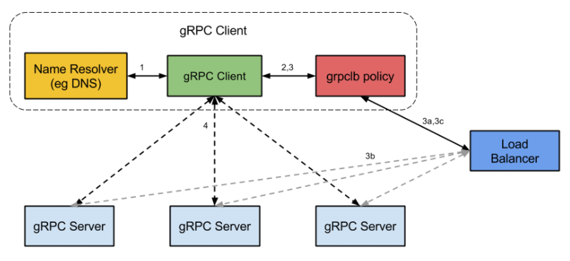
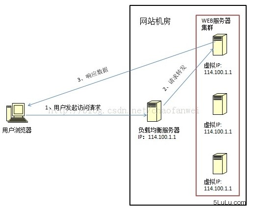

# 负载均衡（Load Balancer）

* 一组计算机节点（或者一组进程）提供相同的（同质的）服务，那么对服务的请求就应该均匀的分摊到这些节点上
* 当系统面临大量用户访问，负载过高的时候，通常会使用增加服务器数量来进行横向扩展，使用集群和负载均衡提高整个系统的处理能力
* 把用户访问的流量，通过「负载均衡器」，根据某种转发的策略，均匀的分发到后端多台服务器上，后端的服务器可以独立的响应和处理请求，从而实现分散负载的效果，负载均衡的关键在于将用户流量进行均衡减压的
* 让所有节点以最小的代价、最好的状态对外提供服务，这样系统吞吐量最大，性能更高，对于用户而言请求的时间也更小。
* 增强了系统的可靠性，提高了系统的服务能力，增强了应用的可用性 最大化降低了单个节点过载、甚至crash的概率

### 结构

每一个上游都均匀访问每一个下游，就能实现“将请求/数据【均匀】分摊到多个操作单元上执行”。

*【客户端层】到【反向代理层】的负载均衡，是通过“DNS轮询”实现的
*【反向代理层】到【站点层】的负载均衡，是通过“nginx”实现的
    - 请求轮询：和DNS轮询类似，请求依次路由到各个web-server；
    - 最少连接路由：哪个web-server的连接少，路由到哪个web-server；
    - ip哈希：按照访问用户的ip哈希值来路由web-server，只要用户的ip分布是均匀的，请求理论上也是均匀的，ip哈希均衡方法可以做到，同一个用户的请求固定落到同一台web-server上，此策略适合有状态服务，例如session；
*【站点层】到【服务层】的负载均衡，是通过“服务连接池”实现的
*【数据层】的负载均衡，要考虑“数据的均衡”与“请求的均衡”两个点
    - 按照范围水平切分:每一个数据服务，存储一定范围的数据： user0服务：存储uid范围1-1kw ser1服务：存储uid范围1kw-2kw
        - 这个方案的好处是：
            + 规则简单，service只需判断一下uid范围就能路由到对应的存储服务
            + 数据均衡性较好
            + 比较容易扩展，可以随时加一个uid[2kw,3kw]的数据服务
        + 不足：请求的负载不一定均衡，一般来说，新注册的用户会比老用户更活跃，大range的服务请求压力会更大
    - hash水平切分每一个数据服务，存储某个key值hash后的部分数据： user0服务：存储偶数uid数据 user1服务：存储奇数uid数据
        - 这个方案的好处是：
            + 规则简单，service只需对uid进行hash能路由到对应的存储服务
            + 数据均衡性较好
            + 请求均匀性较好
        - 不足是：不容易扩展，扩展一个数据服务，hash方法改变时候，可能需要进行数据迁移
* 客户端，根据服务节点的信息自行选择，然后将请求直接发送到选中的服务节点；
    - 知道服务器列表，要么是静态配置，要么有简单接口查询，
    - 但backend server的详细负载信息，就不适用通过客户端来查询。
    - 算法要么是比较简单的，比如轮训（加权轮训）、随机（加权随机）、哈希这几种算法，只要每个客户端足够随机，按照大数定理，服务节点的负载也是均衡的
    - 使用较为复杂的算法，比如根据backend的实际负载，那么就需要去额外的负载均衡服务（external load balancing service）查询到这些信息，在grpc中，就是使用的这种办法
        + load balancer与grpc server通信，获得grpc server的负载等具体详细
        + grpc client从load balancer获取这些信息，最终grpc client直连到被选择的grpc server。
* 服务节点集群之前放一个集中式代理（proxy），由代理负责请求求分发。
    - 7层的Nginx:response经过Proxy
    - 四层的F5、LVS:response不经过proxy，如LVS
    - 在于方便控制，而且能容易实现一些更精密，更复杂的算法。
    - 但缺点也很明显，
        - 负载均衡器本身可能成为性能瓶颈
        - 可能引入额外的延迟，请求一定先发到达负载均衡器，然后到达真正的服务节点。
    * load balancer proxy不能成为单点故障（single point of failure），因此一般会设计为高可用的主从结构
    * response也是走load balancer proxy的话，那么整个服务过程对客户端而言就是完全透明的，也防止了客户端去尝试连接后台服务器，提供了一层安全保障！
* 哪一种，至少都需要知道当前的服务节点列表这一基础信息。




### 方案

* HTTP重定向：权衡转移请求的开销和处理实际请求的开销，前者相对于后者越小，那么重定向的意义就越大
    - 缺陷
        + 吞吐率限制：主站点服务器的吞吐率平均分配到了被转移的服务器现假设使用RR（Round Robin）调度策略，子服务器的最大吞吐率为1000reqs/s，那么主服务器的吞吐率要达到3000reqs/s，主服务器的吞吐与子服务器吞吐匹配
        + 重定向访问深度不同
* 基于DNS负载均衡：可以实现在地域上的流量均衡,DNS服务器便充当负载均衡调度器。大型网站一般使用DNS作为第一级负载均衡 DNS节省了所谓的主站点，DNS服务器已经充当了主站点的职能。常见的策略是对多个A记录进行RR(轮询)
    - 在DNS服务器配置多个A记录，不同的DNS请求会解析到不同的IP地址 让DNS服务器根据不同地理位置的用户返回不同的IP
    - 相当于实现了按照「就近原则」将请求分流了，既减轻了单个集群的负载压力，也提升了用户的访问速度。
    - 配置简单，实现成本非常低，无需额外的开发和维护工作
    - 缺点：
        + 大多是基于地域或者干脆直接做IP轮询，没有更高级的路由策略，所以这也是DNS方案的局限所在，比如 无法将HTTP请求的上下文引入到调度策略中
        + DNS生效时间略长，当配置修改后，生效不及时。这个是由于DNS的特性导致的，DNS一般会有多级缓存，所以当修改了DNS配置之后，由于缓存的原因，会导致IP变更不及时，从而影响负载均衡的效果
* 基于硬件负载均衡：用于大型服务器集群中的负载需求，F5 Network Big-IP。完全通过硬件来抗压力，性能是非常的好。用在大型互联网公司的流量入口最前端
* 基于软件负载均衡：基于机器层面的流量均衡
    - 基于第四层传输层来做流量分发的方案称为4层负载均衡，LVS（Linux Virtual Server）：四层（传输层）负载均衡，通过报文中的目标地址和端口，支持 TCP/UDP 的负载均衡
        + LVS在Linux内核态获取到IP报文后，根据特定的负载均衡算法将IP报文转发到整个集群的某台服务器中去
        + 服务器集群系统有三个部分组成：
            * 最前端的负载均衡层，用 Load Balancer 表示
            * 中间的服务器集群层，用 Server Array 表示
            * 最底端的数据共享存储层，用 Shared Storage 表示
        + 转发主要通过修改 IP 地址（NAT 模式，分为源地址修改 SNAT 和目标地址修改 DNAT）、修改目标 MAC（DR 模式）来实现
            * NAT（Network Address Translation）是一种外网和内网地址映射的技术
                - 当包到达 LVS 时，LVS 做目标地址转换（DNAT），将目标 IP 改为 RS 的 IP。RS 接收到包以后，仿佛是客户端直接发给它的一样。RS 处理完，返回响应时，源 IP 是 RS IP，目标 IP 是客户端的 IP。这时 RS 的包通过网关（LVS）中转，LVS 会做源地址转换（SNAT），将包的源地址改为 VIP，这样，这个包对客户端看起来就仿佛是 LVS 直接返回给它的。
                - NAT服务器（前端服务器）必须作为实际服务器（后端服务器）的网关，否则数据包被转发后将一去不返
                - 从Linux2.4内核开始，其内置的Neftilter模块在内核中维护着一些数据包过滤表，这些表包含了用于控制数据包过滤的规则
                - Linux提供了iptables来对过滤表进行插入、修改和删除等操作。更加令人振奋的是，Linux2.6.x内核中内置了IPVS模块，它的工作性质类型于Netfilter模块，不过它更专注于实现IP负载均衡
                - `modprobe -l  | grep ipvs` 管理工具是ipvsadm
                    + `ipvsadm -A -t 111.11.11.11:80 -s rr`: 添加一台虚拟服务器，-t 后面是服务器的外网ip和端口，-s rr是指采用简单轮询的RR调度策略
                    + `ipvsadm -a -t 111.11.11.11:80 -r 10.10.120.210:8000 -m`  -r后面是实际服务器的内网ip和端口，-m表示采用NAT方式来转发数据包
                - 作为调度器的NAT服务器可以将吞吐率提升到一个新的高度，几乎是反向代理服务器的两倍以上，这大多归功于在内核中进行请求转发的较低开销。
                - 瓶颈:NAT服务器的网络带宽，包括内部网络和外部网络- 网络地址转换(NAT)负载均衡工作在传输层，对数据包中的IP地址和端口进行修改，从而达到转发的目的
            * DR 模式：直接路由，需要 LVS 和 RS 集群绑定同一个 VIP（RS 通过将 VIP 绑定在 loopback 实现），但与 NAT 的不同点在于：请求由 LVS 接受，由真实提供服务的服务器（RealServer，RS）直接返回给用户，返回的时候不经过 LVS。
                - 工作在数据链路层（第二层）,通过修改数据包的目标MAC地址（没有修改目标IP），将数据包转发到实际服务器上，不同的是，实际服务器的响应数据包将直接发送给客户羰，而不经过调度器。
                - 一个请求过来时，LVS 只需要将网络帧的 MAC 地址修改为某一台 RS 的 MAC，该包就会被转发到相应的 RS 处理，注意此时的源 IP 和目标 IP 都没变，LVS 只是做了一下移花接木。RS 收到 LVS 转发来的包时，链路层发现 MAC 是自己的，到上面的网络层，发现 IP 也是自己的，于是这个包被合法地接受，RS 感知不到前面有 LVS 的存在。而当 RS 返回响应时，只要直接向源 IP（即用户的 IP）返回即可，不再经过 LVS。
                - 数据分发过程中不修改 IP 地址，只修改 mac 地址，由于实际处理请求的真实物理 IP 地址和数据请求目的 IP 地址一致，所以不需要通过负载均衡服务器进行地址转换，可将响应数据包直接返回给用户浏览器，避免负载均衡服务器网卡带宽成为瓶颈。因此，DR 模式具有较好的性能，也是目前大型网站使用最广泛的一种负载均衡手段。
                - 相较于LVS-NAT的最大优势在于LVS-DR不受调度器宽带的限制
            * LVS-TUN:基于IP隧道的请求转发机制：将调度器收到的IP数据包封装在一个新的IP数据包中，转交给实际服务器，然后实际服务器的响应数据包可以直接到达用户端。
                - 与LVS-DR不同的是，实际服务器可以和调度器不在同一个WANt网段，调度器通过IP隧道技术来转发请求到实际服务器，所以实际服务器也必须拥有合法的IP地址。
            * LVS-DR和LVS-TUN都适合响应和请求不对称的Web服务器，如何从它们中做出选择，取决于你的网络部署需要，因为LVS-TUN可以将实际服务器根据需要部署在不同的地域，并且根据就近访问的原则来转移请求，所以有类似这种需求的，就应该选择LVS-TUN。
        + 优点
            * 抗负载能力强、是工作在传输层上仅作分发之用，没有流量的产生，这个特点也决定了它在负载均衡软件里的性能最强的，对内存和 cpu 资源消耗比较低。
            * 配置性比较低，这是一个缺点也是一个优点，因为没有可太多配置的东西，所以并不需要太多接触，大大减少了人为出错的几率。
            * 工作稳定，因为其本身抗负载能力很强，自身有完整的双机热备方案，如 LVS + Keepalived。
            * 无流量，LVS 只分发请求，而流量并不从它本身出去，这点保证了均衡器 IO 的性能不会受到大流量的影响。
            * 应用范围比较广，因为 LVS 工作在传输层，所以它几乎可以对所有应用做负载均衡，包括 http、数据库、在线聊天室等等。
        + 缺点
            * LVS的性能依赖Linux内核的网络性能，但Linux内核的网络路径过长导致了大量开销，使得LVS单机性能较低。
            * 软件本身不支持正则表达式处理，不能做动静分离；而现在许多网站在这方面都有较强的需求，这个是 Nginx、HAProxy + Keepalived 的优势所在。
            * 如果是网站应用比较庞大的话，LVS/DR + Keepalived 实施起来就比较复杂了，相对而言，Nginx / HAProxy + Keepalived 就简单多了。
    - 基于第七层应用层来做流量分发的称为7层负载均衡  反向代理负载均衡
        + 核心工作是转发HTTP，它工作在HTTP层面，因此，基于反向代理的负载均衡也称为七层负载均衡
        + 任何对于实际服务器的HTTP请求都必须经过调度器
        + 调度器必须等待实际服务器的HTTP响应，并将它反馈给用户
        + 特性：
            * 调度策略丰富
            * 对反向代理服务器的并发处理能力要求高，因为它工作在HTTP层面。
            * 反向代理服务器进行转发操作本身是需要一定开销的，比如创建线程、与后端服务器建立TCP连接、接收后端服务器返回的处理结果、分析HTTP头部信息、用户空间和内核空间的频繁切换等，虽然这部分时间并不长，但是当后端服务器处理请求的时间非常短时，转发的开销就显得尤为突出。例如请求静态文件，更适合使用前面介绍的基于DNS的负载均衡方式。
            * 反向代理服务器可以监控后端服务器，比如系统负载、响应时间、是否可用、TCP连接数、流量等，从而根据这些数据调整负载均衡的策略。
            * 反射代理服务器可以让用户在一次会话周期内的所有请求始终转发到一台特定的后端服务器上（粘滞会话），这样的好处一是保持session的本地访问，二是防止后端服务器的动态内存缓存的资源浪费。
        + Nginx：七层负载均衡 ，也称为“内容交换”，也就是主要通过报文中的真正有意义的应用层内容
            * 传统
                - 相对于传统基于进程或线程的模型（Apache就采用这种模型）在处理并发连接时会为每一个连接建立一个单独的进程或线程，且在网络或者输入/输出操作时阻塞
                - 这将导致内存和 CPU 的大量消耗，因为新起一个单独的进程或线程需要准备新的运行时环境，包括堆和栈内存的分配，以及新的执行上下文，当然，这些也会导致多余的 CPU 开销。最终，会由于过多的上下文切换而导致服务器性能变差。
            * Nginx 的架构设计是采用模块化的、基于事件驱动、异步、单线程且非阻塞
    - HAProxy：支持两种代理模式 TCP（四层）和HTTP（七层），也是支持虚拟主机的
        + 优点能够补充 Nginx 的一些缺点，比如支持 Session 的保持，Cookie 的引导；同时支持通过获取指定的 url 来检测后端服务器的状态。
        + 本身就只是一款负载均衡软件；单纯从效率上来讲 HAProxy 会比 Nginx 有更出色的负载均衡速度，在并发处理上也是优于 Nginx 的。
        + 支持 TCP 协议的负载均衡转发，可以对 MySQL 读进行负载均衡，对后端的 MySQL 节点进行检测和负载均衡，大家可以用 LVS+Keepalived 对 MySQL 主从做负载均衡。
        + 均衡策略非常多：Round-robin（轮循）、Weight-round-robin（带权轮循）、source（原地址保持）、RI（请求URL）、rdp-cookie（根据cookie）
    - 日 PV 小于1000万，用 Nginx 就完全可以了；如果机器不少，可以用 DNS 轮询，LVS 所耗费的机器还是比较多的；大型网站或重要的服务，且服务器比较多时，可以考虑用 LVS。
    - 合理流行的架构方案：Web 前端采用 Nginx/HAProxy+Keepalived 作负载均衡器；后端采用 MySQ L数据库一主多从和读写分离，采用 LVS+Keepalived 的架构。

* Google于2016年3月最新公布的负载均衡Maglev
    - Maglev是谷歌为自己的数据中心研发的解决方案，并于2008开始用于生产环境。在第十三届网络系统设计与实现USENIX研讨会（NSDI '16）上， 来自谷歌、加州大学洛杉矶分校、SpaceX公司的工程师们分享了这一商用服务器负载均衡器Maglev的详细信息
    - Maglev安装后不需要预热5秒内就能应付每秒100万次请求令人惊叹不已。在谷歌的性能基准测试中，Maglev实例运行在一个8核CPU下，网络吞吐率上限为12M PPS(数据包每秒)，如果Maglev使用Linux内核网络堆栈则速度会小于4M PPS。
* 国内云服务商 UCloud 进一步迭代了负载均衡产品----Vortex，成功地提升了单机性能
    - 在技术实现上，UCloud Vortex与Google Maglev颇为相似。以一台普通性价比的x86 1U服务器为例，Vortex可以实现吞吐量达14M PPS(10G, 64字节线速)，新建连接200k CPS以上，并发连接数达到3000万、10G线速的转发。

## [Keepalived 原理介绍和配置实践](https://wsgzao.github.io/post/keepalived/)

### 算法

* 衡量标准
    - 是否意识到不同节点的服务能力是不一样的，比如CPU、内存、网络、地理位置
    - 是否意识到节点的服务能力是动态变化的，高配的机器也有可能由于一些突发原因导致处理速度变得很慢
    - 是否考虑将同一个客户端，或者说同样的请求分发到同一个处理节点，这对于“有状态”的服务非常重要，比如session，比如分布式存储
    - 谁来负责负载均衡，即谁充当负载均衡器（load balancer），balancer本身是否会成为瓶颈
* 方案
    - 轮询算法（round-robin）：提供同质服务的节点逐个对外提供服务，这样能做到绝对的均衡.
        - 没有考虑到节点的差异
    - 加权轮询算法（weight round-robin）:在轮训算法的基础上，考虑到机器的差异性，分配给机器不同的权重.依赖于请求的类型，比如计算密集型，那就考虑CPU、内存；如果是IO密集型，那就考虑磁盘性能
    - 随机算法（random）:随机选择一个节点服务，按照概率，只要请求数量足够多，那么也能达到绝对均衡的效果
    - 加权随机算法（random）:在随机的时候引入不同节点的权重
    - 哈希法（hash）：根据客户端的IP，或者请求的“Key”，计算出一个hash值，然后对节点数目取模。好处就是，同一个请求能够分配到同样的服务节点，这对于“有状态”的服务很有必要
        + 当节点的数目发生变化的时候，请求会大概率分配到其他的节点，引发到一系列问题
    - 一致性哈希算法：一个物理节点与多个虚拟节点映射，在hash的时候，使用虚拟节点数目而不是物理节点数目。当物理节点变化的时候，虚拟节点的数目无需变化，只涉及到虚拟节点的重新分配。而且，调整每个物理节点对应的虚拟节点数目，也就相当于每个物理节点有不同的权重
    - 最少连接算法（least connection）：根据节点的真实负载，动态地调整节点的权重就非常重要。当然，要获得接节点的真实负载也不是一概而论的事情，如何定义负载，负载的收集是否及时，
        + 每个节点当前的连接数目是一个非常容易收集的指标，因此lease connection是最常被人提到的算法
    - 响应策略：将请求转发给当前时刻响应最快的后端服务器。
        + 不停的去统计每一台后端服务器对请求的处理速度了

```python
SERVER_LIST = [
      '10.246.10.1',
     '10.246.10.2',
     '10.246.10.3',
 ]
 def round_robin(server_lst, cur = [0]):
     length = len(server_lst)
     ret = server_lst[cur[0] % length]
     cur[0] = (cur[0] + 1) % length
     return ret

 WEIGHT_SERVER_LIST = {
     '10.246.10.1': 1,
     '10.246.10.2': 3,
     '10.246.10.3': 2,
 }
 def weight_round_robin(servers, cur = [0]):
     weighted_list = []
     for k, v in servers.iteritems():
         weighted_list.extend([k] * v)

     length = len(weighted_list)
     ret = weighted_list[cur[0] % length]
     cur[0] = (cur[0] + 1) % length
     return ret

def random_choose(server_lst):
    import random
    random.seed()
    return random.choice(server_lst)

def weight_random_choose(servers):
    import random
    random.seed()
    weighted_list = []
    for k, v in servers.iteritems():
        weighted_list.extend([k] * v)
    return random.choice(weighted_list)

# 如果节点列表以及权重变化不大，那么也可以对所有节点归一化，然后按概率区间选择
def normalize_servers(servers):
    normalized_servers = {}
    total = sum(servers.values())
    cur_sum = 0
    for k, v in servers.iteritems():
        normalized_servers[k] = 1.0 * (cur_sum + v) / total
        cur_sum += v
    return normalized_servers

def weight_random_choose_ex(normalized_servers):
    import random, operator
    random.seed()
    rand = random.random()
    for k, v in sorted(normalized_servers.iteritems(), key = operator.itemgetter(1)):
        if v >= rand:
            return k
    else:
        assert False, 'Error normalized_servers with rand %s ' % rand

def hash_choose(request_info, server_lst):
     hashed_request_info = hash(request_info)
     return server_lst[hashed_request_info % len(server_lst)]
```

## 模型

* 负载均衡是一种推模型，一定会选出一个服务节点，然后把请求推送过来
* 消息队列，就变成了拉模型：空闲的服务节点主动去拉取请求进行处理，各个节点的负载自然也是均衡的。
    - 务节点不会被大量请求冲垮，同时增加服务节点更加容易
    - 缺点也很明显，请求不是事实处理的。

## 参考

* [dianping/camel](https://github.com/dianping/camel):软负载一体解决方案，承担了F5硬负载层后的软负载工作
* [ilium/cilium](https://github.com/cilium/cilium):API Aware Networking and Security using BPF and XDP

负载均衡、分布式、集群：<https://www.zhihu.com/question/34184276>
<https://www.zhihu.com/question/22610352>
