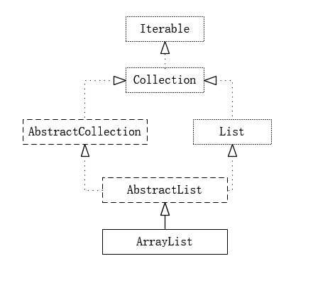

# 面向对象程序设计语言 OOP

* 目的：提高代码的可读性、可扩展性、复用性、可维护性
* 最重要思想:代码重用
    - 代码复用性（Code Reusability）：从代码开发者角度来讲
    - 代码复用（Code Resue）：从代码使用者角度来讲
    - DRY 原则：“不重复”并不代表“可复用”
    - 规则
        + 减少代码耦合
        + 满足单一职责原则
        + 模块化
        + 业务与非业务逻辑分离：越是跟业务无关的代码越是容易复用，越是针对特定业务的代码越难复用
        + 通用代码下沉
        + 利用面对对象特性
            * 利用继承，将公共的代码抽取到父类，子类复用父类的属性和方法
            * 多态，动态地替换一段代码的部分逻辑，让这段代码可复用
            * 越抽象、越不依赖具体的实现，越容易复用
            * 封装成模块，隐藏可变的细节、暴露不变的接口，就越容易复用。
        + 应用模板等设计模式

* 越抽象、越顶层、越脱离具体某一实现的设计，越能提高代码的灵活性，越能应对未来的需求变化
* 好的代码设计，不仅能应对当下的需求，而且在将来需求发生变化的时候，仍然能够在不破坏原有代码设计的情况下灵活应对。
* 时刻具备扩展、抽象、封装意识
* 一个好的OO设计是与领域概念相符的。每个类首先需要一个“职责”：它定义了一个类“是什么”。职责帮助理解类的价值、行为和边界
* 一个好的类也该有且仅有一个“职责”(SRP)

* 开发时需要不停地在两个空间中转换角色
    - 问题空间（包括用户角色、使用场景和具体需求）
    - 解决方案空间（通过组合各种软件组件来满足用户需求）
* 从混乱中发现概念
* 定义职责
* 建立秩序

## Plain Old Java Object POJO

* 培养面向对象的思维的核心就是站在问题领域看用纯类来表达和解决问题

## 对象

* 数据与行为应该封装在一起：在分辨对象职责的时候,首要需判断该职责需要对哪些数据进行操作,进而就可以将该职责分配给这些数据的拥有者
* 对象通过类来描绘

### 封装 Encapsulation

* 目的
    - 信息隐藏,包括隐藏数据、实现细节，设计细节以及对象的类型等
    - 恰当地公开接口
    - 将接口和实现分开，增强可维护性；（实现细节改变时，使用该类的客户端程序不需要改变）
* 分类
    - 结构封装：数据 类型
    - 业务封装 实现 多态
* 实现
    - 使得对象内部的变化对其他对象而言是不可见的，对象对其自己的行为负责，使得对象之间的耦合变得松散
    - 对象之间只通过暴露API接口来通信，修改一个对象时，可以随意地修改它的内部实现，只要对外的接口没有变化，就不会影响到程序的其它功能
* 把系统中稳定不变的部分和容易变化的部分隔离开来，在系统的演变过程中，只需要替换那些容易变化的部分

### 继承 Inheritance

* 功能
    - 描述联结类的层次模型
    - 通过抽象,表达共性，实现类的重用
    - 表示 is-a 关系
    - 支持多态特性：通过子类增加方法和属性以及重写方法,表达差异性
    - 代码复用（组合也可以实现）
* 缺点
    - 过度使用继承，继承层次过深过复杂，就会导致代码可读性、可维护性变差

## 抽象 Abstraction

* 构造出一个固定的一组行为的抽象描述，这组行为却能够有任意个可能的具体实现方式
    - 用来表征对问题领域进行分析、设计中得出的抽象概念，是对一系列看上去不同，但是本质上相同的具体概念的抽象
    - 领域没有对应的具体概念，所以用以表征抽象概念的抽象类是不能够实例化
* 作用
    - 类型隐藏
* 实现
    - 借助接口类或者抽象类语法机制
    - 作为一种只关注功能点不关注实现的设计思路，在定义类的方法的时候，要有抽象思维，不要在方法定义中，暴露太多的实现细节，以保证在某个时间点需要改变方法的实现逻辑的时候，不用去修改其定义

### 多态 Polymorphism

* polymorphism (from Greek πολύς, polys, "many, much" and μορφή, morphē, "form, shape") is the provision of a single interface to entities of different types. A polymorphic type is one whose operations can also be applied to values of some other type, or types.
* 对一个操作（接口）使用多种数据类型
* 条件
    - 支持父类对象可以引用子类对象
        + 实现与声明绑定
        + 实例化实现类
    - 支持继承
    - 子类可以重写父类中的方法
* 思想: 将"做什么"和"谁去做以及怎么去做"分离开来，也就是将"不变的事"和"可变的事物"分离开来
* 实现
    - 通过接口类实现
    - duck-typing：只要定义了相同的方法
* 作用
    - 屏蔽子类的差异性，针对共性/接口编程
    - 消除类型之间的耦合关系
    - 提高代码可扩展性和复用性

## OOA vs OOP

* 面向过程风格的代码被组织成了一组方法集合及其数据结构（struct User），方法和数据结构的定义是分开的
    - 开发的微小程序，或者是一个数据处理相关的代码，以算法为主，数据为辅，那脚本式的面向过程的编程风格就更适合一些
* 面向对象风格的代码被组织成一组类，方法和数据结构被绑定一起，定义在类中
    - 先去思考如何给业务建模，如何将需求翻译为类，如何给类之间建立交互关系，而完成这些工作完全不需要考虑错综复杂的处理流程
    - 有了类的设计之后，然后再像搭积木一样，按照处理流程，将类组装起来形成整个程序
    - 提供了一种更加清晰的、更加模块化的代码组织方式
* 面向过程编程是面向对象编程的基础，面向对象编程离不开基础的面向过程编程
* 最终的目的还是写出易维护、易读、易复用、易扩展的高质量代码

## 分层

* 通过规定好的接口进行交互，每一层其实对它的上层或下层都是一个黑盒，不关心它内部的实现，只关心它们之间进行交互的接口，接口是规定的信息，要给到什么都是规定好的。
* 优点
    - 可以对任何一层进行独立升级、优化，只要保持接口不变那么这个模型整体就不会有问题，比如说物理层从以太网线到光纤，网络速度大大提高，但是整个技术革新的时候，其他层是没有做更多工作的，工作只在物理层完成
    - 代码复用
    - 隔离变化
    - 隔离关注点
    - 提高代码的可测试性
    - 应对系统的复杂性
* MVC：M 表示 Model，V 表示 View，C 表示 Controller
* 前后端
    - UserEntity 和 UserRepository 组成了数据访问层 负责数据读写
    - UserBo（Business Object）和 UserService 组成了业务逻辑层 负责核心业务逻辑
        + Service 类主要职责
            * 负责与 Repository 交流：不用BO 与 Repository 打交道，因为想保持领域模型的独立性，不与任何其他层的代码（Repository 层的代码）或开发框架（比如 Spring、MyBatis）耦合在一起，将流程性的代码逻辑（比如从 DB 中取数据、映射数据）与领域模型的业务逻辑解耦，让领域模型更加可复用。
            * 负责跨领域模型的业务聚合功能
            * 负责一些非功能性及与三方系统交互的工作。比如幂等、事务、发邮件、发消息、记录日志、调用其他系统的 RPC 接口等
    - UserVo（View Object） 和 UserController 属于接口层 负责暴露接口给前端调用
        + VO 是一种 DTO（Data Transfer Object，数据传输对象）。它主要是作为接口的数据传输承载体，将数据发送给其他系统。从功能上来讲，它理应不包含业务逻辑、只包含数据
    - VO、BO、Entity 中只会定义数据，不会定义方法，所有操作这些数据的业务逻辑都定义在对应的 Controller 类、Service 类、Repository 类中
* 贫血模型（Anemic Domain Model）:像 UserBo 这样，只包含数据，不包含业务逻辑的类
* 充血模型（Rich Domain Model）:数据和对应的业务逻辑被封装到同一个类中
* DDD 领域驱动设计:指导如何解耦业务系统，划分业务模块，定义业务领域模型及其交互
    - Service 层包含 Service 类和 Domain 类两部分。Domain 就相当于贫血模型中的 BO。不过，Domain 与 BO 的区别在于它是基于充血模型开发的，既包含数据，也包含业务逻辑。而 Service 类变得非常单薄。
    - 基于贫血模型的传统的开发模式，重 Service 轻 BO；基于充血模型的 DDD 开发模式，轻 Service 重 Domain
    - 充血在哪个层次
    - Bo:可以在更小颗粒度层面上进行封装与添加复杂逻辑
    - Controller 层主要负责接口的暴露，Repository 层主要负责与数据库打交道，这两层包含的业务逻辑并不多,不需要做充血模型
* 平时的开发，大部分都是 SQL 驱动（SQL-Driven）的开发模式.业务逻辑包裹在一个大的 SQL 语句中，而 Service 层可以做的事情很少

```
////////// Controller+VO(View Object) //////////
public class UserController {
  private UserService userService; //通过构造函数或者IOC框架注入

  public UserVo getUserById(Long userId) {
    UserBo userBo = userService.getUserById(userId);
    UserVo userVo = [...convert userBo to userVo...];
    return userVo;
  }
}

public class UserVo {//省略其他属性、get/set/construct方法
  private Long id;
  private String name;
  private String cellphone;
}

////////// Service+BO(Business Object) //////////
public class UserService {
  private UserRepository userRepository; //通过构造函数或者IOC框架注入

  public UserBo getUserById(Long userId) {
    UserEntity userEntity = userRepository.getUserById(userId);
    UserBo userBo = [...convert userEntity to userBo...];
    return userBo;
  }
}

public class UserBo {//省略其他属性、get/set/construct方法
  private Long id;
  private String name;
  private String cellphone;
}

////////// Repository+Entity //////////
public class UserRepository {
  public UserEntity getUserById(Long userId) { //... }
}

public class UserEntity {//省略其他属性、get/set/construct方法
  private Long id;
  private String name;
  private String cellphone;
}
```

### 抽象类 vs 接口

* 抽象类
    - 特点
        + 不允许被实例化，只能被继承。
        + 继承抽象类，必须实现抽象类中的所有抽象方法
        + 抽象类可以包含属性和方法。方法既可以包含代码实现，也可以不包含代码实现，不包含代码实现的方法叫作抽象方法
    - 用处
        + 也可代码复用，相比父类继承用空方法代替抽象方法
            * 影响代码的可读性
            * 忘记实现，编译器报错
            * 空方法被误用
        + 一种自下而上的设计思路，先有子类的代码重复，然后再抽象成上层的父类
* 接口
    - 特点
        + 接口不能包含属性（也就是成员变量）
        + 接口只能声明方法，方法不能包含代码实现
        + 类实现接口的时候，必须实现接口中声明的所有方法
        + 实现多个interface
    - 用处
        + 解耦：对行为的一种抽象，相当于一组协议或者契约。调用者只需要关注抽象的接口，不需要了解具体的实现，具体的实现代码对调用者透明。接口实现了约定和实现相分离，可以降低代码间的耦合性，提高代码的可扩展性。
        + 一种自上而下的设计思路。在编程的时候，一般都是先设计接口，再去考虑具体的实现
    - 定义中，方法不能拥有默认行为，为了绕过这个限制，必须使用委托，但是这会增加一些复杂性，有时会造成很大的麻烦
    - interface中不能定义默认行为还存在另一个比较严重的问题，那就是可能会造成维护上的麻烦。因为如果后来想修改类的界面（一般通过abstract class或者interface来表示）以适应新的情况（比如，添加新的方法或者给已用的方法中添加新的参数）时，就会非常的麻烦，可能要花费很多的时间（对于派生类很多的情况，尤为如此）。但是如果界面是通过abstract class来实现的，那么可能就只需要修改定义在abstract class中的默认行为就可以了。
    - 如果不能在抽象类中定义默认行为，就会导致同样的方法实现出现在该抽象类的每一个派生类中，违反了"one rule，one place"原则，造成代码重复，同样不利于以后的维护
* 场景
    - 抽象类：表示一种 is-a 的关系，并且是为了解决代码复用的问题
    - 接口：表示一种 has-a 关系，表示具有某一组行为特性 并且是为了解决抽象（抽象类型的共性）而非代码复用的问题
    - 在使用抽象类的场合，不要忽视通过接口定义行为模型的原则

* 抽象类和接口都不能直接实例化，如果要实例化，抽象类变量必须指向实现所有抽象方法的子类对象，接口变量必须指向实现所有接口方法的类对象。
* 接口里定义的变量只能是公共的静态的常量，抽象类中的变量是普通变量。
* 抽象类里的抽象方法必须全部被子类所实现，如果子类不能全部实现父类抽象方法，那么该子类只能是抽象类。同样，一个实现接口的时候，如不能全部实现接口方法，那么该类也只能为抽象类
* 抽象方法要被实现，所以不能是静态的，也不能是私有的

功能          | 抽象类                                                   | 接口
----------- | ----------------------------------------------------- | -----------------------------------------
默认的方法实现     | 可以有默认的方法实现                                            | 接口完全是抽象的。它根本不存在方法的实现
实现          | 子类使用extends关键字来继承抽象类。如果子类不是抽象类的话，它需要提供抽象类中所有声明的方法的实现。 | 子类使用关键字implements来实现接口。它需要提供接口中所有声明的方法的实现
构造器         | 抽象类可以有构造器                                             | 接口不能有构造器
与正常Java类的区别 | 除了你不能实例化抽象类之外，它和普通Java类没有任何区别                         | 接口是完全不同的类型
访问修饰符       | 抽象方法可以有public、protected和default这些修饰符                  | 接口方法默认修饰符是public。你不可以使用其它修饰符。
main方法      | 抽象方法可以有main方法并且我们可以运行它                                | 接口没有main方法，因此我们不能运行它。
多继承         | 抽象方法可以继承一个类和实现多个接口                                    | 接口只可以继承一个或多个其它接口
速度          | 它比接口速度要快                                              | 接口是稍微有点慢的，因为它需要时间去寻找在类中实现的方法。
添加新方法       | 如果你往抽象类中添加新的方法，你可以给它提供默认的实现。因此你不需要改变你现在的代码。           | 如果你往接口中添加方法，那么你必须改变实现该接口的类。

实例： 

```java
abstract class Door {
    abstract void open();
    abstract void close()；
}

interface Alarm {
    void alarm();
}

class AlarmDoor extends Door implements Alarm {
    void open() { … }
    void close() { … }
    void alarm() { … }
}
```

## 基于接口而非实现编程

* 另一个表述方式、是“基于抽象而非实现编程”
* “接口”在不同的应用场景下会有不同的解读，比如服务端与客户端之间的“接口”，类库提供的“接口”，甚至是一组通信的协议都可以叫作“接口”。
* 实现
    - 函数的命名不能暴露任何实现细节
    - 封装具体的实现细节
    - 为实现类定义抽象的接口
* 只要搞清楚了每条原则是为了解决什么样的问题而产生的
* 接口继承要远重要于类继承
    - 一种控制反转:通过抽象出一系列接口，并在这些接口上进行操作，使得控制逻辑不依赖于具体的实现
    - 具体的实现可以并不关心控制逻辑如何使用自己，它们会在需要的时候被调用。由此，使用对象的逻辑和对象本身充分解耦，由接口这座桥梁将二者联系起来。这样，代码得到了最大程度的被重用。
    - Liskov substitution principle（里氏变换原则）:if S is a subtype of T, then objects of type T may be replaced with objects of type S

## 组合优于继承

* 继承为实现不同功能，通过不断继承的方法赵成继承层次过深、继承关系过于复杂，会影响到代码的可读性和可维护性
    - 依赖于抽象类来定义行为，导致过于复杂的继承关系，而通过接口定义行为能够有效地分离行为与实现
* 通过组合、接口、委托三个技术手段可以替换掉继承,代码复用可以通过组合和委托来实现
* 组合可以通过注入实现
* 判断
    - 继承改写成组合意味着要做更细粒度的类的拆分
    - 如果类之间的继承结构稳定（不会轻易改变），继承层次比较浅（比如，最多有两层继承关系），继承关系不复杂，就可以大胆地使用继承
    - 系统越不稳定，继承层次很深，继承关系复杂，就尽量使用组合来替代继承。

```
public interface Flyable {
    void fly()；
}
public class FlyAbility implements Flyable {
    @Override public void fly() {
        //...
    }
}

public class Ostrich implements Tweetable, EggLayable {//鸵鸟
    private TweetAbility tweetAbility = new TweetAbility(); //组合

    @Override
    public void tweet() {
        tweetAbility.tweet(); // 委托
    }
```

## 面向对象分析（OOA）

* 要有组件化意识、框架意识、抽象意识，开发出来的东西要足够通用，不能局限于单一的某个业务需求，但这并不代表我们就可以脱离具体的应用场景，闷头拍脑袋做需求分析
* 添加鉴权功能
    - 通过用户名加密码来做认证
    - 借助 OAuth 的验证思路来解决：调用方将请求接口的 URL 跟 AppID、密码拼接在一起，然后进行加密，生成一个 token。调用方在进行接口请求的的时候，将这个 token 及 AppID，随 URL 一块传递给微服务端。微服务端接收到这些数据之后，根据 AppID 从数据库中取出对应的密码，并通过同样的 token 生成算法，生成另外一个 token。用这个新生成的 token 跟调用方传递过来的 token 对比
    - 进一步优化 token 生成算法，引入一个随机变量，让每次接口请求生成的 token 都不一样。将 URL、AppID、密码、时间戳四者进行加密来生成 token。验证当前时间戳跟传递过来的时间戳，是否在一定的时间窗口内（比如一分钟）
    - 像鉴权这样的非业务功能，最好不要与具体的第三方系统有过度的耦合：针对 AppID 和密码的存储，我们最好能灵活地支持各种不同的存储方式，比如 ZooKeeper、本地配置文件、自研配置中心、MySQL、Redis 等

## 面向对象设计（OOD）

* 用接口抽象出类的特性
* 用抽象类来复用代码

* 把合适的代码放到合适的类中。合理地划分代码可以实现代码的高内聚、低耦合，类与类之间的交互简单清晰，代码整体结构一目了然
* 划分职责进而识别出有哪些类
    - 把需求描述中的名词罗列出来，作为可能的候选类，然后再进行筛选
    - 根据需求描述，把其中涉及的功能点，一个一个罗列出来，然后再去看哪些功能点职责相近，操作同样的属性，可否应该归为同一个类
* 定义类及其属性和方法
* 定义类与类之间的交互关系
    - UML 统一建模语言中定义了六种类之间的关系
        + 泛化（Generalization）:继承关系
        + 实现（Realization）指接口和实现类之间的关系
        + 关联（Association）是一种非常弱的关系，包含聚合、组合两种关系。具体到代码层面，如果 B 类对象是 A 类的成员变量，那 B 类和 A 类就是关联关系。
        + 聚合（Aggregation）是一种包含关系，A 类对象包含 B 类对象，B 类对象的生命周期可以不依赖 A 类对象的生命周期，也就是说可以单独销毁 A 类对象而不影响 B 对象。比如课程与学生之间的关系
        + 组合（Composition）也是一种包含关系。A 类对象包含 B 类对象，B 类对象的生命周期跟依赖 A 类对象的生命周期，B 类对象不可单独存在，比如鸟与翅膀之间的关系
        + 依赖（Dependency）是一种比关联关系更加弱的关系，包含关联关系。不管是 B 类对象是 A 类对象的成员变量，还是 A 类的方法使用 B 类对象作为参数或者返回值、局部变量，只要 B 类对象和 A 类对象有任何使用关系
    - 上下层系统之间的调用倾向于通过同步接口，同层之间的调用倾向于异步消息调用。
* 将类组装起来并提供执行入口。

## 单一职责原则 SRP Single Responsibility Principle

* 概念：A class or module should have a single reponsibility
* 不要设计大而全的类，要设计粒度小、功能单一的类
* 不同的应用场景、不同阶段的需求背景下，对同一个类的职责是否单一的判定，可能都是不一样的。
* 持续重构：可以先写一个粗粒度的类，满足业务需求。随着业务的发展，如果粗粒度的类越来越庞大，代码越来越多，这个时候，就可以将这个粗粒度的类，拆分成几个更细粒度的类
* 判断原则
    - 类中的代码行数、函数或属性过多，会影响代码的可读性和可维护性，就需要考虑对类进行拆分。行数最好不能超过 200 行，函数个数及属性个数都最好不要超过 10 个
    - 类依赖的其他类过多，或者依赖类的其他类过多，不符合高内聚、低耦合的设计思想，就需要考虑对类进行拆分；
    - 私有方法过多，就要考虑能否将私有方法独立到新的类中，设置为 public 方法，供更多的类使用，从而提高代码的复用性；
    - 比较难给类起一个合适名字，很难用一个业务名词概括，或者只能用一些笼统的 Manager、Context 之类的词语来命名，这就说明类的职责定义得可能不够清晰；
    - 类中大量的方法都是集中操作类中的某几个属性，比如，在 UserInfo 例子中，如果一半的方法都是在操作 address 信息，那就可以考虑将这几个属性和对应的方法拆分出来。

## 开闭原则 OCP Open Closed Principle

* software entities (modules, classes, functions, etc.) should be open for extension , but closed for modification。
* 只要它没有破坏原有的代码的正常运行，没有破坏原有的单元测试
* 代码的扩展性问题，是判断一段代码是否易扩展的“金标准”
    - 一些比较确定的、短期内可能就会扩展，或者需求改动对代码结构影响比较大的情况，或者实现成本不高的扩展点，在编写代码的时候之后，就可以事先做些扩展性设计
    - 可变部分封装起来，隔离变化，提供抽象化的不可变接口，给上层系统使用
* 需要在扩展性和可读性之间做权衡

## 里式替换原则 LSP Liskov Substitution Principle

* If S is a subtype of T, then objects of type T may be replaced with objects of type S, without breaking the program。
* 子类对象（object of subtype/derived class）能够替换程序（program）中父类对象（object of base/parent class）出现的任何地方，并且保证原来程序的逻辑行为（behavior）不变及正确性不被破坏。
* 多态和里式替换有点类似，但它们关注的角度是不一样的
    - 多态是面向对象编程的一大特性，也是面向对象编程语言的一种语法。它是一种代码实现的思路。
    - 里式替换是一种设计原则，是用来指导继承关系中子类该如何设计的，子类的设计要保证在替换父类的时候，不改变原有程序的逻辑以及不破坏原有程序的正确性。
* Design By Contract：按照协议来设计
    - 父类定义了函数的行为约定，那子类可以改变函数的内部实现逻辑，但不能改变函数原有的行为约定。这里的行为约定包括
        + 函数声明要实现的功能
        + 对输入、输出、异常的约定
        + 甚至包括注释中所罗列的任何特殊说明

## 接口隔离原则 ISP Interface Segregation Principle

* Clients should not be forced to depend upon interfaces that they do not use。
* 接口概念
    - 一组 API 接口集合:如果部分接口只被部分调用者使用，那就需要将这部分接口隔离出来，单独给对应的调用者使用，而不是强迫其他调用者也依赖这部分不会被用到的接口
    - 单个 API 接口或函数:函数的设计要功能单一，不要将多个不同的功能逻辑在一个函数中实现
    - OOP 中的接口概念:接口的设计要尽量单一，不要让接口的实现类和调用者，依赖不需要的接口函数
        + 职责单一就意味了通用、复用性好 更加灵活
* 接口隔离原则与单一职责原则的区别
    - 单一职责原则针对的是模块、类、接口的设计
    - 接口隔离原则相对于单一职责原则
        + 一方面更侧重于接口的设计
        + 另一方面它的思考角度也是不同的。接口隔离原则提供了一种判断接口的职责是否单一的标准：通过调用者如何使用接口来间接地判定。如果调用者只使用部分接口或接口的部分功能，那接口的设计就不够职责单一。

## 迪米特法则 LOD Law of Demeter

* Each unit should have only limited knowledge about other units: only units “closely” related to the current unit. Or: Each unit should only talk to its friends; Don’t talk to strangers.
* 不该有直接依赖关系的类之间，不要有依赖；有依赖关系的类之间，尽量只依赖必要的接口（也就是定义中的“有限知识”）
* 实现代码的“高内聚、松耦合”
    - 高内聚：相近的功能应该放到同一个类中，不相近的功能不要放到同一个类中
    - 松耦合：类与类之间的依赖关系简单清晰
    - “高内聚”用来指导类本身的设计，“松耦合”用来指导类与类之间依赖关系的设计。

```java
# 既不想违背高内聚的设计思想，也不想违背迪米特法则
public interface Serializable {
  String serialize(Object object);
}

public interface Deserializable {
  Object deserialize(String text);
}

public class Serialization implements Serializable, Deserializable {
  @Override
  public String serialize(Object object) {
    String serializedResult = ...;
    ...
    return serializedResult;
  }

  @Override
  public Object deserialize(String str) {
    Object deserializedResult = ...;
    ...
    return deserializedResult;
  }
}

public class DemoClass_1 {
  private Serializable serializer;

  public Demo(Serializable serializer) {
    this.serializer = serializer;
  }
  //...
}

public class DemoClass_2 {
  private Deserializable deserializer;

  public Demo(Deserializable deserializer) {
    this.deserializer = deserializer;
  }
  //...
}
```

## 依赖反转原则

* 控制反转（IOC）Inversion Of Control
    - “控制”指的是对程序执行流程的控制
    - “反转”指的是在没有使用框架之前，程序员自己控制整个程序的执行,在使用框架之后，整个程序的执行流程可以通过框架来控制。流程的控制权从程序员“反转”到了框架。
* 依赖注入（DI）Dependency Injection:不通过 new() 的方式在类内部创建依赖类对象，而是将依赖的类对象在外部创建好之后，通过构造函数、函数参数等方式传递（或注入）给类使用。
    - 提高了代码的扩展性:可以灵活地替换依赖的类
    - 依赖注入框架（DI Framework）:只需要通过依赖注入框架提供的扩展点，简单配置一下所有需要创建的类对象、类与类之间的依赖关系，就可以实现由框架来自动创建对象、管理对象的生命周期、依赖注入等事情
        + Google Guice、Java Spring、Pico Container、Butterfly Container 等
* 依赖反转原则（DIP）Dependency Inversion Principle
    - High-level modules shouldn’t depend on low-level modules. Both modules should depend on abstractions. In addition, abstractions shouldn’t depend on details. Details depend on abstractions.
    - 在调用链上，调用者属于高层，被调用者属于低层。
    - 主要用来指导框架层面的设计

```java
// 依赖注入的实现方式
public class Notification {
    private MessageSender messageSender;    // 通过构造函数将messageSender传递进来
    public Notification(MessageSender messageSender) {
        this.messageSender = messageSender;
    }
    public void sendMessage(String cellphone, String message) {
        //...省略校验逻辑等...
        this.messageSender.send(cellphone, message);
    }
}

public interface MessageSender {
    void send(String cellphone, String message);
}
// 短信发送类
public class SmsSender implements MessageSender {
    @Override
    public void send(String cellphone, String message) { //....
    }
}

// 站内信发送类
public class InboxSender implements MessageSender {
    @Override
    public void send(String cellphone, String message) { //....
    }
}

//使用Notification
MessageSender messageSender = new SmsSender();
Notification notification = new Notification(messageSender);
notification.sendMessage("13918942177", "短信验证码：2346");
```

## 设计

* 在白板前研讨。通过UML简单表示设计的意图和想法就可以了。一些重要的设计可以拍照存档
* 但不需要有一个重量级的过程专门设计，然后编码.因为在项目的任何一个阶段，我们对需求的理解都是不完整的，所以要强调迭代

## KISS Keep It Simple and Stupid

* 考虑逻辑复杂度、实现难度、代码的可读性
* 工具类的功能都比较通用和全面，所以，在代码实现上，需要考虑和处理更多的细节，执行效率就会有所影响
* 本身就复杂的问题，用复杂的方法解决，并不违背 KISS 原则。
* 原则
    - 不要使用同事可能不懂的技术来实现代码。比如前面例子中的正则表达式，还有一些编程语言中过于高级的语法等。
    - 不要重复造轮子，要善于使用已经有的工具类库。经验证明，自己去实现这些类库，出 bug 的概率会更高，维护的成本也比较高。
    - 不要过度优化。不要过度使用一些奇技淫巧（比如，位运算代替算术运算、复杂的条件语句代替 if-else、使用一些过于底层的函数等）来优化代码，牺牲代码的可读性。

## YAGNI You Ain’t Gonna Need It

* 需不需要做的问题

## DRY Don’t Repeat Yourself

* 逻辑重复的应该合并
* 语义不重复：从代码实现逻辑上看起来是重复的，从功能上来看，两个函数干的是完全不重复的两件事情
* 执行重复的应该合并

## OO BootCamp

* OO的一些关注点
    - 可见性（Public）
    - Equal vs Same
    - ValueObject VS ReferObject
    - Exception VS ErrorCode
    - immutability
* 面向对象的S.O.L.I.D 原则
    - Single Responsibility Principle (SRP) – 职责单一原则
    - Open/Closed Principle (OCP) – 开闭原则
    - Liskov substitution principle (LSP) – 里氏代换原则
    - Interface Segregation Principle (ISP) – 接口隔离原则
    - Dependency Inversion Principle (DIP) – 依赖倒置原则
* 其他编程或设计原则
    - Don’t Repeat Yourself (DRY)
    - Keep It Simple, Stupid (KISS)
    - Composition over inheritance（喜欢组合而不是继承）
    - Command-Query Separation (CQS) – 命令-查询分离原则
    - You Aren’t Going to Need It (YAGNI) 只考虑和设计必须的功能，避免过度设计。
    - Law of Demeter – 迪米特法则，最少知识原则
    - Hollywood Principle – 好莱坞原则
    - High Cohesion & Low/Loose coupling & – 高内聚， 低耦合
    - Convention over Configuration（CoC）– 惯例优于配置原则
    - Separation of Concerns (SoC) – 关注点分离
    - Design by Contract (DbC) – 契约式设技
* 基于职责设计对象(GRASP)：General Responsibility Assignment Software Pattern
    - 类的职责是类的契约和义务，包括行为职责（初始化其他对象、控制和协调其他对象的活动）和认知职责（对私有封装数据的认知、对其他对象的认知、对其能够导出或计算出的对象的认知）。GRASP是关于对象设计和职责分配的一组基本原则，有以下原则：
   - 创建者：如果以下条件之一（越多越好）为真时，将创建A的职责分配给B.基本意图是寻找在任何情况下都与被创建者有直接连接的创建者。
        + B包含或组成聚集A
        + B记录A
        + B直接使用A
        + B具有A初始化所需要的数据，并且在创建A的时候会将这些数据传递给A
   - 信息专家：把职责分配给具有实现这个职责所必需信息的信息专家（分配职责从清晰买描述对象职责开始，把职责分配给具有完成此职责所需信息的对象。“知其责，行其事”）。
   - 低耦合：分配职责，使耦合性尽可能低（低耦合是制定设计决策的时候必须牢记的原则）。
   - 控制器：把职责分配给能够代表以下选择之一的对象（控制器是在UI层首先接收和协调系统操作信息的第一个对象）。
        + 代表整个系统、跟系统、运行软件的设备或主要的子系统。这些事外观控制器的所有变体。
        + 代表用例场景，在该场景中发生的事件通常命名为<..>Handler/Session等。这些事用例或会话控制器。
    - 高内聚：分配职责要保持较高的内聚性（高内聚：元素具有高度的相关的职责，而且没有过多的职责）。
    - 多态：当相关选择或行为随类型（类）有所不同时，使用多态操作为变化的行为分配职责。
    - 纯虚构：对认为制造的一组类分配一组高内聚的职责，该类并不代表问题域的概念—虚构的事物，用以支持高内聚、低耦合和复用。
    - 间接性：将职责分配给中介对象，使其作为其他构件或服务之间的媒体，以避免他们之间的直接耦合。
    - 防止变异：识别或预计变化或不稳定之处，分配职责用以在这些变化之处创建稳定的接口。
* 封装 (encapsulation) 隐藏对象的属性和实现细节，仅对外公开接口，控制在程序中属性的读取和修改的访问级别。
    - 封装途径 封装就是将抽象得到的数据和行为（或功能）相结合，形成一个有机的整体，也就是将数据与操作数据的源代码进行有机的结合，形成“类”，其中数据和函数都是类的成员。
    - 封装的目的 是增强安全性和简化编程，使用者不必了解具体的实现细节，而只是要通过外部接口，以特定的访问权限来使用类的成员。
    - 思考封装
        + 封装就是信息隐藏。 避免暴露知识点，例如用什么方式实现，就是知识点。
        + 在这道题目里，“长度的换算，是通过计算比率实现的”，就是一个知识点，也即揭露了背后的工作原理，暴露了实现细节。 使用者应当只看到把一个长度转换成另外一个长度，而不应关心是用比率实现的，还是用其他方式来计算的。
    - 封装的意义，在于明确标识出会访问某个数据结构（用面向对象的术语来说就是 类成员变量）的所有接口。
    - 有了封装，就可以明确区分内外，使得类实现者可以修改封装内的东西而不影响外部调用者；而外部调用者也可以知道自己不可以碰哪里。这就提供一个良好的合作基础——或者说，只要接口这个基础约定不变，则代码改变不足为虑。
    - 真正的封装是，经过深入的思考，做出良好的抽象，给出“完整且最小”的接口，并使得内部细节可以对外透明（注意：对外透明的意思是，外部调用者可以顺利的得到自己想要的任何功能，完全意识不到内部细节的存在；而不是外部调用者为了完成某个功能、却被碍手碍脚的private声明弄得火冒三丈；最终只能通过怪异、复杂甚至奇葩的机制，才能更改他必须关注的细节——而且这种访问往往被实现的如此复杂，以至于稍不注意就会酿成大祸）。
* 异常
    - 异常本身的Nameing,有助于沟通
    - 强制catch（java）
    - 异常的集成和设计,Class,继承，可以使用到类的好处
    - 异常可以向上抛，便于集中处理
    - RuntimeException和非RuntimeException，语言层面支持多种异常处理方式，可以起到沟通的* 作用
    - 对问题的反馈更清晰，便于代码的整洁
    - 强制当前的中断流程，跳出当前的执行流程，直接逐级向上找到这个异常的处理程序，这个是* 错误码做不到的
    - Http return code 是一个典型的错误码实现方式
* 重构
    - 名词定义：对软件内部结构的一种调整，目的是在不改变软件可观察行为的前提下，提高其可理解性，降低其修改成本。
    - 动词定义：使用一系列重构手法，在不改变软件可观察行为的前提下，调整其结构。
    - 为何重构：使软件更容易理解，改进软件设计，帮助找Bug，提高编程速度
    - 何时重构：三次法则：事不过三，三则重构
    - 重构与设计：重构不需要设计？可以做到，但你仍然可以做预先设计，但是不必一定找出正确地解决方案，刺客的你只需要一个足够合理的解决方案就够了。在实现这个初始解决方案的时候，你对问题的理解也会加深，可能觉得方案与设想的有些不同。只要有重构这个利器，让日后的修改成本不再高昂。这种转变导致一个结果，软件设计向建华前进了一大步。
* Bad Smell
    - Duplicated Code（重复代码）
    - Long Method（过长函数）
    - Large Class（过大的类）
    - Long Parameter List（过长参数列）
    - Divergent Change（发散式变化）[一个类受多种变化的影响]
    - Shotgun Surgery（散弹式变化）[一种变化引起多个类相应修改]
    - Feature Envy（依恋情节）[一个类的方法里依赖了太多另一个类的数据]
    - Data Clumps（数据泥团）[删除掉一个属性其他一些属性没有意义]
    - Primitive Obsession（基本类型偏执）
    - Switch Statements（switch 惊悚现身）[多处switch，多处修改]
    - Parallel Inheritance Hierarchies（平行继承体系）
    - Lazy Class（冗余的类？）
    - Speculative Generality（夸夸其谈未来性）[删就一个字]
    - Temporary Field（令人迷惑的临时变量）
    - Message Chains（过度耦合的消息链）
    - Middle Man（中间人）
    - Inappropriate Intimacy
    - Alternative Classes with Different Interfaces（异曲同工的类）
    - Incomplete Library Class（不完美的库类）
    - Data Class（纯数据类）
    - Refused Bequest（被拒绝的遗赠）[继承转组合]
    - Comments（过多的注释）
* 设计模式
    - 针对的是业务问题上的相似性，不是实现方式上的相似性。
    - 为什么用设计模式？什么是设计模式？解决特定问题的特定方案
* 思考：（策略 VS 继承）
    - 通过继承的时候有可能当引入Manager的时候，因为FindLocer的逻辑与其他Robot的差别，会导致影响Findlocker的接口，产生味道，对象结构显得越来越别扭，促使转向策略模式
    - 继承是静态结构，策略是动态组合模式，继承更加固定以及稳定，而策略则更加的灵活及不稳定。
    - 类爆炸是由继承导向策略的一个味道
    - 策略总是基于类型的判断，则是由策略转向继承的一个味道
    - 如果子类不是已经存在可以直接使用的情况（每次都要new一个新的子类），需要考虑继承
    - 如果组合的方式是有限且固定的，那使用组合反而不如使用继承的约束更强，表达的信息更明确，直接，简单。
    - 如果子类复用了超类的行为（实现），却又不愿意支持超类的接口，Refused Bequest的坏味道就会变得浓烈。拒绝继承超类的实现，这一点我们不介意；但如果拒绝继承超类的接口，我们不以为然。不过即使你不愿意继承接口，也不要胡乱修改集成体系，应该运用“替换成代理”来达到目的
    - 为判断自己到底应该选用组合还是继承，一个最简单的办法就是考虑是否需要从新类上溯造型回基础类。若必须上溯，就需要继承。但如果不需要上溯造型，就应提醒自己防止继承的滥用。但只要记住经常问自己“我真的需要上溯造型吗”，对于组合还是继承的选择就不应该是个太大的问题.

## 图书

* 《Elegant Objects》
* 《Object Thinking》
* 《Practical Object-Oriented Design in Ruby》
* 《Design Patterns Explained》
* 《Python 3 Object-oriented Programming》
* 《设计模式解析》
* 《敏捷软件开发——原则、模式与实践》
