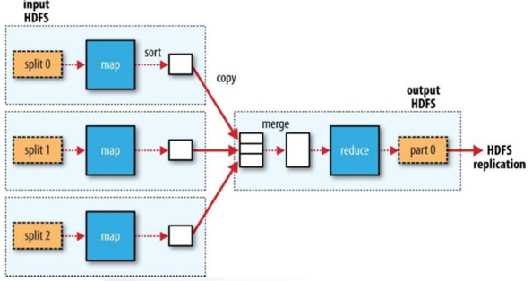
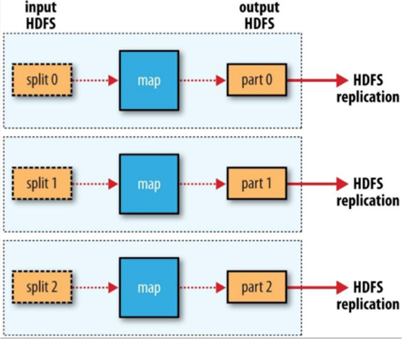
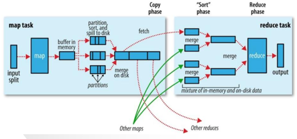

# Hadoop

2003年，这一年Google发表《Google File System》，其中提出一个GFS集群中由多个节点组成，其中主要分为两类：一个Master node，很多Chunkservers。之后于2004年Google发表论文并引入MapReduce。2006年2月，Doug Cutting等人在Nutch项目上应用GFS和 MapReduce思想,并演化为Hadoop项目。

Hadoop的出现解决了互联网时代的海量数据存储和处理，其是一种支持分布式计算和存储的框架体系。假如把Hadoop集群抽象成一台机器的话，理论上我们的硬件资源（CPU、Memoery等）是可以无限扩展的。

## 组件介绍

### HDFS

HDFS,Hadoop Distributed File System （Hadoop分布式文件系统）被设计成适合运行在通用硬件(commodity hardware)上的分布式文件系统。它和现有的分布式文件系统有很多共同点，例如典型的Master/Slave架构（这里不准备展开介绍）；然而HDFS是一个高度容错性的系统，适合部署在廉价的机器上。

- HDFS中的默认副本数是3，这里涉及到一个问题为什么是3而不是2或者4。
- 机架感知（Rack Awareness）

### Yarn

Yarn,Yet Another Resource Negotiator(又一个资源协调者)

原来系统问题：
- 扩展性差。JobTracker兼备资源管理和作业控制两个功能。
- 可靠性差。在Master/Slave架构中,存在Master单点故障。
- 资源利用率低。Map Slot（1.x中资源分配的单位）和Reduce Slot分开,两者之间无法共享。
- 无法支持多种计算框架。MapReduce计算框架是基于磁盘的离线计算 模型,新应用要求支持内存计算、流式计算、迭代式计算等多种计算框架。

Yarn通过拆分原有的JobTracker为：
- 全局的 ResourceManager(RM)。
- 每个Application有一个ApplicationMaster(AM)。

由Yarn专门负责资源管理,JobTracker可以专门负责作业控制,Yarn接替 TaskScheduler的资源管理功能,这种松耦合的架构方式 实现了Hadoop整体框架的灵活性。

### Hive

Hive的是基于Hadoop上的数据仓库基础构架，利用简单的SQL语句（简称HQL）来查询、分析存储在HDFS的数据。并且把SQL语句转换成MapReduce程序来数据的处理。

Hive与传统的关系数据库主要区别在以下几点：

- 存储的位置 Hive的数据存储在HDFS或者Hbase中，而后者一般存储在裸设备或者本地的文件系统中。
- 数据库更新 Hive是不支持更新的，一般是一次写入多次读写。
- 执行SQL的延迟 Hive的延迟相对较高，因为每次执行HQL需要解析成MapReduce。
- 数据的规模上 Hive一般是TB级别，而后者相对较小。
- 可扩展性上 Hive支持UDF/UDAF/UDTF，后者相对来说较差。

### HBase

HBase，是Hadoop Database，是一个高可靠性、高性能、面向列、可伸缩的分布式存储系统。它底层的文件系统使用HDFS，使用Zookeeper来管理集群的HMaster和各Region server之间的通信，监控各Region server的状态，存储各Region的入口地址等。

HBase是Key-Value形式的数据库（类比Java中的Map）。那么既然是数据库那肯定就有表，HBase中的表大概有以下几个特点：

- 大：一个表可以有上亿行，上百万列（列多时，插入变慢）。
- 面向列：面向列(族)的存储和权限控制，列(族)独立检索。
- 稀疏：对于为空(null)的列，并不占用存储空间，因此，表可以设计的非常稀疏。
- 每个cell中的数据可以有多个版本，默认情况下版本号自动分配，是单元格插入时的时间戳。
- HBase中的数据都是字节，没有类型（因为系统需要适应不同种类的数据格式和数据源，不能预先严格定义模式）。

### Spark

Spark是由伯克利大学开发的分布式计算引擎，解决了海量数据流式分析的问题。Spark首先将数据导入Spark集群，然后再通过基于内存的管理方式对数据进行快速扫描 ，通过迭代算法实现全局I/O操作的最小化，达到提升整体处理性能的目的，这与Hadoop从“计算”找“数据”的实现思路是类似的。

## Hadoop集群硬件和拓扑规划

规划这件事情并没有最优解，只是在预算、数据规模、应用场景下之间的平衡。

### 硬件配置

#### RAID

Raid0是提高存储性能的原理是把连续的数据分散到多个磁盘上存取，这样，系统有数据请求就可以被多个磁盘并行的执行，每个磁盘执行属于它自己的那部分数据请求。这种数据上的并行操作可以充分利用总线的带宽，显著提高磁盘整体存取性能。

当Raid0与Hadoop结合在一起会产生什么影响呢？优势：
- 提高IO。
- 加快读写。
- 消除单块磁盘的读写过热的情况。

然而在Hadoop系统中，当Raid0中的一块磁盘数据出现问题（或者读写变得很慢的时候）时，你需要重新格式化整个Raid，并且数据需要重新恢复到DataNode中。整个周期会随着数据的增加而逐步增加。
其次Raid0的瓶颈是Raid中最慢的那一块盘，当你需要替换其中最慢的那一块盘的时候就会重新格式化整个Raid然后恢复数据。
RAID 1通过磁盘数据镜像实现数据冗余，在成对的独立磁盘上产生互 为备份的数据。当原始数据繁忙时，可直接从镜像拷贝中读取数据，因此RAID 1可以提高读取性能。RAID 1是磁盘阵列中单位成本最高的，但提供了很高的数据安全性和可用性。当一个磁盘失效时，系统可以自动切换到镜像磁盘上读写，而不需要重组失效的数据。
所以Raid1的本质是提高数据的冗余，而Hadoop本身默认就是3个副本，所以当存在Raid1时候，副本数将会变成6，将会提高系统对于硬件资源的需求。
所以在Hadoop系统中不建议适用Raid的，其实更加推荐JBOD，当一块磁盘出现问题时，直接unmount然后替换磁盘（很多时候直接换机器的）。

#### 集群规模及资源

这里主要依据数据总量来推算集群规模，不考虑CPU以以及内存配置。

一般情况来说，我们是根据磁盘的的需求来计算需要机器的个数。首先我们需要调研整个系统的当量以及增量数据。
举个例子来说，假如现在系统中存在8T的数据，默认副本数为3，那么所需要的存储＝8T*3/80% = 30T左右。
每台机器存储为6T，则数据节点个数为5。加上Master节点，不考虑HA的情况下，大概是6台左右机器。

### 软件配置

#### 非HA方案

考虑将所有的管理节点放在一台机器上，同时在数据节点上启动若干个Zookeeper服务（奇数）。
- 管理节点：NameNode+ResourceManager+HMaster
- 数据节点：SecondaryNameNode
- 数据节点：DataNode +RegionServer+Zookeeper

#### HA方案

需要将Primary Node 与Standby Node 放在不同的机器上，一般在实际场景中，考虑到节省机器，可能会将不同的组件的Master节点进行交叉互备，如A机器上有Primary NameNonde 以及 Standby HMaster ，B机器上有Standby NameNode 以及 Primary Master。
- 管理节点：NameNode(Primary)+HMaster(Standby)
- 管理节点：NameNode(Standby)+HMaster(Primary)
- 管理节点：ResourceManager
- 数据节点：DataNode +RegionServer+Zookeeper

## 设计目标和适用场景

主要是用来处理半结构以及非结构数据（例如MapReduce）。其本质也是通过Mapreduce程序来将半结构化或者非结构化的数据结构化继而来进行后续的处理。其次由于Hadoop是分布式的架构，其针对的是大规模的数据处理，所以相对较少的数据量并不能体现Hadoop的优势。例如处理GB级别的数据量，利用传统的关系型数据库的速度可能相对较快。

基于上述来看Hadoop的适用场景如下：
- 离线日志的处理（包括ETL过程，其实本质就是基于Hadoop的数据仓库）。
- 大规模并行计算。

## 架构解析

Hadoop由主要由两部分组成：
- 分布式文件系统（HDFS），主要用于大规模的数据存储。
- 分布式计算框架MapReduce，其主要用来对HDFS上的数据进行运算处理。

## 工作原理

MapReduce可谓Hadoop的精华所在，是用于数据处理的编程模型。MapReduce从名称上面可以看到Map以及Reduce两个部分。其思想类似于先分后合，Map对与数据进行抽取转换，Reduce对数据进行汇总。其中需要注意的是Map任务将输出结果存储在本地磁盘,而不是HDFS。

根据Map与数据库的关系大体上可以分为三类：
- 数据本地
- 机架本地
- 跨机架

MapReduce的执行流程

## 案列

Raw Data：原始的数据文件是普通的文本文件，每一行记录中存在一个年份以及改年份中每一天的温度。

Map：Map过程中，将每一行记录都生成一个key，key一般是改行在文件中的行数（Offset），例如图中的0，106代表第一行、第107行。其中粗体的地方代表年份以及温度。

Shuffle：该过程中获取所要的记录组成键值对{年份，温度}。

Sort：将上一步过程中的相同key的value组成一个list，即{年份，List<温度>}，传到Reduce端。

Reduce：Reduce端对list进行处理，获取最大值，然后输出到HDFS中。

## 参考

- [Hadoop环境搭建](http://blog.csdn.net/gitchat/article/details/77849331)
- [一步一步学习大数据：Hadoop 生态系统与场景](http://blog.csdn.net/gitchat/article/details/77931757)