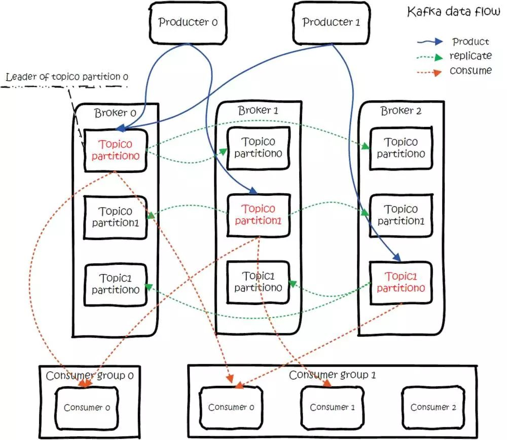

# [apache/kafka](https://github.com/apache/kafka)

* 分布式消息队列，流式处理平台
* 最初由 LinkedIn 采用 Scala 语言开发，用作 LinkedIn 的活动流追踪和运营系统数据处理管道的基础
* 其高性能、持久化、多副本备份、横向扩展、高吞吐、自动容灾、出入队有序等特性
    - 消息是保存或缓存在磁盘上
    - 即使是普通的服务器，Kafka也可以轻松支持每秒百万级的写入请求，超过了大部分的消息中间件，这种特性也使得Kafka在日志处理等海量数据场景广泛应用
    - 速度的秘诀在于，它把所有的消息都变成一个批量的文件，并且进行合理的批量压缩，减少网络IO损耗，通过mmap提高I/O速度，写入数据的时候由于单个Partion是末尾添加所以速度最优；读取数据的时候配合sendfile直接暴力输出。
* 用于发布和订阅、存储及实时地处理大规模流数据
* Kafka维护着“主数据库”， 每个消费者程序都是“从数据库”， 只要记住编号，消息都可以从“主数据库”复制到“从数据库”

## 生产

* 对外使用 Topic 的概念，生产者往 Topic 里写消息，消费者从中读消息
    - 为了做到水平扩展，一个 Topic 实际是由多个 Partition 组成的，遇到瓶颈时，可以通过增加 Partition 的数量来进行横向扩容。单个 Parition 内是保证消息有序
    - 创建一条记录，记录中一个要指定对应的 Topic 和 Value，Key 和 Partition 可选,如果 Partition 没填
        + Key 有填。按照 Key 进行哈希，相同 Key 去一个 Partition。（如果扩展了 Partition 的数量那么就不能保证了）
        + Key 没填。Round-Robin 来选 Partition。
    - 先序列化，然后按照 Topic 和 Partition，放进对应的发送队列中
    - Kafka Produce 都是批量请求，会积攒一批，然后一起发送，不是调 send() 就立刻进行网络发包。
    - 同一个 Partition 的请求按照配置，攒一波，然后由一个单独的线程一次性发过去
* Partition:存在多副本的情况下，会尽量把多个副本，分配到不同的 Broker 上
    - Kafka 会为 Partition 选出一个 Leader，之后所有该 Partition 的请求，实际操作的都是 Leader，然后再同步到其他的 Follower
    - 一个 Broker 歇菜后，所有 Leader 在该 Broker 上的 Partition 都会重新选举，选出一个 Leader
    - Controller：Partition 的分配，还有 Leader 的选举，使用 ZK 在 Broker 中选出一个 Controller
        + Partition 的分配：
            * 将所有 Broker（假设共 n 个 Broker）和待分配的 Partition 排序。
            * 将第 i 个 Partition 分配到第（i mod n）个 Broker 上 （这个就是 Leader）。
            * 将第 i 个 Partition 的第 j 个 Replica 分配到第（(i + j) mode n）个 Broker 上。
        + Leader 容灾
            * Controller 会在 ZK 的 /brokers/ids 节点上注册 Watch，一旦有 Broker 宕机，它就能知道。
            * 当 Broker 宕机后，Controller 就会给受到影响的 Partition 选出新 Leader。
            * Controller 从 ZK 的 /brokers / topics / [topic] / partitions / [partition] / state 中，读取对应 Partition 的 ISR（in-sync replica 已同步的副本）列表，选一个出来做 Leader。
            * 选出 Leader 后，更新 ZK，然后发送 LeaderAndISRRequest 给受影响的 Broker，让它们知道改变这事。
    - 多副本同步：Follower 从 Leader 批量拉取数据来同步，具体的可靠性，是由生产者来决定的
        + 生产者生产消息的时候，通过 request.required.acks 参数来设置数据的可靠性
            * Acks=-1 的时候，如果 ISR 少于 min.insync.replicas 指定的数目，那么就会返回不可用
            * Acks=1 写leader成功后返回，异步写
            * Acks=0 发过去就行，不关心broker是否处理成功
        + ISR 列表中的机器是会变化的，根据配置 replica.lag.time.max.ms，多久没同步，就会从 ISR 列表中剔除
        + 高水位：对于 Partition 和 Leader，就是所有 ISR 中都有的最新一条记录。消费者最多只能读到高水位。
        + 从 ISA 中选出 Leader 后，Follower 会把自己日志中上一个高水位后面的记录去掉，然后去和 Leader 拿新的数据。因为新的 Leader 选出来后，Follower 上面的数据，可能比新 Leader 多，所以要截取。
* Broker、Topics、Partitions 的一些元信息用 ZK 来存，监控和路由啥的也都会用到 ZK
* 流程
    - Producers 往 Brokers 里面的指定 Topic 中写消息
    - Consumers 从 Brokers 里面拉取指定 Topic 的消息



## 消费

* 订阅 Topic 是以一个消费组来订阅的，一个消费组里面可以有多个消费者。同一个消费组中的两个消费者，不会同时消费一个 Partition
* API：订阅 Topic 时，可以用正则表达式，如果有新 Topic 匹配上，那能自动订阅上
* Offset 的保存
    - 一个消费组消费 Partition，需要保存 Offset 记录消费到哪，以前保存在 ZK 中，由于 ZK 的写性能不好，以前的解决方法都是 Consumer 每隔一分钟上报一次
    -  ZK 的性能严重影响了消费的速度，而且很容易出现重复消费。在 0.10 版本后，Kafka 把这个 Offset 的保存，从 ZK 总剥离，保存在一个名叫 consumeroffsets topic 的 Topic 中
    -  写进消息的 Key 由 Groupid、Topic、Partition 组成，Value 是偏移量 Offset。Topic 配置的清理策略是 Compact。总是保留最新的 Key，其余删掉。
    -  一般情况下，每个 Key 的 Offset 都是缓存在内存中，查询的时候不用遍历 Partition，如果没有缓存，第一次就会遍历 Partition 建立缓存，然后查询返回。
*  分配 Partition—Reblance
    -  消费也要从 Broker 中选一个 Coordinator，用于分配 Partition。选 Coordinator：看 Offset 保存在那个 Partition；该 Partition Leader 所在的 Broker 就是被选定的 Coordinator。
    -  交互流程：把 Coordinator 选出来之后，就是要分配了。整个流程是这样的：
        +  Consumer 启动、或者 Coordinator 宕机了，Consumer 会任意请求一个 Broker，发送 ConsumerMetadataRequest 请求。
        +  Broker 会按照上面说的方法，选出这个 Consumer 对应 Coordinator 的地址。
        +  Consumer 发送 Heartbeat 请求给 Coordinator，返回 IllegalGeneration 的话，就说明 Consumer 的信息是旧的了，需要重新加入进来，进行 Reblance。
    -  Reblance 流程
        +  Consumer 给 Coordinator 发送 JoinGroupRequest 请求。
        +  这时其他 Consumer 发 Heartbeat 请求过来时，Coordinator 会告诉他们，要 Reblance 了。
        +  其他 Consumer 发送 JoinGroupRequest 请求。
        +  所有记录在册的 Consumer 都发了 JoinGroupRequest 请求之后，Coordinator 就会在这里 Consumer 中随便选一个 Leader。 然后回 JoinGroupRespone，这会告诉 Consumer 你是 Follower 还是 Leader，对于 Leader，还会把 Follower 的信息带给它，让它根据这些信息去分配 Partition。
        +  Consumer 向 Coordinator 发送 SyncGroupRequest，其中 Leader 的 SyncGroupRequest 会包含分配的情况。
        +  Coordinator 回包，把分配的情况告诉 Consumer，包括 Leader
        +  会 Reblance 的情况
            *  增加 Partition
            *  增加消费者
            *  消费者主动关闭
            *  消费者宕机了
            *  Coordinator 自己也宕机了

## 消息投递语义

* 3 种消息投递语义
    - At most once：最多一次，消息可能会丢失，但不会重复。先获取数据，再进行业务处理，业务处理成功后 Commit Offset
        + 生产者生产消息异常，消息是否成功写入不确定，重做，可能写入重复的消息。
        + 消费者处理消息，业务处理成功后，更新 Offset 失败，消费者重启的话，会重复消费
    - At least once：最少一次，消息不会丢失，可能会重复。先获取数据，再 Commit Offset，最后进行业务处理
        + 生产者生产消息异常，不管，生产下一个消息，消息就丢了。
        + 消费者处理消息，先更新 Offset，再做业务处理，做业务处理失败，消费者重启，消息就丢了。
    - Exactly once：只且一次，消息不丢失不重复，只且消费一次.首先要保证消息不丢，再去保证不重复
        + 生产者重复:生产保证幂等性
            * 为每个 Producer 分配一个 Pid，作为该 Producer 的唯一标识
            * Producer 会为每一个维护一个单调递增的 Seq,eq_seq == broker_seq+1 时，Broker 才会接受该消息，因为：
                - 消息的 Seq 比 Broker 的 Seq 大超过时，说明中间有数据还没写入，即乱序了。
                - 消息的 Seq 不比 Broker 的 Seq 小，那么说明该消息已被保存。
        + 重复消费
            * 下游系统保证幂等性，重复消费也不会导致多条记录。
            * 把 Commit Offset 和业务处理绑定成一个事务。
* 事务性/原子性广播:
    - 先从多个源 Topic 中获取数据。
    - 做业务处理，写到下游的多个目的 Topic。
    - 更新多个源 Topic 的 Offset。
    - 思路
        + 引入 Tid（transaction id），和 Pid 不同，这个 ID 是应用程序提供的，用于标识事务，和 Producer 是谁并没关系。 就是任何 Producer 都可以使用这个 Tid 去做事务，这样进行到一半就死掉的事务，可以由另一个 Producer 去恢复。
        + 同时为了记录事务的状态，类似对 Offset 的处理，引入 Transaction Coordinator 用于记录 Transaction Log。
        + 在集群中会有多个 Transaction Coordinator，每个 Tid 对应唯一一个 Transaction Coordinator。
    - 做法
        + 做事务时，先标记开启事务，写入数据，全部成功就在 Transaction Log 中记录为 Prepare Commit 状态，否则写入 Prepare Abort 的状态。
        + 之后再去给每个相关的 Partition 写入一条 Marker（Commit 或者 Abort）消息，标记这个事务的 Message 可以被读取或已经废弃。
        + 成功后在 Transaction Log记录下 Commit/Abort 状态，至此事务结束
    - 数据流：
        + 首先使用 Tid 请求任意一个 Broker（代码中写的是负载最小的 Broker），找到对应的 Transaction Coordinator。
        + 请求 Transaction Coordinator 获取到对应的 Pid，和 Pid 对应的 Epoch，这个 Epoch 用于防止僵死进程复活导致消息错乱。当消息的 Epoch 比当前维护的 Epoch 小时，拒绝掉。Tid 和 Pid 有一一对应的关系，这样对于同一个 Tid 会返回相同的 Pid。
        + Client 先请求 Transaction Coordinator 记录的事务状态，初始状态是 Begin，如果是该事务中第一个到达的，同时会对事务进行计时。Client 输出数据到相关的 Partition 中；Client 再请求 Transaction Coordinator 记录 Offset 的事务状态；Client 发送 Offset Commit 到对应 Offset Partition。
        + Client 发送 Commit 请求，Transaction Coordinator 记录 Prepare Commit/Abort，然后发送 Marker 给相关的 Partition。全部成功后，记录 Commit/Abort 的状态，最后这个记录不需要等待其他 Replica 的 ACK，因为 Prepare 不丢就能保证最终的正确性了。

## 文件形式

* 以文件的形式存储在文件系统的。Topic 下有 Partition，Partition 下有 Segment，Segment 是实际的一个个文件，Topic 和 Partition 都是抽象概念
* 目录 /partitionid}/ 下，存储着实际的 Log 文件（即 Segment），还有对应的索引文件
* 每个 Segment 文件大小相等，文件名以这个 Segment 中最小的 Offset 命名，文件扩展名是 .log。Segment 对应的索引的文件名字一样，扩展名是 .index。
* 有两个 Index 文件：
    - 一个是 Offset Index 用于按 Offset 去查 Message。
    - 一个是 Time Index 用于按照时间去查，其实这里可以优化合到一起，下面只说 Offset Index。
* 减少索引文件的大小，降低空间使用，方便直接加载进内存中，这里的索引使用稀疏矩阵，不会每一个 Message 都记录下具体位置，而是每隔一定的字节数，再建立一条索引。 索引包含两部分：
    - BaseOffset：意思是这条索引对应 Segment 文件中的第几条 Message。这样做方便使用数值压缩算法来节省空间。例如 Kafka 使用的是 Varint。
    - Position：在 Segment 中的绝对位置。
* 查找 Offset 对应的记录时，会先用二分法，找出对应的 Offset 在哪个 Segment 中，然后使用索引，在定位出 Offset 在 Segment 中的大概位置，再遍历查找 Message

## 安装

```sh
# Mac 会自动安装依赖zookeeper
brew install kafka
brew services start kafka

# 启动 zookeeper
zookeeper-server-start /usr/local/etc/kafka/zookeeper.properties
# 启动kafka服务
kafka-server-start /usr/local/etc/kafka/server.properties

# 创建topic
kafka-topics --create --zookeeper localhost:2181 --replication-factor 1 --partitions 1 --topic test
# 查看创建的topic
kafka-topics --list --zookeeper localhost:2181
# 生产者生产数据
kafka-console-producer --broker-list localhost:9092 --topic test
# 消费者
kafka-console-consumer --bootstrap-server localhost:9092 --topic test --from-beginning
```

## 写入数据

* 顺序写入
    - 磁盘读写的快慢取决于怎么使用它，也就是顺序读写或者随机读写。在顺序读写的情况下，磁盘的顺序读写速度和内存持平。
    - 因为硬盘是机械结构，每次读写都会寻址->写入，其中寻址是一个“机械动作”，它是最耗时的。所以硬盘最讨厌随机I/O，最喜欢顺序I/O。为了提高读写硬盘的速度，Kafka就是使用顺序I/O。
    - 磁盘操作有以下几个好处
        + 磁盘顺序读写速度超过内存随机读写
        + JVM的GC效率低，内存占用大。使用磁盘可以避免这一问题
        + 系统冷启动后，磁盘缓存依然可用
    -  每一个Partition其实都是一个文件 ，收到消息后Kafka会把数据插入到文件末尾
    -  这种方法有一个缺陷——没有办法删除数据 ，所以Kafka是不会删除数据的，它会把所有的数据都保留下来，每个消费者（Consumer）对每个Topic都有一个offset用来表示读取到了第几条数据
    -  删除数据策略
        +  基于时间
        +  基于partition文件大小
* MMFile（Memory Mapped Files）
    - 即便是顺序写入硬盘，硬盘的访问速度还是不可能追上内存。所以Kafka的数据并不是实时的写入硬盘 ，它充分利用了现代操作系统分页存储来利用内存提高I/O效率
    - 原理是直接利用操作系统的Page来实现文件到物理内存的直接映射。完成映射之后你对物理内存的操作会被同步到硬盘上（操作系统在适当的时候）
    - 进程像读写硬盘一样读写内存（当然是虚拟机内存），也不必关心内存的大小有虚拟内存兜底
    - 这种方式可以获取很大的I/O提升，省去了用户空间到内核空间复制的开销（调用文件的read会把数据先放到内核空间的内存中，然后再复制到用户空间的内存中）
    - 缺陷——不可靠，写到mmap中的数据并没有被真正的写到硬盘，操作系统会在程序主动调用flush的时候才把数据真正的写到硬盘
    - 提供了一个参数——producer.type来控制是不是主动flush，如果Kafka写入到mmap之后就立即flush然后再返回Producer叫 同步 (sync)；写入mmap之后立即返回Producer不调用flush叫异步 (async)。

## 读取数据

* 基于sendfile实现Zero Copy
    - 传统模式下，文件进行传输具体流程：
        + 硬盘—>内核buf—>用户buf—>socket相关缓冲区—>协议引擎
        + 调用read函数，文件数据被copy到内核缓冲区
        + read函数返回，文件数据从内核缓冲区copy到用户缓冲区
        + write函数调用，将文件数据从用户缓冲区copy到内核与socket相关的缓冲区。
        + 数据从socket缓冲区copy到相关协议引擎
    - sendfile系统调用则提供了一种减少以上多次copy，提升文件传输性能的方法。`sendfile(socket, file, len);`
        + sendfile系统调用，文件数据被copy至内核缓冲区
        + 再从内核缓冲区copy至内核中socket相关的缓冲区
        + 最后再socket相关的缓冲区copy到协议引擎
* 批量压缩:系统的瓶颈是网络IO
    - 如果每个消息都压缩，但是压缩率相对很低，所以Kafka使用了批量压缩，即将多个消息一起压缩而不是单个消息压缩
    - Kafka允许使用递归的消息集合，批量的消息可以通过压缩的形式传输并且在日志中也可以保持压缩格式，直到被消费者解压缩
    - Kafka支持多种压缩协议，包括Gzip和Snappy压缩协议

## 配置

```
broker

topic
```

## 图书

* 《Kafka源码解析与实战》 王亮

## 项目

* [weiboad/kafka-php](https://github.com/weiboad/kafka-php):kafka php client
* [dpkp/kafka-python](https://github.com/dpkp/kafka-python):Python client for Apache Kafka http://kafka-python.readthedocs.io/
* [Shopify/sarama](https://github.com/Shopify/sarama):Sarama is a Go library for Apache Kafka 0.8, and up. https://shopify.github.io/sarama

## 工具

* [yahoo/kafka-manager](https://github.com/yahoo/kafka-manager):A tool for managing Apache Kafka.
* [tchiotludo/kafkahq](https://github.com/tchiotludo/kafkahq):Kafka GUI for topics, topics data, consumers group, schema registry, connect and more... https://tchiotludo.github.io/kafkahq/

## 参考

* [Documentation](http://kafka.apache.org/documentation.html)
* [apachecn/kafka-doc-zh](https://github.com/apachecn/kafka-doc-zh):Kafka 中文文档 http://kafka.apachecn.org

* [重磅开源KSQL：用于Apache Kafka的流数据SQL引擎](http://www.infoq.com/cn/news/2017/08/KSQL-open-source-apache-kafka):一个基于流的SQL。推出KSQL是为了降低流式处理的门槛，为处理Kafka数据提供简单而完整的可交互式SQL接口。
* [Cruise Control](http://www.infoq.com/cn/news/2017/09/LinkedIn-open-Cruise-Control-Kaf):一个Kafka集群自动化运维新利器
* <https://www.confluent.io/blog/publishing-apache-kafka-new-york-times/>
* [在生产环境使用Kafka构建和部署大规模机器学习](https://juejin.im/entry/5a02660b6fb9a0452a3bbe53)
