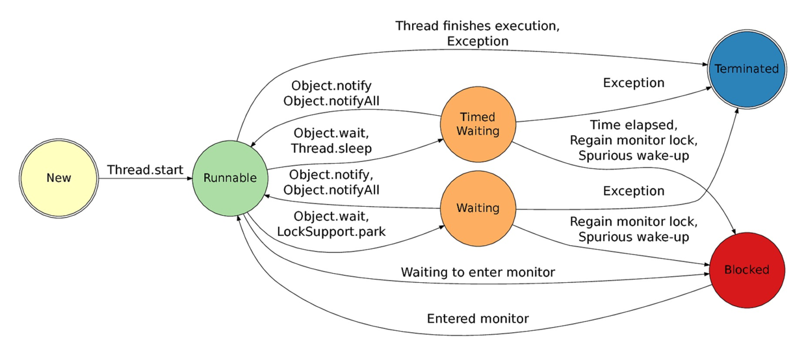

# 并发

* 一台服务器在单位时间里能处理的请求越多，服务器的能力越高，也就是服务器并发处理能力越强
* 基于机械磁盘或SSD的数据库系统，读写的速度远慢于内存，因此单纯磁盘介质的数据库无法支撑C50K

## 高并发

* 高并发（High Concurrency）是互联网分布式系统架构设计中必须考虑的因素之一，通过设计保证系统能够单位时间内系统能够同时处理的请求数
* 指标
    - 响应时间（Response Time）：系统对请求做出响应的时间。例如系统处理一个HTTP请求需要200ms，这个200ms就是系统的响应时间
    - 吞吐量（Throughput）：单位时间里服务器处理的最大请求数，单位req/s.从服务器角度，实际并发用户数的可以理解为服务器当前维护的代表不同用户的文件描述符总数，也就是并发连接数。
    - 每秒查询率QPS（Query Per Second）：每秒响应请求数。在互联网领域，这个指标和吞吐量区分的没有这么明显
    - 并发用户数：同时承载正常使用系统功能的用户数量。例如一个即时通讯系统，同时在线量一定程度上代表了系统的并发用户数
    - * QPS: Queries per second 每秒的请求数目
  - PPS：Packets per second 每秒数据包数目
* 瓶颈：CPU不是也不应该是系统的瓶颈，系统的大部分时间的状况都是CPU在等I/O (硬盘/内存/网络) 的读/写操作完成
* 类型
    - 计算密集
        + 逻辑
    - IO密集
        + MySQL：吞吐
* 需要链路层的高可用、高性能的支撑

## 并发与并行

* 并发(Concurrent):逻辑上具有处理多个同时性任务的能力
    - 系统只有一个CPU,则根本不可能真正同时进行一个以上的线程，只能把CPU运行时间划分成若干个时间段,再将时间段分配给各个线程执行，在一个时间段的线程代码运行时，其它线程处于挂起状
    - 往往在场景中有公用的资源，那么针对这个公用的资源往往产生瓶颈，会用TPS或者QPS来反应这个系统的处理能力
    - 某个作业在时间片结束之前,整个任务还没有完成，那么该作业就被暂停下来，放弃CPU，等待下一轮循环再继续做。此时CPU又分配给另一个作业去使用
* 并行(Parallel):物理上同一时刻执行多个并发任务
    - 当系统有一个以上CPU时,当一个CPU执行一个线程时，另一个CPU可以执行另一个线程，两个线程互不抢占CPU资源，可以同时进行
* 区别
    - 并行是指两个或者多个事件在同一时刻发生；而并发是指两个或多个事件在同一时间间隔内发生。
        + 并发性是指在一段时间内宏观上有多个程序在同时运行
        + 在单处理机系统中，每一时刻却仅能有一道程序执行，故微观上这些程序只能是分时地交替执行
        + 有多个处理机，则这些可以并发执行的程序便可被分配到多个处理机上，实现并行执行，即利用每个处理机来处理一个可并发执行的程序

## 进程

* 进程是指一个内存中运行的应用程序
* 消耗资源的东西,进程之间的通信很不方便
* 上下文切换:任务从保存到再加载的过程就是一次上下文切换,包含了程序正确运行所需的状态 包括程序的代码、数据、栈、通用寄存器的内容、程序计数器、环境变量及打开的文件描述符，等等
* 进程间通信
    - 消息传递（管道、FIFO、消息队列）
    - 同步（互斥量、条件变量、读写锁、文件和写记录锁、信号量）
    - 共享内存（匿名的和具名的）：Unix下的多进程之间的通信方法 ,这种方法通常用于一个程序的多进程间通信，实际上多个程序间也可以通过共享内存来传递信息。
    - 远程过程调用（Solaris门和Sun RPC）

## 线程

多线程只有一个目的，那就是更好的利用cpu的资源，因为所有的多线程代码都可以用单线程来实现。说这个话其实只有一半对，因为反应“多角色”的程序代码，最起码每个角色要给他一个线程吧，否则连实际场景都无法模拟，当然也没法说能用单线程来实现：比如最常见的“生产者，消费者模型”。

* 线程(thead)：指进程中的一个执行任务（控制单元），一个进程可以同时并发运行多个线程
* 线程安全：指在并发的情况之下，该代码经过多线程使用，线程的调度顺序不影响任何结果。这个时候使用多线程，只需要关注系统的内存，cpu是不是够用即可。反过来，线程不安全就意味着线程的调度顺序会影响最终结果
  - 多个执行线程共享一个资源的情景：因为没有任何操作来限制线程来获取相同的资源并操作
* 线程同步：同步指的是通过人为的控制和调度，保证共享资源的多线程访问成为线程安全，来保证结果的准确
  - 临界区：用以访问共享资源的代码块，在同一时间内只允许一个线程执行。当一个线程试图访问一个临界区时，它将使用一种同步机制来查看是不是已经有其他线程进入临界区。如果没有其他线程进入临界区，他就可以进入临界区。如果已经有线程进入了临界区，它就被同步机制挂起，直到进入的线程离开这个临界区。如果在等待进入临界区的线程不止一个，JVM 会选择其中的一个，其余的将继续等待
  - 如果一个对象已用 synchronized 关键字声明，那么只有一个执行线程被允许访问它。使用 synchronized 的好处显而易见：保证了多线程并发访问时的同步操作，避免线程的安全性问题。但是坏处是：使用 synchronized 的方法/代码块的性能比不用要低一些。所以好的做法是：尽量减小 synchronized 的作用域。
  - 同步锁 Lock：线程在Running的过程中可能会遇到阻塞(Blocked)情况:对Running状态的线程加同步锁(Synchronized)使其进入(lock blocked pool ),同步锁被释放进入可运行状态(Runnable)。从jdk源码注释来看，blocked指的是对monitor的等待（可以参考下文的图）即该线程位于等待区。
  - 考虑
    + 数据单线程可见：线程局部变量，它存储在独立虚拟机栈帧的局部变量表中
    + 只读对象：使用 final 关键字修饰类，避免被继承； 使用 private final 关键字避免属性被中途修改； 没有任何更新方法； 返回值不能为可变对象。
    + 某些线程安全类的内部有非常明确的线程安全机制。比如 StringBuffer 就是一个线程安全类，它采用 synchronized 关键字来修饰相关方法
* 线程在Running的过程中可能会遇到等待（Waiting）情况:线程可以主动调用object.wait或者sleep，或者join（join内部调用的是sleep，所以可看成sleep的一种）进入。从jdk源码注释来看，waiting是等待另一个线程完成某一个操作，如join等待另一个完成执行，object.wait()等待object.notify()方法执行。
* 现场模型:IO线程与工作线程通过任务队列解耦
  - 大部分Web-Server与服务框架都是使用这样的一种“IO线程与Worker线程通过队列解耦”类线程模型.这个线程模型的特点是，工作线程内部是同步阻塞执行任务的,因此可以通过增加Worker线程数来增加并发能力.:
      + 有少数几个IO线程监听上游发过来的请求，并进行收发包（生产者）
      + 有一个或者多个任务队列，作为IO线程与Worker线程异步解耦的数据传输通道（临界资源）
      + 有多个工作线程执行正真的任务（消费者）
  - 纯异步线程模型:没有阻塞，这种线程模型只需要设置很少的线程数就能够做到很高的吞吐量，该模型的缺点是：
      + 如果使用单线程模式，难以利用多CPU多核的优势
      + 程序员更习惯写同步代码，callback的方式对代码的可读性有冲击，对程序员的要求也更高
      + 框架更复杂，往往需要server端收发组件，server端队列，client端收发组件，client端队列，上下文管理组件，有限状态机组件，超时管理组件的支持
* 线程数设计
    - 服务器CPU核数有限，能够同时并发的线程数有限，单核CPU设置10000个工作线程没有意义(工作线程数是不是设置的越大越好)
    - 线程切换是有开销的，如果线程切换过于频繁，反而会使性能降低
    - 调用sleep()函数的时候，线程不占用一直占用CPU，等待时会把CPU让出来，给其他需要CPU资源的线程使用。
        + 阻塞accept()，等待客户端连接都不占用CPU资源
        + 阻塞recv()，等待下游回包都不占用CPU资源
    - 即使是单核，使用多线程也是有意义的，大多数情况也能提高并发
        + 多线程编码可以让代码更加清晰，还能提高吞吐量。例如：IO线程收发包，Worker线程进行任务处理，Timeout线程进行超时检测
        + 如果有一个任务一直占用CPU资源在进行计算，此时增加线程并不能增加并发，例如以下代码会一直占用CPU，并使得CPU占用率达到100%：`while(1){ i++; }`
        + 通常来说，Worker线程一般不会一直占用CPU进行计算，此时即使CPU是单核，增加Worker线程也能够提高并发，因为这个线程在休息的时候，其他的线程可以继续工作
* 优点
    - 使用线程可以把占据时间长的程序中的任务放到后台去处理
    - 用户界面可以更加吸引人，这样比如用户点击了一个按钮去触发某些事件的处理，可以弹出一个进度条来显示处理的进度
    - 程序的运行速度可能加快
    - 在一些等待的任务实现上如用户输入、文件读写和网络收发数据等，线程就比较有用了。在这种情况下可以释放一5.些珍贵的资源如内存占用等等。
    - 多线程技术在IOS软件开发中也有举足轻重的位置。
* 缺点
    - 如果有大量的线程,会影响性能,因为操作系统需要在它们之间切换。
    - 更多的线程需要更多的内存空间。
    - 线程可能会给程序带来更多“bug”，因此要小心使用。
    - 线程的中止需要考虑其对程序运行的影响。
    - 通常块模型数据是在多个线程间共享的，需要防止线程死锁情况的发生。
* 线程数:Worker线程在执行的过程中，有一部计算时间需要占用CPU，另一部分等待时间不需要占用CPU，通过量化分析，例如打日志进行统计，可以统计出整个Worker线程执行过程中这两部分时间的比例，例如：执行计算，占用CPU的时间（粉色时间轴）是100ms，等待时间，不占用CPU的时间（橙色时间轴）也是100ms
    - 结论：这个线程计算和等待的时间是1：1，即有50%的时间在计算（占用CPU），50%的时间在等待（不占用CPU）：
    - 假设此时是单核，则设置为2个工作线程就可以把CPU充分利用起来，让CPU跑到100%
    - 假设此时是N核，则设置为2N个工作现场就可以把CPU充分利用起来，让CPU跑到N*100%，N核服务器，通过执行业务的单线程分析出本地计算时间为x，等待时间为y，则工作线程数（线程池线程数）设置为 N*(x+y)/x，能让CPU的利用率最大化。
    - 一般来说，非CPU密集型的业务（加解密、压缩解压缩、搜索排序等业务是CPU密集型的业务），瓶颈都在后端数据库访问或者RPC调用，本地CPU计算的时间很少，所以设置几十或者几百个工作线程是能够提升吞吐量的。
* 线程池
  - 线程池管理器（ThreadPoolManager）:用于创建并管理线程池
  - 工作线程（WorkThread）: 线程池中线程
  - 任务接口（Task）:每个任务必须实现的接口，以供工作线程调度任务的执行。
  - 任务队列:用于存放没有处理的任务。提供一种缓冲机制
* 工作线程
  - 从工作队列里拿出任务，进行一些本地初始化计算，例如http协议分析、参数解析、参数校验等
  - 访问cache拿一些数据
  - 拿到cache里的数据后，再进行一些本地计算，这些计算和业务逻辑相关
  - 通过RPC调用下游service再拿一些数据，或者让下游service去处理一些相关的任务
  - RPC调用结束后，再进行一些本地计算，怎么计算和业务逻辑相关
  - 访问DB进行一些数据操作
  - 操作完数据库之后做一些收尾工作，同样这些收尾工作也是本地计算，和业务逻辑相关
  - 详细流程
    + 请求在网络上传输到下游的cache、service、DB
    + 下游cache、service、DB进行任务处理
    + cache、service、DB将报文在网络上传回工作线程




## 进程 vs 线程

* 进程是资源分配的最小单位，线程是CPU调度的最小单位
* 进程又自己的独立地址空间，线程没有 
  - 进程: 有独立的内存空间，进程中的数据存放空间（堆空间和栈空间）是独立的，至少有一个线程
  - 线程：堆空间是共享的，栈空间是独立的，线程消耗的资源也比进程小，相互之间可以影响的
    + 多线程并发取决于 CPU 调度器(JVM 来调度)
    + 线程会存在线程上下文切换，会导致程序执行速度变慢
* 进程和线程通信方式不同 
* 进程切换上下文开销大，线程开销小 
* 一个进程挂掉了不会影响其他进程，而线程挂掉了会影响其他线程 
* 对进程进程操作一般开销都比较大，对线程开销就小了 

## 死锁

两个或两个以上的进程在执行过程中，因争夺资源而造成的一种互相等待的现象，若无外力作用，它们都将无法推进下去。原因一般是两个对象的锁相互等待造成的

* 原因
    - 因为系统资源不足。
    - 进程运行推进的顺序不合适。
    - 资源分配不当。
    - 死锁是因为多线程访问共享资源，由于访问的顺序不当所造成的。两个线程都想得到对方的资源，而不愿释放自己的资源，造成两个线程都在等待，而无法执行的情况。
* 条件有四个：
    - 互斥条件：所谓互斥就是进程在某一时间内独占资源。
    - 请求与保持条件：一个进程因请求资源而阻塞时，对已获得的资源保持不放。
    - 不剥夺条件:进程已获得资源，在末使用完之前，不能强行剥夺。
    - 循环等待条件:若干进程之间形成一种头尾相接的循环等待资源关系。

## 异步IO

* 每次异步传输的信息都以一个起始位开头，它通知接收方数据已经到达了，这就给了接收方响应、接收和缓存数据比特的时间；
* 在传输结束时，一个停止位表示该次传输信息的终止。按照惯例，空闲（没有传送数据）的线路实际携带着一个代表二进制1的信号，异步传输的开始位使信号变成0，其他的比特位使信号随传输的数据信息而变化。
* 最后，停止位使信号重新变回1，该信号一直保持到下一个开始位到达。

## 并发控制

保证一个用户的工作不会对另一个用户的工作产生不合理的影响。通过一定的手段来保证在并发情况下数据的准确性，通过这种手段保证了当用户和其他用户一起操作时得到的结果和他单独操作时的结果一样

* 悲观并发控制（Pessimistic Concurrency Control）：先取锁再访问
    - 方法
        + 在对记录进行修改前，先尝试为该记录加上排他锁（exclusive locking）。
        + 如果加锁失败，说明该记录正在被修改，那么当前查询可能要等待或者抛出异常。
        + 具体响应方式由开发者根据实际需要决定。如果成功加锁，那么就可以对记录做修改，事务完成后就会解锁了。其间如果有其他对该记录做修改或加排他锁的操作，都会等待我们解锁或直接抛出异常。
    - 常用的MySql Innodb引擎举例
        + 关闭mysql数据库的自动提交属性，因为MySQL默认使用autocommit模式，set autocommit=0;
    - 处理加锁的机制会让数据库产生额外的开销，还有增加产生死锁的机会；
    - 还会降低并行性，一个事务如果锁定了某行数据，其他事务就必须等待该事务处理完才可以处理那行数据。
    - 悲观锁依赖数据库锁，效率低。更新失败的概率比较低。
    - 随着互联网三高架构（高并发、高性能、高可用）的提出，悲观锁已经越来越少的被使用到生产环境中了，尤其是并发量比较大的业务场景。
* 乐观锁（ Optimistic Locking ）：数据进行提交更新的时候，才会正式对数据的冲突与否进行检测，如果发现冲突了，则让返回用户错误的信息，让用户决定如何去做。
    - 在对数据库进行处理的时候，乐观锁并不会使用数据库提供的锁机制。一般的实现乐观锁的方式就是记录数据版本。
    - 乐观锁并未真正加锁，效率高。一旦锁的粒度掌握不好，更新失败的概率就会比较高，容易发生业务失败。
* ABA问题：另一个进程处理后结果与当前进程值一致
    - 乐观锁每次在执行数据的修改操作时，都会带上一个版本号，一旦版本号和数据的版本号一致就可以执行修改操作并对版本号执行+1操作，否则就执行失败。因为每次操作的版本号都会随之增加，所以不会出现ABA问题，因为版本号只会增加不会减少。
    - 使用时间戳
* 一旦发上高并发的时候，就只有一个线程可以修改成功，那么就会存在大量的失败
    - 减小乐观锁力度，最大程度的提升吞吐率，提高并发能力
    - 锁粒度把控是一门重要的学问，选择一个好的锁，在保证数据安全的情况下，可以大大提升吞吐率，进而提升性能。
* 架构演进
  - 电商的促销：警惕流量
  - 最初单体数据库-》用户超过 100 万，日访问量超过 20 万，峰值并发 2 万，而数据库的表会趋近于亿级的量。撑不住的
  - 一个大库拆成若干小库，保持数据库对象都一致，这样每个小库分摊掉一部分流量，-》一系列的事情来满足和留住用户。比如促销、打折、团购等等。会大量查询他们的数据，带来的是读请求远远大于写入请求
      + 通过中间件
      + 现在的硬件服务 4000 个并发，对于不复杂的商用没有问题。具体能负责多少看系统上线后的 baseline （基线）监测，这里我们假定 4000 并发。所以分成 5 个相同的库，来做分库。这样同时写入 4000 并发够用。
      + 分库路由：依据地理位置分成 5 个库，根据用户身份证哈希成 5 个散列值，分别对应了这 5 台数据库，用户就被分流了。
      + 读请求耗尽服务器的 CPU\IO\Network 资源
  - 读写分离

```sql
# 0.开始事务
begin;
# 1.查询出商品库存信息， for update的方式进行加锁
select quantity from items where id=1 for update;
# 2.修改商品库存为2
update items set quantity=2 where id = 1;
# 3.提交事务
commit;

# 乐观锁
# 查询出商品库存信息，quantity = 3
select quantity from items where id=1
# 修改商品库存为2，
update items set quantity=2 where id=1 and quantity = 3;

# 处理ABA
# 查询出商品信息，version = 1
select version from items where id=1
# 修改商品库存为2
update items set quantity=2,version = 3 where id=1 and version = 2;

# 修改商品库存
update item  set quantity=quantity - 1  where id = 1 and quantity - 1 > 0
```

## 压力测试

* 考虑的条件
  - 并发用户数: 指在某一时刻同时向服务器发送请求的用户总数(HttpWatch)
  - 总请求数
  - 请求资源描述
  - 请求等待时间(用户等待时间)
  - 用户平均请求的等待时间
  - 服务器平均请求处理的时间
  - 硬件环境
* 时间标尺
  - 用户平均请求等待时间（这里暂不把数据在网络的传输时间，还有用户PC本地的计算时间计算入内）：用于衡量服务器在一定并发用户数下，单个用户的服务质量
  - 服务器平均请求处理时间：吞吐率的倒数
* 用户平均请求等待时间 = 服务器平均请求处理时间 * 并发用户数

## 思路

* 实现高并发
  - 服务拆分：将整个项目拆分成多个子项目或者模块，分而治之，将项目进行水平扩展
  - 服务化：解决服务调用复杂之后的服务的注册发现问题。
  - 消息队列：解耦，异步处理
  - 缓存：各种缓存带来的并发
  - 高性能的服务器
  - 高性能的数据库:业务和应用或者功能模块将数据库进行分离，不同的模块对应不同的数据库或者表，再按照一定的策略对某个页面或者功能进行更小的数据库散列
  - 高效率的编程语言
  - 高性能的Web容器
  - HTML静态化
  - 图片服务器分离:降低提供页面访问请求的服务器系统压力，并且可以保证系统不会因为图片问题而崩溃
  - 镜像：镜像是大型网站常采用的提高性能和数据安全性的方式，镜像的技术可以解决不同网络接入商和地域带来的用户访问速度差异。
  - 负载均衡
      + 软件四层交换我们可以使用Linux上常用的LVS来解决，LVS就是Linux Virtual Server，他提供了基于心跳线heartbeat的实时灾难应对解决方案，提高系统的鲁棒性，同时可供了灵活的虚拟VIP配置和管理功能，可以同时满足多种应用需求，这对于分布式的系统来说必不可少。一个典型的使用负载均衡的策略就是，在软件或者硬件四层交换的基础上搭建squid集群，这种思路在很多大型网站包括搜索引擎上被采用，这样的架构低成本、高性能还有很强的扩张性，随时往架构里面增减节点都非常容易。
      + 硬件四层交换：第四层交换使用第三层和第四层信息包的报头信息，根据应用区间识别业务流，将整个区间段的业务流分配到合适的应用服务器进行处理。　第四层交换功能就象是虚IP，指向物理服务器。它传输的业务服从的协议多种多样，有HTTP、FTP、NFS、Telnet或其他协议。这些业务在物理服务器基础上，需要复杂的载量平衡算法。在IP世界，业务类型由终端TCP或UDP端口地址来决定，在第四层交换中的应用区间则由源端和终端IP地址、TCP和UDP端口共同决定。在硬件四层交换产品领域，有一些知名的产品可以选择，比如Alteon、F5等
  - 减少http请求（比如使用雪碧图）
  - 优化数据库（范式、SQL语句、索引、配置、读写分离）
  - 动态内容静态化+CDN
  - 禁止外部盗链（refer、图片添加水印）
  - 控制大文件下载
  - 使用集群
  - MQ
  - 分库分表
  - 读写分离
  - ElasticSearch:分布式的，可以随便扩容，分布式天然就可以支撑高并发
* 实现高可用
  - 缓存
    + 不单单能够提升系统访问速度、提高并发访问量，也是保护数据库、保护系统的有效方式。大型网站一般主要是“读”
    + “写”系统:累积一些数据批量写入，内存里面的缓存队列（生产消费），以及HBase写数据的机制等等也都是通过缓存提升系统的吞吐量或者实现系统的保护措施
  - 集群
  - 限流：通过对并发访问/请求进行限速或者一个时间窗口内的请求进行限速来保护系统的可用性，一旦达到限制速率就可以拒绝服务
    + 方式
      * 限制瞬时并发数 ：比如在入口层（nginx添加nginx_http_limit_conn_module）来限制同一个ip来源的连接数，防止恶意攻击访问的情况。
      * 限制总并发数：通过配置数据库连接池、线程池大小来约束总并发数
      * 限制时间窗口内的平均速率：在接口层面，通过限制访问速率来控制接口的并发请求。
      * 其他方式：限制远程接口的调用速率、限制MQ的消费速率。
      * 算法
        - 滑动窗口协议：一种常见的流量控制技术，用来改善吞吐量的技术。滑动窗口协议的由来：
          + 滑动窗口（sliding window）是一种流量控制技术。早期的网络通讯中，通信双方不会考虑网络的拥挤情况直接发送数据。由于大家不知道网络拥塞状况，同时发送数据，导致中间节点阻塞掉包，谁也发送不了数据，所以就有了滑动窗口机制来解决此问题。发送和接收方都会维护一个数据帧的序列，这个序列被称为窗口。
          + 定义：滑动窗口协议（Sliding Window Protocol），属于TCP协议的一种应用，用于网络数据传输时的流量控制，以避免拥塞的发生。该协议允许发送方在停止并等待确认前发送多个数据分组。由于发送方不必每发一个分组就停下来等待确认，因此该协议可以加速数据的传输，提高网络吞吐量。
          + 发送窗口：发送端允许连续发送的帧的序号表。发送端可以不等待应答而连续发送数据（可以通过设置窗口的尺寸来控制）
          + 接收窗口：接收方允许接收的帧的序列表，凡是落在接收窗口内的帧，接收方都必须处理，落在接收窗口外的帧将被丢弃。接收方每次允许接收的帧数称为接收窗口的尺寸
        - 漏桶（leaky bucket）：能强行限制数据的传输速率 实现流量整形（Traffic Shaping）和流量控制（Traffic Policing）
          + 思路：请求先进入到漏桶里，漏桶以一定的速度出水。当水请求过大会直接溢出，可以看出能强行限制数据的传输速率。进入端无需考虑出水端的速率，就像mq消息队列一样，provider只需要将消息传入队列中，而不需要关心Consumer是否接收到了消息。
            * 一个固定容量的漏桶，按照常量固定速率流出水滴；
            * 如果桶是空的，则不需流出水滴；
            * 可以以任意速率流入水滴到漏桶；
            * 如果流入水滴超出了桶的容量，则流入的水滴溢出了（被丢弃），而漏桶容量是不变的。
          + 对于溢出的水，就是被过滤的数据，可以直接被丢弃，也可以通过某种方式暂时保存，如加入队列之中，像线程池里对溢出数据的4种处理机制一样
          + 单机系统中可以使用队列来实现，在分布式环境中消息中间件或者Redis都是可选的方案
        - 令牌桶：一个存放固定容量令牌（token）的桶，按照固定速率往桶里添加令牌
          + 原理：系统会以一个恒定的速度往桶里放入令牌，而如果请求需要被处理，则需要先从桶里获取一个令牌，当桶里没有令牌可取时，则拒绝服务。
          + 令牌将按照固定的速率被放入令牌桶中。比如每秒放10个。
          + 桶中最多存放b个令牌，当桶满时，新添加的令牌被丢弃或拒绝。
          + 当一个n个字节大小的数据包到达，将从桶中删除n个令牌，接着数据包被发送到网络上。
          + 如果桶中的令牌不足n个，则不会删除令牌，且该数据包将被限流（要么丢弃，要么缓冲区等待）。
        - 固定的缓存容量：令牌痛 平滑服务端，漏桶：平滑消费端
          + 处理某时的突发流量：放令牌的频率改变可以改变整体数据处理的速度，漏桶算法可能就不合适
        - 计数器：通过控制时间段内的请求次数.可以设置一个1秒钟的滑动窗口，窗口中有10个格子，每个格子100毫秒，每100毫秒移动一次，每次移动都需要记录当前服务请求的次数。 内存中需要保存10次的次数。可以用数据结构LinkedList来实现。格子每次移动的时候判断一次，当前访问次数和LinkedList中最后一个相差是否超过100，如果超过就需要限流了
          + 指定时间段内（10个）定时检测，没100ms检测一次
          + 请求去实时更新请求次数
      * 工具
        - Guava是一个Google开源项目，包含了若干被Google的Java项目广泛依赖的核心库，其中的RateLimiter提供了令牌桶算法实现：平滑突发限流(SmoothBursty)和平滑预热限流(SmoothWarmingUp)实现。
          + 常规速率、突发流量 使用的RateLimiter的子类SmoothBursty
          + 有一定缓冲的流量输出方案：SmoothWarmingUp 设置了缓冲时间 形成一个平滑线性下降的坡度，频率越来越高，在缓冲时间之内达到原本设置的频率，以后就以固定的频率输出
    + 降级:当服务器压力剧增的情况下，根据当前业务情况及流量对一些服务和页面有策略的降级，以此释放服务器资源以保证核心任务的正常运行
      * 降级往往会指定不同的级别，面临不同的异常等级执行不同的处理。根据服务方式：可以拒接服务，可以延迟服务，也有时候可以随机服务。
      * 根据服务范围：可以砍掉某个功能，也可以砍掉某些模块。总之服务降级需要根据不同的业务需求采用不同的降级策略。主要的目的就是服务虽然有损但是总比没有好。
* 业务设计
  - 幂等：就是用户对于同一操作发起的一次请求或者多次请求的结果是一致的，不会因为多次点击而产生了副作用，就像数学里的数字1，多少次幂的结果都是1。举个最简单的例子，那就是支付，用户购买商品后支付，支付扣款成功，但是返回结果的时候网络异常，此时钱已经扣了，用户再次点击按钮，此时会进行第二次扣款，返回结果成功，用户查询余额发现多扣钱了，流水记录也变成了两条。
  - 防重：防止同样的数据同时提交
  - 除了在业务方向判断和按钮点击之后不能继续点击的限制以外，在服务器端也可以做到防重：
  - 在服务器端生成一个唯一的随机标识号(Token<令牌>)同事在当前用户的Session域中保存这个令牌，然后将令牌发送到客户端的form表单中，在form表单中使用隐藏域来存储这个Token，表单提交的时候联通这个Token一起提交到服务器，然后在服务器端判断客户提交上来的Token与服务器端生成的Token是否一致，如果不一致，那就重复提交了，此时服务器端就可以不处理重复提交的表单，如果相同则处理表单，处理完后清楚当前用户的Session域中存储的标识号。高可用高并发架构参考：高可用高并发的 9 种技术架构。
  - 在下列情况中，服务器程序将拒绝处理用户提交的表单请求：
    + 存储Session域中的Token与表单提交的Token不一致
    + 当前用户的Session中不存在Token
    + 用户提交的表单数据中没有Token
* 状态机：软件设计中的状态机概念，一般是指有限状态机（英语：finite-state machine，缩写：FSM）又称有限状态自动机，简称状态机，是表示有限个状态以及在这些状态之间的转移和动作等行为的数学模型。

```java
// 令牌桶
public class TokenDemo {

  //qps:每秒钟处理完请求的次数；tps:每秒钟处理完的事务次数
  //代表qps是10；
  RateLimiter rateLimiter = RateLimiter.create(10);

  public void doSomething(){
      if (rateLimiter.tryAcquire()){
          //尝试获得令牌.为true则获取令牌成功
          System.out.println("正常处理");
      }else{
          System.out.println("处理失败");
      }

  }

  public static void main(String args[]) throws IOException{
      /*
      * CountDownLatch是通过一个计数器来实现的，计数器的初始值为线程的数量，此值是线程将要等待的操作数（线程的数量）。
      * 当某个线程为了想要执行这些操作而等待时， 它要使用 await()方法。
      * 此方法让线程进入休眠直到操作完成。
      * 当某个操作结束，它使用countDown() 方法来减少CountDownLatch类的内部计数器，计数器的值就会减1。
      * 当计数器到达0时，它表示所有的线程已经完成了任务，这个类会唤醒全部使用await() 方法休眠的线程们恢复执行任务。
      *
      * */
      CountDownLatch latch = new CountDownLatch(1);
      Random random = new Random(10);
      TokenDemo tokenDemo = new TokenDemo();
      for (int i=0;i<20;i++){
          new Thread(()->{
              try {
                  latch.await();
                  Thread.sleep(random.nextInt(1000));
                  tokenDemo.doSomething();
              }catch (InterruptedException e){
                  e.printStackTrace();
              }
          }).start();
      }
      latch.countDown();
      System.in.read();
  }

# 计数器
//服务访问次数，可以放在Redis中，实现分布式系统的访问计数
Long counter = 0L;
//使用LinkedList来记录滑动窗口的10个格子。
LinkedList<Long> ll = new LinkedList<Long>();

public static void main(String[] args)
{
    Counter counter = new Counter();
    counter.doCheck();
}

private void doCheck()
{
    while (true)
    {
        ll.addLast(counter);

        if (ll.size() > 10)
        {
            ll.removeFirst();
        }

        //比较最后一个和第一个，两者相差一秒
        if ((ll.peekLast() - ll.peekFirst()) > 100)
        {
            //To limit rate
        }

        Thread.sleep(100);
    }
}
```

## 数据

* 2019天猫双11交易峰值创下新纪录，达54.4万笔/秒

## 工具

* [AB](https://httpd.apache.org/docs/2.4/programs/ab.html) :Apache Benchmark - 是一款有 Apache 基金会提供的简单的压测工具 `ab -n 5000 -c 50 https://www.baodu.com`
* [Siege](https://www.joedog.org/siege-home/) <https://www.sitepoint.com/web-app-performance-testing-siege-plan-test-learn/>
* [locust](https://locust.io/)
* [mcollina/autocannon](https://github.com/mcollina/autocannon):fast HTTP/1.1 benchmarking tool written in Node.js
* 压测
  - [wrk](https://github.com/wg/wrk): Modern HTTP benchmarking tool
  - [gatling](https://github.com/gatling/gatling) Async Scala-Akka-Netty based Load Test Tool http://gatling.io
  - [sniper](https://github.com/btfak/sniper): A powerful & high-performance http load tester
  - [hey](https://github.com/rakyll/hey): HTTP load generator, ApacheBench (ab) replacement, formerly known as rakyll/boom
  - [Siege](https://github.com/JoeDog/siege): Siege is an http load tester and benchmarking utility
  - [http_load](http://www.acme.com/software/http_load/): http_load runs multiple http fetches in parallel, to test the throughput of a web server.
  - [vegeta](https://github.com/tsenart/vegeta/): HTTP load testing tool and library. It’s over 9000!
  - [t50](https://github.com/fredericopissarra/t50): mixed packet injector tool
  - [GoReplay](https://github.com/buger/goreplay): GoReplay is an open-source tool for capturing and replaying live HTTP traffic into a test environment in order to continuously test your system with real data. It can be used to increase confidence in code deployments, configuration changes and infrastructure changes. https://goreplay.org
  - [tcpcopy](https://github.com/session-replay-tools/tcpcopy): An online request replication tool, also a tcp stream replay tool, fit for real testing, performance testing, stability testing, stress testing, load testing, smoke testing, etc
  - [gryphon](https://github.com/wslfa/gryphon): Gryphon是由网易自主研发的能够模拟千万级别并发用户的一个软件，目的是能够用较少的资源来模拟出大量并发用户，并且能够更加真实地进行压力测试， 以解决网络消息推送服务方面的压力测试的问题和传统压力测试的问题。Gryphon分为两个程序，一个运行gryphon，用来模拟用户，一个是 intercept，用来截获响应包信息给gryphon。Gryphon模拟用户的本质是用一个连接来模拟一个用户，所以有多少个连接，就有多少个用户，而用户的素材则取自于pcap抓包文件。值得注意的是，Gryphon架构类似于tcpcopy，也可以采用传统使用方式和高级使用方式。
  - [locust.io](http://locust.io/): An open source load testing tool. Define user behaviour with Python code, and swarm your system with millions of simultaneous users.

```sh
#apache ab
yum install apr-util

#webench
wget http://blog.zyan.cc/soft/linux/webbench/webbench-1.5.tar.gz
tar zxvf webbench-1.5.tar.gz
cd webbench-1.5
make && make install
```

## 参考

* [libevent/libevent](https://github.com/libevent/libevent) :Event notification library https://libevent.org
