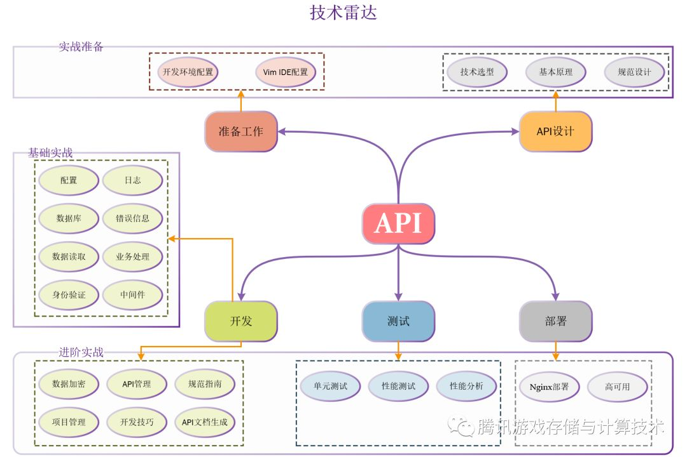

# [golang/go](https://github.com/golang/go)

The Go programming language https://golang.org [中国官网](https://golang.google.cn/)

## [Install](https://golang.org/dl/)

* Go 编译器支持交叉编译，可以在一台机器上构建运行在具有不同操作系统和处理器架构上运行的应用程序，也就是说编写源代码的机器可以和目标机器有完全不同的特性
  - $GOOS       $GOARCH
  - android     arm
  - darwin      386
  - darwin      amd64
  - darwin      arm
  - darwin      arm64
  - dragonfly   amd64
  - freebsd     386
  - freebsd     amd64
  - freebsd     arm
  - linux       386
  - linux       amd64
  - linux       arm
  - linux       arm64
  - linux       ppc64
  - linux       ppc64le
  - linux       mips
  - linux       mipsle
  - linux       mips64
  - linux       mips64le
  - linux       s390x
  - netbsd      386
  - netbsd      amd64
  - netbsd      arm
  - openbsd     386
  - openbsd     amd64
  - openbsd     arm
  - plan9       386
  - plan9       amd64
  - solaris     amd64
  - windows     386
  - windows     amd64
* 环境变量
  - GOROOT：(std lib)Go的安装路径,默认会安装到如下目录：`/usr/local/go`
  - GOARCH 表示目标机器的处理器架构，值可以是 386、amd64 或 arm。
  - GOOS 表示目标机器的操作系统，值可以是 darwin、freebsd、linux 或 windows。
  - GOBIN Go项目的二进制文件存放目录，默认是 GOROOT/bin
  - GOPATH：(external libs):Go的工作空间
    + 可以是多个目录路径，每个目录都代表 Go语言的一个工作区,存放Go的开发代码和第三方包代码
    + 允许设置多个路径，和各个系统环境多路径设置一样，windows用“;”，linux（mac）用“:”分隔
    + 不要把GOPATH设置成go的安装路径,在用户目录下面创建一个目录, 如gopath.$GOPATH 默认采用和 $GOROOT 一样的值，但从 Go 1.1 版本开始，必须修改为其它路径
    + go get命令去获取远程库的时候，一般会安装到第一个工作区当中
    + 可以包含多个包含 Go 语言源码文件、包文件和可执行文件的路径，每个目录下包含目录
      * bin：编译生成的可执行文件路径：需要把GOPATH中的可执行目录也配置到环境变量中, 否则自行下载的第三方go工具就无法使用了 编译后二进制的存放目的地
      * pkg：编译包时，生成的.a文件存放路径
      * src：源码路径 import 包时的搜索路径

```sh
sudo snap install go --classic

## linux
wget https://dl.google.com/go/go1.12.6.linux-amd64.tar.gz
tar -xvzf go1.10.2.linux-amd64.tar.gz -C /usr/local


mkdir -p ~/projects/{bin,pkg,src}

# /etc/profile or $HOME/.profile or ~/.bashrc
export GOROOT=/usr/local/go
export GOPATH=$HOME/projects
export GOBIN=$GOPATH/bin
export PATH=$PATH:$GOROOT/bin
export PATH=$PATH:$GOPATH/bin

source ~/.zshrc|/etc/profile

### Mac
brew install golang
mkdir -p $GOPATH $GOPATH/src $GOPATH/pkg $GOPATH/bin

export GOROOT=/usr/local/opt/go/libexec
export GOPATH=$HOME/go
export GOPROXY=https://goproxy.cn
export GOBIN=$GOPATH/bin
export PATH=$GOPATH/bin:$PATH:$GOROOT/bin

source .bash_profile

go version
go env

# $GOPATH/src是 Go 源码存放的目录，所以在正式开始编码前要先确保 $GOPATH/src目录存在
mkdir -p $GOPATH/src

go get -v -u golang.org/x/tools/...
strace -f -e trace=network go get github.com/GoAdminGroup/go-admin/adm 2>&1 | pv -i 0.05 > /dev/null
GOOS=linux GOARCH=amd64 go build main.go
```

## 组织

* 源码
  - Go 语言的源码以代码包为基本组织单位的。在文件系统中，这些代码包其实是与目录一一对应的。由于目录可以有子目录，所以代码包也可以有子包
  - 一个代码包中可以包含任意个以.go 为扩展名的源码文件，这些源码文件都需要被声明属于同一个代码包
  - 代码包的名称一般会与源码文件所在的目录同名。如果不同名，那么在构建、安装的过程中会以代码包名称为准
  - 每个代码包都会有导入路径。代码包的导入路径是其他代码在使用该包中的程序实体时，需要引入的路径。在实际使用程序实体之前，必须先导入其所在的代码包。具体的方式就是import该代码包的导入路径
  - 在工作区中，一个代码包的导入路径实际上就是从 src 子目录，到该包的实际存储位置的相对路径。
  - Go 语言源码的组织方式就是以环境变量 GOPATH、工作区、src 目录和代码包为主线的。一般情况下，Go 语言的源码文件都需要被存放在环境变量 GOPATH 包含的某个工作区（目录）中的 src 目录下的某个代码包（目录）中
  - 命令码源文件
    + 命令源码文件是程序的运行入口，是每个可独立运行的程序必须拥有的。可以通过构建或安装，生成与其对应的可执行文件，后者一般会与该命令源码文件的直接父目录同名。
    + 如果一个源码文件声明属于main包，并且包含一个无参数声明且无结果声明的main函数
    + 对于一个独立的程序来说，命令源码文件永远只会也只能有一个。如果有与命令源码文件同包的源码文件，那么它们也应该声明属于main包
  - 库源码文件
    + 不能被直接运行的源码文件，仅用于存放程序实体(变量、常量、函数、结构体和接口的统称)，这些程序实体可以被其他代码使用
  - 把命令源码文件中的代码拆分到其他库源码文件
    + 同目录下的源码文件的代码包声明语句要一致。也就是说，它们要同属于一个代码包。这对于所有源码文件都是适用的。
      * 如果目录中有命令源码文件，那么其他种类的源码文件也应该声明属于main包，这也是我们成功构建和运行它们的前提。
    + 源码文件声明的代码包的名称可以与其所在的目录的名称不同。在针对代码包进行构建时，生成的结果文件的主名称与其父目录的名称一致。
    + **源码文件所在的目录相对于 src 目录的相对路径就是它的代码包导入路径，而实际使用其程序实体时给定的限定符要与它声明所属的代码包名称对应**
    + 名称的首字母为大写的程序实体才可以被当前包外的代码引用，否则它就只能被当前包内的其他代码引用
    + 对于包级私有的程序实体，即使导入了它所在的代码包也无法引用到它
    + 代码包声明规则(可以与目录不一致)、代码包导入规则（导入目录路径）以及程序实体的访问权限规则（使用声明的包）。在进行模块化编程时，必须记住这些规则，否则代码很可能无法通过编译。
    + 导入两个代码包，而这两个代码包的导入路径的最后一级是相同，文件声明的包名相同，则肯定冲突，会报错redeclared。
    + 如果会产生冲突，那么怎样解决这种冲突，有几种方式？
      * 设置别名
      * 导入的点操作，import(. "bbbb")。这样就可以直接调用bbbb下面的函数而不用再bbbb.funcname的方式调用
      * 如果只是想引入某包并没有在代码中实际调用则可以这么处理来避免冲突:import(_ "bbbb")
    + 在 Go 1.5 及后续版本中，可以通过创建internal代码包让一些程序实体仅仅能被当前模块中的其他代码引用。这被称为 Go 程序实体的第三种访问权限：模块级私有。
* 安装
  - 某个工作区的 src 子目录下的源码文件在安装后一般会被放置到当前工作区的 pkg 子目录下对应的目录中，，或者被直接放置到该工作区的 bin 子目录中
  - 安装某个代码包而产生的归档文件是与这个代码包同名的
  - 归档文件的相对目录与 pkg 目录之间还有一级目录，叫做平台相关目录。平台相关目录的名称是由 build（也称“构建”）的目标操作系统、下划线和目标计算架构的代号组成的，比如 linux_amd64
* 构建 VS 安装
  - go install 安装操作会先执行构建，然后还会进行链接操作，并且把结果文件搬运到指定目录
    + 安装的是库源码文件,结果文件会被搬运到它所在工作区的 pkg 目录下的某个子目录中
    + 如果安装的是命令源码文件，那么结果文件会被搬运到它所在工作区的 bin 目录中，或者环境变量
  - 构建和安装代码包的时候都会执行编译、打包等操作，并且，这些操作生成的任何文件都会先被保存到某个临时的目录中
  - go build
    + 如果构建的是库源码文件，那么操作后产生的结果文件只会存在于临时目录中。这里的构建的主要意义在于检查和验证。
    + 如果构建的是命令源码文件，那么操作的结果文件会被搬运到源码文件所在的目录中
    + 默认不会编译目标代码包所依赖的那些代码包。当然，如果被依赖的代码包的归档文件不存在，或者源码文件有了变化，那它还是会被编译。
    + 参数
      * -a，不但目标代码包总是会被编译，依赖的代码包也总会被编译，即使依赖的是标准库中的代码包也是如此。
      * -i, 不但要编译依赖的代码包，还要安装它们的归档文
      * -x，命令具体都执行了哪些操作
      * -n，只查看具体操作而不执行它们
      * -v,看到编译的代码包的名称。它在与-a 结合
* 结构
  - api：用于存放依照Go版本顺序的API增量列表文件。这里所说的API包含公开的变量、常量、函数等。这些API增量列表文件用于Go语言API检查
  - bin：用于存放主要的标准命令文件（可执行文件），包含go、godoc、gofmt
  - blog：用于存放官方博客中的所有文章
  - doc：用于存放标准库的HTML格式的程序文档。我们可以通过godoc命令启动一个Web程序展示这些文档
  - lib：用于存放一些特殊的库文件
  - misc：用于存放一些辅助类的说明和工具
  - pkg：用于存放安装Go标准库后的所有归档文件（以.a结尾的文件）。注意，你会发现其中有名称为linux_amd64的文件夹，我们称为平台相关目录。这类文件夹的名称由对应的操作系统和计算架构的名称组合而成。通过go install命令，Go程序会被编译成平台相关的归档文件存放到其中
  - src：用于存放Go自身、Go标准工具以及标准库的所有源码文件
  - test：存放用来测试和验证Go本身的所有相关文件
* 问题
  - Go 语言在多个工作区中查找依赖包的时候是以怎样的顺序进行的？
  - 形成命名空间
  - 如果在多个工作区中都存在导入路径相同的代码包会产生冲突吗？

```sh
# 一个已存在的代码包导入路径
github.com/labstack/echo

# 生成归档文件 相对目录就是 github.com/labstack， 文件为 echo.a 目录 pkg/linux_amd64/github.com/labstack
go install github.com/labstack/echo

package main

import "fmt"

func main() {
    fmt.Println("Hello, world!")
}
```

## 程序实体

* 变量、常量、函数、结构体和接口的统称
* 程序实体的名字被统称为标识符。标识符可以是任何 Unicode 编码可以表示的字母字符、数字以及下划线“_”，但是其首字母不能是数字
* 类型声明
  - 当连续两个或多个函数的已命名形参类型相同时，除最后一个类型以外，其它都可以省略。
  - 初始化时显式声明
  - 类型推断是一种编程语言在编译期自动解释表达式类型的能力
    + 在声明一个变量而不指定其类型时（即使用不带类型的 := 语法或 var = 表达式语法），变量的类型由右值推导得出。
    + 使得它可以被赋予任何类型的值,明显提升程序的灵活性，使得代码重构变得更加容易，同时又不会给代码的维护带来额外负担（实际上，它恰恰可以避免散弹式的代码修改），更不会损失程序的运行效率。
    + 函数内使用短变量声明 `name := flag.String("name", "everyone", "The greeting object.")`
  - 变量重声明的前提条件如下
    + 由于变量的类型在其初始化时就已经确定了，所以对它再次声明时赋予的类型必须与其原本的类型相同，否则会产生编译错误。
    + 变量的重声明只可能发生在某一个代码块中。如果与当前的变量重名的是外层代码块中的变量，那么就是另外一种含义了，我在下一篇文章中会讲到。
    + 变量的重声明只有在使用短变量声明时才会发生，否则也无法通过编译。如果要在此处声明全新的变量，那么就应该使用包含关键字var的声明语句，但是这时就不能与同一个代码块中的任何变量有重名了。
    + 被“声明并赋值”的变量必须是多个，并且其中至少有一个是新的变量。这时我们才可以说对其中的旧变量进行了重声明。
* 作用域
  - 包级私有和模块级私有访问权限对应的都是代码包代码块，公开的访问权限对应的是全域代码块
  - 一个程序实体的作用域总是会被限制在某个代码块中，而这个作用域最大的用处，就是对程序实体的访问权限的控制。
  - 代码引用变量的时候总会最优先查找当前代码块中的那个变量。注意，这里的“当前代码块”仅仅是引用变量的代码所在的那个代码块，并不包含任何子代码块。
  - 如果当前代码块中没有声明以此为名的变量，那么程序会沿着代码块的嵌套关系，从直接包含当前代码块的那个代码块开始，一层一层地查找。
  - 一般情况下，程序会一直查到当前代码包代表的代码块。如果仍然找不到，那么 Go 语言的编译器就会报错了

```go
vi ~/projects/src/hello.go
go install $GOPATH/hello.go
$GOBIN/hello

go build hello.go
./hello

go run hello.go

<<:1 << 100 2^100
>>:64 >> 4  4
```

## 常量

* 声明与变量类似，使用 const 关键字
* 类型可以是字符、字符串、布尔值或数值
* 不能用 := 语法声明
* 数值常量是高精度的值。一个未指定类型的常量由上下文来决定其类型
  - int 类型最大可以存储一个 64 位的整数，有时会更小）
  - int 可以存放最大64位的整数，根据平台不同有时会更少）
* iota

## 数据类型

* type 查看数据类型
* 基础数据类型｜值类型
  - bool
  - string
    * \n ：换行符
    * \r ：回车符
    * \t ：tab 键
    * \u 或 \U ：Unicode 字符
    + \\ ：反斜杠自身
  - int  int8|byte  int16  int32 int64 、int16、int、uint、uintptr uint8 uint16 uint32 uint64
    + int8  1   带符号8位整型     -128~127    0
    + uint8   1   无符号8位整型，与 byte 类型等价     0~255   0
    + int16   2   带符号16位整型    -32768~32767    0
    + uint16  2   无符号16位整型    0~65535     0
    + int32   4   带符号32位整型，与 rune 类型等价    -2147483648~2147483647  0
    + uint32  4   无符号32位整型    0~4294967295    0
    + int64   8   带符号64位整型    -9223372036854775808~9223372036854775807    0
    + uint64  8   无符号64位整型    0~18446744073709551615  0
    + int     32位或64位     与具体平台相关     与具体平台相关     0
    + uint    32位或64位     与具体平台相关     与具体平台相关     0
    + uintptr  与对应指针相同     无符号整型，足以存储指针值的未解释位  32位平台下为4字节，64位平台下为8字节   0
    + << >> 左右移位
  - 字符
    + byte（实际上是 uint8 的别名）: UTF-8 字符串的单个字节的值
    + rune:单个 Unicode 字符
  -  // 表示一个 Unicode 码点
  - float32 float64
  - 复数类型 complex64 complex128
  - 错误类型：error
* 复合类型
  - 指针（pointer）
    + 指针保存了值的内存地址
      * 声明：类型 *T 是指向 T 类型值的指针。其零值为 nil。 `var p *int`
      * 生成：& 操作符会生成一个指向其操作数的指针 `i := 42 p = &i`
      * 获取值：`*` 操作符表示指针指向的底层值
      * 指针操作原始值，值引用 操作副本
    + 选择值或指针作为接收者
      * 方法能够修改其接收者指向的值
      * 避免在每次调用方法时复制该值。若值的类型为大型结构体时，这样做会更加高效
  - 数组（array）
    - 数组类型 [n]T 表示拥有 n 个 T 类型的值的数组
    + 长度是固定的,数组的长度在声明它的时候就必须给定，并且之后不会再改变。可以说，数组的长度是其类型的一部分
  - 切片（slice）
    * []bool{true, true, false}
    + 切片可包含任何类型，甚至包括其它的切片
    + 用内建函数 make 来创建, 会分配一个元素为零值的数组并返回一个引用了它的切片`a := make([]int, 5)  // len(a)=5`
      * b := make([]int, 0, 5) // len(b)=0, cap(b)=5
      * b = b[:cap(b)] // len(b)=5, cap(b)=5
      * b = b[1:]      // len(b)=4, cap(b)=4
    + 值是可变长的。切片的长度可以自动地随着其中元素数量的增长而增长，但不会随着元素数量的减少而减小。
    + a[low : high] 过两个下标来界定,会选择一个半开区间，包括第一个元素，但排除最后一个元素,利用它的默认行为来忽略上下界。切片下界的默认值为 0，上界则是该切片的长度。
    + 切片并不存储任何数据，只是描述了底层数组中的一段
    + 更改切片的元素会修改其底层数组中对应的元素。 与它共享底层数组的切片都会观测到这些修改
    + 在每个切片的底层数据结构中，一定会包含一个数组。数组可以被叫做切片的底层数组
    + 切片也可以被看作是对数组的某个连续片段的引用
    + 通过切片表达式基于某个数组或切片生成新切片的时候
    + 结构可以为其它类型
    + 长度就是它所包含的元素个数。len(s)
    + 切片的容量是从它的第一个元素开始数，到其底层数组元素末尾的个数。cap(s)
    + 切片的零值是 nil。nil 切片的长度和容量为 0 且没有底层数组。
    + 在底层数组不变的情况下，切片代表的窗口可以向右扩展，直至其底层数组的末尾。
    + `func append(s []T, vs ...T) []T`:切片追加新的元素
    + for 循环的 range 形式可遍历切片或映射。当使用 for 循环遍历切片时，每次迭代都会返回两个值。第一个值为当前元素的下标，第二个值为该下标所对应元素的一份副本。
      * 可以将下标或值赋予 _ 来忽略它
    + 一旦一个切片无法容纳更多的元素，Go 语言就会想办法扩容。但它并不会改变原来的切片，而是会生成一个容量更大的切片，然后将把原有的元素和新元素一并拷贝到新切片中
    + 在一般的情况下，可以简单地认为新切片的容量（以下简称新容量）将会是原切片容量（以下简称原容量）的 2 倍。
    + 当原切片的长度（以下简称原长度）大于或等于1024时，将会以原容量的1.25倍作为基准
    + reslice
  - 字典（map）
    + var m map[string]Vertex： key 类型 value 类型
    + 将键映射到值
    + 映射的零值为 nil 。nil 映射既没有键，也不能添加键。
    + 键类型受限
    + 非原子操作需要加锁， map并发读写需要加锁，map操作不是并发安全的，判断一个操作是否是原子的可以使用 go run race 命令做数据的竞争检测
  - 通道（chan）
    + 不要通过共享内存来通信，而应该通过通信来共享内存
    + 一个通道相当于一个先进先出（FIFO）的队列。通道中的各个元素值都是严格地按照发送的顺序排列的，先被发送通道的元素值一定会先被接收。元素值的发送和接收都需要用到操作符
    + 对于同一个通道，发送操作之间是互斥的，接收操作之间也是互斥的。
    + 发送操作和接收操作中对元素值的处理都是不可分割的。
    + 发送操作在完全完成之前会被阻塞。接收操作也是如此。
    + 缓冲通道的情况。如果通道已满，那么对它的所有发送操作都会被阻塞，直到通道中有元素值被接收走。
    + 非缓冲通道，情况要简单一些。无论是发送操作还是接收操作，一开始执行就会被阻塞，直到配对的操作也开始执行，才会继续传递。由此可见，非缓冲通道是在用同步的方式传递数据。也就是说，只有收发双方对接上了，数据才会被传递。
  - 结构体（struct）结构体:一组字段（field）
    + 结构体字段使用点号来访问
    + 结构体字段可以通过结构体指针来访问,使用隐式间接引用，直接写 p.X 就可以
    + 特点
      * 零值都会是拥有特定结构，但是没有任何定制化内容的值，相当于一个空壳。值中的字段也都会被分别赋予各自类型的零值。
      * 延迟初始化：在实际需要的时候才进行。优点是可以分散初始化操作带来的计算量和存储空间消耗。
    + List
    + Element
    + Ring:在内部就是一个循环链表。它的根元素永远不会持有任何实际的元素值，而该元素的存在就是为了连接这个循环链表的首尾两端。
    + Heap
  - 接口（interface）
    + 由一组方法签名定义的集合，接口类型的变量可以保存任何实现了这些方法的值
    + 接口也是值。它们可以像其它值一样传递。接口值可以用作函数的参数或返回值。
    + 在内部，接口值可以看做包含值和具体类型的元组 `(value, type)`,接口值保存了一个具体底层类型的具体值。接口值调用方法时会执行其底层类型的同名方法。
    + 类型通过实现一个接口的所有方法来实现该接口
    + 隐式接口从接口的实现中解耦了定义，这样接口的实现可以出现在任何包中，无需提前准备。
    + 底层值为 nil 的接口值，即便接口内的具体值为 nil，方法仍然会被 nil 接收者调用
    + 保存了 nil 具体值的接口其自身并不为 nil,nil 接口值既不保存值也不保存具体类型
    + 空接口
      * 指定了零个方法的接口值被称为 *空接口：*  `interface{}`
      * 空接口可保存任何类型的值。（因为每个类型都至少实现了零个方法）
      * 空接口被用来处理未知类型的值。例如，fmt.Print 可接受类型为 interface{} 的任意数量的参数
    + 类型断言 提供了访问接口值底层具体值的方式
      * `t := i.(T)` 断言接口值 i 保存了具体类型 T，并将其底层类型为 T 的值赋予变量 t,若 i 并未保存 T 类型的值，该语句就会触发一个恐慌。
      * `t, ok := i.(T)`  判断 一个接口值是否保存了一个特定的类型，类型断言可返回两个值：其底层值以及一个报告断言是否成功的布尔值
        - i 保存了一个 T:t 将会是其底层值，而 ok 为 true
        - 否则，ok 将为 false 而 t 将为 T 类型的零值，程序并不会产生恐慌
    + 类型选择 是一种按顺序从几个类型断言中选择分支的结构,类型选择中的 case 为类型（而非值）， 它们针对给定接口值所存储的值的类型进行比较
  - 函数
    + 第一类对象指的是运行期可以被创建并作为参数传递给其他函数或赋值给变量的实体
    + 输入与输出类型限制 `func (T) Read(b []byte) (n int, err error)`
    + defer 语句会将函数推迟到外层函数返回之后执行。推迟调用的函数其参数会立即求值，但直到外层函数返回前该函数都不会被调用
    + defer 栈 推迟的函数调用会被压入一个栈中。当外层函数返回时，被推迟的函数会按照后进先出的顺序调用
    + 函数也是值。可以像其它值一样传递。函数值可以用作函数的参数或返回值
    + 闭包：引用了自由变量（未绑定到特定对象的变量，通常在匿名函数外定义）的函数，被引用的自由变量将和这个函数一同存在，即使已经离开了创造它的上下文环境也不会被释放（比如传递到其他函数或对象中）
      * 「闭」的意思是「封闭外部状态」，即使外部状态已经失效，闭包内部依然保留了一份从外部引用的变量
      * 是一个函数值，引用了其函数体之外的变量。函数可以访问并赋予其引用的变量的值，换句话说，函数被这些变量“绑定”在一起。例如，函数 adder 返回一个闭包。每个闭包都被绑定在其各自的 sum 变量上
      * 价值在于可以作为函数对象或者匿名函数
        - 保证局部变量的安全性：闭包内部声明的局部变量无法从外部修改
        - 将匿名函数作为参数
        - 将匿名函数作为返回值
    + 接受一个值作为参数的函数必须接受一个指定类型的值，不能是指针
* 类型转换 表达式 T(v) 将值 v 转换为类型 T

## 运算符

* 优先级：由上到下表示优先级从高到低，或者数字越大，优先级越高
  - 6      ^（按位取反） !
  - 5      *  /  %  <<  >>  &  &^
  - 4      +  -  |  ^（按位异或）
  - 3      ==  !=  <  <=  >  >=
  - 2      &&
  - 1      ||

## 控制语句

* select:使一个 Go 程可以等待多个通信操作
  - 会阻塞到某个分支可以继续执行为止，这时就会执行该分支
  - 当多个分支都准备好时会随机选择一个执行
  - select 中的其它分支都没有准备好时，default 分支就会执行

## 包

* 归属于同一个目录的文件看作归属于同一个包，归属同一个包的代码具备以下特性：
  - 归属于同一个包的代码包声明语句要一致，即同一级目录的源文件必须属于同一个包
  - 在同一个包下不同的不同文件中不能重复声明同一个变量、函数和类
* main 函数作为程序的入口函数，只能存在于 main 包中，main 包通常对应 src 目录，但也可以将其它子目录声明为 main 包
* 无论是变量、函数还是类属性及方法，它们的可见性都是与包相关联的,可见性根据其首字母大小写来决定.首字母大写，则可以在其他包中直接访问这些属性和方法，否则只能在包内访问
* 导入
  - 包的属性名字以大写字母开头，那么就是已导出
  - 名称的首字母为大写的程序实体才可以被当前包外的代码引用，否则它就只能被当前包内的其他代码引用
* go get
  - 会自动从一些主流公用代码仓库（比如 GitHub）下载目标代码包，并把它们安装到环境变量 GOPATH 包含的第 1 工作区的相应目录中。如果存在环境变量
  - 目前支持的有BitBucket、GitHub、Google Code和Launchpad
  - 这个命令在内部实际上分成了两步操作
    + 第一步是下载源码包
    + 第二步是执行go install
  - 下载源码包的go工具会自动根据不同的域名调用不同的源码工具,参数说明：
    + -d 只下载不安装
    + -f 只有在你包含了-u参数的时候才有效，不让-u去验证import中的每一个都已经获取了，这对于本地fork的包特别有用
    + -fix 在获取源码之后先运行一个用于根据当前 Go 语言版本修正代码的工具，然后再去做其他的事情
    + -t 同时也下载需要为运行测试所需要的包
    + -insecure：允许通过非安全的网络协议下载和安装代码包。HTTP 就是这样的协议。
    + -u ：下载并安装代码包，不论工作区中是否已存在它们。强制使用网络去更新包和它的依赖包:存在unrecognized import path "golang.org/x问题，需要添加代理
    + -v 显示执行的命令
* 对代码包的远程导入路径进行自定义方法
  - 在该代码包中的库源码文件的包声明语句的右边加入导入注释，像这样：`package semaphore // import "golang.org/x/sync/semaphore"`
  - `go get golang.org/x/sync/semaphore` 后，golang.org 下的路径 /x/sync/semaphore 并不是存放包的真实地址
* golang 在 github 上建立了一个镜像库，如 https://github.com/golang/net 即是 https://golang.org/x/net 的镜像库
* [Gopm Registry](https://gopm.io):Download Go packages by version, without needing version control tools (eg Git, Hg, etc).

```go
go get github.com/yudai/gotty  // ok的

go get -u -v github.com/labstack/echo
// unrecognized import path "golang.org/x/crypto/acme/autocert" (https fetch: Get https://golang.org/x/crypto/acme/autocert?go-get=1: dial tcp 172.217.6.127:443: i/o timeout) // bin配置错误

gofmt -w yourcode.go // Format your code
godoc fmt                // documentation for package fmt
godoc fmt Printf         // documentation for fmt.Printf
godoc -src fmt // fmt package interface in Go source form

mkdir -p $GOPATH/src/golang.org/x
cd $GOPATH/src/golang.org/x
git clone https://github.com/golang/net.git

# /etc/hosts
192.30.253.112 github.com
151.101.185.194 github.global.ssl.fastly.net

go: cannot use path@version syntax in GOPATH mode # export GO111MODULE=on
```

## 面向对象

* Go 没有类,类方法的实现，定义时指明数据结构
  - 为结构体类型定义方法
  - 为非结构体类型声明方法
  - 为指针接收者声明方法：指针接收者的方法可以修改接收者指向的值
    + 使用值接收者，那么 Scale 方法会对原始 Vertex 值的副本进行操作
    + 带指针参数的函数必须接受一个指针,以指针为接收者的方法被调用时，接收者既能为值又能为指针
    + 以值为接收者的方法被调用时，接收者既能为值又能为指针
    + 优点
      * 方法能够修改其接收者指向的值
      * 可以避免在每次调用方法时复制该值。若值的类型为大型结构体时，这样做会更加高效。
* 只能为在同一包内定义的类型的接收者声明方法，而不能为其它包内定义的类型（包括 int 之类的内建类型）的接收者声明方法。
* 方法就是一类带特殊的 接收者 参数的函数。
* 方法接收者在它自己的参数列表内，位于 func 关键字和方法名之间。
* 方法只是个带接收者参数的函数

```go
package main

import (
    "fmt"
    "math"
)
// 申明一个结构体
type HelloWorld struct {
    X, Y float64
}
// 添加一个Run方法，首字母大写为公用方法，小写为私有方法。
func (v HelloWorld) Run() float64 {
    return math.Sqrt(v.X*v.X + v.Y*v.Y)
}

func main() {
    // 初始化类
    v := HelloWorld{3, 4}
    fmt.Println(v.Run())
}
```

## fmt

* fmt 包中定义的 Stringer 是最普遍的接口之一
* 错误：使用 error 值来表示错误状态，error 类型是一个内建接口，自定义错误流程
  - 声明错误数据类型 并实现接口error
  - 通常函数会返回一个 error 值，调用代码应当判断这个错误是否等于 nil 来进行错误处理
  - error 为 nil 时表示成功；非 nil 的 error 表示失败
* 一个 io.Reader 包装另一个 io.Reader，然后通过某种方式修改其数据流
* image 包定义了 Image 接口
  - Bounds 方法的返回值 Rectangle 实际上是一个 image.Rectangle，它在 image 包中声明
* Print采用默认格式将其参数格式化并写入标准输出。如果两个相邻的参数都不是字符串，会在它们的输出之间添加空格。返回写入的字节数和遇到的任何错误
* Println采用默认格式将其参数格式化并写入标准输出。总是会在相邻参数的输出之间添加空格并在输出结束后添加换行符。返回写入的字节数和遇到的任何错误

```go
type Stringer interface {
    String() string
}

type error interface {
    Error() string
}

i, err := strconv.Atoi("42")
if err != nil {
    fmt.Printf("couldn't convert number: %v\n", err)
    return
}
fmt.Println("Converted integer:", i)

package image

type Image interface {
    ColorModel() color.Model
    Bounds() Rectangle
    At(x, y int) color.Color
}
```

## goroutine 协程

* 由 Go 运行时管理的轻量级线程
* `go f(x, y, z)`会启动一个新的 Go 程并执行 `f(x, y, z)`
  - f, x, y 和 z 的求值发生在当前的 Go 程中，而 f 的执行发生在新的 Go 程中
* Go 程在相同的地址空间中运行，因此在访问共享的内存时必须进行同步。sync 包提供了这种能力，不过在 Go 中并不经常用到，因为还有其它的办法
* 多线程或多进程是并行的基本条件，但单线程也可以用协程(coroutine)做到并发。简单将Goroutine归纳为协程并不合适，因为运行时会创建多个线程来执行并发任务，且任务单元可被调度到其它线程执行。这更像是多线程和协程的结合体，能最大限度提升执行效率，发挥多核处理器能力。

```go
// Go编写一个并发编程程序很简单，只需要在函数之前使用一个Go关键字就可以实现并发编程。
func main() {
  go func(){
        fmt.Println("Hello,World!")
    }()
}
```

## 信道

* 带有类型的管道
* 声明`ch := make(chan int, n)`
  - n 为缓存长度
* 通过用信道操作符 <- 来发送或者接收值
* 默认情况下，发送和接收操作在另一端准备好之前都会阻塞。这使得 Go 程可以在没有显式的锁或竞态变量的情况下进行同步。
* 当信道的缓冲区填满后，向其发送数据时会阻塞。当缓冲区为空时，接受方会阻塞。
* 发送者可通过 close 关闭一个信道来表示没有需要发送的值了，向一个已经关闭的信道发送数据会引发程序恐慌（panic）
* 接收者可以通过为接收表达式分配第二个参数来测试信道是否被关闭：若没有值可以接收且信道已被关闭，那么在执行完 `v, ok := <-ch` 之后 ok 会被设置为 false
* 循环 for i := range c 会不断从信道接收值，直到它被关闭
* 信道与文件不同，通常情况下无需关闭它们。只有在必须告诉接收者不再有需要发送的值时才有必要关闭，例如终止一个 range 循环

## 互斥锁（Mutex）

* 保证每次只有一个 Go 程能够访问一个共享的变量，从而避免冲突
* 在代码前调用 Lock 方法，在代码后调用 Unlock 方法来保证一段代码的互斥执行
* 标准库中提供了 sync.Mutex 互斥锁类型及其两个方法：
  - Lock
  - Unlock
* 用 defer 语句来保证互斥锁一定会被解锁

## 依赖

* 接口:能够对接口进行 Mock 的 golang/mock 框架，能够根据接口生成 Mock 实现
  - 在 test/mocks 目录中放置所有的 Mock 实现，子目录与接口所在文件的二级目录相同，在这里源文件的位置在 pkg/blog/blog.go，它的二级目录就是 blog/，所以对应的 Mock 实现会被生成到 test/mocks/blog/ 目录中；
  - 指定 package 为 mxxx，默认的 mock_xxx 看起来非常冗余，上述 blog 包对应的 Mock 包也就是 mblog；
  - mockgen 命令放置到 Makefile 中的 mock 下统一管理，减少祖传命令的出现；
* 数据库:使用 sqlmock 来模拟数据库的连接
  - ExpectQuery 用于模拟 SQL 的查询语句
  - ExpectExec 用于模拟 SQL 的增删
* HTTP 请求:httpmock 就是一个用于 Mock 所有 HTTP 依赖的包，它使用模式匹配的方式匹配 HTTP 请求的 URL，在匹配到特定的请求时就会返回预先设置好的响应
* Redis、缓存以及其他依赖
* bouk/monkey 能够通过替换函数指针的方式修改任意函数的实现，所以如果上述的几种方法都不能满足需求，就只能够通过猴子补丁这种比较 hack 的方法 Mock 依赖了
  - 由于它是在运行时替换了函数的指针，所以如果遇到一些简单的函数，例如 rand.Int63n 和 time.Now，编译器可能会直接将这种函数内联到调用实际发生的代码处并不会调用原有的方法，所以使用这种方式往往需要我们在测试时额外指定 -gcflags=-l 禁止编译器的内联优化 `go test -gcflags=-l ./...`

```
package blog

type Post struct {}

type Blog interface {
    ListPosts() []Post
}

type jekyll struct {}

func (b *jekyll) ListPosts() []Post {
    return []Post{}
}

type wordpress struct{}

func (b *wordpress) ListPosts() []Post {
    return []Post{}
}

package service

type Service interface {
    ListPosts() ([]Post, error)
}

type service struct {
    blog blog.Blog
}

func NewService(b blog.Blog) *Service {
    return &service{
        blog: b,
    }
}

func (s *service) ListPosts() ([]Post, error) {
    return s.blog.ListPosts(), nil
}

mockgen -package=mblog -source=pkg/blog/blog.go > test/mocks/blog/blog.go

func TestListPosts(t *testing.T) {
    ctrl := gomock.NewController(t)
    defer ctrl.Finish()

    mockBlog := mblog.NewMockBlog(ctrl)
    mockBlog.EXPECT().ListPosts().Return([]Post{})

    service := NewService(mockBlog)

    assert.Equal(t, []Post{}, service.ListPosts())
}

func main() {
    monkey.Patch(fmt.Println, func(a ...interface{}) (n int, err error) {
        s := make([]interface{}, len(a))
        for i, v := range a {
            s[i] = strings.Replace(fmt.Sprint(v), "hell", "*bleep*", -1)
        }
        return fmt.Fprintln(os.Stdout, s...)
    })
    fmt.Println("what the hell?") // what the *bleep*?
}
```

## 测试

* 必须import testing包
* 文件名必须以xx_test.go命名
* 单元
  - 方法必须是Test[^a-z]开头
  - 方法参数必须 t *testing.T
  - 函数中通过调用testing.T的Error, Errorf, FailNow, Fatal, FatalIf方法，说明测试不通过，调用Log方法用来记录测试的信息
  - 参数
    + -c : 编译go test成为可执行的二进制文件，但是不运行测试
    + -i : 安装测试包依赖的package，但是不运行测试。
* 压力
  - 创建benchmark性能测试用例文件 `*_b_test.go` *代表要测试的文件名
  - 函数名必须以Benchmark开头,BenchmarkXxx或Benchmark_xxx, xxx可以是任意字母数字的组合，但是Xxx首字母不能是小写字母
* 用性能测试生成CPU状态图
  - 生成cpu profile文件`go test -bench=".*" -cpuprofile=cpu.prof -c`
  - 用go tool pprof工具 `go tool pprof *.test cpu.prof`
* 辅助单元测试的 assert 包
  -

```sh
go test [-c] [-i] [build flags] [packages] [flags for test binary]

package gotest

import (
    "testing"
)

func Test_Division_1(t *testing.T) {
    if i, e := Division(6, 2); i != 3 || e != nil { //try a unit test on function
        t.Error("除法函数测试没通过") // 如果不是如预期的那么就报错
    } else {
        t.Log("第一个测试通过了") //记录一些你期望记录的信息
    }
}

func Test_Division_2(t *testing.T) {
    t.Error("就是不通过")
}

// 压力测试 go test -file webbench_test.go -test.bench=".*"表示测试全部的压力测试函数
package gotest

import (
    "testing"
)

func Benchmark_Division(b *testing.B) {
    for i := 0; i < b.N; i++ { //use b.N for looping
        Division(4, 5)
    }
}

func Benchmark_TimeConsumingFunction(b *testing.B) {
    b.StopTimer() //调用该函数停止压力测试的时间计数

    //做一些初始化的工作,例如读取文件数据,数据库连接之类的,这样这些时间不影响测试函数本身的性能

    b.StartTimer() //重新开始时间
    for i := 0; i < b.N; i++ {
        Division(4, 5)
    }
}

func TestSomething(t *testing.T) {
  assert.Equal(t, 123, 123, "they should be equal")

  assert.NotEqual(t, 123, 456, "they should not be equal")

  assert.Nil(t, object)

  if assert.NotNil(t, object) {
    assert.Equal(t, "Something", object.Value)
  }
}
```

## 代理

* 代理并缓存go模块。可以利用该代理来避免DNS污染导致的模块拉取缓慢或失败的问题，加速构建
* 构建或运行应用时，Go 将会通过 goproxy.cn 获取依赖
* docker->performence->damon=>+
* https://g.widora.cn/

```
go env -w GOPROXY=https://goproxy.cn,direct # windows
export GOPROXY=https://goproxy.cn # 七牛云
export GOPROXY=https://mirrors.aliyun.com/goproxy/ # 阿里
export GOPROXY=https://goproxy.io　＃　 Go 官方提供的全球代理
export GOPROXY=https://athens.azurefd.net"

echo "export GO111MODULE=on" >> ~/.profile && source ~/.profile
echo "export GOPROXY=https://goproxy.cn" >> ~/.profile && source ~/.profile

go env -w GOPROXY=https://goproxy.cn,direct # 出现 does not override conflicting OS environment variable
# 设置不走 proxy 的私有仓库，多个用逗号相隔
go env -w GOPRIVATE=*.corp.example.com

go env -w GOSUMDB=off # 示Get https://sum.golang.org/lookup/xxxxxx: dial tcp 216.58.200.49:443: i/o timeout
go env -w GOSUMDB="sum.golang.google.cn"
```

## Module

* 包管理工具 go module
  - 在go1.11 版本中，新增了module管理模块功能，用来管理依赖包,之前，如果不使用第三方包管理工具可行，就是直接使用go get安装第三方包
    + GO111MODULE=off 无模块支持，go 会从 GOPATH 和 vendor 文件夹寻找包。
    + GO111MODULE=on 模块支持，go 会忽略 GOPATH 和 vendor 文件夹，只根据 go.mod 下载依赖。
    + GO111MODULE=auto 在 GOPATH/src 外面且根目录有 go.mod 文件时，开启模块支持。
  - 1.13 成为了Go语言默认的依赖管理工具，默认打开
  - 不允许在 GOPATH 下使用 gomod
* 类库
  * [goproxyio / goproxy](https://github.com/goproxyio/goproxy):A global proxy for Go modules. https://goproxy.io
  * [gomods / athens](https://github.com/gomods/athens):A Go module datastore and proxy https://docs.gomods.io
+ gomod 和 gopath 两个包管理方案
  * gopath 查找包，按照 goroot 和多 gopath 目录下 src/xxx 依次查找
  * gomod 下查找包，解析 go.mod 文件查找包，mod 包名就是包的前缀，里面的目录就后续路径了。 在 gomod 模式下，查找包就不会去 gopath 查找，只是 gomod 包缓存在 gopath/pkg/mod 里面
+ `package animal is not in GOROOT (/usr/local/go/src/animal)`  将 GO111MODULE 设置为 off
* indirect

```
# 开启
export GO111MODULE=on

# 显示所有Import库信息
go list -m -json all
# 查看所有以升级依赖版本
go list -u -m all

go get -u .　# 更新一下项目依赖

'go mod init example.com/m' to initialize a v0 or v1 module
'go mod init example.com/m/v2' to initialize a v2 module

go mod download     # 下载依赖包到本地（默认为 GOPATH/pkg/mod 目录）
go mod edit     # 编辑 go.mod 文件
go mod graph    # 打印模块依赖图
go mod init     # 初始化当前文件夹，创建 go.mod 文件
go mod tidy     # 增加缺少的包，删除无用的包
go mod vendor   # 将依赖复制到 vendor 目录下
go mod verify  # 校验依赖
go mod why github.com/coreos/etcd  # 解释为什么需要依赖

go mod edit --module=github.com/islishude/gomodtest/v2
go mod edit -require github.com/cnwyt/mytest@latest
go mod edit -replace=google.golang.org/grpc=github.com/grpc/grpc-go@latest　# 源替换
go mod edit -replace=golang.org/x/tools@v0.0.0-20190524140312-2c0ae7006135=github.com/golang/tools@v0.0.0-20190524140312-2c0ae70

go mod tidy　＃　自动声明依赖包
go mod vendor
go build -mod=vendor

replace github.com/coreos/bbolt v1.3.4 => go.etcd.io/bbolt v1.3.4
replace go.etcd.io/bbolt v1.3.4 => github.com/coreos/bbolt v1.3.4
```

### GoSublime

* 安装gosublime插件
* 在GoSublime，再往下找到 Settings - Default修改`"env": { "GOPATH":"$HOME/go","PATH": "$HOME/bin:$GOPATH/bin:$PATH" },` `"shell": [“$zsh"],`

## 利与弊

* 利
  - Go 语言速度非常快：Go 语言是一门非常快速的编程语言。因为 Go 语言是编译成机器码的，因此，它的表现自然会优于那些解释性或具有虚拟运行时的编程语言。Go 程序的编译速度也非常快，并且生成的二进制文件非常小。我们的 API 在短短几秒钟内就编译完毕，生成的可执行文件区区只有 11.5MB 这么小。
  - 易于掌握 与其他语言相比，Go 语言的语法很简单，很容易掌握。你完全可以把 Go 语言的大部分语法记在脑子里，这意味着你并不需要花很多时间来查找东西。Go 语言也非常干净易读。非 Go 语言的程序员，尤其是那些习惯于 C 风格语法的程序员，就可以阅读 Go 程序代码，并且能够理解发生什么事。
  - 静态类型定义语言 Go 语言是一种强大的静态类型定义语言。有基本类型，如 int、byte 和 string。也有结构类型。与任何强类型语言一样，类型系统允许编译器帮助捕获整个类的错误。Go 语言还具有内置的列表和映射类型，而且它们也易于使用。
  - 有编译器
  - 接口类型 Go 语言有接口类型，任何结构都可以简单地通过实现接口的方法来满足接口。这允许你解耦代码中的依赖项。然后，你可以在测试中模拟你的依赖项。通过使用接口，你可以编写更加模块化的可测试代码。Go 语言还具有头等函数，这使得开发人员以更实用的方式编写代码成为可能。
  - 标准库 Go 语言有一个相当不错的标准库。它提供了方便的内置函数，用于处理基本类型。有些包可以让你轻松构建一个 Web 服务器、处理 I/O、使用加密技术以及操作原始字节。标准库提供的 JSON 序列化和反序列化非常简单。通过使用“tags”，你可以在 struct 字段旁边指定 JSON 字段名。
  - 测试支持 测试支持内置在标准库中，不需要额外的依赖。如果你有个名为 thing.go 的文件，请在另一个名为 thing_test.go 的文件中编写测试，并运行“go test”。Go 就将快速执行这些测试。
  - 静态分析工具 Go 语言的静态分析工具众多且强大。一种特别的工具是 gofmt，根据 Go 的建议风格对代码进行格式化。这可以规范项目的许多意见，让团队奖经理集中在代码所做的工作上。我们对每个构建运行 gofmt、golint 和 vet，如果发现任何警告的话，则构建将会失败。
  - 垃圾收集 在设计 Go 语言时，有意将内存管理设计得比 C 和 C++ 更容易。动态分配的对象是垃圾收集。Go 语言使指针的使用更加安全，因为它不允许指针运算。还提供了使用值类型的选项。
  - 更容易的并发模型 虽然并发编程从来就不是一件易事，但 Go 语言在并发编程要比其他语言更容易。创建一个名为“goroutine”的轻量级线程，并通过“channel”与它进行通信几乎是非常简单的事情，至于更为复杂的模型，也是有可能能够实现的。
* 弊
  - 没有泛型 首先，这个问题就像房间里的大象一样，是显而易见而又被忽略的事实。Go 语言没有泛型。对于来自使用 Java 这样的语言的开发者来说，要转向 Go 语言，这是一个需要克服的巨大障碍。这意味着代码的重用级别降低了。虽然 Go 语言有头等函数，但如果编写“map”、“reduce”和“filter”等函数，将这些函数设计为对一种类型的集合进行操作，就不能将这些函数重用于其他不同的类型集合。要解决这一问题有很多方法，但都最终都要涉及到编写更多的代码，如此一来，生产力和可维护性就降低了。
  - 接口是隐式的 虽然有接口这一点很好，但是结构却是隐式地而非显式地实现接口。这点被称为是 Go 语言的优势之一，但我们发现，很难从结构中看出它是否实现了接口。你只能通过尝试编译程序才能真正了解。如果程序很小，这当然没有什么问题。但如果这个程序是中大型规模，麻烦就大了。
  - 库支持不佳 Go 语言的库支持参差不齐。我们的 API 与 Contentful 集成，但后者并没有官方支持的 Go SDK。这意味着我们必须编写（并维护！）大量代码来请求和解析 Contentful 中的数据。我们还必须依赖第三方的 Elasticsearch 库。由厂商提供的 Go SDK 并不像他们的 Java、Ruby 或 JavaScript 同类产品那样受欢迎。
  - 社区沟通很难
    + Go 社区可能不会接受建议。在 golint 的 GitHub 存储库中考虑这个问题：https://github.com/golang/lint/issues/65 ，有用户请求 golint 在发现警告时，能够使构建失败（这就是我们在项目中所做的事情）。维护者立即否定了这一想法。但是，由于有太多的人就这个问题发表了评论，一年后，维护者最终不得不增加了所请求的特性。
    + Go 社区似乎也不喜欢 Web 框架。虽然 Go 语言的 HTTP 库涵盖了很多方面，但它并不支持路径参数、输入检查和验证，也不支持 Web 应用程序中常见的横切关注点。Ruby 开发人员有 Rails，Java 开发人员有 Spring MVC，Python 开发者有 Django。但许多 Go 开发人员选择了避免使用框架。然而现实是，并非没有框架，恰恰相反有很多。但是，一旦你开始将某个框架用于某个项目，要想避免被遗弃的命运几乎是不可能的。
  - 分裂的依赖关系管理：Go 语言没有一个稳定的、正式的包管理器。经过多年的社区乞求，Go 项目最近才发布 godep。在此之前，已经有许多工具填补了这个空白。我们在项目中使用了非常强大的 govendor，但这意味着社区是分裂的，对刚接触 Go 语言的开发人员来说，这可能是非常令人困惑的。此外，几乎所有的包管理器都由 Git 存储库提供支持，Git 存储库的历史可能随时会发生更改。将其与 Maven Central 相比，后者永远不会删除或更改项目所依赖的库。
* 决定是否使用 Go 语言
  - 需要考虑一下机器的情况。你发送和接受字节时。你管理数千个并发进程时。你也有可能正在编写操作系统、容器系统或区块链节点。在这些情况下，很可能你不会关心泛型。因为你忙着从芯片榨取每纳秒的性能。
  - 很多时候，你需要考虑人类。你需要处理的业务领域数据：客户、员工、产品、订单。你需要编写对这些域实体进行操作的业务逻辑，并且需要多年来维护此业务逻辑。并且需要处理不断变化的需求，还要做的越快越好。对于这些情况，开发人员的经验很重要。
  - Go 语言是一种编程语言，它更重视的是机器时间而不是人类时间。有时候，你的领域中，机器，或者程序性能是最关键的。在这些情况下，Go 可以成为一个很好的 C 或 C++ 替代品。但是，当你编写一个典型的 n 层应用程序时，性能瓶颈通常会出现在数据库中，更重要的是，你将如何对数据建模。
  - 处理的是字节，那么 Go 语言可能是一个不错的选择。 处理的是数据，那么 Go 语言可能不是一个好的选择

## The Zen of Go

* 每个package实现单一的目的
* 显式处理错误
* 尽早返回，而不是使用深嵌套
* 让调用者选择并发
* 在启动一个goroutine时，需要知道何时它会停止
* 避免package级别的状态
* 简单很重要
* 编写测试以锁定 package API的行为
* 如果觉得慢，首先编写benchmark来证明
* 节制是一种美德
* 可维护性

## [实践](https://draveness.me/golang-101/)

* 代码规范：使用辅助工具帮助我们在每次提交 PR 时自动化地对代码进行检查，减少工程师人工审查的工作量
  - goimports 是 Go 语言官方提供的工具，它能够为我们自动格式化 Go 语言代码并对所有引入的包进行管理，包括自动增删依赖的包引用、将依赖包按字母序排序并分类。相信很多人使用的 IDE 都会将另一个官方提供的工具 gofmt 对代码进行格式化，而 goimports 就是等于 gofmt 加上依赖包管理
  - golint:作为官方提供的工具，在可定制化上有着非常差的支持
  - 自动化
    + 在 GitHub 上我们可以使用 Travis CI 或者 CircleCI；
    + 在 Gitlab 上我们可以使用 Gitlab CI
* 目录结构: [golang-standards/project-layout](golang-standards/project-layout)
  - /pkg 目录是 Go 语言项目中非常常见的目录，几乎能够在所有知名的开源项目（非框架）中找到它的身影，存放的就是项目中可以被外部应用使用的代码库，其他的项目可以直接通过 import 引入这里的代码.严格遵循公有和私有代码划分是非常好的做法
    + 私有代码推荐放到 /internal 目录中，真正的项目代码应该写在 /internal/app 里
    + 同时这些内部应用依赖的代码库应该在 /internal/pkg 子目录和 /pkg
  - /src:项目最不应该有的目录结,最重要的原因其实是 Go 语言的项目在默认情况下都会被放置到 $GOPATH/src 目录下，这个目录中存储着我们开发和依赖的全部项目代码，如果在自己的项目中使用 /src 目录，该项目的 PATH 中就会出现两个 src
  - /cmd 目录中存储的都是当前项目中的可执行文件，该目录下的每一个子目录都应该包含希望有的可执行文件
    + 如果项目是一个 grpc 服务的话，可能在 /cmd/server/main.go 中就包含了启动服务进程的代码，编译后生成的可执行文件就是 server。
    + 不应该在 /cmd 目录中放置太多的代码，应该将公有代码放置到 /pkg 中并将私有代码放置到 /internal 中并在 /cmd 中引入这些包，保证 main 函数中的代码尽可能简单和少
  - /api 目录中存放的就是当前项目对外提供的各种不同类型的 API 接口定义文件了，其中可能包含类似 /api/protobuf-spec、/api/thrift-spec 或者 /api/http-spec 的目录，这些目录中包含了当前项目对外提供的和依赖的所有 API 文件.二级目录的主要作用就是在一个项目同时提供了多种不同的访问方式时，用这种办法避免可能存在的潜在冲突问题，也可以让项目结构的组织更加清晰
  - Makefile 文件也非常值得被关注，在任何一个项目中都会存在一些需要运行的脚本，这些脚本文件应该被放到 /scripts 目录中并由 Makefile 触发，将这些经常需要运行的命令固化成脚本减少『祖传命令』的出现
* 模块拆分
  - 按层拆分 MVC
    + MVC 本身就强调了按层划分职责的设计，所以遵循该模式设计的框架自然有着一脉相承的思路
    + 扁平的命名空间 — 无论是 Spring MVC 还是 Rails，同一个项目中命名空间非常扁平，跨文件夹使用其他文件夹中定义的类或者方法不需要引入新的包，使用其他文件定义的类时也不需要增加额外的前缀，多个文件定义的类被『合并』到了同一个命名空间中
    + 单体服务的场景 — Spring MVC 和 Rails 刚出现时，SOA 和微服务架构还不像今天这么普遍，绝大多数的场景也不需要通过拆分服务
  - 按职责拆分
    + 每一个文件目录都代表着一个独立的命名空间，也就是一个单独的包，想要引用其他文件夹的目录时，首先需要使用 import 关键字引入相应的文件目录，再通过 pkg.xxx 的形式引用其他目录定义的结构体、函数或者常量
* 显式调用:Go 语言社区对于显式的初始化、方法调用和错误处理非常推崇，类似 Spring Boot 和 Rails 的框架其实都广泛地采纳了『约定优于配置』的中心思想，简化了开发者和工程师的工作量。
  - init 函数其实隐式地初始化了 grpc 的连接资源，如果另一个 package 依赖了当前的包，那么引入这个依赖的工程师可能会在遇到错误时非常困惑，因为在 init 函数中做这种资源的初始化是非常耗时并且容易出现问题的。
    + 更加合理的做法其实是这样的，首先定义一个新的 Client 结构体以及一个用于初始化结构的 NewClient 函数，这个函数接收了一个 grpc 连接作为入参返回一个用于获取 Post 资源的客户端，GetPost 成为了这个结构体的方法，每当调用 client.GetPost 时都会用到结构体中保存的 grpc 连接.初始化 grpc 连接的代码应该放到 main 函数或者 main 函数调用的其他函数中执行，如果在 main 函数中显式的初始化这种依赖，对于其他的工程师来说就非常易于理解，我们从 main 函数开始就能梳理出程序启动的整个过程.各个模块之间会构成一种树形的结构和依赖关系，上层的模块会持有下层模块中的接口或者结构体，不会存在孤立的、不被引用的对象
  - errors
    + 使用 error 实现错误处理 — 尽管这看起来非常啰嗦；
    + 将错误抛给上层处理 — 对于一个方法是否需要返回 error 也需要我们仔细地思考，向上抛出错误时可以通过 errors.Wrap 携带一些额外的信息方便上层进行判断；
    + 处理所有可能返回的错误 — 所有可能返回错误的地方最终一定会返回错误，考虑全面才能帮助我们构建更加健壮的项目；
* 面向接口
  - 接口的作用其实就是为不同层级的模块提供了一个定义好的中间层，上游不再需要依赖下游的具体实现，充分地对上下游进行了解耦
  - 写出抽象良好的接口并通过接口隔离依赖能够帮助有效地提升项目的质量和可测试性
    + 使用大写的 Service 对外暴露方法；
    + 使用小写的 service 实现接口中定义的方法；
    + 通过 func NewService(...) (Service, error) 函数初始化 Service 接口
* 单元测试
  - 一个代码质量和工程质量有保证的项目一定有比较合理的单元测试覆盖率，没有单元测试的项目一定是不合格的或者不重要的，单元测试应该是所有项目都必须有的代码，每一个单元测试都表示一个可能发生的情况，单元测试就是业务逻辑
  - 单元测试的缺失不仅会意味着较低的工程质量，而且意味着重构的难以进行，一个有单元测试的项目尚且不能够保证重构前后的逻辑完全相同，一个没有单元测试的项目很可能本身的项目质量就堪忧，更不用说如何在不丢失业务逻辑的情况下进行重构了。
  - 隔离依赖并验证输入和输出的正确性，Go 语言作为一个静态语言提供了比较少的运行时特性，这也让我们在 Go 语言中 Mock 依赖变得非常困难。
  - 可测试:面向接口编程以及减少单个函数中包含的逻辑，使用『小方法』；
    + 想要想清楚什么样的才是可测试的，首先要知道测试是什么？作者对于测试的理解就是控制变量，在隔离了待测试方法中一些依赖之后，当函数的入参确定时，就应该得到期望的返回值
    + 如何控制待测试方法中依赖的模块是写单元测试时至关重要的，控制依赖也就是对目标函数的依赖进行 Mock 消灭不确定性，为了减少每一个单元测试的复杂度，需要：
      * 尽可能减少目标方法的依赖，让目标方法只依赖必要的模块；
      * 依赖的模块也应该非常容易地进行 Mock；
    + 单元测试的执行不应该依赖于任何的外部模块，无论是调用外部的 HTTP 请求还是数据库中的数据，都应该想尽办法模拟可能出现的情况，因为单元测试不是集成测试的，它的运行不应该依赖除项目代码外的其他任何系统
    + 接口
      * 作为静态语言的 Go，只有使用接口才能脱离依赖具体实现的窘境，接口的使用能够为带来更清晰的抽象，帮助思考如何对代码进行设计，也能让更方便地对依赖进行 Mock。
      * 对外暴露方法
    + 函数简单:简单不止是指功能上的简单、单一，还意味着函数容易理解并且命名能够自解释
      * 复杂度的限制都是为了保证函数的简单和容易理解。
  - 组织方式:Go 语言中的单元测试文件和代码都是与源代码放在同一个目录下按照 package 进行组织的，server.go 文件对应的测试代码应该放在同一目录下的 server_test.go 文件中,如果文件不是以 _test.go 结尾，当我们运行 go test ./pkg 时就不会找到该文件中的测试用例，其中的代码也就不会被执行，这也是 Go 语言对于测试组织方法的一个约定。
    + Test:单元测试的最常见以及默认组织方式就是写在以 _test.go 结尾的文件中，所有的测试方法也都是以 Test 开头并且只接受一个 testing.T 类型的参数
    + Suite:按照簇进行组织，其实就是对 Go 语言默认的测试方式进行简单的封装，可以使用 stretchr/testify 中的 suite 包对测试进行组织
    + BDD:ginkgo 就是 Go 语言社区最常见的 BDD 框架了，这里提到的行为驱动开发（BDD）和测试驱动开发（TDD）都是一种保证工程质量的方法论。想要在项目中实践这种思想还是需要一些思维上的转变和适应，也就是先通过写单元测试或者行为测试约定方法的 Spec，再实现方法让我们的测试通过，这是一种比较科学的方法，它能为我们带来比较强的信心。
      * 使用 BDD 的风格方式组织非常易读的测试代码
      * BDD 框架中一般都包含 Describe、Context 以及 It 等代码块，其中 Describe 的作用是描述代码的独立行为、Context 是在一个独立行为中的多个不同上下文，最后的 It 用于描述期望的行为，这些代码块最终都构成了类似『描述……，当……时，它应该……』的句式帮助我们快速地理解测试代码
  - Mock 方法
    + 需要在单元测试中对所有的第三方的不稳定依赖进行 Mock，也就是模拟这些第三方服务的接口；除此之外，为了简化一次单元测试的上下文，在同一个项目中我们也会对其他模块进行 Mock，模拟这些依赖模块的返回值。
    + 主要作用就是保证待测试方法依赖的上下文固定，在这时无论对当前方法运行多少次单元测试，如果业务逻辑不改变，它都应该返回完全相同的结果
* 尽量使用结构体切片代替字典
  - 很多时候都是用结构体以及结构体切片的
* 零值陷阱：slice，map，chan和*T类型对应的零值是nil
* 使用error返回函数错误
* 谨慎使用map[string]interface{}做参数
  - 最像PHP数组的可能就是map[string]interface{}了
  - 用Go的时候，针对比较复杂的代表一类事物的参数，我们也是应该先定义结构体，然后使用结构体指针或者结构体指针切片作为参数。尽量不使用map[string]interface{}这种类型的参数
* 参考
  - [Go Code Review Comments](https://github.com/golang/go/wiki/CodeReviewComments)

```
├── LICENSE.md
├── Makefile
├── README.md
├── api
├── assets
├── build
├── cmd
├── configs
├── deployments
├── docs
├── examples
├── githooks
├── init
├── internal
├── pkg
├── scripts
├── test
├── third_party
├── tools
├── vendor
├── web
└── website

var _ = Describe("Book", func() {
    var (
        book Book
        err error
    )

    BeforeEach(func() {
        book, err = NewBookFromJSON(`{
            "title":"Les Miserables",
            "author":"Victor Hugo",
            "pages":1488
        }`)
    })

    Describe("loading from JSON", func() {
        Context("when the JSON fails to parse", func() {
            BeforeEach(func() {
                book, err = NewBookFromJSON(`{
                    "title":"Les Miserables",
                    "author":"Victor Hugo",
                    "pages":1488oops
                }`)
            })

            It("should return the zero-value for the book", func() {
                Expect(book).To(BeZero())
            })

            It("should error", func() {
                Expect(err).To(HaveOccurred())
            })
        })
    })
})
```

## 问题

```
package golang.org/x/crypto/acme/autocert: unrecognized import path "golang.org/x/crypto/acme/autocert" (https fetch: Get https://golang.org/x/crypto/acme/autocert?go-get=1: dial tcp 216.239.37.1:443: i/o timeout)

git clone git@github.com:golang/crypto.git $(GOROOT)/src/golang.org/x/crypto

use of vendored package not allowed # vendor文件夹里面的包路径出现计算机多个目录下，例如c:\go\src；d:\myapp\src等文件夹下存在相同的路径，编译器无法决定加载哪个路径下的文件
```

## 面试

* go的调度
* go struct能不能比较
* go defer（for defer）
* select可以用于什么
* context包的用途
* client如何实现长连接
* 主协程如何等其余协程完再操作
* slice，len，cap，共享，扩容
* map如何顺序读取
* 实现set
* 实现消息队列（多生产者，多消费者）
* 大文件排序
* 基本排序，哪些是稳定的
* time-wait的作用
* 数据库如何建索引
* 孤儿进程，僵尸进程
* 死锁条件，如何避免
* linux命令，查看端口占用，cpu负载，内存占用，如何发送信号给一个进程
* 项目实现爬虫的流程
* 爬虫如何做的鉴权吗
* 怎么实现的分布式爬虫
* 电商系统图片多会造成带宽过高，如何解决
* micro服务发现
* channel底层实现
* java nio和go 区别
* 读写锁底层是怎么实现的
* go-micro 微服务架构怎么实现水平部署的，代码怎么实现
* micro怎么用
* 怎么做服务发现的
* 服务发现有哪些机制
* 当go服务部署到线上了，发现有内存泄露，该怎么处理

## 教程

* 功能：测试账号系统（后面统称为apiserver）
  - API 服务器状态检查
  - 登录测试账号
  - 新增测试账号
  - 删除测试账号
  - 更新测试账号
  - 获取测试账号的信息
  - 获取测试账号列表
* 准备阶段
  - 如何安装和配置 Go 开发环境
  - 如何安装和配置 Vim IDE
* 设计阶段
  - API 构建技术选型
    + Go 语言中常用的 API 风格是 RPC 和 REST，常用的媒体类型是 JSON、XML 和 Protobuf。
    + 常用的组合是 gRPC + Protobuf 和 REST + JSON,API 风格采用 REST，媒体类型选择 JSON
  - API 基本原理
  - API 规范设计
* 开发阶段
  - 如何读取配置文件
  - 如何管理和记录日志
  - 如何做数据库的 CURD 操作
  - 如何自定义错误 Code
  - 如何读取和返回 HTTP 请求
  - 如何进行业务逻辑开发
  - 如何对请求插入自己的处理逻辑
  - 如何进行 API 身份验证
  - 如何进行 HTTPS 加密
  - 如何用 Makefile 管理 API 源码
  - 如何给 API 命令添加版本功能
  - 如何管理 API 命令
  - 如何生成 Swagger 在线文档
* 测试阶段
  - 如何进行单元测试
  - 如何进行性能测试（函数性能）
  - 如何做性能分析
  - API 性能测试和调优
* 部署阶段
  - 如何用 Nginx 部署 API 服务
  - 如何做 API 高可用



```
├── admin.sh                     # 进程的start|stop|status|restart控制文件
├── conf                         # 配置文件统一存放目录
│   ├── config.yaml              # 配置文件
│   ├── server.crt               # TLS配置文件
│   └── server.key
├── config                       # 专门用来处理配置和配置文件的Go package
│   └── config.go
├── db.sql                       # 在部署新环境时，可以登录MySQL客户端，执行source db.sql创建数据库和表
├── docs                         # swagger文档，执行 swag init 生成的
│   ├── docs.go
│   └── swagger
│       ├── swagger.json
│       └── swagger.yaml
├── handler                      # 类似MVC架构中的C，用来读取输入，并将处理流程转发给实际的处理函数，最后返回结果
│   ├── handler.go
│   ├── sd                       # 健康检查handler
│   │   └── check.go
│   └── user                     # 核心：账号业务逻辑handler
│       ├── create.go            # 新增账号
│       ├── delete.go            # 删除账号
│       ├── get.go               # 获取指定的账号信息
│       ├── list.go              # 查询账号列表
│       ├── login.go             # 账号登录
│       ├── update.go            # 更新账号
│       └── user.go              # 存放账号handler公用的函数、结构体等
├── main.go                      # Go程序唯一入口
├── Makefile                     # Makefile文件，一般大型软件系统都是采用make来作为编译工具
├── model                        # 数据库相关的操作统一放在这里，包括数据库初始化和对表的增删改查
│   ├── init.go                  # 初始化和连接数据库
│   ├── model.go                 # 存放一些公用的go struct
│   └── user.go                  # 账号相关的数据库CURD操作
├── pkg                          # 引用的包
│   ├── auth                     # 认证包
│   │   └── auth.go
│   ├── constvar                 # 常量统一存放位置
│   │   └── constvar.go
│   ├── errno                    # 错误码存放位置
│   │   ├── code.go
│   │   └── errno.go
│   ├── token
│   │   └── token.go
│   └── version                  # 版本包
│       ├── base.go
│       ├── doc.go
│       └── version.go
├── README.md                    # API目录README
├── router                       # 路由相关处理
│   ├── middleware               # API服务器用的是Gin Web框架，Gin中间件存放位置
│   │   ├── auth.go
│   │   ├── header.go
│   │   ├── logging.go
│   │   └── requestid.go
│   └── router.go
├── service                      # 实际业务处理函数存放位置
│   └── service.go
├── util                         # 工具类函数存放目录
│   ├── util.go
│   └── util_test.go
└── vendor                         # vendor目录用来管理依赖包
    ├── github.com
    ├── golang.org
    ├── gopkg.in
    └── vendor.json
```

## 图书

* [chai2010/advanced-go-programming-book](https://github.com/chai2010/advanced-go-programming-book):📚 《Go语言高级编程》开源图书，涵盖CGO、Go汇编语言、RPC实现、Protobuf插件实现、Web框架实现、分布式系统等高阶主题 https://legacy.gitbook.com/book/chai2010/advanced-go-programming-book/details
* 《Go 入门指南 The Way to Go》
  - [Unknwon/the-way-to-go_ZH_CN](https://github.com/Unknwon/the-way-to-go_ZH_CN)
* 《Go 并发编程实战》
* [Mastering_Go_ZH_CN](https://wskdsgcf.gitbook.io/mastering-go-zh-cn/)
* [Go 语言设计与实现](https://draveness.me/golang/)
* [The Go Programming Language](http://www.gopl.io/)
  - [Code](https://github.com/adonovan/gopl.io/):Example programs from "The Go Programming Language"
* Go 语言学习笔记
* [go-ast-book](https://github.com/chai2010/go-ast-book/):books 《Go语法树入门》(开源免费图书/Go语言进阶/掌握抽象语法树/Go语言AST/LLVM/LLIR/凹语言)

## 项目

* [hajimehoshi/ebiten](https://github.com/hajimehoshi/ebiten):A dead simple 2D game library in Go https://hajimehoshi.github.io/ebiten/
* [go-shiori/shiori](https://github.com/go-shiori/shiori):Simple bookmark manager built with Go
* [maxence-charriere/go-app](https://github.com/maxence-charriere/go-app):A package to build progressive web apps with Go programming language and WebAssembly. https://luck.murlok.io
* [](https://github.com/lexkong/apiserver_demos)

## 教程

* [Go 指南](https://tour.go-zh.org/basics/2)
* [roth1002/go-basic](https://github.com/roth1002/go-basic):The golang basic syntax example
* [hyper0x / Golang_Puzzlers](https://github.com/hyper0x/Golang_Puzzlers):An example project, for my column named "Core Golang - 36 lessons"
* [chai2010/advanced-go-programming-book](https://github.com/chai2010/advanced-go-programming-book):📚 《Go语言高级编程》开源免费图书(开发中...)https://github.com/chai2010/advanced-go-programming-book
* [astaxie/build-web-application-with-golang](https://github.com/astaxie/build-web-application-with-golang):A golang ebook intro how to build a web with golang
* [pathbox/learning-go](https://github.com/pathbox/learning-go):learning golang-Don't stop learning Golang https://github.com/pathbox/learning-go
* [iris-contrib/examples](https://github.com/iris-contrib/examples)This repository contains small and practical examples for the Iris Web Framework. https://iris-go.com
* [https://songjiayang.gitbooks.io](https://songjiayang.gitbooks.io)
* [harlow/go-micro-services](https://github.com/harlow/go-micro-services):HTTP up front, Protobufs in the rear
* [astaxie/gopkg](https://github.com/astaxie/gopkg):example for the go pkg's function
* [astaxie/go-best-practice](https://github.com/astaxie/go-best-practice):Trying to complete over 100 projects in various categories in golang.
* [Unknwon/go-fundamental-programming](https://github.com/Unknwon/go-fundamental-programming):《Go 编程基础》是一套针对 Google 出品的 Go 语言的视频语音教程，主要面向新手级别的学习者。
* [Alikhll/golang-developer-roadmap](https://github.com/Alikhll/golang-developer-roadmap):Roadmap to becoming a Go developer in 2019
* [go_command_tutorial](https://github.com/hyper0x/go_command_tutorial):Golang command tutorial in Chinese.
* [hoanhan101/ultimate-go](https://github.com/hoanhan101/ultimate-go):Ultimate Go study guide, with heavily documented code and programs analysis all in 1 place →
* [ardanlabs/gotraining](https://github.com/ardanlabs/gotraining):Go Training Class Material
* [alco/gostart](https://github.com/alco/gostart):A getting started guide for Go newcomers
* [geektutu / 7days-golang](https://github.com/geektutu/7days-golang):7 days golang apps from scratch (web framework Gee, distributed cache GeeCache, object relational mapping ORM framework GeeORM etc) 7天用Go动手写/从零实现系列 https://geektutu.com/post/gee.html
* [go101 / go101](https://github.com/go101/go101):An online book focusing on Go syntax/semantics. https://go101.org
* [《Go入门指南》](https://fuckcloudnative.io/the-way-to-go/)

## 扩展

* 框架
  + [go-macaron/macaron](https://github.com/go-macaron/macaron):Package macaron is a high productive and modular web framework in Go.
  - [gocolly/colly](https://github.com/gocolly/colly):Elegant Scraper and Crawler Framework for Golang http://go-colly.org/
  - [Gourouting/singo](https://github.com/Gourouting/singo):Gin+Gorm开发Golang API快速开发脚手架
  - [Terry-Mao / goim](https://github.com/Terry-Mao/goim):goim https://goim.io/
  - [ gofiber / fiber ](https://github.com/gofiber/fiber): zap Fiber is an Express inspired web framework written in Go with coffee https://gofiber.io
  - [go-martini/martini](https://github.com/go-martini/martini):Classy web framework for Go http://martini.codegangsta.io
  - [kataras / iris ](https://github.com/kataras/iris):The fastest community-driven web framework for Go. Socket-Sharding, gRPC, Automatic HTTPS with Public Domain, MVC, Sessions, Caching, Versioning API, Problem API, Websocket, Dependency Injection and more. Fully compatible with the standard library and 3rd-party middleware packages. | https://bit.ly/iriscandothat1
* 包管理
  - [kardianos/govendor](https://github.com/kardianos/govendor):Go vendor tool that works with the standard vendor file.
  - [Go Packages](https://godoc.org/)
  - [moovweb/gvm](https://github.com/moovweb/gvm):Go Version Manager http://github.com/moovweb/gvm
* [golang / tools](https://github.com/golang/tools):[mirror] Go Tools https://godoc.org/golang.org/x/tools
* [ yuin / gopher-lua ](https://github.com/yuin/gopher-lua):GopherLua: VM and compiler for Lua in Go
* TINYGO - A GO COMPILER FOR SMALL PLACES bring the Go programming language to microcontrollers and modern web browsers by creating a new compiler based on LLVM.
* desktop apps
  - [zserge/lorca](https://github.com/zserge/lorca):Build cross-platform modern desktop apps in Go + HTML5
* Cli
  - [spf13/cobra](https://github.com/spf13/cobra):A Commander for modern Go CLI interactions
    + [](https://mp.weixin.qq.com/s?__biz=MzU0MzQ5MDA0Mw==&mid=2247486779&idx=2&sn=31f80b575eb4d225cb59a77f78c043ec&chksm=fb0be7afcc7c6eb95ecdbd7d3434808356bc0ebcc3c232eb60c619d90b9d9cf43a0ad0184ef4)
  - [magefile / mage](https://github.com/magefile/mage):a Make/rake-like dev tool using Go https://magefile.org
  - [motemen / gore](https://github.com/motemen/gore):Yet another Go REPL that works nicely. Featured with line editing, code completion, and more.
  - [ urfave / cli ](https://github.com/urfave/cli):A simple, fast, and fun package for building command line apps in Go
* 语法检测
  - [mgechev/revive](https://github.com/mgechev/revive):🔥 ~6x faster, stricter, configurable, extensible, and beautiful drop-in replacement for golint. https://revive.run
  - [ golangci / golangci-lint ](https://github.com/golangci/golangci-lint):Fast linters Runner for Go
* 路由
  - [gorilla/mux](https://github.com/gorilla/mux):A powerful URL router and dispatcher for golang. http://www.gorillatoolkit.org/pkg/mux
  - [go-chi/chi](https://github.com/go-chi/chi):lightweight, idiomatic and composable router for building Go HTTP services
* error
  - [pkg/errors](https://github.com/pkg/errors):Simple error handling primitives https://godoc.org/github.com/pkg/errors
* 微服务
  - [go-kit/kit](https://github.com/go-kit/kit):A standard library for microservices. https://gokit.io
* 测试
  - [stretchr/testify](https://github.com/stretchr/testify):A toolkit with common assertions and mocks that plays nicely with the standard library
  - [codegangsta/gin](https://github.com/codegangsta/gin):Live reload utility for Go web servers
  - [360EntSecGroup-Skylar/goreporter](https://github.com/360EntSecGroup-Skylar/goreporter):A Golang tool that does static analysis, unit testing, code review and generate code quality report.
  - [](https://github.com/nakabonne/ali):Generate HTTP load and plot the results in real-time
* mock
  - [golang/mock](https://github.com/golang/mock):GoMock is a mocking framework for the Go programming language.
* 模版
  - [flosch/pongo2](https://github.com/flosch/pongo2):Django-syntax like template-engine for Go
* logger
  - [sirupsen/logrus](https://github.com/sirupsen/logrus):Structured, pluggable logging for Go.
  - [allinurl / goaccess](https://github.com/allinurl/goaccess):GoAccess is a real-time web log analyzer and interactive viewer that runs in a terminal in *nix systems or through your browser. https://goaccess.io
* 缓存
  - [patrickmn/go-cache](https://github.com/patrickmn/go-cache):An in-memory key:value store/cache (similar to Memcached) library for Go, suitable for single-machine applications. https://patrickmn.com/projects/go-cache/
* DB
  - [dgraph-io/badger](https://github.com/dgraph-io/badger):Fast key-value DB in Go. https://open.dgraph.io/post/badger/
  - [DATA-DOG/go-sqlmock](https://github.com/DATA-DOG/go-sqlmock):Sql mock driver for golang to test database interactions
  - [mongodb/mongo-go-driver](https://github.com/mongodb/mongo-go-driver):The Go driver for MongoDB
  - [upper/db](https://github.com/upper/db):Productive data access layer for Go. https://upper.io/db.v3
  - [jmoiron/sqlx](https://github.com/jmoiron/sqlx):general purpose extensions to golang's database/sql http://jmoiron.github.io/sqlx/
  - [globalsign/mgo](https://github.com/globalsign/mgo):The MongoDB driver for God
  - `go get -u github.com/go-sql-driver/mysql`
  - [go-xorm/xorm](https://github.com/go-xorm/xorm):Simple and Powerful ORM for Go, support mysql,postgres,tidb,sqlite3,mssql,oracle http://xorm.io
  - [gorm](https://github.com/go-gorm/gorm):The fantastic ORM library for Golang, aims to be developer friendly https://gorm.io `go get -u github.com/jinzhu/gorm`
* Http
  - [panjf2000/gnet](https://github.com/panjf2000/gnet):🌐🐳 A high-performance, lightweight, non-blocking, event-driven networking framework written in pure Go.
  - [xtaci/kcp-go](https://github.com/xtaci/kcp-go):A Production-Grade Reliable-UDP Library for golang
  - [valyala/fasthttp](https://github.com/valyala/fasthttp):Fast HTTP package for Go. Tuned for high performance. Zero memory allocations in hot paths. Up to 10x faster than net/http
  - [parnurzeal / gorequest](https://github.com/parnurzeal/gorequest):GoRequest -- Simplified HTTP client ( inspired by nodejs SuperAgent ) http://parnurzeal.github.io/gorequest/
  - [davyxu/cellnet](https://github.com/davyxu/cellnet):High performance, simple, extensible golang open source network library
* graphql
  - [graphql-go/graphql](https://github.com/graphql-go/graphql):An implementation of GraphQL for Go / Golang
* QUIC
  - [lucas-clemente / quic-go](https://github.com/lucas-clemente/quic-go):A QUIC implementation in pure go
* load
  - [ tsenart / vegeta ](https://github.com/tsenart/vegeta):HTTP load testing tool and library. It's over 9000!
* excel
  - [360EntSecGroup-Skylar/excelizes](https://github.com/360EntSecGroup-Skylar/excelize):Golang library for reading and writing Microsoft Excel™ (XLSX) files.
* event-loop
  - [tidwall/evio](https://github.com/tidwall/evio):Fast event-loop networking for Go
* mobile
  - [golang/mobile](https://github.com/golang/mobile):[mirror] Go on Mobile https://godoc.org/golang.org/x/mobile
* redis
  - [gomodule/redigo](https://github.com/gomodule/redigo):Go client for Redis
  - [go-redis/redis](https://github.com/go-redis/redis):Type-safe Redis client for Golang
* UI
  - [andlabs/ui](https://github.com/andlabs/ui):Platform-native GUI library for Go.
  - [google/gxui](https://github.com/google/gxui):An experimental Go cross platform UI library.
  - [fyne-io / fyne](https://github.com/fyne-io/fyne):Cross platform GUI in Go based on Material Design https://fyne.io/
  - [vugu/vugu](https://github.com/vugu/vugu):Vugu: A modern UI library for Go+WebAssembly (experimental) https://www.vugu.org
* numeric
  - [gonum/gonum](https://github.com/gonum/gonum):Gonum is a set of numeric libraries for the Go programming language. It contains libraries for matrices, statistics, optimization, and more https://www.gonum.org/
* compiler
  - [aykevl/tinygo](https://github.com/aykevl/tinygo):Go compiler for small devices, based on LLVM.
* transfer
  - [divan/txqr](https://github.com/divan/txqr):Transfer data via animated QR codes
* 安全
  - [OWASP/Go-SCP](https://github.com/OWASP/Go-SCP):Go programming language secure coding practices guide
  - [Checkmarx/Go-SCP](https://github.com/Checkmarx/Go-SCP):Go programming language secure coding practices guide
* Plot
  - [gonum / plot](https://github.com/gonum/plot):A repository for plotting and visualizing data
* 配置
  - [kelseyhightower/envconfig](https://github.com/kelseyhightower/envconfig):Golang library for managing configuration data from environment variables
* Admin
  - [GoAdminGroup / go-admin](https://github.com/GoAdminGroup/go-admin):A golang framework helps gopher to build a data visualization and admin panel in ten minutes https://www.go-admin.com
  - [qor / qor](https://github.com/qor/qor):QOR is a set of libraries written in Go that abstracts common features needed for business applications, CMSs, and E-commerce systems. http://getqor.com/
  - [flipped-aurora / gin-vue-admin](https://github.com/flipped-aurora/gin-vue-admin):基于gin+vue搭建的后台管理系统框架，集成jwt鉴权，权限管理，动态路由，分页封装，多点登录拦截，资源权限，上传下载，代码生成器，表单生成器等基础功能，更多功能正在开发中，欢迎issue和pr~ http://qmplus.henrongyi.top
* [zihuxinyu/youzan](https://github.com/zihuxinyu/youzan)有赞API的golang实现
* [syncthing/syncthing](https://github.com/syncthing/syncthing)Open Source Continuous File Synchronization http://forum.syncthing.net/
* [divan/gobenchui](https://github.com/divan/gobenchui):UI for overview of your Golang package benchmarks progress.
* [segmentio/kafka-go](https://github.com/segmentio/kafka-go):Kafka library in Go
* [google/go-github](https://github.com/google/go-github):Go library for accessing the GitHub API
* proxy
  - [goproxy/goproxy.cn](https://github.com/goproxy/goproxy.cn):The most trusted Go module proxy in China. https://goproxy.cn
  - [gomods/athens](https://github.com/gomods/athens):A Go module datastore and proxy https://docs.gomods.io
  - [goproxyio/goproxy](https://github.com/goproxyio/goproxy):A global proxy for Go modules. https://goproxy.io
  - [snail007 / goproxy ](https://github.com/snail007/goproxy):Proxy是高性能全功能的http代理、https代理、socks5代理、内网穿透、内网穿透p2p、内网穿透代理、内网穿透反向代理、内网穿透服务器、Websocket代理、TCP代理、UDP代理、DNS代理、DNS加密代理，代理API认证，全能跨平台代理服务器。 http://snail007.github.io/goproxy
* 代码规范
  - [Practical Go: Real world advice for writing maintainable Go programs](https://dave.cheney.net/practical-go/presentations/qcon-china.html)
  - [golang-standards / project-layout](https://github.com/golang-standards/project-layout):Standard Go Project Layout
  - [CodeReviewComments](https://github.com/golang/go/wiki/CodeReviewComments)
* file
  - [chrislusf/seaweedfs](https://github.com/chrislusf/seaweedfs):SeaweedFS is a simple and highly scalable distributed file system. There are two objectives: to store billions of files! to serve the files fast! SeaweedFS implements an object store with O(1) disk seek and an optional Filer with POSIX interface, supporting S3 API, Rack-Aware Erasure Coding for warm storage, FUSE mount, Hadoop compatible, WebDAV.
* auth
  - [volatiletech/authboss](https://github.com/volatiletech/authboss):The boss of http auth.
* [bettercap/bettercap](https://github.com/bettercap/bettercap):The state of the art network attack and monitoring framework. https://www.bettercap.org/
* [shiyanhui/dht](https://github.com/shiyanhui/dht):BitTorrent DHT Protocol && DHT Spider. http://bthub.io
* [variadico/noti](https://github.com/variadico/noti):Monitor a process and trigger a notification.
* [fvbock/endless](https://github.com/fvbock/endless):Zero downtime restarts for go servers (Drop in replacement for http.ListenAndServe)
* [robfig/cron](https://github.com/robfig/cron):a cron library for go
* [golang/dep](https://github.com/golang/dep):Go dependency management tool https://golang.github.io/dep/
* [gorilla/mux](https://github.com/gorilla/mux):A powerful URL router and dispatcher for golang. http://www.gorillatoolkit.org/pkg/mux
* [murlokswarm/app](https://github.com/murlokswarm/app):Package to build GUI apps with Go, HTML and CSS.
* [justinas/alice](https://github.com/justinas/alice):Painless middleware chaining for Go https://godoc.org/github.com/justinas/alice
* [spf13/viper](https://github.com/spf13/viper):Go configuration with fangs
* Debug
  - [derekparker/delve](https://github.com/derekparker/delve):Delve is a debugger for the Go programming language.
* [sirupsen/logrus](https://github.com/sirupsen/logrus):Structured, pluggable logging for Go.
* [goreleaser/goreleaser](https://github.com/goreleaser/goreleaser)：Deliver Go binaries as fast and easily as possible https://goreleaser.com
* [hashicorp/go-plugin](https://github.com/hashicorp/go-plugin):Golang plugin system over RPC.
* [dominikh/go-tools](https://github.com/dominikh/go-tools):A collection of tools and libraries for working with Go code, including linters and static analysis https://staticcheck.iop
* [dgrijalva/jwt-go](https://github.com/dgrijalva/jwt-go):Golang implementation of JSON Web Tokens (JWT)
* [golang-standards/project-layout](https://github.com/golang-standards/project-layout):Standard Go Project Layout
* [go-yaml/yaml](https://github.com/go-yaml/yaml):YAML support for the Go language.
* [fsnotify/fsnotify](https://github.com/fsnotify/fsnotify):Cross-platform file system notifications for Go. https://fsnotify.org
* [deckarep/golang-set](https://github.com/deckarep/golang-set)：A simple set type for the Go language. Also used in Docker, Kubernetes, Ethereum.
* [fvbock/endless](https://github.com/fvbock/endless):Zero downtime restarts for go servers (Drop in replacement for http.ListenAndServe)
* [bitly/go-simplejson](https://github.com/bitly/go-simplejson):a Go package to interact with arbitrary JSON
* [golang/crypto](https://github.com/golang/crypto):Go supplementary cryptography libraries https://godoc.org/golang.org/x/crypto
* [takama/daemon](https://github.com/takama/daemon):A daemon package for use with Go (golang) services with no dependencies
* [golang/protobuf](https://github.com/golang/protobuf):Go support for Google's protocol buffers
* [TrueFurby/go-callvis](https://github.com/TrueFurby/go-callvis):Visualize call graph of a Go program using dot format. https://truefurby.github.io/go-callvis
* [dgryski/go-perfbook](https://github.com/dgryski/go-perfbook):Thoughts on Go performance optimization
* [Shopify/sarama](https://github.com/Shopify/sarama):Sarama is a Go library for Apache Kafka 0.8, and up. https://shopify.github.io/sarama
* [alecthomas/participle](https://github.com/alecthomas/participle):A parser library for Go
* [ginuerzh/gost](https://github.com/ginuerzh/gost):GO Simple Tunnel - a simple tunnel written in golang
* [rakyll/statik](https://github.com/rakyll/statik):Embed files into a Go executable
* [ry/v8worker](https://github.com/ry/v8worker):Minimal golang binding to V8
* IDE
  - [gopls](https://github.com/golang/tools/blob/master/gopls/doc/user.md) cannot use path@version syntax in GOPATH mode `GO111MODULE=on go get golang.org/x/tools/gopls@latest`
* Raft
  - [lni/dragonboat](https://github.com/lni/dragonboat):A feature complete and high performance multi-group Raft library in Go.
* API
  - [go-swagger/go-swagger](https://github.com/go-swagger/go-swagger):Swagger 2.0 implementation for go https://goswagger.io
  - [ swaggo / swag ](https://github.com/swaggo/swag):Automatically generate RESTful API documentation with Swagger 2.0 for Go.
* 编辑器
  - [visualfc/liteide](https://github.com/visualfc/liteide)：LiteIDE is a simple, open source, cross-platform Go IDE.
  - VS Code Glide
* [rodrigo-brito/gocity](https://github.com/rodrigo-brito/gocity):📊 Code City metaphor for visualizing Go source code in 3D https://go-city.github.io
* [shirou / gopsutil](https://github.com/shirou/gopsutil):psutil for golang
* [panjf2000 / ants](https://github.com/panjf2000/ants):🐜🐜🐜 ants is a high-performance and low-cost goroutine pool in Go, inspired by fasthttp./ ants 是一个高性能且低损耗的 goroutine 池。
* [claudiodangelis / qrcp](https://github.com/claudiodangelis/qrcp):⚡ Transfer files over wifi from your computer to your mobile device by scanning a QR code without leaving the terminal. https://claudiodangelis.com/qrcp

## 参考

* [Wiki](https://github.com/golang/go/wiki)
* [Alikhll/golang-developer-roadmap](https://github.com/Alikhll/golang-developer-roadmap):Roadmap to becoming a Go developer in 2019
* [Go 语言设计与实现](https://draveness.me/golang/)
* [spec](https://golang.google.cn/ref/spec)
* [developer-learning/learning-golang](https://github.com/developer-learning/learning-golang):Go 学习之路：Go 开发者博客、Go 微信公众号、Go 学习资料（文档、书籍、视频)
* [avelino/awesome-go](https://github.com/avelino/awesome-go)A curated list of awesome Go frameworks, libraries and software https://awesome-go.com/
* [yinggaozhen/awesome-go-cn](https://github.com/yinggaozhen/awesome-go-cn):一个很棒的Go框架、库和软件的中文收录大全。⏰脚本定期与英文文档同步，包含了各工程star数/最近更新时间，助您快速发现优质项目。 https://awesome-go.cn(建设中)
* [mailru/easyjson](https://github.com/mailru/easyjson):Fast JSON serializer for golang.
* [gocn/knowledge](https://github.com/gocn/knowledge):Go社区的知识图谱，Knowledge Graph
* [The Go Programming Language Specification](https://golang.google.cn/ref/spec)
* [GO语言中文网](https://studygolang.com/)
* [uber-go/guide](https://github.com/uber-go/guide):The Uber Go Style Guide.
* [qiniu/gobook](https://github.com/qiniu/gobook):The Go Programming Language
* [changkun/go-under-the-hood](https://github.com/changkun/go-under-the-hood):Go 源码研究 (1.11.1, WIP)
* [emirpasic/gods](https://github.com/emirpasic/gods):GoDS (Go Data Structures). Containers (Sets, Lists, Stacks, Maps, Trees), Sets (HashSet, TreeSet, LinkedHashSet), Lists (ArrayList, SinglyLinkedList, DoublyLinkedList), Stacks (LinkedListStack, ArrayStack), Maps (HashMap, TreeMap, HashBidiMap, TreeBidiMap, LinkedHashMap), Trees (RedBlackTree, AVLTree, BTree, BinaryHeap), Comparators, Iterators, …
* [EDDYCJY/blog](https://github.com/EDDYCJY/blog):煎鱼的博客
* [Go-zh/go](https://github.com/Go-zh/go):Go 语言文档中文翻译 https://go-zh.org
* [gobuffalo/buffalo](https://github.com/gobuffalo/buffalo):Rapid Web Development w/ Go http://gobuffalo.io
* 离线文档
  - `go get golang.org/x/tools/cmd/godoc`
  - `godoc -http=:6060` 访问`http://localhost:6060/`
* [deanishe/awgo](https://github.com/deanishe/awgo):Go library for Alfred 3 workflows
* [ hackstoic / golang-open-source-projects ](https://github.com/hackstoic/golang-open-source-projects):为互联网IT人打造的中文版awesome-go
* [effective_go](https://go-zh.org/doc/effective_go.html)
* https://learn.go.dev/

<https://juejin.im/post/59c384fa5188257e9349707e>
<http://www.infoq.com/cn/articles/history-go-package-management>

* [Go内存分配](https://mp.weixin.qq.com/s/3gGbJaeuvx4klqcv34hmmw)
[](https://mp.weixin.qq.com/s?__biz=MzUzNTY5MzU2MA==&mid=2247484112&idx=1&sn=79d0d3167d0d962fe41ec00cdafffbb0)
