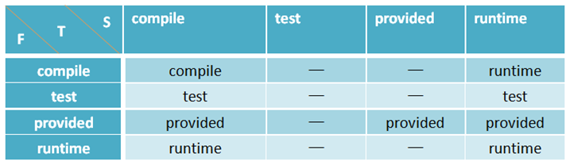
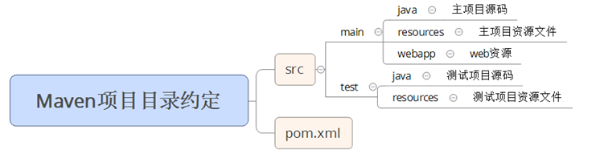

# Maven

* Apache组织中一个服务于基于Java平台的项目构建、依赖管理和项目信息管理的优秀工具。Maven是优秀的构建工具：自动化构建过程、跨平台、标准化构建过程。
* 为Java开发者提供了一个免费的中央仓库，其中几乎可以找到任何流行的开源类库，通过Maven的衍生工具Nexus，可以进行快速的搜索。Maven项目目录结构有约定的规则，约定优于配置（Convention Over Configuration）。
* 声明式的，项目构建过程和过程各阶段所需工作都要插件实现，大部分插件都是现成的，开发者只需要声明项目的基本元素，Maven就可以执行内置的，完整的构建过程。
* 一个项目管理和综合工具。Maven 提供了开发人员构建一个完整的生命周期框架。开发团队可以自动完成项目的基础工具建设，Maven 使用标准的目录结构和默认构建生命周期。
* 在多个开发团队环境时，Maven 可以设置按标准在非常短的时间里完成配置工作。由于大部分项目的设置都很简单，并且可重复使用，Maven 让开发人员的工作更轻松，同时创建报表，检查，构建和测试自动化设置。
* Maven简化和标准化项目建设过程。处理编译，分配，文档，团队协作和其他任务的无缝连接。 Maven 增加可重用性并负责建立相关的任务。

## 安装

```sh
brew install maven

export MAVEN_HOME=/usr/local/Cellar/maven/3.5.2
export PATH=$PATH:$MAVEN_HOME/bin

# linux
sudo tar -xzvf /user/local/apache-maven-3.6.2-bin.tar.gz
# ~/.bashrc
export MAVEN_HOME=/usr/local/apache-maven-3.6.2
export PATH=${MAVEN_HOME}/bin:$PATH

maven -v

# window
choco install marven
```

## 原理

* POM( Project Object Model，项目对象模型 ) 是 Maven 工程的基本工作单元，是一个XML文件，包含了项目的基本信息，用于描述项目如何构建，声明项目依赖，等等
  - 项目依赖
  - 插件
  - 执行目标
  - 项目构建 profile
  - 项目版本
  - 项目开发者列表
  - 相关邮件列表信息
* 构建（build）生命周期定义了一个项目构建跟发布的过程。典型由以下几个阶段的序列组成
  - 验证 validate   验证项目  验证项目是否正确且所有必须信息是可用的
  - 编译 compile  执行编译  源代码编译在此阶段完成
  - 测试 Test   测试  使用适当的单元测试框架（例如JUnit）运行测试。
  - 包装 package  打包  创建JAR/WAR包如在 pom.xml 中定义提及的包
  - 检查 verify   检查  对集成测试的结果进行检查，以保证质量达标
  - 安装 install  安装  安装打包的项目到本地仓库，以供其他项目使用
  - 部署 deploy   部署  拷贝最终的工程包到远程仓库中，以共享给其他开发人员和工程
* 标准的生命周期：
  - clean：项目清理的处理
  - default(或 build)：项目部署的处理
  - site：项目站点文档创建的处理


### 更新策略

Maven根据项目的pom.xml文件，把它转化成项目对象模型(POM)，这时要解析依赖关系，然后去相对应的maven库中查找所依赖的jar包。在clean，compile，test，package等生命周期阶段都有相应的Plug-in来做这些事情，而这些Plug-in会产生一些中间产物。

* 当本地仓库没有依赖构件的时候，Maven会自动从远程仓库下载；当依赖版本为快照版本时，Maven会自动找到最新的快照。
* 当依赖范围scope=system时，Maven直接从本地文件系统解析构件；
* 根据依赖坐标计算仓库路径后，尝试直接从本地仓库寻找构件，若发现构件则解析成功；
* 在本地仓库不存在相应构件的情况下，若依赖版本是显式的发布版本构件时，如1.1.0、1.2-alpha-1等，则便利所有的远程仓库，发现后下载到本地仓库并解析使用；
* 如果依赖的版本是RELEASE或者LASTEST，则基于更新策略读取所有远程仓库的元数据groupId/artifactId/maven-metadata.xml，将其与本地仓库的对应元数据合并后，计算出RELEASE或者LASTEST的真实值，然后基于真实值检查本地和远程仓库；
* 如果依赖版本是SNAPSHOT，则基于更新策略读取所有远程仓库的元数据groupId/artifactId/version/maven-metadata.xml，将其与本地仓库的对应元数据合并后，得到最新快照版本的值，然后基于该值检查本地或者从远程仓库下载；
* 如果最后解析到的构件版本是时间戳格式的快照，如1.0-20170712.191220-2，则复制其时间戳格式的文件至非时间戳格式，如SNAPSHOT，并使用该非时间戳格式的构件。

当依赖的版本不明晰的时候，如RELEASE、LASTEST、SNAPSHOT，Maven就需要基于更新远程仓库的更新策略来检查更新。

### Maven仓库

构件：在Maven的世界，任何一个依赖、插件或者项目构建的输出，即xxx.jar;任何一个构件都有一组坐标唯一标识。

仓库：得益于坐标机制，任何Maven项目使用任何一个构件的方式都是完全相同的，在此基础上，Maven可以在某个位置统一存储所有Maven项目共享的构件，这个统一的位置就是仓库。

```java
public class DefaultRepositoryLayout
    implements ArtifactRepositoryLayout
{
    private static final char PATH_SEPARATOR = '/';
    private static final char GROUP_SEPARATOR = '.';
    private static final char ARTIFACT_SEPARATOR = '-';
    public String getId()
    {
        return "default";
    }

    public String pathOf( Artifact artifact )
    {
        ArtifactHandler artifactHandler = artifact.getArtifactHandler();

        StringBuilder path = new StringBuilder( 128 );

        path.append( formatAsDirectory( artifact.getGroupId() ) ).append( PATH_SEPARATOR );
        path.append( artifact.getArtifactId() ).append( PATH_SEPARATOR );
        path.append( artifact.getBaseVersion() ).append( PATH_SEPARATOR );
        path.append( artifact.getArtifactId() ).append( ARTIFACT_SEPARATOR ).append( artifact.getVersion() );

        if ( artifact.hasClassifier() )
        {
            path.append( ARTIFACT_SEPARATOR ).append( artifact.getClassifier() );
        }

        if ( artifactHandler.getExtension() != null && artifactHandler.getExtension().length() > 0 )
        {
            path.append( GROUP_SEPARATOR ).append( artifactHandler.getExtension() );
        }

        return path.toString();
    }

    private String formatAsDirectory( String directory )
    {
        return directory.replace( GROUP_SEPARATOR, PATH_SEPARATOR );
    }
}
```

比如：groupId=com.feiyue、artifactId=demo、version=1.0、artifactId=jdk7、packaging=jar

其对应的路径生成如下：

* groupId路径：formatAsDirectory()将groupId中的’.’转换成’/’，com.feiyue就会转换成com/feiyue，之后再加一个’/’，就变成com/feiyue/
* artifactId路径：在groupId基础的加上artifactId，再加上一个’/，变成com/feiyue/demo/
* version路径：在前面基础上加上version，再加上一个’/，变成com/feiyue/demo/1.0/
* 依次加上artifactId、一个’-’、version，就变成com/feiyue/demo/1.0/demo-1.0
* 如果有classfier,4)会变成com/feiyue/demo/1.0/demo-1.0-jdk7
* 如果extension存在则依次加上’.’、extension。代码中extension是从artifactHandler而非artifact中获取，artifactHandler是由packaging决定的。故packaging决定了构件的扩展名，因此最终的路径为com/feiyue/demo/1.0/demo-1.0-jdk7.jar

### 仓库分类

Maven仓库分为两类：本地仓库和远程仓库。当Maven根据坐标寻找构件时，首先会查看本地仓库，若本地仓库存在此构件则直接使用；若本地仓库不存在此构件，Maven就会去远程仓库查找，查找到下载到本地仓库再使用。若本地仓库和远程仓库都没有需要的构件，Maven就会报错。

* 中央仓库： Maven核心自带的远程仓库，包含了绝大部分开源构件，默认情况，当本地仓库没有Maven需要构件时，就从中央仓库下载。这个配置文件是所有Maven项目都会继承的超级POM.
```
<repositories>
  <repository>
   <id>central</id>
   <name>Central Repository</name>
   <url>https://repo.maven.apache.org/maven2</url>
   <layout>default</layout>
   <snapshots>
    <enabled>false</enabled>
   </snapshots>
  </repository>
</repositories>
```

* 私服：一种特殊的远程仓库，为节省带宽和时间，应在局域网内架设一个私有仓库服务器，用其代理所有外部的远程仓库。特殊的远程仓库，架设在局域网内的仓库服务，代理公网的远程仓库，当Maven需要下载构件时，从私服请求，若私服不存在该构件，则从公网远程仓库下载，缓存到私服之后，再为Maven的下载请求提供服务。另外无法从公网仓库下载的构件也能从本地上传到私服供项目使用。私服优点：节省外网带宽、提供Maven构件速度、部署第三方构件、提供Maven构件稳定性、降低中央仓库负荷。
```

```
* 本地仓库：用户自定义本地仓库的地址，需编辑${user.home}/.m2/setting.xml文件，设置localRepository节点的值为仓库地址即可，默认情况下${user.home}/.m2/setting.xml是不存在的，需要用户从安装目录复制${M2_HOME}/conf/setting.xml文件在进行编辑。
```
<settings>
<localRepository>E:/maven/repository</localRepository>
</settings>
```

### 坐标

唯一标识Maven构件，坐标元素分为groupId、artifactId、version、packaging、classifier.

* groupId:必选，定义当前Maven项目隶属的实际项目，不一定是一对一的关系，通常一个实际项目会被划分成很多模块。groupId一般不应该只定义到公司级别，一个公司可能会有很多实际项目，如果groupId只定义到组织级别，那么artifactId只能定义Maven项目。命名方式和Java包名类似，域名反向一一对应。例如：org.springframework.
* artifactId:必选，定义实际项目中的一个Maven模块，推荐使用实际项目名称-模块名称，这样便于找到某个项目的一组构件。例如：spring-core,spring-beans,spring-web等。
* version:必选，定义Maven项目当前所处的版本。例如：4.3.9.RELEASE、1.0-SNAPSHOT、RELEASE、LATEST、2.1等。
* packaging:可选默认是jar，定义Maven项目的打包方式。打包方式有jar、war、pom等。
* classifier:不能直接定义，帮助定义构建输出的一些附属构件。附属构件与主构件对应，例如-javadoc.jar、-sources.jar附属构件包含了java文档和源代码。

## 管理

maven 提供了开发人员的方式来管理：

* Documentation
* Reporting
* Dependencies
* SCMs
* Releases
* Distribution
* mailing list

### 依赖管理

依赖范围有以下几种：

* compile:编译依赖范围，没有指定默认使用该依赖范围。对于编译、测试、运行三种classpath都有效。例如：spring-core。
* test:测试依赖范围，只对测试classpath有效，在编译主代码或者运行项目是无法使用。例如：junit。
* provided:已提供依赖范围，对于编译和测试classpath有效，运行时无效。例如：servlet-api
* runtime:运行时依赖范围，对于测试和运行classpath有效，但在编译主代码时无效。例如：spring-jdbc。
* system:系统依赖范围，和provided作用一致。但是system范围的依赖时必须通过systemPath元素显示第指定依赖文静的路径。由于该类依赖不是通过Maven仓库解析的，而且往往与本机系统绑定，可能造成不可抑制，应谨慎使用。
* import:只使用在dependencyManagement中，表示从其他的pom中导入depency的配置，不会对三种classpath产生实际的影响。

* 传递性依赖：maven模块 -> spring-jdbc -> spring-core -> commons-logging，假设： A -> B -> C，即A对B是第一直接依赖，B对C是第二直接依赖，A对C是传递性依赖，第一直接依赖（简称F）和第二直接依赖（简称S）的范围决定了传递性依赖（简称T）的范围。
* 依赖调解：依赖调解第一原则：路径最近者优先。例如：A -> B -> C -> X1 长度为3 A -> D -> X2 长度为2，因此X2会被解析使用,依赖调解第二原则：第一原则优先，依赖路径相等时，POM中依赖声明顺序靠前的优先。
* 可选依赖：A依赖于B，B依赖于X和Y，B对于X和Y的依赖都是可选依赖，即optional=true,AB、BX（可选）、BY（可选）。可选依赖不会传递，即X、Y对A没有影响。可选依赖一般是多种互斥的特性，具体使用时只选其一。
* 排除依赖：使用exclusions元素声明排除依赖，exclusions包含一个或者多个exclusion子元素，因此可以排除一个或者多个传递性依赖。注意声明exclusion时只需要groupId和artifactId，而不需要version元素，因为只需要groupId和artifactId就可以唯一定位依赖图中的某个依赖。
* 归类依赖：pring的依赖包版本都是相同的，可以使用properties元素定义Maven属性spring.version=4.x,在定义依赖时可以使用美元符号加大括弧环绕的方式来引用Maven属性，例如${spring.version}。


## 聚合与继承

* 聚合：多个项目或者模块聚合到一起，建立一个package方式为pom的项目parent专门负责聚合工作，并使用modules-module指定子模块，目的是快速构建项目。(组合)
*继承：多个模块聚合时，子模块需要继承父模块以消除重复配置。（级联）

聚合与继承的共同点是聚合POM与继承关系中的父POM的packaging都必须是pom。

## 安装

* 需要安装JDK
* [官网](maven.apache.org)通过镜像下载

Winwows

* 下载maven包，解压
* 配置环境变量：文件目录M2_HOME=D:\develop\apache-maven-3.5.0，添加 ;% M2_HOME%\bin
* 测试 `mvn -v`

Linux

* `tar xzvf apache-maven-3.5.0-bin.tar.gz`
* `export M2_HOME = /home/develop/apache-maven-3.5.0`  `export PATH = PATH;M2_HOME/bin`
* `echo $M2_HOME` `mvn -v`

Mac

* `vi ~/.bash_profile `
* 添加 `export M2_HOME=/usr/local/apache-maven-3.3.9` `export PATH=$PATH:$M2_HOME/bin`
* `source ~/.bash_profile`
* `mvn --version`

* `brew install maven`
* /usr/local/Cellar/maven/3.5.0/libexec/conf/settings.xml

## 目录结构

* bin：该目录下mvn、mvnDebug是基于Linux平台的shell脚本，mvn.bat、mvnDebug.bat是基于Windows平台的bat脚本，在命令行输入mvn命令时实际上是调用mvn或mvn.bat脚本。mvn和mvnDebug的区别是mvnDebug多了一条MAVEN_DEBUG_OPTS配置，作用是运行Maven时开启debug模式以调试Maven本身。m2.conf文件是classworlds的配置文件，Maven启动时会自动加载。
* boot： 该目录只包含一个文件plexus-classworlds-2.5.2.jar，plexus-classworlds是一个类加载器框架，相对于默认的java类加载器，它提供了更加丰富的语法以便配置，Maven使用该框架加载自己的类库。
* conf： 该目录包含了Maven的配置文件settings.xml，可以指定2种级别：全局级别：直接修改maven.conf/settings.xml文件可以全局定制Maven的行为，对一台机器上的所有用户有效。用户级别：将该文件复制到{user.home}/.m2/目录下，然后修改settings.xml配置，在当前用户范围内定制Maven的行为。
* lib： 该目录包含了所有Maven运行时需要的Java类库，Maven本身是分模块的maven-*.jar都是maven自己的包，还有很多第三方依赖包。
* LICENSE： Maven使用的软件许可证是Apache LicenseVersion 2.0。
* NOTICE： Apache Maven Distribution使用的第三方软件。
* README.txt： Maven的简明介绍，包括系统要求、安装说明、Maven URLS等。

## 基本命令

```
mvn validate 验证，验证项目是正确的并且所有的信息是可用的；
mvn clean 清理，清理项目缓存输出，一般是target文件夹被删除；
mvn compile 编译，将java源文件编译成.class文件；
mvn test 测试，生成测试报告，运行test目录下的所有单元测试；
mvn package 打包，将项目打成jar、war或者pom；  会执行validate、clean、compile、test、package五个阶段
mvn install 安装，将当前项目安装到本地maven库，供其他项目依赖；
mvn deploy部署，在构建环境中完成，复制最终的包到远程库。
```

## 项目创建

* 手动创建:Maven项目由一个自己默认的配置，使用者不需要修改那些约定的内容，这就是“约定优于配置”，按照Maven项目目录约定，手动创建各个文件夹即可，一般不会使用这种方式。动态web的Maven项目的目录约定如下图所示：
* 命令行:在项目目录 `mvn archetype:generate -DgroupId=com.cloud.hellomaven -DartifactId=hellomaven-service -Dversion=1.0.0-SNAPSHOT -Dpackage=com.cloud.service`
* Eclipse提供了一个很好的插件m2eclipse无缝将Maven和Eclipse集成在一起，配置插件选择本地maven目录和配置文件setting.xml即可。
* Idea IDE 创建一个maven web项目

## Setting文件配置

配置用户范围和全局范围的setting.xml

* 全局范围： ${maven.conf}/settings.xml文件可以全局定制Maven的行为，对一台机器上的所有用户有效。
* 用户范围： ${user.home}/.m2/settings.xml，只有当前用户才会受到该配置影响，还便于Maven的升级，Maven升级新版本时不需要触动该文件，推荐配置用户范围。

### 代理
公司网络需要通过安全认证的代理访问因特网，这种情况下需要为Maven配置HTTP代理，才能正常访问外部仓库下载所需要的资源。在settings.xml文件中添加代理配置。proxies下可以添加多个proxy节点，默认第一个active为true的会生效。nonProxyHost表示不需要代理访问的地址。中间的竖线分隔多个地址，此处可以使用星号作为通配符号。
```
<proxies>
   <proxy>
     <id>myproxy</id>
     <active>true</active>
     <protocol>http</protocol>
     <host>192.0.0.100</host>
     <port>1234</port>
     <username>xxxxx</username>
     <password>xxxxx</password>
     <nonProxyHosts>*.xxx.com|xxx.org</nonProxyHosts>
   </proxy>
</proxies>
```

###  远程仓库的认证

一些远程仓库出于安全考虑需要提供用户名、密码进行认证才能访问，这时需要配置认证信息，认证信息必须配置到setting.xml文件中，只放在本机，其他成员不可见，在setting.xml文件中添加server配置，一个servers可以配置一个或者多个server，假设一个id为feiyue-repo的仓库配置认证如下：
```
<servers>
  <server>
   <id>feiyue-repo</id>
   <username>repo-username</username>
   <password>repo-pwd</password>
  </server>
</servers>
```
setting.xml文件中server元素的id必须与pom.xml文件中需要认证的repository元素的id完全一致。

### 镜像

如果仓库X可以提供仓库Y存储的所有内容，则X可以被称为Y的一个镜像。镜像往往能够提供比中央仓库更快的服务，配置Maven使用镜像来代替中央仓库，编辑setting.xml文件。
```
<mirrors>
 <mirror>
      <id>jboss-public-repository-group</id>
      <mirrorOf>central</mirrorOf>
     <name>JBoss Public Repository Group</name>  <url>http://repository.jboss.org/nexus/content/groups/public</url>
 </mirror>
</mirrors>
```

- mirrorOf：值为central，表示该配置为中央仓库的镜像，任何对于中央仓库的请求都会转至该镜像；`*`：匹配所有远程仓库;`external`:匹配所有远程仓库,使用localhost的除外，使用file://协议的除外，即匹配不在本机上的远程仓库；`rep1,rep2`:匹配id=rep1和id=rep2的仓库，使用逗号分隔多个远程仓库；`*,!rep2`：匹配所有远程仓库，rep2除外，使用感叹号将仓库从匹配中排除。
- id:是远程仓库的唯一标识。如果需要认证，基于该id配置仓库认证。
- name:阅读方便可自定义的名称。
- url：远程仓库的地址

## POM 文件解析

project根节点下配置parent节点指定继承的父项目坐标，groupId、artifactId、version必选，唯一标识父项目，relativePath：可选，父项目的pom.xml文件的相对路径，默认值是../pom.xml.

Maven首先在当前构建项目的地方寻找父项目的pom，其次在本地文件系统的relativePath位置，然后在本地仓库，最后在远程仓库寻找父项目的pom.

parent父项目配置
```
<parent>
    <groupId>com.feiyue.parent</groupId>
    <artifactId>feiyue-parent</artifactId>
    <version>1.0-SNAPSHOT</version>
    <relativePath>../pom.xml</relativePath>
</parent>
```

dependency依赖配置
```
<dependency>
<groupId>xx</groupId>
<artifactId>yy</artifactId>
<version>x.x</version>
<scope> </scope>
<type></type>
<optional></optional>
<exclusions>
  <exclusion></exclusion>
</exclusions>
</dependency>
```
groupId、artifactId、version必选，依赖的基本坐标，找到需要的依赖。

* type：依赖的类型，对应于项目坐标中定义的packaging，该元素不必声明默认为jar.
* scope：依赖的范围,参考上面依赖规则。Maven在编译项目主代码时使用一套classpath，主代码中使用到的其他jar以依赖被引入到classpath中；Maven在编译和执行测试的时候会使用另外一套classpath；实际运行Maven项目的时候，又会使用一套classpath。故Maven项目依赖范围就是控制依赖于三种classpath（编译classpath、测试classpath、运行classpath）的关系。
* optional:标记依赖是否可选
* exclusions：用来排除传递性依赖
* pluginManagement默认插件配置

配置到project-build节点中，配置供子项目引用的插件。
```
<!--子项目可以引用的默认插件信息。该插件配置项直到被引用时才会被解析或绑定到生命周期。给定插件的任何本地配置都会覆盖这里的配置-->
<pluginManagement>
    <!--使用的插件列表-->
    <plugins>
        <!--plugin元素包含描述插件所需要的信息-->
        <plugin>
            <!--插件在仓库里的groupId-->
            <groupId></groupId>
            <!--插件在仓库里的artifactId-->
            <artifactId></artifactId>
            <!--被使用的插件的版本-->
            <version></version>
            <!--是否从该插件下载Maven扩展（例如打包和类型处理器）默认为false，由于性能原因，只有在真需要下载时，该元素才被设置成true。-->
            <extensions></extensions>
            <!--在构建生命周期中执行一组目标的配置。每个目标可能有不同的配置。-->
            <executions>
                <!--execution元素包含了插件执行需要的信息-->
                <execution>
                    <!--执行目标的标识符，用于标识构建过程中的目标，或者匹配继承过程中需要合并的执行目标-->
                    <id></id>
                    <!--绑定了目标的构建生命周期阶段，如果省略，目标会被绑定到源数据里配置的默认阶段-->
                    <phase></phase>
                    <!--配置的执行目标-->
                    <goals></goals>
                    <!--配置是否被传播到子POM-->
                    <inherited></inherited>
                    <!--作为DOM对象的配置-->
                    <configuration></configuration>
                </execution>
            </executions>
            <!--项目引入插件所需要的额外依赖-->
            <dependencies>
                <!--参见dependency元素配置-->
                <dependency>
                </dependency>
            </dependencies>
            <!--任何配置是否被传播到子项目-->
            <inherited></inherited>
            <!--作为DOM对象的配置-->
            <configuration></configuration>
        </plugin>
    </plugins>
</pluginManagement>
```

repositories远程仓库的配置

很多情况默认的中央仓库无法满足项目需求，需要配置其他远程仓库，如JBoss Maven库，需要在Pom.xml文件中配置。
```
<repositories>
 <repository>
  <id>jboss-maven2-release-repository</id>
  <name>JBoss Repository</name>
  <url>http://repository.jboss.org/maven2/</url>
  <releases>
   <enabled>true</enabled>
   <checksumPolicy>ignore</checksumPolicy>
   <updatePolicy>daily</updatePolicy>
  </releases>
  <snapshots>
   <enabled>false</enabled>
   <checksumPolicy>fail</checksumPolicy>
   <updatePolicy>always</updatePolicy>
  </snapshots>
  <layout>default</layout>
 </repository>
</repositories>
```

在repositories元素下可以声明一个或多个远程仓库。

* id:任何一个仓库声明的id必须是唯一的，Maven自带中央仓库id为central，如果其他仓库声明id也是central，就会覆盖中央仓库的配置。
* url:指向仓库的地址，一般该地址是基于http协议，用户可以浏览器中打开仓库地址浏览构件。
* releases:支持发布版本下载。
* snapshots:支持快照版本下载，enabled=true时开启releases和snapshots还有2个子元素。
* checksumPolicy：配置Maven检查检验和文件的策略。当构建被部署到仓库中时，会同时部署对应的校验和文件，在下载构件的时候，Maven会验证校验和文件，如果校验和验证失败，会根据checksumPolicy的值进行选择。默认值是warn-Maven会在执行构建时输出警告信息，可用值还有fail-Maven遇到校验和错误时就让构建失败；ignore-使Maven完全忽略校验和错误。
* updatePolicy：配置Maven从远程仓库检查更新的频率，默认值是daily。可用值有daily-每天检查一次、always-每次构建都会检查更新、interval:X-每个X分钟检查一次更新、never-从不检查更新.
* layout:值为default表示仓库的布局是Maven2及Maven3的默认布局。

## nexus 搭建 Maven 私服

公司内部大部分人的电脑不能访问公网，不能从maven的中央仓库下载依赖，因此找一台有公网权限的机器搭建nexus私服，其他项目组人员连接到这个私服上即可.

下载nexus包
* console-nexus.bat：命令行方式启动nexus服务器，窗口关闭不会注册为windows服务
* install-nexus.bat：将nexus安装成windows服务，开机时自动启动
* start-nexus.bat：启动nexus服务，也可以直接在管理-服务中手动启动nexus服务
* stop-nexus.bat：停止nexus服务
* uninstall-nexus.bat：卸载nexus服务

配置环境变量

```
NEXUS_HOME= D:\develop\nexus\nexus-2.12.0-01
Path= ;%NEXUS_HOME%\bin\jsw\windows-x86-64
```
访问http://localhost:8081/nexus/，用户名 adamin 密码 admin123

* 用户管理
* 角色管理
* 配置代理服务器
* 配置repository：
    - proxy：远程仓库的代理，把Download Remote Indexes改为true，使用搜索功能
    - hosted：宿主仓库，用户可以把自己的一些构件部署到hosted中，也可以手动上传到hosted中。配置hosted repository：一般会配置3个hosted repository，分别是3rd party、Snapshots、Releases，分别用来保存第三方jar（典型的比如ojdbc6.jar），项目组内部的快照、项目组内部的发布版。只是Deployment Policy这个选项，一般Snapshots会配置成允许，而Releases和3rd party会设置为禁止
    - group：是nexus特有的。目的是通过对实体仓库（proxy、hosted）进行聚合多个仓库聚合，对用户暴露统一的地址，用户就不必在pom中配置多个地址了，只要统一配置group即可。
## 仓库搜索服务

* [Sonatype Nexus](https://repository.sonatype.org/)Nexus是当前最流行的开源Maven仓库管理软件，提供了关键字搜索、类名搜索、坐标搜索、校验等功能。
* [Mvnrepository](http://mvnrepository.com/)界面友好，提供基于关键字的搜索、构件下载、依赖声明代码片段。
* [中央仓库检索服务](http://search.maven.org/)

## 参考

- [学会 Maven 项目的构建与管理](http://blog.csdn.net/gitchat/article/details/77932302)
