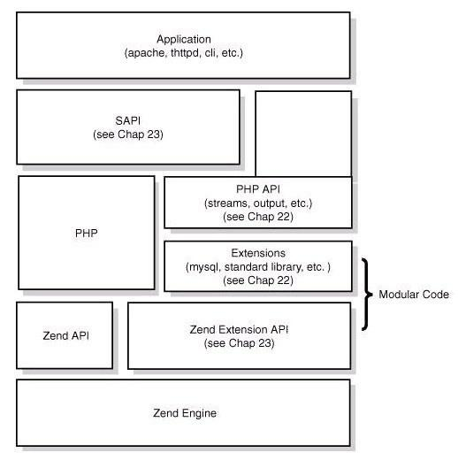

# PHP

PHP是一门弱类型的语言，变量在声明的那一刻是不需要确定它的类型的，而在运行时类型也会发生显式或隐式的类型改变.所用的程序是要经过两层代理

* PHP代表HyperText预处理器。
* PHP是一种解释型语言，即不需要编译。
* PHP是一种服务器端脚本语言。
* PHP比其他脚本语言更快,如：Python和asp。
* HTTP协议在Nginx等服务器的解析下,传送给相应的Handler（PHP等）来处理。后端渲染，默认html处理，模版文件以.php后缀
* 服务端脚本程序，只能通过服务器访问，需要配置虚拟主机调试

## 安装

```sh
gzip -d httpd-2_x_NN.tar.gz
tar -xf httpd-2_x_NN.tar

cd httpd-2_x_NN
./configure --enable-so  //  --with-mpm=worker 替换默认prework
make
make install

/usr/local/apache2/bin/apachectl start/stop   service httpd restart

gunzip php-NN.tar.gz
tar -xf php-NN.tar

cd ../php-NN
./configure --with-apxs2=/usr/local/apache2/bin/apxs --with-mysql // 可以根据需要重新编译
make
make install

LoadModule php5_module modules/libphp5.so // httpd.conf中添加

./configure --enable-fpm --with-mysql
sudo make install

cp php.ini-development /usr/local/php/php.ini
cp /usr/local/etc/php-fpm.conf.default /usr/local/etc/php-fpm.conf
cp sapi/fpm/php-fpm /usr/local/bin
```

 php.ini 文件中的配置项 cgi.fix_pathinfo 设置为 0  // 如果文件不存在，则阻止 Nginx 将请求发送到后端的 PHP-FPM 模块， 以避免遭受恶意脚本注入的攻击
 确保 php-fpm 模块使用 www-data 用户和 www-data 用户组的身份运行

### windows

下载PHP安装包，解压即可

```bash
./php.exe -f e:\www\test.php # 不一定非php扩展名文件
php.exe -v
php.exe -i # 运行phpinfo()函数

php.exe -m # 显示已经加载了那些module
php -a # 进入命令行模式
```

### Mac

* 程序路径：`/usr/local/Cellar/php71/7.1.12_23`
* 配置文件: `/usr/local/etc/php/7.1/` The php.ini and php-fpm.ini file
* /usr/local/opt/php71/sbin/php-fpm --nodaemonize --fpm-config /usr/local/etc/php/7.1/php-fpm.conf :nginx 通过php-fpm进程运行
* php71卸载后php-fpm仍然运行

```sh
brew install php71
brew info php71

## 配置文件添加扩展
include=/usr/local/etc/php/7.1/conf.d/*.ini

mkdir -p ~/Library/LaunchAgents
cp /usr/local/opt/php71/homebrew.mxcl.php71.plist ~/Library/LaunchAgents/
launchctl load -w ~/Library/LaunchAgents/homebrew.mxcl.php71.plist

sudo brew services start/stop/restart php71

PHP Startup: Unable to load dynamic library # 扩展重复加载

php -i | grep php.ini
php -m

# 默认php-cli为/usr/bin/php，提升优先级
echo 'export PATH="/usr/local/opt/php@7.1/bin:$PATH"' >> ~/.zshrc
echo 'export PATH="/usr/local/opt/php@7.1/sbin:$PATH"' >> ~/.zshrc
```

### linux源码安装

```sh
lsb_release -a # 系统环境查看

yum -y install make apr* autoconf automake curl-devel gcc gcc-c++ zlib-devel openssl openssl-devel pcre-devel gd # 编译环境的准备

yum install -y vsftpd # ftp环境的搭建(使用 非root 用户后，在ftp客户端上传相关的源码
useradd asion
service vsftpd status

libxml2 # libxml2 安装(xml和html文件相关依赖的库)
tar -zxvf libxml2-2.6.30
cd libxml2-2.6.30
./configure --prefix=/usr/local/libxml2
make && make install

cd /lamp/libmcrypt-2.5.8 # libmcrypt-2.5.8 安装(加密库)
./configure --prefix=/usr/local/libmcrypt/
make && make install
# 进入libmcrypt-2.5.8文件夹内的
libltdl > cd ./libmcrypt-2.5.8/libltdl
./configure --enable-ltdl-install
make && make install
# zlib库安装
./configure
make && make install
# png图片库安装
./configure --prefix=/usr/local/libpng/
make && make install
# jpeg图片库安装(需要自己创建jpeg6)
mkdir /usr/local/jpeg6
mkdir /usr/local/jpeg6/bin
mkdir /usr/local/jpeg6/lib
mkdir /usr/local/jpeg6/include
mkdir -p /usr/local/jpeg6/man/man1
cd /lamp/jpeg-6b
./configure --prefix=/usr/local/jpeg6/ --enable-shared --enable-static
make && make install
# freetype字体库安装
./configure --prefix=/usr/local/freetype/
make && make install
# autoconfig生成makefile安装(不需要指定安装路径)
./configure
make && make install
# GD 库 的 安 装
./configure --prefix=/usr/local/gd2/ --with-jpeg=/usr/local/jpeg6/ --with-freetype=/usr/local/freetype/ --enable
make && make install
# 注意:当make的时候，出现以下错误
configure.ac:64: error: possibly undefined macro: AM_ICONV
If this token and others are legitimate, please use m4_pattern_allow. See the Autoconf documentation.
make: *** [configure] Error 1
# 解决方案:解决办法 ，编译加m4_pattern_allow参数 即:./configure --enable-m4_pattern_allow 便能顺利编译安装

# 安装PHP
cd /usr/local/src/php-5.3.28
./configure --prefix=/usr/local/php/ --with-config-file-path=/usr/local/php/etc/ --with-apxs2=/usr/local/apache2/bin/apxs --with-my make
make install
cp php.ini-dist /usr/local/php/etc/php.ini

# 打开Apache的配置文件(添加AddType这两行)
cd /etc/httpd/
vim httpd.conf
AddType application/x-httpd-php .php
AddType application/x-httpd-source .phps

cd /usr/local/php/etc/
vim php.ini
date.timezone = Asia/Shanghai
```

## [PHP发展](https://segmentfault.com/a/1190000008888700)

* composer:PHP 的依赖管理可以变得非常简单
* PHP7:对 Zend 引擎做了大量修改，大幅提升了 PHP 语言的性能.做好 MySQL 优化，使用 Memcache 和 Redis 进行加速
* [PSR](http://www.php-fig.org/)组织制定的PHP语言开发规范，约定了很多方面的规则，如命名空间、类名 规范、编码风格标准、Autoload、公共接口等
* Swoole:Swoole 是一个异步并行的通信引擎，作为 PHP 的扩展来运行。Node.js 的异步回调 Swoole 有，Go语言的协程 Swoole 也有，这完全颠覆了对 PHP 的认知.使用 Swoole PHP 可以实现常驻内存的 Server 程序，可以实现 TCP 、 UDP 异步网络通信的编程开发。比如 WebSocket 即使通信、聊天、推送服务器、RPC 远程调用服务、网关、代理、游戏服务器等。
* Laravel:社区非常活跃，代码贡献者众多，第三方的插件非常多，生态系统相当繁荣。 Laravel 底层使用了很多 symfony2 组件，通过 composer 实现了依赖管理。Laravel 提供的命令行工具基于 symfony.console 实现，功能强大，集成了各种项目管理、自动生成代码的功能。
* Phar:PHP5.3 之后支持了类似 Java 的 jar 包，名为 phar。用来将多个 PHP 文件打包为一个文件。这个特性使得 PHP 也可以像 Java 一样方便地实现应用程序打包和组件化。一个应用程序可以打成一个 Phar 包，直接放到 PHP-FPM 中运行。配合 Swoole ，可以在命令行下执行 php server.phar 一键启动服务器。PHP 的代码包可以用 Phar 打包成组件，放到 Swoole 的服务器容器中去加载执行。
* PHP 作为一门动态脚本语言，优点是开发方便效率高。缺点就是性能差。在密集运算的场景下比 C 、 C++ 相差几十倍甚至上百倍。另外 PHP 不可以直接操作底层，需要依赖扩展库来提供 API 实现。PHP 程序员可以学习一门静态编译语言作为补充实现动静互补，C/C++/Go 都是不错的选择。而且静态语言的编程体验与动态语言完全不同，学习过程可以让你得到更大的提升。 掌握 C/C++ 语言后，还可以阅读 PHP 、 Swoole 、 Nginx 、Redis 、 Linux内核 等开源软件的源码，了解其底层运行原理。 现在最新版本的Swoole提供了C++扩展模块的支持，封装了Zend API，用C++操作PHP变得很简单，可以用C++实现PHP扩展函数和类。
* HTML5
* Vue.js 可以非常方便地实现数据和 DOM 元素的绑定。通过 Ajax 请求后台接口返回数据后，更新前端数据自动实现界面渲染。
* React Native 是一个不错的选择
* 深度学习/人工智能:自动驾驶、大数据分析、网络游戏、图像识别、语言处理等。当然现在普通的工程师可能还无法参与到人工智能产品中，但至少应该理解深度学习/人工智能的基本概念和原理。
* PHP
    * 7.1 :2015.12.3 性能提升
    * 7.2 JIT(JUST_IN_TIME)

### 原理

* Zend 引擎:PHP4 以后加入 PHP 的，是对原有PHP解释器的重写，整体使用 C 语言进行开发，也就是说可以把PHP理解成用C写的一个编程语言软件，引擎的作用是将PHP代码翻译为一种叫opcode的中间语言，它类似于JAVA的ByteCode（字节码）。引擎对PHP代码会执行四个步骤：
    - 词法分析 Scanning（Lexing），将 PHP 代码转换为语言片段（Tokens）。
    - 解析 Parsing， 将 Tokens 转换成简单而有意义的表达式。
    - 编译 Compilation，将表达式编译成Opcode。
    - 执行 Execution，顺序执行Opcode，每次一条，以实现PHP代码所表达的功能。
    - APC、Opchche 这些扩展可以将Opcode缓存以加速PHP应用的运行速度，使用它们就可以在请求再次来临时省略前三步。
    - 引擎也实现了基本的数据结构、内存分配及管理，提供了相应的API方法供外部调用。
* Extensions 扩展:常见的内置函数、标准库都是通过extension来实现的，这些叫做PHP的核心扩展，用户也可以根据自己的要求安装PHP的扩展。
* SAPI(Server Application Programming Interface)中文为服务端应用编程接口，它通过一系列钩子函数使得PHP可以和外围交换数据，SAPI 就是 PHP 和外部环境的代理器，它把外部环境抽象后，为内部的PHP提供一套固定的，统一的接口，使得 PHP 自身实现能够不受错综复杂的外部环境影响，保持一定的独立性。通过 SAPI 的解耦，PHP 可以不再考虑如何针对不同应用进行兼容，而应用本身也可以针对自己的特点实现不同的处理方式。
* 上层应用:程序员编写的PHP程序，无论是 Web 应用还是 Cli 方式运行的应用都是上层应用，PHP 程序员主要工作就是编写它们。



## CGI vs Cli

### Cli

* 用多进程, 子进程结束以后, 内核会负责回收资源
* 使用多进程,子进程异常退出不会导致整个进程Thread退出. 父进程还有机会重建流程.
* 一个常驻主进程, 只负责任务分发, 逻辑更清楚.
* 完全支持多线程
* 如上，可以实现定时任务
* 开发桌面应用就是使用PHP-CLI和GTK包
* linux下用php编写shell脚本

与PHP不同的配置文件
由webserver使用的php.ini文件，会配置比较短的max_execution_time，而在命令行中的php.ini文件，会配置比较长的max_execution_time。

```php
php --ini
php -r "echo php_sapi_name();" // 判断当前执行的php是什么模式下 R RUN
php -f /path/to/yourfile.php # 调用PHP CLI解释器，并给脚本传递参数。这种方法首先要设置php解释器的路径，Windows平台在运行CLI之前，需设置类似path c:\php的命令，也失去了CLI脚本第一行的意义，因此不建议使用该方法。

第二种方法是首先运行chmod+x <要运行的脚本文件名>（UNIX/Linux环境），将该PHP文件置为可执行权限，然后在CLI脚本头部第一行加入声明（类似于#! /usr/bin/php或PHP CLI解释器位置），接着在命令行直接执行。这是CLI首选方法，建议采用
```

### 包管理工具

* [PECL](http://pecl.php.net/)：PHP Extension Community Library，管理着最底层的PHP扩展。这些扩展是用 C 写的。
* [PEAR](http://pear.php.net/)：PHP Extension and Application Repository，管理着项目环境的扩展。用 PHP 写的。
* Composer：和PEAR都管理着项目环境的依赖，这些依赖也是用 PHP 写的，区别不大。但 composer 却比 PEAR 来的更受欢迎

```sh
curl -O http://pear.php.net/go-pear.phar
sudo php -d detect_unicode=0 go-pear.phar

# 修改bin路径
pear version

sudo apt install php7.2-dev # to use phpize  生成编译检测脚本
```

## 语法

### 基础

* PHP代码的标记：<?php …… ?>
* PHP文件的扩展名：.php
* PHP中每行程序代码，必须以英文下的分号(;)结束。而JS中分号可以省略。
* PHP程序区分大小写的，但函数名和关键字不区分大小写。如：if、break、switch
* 访问PHP文件，必须要经过服务器，或者以域名开头来访问。如：http://www.2015.com/test.php
* PHP文件及路径上不能包括中文或空格。
* 单行注释：//、#
* 多行注释：/* …… */
* 变量：临时存储数据的容器，指向值的指针。保存数据内存位置的名称。 变量是用于保存临时数据的临时存储
    - 变量的名称，可以包含：字母、数字、下划线。
    - 变量的名称，不能以数字和特殊符号开头，但可以以字母或下划线开头。如：$_ABC、$abc
    - 变量名称前必须要带“$”符号。“$”不是变量名称一部分，它只是对变量名称的一个引用或标识符。
    - 变量名称区分大小写。如：$name和$Name是两个变量
    - 对于由几个单词构成的变量名称的命名规则
        + “驼峰式”命名：$getUserName、$getUserPwd
        + “下划线”命名：$get_user_name、$set_user_pwd
    - 赋值：$variablename指向value存储的地址
    - `$$var`是一个引用变量，用于存储$var的值
* 常量
    - define()函数：define(name, value, case-insensitive = false) 区分大小写
    - const关键字在编译时定义常量。 它是一个语言构造不是一个函数。比define()快一点，因为它没有返回值。它总是区分大小写的
    - 魔术常量
        + __LINE__  表示使用当前行号。
        + __FILE__    表示文件的完整路径和文件名。 如果它在include中使用，则返回包含文件的名称。
        + __DIR__ 表示文件的完整目录路径。 等同于dirname(__file__)。 除非它是根目录，否则它没有尾部斜杠。 它还解析符号链接。
        + __FUNCTION__    表示使用它的函数名称。如果它在任何函数之外使用，则它将返回空白。
        + __CLASS__   表示使用它的函数名称。如果它在任何函数之外使用，则它将返回空白。
        + __TRAIT__   表示使用它的特征名称。 如果它在任何函数之外使用，则它将返回空白。 它包括它被声明的命名空间。
        + __METHOD__  表示使用它的类方法的名称。方法名称在有声明时返回。
        + __NAMESPACE__   表示当前命名空间的名称。

```php
$variablename = value;

define("MESSAGE","Hello YiiBai PHP");
const MESSAGE="Hello const by YiiBai PHP";
```

### 控制语句

* echo：是一个语言结构(语句)，不是一个函数，所以不需要使用括号。但是如果要使用多个参数，则需要使用括号。打印字符串，多行字符串，转义字符，变量，数组等。
* print
* 嵌套的使用：执行在内还是在外
* 条件
    - if
    - if-else
    - if-else-if
    - 嵌套if
    - switch语句
* 循环
    - for语句
    - foreach循环循环用于遍历数组元素
    - while
    - do...while
* break:中断了当前for，while，do-while，switch和for-each循环的执行。 如果在内循环中使用break，它只中断了内循环的执行。
* continue:

```php
#!/usr/bin/env php
print "Hello, Red Hat Developers World from PHP " . PHP_VERSION . "\n";
echo "<h2>Hello First PHP</h2>";

$num=12;
if($num<100){
    echo "$num is less than 100";
}

if($num%2==0){
    echo "$num is even number";
}else{
    echo "$num is odd number";
}

switch($num){
    case 10:
        echo("number is equals to 10");
        break;
    case 20:
        echo("number is equal to 20");
        break;
    case 30:
        echo("number is equal to 30");
        break;
    default:
        echo("number is not equal to 10, 20 or 30");
}

for($n=1;$n<=10;$n++){
    echo "$n<br/>";
}

$season=array("summer","winter","spring","autumn");
foreach( $season as $arr ){
    echo "Season is: $arr<br />";
}

$n=1;
while($n<=10){
    echo "$n<br/>";
    $n++;
}

$n=1;
do{
    echo "$n<br/>";
    $n++;
}while($n<=10);

for($i=1;$i<=10;$i++){
    echo "$i <br/>";
    if($i==5){
        break;
    }
}
```

### 数据类型

变量本身没有类型之说，所说的类型是指变量中，存储的数据的类型。

* 标量类型
    - 布尔型
    - 字符串型
        + 单引号PHP字符串中，大多数转义序列和变量不会被解释。 可以使用单引号\'反斜杠和通过\\在单引号引用PHP字符串。
        + 双引号的PHP字符串中存储多行文本，特殊字符和转义序列
    - 整型
    - 浮点型
* 复合类型
    - 数组
        + 索引数组
        + 关联数组
        + 多维数组
    - 对象
* 特殊类型
    - NULL:unset() 与 NULL：删除引用，触发相应变量容器refcount减一，但在函数中的行为会依赖于想要销毁的变量的类型而有所不同，比如unset 一个全局变量，则只是局部变量被销毁，而在调用环境中的变量(包括函数参数引用传递的变量)将保持调用 unset 之前一样的值；unset 变量与给变量赋值NULL不同，变量赋值NULL直接对相应变量容器refcount = 0
    - 资源

```php
$season=array("summer","winter","spring","autumn");
$season[0]="summer";
$season[1]="winter";
$season[2]="spring";
$season[3]="autumn";
$salary=array("Hema"=>"350000","John"=>"450000","Kartik"=>"200000");
$salary["Hema"]="350000";
$salary["John"]="450000";
$salary["Kartik"]="200000";
echo count($salary);
foreach($salary as $k => $v) {
    echo "Key: ".$k." Value: ".$v."<br/>";
}
$emp = array
  (
  array(1,"sonoo",400000),
  array(2,"john",450000),
  array(3,"rahul",300000)
  );
for ($row = 0; $row < 3; $row++) {
    for ($col = 0; $col < 3; $col++) {
        echo $emp[$row][$col]."  ";
    }
  echo "<br/>";
}

$salary=array("Maxsu"=>"550000","Vimal"=>"250000","Ratan"=>"200000");
print_r(array_change_key_case($salary,CASE_UPPER)); # Array ( [SONOO] => 550000 [VIMAL] => 250000 [RATAN] => 200000 )
print_r(array_chunk($salary,2, $preserve_keys = false));

$season=array("summer","winter","spring","autumn");

sort($season);
foreach( $season as $s )
{
    echo "$s<br />";
}

$reverseseason=array_reverse($season);
foreach( $reverseseason as $s )
{
  echo "$s<br />";
}

$key=array_search("spring",$season);
echo $key;

$name1=array("maxsu","john","vivek","minsu");
$name2=array("umesh","maxsu","kartik","minsu");
$name3=array_intersect($name1,$name2);
foreach( $name3 as $n )
{
  echo "$n<br />";
}

$str='Hello text within single quote';
$str2="Using double \"quote\" with backslash inside double quoted string";

$str=strtolower("My name is Yiibai"); # strtoupper
$str=ucwords("My name is Yiibai"); # strtoupper
$str=ucfirst("My name is Yiibai"); # lcfirst
$str=strrev("My name is Yiibai"); # lcfirst

$len=strlen("My name is Yiibai");

$str = preg_replace_callback(
    '/([a-z]*)([A-Z]*)/',
    function($matchs){
        return strtoupper($matchs[1]).strtolower($matchs[2]);
    },
$str
);

//示例一：函数内销毁全局变量$foo是无效的
function destroy_foo() {
    global $foo;
    unset($foo);
    echo $foo;//Notice: Undefined variable: foo
}
$foo = 'bar';
destroy_foo();
echo $foo;//bar

//示例二：要在函数中 unset 一个全局变量，应使用 $GLOBALS 数组来实现
function foo()
{
    unset($GLOBALS['bar']);
}
$bar = "something";
foo();
echo $bar;//Notice: Undefined variable: bar
```

#### 运算符

用于对操作数执行操作

* 算术运算符:`* / % + - `
* 比较运算符:`< <= > >= == != === !== <>`
* 按位运算符:`<< >>`
* 逻辑运算符:`&& || and xor or !`
* 字符串运算符:`.`
* 递增/递减运算符
* 数组运算符
* 类型运算符:`instanceof (int) (float) (string) (array) (object) (bool)`
* 执行操作符
* 错误控制操作符
* 分配操作符:`= += -= *= **= /= .= %= &= ^= <<= >>= =>`
* 位运算符：`& ^ |`
* 三元运算符：`?:`

```php
// 涉及数字比较，优先转化为数字
var_dump('abcd' == 0);
var_dump(0 == 'abcd');
var_dump('0' == 'abcd');

define("READ", 1);
define("WRITE", 2);
define("DELETE", 4);
define("UPDATE", 8);

$permission = READ|WRITE; // 赋予权限
$permission = READ & ~WRITE; // 禁止写权限

if( READ & $permission ){ //判断权限
　　echo "ok";
}
```

#### 杂项

* 数学函数
* 表单处理:post get提交请求
* 包含文件
    - 用于包含基于给定路径的文件。 可以使用文件的相对路径或绝对路径
    - 文件丢失时包含的处理方式：include语句允许脚本继续，但require语句暂停脚本产生致命的E_COMPILE_ERROR级别错误。
* json
    - json_encode()函数返回值JSON的表示形式：它将PHP变量(包含数组)转换为JSON格式数据。
    - json_decode()函数解码JSON字符串：将JSON字符串转换为PHP变量。
* 电子邮件

```php
abs(-7)
abs(-7.2)
ceil(-4.8) # -4
floor(-4.8) # -5
sqrt(25)

decbin(10) # 1010
dechex(10) # a
decoct(22) # 26
bindec(1011) # 11
$n1=10;
echo (base_convert($n1,10,2)."<br/>");// 1010

require("menu.html");

ini_set("sendmail_from", "maxsujaiswal@yiibai.com");
$to = "maxsujaiswal1987@gmail.com";//change receiver address
$subject = "This is subject";
$message = "This is simple text message.";
$header = "From:maxsujaiswal@yiibai.com \r\n";

$result = mail ($to,$subject,$message,$header);

if( $result == true ){
  echo "Message sent successfully...";
}else{
  echo "Sorry, unable to send mail...";
}

$to = "abc@example.com";//发送HTML消息
$subject = "This is subject";
$message = "<h1>This is HTML heading</h1>";

$header = "From:xyz@example.com \r\n";
$header .= "MIME-Version: 1.0 \r\n";
$header .= "Content-type: text/html;charset=UTF-8 \r\n";

$result = mail ($to,$subject,$message,$header);

if( $result == true ){
  echo "Message sent successfully...";
}else{
  echo "Sorry, unable to send mail...";
}

$to = "abc@example.com";  # 使用附件发送邮件
$subject = "This is subject";
$message = "This is a text message.";
# Open a file
$file = fopen("/tmp/test.txt", "r" );//change your file location
if( $file == false )
{
 echo "Error in opening file";
 exit();
}
# Read the file into a variable
$size = filesize("/tmp/test.txt");
$content = fread( $file, $size);

# encode the data for safe transit
# and insert \r\n after every 76 chars.
$encoded_content = chunk_split( base64_encode($content));

# Get a random 32 bit number using time() as seed.
$num = md5( time() );

# Define the main headers.
$header = "From:xyz@example.com\r\n";
$header .= "MIME-Version: 1.0\r\n";
$header .= "Content-Type: multipart/mixed; ";
$header .= "boundary=$num\r\n";
$header .= "--$num\r\n";

# Define the message section
$header .= "Content-Type: text/plain\r\n";
$header .= "Content-Transfer-Encoding:8bit\r\n\n";
$header .= "$message\r\n";
$header .= "--$num\r\n";

# Define the attachment section
$header .= "Content-Type:  multipart/mixed; ";
$header .= "name=\"test.txt\"\r\n";
$header .= "Content-Transfer-Encoding:base64\r\n";
$header .= "Content-Disposition:attachment; ";
$header .= "filename=\"test.txt\"\r\n\n";
$header .= "$encoded_content\r\n";
$header .= "--$num--";

# Send email now
$result = mail ( $to, $subject, "", $header );
if( $result == true ){
  echo "Message sent successfully...";
}else{
  echo "Sorry, unable to send mail...";
}
<?
//add() function with two parameter
function add($x,$y)
{
    $sum=$x+$y;
    echo "Sum = $sum <br><br>";
}
//sub() function with two parameter
function sub($x,$y)
{
    $sub=$x-$y;
    echo "Diff = $sub <br><br>";
}
//call function, get  two argument through input box and click on add or sub button
if(isset($_POST['add']))
{
    //call add() function
     add($_POST['first'],$_POST['second']);
}
if(isset($_POST['sub']))
{
    //call add() function
    sub($_POST['first'],$_POST['second']);
}
?>
<form method="post">
    Enter first number: <input type="number" name="first"/><br>
    Enter second number: <input type="number" name="second"/><br>
<input type="submit" name="add" value="ADDITION"/>
<input type="submit" name="sub" value="SUBTRACTION"/>
</form>
```

#### Lambda表达式(匿名函数)与闭包

Lambda表达式(匿名函数)实现了一次执行且无污染的函数定义，是抛弃型函数并且不维护任何类型的状态。闭包在匿名函数的基础上增加了与外部环境的变量交互，通过 use 子句中指定要导入的外部环境变量

```php
function getClosure($n)
{
      $a = 100;
      return function($m) use ($n, &$a) {
            $a += $n + $m;
            echo $a."\n";
        };
}
$fn = getClosure(1);
$fn(1);//102
$fn(2);//105
$fn(3);//109
echo $a;//Notice: Undefined variable

class Dog
{
    private $_name;
    protected $_color;

    public function __construct($name, $color)
    {
         $this->_name = $name;
         $this->_color = $color;
    }

    public function greet($greeting)
    {
         return function() use ($greeting) {
            //类中闭包可通过 $this 变量导入对象
            echo "$greeting, I am a {$this->_color} dog named {$this->_name}.\n";
         };
    }

    public function swim()
     {
         return static function() {
            //类中静态闭包不可通过 $this 变量导入对象，由于无需将对象导入闭包中，
            //因此可以节省大量内存，尤其是在拥有许多不需要此功能的闭包时。
            echo "swimming....\n";
         };
     }

     private function privateMethod()
     {
        echo "You have accessed to {$this->_name}'s privateMethod().\n";
     }

     public function __invoke()
    {
         //此方法允许对象本身被调用为闭包
         echo "I am a dog!\n";
    }
}

$dog = new Dog("Rover","red");
$dog->greet("Hello")();
$dog->swim()();
$dog();
//通过ReflectionClass、ReflectionMethod来动态创建闭包，并实现直接调用非公开方法。
$class = new ReflectionClass('Dog');
$closure = $class->getMethod('privateMethod')->getClosure($dog);
$closure();

$username = $_GET['user'] ?? 'nobody';

$a < $b ($a <=> $b) === -1
$a <= $b    ($a <=> $b) === -1 || ($a <=> $b) === 0
$a == $b    ($a <=> $b) === 0
$a != $b    ($a <=> $b) !== 0
$a >= $b    ($a <=> $b) === 1 || ($a <=> $b) === 0
$a > $b ($a <=> $b) === 1

$bytes = random_bytes(5);
var_dump(bin2hex($bytes));//string(10) "385e33f741"
var_dump(random_int(100, 999));//int(248)
```

### 函数

一段可以重复使用多次的代码。 它可以接受输入作为参数列表和返回值

* 参数
    - 引用调用:要传递值作为参考(引用)，您需要在参数名称前使用＆符号(&)。
    - 值调用:传递给函数的值默认情况下不会修改实际值(通过值调用),传递给函数的值是通过值调用。作用域函数范围内
    - 默认参数
    - 可变长度参数函数
* 返回值
* 递归函数

addslashes函数转义风险：对于URL参数arg = %df\'在经过addslashes转义后在GBK编码下arg = 運'
urldecode函数解码风险：对于URL参数uid = 1%2527在调用urldecode函数解码(二次解码)后将变成uid = 1'

```php
function sayHello(){
    echo "Hello PHP Function";
}
sayHello();//calling function

function sayHello($name,$age = 28){
echo "Hello $name, you are $age years old<br/>";
}
sayHello("Maxsu",27);
sayHello("Minsu",26);
sayHello("John",23);
sayHello("Henry");

function increment($i)
{
    $i++;
}
$i = 10;
increment($i);
echo $i; # 10

function increment(&$i)
{
    $i++;
}
$i = 10;
increment($i);
echo $i;  # 11

function add(...$numbers) {
    $sum = 0;
    foreach ($numbers as $n) {
        $sum += $n;
    }
    return $sum;
}
echo add(1, 2, 3, 4);

function display($number) {
    if($number<=5){
     echo "$number <br/>";
     display($number+1);
    }
}
display(1);

function factorial($n)
{
    if ($n < 0)
        return -1; /*Wrong value*/
    if ($n == 0)
        return 1; /*Terminating condition*/
    return ($n * factorial ($n -1));
}
echo factorial(5);
```

### 状态管理

服务器端存储技术

* cookie是一个小段信息，存储在客户端浏览器中。它可用于识别用户。cookie在服务器端创建并保存到客户端浏览器。 每当客户端向服务器发送请求时，cookie都会嵌入请求。 这样，cookie数据信息可以在服务器端接收。
    - 设置
    - 获取
    - 删除
* session:用于临时存储和从一个页面传递信息到另一个页面(直到用户关闭网站).广泛应用于购物网站，我们需要存储和传递购物车信息。 用户名，产品代码，产品名称，产品价格等信息从一个页面传递到另一个页面。
    - PHP会话为每个浏览器创建唯一的用户ID，以识别用户，并避免多个浏览器之间的冲突。
    - session_start()函数用于启动会话。 它启动一个新的或恢复现有会话。 如果已创建会话，则返回现有会话。 如果会话不可用，它将创建并返回新会话。
    - $_SESSION是一个包含所有会话变量的关联数组。 它用于设置和获取会话变量值。
    - session_destroy()

```php
setcookie("CookieName", "CookieValue");/* defining name and value only*/
setcookie("CookieName", "CookieValue", time()+1*60*60);//using expiry in 1 hour(1*60*60 seconds or 3600 seconds)
setcookie("CookieName", "CookieValue", time()+1*60*60, "/mypath/", "yiibai.com", 1);

$value=$_COOKIE["CookieName"];//returns cookie value

<?php
setcookie("user", "Maxsu");
?>
<?php
if(!isset($_COOKIE["user"])) {
    echo "Sorry, cookie is not found!";
} else {
    echo "<br/>Cookie Value: " . $_COOKIE["user"];
}
?>

# session1.php
<?php
session_start();
?>
<html>
<body>
<?php
$_SESSION["user"] = "Maxsu";
echo "Session information are set successfully.<br/>";
?>
<a href="session2.php">Visit next page</a>
</body>
</html>
# session2.php
<?php
session_start();
?>
<html>
<body>
<?php
echo "User is: ".$_SESSION["user"];
?>
</body>
</html>

<?php
session_start();

if (!isset($_SESSION['counter'])) {
    $_SESSION['counter'] = 1;
} else {
    $_SESSION['counter']++;
}
echo ("Page Views: ".$_SESSION['counter']);
```

### 文件操作

* 创建文件
* 打开文件：resource fopen ( string $filename , string $mode [, bool $use_include_path = false [, resource $context ]] )函数用于打开文件或URL并返回资源。 fopen()函数接受两个参数$ filename和$mode。 $filename表示要被打开的文件，$mode表示文件模式
    - r 以只读模式打开文件。 它将文件指针放在文件的开头。
    - r+  以读写模式打开文件。 它将文件指针放在文件的开头。
    - w   以只写模式打开文件。 它将文件指针放在文件的开头，并将文件截断为零长度。 如果找不到文件，则会自动创建一个新文件。
    - w+  以读写模式打开文件。 它将文件指针放在文件的开头，并将文件截断为零长度。 如果找不到文件，则会自动创建一个新文件。
    - a   以只写模式打开文件。 它将文件指针放在文件的末尾。 如果找不到文件，则会创建一个新文件。
    - a+  以读写模式打开文件。 它将文件指针放在文件的末尾。 如果找不到文件，则会创建一个新文件。
    - x   以只写模式创建和打开文件。 它将文件指针放在文件的开头。 如果找到文件，fopen()函数返回FALSE。
    - x+  它与x相同，但它以读写模式创建和打开文件。
    - c   以只写模式打开文件。 如果文件不存在，则会创建它。 如果存在，它不会被截断(与’w‘相反)，也不会调用此函数失败(如’x‘的情况)。 文件指针位于文件的开头
    - c+  它与c相同，但它以读写模式打开文件。
* 读取文件：string fread (resource $handle , int $length )函数用于读取文件的数据。 它需要两个参数：文件资源($handle 由fopen()函数创建的文件指针)和文件大小($length 要读取的字节长度)
    - 逐行读取文件：string fgets ( resource $handle [, int $length ] )函数用于从文件中读取单行数据内容。
    - 逐个字符读取文件：string fgetc ( resource $handle )函数用于从文件中读取单个字符。 要使用fgetc()函数获取所有数据，请在while循环中使用!feof()函数作为条件。
* 写入文件：int fwrite ( resource $handle , string $string [, int $length ] )：用于将字符串的内容写入文件。
    - 如果再次运行上面的代码，它将擦除文件的前一个数据并写入新的数据。
    - 附加文件
* 删除文件：bool unlink ( string $filename [, resource $context ] )
* 关闭文件
* 上传文件：`bool move_uploaded_file ( string $filename , string $destination )`
    - $_FILES['filename']['name']   返回文件名称
    - $_FILES['filename']['type'] 返回文件的MIME类型
    - $_FILES['filename']['size'] 返回文件的大小(以字节为单位)
    - $_FILES['filename']['tmp_name'] 返回存储在服务器上的文件的临时文件名。
    - $_FILES['filename']['error']    返回与此文件相关联的错误代码。
* 下载文件：int readfile ( string $filename [, bool $use_include_path = false [, resource $context ]] )
    - $filename：表示文件名
    - $use_include_path：它是可选参数。它默认为false。可以将其设置为true以搜索included_path中的文件。
    - $context：表示上下文流资源。
    - int：它返回从文件读取的字节数。

```php
$filename = "c:\\myfile.txt";
$handle = fopen($filename, "r");//open file in read mode
$contents = fread($handle, filesize($filename));//read file
echo $contents;//printing data of file
fclose($handle);//close file

$fp = fopen('data.txt', 'w');//open file in write mode
fwrite($fp, 'hello ');
fwrite($fp, 'php file');
fclose($fp);
echo "File written successfully";

$status=unlink('data.txt');
if($status){
echo "File deleted successfully";
}else{
echo "Sorry!";
}

$fp  = fopen('lock.txt', 'w+');
if (flock($fp, LOCK_EX)) {
    fwrite($fp, 'write something');
    flock($fp, LOCK_UN);
} else {
    echo "file is locking...";
}
fclose($fp);

$fp = fopen("c:\\file1.txt", "r");//open file in read mode
while(!feof($fp)) {
  echo fgetc($fp);
}
fclose($fp);

$fp = fopen('data.txt', 'a');//opens file in append mode
fwrite($fp, ' this is additional text ');
fwrite($fp, 'appending data');
fclose($fp);
echo "File appended successfully";

# uploadform.html
<form action="uploader.php" method="post" enctype="multipart/form-data">
    选择上传的文件:
    <input type="file" name="fileToUpload"/>
    <input type="submit" value="Upload Image" name="submit"/>
</form>

<?php
$target_path = "D:/";
$target_path = $target_path.basename( $_FILES['fileToUpload']['name']);

if(move_uploaded_file($_FILES['fileToUpload']['tmp_name'], $target_path)) {
    echo "File uploaded successfully!";
} else{
    echo "Sorry, file not uploaded, please try again!";
}
?>

$file_url = 'http://www.myremoteserver.com/file.exe';
header('Content-Type: application/octet-stream');
header("Content-Transfer-Encoding: Binary");
header("Content-disposition: attachment; filename=\"" . basename($file_url) . "\"");
readfile($file_url);
```

### MySQL

PHP 5.5以来，mysql_connect()扩展已被弃用。 现在，建议使用以下2种替代方法之一。

* mysqli_connection()
* PDO::__ construct()

```php
$host = 'localhost:3306';
$user = 'root';  // MySQL用户帐号
$pass = '';  // MySQL用户帐号对应的密码
$conn = mysqli_connect($host, $user, $pass);
if(! $conn )
{
  die('Could not connect: ' . mysqli_error());
}
echo 'Connected successfully';

$sql = 'CREATE Database mydb';
if(mysqli_query( $conn,$sql)){
  echo "Database mydb created successfully.";
}else{
echo "Sorry, database creation failed ".mysqli_error($conn);
}

$sql = "create table emp5(id INT AUTO_INCREMENT,name VARCHAR(20) NOT NULL,
emp_salary INT NOT NULL,primary key (id))";
if(mysqli_query($conn, $sql)){
 echo "Table emp5 created successfully";
}else{
echo "Could not create table: ". mysqli_error($conn);

$sql = 'INSERT INTO emp4(name,salary) VALUES ("maxsu", 9000)';
if(mysqli_query($conn, $sql)){
 echo "Record inserted successfully";
}else{
echo "Could not insert record: ". mysqli_error($conn);
}

$id=2;
$name="Rahul";
$salary=80000;
$sql = "update emp4 set name="$name", salary=$salary where id=$id";
if(mysqli_query($conn, $sql)){
 echo "Record updated successfully";
}else{
echo "Could not update record: ". mysqli_error($conn);
}

$id=2;
$sql = "delete from emp4 where id=$id";
if(mysqli_query($conn, $sql)){
 echo "Record deleted successfully";
}else{
echo "Could not deleted record: ". mysqli_error($conn);
}

$sql = 'SELECT * FROM emp4';
$retval=mysqli_query($conn, $sql);

if(mysqli_num_rows($retval) > 0){
 while($row = mysqli_fetch_assoc($retval)){
    echo "EMP ID :{$row['id']}  <br> ".
         "EMP NAME : {$row['name']} <br> ".
         "EMP SALARY : {$row['salary']} <br> ".
         "--------------------------------<br>";
 } //end of while
}else{
echo "0 results";
}

$sql = 'SELECT * FROM emp4 order by name';
$retval=mysqli_query($conn, $sql);

if(mysqli_num_rows($retval) > 0){
 while($row = mysqli_fetch_assoc($retval)){
    echo "EMP ID :{$row['id']}  <br> ".
         "EMP NAME : {$row['name']} <br> ".
         "EMP SALARY : {$row['salary']} <br> ".
         "--------------------------------<br>";
 } //end of while
}else{
echo "0 results";
}

mysqli_close($conn);
```

### 面向对象(OOP)

继承：类分层、接口分层
实现：类实现接口
依赖：类作为另一个类方法的参数
关联：类属性
聚合：可以有
组合：必须有

#### 对象

对象是一堆属性组成。对象在底层的实现。采取属性数组+方法数组来实现的。对象在zend中的定义是使用了一种zend_object_value结构体来存储的，这个结构体包含：

* 一个指针，也就是说明这个对象由哪个类实现出来的，这个类在哪里。
* 这个对象的属性。
* guards,阻止递归调用的。

对象的方法不会存在对象里面，要使用对象的方法，实际上是通过指针找到这个类，再用这个类里面的方法来执行的。（通过类序列化检测）

延迟绑定：之类重写父类方法，其它调用该方法时用static而非self

- PHP异步调用
- 正则匹配src标签
- 处理回文字符

#### 继承

默认继承父类构造函数

#### 访问控制(可见性)

* public表明类成员在任何地方可见
* protected表明类成员在其自身、子类和父类内可见
* private表明类成员只对自己可见。
* 对于private和protected有个特例，同一个类的对象即使不是同一个实例也可以互相访问对方的私有与受保护成员

范围解析符(::)：通常以self::、 parent::、 static:: 和 <classname>::形式来访问静态成员、类常量，另外，static::、self:: 和 parent:: 还可用来调用类中的非静态方法。类中实例话自己

* self
* parent
* static:调用类里面的方法

```php
class Test
{
    private $foo;

    public function __construct($foo)
    {
        $this->foo = $foo;
    }

    private function bar()
    {
        echo 'Accessed the private method.';
    }

    public function baz(Test $other)
    {
        // We can change the private property:
        $other->foo = 'hello';
        var_dump($other->foo);

        // We can also call the private method:
        $other->bar();
    }
}

$test = new Test('test');
$test->baz(new Test('other'));

# 延迟绑定
class A
{
    public static $proPublic = "public of A";

    public function myMethod()
    {
        echo static::$proPublic."\n";
    }

    public function test()
    {
        echo "Class A:\n";
        echo self::$proPublic."\n";
        echo __CLASS__."\n";
        //echo parent::$proPublic."\n";
        self::myMethod();
        static::myMethod();
    }
}

class B extends A
{
   public static $proPublic = "public of B";

   public function test()
    {
        echo "\n\nClass B:\n";
        echo self::$proPublic."\n";
        echo __CLASS__."\n";
        echo parent::$proPublic."\n";
        self::myMethod();
        static::myMethod();
    }
}

class C extends B
{
    public static $proPublic = "public of C";
}

$t1 = new A();
$t1->test();
$t2 = new B();
$t2->test();
$t3 = new C();
$t3->test();
```

#### 多态

多态性是指相同的操作或函数、过程可作用于多种类型的对象上并获得不同的结果。不同的对象，收到同一消息将可以产生不同的结果，这种现象称为多态性。“一个对外接口，多个内部实现方法”。在面向对象的理论 中，多态性的一般定义为：同一个操作作用于不同的类的实例，将产生不同的执行结果。也即不同类的对象收到相同的消息时，将得到不同的结果。

* 多态性允许每个对象以适合自身的方式去响应共同的消息。多态性增强了软件的灵活性和重用性。
* 面向对象编程并不只是将相关的方法与数据简单的结合起来，而是采用面向对象编程中的各种要素将现实生活中的各种情况清晰的描述出来。
* 采用面向对象中的多态主要在于可以将不同的子类对象都当作一个父类来处理，并且可以屏蔽不同子类对象之间所存在的差异，写出通用的代码，做出通用的编程，以适应需求的不断变化。
* 通常为了使项目能够在以后的时间里的轻松实现扩展与升级，需要通过继承实现可复用模块进行轻松升级。在进行可复用模块设计时，就需要尽可能的减少使用流程控制语句。此时就可以采用多态实现该类设计。

```php
<?php
class employee{//定义员工父类
    protected function working(){//定义员工工作，需要在子类的实现
        echo "本方法需要在子类中重载!";
    }
}
class painter extends employee{//定义油漆工类
    public function working(){//实现继承的工作方法
        echo "油漆工正在刷漆！/n";
    }
}
class typist extends employee{//定义打字员类
    public function working(){
        echo "打字员正在打字！/n";
    }
}
class manager extends employee{//定义经理类
    public function working(){
        echo "经理正在开会！";
    }
}
function printworking($obj){//定义处理方法
    if($obj instanceof employee){//若是员工对象，则显示其工作状态
        $obj->working();
    }else{//否则显示错误信息
        echo "Error: 对象错误！";
    }
}
printworking(new painter());//显示油漆工的工作
printworking(new typist());//显示打字员的工作
printworking(new manager());//显示经理的工作
?>
```

静态方法只能调静态变量

#### trait

实现多继承,优先级:当前类的成员>trait 的方法>被继承的方法。

```php
Trait OwnerTrait{
    public function owner(){
        var_dump('comment owner');
    }
}

class Comment{
    use OwnerTrait;
}
//(new Comment())->owner();
// 或者以下两行代码是一样的效果
$comment = new Comment();
$comment->owner();
```

#### 接口与抽象类

* 接口中的每个方法，继承类里面都要去实现 2.接口中的方法后面不要跟大口号{},因为接口只是定义需要有这个函数，并不是自己去实现 3.抽象类中 abstract 的方法，继承类里面都要去实现，也可以理解成接口中的每个方法都是 abstract 方法 4.抽象方法中没有abstract 的方法，继承类不必非要写那个方法

举例,场景：我们在记录日志的时候，有时候可能需要写入文件，有时候可能写入数据库 这时候，我们可以写一个Log接口，定义需要的方法 然后分别写一个FileLog类和一个DatabaseLog类 然后我们写一个UsersController类做一个依赖注入，这样我们需要使用哪种方式写日志，实例化的时候，注入哪种类即可

* 抽象类定义要使用abstract关键字来声明，凡是用abstract关键字定义了抽象方法的类必须声明为抽象类。另外，子类实现抽象方法时访问控制必须和父类中一样（或者更为宽松），同时调用方式必须匹配，即类型和所需参数数量必须一致；
* 接口是通过interface关键字来定义的，但其中定义所有的方法都是空的，访问控制必须是public。另外，接口可以如类一样定义常量，可以使用extends来继承其他接口；
* 抽象类可用于对多个同构类的通用部分定义，用extends关键字继承(父子间存在"is a"关系)，属单继承。接口可用于多个异构类的通用部分定义，用implements关键字继承(父子间存在"like a"关系)，可多继承。如果子类不能实现父类或接口的全部抽象方法，则该子类只能被声明成抽象类。
* 重写vs重载
    - 重载指多个名字相同，但参数不同的函数在同一作用域并存的现象.参数不同有三种情况：参数个数不同，参数类型不同，参数顺序不同.函数重载多见于强类型语言，编译后函数在函数符号表的名称一般是函数名加参数类型
        + php不支持：function_exists、 method_exists、is_callable、get_defined_functions、ReflectionMethod/ReflectionFunction类的getParameters/getNumberOfParameters/getNumberOfRequiredParameters
    - 重写出现在继承中，指子类重定义父类功能的现象，也被称为覆盖,即相同签名的成员函数在子类中重新定义（实现抽象函数或接口不是重写），是实现多态（polymorphism）的一种关键技术

```php
// 定义接口
interface  Log{
    public function save($message);
}

// 稳健型日志
class FileLog implements Log{
    public function save($message){
        var_dump('log into file'.$message);
    }
}
// 数据库型日志
class DatabaseLog implements Log{
    public function save($message){
        var_dump('log into database'.$message);
    }
}

//自定义类实现接口
class UsersController{
    protected $log;
    public function __construct(Log $log)
    {
        $this->log = $log;
    }

    public function register(){
        $name= 'long';
        $this->log->save($name);
    }
}

//$controller = new UsersController(new DatabaseLog());
//string(21) "log into databaselong"
$controller = new UsersController(new FileLog());
//string(17) "log into filelong"
$controller->register();
```

## 扩展

* intl
* mcrypt
* memeache
* memeached
    - memcache完全在PHP框架内开发的，提供了memcached的接口，memecached扩展是使用了libmemcached库提供的api与memcached服务端进行交互。 libmemcached 是 memcache 的 C 客户端，它具有低内存，线程安全等优点
    - memcache提供了面向过程及面向对象的接口，memached只支持面向对象的接口。 memcached 实现了更多的 memcached 协议。
    - memcached 支持 Binary Protocol，而 memcache 不支持，意味着 memcached 会有更高的性能。不过，还需要注意的是，memcached 目前还不支持长连接。
* mongo
* Opcache:通过将 PHP 脚本预编译的字节码存储到共享内存中来提升 PHP 的性能， 存储预编译字节码的好处就是省去了每次加载和解析 PHP 脚本的开销，但是对于I/O开销如读写磁盘文件、读写数据库等并无影响。
    - 字节码(Byte Code)：一种包含执行程序比机器码更抽象的中间码，由一序列 op代码/数据对组成的二进制文件。 比如Java源码经编译后生成的字节码在运行时通过JVM(JVM针对不同平台有不同版本，Java程序在JVM中运行而称 为解释性语言Interpreted)再做一次转换生成机器码，才能够跨平台运行；C#也类似，EXE文件的执行依赖.NET Framework；HHVM(HipHop Virtual Machine，Facebook开源的PHP虚拟机)采用了JIT(Just In Time Just Compiling，即时编译)技术，在运行时编译字节码为机器码，让他们的PHP性能测试提升了一个数量级。 唯有C/C++编译生成的二进制文件可直接运行。
    - 机器码(Machine Code)：也被称为原生码(Native Code)，用二进制代码表示的计算机能直接识别和执行的一种机器指令的集合，它是计算机硬件结构赋予的操作功能。
* pdo-pgsql
* phalcon
* redis: http://pecl.php.net/package/redis
* sphinx
* swoole
* xdebug
* apc:op缓存
* phpredis
* PHP-FPM进程池：FastCGI Process Manager 的master process是常驻内存的，以static、dynamic、ondemand三种方式来管理进程池中的worker process，可以有效控制内存和进程并平滑重载PHP配置，在发生意外情况的时候能够重新启动并恢复被破坏的 opcode。

```sh
brew tap homebrew/homebrew-php
brew install php71 --with-pear

brew install mcrypt
brew install php71-xdebug
```


## Docker配置

- mkdir -p ~/php-fpm/logs ~/php-fpm/conf
- 构建Dockerfile

```
FROM debian:jessie

# persistent / runtime deps

ENV PHPIZE_DEPS \ autoconf \ file \ g++ \ gcc \ libc-dev \ make \ pkg-config \ re2c RUN apt-get update && apt-get install -y \ $PHPIZE_DEPS \ ca-certificates \ curl \ libedit2 \ libsqlite3-0 \ libxml2 \ --no-install-recommends && rm -r /var/lib/apt/lists/*

ENV PHP_INI_DIR /usr/local/etc/php RUN mkdir -p $PHP_INI_DIR/conf.d

## <autogenerated>
</autogenerated>

ENV PHP_EXTRA_CONFIGURE_ARGS --enable-fpm --with-fpm-user=www-data --with-fpm-group=www-data

##

ENV GPG_KEYS 0BD78B5F97500D450838F95DFE857D9A90D90EC1 6E4F6AB321FDC07F2C332E3AC2BF0BC433CFC8B3

ENV PHP_VERSION 5.6.22 ENV PHP_FILENAME php-5.6.22.tar.xz ENV PHP_SHA256 c96980d7de1d66c821a4ee5809df0076f925b2fe0b8c362d234d92f2f0a178e2

RUN set -xe \ && buildDeps=" \ $PHP_EXTRA_BUILD_DEPS \ libcurl4-openssl-dev \ libedit-dev \ libsqlite3-dev \ libssl-dev \ libxml2-dev \ xz-utils \ " \ && apt-get update && apt-get install -y $buildDeps --no-install-recommends && rm -rf /var/lib/apt/lists/_ \ && curl -fSL "<http://php.net/get/$PHP_FILENAME/from/this/mirror>" -o "$PHP_FILENAME" \ && echo "$PHP_SHA256_ $PHP_FILENAME" | sha256sum -c - \ && curl -fSL "<http://php.net/get/$PHP_FILENAME.asc/from/this/mirror>" -o "$PHP_FILENAME.asc" \ && export GNUPGHOME="$(mktemp -d)" \ && for key in $GPG_KEYS; do \ gpg --keyserver ha.pool.sks-keyservers.net --recv-keys "$key"; \ done \ && gpg --batch --verify "$PHP_FILENAME.asc" "$PHP_FILENAME" \ && rm -r "$GNUPGHOME" "$PHP_FILENAME.asc" \ && mkdir -p /usr/src/php \ && tar -xf "$PHP_FILENAME" -C /usr/src/php --strip-components=1 \ && rm "$PHP_FILENAME" \ && cd /usr/src/php \ && ./configure \ --with-config-file-path="$PHP_INI_DIR" \ --with-config-file-scan-dir="$PHP_INI_DIR/conf.d" \ $PHP_EXTRA_CONFIGURE_ARGS \ --disable-cgi \

# --enable-mysqlnd is included here because it's harder to compile after the fact than extensions are (since it's a plugin for several extensions, not an extension in itself)

    --enable-mysqlnd \


# --enable-mbstring is included here because otherwise there's no way to get pecl to use it properly (see <https://github.com/docker-library/php/issues/195>)


    --enable-mbstring \
    --with-curl \
    --with-libedit \
    --with-openssl \
    --with-zlib \
&& make -j"$(nproc)" \
&& make install \
&& { find /usr/local/bin /usr/local/sbin -type f -executable -exec strip --strip-all '{}' + || true; } \
&& make clean \
&& apt-get purge -y --auto-remove -o APT::AutoRemove::RecommendsImportant=false -o APT::AutoRemove::SuggestsImportant=false $buildDeps


COPY docker-php-ext-* /usr/local/bin/

## <autogenerated>
</autogenerated>

WORKDIR /var/www/html

RUN set -ex \ && cd /usr/local/etc \ && if [ -d php-fpm.d ]; then \


    # for some reason, upstream's php-fpm.conf.default has "include=NONE/etc/php-fpm.d/*.conf"
    sed 's!=NONE/!=!g' php-fpm.conf.default | tee php-fpm.conf > /dev/null; \
    cp php-fpm.d/www.conf.default php-fpm.d/www.conf; \
else \
    # PHP 5.x don't use "include=" by default, so we'll create our own simple config that mimics PHP 7+ for consistency
    mkdir php-fpm.d; \
    cp php-fpm.conf.default php-fpm.d/www.conf; \
    { \
        echo '[global]'; \
        echo 'include=etc/php-fpm.d/*.conf'; \
    } | tee php-fpm.conf; \
fi \
&& { \
    echo '[global]'; \
    echo 'error_log = /proc/self/fd/2'; \
    echo; \
    echo '[www]'; \
    echo '; if we send this to /proc/self/fd/1, it never appears'; \
    echo 'access.log = /proc/self/fd/2'; \
    echo; \
    echo 'clear_env = no'; \
    echo; \
    echo '; Ensure worker stdout and stderr are sent to the main error log.'; \
    echo 'catch_workers_output = yes'; \
} | tee php-fpm.d/docker.conf \
&& { \
    echo '[global]'; \
    echo 'daemonize = no'; \
    echo; \
    echo '[www]'; \
    echo 'listen = [::]:9000'; \
} | tee php-fpm.d/zz-docker.conf
EXPOSE 9000 CMD ["php-fpm"]
```

- docker build -t php:5.6-fpm .
- docker run -p 9000:9000 --name myphp-fpm -v ~/nginx/www:/www -v $PWD/conf:/usr/local/etc/php -v $PWD/logs:/phplogs -d php:5.6-fpm

## 说明

* PHP5.5之后废弃mysql扩展

## 规范

### PSR0

类的自动加载

* 一个完全标准的命名空间(namespace)和类(class)的结构是这样的：\<Vendor Name>\(<Namespace>\)*<Class Name>
* 每个命名空间(namespace)都必须有一个顶级的空间名(namespace)("组织名(Vendor Name)")。
* 每个命名空间(namespace)中可以根据需要使用任意数量的子命名空间(sub-namespace)。
* 从文件系统中加载源文件时，空间名(namespace)中的分隔符将被转换为 DIRECTORY_SEPARATOR。
* 类名(class name)中的每个下划线_都将被转换为一个DIRECTORY_SEPARATOR。下划线_在空间名(namespace)中没有什么特殊的意义。
* 完全标准的命名空间(namespace)和类(class)从文件系统加载源文件时将会加上.php后缀。
* 组织名(vendor name)，空间名(namespace)，类名(class name)都由大小写字母组合而成。
* 自动加载

```php
function autoload($className)
{
    $className = ltrim($className, '\\');
    $fileName  = '';
    $namespace = '';
    if ($lastNsPos = strrpos($className, '\\')) {
        $namespace = substr($className, 0, $lastNsPos);
        $className = substr($className, $lastNsPos + 1);
        $fileName  = str_replace('\\', DIRECTORY_SEPARATOR, $namespace) . DIRECTORY_SEPARATOR;
    }
    $fileName .= str_replace('_', DIRECTORY_SEPARATOR, $className) . '.php';

    require $fileName;
}
spl_autoload_register('autoload');
```

### PSR4

描述的是通过文件路径自动载入类的指南；它作为对 PSR-0 的补充；根据这个 指导如何规范存放文件来自动载入；

* 术语「类」是一个泛称；它包含类，接口，traits 以及其他类似的结构；
* 完全限定类名应该类似如下范例：<NamespaceName>(<SubNamespaceNames>)*<ClassName>
    - 完全限定类名必须有一个顶级命名空间（Vendor Name）；
    - 完全限定类名可以有多个子命名空间；
    - 完全限定类名应该有一个终止类名；
    - 下划线在完全限定类名中是没有特殊含义的；
    - 字母在完全限定类名中可以是任何大小写的组合；
    - 所有类名必须以大小写敏感的方式引用；
* 当从完全限定类名载入文件时：
    - 在完全限定类名中，连续的一个或几个子命名空间构成的命名空间前缀（不包括顶级命名空间的分隔符），至少对应着至少一个基础目录。
    - 在「命名空间前缀」后的连续子命名空间名称对应一个「基础目录」下的子目录，其中的命名 空间分隔符表示目录分隔符。子目录名称必须和子命名空间名大小写匹配；
    - 终止类名对应一个以 .php 结尾的文件。文件名必须和终止类名大小写匹配；
* 自动载入器的实现不可抛出任何异常，不可引发任何等级的错误；也不应返回值；
* 自动生成的PSR4配置文件名称为autoload_psr4.php（PSR0的是autoload_namespace.php），配置文件返回一个关联数组，键是名称空间的前缀，值是名称空间前缀对应的路径。

## 框架

spl_autoload
spl_autoload_register

## 源码

* [php/php-src](https://github.com/php/php-src):The PHP Interpreter <http://www.php.net>
* [facebook/hhvm](https://github.com/facebook/hhvm):A virtual machine designed for executing programs written in Hack and PHP. <http://hhvm.com>

## 框架

* [pinguo/php-msf](https://github.com/pinguo/php-msf)PHP微服务框架即"Micro Service Framework For PHP"，是Camera360社区服务器端团队基于Swoole自主研发现代化的PHP协程服务框架，简称msf或者php-msf，是Swoole的工程级企业应用框架，经受了Camera360亿级用户高并发大流量的考验
* [Youzan Zan Php Installer](https://github.com/youzan/zan-installer)Youzan Zan Php Installer
* [tencent-php/tsf](https://github.com/tencent-php/tsf):coroutine and Swoole based php server framework in tencent
* [slimphp/Slim](https://github.com/slimphp/Slim):Slim Framework source code <http://slimframework.com>
* [nette/nette](https://github.com/nette/nette):METAPACKAGE for Nette Framework components https://nette.org
* [Tencent/Biny](https://github.com/Tencent/Biny):Biny is a tiny, high-performance PHP framework for web applications
* [reactphp/react](https://github.com/reactphp/react):Event-driven, non-blocking I/O with PHP. https://reactphp.org

### 论坛

- [flarum/flarum](https://github.com/flarum/flarum):Delightfully simple forum software. <http://flarum.org>

### 电商

- [magento/magento2](https://github.com/magento/magento2): a cutting edge, feature-rich eCommerce solution that gets results.
- [drupal/drupal](https://github.com/drupal/drupal):Verbatim mirror of the git.drupal.org repository for Drupal core. Changes will not be pulled, and merge requests will not be accepted, if you want to contribute, go to Drupal.org: https://drupal.org/project/drupal

### CMS

* [bolt/bolt](https://github.com/bolt/bolt):Bolt is a simple CMS written in PHP. It is based on Silex and Symfony components, uses Twig and either SQLite, MySQL or PostgreSQL.

### Wiki

* [MediaWiki](https://www.mediawiki.org/wiki/MediaWiki)

## 扩展

* [PHP 开发者如何做代码审查?](http://blog.csdn.net/gitchat/article/details/78050953)
* [thephpleague/glide](https://github.com/thephpleague/glide):Wonderfully easy on-demand image manipulation library with an HTTP based API. <http://glide.thephpleague.com>
* [dompdf/dompdf](https://github.com/dompdf/dompdf):HTML to PDF converter (PHP5) <http://dompdf.github.com/>
* [PHPOffice/PHPExcel](https://github.com/PHPOffice/PHPExcel):A pure PHP library for reading and writing spreadsheet files
* [briannesbitt/Carbon](https://github.com/briannesbitt/Carbon):A simple PHP API extension for DateTime. <http://carbon.nesbot.com/>
* [Intervention/image](https://github.com/Intervention/image):PHP Image Manipulation <http://image.intervention.io>
* [fzaninotto/Faker](https://github.com/fzaninotto/Faker):Faker is a PHP library that generates fake data for you
* [guzzle/guzzle](https://github.com/guzzle/guzzle):Guzzle, an extensible PHP HTTP client <http://guzzlephp.org/>
* [reactphp/react](https://github.com/reactphp/react):Event-driven, non-blocking I/O with PHP. <https://reactphp.org>
* [CopernicaMarketingSoftware/PHP-CPP](https://github.com/CopernicaMarketingSoftware/PHP-CPP):Library to build PHP extensions with C++ <http://www.php-cpp.com/>
* [nikic/PHP-Parser](https://github.com/nikic/PHP-Parser):A PHP parser written in PHP
* [jenssegers/laravel-mongodb](https://github.com/jenssegers/laravel-mongodb#installation):A MongoDB based Eloquent model and Query builder for Laravel (Moloquent) https://jenssegers.com
* [youzan/php-co-koa](https://github.com/youzan/php-co-koa)PHP异步编程: 手把手教你实现co与Koa
* [youzan/zan](https://github.com/youzan/zan)高效稳定、安全易用、线上实时验证的全异步高性能网络库，通过PHP扩展方式使用。
* [HanSon/youzan-sdk](https://github.com/HanSon/youzan-sdk)有赞 SDK
* [hprose/hprose-php](https://github.com/hprose/hprose-php)Hprose is a cross-language RPC
* [swoole/php-cp](https://github.com/swoole/php-cp)
* [thephpleague/omnipay](https://github.com/thephpleague/omnipay):A framework agnostic, multi-gateway payment processing library for PHP 5.3+ http://omnipay.thephpleague.com/
* [thephpleague/flysystem](https://github.com/thephpleague/flysystem):Abstraction for local and remote filesystems http://flysystem.thephpleague.com
* [thephpleague/oauth2-server](https://github.com/thephpleague/oauth2-server):A spec compliant, secure by default PHP OAuth 2.0 Server https://oauth2.thephpleague.com
* [thephpleague/fractal](https://github.com/thephpleague/fractal):Output complex, flexible, AJAX/RESTful data structures. http://fractal.thephpleague.com
* [thephpleague/oauth2-client](https://github.com/thephpleague/oauth2-client):Easy integration with OAuth 2.0 service providers. http://oauth2-client.thephpleague.com
* [thephpleague/climate](https://github.com/thephpleague/climate):PHP's best friend for the terminal. http://climate.thephpleague.com
* [thephpleague/csv](https://github.com/thephpleague/csv):CSV data manipulation made easy in PHP https://csv.thephpleague.com
* [thephpleague/glide](https://github.com/thephpleague/glide):Wonderfully easy on-demand image manipulation library with an HTTP based API. http://glide.thephpleague.com
* [thephpleague/skeleton](https://github.com/thephpleague/skeleton):A skeleton repository for League Packages http://thephpleague.com
* [KnpLabs/php-github-api](https://github.com/KnpLabs/php-github-api):A simple PHP GitHub API client, Object Oriented, tested and documented. For 5.5+.
* [twigphp/Twig](https://github.com/twigphp/Twig):Twig, the flexible, fast, and secure template language for PHP http://twig.sensiolabs.org/
* [smarty-php/smarty](https://github.com/smarty-php/smarty)

## 社区

- [coffeephp](http://coffeephp.com/)
- [fukuball/Awesome-Laravel-Education](https://github.com/fukuball/Awesome-Laravel-Education)

## 参考

- [codeguy/php-the-right-way](https://github.com/codeguy/php-the-right-way):An easy-to-read, quick reference for PHP best practices, accepted coding standards, and links to authoritative tutorials around the Web <http://www.phptherightway.com>
- [walu/phpbook](https://github.com/walu/phpbook):PHP扩展开发及内核应用
- [laruence/php7-internal](https://github.com/laruence/php7-internal):Understanding PHP7 Internal articles
- [PHP 教程](http://www.w3school.com.cn/php/)
- [Awesome PHP](http://coffeephp.com/resources)
- [ziadoz/awesome-php](https://github.com/ziadoz/awesome-php):A curated list of amazingly awesome PHP libraries, resources and shiny things.
- [DesignPatternsPHP](https://github.com/domnikl/DesignPatternsPHP)
- [PHP Best Practices](https://phpbestpractices.org)
- [php-fig/fig-standards](https://github.com/php-fig/fig-standards):Standards either proposed or approved by the Framework Interop Group http://www.php-fig.org/

## 工具

* [cytopia/docker-php-fpm-7.2](https://github.com/cytopia/docker-php-fpm-7.2):PHP-FPM 7.2 on CentOS 7 http://devilbox.org/
* [travis-ci-examples/php](https://github.com/travis-ci-examples/php):Example PHP project using Travis CI http://travis-ci.org

## 图书

* [PHP: The Right Way](http://www.phptherightway.com/) [PHP: The Right Way](https://github.com/codeguy/php-the-right-way)
* [reeze/tipi](https://github.com/reeze/tipi):Thinking In PHP Internals, An open book on PHP Internals http://www.php-internals.com/
* Morden php
* https://www.phparch.com/magazine/

### 协程

PHP 最大的优势在于快速开发，劣势在于效率和工程规范。协程、异步这些技术相对学习成本高，优势在于性能提升明显.

PHP5.5中加入了一个新特性—迭代生成器和协程。

## 性能

```sh
time php php-src/Zend/micro_bench.php # 源码自带性能测试
```

## 插件

* PHPDoc
* PHPCS PHP代码规范与质量检查工具

### [PHP_CodeSniffer](https://github.com/squizlabs/PHP_CodeSniffer)

PHP_CodeSniffer tokenizes PHP, JavaScript and CSS files and detects violations of a defined set of coding standards. http://pear.php.net/package/PHP_CodeS…

```sh
curl -OL https://squizlabs.github.io/PHP_CodeSniffer/phpcs.phar
php phpcs.phar -h
curl -OL https://squizlabs.github.io/PHP_CodeSniffer/phpcbf.phar
php phpcbf.phar -h

pear install PHP_CodeSniffer

composer global require "squizlabs/php_codesniffer=*"

phpcs /path/to/code/myfile.php
phpcs /path/to/code

/Users/henry/.composer/vendor/bin/phpcs # phpstrom 开启

# vscode
phpcs.enable true
```

### [php-cs-fixer](https://github.com/FriendsOfPHP/PHP-CS-Fixer)

```sh
wget http://cs.sensiolabs.org/download/php-cs-fixer-v2.phar -O php-cs-fixer
wget https://github.com/FriendsOfPHP/PHP-CS-Fixer/releases/download/v2.10.0/php-cs-fixer.phar -O php-cs-fixer
curl -L http://cs.sensiolabs.org/download/php-cs-fixer-v2.phar -o php-cs-fixer

sudo chmod a+x php-cs-fixer
sudo mv php-cs-fixer /usr/local/bin/php-cs-fixer

composer global require friendsofphp/php-cs-fixer
export PATH="$PATH:$HOME/.composer/vendor/bin"
brew install homebrew/php/php-cs-fixer

sudo php-cs-fixer self-update
brew upgrade php-cs-fixer

php php-cs-fixer.phar fix /path/to/dir
php php-cs-fixer.phar fix /path/to/file
```

## 参考

* [Inversion of Control Containers and the Dependency Injection pattern](https://martinfowler.com/articles/injection.html)
* [PHP优秀学习文章资料汇总整理](http://www.francissoung.com/2016/08/10/%E4%B8%80%E8%A8%80%E4%B8%8D%E5%90%88%E5%B0%B1%E5%AD%A6%E4%B9%A0-PHP%E4%BC%98%E7%A7%80%E5%AD%A6%E4%B9%A0%E6%96%87%E7%AB%A0%E8%B5%84%E6%96%99%E6%B1%87%E6%80%BB%E6%95%B4%E7%90%86/)
TP参考：<https://github.com/ijry/lyadmin>

<https://leanpub.com/phptherightway/read#test_driven_development_title>

- <http://phpbestpractices.justjavac.com/>
<http://www.jianshu.com/p/a5d905778b47>

$GLOBALS['HTTP_RAW_POST_DATA']
prof

thrift http://thrift.apache.org/
