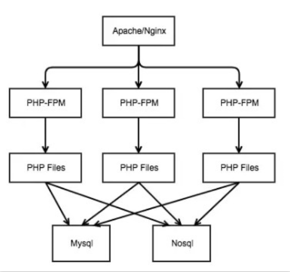

# PHP-FPM (PHP-FastCGI Process Manager)

* 多进程的 FastCGI 管理程序
* PHP-FPM的管理下的，这是一个PHP进程管理器，它常驻内存启动一些PHP进程待命，当请求进入时分配一个进程进行处理，PHP进程处理完毕后回收进程，但并不销毁进程，这让PHP也能应对高流量的访问请求。
* FastCGI 应用速度很快是因为他们持久稳定。不必对每一个请求都启动和初始化。好处是 PHP 脚本运行速度提升 3-30 倍；
* PHP 解释程序被载入内存而不用每次需要时从存储器读取，极大的提升了依靠脚本运行的站点的性能；同时速度的提升并不会增加 CPU 的负担。
* 常驻内存启动一些PHP进程待命，当请求进入时分配一个进程进行处理，PHP进程处理完毕后回收进程，但并不销毁进程，这让PHP也能应对高流量的访问请求
* PHP-FPM 是 FastCGI 的实现，并提供了进程管理的功能。进程包含 master 进程和 worker 进程两种
    - master 进程只有一个，负责监听端口，接收来自服务器的请求，
    - worker 进程则一般有多个（具体数量根据实际需要进行配置），每个进程内部都会嵌入一个 PHP 解释器，是代码真正执行的地方。

## Mac

/usr/local/etc/php/7.2

```sh
brew install php --without-apache --with-fpm
brew services start php
```

### 约定目录

* bin: /usr/local/php/sbin/php-fpm
* 配置文件路径
    - /usr/local/php/etc/php.ini
    - /usr/local/php/etc/php-fpm.conf
    - /private/etc/php-fpm.conf
    - /private/etc/php-fpm.d/www.conf.default
    - /usr/local/etc/php/7.3/php-fpm.d/www.conf

## 原理

* 运作模式
    - 使用 Nginx 提供 HTTP 服务（Apache 同理），所有客户端发起的请求最先抵达的都是 Nginx
    - Nginx 通过 FastCGI 协议将请求转发给 PHP-FPM 处理
    - PHP-FPM 的 Master进程 会为每个请求分配一个 Worker进程 来处理，这个处理指的就是，等待 PHP 脚本的解析，等待业务处理的结果返回，完成后回收子进程，这整个的过程是阻塞等待的，也就意味着 PHP-FPM 的进程数有多少能处理的请求也就是多少，假设 PHP-FPM 有 200 个 Worker进程，一个请求将耗费 1 秒的时间，那么简单的来说整个服务器理论上最多可以处理的请求也就是 200 个，QPS 即为 200/s，在高并发的场景下，这样的性能往往是不够的，尽管可以利用 Nginx 作为负载均衡配合多台 PHP-FPM 服务器来提供服务，但由于 PHP-FPM 的阻塞等待的工作模型，一个请求会占用至少一个 MySQL 连接，多节点高并发下会产生大量的 MySQL 连接，而 MySQL 的最大连接数默认值为 100，尽管可以修改，但显而易见该模式没法很好的应对高并发的场景
* 在 Nginx + PHP-Fpm 模式下开发非常简单 不用担心内存泄露
    - nginx基于epoll事件模型，一个worker同时可处理多个请求
    - fpm-worker在同一时刻可处理一个请求
    - fpm-worker每次处理请求前需要重新初始化mvc框架，然后再释放资源
    - 高并发请求时，fpm-worker不够用，nginx直接响应502
    - fpm-worker进程间切换消耗大
* php的fastcgi进程管理器php-fpm和nginx的配合已经运行得足够好，但是由于php-fpm本身是同步阻塞进程模型，在请求结束后释放所有的资源（包括框架初始化创建的一系列对象，导致PHP进程空转（创建<-->销毁<-->创建）消耗大量的CPU资源，从而导致单机的吞吐能力有限。请求夯住，会导致 CPU 不能释放资源， 大大浪费了 CPU 使用率。
* php-fpm进程模型也非常简单的，是 属于预派生子进程模式。Apache 就是采用该模式 来一个请求就 fork 一个进程，进程的开销是非常大的。这会大大降低吞吐率，并发数由进程数决定。
    - 程序启动后就会创建N个进程。每个子进程进入Accept，等待新的连接进入
    - 当客户端连接到服务器时，其中一个子进程会被唤醒，开始处理客户端请求，并且不再接受新的TCP连接
    - 当此连接关闭时，子进程会释放，重新进入Accept，参与处理新的连接
* 优点
    - 完全可以复用进程，不需要太多的上下文切换
* 缺点
    - 严重依赖进程的数量解决并发问题，一个客户端连接就需要占用一个进程，工作进程的数量有多少，并发处理能力就有多少。操作系统可以创建的进程数量是有限的。
    - PHP框架初始化会占用大量的计算资源，每个请求都需要初始化。
    - 启动大量进程会带来额外的进程调度消耗。数百个进程时可能进程上下文切换调度消耗占CPU不到1%可以忽略不计，如果启动数千甚至数万个进程，消耗就会直线上升。调度消耗可能占到 CPU 的百分之几十甚至 100%。
    - 如果请求一个第三方请求非常慢，请求过程中会一直占用 CPU 资源，浪费了昂贵的硬件资源
* 解决
    - IO密集性业务：频繁的上下文切换
        + 提高IO复用的能力
        + 将php-fpm同步阻塞模式替换为异步非阻塞模式，异步开启模式比较复杂不易维护，当然不一定使用php-fpm
    - 线程模式开发太过复杂
        + 一个进程中能开的线程数也有限，线程太多也会增加 CPU 的负荷和内存资源，线程没有阻塞态，IO 阻塞也不能主动让出 CPU资源，属于抢占式调度模型。不太适合 php 开发。
    - swoole 4.+开启了全协程模式，让同步代码异步执行

php-fpm工作模式



## 服务

```sh
#测试php-fpm配置
/usr/local/php/sbin/php-fpm -t
/usr/local/php/sbin/php-fpm -c /usr/local/php/etc/php.ini -y /usr/local/php/etc/php-fpm.conf -t

#启动php-fpm
/usr/local/php/sbin/php-fpm -c /usr/local/php/etc/php.ini -y /usr/local/php/etc/php-fpm.conf
/usr/local/Cellar/php71/7.1.10_21/sbin/php-fpm --daemonize --fpm-config /usr/local/etc/php/7.1/php-fpm.conf --pid /usr/local/var/run/php-fpm.pid`

ps aux | grep -c php-fpm # 查看php-fpm进程数
ps aux |grep php-fpm 查看php-fpm的master进程号

## Mac
php-fpm -D # 启动
kill -INT `cat /usr/local/php/var/run/php-fpm.pid`
kill -USR2 `cat /usr/local/php/var/run/php-fpm.pid` # 平滑重启
pkill php-fpm # 强制关闭
killall php-fpm # 关闭进程

## linux 进程管理
sudo service php7.0-fpm {start|stop|status|restart|reload|force-reload}
sudo systemctl status php7.3-fpm

/etc/init.d/php7.2-fpm start
/usr/local/php/sbin/php-fpm # 启动
killall php-fpm
```

## 配置

* nginx 一般是把请求根据请求类型，加载 对应的 fast-cgi 模块，fascgi管理进程选择cgi 子进程处理结果，并返回给nginx
* 静态：直接开启指定数量的php-fpm进程，不再增加或者减少
* 动态：开始的时候开启一定数量的php-fpm进程，当请求量变大的时候，动态的增加php-fpm进程数到上限，当空闲的时候自动释放空闲的进程数到一个下限。
* 通信方式
    - Unix socket:又叫 IPC(inter-process communication 进程间通信) socket，用于实现同一主机上的进程间通信，这种方式需要在 nginx配置文件中填写 php-fpm 的 socket 文件位置。
        + 与管道相比，Unix domain sockets 既可以使用字节流和数据队列，而管道通信则只能通过字节流。
        + Unix domain sockets的接口和Internet socket很像，但它不使用网络底层协议来通信。
        + Unix domain socket 的功能是POSIX操作系统里的一种组件。Unix domain sockets 使用系统文件的地址来作为自己的身份。它可以被系统进程引用。所以两个进程可以同时打开一个Unix domain sockets来进行通信。不过这种通信方式是发生在系统内核里而不会在网络里传播。压力比较满的时候，用套接字方式，效果确实比较好
    - TCP sockets:使用TCP端口连接127.0.0.1:9000，可以跨服务器，当 nginx 和 php-fpm 不在同一台机器上时，只能使用这种方式
    - Unix socket 不需要经过网络协议栈，不需要打包拆包、计算校验和、维护序号和应答等，只是将应用层数据从一个进程拷贝到另一个进程。所以其效率比 tcp socket 的方式要高，可减少不必要的 tcp 开销。
    - unix socket 高并发时不稳定，连接数爆发时，会产生大量的长时缓存，在没有面向连接协议的支撑下，大数据包可能会直接出错不返回异常。而 tcp 这样的面向连接的协议，可以更好的保证通信的正确性和完整性。
    - 由于 socket 文件本质上是一个文件，存在权限控制的问题，所以需要注意 nginx 进程的权限与 php-fpm 的权限问题，不然会提示无权限访问

```
listen = 127.0.0.1:9000
listen = /var/run/php-fpm.sock

location ~ \.php$ {
    include /usr/local/etc/nginx/fastcgi.conf; #加载 nginx 的 fastcgi 模块
    fastcgi_intercept_errors on;
    fastcgi_pass   127.0.0.1:9000; # tcp 方式，php-fpm 监听的 IP 地址和端口
   # fasrcgi_pass /usr/run/php-fpm.sock # unix socket 连接方式
}

[global]
pid=run/php-fpm.pid # pid设置，默认在安装目录中的var/run/php-fpm.pid，建议开启

error_log=log/php-fpm.log # # 错误日志，默认在安装目录中的var/log/php-fpm.log

log_level=error # 错误级别. 可用级别为: alert（必须立即处理）, error（错误情况）, warning（警告情况）, notice（一般重要信息）, debug（调试信息）. 默认: notice.

daemonize=yes # 后台执行fpm,默认值为yes，如果为了调试可以改为no。在FPM中，可以使用不同的设置来运行多个进程池。 这些设置可以针对每个进程池单独设置。

# 表示在emergency_restart_interval所设值内出现SIGSEGV或者SIGBUS错误的php-cgi进程数如果超过 emergency_restart_threshold个，php-fpm就会优雅重启。这两个选项一般保持默认值。
emergency_restart_threshold = 60
emergency_restart_interval = 60s

# 设置子进程接受主进程复用信号的超时时间. 可用单位: s(秒), m(分), h(小时), 或者 d(天) 默认单位: s(秒). 默认值: 0.
process_control_timeout = 0

daemonize = yes # 后台执行fpm,默认值为yes，如果为了调试可以改为no。在FPM中，可以使用不同的设置来运行多个进程池。 这些设置可以针对每个进程池单独设置。

# fpm监听端口，即nginx中php处理的地址，一般默认值即可。可用格式为: 'ip:port', 'port', '/path/to/unix/socket'. 每个进程池都需要设置.
# 通过socket监听提高性能，unix:/usr/local/var/run/php-fpm.sock;
listen = 127.0.0.1:9000
listen.backlog = -1 # backlog数，-1表示无限制，由操作系统决定，此行注释掉就行。backlog含义参考：http://www.3gyou.cc/?p=41
listen.allowed_clients = 127.0.0.1 # 允许访问FastCGI进程的IP，设置any为不限制IP，如果要设置其他主机的nginx也能访问这台FPM进程，listen处要设置成本地可被访问的IP。默认值是any。每个地址是用逗号分隔. 如果没有设置或者为空，则允许任何服务器请求连接

listen.owner =  www-data #启动进程的用户
listen.group = www-data #启动进程的用户组
listen.mode = 0666
#unix socket设置选项，如果使用tcp方式访问，这里注释即可。

#启动进程的帐户和组
user = www
group = www

pm = dynamic #对于专用服务器，pm可以设置为static。
#如何控制子进程，选项有static和dynamic。
# 如果选择static，则由pm.max_children指定固定的子进程数。如果选择dynamic，则由下开参数决定：
pm.max_children = 15#，子进程最大数
pm.start_servers = 2 #，启动时的进程数
pm.min_spare_servers =2  #，保证空闲进程数最小值，如果空闲进程小于此值，则创建新的子进程
pm.max_spare_servers #，保证空闲进程数最大值，如果空闲进程大于此值，此进行清理

pm.max_requests = 500 # 设置每个子进程重生之前服务的请求数. 对于可能存在内存泄漏的第三方模块来说是非常有用的. 如果设置为 '0' 则一直接受请求. 等同于 PHP_FCGI_MAX_REQUESTS 环境变量. 默认值: 0.

pm.status_path = /status # FPM状态页面的网址. 如果没有设置, 则无法访问状态页面. 默认值: none. munin监控会使用到

ping.path = /ping #FPM监控页面的ping网址. 如果没有设置, 则无法访问ping页面. 该页面用于外部检测FPM是否存活并且可以响应请求. 请注意必须以斜线开头 (/)。

ping.response = pong #用于定义ping请求的返回相应. 返回为 HTTP 200 的 text/plain 格式文本. 默认值: pong.

request_terminate_timeout = 0 #设置单个请求的超时中止时间. 该选项可能会对php.ini设置中的'max_execution_time'因为某些特殊原因没有中止运行的脚本有用. 设置为 '0' 表示 'Off'.当经常出现502错误时可以尝试更改此选项。

request_slowlog_timeout = 10s # 当一个请求该设置的超时时间后，就会将对应的PHP调用堆栈信息完整写入到慢日志中. 设置为 '0' 表示 'Off'
slowlog = log/$pool.log.slow #慢请求的记录日志,配合request_slowlog_timeout使用

rlimit_files = 1024 #设置文件打开描述符的rlimit限制. 默认值: 系统定义值默认可打开句柄是1024，可使用 ulimit -n查看，ulimit -n 2048修改。
rlimit_core = 0 #设置核心rlimit最大限制值. 可用值: 'unlimited' 、0或者正整数. 默认值: 系统定义值.

chroot = #启动时的Chroot目录. 所定义的目录需要是绝对路径. 如果没有设置, 则chroot不被使用.
chdir = #设置启动目录，启动时会自动Chdir到该目录. 所定义的目录需要是绝对路径. 默认值: 当前目录，或者/目录（chroot时）
catch_workers_output = yes #重定向运行过程中的stdout和stderr到主要的错误日志文件中. 如果没有设置, stdout 和 stderr 将会根据FastCGI的规则被重定向到 /dev/null . 默认值: 空.

# /private/etc/php-fpm.conf
error_log = /usr/local/var/log/php-fpm.log # 开启日志

[www]
user=nobody
group=nobody
listen=127.0.0.1:9000
pm=dynamic
pm.max_children=32
pm.start_servers=15
pm.min_spare_servers=5
pm.max_spare_servers=32

; Start a new pool named 'www'.
; the variable $pool can we used in any directive and will be replaced by the
; pool name ('www' here)
[www]

; Per pool prefix
; It only applies on the following directives:
; - 'access.log'
; - 'slowlog'
; - 'listen' (unixsocket)
; - 'chroot'
; - 'chdir'
; - 'php_values'
; - 'php_admin_values'
; When not set, the global prefix (or /usr/local/services/php7) applies instead.
; Note: This directive can also be relative to the global prefix.
; Default Value: none
;prefix = /path/to/pools/$pool

; Unix user/group of processes
; Note: The user is mandatory. If the group is not set, the default user's group
;       will be used.
user = www-data
group = www-data

; The address on which to accept FastCGI requests.
; Valid syntaxes are:
;   'ip.add.re.ss:port'    - to listen on a TCP socket to a specific IPv4 address on
;                            a specific port;
;   '[ip:6:addr:ess]:port' - to listen on a TCP socket to a specific IPv6 address on
;                            a specific port;
;   'port'                 - to listen on a TCP socket to all addresses
;                            (IPv6 and IPv4-mapped) on a specific port;
;   '/path/to/unix/socket' - to listen on a unix socket.
; Note: This value is mandatory.
; listen = 127.0.0.1:9001
listen = /run/php/php7.0-fpm.sock

; Set listen(2) backlog.
; Default Value: 511 (-1 on FreeBSD and OpenBSD)
;listen.backlog = 511

; Set permissions for unix socket, if one is used. In Linux, read/write
; permissions must be set in order to allow connections from a web server. Many
; BSD-derived systems allow connections regardless of permissions.
; Default Values: user and group are set as the running user
;                 mode is set to 0660
# nginx error connect to php5-fpm.sock failed (13: Permission denied) 写入权限问题
listen.owner = www-data
listen.group = www-data
listen.mode = 0660
; When POSIX Access Control Lists are supported you can set them using
; these options, value is a comma separated list of user/group names.
; When set, listen.owner and listen.group are ignored
;listen.acl_users =
;listen.acl_groups =

; List of addresses (IPv4/IPv6) of FastCGI clients which are allowed to connect.
; Equivalent to the FCGI_WEB_SERVER_ADDRS environment variable in the original
; PHP FCGI (5.2.2+). Makes sense only with a tcp listening socket. Each address
; must be separated by a comma. If this value is left blank, connections will be
; accepted from any ip address.
; Default Value: any
;listen.allowed_clients = 127.0.0.1

; Specify the nice(2) priority to apply to the pool processes (only if set)
; The value can vary from -19 (highest priority) to 20 (lower priority)
; Note: - It will only work if the FPM master process is launched as root
;       - The pool processes will inherit the master process priority
;         unless it specified otherwise
; Default Value: no set
; process.priority = -19

; Choose how the process manager will control the number of child processes.
; Possible Values:
;   static  - a fixed number (pm.max_children) of child processes;
;   dynamic - the number of child processes are set dynamically based on the
;             following directives. With this process management, there will be
;             always at least 1 children.
;             pm.max_children      - the maximum number of children that can
;                                    be alive at the same time.
;             pm.start_servers     - the number of children created on startup.
;             pm.min_spare_servers - the minimum number of children in 'idle'
;                                    state (waiting to process). If the number
;                                    of 'idle' processes is less than this
;                                    number then some children will be created.
;             pm.max_spare_servers - the maximum number of children in 'idle'
;                                    state (waiting to process). If the number
;                                    of 'idle' processes is greater than this
;                                    number then some children will be killed.
;  ondemand - no children are created at startup. Children will be forked when
;             new requests will connect. The following parameter are used:
;             pm.max_children           - the maximum number of children that
;                                         can be alive at the same time.
;             pm.process_idle_timeout   - The number of seconds after which
;                                         an idle process will be killed.
; Note: This value is mandatory.
pm = dynamic

; The number of child processes to be created when pm is set to 'static' and the
; maximum number of child processes when pm is set to 'dynamic' or 'ondemand'.
; This value sets the limit on the number of simultaneous requests that will be
; served. Equivalent to the ApacheMaxClients directive with mpm_prefork.
; Equivalent to the PHP_FCGI_CHILDREN environment variable in the original PHP
; CGI. The below defaults are based on a server without much resources. Don't
; forget to tweak pm.* to fit your needs.
; Note: Used when pm is set to 'static', 'dynamic' or 'ondemand'
; Note: This value is mandatory.
pm.max_children = 5

; The number of child processes created on startup.
; Note: Used only when pm is set to 'dynamic'
; Default Value: min_spare_servers + (max_spare_servers - min_spare_servers) / 2
pm.start_servers = 2

; The desired minimum number of idle server processes.
; Note: Used only when pm is set to 'dynamic'
; Note: Mandatory when pm is set to 'dynamic'
pm.min_spare_servers = 1

; The desired maximum number of idle server processes.
; Note: Used only when pm is set to 'dynamic'
; Note: Mandatory when pm is set to 'dynamic'
pm.max_spare_servers = 3

; The number of seconds after which an idle process will be killed.
; Note: Used only when pm is set to 'ondemand'
; Default Value: 10s
;pm.process_idle_timeout = 10s;

; The number of requests each child process should execute before respawning.
; This can be useful to work around memory leaks in 3rd party libraries. For
; endless request processing specify '0'. Equivalent to PHP_FCGI_MAX_REQUESTS.
; Default Value: 0
;pm.max_requests = 500

; The URI to view the FPM status page. If this value is not set, no URI will be
; recognized as a status page. It shows the following informations:
;   pool                 - the name of the pool;
;   process manager      - static, dynamic or ondemand;
;   start time           - the date and time FPM has started;
;   start since          - number of seconds since FPM has started;
;   accepted conn        - the number of request accepted by the pool;
;   listen queue         - the number of request in the queue of pending
;                          connections (see backlog in listen(2));
;   max listen queue     - the maximum number of requests in the queue
;                          of pending connections since FPM has started;
;   listen queue len     - the size of the socket queue of pending connections;
;   idle processes       - the number of idle processes;
;   active processes     - the number of active processes;
;   total processes      - the number of idle + active processes;
;   max active processes - the maximum number of active processes since FPM
;                          has started;
;   max children reached - number of times, the process limit has been reached,
;                          when pm tries to start more children (works only for
;                          pm 'dynamic' and 'ondemand');
; Value are updated in real time.
; Example output:
;   pool:                 www
;   process manager:      static
;   start time:           01/Jul/2011:17:53:49 +0200
;   start since:          62636
;   accepted conn:        190460
;   listen queue:         0
;   max listen queue:     1
;   listen queue len:     42
;   idle processes:       4
;   active processes:     11
;   total processes:      15
;   max active processes: 12
;   max children reached: 0
;
; By default the status page output is formatted as text/plain. Passing either
; 'html', 'xml' or 'json' in the query string will return the corresponding
; output syntax. Example:
;   http://www.foo.bar/status
;   http://www.foo.bar/status?json
;   http://www.foo.bar/status?html
;   http://www.foo.bar/status?xml
;
; By default the status page only outputs short status. Passing 'full' in the
; query string will also return status for each pool process.
; Example:
;   http://www.foo.bar/status?full
;   http://www.foo.bar/status?json&full
;   http://www.foo.bar/status?html&full
;   http://www.foo.bar/status?xml&full
; The Full status returns for each process:
;   pid                  - the PID of the process;
;   state                - the state of the process (Idle, Running, ...);
;   start time           - the date and time the process has started;
;   start since          - the number of seconds since the process has started;
;   requests             - the number of requests the process has served;
;   request duration     - the duration in µs of the requests;
;   request method       - the request method (GET, POST, ...);
;   request URI          - the request URI with the query string;
;   content length       - the content length of the request (only with POST);
;   user                 - the user (PHP_AUTH_USER) (or '-' if not set);
;   script               - the main script called (or '-' if not set);
;   last request cpu     - the %cpu the last request consumed
;                          it's always 0 if the process is not in Idle state
;                          because CPU calculation is done when the request
;                          processing has terminated;
;   last request memory  - the max amount of memory the last request consumed
;                          it's always 0 if the process is not in Idle state
;                          because memory calculation is done when the request
;                          processing has terminated;
; If the process is in Idle state, then informations are related to the
; last request the process has served. Otherwise informations are related to
; the current request being served.
; Example output:
;   ************************
;   pid:                  31330
;   state:                Running
;   start time:           01/Jul/2011:17:53:49 +0200
;   start since:          63087
;   requests:             12808
;   request duration:     1250261
;   request method:       GET
;   request URI:          /test_mem.php?N=10000
;   content length:       0
;   user:                 -
;   script:               /home/fat/web/docs/php/test_mem.php
;   last request cpu:     0.00
;   last request memory:  0
;
; Note: There is a real-time FPM status monitoring sample web page available
;       It's available in: /usr/local/services/php7/share/php/fpm/status.html
;
; Note: The value must start with a leading slash (/). The value can be
;       anything, but it may not be a good idea to use the .php extension or it
;       may conflict with a real PHP file.
; Default Value: not set
;pm.status_path = /status

; The ping URI to call the monitoring page of FPM. If this value is not set, no
; URI will be recognized as a ping page. This could be used to test from outside
; that FPM is alive and responding, or to
; - create a graph of FPM availability (rrd or such);
; - remove a server from a group if it is not responding (load balancing);
; - trigger alerts for the operating team (24/7).
; Note: The value must start with a leading slash (/). The value can be
;       anything, but it may not be a good idea to use the .php extension or it
;       may conflict with a real PHP file.
; Default Value: not set
;ping.path = /ping

; This directive may be used to customize the response of a ping request. The
; response is formatted as text/plain with a 200 response code.
; Default Value: pong
;ping.response = pong

; The access log file
; Default: not set
;access.log = log/$pool.access.log

; The access log format.
; The following syntax is allowed
;  %%: the '%' character
;  %C: %CPU used by the request
;      it can accept the following format:
;      - %{user}C for user CPU only
;      - %{system}C for system CPU only
;      - %{total}C  for user + system CPU (default)
;  %d: time taken to serve the request
;      it can accept the following format:
;      - %{seconds}d (default)
;      - %{miliseconds}d
;      - %{mili}d
;      - %{microseconds}d
;      - %{micro}d
;  %e: an environment variable (same as $_ENV or $_SERVER)
;      it must be associated with embraces to specify the name of the env
;      variable. Some exemples:
;      - server specifics like: %{REQUEST_METHOD}e or %{SERVER_PROTOCOL}e
;      - HTTP headers like: %{HTTP_HOST}e or %{HTTP_USER_AGENT}e
;  %f: script filename
;  %l: content-length of the request (for POST request only)
;  %m: request method
;  %M: peak of memory allocated by PHP
;      it can accept the following format:
;      - %{bytes}M (default)
;      - %{kilobytes}M
;      - %{kilo}M
;      - %{megabytes}M
;      - %{mega}M
;  %n: pool name
;  %o: output header
;      it must be associated with embraces to specify the name of the header:
;      - %{Content-Type}o
;      - %{X-Powered-By}o
;      - %{Transfert-Encoding}o
;      - ....
;  %p: PID of the child that serviced the request
;  %P: PID of the parent of the child that serviced the request
;  %q: the query string
;  %Q: the '?' character if query string exists
;  %r: the request URI (without the query string, see %q and %Q)
;  %R: remote IP address
;  %s: status (response code)
;  %t: server time the request was received
;      it can accept a strftime(3) format:
;      %d/%b/%Y:%H:%M:%S %z (default)
;      The strftime(3) format must be encapsuled in a %{<strftime_format>}t tag
;      e.g. for a ISO8601 formatted timestring, use: %{%Y-%m-%dT%H:%M:%S%z}t
;  %T: time the log has been written (the request has finished)
;      it can accept a strftime(3) format:
;      %d/%b/%Y:%H:%M:%S %z (default)
;      The strftime(3) format must be encapsuled in a %{<strftime_format>}t tag
;      e.g. for a ISO8601 formatted timestring, use: %{%Y-%m-%dT%H:%M:%S%z}t
;  %u: remote user
;
; Default: "%R - %u %t \"%m %r\" %s"
;access.format = "%R - %u %t \"%m %r%Q%q\" %s %f %{mili}d %{kilo}M %C%%"

; The log file for slow requests
; Default Value: not set
; Note: slowlog is mandatory if request_slowlog_timeout is set
;slowlog = log/$pool.log.slow

; The timeout for serving a single request after which a PHP backtrace will be
; dumped to the 'slowlog' file. A value of '0s' means 'off'.
; Available units: s(econds)(default), m(inutes), h(ours), or d(ays)
; Default Value: 0
;request_slowlog_timeout = 0

; The timeout for serving a single request after which the worker process will
; be killed. This option should be used when the 'max_execution_time' ini option
; does not stop script execution for some reason. A value of '0' means 'off'.
; Available units: s(econds)(default), m(inutes), h(ours), or d(ays)
; Default Value: 0
;request_terminate_timeout = 0

; Set open file descriptor rlimit.
; Default Value: system defined value
;rlimit_files = 1024

; Set max core size rlimit.
; Possible Values: 'unlimited' or an integer greater or equal to 0
; Default Value: system defined value
;rlimit_core = 0

; Chroot to this directory at the start. This value must be defined as an
; absolute path. When this value is not set, chroot is not used.
; Note: you can prefix with '$prefix' to chroot to the pool prefix or one
; of its subdirectories. If the pool prefix is not set, the global prefix
; will be used instead.
; Note: chrooting is a great security feature and should be used whenever
;       possible. However, all PHP paths will be relative to the chroot
;       (error_log, sessions.save_path, ...).
; Default Value: not set
;chroot =

; Chdir to this directory at the start.
; Note: relative path can be used.
; Default Value: current directory or / when chroot
;chdir = /var/www

; Redirect worker stdout and stderr into main error log. If not set, stdout and
; stderr will be redirected to /dev/null according to FastCGI specs.
; Note: on highloaded environement, this can cause some delay in the page
; process time (several ms).
; Default Value: no
;catch_workers_output = yes

; Clear environment in FPM workers
; Prevents arbitrary environment variables from reaching FPM worker processes
; by clearing the environment in workers before env vars specified in this
; pool configuration are added.
; Setting to "no" will make all environment variables available to PHP code
; via getenv(), $_ENV and $_SERVER.
; Default Value: yes
;clear_env = no

; Limits the extensions of the main script FPM will allow to parse. This can
; prevent configuration mistakes on the web server side. You should only limit
; FPM to .php extensions to prevent malicious users to use other extensions to
; exectute php code.
; Note: set an empty value to allow all extensions.
; Default Value: .php
;security.limit_extensions = .php .php3 .php4 .php5 .php7

; Pass environment variables like LD_LIBRARY_PATH. All $VARIABLEs are taken from
; the current environment.
; Default Value: clean env
;env[HOSTNAME] = $HOSTNAME
;env[PATH] = /usr/local/bin:/usr/bin:/bin
;env[TMP] = /tmp
;env[TMPDIR] = /tmp
;env[TEMP] = /tmp

; Additional php.ini defines, specific to this pool of workers. These settings
; overwrite the values previously defined in the php.ini. The directives are the
; same as the PHP SAPI:
;   php_value/php_flag             - you can set classic ini defines which can
;                                    be overwritten from PHP call 'ini_set'.
;   php_admin_value/php_admin_flag - these directives won't be overwritten by
;                                     PHP call 'ini_set'
; For php_*flag, valid values are on, off, 1, 0, true, false, yes or no.

; Defining 'extension' will load the corresponding shared extension from
; extension_dir. Defining 'disable_functions' or 'disable_classes' will not
; overwrite previously defined php.ini values, but will append the new value
; instead.

; Note: path INI options can be relative and will be expanded with the prefix
; (pool, global or /usr/local/services/php7)

; Default Value: nothing is defined by default except the values in php.ini and
;                specified at startup with the -d argument
;php_admin_value[sendmail_path] = /usr/sbin/sendmail -t -i -f www@my.domain.com
;php_flag[display_errors] = off
;php_admin_value[error_log] = /var/log/fpm-php.www.log
;php_admin_flag[log_errors] = on
;php_admin_value[memory_limit] = 32M

pm=dynamic
pm.max_children=32
pm.start_servers=15
pm.min_spare_servers=5
pm.max_spare_servers=32
```

用到一些 PHP 的第三方库，这些第三方库经常存在内存泄漏问题，如果不定期重启 PHP-CGI 进程，势必造成内存使用量不断增长。因此 PHP-FPM 作为 PHP-CGI 的管理器，提供了这么一项监控功能，对请求达到指定次数的 PHP-CGI 进程进行重启，保证内存使用量不增长。

## 连接方式

与CPU 频率缩放问题一样？（CPUFreq governor）这些设置在类 Unix 系统和 Windows 上是有效的，可以通过修改 CPU governor，将其从 ondemand 修改为 performance 来提高性能并加快系统的响应。

* Governor = ondemand：根据当前负荷动态调整 CPU 频率。先将 CPU 频率调整至最大，然后随着空闲时间的增加而缩小频率。
* Governor = conservative：根据当前负荷动态调整频率。比设置成 ondemand 更加缓慢。
* Governor = performance：始终以最大频率运行 CPU。

CPU Governor 的 performance 设置是一个非常安全的性能提升方式，因为它能完美的使用你服务器 CPU 的全部性能。唯一需要考虑的因素就是一些诸如散热、电池寿命（笔记本电脑）和一些由 CPU 始终保持 100% 所带来的一些副作用。一旦设置为 performance，那么它确实是你 CPU 最快的设置。

static 设置取决于你服务器有多少闲置内存。大多数情况下，如果你服务器的内存不足，那么 PM 设置成 ondemand 或 dynamic 将是更好的选择。
但是，一旦你有可用的闲置内存，那么把 PM 设置成 static 的最大值将减少许多 PHP 进程管理器（PM）所带来的开销。
换句话说，你应该在没有内存不足和缓存压力的情况下使用 pm.static 来设置 PHP-FPM 进程的最大数量。此外，也不能影响到 CUP 的使用和其他待处理的 PHP-FPM 操作。

当流量波动比较大的时候，，PHP-FPM 的 ondemand 和 dynamic 会因为固有开销而限制吞吐量。 您需要了解您的系统并设置 PHP-FPM 进程数，以匹配服务器的最大容量。

从 pm.max_children 开始，根据 pm dynamic 或 ondemand 的最大使用情况去设置

在 pm static 模式下，因为您将所有内容都保存在内存中，所以随着时间的推移，流量峰值会对 CPU 造成比较小的峰值，并且您的服务器负载和 CPU 平均值将变得更加平滑。 每个需要手动调整的 PHP-FPM 进程数的平均大小会有所不同

* pm = dynamic
    - 子进程的数量是根据以下指令来动态生成的：pm.max_children, pm.start_servers, pm.min_spare_servers, pm.max_spare_servers.
    - dynamic模式，可能会出现mysql连接数被占满的情况，这也跟mysql服务的连接超时时间有关
* pm = ondemand：在服务启动的时候根据 pm.start_servers 指令生成进程，而非动态生成。
* pm = static：子进程的数量是由 pm.max_children 指令来确定的。
    - static 设置取决于你服务器有多少闲置内存
* 短连接：应对并发消耗过多的资源开销
* 长连接：不同请求会使用同一个连接句柄

## 状态查看

* 在server配置中添加
* 开启缓存

```
location ~ ^/status$ {
    include fastcgi_params;
    fastcgi_split_path_info ^(.+\.php)(/.+)$; # NOTE: You should have "cgi.fix_pathinfo = 0;" in php.ini
    fastcgi_pass unix:/usr/local/var/run/php-fpm.sock;
    fastcgi_param SCRIPT_FILENAME $fastcgi_script_name;
}

pm.status_path = /status # php-fpm.conf里面打开选项
# 访问 http://域名/status
```

## 问题

* FPM's security.limit_extension setting is used to limit the extensions of the main script it will be allowed to parse. It prevents malicious code from being executed. The default value is simply .php It can be configured in /etc/php5/fpm/pool.d/www.conf
* 解决：cgi.fix_pathinfo=1
* 待测试： fastcgi_param PATH_TRANSLATED $document_root$fastcgi_path_info; 屏蔽掉

```
2018/09/02 23:26:10 [error] 37283#0: *69 FastCGI sent in stderr: "Access to the script '/Users/henry/Workspace/Code/PHP' has been denied (see security.limit_extensions)" while reading response header from upstream, client: 127.0.0.1, server: localhost, request: "GET / HTTP/1.1", upstream: "fastcgi://unix:/usr/local/var/run/php-fpm.sock:", host: "localhost:8080"
#  www.conf
security.limit_extensions = .php .php3 .php4 .php5

ERROR: failed to open error_log (/usr/var/log/php-fpm.log): No such file or directory

vim /usr/local/etc/php-fpm.conf
error_log = /usr/local/var/log/php-fpm.log
pid = /usr/local/var/run/php-fpm.pid
```
