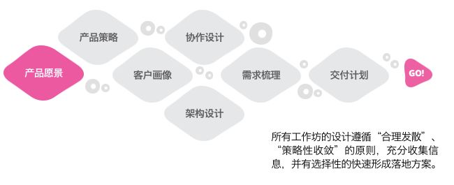

# 产品

* 讲故事
* 产品场景
* 产品的生存 商业  逻辑
* 在某种程度上，即使是最好的产品的其增长前景也会摇摇欲坠。为了企业生存下去，他们必须找到新的产品或服务来销售。如何选择适当的时间去扩张和多样化，以及如何选择正确的组织结构去执行，这是一个判断问题。这种判断的准确性，和及时改变计划的灵活性，才能成就一个好的管理者
* 总是发现在人性当中有一个角落是嗜血的
* 以安全名义把用户信息都留住，同时把用户隐私剥个精光
* 互联网时代，新的杠杆出现了，那就是软件和自媒体,只要服务器开着，软件（包括网站和 App）就能帮你开展业务，服务更多的人,媒体杠杆更简单，只要写文章、拍视频、录播客，放到网上就可以了

## 职位

* BA（业务分析师）。BA 与产品经理的作用是类似的，即将想法整理出需要列表，它可以是 Excel 的形式，也可以是高大上的看板
* UX（用户体验设计师）。设计符合用户交互行为的草图，并细致化出线框图
* 想法的落地过程，称为 Inception。 Inception 是通过业务和技术部门的互动协作、结合产品策略、体验设计、技术架构、交付计划的敏捷软件交付项目启动实践。

## 功能

* 创造价值
* 娱乐
* 中国确实拥有活跃的消费者互联网，但这不意味着中国处于世界领先的技术地位，我们应该放弃这种观念。玩线上游戏、在线购物、食品外卖的大量人口，并不能使一个国家成为技术或科学领导者。
    - 在科学和工业上取得的成就并不显著
    - 中国公司的创新非常薄弱，在掌握基础技术方面总体上并未取得重大成功,没有 CPU、GPU 和 FPGA 这样的特殊芯片（大部分来自美国供应商），即使是像华为这样大的公司也会很困难
    - 在汽车、半导体和航空等涉及研发密集型技术的行业中，即使在国内市场，中国公司的地位也很弱。在许多方面，中国的技术成功太像纸老虎了。
    - 技术是一种实践性的产品，必须不断实践，才能使知识保持在当前水平。日本的伊势神宫，每20年就要拆毁原来的宫殿，在旁边的土地重新造一遍，就是为了让后代人不会失去建造宫殿的知识。

## 用户

* 用户的忍耐度与需求度，迭代很快
* 人就成了一个流量入口，当所有东西在一个非常小的狭窄的空间里面去争夺注意力的时候，那这个人的主人翁意识就变得格外的强了。
* 没有流量，就意味着不被看见
    - 事情的本质是什么已经不重要了，被看到就是比这个事情本身的样子更为重要。
    - 流量的时代，它培养起来的应该是欲望和理想之间的关系。
* 现在一切东西都越来越快，人们的注意力就会越来越容易分散。

## 板块

* 内容
* 社交
    - 2019 多闪 1993 年出生 产品经理徐璐冉
* 网购
* 游戏

## 工具

* 反人性
* 与时俱进的商业化

## 资讯

* 国内的新闻讯息是一个系统，它包括四个要素：新闻的耸动与引导性的标题，剪辑拼凑的正文内容，新闻底下的评论，以及对该新闻的转帖和评论。这四个环节是一条新闻讯息推送的完整的操作，是由一队人统一完成，缺一不可。国内的新闻，不是传递消息，是价值引导和观念诱导

## 头条

* 今日头条和抖音那两个产品并不是内容和视频平台而是算法平台。机器学习系统每天将视频内容针对性地投放给1.5亿用户，内容向用户贴合，为每位用户打造最适合他的视频流，“尊享”定制服务。
* 算法带来的好处显而易见，但这样的快乐太容易获得：只需要拿起手机打开抖音，就可以以平均十秒一次的频率刺激自己的大脑奖励给你一点多巴胺。整个过程不需要任何投入，同样的除了乐趣本身也不会有任何收获。失落感最严重的就是放下手机的那一刻，如果抖音记录的是“美好生活”的话，那作为对比的现实生活恐怕实在不堪入目，这些也都被调侃了无数遍了。

## 流媒体

* 将会成为未来的主流观看模式，Netflix、亚马逊和Hulu三家已经抢先占好了位置，很快迪士尼、NBC环球、苹果也都将入场。
* 抖音(tiktok)
    - 刷抖音上瘾，其实是因为它用一些大大小小的交互细节，可以让你大脑中的多巴胺激增，出现“行为上瘾”。行为上瘾跟物质上瘾（比如药物及毒品上瘾等）的生理机制是相似的，他们都是刺激大脑中的同一个区域出现的结果。
    - 关于行为上瘾的著作《欲罢不能：刷屏时代如何摆脱行为上瘾》一书中，他列举了六项行为上瘾的构成要素，分别是：
        + 诱人的目标,给予逐渐升级的挑战
        + 无法抵挡且无法预知的积极反馈
        + 让人毫不费力就感觉到进步
        + 未完成的紧张感，是源自于人类大脑连线需要“闭合”的渴望，这种渴望在心理学里叫“蔡格尼克效应”。这个效应的要点是，当一个人着手一件事情的时候，会产生出一套倾向于实现的紧张系统，完成任务就意味着解决紧张系统，而如果任务没有完成，紧张状态将持续保持。
        + 渐进改善的感觉
        + 越来越困难的任务
        + 需要解决却暂未解决的紧张感
        + 强大的社会联系，社交
        + 节目只会给你  你想要的

## 电商

* 拼多多
    - 小镇真正的力量源泉还得回到生育层面
* [1688](https://www.1688.com)

## 微信

* 7.0
    - 好的产品是有创意的；
    - 好的产品是优美的；
    - 好的产品是非常容易使用的；
    - 好的产品是含蓄的；
    - 好的产品是诚实的；
    - 好的产品是经久不衰的；
    - 好的产品是不放过任何一个细节的；
    - 好的产品是环保的；
    - 好的产品是少即是多……
    - 汝未来看此花时，汝花于汝心同归于寂，汝来看此花此花颜色一时明白起来，便知此花不在汝心之外

## IP

* 奢侈品
    - 因为这类产品制造出来，本身是没有任何技术含量的，它的价格是由铺天盖地的广告、一年几度的秀场……是由深入人心的“IP”决定。
    - 一个长期在大城市生活的女孩子，对动辄上万LV包包的价格，是认可的
    - 而对于一个乡下女孩，LV包无非是漂亮一点罢了，上万的价格是远远不值的。 因为，她没有经受过城市里“品牌”的熏陶，她对美的理解，也没有被任何时尚观念影响过，引导过，驯化过。
    - “IP”的价值，是依靠在人们心底的投影，用流行的词来讲，就是“卖情怀”。

## 流量

流量主还是挖空心思想到了作弊的方法：自己不点了，但找一群真实用户来点。这些真实用户主要特点就是“闲”（比如在宿舍穷极无聊的大学生），你花钱购买他们的时间非常便宜，便宜到比广告主给你的钱还少——这就形成了一种作弊模式，召集真人用户看广告并点击，给提成，流量主赚广告主的钱，大学生赚流量主的钱

* 在 PC 时代，流量较为分散，浏览器和网站是重点;到了移动时代，流量开始被聚合，应用商店成为利器(当然手机网页也不可或缺)，此时的头部 App 们化身巨型流量孤岛;再往后发展，小程序开始承载诸多新的期待。
* 借由智能小程序更好地实现从信息到商品、服务的闭环，通过每一次的连接加深开发者对用户的理解，强化用户对开发者的认知。这种闭环意在帮助沉淀更强的用户与开发者关系链，从而让开发者建立属于自己的用户群体，持续运营用户、挖掘更大的用户价值。
* SaaS 通过共享流量、技术的方式来和 B 端企业达成更良好的合作互惠，借由开放平台和 AI 为后者提供服务、沉淀交易，小程序在这方面的动作值得期待。

## 需求

* 向少年卖希望，向女人卖青春，向男人卖壮阳，向老人卖健康，以及向中产阶级兜售焦虑
* 直播|外卖：所有的东西是统计数据来呈现的，如果你的数据好，平台会给你的直播间匹配更多的流量。但后来，直播平台本身的流量在慢慢枯竭，僧多粥少。流量可以买卖，而且特别贵。我上次在群里看到，一个粉丝40万的主播，一个月挣10万元，那个月要拿出16万块钱出来烧流量，换来了2000多个粉丝。我烧不起这个钱，只能自己一点一点熬。

## 职能

* 让每个人把重点放在结果而不是产出上
    * 确定需要满足的要求；
    * 通过基于结果的目标来定义成功；
    * 建立和维护路线图，用以指导当下以及未来需要满足哪些方面的需求。
* 建立和维护共通的理解
    - 有必要在客户、利益相关者和交付团队之间进行澄清；
    - 通过积压项目、验收标准、示例、模型和讨论来描述解决方案。
* 确保要做出决定
    - 优先考虑满足哪些需求（从全局角度来看）
    - 优先考虑哪些解决方案（从局部角度来看）

## 豆瓣

* 阿北创业的第一次尝试，是一家名为“驴宗”的旅行网站，后来在转做读书分享平台时，阿北曾经向外界解释道，一是不想去碰大家一股脑在抄的东西，二是想清楚自身的关键能力(技术和产品)，“然后保证事情的实质是一致的”。一位豆瓣前员工认为，这两个原因恰是阿北本人性格的最佳写照——“一个执着又不愿意在商业风口捞钱的理想主义者”。
* 江湖这么大，刷分有用的话早会有人知道，找豆瓣的人是最没用的
* 在 2010 年会继续支持空间、友邻、小组、同城活动这些社区功能;但面对高度活跃的社区，他担心人际冲突会波及到评论和条目内容，会对书影音服务内容可能产生干扰，于是决定“把豆瓣的内容重新组合成豆瓣读书、豆瓣电影、豆瓣音乐和豆瓣社区”。
*  2014 年下半年，合并了书影音功能后，豆瓣APP缓缓上线。阿北也对公司内部进行了战略和组织调整，让不同频道的内容共存于一个产品中，他想“重新回到集中、专注、快速的工作方式中”。
*  豆瓣已经从2012 年的日均PV可以达到1. 6 亿的数据， 2014 年底跌落为 3000 万左右。在年会上，阿北首次公开承认，自己的错误决策让豆瓣错失 3 年移动浪潮的最好时机。“当时内部谁都没有想好要怎么走，只能试错之后再及时的去做一些更改和调整。”一位前员工说道。

## 自媒体

* 从传播的角度来说，“共识远比真相重要。”
* 对于用户来说，一个内容的好坏与它是否精美、多么正确、甚至是否有价值并非正相关。我们会觉得某个内容好，完全是因为“这个东西符合我的期望”，这里的“期望”可以是美、可以是逼格、可以是知识、可以是情报。
* 拉近了内容提供者和内容消费者的距离，形成了非常快速的双向反馈，促成了前所未有的“重度内容导向”的传播模式。说人话就是，内容变成为了取悦用户的存在，去中心化的传播方式加速了这一过程，垃圾内容指数级增加。
* 张一鸣在接受《财经》杂志采访时表示： “我不想强调纯机器，因为是不是纯机器不重要。我们的目的就是满足用户需求，机器能更有效的满足就用机器满足，机器不能就用人满足，我不固执或者不依附。”
* 在这个时代，注意力是稀缺品，投入感是奢侈品，在人性面前算法的优越性更加显露无疑。如果内容的存在仅仅是为了满足用户的需求，这跟往脑后插了根管子去获取快感本质上也没什么区别。
* 你以为你的思想是自由的，然而我们看待事物的态度实际上已经被操控着的，外界对事件报道的角度直接影响我们看待事件的态度，一条信息就能让我们对一个事件的看法一瞬间扭转。而这样的信息现在实际上在被算法控制着，从满足我们的喜好，到培养我们的喜好。
* 容易获得“十万加”的方式
    - 一种是引起共鸣，心理投射
    - 一种是引起焦虑
* 创作小众的，甚至没人看的作品的时候，你就需要知道你要做的是什么，我经常强调在网络世界也好，在现实都一样，你知道你在做什么。

## 现实

* 我们的悲欢不相通，我们的趣味也不再相通：注意力已经成为一种稀缺商业资源的当下，精心设计的内容分发算法似乎赋予了我们巨大的「自由选择权」：从找到感兴趣的领域，到屏蔽异己的声音，都变得轻而易举。
* 即便大家都在使用抖音这款产品，但是所接收到的内容却大相径庭。在用户无意识浏览的行为之下，每个人都只能触及到这款应用的一部分、甚至一小部分内容。这背后，其实潜在的就是一种千人千面的内容推荐系统。
* 内容推荐
    - Facebook、Twitter和微博也同样存在推荐机制。但是，它们的推荐机制更多基于粉丝与粉丝之间的人际圈，即通过“我关注的人的兴趣就是我的兴趣”不断扩大关注网络。
    - 抖音的内容分发模式是「去中心化」：算法根据用户行为，愈加精准地推荐用户会感兴趣的内容。每个刚关注抖音的人，会被投放到一个资源池中，随着用户行为（点赞、关注等）偏好的产生，继而被算法继续投放进一个更大的资源池。
    - 所有你看到的内容，基本都是由你过去发生的行为所决定的。
    - 这套去中心化的内容分发模式，能够让内容推荐越来越精准。但同时，内容的广度却难以保证，从而导致你看到的内容面越来越窄——你永远只能看到自己已有兴趣圈层中的内容，并且越陷越深。
* 在「我的互联网」上，我看到的观点，皆是自己观点的回声，并认为整个世界就是这样。将导致：一方面，信息来源愈发闭塞；另一方面，则是鄙视链的出现。
* 群体之间又会在无意识中出现「极化效应」。兴趣部落会自发形成一定的审美共识，这套共识在群体的作用下不断偏激化，使黑白界限分明。比如，粉丝团之间的不定期骂战；豆瓣上的恶意打分；弹幕上的毒舌嘴炮。可问题是，站在鄙视链两端的人，可能并不完全了解对方的领域。
* 审美层面的固化，即人们会对兴趣范畴之外的作品、话题表现得冷漠且无知。 但深层次而言，这种现象也正使资讯的严肃性被消解，公共话语空间被侵蚀。
* 个性化的信息推荐机制，却在减少这种共同经验——人们难以听到不同的声音，更开始逐渐对重要的公共议题失敏。
* 主社会的健康发展应当具备两个条件。
    * 第一，人们对信息的接触是不期而遇的。也就是说，人们能够有机会阅读一些计划之外的内容，而不是只看到他们想看的。
    * 第二，大部分公民应当拥有一定程度的共同经验，对有普遍价值的公共话题有所了解。
+ 在大众化媒体的娱乐属性下，人们本能偏爱那些能赋予感官刺激的内容。但是，利用无意识行为揣测用户需求，对用户来说，是不公平的。
* 达晨肖冰：所有的传统行业都值得重做一次。牛文文：中国所有的生意都值得重做一遍。梁宁：所有的东西都值得重新做一遍。
* 娱乐化
* 前几天流传过一个段子：“你爷爷喜欢权健火疗，你奶奶穿足力健，你爸爸炒A股，你妈妈买P2P理财，你听罗辑思维，你老婆看咪蒙。”很多人留言都说太真实了。事实上不是他们崛起了，而是整个社会正在快速对人群进行分类。以前能够平等对话的人，由于经济的快速发展出现了代沟。我们不互相理解，我们只认同自己群体的观点。根据关注的圈子，分层。内心的孤独
* 生活把人折磨成神经病
* 知道生活真相，不要抱不合实际的期待
* 到了后半场，你不用取悦所有人，只要你能圈住一部分人，就拿到了人口红利时代的生意经。当然占了最大便宜的还是房地产。过去四十年，中国的城镇人口增加了6.3亿，这6.3亿人要安家，还得从开发商手里买房子。
* 共识远比真相重要。一个内容的好坏与它是否精美、多么正确、甚至是否有价值并非正相关。我们会觉得某个内容好，完全是因为“这个东西符合我的期望”，这里的“期望”可以是美、可以是逼格、可以是知识、可以是情报。内容变成为了取悦用户的存在，去中心化的传播方式加速了这一过程，垃圾内容指数级增加。到了算法手里，大众已经不需要自己去找内容了，内容“啪”就怼到了你的脸上——而且都是最能愉悦你的。
* 没有允许通信录、没有使用微信、QQ授权绑定，纯手机注册，关闭了所有关联性的推荐。因为我就是进去看某个人的抖音更新而已。即便如此，我每次打开都能在上面看到“可能认识的人”，他们有来自我的通信录（因为没加微信也没加QQ），有来自我的qq的，有来自微信的
* 创业者找成功企业家希望支持，希望企业家能试用他们的服务，介绍客户，企业家就说了很简单的一句话，半年后再来找我，半年后你来我给你介绍客户。企业家的逻辑很简单，时间就是一把筛子，你活得过半年，这是一种证明，才有资格让我帮你s
* 流量思维背后的逻辑就是说这个事情，它本质是什么已经不重要了，但是我被看到就是比这个事情本身的样子更为重要。强调在网络世界也好，在现实都一样，你知道你在做什么
* 这些互联网公司真的是拿着垄断地位愚弄老百姓。 失败是一天来的，却是一点点积攒来的。特别是有些行业，因为行业的本身流程化、规范化、门槛都清晰，妄图剑走偏锋，大概率是收获失败。这样的行业，你自己挖的坑，后边总要自己去填。比如房地产、汽车营销等等。

## 知识付费

* 知识免费的幻觉，可能真是网络时代以后产生的，人们可以不花一分钱看到资讯
* 人生没有轻松，知识的获得尤其艰难。而且知识是一个体系，大脑获得只是第一步，只完了5%，更漫长、更艰巨的行动还在后面，知识不只是记忆，不只是谈资，知识更重要是行动，只有行动才能验证知识。
* 有没有发现，在知识的领域也有阶层之分，那些长期在底层知识阶层的人，需要等着高层的人来喂养，他们长期陷于各种谣言和不准确的信息环境中，于是就导致错误或幼稚的认知，并习惯于那些不费劲儿的轻度学习方式，从而一点点地丧失了深度学习的独立思考能力，从而再也没有能力打破知识阶层的限制，被困在认知底层翻不了身。
* 在专栏中不断地说过，学习是没有捷径的，是逆人性的，你需要长期的付出实际和精力。你听别人讲，或是自己看书，或是让别人演示给你，这些都不能让你真正获得学习能力，因为你是在被别人灌输；最有效的学习方法，是通过思辨，践行，总结和归纳，真正输出自己的知识地图。否则，你只是在机械地重复某件事（记忆知识），而不会有质的成长的。

## 游戏

* 腾讯只能移花接木，借壳上市，对外宣传《刺激战场》和《全军出击》是《和平精英》的测试服。而前段时间，腾讯已经获得了多人战术竞技手游《和平精英》的版号，所以腾讯老早就想好这步棋该怎么下了，相信《和平精英》一定会有充值系统
* 《和平精英》早期或释放大量玩家充值需求，保守估计首月月流水或破15亿人民币，稳定期月流水约在8亿人民币，年化流水过100亿人民币

## 线上线下

* 互联网上的信息流再一次吸引了媒体的关注，网络上的回响带来了线下的人流

## 融资

* A轮跑通产品闭环，B轮快速增加用户数、订单数、交易额、日活等核心指标，C轮建立商业模式，进行商业变现。
* 重模式投资多，周期长，轮次也多，比如滴滴，京东。轻模式对资本需求低，C轮还看不清前景就不好说了。
* 经济压力大，房贷车贷不能停，就不考虑初创公司吧，如果是玩大数据和分布式的，A轮公司可能没有太多用武之地，玩商业产品的同学，可能更适合B/C轮以后的公司

## 直播

* 薇娅

## 设计

* 动机
    - APP水平
    - 屏幕水平
* 能力
    - 时间
    - 金钱
    - 认知要求（精神付出）
    - 物理要求（物理付出）
    - 社会偏差
    - 非常规
* 触发
    - 内在触发：从一个APP中不断获得好的体验
    - 外在触发
        + 邮件
        + 推送
        + 短信
        + 指示/提醒
* 奖励
    - 金钱激励
    - 有形物质激励
    - 积分制度激励
    - 社交激励

## 欺诈检测

肃清作弊或低质流量，对于用户来说，为 3 亿用户提供更加健康公正的阅读环境;对于公司而言，承担着为公司节省不必要成本浪费的职责。

* 检测：设备指纹、特征安全、渠道归因等组件，以此来判断用户的设备是否正常、用户的行为数据是否正确、渠道的拉新是否正常
    - 作弊或可疑用户
        + iOS有一键还原系统的功能，还原系统后，所有原来的相关特征信息都会被抹掉。抹掉之后，对趣头条的后台来说，一旦有人再次使用相同iOS设备注册新的趣头条账号，后台会认为那是一台新的iOS设备
    - 渠道质量
    - 资金流、信息流、人员流等多维度分析

* 跟踪：后续行为
* 处理
    -　降级策略

## black field

设置转发该条微博的随机表情
间隔多少时间转发一次
一个账号转发多少次
让你的账号休息 4 个小时左右，不然很容易进入平台反作弊侦察范围。
这个过程的专业术语叫做“轮博”，轮番转发微博。很多明星在微博上拿到的千万转发量就是这么来的，多是粉丝群体性行为，多花一点钱就能办到。
直接谋求数量，追求数据最大化，强调收入，怎么赚钱怎么来。

## 成熟度模型定义：

* 临时（Ad-hoc） —— 新的或未记录的过程是不受控制、反应性的和不可预测的，通常是由个人驱动而没有协调或沟通。成功取决于个人英雄主义。
* 管理（Managed）—— 流程已部分记录在案，有可能导致一致的结果。成功取决于纪律。
* 已定义（Defined）—— 记录，标准化流程并将其集成到其他流程中。成功取决于自动化。
* 度量（Measured）—— 对过程进行定量管理。成功取决于根据业务目标衡量指标。
* 已优化（Optimized）—— 通过增量和创新更改，该过程正在持续可靠地得到改善。成功取决于减少变革的风险。
* 抽象就是： 实践 -> 模式 -> 工具 -> 流程 -> 平台

## 用户故事

* 用户故事描述了客户或用户如何使用产品，从用户的角度进行表达。另外，用户故事特别有助于捕捉特定的功能。首先进行必要的用户研究，否则，就有基于自己的想法和信念写出假想的故事的风险，而不是基于数据和经过验证的证据。
* 使用角色来发现正确的故事：人物角色是基于目标群体的第一手知识的虚构人物。他们通常由一个名字和一张照片组成，还包括相关的特征、行为和态度、以及一个目标。目标是人物想要获得的利益，或者人物想要通过使用产品来解决的问题
    - 人物角色的目标可以帮助你发现正确的故事：问问自己，为了达到人物角色的目标，产品应该提供什么样的功能。正如我在“ 从角色到用户故事” 的文章中解释的那样。可以从romanpichler.com/tools/persona-template下载一个方便的模板来描述您的角色
* 合作创作故事：用户故事旨在作为一种轻量级的技术，而是一个协作工具。故事不应该交给开发团队。相反，他们应该被嵌入到一个对话中：产品负责人（PO）和团队应该一起讨论这些故事。这使您只能捕获最少量的信息，减少开销并加速交付。让团队协作来写故事，这可以是产品backlog梳理过程中的一个环节。如果你不能让开发团队参与用户的故事工作，那么你应该考虑使用另一种更正式的技术来捕获产品功能，例如用例
* 保持故事简单和简洁：避免混淆和模棱两可的条款，并使用主动语态。专注于重要的东西，而忽略其余的东西 作为<persona>, 我想要<what？> 以便<why？>。
* 从Epics开始：史诗是一个大而粗略，粗糙的故事。它通常会随着时间的变迁而分解成多个用户故事 – 基于用户对早期原型和产品增量的反馈。你可以把它看作是一个标题和一个更详细的故事的占位符
    - 从史诗故事开始，能够让你在不关注太多产品详细信息的情况下捕获产品的功能。这对于描述新的产品和功能特别有帮助：它可以让您捕捉到粗略的范围，这节省了你了解如何最好地满足用户的需求的时间。
    - 也减少了整合新想法所需的时间和精力。如果在产品Backlog中有很多详细的故事，那么将反馈和对应的条目关联起来往往是非常棘手和耗时的，并且还有导致信息不一致的风险。
* 细化故事，直到准备就绪：把史诗分成更小，更详细的故事，  直到准备就绪：清晰，可用，可测试。所有的开发团队成员应该对故事的意义有一个共同的理解; 这个故事不应该太大且能放到一个Sprint，还必须有一个有效的方法来确定故事是否完成
* 添加验收标准（AC）：把史诗分成更小的故事时，请记住添加验收标准。验收标准补充叙述：它们用来描述故事达到完成必须完成的条件。验收标准丰富了故事，使其成为可测试的，并确保故事可以演示或发布给用户和其他干系人
* 使用纸卡：用户故事出现在极限编程（XP）中，早期的XP文献讲述了故事卡而不是用户故事。有一个简单的原因：用户故事被捕获在纸卡上。这种方法提供了三个好处：首先，纸卡便宜且易于使用。其次，他们促进合作：每个人都可以拿一张卡片并记下一个想法。第三，卡片可以很容易地分组在桌子或墙上，以检查一致性和完整性，并可视化依赖关系。即使你的故事是以电子方式存储的，当你写新的故事时，使用纸卡也是值得的。
* 保持你的故事可见和可访问：故事要传达信息。因此，不要将其隐藏在你的服务器和电脑上。可以把它们放在墙上，使它们可见。这会促进协作，创建透明度，而且可以很快的发现过快地添加了太多的故事，因为的墙面快用完了。有一个方便的工具可以帮助你来发掘、可视化和管理你的故事，这就是我的产品画布
* 不要单靠用户故事：创造出色的用户体验（UX）需要的不仅仅是用户故事。用户故事有助于捕捉产品功能，但不能很好地描述用户旅程和视觉设计。因此，可以用其他技术来补充用户故事，例如故事地图，工作流程图，故事板，草图和模型

## 故事点（Story Point）

* 一个度量单位，用于表示完成一个产品待办项或者其他任何某项工作所需的所有工作量的估算结果。
* 为每个待办项分配一个点数。待办项估算结果的原生数据并不重要，只关注最后得到的相对估算结果。一个估算值为2的用户故事应该是估算值为1的用户故事的2倍。而也应该是另一个估算值为3的用户故事的三分之二
* 团队不要采用100、200、300，或者1百万、2百万、3百万，而要使用1、2、3。估算结果是比值，而不是绝对值
* 内容：代表了开发用户发故事所需的全部工作量，所以团队的估算必须考虑到影响工作量的所有因素。这可能包括
    - 要开展的工作的数量（The Amount of Work）
    - 工作复杂度（Complexity）
    - 要开展的工作中存在的任何风险或不确定性（Risk and Uncertainty）
* 故事点估算必须要覆盖直到实现产品待办项待真正完成的所有事项。如果团队的“完成的定义”中包括了创建自动化测试来验证这个故事（并且这是一个好主意）这个事项，那么创建这些测试的工作量也应该包含在故事点估算结果中

## Pay

* 运通
* 万事达
* VISA
* [Stripe](https://stripe.com/docs)

## 参考

* [《俞军产品方法论》](link)
* 《社会心理学》(插图第7版，作者埃略特·阿伦森):适合成为“产品经理的第一本书”。科学方法、人文关怀、实践精神浸透字里行间，这些恰好是产品经理的三类核心素质。书中还介绍了大量心理学实验和人性常识。
* 《第一本经济学》(罗伯特·墨菲):经济学帮助人们洞察世事，这一本相对简单，写作目标是让高中生也能读。
* 《学会提问》(尼尔·布朗、斯图尔特·基利):介绍批判性思维，学习辨别信息和言论的真假对错。学习理性思维决策的书，以下四本就够用很久了，因为仅仅多阅读是没用的，最终还是阅读、思考、实践中的最短板决定决策水平。* 《认知心理学及其启示》(约翰·安德森):阐释人类认知和思维的基本机制。
* 《思考，快与慢》(丹尼尔·卡尼曼):讲人如何有偏见、有缺陷地思考。
* 《超越智商》(基思·斯坦诺维奇):教人如何克服缺陷做理性决策。
* 《思维与决策》(第四版，乔纳森·巴伦):系统介绍思维与决策领域的研究。经济学博大精深，是影响人类最深的社会学科。但作为无法重复验证的“不科学”的学科，历史上的各种经典观点被推翻迭代是家常便饭，某些重要问题的结论到今天都存在争议也是寻常事。所以，学习经济学，不能像学习自然科学一样仰视着众多定律公式，而要带着批判性思维学，这就需要多看几本不同的经济学教材。进行基础入门后，对产品经理来说，最有学习价值的三个方向是行为经济学、新制度经济学、奥地利经济学派的理论。
* 《经济学原理:微观经济学分册》(曼昆):这是最通用的大学经济学入门教材。
* 《“错误”的行为》(理查德·泰勒):行为经济学离产品经理最近，通过这本书可以理解学科起源。
* 《新制度经济学:一个交易费用分析范式》(埃里克·弗鲁博顿、鲁道夫·芮切特):学习交易费用，思考商业模式。
* 《现代制度经济学》(盛洪):把历史上很多制度经济学名家的经典文章选编在一起，对于学习新制度经济学比较方便。
* 《薛兆丰经济学讲义》(薛兆丰):薛兆丰是中国成功的经济学普及者，他是当代中国人，也很接地气，使得这本书更易读，适合中国人学经济学入门知识。除了看，还可以在“得到”App上听他讲。* 博弈与社会》(张维迎):用通俗语言介绍了博弈论的方法、结论和社会应用。
* 《自私的基因》(理查德·道金斯):用一种全新视角再次解答了人类永恒三问——我是谁?我从哪里来?要往哪里去?
* 《消费者行为学》(利昂·希夫曼):研究人在消费产品过程中的行为，并应用于营销战略，内容非常适合产品经理。
* 《组织行为学》(斯蒂芬·罗宾斯):研究人在组织中的行为，内容比较适合产品经理。
* 《沟通的艺术:看入人里，看出人外》(罗纳德·B.阿德勒):人际沟通对于产品经理来说既重要又令人困扰。本书兼具深度、广度和完整性，非常适合产品经理学习人际沟通。
* 《进化心理学》(戴维·巴斯):进化心理学是进化生物学和现代心理学相融合的新理论，解释人类的很多心理机制(人性)是怎样的以及为什么会这样。
* 发展心理学:儿童与青少年》(戴维·谢弗):通过考察从胎儿期到青年期的人是怎样发展的，我们会更加了解自己，更加了解人类行为背后的决定因素
* 增长黑客
* [Next](http://next.36kr.com/posts)
* [Startup Playbook](https://playbook.samaltman.com/)
