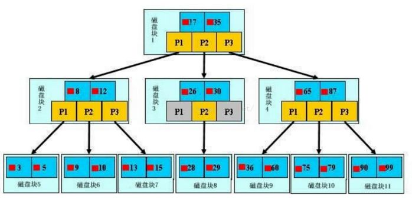
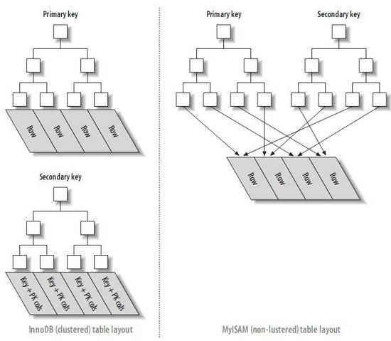
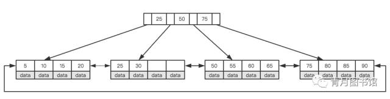
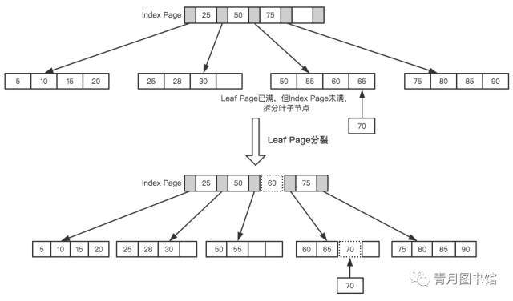
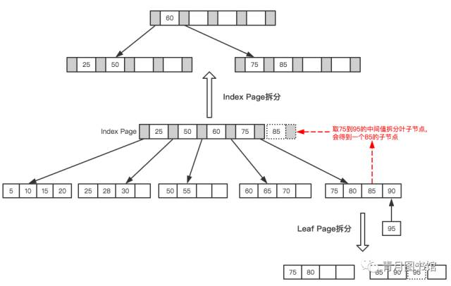
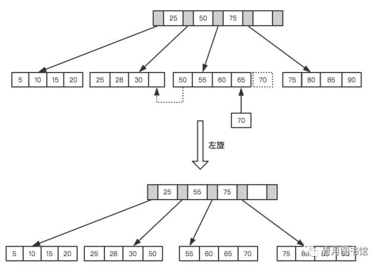
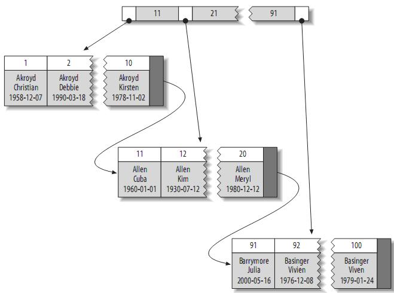

# [mysql / mysql-server](https://github.com/mysql/mysql-server)

MySQL Server, the world's most popular open source database, and MySQL Cluster, a real-time, open source transactional database. http://www.mysql.com/

## 版本

* MariaDB
* Percona:一个相对比较成熟的、优秀的MySQL分支版本，在性能提升、可靠性、管理型方面做了不少改善。与MySQL版本基本完全兼容，并且性能大约有20%以上的提升
* 5.7.8
    - 对 JSON 的支持
* [8.0](https://www.mysql.com/why-mysql/white-papers/whats-new-mysql-8-0/)
    - 更好的性能：读/写工作负载、IO 密集型工作负载、以及高竞争（"hot spot"热点竞争问题）工作负载。
    - 文档存储:为 schema-less 模式的 JSON 文档提供了多文档事务支持和完整的 ACID 合规性
    - SQL角色：可以在单个的会话中创建、授予、删除和应用 MySQL 角色
        + ROLES_GRAPHML()
        + 增强了对密码重用的限制：之前支持密码过期策略，新版会检测密码是否有效
    - 基于现有的 GIS 支持，引入了地理和空间参考
    - 窗口函数(Window Functions)
    - 索引可以被“隐藏”和“显示”。当对索引进行隐藏时，它不会被查询优化器所使用。
    - 降序索引
    - 通用表表达式(Common Table Expressions CTE)：在复杂的查询中使用嵌入式表时，使用 CTE 使得查询语句更清晰。
    - UTF-8 编码：用 utf8mb4 作为 MySQL 的默认字符集。
    - 对 JSON 的支持，添加了基于路径查询参数从 JSON 字段中抽取数据的 JSON_EXTRACT() 函数，以及用于将数据分别组合到 JSON 数组和对象中的 JSON_ARRAYAGG() 和 JSON_OBJECTAGG() 聚合函数。
    - InnoDB 现在支持表 DDL 的原子性，也就是 InnoDB 表上的 DDL 也可以实现事务完整性，要么失败回滚，要么成功提交，不至于出现 DDL 时部分成功的问题，此外还支持 crash-safe 特性，元数据存储在单个事务数据字典中。
    - InnoDB 集群提供集成的原生 HA 解决方案
    - validate_password:默认为caching_sha2_password,客户端不支持

## 安装

```sh
## MAC
brew install mysql

/usr/local/Cellar/mysql/8.0.11/bin/mysqld
--initialize-insecure
--user=henry
--basedir=/usr/local/Cellar/mysql/8.0.11
--datadir=/usr/local/var/mysql
--tmpdir=/tmp

brew services start mysql
mysql.server start|stop|restart|status

brew cask install mysqlworkbench|sequel-pro # 客户端

mysql_secure_installation # 没有设置 root 帐户的密码，马上设置它;通过删除可从本地主机外部访问的 root 帐户来禁用远程 root 用户登录;删除匿名用户帐户和测试数据库

unset TMPDIR
mysql_install_db --verbose --user=`whoami` --basedir="$(brew --prefix mysql)" --datadir=/usr/local/var/mysql --tmpdir=/tmp

## ubuntu
sudo apt install mysql-server
## 卸载
sudo apt remove mysql-server mysql-common
sudo apt autoremove mysql-server
sudo mysql_ssl_rsa_setup --uid=mysql #
sudo rm /var/lib/mysql/ -R
sudo rm /etc/mysql/ -R

## MariaDB
yum -y install mariadb-server mariadb
systemctl start mariadb && systemctl enable mariadb

dpkg -l | grep mysql
dpkg -l |grep ^rc|awk '{print $2}' |sudo xargs dpkg -P

# 源码安装
groupadd mysql
useradd -g mysql mysql
cd /usr/local/mysql-5.5.44-linux2.6-i686/
chown -R msyql.mysql .
scripts/mysql_install_db --basedir=/usr/local/mysql chown -R root .
cp support-files/mysql.server /etc/init.d/mysqld
chkconfig --add mysqld
chkconfig mysqld on
cp support-files/my-medium.cnf /etc/my.cnf
service mysqld start
ps aux | grep mysqld
# 注意:/usr/local/mysql/bin/mysqld: error while loading shared libraries: libaio.so.1: cannot open shared object fil 134
# 解决方案:yum install libaio
sestatus -v
getenforce
#修改/etc/selinux/config 文件
#将SELINUX=enforcing改为SELINUX=disabled
#重启机器即可

# 服务管理
service mysql status|start|stop|restart
systemctl status|start|stop|restart mysql.service

## docker
docker pull mysql
docker run --name master -p 3306:3307 -e MYSQL_ROOT_PASSWORD=root -d mysql

docker run -d --name mysql8 -p 3306:3306 --restart=always -v /Users/henry/Container/mysql:/var/lib/mysql -e MYSQL_ROOT_PASSWORD=123456 -e MYSQL_DATABASE=user_center mysql --sql_mode=NO_ZERO_IN_DATE,NO_ZERO_DATE,ERROR_FOR_DIVISION_BY_ZERO,NO_ENGINE_SUBSTITUTION --character-set-server=utf8mb4 --collation-server=utf8mb4_unicode_ci
docker exec -it mysql8 bash  #进入doccker
mysql -uroot -p123456 #连接mysql
alter user 'root'@'%' identified with mysql_native_password by '123456'; #更改身份验证插件

# Windows,管理员权限执行
net start|stop mysql # win平台

## 多实例
mkdir -p /data/{3306,3307}
# 配置
cp support-files/my-small.cnf /data/3306/my.cnf
cp support-files/mysql.server /data/3306/mysql

cp support-files/my-small.cnf /data/3307/my.cnf
cp support-files/mysql.server /data/3307/mysql

# dpkg: error processing package mariadb-server-10.0 (--configure):subprocess installed post-installation script returned error exit status 1
sudo apt-get remove --purge mysql*
sudo apt-get remove --purge mysql
sudo apt-get remove --purge mariadb
sudo apt-get remove --purge mariadb*
sudo apt-get --purge remove mariadb-server
```

## 原理

* server 层
    - 连接器:通信协议是“半双工”:在任一时刻，要么是服务器向客户端发送数据，要么是客户端向服务器发送数据，这两个动作不能同时发生
        + 负责将 mysql 客户端和服务端建立连接，连接成功后，会获取当前连接用户的权限
        + 获取到的权限对整个连接都有效，一旦连接成功后，如果使用管理员账号对该用户更改权限，当前连接中的拥有的权限保持不变，只有等到下次重新连接才会更新权限
        + 客户端用一个单独的数据包将查询请求发送给服务器，所以当查询语句很长的时候，需要设置 max_allowed_packet参数。但是需要注意的是，如果查询实在是太大，服务端会拒绝接收更多数据并抛出异常。
        + 服务器响应给用户的数据通常会很多，由多个数据包组成。但是当服务器响应客户端请求时，客户端必须完整的接收整个返回结果，而不能简单的只取前面几条结果，然后让服务器停止发送。因而在实际开发中，尽量保持查询简单且只返回必需的数据，减小通信间数据包的大小和数量
        + 客户端如果太长时间没动静，连接器就会自动将它断开。这个时间是由参数 wait_timeout 控制的，默认值是 8 小时。
        + 长连接是指连接成功后，如果客户端持续有请求，则一直使用同一个连接。短连接则是指每次执行完很少的几次查询就断开连接，下次查询再重新建立一个。
        + 全部使用长连接后，占用内存涨得特别快，因为 MySQL 在执行过程中临时使用的内存是管理在连接对象里面的。这些资源会在连接断开的时候才释放。所以如果长连接累积下来，可能导致内存占用太大，被系统强行杀掉（OOM）
            * 定期断开长连接。使用一段时间或者程序里面判断执行过一个占用内存的大查询后，断开连接，之后要查询再重连
            * 如果你用的是 MySQL 5.7 或更新版本，可以在每次执行一个比较大的操作后，通过执行 mysql_reset_connection 来重新初始化连接资源。这个过程不需要重连和重新做权限验证，但是会将连接恢复到刚刚创建完时的状态。
    - 查询缓存
        + 在执行查询之前，如果查询缓存是打开的，会检查这个查询语句是否命中查询缓存中的数据，之前执行过的语句及其结果可能会以 key-value 对的形式，被直接缓存在内存中。key 是查询的语句，value 是查询的结果。如果有缓存直接从缓存中读取并返回数据，不再执行后面的步骤了，结束查询操作
        + 如果没有缓存则继续往后执行，并将执行结果和语句保存在缓存中
        + 将缓存存放在一个引用表（不要理解成 table，可以认为是类似于 HashMap的数据结构）
            * 通过一个哈希值索引，这个哈希值通过查询本身、当前要查询的数据库、客户端协议版本号等一些可能影响结果的信息计算得来
            * 两个查询在任何字符上的不同（例如：空格、注释），都会导致缓存不会命中
        + 查询中包含任何用户自定义函数、存储函数、用户变量、临时表、mysql库中的系统表，其查询结果都不会被缓存
            * 比如函数 NOW()或者 CURRENT_DATE()会因为不同的查询时间，返回不同的查询结果
            * 包含 CURRENT_USER或者 CONNECION_ID()的查询语句会因为不同的用户而返回不同的结果
        + 查询缓存系统会跟踪查询中涉及的每个表，如果这些表（数据或结构）发生变化，那么和这张表相关的所有缓存数据都将失效
            * 在任何的写操作时，MySQL将对应表的所有缓存都设置为失效
            * 如果查询缓存非常大或者碎片很多，这个操作就可能带来很大的系统消耗，甚至导致系统僵死一会儿
        + 查询缓存对系统的额外消耗也不仅仅在写操作，读操作也不例外
            * 任何的查询语句在开始之前都必须经过检查，即使这条SQL语句永远不会命中缓存
            * 如果查询结果可以被缓存，那么执行完成后，会将结果存入缓存，也会带来额外的系统消耗
            * 缓存和失效都会带来额外消耗，只有当缓存带来的资源节约大于其本身消耗的资源时，才会给系统带来性能提升
        + 建议
            * 用多个小表代替一个大表，注意不要过度设计
            * 批量插入代替循环单条插入
            * 合理控制缓存空间大小，一般来说其大小设置为几十兆比较合适
            * 可以通过 SQL_CACHE和 SQL_NO_CACHE来控制某个查询语句是否需要进行缓存
            * 不要轻易打开查询缓存，特别是写密集型应用。如果想用，可以将 query_cache_type设置为 DEMAND，这时只有加入 SQL_CACHE 的查询才会走缓存
        + 注意:在 mysql8 后已经没有这个功能了，因为这个缓存非常容易被清空掉，命中率比较低。只要对表有一个更新，这个表上的所有缓存就会被清空，因此刚缓存下来的内容，还没来得及用就被另一个更新给清空了
        + 按需使用：可以将参数 query_cache_type 设置成 DEMAND，这样对于默认的 SQL 语句都不使用查询缓存。而对于确定要使用查询缓存的语句，可以用 SQL_CACHE 显式指定
    - 分析器
        + 词法分析：通过关键字将SQL语句进行解析，并生成一颗对应的解析树,预处理器会校验“解析树”是否合法(主要校验数据列和表明是否存在，别名是否有歧义等)，
            * 检查单词是否拼写错误
            * 检查要查询的表或字段是否存在。检测出有错误就会返回类似 "You have an error in your sql" 这样的错误信息，并结束查询操作
    - 优化器：对于一个 sql 语句，mysql 内部可能存在多种执行方案，结果都一样，但效率不一样，在执行之前需要尝试找出一个最优的执行计划.在表里面有多个索引的时候，决定使用哪个索引；或者在一个语句有多表关联（join）的时候，决定各个表的连接顺序。
        + 基于成本的优化器:它尝试预测一个查询使用某种执行计划时的成本，并选择其中成本最小的一个。成本的最小单位是读取一个4K数据页的成本
        + 在MySQL可以通过查询当前会话的 last_query_cost的值来得到其计算当前查询的成本 `show status like 'last_query_cost';` 结果为数据页的数量
        + 有非常多的原因会导致MySQL选择错误的执行计划
            * 比如统计信息不准确、不会考虑不受其控制的操作成本（用户自定义函数、存储过程）
            * MySQL认为的最优跟我们想的不一样（我们希望执行时间尽可能短，但MySQL值选择它认为成本小的，但成本小并不意味着执行时间短）
        + 优化策略
            * 多表关联的查询（INTER JOIN）:优化器会根据数据的选择性来重新决定关联的顺序，选择性高的会被置前。如果关联设计到N张表，优化器会尝试N！种的关联顺序，从中选出一种最优的排列顺序
            * 提前终止查询（比如：使用Limit时，查找到满足数量的结果集后会立即终止查询）
            * 将外连接转化成内连接
            * 覆盖索引扫描：索引中的列包含所有查询中需要的列的时候，只需要使用索引返回数据，不需要搜索数据行
            * 优化排序
                - 在老版本MySQL会使用两次传输排序，即先读取行指针和需要排序的字段在内存中对其排序，然后再根据排序结果去读取数据行
                - 新版本采用的是单次传输排序，也就是一次读取所有的数据行，然后根据给定的列排序,对于I/O密集型应用，效率会高很多）
            * 结果集进行排序，会采取两种策略
                - 如果结果集的容量小于“排序缓冲区”的容量，在内存中进行排序
                - 如果查询的结果大于“排序缓冲区”，则先将结果集拆分成多个“排序缓冲区”可以容纳的子集，然后把各个子集排序的结果存放在磁盘上，最后对各个子集进行合并
            * 等价规则:如 出现 where 5=5 and a>5 会转化成where a>5
            * COUNT(),MIN(),MAX()：在EXTRA中会出现 “Selecttables optimized away”的字样
                - 对于B-Tree索引而言，Max()/Min()的结果分别返回的是二叉树中最左边以及最右边的值，所以不需要进行表的访问就可以直接取到对应的值
                - 当执行 `select max(id) from table1 where name=’sun’` 时,如果name没有建立相应的索引,MYSQL会进行全表扫描,将SQL等同的转化为 `select id from table1 use index(PRIMARY) where name=’sun’ limit 1`
                - 对于Count()函数而言，在MYISAM引擎中维护了一个对应的常量值，也不需要对表进行访问就可以直接取到Count的值
            * 提前终止，在下列几种情况中，查询会提前终止，并不再对表进行扫描
                - 当优化器发现查询的结果已经满足查询需求的时候。比如查询中用到了LIMIT
                - Where的条件不成立的时候。例如 where id>100 and id <10
            * 列表IN()的比较
                - where id in(2,4,1,3,8,6) 这种类型的限制条件在很多的RDBMS中等同于`where id=2 or id=4 or id=3 or id=8 or id=6` 这种算法的复杂度是O(n)
                - 在MYSQL中,首先会对In列表进行排序，然后通过二分查找的方式进行比较，该方式的算法复杂度是O(log n).如果IN列表中的数据量非常的大，则效果会非常的明显
            * 关联子查询
                - 因为`select …from table1 t1 where t1.id in(select t2.fk from table2 t2 wheret2.id=’…’)` 类型的语句往往会被优化成 `select …. From table1 t1 where exists (select* from table2 t2 where t2.id=’…’ and t2.fk=t1.id)`, 由于在进行tabl2查询时, table1的值还无法确定, 所以会对table1进行全表扫描
                - 尽量用 INNER JOIN 替代 IN(),重写成 `select * from table1 t1 inner join table2 t2 using (id) where t2.id=’…’`,表链接用到索引
            * UNION的限制：UNION操作不会把UNION外的操作推送到每个子集
                - 为每个子操作单独的添加限制条件，例如  学生表有10000条记录,会员表有10000表记录,如果想按照姓名排序取两个表的前20条记录,如果在各个子查询中添加limit的话,则最外层的limit操作将会从40条记录中取20条,否则是从20000条中取20条
    - 执行器
        + 在执行语句之前会判断权限，如果没有对应的权限则会直接返回并提示没有相关权限
        + 如果是在前面的查询缓存中查到缓存之后，也会在返回结果前做权限校验的
        + 按照选定的方案执行 sql 语句，打开表，调用存储引擎提供的接口（handler API）去查询并返回结果集数据
        + 在查询优化阶段就为每一张表创建了一个 handler 实例，优化器可以根据这些实例的接口来获取表的相关信息，包括表的所有列名、索引统计信息等
        + 存储引擎接口提供了非常丰富的功能，但其底层仅有几十个接口，这些接口像搭积木一样完成了一次查询的大部分操作
        + 在数据库的慢查询日志中看到一个 rows_examined 的字段，表示这个语句执行过程中扫描了多少行,这个值是在执行器每次调用引擎获取数据行的时候累加的
* 存储层：用来存储和查询数据
* 更新流程
    - 物理日志 redo log（重做日志）
        + WAL（Write-Ahead Logging）：关键点就是先写日志，再写磁盘。当有一条记录需要更新的时候，InnoDB 引擎就会先把记录写到 redo log 里面，并更新内存，这个时候更新就算完成了。同时，InnoDB 引擎会在适当的时候，将这个操作记录更新到磁盘里面，而这个更新往往是在系统比较空闲的时候做
        + 有固定大小的，比如可以配置为一组 4 个文件，每个文件的大小是 1GB，那么总共就可以记录 4GB 的操作。从头开始写，写到末尾就又回到开头循环写
        + write pos 是当前记录的位置，一边写一边后移，写到第 3 号文件末尾后就回到 0 号文件开头。checkpoint 是当前要擦除的位置，也是往后推移并且循环的，擦除记录前要把记录更新到数据文件。
        + write pos 和 checkpoint 之间的是“粉板”上还空着的部分，可以用来记录新的操作。如果 write pos 追上 checkpoint，表示“粉板”满了，这时候不能再执行新的更新，得停下来先擦掉一些记录，把 checkpoint 推进一下。
        + 可以保证即使数据库发生异常重启，之前提交的记录都不会丢失，这个能力称为 crash-safe
    - 逻辑日志 binlog（归档日志）
        + 最开始 MySQL 里并没有 InnoDB 引擎。MySQL 自带的引擎是 MyISAM，但是 MyISAM 没有 crash-safe 的能力，binlog 日志只能用于归档。而 InnoDB 是另一个公司以插件形式引入 MySQL 的，既然只依靠 binlog 是没有 crash-safe 能力的，所以 InnoDB 使用另外一套日志系统——也就是 redo log 来实现 crash-safe 能力。
        + 区别
            * redo log 是 InnoDB 引擎特有的；binlog 是 MySQL 的 Server 层实现的，所有引擎都可以使用。
            * redo log 是物理日志，记录的是“在某个数据页上做了什么修改”；binlog 是逻辑日志，记录的是这个语句的原始逻辑，比如“给 ID=2 这一行的 c 字段加 1 ”。
            * redo log 是循环写的，空间固定会用完；binlog 是可以追加写入的。“追加写”是指 binlog 文件写到一定大小后会切换到下一个，并不会覆盖以前的日志。
    - `update T set c=c+1 where ID=2;`
        + 执行器先找引擎取 ID=2 这一行。ID 是主键，引擎直接用树搜索找到这一行。如果 ID=2 这一行所在的数据页本来就在内存中，就直接返回给执行器；否则，需要先从磁盘读入内存，然后再返回。
        + 执行器拿到引擎给的行数据，把这个值加上 1，比如原来是 N，现在就是 N+1，得到新的一行数据，再调用引擎接口写入这行新数据。
        + 引擎将这行新数据更新到内存中，同时将这个更新操作记录到 redo log 里面，此时 redo log 处于 prepare 状态。然后告知执行器执行完成了，随时可以提交事务。
        + 执行器生成这个操作的 binlog，并把 binlog 写入磁盘。
        + 执行器调用引擎的提交事务接口，引擎把刚刚写入的 redo log 改成提交（commit）状态，更新完成。
    - 让数据库恢复到半个月内任意一秒的状态
        + binlog 会记录所有的逻辑操作，并且是采用“追加写”的形式。如果你的 DBA 承诺说半个月内可以恢复，那么备份系统中一定会保存最近半个月的所有 binlog
        + 系统会定期做整库备份。这里的“定期”取决于系统的重要性，可以是一天一备，也可以是一周一备。
        + 恢复过程
            * 找到最近的一次全量备份，如果运气好，可能就是昨天晚上的一个备份，从这个备份恢复到临时库；
            * 从备份的时间点开始，将备份的 binlog 依次取出来，重放到中午误删表之前的那个时刻
            * 临时库就跟误删之前的线上库一样了，然后你可以把表数据从临时库取出来，按需要恢复到线上库去。
        + 如果不使用“两阶段提交”，那么数据库的状态就有可能和用它的日志恢复出来的库的状态不一致

[MySQL查询](../_static/mysql_query.png)

### 配置

* 配置文件：/usr/local/etc/my.cnf或者 my.ini
* 字符集: 客户端向MySQL服务器端请求和返加的数据的字符集
    - 在选择数据库后使用:`set names gbk`;
    - 默认使用utf8mb4字符集,utf8mb4是utf8的超集，emoji表情以及部分不常见汉字在utf8下会表现为乱码，故需要升级至utf8mb4。
    + 数据库存储:一个汉字utf8下为两个长度,gbk下为一个长度
    + 正常一个汉字utf8下为三个字节,gbk下为两个字节
    + 系统变量
        + character_set_server：默认的内部操作字符集
        + character_set_client：客户端来源数据使用的字符集
        + character_set_connection：连接层字符集
        + character_set_results：查询结果字符集
        + character_set_database：当前选中数据库的默认字符集
        + character_set_system：系统元数据(字段名等)字符集
* 保证客户端使用字符集与服务端返回数据字符集编码一致(以适应客户端为主,修改服务器服务器端配置)
* 校对：规则属于PADSPACE类。这说明在MySQL中的所有CHAR和VARCHAR值比较时不需要考虑任何尾部空格
    - _bin：按二进制编码比较
    - _ci：不区分大小写比较
* 连接变量
    - max_connection # 最大连接数:增加该值增加mysqld 要求的文件描述符的数量。如果服务器的并发连接请求量比较大，建议调高此值，以增加并行连接数量，当然这建立在机器能支撑的情况下，因为如果连接数越多，介于MySQL会为每个连接提供连接缓冲区，就会开销越多的内存，所以要适当调整该值，不能盲目提高设值。
        + max_used_connections / max_connections * 100% （理想值≈ 85%）
        + max_used_connections跟max_connections相同 那么就是max_connections设置过低或者超过服务器负载上限了，低于10%则设置过大。
    - back_log: MySQL能暂存的连接数量。当主要MySQL线程在一个很短时间内得到非常多的连接请求，这就起作用。如果MySQL的连接数据达到max_connections时，新来的请求将会被存在堆栈中，以等待某一连接释放资源，该堆栈的数量即back_log，如果等待连接的数量超过back_log，将不被授予连接资源。
        + back_log值指出在MySQL暂时停止回答新请求之前的短时间内有多少个请求可以被存在堆栈中。只有如果期望在一个短时间内有很多连接，你需要增加它，换句话说，这值对到来的TCP/IP连接的侦听队列的大小。
        + 默认数值是50，可调优为128，对于Linux系统设置范围为小于512的整数。
* 缓冲区变量
    - key_buffer_size指定索引缓冲区的大小，它决定索引处理的速度，尤其是索引读的速度。通过检查状态值Key_read_requests和Key_reads，可以知道key_buffer_size设置是否合理。比例key_reads / key_read_requests应该尽可能的低，至少是1:100，1:1000更好（上述状态值可以使用SHOW STATUS LIKE ‘key_read%’获得）。
        + key_buffer_size只对MyISAM表起作用。即使不使用MyISAM表，但是内部的临时磁盘表是MyISAM表，也要使用该值。可以使用检查状态值created_tmp_disk_tables得知详情。
        + 计算索引未命中缓存的概率：`key_cache_miss_rate ＝Key_reads / Key_read_requests * 100%`，设置在1/1000左右较好
    - query_cache_size:使用查询缓冲，MySQL将查询结果存放在缓冲区中，今后对于同样的SELECT语句（区分大小写），将直接从缓冲区中读取结果。
        + 如果Qcache_lowmem_prunes的值非常大，则表明经常出现缓冲不够的情况
        + 如果Qcache_hits的值也非常大，则表明查询缓冲使用非常频繁，此时需要增加缓冲大小
        + 如果Qcache_hits的值不大，则表明你的查询重复率很低，这种情况下使用查询缓冲反而会影响效率，那么可以考虑不用查询缓冲。
        + query_cache_type指定是否使用查询缓冲，可以设置为0、1、2，该变量是SESSION级的变量。
        + query_cache_limit指定单个查询能够使用的缓冲区大小，缺省为1M。
        + query_cache_min_res_unit是在4.1版本以后引入的，它指定分配缓冲区空间的最小单位，缺省为4K。检查状态值Qcache_free_blocks，如果该值非常大，则表明缓冲区中碎片很多，这就表明查询结果都比较小，此时需要减小query_cache_min_res_unit。
        + 查询缓存碎片率= Qcache_free_blocks / Qcache_total_blocks * 100%,如果查询缓存碎片率超过20%，可以用FLUSH QUERY CACHE整理缓存碎片，或者试试减小query_cache_min_res_unit，如果你的查询都是小数据量的话。
        + 查询缓存利用率= (query_cache_size – Qcache_free_memory) / query_cache_size * 100%,查询缓存利用率在25%以下的话说明query_cache_size设置的过大，可适当减小；查询缓存利用率在80％以上而且Qcache_lowmem_prunes > 50的话说明query_cache_size可能有点小，要不就是碎片太多。
        + 查询缓存命中率= (Qcache_hits – Qcache_inserts) / Qcache_hits * 100%,示例服务器查询缓存碎片率＝20.46％，查询缓存利用率＝62.26％，查询缓存命中率＝1.94％，命中率很差，可能写操作比较频繁吧，而且可能有些碎片。
    - record_buffer_size:每个进行一个顺序扫描的线程为其扫描的每张表分配这个大小的一个缓冲区。如果你做很多顺序扫描，你可能想要增加该值。默认数值是131072(128K)，可改为16773120 (16M)
    - read_rnd_buffer_size:随机读缓冲区大小。当按任意顺序读取行时(例如，按照排序顺序)，将分配一个随机读缓存区。进行排序查询时，MySQL会首先扫描一遍该缓冲，以避免磁盘搜索，提高查询速度，如果需要排序大量数据，可适当调高该值。但MySQL会为每个客户连接发放该缓冲空间，所以应尽量适当设置该值，以避免内存开销过大。一般可设置为16M.
    - sort_buffer_size:每个需要进行排序的线程分配该大小的一个缓冲区。增加这值加速ORDER BY或GROUP BY操作。默认数值是2097144(2M)，可改为16777208 (16M)。
    - join_buffer_size:联合查询操作所能使用的缓冲区大小.
    - record_buffer_size，read_rnd_buffer_size，sort_buffer_size，join_buffer_size为每个线程独占，也就是说，如果有100个线程连接，则占用为16M*100
    - table_cache:表高速缓存的大小。每当MySQL访问一个表时，如果在表缓冲区中还有空间，该表就被打开并放入其中，这样可以更快地访问表内容。通过检查峰值时间的状态值Open_tables和Opened_tables，可以决定是否需要增加table_cache的值。如果你发现open_tables等于table_cache，并且opened_tables在不断增长，那么你就需要增加table_cache的值了（上述状态值可以使用SHOW STATUS LIKE ‘Open%tables’获得）。注意，不能盲目地把table_cache设置成很大的值。如果设置得太高，可能会造成文件描述符不足，从而造成性能不稳定或者连接失败。1G内存机器，推荐值是128－256。内存在4GB左右的服务器该参数可设置为256M或384M。
    - max_heap_table_size:临时表分配足够的内存.用户可以创建的内存表(memory table)的大小。这个值用来计算内存表的最大行数值。这个变量支持动态改变，即set @max_heap_table_size=#,这个变量和tmp_table_size一起限制了内部内存表的大小。如果某个内部heap（堆积）表大小超过tmp_table_size，MySQL可以根据需要自动将内存中的heap表改为基于硬盘的MyISAM表。
        + 临时表用于内部操作如GROUP BY和distinct，还有一些ORDER BY查询以及UNION和FROM子句（派生表）中的子查询。这些都是在内存中创建的内存表。内存中临时表的最大大小由tmp_table_size和max_heap_table_size中较小的值确定。如果临时表的大小超过这个阈值，则将其转换为磁盘上的InnoDB或MyISAM表。此外，如果查询涉及BLOB或TEXT列，而这些列不能存储在内存表中，临时表总是直接指向磁盘。
        + 一定要监视服务器的内存使用情况，因为内存中的临时表可能会增加达到服务器内存容量的风险.一般来说，32M到64M是建议值，从这两个变量开始并根据需要进行调优
        + 允许的最大值：显示tmp_table_size服务器变量的值，它定义了在内存中创建的临时表的最大大小。与max_heap_table_size一起，这个值定义了可以在内存中创建的临时表的最大大小。如果内存临时表大于此大小，则将其存储在磁盘上。
        + 内存表的最大大小：显示max_heap_table_size服务器变量的值，该值定义了显式创建的MEMORY存储引擎表的最大大小。
        + 创建的临时表总数：显示created_tmp_tables服务器变量的值，它定义了在内存中创建的临时表的数量。
        + 在磁盘上创建的临时表：显示created_tmp_disk_tables服务器变量的值，该变量定义了在磁盘上创建的临时表的数量。如果这个值很高，则应该考虑增加tmp_table_size和max_heap_table_size的值，以便增加创建内存临时表的数量，从而减少在磁盘上创建临时表的数量。
        + 磁盘：总比率：基于created_tmp_disk_tables除以created_tmp_tables的计算值。由于tmp_table_size或max_heap_table_size不足而在磁盘上创建的临时表的百分比。Monyog将这个数字显示为一个进度条和百分比，以便快速确定有多少磁盘用于临时表，而不是内存。
        + 通过设置tmp_table_size选项来增加一张临时表的大小，例如做高级GROUP BY操作生成的临时表。如果调高该值，MySQL同时将增加heap表的大小，可达到提高联接查询速度的效果，建议尽量优化查询，要确保查询过程中生成的临时表在内存中，避免临时表过大导致生成基于硬盘的MyISAM表。理想的配置是：Created_tmp_disk_tables / Created_tmp_tables * 100% <= 25%.默认为16M，可调到64-256最佳，线程独占，太大可能内存不够I/O堵塞
        + thread_cache_size:可以复用的保存在中的线程的数量。如果有，新的线程从缓存中取得，当断开连接的时候如果有空间，客户的线置在缓存中。如果有很多新的线程，为了提高性能可以这个变量值。通过比较 Connections和Threads_created状态的变量，可以看到这个变量的作用。默认值为110，可调优为80。
            * 线程缓存大小由thread_cache_size系统变量决定。默认值为0（无缓存），这将导致为每个新连接设置一个线程，并在连接终止时需要处理该线程。如果希望服务器每秒接收数百个连接请求，那么应该将thread_cache_size设置的足够高，以便大多数新连接可以使用缓存线程。可以在服务器启动或运行时设置max_connections的值。
            * 还应该监视缓存中的线程数（Threads_cached）以及创建了多少个线程，因为无法从缓存中获取线程（Threads_created）。关于后者，如果Threads_created继续以每分钟多于几个线程的增加，请考虑增加thread_cache_size的值。
            * thread_cache_size：可以缓存的线程数。
            * Threads_cached：缓存中的线程数。
            * Threads_created：创建用于处理连接的线程。
        + 线程和当前连接的客户端之间是一对一的比例。确保线程缓存足够大以容纳所有传入请求是非常重要的。
        + thread_concurrency:推荐设置为服务器 CPU核数的2倍，例如双核的CPU, 那么thread_concurrency的应该为4；2个双核的cpu, thread_concurrency的值应为8。默认为8
* InnoDB的变量
    - innodb_buffer_pool_size:对于InnoDB表来说，innodb_buffer_pool_size的作用就相当于key_buffer_size对于MyISAM表的作用一样。InnoDB使用该参数指定大小的内存来缓冲数据和二级索引，脏数据(已经被更改但没有刷新到硬盘的数据)以及各种内部结构如自适应哈希索引。对于单独的MySQL数据库服务器，最大可以把该值设置成物理内存的80%。根据MySQL手册，对于2G内存的机器，推荐值是1G（50%）。
    - innodb_flush_log_at_trx_commit:主要控制了innodb将log buffer中的数据写入日志文件并flush磁盘的时间点，取值分别为0、1、2三个。0，表示当事务提交时，不做日志写入操作，而是每秒钟将log buffer中的数据写入日志文件并flush磁盘一次；1，则在每秒钟或是每次事物的提交都会引起日志文件写入、flush磁盘的操作，确保了事务的ACID；设置为2，每次事务提交引起写入日志文件的动作，但每秒钟完成一次flush磁盘操作。实际测试发现，该值对插入数据的速度影响非常大，设置为2时插入10000条记录只需要2秒，设置为0时只需要1秒，而设置为1时则需要229秒。因此，MySQL手册也建议尽量将插入操作合并成一个事务，这样可以大幅提高速度。根据MySQL手册，在允许丢失最近部分事务的危险的前提下，可以把该值设为0或2。
    - innodb_log_buffer_size:log缓存大小，一般为1-8M，默认为1M，对于较大的事务，可以增大缓存大小。可设置为4M或8M。
    - innodb_additional_mem_pool_size:该参数指定InnoDB用来存储数据字典和其他内部数据结构的内存池大小。缺省值是1M。通常不用太大，只要够用就行，应该与表结构的复杂度有关系。如果不够用，MySQL会在错误日志中写入一条警告信息。根据MySQL手册，对于2G内存的机器，推荐值是20M，可适当增加。
    - innodb_thread_concurrency=8:推荐设置为 2*(NumCPUs+NumDisks)，默认一般为8
    - INNODB_LOG_FILE_SIZE
* 模式
    - 严格模式

```sh
\s|status
chmod 644 /etc/my.cnf # 文件 /etc/my.conf 只能由 root 用户修改
cat /dev/null > ~/.mysql_history # 删除 MySQL shell 历史

bind-address = 127.0.0.1 # 将限制来自远程机器的访问，只接受来自本地主机的连接
local-infile=0 # 使用下面的指令以防止在 [mysqld] 部分从 MySQL 中访问底层文件系统。

[client]
datadir="F:/wamp/mysql/data"
default-character-set = utf8
default-collation=utf8_general_ci
port = 3306
socket = /data/3306/mysql.sock

[mysql]
no-auto-rehash

[mysqld]
user = mysql
port = 3306
socket = /data/3306/mysql.sock
basedir = /usr/local/mysql
datadir = /data/3306/data # 数据库文件路径
open_files_limit = 1024
default-time-zone = '+8:00' # 重启mysql使新时区生效
back_log = 600 #在MYSQL暂时停止响应新请求之前，短时间内的多少个请求可以被存在堆栈中。如果系统在短时间内有很多连接，则需要增大该参数的值，该参数值指定到来的TCP/IP连接的监听队列的大小。默认值50。
max_connections = 3000 #MySQL允许最大的进程连接数，如果经常出现Too Many Connections的错误提示，则需要增大此值。

default-storage-engine = INNODB
character-set-server = utf8
collation-server = utf8_general_ci
Port=5000 # 修改端口号
log=/var/log/mysql.log # 了解服务运行过程中发生了什么的最好的方法之一

log-slow-queries=/data/mysqldata/slow-query.log # 慢查询日志存放的位置，一般这个目录要有mysql的运行帐号的可写权限，一般都将这个目录设置为mysql的数据存放目录；
long_query_time=2     # 表示查询超过两秒才记录
log-queries-not-using-indexes  # 表示记录下没有使用索引的查询

table_cache = 614 #指示表调整缓冲区大小。table_cache 参数设置表高速缓存的数目。每个连接进来，都会至少打开一个表缓存。#因 此， table_cache 的大小应与 max_connections 的设置有关。例如，对于 200 个#并行运行的连接，应该让表的缓存至少 有 200 × N ，
external-locking = FALSE #使用–skip-external-locking MySQL选项以避免外部锁定。该选项默认开启
max_allowed_packet = 32M #设置在网络传输中一次消息传输量的最大值。系统默认值 为1MB，最大值是1GB，必须设置1024的倍数。
sort_buffer_size = 2M # Sort_Buffer_Size 是一个connection级参数，在每个connection（session）第一次需要使用这个buffer的时候，一次性分配设置的内存。Sort_Buffer_Size 并不是越大越好，由于是connection级的参数，过大的设置+高并发可能会耗尽系统内存资源。例如：500个连接将会消耗 500*sort_buffer_size(8M)=4G内存
join_buffer_size = 2M #用于表间关联缓存的大小，和sort_buffer_size一样，该参数对应的分配内存也是每个连接独享。
thread_cache_size = 300 # 服务器线程缓存这个值表示可以重新利用保存在缓存中线程的数量,当断开连接时如果缓存中还有空间,那么客户端的线程将被放到缓存中,如果线程重新被请 求，那么请求将从缓存中读取,如果缓存中是空的或者是新的请求，那么这个线程将被重新创建,如果有很多新的线程，增加这个值可以改善系统性能.通过比 较 Connections 和 Threads_created 状态的变量，可以看到这个变量的作用。设置规则如下：1GB 内存配置为8，2GB配 置为16，3GB配置为32，4GB或更高内存，可配置更大。
thread_concurrency = 8 # 设置thread_concurrency的值的正确与否, 对mysql的性能影响很大, 在多个cpu(或 多核)的情况下，错误设置了thread_concurrency的值, 会导致mysql不能充分利用多cpu(或多核), 出现同一时刻只能一个 cpu(或核)在工作的情况。thread_concurrency应设为CPU核数的2倍. 比如有一个双核的CPU, 那么 thread_concurrency的应该为4; 2个双核的cpu, thread_concurrency的值应为8
query_cache_size = 64M # 对于使用MySQL的用户，对于这个变量大家一定不会陌生。前几年的MyISAM引擎优化中，这个参数也是一个重要的优化参数。但随着发展，这个参 数也爆露出来一些问题。机器的内存越来越大，人们也都习惯性的把以前有用的参数分配的值越来越大。这个参数加大后也引发了一系列问题。我们首先分析一 下 query_cache_size的工作原理：一个SELECT查询在DB中工作后，DB会把该语句缓存下来，当同样的一个SQL再次来到DB里调用 时，DB在该表没发生变化的情况下把结果从缓存中返回给Client。这里有一个关建点，就是DB在利用Query_cache工作时，要求该语句涉及的 表在这段时间内没有发生变更。那如果该表在发生变更时，Query_cache里的数据又怎么处理呢？首先要把Query_cache和该表相关的语句全 部置为失效，然后在写入更新。那么如果Query_cache非常大，该表的查询结构又比较多，查询语句失效也慢，一个更新或是Insert就会很慢，这 样看到的就是Update或是Insert怎么这么慢了。所以在数据库写入量或是更新量也比较大的系统，该参数不适合分配过大。而且在高并发，写入量大的 系统，建议把该功能禁掉。
query_cache_limit = 4M #指定单个查询能够使用的缓冲区大小，缺省为1M
transaction_isolation = READ-COMMITTED
tmp_table_size = 256M # tmp_table_size 的默认大小是 32M。如果一张临时表超出该大小，

myisam_sort_buffer_size = 128M # MyISAM表发生变化时重新排序所需的缓冲
myisam_max_sort_file_size = 10G # MySQL重建索引时所允许的最大临时文件的大小 (当 REPAIR, ALTER TABLE 或者 LOAD DATA INFILE).如果文件大小比此值更大,索引会通过键值缓冲创建(更慢)
myisam_max_extra_sort_file_size = 10G
myisam_repair_threads = 1 # 如果一个表拥有超过一个索引, MyISAM 可以通过并行排序使用超过一个线程去修复他们.这对于拥有多个CPU以及大量内存情况的用户,是一个很好的选择.

server-id = 1 # 开启binlog日志
log_bin=/var/log/mysql/mysql-bin.log
binlog_rows_query_log_events=on # 记录SQL

innodb_file_io_threads = 4 #文件IO的线程数，一般为 4，但是在 Windows 下，可以设置得较大。
innodb_thread_concurrency = 8 #服务器有几个CPU就设置为几，建议用默认设置，一般为8.
innodb_buffer_pool_size= 2048M # 如果是单实例且绝大多数是InnoDB引擎表的话，可考虑设置为物理内存的50% ~ 70%左右.Innodb相比MyISAM表对缓冲更为敏感。MyISAM可以在默认的 key_buffer_size 设置 下运行的可以，然而Innodb在默认的 innodb_buffer_pool_size 设置下却跟蜗牛似的。由于Innodb把数据和索引都缓存起 来，无需留给操作系统太多的内存，因此如果只需要用Innodb的话则可以设置它高达 70-80% 的可用内存。
innodb_data_file_path = ibdata1:1G:autoextend # 表空间文件 重要数据 千万不要用默认的10M，否则在有高并发事务时，会受到不小的影响
innodb_flush_log_at_trx_commit = 2 # 如果将此参数设置为1，将在每次提交事务后将日志写入磁盘。为提供性能，可以设置为0或2，但要承担在发生故障时丢失数据的风险。设置为0表示事务日 志写入日志文件，而日志文件每秒刷新到磁盘一次。设置为2表示事务日志将在提交时写入日志，但日志文件每次刷新到磁盘一次。
innodb_log_file_size=256M # 此参数确定数据日志文件的大小，以M为单位，更大的设置可以提高性能，但也会增加恢复故障数据库所需的时间
innodb_log_buffer_size = 16M #此参数确定些日志文件所用的内存大小，以M为单位。缓冲区更大能提高性能，但意外的故障将会丢失数据.MySQL开发人员建议设置为1－8M之间
innodb_log_files_in_group=3 # MySQL可以以循环方式将日志文件写到多个文件。推荐设置为3M
innodb_file_per_table = 0 #独享表空间（关闭）
innodb_lock_wait_timeout = 120 # InnoDB 有其内置的死锁检测机制，能导致未完成的事务回滚。但是，如果结合InnoDB使用MyISAM的lock tables 语句或第三 方事务引擎,则InnoDB无法识别死锁。为消除这种可能性，可以将innodb_lock_wait_timeout设置为一个整数值，指 示 MySQL在允许其他事务修改那些最终受事务回滚的数据之前要等待多长时间(秒数)
innodb_max_dirty_pages_pct = 90 # Buffer_Pool中Dirty_Page所占的数量，直接影响InnoDB的关闭时间。

transaction-isolation = REPEATABLE-READ # 全局事物隔离级别
max_connection_error = 6000 #（最大错误数，建议设置为10万以上，而open_files_limit、innodb_open_files、table_open_cache、table_definition_cache这几个参数则可设为约10倍于max_connection的大小

[mysqldump]
quick
max_allowed_packet = 32M

[mysqld_safe]
log-error=/data/3306/mysql_oldboy.err
pid-file=/data/3306/mysqld
```

```sh
# 脚本文件
#!/bin/sh
init port=3307
mysql_user="root"
mysql_pwd="migongge"
CmdPath="/application/mysql/bin"
mysql_sock="/data/${port}/mysql.sock"
#startup
function_start_mysql() {
    if [ ! -e "$mysql_sock" ];then
     printf "Starting MySQL...\n"
    /bin/sh ${CmdPath}/mysqld_safe --defaults-file=/data/${port}/my.cnf 2>&1 > /dev/null &
    else
      printf "MySQL is running...\n"
    exit
    fi
}
#stop function
function_stop_mysql() {
    if [ ! -e "$mysql_sock" ];then
    printf "MySQL is stopped...\n"
    exit
    else
    printf "Stoping MySQL...\n"
    ${CmdPath}/mysqladmin -u ${mysql_user} -p${mysql_pwd} -S /data/${port}/mysql.sock shutdown
    fi
}
#restart function
function_restart_mysql() {
   printf "Restarting MySQL...\n"
   function_stop_mysql
   sleep 2
   function_start_mysql
}

case $1 in
start)
function_start_mysql
;;
stop)
function_stop_mysql
;;
restart)
function_restart_mysql
;;
*)
printf "Usage: /data/${port}/mysql {start|stop|restart}\n"
esac
```

```sql
status # 查看连接信息
select version();
SHOW VARIABLES LIKE "character_set%"; # character_set_client  接受的客户端编码  character_set_result # 返回结果集的编码
SET character_set_client=GBK; # 不一致的话,修改
set names gbk # 修改client connection results字符集

# 出现ERROR 1040: Too many connections错误,修正max_connections的值
show variables like 'max_connections';  # 最大连接数
show status like 'max_used_connections'; # 响应的连接数

show full processlist;

show variables like 'key_buffer_size';
show global status like 'key_read%'; # 请求在内存中没有找到直接从硬盘读取索引

SHOW GLOBAL STATUS LIKE '%Threads_connected%';
SHOW GLOBAL STATUS LIKE '%Threads_runing%';

SHOW STATUS LIKE 'Qcache%';
show global status like 'qcache%';
show variables like 'query_cache%';

show global status like 'created_tmp%';

show variables like "general_log%";  # 记录操作,pdo执行过程
set global general_log = on;

show variables like '%time_zone%';

# 仅修改当前会话的时区，停止会话失效
set time_zone = '+8:00';
# 修改全局的时区配置
set global time_zone = '+8:00';
flush privileges;
# 8.0 GA版本开始支持将参数写入并且持久化：
set persist time_zone='+0:00';

select now();
select curtime();
```

```sh
# mysqladmin
mysqld --initialize
```

### 权限管理

* all权限:`SELECT,INSERT, UPDATE, DELETE, CREATE, DROP, REFERENCES, INDEX, ALTER, CREATE TEMPORARY TABLES, LOCK TABLES, EXECUTE, CREATE VIEW, SHOW VIEW, CREATE ROUTINE, ALTER ROUTINE, EVENT, TRIGGER`
* 插件
    - auth_socket plugin：　`sudo mysql` 直接登录

```sql
mysql -hlocalhost  -P 3306 -u root -p  # 生成用户root与空密码登陆,第一次登陆mysql的时候是没有密码的

exit|quit| \q

SELECT user,authentication_string,plugin,host FROM mysql.user;
CREATE USER 'lee'@'localhost' IDENTIFIED WITH mysql_native_password BY '123456Ac&' # 添加用户
GRANT ALL PRIVILEGES ON test.*/user.*/ TO lee@'localhost';
GRANT ALL PRIVILEGES ON *.* TO 'root'@'%' IDENTIFIED BY 'root密码' WITH GRANT OPTION;
FLUSH PRIVILEGES;

SELECT user,authentication_string,plugin,host FROM mysql.user; # msyql 8.0
ALTER USER 'root'@'localhost' IDENTIFIED WITH mysql_native_password BY 'password';
ALTER USER `root`@`localhost` IDENTIFIED WITH caching_sha2_password BY 'password';
FLUSH PRIVILEGES;

select user(); # 当前连接数据库的用户

show grants for 'testuser'@'localhost';

# 更新密码
update mysql.user SET Password = PASSWORD('密码') where User = 'root';
FLUSH PRIVILEGES;

DROP USER 'user'@'localhost'
REVOKE CREATE,DROP,INSERT,UPDATE,SELECT,DELETE ON database_name.table_name FROM ‘username’@‘localhost’;

## 重置root密码 获取临时密码
grep 'temporary password' /var/log/mysqld.log

# mariadb 重置root密码
sudo systemctl stop mysqlsudo systemctl set-environment MYSQLD_OPTS="--skip-grant-tables --skip-networking"
sudo systemctl start mariadb
sudo mysql -u rootUPDATE mysql.user SET password = PASSWORD('new_password') WHERE user = 'root';
UPDATE mysql.user SET authentication_string = '' WHERE user = 'root';
UPDATE mysql.user SET plugin = '' WHERE user = 'root';s
sudo systemctl restart mariadb

show processlist
```

### 数据类型

* 整型
    - tinyint 0-255 或 -2^7~2^7-1 1个字节
    - smallint -2^15~2^15-1 2个字节
    - mediumint -2^23~2^23-1 3个字节
    - int 0-2^32-1 4个字节
    - bigint 0-2^64-1 8个字节
    - unsigned:无符号数
    - 显示宽度int(11):最小显示位数(默认不起作用),zerofill会用0填充,不决定数据大小
* 浮点型(M代表总长度(不含小数点)，D代表小数位数),精度会丢失,不要作比较
    - float(M,D) (论上可以保留7位小数) 3.4E+38~3.4E+38 4个字节
    - double(M,D) (理论上保留15位小数) -1.8E+308~1.8E+308 8个字节
* 定点数:decimal(M,D)，M的最大值是65，D的最大值是30，默认是（10,0）,用于保存精确的小数,使用二进制格式将9个十进制(基于10)数压缩为4个字节
    - 使用二进制格式将9个十进制(基于10)数压缩为4个字节来表示DECIMAL列值
    - M整数与小数部分的总长度， D指的是小数部分的长度
    - 注意:定点数的值是正确的，浮点数会失去精度。浮点数的执行效率要高于定点数。浮点数和定点数支持显示宽度，支持无符号
* **字符**
    - 长度 指的 字符长度而不是字节数
    - char(M) 固定长度 0-255个字符
        + 不足的话右边填充空格以达到指定的长度
        + 存取数度还是要比varchar要快得多，因为其长度固定，方便程序的存储与查找
        + 当检索/读取到CHAR值时，尾部的空格被删除掉
        + 付出的是空间的代价，因为其长度固定，所以难免会有多余的空格占位符占据空间，可谓是以空间换取时间效率
    - varchar(M) 自动伸缩型，varchar数据类型的长度支持到了65535字节
        + M为最大字符个数
        + 占用需要的空间
        + 使用额外的1到2字节存储长度，列小于255使用1字节保存长度，大于255使用2字节保存
        + 在5.0.3以下的版本中的最大长度限制为255，而在5.0.3及以上的版本中，
        + 值保存和检索时尾部的空格仍保留
    - 指定长度都为字符长度
    - 长度
        + 英文字符（ASCII）占用1个字节，对一个汉字占用两个字节
        + 在utf-8状态下，每个字符最多占3个字节，汉字最多可以存 21844个字符串, 英文也为 21844个字符串
        + 在gbk状态下，每个字符最多占2个字节，汉字最多可以存 32766个字符串，英文也为 32766个字符串
    - 分配给CHAR或VARCHAR列的值超过列的最大长度，则对值进行裁剪以使其适合。如果被裁掉的字符不是空格，则会产生一条警告
    * 超过255字符的只能用varchar或者text
    - blob和text唯一区别就是blob保存二进制数据、没有字符集和排序规则
    - tinytext: 2^8-1
    - text 2^16-1 不可以有默认值，能用varchar的地方不用text，占用字节比varchar大太多
    - mediumtext 中型文本型 2^24-1 0－1677个字符
    - longtext 大型文本 2^32-1 0-42亿个字符
* 日期时间
    - date 2015-10-20
    - time 10:09:08 100908 9:5:0 CURRENT_TIME()
        +  ADDTIME(CURRENT_TIME(), 023000),  SUBTIME(CURRENT_TIME(), 023000);
        +  TIMEDIFF(end_at, start_at)
        +  TIME_FORMAT(start_at, '%h:%i %p') start_at
        +  UTC_TIME()
    - datetime '1000-01-01 00:00:00' to '9999-12-31 23:59:59'，精度是秒，存储值为 2016-05-06 22:39:40
        + Strict mode (and more specifically NO_ZERO_DATE which is part of strict mode) usually sets off that error if the table was created with an all zero default date
        + 查看 SELECT @@sql_mode，使用1970-01-01 00:00:01
    - timestamp保存自 1970年1月1日午夜以来的秒数，和unix时间戳相同，提供4字节存储 只能表示1970年到2038年。默认timestamp值 为 NOT NULL。
    - 默认值：datetime or timestrap 默认值 CURRENT_TIMESTAMP
* ip:通常使用varchar(15)保存IP地址
    * inet_aton() inet_ntoa()用于转换
* json
    - 不能有默认值
    - 添加
        + 可以是对象的形式，也可以是数组的形式
        + 用函数 JSON_OBJECT，JSON_ARRAY 生成 json 格式的数据
    - 查询
        + JSON_UNQUOTE 函数将双引号去掉，与操作符 ->> 等价
        + 对象类型 path 这样表示 column->$.path, 而数组类型则是 column->$[index]
    - 搜索
        + 用字符串和 JSON 字段比较，是不会相等的
        + CAST 将字符串转成 JSON
        + column->path 形式从 select 中查询出来的字符串是包含双引号的，但作为条件这里其实没什么影响，-> 和 ->> 结果是一样的
        + 严格区分变量类型的，比如说整型和字符串是严格区分
        + JSON_CONTAINS 第二个参数是不接受整数的，必须字符串
        + JSON_INSERT() 插入新值，但不会覆盖已经存在的值
        + JSON_SET() 插入新值，并覆盖已经存在的值

```sql
`last_opt_time` TIMESTAMP DEFAULT CURRENT_TIMESTAMP ON UPDATE CURRENT_TIMESTAMP COMMENT '最后操作时间'; # 创建、修改记录的时候都刷新
`create_time` TIMESTAMP DEFAULT CURRENT_TIMESTAMP COMMENT '创建时间'; # 创建的时候把这个字段设置为当前时间，但以后修改时，不再刷新
`update_time` TIMESTAMP DEFAULT '0000-00-00 00:00:00' ON UPDATE CURRENT_TIMESTAMP COMMENT '更新时间'; # 创建的时候把这个字段设置为空或定值，以后修改时刷新

CREATE TABLE lnmp (
    `id` int(10) unsigned NOT NULL AUTO_INCREMENT,
    `category` JSON,
    `tags` JSON,
    PRIMARY KEY (`id`)
);
INSERT INTO `lnmp` (category, tags) VALUES ('{"id": 1, "name": "lnmp.cn"}', '[1, 2, 3]');
INSERT INTO `lnmp` (category, tags) VALUES (JSON_OBJECT("id", 2, "name", "php.net"), JSON_ARRAY(1, 3, 5));
SELECT id, category->'$.id', category->'$.name', tags->'$[0]', tags->'$[2]' FROM lnmp;
SELECT id, JSON_UNQUOTE(category->'$.name'), category->>'$.name' FROM lnmp;

SELECT * FROM lnmp WHERE category = CAST('{"id": 1, "name": "lnmp.cn"}' as JSON);
SELECT * FROM lnmp WHERE category->'$.name' = 'lnmp.cn'; # category->>'$.name' = 'lnmp.cn';
SELECT * FROM lnmp WHERE category->'$.id' = 1; # 不能 ‘1’
SELECT * FROM lnmp WHERE JSON_CONTAINS(category, '1', '$.id');
SELECT * FROM lnmp WHERE JSON_CONTAINS(tags, '2');
UPDATE lnmp SET tags = '[1, 3, 4]' WHERE id = 1;
UPDATE lnmp SET category = JSON_INSERT(category, '$.name', 'lnmp', '$.url', 'www.lnmp.cn') WHERE id = 1;
UPDATE lnmp SET category = JSON_SET(category, '$.host', 'www.lnmp.cn', '$.url','http://www.lnmp.cn') WHERE id = 1;
UPDATE lnmp SET category = JSON_REPLACE(category, '$.name', 'php', '$.url', 'http://www.php.net') WHERE id = 2;
UPDATE lnmp SET category = JSON_REMOVE(category, '$.url', '$.host') WHERE id = 1;

select max(created_at) begin, min(created_at) end,max(created_at)-min(created_at) as time from tmo_loyalty_customersync_log  where  created_at > '2019-09-12 08:00:00' and created_at < '2019-09-12 09:00:00'
selECT * FROM cron_schedule  where job_code='tmo_sync_jde_customers';

select day(timestamp) as Day, hour(timestamp) as Hour, count(*) as Count
from MyTable
where timestamp between :date1 and :date2
group by day(timestamp), hour(timestamp)

select max(created_at) begin, min(created_at) end,max(created_at)-min(created_at) as time from tmo_loyalty_customersync_log  group by year(created_at),month(created_at),day(created_at),hour(created_at)  order by begin desc limit 10;
```

### 库表数据操作

* DB|TABLE
    - CREATE
    - DROP
* DATA
    - INSERT
    - DELETE
    - UPDATE
    - SELECT
* 属性
    - NOT NULL | NULL：字段值是否可以为空
    - DEFAULT value：字段值是否有一个默认值
        + DEFAULT 1 ，默认值为整型
        + DEFAULT "男" ，默认值为字符型
    - PRIMARY KEY：指定该列主键，值是唯一的，不能重复
    - AUTO_INCREMENT，指定列的值是自动增长型。 注意：一个数据表，只能有一个主键和一个自动增长型。 提示：数据表的id字段，必须要有 not null primary key auto_incremtn 这三个属性。
    - ALIAS:别名
        + 涉及超过一个表
        + 在查询中使用了函数
        + 列名称很长或者可读性差
        + 需要把两个列或者多个列结合在一起
    - COMMENT:注释

```sql
SHOW DATABASES;
CREATE DATABASE IF NOT EXISTS db_name [CHARACTER SET utf8 COLLATE utf8_unicode_ci];  # 特殊符号、关键字表名加``
ALTER DATABASE db_name charset=utf8;
DROP DATABASE [IF EXISTS] db_name;
SHOW CREATE DATABASE db_name;
select database();  # 查看当前使用的数据库
USE db_name;

SHOW TABLES;
# CREATE TABLE table_name(col_name  type  attribute , col_name  type  attribute,…… );
CREATE TABLE test.news(
  id int NOT null AUTO_INCREMENT primary KEY,
  title varchar(100) not null comment '名称',
  author varchar(20) not null comment '作者',
  source varchar(30) not null comment '来源',
  hits int(5) not null DEFAULT 0 comment '点击率',
  context text null comment '内容',
  adddate int(16) not null comment '添加时间',
  PRIMARY KEY (Id)
)charset=utf8 collate=utf8_bin;
CREATE TABLE table_name SELECT column1,cloumn2 FROM another_table: # 复制数据不复制主键
CREATE TABLE table_name like another_table；  #  数据不复制，主键复制
INSERT office_dup SELECT * FROM offices;

DESCRIBE|DESC news;
show columns from news;
SHOW CREATE TABELE news\G;

ALTER TABLE table_name ADD address varchar(30) first| after name;
ALTER TABLE table_name DROP address;
ALTER TABLE table_name MODIFY address varchar(100);
ALTER TABLE table_name CHANGE address add varchar(100) after id;
ALTER TABLE table_name engine=myisam;
ALTER TABLE table_name rename to new_table_name;
RENAME table table_name to new_table_name, tb3 TO tb4;
ALTER TABLE table_name rename to another_DB.new_table_name; # 移动表
ALTER TABLE 'table_name' ADD PRIMARY KEY'index_name' ('column');
ALTER TABLE 'table_name' ADD UNIQUE 'index_name' ('column');
ALTER TABLE 'table_name' ADD INDEX'index_name' ('column');
ALTER TABLE 'table_name' ADD FULLTEXT 'index_name' ('column');
ALTER TABLE 'table_name' ADD INDEX 'index_name' ('column1', 'column2', ...);

DROP TABLE [IF EXISTS] db_name;
DELETE FROM table_name;  # 清空数据表：数据一条条删除
TRUNCATE TABLE table_name;  # 删除表,重建同结构

SELECT [DISTINCT] 字段列表|* FROM table_name [WHERE条件][ORDER BY排序(默认是按id升序排列)][LIMIT (startrow ,) pagesize];
SELECT id,title,author,hits,addate from news ORDER BY id DESC LIMIT 10,10; # limit [offset,]rowcount:offset 为偏移量，而非主键id
SELECT * FROM rp_evaluate LIMIT 500 * $i, 500
SELECT `rp_e_id`,`evaluate` FROM `rp_evaluate` WHERE `rp_e_id` > 0 LIMIT 500
SELECT column_name AS alias_name FROM table_name;
SELECT column_name(s) FROM table_name AS alias_name; SELECT w.name, w.url, a.count, a.date FROM Websites AS w, access_log AS a WHERE a.site_id=w.id and w.name="菜鸟教程";
SELECT conact('a', 'b')
SELECT conact_ws(',', 'a', 'b')
SELECT GROUP_CONCAT(c_name) FROM categories WHERE school_id =1 # 字符拼接

INSERT INTO table_name (字段1,字段2,字段3,…) VALUES (值1,值2,值3,…),(值1,值2,值3,…);   # 记录操作：添加 更新与删除数据(新增与修改不用添加TABLE关键字)
INSERT INTO table_name values (null,值,....); # 全字段插入，自动增长列用null
INSERT INTO table_name values (null,值,....),(null,值,....),(null,值,....); # 插入多条数据
INSERT INTO table_name set volumn1=value1,volumn3=value3,volumn3=value3;

UPDATE table_name SET 字段1 = 新值1, 字段2 = 新值2  [WHERE条件]; # 更新记录
UPDATE base SET `count` = `count` + 1；

DELETE FROM table_name [WHERE条件];
```

## 表设计规范

* 库名、表名、字段名：小写，下划线风格，不超过32个字符，必须见名知意，禁止拼音英文混用
* 表名t_xxx，非唯一索引名idx_xxx，唯一索引名uniq_xxx
* 数据库范式
    - 第一范式(1NF)：字段值具有原子性,不能再分(所有关系型数据库系统都满足第一范式); 例如：姓名字段,其中姓和名是一个整体,如果区分姓和名那么必须设立两个独立字段
    - 第二范式(2NF)：一个表必须有主键,即每行数据都能被唯一的区分; 备注：必须先满足第一范式
    - 第三范式(3NF)：一个表中不能包涵其他相关表中非关键字段的信息,即数据表不能有沉余字段;备注：必须先满足第二范式
* 范式和反范式：对千任何给定的数据通常都有很多种表示方法， 从完全的范式化到完全的反范式化， 以及两者的折中。 在范式化的数据库中， 每个事实数据会出现并且只出现一次。 相反， 在反范式化的数据库中， 信息是冗余的， 可能会存储在多个地方。
    - 范式的优点和缺点：为性能提升考虑时，经常会被建议对 schema 进行范式化设计，尤其是写密集的场
    - 范式化的更新操作通常比反范式化要快
    - 当数据较好地范式化时，就只有很少或者没有重复数据，所以只需要修改更少的数据
    - 范式化的表通常更小，可以更好地放在内存里，所以执行操作会更快
    - 很少有多余的数据意味着检索列表数据时更少需要 DISTINCT 或者 GROUP BY语句。
    - 反范式的优点和缺点
        + 不需要关联表，则对大部分查询最差的情况----即使表没有使用索引----是全表扫描
        + 当数据比内存大时这可能比关联要快得多，因为这样避免了随机I/0
        + 单独的表也能使用更有效的索引策略
    - 混用范式化和反范式化：在实际应用中经常需要混用，可能使用部分范式化的 schema 、 缓存表，以及其他技巧。 表适当增加冗余字段，如性能优先，但会增加复杂度。可避免表关联查询

## 查询

* 字段列表：指要显示指定列的数据，多个字段之间用逗号隔开，各字段之间没有顺序。*：显示所有字段的数据
* 排序 ORDER BY
* 限制返回数量 LIMIT
* 条件：WHERE
    - Index Key：用于确定SQL查询在索引中的连续范围(起始范围+结束范围)的查询条件，被称之为Index Key。由于一个范围，至少包含一个起始与一个终止，因此Index Key也被拆分为Index First Key和Index Last Key，分别用于定位索引查找的起始，以及索引查询的终止条件。
        + Index First Key：用于确定索引查询的起始范围。提取规则：从索引的第一个键值开始，检查其在where条件中是否存在，若存在并且条件是=、>=，则将对应的条件加入Index First Key之中，继续读取索引的下一个键值，使用同样的提取规则；若存在并且条件是>，则将对应的条件加入Index First Key中，同时终止Index First Key的提取；若不存在，同样终止Index First Key的提取。
        + Index Last Key：Index Last Key的功能与Index First Key正好相反，用于确定索引查询的终止范围。提取规则：从索引的第一个键值开始，检查其在where条件中是否存在，若存在并且条件是=、<=，则将对应条件加入到Index Last Key中，继续提取索引的下一个键值，使用同样的提取规则；若存在并且条件是 < ，则将条件加入到Index Last Key中，同时终止提取；若不存在，同样终止Index Last Key的提取。
    - Index Filter：根据where条件固定了索引的查询范围，但是此范围中的项，并不都是满足查询条件的项。提取规则：同样从索引列的第一列开始，检查其在where条件中是否存在：若存在并且where条件仅为 =，则跳过第一列继续检查索引下一列，下一索引列采取与索引第一列同样的提取规则；若where条件为 >=、>、<、<= 其中的几种，则跳过索引第一列，将其余where条件中索引相关列全部加入到Index Filter之中；若索引第一列的where条件包含 =、>=、>、<、<= 之外的条件，则将此条件以及其余where条件中索引相关列全部加入到Index Filter之中；若第一列不包含查询条件，则将所有索引相关条件均加入到Index Filter之中。
    - Table Filter:提取规则：所有不属于索引列的查询条件，均归为Table Filter之中。
    - 运算符：＝ ＜ ＞ ＜＝ ＞＝ !＝ ＜＞ is not null IS NULL
    - BETWEEN 1 AND 20:WHERE date BETWEEN '2016-05-10' AND '2016-05-14'
    - IN / NOT IN
    - LIKE('name%') NOT LIKE('name%')
    - 逻辑运算: AND & OR(可以混合使用)
* 匹配
    - % 替代 0 个或多个字符
    - _ 替代一个字符
    - [charlist] 字符列中的任何单一字符
    - [^charlist]或[!charlist] 不在字符列中的任何单一字符 WHERE name REGEXP '^[GFs]'；name REGEXP '^[^A-H]'
* group by：ORDER BY 联合指的是如果 ORDER BY 后面的字段是联合索引覆盖 where 条件之后的一个字段，由于索引已经处于有序状态，MySQL 就会直接从索引上读取有序的数据，然后在磁盘上读取数据之后按照该顺序组织数据，从而减少了对磁盘数据进行排序的操作。
    - 对于未覆盖 ORDER BY 的查询，其有一项 Creating sort index，即为磁盘数据进行排序的耗时最高；对于覆盖 ORDER BY 的查询，其就不需要进行排序，而其耗时主要体现在从磁盘上拉取数据的过程。
* 联表：表与表之间通过公共字段建立关系
    - 公共字段名字可以不一样，但是数据类型必须一样
    - 联表查询降低查询速度
    - 数据冗余与查询速度的平衡
* 子查询

```sql
CREATE [UNIQUE|FULLTEXT]  INDEX index_name on tbl_name (col_name [(length)] [ASC | DESC] , …..);
alter table table_name ADD INDEX [index_name] (index_col_name,...);

DROP INDEX index_name ON tbl_name;
alter table table_name drop index index_name;
alter table t_b drop primary key;

show index from table_name;
show keys from table_name;
desc table_Name;

CREATE TABLE user_test(
  id int AUTO_INCREMENT PRIMARY KEY,
  user_name varchar(30) NOT NULL,
  sex bit(1) NOT NULL DEFAULT b'1',
  city varchar(50) NOT NULL,
  age int NOT NULL,
  PRIMARY KEY(ID)
  ) ENGINE=InnoDB DEFAULT CHARSET=utf8;
ALTER TABLE user_test ADD INDEX idx_user(name(10) , city , age); # 因为一般情况下名字的长度不会超过10，这样会加速索引查询速度，还会减少索引文件的大小，提高INSERT的更新速度。

SELECT COUNT(DISTINCT index_column)/COUNT(*) FROM table_name; -- index_column代表要添加前缀索引的列，前缀索引的选择性比值，比值越高说明索引的效率也就越高效。
SELECT COUNT(DISTINCT LEFT(index_column,1))/COUNT(*),COUNT(DISTINCT LEFT(index_column,2))/COUNT(*),COUNT(DISTINCT LEFT(index_column,3))/COUNT(*) FROM table_name;
ALTER TABLE table_name ADD INDEX index_name (index_column(length));

#### 有效索引
`SELECT * FROM user_test WHERE user_name = 'feinik' AND age = 26 AND city = '广州';` # 全值匹配
（user_name ）、（user_name, city）、（user_name , city , age）  # 匹配最左前缀 满足最左前缀查询条件的顺序与索引列的顺序无关
`SELECT * FROM user_test WHERE user_name LIKE 'feinik%';` # 匹配范围值

#### 无效索引
SELECT * FROM user_test WHERE city = '广州';
SELECT * FROM user_test WHERE age= 26;
SELECT * FROM user_test WHERE user_name like '%feinik';
SELECT * FROM user_test WHERE user_name ='feinik' AND city LIKE'广州%' AND age = 26; # 有某个列的范围查询,则其右边的所有列都无法使用索引优化查询
SELECT * FROM user_test WHERE user_name = concat(user_name, 'fei');  #  索引列不能是表达式的一部分，也不能作为函数的参数
SELECT user_name, city, age FROM user_test ORDER BY user_name, sex;  #  不在索引列中
SELECT user_name, city, age FROM user_test ORDER BY user_name ASC, city DESC;  # 方向不一致
SELECT user_name, city, age, sex FROM user_test ORDER BY user_name;
SELECT user_name, city, age FROM user_test WHERE user_name LIKE 'feinik%' ORDER BY city;

# 使用索引排序：ORDER BY 子句后的列顺序要与组合索引的列顺序一致，且所有排序列的排序方向（正序/倒序）需一致；所查询的字段值需要包含在索引列中，及满足覆盖索引。
SELECT user_name, city, age FROM user_test ORDER BY user_name;
SELECT user_name, city, age FROM user_test ORDER BY user_name, city;
SELECT user_name, city, age FROM user_test ORDER BY user_name DESC, city DESC;
SELECT user_name, city, age FROM user_test WHERE user_name = 'feinik' ORDER BY city;

select a.FirstName,a.LastName, b.City, b.State from Person as a inner join address b on a.PersonId = b.PersonId

## [语句集锦](https://juejin.im/post/584e7b298d6d81005456eb53)
# 查询时间
select date_format(create_time, '%Y-%m-%d') as day from table_name
# int 时间戳类型
select from_unixtime(create_time, '%Y-%m-%d') as day from table_name

# 一个sql返回多个总数
select count(*) all
count(case when status = 1 then status end) status_1_num,
count(case when status = 2 then status end) status_2_num
from table_name
# Update Join / Delete Join
update table_name_1
inner join table_name_2 on table_name_1.id = table_name_2.uid
inner join table_name_3 on table_name_3.id = table_name_1.tid
set *** = ***
where ***
# delete join 同上。

# 替换某字段的内容的语句
update table_name set content = REPLACE(content, 'aaa', 'bbb') where (content like '%aaa%')
# 获取表中某字段包含某字符串的数据
SELECT * FROM `表名` WHERE LOCATE('关键字', 字段名)
# 获取字段中的前4位
SELECT SUBSTRING(字段名,1,4) FROM 表名
# 查找表中多余的重复记录
# 单个字段
select * from 表名 where 字段名 in (select 字段名 from 表名 group by 字段名 having count(字段名) > 1 )
# 多个字段
select * from 表名 别名 where (别名.字段1,别名.字段2) in (select 字段1,字段2 from 表名 group by 字段1,字段2 having count(*) > 1 )
# 删除表中多余的重复记录(留id最小)
# 单个字段
delete from 表名 where 字段名 in (select 字段名 from 表名 group by 字段名 having count(字段名) > 1)
and 主键ID not in (select min(主键ID) from 表名 group by 字段名 having count(字段名 )>1)
# 多个字段
delete from 表名 别名 where (别名.字段1,别名.字段2) in (select 字段1,字段2 from 表名 group by 字段1,字段2 having count(*) > 1)
and 主键ID not in (select min(主键ID) from 表名 group by 字段1,字段2 having count(*)>1)
```

```sql
# 创建测试表
CREATE TABLE `test_number` (
  `id` int(10) unsigned NOT NULL AUTO_INCREMENT,
  `number` int(11) unsigned NOT NULL DEFAULT '0' COMMENT '数字',
  PRIMARY KEY (`id`)
) ENGINE=InnoDB DEFAULT CHARSET=utf8

# 创建测试数据
insert into test_number values(1,1);
insert into test_number values(2,2);
insert into test_number values(3,3);
insert into test_number values(4,5);
insert into test_number values(5,7);
insert into test_number values(6,8);
insert into test_number values(7,10);
insert into test_number values(8,11);

# 求数字的连续范围。
select min(number) start_range,max(number) end_range
from
(
    select number,rn,number-rn diff from
    (
        select number,@number:=@number+1 rn from test_number,(select @number:=0) as number
    ) b
) c group by diff;

# 签到问题
# 创建参考表(模拟数据需要用到)
CREATE TABLE `test_nums` (
  `id` int(11) unsigned NOT NULL AUTO_INCREMENT,
  PRIMARY KEY (`id`)
) ENGINE=InnoDB DEFAULT CHARSET=utf8 COMMENT='参考表';

# 创建测试表
CREATE TABLE `test_sign_history` (
  `id` int(10) unsigned NOT NULL AUTO_INCREMENT,
  `uid` int(11) unsigned NOT NULL DEFAULT '0' COMMENT '用户ID',
  `create_time` timestamp NOT NULL DEFAULT CURRENT_TIMESTAMP COMMENT '签到时间',
  PRIMARY KEY (`id`)
) ENGINE=InnoDB DEFAULT CHARSET=utf8 COMMENT='签到历史表';

# 创建测试数据
insert into test_sign_history(uid,create_time)
select ceil(rand()*10000),str_to_date('2016-12-11','%Y-%m-%d')+interval ceil(rand()*10000) minute
from test_nums where id<31;

# 统计每天的每小时用户签到情况
select
    h,
    sum(case when create_time='2016-12-11' then c else 0 end) 11Sign,
    sum(case when create_time='2016-12-12' then c else 0 end) 12Sign,
    sum(case when create_time='2016-12-13' then c else 0 end) 13Sign,
    sum(case when create_time='2016-12-14' then c else 0 end) 14Sign,
    sum(case when create_time='2016-12-15' then c else 0 end) 15Sign,
    sum(case when create_time='2016-12-16' then c else 0 end) 16Sign,
    sum(case when create_time='2016-12-17' then c else 0 end) 17Sign
from
(
    select
        date_format(create_time,'%Y-%m-%d') create_time,
        hour(create_time) h,
        count(*) c
    from test_sign_history
    group by
        date_format(create_time,'%Y-%m-%d'),
        hour(create_time)
) a
group by h with rollup;

# 统计每天的每小时用户签到情况(当某个小时没有数据时，显示0)
select
    h ,
    sum(case when create_time='2016-12-11' then c else 0 end) 11Sign,
    sum(case when create_time='2016-12-12' then c else 0 end) 12Sign,
    sum(case when create_time='2016-12-13' then c else 0 end) 13Sign,
    sum(case when create_time='2016-12-14' then c else 0 end) 14Sign,
    sum(case when create_time='2016-12-15' then c else 0 end) 15Sign,
    sum(case when create_time='2016-12-16' then c else 0 end) 16Sign,
    sum(case when create_time='2016-12-17' then c else 0 end) 17Sign
from
(
    select b.h h,c.create_time,c.c from
     (
        select id-1 h from test_nums where id<=24
     ) b
     left join
     (
        select
         date_format(create_time,'%Y-%m-%d') create_time,
         hour(create_time) h,
         count(*) c
        from test_sign_history
        group by
         date_format(create_time,'%Y-%m-%d'),
         hour(create_time)
      ) c on (b.h=c.h)
) a
group by h with rollup;

# 统计每天的用户签到数据和每天的增量数据
select
        type,
        sum(case when create_time='2016-12-11' then c else 0 end) 11Sign,
        sum(case when create_time='2016-12-12' then c else 0 end) 12Sign,
        sum(case when create_time='2016-12-13' then c else 0 end) 13Sign,
        sum(case when create_time='2016-12-14' then c else 0 end) 14Sign,
        sum(case when create_time='2016-12-15' then c else 0 end) 15Sign,
        sum(case when create_time='2016-12-16' then c else 0 end) 16Sign,
        sum(case when create_time='2016-12-17' then c else 0 end) 17Sign
from
(
        select b.create_time,ifnull(b.c-c.c,0) c,'Increment' type from
        (
            select
             date_format(create_time,'%Y-%m-%d') create_time,
             count(*) c
            from test_sign_history
            group by
             date_format(create_time,'%Y-%m-%d')
        ) b
        left join
        (
            select
             date_format(create_time,'%Y-%m-%d') create_time,
             count(*) c
            from test_sign_history
            group by
             date_format(create_time,'%Y-%m-%d')
        ) c on(b.create_time=c.create_time+ interval 1 day)
    union all
        select
         date_format(create_time,'%Y-%m-%d') create_time,
         count(*) c,
         'Current'
        from test_sign_history
        group by
         date_format(create_time,'%Y-%m-%d')
) a
group by type
order by case when type='Current' then 1 else 0 end desc;

# 模拟不同的用户签到了不同的天数
insert into test_sign_history(uid,create_time)
select uid,create_time + interval ceil(rand()*10) day from test_sign_history,test_nums
where test_nums.id <10 order by rand() limit 150;

# 统计签到天数相同的用户数量
select
    sum(case when day=1 then cn else 0 end) 1Day,
    sum(case when day=2 then cn else 0 end) 2Day,
    sum(case when day=3 then cn else 0 end) 3Day,
    sum(case when day=4 then cn else 0 end) 4Day,
    sum(case when day=5 then cn else 0 end) 5Day,
    sum(case when day=6 then cn else 0 end) 6Day,
    sum(case when day=7 then cn else 0 end) 7Day,
    sum(case when day=8 then cn else 0 end) 8Day,
    sum(case when day=9 then cn else 0 end) 9Day,
    sum(case when day=10 then cn else 0 end) 10Day
from
(
    select c day,count(*) cn
    from
    (
        select uid,count(*) c from test_sign_history group by uid
    ) a
    group by c
) b;

# 统计每个用户的连续签到时间
select * from (
    select d.*,
    @ggid := @cggid,
    @cggid := d.uid,
    if(@ggid = @cggid, @grank := @grank + 1, @grank := 1) grank
    from
    (
        select uid,min(c.create_time) begin_date ,max(c.create_time) end_date,count(*) count from
        (
            select
            b.*,
            @gid := @cgid,
            @cgid := b.uid,
            if(@gid = @cgid, @rank := @rank + 1, @rank := 1) rank,
            b.diff-@rank flag from (
                select
                distinct
                uid,
                date_format(create_time,'%Y-%m-%d') create_time,
                datediff(create_time,now()) diff
                from test_sign_history order by uid,create_time
            ) b, (SELECT @gid := 1, @cgid := 1, @rank := 1) as a
        ) c group by uid,flag
        order by uid,count(*) desc
    ) d,(SELECT @ggid := 1, @cggid := 1, @grank := 1) as e
)f
where grank=1;

# 模糊索引
SELECT nickname
FROM customer
WHERE nickname LIKE '%阳光%'
ORDER BY
  CASE
    WHEN nickname LIKE '阳光' THEN 0
    WHEN nickname LIKE '阳光%' THEN 1
    WHEN nickname LIKE '%阳光' THEN 3
    ELSE 2
  END

select date_format(create_time, '%Y-%m-%d') as day from table_name # timestamp 日期类型
select from_unixtime(create_time, '%Y-%m-%d') as day from table_name # int 时间戳类型

# 返回多个总数
select count(*) all,
    count(case when status = 1 then status end) status_1_num,
    count(case when status = 2 then status end) status_2_num
    from table_name;

# Update Join / Delete Join
update table_name_1
    inner join table_name_2 on table_name_1.id = table_name_2.uid
    inner join table_name_3 on table_name_3.id = table_name_1.tid
    set *** = ***  where ***;

update table_name set content = REPLACE(content, 'aaa', 'bbb')  where (content like '%aaa%')

SELECT * FROM `表名` WHERE LOCATE('关键字', 字段名) # 表中某字段包含某字符串的数据

# 表中多余的重复记录
# 单个字段
select * from 表名 where 字段名 in  (select 字段名 from 表名 group by 字段名 having count(字段名) > 1 )
# 多个字段
select * from 表名 别名 where (别名.字段1,别名.字段2) in  (select 字段1,字段2 from 表名 group by 字段1,字段2 having count(*) > 1 )

# 删除表中多余的重复记录(留id最小)
# 单个字段
delete from 表名 where 字段名 in  (select 字段名 from 表名 group by 字段名 having count(字段名) > 1)   and 主键ID not in  (select min(主键ID) from 表名 group by 字段名 having count(字段名 )>1)
#多个字段
delete from 表名 别名 where (别名.字段1,别名.字段2) in  (select 字段1,字段2 from 表名 group by 字段1,字段2 having count(*) > 1) and 主键ID not in (select min(主键ID) from 表名 group by 字段1,字段2 having count(*)>1)

UPDATE categories SET
    display_order = CASE id
        WHEN 1 THEN 3
        WHEN 2 THEN 4
        WHEN 3 THEN 5
    END,
    title = CASE id
        WHEN 1 THEN 'New Title 1'
        WHEN 2 THEN 'New Title 2'
        WHEN 3 THEN 'New Title 3'
    END
WHERE id IN (1,2,3)
```

## 函数

* 字符串方法
  - left()
  - right()
  - substr()
  - instr()
* count
    - myisam 数据行数都会存储在存储引擎 Innodb中的count()会全表或索引扫描
    - SELECT COUNT(country)统计某个列的数据的数量：如果有NULL值，在返回的结果中会被过滤掉
    - SELECT COUNT(*)的处理是有点不同的，它会返回所有数据的数量，但是不会过滤其中的NULL值
    - explain select * from table explain // 用并不真正执行查询，而是查询优化器【估算】的行数，返回值新的行数
    - count(distinct …)会返回彼此不同但是非NULL的数据的行数

```sql
set @currenttime=(select UNIX_TIMESTAMP(current_timestamp()));
```

## 事物

mysql有一个autocommit参数，默认是on，作用是每一条单独的查询都是一个事务，并且自动开始，自动提交（执行完以后就自动结束了，如果要适用select for update，而不手动调用 start transaction，这个for update的行锁机制等于没用，因为行锁在自动提交后就释放了），所以事务隔离级别和锁机制即使你不显式调用start transaction，这种机制在单独的一条查询语句中也是适用的

* 加锁阶段
    - 在对任何数据进行读操作之前要申请并获得S锁（共享锁，其它事务可以继续加共享锁，但不能加排它锁）
    - 在进行写操作之前要申请并获得X锁（排它锁，其它事务不能再获得任何锁）。
    - 加锁不成功，则事务进入等待状态，直到加锁成功才继续执行。
* 解锁阶段：当事务释放了一个封锁以后，事务进入解锁阶段
* 两段锁协议可以保证事务的并发调度是串行化（串行化很重要，尤其是在数据恢复和备份的时候）的

### 隔离

* 事务的隔离级别对于读数据的定义。四个级别逐渐增强，每个级别解决一个问题。事务级别越高,性能越差,大多数环境read committed 可以用，四种隔离级别：
    - 读未提交(Read Uncommitted)：允许脏读，也就是可能读取到其他会话中未提交事务修改的数据
        + 事物一可以获取事物二中未提交的修改
        + 事物一中未提交的修改事物（添加共享锁），事物二同样数据修改会被挂起，等待事物一commit
    - 读已提交(Read Committed)：只能读取到已经提交的数据，Oracle等多数数据库默认都是该级别。造成事务一在同一个transaction中两次读取到的数据不同，这就是不可重复读问题。并且在对表进行修改时，会对表数据行加上行共享锁
        + 数据的读取都是不加锁的，但是数据的写入、修改和删除是需要加锁的
    - 可重复读(Repeated Read)：在同一个事务内的查询都是事务开始时刻一致的，InnoDB默认级别。在SQL标准中，该隔离级别消除了不可重复读，但是还存在幻读。
        + 概念是一事务的多个实例在并发读取数据时，会看到同样的数据行
        + 当两个事务同时进行时，其中一个事务修改数据对另一个事务不会造成影响，即使修改的事务已经提交也不会对另一个事务造成影响。
        + 两个事物：事物二修改提交后，事物一不提交无法获取事物二的更新；事物一的修改未提交，事物二的修改无法成功等待事物一提交或者超时
        + 读到的数据可能是历史数据，是不及时的数据，不是数据库当前的数据
        + 对于这种读取历史数据的方式叫快照读 (snapshot read)，而读取数据库当前版本数据的方式，叫当前读 (current read)
            * 每行数据的最后加两个隐藏列,一个保存行的创建事务id，一个保存行的删除事务id.事务id，在mysql内部是全局唯一递增的
            * 始终都是查找的之前的那个快照
        + 只会查询创建时间的事务id小于等于当前事务id的行，这样可以确保这个行是在当前事务中创建，或者是之前创建的
        + 如果某个事务执行期间，别的事务更新了一条数据:插入了一行记录，然后将新插入的记录的创建时间设置为新的事务的id，同时将这条记录之前的那个版本的删除时间设置为新的事务的id
        + 
    - 串行读(Serializable)：完全串行化的读，每次读都需要获得表级共享锁，读写相互都会阻塞。
        + 读加共享锁，写加排他锁，读写互斥。使用的悲观锁的理论，实现简单，数据更加安全，但是并发能力非常差。如果你的业务并发的特别少或者没有并发，同时又要求数据及时可靠的话，可以使用这种模式。
        + 不要看到select就说不会加锁了，在Serializable这个级别，还是会加锁的
    - 当隔离级别是可重复读，且禁用innodb_locks_unsafe_for_binlog的情况下，在搜索和扫描index的时候使用的next-key locks可以避免幻读。在默认的可重复读的隔离级别里，可以使用加锁读去查询最新的数据（提交读）
        + Next-Key锁是行锁和GAP（间隙锁）的合并：行锁可以防止不同事务版本的数据修改提交时造成数据冲突的情况。但如何避免别的事务插入数据就成了问题
        + 行锁防止别的事务修改或删除，GAP锁防止别的事务新增，行锁和GAP锁结合形成的的Next-Key锁共同解决了RR级别在写数据时的幻读问题
* 数据可读性
    - 脏读：事务A读取了事务B未提交的数据
        + 当一个事务正在访问数据，并且对数据进行了修改，而这种修改还没有提交到数据库中
        + 另外一个事务也访问这个数据，然后使用了这个数据
    - 不可重复读（即不能读到相同的数据内容）：对于一条记录，事务A两次读取的数据变了
        + 在这个事务还没有结束时，另外一个事务也访问该同一数据
        + 在第一个事务中的两次读数据之间，由于第二个事务的修改，那么第一个事务两次读到的的数据可能是不一样的
    - 幻读:事务A按照相同的查询条件，读取到了新增的数据

```sql
CREATE TABLE user (
 `id` int(11) NOT NULL AUTO_INCREMENT,
 `name` varchar(255) NOT NULL,
 PRIMARY KEY (`id`),
 UNIQUE `uniq_name` USING BTREE (name)
) ENGINE=`InnoDB` AUTO_INCREMENT=10 DEFAULT CHARACTER SET utf8 COLLATE utf8_general_ci;

set autocommit=0; # 关闭事物自动提交
# 设置事物隔离级别与查看
set session transaction isolation level read uncommitted;
select @@global.tx_isolation;
select @@session.tx_isolation;
select @@tx_isolation;

start transaction; # 事物一
insert into user(name) values('ziwenxie');

set session transaction isolation level read uncommitted;
# Read Uncommitted：事务二中会读取到事务一中没有commit的数据，这就是脏读。
# Read Committed：事物一提交后影响到事务二的查询结果，前后查询的结果不一致
# REPEATABLE-READ：事务二中无法读取到事务一中没有commit的数据
start transaction; # 事物二
select * from user;

set session transaction isolation level repeatable read;

# RC级别：
select id,class_name,teacher_id from class_teacher where teacher_id=30; # 2 初三二班 30
begin;
update class_teacher set class_name='初三四班' where teacher_id=30;  # 事物一更新

insert into class_teacher values (null,'初三二班',30); # 事物二插入
commit;
select id,class_name,teacher_id from class_teacher where teacher_id=30; #  2 初三四班 30   10 初三二班 30
# RR级别：事务A在update后加锁，事务B无法插入新数据，这样事务A在update前后读的数据保持一致，避免了幻读。这个锁，就是Gap锁。
```

## 锁机制

并发控制:确保在多个事务同时存取数据库中同一数据时不破坏事务的隔离性和统一性以及数据库的统一性

* 类型
    - 共享锁（S锁，MyISAM 叫做读锁）：由读表操作加上的锁，加锁后其他用户只能获取该表或行的共享锁，不能获取排它锁，也就是说只能读不能写
    - 排它锁（X锁，MyISAM 叫做写锁）：由写表操作加上的锁，加锁后其他用户不能获取该表或行的任何锁，典型是mysql事务中
* 颗粒度
    - 表锁（table-level locking）开销小，加锁快；不会出现死锁；锁定力度大，发生锁冲突概率高，并发度最低。MyISAM InnoDB 和 MEMORY
        +   通过总是一次性同时获取所有需要的锁以及总是按相同的顺序获取表锁来避免死锁
        +   表级锁更适合于以查询为主，并发用户少，只有少量按索引条件更新数据的应用，如Web 应用
    - 行锁（page-level locking）开销大，加锁慢；会出现死锁；锁定粒度小，发生锁冲突的概率低，并发度高；BDB
        +   最大程度的支持并发，同时也带来了最大的锁开销
        +   在 InnoDB 中，除单个 SQL 组成的事务外， 锁是逐步获得的，这就决定了在 InnoDB 中发生死锁是可能的
        +   行级锁只在存储引擎层实现，而Mysql服务器层没有实现
        +   行级锁更适合于有大量按索引条件并发更新少量不同数据，同时又有并发查询的应用，如一些在线事务处理（OLTP）系统
        +   优点
            *   回滚时只有少量的更改
            *   可以长时间锁定单一的行
        +   缺点
            *  比页级或表级锁定占用更多的内存。
            *  当在表的大部分中使用时，比页级或表级锁定速度慢，因为你必须获取更多的锁。
            *  如果你在大部分数据上经常进行GROUP BY操作或者必须经常扫描整个表，比其它锁定明显慢很多。
            *  用高级别锁定，通过支持不同的类型锁定，你也可以很容易地调节应用程序，因为其锁成本小于行级锁定。
    - 页锁开销和加锁速度介于表锁和行锁之间；会出现死锁；锁定粒度介于表锁和行锁之间，并发度一般。InnoDB
* 抽象锁(不真实存在)
    - 悲观锁（又名“悲观锁”，Pessimistic Concurrency Control，缩写“PCC”）是一种并发控制的方法。在整个数据处理过程中，将数据处于锁定状态，阻止一个事务以影响其他用户的方式来修改数据
        + 先获取锁，再操作修改，数据库级别
        + 如果一个事务执行的操作都某行数据应用了锁，那只有当这个事务把锁释放，其他事务才能够执行与该锁冲突的操作
        + 条件
            * 要使用悲观锁，必须关闭mysql数据库的自动提交属性，因为MySQL默认使用autocommit模式 `set autocommit=0`
        + 实现
            * 依靠数据库的锁机制实现，以保证操作最大程度的独占性
            * 通过常用的select … for update操作来实现悲观锁，在当前事务结束时自动释放，因此必须在事务中使用
            * 确定走了索引，而不是全表扫描
            * 一锁二查三更新
                + 在对任意记录进行修改前，先尝试为该记录加上排他锁（exclusive locking）。
                - 如果加锁失败，说明该记录正在被修改，那么当前查询可能要等待或者抛出异常。 具体响应方式由开发者根据实际需要决定。
                - 如果成功加锁，那么就可以对记录做修改，事务完成后就会解锁了。
                - 其间如果有其他对该记录做修改或加排他锁的操作，都会等待我们解锁或直接抛出异常
        + 场景
            * 用于数据争用激烈的环境，以及发生并发冲突时使用锁保护数据的成本要低于回滚事务的成本的环境中。
            * 在只读型事务处理中由于不会产生冲突，也没必要使用锁，这样做只能增加系统负载；还有会降低了并行性，一个事务如果锁定了某行数据，其他事务就必须等待该事务处理完才可以处理那行数
    - 乐观锁（Optimistic Concurrency Control，缩写“OCC”），假设多用户并发的事务在处理时不会彼此互相影响，各事务能够在不产生锁的情况下处理各自影响的那部分数据
        + 先修改，保存时判断是够被更新过，应用级别
        + 实现
            - 当读取数据时，将版本标识的值一同读出，数据每更新一次，同时对版本标识进行更新
            - 当提交更新的时候，判断数据库表对应记录的当前版本信息与第一次取出来的版本标识进行比对
            - 如果数据库表当前版本号与第一次取出来的版本标识值相等，则予以更新
            - 如果不一致，即可认为老版本的数据已经被并发修改掉而不存在了，此时认为获取锁失败，需要回滚整个业务操作并可根据需要重试整个过程
        + 方法
            * 使用版本号version：为数据增加的一个版本标识
                - SELECT时，读取创建版本号<=当前事务版本号，删除版本号为空或>当前事务版本号
                - INSERT时，保存当前事务版本号为行的创建版本号
                - DELETE时，保存当前事务版本号为行的删除版本号
                - UPDATE时，插入一条新纪录，保存当前事务版本号为行创建版本号，同时保存当前事务版本号到原来删除的行
            * 使用时间戳timestamp
        + 适合
            * 用在取锁失败概率比较小的场景，可以提升系统并发性能
            * 用于写比较少的情况下
        + MVCC并发控制中，读操作可以分成两类：
            * 快照读 (snapshot read)：读取的是记录的可见版本 (有可能是历史版本)，不用加锁（共享读锁s锁也不加，所以不会阻塞其他事务的写）
            * 当前读 (current read)：读取的是记录的最新版本，并且，当前读返回的记录，都会加上锁，保证其他事务不会再并发修改这条记录
        + 优缺点
            * 通过MVCC (Multi-Version Concurrency Control) ，虽然每行记录都需要额外的存储空间，更多的行检查工作以及一些额外的维护工作，但可以减少锁的使用，大多数读操作都不用加锁，读数据操作很简单，性能很好，并且也能保证只会读取到符合标准的行，也只锁住必要行。
                - 读不加锁，读写不冲突。在读多写少的OLTP应用中，读写不冲突是非常重要的，极大的增加了系统的并发性能
            + 加大了系统的整个吞吐量。上层应用会不断的进行retry，这样反倒是降低了性能，所以这种情况下用悲观锁就比较合适
* LOCK TABLES 和 UNLOCK TABLES:服务器层（MySQL Server层）实现的
    - LOCK TABLES 可以锁定用于当前线程的表。如果表被其他线程锁定，则当前线程会等待，直到可以获取所有锁定为止
    - UNLOCK TABLES 可以释放当前线程获得的任何锁定。当前线程执行另一个 LOCK TABLES 时，或当与服务器的连接被关闭时，所有由当前线程锁定的表被隐含地解锁
    - 语法
        + 对 InnoDB 表加锁时要注意，要将 AUTOCOMMIT 设为 0
        + 事务结束前，不要用 UNLOCK TABLES 释放表锁，因为 UNLOCK TABLES会隐含地提交事务；
        + COMMIT 或 ROLLBACK 并不能释放用 LOCK TABLES 加的表级锁，必须用UNLOCK TABLES 释放表锁
    - 场景
        + 同时取得所有涉及到表的锁，并且 MySQL 不支持锁升级
* 建议
    -   尽量使用较低的隔离级别；
    -   精心设计索引， 并尽量使用索引访问数据， 使加锁更精确， 从而减少锁冲突的机会
    -   选择合理的事务大小，小事务发生锁冲突的几率也更小
    -   给记录集显示加锁时，最好一次性请求足够级别的锁。比如要修改数据的话，最好直接申请排他锁，而不是先申请共享锁，修改时再请求排他锁，这样容易产生死锁
    -   不同的程序访问一组表时，应尽量约定以相同的顺序访问各表，对一个表而言，尽可能以固定的顺序存取表中的行。这样可以大大减少死锁的机会
    -   尽量用相等条件访问数据，这样可以避免间隙锁对并发插入的影响
    -   不要申请超过实际需要的锁级别
    -   除非必须，查询时不要显示加锁。 MySQL的MVCC可以实现事务中的查询不用加锁，优化事务性能；MVCC只在COMMITTED READ（读提交）和REPEATABLE READ（可重复读）两种隔离级别下工作
    -   对于一些特定的事务，可以使用表锁来提高处理速度或减少死锁的可能

```sql
show OPEN TABLES where In_use > 0; # 查询是否锁表
## Innodb 显性锁定
# 共享锁
select * from table lock in share mode
# 排它锁
select * from table for update --增删改自动加了排他锁

# 死锁产生，无法更新锁
begin transelect * from table lock in share mode 
update table set column1='hello'

begin transelect * from table lock in share mode 
update table set column1='world'

# 有机会产生死锁，但实际上要看情况
# id是主键 互不影响
# id是普通的一列，没有索引，第一条 一行加排他锁后，后一条为了找到id=20，需要对全表扫描
begin tranupdate table set column1='hello' where id=10
begin tranupdate table set column1='world' where id=20

# 悲观锁
begin|begin work|start transaction;  # 开始事务
select status from t_goods where id=1 for update; #  查询出商品信息
insert into t_orders (id,goods_id) values (null,1); #  根据商品信息生成订单
update t_goods set status=2; # 修改商品status为2
commit|commit work; # 提交事务

# 乐观锁
select (status,status,version) from t_goods where id=#{id} # 1.查询出商品信息
update t_goods  # 2.根据商品信息生成订单
set status=2,version=version+1 # 3.修改商品status为2
where id=#{id} and version=#{version};

SELECT data AS old_data, version AS old_version FROM …;
# 根据获取的数据进行业务操作，得到new_data和new_version
UPDATE SET data = new_data, version = new_version WHERE version = old_version
if (updated row > 0) {
    // 乐观锁获取成功，操作完成
} else {
    // 乐观锁获取失败，回滚并重试
}

show status like 'innodb_row_lock%'; # 从系统启动到现在的数据

Innodb_row_lock_current_waits # 当前正在等待锁的数量；
Innodb_row_lock_time  # 锁定的总时间长度，单位ms；
Innodb_row_lock_time_avg  # 每次等待所花平均时间；
Innodb_row_lock_time_max # 从系统启动到现在等待最长的一次所花的时间；
Innodb_row_lock_waits  # 从系统启动到现在总共等待的次数。


SET AUTOCOMMIT=0; 
LOCK TABLES t1 WRITE, t2 READ, ...; 
[do something with tables t1 and t2 here]; 
COMMIT; 
UNLOCK TABLES;

Lock tables orders read local, order_detail read local; 
Select sum(total) from orders; 
Select sum(subtotal) from order_detail; 
Unlock tables;
```

### B-Tree树

* 定义：一种多路搜索树（并不是二叉的），一颗M阶的B-树，或为空树
    - 定义任意非叶子结点最多只有M个儿子,且M>2；
    - 根结点的儿子数为[2, M]；
    - 除根结点以外的非叶子结点的儿子数为[M/2, M]；
    - 每个结点存放至少M/2-1（取上整）和至多M-1个关键字；（至少2个关键字）
    - 非叶子结点的关键字个数=指向儿子的指针个数-1；
    - 非叶子结点的关键字：K[1], K[2], …, K[M-1]；且K[i] < K[i+1]；
    - 非叶子结点的指针：P[1], P[2], …, P[M]；其中P[1]指向关键字小于K[1]的子树，P[M]指向关键字大于K[M-1]的子树，其它P[i]指向关键字属于(K[i-1], K[i])的子树；
    - 所有叶子结点位于同一层
* B-tree数据存储是有序的，按照顺序保存了索引的列，加速了数据访问
    - 所有键值分布在整个树中 
    - 任何关键字出现且只出现在一个节点中 
    - 搜索有可能在非叶子节点结束 
    - 在关键字全集内做一次查找，性能逼近二分查找算法
* 结构
    - 最外层浅蓝色磁盘块1里有数据17、35（深蓝色）和指针P1、P2、P3（黄色）。P1指针表示小于17的磁盘块，P2是在17-35之间，P3指向大于35的磁盘块。真实数据存在于子叶节点也就是最底下的一层3、5、9、10、13……非叶子节点不存储真实的数据，只存储指引搜索方向的数据项
    - 查找过程：例如搜索28数据项，首先加载磁盘块1到内存中，发生一次I/O，用二分查找确定在P2指针。接着发现28在26和30之间，通过P2指针的地址加载磁盘块3到内存，发生第二次I/O。用同样的方式找到磁盘块8，发生第三次I/O。降低时间复杂度
* 多路自平衡的搜索树,允许每个节点有更多的子节点
* 根节点一般存储在内存中，普通节点和叶子结点保存在硬盘中
* 使用B-tree索引的查询类型，很好用于全键值、键值范围或键前缀查找
    - 只有在使用了索引的最左前缀的时候才有用
    - 查找没有从索引列的最左边开始,没有什么用处;不能跳过索引的列
* 前缀索引
    - 索引很长的字符列，这会增加索引的存储空间以及降低索引的效率。选择字符列的前n个字符作为索引，这样可以大大节约索引空间，从而提高索引效率。
    - 要选择足够长的前缀以保证高的选择性，同时又不能太长。
    - 无法使用前缀索引做ORDER BY 和 GROUP BY以及使用前缀索引做覆盖扫描
    - 索引选择性是不重复的索引值和全部行数的比值。高选择性的索引有好处，查找匹配过滤更多的行，唯一索引选择性为1最佳状态。
    - blob列、text列及很长的varchar列，必须定义前缀索引，mysql不允许索引他们的全文
* 联合索引：两个或更多个列上的索引
    - 以索引 (name, city, gender) 为例，其首先是按照 name 字段顺序组织的，当 name 字段的值相同时（如 Bush），其按照 city 字段顺序组织，当 city 字段值相同时，其按照 gender 字段组织
    - 创建索引列的顺序非常重要:正确的索引顺序依赖于使用该索引的查询方式.对于联合索引的索引顺序可以通过经验法则来帮助我们完成：将选择性最高的列放到索引最前列，该法则与前缀索引的选择性方法一致，但并不是说所有的组合索引的顺序都使用该法则就能确定，还需要根据具体的查询场景来确定具体的索引顺序。
    - index[b,c,d]:idx_t1_bcd索引，首先按照b字段排序，b字段相同，则按照c字段排序，以此类推。记录在索引中按照[b,c,d]排序
    - 利用索引中的附加列，可以缩小搜索的范围，但使用一个具有两列的索引不同于使用两个单独的索引。
* B+tree,是 B 树的变体，也是一种多路平衡查找树
    - 从根节点到每个叶子节点的高度差值不超过1，而且同层级的节点间有指针相互链接，是有序的
    - 与 B 树的不同在于
        + B树：每个节点都存储key和data，所有节点组成这棵树，并且叶子节点指针为nul，叶子结点不包含任何关键字信息
        + B+树：所有的叶子结点中包含了全部关键字的信息，及指向含有这些关键字记录的指针，且叶子结点本身依关键字的大小自小而大的顺序链接
            * 所有的非终端结点可以看成是索引部分，结点中仅含有其子树根结点中最大（或最小）关键字。(而B 树的非终节点也包含需要查找的有效信息)
        + 所有关键字存储在叶子节点，非叶子节点不存储真正的 data
        + 为所有叶子节点增加了一个链指针
    - 所有关键字存储在叶子节点,内部节点(非叶子节点并不存储真正的 data)
    - 为所有叶子结点增加了一个链指针
    - B+树索引并不能找到一个给定键值的具体行，它找到的只是被查找数据行所在的页，接着数据库会把页读入到内存，再在内存中进行查找，最后得到要查找的数据。
    - 平衡二叉树的查找效率还不错，实现也非常简单，相应的维护成本还能接受，为什么MySQL索引不直接使用平衡二叉树？
        + 随着数据库中数据的增加，索引本身大小随之增加，不可能全部存储在内存中，因此索引往往以索引文件的形式存储的磁盘上。 这样的话，索引查找过程中就要产生磁盘I/O消耗，相对于内存存取，I/O存取的消耗要高几个数量级。
        + 可以想象一下一棵几百万节点的二叉树的深度是多少？如果将这么大深度的一颗二叉树放磁盘上，每读取一个节点，需要一次磁盘的I/O读取，整个查找的耗时显然是不能够接受的。那么如何减少查找过程中的I/O存取次数？行之有效的解决方法是减少树的深度，将二叉树变为m叉树（多路搜索树），而 B+Tree就是一种多路搜索树。理解 B+Tree时，只需要理解其最重要的两个特征即可
            * 所有的关键字（可以理解为数据）都存储在叶子节点（ LeafPage），非叶子节点（ IndexPage）并不存储真正的数据，所有记录节点都是按键值大小顺序存放在同一层叶子节点上
            * 所有的叶子节点由指针连接
        + 将每个节点的大小设置为一个页的整数倍，也就是在节点空间大小一定的情况下，每个节点可以存储更多的内结点，这样每个结点能索引的范围更大更精确。所有的叶子节点使用指针链接的好处是可以进行区间访问，比如图中，如果查找大于20而小于30的记录，只需要找到节点20，就可以遍历指针依次找到25、30。如果没有链接指针的话，就无法进行区间查找。这也是MySQL使用 B+Tree作为索引存储结构的重要原因。
        + 为何将节点大小设置为页的整数倍:这就需要理解磁盘的存储原理。磁盘本身存取就比主存慢很多，在加上机械运动损耗（特别是普通的机械硬盘），磁盘的存取速度往往是主存的几百万分之一，为了尽量减少磁盘I/O，磁盘往往不是严格按需读取，而是每次都会预读，即使只需要一个字节，磁盘也会从这个位置开始，顺序向后读取一定长度的数据放入内存，预读的长度一般为页的整数倍。
        + 将一个节点的大小设为等于一个页，这样每个节点只需要一次I/O就可以完全载入。为了达到这个目的，每次新建节点时，直接申请一个页的空间，这样就保证一个节点物理上也存储在一个页里，加之计算机存储分配都是按页对齐的，就实现了读取一个节点只需一次I/O。假设 B+Tree的高度为h，一次检索最多需要 h-1I/O（根节点常驻内存），复杂度`$O(h) = O(\log_{M}N)$`。实际应用场景中，M通常较大，常常超过100，因此树的高度一般都比较小，通常不超过3。
        + 以下面的树为例，假设每个节点只能存储4个内节点
            * 插入下一个节点70，在Index Page中查询后得知应该插入到50 - 70之间的叶子节点，但叶子节点已满，这时候就需要进行叶分裂的操作，当前的叶子节点起点为50，所以根据中间值来拆分叶子节点
            * 插入一个节点95，这时候Index Page和Leaf Page都满了，就需要做两次拆分，如下图所示
        + B+Tree为了保持平衡，对于新插入的值需要做大量的拆分页操作，而页的拆分需要I/O操作，为了尽可能的减少页的拆分操作， B+Tree也提供了类似于平衡二叉树的旋转功能。当Leaf Page已满但其左右兄弟节点没有满的情况下， B+Tree并不急于去做拆分操作，而是将记录移到当前所在页的兄弟节点上。通常情况下，左兄弟会被先检查用来做旋转操作。就比如上面第二个示例，当插入70的时候，并不会去做页拆分，而是左旋操作。
        + 通过旋转操作可以最大限度的减少页分裂，从而减少索引维护过程中的磁盘的I/O操作，也提高索引维护效率。需要注意的是，删除节点跟插入节点类型，仍然需要旋转和拆分操作
    - 索引是如何组织数据的存储,表中每一行数据，索引中包含了lastname、firstname、dob列的值，查看下图
    - 更适合外部存储,由于内节点无 data 域,一个结点可以存储更多的内结点,每个节点能索引的范围更大更精确,也意味着 B+树单次磁盘IO的信息量大于B-树,I/O效率更高。
    - 节点增加的链指针,加强了区间访问性，可使用在范围区间查询等，而B-树每个节点 key 和 data 在一起，则无法区间查找。
    - 一棵B+树可以存放多少行数据？这个问题的简单回答是：约2千万
        + 磁盘存储数据最小单元是扇区，大小是512字节，而文件系统（例如XFS/EXT4）最小单元是块，一个块的大小是4k 存储引擎最小储存单元——页（Page），一个页的大小是16K（可以通过配置参数 innodb_page_size 调整），所有数据文件（后缀为ibd的文件），始终都是16384（16k）的整数倍
        + 根页偏移量为64的地方存放了该B+树的page level，B+树的高度=page level+1
        + 索引组织表：存放排好序的键值+指针的非叶子节点页。以及存放按主键排序数据的页
        + 每张表的根页位置在表空间文件中是固定（约定page number为3的代表主键索引的根页），通过二分查找法，查找到目标页的指针，在目标页中查找
        + 非叶子节点能存放多少指针
            * 主键ID为bigint类型，长度为8字节，而指针大小在InnoDB源码中设置为6字节，这样一共14字节。一个页中能存放16384/14=1170的单元
            * 数据记录大小通常就是1K左右，高度为2的B+树，能存放1170*16=18720。高度为3的B+树可以存放：1170*1170*16=21902400条这样的记录
            * 在InnoDB中B+树高度一般为1-3层，它就能满足千万级的数据存储
        - 一次页的查找代表一次IO，所以通过主键索引查询通常只需要1-3次IO操作即可查找到数据
    - B树不管叶子节点还是非叶子节点，都会保存数据，这样导致在非叶子节点中能保存的指针数量变少，要保存大量数据，只能增加树的高度，导致IO操作变多，查询性能变低
* 每次 IO 只读取一个数据页大小的数据，如果要读取的数据大于一个数据页，则会导致多次 IO。因此要尽量让每个节点的数据大小刚好等于一个数据页大小，即每访问一个节点只需一次 IO。
* 为什么用 B/B+ 树这种结构来实现索引
    - MySQL 是基于磁盘的数据库，索引是以索引文件的形式存在于磁盘中的，索引的查找过程就会涉及到磁盘 IO 消耗，磁盘 IO 的消耗相比较于内存 IO 的消耗要高好几个数量级，所以索引的组织结构要设计得在查找关键字时要尽量减少磁盘 IO 的次数。
    - 局部性原理与磁盘预读
        + 为了提升效率，要尽量减少磁盘 IO 的次数。实际过程中，磁盘并不是每次严格按需读取，而是每次都会预读
        + 磁盘读取完需要的数据后，会按顺序再多读一部分数据到内存中，这样做的理论依据是计算机科学中注明的局部性原理：当一个数据被用到时，其附近的数据也通常会马上被使用
        + 程序运行期间所需要的数据通常比较集中
            * 由于磁盘顺序读取的效率很高(不需要寻道时间，只需很少的旋转时间)，因此对于具有局部性的程序来说，预读可以提高 I/O 效率.预读的长度一般为页(page)的整倍数
            * MySQL(默认使用InnoDB引擎),将记录按照页的方式进行管理,每页大小默认为16K(这个值可以修改)。Linux 默认页大小为4K。
    - 每次新建节点时，直接申请一个页的空间，这样就保证一个节点物理上也存储在一个页里，加之计算机存储分配都是按页对齐的，就实现了一个结点只需一次 I/O
    - 假设 B-Tree 的高度为 h, B-Tree 中一次检索最多需要 h-1 次 I/O（根节点常驻内存），渐进复杂度为 O(h)=O(logdN)O(h)=O(logdN)
    - 一般实际应用中，出度 d 是非常大的数字，通常超过 100，因此 h 非常小（通常不超过3，也即索引的 B+ 树层次一般不超过三层，所以查找效率很高）
    - 而红黑树这种结构，h 明显要深的多。由于逻辑上很近的节点（父子）物理上可能很远，无法利用局部性，所以红黑树的 I/O 渐进复杂度也为 O(h)，效率明显比 B-Tree 差很多。
* 为什么 MySQL 的索引使用 B+ 树而不是 B 树呢
    - B+ 树更适合外部存储(一般指磁盘存储),由于内节点(非叶子节点)不存储 data，所以一个节点可以存储更多的内节点，每个节点能索引的范围更大更精确。也就是说使用 B+ 树单次磁盘 IO 的信息量相比较 B 树更大，IO 效率更高
    - MySQL 是关系型数据库，经常会按照区间来访问某个索引列，B+ 树的叶子节点间按顺序建立了链指针，加强了区间访问性，所以B+树对索引列上的区间范围查询很友好。而 B 树每个节点的 key 和 data 在一起，无法进行区间查找。
    - B+比B树更适合实际应用中操作系统的文件索引和数据库索引
        + 磁盘读写代价更低:内部结点并没有指向关键字具体信息的指针，因此其内部结点相对B树更小.盘块所能容纳的关键字数量也越多。一次性读入内存中的需要查找的关键字也就越多。相对来说IO读写次数也就降低了
        + 查询效率更加稳定:非终结点并不是最终指向文件内容的结点，而只是叶子结点中关键字的索引.任何关键字的查找必须走一条从根结点到叶子结点的路。所有关键字查询的路径长度相同，导致每一个数据的查询效率相当。








```sql
CREATE TABLE  People (
    last_name varchar (50) not null,
    first_name varchar (50) not null,
    dob date not null,
    gender enum (`m` , `f`) not null,
    key (last_name , first_name , dob)
);
```


### 存储引擎

不同数据引擎数据的存储格式,数据结构的实现,数据行并不是存储引擎管理的最小存储单位，索引只能够帮助我们定位到某个数据页，每一次磁盘读写的最小单位为也是数据页，而一个数据页内存储了多个数据行，我们需要了解数据页的内部结构才能知道存储引擎怎么定位到某一个数据行
 
 + 堆表(所有的记录无序存储)
        + 聚簇索引表(所有的记录，按照记录主键进行排序存储)

* MEMORY
    - 要求存储在Memory数据表里的数据用的是长度不变的格式，这意味着不能用BLOB和TEXT这样的长度可变的数据类型，VARCHAR是种长度可变的类型，但因为它在MySQL内部当做长度固定不变的CHAR类型，所以可以使用。
    - 特性
        + 数据都保存在内存中，不需要进行磁盘I/O。
        + 支持 Hash 索引和B树索引。
        + 支持表级锁，不支持行级锁。
        + 服务重启后，表结构还会保留，但是数据会丢失。
        + 不支持 TEXT 和 BLOB 类型的列。
    - 场景
        + 需要快速地访问数据，并且这些数据不会被修改，重启以后丢失也没有关系。
        + 用于查找（lookup）或者映射（mapping）表，例如将邮编和地址映射的表。
        + 用于保存数据分析中产生的中间数据。
        + 用于缓存周期性聚合数据的结果。
* Myisam
    - 数据结构：frm文件保存的是表的定义，MYD文件是表的内容，MYI是表的索引数据信息。三种存储格式分别为静态、动态和压缩。MyISAM 会根据表的定义自动选择存储格式。
        + 静态表：如果数据表中的各数据列的长度都是预先固定好的，服务器将自动选择这种表类型。因为数据表中每一条记录所占用的空间都是一样的，所以这种表存取和更新的效率非常高。当数据受损时，恢复工作也比较容易做。
        + 动态表：如果数据表中出现    varchar 、   *text 或 *BLOB 字段时，服务器将自动选择这种表类型。相对于静态MyISAM，这种表存储空间比较小，但由于每条记录的长度不一，所以多次修改数据后，数据表中的数据就可能离散的存储在内存中，进而导致执行效率下降。同时，内存中也可能会出现很多碎片。因此，这种类型的表要经常用 optimize table 命令或优化工具来进行碎片整理。
        + 压缩表：以上说到的两种类型的表都可以用myisamchk工具压缩。如果表在创建并导入数据后，不在进行修改操作，这样的表适合采用 MyISAM 压缩表。这种类型的表进一步减小了占用的存储，但是这种表压缩之后不能再被修改。另外，因为是压缩数据，所以这种表在读取的时候要先时行解压缩。
    - 使用 B+Tree 作为索引结构，叶节点的 data 域存放的是数据记录的地址,称为非聚集索引
    - 存储了表数据总条数
    - 主索引和辅助索引（Secondary key）在结构上没有任何区别，只是主索引要求 key 是唯一的，而辅助索引的 key 可以重复
    - 表锁
        + 只有读读之间是并发的
        + 写写之间和读写之间（读和插入之间是可以并发的，去设置concurrent_insert参数，定期执行表优化操作，更新操作就没有办法了）是串行的
        + 写锁比读锁具有更高的优先级：当一个锁释放时，这个锁会优先给写锁队列中等候的获取锁请求，然后再给读锁队列中等候的获取锁请求。
        + 不太适合于有大量更新操作和查询操作应用：大量的更新操作会造成查询操作很难获得读锁，从而可能永远阻塞。同时，一些需要长时间运行的查询操作，也会使写线程“饿死” ，应用中应尽量避免出现长时间运行的查询操作（在可能的情况下可以通过使用中间表等措施对SQL语句做一定的“分解” ，使每一步查询都能在较短时间完成，从而减少锁冲突。如果复杂查询不可避免，应尽量安排在数据库空闲时段执行，比如一些定期统计可以安排在夜间执行）
        + 设置改变读锁和写锁的优先级
            *   通过指定启动参数low-priority-updates，使MyISAM引擎默认给予读请求以优先的权利
            *   通过执行命令SET LOW_PRIORITY_UPDATES=1，使该连接发出的更新请求优先级降低
            *   通过指定INSERT、UPDATE、DELETE语句的LOW_PRIORITY属性，降低该语句的优先级
            *   给系统参数max_write_lock_count设置一个合适的值，当一个表的读锁达到这个值后，MySQL就暂时将写请求的优先级降低，给读进程一定获得锁的机会
        + 不会存在死锁（Deadlock Free）:一次获得 SQL 语句所需要的全部锁
        + 查询表级锁争用情况： 通过检查 table_locks_waited 和 table_locks_immediate 状态变量来分析系统上的表锁的争夺
    - myisam不要使用查询时间太长的sql，如果策略使用不当，也会导致写饿死，所以尽量去拆分查询效率低的sql,
    - 读的效果好，写的效率差
        + 和它数据存储格式，索引的指针和锁的策略有关的。
        + 数据是顺序存储，索引btree上的节点是一个指向数据物理位置的指针，所以查找起来很快
        + 适合于一些需要大量查询的应用，但其对于有大量写操作并不是很好。甚至只是需要update一个字段，整个表都会被锁起来，而别的进程就算是读进程都无法操作直到读操作完成
    - 不支持自动恢复数据：断电之后 使用之前检查和执行可能的修复
    - 不支持事务：不保证单个命令会完成, 多行update会有错误，只有一些行会被更新
    - 只有索引缓存在内存中
    * 提供了全文索引、压缩、空间函数（GIS）等特性
    - 场景
        + 查询密集型表：MyISAM 存储引擎在筛选大量数据时非常快，是它最突出的优点；
        + 插入密集型表：MyISAM 的并发插入特性允许同时选择、插入数据。例如：MyISAM存储引擎非常适合管理邮件或Web服务器日志数据。
* Innodb
    - 综合一个文件,写满后递增文件
        + 使用共享表空间存储：表结构保存在  .frm 文件中，数据和索引在 innodb_data_home_dir 和  innodb_data_file_path 定义的表空间中，可以是多个文件。
        + 使用多表空间存储：表结构保存在 .frm 文件中，每个表的数据和索引单独保存在 .ibd 中。
    - 用于在写操作比较多的时候
    - CPU及内存缓存页优化使得资源利用率更高（推荐）索引节点存的则是数据的主键，所以需要根据主键二次查找
    - 事务：Innodb支持事务和四种事务隔离级别
    - 自动崩溃恢复特性
    - 外键：Innodb唯一支持外键的存储引擎 create table 命令接受外键
    - 行级锁
        + 默认行级锁,通过给索引上的索引项加锁来实现的
            * 只有通过索引条件检索数据才使用行级锁，否则使用表锁
            * 当 for update 的记录不存在会导致锁住全表
            * 当表有多个索引的时候，不同的事务可以使用不同的索引锁定不同的行
            * 不论是使用主键索引、唯一索引或普通索引，InnoDB 都会使用行锁来对数据加锁
        - mysql的读写之间是可以并发的，普通的select是不需要锁的，当查询的记录遇到锁时，用的是一致性的非锁定快照读，也就是根据数据库隔离级别策略，会去读被锁定行的快照，其它更新或加锁读语句用的是当前读，读取原始行；因为普通读与写不冲突，所以innodb不会出现读写饿死的情况，又因为在使用索引的时候用的是行锁，锁的粒度小，竞争相同锁的情况就少，就增加了并发处理，所以并发读写的效率还是很优秀的，问题在于索引查询后的根据主键的二次查找导致效率低；
        - 所有扫描到的记录都加锁，范围查询会加间隙锁，保证数据无法添加,然后加锁过程按照两阶段锁 2PL 来实现
            + 也就是先加锁，然后所有的锁在事物提交的时候释放
            + 加锁的策略会和数据库的隔离级别有关，在默认的可重复读的隔离级别的情况下，加锁的流程还会和查询条件中是否包含索引，是主键索引还是普通索引，是否是唯一索引等有关
    - 多版本：多版本并发控制
    - 所有的索引包含主键列：索引按照主键引用行,如果不把主键维持很短,索引就增长很大
    - 优化的缓存：Innodb把数据和内存缓存到缓冲池 自动构建哈希索引
    - 未压缩的索引：索引没有使用前缀压缩，阻塞auto_increment:Innodb使用表级锁产生新的auto_increment
    - 没有缓存的count()
    - 分析系统上的行锁的争夺情况:`show status like 'innodb_row_lock%';`
    - 间隙锁的目的：
        + 防止幻读，以满足相关隔离级别的要求
        + 满足恢复和复制的需要
    - 实现的是基于多版本的并发控制协议——MVCC (Multi-Version Concurrency Control) 加上间隙锁（next-key locking）策略在Repeatable Read (RR)隔离级别下不存在幻读。如果测试幻读，在MyISAM下实验。
    - 在聚集索引（主键索引）中，如果有唯一性约束，InnoDB会将默认的next-key lock降级为record lock。
    - Innodb在做任何操作时，会做一个日志操作，便于恢复
    - 在InnoDB中默认开启自适应哈希索引：如果认为建立哈希索引可以提高查询效率，则自动在内存中的“自适应哈希索引缓冲区”建立哈希索引
        + 通过观察搜索模式，MySQL会利用index key的前缀建立哈希索引，如果一个表几乎大部分都在缓冲池中，那么建立一个哈希索引能够加快等值查询
        + 在负载高的情况下，自适应哈希索引中添加的read/write锁也会带来竞争，比如高并发的join操作。like操作和%的通配符操作也不适用于自适应哈希索引，可能要关闭自适应哈希索引
    - 备份方式稍微复杂一点。xtradb是innodb存储引擎的增强版本，更高性能环境下的新特性。
    - 内存架构
        + 缓冲池 (buffer pool)：用来缓存各自数据，数据文件按页（每页 16K）读取到缓冲池，按最近最少使用算法（LRU）保留缓存数据
            * 数据类型有：数据页、索引页、插入缓冲、自适应哈希索引、锁信息、数据字典信息等
            * 数据页和索引页占了绝大部分内存
        + 重做日志缓冲池(redo log buffer）：重做日志信息先放入这个缓冲区，然后按一定频率（默认为 1s）将其刷新至重做日志文件
        + 额外的内存池（additional memory pool）
        + InnoDB 通过一些列后台线程将相关操作进行异步处理，同时借助缓冲池来减小 CPU 和磁盘速度上的差异。
            * 当查询的时候会先通过索引定位到对应的数据页，然后检测数据页是否在缓冲池内，如果在就直接返回，如果不在就去聚簇索引中通过磁盘 IO 读取对应的数据页并放入缓冲池。
            * 一个数据页会包含多个数据行。缓存池通过 LRU 算法对数据页进行管理，也就是最频繁使用的数据页排在列表前面，不经常使用的排在队尾，当缓冲池满了的时候会淘汰掉队尾的数据页。
            * 从磁盘新读取到的数据页并不会放在队列头部而是放在中间位置，这个中间位置可以通过参数进行修正
            * 缓冲池也可以设置多个实例，数据页根据哈希算法决定放在哪个缓冲池。
    - 存储架构
        + 所有数据都被逻辑地存放在一个空间中 表空间（tablespace），默认情况下用一个共享表空间 ibdata1 ，如果开启了 innodb_file_per_table 则每张表的数据将存储在单独的表空间中，也就是每张表都会有一个文件
        + 表空间（tablespace）=>段（segment）=>区（extent）=>页（page）
            * 叶子节点用来记录数据，存储在数据段
            * 叶子节点用来构建索引，存储在索引段
        + 区是由连续的页组成，任何情况下一个区都是 1MB，一个区中可以有多个页，每个页默认为 16KB ，所以默认情况下一个区中可以包含 64 个连续的页，页的大小是可以通过 innodb_page_size 设置，页中存储的是具体的行记录。一行记录最终以二进制的方式存储在文件里。
        + 各个数据页可以组成一个双向链表,每个数据页中的记录又可以组成一个单向链表
        + 每个数据页都会为存储在它里边儿的记录生成一个页目录，在通过主键查找某条记录的时候可以在页目录中使用二分法快速定位到对应的槽，然后再遍历该槽对应分组中的记录即可快速找到指定的记录
        + 以其他列(非主键)作为搜索条件：只能从最小记录开始依次遍历单链表中的每条记录。
        + 由共享表空间、日志文件组（更准确地说，应该是 Redo 文件组）、表结构定义文件组成
        + 若将 innodb_file_per_table 设置为 on，则每个表将独立地产生一个表空间文件，以 ibd 结尾，数据、索引、表的内部数据字典信息都将保存在这个单独的表空间文件中
        + 表结构定义文件以 frm 结尾，这个是与存储引擎无关的，任何存储引擎的表结构定义文件都一样，为 .frm 文件。
    - Process Architecture:后台线程有 7 个，其中 4 个 IO thread, 1 个 Master thread, 1 个 Lock monitor thread, 一个 Error monitor thread。InnoDB 的主要工作都是在一个单独的 Master 线程里完成的。
        + Master 线程的优先级最高，它主要分为以下几个循环：主循环（loop）、后台循环（background loop）、刷新循环（flush loop）、暂停循环（suspend loop）
            * 每秒一次的操作包括：刷新日志缓冲区（总是），合并插入缓冲（可能），至多刷新 100 个脏数据页（可能），如果没有当前用户活动，切换至 background loop （可能）。
            * 其中每 10 秒一次的操作包括：合并至多 5 个插入缓冲（总是），刷新日志缓冲（总是），刷新 100 个或 10 个脏页到磁盘（总是），产生一个检查点（总是），删除无用 Undo 页 （总是）。
            * 后台循环，若当前没有用户活动或数据库关闭时，会切换至该循环执行以下操作：删除无用的 undo 页（总是），合并 20 个插入缓冲（总是），跳回到主循环（总是），不断刷新 100 个页，直到符合条件跳转到 flush loop（可能）。
            * 如果 flush loop 中也没有什么事情可做，边切换到 suspend loop，将 master 线程挂起
    - 场景
        + 更新密集的表：InnoDB存储引擎特别适合处理多重并发的更新请求
        + 外键约束：MySQL支持外键的存储引擎只有InnoDB
    - 查询
        + 正常
            * 定位到记录所在的页：需要遍历双向链表，找到所在的页
            * 从所在的页内中查找相应的记录：由于不是根据主键查询，只能遍历所在页的单链表了，在数据量很大的情况下这样查找会很慢！这样的时间复杂度为O（n）。
        + 索引
            * 通过 “目录” 就可以很快地定位到对应的页上了！（二分查找，时间复杂度近似为O(logn)）
* 对比
    - MyISAM的索引和数据是分开的，索引保存的是数据文件的指针。主键索引和辅助索引是独立的。并且索引是有压缩的，这样内存使用率就提高了不少。能加载更多索引，而InnoDB是索引和数据紧密捆绑的，没有使用压缩从而会造成InnoDB比MyISAM的体积庞大不少
    - myiam索引按照行存储物理位置引用被索引的行，Innodb按照主键值引用行，通过主键索引效率很高。
    - 辅助索引需要两次查询，先查询到主键，然后再通过主键查询到数据。因此主键不应该过大，因为主键太大，其他索引也都会很大。
    - InnoDB支持外键，而MyISAM不支持。对一个包含外键的InnoDB表转为MYISAM会失败；
    - 恢复：不小心update一个表的where语句写的范围不对，导致整张表都不能正常使用，这是MyISAM的优越性就体现出来了，随便从当天拷贝的压缩包中取出对应表的文件，随便放到一个数据库目录下，然后dump成SQL文件导回主库，并把对应的binlog补上。如果是InnoDB就没有这么快的速度了。通常情况下一个数据库实例最小也有几个G大小
    - MyISAM最大的缺陷就是崩溃后无法安全恢复
    - InnoDB不支持FULLTEXT类型的索引
    - 系统奔溃后，MyISAM恢复起来更困难，能否接受
    - 定期导某些表的数据，用MyISAM的话会很方便，只需要发给他们对应表的frm、MYI、MYD文件，然后在对应版本的数据库中启动即可，而InnoDB则需要导出xxx.sql文件来执行
    - InnoDB中不保存表的具体行数，也就是说当执行`select count(*) from table`时，InnoDB会扫描一遍整张表来计算有多少行，但是MyISAM只需要简单地读出保存好的行数即可(用一个变量保存了整个表的行数，执行上述语句时只需要读出该变量即可)。需要注意的是count(*)语句中包含where条件时两种表的操作是一致的
    - 对于AUTO_INCREMENT类型的字段，InnoDB中必须包含只有该字段的索引，而在MyISAM中可以和其他字段一起建立联合索引
    - DELETE FROM table时，InnoDB不会重新建立表，而是一行行删除
    - LOAD TABLE FROM MASTER操作对于InnoDB是不起作用的，解决方法是首先把InnoDB转换成MyISAM表，导入数据后再转成InnoDB表，但是对于额外的InnoDB特性（如外键）的表是不适用的
    - InnoDB表的行锁也不是绝对的，假如在执行一个SQL语句时MySQL不能确定要扫描的范围，此时InnoDB依旧会锁全表，例如update table set num=1 where name like '%aaa%'
    - 和MyISAM比Insert操作的话，InnoDB还达不到MyISAM的写性能，如果是基于索引的update操作，虽然MyISAM会逊色与InnoDB，但是那么多高并发的写，从库能否追的上也是一个大问题。通常情况下会实现多实例分库分表架构来解决
    - InnoDB支持事务，MyISAM不支持。对于InnoDB每一条SQL语言都默认封装成事务，自动提交，这样会影响速度，所以最好把多条SQL语言放在begin和commit之间，组成一个事务 
    - 大项目总量约几个亿的rows的某一类型（如日志等）业务表会使用MyISAM
    - 绝大多数都只是读查询，可以考虑MyISAM，如果既有读写也挺频繁，请使用InnoDB
* 编码:一个汉字占多少长度与编码有关,最大长度64K，即65535个字节
    - UTF-8：一个汉字 = 3个字节，英文是一个字节  (65535 - 2) / 3 = 21844
    - GBK： 一个汉字 = 2个字节，英文是一个字节 (65535 - 2) / 2 = 32766
    - varchar(n) 表示n个字节，无论汉字和英文，MySql都能存入 n 个字符，仅实际字节长度有所区别

```sql
show engines; # 显示当前数据库支持的存储引擎情况
show variables like '%storage_engine%';

select * from o_order where order_sn = '201912102322' for update;
# order_sn 是主键索引，这种情况将在主键索引上的 order_sn = 201912102322 这条记录上加排他锁。
# order_sn 是普通索引，并且是唯一索引，将会对普通索引上对应的一条记录加排他锁，对主键索引上对应的记录加排他锁。
# order_sn 是普通索引，并且不是唯一索引，将会对普通索引上 order_sn = 201912102322 一条或者多条记录加锁，并且对这些记录对应的主键索引上的记录加锁。这里除了加上行锁外，还会加上间隙锁，防止其他事务插入 order_sn = 201912102322 的记录，然而如果是唯一索引就不需要间隙锁，行锁就可以。
# order_sn 上没有索引，innoDB 将会在主键索引上全表扫描，这里并没有加表锁，而是将所有的记录都会加上行级排他锁，而实际上 innoDB 内部做了优化，当扫描到一行记录后发现不匹配就会把锁给释放，当然这个违背了 2PL 原则在事务提交的时候释放。这里除了对记录进行加锁，还会对每两个记录之间的间隙加锁，所以最终将会保存所有的间隙锁和 order_sn = 201912102322 的行锁。
# order_sn = 201912102322 这条记录不存在的情况下，如果 order_sn 是主键索引，则会加一个间隙锁，而这个间隙是主键索引中 order_sn 小于 201912102322 的第一条记录到大于 201912102322 的第一条记录。试想一下如果不加间隙锁，如果其他事物插入了一条 order_sn = 201912102322 的记录，由于 select for update 是当前读，即使上面那个事物没有提交，如果在该事物中重新查询一次就会发生幻读。
# 如果没有索引，则对扫描到的所有记录和间隙都加锁，如果不匹配行锁将会释放只剩下间隙锁。回忆一下上面讲的数据页的结果中又一个最大记录和最小记录，Infimum 和 Supremum Record，这两个记录在加间隙锁的时候就会用到。

show engine innodb status # 存储引擎的运行状态
set global innodb_print_all_deadlocks=1; # 错误日志中查看历史发生过的死锁
select * from information_schema.innodb_lock_waits; # 查看等待中的锁
select * from information_schema.innodb_trx; # 查看已开启的事务
```

## 索引

* 定义：存储引擎用于快速定位到数据的一种数据结构。本质上是以增加额外的写操作，与用于维护索引数据结构的存储空间为代价的，用于提升数据库中数据检索效率的数据结构
* 目标
    - 减少存储引擎需要扫描的数据量
    - 随机IO变成顺序IO
    - 在进行分组、排序等操作时，避免使用临时表
* 原理
    - 数据索引的存储是有序的
    - 在有序的情况下，通过索引查询一个数据是无需遍历索引记录的
    - 极端情况下，数据索引的查询效率为二分法查询效率，趋近于 log2(N)
* 大多数MySQL索引组织形式使用B树存储。 空间列类型的索引使用R-树，MEMORY表支持hash索引
    - 索引key排序
    - 值为存储位置
    - 索引不是建立的越多、越长越好，因为索引除了占用空间之外，对后续数据库的增加、删除、修改都有额外的操作来更新索引
* 小表使用全表扫描更快，中大表才使用索引，而超级大表索引基本无效,建立和维护索引的代价随之增长，可能需要借助独立的全文索引系统
* 类别
    - PRIMARY 索引
        + 创建
            * 定义了主键(PRIMARY KEY)，InnoDB会选择主键作为聚集索引
            * 没有显式定义主键，则InnoDB会选择第一个不包含有NULL值的唯一索引作为主键索引
            * 没有上面的唯一索引，则InnoDB会选择内置6字节长的ROWID作为隐含的聚集索引(ROWID随着行记录的写入而主键递增，这个ROWID不像ORACLE的ROWID那样可引用，是隐含的)
        + 在主键上自动创建，不允许有空值。一般是在建表的时候同时创建主键索引
        + 主键递增，数据行写入可以提高插入性能，可以避免page分裂，减少表碎片提升空间和内存的使用
            * 使用自增主键
                - 当有一条新的记录插入时，MySQL会根据其主键将其插入适当的节点和位置，如果页面达到装载因子（InnoDB默认为15/16），则开辟一个新的页（节点）
            * 使用非自增主键（如果身份证号或学号等），由于每次插入主键的值近似于随机，因此每次新纪录都要被插到现有索引页得中间某个位置
                - 移动数据，甚至目标页面可能已经被回写到磁盘上而从缓存中清掉，此时又要从磁盘上读回来，这增加了很多开销
                - 频繁的移动、分页操作造成了大量的碎片，得到了不够紧凑的索引结构，后续不得不通过OPTIMIZE TABLE来重建表并优化填充页面
        + 主键要选择较短的数据类型， Innodb引擎普通索引都会保存主键的值，较短的数据类型可以有效的减少索引的磁盘空间，提高索引的缓存效率
        + 数据记录本身被存于主索引（一颗B+Tree）的叶子节点上，这就要求同一个叶子节点内（大小为一个内存页或磁盘页）的各条数据记录按主键顺序存放
        + 无主键的表删除，在row模式的主从架构，会导致备库夯住
    - INDEX 索引:普通索引
        + 不是唯一的
    - UNIQUE 索引:相当于INDEX + Unique,对数据会做强唯一限制
        + 插入和修改的时候会校验该索引对应的列的值是否已经存在
        + 唯一索引可以为空，但是空值只能有一个，主键不能为空
    - FULLTEXT索引:只在MYISAM 存储引擎支持, 目的是全文索引，在VARCHAR或者TEXT类型的列上创建，在内容系统中用的多， 在全英文网站用多(英文词独立). 中文数据不常用，意义不大 国内全文索引通常 使用 sphinx 来完成.全文索引:fulltext是Myisam表特殊索引，从文本中找关键字不是直接和索引中的值进行比较
        + MySQL 自带的全文索引只能用于 InnoDB、MyISAM ，并且只能对英文进行全文检索，一般使用 ES，Solr 这样的全文索引引擎
* 索引选择性
    - 对索引列和字符串前缀长度，参考选择性（Selectivity）这个指标来确定
    - 选择性定义:不重复的索引值和数据总记录条数的比值，其选择性越高，那么索引的查询效率也越高。唯一索引的选择性是1，这时最好的索引选择性，性能也是最好的.譬如对于性别这种参数，建立索引根本没有意义
    - Index Selectivity = Cardinality / #T 取值范围为 (0, 1]
    - `SELECT count(DISTINCT(title))/count(*) AS Selectivity FROM titles;`
* 优点
    - 通过合理的使用数据库索引可以大大提高系统的访问性能
    - 大大减轻了服务器需要扫描的数据量
    - 从而提高了数据的检索速度
    - 帮助服务器避免排序和临时表
    - 可以将随机 I/O 变为顺序 I/O
* 不适用场景
    - 表记录太少
    - 经常插入、删除、修改的表
    - 数据重复且分布平均的表字段，假如一个表有10万行记录，有一个字段A只有T和F两种值，且每个值的分布概率大约为50%，那么对这种表A字段建索引一般不会提高数据库的查询速度。
    - 经常和主字段一块查询但主字段索引值比较多的表字段
* 前缀索引：一个索引可以包括15个列
    - 两个列的值按照申明时候的顺序进行拼接后再构建索引
    - 建立多个单列索引，查询时和上述的组合索引效率也会大不一样，远远低于我们的组合索引。虽然此时有了三个索引，但MySQL只能用到其中的那个它认为似乎是最有效率的单列索引
    - 最左前缀（Leftmost Prefixing）。假如有一个多列索引为key(firstname lastname age)，当搜索条件是以下各种列的组合和顺序时，MySQL将使用该多列索引：firstname，lastname，age  firstname，lastname firstname
    - (a,b,c)复合索引， ac 可以使用到索引a
    - 联合索引前缀：在建立多列索引的时候，必须按照从左到右的顺序使用全部或部分的索引列，才能充分的使用联合索引，比如：(col1, col2, col3) 使用 (col1)、(col1, col2)、(col1, col2, col3) 有效。在查询语句中会一直向右匹配直到遇到范围查询 (>,<,BETWEEN,LIKE) 就停止匹配，其后的索引列将不会使用索引来优化查找了
        + 以 (name, city, interest) 三个字段联合的索引为例，如果查询条件为 where name='Bush'; 那么就只需要根据 B+树定位到 name 字段第一个 Bush 所在的值，然后顺序扫描后续数据，直到找到第一个不为 Bush 的数据即可，扫描过程中将该索引片的数据 id 记录下来，最后根据 id 查询聚簇索引获取结果集。同理对于查询条件为 where name='Bush' and city='Chicago'; 的查询，MySQL 可以根据联合索引直接定位到中间灰色部分的索引片，然后获取该索引片的数据 id，最后根据 id 查询聚簇索引获取结果集。
        + 无法跨越字段使用联合索引，如 where name='Bush' and interest='baseball';，对于该查询，name 字段是可以使用联合索引的第一个字段过滤大部分数据的，但是对于 interest 字段，其无法通过 B+ 树的特性直接定位第三个字段的索引片数据，比如这里的 baseball 可能分散在了第二条和第七条数据之中。最终，interest 字段其实进行的是覆盖索引扫描。
        + 对于非等值条件，如 >、<、!= 等，联合索引前缀对于索引片的过滤只能到第一个使用非等值条件的字段为止，后续字段虽然在联合索引上也无法参与索引片的过滤。这里比如 where name='Bush' and city>'Chicago' and interest='baseball';，对于该查询条件，首先可以根据 name 字段过滤索引片中第一个字段的非 Bush 的数据，然后根据联合索引的第二个字段定位到索引片的 Chicago 位置，由于其是非等值条件，这里 MySQL 就会从定位的 Chicago 往下顺序扫描，由于 interest 字段是可能分散在索引第三个字段的任何位置的，因而第三个字段无法参与索引片的过滤。
        + 使用索引对结果进行排序，需要索引的顺序和 ORDER BY 子句中的顺序一致，并且所有列的升降序一致(ASC/DESC)。如果查询连接了多个表，只有在 ORDER BY 的列引用的是第一个表才可以(需要按序 JOIN)。
    - like 前缀:用的表达式为 first_name like 'rMq%';那么其是可以用到 first_name 字段的索引的
        + 底层实际上是使用了一个补全策略来使用索引的，比如这里 first_name like 'rMq%';，MySQL 会将其补全为两条数据：rMqAAAAA 和 rMqzzzzz，后面补全部分的长度为当前字段的最大长度。在使用索引查询时，MySQL 就使用这两条数据进行索引定位，最后需要的结果集就是这两个定位点的中间部分的数据
    - 字符串前缀:只取字符串前几个字符建立的索引。在进行查询时，如果一个字段值较长，那么为其建立索引的成本将非常高，并且查询效率也比较低，字符串前缀索引就是为了解决这一问题而存在的。字符串前缀索引主要应用在两个方面：
        + 字段前缀部分的选择性比较高；
        + 字段整体的选择性不太大（如果字段整体选择性比较大则可以使用哈希索引）
        + 如何选择前缀的长度，长度选择合适时，前缀索引的过滤性将和对整个字段建立索引的选择性几乎相等。这里需要用到前面讲解的关于字段选择性的概念
    - 如果是CHAR，VARCHAR类型，length可以小于字段实际长度；如果是BLOB和TEXT类型，必须指定 length
* 聚簇索引(Clustered Index)
    - 聚集索引不是一种单独的索引类型，而是一种存储数据的方式."聚簇" 是指实际的数据行和相关的键值保存在一起
    - Innodb的数据文件本身就是索引文件,按 B+Tree 组织的一个索引结构，这棵树的叶节点 data 域保存了完整的数据记录,key 是数据表的主键，因此 InnoDB 表数据文件本身就是主索引
    - 每个表只能有一个聚集索引，因此不能一次把行保存在两个地方
        + 定义了主键:通过主键来聚集数据
        + 没有定义主键:非空的唯一索引（Unique NOT NULL）
        + 没有唯一的非空索引:自动创建一个 6 个字节大小的指针，用户不能查看或访问
    - 聚集索引可以很大程度的提高访问速度:找到了索引也就相应的找到了对应的行数据
    - 主键的选择
        + 最好是顺序递增
        + 注意避免随机的聚集索引（主键值不连续，且分布范围不均匀）
        + 如使用 UUID 来作为聚集索引性能会很差，因为 UUID 值的不连续会导致增加很多的索引碎片和随机I/O，最终导致查询的性能急剧下降。
        + 如果主键是一个很长的字符串并且建了很多普通索引，将造成普通索引占有很大的物理空间
    - 在叶子页(Leaf Page)中存储了完整的数据行，实际也是表的一种数据存储方式，这样的表也称索引组织表(Index Organized Table, IOT)
    - 一个InnoDB表中通常只能有一个聚簇索引，被定义在主键上。MYISAM 不支持该索引类型，其索引文件(.MYI)和数据文件(.MYD)是相互独立的
    - gap lcok 间隙锁。锁住的是索引的间隙,避免出现幻读
    - INNODB和MYISAM的主键索引与二级索引的对比：可以看出MYISAM的主键索引和二级索引没有任何区别，主键索引仅仅只是一个叫做PRIMARY KEY的唯一非空的索引，因此 MYISAM 可以不设主键
* 辅助索引(Secondary Index)：又叫二级索引，指除聚簇索引之外的所有索引,节点存的是数据的主键，需要根据主键二次查找
    - InnoDB的二级索引的叶子节点包含主键值而不是行指针(Row Pointer)，这减小了移动数据或者数据页面分裂时维护二级索引的开销，因为InnoDB不需要更新索引的行指针
    - 根据申明这个索引时候的列来构建，叶子节点存放的是这一行记录对应的主键的值，根据普通索引查询需要先在普通索引上找到对应的主键的值，然后根据主键值去聚簇索引上查找记录，俗称回表
    - data 域存储相应记录主键的值而不是地址
* 覆盖索引：普通索引（如：组合索引）中包含所有要查询的字段的值,不需要回表(回磁盘扫描相应的数据，从而避免了查询中最耗时的磁盘 I/O 读取)
    - 查看是否使用了覆盖索引可以通过执行计划中的Extra中的值为Using index
    - 不用读取行数据，当发起一个被索引覆盖的查询,避免了读取磁盘数据文件中的行
    - Innodb的辅助索引叶子节点包含的是主键列，所以主键一定是被索引覆盖的
    - 在一些情况中，可以对一个查询进行优化以便不用查询数据行即可以检索值。如果查询只使用来自某个表的数字型并且构成某些关键字的最左面前缀的列，为了更快，可以从索引树检索出值。`SELECT key_part3 FROM tb WHERE key_part1=1`
* 三星索引指：是对于一个查询，设立了三个通用的索引条件满足的条件，建立的索引对于特定的查询每满足一个条件就表示该索引得到一颗星，当该索引得到三颗星时
    - 取出所有的等值谓词的列 （WHERE COL=…） 作为索引开头的列；
    - 将 ORDER BY 中的列加入到索引中；
    - 将查询语句中剩余的列加入到索引中，将易变得列放到最后以降低更新成本。
* 用索引扫描来排序
    - 对结果集进行排序操作:每扫描一条索引记录就回表查询一次对应的行。这个读取操作基本上是随机I/O，因此按照索引顺序读取数据的速度通常要比顺序地全表扫描要慢。
    - 按照索引顺序扫描得出的结果自然是有序的:只需要从一条索引记录移动到相邻的下一条记录
    - 如果explain的结果中 type列的值为 index表示使用了索引扫描来做排序
    - 只有当索引的列顺序和 ORDER BY子句的顺序完全一致，并且所有列的排序方向也一样时，才能够使用索引来对结果做排序
    - 如果查询需要关联多张表，则只有 ORDER BY子句引用的字段全部为第一张表时，才能使用索引做排序。
* 冗余和重复索引:在相同的列上按照相同的顺序创建的相同类型的索引，应当尽量避免这种索引，发现后立即删除
    - 冗余索引经常发生在为表添加新索引时
    - 大多数情况下都应该尽量扩展已有的索引而不是创建新索引
* 定期删除一些长时间未使用过的索引是一个非常好的习惯
* 一条sql 语句操作了主键索引，Mysql 就会锁定这条主键索引；如果一条语句操作了非主键索引，MySQL会先锁定该非主键索引，再锁定相关的主键索引
* 索引并不总是最好的工具，只有当索引帮助提高查询速度带来的好处大于其带来的额外工作时，索引才是有效的。
* 对具体有索引的列key_col找出MAX()或MIN()值。由预处理器进行优化，检查是否对索引中在key_col之前发生所有关键字元素使用了WHERE key_part_# = constant。在这种情况下，MySQL为每个MIN()或MAX()表达式执行一次关键字查找，并用常数替换它。如果所有表达式替换为常量，查询立即返回。例如：SELECT MIN(key2), MAX (key2)  FROM tb WHERE key1=10;
* 如果对一个可用关键字的最左面的前缀进行了排序或分组(例如，ORDER BY key_part_1,key_part_2)，排序或分组一个表。如果所有关键字元素后面有DESC，关键字以倒序被读取。
* 最左前缀原则，在创建联合索引时，索引字段的顺序需要考虑字段值去重之后的个数，较多的放前面。ORDER BY子句也遵循此规则
    - 查询的时候如果两个条件都用上了，但是顺序不同，查询引擎会自动优化为匹配联合索引的顺序，这样是能够命中索引的
* 有时MySQL不使用索引，即使有可用的索引
    - 一种情形是当优化器估计到使用索引将需要MySQL访问表中的大部分行时。(在这种情况下，表扫描可能会更快些）
    - 然而，如果此类查询使用LIMIT只搜索部分行，MySQL则使用索引，因为它可以更快地找到几行并在结果中返回。
* 哈希索引就是采用一定的哈希算法，把键值换算成新的哈希值，检索时不需要类似B+树那样从根节点到叶子节点逐级查找，只需一次哈希算法即可,是无序的
    - 等值查询，哈希索引具有绝对优势（前提是：没有大量重复键值，如果大量重复键值时，哈希索引的效率很低，因为存在所谓的哈希碰撞问题。）
    - 缺点
        + 不支持范围查询
        + 不支持索引完成排序
        + 不支持联合索引的最左前缀匹配规则
    - HEAP表中，如果存储的数据重复度很低（也就是说基数很大），对该列数据以等值查询为主，没有范围查询、没有排序的时候，特别适合采用哈希索引



```sql
# 添加PRIMARY KEY（主键索引）
ALTER TABLE `table_name` ADD PRIMARY KEY ( `column` )
# 添加UNIQUE(唯一索引)
ALTER TABLE `table_name` ADD UNIQUE ( `column` )
# 添加INDEX(普通索引)
ALTER TABLE `table_name` ADD INDEX index_name ( `column` )
# 添加FULLTEXT(全文索引)
ALTER TABLE `table_name` ADD FULLTEXT ( `column`)
# 添加多列索引
ALTER TABLE `table_name` ADD INDEX index_name ( `column1`, `column2`, `column3` )

# 使用索引
A>5 AND A<10 - 最左前缀匹配
A=5 AND B>6 - 最左前缀匹配
A=5 AND B=6 AND C=7 - 全列匹配
A=5 AND B IN (2,3) AND C>5 - 最左前缀匹配，填坑

# 不能使用索引
B>5 # 没有包含最左前缀
B=6 AND C=7 # 没有包含最左前缀

# 使用部分索引
A>5 AND B=2 # 使用索引 A 列
A=5 AND B>6 AND C=2 # 使用索引的 A 和 B 列

# 使用索引排序
ORDER BY A # 最左前缀匹配
WHERE A=5 ORDER BY B,C # 最左前缀匹配
WHERE A=5 ORDER BY B DESC # 最左前缀匹配
WHERE A>5 ORDER BY A,B # 最左前缀匹配

# 不能使用索引排序
WHERE A=5 ORDER BY B DESC,C ASC # 升降序不一致
WHERE A=5 ORDER BY B,D # D 不在索引中
WHERE A=5 ORDER BY C # 没有包含最左前缀
WHERE A>5 ORDER BY B,C # 第一列是范围条件，无法使用 BC 排序
WHERE A=5 AND B IN(1, 2) ORDER BY C # B 也是范围条件，无法用 C 排序

select count(*) as cnt, first_name as perf from actor group by perf ORDER BY cnt desc limit 10;    -- 0
select count(*) as cnt, left(first_name, 2) as perf from actor group by perf ORDER BY cnt desc limit 10;    -- 2
select count(*) as cnt, left(first_name, 3) as perf from actor group by perf ORDER BY cnt desc limit 10;    -- 3
select count(*) as cnt, left(first_name, 4) as perf from actor group by perf ORDER BY cnt desc limit 10;    -- 4

# 覆盖索引：建立联合索引(a, b, c)
select a, b, c from t where a='a' and b='b';

## 三星索引
SELECT first_name, last_name, email FROM user WHERE first_name = 'aa' ORDER BY last_name;

# 最左列为常数，索引：(date,staff_id,customer_id)
select staff_id , customer_id from demo where date = '2015-06-01'order by staff_id , customer_id
```

## 慢日志 slow log

* 使用慢查询日志，设置相应的阈值（比如超过3秒就是慢SQL），在生产环境跑上个一天过后，看看哪些SQL比较慢
* 使用MySQL自带的mysqldumpslow命令可以非常明确的得到各种我们需要的查询语句，对MySQL查询语句的监控、分析、优化是MySQL优化非常重要的一步。
    - 开启慢查询日志后，由于日志记录操作，在一定程度上会占用CPU资源影响mysql的性能，但是可以阶段性开启来定位性能瓶颈。
    - -s, 是表示按照何种方式排序，c、t、l、r分别是按照记录次数、时间、查询时间、返回的记录数来排序，ac、at、al、ar，表示相应的倒序
    - -t, 是top n的意思，即为返回前面多少条的数据；
    - -g, 后边可以写一个正则匹配模式，大小写不敏感的；
* percona公司的pt-query-digest工具，日志分析功能全面，可分析slow log、binlog、general log

```sql
# 修改配置文件，服务重启
long_query_time = 2 # 设置把日志写在那里，可以为空，系统会给一个缺省的文件
log-slow-queries = D:/mysql/logs/slow.log

# 开启慢查询日志
set global slow-query-log=on
# 指定慢查询日志文件位置
set global slow_query_log_file='/var/log/mysql/mysql-slow.log';
# 记录没有使用索引的查询
set global log_queries_not_using_indexes=on;
# 只记录处理时间1s以上的慢查询
set global long_query_time=1;

# 查看最慢的前三个查询
mysqldumpslow -t 3 /var/log/mysql/mysql-slow.log
/path/mysqldumpslow -s r -t 10 /database/mysql/slow-log # 返回记录集最多的10个查询
/path/mysqldumpslow -s t -t 10 -g “left join” /database/mysql/slow-log # 得到按照时间排序的前10条里面含有左连接的查询语句。

# 分析慢查询日志
pt-query-digest /var/log/mysql/mysql-slow.log
# 分析binlog日志
mysqlbinlog mysql-bin.000001 >mysql-bin.000001.sql
pt-query-digest --type=binlog mysql-bin.000001.sql
#分析普通日志
pt-query-digest --type=genlog localhost.log
```

## 存储过程（Stored Procedure）

* 一种在数据库中存储复杂程序，以便外部程序调用的一种数据库对象.数据库 SQL 语言层面的代码封装与重用
* 为了完成特定功能的SQL语句集，经编译创建并保存在数据库中，用户可通过指定存储过程的名字并给定参数(需要时)来调用执行。
* 可以回传值，并可以接受参数.
    - inout参数就尽量的少用
* 存储过程和默认数据库相关联，如果想指定存储过程创建在某个特定的数据库下，那么在过程名前面加数据库名做前缀
* 创建的存储过程保存在数据库的数据字典中。
* 过程体
    - dml、ddl语句，if-then-else和while-do语句、声明变量的declare语句
    - begin开始，以end结束(可嵌套)
    - 表示过程体结束的begin-end块，则不需要分号。
* 变量
    - 用户变量名一般以@开头
    - 可以读写用户变量，全局可以读取到
    - 全局变量的值作为参数传入存储过程，修改的局部作用域的副本
    - 内部的变量在其作用域范围内享有更高的优先权
* 注释：--：该风格一般用于单行注释
* 更改用 CREATE PROCEDURE 建立的预先指定的存储过程，其不会影响相关存储过程或存储功能

```sql
SET @p_in=1

use ecommerce;
DROP PROCEDURE IF EXISTS BatchInser;
delimiter //   -- 把界定符改成双斜杠
CREATE PROCEDURE BatchInsert(IN init INT, IN loop_time INT)  -- 第一个参数为初始ID号（可自定义），第二个位生成MySQL记录个数
  BEGIN
      DECLARE Var INT;
      DECLARE ID INT;
      DECLARE l_int int unsigned default 4000000; 
      SET Var = 0;
      SET ID = init;
      WHILE Var < loop_time DO
          insert into employees(id, fname, lname, birth, hired, separated, job_code, store_id) values (ID, CONCAT('chen', ID), CONCAT('haixiang', ID), Now(), Now(), Now(), 1, ID);
          SET ID = ID + 1;
          SET Var = Var + 1;
      END WHILE;
  END;
  //
delimiter ;  -- 界定符改回分号

CALL BatchInsert(30036, 200000);   -- 调用存储过程插入函数

label1: BEGIN
　　label2: BEGIN
　　　　label3: BEGIN
        declare var int;  
        set var=parameter+1;

        if var=0 then 
        insert into t values(17);  
        end if;  
        if parameter=0 then 
        update t set s1=s1+1;  
        else 
        update t set s1=s1+2;  
        end if;

        case var  
        when 0 then   
        insert into t values(17);  
        when 1 then   
        insert into t values(18);  
        else   
        insert into t values(19);  
        end case;

        while var<6 do  
        insert into t values(var);  
        set var=var+1;  
        end while;

        repeat  
        insert into t values(v);  
        set v=v+1;  
        until v>=5  
        end repeat;

        LOOP_LABLE:loop  
        insert into t values(v);  
        set v=v+1;  
        if v >=5 then 
        leave LOOP_LABLE;  
        end if;  
        end loop;

        LOOP_LABLE:loop  
        if v=3 then   
        set v=v+1;  
        ITERATE LOOP_LABLE;  
        end if;  
        insert into t values(v);  
        set v=v+1;  
        if v>=5 then 
        leave LOOP_LABLE;  
        end if;  
        end loop;  
　　　　END label3 ;
　　END label2;
END label1

# 输出参数
delimiter //
create procedure out_param(out|inout p_out int)
    begin
      select p_out;
      set p_out=2;
      select p_out;
    end
    //
delimiter ;
 
set @p_out=1;
 
call out_param(@p_out);

DECLARE l_numeric number(8,2) DEFAULT 9.95;  
DECLARE l_date date DEFAULT '1999-12-31';  
DECLARE l_datetime datetime DEFAULT '1999-12-31 23:59:59';  
DECLARE l_varchar varchar(255) DEFAULT 'This will not be padded';

SELECT 'Hello World' into @x;
SET @y='Goodbye Cruel World';

CREATE PROCEDURE GreetWorld( ) SELECT CONCAT(@greeting,' World');  
SET @greeting='Hello';  
CALL GreetWorld( );

select name from mysql.proc where db='数据库名';
select routine_name from information_schema.routines where routine_schema='数据库名';
showprocedure status where db='数据库名';
SHOWCREATE PROCEDURE 数据库.存储过程名;

ALTER PROCEDURE
DROP PROCEDURE
```

## 查询技巧

* 每门课都大于80的学生的名称

## 触发器
## 视图
## 影像复制

### 主从复制

每个事务更新数据之前，由 Master 将事务串行的写入二进制日志，即使事务中的语句都是交叉执行的，之后通知存储引擎提交事务。MySQL支持三种复制方式，实现了Data Distribution、Load Balancing、Backups、High Availability and Failover等特性。

* 原理
    -  SQL 语句级的，也就是重新执行 BINLOG 中的 SQL 语句
    -  Binlog 是按照事务提交的先后顺序记录的， 恢复也是按这个顺序进行的
    -  在一个事务未提交前，其他并发事务不能插入满足其锁定条件的任何记录，也就是不允许出现幻读
* 方法
    - 基于语句复制：在主服务器上执行的SQL语句，在从服务器上执行同样的语句。MySQL默认采用基于语句的复制，效率比较高
    - 基于行复制：MySQL5.0开始支持把改变的内容复制过去，而不是把命令在从服务器上执行一遍
    - 混合类型复制：默认采用基于语句的复制，一旦发现基于语句的无法精确的复制时，就会采用基于行的复制
* 流程
    - Master binlog输出线程：Master为每一个复制连接请求创建一个binlog输出线程，用于输出日志内容到相应的Slave
    - Slave I/O线程：在start slave之后，该线程负责从Master上拉取binlog内容放进自己的Relay Log中
    - Slave SQL线程：负责执行Relay Log中的语句
    - master将改变记录到二进制日志(binary log)中（这些记录叫做二进制日志事件(binary log events)，可以通过show binlog events进行查看）
    - slave将master的binary log events拷贝到它的中继日志(relay log)
    - slave重做中继日志中的事件，将改变反映它自己的数据
* 问题
    - 无法远程连接mysql(报错111)：注释掉my.cnf中的bind-address或绑定本地ip
    - 添加server-id and log_bin=
    - 主从服务器检查show variables like 'server%'
    - 主服务器与从服务器


```sql
 #主从同步的关键点，从库上不需要开启
relay-log = /data/3306/relay-bin
relay-log-info-file = /data/3306/relay-log.info
binlog_cache_size = 1M
max_binlog_cache_size = 1M
max_binlog_size = 2M
expire_logs_days = 7
key_buffer_size = 16M
read_buffer_size = 1M
read_rnd_buffer_size = 1M
bulk_insert_buffer_size = 1M
lower_case_table_names = 1
skip-name-resolve
slave-skip-errors = 1032,1062
replicate-ignore-db=mysql
server-id = 1    #主库从库ID 不可相同

GRANT REPLICATION SLAVE ON *.* TO 'slave_user'@'%' IDENTIFIED BY 'slave_password';
FLUSH PRIVILEGES;
SHOW MASTER STATUS;

CHANGE MASTER TO MASTER_HOST='202.167.45.10',MASTER_USER='slave_user', MASTER_PASSWORD='slave_password', MASTER_LOG_FILE='mysql-bin.000001', MASTER_LOG_POS=  107;
START slave;
show slave status\G;

Slave_IO_Running = NO：stop slave; reset slave;start slave;

# 锁表
mysql -uroot -p123456 -S /data/3306/mysql.sock -e "flush table with read lock;"
# 备份
mysql -uroot -p123456 -S /data/3306/mysql.sock -e "show master status;" >/backup/mysql.log
mysqldump -uroot -p123456 -S /data/3306/mysql.sock -A -B |gzip >/backup/mysql.sql.gz
# 解锁
mysql -uroot -p123456 -S /data/3306/mysql.sock -e "unlock tables;"

# 主库的备份文件解压并恢复数据库
mysql -uroot -p123456 -S /data/3307/mysql.sock < mysql.sql
mysql -u username -p database_name < file.sql
mysql -u username –-password=your_password database_name < file.sql
```

### 读写分离

* 定义：主库进行事务性查询（插入、更新、删除）操作，从库进行 SELECT 查询操作
* 意义：
    - 对大部分 web 应用而言，都是读多写少，一主多从可以提高系统的并发处理能力
    - 增加冗余备份，一处写入（主），多处同步（从），可以提高系统的可用性
    - 读写分离，让主库专注于写，让读库专注于读，区分优化读库和写库，从而提升数据库性能
* 实现：
    - 在代码层级，需要将查询和写入操作区分开，通过不同的数据库连接实现，对于简单的读写分离，通过配置文件完成即可，对于多个主库/从库，从配置数组中随机选取一个建立连接即可，对于更复杂的数据库集群，可以通过数据库中间件来建立连接
        + 通过mysql-proxy调度：与主服务器在一台服务器上，用源代码安装含有lua脚本
    - 在数据库级别，要实现主库记录通过同步机制实时同步到从库，以便随时可以从从库查询到最新记录，关于这一块可以通过配置主库和从库通过 binlog 日志实现数据同步复制
        + 数据延迟:由于需要从库通过网络请求去主库拉取数据，对于高并发场景，可能会由于系统负载、网络延迟问题导致从库和主库短期内的数据不一致（毫秒级或者秒级），针对这种情况，对于简单的中小型系统，可以在写入操作完成后强制查询操作使用主库连接来解决，比如 Laravel 的数据库 sticky 配置项底层实现就是这么干的，此外还可以借助缓存层来解决这种不一致性，然后主从同步之后触发缓存更新
* 复制方法
    - 基于SQL语句
        + 对于存在随机数的字段会出现数据不一致
    - 基于行：记录SQL的所影响的行和相关的值
        + Insert，记录下所有列的新值。
        + Delete，记录下到底是哪一行被删除(用主键来标识)
        + Update，记录下哪一行被更新(用主键来标识)，以及被更新的列和新值
        + Update语句：会出现一条语句更新一半数据情况
* 数据延迟
    - 先写DB，再写缓存，等缓存过期的时候，数据同步已经完成
    - 同步做成提交（添加）与审核（同步）状态

```shell
sudo apt-get install mysql-proxy
```

## 中间件

* 优劣
    - 一些通用的指标
    - 要结合业务特点，包括业务的读写 qps ， 涉及的库表结构和SQL语句，来进行综合的判断
* 中间件产品发展至今，分为两代
    - 传统的中间件软件，如mysql proxy， mycat， oneproxy，atlas，kingshard等.使用这些中间件，你还是需要部署中间件模块，做各种配置，系统扩容是还需要停服做数据迁移，需要比较多的时间投入
    - 和公有云结合的，基于中间件的分布式数据库，如阿里DRDS、UCloud UDDB，腾讯云DCDB For TDSQL等,对用户呈现的，是一个类似单机数据库一样的操作和管理界面，管理简单，使用方便
        + 以UCloud 的UDDB为例
            * 在Web控制台上，一步即可创建并配置好中间件和数据库节点，搭建出一个完整的分布式数据库；
            * 通过特殊的建表语句， 即可以配置表的水平划分方式。
    - 对于中间件复杂的水平扩容问题，可以通过一个按钮即可完成水平扩容操作，期间不停服，只是每隔一段时间有几毫秒到零点几秒的访问中断
- 主要功能
    + 分库分表
        * 能够做到一级划分（只根据一个字段来做分区），还是能够做到二级划分（能够根据两个字段来做分区）
        * 划分的形式是否多样（常见有 range、list、hash 方式）
        * 划分字段的类型是否能支持多种（比如是只支持根据数值类型字段做划分，还是可以根据数值、字符串、日期类型做划分）
        * 能否提供避免数据倾斜的分区方式等
    + 读写分离功能，细分两种
        * 透明的读写分离，这种功能能够100%兼容 Mysql 或其他数据库的 SQL 语法，同时对于事务也能够正确处理（事务的 SQL 能够路由到主节点，而不是分散到主节点和只读节点）
        * 另一种是简单的读写分离，对 SQL 的支持范围，只限于数据库中间件内置的 SQL 解释器，有些复杂 SQL 是支持不了的，同时对于事务，也做不到很好的支持。 同时，对读请求的分流策略，也是读写分离功能一个考量点。简单的读写分离功能只是把写发往主节点，读都发往从节点；
        * 而读写分离功能做得细致的话，数据库中间件会能够提供对分流策略的自定义。比如设置为：把30%的读流量，分流到主节点，70%的读流量分流到只读节点
* 产品的成熟度、用户的使用情况和社区（商业公司）支持程度。 数据库中间件虽然本身不做存储，但是每条数据都是要从中经过的，一旦出错，可能对业务造成灾难性的影响，所以软件的正确性和稳定性非常重要。为此，中间件的成熟度、已经使用的客户的使用情况、数量、用户的口碑，以及开源社区或者商业公司对该产品的支持程度，就非常重要。一般来说，发布时间越长而且在持续迭代、用户使用数量众多，且有大规模业务使用，社区（包括 QQ 群）比较活跃，文档完善，bug 解决及时的产品，更值得信赖。
* 产品的易用性，是否配置方便，部署容易，系统管理不会有太大负担。有些中间件模块众多，配置复杂，虽然表面上看起来功能丰富，但业务用到的可能还是最基本的几个功能。选择这样的中间件，即显得不够划算，不仅加重运维负担，同时后续系统的扩展，新业务的支持，也不够敏捷。
* 是否满足自身业务目前的需求，和潜在的需求。 除了上述两个通用的指标，更重要的是必须根据自己业务的库表结构，分库分表/读写分离需求，业务的SQL语句，读写qps，来判断中间件产品的优劣。 比如，绝大部分中间件，目前都不能支持分布式事务和多表join，但是除了对这两种sql不支持，不少中间件，其实在一些基本的sql，比如带系统函数的sql、聚合类sql上，也支持不够好。
* 选择:
    - 需要根据业务的库表结构，sql语句，以及业务特点，去检查中间件是否对业务的目前sql和潜在sql，能够做到比较好的支持。
    - 选择中间件时，一定要自己做性能测试和压力测试，实事求是地自身业务特点来测定中间件的性能和稳定性情况，不要轻信官方或者第三方发布的一些性能数据
* 中间件产品的最高境界:不需要特别关注中间件，从而可以把精力放在数据库架构、优化和数据库本身的管理上

### MySQL Proxy

LVS、HAProxy、Nginx

* MySQL Proxy的主要作用是用来做负载均衡，数据库读写分离的。但是需要注意的是，MySQL Proxy还有个强大的扩展功能就是支持Lua语言.
* 启动MySQL Proxy的时候，加载一个Lua脚本，对每一个进入的query或者insert之类的语句做一次安全检查，甚至替换查询中的某些内容，这样在程序员的 程序中忘记了过滤参数的情况下，还有最后一道防线可用。而且由于是Lua这样的动态脚本语言，在开发，修正，部署方面都会有极大的灵活性。
    - connect_server() — 这个函数每次client连接的时候被调用，可以用这个函数来处理负载均衡，决定当前的请求发给那个后台的服务器，如果没有指定这个函数，那么就会采用简单的轮询机制。
    - read_handshake() — 这个函数在server返回初始握手信息时被调用，可以调用这个函数在验证信息发给服务器前进行额外的检查。
    - read_auth() — client发送验证信息给服务器的时候会调用这个函数。
    - read_auth_result() — 服务器验证信息返回后调用这个函数。
    - read_query() — 每次client发送查询请求函数的时候被调用，可以用这个函数进行查询语句的预处理，过滤掉非预期的查询等等，这个是最常用的函数。
    - read_query_result() — 查询结果返回是调用的函数，可以进行结果集处理。

## 分库分表

## 分区、分表、分库

* 围绕概念
    - 隔离：一类数据操作的时候，对其它类数据没有影响
    - 瓶颈：数据放在一起量太大，交易量太多，出现了，磁盘、IO、网络、CPU等撑不住的情况
* 分区、分表、分库满足的是不同的隔离级别，以及解决不同的瓶颈
* Sharding（分片）
    - 把一个 Database 切分成几个部分放到不同的服务器上，以分布式的手段增强数据库的性能。 有水平切分和垂直切分的区别
        + 垂直切分:如果数据库中 table 较多，可以把不同的表放在不同的服务器上
        + 水平切分：如果某些 table 的数据量特别大，需要对其进行水平切分，将这个表的数据分发到多个服务器上
            * 事务（Transaction）：在进行一次数据库写操作的时候，需要定一个事务操作，这样在操作失败的时候可以回滚到原始状态，那当在分布式数据库的情况下，事务需要跨越多个数据库节点以保持数据的完整性
    - 在互联网应用场景，一般以水平切分为主，实现上以数据库中间件（Database middleware）为主
* Partition：由DBMS来完成的分区，根据一定规则，将数据库中的一张表分解成多个更小的，容易管理的部分。从逻辑上看，只有一张表，但是底层却是由多个物理分区组成。
* 分表与分区的区别在于：分区从逻辑上来讲只有一张表，而分表则是将一张表分解成多张表。
* 分区优点
    - 存储更多数据。分区表的数据可以分布在不同的物理设备上，从而高效地利用多个硬件设备。和单个磁盘或者文件系统相比，可以存储更多数据
    - 优化查询。在where语句中包含分区条件时，可以只扫描一个或多个分区表来提高查询效率；涉及sum和count语句时，也可以在多个分区上并行处理，最后汇总结果。
    - 分区表更容易维护。例如：想批量删除大量数据可以清除整个分区。
    - 避免某些特殊的瓶颈，例如InnoDB的单个索引的互斥访问，ext3问价你系统的inode锁竞争等
* 分区表的限制因素
    - 一个表最多只能有1024个分区
    - MySQL5.1中，分区表达式必须是整数，或者返回整数的表达式。在MySQL5.5中提供了非整数表达式分区的支持。
    - 如果分区字段中有主键或者唯一索引的列，那么多有主键列和唯一索引列都必须包含进来。即：分区字段要么不包含主键或者索引列，要么包含全部主键和索引列。
    - 分区表中无法使用外键约束
    - MySQL的分区适用于一个表的所有数据和索引，不能只对表数据分区而不对索引分区，也不能只对索引分区而不对表分区，也不能只对表的一部分数据分区。
* 是否支持分区 `show variables like '%partition%'` have_partintioning 的值为YES，表示支持分区
* 分区类型
    - RANGE分区：基于属于一个给定连续区间的列值，把多行分配给分区
    - LIST分区：类似于按RANGE分区，区别在于LIST分区是基于列值匹配一个离散值集合中的某个值来进行选择
    - HASH分区：基于用户定义的表达式的返回值来进行选择的分区，该表达式使用将要插入到表中的这些行的列值进行计算。这个函数可以包含MySQL中有效的、产生非负整数值的任何表达式
    - KEY分区：类似于按HASH分区，区别在于KEY分区只支持计算一列或多列，且MySQL服务器提供其自身的哈希函数。必须有一列或多列包含整数值
* 分库：在数据库层面就完全的隔开
* 分表：严禁其他人使用归属于他的数据库表
* 单表行数超过 500 万行或者单表容量超过 2GB
    - MySQL 为了提高性能，会将表的索引装载到内存中。InnoDB buffer size 足够的情况下，其能完成全加载进内存，查询不会有问题。
    - 当单表数据库到达某个量级的上限时，导致内存无法存储其索引，使得之后的 SQL 查询会产生磁盘 IO，从而导致性能下降
    - 当然，这个还有具体的表结构的设计有关，最终导致的问题都是内存限制
* 不应该滥用分库分表,如果预计三年后的数据量根本达不到这个级别，请不要在创建表时就分库分表


* “垂直分割”是一种把数据库中的表按列变成几张表的方法，这样可以降低表的复杂度和字段的数目

表数据容量达到亿级，影响到交易并发量，需要进行拆分
大体的思路还是有的，比较常规的思路就是按照用户 ID 进行取模。而至于为什么是用户 ID，主要是为了避免同一个用户跨表查询，但是这样子做有一个问题就是扩容的时候所有数据需要重新分表，这个跟分布式缓存扩容是一样的问题。

另外就是基于范围，比如用户 ID 范围，但是这样可能会有分布不均导致的热点问题；再有就是基于省份、地区，这在系统存在多个数据中心时可以作为一种切分方案，并且对不同地区设计不同的容量和集群。


、数据库的垂直拆分和水平拆分

所谓垂直拆分指的是按照业务类型对原来存放在一个数据库中的表进行分类，然后按照分类将数据库拆分成多个子库，比如用户库、商品库、交易库等。

随着业务增长，垂直分库还是会遇到单体瓶颈，比如库存表，每次交易、下单、秒杀都会涉及到频繁修改库存表，当业务到达一定级别，可能导致库存表单体性能瓶颈，这个时候，我们就需要对其进行水平拆分。

相对于垂直拆分把不同表拆分到不同数据库，水平拆分指的是把同一张表进行拆分，这个「水平」可以理解为按照表的数据行进行切分，把一张表拆分成多个表，如果是水平分表，则拆分后的表可以存放到同一个库，如果是水平分库分表，还要把拆分后的表放到不同数据库。

学院君：2、垂直拆分和水平拆分需要注意的问题

垂直拆分和水平拆分都是为了提高数据库负载和并发处理能力，但是引入它们也增加了系统的复杂度，垂直拆分还要好一些，尤其是水平拆分，如何拆分，拆分后如何查询，都是比较棘手的问题。

它们引入的主要共同问题包括：

1、分布式事务一致性如何解决
2、跨库 join 查询如何处理
3、分库分表后数据的扩展和维护难度增加

对于水平拆分，还有一些更加棘手的问题：

1、主键 ID 唯一性在分布式数据表中如何保证
2、数据拆分到不同表中聚合查询如何做
3、垂直拆分遇到瓶颈还可以考虑水平拆分，水平拆分再度遇到瓶颈如何对数据进行扩容？

这些问题都是我们需要在拆分前考虑好对应解决方案的。这些问题处理起来都不简单，所以数据库拆分一定要慎重，而不是一拍脑门下决定，它应该放到 SQL 语句优化、表结构优化（索引、分表）、引入缓存系统、读写分离之后，并且再细分的话，把水平拆分放到垂直拆分之后，因为它最复杂。
2019/9/3
学院君：3、垂直拆分和水平拆分的实现

万不得已，必须要做垂直拆分和水平拆分的话，我们接下来看看如何做。

垂直拆分相对简单，需要先对系统业务进行分类，一般系统模块很好划分，比如用户、商品、交易、售后等，然后把相关表都拆分到对应子系统中，一般来说，垂直拆分可以伴随着服务拆分（微服务、服务化）改造同步进行，这样每一个服务子系统访问对应的子库即可，这样也有利于权责划分，商品系统没有访问用户系统数据库的权限，只能通过用户服务提供的接口对数据进行访问和修改。在代码层面我们需要做好数据库事务和跨库 join 代码的改造。

水平拆分相对复杂，需要先规划好切分维度，比如范围、时间、取模、哈希等，然后一般规划拆分后单表数据在1000万以内，比如我们对一个预计容量在1亿的表进行水平拆分，按照对主键 ID 取模的维度分表，可以通过 ID % 10 去指定表查询数据，对于唯一主键不能再通过数据库自增的 ID 来解决，可以借助 UUID 之类的解决方案，对于聚合查询和分页查询，也要做限制，比如用户只能看多少页数据，或者必须按照切分维度进行查询，一定要排除全表扫描的可能，分库的话设计到数据库事务和跨库 join 的代码也要调整，比如我之前的公司不再使用数据库事务并在代码中杜绝使用 join 查询。

在具体实践中，可以借助数据库中间件来做分库分表，比如 Cobar 等，但是一定建立在你对分库分表底层的东西非常熟悉，否则一旦出现问题，那是灾难性的。


```sql
use ecommerce;
CREATE TABLE employees (
  id INT NOT NULL,
  fname VARCHAR(30),
  lname VARCHAR(30),
  birth TIMESTAMP,
  hired DATE NOT NULL DEFAULT '1970-01-01',
  separated DATE NOT NULL DEFAULT '9999-12-31',
  job_code INT NOT NULL,
  store_id INT NOT NULL
  )
  partition BY RANGE (store_id) (
  partition p0 VALUES LESS THAN (10000),
  partition p1 VALUES LESS THAN (50000),
  partition p2 VALUES LESS THAN (100000),
  partition p3 VALUES LESS THAN (150000),
  Partition p4 VALUES LESS THAN MAXVALUE
  );
```

## [10万连接](https://mp.weixin.qq.com/s?__biz=MzAwNzA5MzA0NQ==&mid=2652150991&idx=1&sn=d6df2a44544d61b5255d0cb5e4c97d12&chksm=80e35295b794db833fd4408a3d34096c66efdca5c4054a8e741b2ce3a759bde2b4875e164a10)

* Percona Server的线程池
* 正确的网络设置
* 为MySQL服务器配置多个IP地址（每个IP限制65535个连接）

```
[mysqld]
datadir {{ mysqldir }}
ssl=0
skip-log-bin
log-error=error.log
# Disabling symbolic-links is recommended to prevent assorted security risks
symbolic-links=0
character_set_server=latin1
collation_server=latin1_swedish_ci
skip-character-set-client-handshake
innodb_undo_log_truncate=off
# general
table_open_cache = 200000
table_open_cache_instances=64
back_log=3500
max_connections=110000
# files
innodb_file_per_table
innodb_log_file_size=15G
innodb_log_files_in_group=2
innodb_open_files=4000
# buffers
innodb_buffer_pool_size= 40G
innodb_buffer_pool_instances=8
innodb_log_buffer_size=64M
# tune
innodb_doublewrite= 1
innodb_thread_concurrency=0
innodb_flush_log_at_trx_commit= 0
innodb_flush_method=O_DIRECT_NO_FSYNC
innodb_max_dirty_pages_pct=90
innodb_max_dirty_pages_pct_lwm=10
innodb_lru_scan_depth=2048
innodb_page_cleaners=4
join_buffer_size=256K
sort_buffer_size=256K
innodb_use_native_aio=1
innodb_stats_persistent = 1
#innodb_spin_wait_delay=96
innodb_adaptive_flushing = 1
innodb_flush_neighbors = 0
innodb_read_io_threads = 16
innodb_write_io_threads = 16
innodb_io_capacity=1500
innodb_io_capacity_max=2500
innodb_purge_threads=4
innodb_adaptive_hash_index=0
max_prepared_stmt_count=1000000
innodb_monitor_enable = '%'
performance_schema = ON
```

### mysqladmin


## 压力测试工具 mysqlslap

mysqlslap 是 Mysql 自带的压力测试工具，可以模拟出大量客户端同时操作数据库的情况，通过结果信息来了解数据库的性能状况。mysqlslap 的一个主要工作场景就是对数据库服务器做基准测试

```
`mysqlslap –user=root –password=111111 –auto-generate-sql`:自动生成测试SQL
mysqlslap –user=root –password=111111 –concurrency=100 –number-of-queries=1000 –auto-generate-sql:添加并发 客户端连接 总查询次数
mysqlslap –user=root –password=111111 –concurrency=50 –number-int-cols=5 –number-char-cols=20 –auto-generate-sql：自动生成复杂表
mysqlslap –user=root –password=111111 –concurrency=50 –create-schema=employees –query="SELECT _FROM dept_emp;"：使用自己的测试库和测试语句 `echo "SELECT_ FROM employees;SELECT _FROM titles;SELECT_ FROM dept_emp;SELECT _FROM dept_manager;SELECT_ FROM departments;" > ~/select_query.sql`
```

## 维护

* 通常地，单表物理大小不超过10GB，单表行数不超过1亿条，行平均长度不超过8KB，如果机器性能足够，这些数据量MySQL是完全能处理的过来的，不用担心性能问题，这么建议主要是考虑ONLINE DDL的代价较高；
* 不用太担心mysqld进程占用太多内存，只要不发生OOM kill和用到大量的SWAP都还好；
* 在以往，单机上跑多实例的目的是能最大化利用计算资源，如果单实例已经能耗尽大部分计算资源的话，就没必要再跑多实例了；
* 定期使用pt-duplicate-key-checker检查并删除重复的索引。定期使用pt-index-usage工具检查并删除使用频率很低的索引；
* 定期采集slow query log，用pt-query-digest工具进行分析，可结合Anemometer系统进行slow query管理以便分析slow query并进行后续优化工作；
* 可使用pt-kill杀掉超长时间的SQL请求，Percona版本中有个选项 innodb_kill_idle_transaction 也可实现该功能；
* 使用pt-online-schema-change来完成大表的ONLINE DDL需求；
* 定期使用pt-table-checksum、pt-table-sync来检查并修复mysql主从复制的数据差异；

## 备份

* 备份策略：每天做一次增量备份，每周做一次全量备份，通过定时任务做
* 在二级复制服务器上进行备份。
* 备份过程中停止数据的复制，以防止出现数据依赖和外键约束的不一致。
* 彻底停止MySQL之后，再从数据文件进行备份。
* 如果使用MySQL dump进行备份，请同时备份二进制日志 — 确保复制过程不被中断。
* 不要信任 LVM 快照的备份 — 可能会创建不一致的数据，将来会因此产生问题。
* 为每个表做一个备份，这样更容易实现单表的恢复 — 如果数据与其他表是相互独立的。
* 使用 mysqldump 时，指定 -opt 参数。
* 备份前检测和优化表。
* 临时禁用外键约束，来提高导入的速度。
* 临时禁用唯一性检查，来提高导入的速度。
* 每次备份完后，计算数据库/表数据和索引的大小，监控其增长。
* 使用定时任务（cron）脚本，来监控从库复制的错误和延迟。
* 定期备份数据。
* 定期测试备份的数据
* mysqlcheck

```sql
mysqldump [-h 主机名] -u 用户名 -p --all-databases > dump.sql
mysqldump [-h 主机名] -u 用户名 -p --databases 库名1 [库名2 ...] > dump.sql
mysqldump [-h 主机名] -u 用户名 -p 库名 表名1 [表名2 ...] > dump.sql
mysqldump -u wcnc -p -d –add-drop-table smgp_apps_wcnc >d:wcnc_db.sql # 导出数据结构
mysqldump -uroot -p test >/download/testbak_$(date +%F).sql
mysqldump -uroot -p -B test mysql|gzip >/download/testbak_$(date +%F).sql.gz

# 恢复全量备份
mysql -uroot -p < dump.sql
source  dump.sql

## 增量备份
# 查看 log_bin 是否开启，因为要做增量备份要开启 log_bin
show variables like '%log_bin%';
# 修改配置文件，重启mysql服务，查看sql_log_bin 开启
#/etc/mysql/mysql.conf.d/mysqld.cnf
log-bin=/var/lib/mysql/mysql-bin
server-id=123454

# 查看当前使用的 mysql_bin.000*** 日志文件
show master status;
# 添加数据
insert into `zone`.`users` ( `name`, `sex`, `id`) values ( 'zone3', '0', '4');

# 使用新的日志文件
mysqladmin -uroot -123456 flush-logs
# 将刚刚插入的数据删除
# 恢复
mysqlbinlog /var/lib/mysql/mysql-bin.000015 | mysql -uroot -p123456 zone;

# 全量备份
/usr/bin/mysqldump -uroot -p123456  --lock-all-tables --flush-logs test > /home/backup.sql # 参数 —flush-logs：使用一个新的日志文件来记录接下来的日志； —lock-all-tables：锁定所有数据库;

## 脚本
#!/bin/bash
#在使用之前，请提前创建以下各个目录
#获取当前时间
date_now=$(date "+%Y%m%d-%H%M%S")
backUpFolder=/home/db/backup/mysql
username="root"
password="123456"
db_name="zone"
#定义备份文件名
fileName="${db_name}_${date_now}.sql"
#定义备份文件目录
backUpFileName="${backUpFolder}/${fileName}"
echo "starting backup mysql ${db_name} at ${date_now}."
/usr/bin/mysqldump -u${username} -p${password}  --lock-all-tables --flush-logs ${db_name} > ${backUpFileName}
#进入到备份文件目录
cd ${backUpFolder}
#压缩备份文件
tar zcvf ${fileName}.tar.gz ${fileName}
​
# use nodejs to upload backup file other place
#NODE_ENV=$backUpFolder@$backUpFileName node /home/tasks/upload.js
date_end=$(date "+%Y%m%d-%H%M%S")
echo "finish backup mysql database ${db_name} at ${date_end}."

## 增量备份脚本
#!/bin/bash
#在使用之前，请提前创建以下各个目录
BakDir=/usr/local/work/backup/daily
#增量备份时复制mysql-bin.00000*的目标目录，提前手动创建这个目录
BinDir=/var/lib/mysql
#mysql的数据目录
LogFile=/usr/local/work/backup/bak.log
BinFile=/var/lib/mysql/mysql-bin.index
#mysql的index文件路径，放在数据目录下的
​
mysqladmin -uroot -p123456 flush-logs
#这个是用于产生新的mysql-bin.00000*文件
# wc -l 统计行数
# awk 简单来说awk就是把文件逐行的读入，以空格为默认分隔符将每行切片，切开的部分再进行各种分析处理。
Counter=`wc -l $BinFile |awk '{print $1}'`
NextNum=0
#这个for循环用于比对$Counter,$NextNum这两个值来确定文件是不是存在或最新的
for file in `cat $BinFile`
do
    base=`basename $file`
    echo $base
    #basename用于截取mysql-bin.00000*文件名，去掉./mysql-bin.000005前面的./
    NextNum=`expr $NextNum + 1`
    if [ $NextNum -eq $Counter ]
    then
        echo $base skip! >> $LogFile
    else
        dest=$BakDir/$base
        if(test -e $dest)
        #test -e用于检测目标文件是否存在，存在就写exist!到$LogFile去
        then
            echo $base exist! >> $LogFile
        else
            cp $BinDir/$base $BakDir
            echo $base copying >> $LogFile
         fi
     fi
done
echo `date +"%Y年%m月%d日 %H:%M:%S"` $Next Bakup succ! >> $LogFile
​
#NODE_ENV=$backUpFolder@$backUpFileName /root/.nvm/versions/node/v8.11.3/bin/node /usr/local/work/script/upload.js
```

### sysbench

## Docker

```
# mkdir -p ~/mysql/data ~/mysql/logs ~/mysql/conf`
# Dockerfile

FROM debian:jessie

# add our user and group first to make sure their IDs get assigned consistently, regardless of whatever dependencies get added
RUN groupadd -r mysql && useradd -r -g mysql mysql

# add gosu for easy step-down from root
ENV GOSU_VERSION 1.7
RUN set -x \
    && apt-get update && apt-get install -y --no-install-recommends ca-certificates wget && rm -rf /var/lib/apt/lists/* \
    && wget -O /usr/local/bin/gosu "https://github.com/tianon/gosu/releases/download/$GOSU_VERSION/gosu-$(dpkg --print-architecture)" \
    && wget -O /usr/local/bin/gosu.asc "https://github.com/tianon/gosu/releases/download/$GOSU_VERSION/gosu-$(dpkg --print-architecture).asc" \
    && export GNUPGHOME="$(mktemp -d)" \
    && gpg --keyserver ha.pool.sks-keyservers.net --recv-keys B42F6819007F00F88E364FD4036A9C25BF357DD4 \
    && gpg --batch --verify /usr/local/bin/gosu.asc /usr/local/bin/gosu \
    && rm -r "$GNUPGHOME" /usr/local/bin/gosu.asc \
    && chmod +x /usr/local/bin/gosu \
    && gosu nobody true \
    && apt-get purge -y --auto-remove ca-certificates wget

RUN mkdir /docker-entrypoint-initdb.d

# FATAL ERROR: please install the following Perl modules before executing /usr/local/mysql/scripts/mysql_install_db:
# File::Basename
# File::Copy
# Sys::Hostname
# Data::Dumper
RUN apt-get update && apt-get install -y perl pwgen --no-install-recommends && rm -rf /var/lib/apt/lists/*

# gpg: key 5072E1F5: public key "MySQL Release Engineering <mysql-build@oss.oracle.com>" imported
RUN apt-key adv --keyserver ha.pool.sks-keyservers.net --recv-keys A4A9406876FCBD3C456770C88C718D3B5072E1F5

ENV MYSQL_MAJOR 5.6
ENV MYSQL_VERSION 5.6.31-1debian8

RUN echo "deb http://repo.mysql.com/apt/debian/ jessie mysql-${MYSQL_MAJOR}" > /etc/apt/sources.list.d/mysql.list

# the "/var/lib/mysql" stuff here is because the mysql-server postinst doesn't have an explicit way to disable the mysql_install_db codepath besides having a database already "configured" (ie, stuff in /var/lib/mysql/mysql)
# also, we set debconf keys to make APT a little quieter
RUN { \
        echo mysql-community-server mysql-community-server/data-dir select ''; \
        echo mysql-community-server mysql-community-server/root-pass password ''; \
        echo mysql-community-server mysql-community-server/re-root-pass password ''; \
        echo mysql-community-server mysql-community-server/remove-test-db select false; \
    } | debconf-set-selections \
    && apt-get update && apt-get install -y mysql-server="${MYSQL_VERSION}" && rm -rf /var/lib/apt/lists/* \
    && rm -rf /var/lib/mysql && mkdir -p /var/lib/mysql /var/run/mysqld \
    && chown -R mysql:mysql /var/lib/mysql /var/run/mysqld \
# ensure that /var/run/mysqld (used for socket and lock files) is writable regardless of the UID our mysqld instance ends up having at runtime
    && chmod 777 /var/run/mysqld

# comment out a few problematic configuration values
# don't reverse lookup hostnames, they are usually another container
RUN sed -Ei 's/^(bind-address|log)/#&/' /etc/mysql/my.cnf \
    && echo 'skip-host-cache\nskip-name-resolve' | awk '{ print } $1 == "[mysqld]" && c == 0 { c = 1; system("cat") }' /etc/mysql/my.cnf > /tmp/my.cnf \
    && mv /tmp/my.cnf /etc/mysql/my.cnf

VOLUME /var/lib/mysql

COPY docker-entrypoint.sh /usr/local/bin/
RUN ln -s usr/local/bin/docker-entrypoint.sh /entrypoint.sh # backwards compat
ENTRYPOINT ["docker-entrypoint.sh"]

EXPOSE 3306
CMD ["mysqld"]

- docker build -t mysql .
- docker run -p 3306:3306 --name mymysql -v $PWD/conf/my.cnf:/etc/mysql/my.cnf -v $PWD/logs:/logs -v $PWD/data:/mysql_data -e MYSQL_ROOT_PASSWORD=123456 -d mysql:5.6
```


### [o1lab/xmysql](https://github.com/o1lab/xmysql)

One command to generate REST APIs for any MySql Database.

* composite primary keys: `/api/payments/103___JM555205`
* _p indicates page and _size indicates size of response rows,By default 20 records and max of 100 are returned per GET request on a table.`/api/payments?_p=2&_size=50`
* Sorting: `/api/payments?_sort=column1` `/api/payments?_sort=-column1` `/api/payments?_sort=column1,-column2`
* Fields `/api/payments?_fields=customerNumber,checkNumber` `/api/payments?_fields=-checkNumber`

```shell
npm install -g xmysql
xmysql -h localhost -u mysqlUsername -p mysqlPassword -d databaseName
http://localhost:3000

- GET       /api/tableName
- POST      /api/tableName
- GET       /api/tableName/:id
- PUT       /api/tableName/:id
- GET       /api/tableName/count
- GET       /api/tableName/exists
- GET       /api/parentTable/:id/childTable
- DELETE  /api/tableName/:id
- POST     /dynamic
- GET      /api/tableName/describe
- GET      /api/tables
```

## 图书

* 《[高性能 MySQL（第3版）](https://book.douban.com/subject/23008813/)》
* [数据库索引设计与优化](https://book.douban.com/subject/26419771/)》
* 《[数据库系统概念（第6版）](https://book.douban.com/subject/10548379/)》

## 工具

*  客户端
    + 命令行
    + MySQLWorkbench
    + SQLyog:`ttrar`  `59adfdfe-bcb0-4762-8267-d7fccf16beda`
    + [phpmyadmin/phpmyadmin](https://github.com/phpmyadmin/phpmyadmin):A web interface for MySQL and MariaDB https://www.phpmyadmin.net/
        * `sudo add-apt-repository ppa:phpmyadmin/ppa`
        * `export DEBIAN_FRONTEND=noninteractive`
        * `sudo apt-get -yq install phpmyadmin`
    + Sequel Pro
    + navicat
        * [DoubleLabyrinth/navicat-keygen](https://github.com/DoubleLabyrinth/navicat-keygen):A keygen for Navicat
* ER图
    - PowerDesigner
    - MySQL Workbench
* [youtube/vitess](https://github.com/youtube/vitess):Vitess is a database clustering system for horizontal scaling of MySQL. http://vitess.io
* [dbcli/mycli](https://github.com/dbcli/mycli):A Terminal Client for MySQL with AutoCompletion and Syntax Highlighting. http://mycli.net
* [github/orchestrator](https://github.com/github/orchestrator):MySQL replication topology management and HA
* [mysqljs/mysql](https://github.com/mysqljs/mysql):A pure node.js JavaScript Client implementing the MySql protocol.
* [alibaba/canal](https://github.com/alibaba/canal):阿里巴巴mysql数据库binlog的增量订阅&消费组件 。阿里云DRDS( https://www.aliyun.com/product/drds )、阿里巴巴TDDL 二级索引、小表复制powerd by canal.
* [DBDiff/DBDiff](https://github.com/DBDiff/DBDiff):Compare MySQL databases & automatically create schema & data change scripts/migrations rapidly (up & down SQL supported) for database version control. Supports *some* migration tools. https://dbdiff.github.io/DBDiff/
* [alibaba/AliSQL](https://github.com/alibaba/AliSQL/wiki):AliSQL is a MySQL branch originated from Alibaba Group. Fetch document from Release Notes at bottom.
* [alibaba/cobar](https://github.com/alibaba/cobar):a proxy for sharding databases and tables
* [github/gh-ost](https://github.com/github/gh-ost):GitHub's Online Schema Migrations for MySQL
* [oracle/mysql-operator](https://github.com/oracle/mysql-operator):Create, operate and scale self-healing MySQL clusters in Kubernetes

## 参考

* [HOW TO INSTALL MYSQL NDB CLUSTER ON LINUX](https://clusterengine.me/how-to-install-mysql-ndb-cluster-on-linux/)
* [索引性能分析](http://draveness.me/sql-index-performance.html)
* [MySQL主从同步](http://geek.csdn.net/news/detail/236754)
* [MySQL数据库事务隔离级别介绍](http://www.jb51.net/article/49596.htm)
* [使用 Docker 完成 MySQL 数据库主从配置](https://juejin.im/post/59fd71c25188254dfa1287a9)
* [shlomi-noach/awesome-mysql](https://github.com/shlomi-noach/awesome-mysql):A curated list of awesome MySQL software, libraries, tools and resources
* [MySQL 学习笔记](https://notes.diguage.com/mysql/)
* [jaywcjlove/mysql-tutorial](https://github.com/jaywcjlove/mysql-tutorial):MySQL入门教程（MySQL tutorial book）
* [MySQL Forums](https://forums.mysql.com/index.php)
