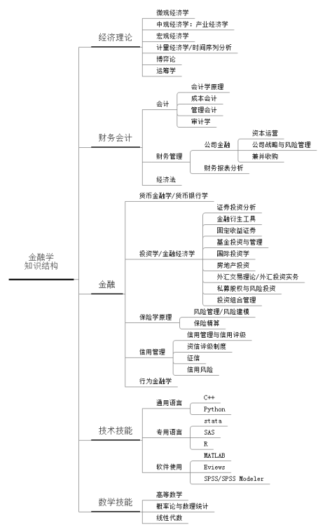

# 金融学

* 经济理论
* 财务会计
* 金融

## 知识结构

## 货币

* 金银本位
    - 交易的双重偶然性：我又你想要的，你有我想要的。决定了需要货币
    - 特点：易分割、稀缺性（普遍）、有价值
    - 金银具备了属性，成为硬通货
    - 货币本位：什么东西，都能用金银定价

## 资源

* 经济理论
    - 微观经济学
        + 曼昆《经济学原理》
        + 范里安《微观经济学：现代观点》
        + [可汗学院公开课：微观经济学](http://open.163.com/special/Khan/microeconomics.html)
        + [加利福尼亚大学伯克利分校公开课：中级微观经济学](http://open.163.com/special/opencourse/microeconomic.html)
    - 宏观经济学
        + 布莱恩斯诺登《现代宏观经济学，起源、发展和现状》
        + 罗默《高级宏观经济学》
        + [可汗学院公开课：宏观经济学](http://open.163.com/special/Khan/macroeconomics.html)
    - 计量经济学/时间序列分析
        + 古扎拉蒂《计量经济学基础》》
        + 伍德里奇《计量经济学导论：现代观点》
        + 恩德斯《应用计量经济学：时间序列分析》
        + [清华大学_计量经济学（45讲）_李子奈](http://list.youku.com/albumlist/show/id_19324246.html)
    - 博弈论
        + Gibbson《博弈论基础》
        + [耶鲁大学公开课：博弈论](http://open.163.com/special/gametheory/)
    - 运筹学
        + Frederick S. Hillier 、 Gerald J. Lieberman 《Introduction to Operations Research》
        + 清华大学出版社《运筹学》
        + [中国石油大学（北京）公开课：事理求精运筹学](http://open.163.com/special/cuvocw/yunchouxue.html)
* 财务会计
    - 罗斯《公司理财》
    - 迈尔斯、布雷利《公司财务原理》
    - 中央财经大学公开课：会计与价值创造
    - 中山大学精品课程：基础会计学
* 金融会计
    - 货币银行学/金融学
    - 米什金《货币银行学》
    - 博迪《金融学》
    - 可汗学院公开课：金融学
* 证券投资分析
    - 博迪《证券投资学》
    - 吴晓求《证券投资学》
    - 格雷厄姆《证券分析》
    - 上海财经大学公开课：证券投资管理
    - 美国西南大学公开课：投资学入门
* 金融衍生工具
    - 约翰赫尔《期权、期货及其他衍生产品》
* 固定收益证券
    - 塔克曼《固定收益证券》
* 基金投资与管理
    - 基金从业资格考试教材
* 国际投资学
    - 任淮秀《国际投资学》
* 房地产投资
    - 刘秋雁《房地产投资分析》
    - 哥伦比亚大学公开课：房地产金融学
* 外汇交易理论/外汇投资实务
    - 魏强斌《外汇交易圣经》
    - 私募股权与风险投资
    - 可汗学院公开课：风险投资与金融市场
* 投资组合管理
    - 理查德C.格林诺德《主动投资组合管理：创造高收益并控制风险的量化投资方法》
    - 路德维希B.钦塞瑞尼《证券组合定量管理：构建与管理证券组合的积极策略》
* 风险管理/风险建模
    - FRM考试教材
    - 保险精算
    - 保险精算师考试教材
* 信用管理
    - 信用管理师考试教材
* 行为金融学
    - Thaler,《 Advances in Behavioral Finance I &II 》
    - 行为金融学：心理的作用
* 量化投资
    * 量化投资：以MATLAB为工具

## 拓展

* 道德情操论
* 国富论

## 资源

* 
