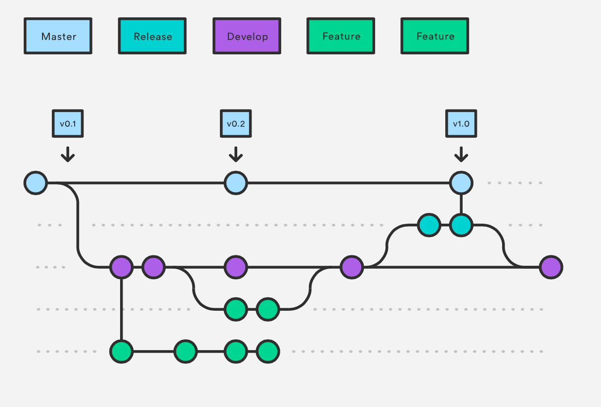
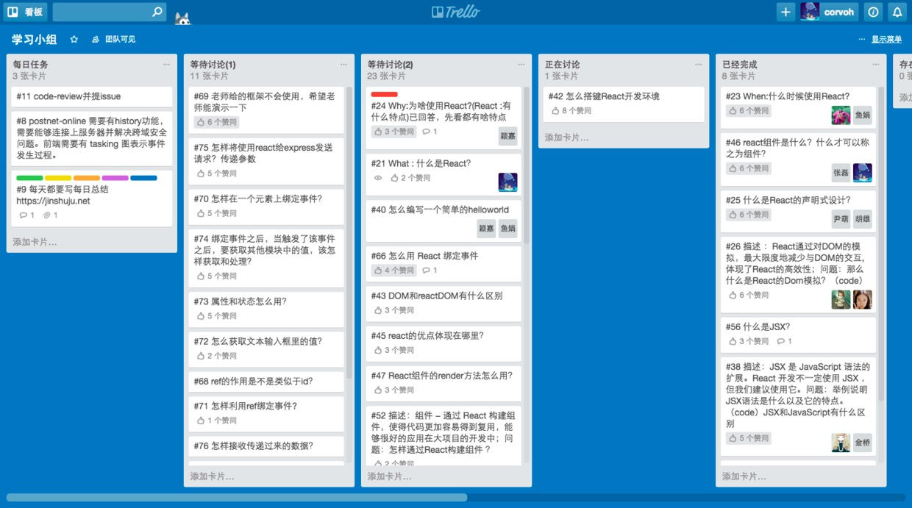
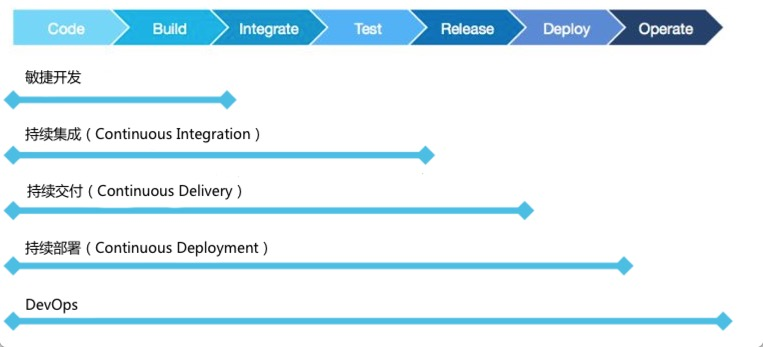
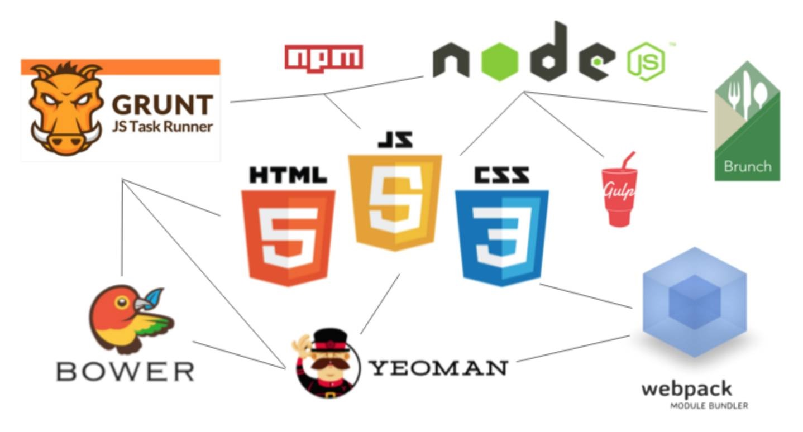
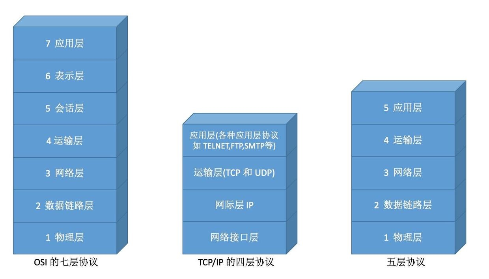
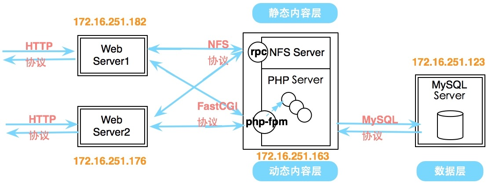
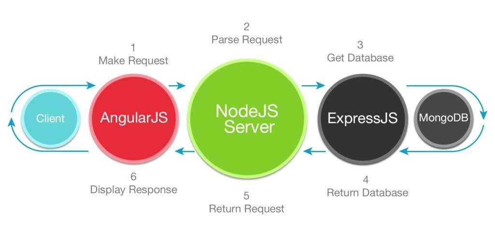

# 前端工程师

* 涉及交互，有产品的感念
* 后端不提供页面，只是纯粹的通过 Web API 来提供数据和业务交互能力之后，Web 前端就成了纯粹的客户端角色，与 WinForm、移动终端应用属于同样的角色，可以把它们合在一起，统称为前端
* CSS主要用来控制各个元素(标记)的外观的。
* HTML控制内容的结构。
* JS给各个元素添加行为(动作)的。

## HTML

用来描述元素应该如何在网站上布局，并向浏览器提供网站所需的其他所有文件列表

* 语义元素： 语义元素明确地对浏览器和开发者描述其含义；元素包括文章和部分， 而不是到处使用 div
* 块级元素： 块级元素占据了父元素的整个空间
* 内嵌元素： 内嵌元素仅占据由内嵌元素定义标记界定的空间
* 表格：表格表示文档部分， 其中包含向网络服务器提交信息的交互式控件
* 输入类型： 输入元素用于为网络表格创建交互式控件， 以便接受用户输入的数据

## CSS

层叠样式表（简称 CSS）负责控制网站的外观。颜色、字体，甚至一些动画

* 显示值类型：显示属性使你能够控制图表或容器元素的渲染效果
* 盒模型：盒模型负责定义矩形框（表示文档中的元素）的尺寸
* 基本定位：定位属性会为定位元素选择替代规则
  - 静态定位：静态定位使元素能够使用常规行为
  - 绝对定位：不会为元素留空间，而是位于相对于祖先或容器块的特定位置
  - 固定：不会为元素留空间，而是位于相对于屏幕视口的特定位置
  - 弹性盒： 一种布局模式， 可以组织网页上的元素， 使元素行为能够符合预期， 这样网页布局就能够满足不同的屏幕大小和设备显示器的要求
  - 悬浮型：指定元素应该遵守常规版型，并放置在容器的左侧或右侧
* 字体样式和网络字体：字体样式使我们能够更改文本的外观；网络字体使我们能够加载只有部分客户端能使用的网络字体文件
* 背景：背景使我们能够定义用作容器背景的颜色或图片
* 伪选择器器：伪选择器使我们能够选择出现在HTML中定义的元素周围的假定元素
* 动画和过渡：动画和过渡使我们能够对元素设定动画效果或在元素的两个状态之间定义过渡
* Flexbox & Grid
* CSS变量
* SASS预处理器
  - 结构化CSS
  - 变量
  - 嵌套样式表
  - Minxins & 函数
  - 继承

### CSS框架

框架使我们能够轻松地设计网站结构和构 建网站。 它们会提供自定义 CSS 类， 简化了内容布局操作， 确保无论是何种设备， 你的内容都能看起来很美观。 框架可以帮助你遵循行业最佳做法和现代设计原则

- Bootstrap
- Foundation
- Materialize
- Bulma

## JavaScript

负责控制网站的交互操作,原生的JS语法

* 数据类型, 函数, 条件判断, 循环, 凑总府
  - DOM操作和事件
  - JSON
  - Fetch
  - ES6+(箭头函数, Promise, async/await, 解构)
* 基础语法
  - 数据类型：该语言支持的不同变量类型（例如字符串和整型）。
  - 有string,number,boolean,null,undefined,object等。其中，string,number和boolean是基础类型,null和undefined是JS中的两个特殊类型,object是引用类型
  - 通过typeof来判断基础数据类型，但不能够准确判断引用类型, 因此需要用到另外一个方法，那就是Object的toString
  - JS常用的内置对象有Date、Array、JSON,RegExp等。 一般来讲，Date和Array用的最频繁，JSON可以对对象和数组进行序列化和反序列化，还有一个作用就是实现对象的深拷贝。
  - 语法：定义如何组织语言的一般规则
* 函数：用来执行特定任务的代码块
* 字面值可以简化代码
* 对象字面值： JavaScript 中的所有内容都是对象， 但是自己编写对象
* 面向对象的编程： 在 JavaScript 中， 你可以采用多种方式来实现面向对象 的编程， 包括
* 函数方式、原型方式和伪类方式
* 设计模式：设计模式是可以重复利用的常见问题解决方案
* AJAX： AJAX 使我们能够异步地从网络服务器上请求数据，不需要重新加载网页
* jQuery： jQuery 是一种非常热门的库，使我们能够更轻松地进行跨浏览器 DOM 遍历和操作、处理事件和执行AJAX 操作

### JavaScript框架

会强制要求各种最佳做法，并且通常会强制要求我们在处理各种文件时遵守组织性格式，使我们能够轻松地编写网络应用

* AngularJS： 支持双向数据绑定，使你能够扩展 HTML 词汇以创建前端网络应用
* EmberJS： 通过使用严格的文件和对象命名规范，不用再使用样板代码
* KnockoutJS： 通过声明性绑定系统，使我们能更轻松地创建由数据驱动的应用

## 响应式网站设计

打开网站并缩小浏览器窗口大小，如何使网站能够缩放，并进行自我调整，从而在所有设备上都能提供超棒的体验

* @媒体查询：媒体查询使内容能够根据具体的输出设备的范围调整呈现方式，不用更改内容本身
* 相对大小单位： CSS 还提供了除像素 (px) 之外的很多其他衡量单位，例如 em、 rem、 vw、 vh 和 vmin
* 设置viewport
* 非固定宽度
* 媒体查询
* 使用 rem 替代 px
* 移动优先,柱状显示

## 网站性能

理解几种简单的浏览器渲染原则， 你将能够确保向用户呈现快速、高效的网站

* 关键呈现路径： 关键呈现路径是浏览器用来将 HTML、 CSS 和 JavaScript转换成实际像素并发送到用户屏幕的流程
* 图片优化： 图片优化是针对图片内容使用正确的图片类型和从图片文件中移除多余的元数据的流程
* JavaScript 压缩： JavaScript 压缩是指从 JavaScript 文件中删除不必要的字符以减小文件大小的流程

## 浏览器开发者工具

提供了所有的详细信息，可以帮助你揭开代码的神秘面纱，是测试、衡量和迭代改进代码的重要平台

* 元素检测： 元素面板使你能够查看一个 DOM 树中的所有内容，并检查和在运行中修改 DOM 元素
* 网络： 网络面板可以录制关于应用中每项网络操作的信息
* 时间轴： 时间轴面板使你能够录制和分析应用在运行期间的所有活动
* 应用调试： 调试面板使你能够观察应用在运行期间消耗的内存
* 资源： 资源面板使你能够检测应用加载的资源

## 构建和自动化工具

需要运行测试套件、优化图片、遵守你所在单位的代码格式指南，甚至准备将代码部署到成品服务器上。还需要完成大 量的重复性甚至枯燥的工作。 Grunt 和 Gulp 等构建和自动化工具可以在后台帮你处理所有这些任务，使你能够专注于构建强大的网络应用。

* npm： npm 是 Node.js 的默认程序包管理器，后者是大多数构建和自动化工具编写代码时用到的框架
* Grunt： Grunt 是基于任务的命令行构建工具，可以与硬盘上的文件交互
* Gulp： Gulp 是基于程序的命令行构建工具，负责阅读硬盘上的文件，然后以流的形式与这些文件交互
* Bower： Bower 是 HTML、 CSS 和 JavaScript 库的程序包管理器，使你能够定义和检索依赖项并确定其版本

## 测试

* 当应用变得越来越复杂时，就很容易出现 bug，或者完全破坏现有的功能。单元、集成和行为测试是很棒的测试方法，可以确保你在添加新功能时不会破坏代码
* Mocha： Mocha 是一个 JavaScript 测试框架，在 Node.js 和浏览器中运行，使异步测试变得简单起来
* Jasmine： Jasmine 是一个开源、行为驱动的 JavaScript 测试框架

## 软技能

培养自己的沟通交流能力、指导和激励他人的能力，并能够从宏观层面看待工作，将使你成为潜在雇主青睐的候选人士。

* 善于沟通： 能够向庞大的团队（包括管理层、同事和客户）传达目标、进度和问题
* 灵活地处理问题： 了解问题背后的问题，并将问题分解成更小、更易解决的小问题
* 积极上进： 及时掌握这一领域的发展动态，并了解最新的技术发展状况
* 自我激励： 愿意实验和探索；勇于冒险，但是在面临挫折时能够坚持不懈
* 个人通用能力
* 技能知识点
* 工程业务经验
* 架构思想
* 先进方法与流程

## Javascript

### 自动化测试：单元测试 集成测试 浏览器测试

* mocha + should + node
* karma
* 链表，通过CI集成测试

### 知识点

* 奇怪的this
* 时间模型
* 生命提升
* 继承
* 跨域
* AJAX模型

### 异步流程控制

* Callback
* Genrator
* async function
* RxJS
* observable

### 模块化

* CommonJS
* AMD & CMD
* 加载器
* ES mould
* node模块转化CommonJS转化*MD

### 模板引擎

* Template & DOM Template
* 模板引擎优化
* 字符串模板输出React Comonent、VueComonent

## Webpack

* 用Webpack搭建一个项目
* 浏览器兼容性
* 搭建构建系统，通过测试用例

## 性能测试对比

* jsben.ch
* beachmark.js

## 基于缓存的前端性能优化

* HTTP 缓存
* LocalStorage
* App Cache
* Hybrid App 缓存
* Service Worker

## 加载优化

* lazyload
* 小图 -> 大图
* 预加载
* 异步加载
* MTU

## 优化案例

* 对象池优化
* 移动性能优化

## 前端上报技术

* 打点上报
* 错误上报
* 性能上报
* 跟踪用户操作
* 利用数据

## 安全

* CSRF
* CSRF防范技术
* XSS
* 富文本XSS防范
* CSP
* Same-origin policy
* ADsafe/Caja/Sandbox

## 浏览器

* IE6/7/8/9/10/11 (Trident)
* Firefox (Gecko)
* Chrome/Chromium (Blink)
* Safari (WebKit)
* Opera (Blink)

## 编程语言

* JavaScript/Node.js
* CoffeeScript
* TypeScript

## 切页面

* HTML/HTML5
* CSS/CSS3
* Sass/LESS/Stylus
* PhotoShop/Paint.net/Fireworks/GIMP/Sketch

## 开发工具

### 编辑器和IDE

* VIM/Sublime Text2
* Notepad++/EditPlus
* WebStorm
* Emacs EmacsWiki
* Brackets
* Atom
* Lime Text
* Light Table
* Codebox
* TextMate
* Neovim
* Komodo IDE / Edit
* Eclipse
* Visual Studio/Visual Studio Code
* NetBeans
* Cloud9 IDE
* HBuilder
* Nuclide

### 调试工具

* Firebug/Firecookie
* YSlow
* IEDeveloperToolbar/IETester
* Fiddler/Charles
* Chrome Dev Tools
* Dragonfly
* DebugBar
* Venkman

### 版本管理

* Git/SVN/Mercurial
* Github/GitLab/Bitbucket/Gitorious/GNU Savannah/Launchpad/SourceForge/TeamForge

## 代码质量

### Coding style

* Eslint/JSLint/JSHint/jscs
* CSSLint
* Markup Validation Service
* HTML Validators

### 单元测试

* QUnit/Jasmine
* Mocha/Should/Chai/Expect
* Unit JS

### 自动化测试

* WebDriver/Protractor/Karma Runner/Sahi
* phantomjs
* SourceLabs/BrowserStack

## 前端库/框架

* jQuery/Underscore/Mootools/Prototype.js
* YUI3/Dojo/ExtJS/KISSY
* Backbone/KnockoutJS/Emberjs
* AngularJS
* Batarang
* Bootstrap
* Semantic UI
* Juice UI
* Web Atoms
* Polymer
* Dhtmlx
* qooxdoo
* React
* Brick
* Vue.js

## 前端标准/规范

* HTTP/1.1: RFCs 7230-7235
* HTTP/2
* ECMAScript 5/6/7
* W3C: DOM/BOM/XHTML/XML/JSON/JSONP/...
* CommonJS Modules/AMD
* HTML5/CSS3
* Semantic Web
  - MicroData
  - RDFa
* Web Accessibility
  - WCAG
  - Role Attribute
  - WAI-ARIA

## 性能

* JSPerf
* YSlow 35 rules
* PageSpeed
* HTTPWatch
* DynaTrace's Ajax
* 高性能JavaScript

## SEO

## 编程知识储备

* 数据结构
* OOP/AOP
* 原型链/作用域链
* 闭包
* 编程范型
* 设计模式
* Javascript Tips

## 基础的部署工作

* 注册一个域名(NameCheap, Google Domains)
* 管理共享主机或虚拟机(Inmotion, Hostgator, Bluehost)
* FTP, SFTP 文件上传(Filezilla, Cyberduck)
* 静态页面托管(Netlify, Github Pages)

### 压缩合并

* YUI Compressor
* Google Clousure Complier
* UglifyJS
* CleanCSS

### 文档输出

* JSDoc
* Dox/Doxmate/Grunt-Doxmate

### 项目构建工具

包括JS转码（使用 Babel转 ES6或 TypeScript自转等）、CSS转码（ Less或 Sass转 Css）、代码或资源的合并与压缩，基础检查和各类测试等等

* 模块化打包类:

* 任务流构建类

* 集合型工具类（脚手架)

* make/Ant

* GYP

* Grunt

* Gulp 用于任务流构建

* Yeoman

* FIS

* Mod

* Webpack 用于模块化打包

## 代码组织

### 类库模块化

* CommonJS/AMD/ES6 Module
* YUI3模块

### 业务逻辑模块化

* bower/component

### 文件加载

* LABjs
* SeaJS/Require.js/Webpack

### 模块化预处理器

- Browserify

## 安全

## 移动Web

* HTML5/CSS3
* 响应式网页设计
* Zeptojs/iScroll
* V5/Sencha Touch
* PhoneGap (Cordova)
* Ionic
* jQuery Mobile
* W3C Mobile Web Initiative
* W3C mobileOK Checker
* Open Mobile Alliance
* React Native/Weex

## 前沿技术社区/会议

* D2/WebRebuild
* NodeParty/W3CTech/HTML5梦工厂
* JSConf/沪JS(JSConf.cn)
* QCon/Velocity/SDCC
* JSConf/NodeConf
* CSSConf
* YDN/YUIConf
* HybridApp
* WHATWG
* MDN
* codepen
* w3cplus
* CNode

## 计算机知识储备

* 编译原理
* 计算机网络
* 操作系统
* 算法原理
* 软件工程/软件测试原理
* Unicode

## 软技能

* 知识管理/总结分享
* 沟通技巧/团队协作
* 需求管理/PM
* 交互设计/可用性/可访问性知识

## 可视化

* SVG/Canvas/VML
* SVG: D3/Raphaël/Snap.svg/DataV
* Canvas: CreateJS/KineticJS
* WebGL/Three.JS

## 前端工程化

### 开发需求

* 代码规范：ESLint是一个用来识别 ECMAScript 并且按照规则给出报告的代码检测工具，使用它可以避免低级错误和统一代码的风格。我们可以方便的在配置文件中配置自己想要的风格规范，通常推荐使用Airbnb JavaScript或者google的规范。
* CSS预处理：可以使用less或sass来优化css的开发过程，而如果考虑到浏览器兼容性的hack问题，我们可以用postcss作为预处理工具帮我们自动解决这些 hack。
* 热更新：hmr能够在感知你的代码有变动的情况下自动调用编译工具编译源码，然后通过 livereload 自动刷新浏览器，这样做的话能节省你的调试时间。
* Mock：由于采用了前后端分离的开发模式，在真实开发中，为了让前端开发不受后端进度的影响，我们需要对数据进行mock。前后端先约定API 接口定义，然后前端根据定义mock 接口。一般大公司会有自己的mock平台，小公司如果没有的话也可以使用开源的mock工具。

### 共享需求

对于公司而言，快速高效地实现业务是终极目标，这对前后端来说都是挑战。在前端团队中，能够形成基础组件库和业务组件库是一种必然需求。
所以在设计前端项目架构的时候，一定要考虑业务的组件化和可共享性。有人说开发通用组件是造轮子，其实造出符合自己的轮子何尝不是一种领悟。共享需求主要有四种：基础代码共享、通用工具方法共享、基础交互组件共享以及业务组件共享。
在组件方面，React提供了天然的组件结构，我们只需要在开发过程中，隐藏组件的内部实现，每个组件更独立，很容易形成可重用组件。

### 性能需求

构建过程中使用Grunt/Gulp、webpack等构建工具实现。

* JS/CSS 代码压缩
* JS/CSS 代码合并
* 图片压缩
* CSS 图片精灵或雪碧图

### 部署需求

会用代码管理工具来管理源码，然后将开发流程和部署流程与git结合起来。多人分支协作流程：用git flow来管理代码分支。

## 技术基本功

* 打字速度:练出一个打字坐姿良好、打字速度标准的习惯,可以选用更高效的 DVORAK 布局 [强化打字速度](http://www.jianshu.com/p/8aac186868ce)
* 熟练掌握至少一种主流代码编辑器或 IDE（web工程师:VIM、Sublime、WebStorm、IDEA、VSCode 以及一些在线 IDE ）
  - 专注源代码的开发，常常会根据具体编程语言有语法高亮、代码折叠等功能，支持大多数编程语言的开发。通过一定的定制化，我们可以给简易的编辑器加入风格迥异的插件，组成一整套得心应手的开发流程。
  - 当做一种编辑器的全家桶，主要针对特定的编程语言而量身打造。IDE 在内部除了可以直接写源代码文本，还常常默认拥有打包并编译为可用程序的功能，有些 IDE 还可以设计图形界面。IDE 通常包括代码编辑器、自动构建工具、调试器和版本控制系统。一个典型的例子如 WebStorm，其支持图片预览，拥有内置命令行和版本控制系统，对于错误的前端 JavaScript 代码还有相应的智能提醒和改正能力。WebStorm 良好的集成了编辑、文件、管理、编译、调试、运行等功能，大大的提高了开发者生产力。
* 拥有良好的代码规范、代码质量、代码注释能力
  - 代码规范是一种持续的行为 ，良好的代码规范可以依靠代码规范文档或成熟的规范工具进行统一------前者不应复杂，但应具有一些强制性；后者例如在前端开发的环境下，可以使用 ESLint 来进行可定制化的代码风格检查，或使用持续集成(CI)理念并通过相匹配的 CI 服务器进行软件交付，以确保高水平的代码质量。git+slack+lambci
  - 统一编码规范、统一语言版本、统一编辑器配置（tab和空格之类）、统一文件编码，统一数据库等等行为，都是提高代码质量、尽力避免因为环境不同而导致 Bug 众多的种种步骤。前端可以使用 JSDoc 来规范注释代码(根据 JavaScript 文件中注释信息，生成 JavaScript 应用程序或库、模块 API 文档的工具。你可以使用他记录如：命名空间，类，方法，方法参数等。类似 JavaDoc 和 PHPDoc。)
* 理解主流编程范式及其思想,非命令式的编程都可归为声明式编程，命令式、函数式和逻辑式是最核心的三种范式。纵然声明式编程有诸多便捷之处，但其在着重交互和业务逻辑的前端开发下就不那么得心应手。声明式编程更擅长于数理逻辑的应用。因此我们能从编程范式角度理解前端开发将会大大提高我们的编程水平。
  - 命令式编程:行动导向（ Action-Oriented ）的，因而算法是显性而目标是隐性的 C++
  - 声明式编程:目标驱动（ Goal-Driven ）的，因而目标是显性而算法是隐性的  函数式 Lisp
  - 逻辑式：Prolog
* 拥有撰写良好软件工程文档的能力:拥有概要设计说明书、需求规格说明书和测试设计说明书
  - 概要设计说明书包括程序系统的基本处理流程、程序系统的组织结构、模块划分、功能分配、接口设计、运行设计、安全设计、数据结构设计和出错处理设计等，为程序的详细设计提供基础。
  - 软件需求说明是软件系统需求的规格化说明，是对将要开发系统的行为的说明。它包括功能性需求及非功能性需求，非功能性需求对设计和实现提出了限制，比如性能要求，质量标准，或者设计限制。
  - 测试说明书包括测试目标、测试范围、性能要求、测试资源、测试环境、测试策略。
* 熟知常见的数据结构、算法思想、设计模式:数据结构的良好选择可以提高算法效率。从数据结构角度来说，需要我们熟知数组、堆栈、队列、链表、树、图、堆和散列表的相关知识点，并能够根据具体问题通过高级编程语言具体实现；从算法角度来说，还需要我们熟知时间复杂度、空间复杂度、深度优先、广度优先、图论和动态规划等算法思想。前端开发因为 JavaScript 语言封装了很多操作数据的具体过程且更编程目标是开发应用逻辑，在算法层面要求并不是很高，但熟知算法思想可以提升每个前端开发者的计算机科学素养。在看重基础的开发者面试中也能提高自己的竞争力。算法用来解决计算上的问题，设计模式用来解决"设计层次"的问题。在软件工程中，设计模式是对软件设计中普遍存在（反复出现）的各种问题，所提出的解决方案。JavaScript 就有很多的设计模式值得学习并掌握，如下所例，这里就不一一介绍。通过使用设计模式，可以使我们的代码更加的可复用，可扩展以及可测试。单例模式、简单工厂模式、观察者模式、适配器模式、代理模式、桥接模式、外观模式、访问者模式、策略模式、模板方法模式、中介者模式、迭代器模式、组合模式、备忘录模式、职责链模式、享元模式、状态模式
* Windows、Linux 和 Mac 三大操作系统所各自形成的生态链。我们至少需要能够在其中一个操作系统下进行高效开发，并了解该环境下的应用软件使用技巧和常用配置管理。熟练使用三大操作系统之一及其开发者环境:无论哪种，都应该多理解 Linux 操作系统及其使用方式。前端使用的 Bower 管理器、Node 环境以及自动化测试、版本控制等都离不开 Linux 命令行的设计思想。深入操作系统的内核，我们可以了解计算机如何进行进程管理、内存管理、文件管理以及网络管理，从而在开发中遇到电脑卡顿、网络不通畅等情景时能及时找到问题所在，对症下药。
* 拥有良好的代码审查、代码重构能力:适当的和团队成员举办一场 Code Review(代码审查)，有助于保证软件质量、促进团队成长和避免团队成员因缺席而导致软件进度的"单点故障"。尤其在团队没有测试开发人员的情况下，我们很难达到令人满意的测试覆盖率。来一场"说走就走"的代码审查将对软件质量做出巨大贡献。五个层次完成代码审查与重构：
  - "业务架构"的代码审查与代码重构。
  - "代码架构"的代码审查与代码重构。
  - "设计模式"的代码审查与代码重构。
  - "最优算法"的代码审查与代码重构。
  - "语言与代码规范"的代码审查与代码重构。
* 拥有良好的版本控制、项目管理意识:需要拥有良好的版本控制意识，使项目代码、配置文件的改动历史随时可被人工追踪、被自动化追踪，以便进行 Bug 追溯、代码审查、自动化测试。
  - Github 正如其名，采用的是分布式版本控制系统------Git。
  - 软件工程诞生的重要因素就是为了解决日益复杂的软件开发活动而产生的"软件危机"，拥有良好的项目管理意识可以方便我们对日趋庞大的软件项目进行效率化管理，以应对未来需求的变更。Trello、Teambition 都是不错的选择，我们可以通过任务版的用户故事将附件、文档、工作进度有机的组合起来，让用户和开发者团队合作更加密切。
* 掌握软件测试相关能力:白盒测试、黑盒测试、单元测试、集成测试、测试驱动开发.单元测试框架 Jasmine
  - 黑箱测试测试应用程序的功能，而不是其内部结构或运作，适合集成测试以及系统测试等
  - 白箱测试测试应用程序的内部结构或运作，而不是应用程序的功能，可应用于单元测试、集成测试中
  - 单元测试的目的是检验基本组成单位（函数）的正确性。
  - 熟练绘制概念图、思维导图、流程图、网络拓扑图、UML 图:概念图与思维导图这两大概念绘制工具。概念图的广泛应用发扬了其发明者约瑟夫-D-诺瓦克(Novak)的那句总结------"有意义的学习涉及到新概念和命题纳入现有的认知结构的同化"。
* 掌握持续集成、持续交付、持续部署相关编程能力:持续交付可以看作持续集成的下一步，指的是频繁地将软件的新版本，交付给质量团队或者用户，以供评审；持续部署是持续交付的下一步，指的是代码通过评审以后，自动部署到生产环境。如下图所示，最终通过 DevOps 将软件工程、技术运营和质量保障（QA）三者做交集，使整个软件项目在开发过程中的变更范围更少，发布协调更强，自动化过程更稳健。同时相比服务端开发，前端开发因需求的变更其改动量更大，因此在前端开发的过程中使用"精益思想"完成对持续集成、持续交付、持续部署的实战工作意义非凡。

```
/**
 * Book类，代表一个书本.
 * @constructor
 * @param {string} title - 书本的标题.
 * @param {string} author - 书本的作者.
 */
function Book(title, author) {
    this.title=title;
    this.author=author;
}

int factorial(int n)  {
    int f = 1;
    for (; n > 0; --n) f *= n;
    return f;
}

(defun factorial(n)
    (if (= n 0)
        1    //  若n等于0，则n!等于1
        (* n (factorial(- n 1)))
    )
)    //  否则n!等于n* (n-1)

// 0! 等于1
factorial(0,1).
// 若M等于N-1且 M!等于Fm且F等于N*Fm，则N! 等于F
factorial(N,F) :-   M is N-1, factorial(M,Fm), F is N * Fm.
```

## 前端设计能力

前端分为前端设计和前端开发。要求拥有一定的制图、切图能力。纵然现在 JavaScript 在 Web 领域已从前端拓展到后端 Node.js，一个合格的大前端工程师还是应该多多注重拓展前端设计方面的知识点，

* 掌握一定的用户界面设计、人机交互知识：无论是懂前端的设计还是懂设计的前端在任何互联网公司都是很受欢迎的。良好的用户界面及其交互氛围能让用户产生舒适的体验，在一些功能性较弱的软件项目中，当因用户界面及其氛围不足导致用户体验的下降常会对软件产生致命一击的效果。交互设计要求我们能够进行用户调研、概念设计以及创建用户模型、界面流程并能开发项目原型。
* 熟练至少一个主流平面设计工具：选择一个主流平面设计工具来强化我们的设计能力。常见的平面设计软件有 PS、CDR、AI、InDesign 等。前端开发中的一些绘图技术也常与平面设计工具设计出的图片有共性。举例来说：HTML 5 中的 Canvas 是像素级别的，可以对应 PS 处理出的图片； SVG 又是矢量级的，无论如何放大也不会看到像素块，可以对应 AI 处理出的图片。熟练一个主流平面设计工具将是前端开发者和设计工程师之间重要的沟通桥梁。
* 熟练至少一个主流原型设计工具：主流原型设计工具常常可以分别制作 Web 端、PC 端和 APP 端的原型，也有很多原型设计工具专为一个平台打造。原型设计工具往往不像平面设计工具一样面面俱到，但能清晰的展现出各页面内的主体组件和各页面间的逻辑关系。在开发中小型前端项目时往往不需要专业的原型设计师(常被产品经理一职所包揽)，熟练使用至少一个主流原型设计工具能使我们在正式编写前端代码前快速开发出一个直观的原型参考系。

## 前端开发能力

* 熟练使用 HTML、CSS 和 JavaScript 三大前端语言
  - HTML 是标签语言，可以构建前端页面的骨架；
  - CSS 是层叠样式控制表，可以构建前端页面的外貌；偏向 HTML 和 CSS 的开发，我们可以走出一条会设计的前端工程师的道路；
  - JavaScript 是前端编程语言，可以规范前端页面的事件行为。偏向 CSS 和 JavaScript 的开发，我们可以走出一条会服务端编程的前端工程师的道路。
* 理解前端语言新标准 HTML5、CSS3、ES6 及其特性
  - HTML 5 里新增了许多特性：语义化和新的音频、视频支持等；
  - CSS 3 被划分为模块，解决了 CSS2 为等待各个标准统一而耗费大量时间才能推进的不足之处，同时也提供了 2D、3D、动画效果等新特性；
  - ECMAScript6 等于 JavaScript - DOM - BOM，是 JavaScript 在 2015 年的最新标准，因为 ES6 对标准改动较大，前端开发者常常将一个前端项目是否支持 ES6 作为推进前端新技术的重要桥梁之一。ES6 将箭头函数、let 变量声明命令、Promise 编程、模块化编程等新特性纳入其标准中，得到了各大浏览器最新版本的支持。
* 熟练组件化开发、异步编程、虚拟 DOM相关编程能力：
  - 借鉴其他编程领域如 Java GUI 的编程思想，前端组件化开发大大提高了开发效率并降低了维护成本。通过组件化开发，我们可以对前端页面中重复的模块进行"模块化编程"，给每个模块赋予一个"类"的概念。最终根据具体页面组装其对应的前端 UI 组件。每个组件间可以通过数据流来交换数据，这也大大方便了单页面应用的开发，相得益彰。
  - Ajax (异步的 JavaScript 与XML技术) 的出现让用户不用再经历"提交表单等待服务器的漫长响应并通过刷新页面来告诉自己哪里输入错误"的烦躁经历，这样做也节约了许多宽带。为了更好的掌握异步编程，我们需要掌握 JavaScript 的"同步模式"和"异步模式"，并学会使用相应的回调函数来发布、订阅、处理事件。
  - Web 页面的性能鲜由 JavaScript 引起，常常是因过多的 DOM 操作引起。虚拟 DOM 随着前端主流框架的更迭孕育而生。通过直接操作虚拟 DOM，间接操作真实 DOM，可以优化很多性能。对虚拟 DOM 的深入了解是见证一步步加入抽象层的前端开发的关键。
* 掌握至少一门主流前端框架及其生态链、框架设计能力。React、Vue 适合单页面应用，拥有很多先进的前端开发思想；BootStrap、Ant Design 偏向 UI 开发，更多的提供 CSS 相关类库。JQuery 经久不衰，极大的方便我们操作真实 DOM 及其 CSS 属性；D3.js、EChart 等框架使我们可以快速进行前端数据可视化的编程；RequireJS 在不支持 ES6 标准的 JS 开发环境下给我们提供了一个良好的模块化编程条件。数不胜数的前端框架都有各自的应用场景，我们的前端项目可以选择其中一至多个框架进行快速开发。同时，合格的前端工程师不能只会用成型的框架，还应该拥有一定自制框架的能力。我们可以先通过阅读成型前端框架的源码来学习框架设计的思想，有朝一日我们便会根据自己的独特需求造出独一无二的框架轮子。
  - 了解各大前端框架的应用场景。
  - 进行前端开发框架的选型。
  - 掌握所选前端框架的思想。
  - 刻意练习所选前端框架的使用方法。
  - 时刻关注所选前端框架的生态链。
* 掌握浏览器兼容、响应式布局相关解决方案
  - 纵然现在的前端开发者已经不需要考虑太多的浏览器兼容问题，对其概念的了解有利于了解前端历史包袱或在未来足以应对一些面向特殊群体(早期 IE 浏览器使用者)的前端项目。
  - 响应式布局和单页面应用是当代前端开发者的必备技能。从 Web Pages 到 Web App 时代，我们开发的前端项目有越来越多的可能需要同时在电脑端和手机端进行访问，一个有良好响应式布局的前端项目可以一个代码运行在多种不同分辨率的平台之上。
* 熟练 Node.js 环境、谷歌开发者工具使用方法：
  - Node.js 从诞生之初就是 JavaScript 的运行环境，基于 Chrome 的 V8 引擎打造，使用高效、轻量级的事件驱动、非阻塞 I/O 模型。将如下的代码运行在 NodeJS 上，便可通过纯 JavaScript 代码开启服务器进程、连接非关系数据库，很多服务端开发能做的事情，通过 Node.js 便能做到。并且在"技术基本功"里提到的持续集成、持续交付、持续部署、敏捷开发等理念，通过 Node.js 社区都能找到相应的解决方案。
  - 通过谷歌开发者工具，我们可以快速定位页面问题、断点调试 JavaScript 代码和进行前端页面的 UI 效果预览，最新的 Chrome 同时支持 ECMAScript6 的模块化开发，一个微型 IDE 就藏在我们的浏览器工具栏里。
* 掌握单页面、移动 Web 、混合应用开发相关技术点：从门户网站成群的 Web 1.0 到以用户为中心的平台/社交网站 Web 2.0，再到能进行个性化智能化推荐的 Web 3.0，每次 Web 时代的更迭背后都是 Web 技术发展上的一大飞跃。有了对 Web 1.0 到 3.0 发展史的宏观了解，对掌握单页面应用、移动 Web 开发和混合应用开发、离线 Web 等相关技术点将会有一个质的飞跃。
  - 在单页面 (SPA) 应用中，整个前端项目架构在一个网页上，通过动态拉取服务端数据来提供一个和桌面应用程序相似的用户体验。同时，在单页面应用的开发中，我们需要着重注意组件、路由和跨域请求这几个核心知识点。单页面应用具体的优缺点如下：
    + 优点 1. ：无刷新体验
    + 优点 2. ：完全的前端组件化
    + 优点 3. ：API 共享
    + 优点 4. ：组件共享
    + 缺点 1. ：首次加载大量资源
    + 缺点 2. ：较高的前端开发门槛
    + 缺点 3. ：不利于 SEO(搜索引擎优化（英语：search engine optimization，缩写为SEO），是一种通过了解搜索引擎的运作规则来调整网站，以及提高目的网站在有关搜索引擎内排名的方式。)
  - 熟悉了响应式布局的开发，我们就可以尝试步入移动 Web 领域。顾名思义，移动 Web 就是运行在移动端上，而移动端的设备配置不尽相同，这常常需要我们去了解移动端的知识，如 pixel 像素基础、Viewport 视图、和 Tap 触摸事件等，移动 Web 常用的 meta 标签如下
  - 到了混合应用开发，其常以 App 的形式出现在移动端上，相比原生移动端应用，混合 Web 应用可移植性强、开发成本低，还可以通过一定的接口来直接使用手机硬件能力。当然，由于混合应用对硬件的使用效率相比原生应用还有不足之处，再加上有些手机平台不鼓励使用过多的混合应用开发技术(可以搜索"苹果 热更新")。前端开发者可以视具体业务来进行技术选型。
* 熟练前端包管理、构建工具、SEO、Web 性能优化：使用到的前端库越来越多，需要一个前端包管理器来统一管理：Bower 便能做到这一点，通过给项目中引入 Bower 包管理器，我们仅仅需要修改配置文件就能进行高效化的前端库管理。熟练使用成型的包管理器，我们也可以很方便的解决前端依赖等问题。前端构建工具可以减少我们很多的编程"机械运动"。通过使用成型的前端构建工具，简单的几行命令就能编译并转换 JavaScript 的不同版本、自动化压缩代码、自动化执行测试文件。构建工具可以自动化压缩代码文件，就涉及到了 Web 性能优化的一个环节。辅之以浏览器开发者工具的熟练使用，我们可以实地测试用户加载首页、加载各个图片时的等待时间，来通过优化 Web 性能增进用户体验。
  + Bower 做 JavaScript 的包依赖管理
  + JQuery 封装 DOM 操作并进行跨域请求
  + NPM 做 Node.js 的包依赖管理
  + ESLint 做代码风格规范检测
  + Grunt 启动 Karma 统一项目管理
  + [gotwarlost/istanbul](https://github.com/gotwarlost/istanbul): 检查单元测试代码覆盖率 Yet another JS code coverage tool that computes statement, line, function and branch coverage with module loader hooks to transparently add coverage when running tests. Supports all JS coverage use cases including unit tests, server side functional tests and browser tests. Built for scale.
  + Jasmine 做单元测试
  + JSDoc 规范代码注释风格
  + Karma 自动化完成单元测试
  + Webpack 最终打包整个项目文件
  + Yeoman 最后封装成一个项目原型模板
* 掌握至少一个静态模板引擎、CSS 预处理、JS 超集：
  - 当页面结构趋于一致性后，数据的动态填充就是我们经常需要处理的事情。掌握一个前端模板引擎能动态的生成我们所需的页面，一个应用实例就是详情页和 Ajax 的组合。所谓静态模板引擎，指的是在 Web 应用中，不通过与服务端进行交互，用来动态生成 HTML 的工具，常见的有 Jeklly、Hexo 等，这些知识点会在搭建自己的静态站点时接触到。
  - 常见的 CSS 预处理有 SASS、LESS、Stylus 等，通过一门新的编程语言来动态化开发静态的 CSS 代码，并将 CSS 作为目标生成文件；可以让我们的 CSS 更加简洁、适应性更强、可读性更佳，更易于代码的维护等诸多好处。
  - 由于 JavaScript 是一种弱类型（或称动态类型）语言，即 JS 程序在生成变量时不需要指定其数据类型，相应的解决办法就有使用例如 TypeScript 等强类型的、拓展于 JavaScript 的 JS 超集，最终将其编译、转化成合法的 JavaScript 代码。这样我们可以避免很多潜在的程序 BUG。
* 拥有浏览器插件、微信小程序、前端数据可视化编程能力：浏览器插件的开发/使用能力、微信小程序的开发能力以及和前端数据可视化的实战能力身为第三方平台的代表，在不同的学习方向下有不同的侧重点，我们不可能全部都掌握。但作为选修，我们可以了解到大部分浏览器插件其实就是用前端语言实现的；微信小程序也可看做从在微信提供的前端框架下开发而来；前端数据可视化更多的使用一些主流可视化库实现，能够快速入手未来的新项目。
* 业务开发
  - 对业务逻辑足够清晰
  - 熟悉页面上的数据流动
  - 数据结构怎么设计更加合理？
  - 页面上有哪些交互？这些交互会带来哪些影响
  - 代码进行好的分层
    + controller
      * formatter：储存一些格式化数据的方法，这些方法接收数据，返回新的数据，不应该再涉及到其他的逻辑，这样有利于单元测试
      * service：统一管理所有请求路径，并且将页面中涉及到的网络请求封装为class

## 计算机网络知识

* 熟知常用计算机网络协议
  - TCP/IP 协议即传输控制协议/因特网互联协议，是计算机网络中使用最广泛的体系结构之一。TCP/IP 的四层结构从上到下分别为：应用层、传输层、网络层、链接层。
  - 应用层直接与用户打交道，负责传送各种最终形态的数据，常见的有 SMTP (简单邮件传输协议)、NNTP (网络新闻传输协议)和 HTTP (超文本传输协议)。
  - 传输层负责传送文本数据，主要协议是 TCP 协议 ------ 一个面向连接的、保证可靠传输的数据流服务的协议。
  - 网络层负责分配地址和传送二进制数据，主要协议是 IP 协议，通过 IP 来找到网络中的位移主机。
  - 连接层负责建立电路连接，是整个网络的物理基础，典型的协议包括以太网、ASDL等。
  - WebSocket，一种在单个 TCP 连接上进行全双工通讯的协议。WebSocket 允许服务端主动向客户端推送数据，在 WebSocket API 中，浏览器和服务器只需要完成一次握手，两者之间就直接可以创建持久性的连接，并进行双向数据传输。WebSocket 避免了 Ajax 无意义的轮询，在很多应用级 Web 项目中经常有所涉及。
* 了解网络体系结构、网络拓扑模型
* TCP/IP 协议的四层与 OSI 概念模型(开放式系统互联通信参考模型)的七层有一定的对应关系，后者并没有提供一个可以实现的方法，而是描述了一些概念，用来协调进程间通信标准的制定，是概念性框架。我们需要从宏观角度来了解整个网络体系结构。计算机网络的拓扑结构可分为星型网、网型网、环型网、树型网、总线网和混合拓扑，描述的是网络中的各节点设备的连接情况。深入其中会更多的引出硬件、网络工程等知识点，这里作为选修了解即可。

HTML5初级开发工程师

HTML基础

- HTML简介与历史版本
- 常用开发软件
- 常见标签与属性
- 表格与表单
- 标签规范与标签语义化
- 实战：网页结构布局
  CSS基础
- css简介与基本语法
- 常见的各种样式属性
- CSS选择器与标签类型
- 理解盒子模型与CSS重置
- 浮动与定位
- 利用photoshop工具测量样式
- HTML+CSS开发网页
- 实战：高仿电商首页效果
  CSS3基础
- css3常见样式
- css3选择器
- 变形与动画
- 3D效果与关键帧
- 弹性盒模型
  移动端布局
- 移动端基本概念
- viewport窗口设置
- 移动端布局方案
- rem、vh、vw等单位
- 响应式布局
- bootstrap框架
  JavaScript基础
- JS简介
- JS变量
- 数据类型与类型转换
- 运算符与优先级
- 流程控制-if..else
- 流程控制-switch…case
- 流程控制-while、do..while、for循环
- break、continue语法
- 函数定义与调用
- 全局变量与局部变量
- 函数传参与返回值
- 函数作用域与变量作用域
- DOM的基本操作
- 定时器使用
- this指向与修改指向
- 数组、字符串等方法操作
- 时间对象与正则对象
- 掌握常见BOM操作
- 常见事件与事件细节
- JSON与AJAX
- JSONP跨域操作
- 前端cookie的使用
- 实战：JS配合HTML与CSS完成电商项目
  jquery框架
- jquery框架介绍及优势介绍
- jquery核心思想
- jquery常见方法
- jquery动画操作
- jqueryAJAX操作
- jquery工具方法
- 利用jquery快速开发网页
  PHP基础
- PHP简介与基本语法
- mysql数据库及sql语法
- apache服务器与集成开发工具
- PHP链接数据库
- PHP与AJAX交互
- 实战：留言板、登录、注册等

HTML5中高级开发工程师

面向对象基础

- 面向对象概述
- 对象和构造函数（类）之间的关系
- 对象的属性和方法
- 原型与原型链
- 包装对象与内部实现
- 对象中实现继承方式
- 设计模式及实际运用
  JavaScript高级
- JS算法与排序算法
- promise异步处理
- 运动与tween算法
- 闭包与模块化
- JS组件开发
- 打造小型jquery框架
- JS性能优化
- ES6新增功能
  前端工程化
- gulp基本使用
- less、sass、babel等预编译框架
- 理解模块概念，AMD与CMD规范
- 前端模块框架seaJS、requireJS
- webpack基本使用
  多人协作
- svn基本用法与可视化工具
- 多人开发流程
- git基本用法
- 命令行操作
- 分区及分支等概念
- 远程github操作
- 实战：多人协作开发项目
  HTML5新功能
- canvas绘图
- svg绘图
- 音频与视频
- 本地存储与离线存储
- 地理信息
- web Worker
- web Socket
  NodeJS基础
- node与npm概念及使用
- node模块方式
- node常用内置模块
- node爬虫与文件自动化处理
- node搭建服务器与简单路由
- mongodb非关系数据库
- mongodb安装与db操作
- mongodb增删改查
- mongodb与node结合开发
- mongoose数据建模
- mongoose与node结合开发
- express框架
- 中间件与ejs模板引擎
- Robomongo与postman工具
- express+mongoose搭建后端框架
- 设计Restful API
- 实战：前后端分离式开发
  微信端开发
- 移动端交互与移动端事件
- 微信场景与swiper框架
- 微信公众号介绍
- 网页授权与JSSDK
- 微信web开发者工具使用
- 微信小程序开发
- 实战：公众号与小程序项目同步开发

## 高级

VueJS框架

- Vue框架简介
- 渐进式与响应式
- 模板语法与计算属性
- 指令与数据处理器
- 生命周期
- 组件与组件通信
- Vuex状态管理
- Vue动画与路由
- 单文件组件与脚手架
- 基于Vue的组件框架
- 实战：Vue与Node全栈开发
  ReactJS框架
- React框架简介
- JSX语法
- 组件与组件通信
- 属性与状态设置
- 虚拟DOM
- 生命周期
- redux架构
- react-redux使用
- react-router使用
- Mem脚手架使用
- 实战：React与Node全栈开发
  AngularJS框架
- Angular框架简介
- TypeScript基础与进阶
- 开发环境配置
- 架构、模块与组件
- 模板、元数据与数据显示
- 服务于指令
- 依赖注入
- 路由
- 实战：Angular与Node全栈开发
  Hybrid App开发
- App介绍与分类
- Android/ios与H5通信
- Cordova/Phonegap框架
- HTML5+基于HB工具
- React Native
  前端架构
- 单元测试与编写测试用例
- 自动化测试方案
- 前端安全与HTTP协议
- 项目上线与一键部署
- 数据统计与SEO优化
- 搭建组件库与按需载入
- 浏览器渲染与浏览器引擎
- 深入理解后端开发模式

## 服务端应用开发能力

* 至少掌握一门服务端开发语言及其常用框架
  - PHP 语言：Laravel、Yii、CodeIgniter、ThinkPHP 框架等
  - Python 语言：Flask、Django 框架等
  - JavaScript 语言：Node.js 平台
  - Ruby 语言：Ruby on rails 框架等
  - Java 语言：Spring、Struts、Hibernate 框架等
* 熟练掌握 Web 服务器的搭建与部署:服务端应用开发的入门步骤的前两步常常是选择服务端语言及其框架、搭建相应的开发环境。传统的 LAMP (Linux + Apache + MySQL + PHP) 架构和 全栈 MEAN (MongoDB + Express.js + Angular.js + Node.js ) 架构的 Web 流程图分别如下所示。尽管每种语言的侧重点不同，但其均对基础的 Web 服务端环境提供支持，根据自己的发展方向或项目所需来进行技术选型。
  - LAMP (Linux + Apache + MySQL + PHP)
  - MEAN (MongoDB + Express.js + Angular.js + Node.js ) 
  - 搭建与服务；Linux操作
* 拥有撰写规范的数据字典、接口文档能力：服务端开发人员的一条成长之路便是成为架构师，在有足够的能力进行架构设计前，先要了解 Rustful API，并会写规范的数据字典和接口文档。
  - 数据字典
* 掌握 Linux 网络编程、多线程应用开发、爬虫能力:服务端开发对于 C 语言或 C++ 语言的掌握也十分重要。在 Linux 网络编程上，首先需要了解网络协议，再仿照示例来尝试使用 C/C++ 进行网络 Socket 编程，能将抽象的网络知识生动化、形象化。
* 目对搜索引擎的优化便是为了方便搜索引擎的爬虫来有效识别该网站信息，同时由于很多互联网数据没有开放的接口供我们使用，我们也需要通过爬虫技术来定制化我们对网络信息筛选后的服务，爬虫也需要我们掌握。
* 了解网络安全、反向代理、HTTP 缓存优化
* 了解网站监测、运维、集群、负载均衡:为了及时跟踪服务器运行状态，可以选择性的掌握网站监测的一些手段------或使用命令行或使用相关服务平台。同时通过一定的运维能力，能及时将不正常的服务器运行状态拉入正规之中------DevOps 是运维开发的一种大趋势。当系统面临大量用户访问，负载过高的时候，通常会使用增加服务器数量来进行横向扩展，使用集群和负载均衡提高整个系统的处理能力。初学者的项目一般并不是很大，我们将集群和负载均衡列入选修

| 字段        | 类型          | 空   | 键值  | 注释       |
| --------- | ----------- | --- | --- | -------- |
| sId       | int(10)     | 否   | 主键  | 唯一标识     |
| sBarcode  | varchar(20) | 否   |     | 学生账号(学号) |
| sPassword | varchar(20) | 否   |     | 学生密码     |
| sName     | varchar(15) | 是   |     | 学生姓名     |
| cId       | varchar(15) | 否   | 外键  | 班级号      |
| sRegTime  | date        | 否   |     | 学生注册时间   |

```
### 单个学生登录
---
**简要描述：**
- 学生登录接口，账号由教师一键生成，默认密码 123456。
**请求URL：**
- `https://`
**请求方式：**
- POST
**参数：**
|参数名|必选|类型|说明|
|:----    |:---|:----- |-----   |
|barcode |是  |string | 身份证号码    |
|password   |是  |string | 密码    |
**返回示例**
``
{
    'res': 1
}
``
**返回参数说明**
|参数名|类型|说明|
|:-----|:-----|-----|
|res |int   |1 为成功 0为失败  |
**备注**
此接口同时会返回 Cookie
```

## 数据库与搜索引擎开发能力

* 熟知数据库分类、数据库范式等数据库基本概念:将服务端应用开发与数据库/搜索引擎应用开发分离开，也是考虑到单机负载问题。通常意义上初学者所学的服务端开发环境都是搭建在一台机子上，也不太会出现负载过高的情况。现在将数据库与应用分开，我们只是在应用的配置中把数据库的地址从本机改到了另外一台机器上而已，对开发、测试、部署都没有什么影响，却能够缓解当前的系统压力，不过随着时间的推移，访问量继续增大，该类系统还是需要继续演进的。在数据库的学习过程中，我们需要了解实体－联系模型、关系型数据库(如 MySQL)、非关系型数据库(如 MongDB)、关系模型、视图、触发器、数据库范式等知识点，从而便于我们真正理解 Web 应用到底是如何访问数据库中的数据并展现到前台界面中的。关系型数据库的三层模式，两级映像，对数据的起到很好的独立性作用。
* 拥有良好的数据库设计、操作和管理能力:使用数据库设计工具.数据库的管理就需要我们掌握数据库管理系统的使用。数据库只是数据的集合，数据库管理系统给我们提供了数据定义功能、数据操纵功能、数据库的运行管理和数据库的建立与维护等功能，提高了整个数据库系统的安全性与数据独立性、数据完整性。
* 掌握至少一个开源搜索引擎:数据库与搜索引擎都服务于数据，前者核心是数据存储和事务能力，后者关注信息采集和关联的能力，各有千秋。依然以我这段时间所做的小项目为例，我们三人团队是这样分工的：Web 前端一人、PHP 微信开发一人、Java 搜索引擎一人；同时搜索引擎的接口供 PHP 微信端使用，PHP 微信端接口供 Web 前端使用。
* 了解分布式数据库、大数据、机器学习:
  - 分布式数据库是用计算机网络将物理上分散的多个数据库单元连接起来组成的一个逻辑上统一的数据库。每个被连接起来的数据库单元称为站点或节点。分布式数据库有一个统一的数据库管理系统来进行管理，称为分布式数据库管理系统"。
  - 大数据在总数据量相同的情况下，与个别分析独立的小型数据集（Data set）相比，将各个小型数据集合并后进行分析可得出许多额外的信息和数据关系性，可用来察觉商业趋势、判定研究质量、避免疾病扩散、打击犯罪或测定即时交通路况等；这样的用途正是大型数据集盛行的原因。
  - 机器学习算法是一类从数据中自动分析获得规律，并利用规律对未知数据进行预测的算法。因为学习算法中涉及了大量的统计学理论，机器学习与推断统计学联系尤为密切，也被称为统计学习理论。算法设计方面，机器学习理论关注可以实现的，行之有效的学习算法。

## 编程软技能

* 学会刻意练习、持续改进能力
  - 刻意练习≠传统的学习方法，需要带上学"一万小时"的心态来刻意的强化我们的能力。没有人天生会编程，很多互联网上厉害的技术人员要么从小开始接触到编程要么接触之后大部分时间都在编程。只要利用好时间，刻意练习编程能力、刻意练习打字速度都能在一定的阶段后有较大的长进。
  - 希望这不是简单的方法论，结合自己的性格特点来强化学习即可。持续改进要求在刻意练习的基础上能随时看到自己的成长。可以通过写总结、完成计划任务来讲自己在编程领域的成长可视化；也可以通过和他人相约督促、结对面层、代码重审等环节实现。
* 拥有一定的抗压能力
  - 纵然不应该提倡加班文化，客观存在的加班现象时常得回归到开发状态。
  - 可以通过培养良好的健身习惯、良好的饮食习惯、良好的作息习惯使自己的精神能随时集中起来。高薪也是有代价的。
* 拥有良好的中英文阅读能力、写作能力:
  - 基于互联网的技术常常需要通过互联网来追踪最新改动。在线技术文档的阅读能力、各种技术框架书籍的阅读能力的提高都是我们快速学习到新知识的重要一步
  - 英文阅读能力，也必不可少。就像，中文程序开发者中厉害的那些人，往往都翻译过英文技术书籍。写作是一种凝聚、再创作、分享的动态过程。在本文的写作过程中整理了自己大学两年对 Web 开发的广度认知，也通过 GitChat 知识付费分享给每一个感兴趣的人，使文章能取之社区还之社区，双向成长
* 拥有一定的人际交往能力、演讲能力、影响力

## 前后端分离

* 前端html页面通过ajax调用后端的restuful api接口并使用json数据进行交互
* 前后端代码分离，提高代码复用
* 前端结构(HTML)、样式(CSS)、行为(JS)分离
* 请求响应,客户端发送请求，服务端响应请求
* 一套 Service 可以支持多个客户端的业务体系
* 局部性能提升:通过前端路由的配置，我们可以实现页面的按需加载，无需一开始加载首页便加载网站的所有的资源，服务器也不再需要解析前端页面，在页面交互及用户体验上有所提升。
* 降低维护成本:通过目前主流的前端MVC框架，我们可以非常快速的定位及发现问题的所在，客户端的问题不再需要后台人员参与及调试，代码重构及可维护性增强。
* 后台只需提供API接口，前端调用AJAX实现数据呈现。
* 大多数后台应用我们都可以做成SPA应用（单页应用），而单页应用最主要的特点就是局部刷新，这通过前端控制路由调用AJAX，后台提供接口便可以实现，而且这样的方式用户体验更加友好，网页加载更加快速，开发和维护成本也降低了不少，效率明显提升。
* 前端倾向于呈现，着重处理用户体验相关的问题；包括用户在进行业务操作时的流动方向和相关处理；
* 后端则倾处于业务逻辑、数据处理和持久化等，关注的是数据完整、有效、安全。
* 在设计清晰的情况下，后端只需要以数据为中心对业务处理算法负责，并按约定为前端提供 API 接口；而前端使用这些接口对用户体验负责。
* 实现 SOA 架构的 API 可以服务于各种前端，而不仅仅是 Web 前端，可以做到一套服务，各端使用
* 对于前端来说，不依赖后端技术的前端部分可以独立部署，也可以应于 Hybrid 架构，嵌入各种“壳”（比如 Electron、Codorva 等），迅速实现多终端。

数据和页面剥离：技术栈的隔离

* 分工颗粒度更细

* 前端采用静态网页相关的技术，HTML + CSS + JavaScript，通过 AJAX 技术调用后端提供的业务接口。负责 View 和 Controller 层

* 前后端协商好接口方式通过 HTTP 提供，统一使用 POST 谓词。负责 Model 层

* 接口数据结构使用 JSON 实现，形式使用REST

* 最上端是服务端，就是我们常说的后端。后端对于我们来说，就是一个接口的集合，服务端提供各种各样的接口供我们使用。因为有 Node.js 层，也不用局限是什么形式的服务。对于后端开发来说，他们只用关心业务代码的接口实现。

* 服务端下面是 Node.js 应用

* Node.js 应用中有一层 Model Proxy 与服务端进行通讯。这一层主要目前是抹平我们对不同接口的调用方式，封装一些 View 层需要的 Model。

* Node.js 层还能轻松实现原来 vmcommon, tms（引用淘宝内容管理系统）等需求。

* Node.js 层要使用什么框架由开发者自己决定。不过推荐使用 Express + XTemplate 的组合，XTemplate 能做到前后端公用。

* 怎么用 Node.js 大家自己决定，但是令人兴奋的是，我们终于可以使用 Node.js 轻松实现我们想要的输出方式： JSON/JSONP/RESTful/HTML/BigPipe/Comet/Socket/同步、异步，想怎么整就怎么整，完全根据你的场景决定。

* 浏览器层在我们这个架构中没有变化，也不希望因为引入 Node.js 改变你以前在浏览器中开发的认知。

* 引入 Node.js，只是把本该就前端控制的部分交由前端掌控。

* 前端开发人员则可以利用nodejs来搭建自己的本地服务器，直接在本地开发，然后通过一些插件来将api请求转发到后台，这样就可以完全模拟线上的场景，并且与后台解耦


## 实现

* 统一认识
* 划分边界，确定流程：梳理清楚开发流程，及相应的角色职责
* 有指定的文档输出及相应的评审
* 前后端首先约定数据格式，各自排自己的开发进度
* 项目管理
  - 第一个核心任务就是讨论出最小的工程子集，目标是可以跑通所有的流程及相应的技术框架。
  - 从 0 到 0.1 的过程中的实现
  - 进度管理：
    + 前端：可以基于 Mock 接口的方式，搭建模拟后端环境，分成三个阶段
      * 按页面划分，快速出所有的页面 只考虑量，不考虑质，以基本跑通所有的 Mock 接口为标准。 这里更多的考虑在于，前端接触新的框架，会积累很多问题，包括 CSS 之类的，包括接口调用之类的，这些问题都有共通性，可以在下一次迭代的时候，总结出问题，分不同的人去解决。
      * 基于所有的页面进行迭代 划分不同的人去解决团队积累下来的问题，并统一修复。可以尝试抽出一些共性的组件
      * 通过了mock来提供一些假数据，我们先规定好了API接口，设计出了一套API文档，然后我们就可以通过API文档，利用mock(http://mockjs.com)来返回一些假数据，这样就可以模拟发送API到接受响应的整一个过程，
      * 分批接入后端的模块接口 到这个阶段的时候，后端的接口理论上 QA 根据模块，已经验收了一部分了，可以开始分批接入，并最终提交给 QA 进行功能上的测试
    + 后端
      * 按模块切分开发，接口分批提交验收。
      * 后端可以基于业务来切分子模块，然后，各个模块并行开发
      * 测试自己的接口
    + 测试
      * 分批次验收后端的模块接口 在没有页面的前提下，使用工具，参考集成测试用例，对接口的健壮性，可靠性进行详细验证，保证在前端页面开始接入接口的时候，接口是稳定可靠的。
      * 分批次验收前端的功能页面 基于功能测试用例，进行页面级别上的功能回归
      * 整合前后端的 BUG 信息 前后端的 BUG 信息全部是反馈给 QA，由 QA 统一去追相应的技术人员。 比如说前端发现有个接口有问题，只反馈给 QA，剩下的工作就是由 QA 去找相应的后端负责人。
* 需要的是耐心及专注。团队的技术成长都是有节奏的，是没有办法一步到位的。

### 增加一层nodejs

让前端能控制 Controller 层

* 有了 Node.js 之后，前端可以在 Node.js 中去代理这 5 个异步请求，还能很容易的做 Bigpipe，这块的优化能让整个渲染效率提升很多。在无线端，在客户手机上建立一个 HTTP 请求开销很大，有了这个优化，性能一下提升好几倍。
* 前端能够在本地运行服务程序、开发、调试
- 跨域的问题，无法发出ajax请求的(浏览器跨域的限制)，需要本地服务器。http-proxy-middleware插件
* nodejs本身有着独特的异步、非阻塞I/O的特点，这也就意味着他特别适合I/O密集型操作，在处理并发量比较大的请求上能力比较强，因此，利用它来充当前端服务器，向客户端提供静态文件以及响应客户端的请求
  - 前端资源部署到Node Server中
  + 根据请求类型从后端服务器上通过RPC服务请求页面的模板数据，然后进行页面的组装和渲染；
  - Node Server还实现了一层数据代理服务，负责与提供数据的后端服务进行通信。API请求则直接转发到后端服务器，完成响应。

## 职责

用户体验和业务处理的解耦

* 前端可以根据用户不同时期的体验需求迅速改版，后端对此毫无压力
  - 主导者应该是架构师或者设计师：他们的主要技术栈会极大的影响前后端在整个项目中的主次作用
  - 前端接触的到角色会比后端更多，前端可以成为项目沟通的中心，所以比后端更合适承担主导的角色。
    + 项目/产品经理或客户的直接影响
    + 美工对接
    + 后端对接
  - 前端服务器
    - 作为静态文件服务器，当用户访问网站的时候，将index.html以及其引入的js、css、fonts以及图片返回给用户
      + 将开发完的前端代码，利用webpack打包成静态压缩文件
      + 在服务器上，利用pm2负载均衡器来执行以下的代码来开启服务器
    - 负责将客户端发来的ajax请求转发给后台服务器
* 后端进行的业务逻辑升级，数据持久方案变更，只要不影响到接口，前端可以毫不知情。当然如果需求变更引起接口变化的时候，前后端又需要坐在一起同步信息了。
  - 接口设计：粒度的大小往往代表了前后端工作量的大小
    + 接口粒度太小，前端要处理的事情就多，尤其是对各种异步处理就可能会感到应接不暇；
    + 粒度太大，就会出现高耦合，降低灵活性和扩展性，当然这种情况下后端的工作就轻松不了。
  - 在输入参数和输出结果上，最好一开始就有相对固定的定义，这往往取决于前端架构或采用的 UI 框架
    + 参数的数据形式
      * 键值对，用于 URL 中的 QueryString 或者 POST 等方法的 Payload
      * XML/JSON/…，通常用于 POST 等方法的 Payload，也可以使用 multipart 传递
      * ROUTE，由后端路由解析 URL 取得，在 RESTful 中常用
    + 完整的响应至少需要包含状态码、消息、数据三个部分的内容：
      * 状态码，HTTP 状态码或响应数据中特定的状态属性，0 表示 API 调用成功，非0 表示调用失败，其中 1 表示需要登录、2 表示未获取授权
      * 消息，通常是放在响应内容中，作为数据的一部分
      * 数据，根据接口协议，可能是各种格式，当前最流行的是 JSON
* 用户认证：使用基于 Token 和 OAuth 或者 JWT
  - 基于 Cookie/Session 的认证方案
    + 前端部分和后端部分同源：可以直接迁移过来
    + 不同源：使用与 Cookie 无关的方案
  - OAuth 的认证方案：要注意的是首次认证不是使用已注册的 AppID 和 AppToken，而是使用用户名和密码。
  - 基于 Token/JWT 的认证方案：JWT 是相对较为成熟，也得到多数人认可的一种。从 jwt.io 上可以找到各种技术栈的 JWT 实现，应用起来也比较方便。

```
var express = require('express')
var proxy = require('http-proxy-middleware')
var app = express()

app.use('/api', proxy({
  target: 'http://119.29.163.132:48403',
  changeOrigin: true,
  pathRewrite: {
    '^/api': ''
  }
}))
app.use(express.static('dist'))

app.get('*', function (req, res) {
  res.sendfile('./dist/index.html')
})

app.listen(80, function () {
  console.log('连接成功')
})
```

### 文档

* 接口契约文档 用于定义前端与后端之间的接口定义
  - 责任方: 前端团队 第一个版本的接口契约定义，一定是前端团队出的。 是的，你没有看错，后端团队并不适合出接口的定义，因为前端团队的思维方式是 基于页面交互 来考虑的，后端团队的思维方式是 基于结构化实体 来考虑的。
  - 评审方：后端团队，测试 QA，产品经理
* 集成测试用例文档 用于定义验收接口的用例
  * 责任方: 测试 QA 团队
  * 评审方: 后端团队，产品经理
* 功能测试用例文档 用于定义验收页面功能的用例
  - 评审方: 前端团队，产品经理
  - 责任方: 测试 QA 团队
* 单元测试用例文档 用于定义后端各个功能模块的单元用例
  - 评审方: 后端团队，产品经理
  - 责任方: 后端团队

### 测试

* 前端的测试将以用户体验测试和集成测试为主
  - 用例可以只关注前端体验性的问题
* 后端则主要是进行单元测试和 Web API 接口测试
  - 永远不要相信前端
  - 后端必须保证数据的安全性和有效性，前后端都要做数据有效性验证，那一定要严格按照文档来进行，不然很容易出现前后端数据验证不一致的情况
* 流程
  - 提交接口测试
  - 后端接口对接
  - 提交功能测试

## 缺点

* 业务处理的设计谁来主导
* Cookie/Session 的方式虽然可用，但并不是特别合适，相对来说，基于 Token 的认证则更适合一些。采用基于 Token 的认证就意味着后端的认证部分需要重写

Macro Task 和 Micro Task

## 安全

* 代码自查
  - npm audit `npm audit fix`
    + 原理是维护了一个已知不良依赖的名单，如果代码中使用了直接从GitHub而不是npm仓库中获取依赖，或不知名的依赖。npm audit也是无法发现威胁。总的来说在加入第三方依赖时，需要谨慎考虑，不滥用依赖在前端开发也是非常重要的
  - Sonarqube:提供了发现 发现威胁、Code Smells、Bugs、Vulnerabilities三大特性
  - snyk：轻量级的本地扫描
* 应对XSS攻击
  - XSS 攻击通过向页面中注入可以执行的JavaScript代码，通过JavaScript在已经登陆的用户页面上执行，可以使用已经信任用户的身份来进行攻击甚至盗走用户身份信息
  - XSS分为DOM型、反射型、存储型三种攻击类型，反射型和存储型服务器端可以通过过滤输出处理，对前端项目来说主要针对DOM型攻击采取安全措施
  - 下面代码，注入XSS的代码叫做 XSS payload，很多强大的payload在网络上传播
    + 使用HTTP头启用浏览器安全行为：性价比很高的方式。使用Nginx或者Apache输入相应头信息
      * HTTP only
      * X-Frame-Options
      * X-XSS-Protection
      * X-Contectent-Type-Options
      * Strict-Transport-Security
      * Access-Control-Allow-Origin
  - 避免框架中的危险特性
    + Vue的v-html指令。Vue的明确提示使用该指令的前提是信任输入内容
* 启用CSP浏览器安全策略
  - “内容安全策略 (CSP) 是一个额外的安全层，用于检测并削弱某些特定类型的攻击，包括跨站脚本 (XSS) 和数据注入攻击等”.通过HTTP头部 Content-Security-Policy或者HTML meta标签定义一系列白名单规则，限制页面上脚本的执行和资源的加载来源，例如不允许执行内联代码（<script>块内容，内联事件，内联样式），禁止执行eval() , newFunction() , setTimeout([string], ...) 和setInterval([string], ...) ，达到进一步限制页面脚本的目的
  - CSP 策略中有一个特别的指令report-uri可以配置页面上违规后的报告，一旦浏览器检测到违规的资源加载，浏览器会发送一个JSON数据包到指定服务器
* 应对CSRF攻击
  - 避免使用GET操作对数据资源的修改，使用POST时增加一个一次性的token

```


Content-Security-Policy：default-src 'self'; img-src https://*; child-src 'none';

<meta http-equiv="Content-Security-Policy" content="default-src 'self'; img-src https://*; child-src 'none';">

Content-Security-Policy：default-src 'self'; img-src https://*; child-src 'none';
```

## 部署

* 前后端不同端口
* 后端允许跨域

## micro frontends

* [微前端“容器”——microcosmos实现](https://juejin.im/post/6864381092061773831)
* [qiankun](https://github.com/umijs/qiankun)package rocket Blazing fast, simple and completed solution for micro frontends. https://qiankun.umijs.org/

## 服务端渲染 SSR(Server Side Render)

* 不同于客户端渲染，服务端渲染会在后端把页面 DOM 的结构树转成 String 吐出来，然后到前端（如浏览器）解析渲染。
* 优势
  - SEO: 现在单页面应用由于体验好，广泛流行。但单页应用的做法往往是后端只吐出一个页面的框架，里面没有具体内容，然后前端通过 Ajax 动态拉取内容。这就导致爬虫去访问你的站点时，服务端返回给爬虫的只有一个架子，爬虫无法抓取页面关键词之类等信息。
  - 首屏直出:在用户首次访问的时候不用再看到菊花在那里转呀转 (Loading...) ，首屏就可以看到页面所有内容。另外可以在服务端通过 HTTP 接口合并请求等方式，让页面打开的首屏时间缩短。
* Node 服务端渲染有什么特别？

同构（isomorphic）！我想这个应该是用 Node 做服务端渲染最大的优势。那么什么是同构呢？

其实同构大多是由 isomorphic 单词翻译来的，这个单词含义比较难理解，现在也有很多叫做 universal app。意思差不多，就是说能够实现一套代码在服务端跟客户端同时运行。

假如我们客户端的页面是 React 写的，那么这套代码也能在服务端运行，并进行渲染，这就是同构的概念。同一份代码，运行构建于两端。因为都是 javascript 语法，所以用 Node 做服务器渲染在这方面有天生的优势。

用 Node 做同构有什么难点？

运行环境支持

现在的前端开发，大多数用的是 ES6/7 的语法，然后用 Babel 编译成 ES5/3 后让浏览器运行。 Node 对 ES6/7 的支持并不是十分友好，就算是最新版本的 node，也不还是不支持 ES Module （就是我们常看到的 import 语法引入模块）。所以要达到同一份代码两端运行的目的，就必须磨平运行环境的差异。

那么该如何做呢？答案就是 babel-register。

babel-register 模块会改写 require 命令，为它加上一个钩子。此后，每当使用 require 加载 .js 、 .jsx 、 .es 和 .es6 后缀名的文件，就会先用 Babel 进行转码。当然，这就要求你必须在你服务端入口文件的顶部率先加载这个模块。

资源加载

如果说磨平环境差异还不算困难，那让 Node 支持多种资源类型加载估计是要让你头皮发麻了。 比如说我们现在用 react 开发 app ，app 中必然涉及到 css/scss 、 png/jpg 、 font 等文件的加载吧？我们一般是通过webpack的loader来处理的，那这段代码运行在服务端会怎么样？必然是血崩。。。

node require 默认就只支持加载 .json .js 等几种文件，所以如何保证客户端渲染出来的代码跟服务端渲染出来的代码一致呢（在 react 应用中，react 会检查客户端渲染出来的结构是否跟客户端渲染出来的一致，如果不一致的话，会在客户端重渲染）？这里提供两套思路：

客户端跟服务端用同一套 webpack 打包后的资源。webpack-isomorphic-tools 可以很好的解决这个问题，或者最新的 webpack 版本 target: node 也能实现。

png/jpg/font 等文件直接忽略（在 babel-register 里可以设置），scss/css的话，用 css in js 的方式写。

* 总结:Node服务端渲染好处多多，但除了上述技术性的问题需要解决外，仍然有些线上问题需要注意。
  - 服务器 cpu 过高问题，因为现在页面结构是在服务端以 renderToString 的方式输出，所以页面请求路由会涉及到大量的计算。这就会导致如果页面并发高一点的话，会出现 cpu 过高的问题。
  - 在服务端可没有什么 window 、 document 对象，这些东西也需要去 hook 掉；在 React 应用中，componentDidMount 等生命周期函数也不会在服务端触发；定时器记得及时释放，否则可能会导致内存泄露的风险！
  - 确定要用 node 做服务端渲染的话，建议应该用一些开源成熟的框架。比如在 react 体系下比较有代表性的 next.js， vue 体系下的 Nuxt.js
* [前端性能优化之加载技术](https://juejin.im/post/59b73ef75188253db70acdb5)
* [SSR VR CSR](https://medium.com/walmartlabs/the-benefits-of-server-side-rendering-over-client-side-rendering-5d07ff2cefe8) 什么是服务端渲染

## [localForage/localForage](https://github.com/localForage/localForage)

💾 Offline storage, improved. Wraps IndexedDB, WebSQL, or localStorage using a simple but powerful API.

## 实例

* [cyanharlow/purecss-francine](https://github.com/cyanharlow/purecss-francine)：HTML/CSS drawing in the style of an 18th-century oil painting. Hand-coded entirely in HTML & CSS.

## 面试

* [DDFE/DDFE-blog](https://github.com/DDFE/DDFE-blog)
* [h5bp/Front-end-Developer-Interview-Questions](https://github.com/h5bp/Front-end-Developer-Interview-Questions):A professional front-end template for building fast, robust, and adaptable web apps or sites. https://html5boilerplate.com/
* [nanhupatar/FEGuide](https://github.com/nanhupatar/FEGuide):【前端面试题+前端学习+面试指南】 一份涵盖大部分前端工程师所需要掌握的核心知识。这个项目就是为了帮助那些找工作的前端开发工程师去回顾前端的基础知识，如果你不想找工作，也可以通过查看这些面试问题去巩固你的前端技能。 https://github.com/nanhupatar/FEGuide
* [ScriptOJ](http://scriptoj.mangojuice.top/):Web 前端开发评测系统,从大量实战代码、面试题目中总结出精华题库和相应的测试
* [五年面试，三年模拟](https://juejin.im/post/5ca0425e51882567ce181037)
* [校招社招必备核心前端面试问题与详细解答](https://segmentfault.com/a/1190000019758067)
* [haizlin/fe-interview](https://github.com/haizlin/fe-interview):前端面试每日 3+1，以面试题来驱动学习，提倡每日学习与思考，每天进步一点
* [ponkans / F2E](https://github.com/ponkans/F2E):【互联网一线大厂面试+学习指南】大前端进阶知识扫盲

## 图书

* [Web technology for developers](https://developer.mozilla.org/en-US/docs/Web)
* Web开发权威指南
* 《Web 可用性设计》
* 《DOM 启蒙》
* Web性能权威指南
* 《大型网站技术架构》
* 七周七Web开发框架
* Web性能权威指南
* 《DOM 启蒙》
* 《Web风格：用户体验设计基本原则及实践(原书第4版)》
* 《RESTful Web Clients：基于超媒体的可复用客户端》

## 工具

* 框架
  - [twbs/ratchet](https://github.com/twbs/ratchet):Build mobile apps with simple HTML, CSS, and JavaScript components. http://goratchet.com
  - [zurb/foundation-sites](https://github.com/zurb/foundation-sites):The most advanced responsive front-end framework in the world. Quickly create prototypes and production code for sites that work on any kind of device. http://foundation.zurb.com
* [ElemeFE/cooking](https://github.com/ElemeFE/cooking):更易上手的前端构建工具 http://elemefe.github.io/cooking/
* [ImageOptim/ImageOptim](https://github.com/ImageOptim/ImageOptim):GUI image optimizer for Mac https://imageoptim.com/mac
* [chinchang/web-maker](https://github.com/chinchang/web-maker):A blazing fast & offline frontend playground https://webmakerapp.com/
* [Staticfile CDN](https://www.staticfile.org/):收录优秀的开源库，并免费为之提供 CDN 加速服务，使之有更好的访问速度和稳定的环境
* [alibaba/ice](https://github.com/alibaba/ice):🚀 飞冰 - 让前端开发简单而友好，海量可复用物料，配套桌面工具极速构建前端应用，效率提升 100% https://alibaba.github.io/ice/
* [google/material-design-lite](https://github.com/google/material-design-lite):Material Design Components in HTML/CSS/JS https://getmdl.io
* [Munter/subfont](https://github.com/Munter/subfont):Command line tool to optimize your webfont loading. Aggressive subsetting based on your font use, self-hosting of Google fonts and preloading
* [fex-team/webuploader](https://github.com/fex-team/webuploader)It's a new file uploader solution!
* [Tencent/vConsole](https://github.com/Tencent/vConsole):A lightweight, extendable front-end developer tool for mobile web page.
* Scroll
  - [ustbhuangyi/better-scroll](https://github.com/ustbhuangyi/better-scroll):scroll inspired by iscroll, and it supports more features and has a better scroll perfermancehttps://ustbhuangyi.github.io/better-scroll/#/
  - [cubiq/iscroll](https://github.com/cubiq/iscroll):Smooth scrolling for the web http://iscrolljs.com
* 富文本
  - [ckeditor/ckeditor5](https://github.com/ckeditor/ckeditor5):Development environment for CKEditor 5 – the best browser-based rich text editor. https://ckeditor.comv
* [ymm-tech/gods-pen](https://github.com/ymm-tech/gods-pen):基于vue的高扩展在线网页制作平台，可自定义组件，可添加脚本，可数据统计。A mobile page builder/editor, similar with amolink. https://godspen.ymm56.com
* [Polymer/polymer](https://github.com/Polymer/polymer) Our original Web Component library. https://polymer-library.polymer-project.org/
* [Polymer / lit-element](https://github.com/polymer/lit-element):A simple base class for creating fast, lightweight web components https://lit-element.polymer-project.org
* [ romefrontend / rome ](https://github.com/romefrontend/rome):The Rome Frontend Toolchain. A linter, compiler, bundler, and more for JavaScript, TypeScript, HTML, Markdown, and CSS.

## 参考

* [从软件工程角度看大前端技术栈](http://blog.csdn.net/gitchat/article/details/77199990)
* [Web前端开发知识体系精简](www.cnblogs.com/onepixel/archive/2017/06/16/7021506.html)
* [前端工程师技能图谱](https://github.com/TeamStuQ/skill-map/blob/master/data/map-FrontEndEngineer.md)
* [Web前端知识体系精简](http://www.cnblogs.com/onepixel/archive/2017/06/16/7021506.html)
* [前端跨域整理](https://juejin.im/post/5815f4abbf22ec006893b431)
* [KieSun/Front-end-knowledge](https://github.com/KieSun/Front-end-knowledge):前端知识集锦
* [dwqs/blog](https://github.com/dwqs/blog)
* [jawil/blog](https://github.com/jawil/blog):Too young, too simple. Sometimes, naive & stupid 🐌
* [thedaviddias/Front-End-Checklist](https://github.com/thedaviddias/Front-End-Checklist):🗂 The perfect Front-End Checklist for modern websites and meticulous developers https://frontendchecklist.io
* [AlloyTeam/Mars](https://github.com/AlloyTeam/Mars)腾讯移动Web前端知识库
* [dypsilon/frontend-dev-bookmarks](https://github.com/dypsilon/frontend-dev-bookmarks)
* [司徒正美](link)
* [张鑫旭](https://www.zhangxinxu.com/)
* [Web technology for developers](https://developer.mozilla.org/en-US/docs/Web)
* [木易杨前端进阶](https://muyiy.cn/blog/)
* [WebFundamentals](https://github.com/google/WebFundamentals)Best practices for modern web development https://developers.google.com/web/fundamentals
