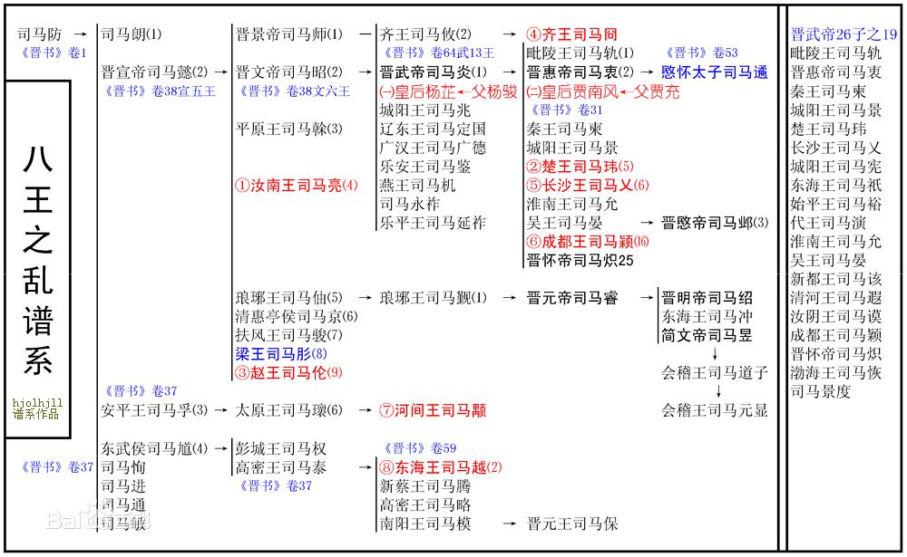

## 三国

* 袁绍：不能任人唯亲、优柔寡断

### 曹魏

* 曹操
    * 荀彧
    * 郭嘉
* 司马懿慢慢攫取曹魏大权
* 司马师勘定内乱稳定统治
* 司马昭灭蜀杀曹

## 西晋

* 266年司马炎篡魏，建国号为晋，定都洛阳，史称西晋，280年灭吴，完成统一。
* 司马衷
* 贾南风
* 司马伦
    - 斩杀贾南风
    - 称帝
* 八王之乱
    - 第三阶段：双方交战仅仅六十余天，损失兵力高达十余万人
        + 齐王司马冏（司马昭次子司马攸的儿子）不满司马伦的封赐，联合成都王司马颖（司马炎的十六子）、河间王司马颙（yong）（司马懿三弟司马孚的孙子 叔辈）公开反叛，三王控制的地方都是要冲，分别是许昌、邺城和长安
        + 司马伦此时手握禁军重兵，实力明显领先。战役刚开始，司马伦部接连获胜，但司马伦却整日担惊受怕如惊弓之鸟，天天干的尽是又是去祖庙烧香又是跳大神又是让人在山上装神弄鬼，而他的手下也都畏敌如虎无心恋战，结果在颖水之战中，手下两员大将在实力完全占优的情况下，与司马冏轻兵接触，便迅速溃败。一时间，军心大乱，人人自危，而本不占优势的司马冏抓住机会纵兵攻击敌军各部，全部击破，河北大败。
        + 一名名叫王舆的将军突然反叛，率领该营七百多士兵从南掖门直攻孙秀，将其捕杀，随后他又率军尽数捕杀司马伦同党，一夜之间，司马伦沦为孤家寡人。王舆控制了司马伦后，让他颁布诏令说：我为孙秀等所误，以怒三王，今已诛秀，其迎太上复位，我归老于农田。王舆遂派兵士将司马衷从金墉城迎归，沿途百姓高喊万岁，而司马伦和几个儿子被囚金墉城。
        + 最终司马伦被赐金箔酒，落得跟贾南风一个下场。临死的时候，司马伦羞愧难当，以衣巾遮面，连声说：孙秀误我，孙秀误我。
        + 司马冏独揽大权后，也开始居高自傲，不可一世，沉溺酒色，重用亲信，俨然第二个司马伦。他没有立已故太子司马遹的儿子们为太子，而是选了一个并非直系的宗室幼子。让因为地理位置原因姗姗来迟，没能抢得头功的司马颖和司马颙有了再次起兵的借口。为了给自己壮胆，制造声势，号称率军十万，并与成都王司马颖、长沙王司马乂一起共赴洛阳。
        + 看到长沙王司马乂正在长安，而且实力最弱，于是本着实在捡软的捏的态度，司马冏决定先打司马乂（司马炎第六子）。公元302年，司马冏率先对看上去最弱的司马乂出手了，此时的司马乂身边只有一百多人，但正是他改变了整个战局。
        + 面对来势汹汹的敌人，司马乂避其锋芒，反而将进宫做的车子的帷幔全部砍断，然后率人乘车打马飞驰入宫，刹那间，马嘶车疾，仿佛一头猛虎，不可阻挡。到达皇后，司马乂以不及掩耳之势控制各座宫门，挟持皇帝司马衷与司马冏对峙。
            * 第一件事是司马乂率军放火焚烧皇宫内外的部分城门和观阁，同时攻打司马冏府。
            * 司马冏命人将皇宫的驺虞幡(上面印着驺虞这种神兽，用以传旨解兵)偷来，拿着它在城下大喊：长沙王伪造诏命。司马乂则挟持皇帝回应：大司马谋反，凡是帮他的诛灭五族。是夜，洛阳城中大战，箭矢如雨，火光冲天，皇帝司马衷被人架到东门城楼做稻草人，火箭群集
        + 第二天，司马冏兵败，被押送到宫殿之上，前夜被吓得不轻的司马衷本来想饶这个救命恩人一命，但被司马乂阻止，随即被拉出宫殿，途中，司马冏再三回望皇帝司马衷，欲说还休。最后生擒贾南风，平灭司马伦的司马冏被斩首，首级示众六军，暴尸三天无人敢收，其党羽属官两千多人被灭三族。司马冏死后他的叔公，也就是司马懿与张春华生的第三个儿子司马干流泪感叹道：宗室日衰，就这小子最有能力，如今他死了，我司马家算玩完了。这种话挺不像是从一个神经病和恋尸癖嘴里说出来的，而也正因为司马干有这两个毛病，没人认为他是威胁，所以他在司马懿的众多儿子里活的最久，八十岁才寿终正寝，比老爹还多活了七年。
        + 司马乂不仅对皇帝司马衷礼遇有加，同时对颙颖二王表现出了积极的合作姿态，他一方面邀请二王同时来洛阳协商政事，一方面又将朝政诸事事无巨细的跟自己的弟弟司马颖汇报。
        + 司马颙坐立不安，于是他派三个亲信地方官密谋策划诛杀司马乂，结果此事被一个叫皇甫商的官员告诉了司马乂，三人遂被诛杀。阴谋败露，司马颙图穷匕见，派都督张方率兵七万以讨伐皇甫商的名义逼近洛阳。司马颖随即率军跟张方汇合，一同进军，此时两王的军力高达二十万，兵锋直指司马乂。司马颖军中打前锋的都督名叫陆机，此人为晋朝文人领袖文才了得，打仗也不错，而他的爷爷叫陆逊。
        + 八王之乱中的最后一个王粉墨登场了。司马越，封东海王，时任司空。他是司马懿四弟司马馗的孙子，从血缘上说，跟司马颙一样，都算是远枝了。于是与部将密谋勾结发动政变，逼迫人偶娃娃皇帝司马衷下诏免去司马乂全部职务，并囚禁老地方金墉城。
        + 为了不生枝节，决定尽快杀掉司马乂。随后他派人暗通城外的敌军都督张方，张方遂率三千兵马前往金墉城逮捕了司马乂，后活活将其烧死，司马乂大声喊冤，直至气绝，死时年仅28岁。
        + 司马颙终于得到了梦寐以求的权力，司马颖被封为皇太弟，成为皇位接班人，司马越被封为丞相
        + 司马颖当上接班人后随即派军五万驻守洛阳十二城门，并对禁军进行大清洗，凡是看不惯的军官统统被杀掉。后又听信谗言，杀当时文人领袖、陆逊之孙陆机兄弟父子，致使与士人离心离德。
        + 司马越觉得机会来了，于是挟持司马衷，传檄天下，召兵勤王，不久即得兵马十几万。司马越觉得司马颖必败，于是轻敌疾行，结果在荡阴被司马颖部下大将石超率轻骑突袭，大败。此战，皇帝司马衷身中三箭，伤及面颊，玉玺丢失，被劫至石超营中。
        + 司马越兵败后逃回封地东海（今山东郯城），不久后，他的弟弟并州刺史司马腾接力继续讨伐司马颖，这次司马腾开始召集北方少数民族乌丸、羯族等势力，司马颖麾下大将石超等人率军抵抗，但最终被能征善战的羯族打败。
        + 司马颖也预感大事不妙，于是率军挟持皇帝司马衷连夜逃到洛阳，一路上可谓穷困之极，堂堂晋国皇帝吃的粗饭，而且吃饭连碗都没有，只能用瓦盆凑合，此时的他应该不会再问老百姓既然吃不上饭，为什么不吃肉的蠢话了。司马颖一行人狼狈逃到洛阳后，被此时洛阳的实际统治者为司马颙麾下的将军张方控制，张方顺势将司马衷劫持到自己军营中，而后他纵兵烧杀抢掠，搞得洛阳城破败不堪。最后张方怕敌军攻打洛阳，于是挟持司马衷司马颖及一干宗室大臣西逃长安。
        + 司马颙见司马颖已经江河日下没有了利用价值，遂废其皇太弟之位，令其返回封地，另立司马炎的第二十五子司马炽为皇太弟。同时，他力邀司马越回朝共同辅政，但被拒绝。
        + 公元305年，司马越再度以张方擅自劫迁车架，天下怨愤，欲奉迎大驾，还复旧都洛阳的名义起兵。起兵后，司马越向司马颙提出只要送帝还都，两人便可分陕地分治，司马颙欲从，但被拥兵自重的张方拒绝。
        + 双方大战几月，司马越艰难取胜，但他打出的送帝还都的口号还是还有煽动性，结果投奔者络绎不绝，实力越来越强。见此，司马颙惶惶不可终日，只得派人暗杀张方并求和，但被已经声势日隆的司马越拒绝。不久后，司马越攻破潼关，直逼长安，司马颙仓惶出逃，逃进太白山里
        + 响应司马颙起兵的司马颖则被司马越部将王浚在河桥打败，司马颖仓惶败逃，一路死伤惨重。后在朝廷追捕下， 司马颖慌乱中抛弃母亲妻子，单独与两个儿子逃回朝歌，欲投奔邺城旧将公师藩，在到达顿丘县城后，被当地太守抓获，随后被扭送到邺城范阳王司马虓处囚禁。后司马虓暴毙，邺城长史考虑到司马颖在邺城素有声望，担心其东山再起，于是矫诏派人缢死司马颖，他的两个儿子也同时被杀。
        + 司马越进驻长安后，派军护送皇帝司马衷返还洛阳，同时正式掌握大权。他命大将梁柳镇守关中，但不久后梁柳被部将马瞻所杀，马瞻到山里请出司马颙主政。后司马越派部将发兵征讨司马颙，包围长安，司马颙困守孤城，惶惶如惊弓之鸟。
        + 公元307年冬天，当了那么多年皇帝的司马衷暴毙，死后谥号“惠”。二十五弟司马炽继位，史称晋怀帝。怀帝继位后，就下诏命困守长安的司马颙出任司徒，司马颙奉诏赴任，结果在新安雍谷被司马越的弟弟司马模杀死，其三个儿子也被杀。
    - 司马腾纠集少数民族乌丸和羯攻打司马颖的那场大战，开启了新的潘多拉盒子
        + 羯族，为匈奴族分支，之前一直为匈奴贵族的奴隶部队，后匈奴势率，羯族开始强盛。这一年，司马颖部队阵中有一位名不见经传的羯族年轻人（石勒），此时他正在公师藩手下效力。而此战打的胶着的时候，司马颖阵中一位匈奴将领（刘渊），趁机劝说司马颖放自己回匈奴以召集部族前来助战，司马颖听后大喜，遂放行此人回匈奴。
        + 刘渊脱离司马颖跑回匈奴后，便立即称王，并率先攻打驻守并州的司马腾部，战争在即，并州又起饥荒，司马腾无奈之下，只好把并州两万多户百姓、破落贵族、将士等等全部东迁往山东乞食。这两万多百姓拖家带口，一面要犯乞讨，一面又要保护家人不被袭扰，随即在司马腾手下大将田禋、李恽、薄盛等人的带领下自发组织起武装，这就是乞活军的由来。他们忙时结堡自保，耕种稼织，闲时依附各方军阀，为其做雇佣军，赚取军饷。
* 司马越
    - 以礼部侍郎周穆与司马越妹夫司马玫为代表，两人力劝司马越废掉看上去日渐长大又有才能的司马炽，改立司马炎子孙清河王司马覃，这样可以挟幼主而令天下，面对党羽的提议，司马越严词拒绝，然后为了维护司马炽的权威，居然杀了二人，因为两人为世家，又不愿诛杀其亲族，于是又上表废除了夷三族的法令。
    - 日渐长大的司马炽开始亲政，并诸多意见与司马越不合，司马越意识到这个问题后大为火光，以退回封地相逼，晋怀帝司马炽不同意，最后采取了折中方案，司马越出镇许昌。
    - 司马越率军讨伐在河北作乱的汲桑，打败汲桑后，遂封作战有功的晋末名将苟晞为抚远将军，并都青州、兖州军事。结果奖励命令刚下发，司马越意识到兖州的位置重要想自己统领，于是马上又下发了撤销的指令。这样一闹，让苟晞大怒，自此两人成为不共戴天的死敌。
    - 又对当初差点当上皇帝的素有人望才能卓越的司马覃下手，他随便找了个理由，矫诏将司马覃囚禁于老地方金墉城，次年将其杀害。
    - 公元308年，司马越又率军平定河北河南地区的乞活军，收复其部。
    - 回到洛阳，继续浪。因为位高权重，司马越疑心渐重，随即冤杀大臣王延等，随后，又脑子发热做出了罢免有爵位的宿卫的决定，结果手一抖，把打击范围扩大化，顺便把所有有爵位的将领全部一锅端，全去其爵位。
    - 永嘉四年，即公元310年，司马越决定征讨逐渐做大的石勒，留世子司马毗，部将李恽、何伦等留驻京师，监视朝廷。而他自己则传檄四方，召天下兵马勤王，想要复制几年前传檄天下勤王的盛景，但时移世易，今时不同往日，响应者寥寥。
    - 看到司马越不得人心，他的仇人苟晞抓住机会暗中上表晋怀帝历数司马越的种种倒行逆施罪行，司马炽一看，决定来一招借刀杀人，于是下诏命苟晞为大将军讨伐司马越。看到诏令，再加上前线的军情，内忧外患，司马越急火攻心，暴毙于项城。
    - 司马越死后，太尉王衍秘不发丧，带着司马越的棺材连夜逃亡东海国，结果石勒率军穷追不舍，最终双方在河南宁平城相遇，司马越大军惨败，石勒遂率骑兵围困溃败的晋朝将士，待对方疲敝后，石勒命令部下用弓箭射杀，十万晋朝将士、士人、官员、百姓全部惨死。而太尉王衍更是被石勒活埋。破棺焚尸，并指着司马越烧焦的尸体说：乱天下者此人也，吾为天下报之。
    - 在洛阳的司马毗、李恽等仓皇出逃，又被石勒打败，司马毗及宗室三十六王悉数被石勒杀害。司马诸王基本被石勒杀光了，石勒也有了一个光荣的称号司马杀手。
    - 拼命拉拢有实力的人才
        - 第一个被他看上的就是挨着东海国的琅琊王司马睿。司马睿是司马懿五子司马伷（是不是要念you）的孙子，世袭琅琊王。
        - 琅琊本地的一个大世族王氏，而此时王氏的代表就是官至太尉，后被石勒活埋的王衍。（王羲之 王阳明）
            + 王衍只推崇三个人，他在评判天下俊才时曾说：阿平第一，子嵩第二，处仲第三。
                * 阿平就是他的弟弟王澄的小字，王澄这个人是个清谈家加行为艺术爱好者，非常喜欢裸奔，对于裸奔行为，王衍认为自己不及弟弟洒脱，并称赞他裸奔的行为是落落穆穆然的大境界。
                * 子嵩是司马越谋士庾敳（ai）的字，这哥们身爱肥胖，喜好清谈，非常崇拜阮籍，经常在自己办公的地方摆满美酒，从早喝到晚，后来他与欣赏他的王衍一起被石勒虐杀。
                * 很幽默的是，王衍这看人眼光确实比较着急，他相中的三个人一人与他共死，一人被另一人直接杀了
        - 王衍为保存王氏血脉，同时为加强对江东的控制，遂建议司马越让司马睿南下管理江东军政，于是司马睿与王氏子弟齐齐南下，成为晋朝硕果仅存的种子。
        - 东海王司马越当政后期，心腹大臣王衍建议让琅琊王司马睿移居南方，以稳定南方局，势随即采纳。渡江南下的司马氏族不止琅琊王司马睿（司马懿的孙子），除了他还有四位王爷分别是西阳王司马羕、南顿王司马宗、汝南王司马佑、彭城王司马纮。
* 五胡乱华（匈奴鲜卑羯氐羌）
    - 东汉初立，光武帝刘秀为了发展生产，于是将大量北方边境的少数民族内迁，而少数民族自然非常乐意，经东汉一朝，三国大乱，到晋朝时，边境地区如关中、凉州的外族人口已占总人口的一半以上。但由于当时中央政府强有力的控制，外族与汉族并无太过隔阂，双方和平相处，百姓安居乐业，但一旦到了乱世，数量如此庞大的外族自然会成为一颗破坏力巨大的定时炸弹。
    * 304年氐族首领李特率先反西晋，后其子李雄攻占成都，建立成汉政权。李雄经营巴蜀之地长达三十年，期间成汉实力雄厚，成为一方霸主
    * 前赵
+ 永嘉之祸:刘聪即位后仅仅三个月，野心勃勃的刘聪急不可耐的派出前赵全部家底，以石勒为首领会师大阳进攻洛阳，刹那间，夺取数百壁垒。第二年，刘聪又派军进攻洛阳，前赵军进至河南时，已经十二连捷，后石勒又率主力军队到达后，强攻洛阳城，不久之后，洛阳城破，前赵军纵并为祸，大杀官员宗室，并俘获晋怀帝与皇后，史称永嘉之乱。
    + 派父亲刘渊的养子刘曜攻取关中，最终刘曜趁胜势攻占长安并杀死司马越的令一个弟弟司马模。但不久后，刘曜被晋军反击，长安失守。而晋怀帝被俘虏后，被迁往平阳（今山西临汾），期间他被刘聪屡次羞辱，不久后他与数十名晋朝大臣一同被杀。
    + 皇太子司马邺即位为帝，史称晋愍帝.晋朝最后的防线和希望就剩下长安，于是拼死抵抗，双方展开了激烈的拉锯战，这一仗，陆陆续续打了四年。
    + 公元316年，刘曜卷土重来，进逼长安，也许是抵抗太久失去了精神，也许是晋军被前赵军队打的丧失了信心，总之这一次，刘曜长驱直入攻取长安外城，随即对晋愍帝所在的小城展开保卫。在死守了两个月后，长安小城弹尽粮绝，晋愍帝决定出降。
    + 公元318年四月，晋愍帝被刘聪杀死，消息传到江东，早已在江东耕耘多年的司马睿正式称帝，建元太兴

## 前赵

 * 刘渊
    + 匈奴人，西汉时匈奴部首领冒顿单于的后裔。白登之围后，刘邦忌惮匈奴实力，遂采取和亲政策，并与冒顿单于结为兄弟，所以此后，冒顿单于的后代都以刘氏为姓。三国时期，匈奴部首领名叫于夫罗，他趁董卓作乱之时，趁机劫掠太原、河东地区，于夫罗死后，其弟呼厨泉继位，随后归附曹操。呼厨泉手下的左贤王为于夫罗的儿子刘豹，而刘豹就是刘渊的父亲。
    + 最喜欢的两本书是《左传》与《孙吴兵法》，少年时，他读书就发出了以下感慨：吾每观书传，常鄙随陆（随何、陆贾）无武，降灌（周勃、灌婴）无文，道由人弘，一物之不知者，君子之耻也。二生遇高皇而不能建封侯之业，两公属太宗（汉文帝）而不能开痒序（教化意）之美，惜哉。
    + 曹魏后期，刘渊入中原为质子，受到司马昭的厚待。西晋初年，许多名士又跟司马炎隆重推荐他，司马炎见了刘渊后，大惊失色，对朝臣说：这小子的容貌仪表，就算春秋时的由余（春秋时秦穆公的重要谋臣，帮其成就霸业，由姓与余姓共同的始祖）、西汉的金日磾都比不上他。朝臣回答说，由余、金日磾不仅容貌仪表无法与刘渊相比，才能更在其之下，建议重用此人。司马炎本来答应了，结果遭到其他大臣反对，他们的理由是，刘渊此人才能卓著，能力越强破坏力越大，再说他是匈奴人，非我族类其心必异，若重用此人，后果不堪设想。司马炎听后，默然不语。
    + 公元279年,父亲刘豹去世，司马炎于是命其统领父亲匈奴部众.又十年后，刘豹久等的机会终于来了，司马炎任命其为北部都尉，在任期间，法纪严明，乐善好施，大获人心，很多地方才俊前来投奔。后来，司马炎去世，外戚杨骏主政，刘渊由于政绩卓著更进一步，晋升为建威将军，五部大都督，封爵光乡候。不久后，成都王司马颖驻守邺城，推荐刘渊为宁朔将军，监五部军事，刘渊从此开始依附司马颖。
    + 在打完同司马腾的战役后，刘渊向司马颖说：现在司马腾手下的人骄横残暴人数众多，我正式请求回匈奴召集五部部众，然后带他们回来共解主公危难。
    + 回到匈奴左国城，二十日聚众五万，定都离石（今山西离石），追尊刘禅为孝怀皇帝（好神奇），国号汉，史称前赵。
    + 司马腾又先后四次攻打刘渊，均以失败告终，胜利后，刘渊部属建议，起兵已一年，一直偏居一隅，威名不震，眼下可以四处出击，大胆征伐，先平定河东，再攻取长安，此后席卷洛阳，大事可成。这也是当年汉高祖消灭强楚的策略。刘渊大喜，采用此战略，一路攻城略地，沿途望风归附，而最让他高兴的是鲜卑部、氐族等个外族部落的归附，而在这里面，有两个人至关重要，他们的名字分别叫汲桑和石勒。
    + 归附刘渊后，石勒逐渐成为前赵的名将，期间战功卓著，破邺城，击败乞活军，攻取数百郡县并网罗诸多人才，降众多达几十万。但这累累战功背后，是华夏民族的痛苦记忆，在行军期间，石勒带领的胡人部队从不带军粮，他们每攻破一城，不仅大肆破坏和掠夺财富，还专门掳掠汉族女子，奸淫一番后将她们作为军粮宰杀烹食，对这些人，胡人有个专门的叫法“双脚羊”。
+ 刘聪
    * 公元310年八月，刘渊病死，长子刘和继位。刘和继位后，学起了西汉景帝削藩的那一套，而首当其冲的正是拥兵十万的弟弟刘聪。但聪明决定的刘聪在得知风声后，决定先下手，率军进攻皇宫，杀死刘和，继位登基。
    + 西晋灭亡后，文武双全的刘聪仿佛完成了自己的历史使命，将国事交给儿子刘粲宠幸宦官，开始了纵情享乐的生涯，他的代表作就是封喜爱的妃嫔为皇后和左右皇后，史称三后并立.公元318年，玩乐怠政两年后，刘聪去世。他的“兄弟”攻破长安的刘曜继位。
        * 太子刘粲继位，不久后即被外戚靳准所杀，石勒一看，这种大好的机会怎么能不把握住呢，于是派兵讨伐靳准.刘曜北上继位，而平叛有功的石勒被晋封为大将军、大司马、加九锡
        * 平定靳准的战争继续，石勒进攻前赵首都平阳，降服十几万各族部落，十一月，穷途末路的靳准派使者向石勒请降，但石勒却跟刘曜说平阳无归附之意。十二月靳准被部将所杀，并向刘曜请降，石勒见叛军不向自己投降，大怒，派兵继续进攻平阳，刘曜此时却派军迎接降军出城。石勒攻破平阳后，烧杀抢掠，焚烧前赵宫室，并将国之重器拿到了自己的基地襄城。
- 刘曜继位后不到一个月，便开始大举练兵，准备讨伐此时兵权愈来愈大，似有不臣之心的石勒。
    + 329年，留守长安的前赵太子刘熙得知父亲被擒后惊慌失措，竟然放弃长安而西奔上邽（今甘肃天水），看着太子逃奔，关中诸镇全部弃城逃跑，于是关中大乱。石勒再接再厉，命石虎肃清关中前赵残余力量。当年八月，刘曜的另一个儿子刘胤率仅有的前赵大军反攻长安时被石虎击败，至此前赵一众王公大臣皆为石虎所擒，同年石勒杀刘曜，前赵灭亡，国祚仅25年。

### 拓跋鲜卑

* 从字义上看，这是鲜卑族一支，跟慕容鲜卑、宇文鲜卑一样，拓跋氏兴起于大兴安岭北部，统幽都之北，广漠之野，畜牧迁徙，射猎为业。而拓跋来源于北人谓土为拓，后为跋的表述，拓跋氏其实就是土地的意思。
* 汉朝时期，拓跋进行迁徙，与留居故地的匈奴部融合，后又从塞北迁徙河西，与曹魏、西晋采取友好政策，迅速发展。
* 公元三世纪初，拓跋部归附前赵，因公受赏，势力急速发展，
* 312年拓跋部击败江河日下的前赵皇帝刘聪之子刘粲，并于次年建国，成为河西一支劲旅。

## 后赵（胡族）

+ 石勒
    + 原名叫㔨（bei），为匈奴分支羯族部落的后裔，之前说了，羯族非常特殊，为为数不多的白种人游牧部落，有趣的是，据验证，羯胡在古希伯莱语是犹太的意思。长大后，壮健有胆力，雄武好骑射，他的父亲周曷朱是当时羯族的投头目，凶狠残暴，族人多不敢亲近，于是周曷朱就委派石勒代为管理族群，结果广受欢迎。
    + 八王之乱期间，并州发生大饥荒，石勒同一起做佃客的族人失散，只得去投奔朋友，结果差点被晋军将领拉出去卖掉，逃亡途中，石勒恰巧遇到朋友郭敬，恩郭敬，没有明。石勒此时心生一计，决定趁乱将前往冀州乞讨的胡人捕捉卖掉。搞笑的是，还没实施计划，年仅二十多岁的他就被司马腾的军队抓了，随后被卖给富户做奴隶，结果，富户震惊于他的异常相貌，竟然免除了他的奴隶身份。
    + 做奴隶的这段时间里，他结识了一个牧马人首领又称牧帅，这个牧帅的名字叫汲桑。两位草莽枭雄一见如故，成为挚友，而汲桑给这个原本叫㔨的人，取了一个新的名字——石勒。
    + 公元304年，司马颖失势，在被天下讨伐的过程中，他的部将公师藩聚众起兵，石勒汲桑率数百牧马人投奔了他。集合部众后，公师藩率军晋中邺城的司马模（司马越的另一个弟弟），在战役中，公师藩被击杀，他的部众随即被汲桑石勒收服，从此汲桑自立为大将军，石勒做先锋大将，屡战屡胜，最终攻陷邺城，搞了很多事情的司马腾被杀。但好景不长，司马越见两人势大，随即派大军围剿，在经过几十次的战斗中，两人大败，汲桑被杀，石勒逃窜。
    + 石勒在走投无路之下，只得投奔已经成形的胡族政权——前赵
    + 公元311年，石勒率军进攻襄阳，短时间内破襄城，克宛城，后又攻陷长江以西三十余所壁垒，军势盛大。在节节胜利之时，石勒临足长江岸边，踌躇满志，流露出雄踞长江与汗水，与前赵分居的想法。但他身边最重要的谋士张宾，认为时机未到，劝他还是要北归，以图霸业。恰逢军中缺粮，瘟疫横行，士卒死伤大半，而琅琊王司马睿又派王导率军进攻，无奈之下，石勒只得裹粮卷甲，回师北返。
    + 返回北方后，石勒与前赵大将曾是农民义军首领的王弥交恶，王弥联合义军出身的曹嶷和另一个投降的晋朝大将苟晞一同做掉石勒，但被石勒及谋士张宾识破，在张宾的建议下，石勒斩杀曹嶷，后摆出鸿门宴击杀王弥，后又斩杀晋朝将星苟晞，后全部吞并三人部众，势力更加壮大。
    + 公元313年，石勒的侄子攻破邺城，满城归附，青州亦望风归降，至此，山东地区尽数为石勒所有，眼见石勒大军如此厉害，一直支持王浚的另一外族乌桓也暗中投降，王浚此时已经四面楚歌。
    + 公元314年，石勒率军大摇大摆的来到了幽州治所蓟县（今天津），先是以送礼物为由驱赶数千头牛羊进城，阻塞道路，后纵兵抢劫。石勒见到王浚后，撕下了假面，先是与王浚妻同坐以示不敬，后直接历数王浚罪状，当场将其捉拿，后扭送王浚到襄国斩首，尽杀其手下数万精兵。
    + 公元316年，石勒率兵在玷城围困晋乐平（今山西昔阳）太守韩据，韩被迫向并州刺史，驻守晋阳（不用说哪里了吧）的刘琨求援。刘琨前不久刚平了一个小国内乱得了一大批兵马，于是觉得自己可以跟石勒掰掰手腕，于是不顾属下劝阻，带着全部家底跟石勒死磕。石勒这种级别的将领见刘琨军队浩荡开来，并不畏惧，而是毒辣的看到了他们的两个问题，一是远道而来疲敝不堪，而是乌合之众号令不齐。城下乌央乌央的几万大军，在石勒眼里就是一盘手抓羊肉，于是设下伏兵，纵兵迎击。
        * 刘琨和那个大耳朵长臂猿刘备有着同样的先祖，那就是他们都是西汉中山靖王刘胜之后
        * 还是著名的文学家，也是西晋大名鼎鼎的“金谷二十四友”成员之一，这个“金谷二十四友”的发起人是妖后贾南风的侄子也是当时的权臣贾谧，贾谧是个酒囊饭袋，但他却喜欢结交文人附庸风雅，而他出名的“朋友”确实不少，这些人也就是“金谷二十四友”的核心成员了。二十四友成员可谓阵容豪华，除了刘琨外，还有大帅哥潘安，让洛阳纸贵的左思，号称东南之宝的陆逊之孙陆机、陆云兄弟，最后一个就是牛叉轰轰敢跟皇帝舅舅王恺斗富的首富石崇和他的外甥大才子欧阳健
        * 还有个好兄弟，两人当年担任司州主簿时，感情深厚，经常同被而眠。有一次他的好兄弟听见半夜鸡叫，确定不是什么地主周扒皮玩的把戏，而异常振奋，他推醒刘琨说：此非恶声，而是上天为了激励我们上进啊。于是两人半夜起来，舞剑练舞，这个典故就是大名鼎鼎的闻鸡起舞。而刘琨这个好兄弟，就是不久后，将把大魔王石勒打的一筹莫展的大英雄——祖逖（ti）
    + 公元319年，因为石勒毁坏国都平阳的事情让刘曜大为不满，再加上身边属臣进言石勒必反，于是刘曜把之前封石勒的官职、封号一下子停了下来，还杀了一个石勒的臣下。听到此消息后，石勒盛怒，随后说：老子侍奉刘氏，尽心尽力，他们的基业都是我打下来的，现在得志了居然要谋算我，王候皇帝老子自己就可以册封自己，哪轮得着他们。于是，在319年十一月，石勒在襄国自称赵王，正式跟前赵决裂，史称后赵。
    + 公元321年，祖逖死后，石勒趁势占领河南全境，三年后，他便挥鞭西进，他的目标正是江河日下的前赵。
    + 公元324年，后赵军队击杀前赵河南太守，并掠夺新安县五千多人口，以此为开端，前后两赵正式兵戎相见，而作为两国交接的河东和弘农两郡成为主战场。
    + 第二年，后赵中郎将王腾杀并州刺史以并州归附前赵，而晋司州刺史李矩、颍川太守郭默也相继归附，恢复元气的前赵随即大举进攻后赵。但石勒的侄子悍将石虎阻挡住了对方猛烈的进攻，接连击败王腾等人，坑杀近万士兵，司、司、豫、徐、兖四州之地尽归后赵所有。
    + 328年，石虎攻击蒲阪，前赵皇帝刘曜举全国精兵救援大败石虎，随后乘势进攻石勒从子（既族兄弟之子）石生镇守的洛阳，前赵军以水灌城，同时又派诸将攻打汲郡和河内，后赵举国震惊。石勒得此消息，不顾劝阻亲自救援洛阳，并命桃豹、石聪、石堪等到荥阳会合，自己领兵直攻洛阳金镛城。及至十二月，石勒与后赵诸军于成皋会合，见后赵不设守军，于是轻兵潜行。刘曜直至石勒大军渡过黄河后才开始防御，从前线得知石勒举全国之兵进犯后更为惶恐，于是自洛阳西侧列阵。石勒在进攻洛阳时就曾下断言：刘曜设大军于成皋关防御，是上策；列兵于洛水阻截则次之；坐守洛阳，就会让我生擒了。结果，果不出石勒所料，石勒随后与石虎、石堪、石聪分三道夹击前赵，大败之，生擒刘曜。
    + 公元330年九月，石勒正式称帝，后赵达到巅峰。
    + 石勒称帝后，于次年四月营建邺城（河北临漳、河南安阳部分），准备将其定为新的都城。而称帝时他也立儿子石弘为太子，但石弘温和怯懦，完全没有父亲的强悍，所以石勒也对这个新太子的未来头疼不已。而此时他的许多近臣都认为石虎手握军权，是个极不安定因素，力主石勒尽快杀掉石虎，以绝后患，但石勒最终都没有采纳这个建议。
    + 到达人生巅峰三年后，即公元332年七月，五胡乱华史上的头等杀星石勒去世。那个曾经倚洛阳东门长啸不止的少年，那个曾经沦为奴隶的低贱胡人，在因缘际会下创造了自己的功业，由于手段血腥残忍，他实在称不上英雄，但枭雄的称号应该是恰如其分。
    + 石勒生前在一次宴会上，酒酣耳热之余，问身边近臣：朕与古代君主比，能和谁匹敌啊。大臣回答说：陛下神武谋略高于汉高祖，雄才勇武比肩魏武，有史以来，黄帝第一，陛下第二。石勒听后大笑说：人应有自知之明，爱卿所言太过了。朕若逢高皇，当北面事之，与韩彭竞鞭争先尔。若遇光武，当并驱于中原，未知鹿死谁手。大丈夫行事当磊磊落落，如日月皎然，终不能如曹孟德、司马仲达父子，欺他孤儿寡妇，狐媚以取天下也。朕当在二刘（刘邦、刘秀）之间尔，轩辕岂所拟乎。
* 石虎
    - 石虎字季龙，跟石勒是本家，很小就被石勒的父亲抚养，而石勒起家后，勇猛的石虎更成为他的先锋悍将，可谓是为叔父石勒东征西讨、南征北战，立功无数，因为这些功绩再加上血缘关系，逐渐被石勒宠信。
    - 可在四处征战的年月里，石虎逐渐暴露出一个毛病，那就是残忍变态。
    - 318年，趁着平定前赵靳明内乱的时刻，他在粟邑逮捕靳氏一族，部分男女老幼，全部杀之。322年八月，石虎攻陷青州，坑杀降卒三万人。并想把青州部众尽数杀死，此时被派到青州当刺史的刘征说：朝廷让我来做官，为的是统治百姓。你把人都杀光了，没有人怎么统治？你慢慢杀把，我准备回去了！石虎一听，觉得有道理，于是只给新任刺史刘征留了男女七百多口。325年，石虎攻取石梁，坑杀降卒九千多人，随后攻取并州，坑杀七千多人。329年，在义渠大破前赵军队，生擒前赵太子刘熙及王宫贵族三千多人，全部杀之，随后又在洛阳坑杀屠各部（匈奴别部，大名鼎鼎的金日磾就是这个部的）五千多人
    - 他恶狠狠的对儿子石邃说：主上自建都襄国以来，端身拱手，坐享其成，靠着老子身当箭石，冲锋陷阵才能成就大业。二十多年来，老子在南方擒获刘岳，在北方赶跑索头，向东平定齐、鲁之地，向西平定秦州、雍州，攻克十三座州郡。成就大赵功业的是我，大单于的称号应当授予我，现今却给了奴婢所生的黄口小儿，想起来令人气愤，寝食难安！老子今天发誓，等到主上驾崩之后，不会再让他的后代活下去！
    - 石勒前脚刚刚去世，石虎后脚便劫持了太子石弘，随后将与自己的几个政敌大臣全部抓起来治罪，更让石邃带兵入宫，引得后赵官员四处逃奔。懦弱的石弘哪里见过这种阵势，当即被吓哭，并要让位于石虎。石虎看着哭哭啼啼的太子，心想自己勇武一世的叔父怎么生了个这么个窝囊废，不过他还是对石弘说：君王去世，太子继位，礼仪常规。结果听到石虎这句话，石弘哭的更厉害了，坚决不继位并说自己不合适做皇帝，石虎大怒，吼道：如果你不适合君位，天下人自会按大道理行事，现在就说不合适，有个鸟用！于是，在石虎的威逼之下，石弘继位，随即在八月封石虎为丞相、魏王、大单于、赐九锡，总领后赵军政大事。九月，石虎即杀太后刘氏，尊石弘的生母程氏为皇太后。
    - 十月，石勒两个养子正式造反。镇守关中的河东王石生、镇守洛阳的石朗先后起兵，石生自称秦州刺史，派使者向晋请降。与此同时，身处陇西的氐族统帅蒲洪自称雍州刺史，归附前凉君主张骏。
    - 闻讯战报，石虎让长子石邃留守襄国，自己则带兵七万率先经驻守金墉城的石朗，大破之，捕获石朗随即斩首。随后乘胜向长安进发，石生随即派将军郭权率鲜卑士兵两万人为前锋应敌，自己则统领大军随后出发，屯兵于蒲阪（今山西运城），石虎则派梁王石挺为前锋拒敌，双方军队在潼关相遇，结果后赵军大败，尸体枕藉三百多里，石挺阵亡。石虎被迫回军渑池，就在形势一片大好的节骨眼上，作为前锋的鲜卑族突然叛了，他们私下与石虎勾结，对石生反戈一击。石生看大势已去，心中惶恐，狼狈逃回长安，而前锋将领郭权只得聚拢残部退回渭水防守。石虎则卷土重来，率大军直逼长安，石生无奈，放弃长安，藏匿鸡头山（今甘肃庆阳），在胜负已分的情况下，石生被部将杀死，随即全军投降，郭权则逃奔陇右继续抵抗。
    - 调转兵锋攻打氐族蒲洪部，后赵大将麻秋陈兵陇上叫阵，摄于石虎的强大又鉴于石生败亡，蒲洪未战先降，率部族投降，被封为将军。
        - 蒲洪到达长安后，建议石虎迁徙关中豪强与氐、羌部族充实东方，石虎同意，随后迁秦州、雍州百姓及羌、氐胡族十万户到关东。蒲洪被任命为龙骧将军、流民都督，率数万部众迁居至枋头（今河南浚县），
        - 羌族首领姚弋仲被任命为奋武将军、西羌大都督，率部众迁居至清河滠头（今河北枣强县）。
    * 334年三月，石虎派后赵老将郭敖与彰武王石斌率步骑四万人进攻郭权，屯兵华阴（今陕西渭南）。一个月后，郭权被当地豪族所杀，石虎遂迁秦州三万多户迁徙到青州和并州。
    * 公元334年九月底，心灰意懒的石弘自己携带传国玉玺到魏宫，要求禅让君位给石虎，但石虎拒不答应。石弘回到皇宫，流泪不止的对太后程氏说，固然如石虎当年说的一样，我们这些先帝的骨肉真的不能再存活了。石弘终于悟透了石虎一直不接受禅让的原因，那就是皇位对于石虎来说，唾手可得，可他要的不是禅让，因为按历史例，禅让需要保全皇族，但石虎不想这样，他依然对石勒当年的分封耿耿于怀，他依然要履行自己当年的毒誓：主上驾崩后，后代一个不留！当年十一月，石虎派亲信入宫，宣布废黜石弘为海阳王，随即将石弘、太后程氏、秦王石宏、南阳王石恢幽禁，不久后将其悉数杀害。一代枭雄石勒，果真落了个后代全灭，断子绝孙的下场。
    * 公元334年十一月，石虎正式继位，自称居摄天王，史称后赵武王。
        * 太子石邃这个人比起石虎来完全不差，变态的程度甚至青出于蓝。石虎沉溺酒色变得喜怒无常，石邃有事禀报时，他会不满的说，这种小事，哪里值得禀报。后来听不到石邃的禀报，又不满的说，你以为你是谁，为什么不把政事禀报于我。说完后，便对石邃轻者叱骂，重者鞭打杖击，一月之中数次如此。本来我觉得石邃这种变态应该很喜欢这种感觉才对，没想到他也知道疼痛，心生不满，有了弑父夺权的想法。
        * 把石邃幽禁在东宫。不久后赦免其罪，在宫殿召见石邃，但石邃看到石虎并不谢罪，扭头便走，石虎大吼道，太子朝见，怎么可以说走就走。石邃不回头也不答应，径直出宫，石虎大怒，当夜杀石邃，诛杀太子宫臣门党二百多人，后便立次子石宣为太子。
    * 建造太武殿（后宫佳丽据说有万人），又在邺城营建四十多所台观，又营建洛阳长安东、西二宫，征发汉丁达四十余万。为自己的后宫掳掠了整整十万人
    * 对北方中原地区的汉人实施种族灭绝政策。从五胡乱华开始，到石虎统治的短短几十年里，中原汉人人口数量从两千多万人急剧减少到四五百万人
    * 338年，石虎接到了前燕王慕容皝称臣的请求，在称臣的同时，前燕还要求后赵能出兵攻打屡屡侵犯前燕的段部鲜卑首领段辽。在密云抓获段辽母亲妻子，并斩首鲜卑士兵三千余人。段辽只身逃脱，派儿子向石虎祈求归降，石虎接受。
    * 五月讨伐前燕。在昌黎（今河北东北部昌黎县）之战中，前燕拼死防守，后赵军大败，终于在十几日后退却。后又在棘城（大概在今辽宁省北票市）之战中再遭失败，慕容皝的儿子慕容恪乘机率二千骑兵追袭溃败的后赵军，大败之，斩获首级三万多人。但只有一位名不见经传的杂牌游击将军率领的军队毫发未损。这位杂牌将军当时的名字叫石闵
    * 347年，攻打前凉。石虎这次任命的先锋将军是麻秋，总之后赵能打仗的除了姓石的，就是桃豹、麻秋两个人，再加上经常做后援的符洪和姚弋仲了。一开始还是老步骤，后赵军进占顺利，前凉部将纷纷投降，然后就遇到了硬骨头，张重华此时只有17岁，但却少年老成，他不慌不忙派谢艾率步骑三万进军临河（今内蒙古自治区巴彦淖尔市）
        - 谢艾戴着白色羽帽，在自己的车上又是敲鼓又是摆POSE，一副仙风道骨的模样。部将张瑁率兵从小路截断了后赵军队的后路。在三千龙骧兵犹豫不前的时候，谢艾羽扇一挥，前凉主力齐齐进攻，撤退的时候又遭伏兵。后又攻打 结果两军前锋部队交战，后赵军又败，逃回黄河以南。八月，谢艾主动进攻麻秋，结果又把麻秋打的大败，后赵军队逃回金城（今甘肃兰州）。
        - 谢艾班师回朝，途中顺手平定了反叛后赵的斯骨真等一万多个部落，是的你没看错，是一万多个部落。
        - 张重华在七年后就英年早逝，而谢艾则被篡位的张祚杀死，前凉从此彻底凉了。
    * 石宣与石韬是一个比一个残暴，一个比一个缺心眼，一个比一个变态，总之就是谁也不把谁放眼里，谁都想置对方于死地，结果石宣快人一步，先杀了石韬，而杀人手法也是相当变态，剁掉四肢、刺烂双眼、开膛破肚...简直就是虐杀。
    * 仿照石宣杀石韬的手法。然后又在柴堆四周点火，浓烟烈焰冲天而起，石虎则跟随昭仪官以下数千人登上中台观看。大火活活把石宣烧成灰烬，火灭后，石虎又命人取出尸会分别放在通向各个城门的十字大路当中，挫骨扬灰。同时，石虎还杀掉了石宣的妻儿共九人和亲信三百多人，全部车裂肢解，抛尸漳水河中，石宣的小儿子刚刚几岁，石虎平素非常喜爱他，因此临杀前抱着小孙儿哭泣，意欲赦免，但大臣们却不同意，竟从石虎怀抱中抢过来杀掉了。当时小孙儿拽着爷爷的衣服大哭大闹，以至于连石虎的腰带都拽断了，但还是未能幸免。石宣居住的东宫被改作饲养猪牛的地方，东宫卫士万人全部被贬谪凉州。
    * 一年后，病重，恰逢被他贬谪到凉州的东宫卫士造反，接连攻取荥阳、陈留等郡，石虎遂命姚弋仲、符洪率部讨伐，两人平定叛乱，升任公位，实力大增。
    * 遂任命儿子石斌、石遵，大将张豺三人为辅臣，后石遵和张豺伙同太子石世生母刘皇后矫诏杀掉石斌，在鸡飞狗跳的乱象中，公元349年，石虎终于死了。
    * 石世继位，刚继位没多久，石虎九子石遵即举兵反叛，进攻邺城，一路势如破竹，而他部队的先锋正是石闵。一个月后，石遵进入邺城，捕杀张豺，胁迫刘皇后立自己为帝，不久后，杀石世与刘皇后。
    * 驻守蓟城的沛王石冲随即反叛，带精兵五万精锐进攻邺城，石遵大恐，遂派石闵率精兵十万迎击，在平棘（今河北赵县）之战中，后赵两支精锐部队捉对厮杀，石冲大败，自己被捉，随后处死，而石冲部的三万精锐均被石闵坑杀。
* 冉闵
    - 石闵，本姓冉，他的父亲叫冉良，家族世代担任牙门将（偏将，负责指挥防御）的官职，后投奔到乞活军账下，石勒当年击败乞活军，俘虏年仅12岁的冉良，后将其交与石虎做养子，并改名石瞻，从辈分上说石闵是石虎的孙辈。
    - 石闵从小聪明伶俐，很得石虎喜爱，成年后，身高八尺，骁勇善战，但毕竟不是石氏嫡系，所以只得了游击将军也就是杂牌将军的名号。但在338年后赵与前燕的昌黎之战中，在其他后赵军对均丢盔弃甲的时候，唯独石闵的军队毫发无损，此战过后，石闵横空出世，一战成名。
    - 在石遵造反前曾对石闵说，大侄子你要努力啊，此事若成，我让你做太子。结果石遵造反成功，称帝后却立石衍为太子，这让石闵颇为失望。而石遵也不傻，他看出了石闵的不忿，又对他的能力颇为忌惮，特别是石闵因功担任大都督后，总管内外兵权，大封将士，树立恩德。石遵另辟蹊径将石闵改为原姓冉，借此警告，你并不是我们石家的人，认清位置，老实点。后石遵又想干脆一不做二不休做掉冉闵，结果此举遭到石遵生母郑太后的反对，郑太后说，从我们回师京城开始，若无冉闵岂能有今日，他现在有点骄纵，但不可动辄杀他。
    - 这件事情被石遵的哥哥石虎的三子石鉴得知，然后迅速告知了冉闵，冉闵遂决定先下手为强，指挥部下率三十甲士在皇宫拘捕石遵，随后将其杀死。冉闵奉石鉴为帝，石鉴投桃报李，封冉闵为大将军、武德王。不过，刚刚继位的石鉴知道自己并无权力，遂暗中指示自己的四弟石苞、中书令李松、殿中将军张才等人暗杀冉闵，结果未能成功，引起一片混乱。石鉴知道事情败露，怕冉闵追查，遂连夜斩杀三人。
    - 龙骧将军孙伏都等人暗中集结三千羯兵也准备讨伐冉闵。孙伏都率三十余人想挟持石鉴而对冉闵发起进攻，当时正在中台的石鉴见孙伏都破坏阁道，询问原因。孙伏都说：冉闵、李农等人谋反，已经聚集在东掖门，我带领卫士，先告知你。石鉴说：你是功臣，好好为我效力。我从台上观望着你，无须考虑向我报告。于是孙伏都带领士众攻打冉闵和李农，未能获胜，只得驻兵凤阳门。冉闵则带数千士卒毁坏金明门入宫。
    - 石鉴再次怕事情败露于是主动打开城门迎接他，并说：孙伏都谋反，你应该立即讨伐他。于是冉闵击败孙伏都，整个邺城皇宫尸横遍野，击杀孙伏都后，冉闵发布命令，：夷凡敢动兵器者一律斩杀。
    - 冉闵此禁令一出，整个邺城的胡人噤若寒蝉，以为自己要遭受灭顶之灾，于是不顾朝廷戒严令，或攻破城门，或破墙而出，纷纷外逃。冉闵一看如此下去不是办法，于是派人软禁石鉴，并解除戒严令并大开城门，并传令：与官同心者留下，不同心者听任各自离开。逃亡在外的胡人一看，以为禁令解除，灾祸已过，于是纷纷回城。
    - 发杀胡令，中原汉人大为振奋，他们将压抑了多年的怨气全部释放出来，整个中原大地，瞬间变成了胡族的地狱。一天之内，数万胡人被杀，而冉闵也亲自带头率军诛杀羯族，不论贵贱，不分男女，不管老幼，一律斩杀，数月之内，二十万胡族血流成河，尸体遍野，全被野犬豺狼所吃。而集聚在中原四方的胡人，也被当地军队按照杀胡令屠杀，甚至有些长得高大鼻梁高毛发多的人也未能逃脱，全部被当胡人处置。
        + 立了后赵的羯族基本被灭族，其他迁居中原的胡族数量锐减
        + 本就尖锐的民族矛盾因为杀胡令便得不可调和，而当时的胡族实力领袖纷纷反击。
    * 公元350年，冉闵杀石鉴，又杀石虎孙三十八人，石氏家族基本全部被消灭。后，冉闵于邺城南称帝，国号魏，史称冉魏。
    * 身在襄国的石虎十一子石袛听说冉闵灭石氏，并屠戮羯族，于是在符洪和姚弋仲的支持下在襄国称帝。同年四月，派石虎八子石琨率军七万攻打邺城，六月，石琨到达邯郸，冉闵仅带千余起兵迎战，此战，冉闵手持两刃矛，飞驰进攻，对手应刃而败，石琨军死亡数万。
    * 十一月，冉闵率十万步骑围攻襄国，一直打到次年二月，石袛恐慌，只得去帝号，以王自称，但与此同时，他又派使者到前燕和姚弋仲处求援。此时前燕王为慕容皝次子慕容儁（jun)，慕容儁遂派将率三万甲兵自龙城出发，姚弋仲派其子姚襄率四万起兵自滆头出发，兵败的石琨则率三万兵马自冀州前来
    * 冉闵遂分兵逐一抵抗，但皆被打败，派去的兵马几乎全军覆没。冉闵只得集合全部将士出战，但在前燕、羌族、后赵的三面夹击中败下阵来，冉闵最后只与十余名骑兵逃脱。石袛反攻，搜捕冉闵部将，全部处死，襄国攻防战，冉闵损失兵力累计十余万，青、雍、幽、荆各州迁徙百姓及诸氐、羌、胡、蛮共数百余万人，为避战祸，在回归本土的路上互相劫掠残杀，加之饥饿、疾病等死亡甚众，真正能回到故乡的仅十之二三。此战后，中原一片混乱，无人农耕，饥荒严重，人人相食。
    * 眼见胜利在望，石袛遂派将领刘显率军七万攻打邺城，冉闵带全军出战，大败刘显，斩杀三万人。刘显大惧，派使者请降，并许诺冉闵将杀死石袛以作报效。冉闵撤军后，刘显回到襄国，果然发动兵变，杀死石袛及诸多大臣，石琨幸免于难只得带领妻儿投奔东晋，两年后全家被诛杀于健康。
    * 至此，公元352年，后赵彻底灭亡，从石勒襄国起家，到石袛襄国被灭，石氏三代灰飞烟灭。
    * 杀了石袛后，刘显突然腰杆硬了不少，居然再次率军进攻邺城，冉闵再次将其击败。刘显败退，返回襄国称了帝。几战下来，大量不满冉闵统治的文臣武将纷纷率部下南渡归附东晋，冉闵愈发势单力薄。
    * 刘显再次率军攻打常山，冉闵率八千骑兵驰援常山，大败刘显，一直追到襄国，刘显手下大将开城接应，冉闵诛杀刘显及大臣百人，焚烧襄国宫室，迁当地百姓到邺城。
    * 闵扶植石遵继位,冉闵仍然惦记着蒲洪，于是对石遵说：蒲洪，人杰也，今以洪镇关中，恐秦、雍之地非国家所有。面对冉闵的劝阻，石遵决定改变石虎的临终任命，解除了符洪的都督职务。听到消息后，蒲洪大怒，自行回到根据地枋头，立即叛赵降晋。
    * 352年四月，慕容儁率军攻占幽州、蓟州，实力版图已达冀州，冉闵率骑兵攻伐，与慕容恪在昌城不期而遇。
    * 一开始，冉闵与慕容恪交手十次，皆取得完胜，在洞察了冉闵的指挥特点后，慕容恪得出结论，冉闵军多步兵，经常引诱前燕骑兵至丛林作战，到了丛林，骑兵的优势无法施展，结果就成了待宰羔羊。于是慕容恪将燕军分成三部，自率中军，用索将战马连接起来，并选善射者五千人，列成方阵前行，另外两部放置中军两侧配合进击，两军交战时，先锋佯败诱敌于平地，冉闵果然中计，率军直冲燕军中军连环铁索阵，结果冉闵军刚刚接触中军，两部侧翼即从左右夹击，斩杀七千余人。冉闵左持双刃矛，右执钩戟，奋力突围，跃马冲破重围向东逃跑，走了二十余里，他的坐骑赤马朱龙突然暴毙，冉闵扬天长啸，被燕军追兵擒获。
    * 随后冉闵被扭送到蓟城，慕容儁问他：你这个奴仆下人，为何敢妄称天子。冉闵答道：天下大乱，你们夷狄之族，人面兽心，尚且意欲篡位谋反。我乃一世英雄，为何不能做帝王呢？慕容儁大怒，鞭打冉闵三百下，送至龙城（今辽宁朝阳），在一个叫遏陉山的地方将其斩杀。冉闵死后胡族争剖其尸，鲜卑将其遗骨遗弃荒野，不准下葬。
* 羌族首领姚弋仲驻扎在陇上(今陕北、甘肃以西的地方)

> 诸胡逆乱中原，已数十年，今我诛之，若能共讨者，可遣军来也。暴胡欺辱汉家数十载，杀我百姓，夺我祖庙，今特此讨伐。犯我大汉者死！杀我大汉子民者死！杀尽天下诸胡匡复汉家基业，天下汉人皆有义务屠戮胡狗，冉闵不才受命于天道，特以此兆告天下!
>
> 前晋八王乱起，华夏大伤，胡夷乘乱而作，扰乱中原，屠城掠地。永兴元年，胡狗鲜卑，大掠中原，劫财无数，掳掠汉女十万，夕则奸淫，旦则烹食，千女投江，易水为之断流。羯狗之暴，以汉为“羊”，杀之为粮。永嘉四年，围猎汉民，王公忠烈射死者十余万。不日，夷人匈奴，四面纵火，烤汉为食，死者二十余万。太兴元年，愍帝受辱，崩于匈奴。凡此种种，罄竹难书！
>
> 今之胡夷者，狼子野心，以掳掠屠戮为乐，强抢汉地为荣。而今之中原，北地沧凉，衣冠南迁，胡狄遍地，汉家子弟几欲被数屠殆尽。天地间，风云变色，草木含悲！四海有倒悬之急，家有漉血之怨，人有复仇之憾。中原危矣！大汉危矣！华夏危矣！
>
> 不才闵，一介莽夫，国仇家恨，寄于一身，是故忍辱偷生残喘于世。青天于上，顺昌逆亡，闵奉天举师，屠胡戮夷。誓必屠尽天下之胡，戮尽世上之夷，复吾汉民之地，雪吾华夏之仇。闵不狂妄，自知一人之力，难扭乾坤。华夏大地，如若志同者，遣师共赴屠胡；九州各方，如有道合者，举义共赴戮夷。以挽吾汉之既倒，扶华夏之将倾。

## 前凉

* 公元301年西凉当地豪族大姓张轨被西晋封为凉州刺史，将整个西凉治理的井井有条，316年，西晋灭亡，张轨的儿子张寔继续守凉州，向东晋称臣
* 四年后张寔被部将所杀，弟弟张茂当了首领，五年后也就是325年，张茂病死，他的侄子也就是张寔的儿子张骏继位，整整二十年后，也就是公元345年，张骏觉得时机成熟，于是称王，国号凉，史称前凉。但张骏称王后一年就挂了，他的三子张重华继位
* 平灭前燕后，王猛入朝为相，都督中外诸军事，成为前燕扛鼎之臣。趁着平灭前燕的威势，王猛回过头灭了仇池，将前凉彻底孤立，随后王猛派人送信给前凉主张天锡，在信中他谈古论今，分析了天下大势与凉国的处境，劝张天锡从大势识时务。张天锡看完信后大惧，寝食难安，最终向前秦谢罪称臣
* 公元376年，苻坚以张天赐“虽称藩受位，然臣道未纯”为由出兵三十万进攻前凉，被逼急了的小白兔张天赐决定咬人，誓与前秦决一死战。然后就没有然后了，两国军力差距实在过于悬殊，前凉大将又阵前叛逃，结果秦军长驱直入攻占甘肃武威，张天锡被逼出降，前凉至此彻底凉凉。

## 前燕

* 前燕趁后赵与冉魏乱战之时，挺进中原，后两位将星冉闵与慕容恪在昌城大战中直接交锋，慕容恪屡战屡败，后采用连环马终于击杀冉闵，正式入主中原。
* 前燕是鲜卑族建立的。创始人是慕容廆，西晋初年他率部接受西晋册封，迁徙到大棘城（今辽宁义县）开始摒弃游牧生活，开始农业耕作，八王之乱时，慕容廆自称大单于，西晋灭亡后，慕容廆又转而受封东晋，此时慕容鲜卑在他的带领下，以大棘城为中心，开始占有辽河流域。
* 慕容廆死后，他的儿子慕容皝继位，经过与弟弟慕容仁的内战，统一慕容鲜卑全部，势力扩展到辽东。公元337年，慕容皝正式称燕王
* 338年，慕容皝向后赵石虎称臣，在后赵的帮助下，击败了段部鲜卑，后来后赵又转过头攻击没帮什么忙反而闷声发大财的前燕，结果慕容皝年仅十七岁的四子慕容恪横空出世，他仅率三千骑兵斩杀后赵三万大军，导致后赵吞并前燕的计划流产，而慕容恪一战成名。在那场大战中，后赵各路军队丢盔弃甲，唯有一部兵马毫发无伤，而带领这支部队的将军就是冉闵，冉闵也正是通过此战得到石虎赏识
* 慕容恪又率军西征平灭宇文鲜卑，东讨平灭扶余，南下屡破高句丽，成为东北唯一的武装势力。宇文鲜卑首领的名字起的非常逗，叫宇文逸逗归，被慕容鲜卑击败后，宇文鲜卑几被灭族，但还是顽强的活了下来，直到几百年后，宇文逸逗归的五世孙横空出世，他的名字叫宇文泰。
* 公元348年，慕容皝去世，其子慕容儁继位，第二年慕容儁就率军主动攻击已土崩瓦解的后赵，夺取幽州，迁都蓟（今天津）。
* 352年，慕容恪在昌城之战中击败冉闵，前燕终于出关进驻中原占据冀州，慕容儁随即脱离东晋，自立称帝，五年后迁都邺城。
* 公元360年，慕容儁死，11岁的幼子慕容暐继位，此时已是前燕重臣的慕容恪辅政，在慕容恪辅政的七年间，前燕政治稳定，在军事上除了灭亡段部鲜卑外，慕容恪屡次率军与东晋交锋，公元365年已是暮年的慕容恪率军击败晋军攻占洛阳，正式取得中原控制权，两年后慕容恪去世，一代将星陨落。
* 慕容皝的弟弟慕容评辅政，从此前燕像坐过山车一样迅速下滑，最终迎来掘墓人。
* 枋头大胜后，慕容垂声望极高，遭到了摄政慕容评的嫉妒，于是按功不表，慕容垂随即与叔叔发生激烈争执，慕容评遂密谋杀慕容垂。慕容垂被逼无奈，在儿子的劝说下，本想回旧都龙城避祸，结果事泄，被慕容评追杀，走投无路之下，只得投奔前秦。苻坚听说慕容垂来投，心中大喜，本来他灭燕的最大忌惮就是慕容垂，结果现在已为我所用，但王猛在旁却冷冷说：慕容垂，观其才略，权智无方，其诸子皆明毅有干艺，人之杰也。蛟龙猛兽，非可驯之物，不如除之。但苻坚惜才未听劝告。
* 在将星慕容恪去世两年后的公元369年，桓温三伐前燕，七月晋军进驻枋头，燕帝慕容暐向前秦求援，并答应割让虎牢以西之地给前秦。
    * 在重臣反对救燕的的声浪中，王猛果决献策，先出兵与前燕共退晋军，先后乘机攻取，是为先救后取。
    * 结果形势出乎所有人意料，燕军在慕容恪之弟慕容垂的带领下在枋头一战中大胜缺乏后勤保障的晋军，桓温随后狼狈逃归，秦军根本就没帮上什么忙。既然没帮上忙，前燕自然就不情愿按照约定割让土地
    * 于是王猛以此为借口，在当年十二月统兵三万伐燕，次年正月，攻取洛阳，后又遣将夺取荥阳，凯旋而归。
    * 王猛完成了灭燕大计的第一阶段计划——打通向东攻燕的战略通道。
    * 公元370年六月，王猛辞苻坚于灞上，率军再次伐燕，苻坚本来想亲征，但王猛却胸有成竹的说：荡平残胡，如风扫叶，不劳陛下亲受风尘之苦，您只需要让人把燕国君臣的牢房造好就行了。
        - 率南路军一举攻下壶关，活捉南安王
        - 北路军在前仇池国（氐族另一政权）君主杨国之子杨安的带领下猛攻晋阳（这是哪里就不用备注了吧），因城固兵多，两月未下，于是王猛率军驰援晋阳。到达晋阳后，王猛绕城查看地形，迅速判断出攻城不下的症结，并想出克敌妙策，其实，王猛的计策挺朴素，那就是挖地道。挖通地道后，派数百人组成的敢死队潜入城中，杀尽守门敌兵，打开城门接应秦军主力，瞬间，固若金汤的晋阳被攻克，再捉燕东海王。
        - 十月，王猛挥师南下，直达潞川（今山西东流入河北、河南交界的浊漳河），与慕容评大军对垒，而此时秦军数量由于分兵戍守新取之地，而大大减少。起先，慕容评认为王猛孤军深入，粮草不济，想采取持久战拖垮秦军，谁知道，王猛是个不折不扣的狠人，双方尚未开展，他再次间不容发的派五千骑兵放火焚烧燕军粮草辎重，一时间火光冲天，连邺城的官民都能看见。这一把火，把坐守邺城的皇帝慕容暐吓坏了，他立即严命慕容评立即出战，打败王猛以解困局。
        - 命邓羌领军直闯燕军主力中军，但邓羌却说，打仗可以，不过给我一顶司隶校尉的乌纱帽吧。面对邓羌的讨价还价，王猛摇摇头说，这我可做不了主啊，要不封你做太守和万户侯吧，邓羌不说话，回到营帐便倒头大睡。司隶校尉是个什么官呢，居然王猛都做不了主，我们看下它的功能就知道了，司隶校尉是主管京师和周边治安监察的官儿，官职待遇不高，但却手握京师兵马，可谓举足轻重，东汉末年宦官与外戚争权时，常常会借助司隶校尉的力量。
        - 王猛只好擅自做主答应了他的要求。邓羌兴奋的从床上跳起，捧起酒坛子大喝一顿，然后跃马横枪，与部将率兵直扑敌阵。
        - 王猛又迅速长驱东向，包围了邺城，期间，王猛号令严明，秦军对百姓秋毫无犯，燕民奔走相告，欢欣鼓舞。同年十一月，耐不住寂寞的苻坚亲率十万精兵前来回师合围，已经心灰意冷的前燕散骑侍郎徐蔚率领五百人趁夜打开邺城北门投降并让秦军进城
        - 慕容暐、慕容评及十余位王爷大臣奔逃龙城，逃窜途中，慕容暐被一个小部将巨武擒获，前燕正式灭亡，国祚33年。

## 前秦（氐族）

* 后赵时代：氐族首领蒲洪驻扎在枋头(河南省鹤壁市)
    - 统辖一族的蒲洪逐渐受到重用，升任冠军大将军、持节都督六夷诸军事，封平西郡公，而他的手下竟有两千余人受封关内侯的爵位，一时间权势滔天。
    - 面对这个现象，冉闵曾经警告过石虎，他说：蒲洪雄俊，得将士死力，诸子皆有非常之才，且握强兵五万，屯据近畿；宜密除之，以安社稷。而石虎却回答说：我还正指望符洪父子为我攻占东晋和巴蜀呢，怎么能杀他们呢。
    - 石遵被冉闵所杀，石鉴成为皇帝.秦、雍二州流民生活无着，结伴西归，在经过枋头的时候，被蒲洪收编，部众一下子多达十万人。此时，蒲洪的儿子蒲健也从邺城赶回榔头，造反的趋势已经愈加明显。石鉴也注意到这点，便升任蒲洪为都督关中诸军事、雍州牧、秦州刺史，想把他从河南调开，
    * 蒲洪与手下商议后决定拒绝，并在350年正月正式接受东晋任命。随后，蒲洪便遭到姚弋仲的攻击，双方展开大战，最终蒲洪击败姚弋仲的儿子姚襄。
    * 他的孙子背上有“草付”的字样，而民间也开始流传“草付应称王”的传说，于是蒲洪正式改姓为“符”，自称大都督、大将军、大单于、三秦王。正式自立。
    * 得意洋洋的对部下说：我拥兵十万，占据有利地形，消灭冉闵、慕容儁指日可待，战胜姚弋仲父子也在今朝，我取天下，比汉高祖要容易得多。
    * 符雄献上了俘虏的一员后赵猛将，他就是麻秋。这是一对老对手了，几十年前，石勒死，符洪率众反叛进攻石虎的时候，正是被麻秋击败又再次归附的。看着老对手麻秋，符洪表现的很大度，任命他为军师将军。结果，几个月后，麻秋在酒宴上下毒杀害了符洪，自己也被符健杀死。符洪临死前对符健说：我之前之所以未入关中，是以为中原可以安定。如今我被麻秋这小子困在这里，平定中原不是你们兄弟能办到的事情，我死之后，迅速入关！说完，符洪死。
+ 三子符健继位
    + 继位后，他便一改老爹张扬的作风，取消了三秦王的封号，而采用东晋的封号，并向东晋朝廷报丧，表示愿意服从东晋的指令。
    + 假意接受后赵皇帝石袛的任命，在枋头修缮宫室，带领百姓播种麦苗，做出一副人畜无害的样子。不久后，便突然出动所有人马疾驰向西，他首先派弟弟符雄率步骑五千入潼关，命侄子符菁从轵关（今河南济源）入河东，全军渡过黄河后，焚毁浮桥，展示出没有退路的决心。
    + 后赵京兆杜洪派部将在潼关截击符健，被击败，打了胜仗后，符健写信给杜洪，送上名马珍宝，并请求到长安后拥立杜洪为帝。杜洪看后，笑着说：礼物贵重说话好听，不是图财就是害命，我才不上当呢。于是召集所有关中军队抵抗符健，但此时符健军已经所向披靡，再也阻止不了，不久即攻克长安，杜洪逃脱。符健占领三秦之地后，还不忘派人到东晋报捷，并与东晋掌权者桓温建立了友好的关系。
* 公元351年，称天王、大单于，立儿子符苌为太子，弟弟符雄为丞相、大将军，建国号大秦，史称前秦。
    - 逃跑的杜洪引东晋梁州刺史司马勋合三万人进攻，苻健在五丈原（好耳熟）将其击败。
    - 后杜洪被部将张琚杀死，张琚自立勤王，符健率军将其斩杀。
    - 后，符健派符雄、符菁率军攻占关东，在颖水之战中击败了东晋镇西将军谢尚，
    - 再后，符健又在陇上击败前凉军队，屯兵陇上，后来，前凉君主张重华再派重兵攻打，结果又被符健击败。
* 符生
    - 苻生是苻健的三子，从小就非常混，非常刚硬，很不被爷爷符洪所喜欢。苻生从小就是独眼，符洪有一次开玩笑说：我听说独眼龙是一只眼流泪，是不是真的。年纪尚小的苻生听到后，怒不可遏，立即拿佩刀在自己身上刺了一个窟窿，顿时血流如注，苻生瞪着爷爷问：这难道不是眼泪吗？符洪大吃一惊又恼又怒，拿出鞭子抽打苻生，苻生冷冷的说：我都不怕刀刺，还会怕鞭打吗？符洪暴怒，一边打一边说，你如果这样下去不悔改，我把你贬为奴隶。苻生又回答说：就像石勒那样？（石勒奴隶出身，夺得皇位）符洪听后突然惊惧，鞋都没顾上穿光着脚捂着苻生的嘴。
    - 不久后，符洪对儿子苻健说：你们家老三狂暴，宜早除之，不然日后必祸害我们一家人。苻健听后准备杀了苻生，结果被弟弟苻雄阻止，苻雄说，小孩子家家的，长大就好了，何必要杀了他呢。
    - 公元351年，苻健建秦后，苻生被封为淮南王，在对桓温北伐的战争中，苻生更是表现勇武，两军阵前，单骑入阵，夺旗斩将数十次。
    - 在这次同桓温的战争中，太子苻苌身中流矢而死，苻健因当年谶文中有三羊五眼这句话，因而觉得自己的独眼龙儿子苻生是天命之子，于是立其为新太子。
    - 符菁率军进入东宫，想杀符生以自立。符菁入宫的时候以为符健已死，结果刚进入东宫，他便发现自己的叔叔站在城门之上排兵布阵，心中大惧，他的手下也都四散而逃，叛乱草草结束，符菁被杀。
    - 公元355年，苻健在平定侄子苻菁叛乱后病危，临死前给苻生指定了一批辅政大臣，但苻健考虑到苻生凶暴残忍，担心其不能保全大业，于是对他说：六夷酋帅及掌权大臣，若不听话，就立即杀掉。
    - 混世魔王正式登场，神经病加杀人狂。折腾了才短短两年，蒸蒸日上的前秦就已经到了崩溃的边缘
    - 公元357年，蛰居中原的老相识羌族在首领姚襄的带领下趁前秦混乱想吞并关中，短时间内招纳北地胡人五万户。大敌当前，苻生派苻坚与大将苻黄眉、邓羌率兵抵抗，苻黄眉是苻健兄弟之子，皇室子弟，刚猛勇武，邓羌则有勇有谋，两人为前秦一时武将双壁。
    - 苻黄眉采用邓羌计策，派邓羌率三千骑兵到姚襄营垒面前摆开阵势叫战，果不其然，姚襄大怒，准备出战，此时谋士建议他，应该继续固守，待时而战，结果怒不可遏的姚襄说：二雄不能并立，希冀上天不会抛弃我这种有德之人，我决定决一死战。于是，姚襄调动全部精锐迎战秦军，邓羌佯败，姚襄率军追击至三原，邓羌回兵迎战，苻坚与苻黄眉随后率带队赶到，三原之战，姚襄的部队被彻底歼灭，而他所骑黧眉骏马失蹄摔倒被俘，随即被苻坚斩杀，姚襄之弟姚苌随即率残部投降。
    - 击败羌族进犯后，苻黄眉向苻生邀赏，结果苻生不赏反辱，身为皇室宗亲的苻黄眉怨愤不已，决定谋反，可惜事泄，被苻生灭族。
    - 要杀苻坚，苻坚先下手。苻坚便领亲兵壮士三百人潜入皇宫云龙门，守卫皇宫的侍卫都恨死了苻生，于是毫不抵抗便投降苻坚与他一起杀入后宫。当时苻生正醉卧在床，闻听骚动，便起身让造反兵士给他跪下，不然就杀头。苻坚冷笑一声，指挥士兵将苻生拖下床，幽禁起来，后遣使将其勒毙。
* 苻坚，苻健弟弟苻雄的儿子
    - 八岁时，苻坚小朋友还对爷爷符洪提出了要找个家教专门学习的要求，符洪听后大惊，说，我们氐族只知道喝酒吃肉，你能知道学习，简直太好了
    - 公元357年，年仅20岁的苻坚正式继位。与长兄苻法关于谁做皇帝好一番谦让，最终自知是庶出的苻法坚持让苻坚继位，但苻坚继位后不久，其生母苟太后便将苻法赐死，苻坚哭而吐血。
* 王猛，字景略，公元325年出生，青州北海郡剧县人。为避战祸，年幼的王猛随家人颠沛流离，迁居至魏军（今河南河北南北交接处），幼年的王猛家贫如洗，只好以贩卖簸箕为生。在兵荒马乱之中，贫困交加的王猛不堕其志，发奋读书，兼容并包，博学好兵书，谨重而严毅，气度雄远，瑰姿俊伟，在混沌乱世之中，他洞察世事，在兵荒马乱中，他观测风云，外界的动乱将其磨砺的更加智慧。长大后，王猛隐居华山，静观世事，期待明主出现。
    - 公元354年，东晋权臣桓温一伐前秦，节节奏凯，关中父老夹道欢迎，身在华山的王猛遂身穿粗布麻衣下山直入桓温军营。桓温接见王猛并请其分析时局，只见王猛一面满身捉虱子，一面侃侃而谈，桓温见此暗自称奇便问道：吾奉天子之命，率锐师十万，仗义讨逆，为百姓除残贼，而三秦豪杰未有至者，何也？王猛闹了闹乱发里的虱子，笑了笑说道：很简单啊，大人不远千里深入北境，兵多将广，现在长安城近在咫尺，您却屯兵灞上，迟迟不拿下长安。三秦豪杰们摸不透您的心思，怎么可能前来投奔。王猛简短几句话，可谓一针见血，桓温虽掌东晋大权，但朝野对其防备，朝臣也不支持，随时准备其失败时反攻倒算，桓温只能借北伐博虚名而并不想攻城略地，与其消耗自己实力，不如留敌自重，也可让朝廷忌惮。
    - 桓温惊诧于一个落魄的隐士居然看穿了自己，只得默然立之，无言以对，王猛看桓温默然也不说话，自顾自的捉虱子。过了许久，桓温回神，看着捉虱子的王猛一字一句的说道：江东诸才子，无一人有先生之才。
    - 由于苻健坚壁清野，而晋军军粮短缺，桓温只得回师，临行前，他仍念念不忘王猛，于是赐马车拜高官邀其共同南下。王猛思忖东晋豪族林立，政局复杂，自己难有作为，而他断定桓温必定篡位，不愿玷污其名声，回华山求师傅意见，师傅更是直言道：卿与桓温岂可并于世哉，在此自可富贵，何为远乎。于是，王猛谢绝桓温，继续隐居等待明君。
    - 尚书吕婆楼向其举荐了还在华山隐居的王猛。于是，苻坚找到王猛与其促膝长谈，两人一见如故，谈及兴废大事，句句投机，苻坚遂邀请王猛出山，王猛欣然同意。多说一句，这个吕婆楼的儿子名叫吕光，后来成了后凉的开国皇帝。
    - 任长安西北门户始平县县令，在那里，豪强横行霸道，盗贼屡除不尽，可谓是个治安重灾区
        + 鞭打死一个作恶多端树大根深的奸吏，结果县里炸开了锅，上司逮捕王猛押送长安。
        + 苻坚亲自责问王猛说：为政之体，德化为先。莅任未几而杀戮无数，何其酷也。王猛则答道：治安定之国可以用礼，理混乱之邦必须用法。这才杀掉一个奸贼，还有成千上万的人尚未伏法。陛下是因我不能除恶务尽而惩罚我还是因我为政残酷而惩罚我呢，如果是前者我甘愿接受，如果是后者，我绝不接受。
        + 一年之内五次升官，官至尚书左仆射、辅国将军，可谓瞬间成为前秦权臣。位列三公，这一年，王猛36岁，属于他的时代，才刚刚到来。
    - 将皇太后之弟作恶多端的强德收捕，先斩后奏，将其处死，等到苻坚因皇太后压力带来赦免诏书时，强德早已成了刀下之鬼。
    - 与邓羌通力合作，全面彻查为祸作乱不遵发迹的豪族大臣，可谓雷厉风行，一鼓作气，弹指间将二十几位权贵铲除
    - 为苻坚和自己的改革找到一大批得力的干将，这其中有王族出身的苻坚幼弟苻融，也有敌国的俘虏降臣，只有有才，王猛必大力举荐
    - 从一阶隐居穷书生到天下扛鼎之臣，王猛只用了短短十几年的时间就完成了所有读书人梦寐以求的治国平天下的终极夙愿，此人治国与征伐均显示出其雷厉风行干净利索化繁为简切中要害的作风，如龙出深渊
    - 公元375年七月，王猛病危，苻坚亲自拜见，询问身后事。51岁的王猛白发苍苍形容枯槁，挣扎的坐起来，一字一句的说：晋虽僻陋吴越，乃正朔相承，臣没之后，愿不以晋为图。鲜卑、羌虏，我之仇也，终为人患，宜渐除之，以便社稷。
* 苻坚命幽州刺史堂兄苻洛率兵十万，另派邓羌率兵二十万北伐代国，代王拓跋什翼犍派兵抵抗，结果大败而归，什翼犍无奈之下只得北走阴山，却又遇到高车部族反叛，只得回到漠南地区隐匿，后见秦军退去，便重新返回都城盛乐（今内蒙和林格尔），结果刚刚还都，其庶出子拓跋寔君听信堂兄弟拓跋斤谗言，利欲熏心，杀害了父亲什翼犍与其他弟弟，代国大乱，前秦乘机出兵云中，拓跋代国败灭。大笨蛋拓跋寔君与拓跋斤被车裂而死，代国旧地被一分为二，而此时拓跋什翼犍年仅六岁的小孙子在旧臣燕凤的保举下留在旧地。此时年仅五岁的小朋友，名字叫拓跋珪
* 淝水之战后
    - 后燕
        + 慕容垂就向苻坚请求放他回邺城故地，神志皆乱的苻坚没多想就同意了，此时他的谋臣权翼反对说：垂，爪牙名将，所谓今之韩、白！世豪东夏，志不为人用。顷以避祸归诚，非慕德而至，列土干城未可以满其志，冠军之号岂足以称其心！且垂犹鹰也，饥则附人，饱便高飏，遇风尘之会，必有陵霄之志。惟宜急其羁靽，不可任其所欲。听完权翼鞭辟入里的分析，苻坚苦笑了一下，摇了摇头，摆了摆手。
        + 洛阳附近的丁零族（古少数民族，后与各部融合）领袖翟斌起兵反秦，由于其部有大批鲜卑人，前燕皇帝慕容皝的孙子慕容凤也在阵中，苻坚便派慕容垂前去平叛，慕容垂趁机以兵少为由，在河内募兵，几天时间便招八千余人。慕容垂的不臣举动引起了镇守邺城的苻坚庶长子苻丕的注意，但生性优柔寡断的他并未采纳手下大将石越在慕容垂羽翼未丰之时将其剪除的建议，后来石越感慨：公父子（苻坚与苻丕）好存小仁，不顾天下大计，吾属终当为鲜卑虏矣
        + 公元384年正月，翟斌部属里的鲜卑慕皇族慕容凤劝说翟斌归附慕容垂，翟斌从之，慕容垂势力因此得到急速扩张。慕容凤为报当年前燕灭亡之耻，出兵击杀平原公苻晖（苻坚之子）麾下大将毛当，慕容垂听闻后大喜，遂将起兵之事告知三子慕容农，慕容农遂于康台劫掠前秦战马数千匹，于列人（今河北邯郸市东部）起兵，并招兵买马，兵至数万，苻丕派大将石越前去讨伐，慕容农夜袭石越部大败秦军，斩杀石越。
        + 故扶余王余蔚率荥阳城投降慕容垂，慕容垂据荥阳称燕王，亲率二十万大军，从石门（今河北荥阳石门）渡黄河，攻打邺城，至此，鲜卑慕容后燕正式成立
        + 384年三月，北地长史慕容泓（前燕皇帝慕容儁之子）聚数千鲜卑族人驻守华阴（今陕西渭南）反叛，慕容泓弟平阳太守慕容冲也在河东起兵。
        + 与此同时慕容垂引兵猛攻邺城，克外城，苻丕退守中城防守，慕容垂久攻不下，后采用谋士建议引漳水灌城，但就在此时翟斌再反，事泄，翟斌被杀。影响了燕军攻城速度，又逢粮草匮乏，慕容垂于是决定引兵暂退。
        + 苻坚任命自己的儿子苻熙镇守蒲阪，苻睿引兵五万攻击慕容泓。可惜苻睿这个人好大喜功有勇无谋，不听劝谏执意纵兵急进，结果败死华泽，姚苌一看皇帝的儿子在自己的辅佐下挂了，心中恐慌，遂派人去向苻坚谢罪，结果苻坚一生气就把姚苌派去的使者给杀了，姚苌心中大惧，一咬牙一跺脚决定逃奔渭北
    - 西燕
        慕容泓此时已收拢刚被击败的弟弟慕容冲的残军，兵力达到十万，在接到慕容暐的密信后，于384年四月正式向长安进军，并建制称王，国号燕兴，西燕就此成立。但仅仅两个月后，慕容泓手下大臣认为其能力威望皆不能担当大任，于是联手将其杀死，扶立慕容冲上位，
        - 韬光养晦的姚苌顺势将其子送给西燕做人质，以求自保。
        + 慕容冲尚是一个十二岁的少年，由于继承了慕容家族俊美的外表，他一眼就被苻坚看中，跟年仅十四岁的姐姐一起被纳入后宫，很长一段时间里，苻坚相当宠爱慕容冲姐弟俩。让慕容冲做了大州刺史，后来更是升其做太守。
        + 同年七月，慕容冲率西燕大军直逼长安，苻坚遂命兄弟苻方驻守骊山，次子苻晖正面抵挡敌军，幼子苻琳做后援，慕容冲行军路上命妇人乘牛马，举杆为旗，扬土为尘，以充兵盛，以壮军威。不久之后，慕容冲大军击败苻晖军，再败苻方军，最后又在灞上击败后援苻琳，苻方骊山大败后不知去向，苻琳中流矢而死，苻晖因屡败慕容冲被苻坚严辞训斥，愤惭自杀，西燕军遂占据阿房城。
        + 苻坚派人送一锦袍给慕容冲，并说：卿远来想必非常劳苦，现赠送一领锦袍，以表明我的心意。我对你的情分如何，你是知道的，为何一夜之间就出如此变故。慕容冲派人回答说：我以天下为己任，岂能顾念一领锦袍的恩惠。如果你束手投降，我自然会善待你。苻坚听后大怒，几欲吐血，大叫道：悔不用王景略苻融之言，致使白虏（鲜卑族人皮肤白皙，故被苻坚称为白虏）如此猖狂！
        + 西燕围困长安大半年，长安城内粮草匮乏，人吃人者屡见不鲜，苻坚在最后一仗开始前，竭尽全力杀牛宰羊款待群臣，领兵的大将居然将肉塞到嘴里却不咽下，回到家才“吐肉以饴妻子”。最终在385年五月，已经称帝的慕容冲杀死前秦最后一位大将杨成率军攻入长安城，苻坚身披胄甲，督战抵抗，浑身中箭，血流遍体。但前秦军士因粮草不济，战斗力大为减弱，无法抵抗西燕的猛烈攻击，苻坚只好让太子符宏守城，自己则带数百骑兵逃奔五将山（今陕西岐山县东北），不久后符宏就带着妻母宗室几千骑逃出长安，前秦百官将领随即逃散，西燕大军占领长安，慕容冲纵兵大掠，死者不计其数，道路断绝，方圆千里不见人烟。
    - 后秦
        + 逃到渭北后，西州几个大豪族率五万户推姚苌为盟主，劝其起兵，于是姚苌在这些豪族的支持下正式在渭北起兵，不久后，十万羌族部众前来归附，姚苌势力瞬间暴涨。当年六月，苻坚亲率两万步骑攻击姚苌部，初战告捷，并将其围困，姚苌部被围，缺水严重，军心涣散，就在走投无路之时，天降大雨，于是军心复振，苻坚仰天长叹，恨天命无常，恰逢慕容冲大军进攻长安，只好引兵退去。此后，姚苌积极发展军力，静待天下大变。
* 苻坚回到长安后，面对着人心浮动天不遂愿的局面怒愤难平，想起当年对亡国皇室子弟的优待和仁义却换来了如今的背叛和杀戮更是气血上涌，他只能找前燕废帝慕容暐出气，他大骂道：慕容家兄弟子侄全都名列上将，虽说是灭国，但我优待你们就像归家一样。现在呢，慕容垂、慕容泓、慕容冲叔侄先后起兵叛我，你们慕容家当真是人面兽心。慕容暐听到苻坚的雷霆之怒，吓得站不直又跪不下，只能一个劲的嚎啕大哭，苻坚见此，反而消了气，并没有将其诛杀而是命他写信给慕容泓让其投降，结果前脚还诚惶诚恐哭的像个泪人的慕容暐马上改头换面，他在给弟弟慕容泓的信中说：前秦气数已尽，必将不会久存，我是笼中之人又是前燕罪人，不值得你们挂念，你们就努力重建兴燕大业吧，大业如果能成，你就做皇帝好了。
* 逃到五将山后，苻坚还没喘几口气，就被守株待兔的姚苌领羌兵包围了，秦兵无法抵抗，溃散而去，苻坚被生擒
    - 随即被押送到新平（今陕西彬县水口镇），姚苌索要传国玉玺，苻坚张目喝道：小小羌胡竟敢逼迫天子，玉玺已送到晋朝那里了，你是得到不了。
    - 姚苌又提出让苻坚禅位与他，苻坚再次大骂道：禅让是圣贤的事，你这种叛贼，有脸要求这种事吗。
    - 想必这个时候，创建了一代伟业但功亏一篑的苻坚一心只想求死，不知道他有没有回忆起三十年前，他击败姚襄军，并饶二十几岁的姚苌一命，此后一直待其不薄，在淝水之战前更是把自己曾担任过的“龙骧将军”封予对方，可自己的仁义为什么总得不到回报，慕容家族、姚氏家族先后反叛并让自己落到阶下囚的结局呢？
    - 苻坚想不通，也不想再想了，最后，他为免自己两个女儿受辱，痛下狠心将她们杀死，随后屡次辱骂姚苌求死。最终在公元385年八月，苻坚被绞死于新平南静光寺，终年四十八岁。
* 苻坚的一生可谓是临山之高又居泥之下，波峰波谷大起大落竟也是一眨眼的事，建功立业也罢，荣耀顶峰也罢，不过也是过眼烟云。值得一提的是，由于他优待亡国皇室俘虏却落得个纷纷背叛最终身死国灭的下场，由此后，历代国君再篡灭他国，通常会以苻坚“柔仁邀名”身死亡国的例子做教训，以致对前朝大开杀戒斩草除根，后世皇室再也多难得保全。不仅杀皇族还杀功臣的朱和尚就曾评价苻坚说：俱未再世而族类夷灭，所谓匹夫之勇，妇人之仁也。

## 东晋

* 司马睿携北方世族衣冠南渡，其中最最重要的就是琅琊王氏
    - 在司马睿和北方世族刚到江南立足未稳的情况下，王导站了出来，他提出镇之以静，群情自安的八字方针，随后他奔走江南，拜访江南名士顾荣、贺循，将二人引至朝堂，由此才使吴地望风归附，百姓归心。这一幕，跟当年孙氏父兄三代经营江东何其相似，我们只是记住了周瑜、鲁肃、吕蒙、陆逊的雄姿英发，但却忘了，孙吴两朝的绝对大佬是张昭。
    - 文化会成为一种比信仰更高的东西，文化认同和输出的威力绝对不压抑宗教影响。
    - 经过王导的接近十年的苦心经营，江南的局面大大改观，在此期间，王导与司马睿齐心协力，吸收了诸多江南大族的代表人物，而北方侨族也逐渐安定下来，由此，北方侨族与吴地世家的关系和利益被维持在一个平衡点上。
    - 公元317年，前赵刘聪灭西晋，司马睿遂在南北大族的合力支持下在建业称帝，史称晋元帝。王导全面掌握东晋政权，而王敦则全面掌握东晋兵权。
    - 身为皇帝的司马睿对琅琊王氏从依仗敬重变为警惕忌惮再变为厌恶打压。为了将核心权力争回，司马睿开始有意疏远王导，并重点打压手握兵权的王敦。
    - 对王敦采取了暗中布局
        - 释放扬州地区沦为僮客（即奴仆）的北方流民，将他们组编成军队，交由东吴旧族戴渊统领，同时封戴渊为征西将军，督司兖豫并雍冀六州诸军事，驻合肥，而正在北方打出根据地的祖逖也正是因为此事而忧愤去世，但实际上，司马睿如此任命的真正目标是王敦，祖逖只是被误伤。
        - 任命刘隗为镇北将军，督青徐幽平四州军事，驻淮阴，明里是准备北讨石勒，暗里其实是对付王敦。
    * 司马睿因大权旁落，成为傀儡，忧愤交加，
* 吴地吴人从心底并不认同司马氏的西晋，而司马氏为了提防吴人，也在仕途上对他们极力打压。从公元303年到310年的七年中，江南先后发生三起大的叛乱，但都被一个人平定，史称三定江南。
* 三定江南的人名字叫周玘，他的爷爷叫周鲂，东吴时期大名鼎鼎的鄱阳太守，他的父亲则是更有传奇性的周处，他还有个弟弟叫周札。而当时吴地最大的两个望族就是以周玘周札兄弟为代表的义兴周氏和吴兴沈氏，周沈两世族在西晋并称江东二豪，除此之外，吴郡的朱、张、顾、陆四世族紧随其后。
    - 为自己所代表的的江东世族地位利益考虑，毕竟江东一乱，首当其冲的就是这些豪强世族们。江东叛乱只是吴地吴人内部的矛盾
    - 密谋反叛，不料事泄，司马睿得知后故意秘而不宣，他准备玩一把周玘。司马睿征召他为镇东将军府司马，让他去建业就职，结果周玘日夜兼程尚未抵达建业，便接到诏命，改授他为南郡太守，周玘只得又转道南下，行至芜湖时再次接到调任命令，命他再返回建业。明白是密谋反叛的消息泄露，不禁忧愤成疾，发背疽而死，临死前，他对儿子周勰道：杀我的是北方伧子（伧子是南人对北人的蔑称，蛮子是北人对南人的蔑称），你能为我报仇，才是我的儿子。周玘死后，周勰再反，但因叔父周札泄密而未成，司马睿绕过周勰，并借此一举分化周氏沈氏两大豪族。
* 公元322年11月去世，东晋的开国皇帝半生颠簸，在位仅六年，太子司马绍继位，史称晋明帝。
* 王导
    * 字茂弘，小字赤龙，年轻时就与司马睿结识，两人志同道合，情同挚友，后司马睿镇守下邳，王导被任命为司马。两年后，司马睿渡江南下，王导在列。
    * 王敦叛乱后，他带着宗族子弟二十多人每日都到台城待罪领罚，司马睿念及旧情，这才放过了琅琊王氏。
    * 王导对一开始王敦清君侧的行为实际上是支持的，他也看不惯刘隗等人的胡作非为，但王敦叛乱成功后，政敌已除，王导又坚定站在了司马氏这边。
* 王敦
    * 字处仲，小字阿黑，年轻时他的名气比小他十岁的族弟王导名气大得多，后来他娶了司马炎之女襄城公主，成了当朝驸马，声名更大。
    * 在八王之乱中，王敦立身危局，对朝政有即为冷静的分析，逐渐成为琅琊王氏中的重要人物。
    * 八王之乱结束后，在王衍的推荐下，王敦就任青州刺史，后又被司马越任命为扬州刺史，正式来到司马睿队伍中，从此王导与王敦成为司马睿麾下两员扛鼎重臣。
    * 但就在衣冠南渡之时，王敦却因为宿怨杀死了族兄也就是王衍的亲弟弟王澄，此时司马越府中的三大才子之一潘滔认为王敦此人“蜂目豺声”（眼睛像胡蜂，声音像豺狼），遂下断言说：王敦此人今后一定会吃人，也一定会被别人吃掉。
    * 性格弱点也就暴露无遗，王敦此人骄横善妒，心胸狭窄，东晋建立升任大将军后更是渐露专权迹象，他随意分封手下将领，对政见不一者随便加害，一时间，不把任何人放在眼里。让王敦惧怕的两个人，一个是三定江南的周玘，一个是此时正在北伐打的石勒一筹莫展的祖逖。
    - 在祖逖未北伐之前，王敦就想安插在建业朝堂安插亲信，而且还跃跃欲试带兵在建业城外扬威，祖逖听到后，找到王敦的使者厉声吼道：阿黑怎敢如此放肆，你回去告诉他，让他赶快滚回去，如果迟了，我就自带三千兵马，溯江而上，赶他回去。
    * 公元321年，祖逖病死雍丘，王敦听后大喜，认为整个东晋再也无人是他的对手，遂准备反叛。
    * 公元322年正月，王敦在武昌（今湖北鄂州，江州治所）正式起兵，以讨伐奸臣刘隗的名义进攻建业，同时党羽沈充在吴兴（今浙江湖州）起兵响应，他的亲哥王含也起来投奔，司马睿遂下诏定王敦为大逆，正式迎战，戴渊、刘隗同时率兵入卫建业。
    * 当年三月，王敦势如破竹大军压境逼近建业，司马睿派右将军周札守卫石头城，刘隗驻守金城（今江苏句容）以为外援，司马睿本人则披甲出镇建业郊外，准备迎战
    * 周札开城投降，都城建业门户大开。看着石头城丢了，司马睿急令刘戴二人率军反攻石头城，皆大败退回台城。司马睿深知大势已去，建业必丢，于是将败退的刘隗叫到身边，配给人马，让他逃出建业自寻生路，刘隗逃至淮阴被王敦军袭击，百般无奈之下，只得一路狂奔向北，投奔了后赵石勒。
    * 奸臣北讨已经肃清，理应回兵才对，但此时的王敦有了更大的想法，于是坐拥石头城，纵兵劫掠，整个建业大乱，台城中的官员卫士尽皆逃散，司马睿身边就剩一个将军和两名侍从。
    * 无奈之下，司马睿只得向王敦求和，两人相见时，司马睿对王敦说，你想当皇帝，早点跟我说嘛，我让给你就是。不久后，王敦自任丞相，督中外政事军事，至此叛乱成功，东晋大权尽归王敦，司马睿被彻底架空。
    * 戴渊、周札先后被杀，驻守梁州和湘州的甘卓与司马承先后被击败身亡，又准备废黜太子司马绍，因百官坚决反对而未能得逞。
    * 在将朝廷官员和军镇将领调整完毕后，王敦放心的返回武昌，遥控朝政
    * 公元324年，王敦患病，他的心腹钱凤与沈充暗中筹划王敦死后，他们便继续作乱，灭掉东晋。此时王敦病情日益沉重，司马绍明里派人询问病情，暗里让王导等人做好准备出兵讨伐。
    * 温峤告发王敦手下准备夺位，司马绍随即下令王导率军讨伐。王导出兵前，率琅琊王氏子弟在府中为王敦发丧，属下将士误以为王敦已死，士气大增。看到朝廷出兵讨伐，王敦遂以哥哥王含为元帅迎击，大军水路并进攻击建业。后东晋中军司马曹浑在越城击败王含，钱凤等人在建业城外被司马绍亲率大军击败，王敦大怒，意图亲自领兵作战，但病重无法下床，遂忧愤而死，终年59岁。
    * 死去的王敦被起出尸身，摆成长跪的姿势戮尸，头颅被斩下后与钱沈等人的头颅一同被挂在城南朱雀桁上示众，各党羽都被追捕
* 祖逖
    - 范阳（今河北保定）祖氏后裔，祖上均为高官，他的父亲叫祖武，是司马昭的掾属。祖逖生性豁达，不拘小节，轻财好侠，慷慨有节。少年时不喜读书，长大后才发奋，遍览图书，博古通今，时人称其有治世之才。
    - 鉴于现在司马睿还是西晋的大臣，不可能公开反对此事，他只得顺着祖逖的意愿，封他为奋威将军，豫州刺史，令他率军北伐。但司马睿同时却未给祖逖一兵一卒，只给他拨了千人粮饷，三千匹布帛，让祖逖自己招募战士，自己制造兵器。
    - 顶着众人的目光和讥讽的笑意，祖逖欣然接受司马睿的任命，而后他率自己的乡党父老寂静的出发了。注定属于要在北方大地上悲歌一区，也注定要在史册中刻上自己激越的印记。率部渡江时，以手击楫大声念道：祖逖不能平中原而复济者，有如大江！
    - 建武元年即317年，祖逖率军进驻芦州（今安徽亳县），此时当地的军阀叫张平，此人拥兵数千，驻扎在谯城（今安徽亳县市区），拒不归附北伐军。祖逖遂率军攻城，久攻不下，使用离间计，张平被部下杀死，率众归降。张平死后，他的死党樊雅仍占据谯城，后又率军夜袭北伐军，祖逖阵营大乱。在此关键时刻，祖逖沉着应对，击退樊雅，后马上率部追击，但遭到敌军阻击，只得向蓬坞堡主陈川、中郎将王含求援。陈王二人遂派将增援，而领兵将领正是名门之后桓宣。祖逖见谯城久攻不下，敌军势大，便派桓宣劝降，桓宣单骑入谯城，对樊雅说：祖逖将军准备荡平刘聪、石勒，需要您做后援。如果现在和解，您既可以建立功勋，又可以保全富贵。如果您还是固执不降，待朝廷派出猛将大军，凭您手下这些乌合之众，依靠一座危城，北边还有强敌环伺，万无一全的道理。樊雅听后默然不语，率城归降。
    - 318年，蓬坞堡主陈川反叛，率部劫掠豫州诸郡，祖逖遂派兵将其击溃，陈川恐慌，只得率部归附石勒。第二年，祖逖出兵讨伐陈川，石虎则率五万大军救援，结果被祖逖击败，石虎恼羞成怒，撤退途中率部洗劫豫州。
    - 320年，祖逖派部将韩潜攻占蓬坞堡东侧，后赵将领桃豹退守西侧，两军对峙十余日，祖逖使计迷惑后赵军以为自己粮草充足，后又在汴水，尽夺后赵输送前线的军粮，桃豹无奈之下只得退兵驻扎东燕城。祖逖乘势追击，命韩潜进占封丘（今河南新乡），自己则率军进驻雍丘（今河南杞县）。
    - 黄河南岸站稳脚跟后，祖逖为了解决后援问题，劝科农桑，积极发展生产，而对普通百姓到士兵将领都平等对待，深得民心。鉴于此，当了皇帝的司马睿下诏擢升他为镇西将军，而被打的焦头烂额的魔鬼石勒则罕见的向他低下了头。为了缓和与北伐军的关系，石勒命人在成皋县为其母休墓，后又主动致信祖逖请求互市，祖逖虽未回信，但却暗地里允许互市，结果双方互市让北伐军收礼十倍，粮草兵马问题基本得到解决，北伐军势力日益强壮。
    - 公元321年，司马睿任命戴渊为征西将军，督司兖豫并雍冀六州诸军事，听到消息后，祖逖怅然若失。自己辛苦征战八载，披星戴月，历经艰难困苦，终于在中原立足。可这些功劳在江东宫廷那些人眼里仍然不值得一提，那些人原来就像当年自己渡江时一样，仍然对自己做的一切不闻不问，冷眼旁观。祖逖心中崩的很紧的那根弦断裂了，断裂的声音如此决绝刺耳，让他自己如置梦中。人活一世，总要有点指望有点希望有点梦想，可当这些被击的粉碎的时候，那种滋味可能比死还难受。
    - 公元321年九月，民族英雄祖逖在雍丘病死，享年五十六岁。
* 平定王敦一年后，文武双全的司马绍病死，年仅四岁的幼子司马衍继位，史称晋成帝
    - 母庾文君太后临朝，并组成七人的辅臣团队，这七人分别是：王导、西阳王司马羕（五马渡江那位，司马懿之孙，司马亮第三子）、尚书令卞壶、车骑将军郗鉴、领军将军陆晔、丹阳尹温峤，最后一位比较特殊，他是太后庾文君的哥哥，出身又是颍川，名叫庾亮。
    - 庾亮接着外戚加帝舅的身份很快取代王导夺得朝政大权，大肆擅权杀戮，人心尽失
    - 地方上又出现了两个极强的军事力量
        - 讨伐王敦有功晋升冠军将军雄踞江北的苏峻，因为有功于国，声威卓著，手握精兵，遂有异心。
        - 功败垂成的民族英雄祖逖之弟，镇守寿春的祖约。认为自己名气资历都不在郗鉴和卞壸之下，却未能成为辅政大臣，对此而耿耿于怀。
            + 被击败的赵胤派部将攻击在历阳的祖约，祖约再次大败，只得趁夜带数百人北逃，归附后赵，两年后，祖约被石勒诛杀，祖氏宗族被灭。
    * 公元327年，专权的庾亮决定征召苏峻入朝，苏峻上书不从，庾亮再次强令征召，苏峻担心万一上朝会被庾亮加害，决定反叛，反叛之前，他派使者暗通对朝廷久生不满的祖约，两人约定共同起事。
    * 温峤立即准备率军入卫建业，但被庾亮拒绝，王导则建议在苏峻军队未到前阻截阜陵（今江苏扬州附近）使其不能渡江，但又被庾亮拒绝。结果苏峻大军在几无抵抗的情况下长驱直入攻陷姑熟（今安徽当涂）
    * 苏峻军进一步逼近建业，来到了覆舟山（今南京玄武紫金山）。参军陶回算定苏峻将会绕过重兵防守的石头城进取建业，于是向庾亮建议派伏兵在小丹杨南道准备伏击，结果庾亮再不听，后苏峻率军果然从小丹杨道进攻建业，期间更是迷路，靠当地人作向导才得以前进
    * 苏峻攻入建业后，卞壶率军抵抗，在西陵大战中大败，随后双方又在清溪（今江苏南京秦淮区）展开决战，卞壶再次大败，他与其两子均力战而死。庾亮没有办法只得亲自率部在宣阳门（南京城墙之一）抵抗，结果还未列阵士卒就已弃甲逃走，庾亮只得与三个弟弟逃出建业投奔驻守寻阳的温峤。
    * 进入皇宫，此时又是王导站了出来，他与众臣列居大殿，守护着年幼的司马衍，使苏峻投鼠忌器，不敢上殿，只得将火气撒到后宫。他纵兵劫掠东进后宫，驱役百官，裸剥侍女
    * 陶侃为军队盟主，而徐州刺史郗鉴在广陵也誓师讨逆。
    * 祖约麾下诸将暗中勾结后赵准备来个里应外合，果然石勒派石聪及石勘渡过淮河进攻寿春，祖约大败，逃奔历阳，后赵军则掳掠寿春两万户百姓北归。
    * 在得知祖约兵败后，苏峻部下大为惊骇，力劝苏峻诛杀东晋大臣改朝换代，但被历来敬重王导的苏峻拒绝，而王导则借此离间了苏峻的部将，后试图救出司马衍逃走，未成功，王导只得带两个儿子逃到白石，与陶侃军会和。
    * 温峤多次出兵反倒使自己兵粮短缺，唯有向陶侃借粮，结果此举令陶侃大为不满，更扬言要撤退。面对举棋不定的陶侃，温峤再次好言相劝，此时大将毛宝也前来劝说陶侃留下，毛宝承诺将夺叛军粮草，如果失败，陶侃便可撤退。后，毛宝果然成功烧毁叛军在句容和湖熟的粮草库，陶侃这才借粮给温峤
    * 缺粮的苏峻主动进攻，派韩晃进攻大业垒，当时大业垒中缺水，士卒只得喝粪水解渴，而守将郭默更是偷偷逃走。驻守京口的郗鉴听闻大惊，准备联系陶侃一起救援。但陶侃谋士则认为士卒都是水军不熟悉陆战，一旦营救大业失败则会使整个战局陷于被动，于是建议陶侃直接进攻石头城，采用围魏救赵的战法迫使韩晃自动退兵。陶侃听从建议，率水军进攻石头城，庾亮、温峤、历阳太守赵胤也率步兵进攻，四方水路并进，形成合围之势。苏峻自领八千人抵抗，同时派儿子苏硕与将军匡孝迎战赵胤，不久后赵胤败退，苏峻看到后，大喊一声，孝能破贼，我更不如邪！于是留下部众，自率数骑突围，结果失败，在回途中马匹突然停滞不前，结果苏峻被陶侃部将投矛击杀。
    * 公元329年，陶侃温峤联军合攻石头城，一路势如破竹，苏逸、韩晃等狼狈逃窜，后苏逸在潥阳被王导堂侄王允之击杀，韩晃则被郗鉴击败，力竭身死。
    * 五年后，在平定苏祖之乱中虽小节有亏但功勋卓著的陶侃去世，后世对其推崇备至，他先后入唐德宗武成王庙六十四将和宋徽宗武庙七十二将，可谓流芳千古，而他有个曾孙名气更大，他的曾孙不喜做官爱好田园，写过几首小诗和一篇小文，名叫陶渊明。
    * 平乱当年，同样功勋卓著的温峤病逝于武昌
    * 而先后断祖约苏峻粮草的毛宝在十年后东晋北伐中在株城（今湖南株洲）被石虎之子石鉴重兵围困，在向庾亮求援不应后，突围途中溺水而死，而毛宝被后世尊为江南毛氏始祖
    * 王导与庾亮仍二分朝权，此种状况维持了十年。在十年后的公元339年，庾亮因力主北伐结果大败积郁成疾，不久后去世，同年，东晋初期最最杰出的政治家琅琊王氏领袖王导也寿终正寝，终年64岁。
    * 庾亮的两个弟弟庾冰和庾翼掌权。
+ 三年后，晋成帝司马衍也寿终正寝，司马衍去世前，庾冰考虑到司马衍的两个儿子年幼，而庾氏掌权已久，怕小皇帝继位会招来动荡，于是力主司马衍传位于亲弟弟司马岳，他们的母亲都是庾文君，也就是庾冰的亲姐姐。最终司马衍同意，公元342年，司马岳继位，两年后年仅23岁的他就去世了，史称晋康帝
+ 晋康帝英年早逝，他的儿子司马聃继位，年仅一岁，其皇后母亲临朝听政。叫褚蒜子，年仅22岁。庾氏家族两兄弟庾冰与庾翼接连去世
+ 庾翼
    + 庾氏家族幼弟，少有经纶大略，风仪秀伟，在苏峻叛乱时曾以白衣身份帮助哥哥庾亮驻守石头城。叛乱平定后，在庾亮的照应下，平步青云，一直坐到将军和太守的职位。庾亮死后，庾翼更受重用，督江、荆、司、雍、梁、益六州诸军事，驻守武昌，成为封疆大吏，年仅35岁。当时很多人认为他年纪轻轻并无治国经验，只是依靠庾氏家族的荫蒙才得到高位，但随后庾翼用实际行动向世人证明了他的能力，在他治理期间，六州军政严明，经济发展，府库充实，人心大定。
    + 343年，掌权的庾翼决心跟随哥哥庾亮的脚步继续北伐，他先后与前燕王慕容皝与前凉主张骏秘密联合，想对后赵前后夹击。同年七月，后赵汝南太守率城归附东晋，庾翼觉得时机已到，遂正式北伐，并推荐任命老将桓宣挂帅，都督司、雍、梁、荆四州诸军事，桓温为先锋，进驻临淮，庾翼自己则出动自己所辖六州的奴仆及车驴牛马进驻夏口，后进驻襄阳，庾冰则率军镇守武昌，作为后援。
    + 命挂帅的桓宣在丹水（今河南南阳附近）与后赵作战，结果身经百战的桓宣意外被后赵将领李罴击败。听闻桓宣大败，庾翼大怒，将其贬为建威将军，打发他去驻守砚山（今湖北襄阳境内）。桓宣为丹水之败惭愤不已，不久后去世，庾翼趁机让长子庾方之统帅其部队。这位当年协助祖逖出征，镇守东晋北方门户，屡立战功的名将屡不被东晋朝堂所容，最终郁郁而终。
    + 公元345年,庾翼在上厕所的时候看到一个东西长得极像方相，不久后便背疽发作，病危之时，他向朝廷上表推荐次子庾爱之接替自己出任辅国将军，荆州刺史。
        * 门神秦叔宝尉迟恭出世之前，民间的门神是方相与方弼，方相在古代神话中为逐疫驱鬼之神，《周礼·夏官·方相氏》：方相氏掌：蒙熊皮，黄金四目，玄衣朱裳，执戈扬盾，帅百隶隶而时傩，以索室驱疫．”有时也在驱鬼祭仪中作开路神，先导神。方相神的形象特征为头长双角，鼓目呲牙，满脸凶相。
* 初期，北方流民大量南迁，到达京口（今江苏镇江）后，他们便无力再南下，只得武装自己以自保，而王敦叛乱时，郗鉴就被派往京口广陵地区收拢流民武装，组成军队以拱卫王室。苏峻祖约叛乱后，东晋朝廷看到京口的地理位置愈发重要，便任命郗鉴督八郡军事，让其领导管辖这支流民军队，而郗鉴及其家族自此开始经营京口并成为东晋王朝世族派系中举足轻重的一支力量。郗鉴死后，东晋摄于京口流民军队的强大，一直对其采取打压抑制的政策，后桓温势强，经营上游，下游的京口流民军才渐不被重视。
* 恒温
    - 叛将韩晃在芜湖杀死的宣城内史桓彝之子.身于谯郡龙亢桓氏（今安徽怀远亢龙镇）.
    - 年仅16岁，听到父亲被杀，他枕戈泣血，誓报父仇.后韩晃被诛杀，桓温便将仇恨的目光投向江播。三年后，江播去世，其子江彪等三人为父守丧，为防备桓温前来报仇，事先在丧房内准备好兵器以防不测。桓温假扮吊唁客人混入丧房，趁不备手刃江彪，并追其两弟并杀之
    - 年轻的桓温结识庾翼，两人成为好友并相约一起横刀立马共平天下.娶晋明帝司马绍长女南康长公主，成为皇室驸马.庾翼知道桓温才能卓著，于是向晋成帝司马衍推荐他的姐夫（司马衍为南康公主亲弟）说：此人有英雄之才，愿陛下勿以常人遇之，常婿畜之，宜委以方、邵之任(周宣王时期的方叔、邵虎，皆为周室中兴功臣），必有弘济艰难之勋。在庾翼的推荐下，司马衍遂任命桓温为琅琊内史，后加辅国将军。这一年，桓温年仅23岁。
    - 343年八月，桓温被正式任命为安西将军、荆州刺史、持节都督荆、司、雍、益、梁、宁、六州诸军事，正式掌握整个长江上游的兵权。
    - 决定攻打成汉后，桓温的想法得到其好友兼谋士江夏相袁乔的大力支持，袁乔建议对付日渐衰微的成汉不用大军，一万精兵轻军速进即可。在得到袁乔支持后，桓温遂在346年11月上书朝廷请求伐蜀，结果未等朝廷回复确认，心急的桓温便与征虏将军周抚、辅国将军司马无忌、袁乔一起率军西征。朝廷得知后，认为桓温伐蜀兵力过少，又要长途跋涉险要偏远的蜀地，大为忧虑。结果这时，丹阳尹刘惔又站了出来安抚朝廷说，桓温必胜。
        + 公元347年二月，桓温兵至青衣（今四川名山），李势遂派将军李福、昝（zan）坚率军赶赴合水（今四川成都双流）防御，成汉军队本想在长江南设伏，昝坚却鬼使神差的从江北鸳鸯琦渡江，向犍为（今四川彭山东）开进，看地图就会知道，昝坚这一走，正好跟晋军背道而行。这样一来，桓温率军长驱直入兵至彭模（今四川彭山东南），他留下将军周抚之子周楚看守物资，自己亲率步兵直入成都，三战三胜，陈兵成都城下。
        + 李势见外援未到，只得集结成都城内所有兵力，在成都城外的筰桥（今成都西南，此桥用竹索编成，故名筰桥）与桓温决战。此战打的极为惨烈，袁乔所率的前锋失利，损失惨重，而成汉军的箭矢如暴雨倾盆，甚至射到了桓温的马前，就在晋军惊惧，意欲退兵之时，敲战鼓的鼓吏却惊慌之下将撤退鼓敲成了前进鼓，袁乔一看便当机立断将错就错督促士卒前进奋战，结果就这样，晋军终于反败为胜，攻入成都。李势乘夜色逃走，一口气跑了九十里，最终还是决定投降，被送往建康，成汉政权就此灭亡，国祚44年
    * 朝政暂由会稽王司马昱掌控，这个司马昱是东晋开国皇帝司马睿的幼子，辈分声望还是足够的。他为了遏制桓温，学习他父兄当年为遏制王氏而引入庾氏那样，提拔声名在外的殷浩参政
    * 公元349年，雄霸北方的后赵君主石虎死亡，北方大乱，桓温看机会来临，立即上奏朝廷请求北伐，但东晋朝廷始终不置可否。两年后，桓温心急难耐，再次上表朝廷请求北伐，同时，他不等回复，便率军五万顺江东下，驻扎在武昌。见此情形，殷浩没了主意，司马昱只得屡次写信劝阻桓温，最终桓温没再前进，返回荆州。再此后的两年间，桓温终于实现夙愿，迫使朝廷同意北伐，桓温欲占据洛阳，恢复晋朝旧都，但屡战屡败。在公元352年，殷浩也奉旨率兵攻打许昌洛阳，最终失败，桓温见此，立即上书弹劾，朝廷无奈，废殷浩为庶人。至此，东晋朝权完全落于桓温一人之手。
    * 桓温三伐
        + 一伐
            + 公元354年，桓温开始了浩浩荡荡的第一次北伐。他亲率步骑四万自江陵出发，由水路自襄阳入均口（今湖北均县），然后自浙川（今河南淅川）直入武关（今陕西丹凤东南），同时命梁州刺史司马勋兵出子午道（是不是还是耳熟），合击前秦军。东晋军历经数次血战，生擒前秦将领，击退符健三子淮南王符生，挺进关中。符健随即命苻苌、符雄、符菁率五万军队屯兵峣柳（今陕西商县），以阻晋军。
            + 同年四月，桓温转战灞上（今陕西西安东，还是耳熟），开始了攻占长安的战斗。符苌率秦军退守长安城南，后被晋军流箭射死，而符健自领羸弱兵卒六千人固守内城，另派苻雄率七千骑兵，在白鹿原与桓冲（桓温弟）交战，桓冲军战败，随后又在子午谷击败司马勋，但长安之围仍在。与此同时，长安附近郡县看到桓温的旗帜纷纷来降，关中百姓更是牵牛担酒沿途迎接晋军，许多老人更是失声痛哭道，没想到有朝一日还能再次见到官军！
            + 就在长安周边阵地沦陷，桓温胜利在望之时，危机却悄然而至，那就是军粮。东晋大军长途跋涉，补给线过长，物资军粮缺乏，而就在围城之时，桓温趁麦收时节发动手下收麦更是验证了这一点。躲在城里的符健看得一清二楚，他知道桓温不攻城而收麦子肯定是粮草不济，于是采取坚壁清野的方式与晋军对抗。时日一久，晋军无法坚持，桓温只得撤返江陵，秦军尾随攻击，晋军大败，伤亡惨重。
        - 二伐
            + 356年，桓温卷土重来，自江陵出兵再次北伐，目的是想攻占洛阳。同年八月，桓温兵至伊水（今河南洛阳城南），适逢姚襄围困洛阳，姚问询晋军开到，只得撤军，并在伊水北拒战。桓温亲自披甲督战，晋军结阵前行，大破姚襄军，并趁势收复洛阳。桓温来到囚禁过西晋诸多皇族显贵的金墉城，拜谒先帝陵墓，修缮皇陵。
            + 然后，他就班师回朝了。收复的失地除了洛阳瞬间沦陷
        - 三伐
            + 公元369年，桓温三度北伐，他亲率步骑五万，与弟弟江州刺史桓冲，豫州刺史袁真一起出兵，这次他的目标变成了前燕。晋军凌厉的攻下湖陆（今山东鱼台），擒获前燕王室慕容忠，进逼金乡（今山东济宁）。适逢大旱，水路不通，桓温便让人在巨野开凿水路三百里，使水师由清水进入黄河。当时，东晋前期功臣平苏峻之乱有功的郗鉴之孙郗超建议桓温尽率全军直击前燕国都邺城，或坚守河道，控制漕运，储蓄粮食，待明年夏天继续进攻。郗超认为，如果不速战速决或者解决后援，待秋冬来临后，晋军将难以维持，面对郗超的两个建议，桓温一概不采纳。
            + 前燕王室大将慕容恪的弟弟慕容垂率八万大军前来，燕晋两军对峙枋头。
            + 入秋后，降雨量减少，黄河水运线运转不畅，晋军粮草开始告急，这一切都跟郗超预料的一模一样。久经沙场的桓温对这一局势也早有准备，他派豫州刺史袁真进攻谯郡（今安徽亳县）、梁国（今河南商丘），以期凿通石门（今河南荥阳），连接睢水与黄河，用以运粮。袁真成功的接连攻克了谯郡、梁国，但石门却迟迟未能凿开。慕容垂得到消息后，立即派弟弟慕容德率全部骑兵疾驰石门，攻击袁真，自己仍率大部队在枋头牵制桓温。而面对前燕的军事调动，桓温选择了按兵不动，继续等待袁真凿开石门，补给到来。
            + 九月，慕容德率前燕精锐骑兵到达石门，石门会战开始，前燕的骑兵轻松击败了袁真的晋军，桓温静待补给的计划完全失败。得到这个消息后，身困枋头的桓温大感不妙，继续留在这里，补给会越来越少，主动进攻，也没有绝对胜算。两难之下，桓温只好选择撤退。
            + 桓温下令焚毁战船，全军由陆路向南撤退，慕容垂随即亲率八千骑兵追击，两军战于襄邑（今河南睢县），晋军打败，死伤三万人。
            + 桓温兵败后一路退守至山阳（今江苏淮安），他将此次战争的罪过全部推于袁真，并上书朝廷，请求废袁真为庶人。袁真不服，在寿春（今安徽寿县）反叛，并勾结前秦前燕反攻东晋。发生这种事情，东晋朝堂仍然不敢追究桓温责任，反而命官员去劳军，并册封其子桓熙为豫州刺史。
            + 370年，袁真病死，部将拥立其子袁瑾继续作乱，与此同时，前秦、前燕先后派军增援袁瑾，桓温命水军都护竺瑶率军迎战。燕军先至，双方在武丘（今河南沈丘）大战，燕军大败而归。八月，桓温亲率两万军队攻打寿春，在外围筑城，将寿春团团围住，袁瑾只得固守。第二年，前秦将领率军救援寿春，结果被桓温部将击败。不久，桓温破寿春，俘获袁瑾，占据豫州。
        - 北伐是假，沽名钓誉是真。
    * 公元361年，还是婴儿就当了皇帝的司马聃去世，年仅19岁，史称晋穆帝。穆帝死后无子，朝廷只得让他大伯晋成帝司马衍的长子司马丕继位。但是司马丕同学继位后，不理朝政，沉迷方术，天天不吃饭，想要练就A4腰，结果没多久就病倒了。然后皇太后褚蒜子二次出山，临朝听政。
    * 公元365年，忙于减肥的司马丕一命呜呼，史称晋哀帝，由于他又无子，于是他的弟弟司马奕继位，褚蒜子三度出山临朝。
    * 公元371年十一月，桓温带兵入朝，威逼褚蒜子废除司马奕。褚蒜子无奈之下，只得废司马奕为东海王，桓温随后迎立摄政的会稽王司马昱继位。
    * 加紧清除异己，庾氏家族首当其冲，后人或被诛杀，或被废黜，已全无当年风采。看着桓温的不臣行径，司马昱敢怒不敢言，忧愤成疾，一年后去世，成为了东晋历史上最短命的皇帝。
    * 王彪之，是王导的堂侄。在王彪之的强硬坚持下，司马昱的六子司马曜继位，年仅十岁，由于皇帝年幼，我们的褚蒜子女士再次站了出来，四度临朝。
    * 公元373年，桓温入建康见新帝司马曜，太后褚蒜子命谢安与王坦之到新亭迎接，当时建康城内人心浮动，流言纷纷，说桓温要杀谢王而篡晋室。王坦之询问谢安的看法，谢安神色不变的说道，晋祚存亡，决于此行。见到桓温后看着四周的兵士，谢安淡淡的说：安闻诸侯有道，守在四邻，明公何须壁后置人也。桓温听后尴尬的笑着说，不能不这样做啊，但还是将兵士撤走。在见过谢安后，桓温在建康逗留几日，便因病离开，不久后病死。
    * 既不能流芳百世，不足复遗臭万载邪！
* 郗鉴有个女婿很出名，他女婿出身大名鼎鼎的琅琊王氏，永和年间曾经跟好友谢安等人在一个地方开趴体，结果喝的很嗨，结果此人趁酒醉手书一篇文章，成了千古经典。这个人叫王羲之。
* 卧凤谢安
    - 出生公元320年，比王猛大五岁，字安石，陈郡阳夏（今河南太康）人。出身名门世家，父亲名叫谢裒（pou），早年就是琅琊王司马睿的橼吏（即文书秘书），后随司马睿南渡，官至礼部尚书，封子爵，在谢裒手里，陈留谢氏才正式成为东晋世族。
    - 长大后，谢安则纯粹是放浪形骸，这跟当时南北方的局势有很大关系。北方长年乱战，无安身立命之所，而南方虽也有征战，但总体安定，且流行清谈风气，谢安自然沉迷其中。拒绝了朝廷的征召后，他索性跑到会稽郡东山隐居，做起了“独坐幽篁里，弹琴复长啸”的隐士，出则打猎捕鱼，入则吟诗作赋，频频与当时清谈领袖名士张绰、许询郊游唱和，在永和九年又参加了王羲之组织的兰亭修禊（xi）活动，期间众人玩起流觞曲水的游戏，酒觞随着溪水流动，到谁面前谁便作诗一首，诗作编成《兰亭集》，而王羲之在酒醉之余才思泉涌挥毫泼墨为其作序，一副书法文学神品《兰亭集序》应运而生。
    - 王猛与谢安虽然出身不同，经历不同，但都选择了同样的一条道路那就是隐居，但两个人隐居的方式与目的应该是有区别的，王猛隐居为继续苦读并待时而动以投明主，而谢安因为家中有人做官可以保全家族加上性格使然所以纵情山水，但风云际会仍然让两人基本同时出山
    - 公元359年他的弟弟谢万在北伐中大败被贬，此时刚刚兴起的谢家权势名望受到威胁，为了家族荣誉安危，已经40岁的谢安终于决定出仕，此时已是桓温掌权。
    - 当时御史中丞高崧开玩笑说：卿累违朝旨，高卧东山，大家常议论说，谢安石不出山做官的话，将如何面对江东百姓呢，而江东百姓又如何面对出山做官的谢安石呢。谢安听后，面有愧色，而此段成就一个成语，即“东山再起”
    - 桓温死后，接管桓温兵权的是他的弟弟桓冲。桓冲此人自幼随桓温南征北讨，文武双全且品性极佳，他在接管军权后，就以自己能力不如谢安为由，主动将拱卫京师的扬州刺史之职让给谢安，而改任徐豫兖青扬五州诸军事和徐州刺史，镇守京口，后又转任都督七州诸军事，兼任荆州刺史。以此，谢安与桓冲达成了一种默契和平衡，双方各自相安，共辅朝政，东晋的两位大人物平和相处，一致对外，达到了荆扬相衡，则天下平的效果。
    - 公元377年，谢安干了一件一意孤行的事，那就是为了对付强大前秦的袭扰，他不顾众人反对议论，执意让自己的侄子出任兖州刺史，镇守广陵（今江苏泰州），负责长江下游与前秦接壤的江北一线防务；自己则督扬豫徐兖青五州军事，总管长江下游防务。
    - 谢玄是谢安大哥官任豫州刺史的谢奕之子。看着自己的子侄如此优秀，谢安傲娇的说：谢家子弟又不需要都出来参政，但为什么都那么有才能呢。谢玄回答说：譬如芝兰玉树，注定是要生长在阶前庭院里呀。
    - 淝水之战后，谢安的声望到达顶点，官进太保，而谢玄也一战成名，威震天下，
        - 刘牢之更是凭洛涧大捷走上了像他面色一样红得发紫的顺途，
        - 发挥了关节点重要作用的朱序也回归东晋，官至豫州刺史，督扬豫五州军事。
        - 未参与战斗颇有寥落失意感的桓冲于第二年二月因长期服用五石散患病去世，享年57岁，他死后，
            - 谢安本着内部谐和又要制衡的策略，没有让骁勇善战的桓石虔袭任荆州刺史，而是让其弟桓石民接任，桓石民除了是桓石虔的弟弟，更是谢安兄长谢奕的女婿，所以沾亲带故，比较好节制。
            - 命桓伊改镇江州、桓石虔镇守豫州，这样让桓氏兄弟加另一桓共镇三州，相互节制，大大稳定了局势
    - 谢安一改慢吞吞的性格请求趁前秦新败立即北伐，曾经的小皇帝司马曜此时已经弱冠，他一口气命谢安督扬、荆、徐、兖等十五州军事，差不多是把整个东晋都交给了他。
        - 公元384年八月，谢安正式兴兵北伐，东路谢玄的北府军依旧是主力先锋，大军从广陵北上，一路所向披靡势不可挡，接连收复兖州、青州、司州、豫州四州之地，中路和西路军则攻克洛阳，收复梁州与益州。三条战线，接连奏凯，共收复六州之地，自此，晋秦国界已由淝水之战前的淮河——汉水——长江一线改为以黄河为界，也就是说，整个黄河以南地区全部重新归入东晋版图。
    - 孝武帝就开始忌惮谢氏权力，而此时他的亲弟弟司马道子已经进入朝堂与谢安共同执政。面对弟弟司马道子及其朋党的攻讦，孝武帝司马曜开始同谢安心生嫌隙，而聪明透明的谢安也心知肚明，
    - 在北伐成功后的次年，也就是公元385年，他主动交出手上兵权自请出镇广陵，不久之后便生重病。
        + 病重之后，孝武帝获准谢安返回建康，坐在车驾上的谢安听说已进入建康都城西州门后慨然长叹道：从前桓温执政时，我常担心自己不能保全。有次我梦见自己竟乘坐桓温的车架走了十六里地，看见一只白鸡后停了下来。现在我才想明白啊，乘坐桓温车架预示我将代替他执掌朝政，十六里地，从我执政到今天不刚好十六年吗。而白鸡属酉，如今是太岁星在酉，是凶兆啊，看来我这个病是好不了啦。一语成谶，同年八月22日，江左明相谢安病逝建康，享年六十六岁。
        + 谢玄也染病不起，他屡次上书请求朝廷解除职务安心养病，但朝廷不许，后病势加重，朝廷才命他去京口治病。谢玄回到京口后，病情依旧不见好转，他又连续上疏请辞，甚至悲伤地写道：兄弟七人，先后凋零陨灭，惟臣一人，孑然独存，个中痛苦艰辛，谁能与臣相比。可惜，多道请辞上疏均被司马道子截留不发，许久后，朝廷才命谢玄为会稽内史，公元388年，也就是淝水之战胜利五年后，叔叔谢安去世三年后，一代名将谢玄溘然长逝，终年四十六岁，一年后，谢安之弟谢石也撒手人寰
        + 那个曾经谢玄口中芝兰玉树注定生在台阶前的谢家在极尽灿烂后归于平淡，
        + 再到后来谢玄的孙子才让大家又再次想起这个一流名门豪族，谢玄的孙子有个很好听的名字，叫谢灵运。
        + 谢安谢玄叔侄只用两代人就已成就陈留谢氏在东晋中轴世家一流豪门的地位，足可与缔造东晋有功的琅琊王氏平起平坐，正所谓：山阴道上桂花初，王谢风流满晋书。又有云：旧时王谢堂前燕，飞入寻常百姓家。

### 淝水之战

* 创建北府军
    - 谢玄履职兖州刺史后，便在京口流民军的基础上扩招青州、徐州、兖州流民，这一带本就是北方流民聚集地又是南北方战事不断的交界地区，大部分人都是半武装性质，所以此地军民在长期的战争中养成了极高的战斗力与战斗素质，桓温就曾感慨说：京口酒可饮，箕可用，兵可使。谢玄再进一步，裁汰弱残，吸收精英，重新改造这支流民军，因为京口又名北府，此支军队开始被称为——北府军。
    - 创建这支新军的根本原因：东晋此前的军队根本不堪大用。东晋沿袭汉末的征兵制度，名为世兵制。由于父死子继或弟及，兵和将成为绝对固定的职业，而不可避免会形成权党、世家、团体，各方勾心斗角，疏于训练备战，战斗力一泻千里
    - 刘牢之
* 378年，前秦派军大举南侵，接连攻陷南阳、鲁阳、南乡等地，随后姚苌、慕容垂、苻丕（苻坚庶出长子）、杨安等将领率军十七万分兵四路猛攻襄阳。
    * 四月，秦军抵达沔（mian）水（今汉江），襄阳守将朱序认为对方没有过江舟船，于是未做防备。结果秦将石越竟率五千骑兵顺流渡江，如神兵天降，未遭阻挡，迅速攻下襄阳周边阵地，缴获船只百余艘，秦军大部队随即陆续赶来，朱序见状大骇，只得固守襄阳。此时，守将朱序的母亲韩氏知道秦军即将大举攻城，于是亲自登上襄阳城墙查看城防，老夫人行至西北角，发现此处破败，易成弱点，于是亲率家中女仆及城内女子百余人在西北角城墙内又修筑了一道二十余丈的新城墙。后，秦军攻城，西北角城墙果然率先被攻破，士兵们便转移到老夫人修筑的新城墙上防守，秦军久攻不下，襄阳城躲过一劫。
    * 攻城战打到379年正月，秦晋双方都已精疲力竭，而朱序也抓住时机屡屡主动出击攻击秦军，秦军旋即撤退，此时朱序又开始麻痹大意，认为秦军已远退，襄阳之围已解，遂不再防备。但就在这时，内鬼出现，襄阳都护李伯护认为前秦势大，于是秘密派其子到前秦联络投降事宜，并自请做内应，苻丕大喜，命各路兵马重新进攻，内外夹击之下，朱序应对不及，回天乏术，襄阳失陷，朱序被俘，虽然是败军之将，但朱序表现出了很高的气节，因此被苻坚赦免，留为己用。
    * 何谦率军行至泗口（今江苏淮安），想要告诉固守彭城的将军戴逯援军已到，但消息因秦军阻隔无法送达，就在此时，一名叫田泓的小将自告奋勇请求前往，田泓潜水来到彭城下，不幸被秦军抓住，秦军利诱田泓，让其在彭城城下告知守城军“援军已被击垮了”，田泓答应，到了城下后，他青筋暴涨扯开嗓子大喊：援军很快就来了，特遣我来送信，不幸被贼军抓住，守城的弟兄们一定要继续努力啊。说完后，田泓被杀
    * 彭超将粮草辎重存放于留城，留城就是现在的山东微山县。谢玄命何谦做出进攻留城夺取辎重的架势，彭超听闻后立即返回留城保护粮草，
    * 就在此时，何谦迅速掉头，解了彭称之围。彭超被戏耍了一次怒火中烧重整旗鼓再次南侵，此时秦将句难、毛当从襄阳率军前来与其会合，秦军遂在江苏高邮包围晋军，谢玄叔父谢石（谢安五弟）率水军赶往涂中（今安徽滁州）、右将军毛安之（大将毛宝次子）等率军亦赶往堂邑（今江苏南京六合区），但这一系列调动都无法阻止秦军的兵锋，不久后，盱眙城失陷，
    * 何谦率北府军猛击高邮，大败秦军，后又进驻白马，二败秦军，斩敌将都颜，不久再次主动出击，三败秦军，斩敌将邵保，一时间北府军所到之处，所向披靡，兵锋极盛，秦将彭超、句难抵挡不住，只好撤退。谢玄随即率大军追击，在君川与秦军大战，第四次大胜。与此同时，刘牢之率军在盱眙兵不血刃夺取了秦军的辎重粮草船只，秦军溃败，彭超、句难仅以身免，后因苻坚大怒追究，彭超自杀，句难贬为庶民。
* 公元382年，苻坚在太极殿召见群臣，义正言辞的说：我继承大业已经三十年了，四方基本平定，只剩下东南一隅。我粗略算了一下我们的兵力，大概九十多万，我准备亲率大军伐晋，你们以为如何啊。面对苻坚的这个问题，前秦众大臣意见分化较大，不论持赞成与反对意见的，都有足够理由支撑。苻坚看着众大臣争执不下，大手一挥说道：就像在道观旁边修房子，听的意见太多会一事无成，我心中自有决断。再者说了，苻坚清了清嗓子说道：我坐拥百万大军，投鞭于长江，足可断流。说完后他遣走大臣，与其弟苻融继续讨论，苻融表示坚决反对，并以天象不利、晋室上下和睦、兵疲将倦三点予以反驳，苻坚听后大怒，苻融哭着劝谏，并重提王猛的遗嘱，苻坚还是不听。后来，太子符宏也表示反对，但苻坚仍不为所动，就在反对声愈来愈烈之时，一个人站出来表示赞成。他就是慕容垂。跟慕容垂聊过后，苻坚大喜，高兴地拉着他的手说，能与我平定天下其实只有你呀。从此，苻坚郎心似铁，决意伐晋。
* 383年五月，桓冲为减轻前秦对长江下游谢玄部愈来愈重的压力，亲率十万荆州兵马伐秦，出兵襄阳、沔北、蜀地，拉开了又一场灭国级战役淝水之战的序幕。桓冲的此次攻势可谓先赢后输，他率先攻下五城后进攻涪城（今四川绵阳），苻坚派儿子苻睿及慕容垂援救襄阳，慕容垂为前锋进兵至沔水，命将士每人手持十把火炬深夜行军，以伪装成兵力极多的态势，底气不足的桓冲果然中计，本就对秦军心存畏惧的他顿时方寸大乱，于是撤兵上明，而进入蜀地的军队也因秦军援军到来而被迫撤兵
* 公元383年八月初八，苻坚先命苻融率张蚝、慕容垂等率二十五步骑兵为先锋，自己随后自长安出发，亲率六十余万士兵及二十七万骑兵随后而行，动用总兵力达百万。东晋命谢安为征讨大都督，谢玄为前锋都督，统领徐、青、兖、扬、幽等所有军队，同谢石、谢琰（谢安次子）、桓伊（此桓非彼桓，为桓宣后人）等将领一起引军三路抗击，麾下主力为北府军，共有八万人
* 九月，苻坚主力大军抵达项城（今河南周口），凉州军队到达咸阳，幽冀两州的军队也如期抵达彭城，苻融、慕容垂的军队此时已先期抵达颍口（今安徽阜阳颖上县）。
* 十月，先锋苻融攻陷寿阳（今安徽寿县），在淝水沿岸步阵列兵，同时，慕容垂攻克郧城（今湖北安陆），将城防交给后到的前燕废帝慕容暐后他又率军继续推进到彰口（今湖北当阳），成为各路秦军中，深入晋境最远的一支。秦军凌厉快速的攻势让晋军反应不及，原本率五千北府军救援寿阳的东晋龙骧将军胡彬兵马还未到达便接到了寿阳失守的消息，只好撤退，结果行至硖石（今安徽凤台、寿县之间，淮水北岸硖石山）即被秦军包围，苻融一面围攻硖石，一面派将军梁成率五万人东进，赶到洛涧西岸布防，以阻止谢石、谢玄等救援胡彬。
    * 寿阳这个地方地处淮河以南，淝水以西，是当仁不让的淮南重镇，控制着两淮的水陆交通，想从徐州兖州去建康，此处是必经之地，淮水、汝水、颍水、淝水等水路均在附近交汇，所以苻融的战略眼光是非常毒辣的，攻占了寿阳，就相当于打通了秦军南下东进的要道，也相当于死死扼住了晋军北上的命脉。而淝水，源出肥西、寿县之间的将军岭，分为二支：向西北流者，经两百里，出寿县入淮河；向东南流者，注入巢湖，苻融现在所在的位置，就是淝水的西北支流。而洛涧，就是今安徽淮南市东淮河的一个小小支流洛河，它在淝水东侧，是秦军阻御晋军的第一条防线。简言之，现在双方的态势是，秦军首先在洛涧布置第一道防线，又在淝水陈重兵布置第二道防线，拱卫咽喉要地寿阳，又在硖石层层包围救援寿阳而不得的五千北府军，别忘了，还有深入晋境已很远的西面慕容垂军。
    * 困守在硖石的北府军粮已经基本弹尽粮绝，胡彬只得派人潜水逃出，向谢石等人发离别感言：如今贼势强盛，我部粮草已尽，只有来生再见了！不想送信的联络官刚浮出水面就被秦军的巡逻队捕获了，苻融借此了解了胡彬部粮尽的消息，既然如此，苻融觉得应该速战速决，增强军力，于是派人向正率大军驻扎在项城的苻坚报告，信中说：晋军兵少易擒，生怕他们逃走，应该速速进攻。苻坚闻报大喜，当下决定亲率八千轻骑飞抵寿阳，同时派属下官员去劝降谢石谢玄叔侄俩，他派去的这个人自然是要熟悉东晋的最好是投降的臣子，不用猜了，既熟悉东晋又投过降的自然就是那位苦守襄阳未果的朱序了。
    * 对秦军部属兵力一清二楚的朱序见到谢石立即表示自己虽在敌营但心还是晋朝的，表完态后，他立即建议谢石赶紧先发制人，击溃前秦先锋部队。他说：秦军虽有百万之众，但大部都在行军途中，如果他们的兵力集中起来，靠我们这点兵力，纵使天神下凡，也无法抵抗。现在我们唯一能做的就是趁秦军没有全部会师之际，主动迅速的发动进攻，只要能击败其前锋部队，挫其锐气，就有可能击败他们的百万大军。谢玄、谢石本来认为秦军势大，又占了先手，打算坚守不战，待敌疲之时伺机反击，但听了朱序的话后，叔侄俩如醍醐灌顶恍然大悟，于是立即改变作战方针，决定转守为攻，急速出击。
* 十一月初，送走朱序后，谢玄当机立断派此时已是北府军阵中第一猛将的刘牢之率精锐五千人奇袭洛涧梁成部五万秦军。
    * 在距离洛涧还有十里地的时候就被秦军发现了，老道的梁成立即沿洛涧西岸列阵应敌，刘牢之在已无退路并敌方有防备的险恶情况下，决定改奇袭为夜袭，趁黑夜带领军队以破釜沉舟壮士一去不复返的气概径直渡过洛水猛击五万秦军。此时是十一月的黑夜，天上无星无月，伸手不见五指，在北府军如猛虎一般的喊杀声中，秦军军心大乱，纷纷败逃，梁成节制不及，被当场斩杀。天色蒙蒙亮的时候，刘牢之又派兵截断秦军逃跑的渡口，把洛涧变成了个不透风的口袋，至此，已无主将的五万洛涧秦军全线崩盘，争相跳入淮水，一时间，痛哭声，喊叫声，响彻山野，五千北府军就像割韭菜一样随意斩杀，最终洛涧前线秦军主将梁成及其弟弟被斩杀，十余员大将被俘，一万五千余士兵被杀
* 谢玄派人到秦军大营，对苻融说：君远涉吾境，临水为阵，是不欲速战。诸君稍却，令将士得周旋，仆与诸君缓辔而观之，不亦乐乎。翻译过来就是，你们长途跋涉跑到我们的国境内，却在淝水岸边列阵，这是不想速战速决啊。请你们稍稍往后退却一点，好让我的部队渡过淝水，跟你们过过招。我和你们静静的观看，不是一件乐事吗？
    * 苻坚马上召开作战会议并把谢玄的请求公之于众，众大将异口同声的说：宜阻淝水，莫令得上，我众彼寡，势必万全。面对诸将坚持淝水设防进行拉锯战的想法，苻坚却不以为意，他说：如果我们后退，让晋军过河，等到对方半渡而击之，我们的数十万铁骑足以将他们几万人全部赶进河里了。如果平心而论苻坚的想法在理论上并无不妥，半渡而击本就是兵书战法的经典条例，而此前各王朝各名将都曾采用过这个战法击溃过敌人，而且虽然先输一阵，但从双方军力对比上看，秦军仍有巨大的优势，所以整体看上去苻坚的策略是行得通的，基于此，足智多谋的苻融也同意此策略。但此时苻坚苻融兄弟都忘了理论与实际操作的巨大区别，如果采用半渡而击的策略需要抓住敌军过河的一瞬间坚决出击，手起刀落一击毙命，这就需要部队行动迅速令出即行，否则就会贻误战机，而此时几十万的秦军扎堆似的罗列在淝水岸边，战线长且没有得当的协同，一旦操作命令起来，将异常困难。所以，就在苻坚想出半渡而击的策略时，此时人多势众的秦军反而成了这个战术的巨大拖累。
    * 鼓角声响彻淝水岸边，几十万秦军瞬间开始不明就里的后退，此时的秦军就像一头身躯臃肿行动不便的大象一样缓慢且笨拙，各部缺乏有效的指挥和协同，一部已经动起来了，其他各部还在收拾装备，整个淝水西岸一下子变得极其混乱喧杂，彻底乱了阵脚，那个景象，知道的是在打仗，不知道以为几十万人同时踏上回家过年的火车，士兵们摩肩接踵自顾不暇，喊叫声、咒骂声、马嘶声、兵器掉落声不绝于耳。也就在此时，淝水东岸，谢玄、谢琰、桓伊等人带领的八千北府精锐则不动如山的冷眼旁观着，淝水东西两岸突然呈现了完全不同的情景，一面如沸水般嘈杂，一面如冰霜般死寂，一面如羊群下山，一面如狼群凝望，随着绣着硕大“晋”字的令旗在空中急速摇摆，八千如狼似虎般饥饿又冷静的北府军出发了。
    * 八千北府军以迅雷疾风的速度渡过正值十二月枯水期的淝水，几十万秦军此时如热锅上的蚂蚁已然无法听从任何号令，苻坚半渡而击的美梦瞬间成为泡影。八千饿狼就这么在没有遭到任何抵抗的情况下如天神下凡般的出现在秦军面前，而后，他们不动声色的张开了嗜血的獠牙，冲向几十万混乱无序的羊群。
    * 本就混乱的秦军突遭猛攻瞬间就崩溃了，没有人抵抗，也无心抵抗，他们只是像无头苍蝇般的奔逃，实在无处可逃就投进河里，北方战士多数不习水性，就算是枯水期的淝水也足以成为他们的地狱，更多的人选择的是拼命逃窜，由于人数过多，大家都挤作一团，一旦被撞倒在地，就被后面更多的人践踏上来。而秦军悲剧的命运还远远没有结束，因为分明有一个声音传来，清晰干脆，不容置疑——秦军败了，秦军败了，秦军败了。喊出这句话的又是朱序。版权归作者所有，任何形式转载请联系作者。
    * 几十万秦军则变成了疯狂的溃逃。也秦军内部奔逃倾轧践踏的时候，仍旧坚持指挥军队的苻融坠马被杀，而苻坚也身中流矢，被属下拼死救下。
* 秦军百万雄师被斩杀或冻死饿死及逃散者共计七十多万人，而东晋投入战场的兵马总计才不过才区区八万，此战可谓创造历史上敌我悬殊最大的空前的以少胜多案例，胜败个中原因我就不再赘述，但个人认为，前秦失利的罪魁当属苻坚，他的三次战略决策失误直接葬送了战局，
    *  一者，未能审时度势执意伐晋；
    *  二者，大意轻敌，身为国君来到前线，如果苻坚不在淝水前线，纵使失败，也不会伤及国本；
    *  三者，空信战法，不懂变通不切实际，导致大兵溃退。
+ 淝水之战捷报传到建康时，谢安正在与棋友下棋，他将捷报看完，便将其随意扔在座位旁，继续不动声色的下棋。棋友情不自禁的问说发生了何事，谢安云淡风轻慢吞吞的说：小儿辈已破贼。棋友告辞后，谢安这才释放压抑已久的喜悦，手舞足蹈，情难自禁，竟然把木屐鞋上的屐齿都碰断了。纵观谢安这个人，真可谓虽抑情慎物不动声色却内里波澜运筹帷幄，真奇才也。
* 北方再次大乱

刘裕建立刘宋，东晋灭亡

## 宋

* 后周赵匡胤 陈桥兵变 黄袍加身，建立宋朝
* 杯酒释兵权：元老套现
* 赵光义统一南唐
* 大辽 燕云十六州
* 杨继业
* 宋真宗要南迁，寇准主战
* 澶渊之盟：
* 宋神宗 王安石变法，高太后继位，废新法，司马光

## 契丹

* 耶律 萧

## 西夏

党项

## 明朝

* 自认为聪明
* 于谦
* 徐有贞

## 军队

* 秦锐士的军威便名扬天下，及至后来把匈奴打成筛子
* 成就汉族武力巅峰的汉铁骑
* 再到魏武卒和虎豹骑
* 北府军
* 隋朝骁果军
* 唐朝玄甲军（No 2）
* 岳家军横空出世与金国铁浮屠争锋一二(No 1)
    - 准确名字叫背嵬军
    - 朱仙镇一战:五百背嵬军打破十万金军
* 铁木真的蒙古铁骑一出。横扫亚欧大陆，俾睨天下。南宋坚挺的抵挡了一阵，那两个地方一个叫襄阳，一个叫钓鱼城(No 3)
    - 成吉思汗独创的更高级军团名为怯薛军
* 明朝初期军威曾昙花一现，但京师三大营在土木堡消亡殆尽
* 戚家军这一真正大杀器平倭乱威震沿海
    - 以八人小组鸳鸯阵战法击败战法优秀结合紧密的日本倭寇，体现了步兵协同的最高造诣
    - 戚继光镇守蓟辽，为了对付日益严重的边患和外族铁骑，他又在鸳鸯阵基础上创建了更为复杂的步炮骑协同战法，创立了中国第一支火器骑兵队
    - 戚继光对红衣大炮的卓越性开创使用，跟后世的坦克实在如出一辙。
    - 戚继光在张居正倒台后便被罢黜，在贫困中去世
* 关宁铁骑苦苦支撑危局
* 满清八旗(No 4)

## 参考

* [隋唐群英史话前传](https://www.douban.com/note/690003271/)
