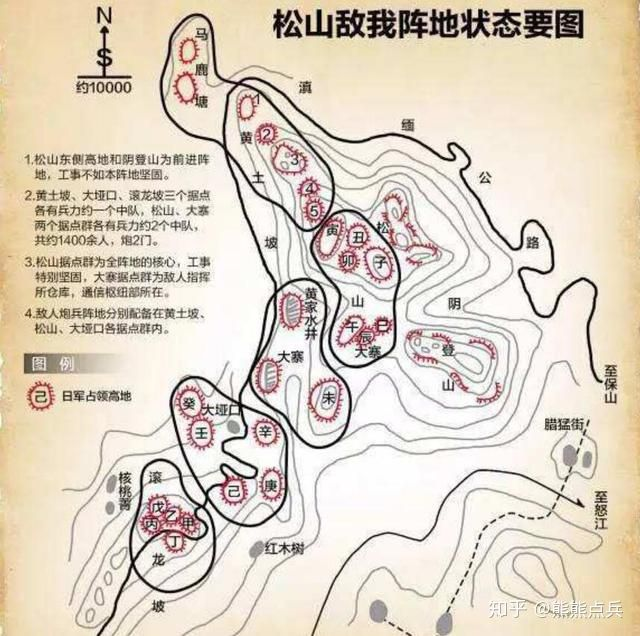

## 中国

中国历史上人口的大起大落，可以说是其它民族都不曾出现过的

* 西汉末年6000万人口，一个“王莽篡汉”就把人口打回到了2100万
* 东汉末年发展到了5600万人口，一次“滚滚长江东逝水”就把人口打回到了760万
* 盛唐人口最高峰5300万，第二年“渔阳鼙鼓动地来”，中国人口剧减70%……
* 元代之前，中国每次朝代更替，都意味着一半以上的人要去见阎王。在整个人类历史上，华夏文明自相残杀的效率与数量值，都是冠绝全球，绝无任何敌手的。

## 三国

* 袁绍：不能任人唯亲、优柔寡断

### 曹魏

* 曹操
    * 荀彧
    * 郭嘉
* 司马懿慢慢攫取曹魏大权
* 司马师勘定内乱稳定统治
* 司马昭灭蜀杀曹

## 西晋


* 266年司马炎篡魏，建国号为晋，定都洛阳，史称西晋，280年灭吴，完成统一。
* 司马衷
* 贾南风
* 司马伦
    - 斩杀贾南风
    - 称帝
* 八王之乱
    - 第三阶段：双方交战仅仅六十余天，损失兵力高达十余万人
        + 齐王司马冏（司马昭次子司马攸的儿子）不满司马伦的封赐，联合成都王司马颖（司马炎的十六子）、河间王司马颙（yong）（司马懿三弟司马孚的孙子 叔辈）公开反叛，三王控制的地方都是要冲，分别是许昌、邺城和长安
        + 司马伦此时手握禁军重兵，实力明显领先。战役刚开始，司马伦部接连获胜，但司马伦却整日担惊受怕如惊弓之鸟，天天干的尽是又是去祖庙烧香又是跳大神又是让人在山上装神弄鬼，而他的手下也都畏敌如虎无心恋战，结果在颖水之战中，手下两员大将在实力完全占优的情况下，与司马冏轻兵接触，便迅速溃败。一时间，军心大乱，人人自危，而本不占优势的司马冏抓住机会纵兵攻击敌军各部，全部击破，河北大败。
        + 一名名叫王舆的将军突然反叛，率领该营七百多士兵从南掖门直攻孙秀，将其捕杀，随后他又率军尽数捕杀司马伦同党，一夜之间，司马伦沦为孤家寡人。王舆控制了司马伦后，让他颁布诏令说：我为孙秀等所误，以怒三王，今已诛秀，其迎太上复位，我归老于农田。王舆遂派兵士将司马衷从金墉城迎归，沿途百姓高喊万岁，而司马伦和几个儿子被囚金墉城。
        + 最终司马伦被赐金箔酒，落得跟贾南风一个下场。临死的时候，司马伦羞愧难当，以衣巾遮面，连声说：孙秀误我，孙秀误我。
        + 司马冏独揽大权后，也开始居高自傲，不可一世，沉溺酒色，重用亲信，俨然第二个司马伦。他没有立已故太子司马遹的儿子们为太子，而是选了一个并非直系的宗室幼子。让因为地理位置原因姗姗来迟，没能抢得头功的司马颖和司马颙有了再次起兵的借口。为了给自己壮胆，制造声势，号称率军十万，并与成都王司马颖、长沙王司马乂一起共赴洛阳。
        + 看到长沙王司马乂正在长安，而且实力最弱，于是本着实在捡软的捏的态度，司马冏决定先打司马乂（司马炎第六子）。公元302年，司马冏率先对看上去最弱的司马乂出手了，此时的司马乂身边只有一百多人，但正是他改变了整个战局。
        + 面对来势汹汹的敌人，司马乂避其锋芒，反而将进宫做的车子的帷幔全部砍断，然后率人乘车打马飞驰入宫，刹那间，马嘶车疾，仿佛一头猛虎，不可阻挡。到达皇后，司马乂以不及掩耳之势控制各座宫门，挟持皇帝司马衷与司马冏对峙。
            * 第一件事是司马乂率军放火焚烧皇宫内外的部分城门和观阁，同时攻打司马冏府。
            * 司马冏命人将皇宫的驺虞幡(上面印着驺虞这种神兽，用以传旨解兵)偷来，拿着它在城下大喊：长沙王伪造诏命。司马乂则挟持皇帝回应：大司马谋反，凡是帮他的诛灭五族。是夜，洛阳城中大战，箭矢如雨，火光冲天，皇帝司马衷被人架到东门城楼做稻草人，火箭群集
        + 第二天，司马冏兵败，被押送到宫殿之上，前夜被吓得不轻的司马衷本来想饶这个救命恩人一命，但被司马乂阻止，随即被拉出宫殿，途中，司马冏再三回望皇帝司马衷，欲说还休。最后生擒贾南风，平灭司马伦的司马冏被斩首，首级示众六军，暴尸三天无人敢收，其党羽属官两千多人被灭三族。司马冏死后他的叔公，也就是司马懿与张春华生的第三个儿子司马干流泪感叹道：宗室日衰，就这小子最有能力，如今他死了，我司马家算玩完了。这种话挺不像是从一个神经病和恋尸癖嘴里说出来的，而也正因为司马干有这两个毛病，没人认为他是威胁，所以他在司马懿的众多儿子里活的最久，八十岁才寿终正寝，比老爹还多活了七年。
        + 司马乂不仅对皇帝司马衷礼遇有加，同时对颙颖二王表现出了积极的合作姿态，他一方面邀请二王同时来洛阳协商政事，一方面又将朝政诸事事无巨细的跟自己的弟弟司马颖汇报。
        + 司马颙坐立不安，于是他派三个亲信地方官密谋策划诛杀司马乂，结果此事被一个叫皇甫商的官员告诉了司马乂，三人遂被诛杀。阴谋败露，司马颙图穷匕见，派都督张方率兵七万以讨伐皇甫商的名义逼近洛阳。司马颖随即率军跟张方汇合，一同进军，此时两王的军力高达二十万，兵锋直指司马乂。司马颖军中打前锋的都督名叫陆机，此人为晋朝文人领袖文才了得，打仗也不错，而他的爷爷叫陆逊。
        + 八王之乱中的最后一个王粉墨登场了。司马越，封东海王，时任司空。他是司马懿四弟司马馗的孙子，从血缘上说，跟司马颙一样，都算是远枝了。于是与部将密谋勾结发动政变，逼迫人偶娃娃皇帝司马衷下诏免去司马乂全部职务，并囚禁老地方金墉城。
        + 为了不生枝节，决定尽快杀掉司马乂。随后他派人暗通城外的敌军都督张方，张方遂率三千兵马前往金墉城逮捕了司马乂，后活活将其烧死，司马乂大声喊冤，直至气绝，死时年仅28岁。
        + 司马颙终于得到了梦寐以求的权力，司马颖被封为皇太弟，成为皇位接班人，司马越被封为丞相
        + 司马颖当上接班人后随即派军五万驻守洛阳十二城门，并对禁军进行大清洗，凡是看不惯的军官统统被杀掉。后又听信谗言，杀当时文人领袖、陆逊之孙陆机兄弟父子，致使与士人离心离德。
        + 司马越觉得机会来了，于是挟持司马衷，传檄天下，召兵勤王，不久即得兵马十几万。司马越觉得司马颖必败，于是轻敌疾行，结果在荡阴被司马颖部下大将石超率轻骑突袭，大败。此战，皇帝司马衷身中三箭，伤及面颊，玉玺丢失，被劫至石超营中。
        + 司马越兵败后逃回封地东海（今山东郯城），不久后，他的弟弟并州刺史司马腾接力继续讨伐司马颖，这次司马腾开始召集北方少数民族乌丸、羯族等势力，司马颖麾下大将石超等人率军抵抗，但最终被能征善战的羯族打败。
        + 司马颖也预感大事不妙，于是率军挟持皇帝司马衷连夜逃到洛阳，一路上可谓穷困之极，堂堂晋国皇帝吃的粗饭，而且吃饭连碗都没有，只能用瓦盆凑合，此时的他应该不会再问老百姓既然吃不上饭，为什么不吃肉的蠢话了。司马颖一行人狼狈逃到洛阳后，被此时洛阳的实际统治者为司马颙麾下的将军张方控制，张方顺势将司马衷劫持到自己军营中，而后他纵兵烧杀抢掠，搞得洛阳城破败不堪。最后张方怕敌军攻打洛阳，于是挟持司马衷司马颖及一干宗室大臣西逃长安。
        + 司马颙见司马颖已经江河日下没有了利用价值，遂废其皇太弟之位，令其返回封地，另立司马炎的第二十五子司马炽为皇太弟。同时，他力邀司马越回朝共同辅政，但被拒绝。
        + 公元305年，司马越再度以张方擅自劫迁车架，天下怨愤，欲奉迎大驾，还复旧都洛阳的名义起兵。起兵后，司马越向司马颙提出只要送帝还都，两人便可分陕地分治，司马颙欲从，但被拥兵自重的张方拒绝。
        + 双方大战几月，司马越艰难取胜，但他打出的送帝还都的口号还是还有煽动性，结果投奔者络绎不绝，实力越来越强。见此，司马颙惶惶不可终日，只得派人暗杀张方并求和，但被已经声势日隆的司马越拒绝。不久后，司马越攻破潼关，直逼长安，司马颙仓惶出逃，逃进太白山里
        + 响应司马颙起兵的司马颖则被司马越部将王浚在河桥打败，司马颖仓惶败逃，一路死伤惨重。后在朝廷追捕下， 司马颖慌乱中抛弃母亲妻子，单独与两个儿子逃回朝歌，欲投奔邺城旧将公师藩，在到达顿丘县城后，被当地太守抓获，随后被扭送到邺城范阳王司马虓处囚禁。后司马虓暴毙，邺城长史考虑到司马颖在邺城素有声望，担心其东山再起，于是矫诏派人缢死司马颖，他的两个儿子也同时被杀。
        + 司马越进驻长安后，派军护送皇帝司马衷返还洛阳，同时正式掌握大权。他命大将梁柳镇守关中，但不久后梁柳被部将马瞻所杀，马瞻到山里请出司马颙主政。后司马越派部将发兵征讨司马颙，包围长安，司马颙困守孤城，惶惶如惊弓之鸟。
        + 公元307年冬天，当了那么多年皇帝的司马衷暴毙，死后谥号“惠”。二十五弟司马炽继位，史称晋怀帝。怀帝继位后，就下诏命困守长安的司马颙出任司徒，司马颙奉诏赴任，结果在新安雍谷被司马越的弟弟司马模杀死，其三个儿子也被杀。
    - 司马腾纠集少数民族乌丸和羯攻打司马颖的那场大战，开启了新的潘多拉盒子
        + 羯族，为匈奴族分支，之前一直为匈奴贵族的奴隶部队，后匈奴势率，羯族开始强盛。这一年，司马颖部队阵中有一位名不见经传的羯族年轻人（石勒），此时他正在公师藩手下效力。而此战打的胶着的时候，司马颖阵中一位匈奴将领（刘渊），趁机劝说司马颖放自己回匈奴以召集部族前来助战，司马颖听后大喜，遂放行此人回匈奴。
        + 刘渊脱离司马颖跑回匈奴后，便立即称王，并率先攻打驻守并州的司马腾部，战争在即，并州又起饥荒，司马腾无奈之下，只好把并州两万多户百姓、破落贵族、将士等等全部东迁往山东乞食。这两万多百姓拖家带口，一面要犯乞讨，一面又要保护家人不被袭扰，随即在司马腾手下大将田禋、李恽、薄盛等人的带领下自发组织起武装，这就是乞活军的由来。他们忙时结堡自保，耕种稼织，闲时依附各方军阀，为其做雇佣军，赚取军饷。
* 司马越
    - 以礼部侍郎周穆与司马越妹夫司马玫为代表，两人力劝司马越废掉看上去日渐长大又有才能的司马炽，改立司马炎子孙清河王司马覃，这样可以挟幼主而令天下，面对党羽的提议，司马越严词拒绝，然后为了维护司马炽的权威，居然杀了二人，因为两人为世家，又不愿诛杀其亲族，于是又上表废除了夷三族的法令。
    - 日渐长大的司马炽开始亲政，并诸多意见与司马越不合，司马越意识到这个问题后大为火光，以退回封地相逼，晋怀帝司马炽不同意，最后采取了折中方案，司马越出镇许昌。
    - 司马越率军讨伐在河北作乱的汲桑，打败汲桑后，遂封作战有功的晋末名将苟晞为抚远将军，并都青州、兖州军事。结果奖励命令刚下发，司马越意识到兖州的位置重要想自己统领，于是马上又下发了撤销的指令。这样一闹，让苟晞大怒，自此两人成为不共戴天的死敌。
    - 又对当初差点当上皇帝的素有人望才能卓越的司马覃下手，他随便找了个理由，矫诏将司马覃囚禁于老地方金墉城，次年将其杀害。
    - 公元308年，司马越又率军平定河北河南地区的乞活军，收复其部。
    - 回到洛阳，继续浪。因为位高权重，司马越疑心渐重，随即冤杀大臣王延等，随后，又脑子发热做出了罢免有爵位的宿卫的决定，结果手一抖，把打击范围扩大化，顺便把所有有爵位的将领全部一锅端，全去其爵位。
    - 永嘉四年，即公元310年，司马越决定征讨逐渐做大的石勒，留世子司马毗，部将李恽、何伦等留驻京师，监视朝廷。而他自己则传檄四方，召天下兵马勤王，想要复制几年前传檄天下勤王的盛景，但时移世易，今时不同往日，响应者寥寥。
    - 看到司马越不得人心，他的仇人苟晞抓住机会暗中上表晋怀帝历数司马越的种种倒行逆施罪行，司马炽一看，决定来一招借刀杀人，于是下诏命苟晞为大将军讨伐司马越。看到诏令，再加上前线的军情，内忧外患，司马越急火攻心，暴毙于项城。
    - 司马越死后，太尉王衍秘不发丧，带着司马越的棺材连夜逃亡东海国，结果石勒率军穷追不舍，最终双方在河南宁平城相遇，司马越大军惨败，石勒遂率骑兵围困溃败的晋朝将士，待对方疲敝后，石勒命令部下用弓箭射杀，十万晋朝将士、士人、官员、百姓全部惨死。而太尉王衍更是被石勒活埋。破棺焚尸，并指着司马越烧焦的尸体说：乱天下者此人也，吾为天下报之。
    - 在洛阳的司马毗、李恽等仓皇出逃，又被石勒打败，司马毗及宗室三十六王悉数被石勒杀害。司马诸王基本被石勒杀光了，石勒也有了一个光荣的称号司马杀手。
    - 拼命拉拢有实力的人才
        - 第一个被他看上的就是挨着东海国的琅琊王司马睿。司马睿是司马懿五子司马伷（是不是要念you）的孙子，世袭琅琊王。
        - 琅琊本地的一个大世族王氏，而此时王氏的代表就是官至太尉，后被石勒活埋的王衍。（王羲之 王阳明）
            + 王衍只推崇三个人，他在评判天下俊才时曾说：阿平第一，子嵩第二，处仲第三。
                * 阿平就是他的弟弟王澄的小字，王澄这个人是个清谈家加行为艺术爱好者，非常喜欢裸奔，对于裸奔行为，王衍认为自己不及弟弟洒脱，并称赞他裸奔的行为是落落穆穆然的大境界。
                * 子嵩是司马越谋士庾敳（ai）的字，这哥们身爱肥胖，喜好清谈，非常崇拜阮籍，经常在自己办公的地方摆满美酒，从早喝到晚，后来他与欣赏他的王衍一起被石勒虐杀。
                * 很幽默的是，王衍这看人眼光确实比较着急，他相中的三个人一人与他共死，一人被另一人直接杀了
        - 王衍为保存王氏血脉，同时为加强对江东的控制，遂建议司马越让司马睿南下管理江东军政，于是司马睿与王氏子弟齐齐南下，成为晋朝硕果仅存的种子。
        - 东海王司马越当政后期，心腹大臣王衍建议让琅琊王司马睿移居南方，以稳定南方局，势随即采纳。渡江南下的司马氏族不止琅琊王司马睿（司马懿的孙子），除了他还有四位王爷分别是西阳王司马羕、南顿王司马宗、汝南王司马佑、彭城王司马纮。
* 五胡乱华（匈奴鲜卑羯氐羌）
    - 东汉初立，光武帝刘秀为了发展生产，于是将大量北方边境的少数民族内迁，而少数民族自然非常乐意，经东汉一朝，三国大乱，到晋朝时，边境地区如关中、凉州的外族人口已占总人口的一半以上。但由于当时中央政府强有力的控制，外族与汉族并无太过隔阂，双方和平相处，百姓安居乐业，但一旦到了乱世，数量如此庞大的外族自然会成为一颗破坏力巨大的定时炸弹。
    * 304年氐族首领李特率先反西晋，后其子李雄攻占成都，建立成汉政权。李雄经营巴蜀之地长达三十年，期间成汉实力雄厚，成为一方霸主
    * 前赵
* 永嘉之祸:刘聪即位后仅仅三个月，野心勃勃的刘聪急不可耐的派出前赵全部家底，以石勒为首领会师大阳进攻洛阳，刹那间，夺取数百壁垒。第二年，刘聪又派军进攻洛阳，前赵军进至河南时，已经十二连捷，后石勒又率主力军队到达后，强攻洛阳城，不久之后，洛阳城破，前赵军纵并为祸，大杀官员宗室，并俘获晋怀帝与皇后，史称永嘉之乱。
    + 派父亲刘渊的养子刘曜攻取关中，最终刘曜趁胜势攻占长安并杀死司马越的令一个弟弟司马模。但不久后，刘曜被晋军反击，长安失守。而晋怀帝被俘虏后，被迁往平阳（今山西临汾），期间他被刘聪屡次羞辱，不久后他与数十名晋朝大臣一同被杀。
    + 皇太子司马邺即位为帝，史称晋愍帝.晋朝最后的防线和希望就剩下长安，于是拼死抵抗，双方展开了激烈的拉锯战，这一仗，陆陆续续打了四年。
    + 公元316年，刘曜卷土重来，进逼长安，也许是抵抗太久失去了精神，也许是晋军被前赵军队打的丧失了信心，总之这一次，刘曜长驱直入攻取长安外城，随即对晋愍帝所在的小城展开保卫。在死守了两个月后，长安小城弹尽粮绝，晋愍帝决定出降。
    + 公元318年四月，晋愍帝被刘聪杀死，消息传到江东，早已在江东耕耘多年的司马睿正式称帝，建元太兴
* 凉州 武威是西晋迁移
* 家族
    - 琅琊王氏
    - 陈留谢氏
    - 谯郡桓氏
    - 弘农杨氏
        + 始祖杨震是汉太尉
        + 东汉末年曹操当政时代，杨氏又出了一个太尉杨彪，杨彪则有个大名鼎鼎的儿子叫杨修杨德祖
        + 杨震的九代孙叫杨元寿，在北魏做过武川镇司马

## 前赵

 * 刘渊
    + 匈奴人，西汉时匈奴部首领冒顿单于的后裔。白登之围后，刘邦忌惮匈奴实力，遂采取和亲政策，并与冒顿单于结为兄弟，所以此后，冒顿单于的后代都以刘氏为姓。三国时期，匈奴部首领名叫于夫罗，他趁董卓作乱之时，趁机劫掠太原、河东地区，于夫罗死后，其弟呼厨泉继位，随后归附曹操。呼厨泉手下的左贤王为于夫罗的儿子刘豹，而刘豹就是刘渊的父亲。
    + 最喜欢的两本书是《左传》与《孙吴兵法》，少年时，他读书就发出了以下感慨：吾每观书传，常鄙随陆（随何、陆贾）无武，降灌（周勃、灌婴）无文，道由人弘，一物之不知者，君子之耻也。二生遇高皇而不能建封侯之业，两公属太宗（汉文帝）而不能开痒序（教化意）之美，惜哉。
    + 曹魏后期，刘渊入中原为质子，受到司马昭的厚待。西晋初年，许多名士又跟司马炎隆重推荐他，司马炎见了刘渊后，大惊失色，对朝臣说：这小子的容貌仪表，就算春秋时的由余（春秋时秦穆公的重要谋臣，帮其成就霸业，由姓与余姓共同的始祖）、西汉的金日磾都比不上他。朝臣回答说，由余、金日磾不仅容貌仪表无法与刘渊相比，才能更在其之下，建议重用此人。司马炎本来答应了，结果遭到其他大臣反对，他们的理由是，刘渊此人才能卓著，能力越强破坏力越大，再说他是匈奴人，非我族类其心必异，若重用此人，后果不堪设想。司马炎听后，默然不语。
    + 公元279年,父亲刘豹去世，司马炎于是命其统领父亲匈奴部众.又十年后，刘豹久等的机会终于来了，司马炎任命其为北部都尉，在任期间，法纪严明，乐善好施，大获人心，很多地方才俊前来投奔。后来，司马炎去世，外戚杨骏主政，刘渊由于政绩卓著更进一步，晋升为建威将军，五部大都督，封爵光乡候。不久后，成都王司马颖驻守邺城，推荐刘渊为宁朔将军，监五部军事，刘渊从此开始依附司马颖。
    + 在打完同司马腾的战役后，刘渊向司马颖说：现在司马腾手下的人骄横残暴人数众多，我正式请求回匈奴召集五部部众，然后带他们回来共解主公危难。
    + 回到匈奴左国城，二十日聚众五万，定都离石（今山西离石），追尊刘禅为孝怀皇帝（好神奇），国号汉，史称前赵。
    + 司马腾又先后四次攻打刘渊，均以失败告终，胜利后，刘渊部属建议，起兵已一年，一直偏居一隅，威名不震，眼下可以四处出击，大胆征伐，先平定河东，再攻取长安，此后席卷洛阳，大事可成。这也是当年汉高祖消灭强楚的策略。刘渊大喜，采用此战略，一路攻城略地，沿途望风归附，而最让他高兴的是鲜卑部、氐族等个外族部落的归附，而在这里面，有两个人至关重要，他们的名字分别叫汲桑和石勒。
    + 归附刘渊后，石勒逐渐成为前赵的名将，期间战功卓著，破邺城，击败乞活军，攻取数百郡县并网罗诸多人才，降众多达几十万。但这累累战功背后，是华夏民族的痛苦记忆，在行军期间，石勒带领的胡人部队从不带军粮，他们每攻破一城，不仅大肆破坏和掠夺财富，还专门掳掠汉族女子，奸淫一番后将她们作为军粮宰杀烹食，对这些人，胡人有个专门的叫法“双脚羊”。
+ 刘聪
    * 公元310年八月，刘渊病死，长子刘和继位。刘和继位后，学起了西汉景帝削藩的那一套，而首当其冲的正是拥兵十万的弟弟刘聪。但聪明决定的刘聪在得知风声后，决定先下手，率军进攻皇宫，杀死刘和，继位登基。
    + 西晋灭亡后，文武双全的刘聪仿佛完成了自己的历史使命，将国事交给儿子刘粲宠幸宦官，开始了纵情享乐的生涯，他的代表作就是封喜爱的妃嫔为皇后和左右皇后，史称三后并立.公元318年，玩乐怠政两年后，刘聪去世。他的“兄弟”攻破长安的刘曜继位。
        * 太子刘粲继位，不久后即被外戚靳准所杀，石勒一看，这种大好的机会怎么能不把握住呢，于是派兵讨伐靳准.刘曜北上继位，而平叛有功的石勒被晋封为大将军、大司马、加九锡
        * 平定靳准的战争继续，石勒进攻前赵首都平阳，降服十几万各族部落，十一月，穷途末路的靳准派使者向石勒请降，但石勒却跟刘曜说平阳无归附之意。十二月靳准被部将所杀，并向刘曜请降，石勒见叛军不向自己投降，大怒，派兵继续进攻平阳，刘曜此时却派军迎接降军出城。石勒攻破平阳后，烧杀抢掠，焚烧前赵宫室，并将国之重器拿到了自己的基地襄城。
- 刘曜继位后不到一个月，便开始大举练兵，准备讨伐此时兵权愈来愈大，似有不臣之心的石勒。
    + 329年，留守长安的前赵太子刘熙得知父亲被擒后惊慌失措，竟然放弃长安而西奔上邽（今甘肃天水），看着太子逃奔，关中诸镇全部弃城逃跑，于是关中大乱。石勒再接再厉，命石虎肃清关中前赵残余力量。当年八月，刘曜的另一个儿子刘胤率仅有的前赵大军反攻长安时被石虎击败，至此前赵一众王公大臣皆为石虎所擒，同年石勒杀刘曜，前赵灭亡，国祚仅25年。

### 拓跋鲜卑

* 从字义上看，这是鲜卑族一支，跟慕容鲜卑、宇文鲜卑一样，拓跋氏兴起于大兴安岭北部，统幽都之北，广漠之野，畜牧迁徙，射猎为业。而拓跋来源于北人谓土为拓，后为跋的表述，拓跋氏其实就是土地的意思。
* 汉朝时期，拓跋进行迁徙，与留居故地的匈奴部融合，后又从塞北迁徙河西，与曹魏、西晋采取友好政策，迅速发展。
* 公元三世纪初，拓跋部归附前赵，因公受赏，势力急速发展，
* 312年拓跋部击败江河日下的前赵皇帝刘聪之子刘粲，并于次年建国，成为河西一支劲旅。

## 后赵（胡族）

+ 石勒
    + 原名叫㔨（bei），为匈奴分支羯族部落的后裔，之前说了，羯族非常特殊，为为数不多的白种人游牧部落，有趣的是，据验证，羯胡在古希伯莱语是犹太的意思。长大后，壮健有胆力，雄武好骑射，他的父亲周曷朱是当时羯族的投头目，凶狠残暴，族人多不敢亲近，于是周曷朱就委派石勒代为管理族群，结果广受欢迎。
    + 八王之乱期间，并州发生大饥荒，石勒同一起做佃客的族人失散，只得去投奔朋友，结果差点被晋军将领拉出去卖掉，逃亡途中，石勒恰巧遇到朋友郭敬，恩郭敬，没有明。石勒此时心生一计，决定趁乱将前往冀州乞讨的胡人捕捉卖掉。搞笑的是，还没实施计划，年仅二十多岁的他就被司马腾的军队抓了，随后被卖给富户做奴隶，结果，富户震惊于他的异常相貌，竟然免除了他的奴隶身份。
    + 做奴隶的这段时间里，他结识了一个牧马人首领又称牧帅，这个牧帅的名字叫汲桑。两位草莽枭雄一见如故，成为挚友，而汲桑给这个原本叫㔨的人，取了一个新的名字——石勒。
    + 公元304年，司马颖失势，在被天下讨伐的过程中，他的部将公师藩聚众起兵，石勒汲桑率数百牧马人投奔了他。集合部众后，公师藩率军晋中邺城的司马模（司马越的另一个弟弟），在战役中，公师藩被击杀，他的部众随即被汲桑石勒收服，从此汲桑自立为大将军，石勒做先锋大将，屡战屡胜，最终攻陷邺城，搞了很多事情的司马腾被杀。但好景不长，司马越见两人势大，随即派大军围剿，在经过几十次的战斗中，两人大败，汲桑被杀，石勒逃窜。
    + 石勒在走投无路之下，只得投奔已经成形的胡族政权——前赵
    + 公元311年，石勒率军进攻襄阳，短时间内破襄城，克宛城，后又攻陷长江以西三十余所壁垒，军势盛大。在节节胜利之时，石勒临足长江岸边，踌躇满志，流露出雄踞长江与汗水，与前赵分居的想法。但他身边最重要的谋士张宾，认为时机未到，劝他还是要北归，以图霸业。恰逢军中缺粮，瘟疫横行，士卒死伤大半，而琅琊王司马睿又派王导率军进攻，无奈之下，石勒只得裹粮卷甲，回师北返。
    + 返回北方后，石勒与前赵大将曾是农民义军首领的王弥交恶，王弥联合义军出身的曹嶷和另一个投降的晋朝大将苟晞一同做掉石勒，但被石勒及谋士张宾识破，在张宾的建议下，石勒斩杀曹嶷，后摆出鸿门宴击杀王弥，后又斩杀晋朝将星苟晞，后全部吞并三人部众，势力更加壮大。
    + 公元313年，石勒的侄子攻破邺城，满城归附，青州亦望风归降，至此，山东地区尽数为石勒所有，眼见石勒大军如此厉害，一直支持王浚的另一外族乌桓也暗中投降，王浚此时已经四面楚歌。
    + 公元314年，石勒率军大摇大摆的来到了幽州治所蓟县（今天津），先是以送礼物为由驱赶数千头牛羊进城，阻塞道路，后纵兵抢劫。石勒见到王浚后，撕下了假面，先是与王浚妻同坐以示不敬，后直接历数王浚罪状，当场将其捉拿，后扭送王浚到襄国斩首，尽杀其手下数万精兵。
    + 公元316年，石勒率兵在玷城围困晋乐平（今山西昔阳）太守韩据，韩被迫向并州刺史，驻守晋阳（不用说哪里了吧）的刘琨求援。刘琨前不久刚平了一个小国内乱得了一大批兵马，于是觉得自己可以跟石勒掰掰手腕，于是不顾属下劝阻，带着全部家底跟石勒死磕。石勒这种级别的将领见刘琨军队浩荡开来，并不畏惧，而是毒辣的看到了他们的两个问题，一是远道而来疲敝不堪，而是乌合之众号令不齐。城下乌央乌央的几万大军，在石勒眼里就是一盘手抓羊肉，于是设下伏兵，纵兵迎击。
        * 刘琨和那个大耳朵长臂猿刘备有着同样的先祖，那就是他们都是西汉中山靖王刘胜之后
        * 还是著名的文学家，也是西晋大名鼎鼎的“金谷二十四友”成员之一，这个“金谷二十四友”的发起人是妖后贾南风的侄子也是当时的权臣贾谧，贾谧是个酒囊饭袋，但他却喜欢结交文人附庸风雅，而他出名的“朋友”确实不少，这些人也就是“金谷二十四友”的核心成员了。二十四友成员可谓阵容豪华，除了刘琨外，还有大帅哥潘安，让洛阳纸贵的左思，号称东南之宝的陆逊之孙陆机、陆云兄弟，最后一个就是牛叉轰轰敢跟皇帝舅舅王恺斗富的首富石崇和他的外甥大才子欧阳健
        * 还有个好兄弟，两人当年担任司州主簿时，感情深厚，经常同被而眠。有一次他的好兄弟听见半夜鸡叫，确定不是什么地主周扒皮玩的把戏，而异常振奋，他推醒刘琨说：此非恶声，而是上天为了激励我们上进啊。于是两人半夜起来，舞剑练舞，这个典故就是大名鼎鼎的闻鸡起舞。而刘琨这个好兄弟，就是不久后，将把大魔王石勒打的一筹莫展的大英雄——祖逖（ti）
    + 公元319年，因为石勒毁坏国都平阳的事情让刘曜大为不满，再加上身边属臣进言石勒必反，于是刘曜把之前封石勒的官职、封号一下子停了下来，还杀了一个石勒的臣下。听到此消息后，石勒盛怒，随后说：老子侍奉刘氏，尽心尽力，他们的基业都是我打下来的，现在得志了居然要谋算我，王候皇帝老子自己就可以册封自己，哪轮得着他们。于是，在319年十一月，石勒在襄国自称赵王，正式跟前赵决裂，史称后赵。
    + 公元321年，祖逖死后，石勒趁势占领河南全境，三年后，他便挥鞭西进，他的目标正是江河日下的前赵。
    + 公元324年，后赵军队击杀前赵河南太守，并掠夺新安县五千多人口，以此为开端，前后两赵正式兵戎相见，而作为两国交接的河东和弘农两郡成为主战场。
    + 第二年，后赵中郎将王腾杀并州刺史以并州归附前赵，而晋司州刺史李矩、颍川太守郭默也相继归附，恢复元气的前赵随即大举进攻后赵。但石勒的侄子悍将石虎阻挡住了对方猛烈的进攻，接连击败王腾等人，坑杀近万士兵，司、司、豫、徐、兖四州之地尽归后赵所有。
    + 328年，石虎攻击蒲阪，前赵皇帝刘曜举全国精兵救援大败石虎，随后乘势进攻石勒从子（既族兄弟之子）石生镇守的洛阳，前赵军以水灌城，同时又派诸将攻打汲郡和河内，后赵举国震惊。石勒得此消息，不顾劝阻亲自救援洛阳，并命桃豹、石聪、石堪等到荥阳会合，自己领兵直攻洛阳金镛城。及至十二月，石勒与后赵诸军于成皋会合，见后赵不设守军，于是轻兵潜行。刘曜直至石勒大军渡过黄河后才开始防御，从前线得知石勒举全国之兵进犯后更为惶恐，于是自洛阳西侧列阵。石勒在进攻洛阳时就曾下断言：刘曜设大军于成皋关防御，是上策；列兵于洛水阻截则次之；坐守洛阳，就会让我生擒了。结果，果不出石勒所料，石勒随后与石虎、石堪、石聪分三道夹击前赵，大败之，生擒刘曜。
    + 公元330年九月，石勒正式称帝，后赵达到巅峰。
    + 石勒称帝后，于次年四月营建邺城（河北临漳、河南安阳部分），准备将其定为新的都城。而称帝时他也立儿子石弘为太子，但石弘温和怯懦，完全没有父亲的强悍，所以石勒也对这个新太子的未来头疼不已。而此时他的许多近臣都认为石虎手握军权，是个极不安定因素，力主石勒尽快杀掉石虎，以绝后患，但石勒最终都没有采纳这个建议。
    + 到达人生巅峰三年后，即公元332年七月，五胡乱华史上的头等杀星石勒去世。那个曾经倚洛阳东门长啸不止的少年，那个曾经沦为奴隶的低贱胡人，在因缘际会下创造了自己的功业，由于手段血腥残忍，他实在称不上英雄，但枭雄的称号应该是恰如其分。
    + 石勒生前在一次宴会上，酒酣耳热之余，问身边近臣：朕与古代君主比，能和谁匹敌啊。大臣回答说：陛下神武谋略高于汉高祖，雄才勇武比肩魏武，有史以来，黄帝第一，陛下第二。石勒听后大笑说：人应有自知之明，爱卿所言太过了。朕若逢高皇，当北面事之，与韩彭竞鞭争先尔。若遇光武，当并驱于中原，未知鹿死谁手。大丈夫行事当磊磊落落，如日月皎然，终不能如曹孟德、司马仲达父子，欺他孤儿寡妇，狐媚以取天下也。朕当在二刘（刘邦、刘秀）之间尔，轩辕岂所拟乎。
* 石虎
    - 石虎字季龙，跟石勒是本家，很小就被石勒的父亲抚养，而石勒起家后，勇猛的石虎更成为他的先锋悍将，可谓是为叔父石勒东征西讨、南征北战，立功无数，因为这些功绩再加上血缘关系，逐渐被石勒宠信。
    - 可在四处征战的年月里，石虎逐渐暴露出一个毛病，那就是残忍变态。
    - 318年，趁着平定前赵靳明内乱的时刻，他在粟邑逮捕靳氏一族，部分男女老幼，全部杀之。322年八月，石虎攻陷青州，坑杀降卒三万人。并想把青州部众尽数杀死，此时被派到青州当刺史的刘征说：朝廷让我来做官，为的是统治百姓。你把人都杀光了，没有人怎么统治？你慢慢杀把，我准备回去了！石虎一听，觉得有道理，于是只给新任刺史刘征留了男女七百多口。325年，石虎攻取石梁，坑杀降卒九千多人，随后攻取并州，坑杀七千多人。329年，在义渠大破前赵军队，生擒前赵太子刘熙及王宫贵族三千多人，全部杀之，随后又在洛阳坑杀屠各部（匈奴别部，大名鼎鼎的金日磾就是这个部的）五千多人
    - 他恶狠狠的对儿子石邃说：主上自建都襄国以来，端身拱手，坐享其成，靠着老子身当箭石，冲锋陷阵才能成就大业。二十多年来，老子在南方擒获刘岳，在北方赶跑索头，向东平定齐、鲁之地，向西平定秦州、雍州，攻克十三座州郡。成就大赵功业的是我，大单于的称号应当授予我，现今却给了奴婢所生的黄口小儿，想起来令人气愤，寝食难安！老子今天发誓，等到主上驾崩之后，不会再让他的后代活下去！
    - 石勒前脚刚刚去世，石虎后脚便劫持了太子石弘，随后将与自己的几个政敌大臣全部抓起来治罪，更让石邃带兵入宫，引得后赵官员四处逃奔。懦弱的石弘哪里见过这种阵势，当即被吓哭，并要让位于石虎。石虎看着哭哭啼啼的太子，心想自己勇武一世的叔父怎么生了个这么个窝囊废，不过他还是对石弘说：君王去世，太子继位，礼仪常规。结果听到石虎这句话，石弘哭的更厉害了，坚决不继位并说自己不合适做皇帝，石虎大怒，吼道：如果你不适合君位，天下人自会按大道理行事，现在就说不合适，有个鸟用！于是，在石虎的威逼之下，石弘继位，随即在八月封石虎为丞相、魏王、大单于、赐九锡，总领后赵军政大事。九月，石虎即杀太后刘氏，尊石弘的生母程氏为皇太后。
    - 十月，石勒两个养子正式造反。镇守关中的河东王石生、镇守洛阳的石朗先后起兵，石生自称秦州刺史，派使者向晋请降。与此同时，身处陇西的氐族统帅蒲洪自称雍州刺史，归附前凉君主张骏。
    - 闻讯战报，石虎让长子石邃留守襄国，自己则带兵七万率先经驻守金墉城的石朗，大破之，捕获石朗随即斩首。随后乘胜向长安进发，石生随即派将军郭权率鲜卑士兵两万人为前锋应敌，自己则统领大军随后出发，屯兵于蒲阪（今山西运城），石虎则派梁王石挺为前锋拒敌，双方军队在潼关相遇，结果后赵军大败，尸体枕藉三百多里，石挺阵亡。石虎被迫回军渑池，就在形势一片大好的节骨眼上，作为前锋的鲜卑族突然叛了，他们私下与石虎勾结，对石生反戈一击。石生看大势已去，心中惶恐，狼狈逃回长安，而前锋将领郭权只得聚拢残部退回渭水防守。石虎则卷土重来，率大军直逼长安，石生无奈，放弃长安，藏匿鸡头山（今甘肃庆阳），在胜负已分的情况下，石生被部将杀死，随即全军投降，郭权则逃奔陇右继续抵抗。
    - 调转兵锋攻打氐族蒲洪部，后赵大将麻秋陈兵陇上叫阵，摄于石虎的强大又鉴于石生败亡，蒲洪未战先降，率部族投降，被封为将军。
        - 蒲洪到达长安后，建议石虎迁徙关中豪强与氐、羌部族充实东方，石虎同意，随后迁秦州、雍州百姓及羌、氐胡族十万户到关东。蒲洪被任命为龙骧将军、流民都督，率数万部众迁居至枋头（今河南浚县），
        - 羌族首领姚弋仲被任命为奋武将军、西羌大都督，率部众迁居至清河滠头（今河北枣强县）。
    * 334年三月，石虎派后赵老将郭敖与彰武王石斌率步骑四万人进攻郭权，屯兵华阴（今陕西渭南）。一个月后，郭权被当地豪族所杀，石虎遂迁秦州三万多户迁徙到青州和并州。
    * 公元334年九月底，心灰意懒的石弘自己携带传国玉玺到魏宫，要求禅让君位给石虎，但石虎拒不答应。石弘回到皇宫，流泪不止的对太后程氏说，固然如石虎当年说的一样，我们这些先帝的骨肉真的不能再存活了。石弘终于悟透了石虎一直不接受禅让的原因，那就是皇位对于石虎来说，唾手可得，可他要的不是禅让，因为按历史例，禅让需要保全皇族，但石虎不想这样，他依然对石勒当年的分封耿耿于怀，他依然要履行自己当年的毒誓：主上驾崩后，后代一个不留！当年十一月，石虎派亲信入宫，宣布废黜石弘为海阳王，随即将石弘、太后程氏、秦王石宏、南阳王石恢幽禁，不久后将其悉数杀害。一代枭雄石勒，果真落了个后代全灭，断子绝孙的下场。
    * 公元334年十一月，石虎正式继位，自称居摄天王，史称后赵武王。
        * 太子石邃这个人比起石虎来完全不差，变态的程度甚至青出于蓝。石虎沉溺酒色变得喜怒无常，石邃有事禀报时，他会不满的说，这种小事，哪里值得禀报。后来听不到石邃的禀报，又不满的说，你以为你是谁，为什么不把政事禀报于我。说完后，便对石邃轻者叱骂，重者鞭打杖击，一月之中数次如此。本来我觉得石邃这种变态应该很喜欢这种感觉才对，没想到他也知道疼痛，心生不满，有了弑父夺权的想法。
        * 把石邃幽禁在东宫。不久后赦免其罪，在宫殿召见石邃，但石邃看到石虎并不谢罪，扭头便走，石虎大吼道，太子朝见，怎么可以说走就走。石邃不回头也不答应，径直出宫，石虎大怒，当夜杀石邃，诛杀太子宫臣门党二百多人，后便立次子石宣为太子。
    * 建造太武殿（后宫佳丽据说有万人），又在邺城营建四十多所台观，又营建洛阳长安东、西二宫，征发汉丁达四十余万。为自己的后宫掳掠了整整十万人
    * 对北方中原地区的汉人实施种族灭绝政策。从五胡乱华开始，到石虎统治的短短几十年里，中原汉人人口数量从两千多万人急剧减少到四五百万人
    * 338年，石虎接到了前燕王慕容皝称臣的请求，在称臣的同时，前燕还要求后赵能出兵攻打屡屡侵犯前燕的段部鲜卑首领段辽。在密云抓获段辽母亲妻子，并斩首鲜卑士兵三千余人。段辽只身逃脱，派儿子向石虎祈求归降，石虎接受。
    * 五月讨伐前燕。在昌黎（今河北东北部昌黎县）之战中，前燕拼死防守，后赵军大败，终于在十几日后退却。后又在棘城（大概在今辽宁省北票市）之战中再遭失败，慕容皝的儿子慕容恪乘机率二千骑兵追袭溃败的后赵军，大败之，斩获首级三万多人。但只有一位名不见经传的杂牌游击将军率领的军队毫发未损。这位杂牌将军当时的名字叫石闵
    * 347年，攻打前凉。石虎这次任命的先锋将军是麻秋，总之后赵能打仗的除了姓石的，就是桃豹、麻秋两个人，再加上经常做后援的符洪和姚弋仲了。一开始还是老步骤，后赵军进占顺利，前凉部将纷纷投降，然后就遇到了硬骨头，张重华此时只有17岁，但却少年老成，他不慌不忙派谢艾率步骑三万进军临河（今内蒙古自治区巴彦淖尔市）
        - 谢艾戴着白色羽帽，在自己的车上又是敲鼓又是摆POSE，一副仙风道骨的模样。部将张瑁率兵从小路截断了后赵军队的后路。在三千龙骧兵犹豫不前的时候，谢艾羽扇一挥，前凉主力齐齐进攻，撤退的时候又遭伏兵。后又攻打 结果两军前锋部队交战，后赵军又败，逃回黄河以南。八月，谢艾主动进攻麻秋，结果又把麻秋打的大败，后赵军队逃回金城（今甘肃兰州）。
        - 谢艾班师回朝，途中顺手平定了反叛后赵的斯骨真等一万多个部落，是的你没看错，是一万多个部落。
        - 张重华在七年后就英年早逝，而谢艾则被篡位的张祚杀死，前凉从此彻底凉了。
    * 石宣与石韬是一个比一个残暴，一个比一个缺心眼，一个比一个变态，总之就是谁也不把谁放眼里，谁都想置对方于死地，结果石宣快人一步，先杀了石韬，而杀人手法也是相当变态，剁掉四肢、刺烂双眼、开膛破肚...简直就是虐杀。
    * 仿照石宣杀石韬的手法。然后又在柴堆四周点火，浓烟烈焰冲天而起，石虎则跟随昭仪官以下数千人登上中台观看。大火活活把石宣烧成灰烬，火灭后，石虎又命人取出尸会分别放在通向各个城门的十字大路当中，挫骨扬灰。同时，石虎还杀掉了石宣的妻儿共九人和亲信三百多人，全部车裂肢解，抛尸漳水河中，石宣的小儿子刚刚几岁，石虎平素非常喜爱他，因此临杀前抱着小孙儿哭泣，意欲赦免，但大臣们却不同意，竟从石虎怀抱中抢过来杀掉了。当时小孙儿拽着爷爷的衣服大哭大闹，以至于连石虎的腰带都拽断了，但还是未能幸免。石宣居住的东宫被改作饲养猪牛的地方，东宫卫士万人全部被贬谪凉州。
    * 一年后，病重，恰逢被他贬谪到凉州的东宫卫士造反，接连攻取荥阳、陈留等郡，石虎遂命姚弋仲、符洪率部讨伐，两人平定叛乱，升任公位，实力大增。
    * 遂任命儿子石斌、石遵，大将张豺三人为辅臣，后石遵和张豺伙同太子石世生母刘皇后矫诏杀掉石斌，在鸡飞狗跳的乱象中，公元349年，石虎终于死了。
    * 石世继位，刚继位没多久，石虎九子石遵即举兵反叛，进攻邺城，一路势如破竹，而他部队的先锋正是石闵。一个月后，石遵进入邺城，捕杀张豺，胁迫刘皇后立自己为帝，不久后，杀石世与刘皇后。
    * 驻守蓟城的沛王石冲随即反叛，带精兵五万精锐进攻邺城，石遵大恐，遂派石闵率精兵十万迎击，在平棘（今河北赵县）之战中，后赵两支精锐部队捉对厮杀，石冲大败，自己被捉，随后处死，而石冲部的三万精锐均被石闵坑杀。
* 冉闵
    - 石闵，本姓冉，他的父亲叫冉良，家族世代担任牙门将（偏将，负责指挥防御）的官职，后投奔到乞活军账下，石勒当年击败乞活军，俘虏年仅12岁的冉良，后将其交与石虎做养子，并改名石瞻，从辈分上说石闵是石虎的孙辈。
    - 石闵从小聪明伶俐，很得石虎喜爱，成年后，身高八尺，骁勇善战，但毕竟不是石氏嫡系，所以只得了游击将军也就是杂牌将军的名号。但在338年后赵与前燕的昌黎之战中，在其他后赵军对均丢盔弃甲的时候，唯独石闵的军队毫发无损，此战过后，石闵横空出世，一战成名。
    - 在石遵造反前曾对石闵说，大侄子你要努力啊，此事若成，我让你做太子。结果石遵造反成功，称帝后却立石衍为太子，这让石闵颇为失望。而石遵也不傻，他看出了石闵的不忿，又对他的能力颇为忌惮，特别是石闵因功担任大都督后，总管内外兵权，大封将士，树立恩德。石遵另辟蹊径将石闵改为原姓冉，借此警告，你并不是我们石家的人，认清位置，老实点。后石遵又想干脆一不做二不休做掉冉闵，结果此举遭到石遵生母郑太后的反对，郑太后说，从我们回师京城开始，若无冉闵岂能有今日，他现在有点骄纵，但不可动辄杀他。
    - 这件事情被石遵的哥哥石虎的三子石鉴得知，然后迅速告知了冉闵，冉闵遂决定先下手为强，指挥部下率三十甲士在皇宫拘捕石遵，随后将其杀死。冉闵奉石鉴为帝，石鉴投桃报李，封冉闵为大将军、武德王。不过，刚刚继位的石鉴知道自己并无权力，遂暗中指示自己的四弟石苞、中书令李松、殿中将军张才等人暗杀冉闵，结果未能成功，引起一片混乱。石鉴知道事情败露，怕冉闵追查，遂连夜斩杀三人。
    - 龙骧将军孙伏都等人暗中集结三千羯兵也准备讨伐冉闵。孙伏都率三十余人想挟持石鉴而对冉闵发起进攻，当时正在中台的石鉴见孙伏都破坏阁道，询问原因。孙伏都说：冉闵、李农等人谋反，已经聚集在东掖门，我带领卫士，先告知你。石鉴说：你是功臣，好好为我效力。我从台上观望着你，无须考虑向我报告。于是孙伏都带领士众攻打冉闵和李农，未能获胜，只得驻兵凤阳门。冉闵则带数千士卒毁坏金明门入宫。
    - 石鉴再次怕事情败露于是主动打开城门迎接他，并说：孙伏都谋反，你应该立即讨伐他。于是冉闵击败孙伏都，整个邺城皇宫尸横遍野，击杀孙伏都后，冉闵发布命令，：夷凡敢动兵器者一律斩杀。
    - 冉闵此禁令一出，整个邺城的胡人噤若寒蝉，以为自己要遭受灭顶之灾，于是不顾朝廷戒严令，或攻破城门，或破墙而出，纷纷外逃。冉闵一看如此下去不是办法，于是派人软禁石鉴，并解除戒严令并大开城门，并传令：与官同心者留下，不同心者听任各自离开。逃亡在外的胡人一看，以为禁令解除，灾祸已过，于是纷纷回城。
    - 发杀胡令，中原汉人大为振奋，他们将压抑了多年的怨气全部释放出来，整个中原大地，瞬间变成了胡族的地狱。一天之内，数万胡人被杀，而冉闵也亲自带头率军诛杀羯族，不论贵贱，不分男女，不管老幼，一律斩杀，数月之内，二十万胡族血流成河，尸体遍野，全被野犬豺狼所吃。而集聚在中原四方的胡人，也被当地军队按照杀胡令屠杀，甚至有些长得高大鼻梁高毛发多的人也未能逃脱，全部被当胡人处置。
        + 立了后赵的羯族基本被灭族，其他迁居中原的胡族数量锐减
        + 本就尖锐的民族矛盾因为杀胡令便得不可调和，而当时的胡族实力领袖纷纷反击。
    * 公元350年，冉闵杀石鉴，又杀石虎孙三十八人，石氏家族基本全部被消灭。后，冉闵于邺城南称帝，国号魏，史称冉魏。
    * 身在襄国的石虎十一子石袛听说冉闵灭石氏，并屠戮羯族，于是在符洪和姚弋仲的支持下在襄国称帝。同年四月，派石虎八子石琨率军七万攻打邺城，六月，石琨到达邯郸，冉闵仅带千余起兵迎战，此战，冉闵手持两刃矛，飞驰进攻，对手应刃而败，石琨军死亡数万。
    * 十一月，冉闵率十万步骑围攻襄国，一直打到次年二月，石袛恐慌，只得去帝号，以王自称，但与此同时，他又派使者到前燕和姚弋仲处求援。此时前燕王为慕容皝次子慕容儁（jun)，慕容儁遂派将率三万甲兵自龙城出发，姚弋仲派其子姚襄率四万起兵自滆头出发，兵败的石琨则率三万兵马自冀州前来
    * 冉闵遂分兵逐一抵抗，但皆被打败，派去的兵马几乎全军覆没。冉闵只得集合全部将士出战，但在前燕、羌族、后赵的三面夹击中败下阵来，冉闵最后只与十余名骑兵逃脱。石袛反攻，搜捕冉闵部将，全部处死，襄国攻防战，冉闵损失兵力累计十余万，青、雍、幽、荆各州迁徙百姓及诸氐、羌、胡、蛮共数百余万人，为避战祸，在回归本土的路上互相劫掠残杀，加之饥饿、疾病等死亡甚众，真正能回到故乡的仅十之二三。此战后，中原一片混乱，无人农耕，饥荒严重，人人相食。
    * 眼见胜利在望，石袛遂派将领刘显率军七万攻打邺城，冉闵带全军出战，大败刘显，斩杀三万人。刘显大惧，派使者请降，并许诺冉闵将杀死石袛以作报效。冉闵撤军后，刘显回到襄国，果然发动兵变，杀死石袛及诸多大臣，石琨幸免于难只得带领妻儿投奔东晋，两年后全家被诛杀于健康。
    * 至此，公元352年，后赵彻底灭亡，从石勒襄国起家，到石袛襄国被灭，石氏三代灰飞烟灭。
    * 杀了石袛后，刘显突然腰杆硬了不少，居然再次率军进攻邺城，冉闵再次将其击败。刘显败退，返回襄国称了帝。几战下来，大量不满冉闵统治的文臣武将纷纷率部下南渡归附东晋，冉闵愈发势单力薄。
    * 刘显再次率军攻打常山，冉闵率八千骑兵驰援常山，大败刘显，一直追到襄国，刘显手下大将开城接应，冉闵诛杀刘显及大臣百人，焚烧襄国宫室，迁当地百姓到邺城。
    * 闵扶植石遵继位,冉闵仍然惦记着蒲洪，于是对石遵说：蒲洪，人杰也，今以洪镇关中，恐秦、雍之地非国家所有。面对冉闵的劝阻，石遵决定改变石虎的临终任命，解除了符洪的都督职务。听到消息后，蒲洪大怒，自行回到根据地枋头，立即叛赵降晋。
    * 352年四月，慕容儁率军攻占幽州、蓟州，实力版图已达冀州，冉闵率骑兵攻伐，与慕容恪在昌城不期而遇。
    * 一开始，冉闵与慕容恪交手十次，皆取得完胜，在洞察了冉闵的指挥特点后，慕容恪得出结论，冉闵军多步兵，经常引诱前燕骑兵至丛林作战，到了丛林，骑兵的优势无法施展，结果就成了待宰羔羊。于是慕容恪将燕军分成三部，自率中军，用索将战马连接起来，并选善射者五千人，列成方阵前行，另外两部放置中军两侧配合进击，两军交战时，先锋佯败诱敌于平地，冉闵果然中计，率军直冲燕军中军连环铁索阵，结果冉闵军刚刚接触中军，两部侧翼即从左右夹击，斩杀七千余人。冉闵左持双刃矛，右执钩戟，奋力突围，跃马冲破重围向东逃跑，走了二十余里，他的坐骑赤马朱龙突然暴毙，冉闵扬天长啸，被燕军追兵擒获。
    * 随后冉闵被扭送到蓟城，慕容儁问他：你这个奴仆下人，为何敢妄称天子。冉闵答道：天下大乱，你们夷狄之族，人面兽心，尚且意欲篡位谋反。我乃一世英雄，为何不能做帝王呢？慕容儁大怒，鞭打冉闵三百下，送至龙城（今辽宁朝阳），在一个叫遏陉山的地方将其斩杀。冉闵死后胡族争剖其尸，鲜卑将其遗骨遗弃荒野，不准下葬。
* 羌族首领姚弋仲驻扎在陇上(今陕北、甘肃以西的地方)

> 诸胡逆乱中原，已数十年，今我诛之，若能共讨者，可遣军来也。暴胡欺辱汉家数十载，杀我百姓，夺我祖庙，今特此讨伐。犯我大汉者死！杀我大汉子民者死！杀尽天下诸胡匡复汉家基业，天下汉人皆有义务屠戮胡狗，冉闵不才受命于天道，特以此兆告天下!
>
> 前晋八王乱起，华夏大伤，胡夷乘乱而作，扰乱中原，屠城掠地。永兴元年，胡狗鲜卑，大掠中原，劫财无数，掳掠汉女十万，夕则奸淫，旦则烹食，千女投江，易水为之断流。羯狗之暴，以汉为“羊”，杀之为粮。永嘉四年，围猎汉民，王公忠烈射死者十余万。不日，夷人匈奴，四面纵火，烤汉为食，死者二十余万。太兴元年，愍帝受辱，崩于匈奴。凡此种种，罄竹难书！
>
> 今之胡夷者，狼子野心，以掳掠屠戮为乐，强抢汉地为荣。而今之中原，北地沧凉，衣冠南迁，胡狄遍地，汉家子弟几欲被数屠殆尽。天地间，风云变色，草木含悲！四海有倒悬之急，家有漉血之怨，人有复仇之憾。中原危矣！大汉危矣！华夏危矣！
>
> 不才闵，一介莽夫，国仇家恨，寄于一身，是故忍辱偷生残喘于世。青天于上，顺昌逆亡，闵奉天举师，屠胡戮夷。誓必屠尽天下之胡，戮尽世上之夷，复吾汉民之地，雪吾华夏之仇。闵不狂妄，自知一人之力，难扭乾坤。华夏大地，如若志同者，遣师共赴屠胡；九州各方，如有道合者，举义共赴戮夷。以挽吾汉之既倒，扶华夏之将倾。

## 前凉

* 公元301年西凉当地豪族大姓张轨被西晋封为凉州刺史，将整个西凉治理的井井有条，316年，西晋灭亡，张轨的儿子张寔继续守凉州，向东晋称臣
* 四年后张寔被部将所杀，弟弟张茂当了首领，五年后也就是325年，张茂病死，他的侄子也就是张寔的儿子张骏继位，整整二十年后，也就是公元345年，张骏觉得时机成熟，于是称王，国号凉，史称前凉。但张骏称王后一年就挂了，他的三子张重华继位
* 平灭前燕后，王猛入朝为相，都督中外诸军事，成为前燕扛鼎之臣。趁着平灭前燕的威势，王猛回过头灭了仇池，将前凉彻底孤立，随后王猛派人送信给前凉主张天锡，在信中他谈古论今，分析了天下大势与凉国的处境，劝张天锡从大势识时务。张天锡看完信后大惧，寝食难安，最终向前秦谢罪称臣
* 公元376年，苻坚以张天赐“虽称藩受位，然臣道未纯”为由出兵三十万进攻前凉，被逼急了的小白兔张天赐决定咬人，誓与前秦决一死战。然后就没有然后了，两国军力差距实在过于悬殊，前凉大将又阵前叛逃，结果秦军长驱直入攻占甘肃武威，张天锡被逼出降，前凉至此彻底凉凉。

## 后凉

* 开创者是前秦氐族贵族吕光，吕光的父亲是苻坚时期的重臣吕婆楼，正是他把王猛推荐给苻坚的。吕光少时经王猛推荐入仕，后一路升任鹰扬将军，从军后，战功显赫，曾先后随苻坚平灭叛乱，随王猛攻灭前燕，后又屡立战功，升任骁骑将军，为苻坚重用。公元382年，统一了北方的苻坚有经略西域之意，遂命吕光都督西域诸军事，率八万步骑军西征，企图一统西域。公元383年一月，吕光拜别苻坚，率军出征，七个月后，淝水之战正式爆发，而吕光此时也正在西域进行着艰苦卓绝的鏖战。
* 吕光于383年十二月，率军行经高昌（今新疆吐鲁番）越过三百里沙漠抵达焉耆国，焉耆及其附属属国望风而降，龟（念qiu）兹国则据城抵抗，吕光大军合集于新疆库车，每隔五里设一营，挖深沟，筑高垒，并给木头人披上衣甲，列于高垒上，以迷惑敌军。而就在吕光率军攻打龟兹国的时候，淝水之战已告结束
* 384年七月，西域其他国家共起七十万兵马援救龟兹，吕光临危不乱，使用钩锁战法应敌，并以骑兵作为后备游军，随时补充各处缺口，事实证明，面对被经典战法熏陶的正规军将，西域的几十万大军根本不是对手，吕光以寡敌众，大胜联军，斩首数万级，龟兹国王弃城逃跑。摄于吕光威名，西域诸国再也坚持不住了，纷纷请降，归附前秦。同年八月，焦头烂额的苻坚听闻西域已平，长叹一声，若有所思，任命吕光为使持节，都督玉门以西诸军事，但是这个诏命因北方大乱，并未传至西域吕光处。
* 平定西域后，吕光大军驻守龟兹，此地物产丰饶，士卒皆沉迷享乐，而吕光也有了停留在此的打算。恰逢此时他的军中有一出身名门的西域高僧名叫鸠摩罗什，他认为西域是凶亡之地，不宜淹留，建议吕光东还，吕光于是征求诸将意见，诸将觉得西域虽好，但仍不如家乡，于是吕光动用两万多头骆驼满载西域珍宝，并驱逐骏马万余匹于公元385年三月引军东归，而仅仅五个月后，苻坚就被姚苌绞杀了。
* 吕光率大军跋涉半年，与当年九月抵达甘肃安西，高昌太守杨翰认为吕光必会趁中原大乱夺取凉州自立，便向凉州刺史梁熙建议坚决不让吕光进凉州，意图自保。而就在此时，吕光这才听说前秦淝水大败的消息，后听到杨翰欲阻断自己东归的建议后，更加心里没底，于是不敢贸然进军。此时将军杜进却持不同意见，杜进说，梁熙是个庸才，不会采纳杨翰的建议，不值得忧虑。我们现在应该趁他们意见还未统一的时候，急速前进，夺取凉州，站稳脚跟再做打算。如果进而不捷，我甘受过言之诛。吕光遂采纳杜进建议，下令向高昌急行军，途中，敦煌太守、西昌太守举郡投降，兵至高昌，杨翰也只有投降。当吕光大军进至玉门关时，梁熙才如梦初醒，派兵五万去酒泉阻击，双方在酒泉大战，身经百战的吕光军自然大胜，梁熙被杀，武威太守随即投降。至此，吕光兵不血刃占据凉州，自称凉州刺史。
*  由于姚苌叛秦割据，凉州与前秦始终不得联系，消息阻断，直到公元386年九月，苻坚被杀的消息才传到凉州，吕光悲痛万分，命部队服白守孝，一个月后，吕光改元，继前凉后，后凉也应运而生。
*  吕光便亲率十万大军伐西秦，面对强大压力，乞伏乾归不战而降，派儿子做人质表示归附。公元396年，吕光正式称王，后凉达到全盛时期。
*  乞伏乾归不战而降心里越想越憋屈，于是吕光前脚撤军他后脚就反悔了，为了彻底教育一下西秦，吕光决定出精锐将其消灭。但此时他已六十岁高龄，不便亲自征战，于是派其子吕纂攻击金城，派弟弟吕延率两名胡族大将沮渠罗仇、沮渠麯粥攻打临洮等地，西秦作战不利，乾归使出佯败诱敌战术，吕延上当，纵兵轻进，被西秦军伏击，吕延被斩。吕光得到消息后痛心疾首，将战败的责任归咎于沮渠兄弟，竟将二人斩首。此事，成为后凉迅速由盛转衰的转折点，也打开了后凉内乱的潘多拉盒子。
*  不久后，沮渠兄弟的侄子沮渠蒙逊在金山起兵，蒙逊的堂兄沮渠男成也在甘肃高台起兵，太常郭黁（nun）认为太子吕绍昏庸，吕纂凶悍，吕光若去世，朝中定大乱，于是干脆抓获吕光八个孙子为人质也起兵造反，一时间，后凉各地乱成一团，在一片愁云惨雾之中，年迈的吕光心力交瘁罹患重病，于公元399年去世。吕光去世后，平庸的太子吕绍继位，五天后即被手握兵权的弟弟吕篡逼迫自杀，两年后，吕篡又被堂弟吕超（吕光弟吕宝之子）击杀，吕超又扶立哥哥吕隆继位，吕隆继位后将凡是不归顺自己的豪族、名流、大臣全部杀掉，整个后凉空前动荡。见此情景，后秦帝姚兴兴兵六万讨伐，一路所向披靡，终于在公元403年八月，吕隆率百官出降，共历一十八年的短命王朝后凉也凉了。

## 前燕

* 前燕趁后赵与冉魏乱战之时，挺进中原，后两位将星冉闵与慕容恪在昌城大战中直接交锋，慕容恪屡战屡败，后采用连环马终于击杀冉闵，正式入主中原。
* 前燕是鲜卑族建立的。创始人是慕容廆，西晋初年他率部接受西晋册封，迁徙到大棘城（今辽宁义县）开始摒弃游牧生活，开始农业耕作，八王之乱时，慕容廆自称大单于，西晋灭亡后，慕容廆又转而受封东晋，此时慕容鲜卑在他的带领下，以大棘城为中心，开始占有辽河流域。
* 慕容廆死后，他的儿子慕容皝继位，经过与弟弟慕容仁的内战，统一慕容鲜卑全部，势力扩展到辽东。公元337年，慕容皝正式称燕王
* 338年，慕容皝向后赵石虎称臣，在后赵的帮助下，击败了段部鲜卑，后来后赵又转过头攻击没帮什么忙反而闷声发大财的前燕，结果慕容皝年仅十七岁的四子慕容恪横空出世，他仅率三千骑兵斩杀后赵三万大军，导致后赵吞并前燕的计划流产，而慕容恪一战成名。在那场大战中，后赵各路军队丢盔弃甲，唯有一部兵马毫发无伤，而带领这支部队的将军就是冉闵，冉闵也正是通过此战得到石虎赏识
* 慕容恪又率军西征平灭宇文鲜卑，东讨平灭扶余，南下屡破高句丽，成为东北唯一的武装势力。宇文鲜卑首领的名字起的非常逗，叫宇文逸逗归，被慕容鲜卑击败后，宇文鲜卑几被灭族，但还是顽强的活了下来，直到几百年后，宇文逸逗归的五世孙横空出世，他的名字叫宇文泰。
* 公元348年，慕容皝去世，其子慕容儁继位，第二年慕容儁就率军主动攻击已土崩瓦解的后赵，夺取幽州，迁都蓟（今天津）。
* 352年，慕容恪在昌城之战中击败冉闵，前燕终于出关进驻中原占据冀州，慕容儁随即脱离东晋，自立称帝，五年后迁都邺城。
* 公元360年，慕容儁死，11岁的幼子慕容暐继位，此时已是前燕重臣的慕容恪辅政，在慕容恪辅政的七年间，前燕政治稳定，在军事上除了灭亡段部鲜卑外，慕容恪屡次率军与东晋交锋，公元365年已是暮年的慕容恪率军击败晋军攻占洛阳，正式取得中原控制权，两年后慕容恪去世，一代将星陨落。
* 慕容皝的弟弟慕容评辅政，从此前燕像坐过山车一样迅速下滑，最终迎来掘墓人。
* 枋头大胜后，慕容垂声望极高，遭到了摄政慕容评的嫉妒，于是按功不表，慕容垂随即与叔叔发生激烈争执，慕容评遂密谋杀慕容垂。慕容垂被逼无奈，在儿子的劝说下，本想回旧都龙城避祸，结果事泄，被慕容评追杀，走投无路之下，只得投奔前秦。苻坚听说慕容垂来投，心中大喜，本来他灭燕的最大忌惮就是慕容垂，结果现在已为我所用，但王猛在旁却冷冷说：慕容垂，观其才略，权智无方，其诸子皆明毅有干艺，人之杰也。蛟龙猛兽，非可驯之物，不如除之。但苻坚惜才未听劝告。
* 在将星慕容恪去世两年后的公元369年，桓温三伐前燕，七月晋军进驻枋头，燕帝慕容暐向前秦求援，并答应割让虎牢以西之地给前秦。
    * 在重臣反对救燕的的声浪中，王猛果决献策，先出兵与前燕共退晋军，先后乘机攻取，是为先救后取。
    * 结果形势出乎所有人意料，燕军在慕容恪之弟慕容垂的带领下在枋头一战中大胜缺乏后勤保障的晋军，桓温随后狼狈逃归，秦军根本就没帮上什么忙。既然没帮上忙，前燕自然就不情愿按照约定割让土地
    * 于是王猛以此为借口，在当年十二月统兵三万伐燕，次年正月，攻取洛阳，后又遣将夺取荥阳，凯旋而归。
    * 王猛完成了灭燕大计的第一阶段计划——打通向东攻燕的战略通道。
    * 公元370年六月，王猛辞苻坚于灞上，率军再次伐燕，苻坚本来想亲征，但王猛却胸有成竹的说：荡平残胡，如风扫叶，不劳陛下亲受风尘之苦，您只需要让人把燕国君臣的牢房造好就行了。
        - 率南路军一举攻下壶关，活捉南安王
        - 北路军在前仇池国（氐族另一政权）君主杨国之子杨安的带领下猛攻晋阳（这是哪里就不用备注了吧），因城固兵多，两月未下，于是王猛率军驰援晋阳。到达晋阳后，王猛绕城查看地形，迅速判断出攻城不下的症结，并想出克敌妙策，其实，王猛的计策挺朴素，那就是挖地道。挖通地道后，派数百人组成的敢死队潜入城中，杀尽守门敌兵，打开城门接应秦军主力，瞬间，固若金汤的晋阳被攻克，再捉燕东海王。
        - 十月，王猛挥师南下，直达潞川（今山西东流入河北、河南交界的浊漳河），与慕容评大军对垒，而此时秦军数量由于分兵戍守新取之地，而大大减少。起先，慕容评认为王猛孤军深入，粮草不济，想采取持久战拖垮秦军，谁知道，王猛是个不折不扣的狠人，双方尚未开展，他再次间不容发的派五千骑兵放火焚烧燕军粮草辎重，一时间火光冲天，连邺城的官民都能看见。这一把火，把坐守邺城的皇帝慕容暐吓坏了，他立即严命慕容评立即出战，打败王猛以解困局。
        - 命邓羌领军直闯燕军主力中军，但邓羌却说，打仗可以，不过给我一顶司隶校尉的乌纱帽吧。面对邓羌的讨价还价，王猛摇摇头说，这我可做不了主啊，要不封你做太守和万户侯吧，邓羌不说话，回到营帐便倒头大睡。司隶校尉是个什么官呢，居然王猛都做不了主，我们看下它的功能就知道了，司隶校尉是主管京师和周边治安监察的官儿，官职待遇不高，但却手握京师兵马，可谓举足轻重，东汉末年宦官与外戚争权时，常常会借助司隶校尉的力量。
        - 王猛只好擅自做主答应了他的要求。邓羌兴奋的从床上跳起，捧起酒坛子大喝一顿，然后跃马横枪，与部将率兵直扑敌阵。
        - 王猛又迅速长驱东向，包围了邺城，期间，王猛号令严明，秦军对百姓秋毫无犯，燕民奔走相告，欢欣鼓舞。同年十一月，耐不住寂寞的苻坚亲率十万精兵前来回师合围，已经心灰意冷的前燕散骑侍郎徐蔚率领五百人趁夜打开邺城北门投降并让秦军进城
        - 慕容暐、慕容评及十余位王爷大臣奔逃龙城，逃窜途中，慕容暐被一个小部将巨武擒获，前燕正式灭亡，国祚33年。

## 前秦（氐族）

* 后赵时代：氐族首领蒲洪驻扎在枋头(河南省鹤壁市)
    - 统辖一族的蒲洪逐渐受到重用，升任冠军大将军、持节都督六夷诸军事，封平西郡公，而他的手下竟有两千余人受封关内侯的爵位，一时间权势滔天。
    - 面对这个现象，冉闵曾经警告过石虎，他说：蒲洪雄俊，得将士死力，诸子皆有非常之才，且握强兵五万，屯据近畿；宜密除之，以安社稷。而石虎却回答说：我还正指望符洪父子为我攻占东晋和巴蜀呢，怎么能杀他们呢。
    - 石遵被冉闵所杀，石鉴成为皇帝.秦、雍二州流民生活无着，结伴西归，在经过枋头的时候，被蒲洪收编，部众一下子多达十万人。此时，蒲洪的儿子蒲健也从邺城赶回榔头，造反的趋势已经愈加明显。石鉴也注意到这点，便升任蒲洪为都督关中诸军事、雍州牧、秦州刺史，想把他从河南调开，
    * 蒲洪与手下商议后决定拒绝，并在350年正月正式接受东晋任命。随后，蒲洪便遭到姚弋仲的攻击，双方展开大战，最终蒲洪击败姚弋仲的儿子姚襄。
    * 他的孙子背上有“草付”的字样，而民间也开始流传“草付应称王”的传说，于是蒲洪正式改姓为“符”，自称大都督、大将军、大单于、三秦王。正式自立。
    * 得意洋洋的对部下说：我拥兵十万，占据有利地形，消灭冉闵、慕容儁指日可待，战胜姚弋仲父子也在今朝，我取天下，比汉高祖要容易得多。
    * 符雄献上了俘虏的一员后赵猛将，他就是麻秋。这是一对老对手了，几十年前，石勒死，符洪率众反叛进攻石虎的时候，正是被麻秋击败又再次归附的。看着老对手麻秋，符洪表现的很大度，任命他为军师将军。结果，几个月后，麻秋在酒宴上下毒杀害了符洪，自己也被符健杀死。符洪临死前对符健说：我之前之所以未入关中，是以为中原可以安定。如今我被麻秋这小子困在这里，平定中原不是你们兄弟能办到的事情，我死之后，迅速入关！说完，符洪死。
+ 三子符健继位
    + 继位后，他便一改老爹张扬的作风，取消了三秦王的封号，而采用东晋的封号，并向东晋朝廷报丧，表示愿意服从东晋的指令。
    + 假意接受后赵皇帝石袛的任命，在枋头修缮宫室，带领百姓播种麦苗，做出一副人畜无害的样子。不久后，便突然出动所有人马疾驰向西，他首先派弟弟符雄率步骑五千入潼关，命侄子符菁从轵关（今河南济源）入河东，全军渡过黄河后，焚毁浮桥，展示出没有退路的决心。
    + 后赵京兆杜洪派部将在潼关截击符健，被击败，打了胜仗后，符健写信给杜洪，送上名马珍宝，并请求到长安后拥立杜洪为帝。杜洪看后，笑着说：礼物贵重说话好听，不是图财就是害命，我才不上当呢。于是召集所有关中军队抵抗符健，但此时符健军已经所向披靡，再也阻止不了，不久即攻克长安，杜洪逃脱。符健占领三秦之地后，还不忘派人到东晋报捷，并与东晋掌权者桓温建立了友好的关系。
* 公元351年，称天王、大单于，立儿子符苌为太子，弟弟符雄为丞相、大将军，建国号大秦，史称前秦。
    - 逃跑的杜洪引东晋梁州刺史司马勋合三万人进攻，苻健在五丈原（好耳熟）将其击败。
    - 后杜洪被部将张琚杀死，张琚自立勤王，符健率军将其斩杀。
    - 后，符健派符雄、符菁率军攻占关东，在颖水之战中击败了东晋镇西将军谢尚，
    - 再后，符健又在陇上击败前凉军队，屯兵陇上，后来，前凉君主张重华再派重兵攻打，结果又被符健击败。
* 符生
    - 苻生是苻健的三子，从小就非常混，非常刚硬，很不被爷爷符洪所喜欢。苻生从小就是独眼，符洪有一次开玩笑说：我听说独眼龙是一只眼流泪，是不是真的。年纪尚小的苻生听到后，怒不可遏，立即拿佩刀在自己身上刺了一个窟窿，顿时血流如注，苻生瞪着爷爷问：这难道不是眼泪吗？符洪大吃一惊又恼又怒，拿出鞭子抽打苻生，苻生冷冷的说：我都不怕刀刺，还会怕鞭打吗？符洪暴怒，一边打一边说，你如果这样下去不悔改，我把你贬为奴隶。苻生又回答说：就像石勒那样？（石勒奴隶出身，夺得皇位）符洪听后突然惊惧，鞋都没顾上穿光着脚捂着苻生的嘴。
    - 不久后，符洪对儿子苻健说：你们家老三狂暴，宜早除之，不然日后必祸害我们一家人。苻健听后准备杀了苻生，结果被弟弟苻雄阻止，苻雄说，小孩子家家的，长大就好了，何必要杀了他呢。
    - 公元351年，苻健建秦后，苻生被封为淮南王，在对桓温北伐的战争中，苻生更是表现勇武，两军阵前，单骑入阵，夺旗斩将数十次。
    - 在这次同桓温的战争中，太子苻苌身中流矢而死，苻健因当年谶文中有三羊五眼这句话，因而觉得自己的独眼龙儿子苻生是天命之子，于是立其为新太子。
    - 符菁率军进入东宫，想杀符生以自立。符菁入宫的时候以为符健已死，结果刚进入东宫，他便发现自己的叔叔站在城门之上排兵布阵，心中大惧，他的手下也都四散而逃，叛乱草草结束，符菁被杀。
    - 公元355年，苻健在平定侄子苻菁叛乱后病危，临死前给苻生指定了一批辅政大臣，但苻健考虑到苻生凶暴残忍，担心其不能保全大业，于是对他说：六夷酋帅及掌权大臣，若不听话，就立即杀掉。
    - 混世魔王正式登场，神经病加杀人狂。折腾了才短短两年，蒸蒸日上的前秦就已经到了崩溃的边缘
    - 公元357年，蛰居中原的老相识羌族在首领姚襄的带领下趁前秦混乱想吞并关中，短时间内招纳北地胡人五万户。大敌当前，苻生派苻坚与大将苻黄眉、邓羌率兵抵抗，苻黄眉是苻健兄弟之子，皇室子弟，刚猛勇武，邓羌则有勇有谋，两人为前秦一时武将双壁。
    - 苻黄眉采用邓羌计策，派邓羌率三千骑兵到姚襄营垒面前摆开阵势叫战，果不其然，姚襄大怒，准备出战，此时谋士建议他，应该继续固守，待时而战，结果怒不可遏的姚襄说：二雄不能并立，希冀上天不会抛弃我这种有德之人，我决定决一死战。于是，姚襄调动全部精锐迎战秦军，邓羌佯败，姚襄率军追击至三原，邓羌回兵迎战，苻坚与苻黄眉随后率带队赶到，三原之战，姚襄的部队被彻底歼灭，而他所骑黧眉骏马失蹄摔倒被俘，随即被苻坚斩杀，姚襄之弟姚苌随即率残部投降。
    - 击败羌族进犯后，苻黄眉向苻生邀赏，结果苻生不赏反辱，身为皇室宗亲的苻黄眉怨愤不已，决定谋反，可惜事泄，被苻生灭族。
    - 要杀苻坚，苻坚先下手。苻坚便领亲兵壮士三百人潜入皇宫云龙门，守卫皇宫的侍卫都恨死了苻生，于是毫不抵抗便投降苻坚与他一起杀入后宫。当时苻生正醉卧在床，闻听骚动，便起身让造反兵士给他跪下，不然就杀头。苻坚冷笑一声，指挥士兵将苻生拖下床，幽禁起来，后遣使将其勒毙。
* 苻坚，苻健弟弟苻雄的儿子
    - 八岁时，苻坚小朋友还对爷爷符洪提出了要找个家教专门学习的要求，符洪听后大惊，说，我们氐族只知道喝酒吃肉，你能知道学习，简直太好了
    - 公元357年，年仅20岁的苻坚正式继位。与长兄苻法关于谁做皇帝好一番谦让，最终自知是庶出的苻法坚持让苻坚继位，但苻坚继位后不久，其生母苟太后便将苻法赐死，苻坚哭而吐血。
* 王猛，字景略，公元325年出生，青州北海郡剧县人。为避战祸，年幼的王猛随家人颠沛流离，迁居至魏军（今河南河北南北交接处），幼年的王猛家贫如洗，只好以贩卖簸箕为生。在兵荒马乱之中，贫困交加的王猛不堕其志，发奋读书，兼容并包，博学好兵书，谨重而严毅，气度雄远，瑰姿俊伟，在混沌乱世之中，他洞察世事，在兵荒马乱中，他观测风云，外界的动乱将其磨砺的更加智慧。长大后，王猛隐居华山，静观世事，期待明主出现。
    - 公元354年，东晋权臣桓温一伐前秦，节节奏凯，关中父老夹道欢迎，身在华山的王猛遂身穿粗布麻衣下山直入桓温军营。桓温接见王猛并请其分析时局，只见王猛一面满身捉虱子，一面侃侃而谈，桓温见此暗自称奇便问道：吾奉天子之命，率锐师十万，仗义讨逆，为百姓除残贼，而三秦豪杰未有至者，何也？王猛闹了闹乱发里的虱子，笑了笑说道：很简单啊，大人不远千里深入北境，兵多将广，现在长安城近在咫尺，您却屯兵灞上，迟迟不拿下长安。三秦豪杰们摸不透您的心思，怎么可能前来投奔。王猛简短几句话，可谓一针见血，桓温虽掌东晋大权，但朝野对其防备，朝臣也不支持，随时准备其失败时反攻倒算，桓温只能借北伐博虚名而并不想攻城略地，与其消耗自己实力，不如留敌自重，也可让朝廷忌惮。
    - 桓温惊诧于一个落魄的隐士居然看穿了自己，只得默然立之，无言以对，王猛看桓温默然也不说话，自顾自的捉虱子。过了许久，桓温回神，看着捉虱子的王猛一字一句的说道：江东诸才子，无一人有先生之才。
    - 由于苻健坚壁清野，而晋军军粮短缺，桓温只得回师，临行前，他仍念念不忘王猛，于是赐马车拜高官邀其共同南下。王猛思忖东晋豪族林立，政局复杂，自己难有作为，而他断定桓温必定篡位，不愿玷污其名声，回华山求师傅意见，师傅更是直言道：卿与桓温岂可并于世哉，在此自可富贵，何为远乎。于是，王猛谢绝桓温，继续隐居等待明君。
    - 尚书吕婆楼向其举荐了还在华山隐居的王猛。于是，苻坚找到王猛与其促膝长谈，两人一见如故，谈及兴废大事，句句投机，苻坚遂邀请王猛出山，王猛欣然同意。多说一句，这个吕婆楼的儿子名叫吕光，后来成了后凉的开国皇帝。
    - 任长安西北门户始平县县令，在那里，豪强横行霸道，盗贼屡除不尽，可谓是个治安重灾区
        + 鞭打死一个作恶多端树大根深的奸吏，结果县里炸开了锅，上司逮捕王猛押送长安。
        + 苻坚亲自责问王猛说：为政之体，德化为先。莅任未几而杀戮无数，何其酷也。王猛则答道：治安定之国可以用礼，理混乱之邦必须用法。这才杀掉一个奸贼，还有成千上万的人尚未伏法。陛下是因我不能除恶务尽而惩罚我还是因我为政残酷而惩罚我呢，如果是前者我甘愿接受，如果是后者，我绝不接受。
        + 一年之内五次升官，官至尚书左仆射、辅国将军，可谓瞬间成为前秦权臣。位列三公，这一年，王猛36岁，属于他的时代，才刚刚到来。
    - 将皇太后之弟作恶多端的强德收捕，先斩后奏，将其处死，等到苻坚因皇太后压力带来赦免诏书时，强德早已成了刀下之鬼。
    - 与邓羌通力合作，全面彻查为祸作乱不遵发迹的豪族大臣，可谓雷厉风行，一鼓作气，弹指间将二十几位权贵铲除
    - 为苻坚和自己的改革找到一大批得力的干将，这其中有王族出身的苻坚幼弟苻融，也有敌国的俘虏降臣，只有有才，王猛必大力举荐
    - 从一阶隐居穷书生到天下扛鼎之臣，王猛只用了短短十几年的时间就完成了所有读书人梦寐以求的治国平天下的终极夙愿，此人治国与征伐均显示出其雷厉风行干净利索化繁为简切中要害的作风，如龙出深渊
    - 公元375年七月，王猛病危，苻坚亲自拜见，询问身后事。51岁的王猛白发苍苍形容枯槁，挣扎的坐起来，一字一句的说：晋虽僻陋吴越，乃正朔相承，臣没之后，愿不以晋为图。鲜卑、羌虏，我之仇也，终为人患，宜渐除之，以便社稷。
* 苻坚命幽州刺史堂兄苻洛率兵十万，另派邓羌率兵二十万北伐代国，代王拓跋什翼犍派兵抵抗，结果大败而归，什翼犍无奈之下只得北走阴山，却又遇到高车部族反叛，只得回到漠南地区隐匿，后见秦军退去，便重新返回都城盛乐（今内蒙和林格尔），结果刚刚还都，其庶出子拓跋寔君听信堂兄弟拓跋斤谗言，利欲熏心，杀害了父亲什翼犍与其他弟弟，代国大乱，前秦乘机出兵云中，拓跋代国败灭。大笨蛋拓跋寔君与拓跋斤被车裂而死，代国旧地被一分为二，而此时拓跋什翼犍年仅六岁的小孙子在旧臣燕凤的保举下留在旧地。此时年仅五岁的小朋友，名字叫拓跋珪
* 淝水之战后
    - 后燕
        + 慕容垂就向苻坚请求放他回邺城故地，神志皆乱的苻坚没多想就同意了，此时他的谋臣权翼反对说：垂，爪牙名将，所谓今之韩、白！世豪东夏，志不为人用。顷以避祸归诚，非慕德而至，列土干城未可以满其志，冠军之号岂足以称其心！且垂犹鹰也，饥则附人，饱便高飏，遇风尘之会，必有陵霄之志。惟宜急其羁靽，不可任其所欲。听完权翼鞭辟入里的分析，苻坚苦笑了一下，摇了摇头，摆了摆手。
        + 洛阳附近的丁零族（古少数民族，后与各部融合）领袖翟斌起兵反秦，由于其部有大批鲜卑人，前燕皇帝慕容皝的孙子慕容凤也在阵中，苻坚便派慕容垂前去平叛，慕容垂趁机以兵少为由，在河内募兵，几天时间便招八千余人。慕容垂的不臣举动引起了镇守邺城的苻坚庶长子苻丕的注意，但生性优柔寡断的他并未采纳手下大将石越在慕容垂羽翼未丰之时将其剪除的建议，后来石越感慨：公父子（苻坚与苻丕）好存小仁，不顾天下大计，吾属终当为鲜卑虏矣
        + 公元384年正月，翟斌部属里的鲜卑慕皇族慕容凤劝说翟斌归附慕容垂，翟斌从之，慕容垂势力因此得到急速扩张。慕容凤为报当年前燕灭亡之耻，出兵击杀平原公苻晖（苻坚之子）麾下大将毛当，慕容垂听闻后大喜，遂将起兵之事告知三子慕容农，慕容农遂于康台劫掠前秦战马数千匹，于列人（今河北邯郸市东部）起兵，并招兵买马，兵至数万，苻丕派大将石越前去讨伐，慕容农夜袭石越部大败秦军，斩杀石越。
        + 故扶余王余蔚率荥阳城投降慕容垂，慕容垂据荥阳称燕王，亲率二十万大军，从石门（今河北荥阳石门）渡黄河，攻打邺城，至此，鲜卑慕容后燕正式成立
        + 384年三月，北地长史慕容泓（前燕皇帝慕容儁之子）聚数千鲜卑族人驻守华阴（今陕西渭南）反叛，慕容泓弟平阳太守慕容冲也在河东起兵。
        + 与此同时慕容垂引兵猛攻邺城，克外城，苻丕退守中城防守，慕容垂久攻不下，后采用谋士建议引漳水灌城，但就在此时翟斌再反，事泄，翟斌被杀。影响了燕军攻城速度，又逢粮草匮乏，慕容垂于是决定引兵暂退。
        + 苻坚任命自己的儿子苻熙镇守蒲阪，苻睿引兵五万攻击慕容泓。可惜苻睿这个人好大喜功有勇无谋，不听劝谏执意纵兵急进，结果败死华泽，姚苌一看皇帝的儿子在自己的辅佐下挂了，心中恐慌，遂派人去向苻坚谢罪，结果苻坚一生气就把姚苌派去的使者给杀了，姚苌心中大惧，一咬牙一跺脚决定逃奔渭北
        + 公元384年十二月，暂且退兵休整了大半年的慕容垂卷土重来继续进攻邺城，并且主动给守卫邺城的苻丕留出了西归之路，但苻丕下定决心死守并且向东晋谢玄求援，谢玄遂派刘牢之率两万军马前去救援，并从水路运粮两千斛以解苻丕的燃眉之急。
        + 四月，刘牢之率军抵达邺城外，击败慕容垂，后燕军队退守新城，不久后又从新城北却。就在此时，刘牢之未与苻丕协同，便独自率军追击，苻丕得知后，也纵兵跟进追击。局势一下子就危急起来，燕军军心霎时不稳，不过慕容垂展现了一代名将的眼光，他认为秦晋瓦合，相待为强。一胜则俱豪，一失则俱溃，非同心也。今两军相继，势既未合，宜急击之。这种反向思维既看到了反败为胜的机遇又准确抓住了看似强大的秦晋联军的弱点，不久后，急行军两百里的晋军在五桥泽（今河北广宗）掠夺后燕物资时被慕容垂突然袭击，晋军大败，死伤数千，刘牢之单骑逃脱，恰逢遇到苻丕率军来援获救，刘牢之回到邺城，收集残兵，旋即被东晋朝廷召回。
        + 慕容垂到中山，并与次年386年正月正式称帝，立慕容宝为太子，后燕开张了。
        + 慕容垂西进南突，劝降前秦皇族苻定等人，又派军大败东晋济北太守，占据山东东阿。不久后，刚刚称帝的慕容垂亲自率大军南下，兵锋直指青、兖、徐等在淝水之战后刚刚被东晋收复的州郡，这些地方可以说是南北对峙时期的缓冲地带，战事频仍，南北双方都不能对其完全控制，所以慕容垂的大军一到，这几州纷纷投降，后燕的势力范围推到淮北。
        + 385年底，慕容垂爱子老五慕容麟在博陵（今河北定州附近）进攻前秦王兖，因弹尽粮绝，王兖手下功曹张猗率众出城投降后燕。面对后燕大军，城破在即的守将王兖肃立城头，义正言辞的花样吊打张猗，让我们见识了一下中华语言文化的博大精深，王兖说：你，秦之人也，我，你的长官。你号称义兵，居然投降敌人，看来名和实相差甚远呐。你的兄长之前聚集同族，驱逐城主，天地不容，为世大勠。身灭未几，卿复续之，卿为吾吏，亲寻干戈，争做祸首，作为你的长官，我感觉很丢脸。今人何取卿一切之功，宁能忘卿不忠不孝之事。古人有云，求重臣必出孝子之门，卿母在城，不能顾之，有何忠义之可望。坏人坏事代代不绝，说的就是你啊。没想到中原礼仪之邦，而你家的门风竟然是这样。你抛弃老母就像脱掉破鞋子一样简单随意，吾复何论哉！一顿话下来，骂的张猗吐血，城破后，王兖被残杀。
    - 西燕
        - 慕容泓此时已收拢刚被击败的弟弟慕容冲的残军，兵力达到十万，在接到慕容暐的密信后，于384年四月正式向长安进军，并建制称王，国号燕兴，西燕就此成立。但仅仅两个月后，慕容泓手下大臣认为其能力威望皆不能担当大任，于是联手将其杀死，扶立慕容冲上位，
        - 韬光养晦的姚苌顺势将其子送给西燕做人质，以求自保。
        + 慕容冲尚是一个十二岁的少年，由于继承了慕容家族俊美的外表，他一眼就被苻坚看中，跟年仅十四岁的姐姐一起被纳入后宫，很长一段时间里，苻坚相当宠爱慕容冲姐弟俩。让慕容冲做了大州刺史，后来更是升其做太守。
        + 同年七月，慕容冲率西燕大军直逼长安，苻坚遂命兄弟苻方驻守骊山，次子苻晖正面抵挡敌军，幼子苻琳做后援，慕容冲行军路上命妇人乘牛马，举杆为旗，扬土为尘，以充兵盛，以壮军威。不久之后，慕容冲大军击败苻晖军，再败苻方军，最后又在灞上击败后援苻琳，苻方骊山大败后不知去向，苻琳中流矢而死，苻晖因屡败慕容冲被苻坚严辞训斥，愤惭自杀，西燕军遂占据阿房城。
        + 苻坚派人送一锦袍给慕容冲，并说：卿远来想必非常劳苦，现赠送一领锦袍，以表明我的心意。我对你的情分如何，你是知道的，为何一夜之间就出如此变故。慕容冲派人回答说：我以天下为己任，岂能顾念一领锦袍的恩惠。如果你束手投降，我自然会善待你。苻坚听后大怒，几欲吐血，大叫道：悔不用王景略苻融之言，致使白虏（鲜卑族人皮肤白皙，故被苻坚称为白虏）如此猖狂！
        + 西燕围困长安大半年，长安城内粮草匮乏，人吃人者屡见不鲜，苻坚在最后一仗开始前，竭尽全力杀牛宰羊款待群臣，领兵的大将居然将肉塞到嘴里却不咽下，回到家才“吐肉以饴妻子”。最终在385年五月，已经称帝的慕容冲杀死前秦最后一位大将杨成率军攻入长安城，苻坚身披胄甲，督战抵抗，浑身中箭，血流遍体。但前秦军士因粮草不济，战斗力大为减弱，无法抵抗西燕的猛烈攻击，苻坚只好让太子符宏守城，自己则带数百骑兵逃奔五将山（今陕西岐山县东北），不久后符宏就带着妻母宗室几千骑逃出长安，前秦百官将领随即逃散，西燕大军占领长安，慕容冲纵兵大掠，死者不计其数，道路断绝，方圆千里不见人烟。
        + 留在长安不走。386年二月，西燕部将顺应人心兵变杀死慕容冲，拥立大将段随为王，仅仅一个月后，辈分与慕容垂持平的慕容廆弟弟慕容运之孙慕容永暗杀段随，拥立慕容皝十子慕容桓（慕容皝同志生了二十几个儿子）之子慕容凯为燕王，随后率鲜卑族族三十余万人离开长安东去故地。结果走到半路，慕容桓的弟弟慕容韬兵变将慕容凯杀死，慕容永率军将其击败，后又拥立慕容泓之子慕容忠为帝，结果大军走到闻喜（今山西闻喜县）慕容永听闻慕容垂已在中山称帝，于是驻足不前，修燕熙城自固。同年六月，一手遮天的慕容永授意手下大将造反杀死慕容忠，推举自己为燕王，随即慕容永向慕容垂称臣。这一顿操作下来，势力最弱的西燕一年之内换了五任领导人，真是花样百出。
        +  听闻苻丕率大军前来攻打的消息，慕容永心生恐惧，便派遣使者请求借道东归，意思是，既然打不过你，那就请放一条生路让我跑吧，但一根筋的苻丕坚决不同意，并立即派大将王永及部族苻篡主动进攻，结果被逼入绝境的慕容永反而爆发出鱼死网破的勇气，在襄陵之战中大败前燕军，大将王永战死。这一下子该苻丕心生恐惧了，因为苻篡是新归附的，手下有一大票人马，苻丕本来就对他非常猜忌，结果襄陵一战大败，苻丕坐立难安，随即在一个月后率几千骑兵向南奔还洛阳，结果被东晋将军冯该从陕地出兵截击，大败之，将其斩杀，其子被送往京城建康，东晋朝廷最终赦免了他们，并将他们送到叔叔那里，他们的叔叔就是那位当年慕容冲攻长安，苻坚逃奔留下守城的那位前秦太子符宏，符宏在父亲苻坚逃走后没多久也跑了，一口气跑到东晋避祸。另一支部队在苻篡与弟弟苻师奴的带领下奔往杏城（今陕西黄陵县西南）据守，一年后，苻篡被其弟苻师奴所杀，后苻师奴又被姚苌打败，逃奔鲜卑。
        +  慕容永一称帝，引起了一个人的不满，那就是他的堂兄，慕容垂。
    - 后秦
        + 逃到渭北后，西州几个大豪族率五万户推姚苌为盟主，劝其起兵，于是姚苌在这些豪族的支持下正式在渭北起兵，不久后，十万羌族部众前来归附，姚苌势力瞬间暴涨。当年六月，苻坚亲率两万步骑攻击姚苌部，初战告捷，并将其围困，姚苌部被围，缺水严重，军心涣散，就在走投无路之时，天降大雨，于是军心复振，苻坚仰天长叹，恨天命无常，恰逢慕容冲大军进攻长安，只好引兵退去。此后，姚苌积极发展军力，静待天下大变。
        + 西燕的大军甫一离开长安，后秦的姚苌便乘虚占领
        + 387年开始，苻登与姚苌在西北地区展开了旷日持久的大战，苻登胜多负少，总体占优，姚苌因为屡战屡败开始迷信起来，以为是苻坚的鬼魂作怪，于是在打仗的时候便于军中立苻坚像进行祈祷说：杀死陛下的人是我死去的大哥姚襄，并不是我，苻登是您的远亲都要为您复仇，我也是为被陛下杀死的哥哥姚襄复仇啊，何况淝水之战那年，陛下亲自把龙骧将军的称号赐予我不就是暗示我建功立业吗？我今天为陛下立了神像，希望您老人家以后不要再追讨我了。苻登看见姚苌的所作所为后大骂道：这个神经病，哪有亲手杀了君王又为君王立像祈福的。后来，替苻坚立了神像的姚苌作战仍不见好转，于是又斩下神像的头送给苻登。不仅如此走火入魔的姚苌居然又把苻坚的遗体掘出来鞭挞，而且还裸剥衣裳，荐之以棘，如果恶劣行径确实就有点令人不齿了。在公元393年，姚苌梦到苻坚将天官使者、鬼兵数百突入营中，吓得他在皇宫中到处乱跑，侍卫在帮他刺鬼时，却不小心伤到了他的要害，出血石余。
        + 公元394年正月，姚苌终于撑不下去了，召集大臣辅政，并对太子姚兴说交代后事，当姚兴问道如何对付苻登时，姚苌淡淡的说：今大业垂成，兴才智足办，奚所复问。
        + 在公元394年初夏，姚兴向后秦全军下达反攻命令，双方在废桥展开决战，此战，后秦军大获全胜，前秦军彻底崩溃，苻登本人狼狈奔逃甘肃平凉，躲进了一个叫马毛山的地方。
        + 七月，姚兴一面命人堵截鲜卑乞伏乾归救援苻登的军队，一面亲自率军攻打马毛山，在这里，姚兴一鼓作气击溃了穷途末路的苻登，将其杀死，并解散前秦部众。
* 苻坚回到长安后，面对着人心浮动天不遂愿的局面怒愤难平，想起当年对亡国皇室子弟的优待和仁义却换来了如今的背叛和杀戮更是气血上涌，他只能找前燕废帝慕容暐出气，他大骂道：慕容家兄弟子侄全都名列上将，虽说是灭国，但我优待你们就像归家一样。现在呢，慕容垂、慕容泓、慕容冲叔侄先后起兵叛我，你们慕容家当真是人面兽心。慕容暐听到苻坚的雷霆之怒，吓得站不直又跪不下，只能一个劲的嚎啕大哭，苻坚见此，反而消了气，并没有将其诛杀而是命他写信给慕容泓让其投降，结果前脚还诚惶诚恐哭的像个泪人的慕容暐马上改头换面，他在给弟弟慕容泓的信中说：前秦气数已尽，必将不会久存，我是笼中之人又是前燕罪人，不值得你们挂念，你们就努力重建兴燕大业吧，大业如果能成，你就做皇帝好了。
* 逃到五将山后，苻坚还没喘几口气，就被守株待兔的姚苌领羌兵包围了，秦兵无法抵抗，溃散而去，苻坚被生擒
    - 随即被押送到新平（今陕西彬县水口镇），姚苌索要传国玉玺，苻坚张目喝道：小小羌胡竟敢逼迫天子，玉玺已送到晋朝那里了，你是得到不了。
    - 姚苌又提出让苻坚禅位与他，苻坚再次大骂道：禅让是圣贤的事，你这种叛贼，有脸要求这种事吗。
    - 想必这个时候，创建了一代伟业但功亏一篑的苻坚一心只想求死，不知道他有没有回忆起三十年前，他击败姚襄军，并饶二十几岁的姚苌一命，此后一直待其不薄，在淝水之战前更是把自己曾担任过的“龙骧将军”封予对方，可自己的仁义为什么总得不到回报，慕容家族、姚氏家族先后反叛并让自己落到阶下囚的结局呢？
    - 苻坚想不通，也不想再想了，最后，他为免自己两个女儿受辱，痛下狠心将她们杀死，随后屡次辱骂姚苌求死。最终在公元385年八月，苻坚被绞死于新平南静光寺，终年四十八岁。
* 苻坚的一生可谓是临山之高又居泥之下，波峰波谷大起大落竟也是一眨眼的事，建功立业也罢，荣耀顶峰也罢，不过也是过眼烟云。值得一提的是，由于他优待亡国皇室俘虏却落得个纷纷背叛最终身死国灭的下场，由此后，历代国君再篡灭他国，通常会以苻坚“柔仁邀名”身死亡国的例子做教训，以致对前朝大开杀戒斩草除根，后世皇室再也多难得保全。不仅杀皇族还杀功臣的朱和尚就曾评价苻坚说：俱未再世而族类夷灭，所谓匹夫之勇，妇人之仁也。
+ 没了东晋后援，邺城一下子就垮了，陷入粮荒的苻丕只得率众西出寻找粮草，可是，由于燕秦在邺城交战经年，幽州冀州发生大饥荒，百姓早已食不果腹，慕容垂为了以桑椹做军粮，竟禁止百姓养蚕，所以苻丕饶了一圈，也没找到粮食。在困守邺城四个月后，苻丕终于支持不住遂率六万军民弃城撤退至潞川（今山西浊漳河），后并州刺史王腾、将军张蚝迎其入晋阳，在晋阳苻丕听闻了父亲被姚苌所杀的消息，在众人劝说下继承帝位
* 386年初，前秦将领王广从巴蜀投奔其兄秦州刺史王统，随即在袍罕（今宁夏临夏西部）进攻河州牧毛兴，毛兴遂率军夜袭王广，大胜之。随后王统派军救援，毛兴环城固守，不久又出起兵击败王广，王广逃奔，被陇西鲜卑匹兰擒获并送至姚苌处。毛兴击败王广后，又想乘势进攻王统，但因袍罕地的氐族军民因久战而疲惫不堪，随即杀了毛兴，推举卫平为州牧。半年后，袍罕诸氐族因卫平年老，不能成大事，打算废掉他，另立新主，但因卫平家族势强，一时下不了决心。此时一个叫啖青的氐人站出来对大家说：大事应当立即决定，一旦事泄，反要受其害。诸位只管请卫公会集众将，剩下的事交给我。在卫平宴请诸将的宴会上，啖青突然抽剑上前说：现在天下大乱，豺狼满道，我们这些人可以说是休戚与共，如果没有贤明之主万万不能度过艰难。卫公已老朽，不足以成大事，应该退位，以避让进贤之路。我建议让位苻登，如有不同意见的，请提出来。说完，啖青举剑捋袖，做出要斩杀有异议者的架势，众将于是赞同，没有人敢抬头看啖青一眼。
* 苻登，前秦苻氏皇族，建节将军苻敞之子，并非苻坚直系。但在前秦动荡之际，被袍罕氐族抬到了历史台前，随后被苻丕任命为征西大将军。
*  苻丕死了，两个儿子当了东晋的俘虏，他的尚书寇遗从死人堆里将符丕另外两个幼子苻懿、苻昶带到南安（今甘肃陇西）投奔苻登，苻登命三军服白守孝并请立苻懿为主，但此时，他的部将谋士以苻懿虽然是先帝之子，但年纪太小，不堪承担多难之事为由请苻登继帝位，三天后，苻登正式继前秦皇帝位。
*  从符洪发迹，到苻健立国，从苻生祸国，到苻坚夺位一统北方，从淝水之战功亏一篑，到苻丕、苻登努力挣扎直至灭亡，曾经辉煌一时的前秦终于还是灭了，国祚还是44年，是某只各条战线取得九连胜的神秘英超球队的吉祥数字。

## 西秦

* 鲜卑族几部自漠北出阴山， 俄而不见，乃有一小儿在焉。时乞伏部有老父无子者，请养为子，众咸许之。老父欣然自以有所依凭，字之曰纥干。纥干者，依倚也。年十岁，骁勇善骑射，弯弓五百斤。四部服其雄武，推为统主，号之曰乞伏可汗托铎莫何。托铎者，言非神非人之称也。过了五世，乞伏司繁继任酋长，归降前秦苻坚，封镇西将军，镇守勇士川（今甘肃榆中东北），司繁死，其子国仁立，继承父业，借秦威势，发展壮大。淝水之战后，乞伏国仁与叔父同谋欲霸一方，召集诸部，众至十余万。公元385年五月，乞伏国仁自称单于，领天水、武阳等十二郡起事，在勇士川筑勇士城而都之
* 三年后，国仁卒，众将以国仁子年幼推举其弟乞伏乾归为单于，迁都金城（今甘肃兰州西北），乞伏乾归连续用兵降服临近逐部落，秦、凉、鲜卑、羌、胡多附，西秦疆域大为扩展，苻登逃奔后，派其子到西秦做人质并结姻亲求援，乾归遂派两万骑兵救援，被后秦军阻截不进。苻登败死后，乾归派军击败前秦和仇池氏族联军，尽占陇西、巴西之地，后又进一步攻击后凉与吐谷浑，疆域进一步扩大。

## 东晋

* 司马睿携北方世族衣冠南渡，其中最最重要的就是琅琊王氏
    - 在司马睿和北方世族刚到江南立足未稳的情况下，王导站了出来，他提出镇之以静，群情自安的八字方针，随后他奔走江南，拜访江南名士顾荣、贺循，将二人引至朝堂，由此才使吴地望风归附，百姓归心。这一幕，跟当年孙氏父兄三代经营江东何其相似，我们只是记住了周瑜、鲁肃、吕蒙、陆逊的雄姿英发，但却忘了，孙吴两朝的绝对大佬是张昭。
    - 文化会成为一种比信仰更高的东西，文化认同和输出的威力绝对不压抑宗教影响。
    - 经过王导的接近十年的苦心经营，江南的局面大大改观，在此期间，王导与司马睿齐心协力，吸收了诸多江南大族的代表人物，而北方侨族也逐渐安定下来，由此，北方侨族与吴地世家的关系和利益被维持在一个平衡点上。
    - 公元317年，前赵刘聪灭西晋，司马睿遂在南北大族的合力支持下在建业称帝，史称晋元帝。王导全面掌握东晋政权，而王敦则全面掌握东晋兵权。
    - 身为皇帝的司马睿对琅琊王氏从依仗敬重变为警惕忌惮再变为厌恶打压。为了将核心权力争回，司马睿开始有意疏远王导，并重点打压手握兵权的王敦。
    - 对王敦采取了暗中布局
        - 释放扬州地区沦为僮客（即奴仆）的北方流民，将他们组编成军队，交由东吴旧族戴渊统领，同时封戴渊为征西将军，督司兖豫并雍冀六州诸军事，驻合肥，而正在北方打出根据地的祖逖也正是因为此事而忧愤去世，但实际上，司马睿如此任命的真正目标是王敦，祖逖只是被误伤。
        - 任命刘隗为镇北将军，督青徐幽平四州军事，驻淮阴，明里是准备北讨石勒，暗里其实是对付王敦。
    * 司马睿因大权旁落，成为傀儡，忧愤交加，
* 吴地吴人从心底并不认同司马氏的西晋，而司马氏为了提防吴人，也在仕途上对他们极力打压。从公元303年到310年的七年中，江南先后发生三起大的叛乱，但都被一个人平定，史称三定江南。
* 三定江南的人名字叫周玘，他的爷爷叫周鲂，东吴时期大名鼎鼎的鄱阳太守，他的父亲则是更有传奇性的周处，他还有个弟弟叫周札。而当时吴地最大的两个望族就是以周玘周札兄弟为代表的义兴周氏和吴兴沈氏，周沈两世族在西晋并称江东二豪，除此之外，吴郡的朱、张、顾、陆四世族紧随其后。
    - 为自己所代表的的江东世族地位利益考虑，毕竟江东一乱，首当其冲的就是这些豪强世族们。江东叛乱只是吴地吴人内部的矛盾
    - 密谋反叛，不料事泄，司马睿得知后故意秘而不宣，他准备玩一把周玘。司马睿征召他为镇东将军府司马，让他去建业就职，结果周玘日夜兼程尚未抵达建业，便接到诏命，改授他为南郡太守，周玘只得又转道南下，行至芜湖时再次接到调任命令，命他再返回建业。明白是密谋反叛的消息泄露，不禁忧愤成疾，发背疽而死，临死前，他对儿子周勰道：杀我的是北方伧子（伧子是南人对北人的蔑称，蛮子是北人对南人的蔑称），你能为我报仇，才是我的儿子。周玘死后，周勰再反，但因叔父周札泄密而未成，司马睿绕过周勰，并借此一举分化周氏沈氏两大豪族。
* 公元322年11月去世，东晋的开国皇帝半生颠簸，在位仅六年，太子司马绍继位，史称晋明帝。
* 王导
    * 字茂弘，小字赤龙，年轻时就与司马睿结识，两人志同道合，情同挚友，后司马睿镇守下邳，王导被任命为司马。两年后，司马睿渡江南下，王导在列。
    * 王敦叛乱后，他带着宗族子弟二十多人每日都到台城待罪领罚，司马睿念及旧情，这才放过了琅琊王氏。
    * 王导对一开始王敦清君侧的行为实际上是支持的，他也看不惯刘隗等人的胡作非为，但王敦叛乱成功后，政敌已除，王导又坚定站在了司马氏这边。
* 王敦
    * 字处仲，小字阿黑，年轻时他的名气比小他十岁的族弟王导名气大得多，后来他娶了司马炎之女襄城公主，成了当朝驸马，声名更大。
    * 在八王之乱中，王敦立身危局，对朝政有即为冷静的分析，逐渐成为琅琊王氏中的重要人物。
    * 八王之乱结束后，在王衍的推荐下，王敦就任青州刺史，后又被司马越任命为扬州刺史，正式来到司马睿队伍中，从此王导与王敦成为司马睿麾下两员扛鼎重臣。
    * 但就在衣冠南渡之时，王敦却因为宿怨杀死了族兄也就是王衍的亲弟弟王澄，此时司马越府中的三大才子之一潘滔认为王敦此人“蜂目豺声”（眼睛像胡蜂，声音像豺狼），遂下断言说：王敦此人今后一定会吃人，也一定会被别人吃掉。
    * 性格弱点也就暴露无遗，王敦此人骄横善妒，心胸狭窄，东晋建立升任大将军后更是渐露专权迹象，他随意分封手下将领，对政见不一者随便加害，一时间，不把任何人放在眼里。让王敦惧怕的两个人，一个是三定江南的周玘，一个是此时正在北伐打的石勒一筹莫展的祖逖。
    - 在祖逖未北伐之前，王敦就想安插在建业朝堂安插亲信，而且还跃跃欲试带兵在建业城外扬威，祖逖听到后，找到王敦的使者厉声吼道：阿黑怎敢如此放肆，你回去告诉他，让他赶快滚回去，如果迟了，我就自带三千兵马，溯江而上，赶他回去。
    * 公元321年，祖逖病死雍丘，王敦听后大喜，认为整个东晋再也无人是他的对手，遂准备反叛。
    * 公元322年正月，王敦在武昌（今湖北鄂州，江州治所）正式起兵，以讨伐奸臣刘隗的名义进攻建业，同时党羽沈充在吴兴（今浙江湖州）起兵响应，他的亲哥王含也起来投奔，司马睿遂下诏定王敦为大逆，正式迎战，戴渊、刘隗同时率兵入卫建业。
    * 当年三月，王敦势如破竹大军压境逼近建业，司马睿派右将军周札守卫石头城，刘隗驻守金城（今江苏句容）以为外援，司马睿本人则披甲出镇建业郊外，准备迎战
    * 周札开城投降，都城建业门户大开。看着石头城丢了，司马睿急令刘戴二人率军反攻石头城，皆大败退回台城。司马睿深知大势已去，建业必丢，于是将败退的刘隗叫到身边，配给人马，让他逃出建业自寻生路，刘隗逃至淮阴被王敦军袭击，百般无奈之下，只得一路狂奔向北，投奔了后赵石勒。
    * 奸臣北讨已经肃清，理应回兵才对，但此时的王敦有了更大的想法，于是坐拥石头城，纵兵劫掠，整个建业大乱，台城中的官员卫士尽皆逃散，司马睿身边就剩一个将军和两名侍从。
    * 无奈之下，司马睿只得向王敦求和，两人相见时，司马睿对王敦说，你想当皇帝，早点跟我说嘛，我让给你就是。不久后，王敦自任丞相，督中外政事军事，至此叛乱成功，东晋大权尽归王敦，司马睿被彻底架空。
    * 戴渊、周札先后被杀，驻守梁州和湘州的甘卓与司马承先后被击败身亡，又准备废黜太子司马绍，因百官坚决反对而未能得逞。
    * 在将朝廷官员和军镇将领调整完毕后，王敦放心的返回武昌，遥控朝政
    * 公元324年，王敦患病，他的心腹钱凤与沈充暗中筹划王敦死后，他们便继续作乱，灭掉东晋。此时王敦病情日益沉重，司马绍明里派人询问病情，暗里让王导等人做好准备出兵讨伐。
    * 温峤告发王敦手下准备夺位，司马绍随即下令王导率军讨伐。王导出兵前，率琅琊王氏子弟在府中为王敦发丧，属下将士误以为王敦已死，士气大增。看到朝廷出兵讨伐，王敦遂以哥哥王含为元帅迎击，大军水路并进攻击建业。后东晋中军司马曹浑在越城击败王含，钱凤等人在建业城外被司马绍亲率大军击败，王敦大怒，意图亲自领兵作战，但病重无法下床，遂忧愤而死，终年59岁。
    * 死去的王敦被起出尸身，摆成长跪的姿势戮尸，头颅被斩下后与钱沈等人的头颅一同被挂在城南朱雀桁上示众，各党羽都被追捕
* 祖逖
    - 范阳（今河北保定）祖氏后裔，祖上均为高官，他的父亲叫祖武，是司马昭的掾属。祖逖生性豁达，不拘小节，轻财好侠，慷慨有节。少年时不喜读书，长大后才发奋，遍览图书，博古通今，时人称其有治世之才。
    - 鉴于现在司马睿还是西晋的大臣，不可能公开反对此事，他只得顺着祖逖的意愿，封他为奋威将军，豫州刺史，令他率军北伐。但司马睿同时却未给祖逖一兵一卒，只给他拨了千人粮饷，三千匹布帛，让祖逖自己招募战士，自己制造兵器。
    - 顶着众人的目光和讥讽的笑意，祖逖欣然接受司马睿的任命，而后他率自己的乡党父老寂静的出发了。注定属于要在北方大地上悲歌一区，也注定要在史册中刻上自己激越的印记。率部渡江时，以手击楫大声念道：祖逖不能平中原而复济者，有如大江！
    - 建武元年即317年，祖逖率军进驻芦州（今安徽亳县），此时当地的军阀叫张平，此人拥兵数千，驻扎在谯城（今安徽亳县市区），拒不归附北伐军。祖逖遂率军攻城，久攻不下，使用离间计，张平被部下杀死，率众归降。张平死后，他的死党樊雅仍占据谯城，后又率军夜袭北伐军，祖逖阵营大乱。在此关键时刻，祖逖沉着应对，击退樊雅，后马上率部追击，但遭到敌军阻击，只得向蓬坞堡主陈川、中郎将王含求援。陈王二人遂派将增援，而领兵将领正是名门之后桓宣。祖逖见谯城久攻不下，敌军势大，便派桓宣劝降，桓宣单骑入谯城，对樊雅说：祖逖将军准备荡平刘聪、石勒，需要您做后援。如果现在和解，您既可以建立功勋，又可以保全富贵。如果您还是固执不降，待朝廷派出猛将大军，凭您手下这些乌合之众，依靠一座危城，北边还有强敌环伺，万无一全的道理。樊雅听后默然不语，率城归降。
    - 318年，蓬坞堡主陈川反叛，率部劫掠豫州诸郡，祖逖遂派兵将其击溃，陈川恐慌，只得率部归附石勒。第二年，祖逖出兵讨伐陈川，石虎则率五万大军救援，结果被祖逖击败，石虎恼羞成怒，撤退途中率部洗劫豫州。
    - 320年，祖逖派部将韩潜攻占蓬坞堡东侧，后赵将领桃豹退守西侧，两军对峙十余日，祖逖使计迷惑后赵军以为自己粮草充足，后又在汴水，尽夺后赵输送前线的军粮，桃豹无奈之下只得退兵驻扎东燕城。祖逖乘势追击，命韩潜进占封丘（今河南新乡），自己则率军进驻雍丘（今河南杞县）。
    - 黄河南岸站稳脚跟后，祖逖为了解决后援问题，劝科农桑，积极发展生产，而对普通百姓到士兵将领都平等对待，深得民心。鉴于此，当了皇帝的司马睿下诏擢升他为镇西将军，而被打的焦头烂额的魔鬼石勒则罕见的向他低下了头。为了缓和与北伐军的关系，石勒命人在成皋县为其母休墓，后又主动致信祖逖请求互市，祖逖虽未回信，但却暗地里允许互市，结果双方互市让北伐军收礼十倍，粮草兵马问题基本得到解决，北伐军势力日益强壮。
    - 公元321年，司马睿任命戴渊为征西将军，督司兖豫并雍冀六州诸军事，听到消息后，祖逖怅然若失。自己辛苦征战八载，披星戴月，历经艰难困苦，终于在中原立足。可这些功劳在江东宫廷那些人眼里仍然不值得一提，那些人原来就像当年自己渡江时一样，仍然对自己做的一切不闻不问，冷眼旁观。祖逖心中崩的很紧的那根弦断裂了，断裂的声音如此决绝刺耳，让他自己如置梦中。人活一世，总要有点指望有点希望有点梦想，可当这些被击的粉碎的时候，那种滋味可能比死还难受。
    - 公元321年九月，民族英雄祖逖在雍丘病死，享年五十六岁。
* 平定王敦一年后，文武双全的司马绍病死，年仅四岁的幼子司马衍继位，史称晋成帝
    - 母庾文君太后临朝，并组成七人的辅臣团队，这七人分别是：王导、西阳王司马羕（五马渡江那位，司马懿之孙，司马亮第三子）、尚书令卞壶、车骑将军郗鉴、领军将军陆晔、丹阳尹温峤，最后一位比较特殊，他是太后庾文君的哥哥，出身又是颍川，名叫庾亮。
    - 庾亮接着外戚加帝舅的身份很快取代王导夺得朝政大权，大肆擅权杀戮，人心尽失
    - 地方上又出现了两个极强的军事力量
        - 讨伐王敦有功晋升冠军将军雄踞江北的苏峻，因为有功于国，声威卓著，手握精兵，遂有异心。
        - 功败垂成的民族英雄祖逖之弟，镇守寿春的祖约。认为自己名气资历都不在郗鉴和卞壸之下，却未能成为辅政大臣，对此而耿耿于怀。
            + 被击败的赵胤派部将攻击在历阳的祖约，祖约再次大败，只得趁夜带数百人北逃，归附后赵，两年后，祖约被石勒诛杀，祖氏宗族被灭。
    * 公元327年，专权的庾亮决定征召苏峻入朝，苏峻上书不从，庾亮再次强令征召，苏峻担心万一上朝会被庾亮加害，决定反叛，反叛之前，他派使者暗通对朝廷久生不满的祖约，两人约定共同起事。
    * 温峤立即准备率军入卫建业，但被庾亮拒绝，王导则建议在苏峻军队未到前阻截阜陵（今江苏扬州附近）使其不能渡江，但又被庾亮拒绝。结果苏峻大军在几无抵抗的情况下长驱直入攻陷姑熟（今安徽当涂）
    * 苏峻军进一步逼近建业，来到了覆舟山（今南京玄武紫金山）。参军陶回算定苏峻将会绕过重兵防守的石头城进取建业，于是向庾亮建议派伏兵在小丹杨南道准备伏击，结果庾亮再不听，后苏峻率军果然从小丹杨道进攻建业，期间更是迷路，靠当地人作向导才得以前进
    * 苏峻攻入建业后，卞壶率军抵抗，在西陵大战中大败，随后双方又在清溪（今江苏南京秦淮区）展开决战，卞壶再次大败，他与其两子均力战而死。庾亮没有办法只得亲自率部在宣阳门（南京城墙之一）抵抗，结果还未列阵士卒就已弃甲逃走，庾亮只得与三个弟弟逃出建业投奔驻守寻阳的温峤。
    * 进入皇宫，此时又是王导站了出来，他与众臣列居大殿，守护着年幼的司马衍，使苏峻投鼠忌器，不敢上殿，只得将火气撒到后宫。他纵兵劫掠东进后宫，驱役百官，裸剥侍女
    * 陶侃为军队盟主，而徐州刺史郗鉴在广陵也誓师讨逆。
    * 祖约麾下诸将暗中勾结后赵准备来个里应外合，果然石勒派石聪及石勘渡过淮河进攻寿春，祖约大败，逃奔历阳，后赵军则掳掠寿春两万户百姓北归。
    * 在得知祖约兵败后，苏峻部下大为惊骇，力劝苏峻诛杀东晋大臣改朝换代，但被历来敬重王导的苏峻拒绝，而王导则借此离间了苏峻的部将，后试图救出司马衍逃走，未成功，王导只得带两个儿子逃到白石，与陶侃军会和。
    * 温峤多次出兵反倒使自己兵粮短缺，唯有向陶侃借粮，结果此举令陶侃大为不满，更扬言要撤退。面对举棋不定的陶侃，温峤再次好言相劝，此时大将毛宝也前来劝说陶侃留下，毛宝承诺将夺叛军粮草，如果失败，陶侃便可撤退。后，毛宝果然成功烧毁叛军在句容和湖熟的粮草库，陶侃这才借粮给温峤
    * 缺粮的苏峻主动进攻，派韩晃进攻大业垒，当时大业垒中缺水，士卒只得喝粪水解渴，而守将郭默更是偷偷逃走。驻守京口的郗鉴听闻大惊，准备联系陶侃一起救援。但陶侃谋士则认为士卒都是水军不熟悉陆战，一旦营救大业失败则会使整个战局陷于被动，于是建议陶侃直接进攻石头城，采用围魏救赵的战法迫使韩晃自动退兵。陶侃听从建议，率水军进攻石头城，庾亮、温峤、历阳太守赵胤也率步兵进攻，四方水路并进，形成合围之势。苏峻自领八千人抵抗，同时派儿子苏硕与将军匡孝迎战赵胤，不久后赵胤败退，苏峻看到后，大喊一声，孝能破贼，我更不如邪！于是留下部众，自率数骑突围，结果失败，在回途中马匹突然停滞不前，结果苏峻被陶侃部将投矛击杀。
    * 公元329年，陶侃温峤联军合攻石头城，一路势如破竹，苏逸、韩晃等狼狈逃窜，后苏逸在潥阳被王导堂侄王允之击杀，韩晃则被郗鉴击败，力竭身死。
    * 五年后，在平定苏祖之乱中虽小节有亏但功勋卓著的陶侃去世，后世对其推崇备至，他先后入唐德宗武成王庙六十四将和宋徽宗武庙七十二将，可谓流芳千古，而他有个曾孙名气更大，他的曾孙不喜做官爱好田园，写过几首小诗和一篇小文，名叫陶渊明。
    * 平乱当年，同样功勋卓著的温峤病逝于武昌
    * 而先后断祖约苏峻粮草的毛宝在十年后东晋北伐中在株城（今湖南株洲）被石虎之子石鉴重兵围困，在向庾亮求援不应后，突围途中溺水而死，而毛宝被后世尊为江南毛氏始祖
    * 王导与庾亮仍二分朝权，此种状况维持了十年。在十年后的公元339年，庾亮因力主北伐结果大败积郁成疾，不久后去世，同年，东晋初期最最杰出的政治家琅琊王氏领袖王导也寿终正寝，终年64岁。
    * 庾亮的两个弟弟庾冰和庾翼掌权。
+ 三年后，晋成帝司马衍也寿终正寝，司马衍去世前，庾冰考虑到司马衍的两个儿子年幼，而庾氏掌权已久，怕小皇帝继位会招来动荡，于是力主司马衍传位于亲弟弟司马岳，他们的母亲都是庾文君，也就是庾冰的亲姐姐。最终司马衍同意，公元342年，司马岳继位，两年后年仅23岁的他就去世了，史称晋康帝
+ 晋康帝英年早逝，他的儿子司马聃继位，年仅一岁，其皇后母亲临朝听政。叫褚蒜子，年仅22岁。庾氏家族两兄弟庾冰与庾翼接连去世
+ 庾翼
    + 庾氏家族幼弟，少有经纶大略，风仪秀伟，在苏峻叛乱时曾以白衣身份帮助哥哥庾亮驻守石头城。叛乱平定后，在庾亮的照应下，平步青云，一直坐到将军和太守的职位。庾亮死后，庾翼更受重用，督江、荆、司、雍、梁、益六州诸军事，驻守武昌，成为封疆大吏，年仅35岁。当时很多人认为他年纪轻轻并无治国经验，只是依靠庾氏家族的荫蒙才得到高位，但随后庾翼用实际行动向世人证明了他的能力，在他治理期间，六州军政严明，经济发展，府库充实，人心大定。
    + 343年，掌权的庾翼决心跟随哥哥庾亮的脚步继续北伐，他先后与前燕王慕容皝与前凉主张骏秘密联合，想对后赵前后夹击。同年七月，后赵汝南太守率城归附东晋，庾翼觉得时机已到，遂正式北伐，并推荐任命老将桓宣挂帅，都督司、雍、梁、荆四州诸军事，桓温为先锋，进驻临淮，庾翼自己则出动自己所辖六州的奴仆及车驴牛马进驻夏口，后进驻襄阳，庾冰则率军镇守武昌，作为后援。
    + 命挂帅的桓宣在丹水（今河南南阳附近）与后赵作战，结果身经百战的桓宣意外被后赵将领李罴击败。听闻桓宣大败，庾翼大怒，将其贬为建威将军，打发他去驻守砚山（今湖北襄阳境内）。桓宣为丹水之败惭愤不已，不久后去世，庾翼趁机让长子庾方之统帅其部队。这位当年协助祖逖出征，镇守东晋北方门户，屡立战功的名将屡不被东晋朝堂所容，最终郁郁而终。
    + 公元345年,庾翼在上厕所的时候看到一个东西长得极像方相，不久后便背疽发作，病危之时，他向朝廷上表推荐次子庾爱之接替自己出任辅国将军，荆州刺史。
        * 门神秦叔宝尉迟恭出世之前，民间的门神是方相与方弼，方相在古代神话中为逐疫驱鬼之神，《周礼·夏官·方相氏》：方相氏掌：蒙熊皮，黄金四目，玄衣朱裳，执戈扬盾，帅百隶隶而时傩，以索室驱疫．”有时也在驱鬼祭仪中作开路神，先导神。方相神的形象特征为头长双角，鼓目呲牙，满脸凶相。
* 初期，北方流民大量南迁，到达京口（今江苏镇江）后，他们便无力再南下，只得武装自己以自保，而王敦叛乱时，郗鉴就被派往京口广陵地区收拢流民武装，组成军队以拱卫王室。苏峻祖约叛乱后，东晋朝廷看到京口的地理位置愈发重要，便任命郗鉴督八郡军事，让其领导管辖这支流民军队，而郗鉴及其家族自此开始经营京口并成为东晋王朝世族派系中举足轻重的一支力量。郗鉴死后，东晋摄于京口流民军队的强大，一直对其采取打压抑制的政策，后桓温势强，经营上游，下游的京口流民军才渐不被重视。
* 恒温
    - 叛将韩晃在芜湖杀死的宣城内史桓彝之子.身于谯郡龙亢桓氏（今安徽怀远亢龙镇）.
    - 年仅16岁，听到父亲被杀，他枕戈泣血，誓报父仇.后韩晃被诛杀，桓温便将仇恨的目光投向江播。三年后，江播去世，其子江彪等三人为父守丧，为防备桓温前来报仇，事先在丧房内准备好兵器以防不测。桓温假扮吊唁客人混入丧房，趁不备手刃江彪，并追其两弟并杀之
    - 年轻的桓温结识庾翼，两人成为好友并相约一起横刀立马共平天下.娶晋明帝司马绍长女南康长公主，成为皇室驸马.庾翼知道桓温才能卓著，于是向晋成帝司马衍推荐他的姐夫（司马衍为南康公主亲弟）说：此人有英雄之才，愿陛下勿以常人遇之，常婿畜之，宜委以方、邵之任(周宣王时期的方叔、邵虎，皆为周室中兴功臣），必有弘济艰难之勋。在庾翼的推荐下，司马衍遂任命桓温为琅琊内史，后加辅国将军。这一年，桓温年仅23岁。
    - 343年八月，桓温被正式任命为安西将军、荆州刺史、持节都督荆、司、雍、益、梁、宁、六州诸军事，正式掌握整个长江上游的兵权。
    - 决定攻打成汉后，桓温的想法得到其好友兼谋士江夏相袁乔的大力支持，袁乔建议对付日渐衰微的成汉不用大军，一万精兵轻军速进即可。在得到袁乔支持后，桓温遂在346年11月上书朝廷请求伐蜀，结果未等朝廷回复确认，心急的桓温便与征虏将军周抚、辅国将军司马无忌、袁乔一起率军西征。朝廷得知后，认为桓温伐蜀兵力过少，又要长途跋涉险要偏远的蜀地，大为忧虑。结果这时，丹阳尹刘惔又站了出来安抚朝廷说，桓温必胜。
        + 公元347年二月，桓温兵至青衣（今四川名山），李势遂派将军李福、昝（zan）坚率军赶赴合水（今四川成都双流）防御，成汉军队本想在长江南设伏，昝坚却鬼使神差的从江北鸳鸯琦渡江，向犍为（今四川彭山东）开进，看地图就会知道，昝坚这一走，正好跟晋军背道而行。这样一来，桓温率军长驱直入兵至彭模（今四川彭山东南），他留下将军周抚之子周楚看守物资，自己亲率步兵直入成都，三战三胜，陈兵成都城下。
        + 李势见外援未到，只得集结成都城内所有兵力，在成都城外的筰桥（今成都西南，此桥用竹索编成，故名筰桥）与桓温决战。此战打的极为惨烈，袁乔所率的前锋失利，损失惨重，而成汉军的箭矢如暴雨倾盆，甚至射到了桓温的马前，就在晋军惊惧，意欲退兵之时，敲战鼓的鼓吏却惊慌之下将撤退鼓敲成了前进鼓，袁乔一看便当机立断将错就错督促士卒前进奋战，结果就这样，晋军终于反败为胜，攻入成都。李势乘夜色逃走，一口气跑了九十里，最终还是决定投降，被送往建康，成汉政权就此灭亡，国祚44年
    * 朝政暂由会稽王司马昱掌控，这个司马昱是东晋开国皇帝司马睿的幼子，辈分声望还是足够的。他为了遏制桓温，学习他父兄当年为遏制王氏而引入庾氏那样，提拔声名在外的殷浩参政
    * 公元349年，雄霸北方的后赵君主石虎死亡，北方大乱，桓温看机会来临，立即上奏朝廷请求北伐，但东晋朝廷始终不置可否。两年后，桓温心急难耐，再次上表朝廷请求北伐，同时，他不等回复，便率军五万顺江东下，驻扎在武昌。见此情形，殷浩没了主意，司马昱只得屡次写信劝阻桓温，最终桓温没再前进，返回荆州。再此后的两年间，桓温终于实现夙愿，迫使朝廷同意北伐，桓温欲占据洛阳，恢复晋朝旧都，但屡战屡败。在公元352年，殷浩也奉旨率兵攻打许昌洛阳，最终失败，桓温见此，立即上书弹劾，朝廷无奈，废殷浩为庶人。至此，东晋朝权完全落于桓温一人之手。
    * 桓温三伐
        + 一伐
            + 公元354年，桓温开始了浩浩荡荡的第一次北伐。他亲率步骑四万自江陵出发，由水路自襄阳入均口（今湖北均县），然后自浙川（今河南淅川）直入武关（今陕西丹凤东南），同时命梁州刺史司马勋兵出子午道（是不是还是耳熟），合击前秦军。东晋军历经数次血战，生擒前秦将领，击退符健三子淮南王符生，挺进关中。符健随即命苻苌、符雄、符菁率五万军队屯兵峣柳（今陕西商县），以阻晋军。
            + 同年四月，桓温转战灞上（今陕西西安东，还是耳熟），开始了攻占长安的战斗。符苌率秦军退守长安城南，后被晋军流箭射死，而符健自领羸弱兵卒六千人固守内城，另派苻雄率七千骑兵，在白鹿原与桓冲（桓温弟）交战，桓冲军战败，随后又在子午谷击败司马勋，但长安之围仍在。与此同时，长安附近郡县看到桓温的旗帜纷纷来降，关中百姓更是牵牛担酒沿途迎接晋军，许多老人更是失声痛哭道，没想到有朝一日还能再次见到官军！
            + 就在长安周边阵地沦陷，桓温胜利在望之时，危机却悄然而至，那就是军粮。东晋大军长途跋涉，补给线过长，物资军粮缺乏，而就在围城之时，桓温趁麦收时节发动手下收麦更是验证了这一点。躲在城里的符健看得一清二楚，他知道桓温不攻城而收麦子肯定是粮草不济，于是采取坚壁清野的方式与晋军对抗。时日一久，晋军无法坚持，桓温只得撤返江陵，秦军尾随攻击，晋军大败，伤亡惨重。
        - 二伐
            + 356年，桓温卷土重来，自江陵出兵再次北伐，目的是想攻占洛阳。同年八月，桓温兵至伊水（今河南洛阳城南），适逢姚襄围困洛阳，姚问询晋军开到，只得撤军，并在伊水北拒战。桓温亲自披甲督战，晋军结阵前行，大破姚襄军，并趁势收复洛阳。桓温来到囚禁过西晋诸多皇族显贵的金墉城，拜谒先帝陵墓，修缮皇陵。
            + 然后，他就班师回朝了。收复的失地除了洛阳瞬间沦陷
        - 三伐
            + 公元369年，桓温三度北伐，他亲率步骑五万，与弟弟江州刺史桓冲，豫州刺史袁真一起出兵，这次他的目标变成了前燕。晋军凌厉的攻下湖陆（今山东鱼台），擒获前燕王室慕容忠，进逼金乡（今山东济宁）。适逢大旱，水路不通，桓温便让人在巨野开凿水路三百里，使水师由清水进入黄河。当时，东晋前期功臣平苏峻之乱有功的郗鉴之孙郗超建议桓温尽率全军直击前燕国都邺城，或坚守河道，控制漕运，储蓄粮食，待明年夏天继续进攻。郗超认为，如果不速战速决或者解决后援，待秋冬来临后，晋军将难以维持，面对郗超的两个建议，桓温一概不采纳。
            + 前燕王室大将慕容恪的弟弟慕容垂率八万大军前来，燕晋两军对峙枋头。
            + 入秋后，降雨量减少，黄河水运线运转不畅，晋军粮草开始告急，这一切都跟郗超预料的一模一样。久经沙场的桓温对这一局势也早有准备，他派豫州刺史袁真进攻谯郡（今安徽亳县）、梁国（今河南商丘），以期凿通石门（今河南荥阳），连接睢水与黄河，用以运粮。袁真成功的接连攻克了谯郡、梁国，但石门却迟迟未能凿开。慕容垂得到消息后，立即派弟弟慕容德率全部骑兵疾驰石门，攻击袁真，自己仍率大部队在枋头牵制桓温。而面对前燕的军事调动，桓温选择了按兵不动，继续等待袁真凿开石门，补给到来。
            + 九月，慕容德率前燕精锐骑兵到达石门，石门会战开始，前燕的骑兵轻松击败了袁真的晋军，桓温静待补给的计划完全失败。得到这个消息后，身困枋头的桓温大感不妙，继续留在这里，补给会越来越少，主动进攻，也没有绝对胜算。两难之下，桓温只好选择撤退。
            + 桓温下令焚毁战船，全军由陆路向南撤退，慕容垂随即亲率八千骑兵追击，两军战于襄邑（今河南睢县），晋军打败，死伤三万人。
            + 桓温兵败后一路退守至山阳（今江苏淮安），他将此次战争的罪过全部推于袁真，并上书朝廷，请求废袁真为庶人。袁真不服，在寿春（今安徽寿县）反叛，并勾结前秦前燕反攻东晋。发生这种事情，东晋朝堂仍然不敢追究桓温责任，反而命官员去劳军，并册封其子桓熙为豫州刺史。
            + 370年，袁真病死，部将拥立其子袁瑾继续作乱，与此同时，前秦、前燕先后派军增援袁瑾，桓温命水军都护竺瑶率军迎战。燕军先至，双方在武丘（今河南沈丘）大战，燕军大败而归。八月，桓温亲率两万军队攻打寿春，在外围筑城，将寿春团团围住，袁瑾只得固守。第二年，前秦将领率军救援寿春，结果被桓温部将击败。不久，桓温破寿春，俘获袁瑾，占据豫州。
        - 北伐是假，沽名钓誉是真。
    * 公元361年，还是婴儿就当了皇帝的司马聃去世，年仅19岁，史称晋穆帝。穆帝死后无子，朝廷只得让他大伯晋成帝司马衍的长子司马丕继位。但是司马丕同学继位后，不理朝政，沉迷方术，天天不吃饭，想要练就A4腰，结果没多久就病倒了。然后皇太后褚蒜子二次出山，临朝听政。
    * 公元365年，忙于减肥的司马丕一命呜呼，史称晋哀帝，由于他又无子，于是他的弟弟司马奕继位，褚蒜子三度出山临朝。
    * 公元371年十一月，桓温带兵入朝，威逼褚蒜子废除司马奕。褚蒜子无奈之下，只得废司马奕为东海王，桓温随后迎立摄政的会稽王司马昱继位。
    * 加紧清除异己，庾氏家族首当其冲，后人或被诛杀，或被废黜，已全无当年风采。看着桓温的不臣行径，司马昱敢怒不敢言，忧愤成疾，一年后去世，成为了东晋历史上最短命的皇帝。
    * 王彪之，是王导的堂侄。在王彪之的强硬坚持下，司马昱的六子司马曜继位，年仅十岁，由于皇帝年幼，我们的褚蒜子女士再次站了出来，四度临朝。
    * 公元373年，桓温入建康见新帝司马曜，太后褚蒜子命谢安与王坦之到新亭迎接，当时建康城内人心浮动，流言纷纷，说桓温要杀谢王而篡晋室。王坦之询问谢安的看法，谢安神色不变的说道，晋祚存亡，决于此行。见到桓温后看着四周的兵士，谢安淡淡的说：安闻诸侯有道，守在四邻，明公何须壁后置人也。桓温听后尴尬的笑着说，不能不这样做啊，但还是将兵士撤走。在见过谢安后，桓温在建康逗留几日，便因病离开，不久后病死。
    * 既不能流芳百世，不足复遗臭万载邪！
* 郗鉴有个女婿很出名，他女婿出身大名鼎鼎的琅琊王氏，永和年间曾经跟好友谢安等人在一个地方开趴体，结果喝的很嗨，结果此人趁酒醉手书一篇文章，成了千古经典。这个人叫王羲之。
* 卧凤谢安
    - 出生公元320年，比王猛大五岁，字安石，陈郡阳夏（今河南太康）人。出身名门世家，父亲名叫谢裒（pou），早年就是琅琊王司马睿的橼吏（即文书秘书），后随司马睿南渡，官至礼部尚书，封子爵，在谢裒手里，陈留谢氏才正式成为东晋世族。
    - 长大后，谢安则纯粹是放浪形骸，这跟当时南北方的局势有很大关系。北方长年乱战，无安身立命之所，而南方虽也有征战，但总体安定，且流行清谈风气，谢安自然沉迷其中。拒绝了朝廷的征召后，他索性跑到会稽郡东山隐居，做起了“独坐幽篁里，弹琴复长啸”的隐士，出则打猎捕鱼，入则吟诗作赋，频频与当时清谈领袖名士张绰、许询郊游唱和，在永和九年又参加了王羲之组织的兰亭修禊（xi）活动，期间众人玩起流觞曲水的游戏，酒觞随着溪水流动，到谁面前谁便作诗一首，诗作编成《兰亭集》，而王羲之在酒醉之余才思泉涌挥毫泼墨为其作序，一副书法文学神品《兰亭集序》应运而生。
    - 王猛与谢安虽然出身不同，经历不同，但都选择了同样的一条道路那就是隐居，但两个人隐居的方式与目的应该是有区别的，王猛隐居为继续苦读并待时而动以投明主，而谢安因为家中有人做官可以保全家族加上性格使然所以纵情山水，但风云际会仍然让两人基本同时出山
    - 公元359年他的弟弟谢万在北伐中大败被贬，此时刚刚兴起的谢家权势名望受到威胁，为了家族荣誉安危，已经40岁的谢安终于决定出仕，此时已是桓温掌权。
    - 当时御史中丞高崧开玩笑说：卿累违朝旨，高卧东山，大家常议论说，谢安石不出山做官的话，将如何面对江东百姓呢，而江东百姓又如何面对出山做官的谢安石呢。谢安听后，面有愧色，而此段成就一个成语，即“东山再起”
    - 桓温死后，接管桓温兵权的是他的弟弟桓冲。桓冲此人自幼随桓温南征北讨，文武双全且品性极佳，他在接管军权后，就以自己能力不如谢安为由，主动将拱卫京师的扬州刺史之职让给谢安，而改任徐豫兖青扬五州诸军事和徐州刺史，镇守京口，后又转任都督七州诸军事，兼任荆州刺史。以此，谢安与桓冲达成了一种默契和平衡，双方各自相安，共辅朝政，东晋的两位大人物平和相处，一致对外，达到了荆扬相衡，则天下平的效果。
    - 公元377年，谢安干了一件一意孤行的事，那就是为了对付强大前秦的袭扰，他不顾众人反对议论，执意让自己的侄子出任兖州刺史，镇守广陵（今江苏泰州），负责长江下游与前秦接壤的江北一线防务；自己则督扬豫徐兖青五州军事，总管长江下游防务。
    - 谢玄是谢安大哥官任豫州刺史的谢奕之子。看着自己的子侄如此优秀，谢安傲娇的说：谢家子弟又不需要都出来参政，但为什么都那么有才能呢。谢玄回答说：譬如芝兰玉树，注定是要生长在阶前庭院里呀。
    - 淝水之战后，谢安的声望到达顶点，官进太保，而谢玄也一战成名，威震天下，
        - 刘牢之更是凭洛涧大捷走上了像他面色一样红得发紫的顺途，
        - 发挥了关节点重要作用的朱序也回归东晋，官至豫州刺史，督扬豫五州军事。
        - 未参与战斗颇有寥落失意感的桓冲于第二年二月因长期服用五石散患病去世，享年57岁，他死后，
            - 谢安本着内部谐和又要制衡的策略，没有让骁勇善战的桓石虔袭任荆州刺史，而是让其弟桓石民接任，桓石民除了是桓石虔的弟弟，更是谢安兄长谢奕的女婿，所以沾亲带故，比较好节制。
            - 命桓伊改镇江州、桓石虔镇守豫州，这样让桓氏兄弟加另一桓共镇三州，相互节制，大大稳定了局势
    - 谢安一改慢吞吞的性格请求趁前秦新败立即北伐，曾经的小皇帝司马曜此时已经弱冠，他一口气命谢安督扬、荆、徐、兖等十五州军事，差不多是把整个东晋都交给了他。
        - 公元384年八月，谢安正式兴兵北伐，东路谢玄的北府军依旧是主力先锋，大军从广陵北上，一路所向披靡势不可挡，接连收复兖州、青州、司州、豫州四州之地，中路和西路军则攻克洛阳，收复梁州与益州。三条战线，接连奏凯，共收复六州之地，自此，晋秦国界已由淝水之战前的淮河——汉水——长江一线改为以黄河为界，也就是说，整个黄河以南地区全部重新归入东晋版图。
    - 孝武帝就开始忌惮谢氏权力，而此时他的亲弟弟司马道子已经进入朝堂与谢安共同执政。面对弟弟司马道子及其朋党的攻讦，孝武帝司马曜开始同谢安心生嫌隙，而聪明透明的谢安也心知肚明，
    - 在北伐成功后的次年，也就是公元385年，他主动交出手上兵权自请出镇广陵，不久之后便生重病。
        + 病重之后，孝武帝获准谢安返回建康，坐在车驾上的谢安听说已进入建康都城西州门后慨然长叹道：从前桓温执政时，我常担心自己不能保全。有次我梦见自己竟乘坐桓温的车架走了十六里地，看见一只白鸡后停了下来。现在我才想明白啊，乘坐桓温车架预示我将代替他执掌朝政，十六里地，从我执政到今天不刚好十六年吗。而白鸡属酉，如今是太岁星在酉，是凶兆啊，看来我这个病是好不了啦。一语成谶，同年八月22日，江左明相谢安病逝建康，享年六十六岁。
        + 谢玄也染病不起，他屡次上书请求朝廷解除职务安心养病，但朝廷不许，后病势加重，朝廷才命他去京口治病。谢玄回到京口后，病情依旧不见好转，他又连续上疏请辞，甚至悲伤地写道：兄弟七人，先后凋零陨灭，惟臣一人，孑然独存，个中痛苦艰辛，谁能与臣相比。可惜，多道请辞上疏均被司马道子截留不发，许久后，朝廷才命谢玄为会稽内史，公元388年，也就是淝水之战胜利五年后，叔叔谢安去世三年后，一代名将谢玄溘然长逝，终年四十六岁，一年后，谢安之弟谢石也撒手人寰
        + 那个曾经谢玄口中芝兰玉树注定生在台阶前的谢家在极尽灿烂后归于平淡，
        + 再到后来谢玄的孙子才让大家又再次想起这个一流名门豪族，谢玄的孙子有个很好听的名字，叫谢灵运。
        + 谢安谢玄叔侄只用两代人就已成就陈留谢氏在东晋中轴世家一流豪门的地位，足可与缔造东晋有功的琅琊王氏平起平坐，正所谓：山阴道上桂花初，王谢风流满晋书。又有云：旧时王谢堂前燕，飞入寻常百姓家。
* 刘裕建立刘宋，东晋灭亡

### 淝水之战

* 创建北府军
    - 谢玄履职兖州刺史后，便在京口流民军的基础上扩招青州、徐州、兖州流民，这一带本就是北方流民聚集地又是南北方战事不断的交界地区，大部分人都是半武装性质，所以此地军民在长期的战争中养成了极高的战斗力与战斗素质，桓温就曾感慨说：京口酒可饮，箕可用，兵可使。谢玄再进一步，裁汰弱残，吸收精英，重新改造这支流民军，因为京口又名北府，此支军队开始被称为——北府军。
    - 创建这支新军的根本原因：东晋此前的军队根本不堪大用。东晋沿袭汉末的征兵制度，名为世兵制。由于父死子继或弟及，兵和将成为绝对固定的职业，而不可避免会形成权党、世家、团体，各方勾心斗角，疏于训练备战，战斗力一泻千里
    - 刘牢之
* 378年，前秦派军大举南侵，接连攻陷南阳、鲁阳、南乡等地，随后姚苌、慕容垂、苻丕（苻坚庶出长子）、杨安等将领率军十七万分兵四路猛攻襄阳。
    * 四月，秦军抵达沔（mian）水（今汉江），襄阳守将朱序认为对方没有过江舟船，于是未做防备。结果秦将石越竟率五千骑兵顺流渡江，如神兵天降，未遭阻挡，迅速攻下襄阳周边阵地，缴获船只百余艘，秦军大部队随即陆续赶来，朱序见状大骇，只得固守襄阳。此时，守将朱序的母亲韩氏知道秦军即将大举攻城，于是亲自登上襄阳城墙查看城防，老夫人行至西北角，发现此处破败，易成弱点，于是亲率家中女仆及城内女子百余人在西北角城墙内又修筑了一道二十余丈的新城墙。后，秦军攻城，西北角城墙果然率先被攻破，士兵们便转移到老夫人修筑的新城墙上防守，秦军久攻不下，襄阳城躲过一劫。
    * 攻城战打到379年正月，秦晋双方都已精疲力竭，而朱序也抓住时机屡屡主动出击攻击秦军，秦军旋即撤退，此时朱序又开始麻痹大意，认为秦军已远退，襄阳之围已解，遂不再防备。但就在这时，内鬼出现，襄阳都护李伯护认为前秦势大，于是秘密派其子到前秦联络投降事宜，并自请做内应，苻丕大喜，命各路兵马重新进攻，内外夹击之下，朱序应对不及，回天乏术，襄阳失陷，朱序被俘，虽然是败军之将，但朱序表现出了很高的气节，因此被苻坚赦免，留为己用。
    * 何谦率军行至泗口（今江苏淮安），想要告诉固守彭城的将军戴逯援军已到，但消息因秦军阻隔无法送达，就在此时，一名叫田泓的小将自告奋勇请求前往，田泓潜水来到彭城下，不幸被秦军抓住，秦军利诱田泓，让其在彭城城下告知守城军“援军已被击垮了”，田泓答应，到了城下后，他青筋暴涨扯开嗓子大喊：援军很快就来了，特遣我来送信，不幸被贼军抓住，守城的弟兄们一定要继续努力啊。说完后，田泓被杀
    * 彭超将粮草辎重存放于留城，留城就是现在的山东微山县。谢玄命何谦做出进攻留城夺取辎重的架势，彭超听闻后立即返回留城保护粮草，
    * 就在此时，何谦迅速掉头，解了彭称之围。彭超被戏耍了一次怒火中烧重整旗鼓再次南侵，此时秦将句难、毛当从襄阳率军前来与其会合，秦军遂在江苏高邮包围晋军，谢玄叔父谢石（谢安五弟）率水军赶往涂中（今安徽滁州）、右将军毛安之（大将毛宝次子）等率军亦赶往堂邑（今江苏南京六合区），但这一系列调动都无法阻止秦军的兵锋，不久后，盱眙城失陷，
    * 何谦率北府军猛击高邮，大败秦军，后又进驻白马，二败秦军，斩敌将都颜，不久再次主动出击，三败秦军，斩敌将邵保，一时间北府军所到之处，所向披靡，兵锋极盛，秦将彭超、句难抵挡不住，只好撤退。谢玄随即率大军追击，在君川与秦军大战，第四次大胜。与此同时，刘牢之率军在盱眙兵不血刃夺取了秦军的辎重粮草船只，秦军溃败，彭超、句难仅以身免，后因苻坚大怒追究，彭超自杀，句难贬为庶民。
* 公元382年，苻坚在太极殿召见群臣，义正言辞的说：我继承大业已经三十年了，四方基本平定，只剩下东南一隅。我粗略算了一下我们的兵力，大概九十多万，我准备亲率大军伐晋，你们以为如何啊。面对苻坚的这个问题，前秦众大臣意见分化较大，不论持赞成与反对意见的，都有足够理由支撑。苻坚看着众大臣争执不下，大手一挥说道：就像在道观旁边修房子，听的意见太多会一事无成，我心中自有决断。再者说了，苻坚清了清嗓子说道：我坐拥百万大军，投鞭于长江，足可断流。说完后他遣走大臣，与其弟苻融继续讨论，苻融表示坚决反对，并以天象不利、晋室上下和睦、兵疲将倦三点予以反驳，苻坚听后大怒，苻融哭着劝谏，并重提王猛的遗嘱，苻坚还是不听。后来，太子符宏也表示反对，但苻坚仍不为所动，就在反对声愈来愈烈之时，一个人站出来表示赞成。他就是慕容垂。跟慕容垂聊过后，苻坚大喜，高兴地拉着他的手说，能与我平定天下其实只有你呀。从此，苻坚郎心似铁，决意伐晋。
* 383年五月，桓冲为减轻前秦对长江下游谢玄部愈来愈重的压力，亲率十万荆州兵马伐秦，出兵襄阳、沔北、蜀地，拉开了又一场灭国级战役淝水之战的序幕。桓冲的此次攻势可谓先赢后输，他率先攻下五城后进攻涪城（今四川绵阳），苻坚派儿子苻睿及慕容垂援救襄阳，慕容垂为前锋进兵至沔水，命将士每人手持十把火炬深夜行军，以伪装成兵力极多的态势，底气不足的桓冲果然中计，本就对秦军心存畏惧的他顿时方寸大乱，于是撤兵上明，而进入蜀地的军队也因秦军援军到来而被迫撤兵
* 公元383年八月初八，苻坚先命苻融率张蚝、慕容垂等率二十五步骑兵为先锋，自己随后自长安出发，亲率六十余万士兵及二十七万骑兵随后而行，动用总兵力达百万。东晋命谢安为征讨大都督，谢玄为前锋都督，统领徐、青、兖、扬、幽等所有军队，同谢石、谢琰（谢安次子）、桓伊（此桓非彼桓，为桓宣后人）等将领一起引军三路抗击，麾下主力为北府军，共有八万人
* 九月，苻坚主力大军抵达项城（今河南周口），凉州军队到达咸阳，幽冀两州的军队也如期抵达彭城，苻融、慕容垂的军队此时已先期抵达颍口（今安徽阜阳颖上县）。
* 十月，先锋苻融攻陷寿阳（今安徽寿县），在淝水沿岸步阵列兵，同时，慕容垂攻克郧城（今湖北安陆），将城防交给后到的前燕废帝慕容暐后他又率军继续推进到彰口（今湖北当阳），成为各路秦军中，深入晋境最远的一支。秦军凌厉快速的攻势让晋军反应不及，原本率五千北府军救援寿阳的东晋龙骧将军胡彬兵马还未到达便接到了寿阳失守的消息，只好撤退，结果行至硖石（今安徽凤台、寿县之间，淮水北岸硖石山）即被秦军包围，苻融一面围攻硖石，一面派将军梁成率五万人东进，赶到洛涧西岸布防，以阻止谢石、谢玄等救援胡彬。
    * 寿阳这个地方地处淮河以南，淝水以西，是当仁不让的淮南重镇，控制着两淮的水陆交通，想从徐州兖州去建康，此处是必经之地，淮水、汝水、颍水、淝水等水路均在附近交汇，所以苻融的战略眼光是非常毒辣的，攻占了寿阳，就相当于打通了秦军南下东进的要道，也相当于死死扼住了晋军北上的命脉。而淝水，源出肥西、寿县之间的将军岭，分为二支：向西北流者，经两百里，出寿县入淮河；向东南流者，注入巢湖，苻融现在所在的位置，就是淝水的西北支流。而洛涧，就是今安徽淮南市东淮河的一个小小支流洛河，它在淝水东侧，是秦军阻御晋军的第一条防线。简言之，现在双方的态势是，秦军首先在洛涧布置第一道防线，又在淝水陈重兵布置第二道防线，拱卫咽喉要地寿阳，又在硖石层层包围救援寿阳而不得的五千北府军，别忘了，还有深入晋境已很远的西面慕容垂军。
    * 困守在硖石的北府军粮已经基本弹尽粮绝，胡彬只得派人潜水逃出，向谢石等人发离别感言：如今贼势强盛，我部粮草已尽，只有来生再见了！不想送信的联络官刚浮出水面就被秦军的巡逻队捕获了，苻融借此了解了胡彬部粮尽的消息，既然如此，苻融觉得应该速战速决，增强军力，于是派人向正率大军驻扎在项城的苻坚报告，信中说：晋军兵少易擒，生怕他们逃走，应该速速进攻。苻坚闻报大喜，当下决定亲率八千轻骑飞抵寿阳，同时派属下官员去劝降谢石谢玄叔侄俩，他派去的这个人自然是要熟悉东晋的最好是投降的臣子，不用猜了，既熟悉东晋又投过降的自然就是那位苦守襄阳未果的朱序了。
    * 对秦军部属兵力一清二楚的朱序见到谢石立即表示自己虽在敌营但心还是晋朝的，表完态后，他立即建议谢石赶紧先发制人，击溃前秦先锋部队。他说：秦军虽有百万之众，但大部都在行军途中，如果他们的兵力集中起来，靠我们这点兵力，纵使天神下凡，也无法抵抗。现在我们唯一能做的就是趁秦军没有全部会师之际，主动迅速的发动进攻，只要能击败其前锋部队，挫其锐气，就有可能击败他们的百万大军。谢玄、谢石本来认为秦军势大，又占了先手，打算坚守不战，待敌疲之时伺机反击，但听了朱序的话后，叔侄俩如醍醐灌顶恍然大悟，于是立即改变作战方针，决定转守为攻，急速出击。
* 十一月初，送走朱序后，谢玄当机立断派此时已是北府军阵中第一猛将的刘牢之率精锐五千人奇袭洛涧梁成部五万秦军。
    * 在距离洛涧还有十里地的时候就被秦军发现了，老道的梁成立即沿洛涧西岸列阵应敌，刘牢之在已无退路并敌方有防备的险恶情况下，决定改奇袭为夜袭，趁黑夜带领军队以破釜沉舟壮士一去不复返的气概径直渡过洛水猛击五万秦军。此时是十一月的黑夜，天上无星无月，伸手不见五指，在北府军如猛虎一般的喊杀声中，秦军军心大乱，纷纷败逃，梁成节制不及，被当场斩杀。天色蒙蒙亮的时候，刘牢之又派兵截断秦军逃跑的渡口，把洛涧变成了个不透风的口袋，至此，已无主将的五万洛涧秦军全线崩盘，争相跳入淮水，一时间，痛哭声，喊叫声，响彻山野，五千北府军就像割韭菜一样随意斩杀，最终洛涧前线秦军主将梁成及其弟弟被斩杀，十余员大将被俘，一万五千余士兵被杀
* 谢玄派人到秦军大营，对苻融说：君远涉吾境，临水为阵，是不欲速战。诸君稍却，令将士得周旋，仆与诸君缓辔而观之，不亦乐乎。翻译过来就是，你们长途跋涉跑到我们的国境内，却在淝水岸边列阵，这是不想速战速决啊。请你们稍稍往后退却一点，好让我的部队渡过淝水，跟你们过过招。我和你们静静的观看，不是一件乐事吗？
    * 苻坚马上召开作战会议并把谢玄的请求公之于众，众大将异口同声的说：宜阻淝水，莫令得上，我众彼寡，势必万全。面对诸将坚持淝水设防进行拉锯战的想法，苻坚却不以为意，他说：如果我们后退，让晋军过河，等到对方半渡而击之，我们的数十万铁骑足以将他们几万人全部赶进河里了。如果平心而论苻坚的想法在理论上并无不妥，半渡而击本就是兵书战法的经典条例，而此前各王朝各名将都曾采用过这个战法击溃过敌人，而且虽然先输一阵，但从双方军力对比上看，秦军仍有巨大的优势，所以整体看上去苻坚的策略是行得通的，基于此，足智多谋的苻融也同意此策略。但此时苻坚苻融兄弟都忘了理论与实际操作的巨大区别，如果采用半渡而击的策略需要抓住敌军过河的一瞬间坚决出击，手起刀落一击毙命，这就需要部队行动迅速令出即行，否则就会贻误战机，而此时几十万的秦军扎堆似的罗列在淝水岸边，战线长且没有得当的协同，一旦操作命令起来，将异常困难。所以，就在苻坚想出半渡而击的策略时，此时人多势众的秦军反而成了这个战术的巨大拖累。
    * 鼓角声响彻淝水岸边，几十万秦军瞬间开始不明就里的后退，此时的秦军就像一头身躯臃肿行动不便的大象一样缓慢且笨拙，各部缺乏有效的指挥和协同，一部已经动起来了，其他各部还在收拾装备，整个淝水西岸一下子变得极其混乱喧杂，彻底乱了阵脚，那个景象，知道的是在打仗，不知道以为几十万人同时踏上回家过年的火车，士兵们摩肩接踵自顾不暇，喊叫声、咒骂声、马嘶声、兵器掉落声不绝于耳。也就在此时，淝水东岸，谢玄、谢琰、桓伊等人带领的八千北府精锐则不动如山的冷眼旁观着，淝水东西两岸突然呈现了完全不同的情景，一面如沸水般嘈杂，一面如冰霜般死寂，一面如羊群下山，一面如狼群凝望，随着绣着硕大“晋”字的令旗在空中急速摇摆，八千如狼似虎般饥饿又冷静的北府军出发了。
    * 八千北府军以迅雷疾风的速度渡过正值十二月枯水期的淝水，几十万秦军此时如热锅上的蚂蚁已然无法听从任何号令，苻坚半渡而击的美梦瞬间成为泡影。八千饿狼就这么在没有遭到任何抵抗的情况下如天神下凡般的出现在秦军面前，而后，他们不动声色的张开了嗜血的獠牙，冲向几十万混乱无序的羊群。
    * 本就混乱的秦军突遭猛攻瞬间就崩溃了，没有人抵抗，也无心抵抗，他们只是像无头苍蝇般的奔逃，实在无处可逃就投进河里，北方战士多数不习水性，就算是枯水期的淝水也足以成为他们的地狱，更多的人选择的是拼命逃窜，由于人数过多，大家都挤作一团，一旦被撞倒在地，就被后面更多的人践踏上来。而秦军悲剧的命运还远远没有结束，因为分明有一个声音传来，清晰干脆，不容置疑——秦军败了，秦军败了，秦军败了。喊出这句话的又是朱序。版权归作者所有，任何形式转载请联系作者。
    * 几十万秦军则变成了疯狂的溃逃。也秦军内部奔逃倾轧践踏的时候，仍旧坚持指挥军队的苻融坠马被杀，而苻坚也身中流矢，被属下拼死救下。
* 秦军百万雄师被斩杀或冻死饿死及逃散者共计七十多万人，而东晋投入战场的兵马总计才不过才区区八万，此战可谓创造历史上敌我悬殊最大的空前的以少胜多案例，胜败个中原因我就不再赘述，但个人认为，前秦失利的罪魁当属苻坚，他的三次战略决策失误直接葬送了战局，
    *  一者，未能审时度势执意伐晋；
    *  二者，大意轻敌，身为国君来到前线，如果苻坚不在淝水前线，纵使失败，也不会伤及国本；
    *  三者，空信战法，不懂变通不切实际，导致大兵溃退。
+ 淝水之战捷报传到建康时，谢安正在与棋友下棋，他将捷报看完，便将其随意扔在座位旁，继续不动声色的下棋。棋友情不自禁的问说发生了何事，谢安云淡风轻慢吞吞的说：小儿辈已破贼。棋友告辞后，谢安这才释放压抑已久的喜悦，手舞足蹈，情难自禁，竟然把木屐鞋上的屐齿都碰断了。纵观谢安这个人，真可谓虽抑情慎物不动声色却内里波澜运筹帷幄，真奇才也。
* 北方再次大乱

## 北魏

* 建立北魏的拓跋珪
* 拓跋嗣继位，拓跋嗣先后几次御驾亲征征伐柔然，均取得大胜，后又遣使招抚，又打又和的政策非常见效，而北魏对柔然开始形成初步压制
* 拓跋嗣死后，武勇善战的拓跋焘继位，让柔然寝食难安魂飞魄散的杀星出世了。决定全面压制柔然。
    - 早在当太子时，年仅12岁的拓跋焘就远赴河套抗击柔然入侵，期间，少年拓跋焘已经展现出卓越的军事才干，同时也熟悉了柔然的战术。
    - 始光元年也就是424年，柔然趁明元帝拓跋嗣去世，率六万骑兵侵占云中，大肆掠杀，后更是攻陷北魏旧都盛乐，并包围云中。刚刚继位的拓跋焘坚毅果敢的亲率两万骑兵驰援云中，刚到云中即被数量倍于己的柔然军队包围，包围圈多达五十余层，看上去，人数处于劣势陷入重重包围的北魏军队危在旦夕。但，他们有拓跋焘。年仅16岁的拓跋焘面对重围毫无惧色，临敌常与士卒同在矢石之间，左右死伤者相继，而帝神色自若。在拓跋焘的引领和鼓舞下，北魏将士人思效命，所向无前，爆发出决死求生的强悍战斗力，他们打退柔然多次进攻，并射杀对方大将，拓跋焘趁柔然阵型松动之际开始率军进行大纵深穿插，最终奇迹般的搅乱柔然大军，大胜而归。
    - 为了一雪云中被围之耻，在大败胡夏，克其都统万城后，拓跋焘间不容发集中两路大军猛攻柔然。此次征伐，气吞如虎的北魏铁骑取得压倒性的辉煌胜利，追击范围东西五千余里，南北三千里，所俘虏及获畜产车庐，弥漫山泽，盖数百万，先后归附者有三十余万，所获牛马百余万匹。此战后柔然大伤元气，大檀可汗忧愤发疾而死，431年，柔然终于低头，向北魏遣使贡马通好，而双方也开始和亲通好。
    - 因接连对柔然用重兵，拓跋焘为了补充兵员开始频繁征兵，也就在此时，出现了一位名垂千古的女英雄和又一部传唱至今的乐府诗。 `昨夜见军帖，可汗大点兵，军书十二卷，卷卷有爷名，阿爷无大儿，木兰无长兄，愿为市鞍马，从此替爷征。东市买骏马，西市买鞍鞯，南市买辔头，北市买长鞭，旦辞爷娘去，暮宿黄河边，不闻爷娘唤女声，但闻燕山胡骑鸣啾啾。万里赴戎机，关山度若飞，朔气传金柝，寒光照铁衣，将军百战死，壮士十年归。花木兰，正是在北魏征伐柔然期间替父出征建立勋功的。
* 为了防止其再次犯事，天平真君七年(446)六月拓跋焘调发凉、司、幽、定、冀五州十万人在东起上谷（今北京延庆），西到今山西河曲一带大规模修筑边防工程。除此之外，拓跋焘进一步完善了祖父拓跋珪创建的六镇，其将士组成均为鲜卑贵族和少量汉族豪强，而六镇的地位进一步拔高，正式成为拱卫首都平城和讨伐柔然的前沿基地。
    - 六镇分别为：沃野（内蒙临河县西南，后迁汉朔方故城）、怀朔（内蒙固阳西南）、武川（内蒙武川县西）、抚冥（内蒙四王子旗东南）、柔玄（内蒙兴和县西北）、怀荒（河北张北县）。
    - 六镇的镇人具有职业为军人，阶级为贵族，文化为鲜卑这三种特性。
    - 由平城向北出塞之路，东边一道自晋阳经平城、怀荒至瀚海；西边一道自平城经沃野一直至瀚海。中间则有武川镇，在阴山道上。古人称自阴山而北皆大碛。碛东西数千里，南北亦千里，无水草，不可驻牧。得阴山，乘高而望，踪迹皆见，故为要地。阴山道自朔州向北至白道城，经白道至武川，是从平城出塞的主要通道。沃野镇则处于河套平原，是北魏重要的牧场之一。所以六镇恰好处在北魏统治中心平城及晋北地区的北方，扼守平城出塞的要道，战略位置十分重要。通过六镇与其后方长城防线的有效调度，北魏进可攻退可守，大大降低了柔然汗国和其他部族对平城和北方边境的威胁。
    - 与六镇将士均为贵族相辅相成的是其待遇和嘉奖的极其丰厚性，在这双重诱惑下，去六镇建功立业成为本就尚武的鲜卑族上下的最佳选择。而很长一段时间以来，因为中央政府的极度重视，六镇的配置也是极其豪华的，镇将又呼军主，配僚属，镇下置戍，全盛时期，仅沃野一镇，就有镇将、僚属八百余人。
    - 公元487年，曾经依附柔然的敕勒副伏罗部首领阿伏至罗兄弟率部起义，在柔然西部建立高车国，采取远交近攻的策略结好北魏。公元492年，高车和北魏两面夹击大败柔然，可汗豆仑被杀，其堂弟伏图继位后遣使北魏请和。520年，柔然可汗丑奴因荒废政务被其母以及大臣所杀，其弟阿那瓌刚刚继位十天即被族兄示发打败，于是只得投降北魏，被封王公。柔然实力再次倾颓，基本已到崩溃边缘。而这对于六镇将士来说，心里肯定五味杂陈，因为他们蓦然发现，自己已经陷入了无敌可战无仗可打的尴尬境地。
    - 迁都洛阳给六镇带来的影响是致命性的
        + 北魏的经营中心正式从平城为核心的晋北转向以洛阳为中心的中原地区，六镇的政治、军事、战略价值一落千丈。原本就经历着北方无战事尴尬的六镇,原本部署在六镇的精兵强将悉数南调，而新增兵马则开始以流犯和死囚为主，这使得六镇的防务和将士构成逐渐空心，质量大打折扣，曾经光辉的地位自然朝不保夕。
        + 汉化改革后，北魏开始推崇门阀制度和九品中正制，这导致随皇室南迁的鲜卑贵族与中原门阀高族开始合流，他们享受着改革带来的红利，而六镇将士则再也得不到升迁和进阶，这使得他们的地位心气大大受挫。史书记载：丰沛旧门，仍防边戍。自非得罪当世，莫肯与之为伍。征镇驱使，但为虞直侯白；一生推迁，不过军主；然其往世房分留居京者得上品通官，在镇者便为清途所隔。一句为清途所隔，可以说让六镇广大将士开始与北魏中央政权上层开始离心离德。
        + 由于连年南征加上兴修新都洛阳，北魏的国库已被耗尽，在这种情况下，受限于恶劣地理条件做不到经济上自给自足的六镇完全得不到中央政府的经济支援。再加上升迁无望，将士素质大大下降，有点权力的镇将军主们为了维持生计开始疯狂敛财压迫镇兵边民，《魏书》记载，政事倦怠，纲纪不举，州镇守宰，多非其人。
    - 六镇开始遇到四大问题，政治性的彻底丧失，军事性的大大降低，经济上的彻底破产，组织结构上的完全紊乱，曾经光荣的六镇开始变成耻辱的同义词，曾经骄傲的军户镇民开始变成贱户贱民，这种从天堂跌落地狱的感觉在六镇将士军民心中牢牢扎根，不满与愤怒正在点燃，各种矛盾开始交织横错，风雨变幻开始加剧。
* 拓跋宏
    - 献文帝拓跋弘的长子，出生在北魏都城平城的紫宫，小家伙甫一出生，执政的冯后就马上还政与拓跋弘，开始亲自抚养这位皇孙。三岁时，被立为皇太子，由于北魏传统的“母死子贵”制度，其生母中山大族李氏死，冯后更是当仁不让接过了抚育拓跋宏的职责。
    - 拓跋宏还小的时候，冯太后与拓跋弘展开了激烈的交锋，最终拓跋弘无奈禅位，据说拓跋弘禅位时，年仅五岁的拓跋宏痛哭流涕的说：代亲之感，内切于心。
    - 十岁时，生父拓跋弘被冯后囚禁后突然暴毙，冯后由此二度掌权。在此期间，冯后凭借铁腕手段与大无畏的勇气果决推行改革，拉开了太和改制的序幕，在这段时间里，拓跋宏在冯后的抚育培养下迅速成长，而太和改制的种子也在他幼小的内心里生根发芽。
    - 是祖母一手带大的，在冯后的严格教育与影响下，拓跋宏勤奋苦学不敢怠慢，学识能力大涨，不仅精通儒家经义、史传百家，诗赋文章皆即兴而作，立笔而就，即使有时因事情紧急，骑在马上口授章草，待其成稿也不改一字，有大手笔之风度。而且耳濡目染下积累了丰富的治国手段和政治才干，这些努力得到的馈赠即将成为他一生中的财富。
    - 在寒冬腊月北风呼号之际狠心将只穿单衣的拓跋宏关到后宫的一间小屋里，三天不给其饭食，任其自生自灭。多亏冯后近臣拓跋丕、李冲等苦苦劝阻，才使她改变心意。后来，有宦官在冯后面前诬告拓跋宏，冯后盛怒之下不由分说将拓跋宏痛打一顿，但小小年纪的拓跋宏也不争辩只是默然接受。
    - 太和十年正月初一，改革刚开始启动不久，已年满十九岁的拓跋宏开始服衮冕，朝飨万国，也是从这一年开始，冯后正式让其参与朝政，着重培养他的处理政事的能力，有关诏敕册文大多授意其起草，而聪慧的拓跋宏行事异常有分寸，只做冯后吩咐的事情，对朝廷大事从不过多发表意见，言行举止完全在冯后允许的界限里，所谓“优游恭己，玄览独得，著不自言”。拓跋宏的这种面对权力异常克制的能力和性格让冯后刮目相看，叹为观止。
    - 太和十四年即公元490年，三大改革已推行数年，整个北魏自上而下的风貌焕然一新，政通人和的中兴之相初现。而这时，冯后已经四十九岁，这位历经风雨的传奇女强人走完了自己的一生。拓跋宏得知祖母去世后悲痛难当，大哭三日，他对臣下声泪俱下的感慨道：朕自幼承蒙太后抚育，慈严兼至，臣子之情，君父之道，无不谆谆教诲。又在诏书中说：朕幼年即帝位，仰恃太后安缉全国。朕的祖宗只专意武略，未修文教，是她老人家教导朕学习古道。一想起太后的功德，朕怎能不哀慕崩摧？内外大臣，谁又不哽咽悲切？
    - 在冯后去世一年后，拓跋宏分别于三月四月和七月三次拜谒永固陵（冯后陵墓），以寄哀思。太和六十年，冯后忌日，又哭于陵左，绝膳三日，哭不辍声。
    - 甫一继位，就在冯后的政策基础上优化改革，继续重用前朝的汉族改革重臣，并诏诸州举秀才，广揽人才，并且完全照搬汉族王朝礼仪，修明堂、建太庙、正祀典、迎春东郊、亲耕籍田，祭祀尧舜禹、周公（不是解梦那个）孔子，行大射之礼（六艺之一），养国老、庶老，允许群臣守三年之丧。
    - 次年十一月，拓跋宏走出第二步，仿照汉人王朝典章，改革官制官服，大定官品并考核各州郡官吏，诏书规定：二千石（俸禄两千石官吏）考上上者，假四品将军，赐乘黄马一匹；上中者，（委任）五品将军；上下者，（赏赐）衣一袭。太和十六年正月再次颁五品诏，规定：宗室远属不是太祖拓跋珪子孙的，异性封任的，统统降格为公，公降为候，候降为伯，子、男不变。名称虽易，但品秩如前，公为第一品，侯第二品，伯第三品，子第四品，男第五品。四月，出台新律令，废除了北魏初年残酷的车裂、腰斩等酷刑，改为枭首、斩首、绞刑三等，又把夷五族、夷三族等酷刑加以降等，夷五族降止同祖，夷三族降止一门，门诛降止本身。
    - 北魏的都城是平城，也就是今天的山西大同，这里地处西北方，天气较恶劣，夏天暑热难耐，冬天风雪常起，最重要的是，将都城定在这里，远离中原地区，不利于北魏对广袤中原的统治，最重要的是，洛阳作为古都，又是经济人文发达之地，是中原汉族士子心中独一无二的圣地，如若迁都洛阳，将从地理和争取汉人人心上，彻底强化北魏的合法合理性
    - 太和十七年即公元493年四月，拓跋宏召集百官，声称要大举南下伐齐，五月，下令修造河桥，六月，亲自讲武，命老臣尚书李冲负责武选，选拔勇武之士，七月，发布告示，声称南伐，下诏在扬徐二州征集民丁，招募军队，又使广陵王拓跋羽持节安抚北方六镇，调发精骑。又命河南王老臣拓跋干为车骑将军，负责关西军事，与司空穆亮、安南将军卢渊等共守关中，八月，拓跋宏拜辞冯后永固陵，率群臣百官，步骑百余万从平城浩浩荡荡出发，踏上南伐的路途。
    - 在太和十七年即公元493年九月底，百万军士大臣顺利抵达洛阳，随着北魏上层迁都完成，拓跋宏于次年正式发布了迁都洛阳的诏令，随后，大批鲜卑人开始源源不断的涌入中原
    - 太和十八年即公元494年十二月，拓跋宏下诏禁止士民穿胡服，规定鲜卑人和其他少数民族一律改穿汉人服装(衣襟右掩，称为右衽)，朝廷百官也改穿汉族官吏朝服。
    - 免除迁户三年租赋，并鼓励这些不事农业的外族积极耕种政府新授的土地，另外，很多迁居的外族中的精壮之士还被选入羽林、虎贲，充当禁军，以示鼓励嘉奖。
    - 南齐发生政变（具体故事见下章），拓跋宏遂以此为借口，兴兵南伐，此次征伐持续四个月有余，由于南齐早有防备，所以攻击不顺利，次年三月北魏撤兵，五月，拓跋宏到达洛阳。甫一到洛阳，便不顾鞍马劳顿，立即召集群臣，商议禁绝胡语之事。一个月后，诏令正式发布：不得以北俗之语，言于朝廷，若有违者，免所居官。
    - 凡是迁居到洛阳的鲜卑人死后必须葬在河南，不得还葬平城。同时，改变迁居洛阳的外族户籍，从平城所属的代郡变为河南郡。同年，拓跋宏又根据《周礼》制度，去去长尺，废大斗，改重秤，颁行全国，又修建洛阳金墉城，诏令在新都设立国子学、太学等，宣扬教授汉学。
    - 太和二十年正月，改鲜卑复姓为单音汉姓。自代郡迁到洛阳的诸功臣旧族，姓或重复，都要更改。而且以身作则，先把拓跋氏改成了元氏，从此拓跋成了历史，我们这位改革主角也由拓跋宏变为元宏了。于是乎，一系列鲜卑复姓纷纷改头换面：拔拔氏为长孙氏、达奚氏为奚氏、乙奚氏为叔孙氏、丘穆陵氏为穆氏、步六孤氏为陆氏、贺赖氏为贺氏、独孤氏为刘氏、贺楼氏为楼氏、勿忸于氏为于氏、尉迟氏为尉氏，其余所改，不可胜纪。改姓以后，鲜卑族姓氏不再重复奇僻，与汉姓完全相同。唐中期，元氏皇族直系出了一位大诗人，官至丞相的元稹
    - 以范阳卢敏、清河崔宗伯、荥阳郑羲、太原王琼四姓，衣冠所推，咸纳其女以充后宫。元宏说：然则婚者，合二姓之好，结他族之亲，以上祀宗庙，下以继后世。通婚四姓都是汉族有名的门阀世家，元宏亲自纳其女为嫔妃，算是沿袭巩固了魏晋的门阀制度，同时，为了进一步巩固利益，元宏还将自己的亲弟弟们与汉族门阀大族联姻，为下属做表率。
    - 拓跋宏改革是中国历史上史无前例的第一次，外族政权以极其主动且决绝的姿态向汉文化看齐靠拢，并几乎是将自身内外风俗习性连根拔起全面融入汉文化
    - 只有拓跋珪直系子孙和异姓大功勋可封王，而明确品级又精简了北魏长期存在的爵位泛滥的现象，通过正祖宗，朔本源，改爵位，明品级，顺利完成了以他为首的由近亲皇族与汉人大臣组成的全新北魏统治集团的规划。
    - 拉拢汉门高族：为汉人世族定品级，根据朝廷官员所在家族的三世之内，按有人曾担任最高官职的高低评定。
    - 隐患
        + 牺牲的自然就是大量下层鲜卑民众的利益
        + 从平城迁都到洛阳加之各种政策严重损害牺牲了大量戍边将士的利益，使这些本来是首都禁卫军的将士瞬间成了地方杂牌，名号降低伴随的就是待遇的降低和不停的歧视轻视，这些将士的失望不满与愤怒可想而知
    - 长子叫元恂，太和十七年元宏筹划迁都洛阳的时候正式立为皇太子，当时年仅11岁，元恂自小由冯后抚养长大，自小骄横跋扈。
    - 到洛阳后，元恂坚决抵制父亲的汉化改革，不说汉话，不穿汉服，我行我素，顽固保持鲜卑旧俗，又因其体型肥胖，惧怕洛阳炎热天气，每每追忆旧都，常思北归。很快，他就成为失势鲜卑贵族的代言人，双方沆瀣一气，密谋反叛。太和二十年即公元496年，元宏出巡嵩山，元恂留守洛阳，遂与左右合谋，打算宫中御马三千匹，出奔平城，期间亲手杀死屡次劝谏他的中庶子高道悦。事发后，领军元俨派兵严密防遏各宫门，直到当天夜晚局势才平静。
    - 翌日清晨，尚书陆琇驰马奏报，元宏闻讯大惊，急忙折返洛阳，当即召见元恂，怒不可遏，列举其罪，亲加杖责，又令咸阳王元禧等人替自己打了一百多杖，直打得元恂皮开肉绽，才拖出门外，囚禁于城西别馆。十月，元恂引见群臣，议废太子。司空、太子太傅穆亮，尚书仆射、少保李冲，一起脱帽叩头请罪。元宏淡淡的说：卿所谢者私也，我所议者国也。
    - 十二月，元宏决定废元恂为庶人，囚禁河阳无鼻城，派兵看守，衣食尽够免受饥寒。元恂身处困境，颇为后悔，有悔改之意，每日诵读佛经，顶礼膜拜，诚心向善。太和二十一年，元宏前往故都平城，路过长安，中尉李彪秘报称元恂仍与左右密谋反叛，元宏大怒，遂派臣下带着诏书与毒酒前往河阳，赐死元恂，年仅十五岁。
    - 元恂被废当月，恒州刺史穆泰、定州刺史陆睿合谋，勾结镇北将军元思誉、元丕子元隆、元超等失势贵族阴谋推举与元宏辈分相同的朔州刺史阳平王元颐为首领，起兵造反。元颐的父亲是拓跋新成，拓跋新成为文成帝拓跋濬之弟，拓跋濬就是元宏的爷爷。元颐得知穆泰等人阴谋后，佯装答应，暗中秘报朝廷，元宏立即召见任城王元澄前去平乱，元澄受命，倍道兼行，经雁门直趋平。先遣侍御史李焕单骑入城，出其不意，晓谕穆泰同党，示以祸福，叛党顷刻瓦解。穆泰无计可施，仓促率麾下数百人攻焕，不克，败走城西，束手就擒。元澄穷治穆泰同党，收陆睿等百余人下狱，功勋老臣元丕两子被杀，元丕因年老被贬为庶民。
    - 太和二十一年，元宏征发五州兵卒二十万，南下伐齐，此战历时年余，双方各有胜负，北魏并不占优，第二年九月，齐明帝死，元宏下诏称说“礼不伐丧”，引兵而还。归途中，身患重病，十多天不能引见侍臣，经过急救，方才转危为安。
    - 太和二十三年一月，元宏风尘仆仆回到洛阳，尽管病魔缠身，仍坚持上朝理事。这段时间里，南齐为了收复失地，派太尉陈显达督率大将崔慧景领军四万攻打北魏，屡破魏军，围攻襄阳以北三百里的马圈城达四十余日，城中粮食断绝，将士以死人肉和树皮充饥，后魏兵被迫突围，死伤千余人。陈显达又派军夺回南乡郡，给北魏造成严重压力。为解决危机，三月初，元弘再次抱病御驾亲征。
    - 为数不多的老婆里就有四个姓冯的，她们无一例外全是冯后的侄女，也就是冯后那位大难不死的哥哥冯熙的女儿。
        + 冯清，是冯熙三女，他与姐姐冯润一齐入宫，后姐姐冯润得咳血病，被冯后安排出宫调养，而冯清便独得元宏宠爱，待冯后去世，元宏执政后便被立为皇后，期间夫妻恩爱，冯清度过了人生中最美好的四年。四年后，姐姐冯润病愈入宫，便立即吸引了元宏的视线，从此，姐妹争宠的故事再次上演，这一次，贵为皇后的冯清没能争得过姐姐，因受冯润诬陷被贬为庶民，后落得个出家为尼，一生与青灯古佛相伴。
        + 在改革大业完成后征伐南齐的几年里，元宏久不在宫中，冯润寂寞难耐，居然想起外出养病时曾帮她治病的一位叫高菩萨的医生，冯润本就对这位年轻帅气的医生有好感，趁着元宏不在，不甘寂寞的冯润便命心腹将其悄悄带进宫，对外谎称宦官，从此两人寻欢作乐好不快活。后来元宏的妹妹彭成公主因与冯润有隙便告发了冯润淫乱后宫的事情，得到消息的元宏顿觉如五雷轰顶，几次昏死。后醒来的元宏杀了高菩萨等男宠，但却做出了一个让所有人意外的决定。
    - 太和二十三年即公元499年四月初一，大军行至谷塘原时，元宏去世，时年仅仅三十三岁。
    - 鹏城王元勰（元宏六弟）与任城王元澄秘密商议，因南齐兵追逼，秘不发丧，待大军行至宛城时才招太子元恪前来，公布元宏逝世的消息。五月，元宏被葬于长陵，史称孝文帝，他的次子元恪正式继位。
    - 元宏临死前发遗诏，担心冯润不死要祸乱干政，于是下诏将其赐死，但仍要两人一起同葬。
* 元宏身死后，北魏内部正处动荡，外戚高肇掌权迫害能臣，结党营私，政治大坏
* 元恪努力保住了改革的措施，却因为辅臣里出了蛀虫，外戚又来了个奸臣，导致朝政瞬间崩塌，阶级矛盾、民族矛盾陡然激化，这些糟心事刚处理完，皇后胡承华又跳将出来推波助澜。
* 元杨萧三人狼狈逃回洛阳后，宣武帝元恪大怒，将元萧两人变为庶民，杨大眼流放充军，后因对内平叛对外用兵，三人又陆续起复。元英杨大眼在钟离之战结束几年后接连病逝，萧宝夤则平定关中叛乱后，于527年杀郦道元反叛，后被为尔朱天光与贺拔岳平定，斩首示众。
* 北魏一朝，名字里有眼的名将除了杨大眼还有一人叫傅竖眼，此人为大名鼎鼎傅灵越之子。
* 几年前被族兄击败投靠北魏的柔然可汗阿那瓌在柔玄、怀荒二镇之间聚兵30万，扣留北魏使臣，驱掠魏边“良口二千，并公私驿马、牛、羊、数十万”，退还漠北。此举对六镇军民造成严重损失，生存的压力导致心中的失望与怒火呼之欲出。
* 公元528年，这一年，北方六镇风云四起，北魏的曹操尔朱荣迅速崛起，短时间内荡平四方，并于同年发动河阴之变，杀得北魏皇族朝臣几近殆亡，之后迷信又因大杀四方惹得众怒的尔朱荣住不惯洛阳一直驻军晋阳。
    - 公元519年，征西将军张彝次子张仲禹上奏要求修订武官评选制度，表面是精简军队，实则为继续排斥压制鲜卑军将，以此来维护南迁鲜卑贵族和汉人门阀的利益。由于国都洛阳的羽林虎贲军官大多是鲜卑军人，风声传出后，这些底层军官怒气冲天，对张氏父子府邸打砸抢烧，造成张彝身死，张仲禹重伤。
    - 事发后，胡太后象征性的抓了八个带头的羽林斩首便匆匆结案，此事恰巧被一名来洛阳送信的怀朔镇邮差(高欢)看到了，这名年轻的邮差敏锐感受到了北魏大局动荡山雨欲来风云变幻的气息，回家后便散尽家财结交豪杰待时以动。
    - 北魏开始调动六镇中的怀荒镇出兵平叛。怀荒镇镇将于景本是在洛阳任武卫将军的鲜卑贵族，因得罪权臣元叉被贬塞上，素来瞧不起六镇兵民，动不动打骂手下兵士。当于景组织兵民们抵抗柔然军队时，饥饿的兵民请求开仓放粮却被无情拒绝。多年累积的怨恨与失望终于被点燃，怀荒军民怒而杀死于景开始起兵。
    - 沃野镇镇民破六韩拔陵也聚众杀镇将，攻占沃野镇，称王起兵。随后破六韩拔陵又迅速派麾下别帅卫可弧包围武川与怀朔两镇。
    - 为应对危局，怀朔镇将杨钧提携武川豪强贺拔度拔及其子贺拔允、贺拔胜、贺拔岳为统军、军主，率众抵抗，而在贺拔度拔的队伍里，还有一支与其关系亲密同出武川的豪强势力，而且带头人是一父四子，他们分别是宇文肱及其四子宇文颢、宇文连、宇文洛生及其最小的儿子宇文泰。
    - 朝廷也同时派遣宗室大臣拓跋焘玄孙临淮王元彧率军前来镇压。
    - 524年四月，卫可弧终破武川，亦陷怀朔，俘贺拔及宇文父子，五月，破六韩拔陵克元彧于五原，而另一支由李叔仁率领的魏军也被击败于白道，这个李叔仁为名门之后，为西凉开国君主李暠的四世孙，不久之后，李暠的六世孙也开始崭露头角，这个人的名字叫李虎
    - 孝明帝元诩改六镇为州，以求安抚，同时又派李崇取代兵败的元彧为北讨大都督，崔暹、元渊（后因避李渊讳史书记载为元深）为副将。这个李崇也很是有来头，他是拓跋弘生母文成元皇后的亲侄子，而元渊则同样是拓跋焘玄孙
    - 七月，崔暹违李崇节制，被破六韩拔陵破于白道，拔陵随即并力攻李崇，李崇力战不敌，引还云中，与之相持。十月，李崇被免，元渊晋升大都督，
    - 同样在这个月，被俘的贺拔度拔与宇文肱父子纠合乡里豪强，袭杀卫可弧，但在此次行动中宇文泰长兄宇文颢为救坠马的父亲宇文肱力战而死，而事成后，宇文度拔旋即被贼人杀害。宇文贺拔两家都付出了巨大的代价，而两家的关系也从乡里好友变成生死同袍，但此战后两家却离奇失散，走上了截然不同的道路。贺拔岳三兄弟转投北魏军都督元渊，贺拔岳被广阳王元渊任命为帐内军主。后来，又升任强弩将军，与兄长贺拔胜一同镇守恒州（今山西大同）。而宇文肱父子则向东避祸河北中山。
    - 柔玄镇也爆发了起义，兵民杀为政贪暴的此时李彦，拥立甘肃天水羌人莫折大提为领袖，后义军攻破高平（今宁夏固原），高平酋长胡琛率部起义响应，这支义军转战于关陇北部，屡败魏军，自此，六镇全部爆发起事，尽为镇民所占。后莫折大提病逝，其四子莫折念生继续统军并称天子，大军占领岐州、泾州、凉州，进犯雍州，并屯兵于黑水。北魏见势不好，派萧宝夤（yin）与岐州刺史崔延伯平叛。
    - 萧宝夤
        + 出身南齐皇室，父亲为大名鼎鼎的萧鸾，亲哥就是那个昏庸无道的萧宝卷。后萧衍夺权，准备将其杀害，在近侍的帮助下，萧宝夤狼狈北逃投奔北魏，为了报国恨家仇，他屡次请求北魏出兵伐梁，后被封为齐王。
    - 525年，萧宝夤与崔延伯率众五万与莫折念生在马嵬（这个地名想必大家不会陌生）爆发大战，义军大败，被斩俘十余万，莫折念生退守小陇，魏军追击却因掠夺民财，使得陇中道路堵塞，坐失战机。526年，莫折念生手下吕伯度叛变投奔胡琛，胡琛命其攻打秦州，吕伯度屡次击败莫折念生，鉴于形势，莫折念生投降萧宝夤，而后吕伯度又勾结魏军背叛了胡琛，胡琛病死，麾下大将万俟丑奴统军。
    - 不久后，莫折念生再次反叛，而万俟丑奴也击杀吕伯度，两军齐齐攻击魏军，萧宝夤无法抵抗，大败而归。萧宝夤大败后被削职为民，但面临愈加恶劣的局面，北魏朝廷于527年四月再次将其起复，任命萧宝夤为西讨大都督，节制关西地区。后来，部将杜粲杀莫折念生，投降萧宝夤。北魏朝廷任命酷吏御史中尉郦道元为关中大使前来督军，折让萧宝夤心中疑虑四起。在与亲信商议后，萧宝夤最终决定占据关中反叛，于是派部将将郦道元杀死。
    - 郦道元
        + 是酷吏、朝廷大员还是一名出色的地理学家、文学家而且是中国游记文学的开创者，著有奇书《水经注》。
    - 525年年初，被囚禁的胡太后和元诩联合皇室发动兵变，杀权臣元叉重掌大局。北魏见破六韩拔陵势强，于是求助已经重新拥兵自立的阿那瓌，阿那瓌随即率十万大军，从武川西向沃野，终于击溃破六韩拔陵所率之义军。后获胜的阿那瓌乘机抢掠，扩充实力，占据长城以北漠南地区，“部落既和，士马稍盛”，自称敕连头兵豆伐可汗，并随后击败因内乱而日益衰弱的高车国。
    - 拔陵失败后于同年六月向东围元渊于五原，元渊不敌退走于怀朔，与此同时，阿那瓌率兵前来救援，再次将拔陵军击破于五原，拔陵败走南下，被柔然军与元渊夹击，点燃六镇烽火的二十万大军终灰飞烟灭，破六韩拔陵被杀。北魏分徙二十万降户于冀（今河北冀县）、定（今河北定县）、瀛（今河北河间）三州就食，以作安抚。
    - 525年，河北地区，水灾过后是旱灾，农作物绝产。 二十万降卒瞬间无处就食，不断逃亡，而为了活命，北魏政府无可奈何。起来反抗看上去是这二十万士兵唯一的出路。
    - 525年八月，柔玄镇兵高车族人杜洛周（一作土斤洛周）聚流民与反于上谷（今河北宣化），年号仍沿用破六韩拔陵的真王年号，随后率军西上，围困燕州（今河北涿鹿）。九月，北魏急派幽州刺史常景、幽州都督元谭前往镇压，魏军遂在卢龙塞与军都关沿线险要驻守重兵。十二月，杜洛周至黄瓜堆，击败降魏的高车酋长斛律金，声势大盛。
    - 526年，杜洛周乘势攻破扼守居庸关军都关沿线的魏军，南下幽州，十一月，范阳城民造反响应义军，杜洛周占据燕幽二州
    - 原怀朔镇兵鲜于修礼等率北镇流民反于定州的左人城(今河北唐县西)，随后率师赴中山（今河北定县），而之前说到先前来避祸的宇文肱父子也被裹挟其中。
    - 北魏又以杨津为定州刺史，力守中山，义军不敌，被迫东撤，而在此战中宇文肱与次子宇文连被杀，宇文洛生、宇文泰兄弟幸免于难。
    - 北魏又遣大将长孙稚与河间王元琛率军来援，四月，修礼军大败长孙稚魏军。五月，北魏又以元渊为大都督，督元融、裴衍来援。八月，鲜于修礼被杀，麾下部将葛荣统军。九月，葛荣趋瀛州，击败魏都督元融，随后又俘杀大都督元渊，声势极盛。而元渊死后，贺拔岳三兄弟逃奔此时正在招兵买马的尔朱荣，从此开始正式发迹。
    - 527年正月，声势大盛的葛容率军克殷州（今河北隆尧），进困冀州治所信都，并最终围城十个月后攻克，十二月，又击败北魏众将，进困邺城。
    - 528年正月，北魏定州长史以中山降，定州刺史杨津、瀛洲刺史也先后以城献降，葛容遂得冀、定、瀛三州，二月，葛容与杜洛周集团发生火并，最终实力更强的葛容杀杜洛周兼并其众，双璧高欢与宇文泰成了战友。三月，葛容乘势攻克沧州，沧州百姓死者十之七八，至此，葛容坐拥燕、幽、冀、定、瀛、殷、沧七州之地，南围邺城，西逼并、肆二州，兵力极盛。
    - 萧宝夤与528年自称大齐皇帝，派部将攻打潼关并围困华州，北魏派都督长史毛遐领兵讨伐。萧两路部将先后被毛遐击败，而派出讨伐魏军的部将侯终德被击败后便回军偷袭萧宝夤，候军行至白门时，萧宝夤方才察觉，出兵交战，兵败而回。萧宝夤无奈，只得与妻子率百余人从后门逃走，渡过渭桥，投奔万俟丑奴，被任命为太傅。
    - 义军内部也经过不断内讧兼并形成了最后以万俟丑奴和葛容为主的两大阵营。而就在实力最大的葛容团团围困邺城的时候，528年九月，一股七千精兵抄近路加倍行军，向东出滏口（今河北磁县西北）前来，这支部队的先锋大将正是侯景，而他们的统帅名叫尔朱荣。
    - 528年八月，葛容率大军对邺城（今河北临漳）形成包围之势，军队号称百万之众，散游之兵已过汲郡（今河北卫辉），所到之处大肆烧杀抢掠，尔朱荣正式上表请求讨伐。九月，尔朱荣召从子堂侄肆州刺史尔朱天光镇守晋阳，对他说“我身不得已至处，非汝无以称我心”。随后他亲率七千精骑兵，马皆有备用，倍道兼行，以侯景为前锋，东出滏口（今河北磁县西北）。葛容因人多势众横行河北，并没有把去去几千人的尔朱荣放在眼里，他对手下放言叫嚣：尔朱荣很好对付，诸位每人准备一根长绳，到时候只管捆绑就是。于是，葛荣军从邺城以北排成数十里的一字长蛇阵，队伍如同张开的簸箕一样向前推进。尔朱荣观罢敌军阵势，心中已有破敌良策，他将队伍埋伏在山谷之中，以为骑兵，分派督将以上军官每三人位一处，每处有数百名骑兵，并命令各处扬尘鼓噪，使敌军无法摸清到底有多少人马。另外尔朱荣又考虑到人马近战时，用刀不如用棒有效，于是命令每个士兵带一根短棒，放在马肚子的一侧，这样到交战时就不用担心士兵还要下马斩首影响追逐速度，又规定不允许以斩获首级计功，而只是用棒子棒打即可。
    - 双方甫一接触，尔朱荣军各处骑兵如狼似虎的左冲右突，来回冲击，而且军纪号令严明，将士同仇敌忾，奋勇争先，葛容的长蛇阵瞬间被冲垮。尔朱荣亲自冲锋陷阵，从敌军背后杀出，里应外合，内外夹击，大破之。前锋侯景更是一马当先在阵前俘获葛容，余众全部投降。七千完胜几十万，而且速度如此迅速，这充分体现了尔朱荣的军事指挥艺术，在战事结束后，上党王元天穆的部队才进抵朝歌以南，勉强算是进入战场，而穆绍、杨椿两军还尚未出发。
    - 战斗虽然取胜，但更让尔朱荣觉得棘手的是如何处理投降的几十万俘虏。尔朱荣让降卒按照自己的想法选择去处，或留或走，亲属相随，任所居止，一概不问。此令一出，群情大喜，登即四散，数十万降卒顷刻散尽。在这些降卒走出百里之外聚不起团后，尔朱荣才又派押领的军队在各条路口等候，把降众分别集中起来，进行安置，量才录用。至此，葛容被送到洛阳处死，冀定沧瀛殷五州俱平。虽然妥善处理了降卒问题，但尔朱荣没想到正是这批降卒最终成为了自己的掘墓人。
* 北魏孝明帝元诩死了。 528年，慢慢长大的元诩开始不满生母胡太后乱政，开始暗中角力，而胡太后二度执政后也因胡作非为怕被宗室贵族嫉恨，于是纠集近臣太监培养势力，这样一来，母子间的猜忌和矛盾越发尖锐。胡太后最终伙同近臣郑俨、徐纥将亲生儿子元诩毒死。公元528年，胡太后为稳固权力纠结近侍不惜毒害亲生儿子孝明帝元诩并立年幼的元钊为帝，此事一出，尔朱荣迅速出手。
* 元诩死后，胡太后诈称自己的孙女元姑娘是男孩立其为帝，后局势稍稳后，便立临洮王元宝晖年仅三岁的儿子元钊为帝，此举惹得天下震动。尔朱荣首先秘派堂侄尔朱天光进入洛阳城，与德高望重的彭城王元勰之子长乐王元子攸商议里应外合进攻洛阳，并许诺事成后立元子攸为帝。
* 竖起“匡扶帝室”的大旗开始率领重兵进军洛阳，并与528年农历四月将元子攸接到河阳立其为帝，史称孝庄帝。四月12日，尔朱荣携元子攸进驻洛阳，北魏皇室贵族俱到河桥迎驾，随后他胁迫胡太后与废帝元钊离开洛阳，待走到河阴（今河南荥阳）时，他便下令将胡太后与元钊投入黄河淹死。
* 河阴之变：他的几个幕僚，这些人私下对尔朱荣讲，洛阳人士繁盛，骄侈成俗，如果不加以铲除，始终难以驾驭，不如杀尽朝中百官，以绝后患。军事天才尔朱荣竟然深以为然，并决定立即采取措施。
    - 公元528年农历四月十三，也就是进入洛阳仅仅一天后，尔朱荣以祭天之名，邀请朝中百官到河阴的陶渚（今河南孟津县东）。当天，孝庄帝元子攸循河西至河阴，带领百官于行宫西北，待百官聚集后，尔朱荣登高观望，大声斥责说，天下丧乱，肃宗暴毙，都是因为你们这些小人贪婪暴虐，不能辅弼所至，你们个个都该杀！话音未落，他大手一挥，两千铁骑瞬间将百官包围，随后，纵兵大杀，一时间，刀劈斧砍，箭矢交织，河阴变成地狱，血流成河。上至丞相高阳王元雍、司空元钦，下至正居丧在家的黄门郎王遵业兄弟，包括孝庄帝元子攸的兄弟元劭等人，不分良奸，无一幸免。
    - 将迁到洛阳的汉化鲜卑贵族与出仕的汉家大族消灭殆尽，正式完全掌握了北魏大权，北魏自此名存实亡，尔朱荣也成为北魏名副其实的掘墓人
    - 消息传到地方，元氏皇族深感唇亡齿寒，诸如郢州刺史元显、汝南王元悦、临淮王元彧、北青州刺史元世俊、南荆州刺史元志等室皆举州投降南梁，北魏对南朝的防卫近乎完全崩溃
    - 横亘在孝庄帝元子攸与尔朱荣之间一条鸿沟，而这再无和解的可能性，虽然后来尔朱荣在明光殿发誓绝无二心，但元子攸已经不可能相信，复仇的种子已经深植，这也直接导致了尔朱荣的败亡
    - 麾下诸将也逐渐分为两派，最终这两派也在其身死后割裂，各自为政，北朝的历史走向彻底改变。
* 尔朱荣
    - 祖上为契胡部一支的酋长，契胡也就是鲜卑化的羯族人，所以他跟大名鼎鼎的石勒同出一源。而尔朱这个姓氏源于其祖居在一个叫尔朱川（今陕西西北朱家川）的地方，故以尔朱为姓氏。及尔朱荣高族尔朱羽健率三千武士跟随拓跋珪征伐后燕起，尓朱家的命运就跟北魏紧密联系了起来，因从驾征伐有功，尓朱家从此居住在北秀荣（今山西朔州），而从尔朱羽健开始及至尔朱荣父亲尔朱新兴，尓朱家数氏皆为魏将并世袭梁郡公，北魏孝明帝元诩时，酋长加梁郡公这个头衔落在了年轻的尔朱荣身上。
    - 及至六镇烽火初燃，政治嗅觉灵敏的尔朱荣闻到了一丝天下大势即将大变的气息，于是他遂散畜牧，招合义勇，给其衣马，拉起了第一支队伍，开始借助镇压各方叛乱不断壮大自己的势力。凭借天生的军事才能纵横捭阖，先破南秀荣，再平沃阳，收复桑乾，攻拔肆州，兵威渐盛，加官进爵，朝廷渐不能制。恰逢鲜于修礼起事，尔朱荣上表征讨，朝廷任命其为征东将军，都督并肆汾广恒云六州诸军事，进位大都督。后替代鲜于修礼的葛容又吞并杜洛周义军，一支独大，并围困邺城。
    - 先是趁乱事举义旗，后发展壮大后又挥师洛阳攫取了最高权力，最后来奇袭河北歼灭葛容，
    - 后又派贺拔岳一统关中拢右，基本统一北方。打河北灭葛容真是超值，收纳了一大批猛人，但最开心的应该是贺拔岳才对。
    - 就在其铸就不世功勋的时候，当年他大杀王室大臣的河阴之变的副作用终于闪现，元子攸纠合旧臣在朝堂设伏最终使这个本来最有可能称霸的王者死于非命。
* 决定不做曹操，那就要做董卓，但奇怪的是，在河阴之变大杀宗室朝臣彻底得罪了北魏后，他没有更进一步直接取而代之，而是原地踏步。
* 530年春，已经荡平河北中原的尔朱荣决定进军关中陇西平定万俟丑奴部，他派尔朱天光为元帅，贺拔岳、侯莫陈悦为左右大都督，并为副帅，领兵向关陇进发。其时，万俟丑奴自率大军围攻岐州（今陕西凤翔），麾下大将尉迟菩萨自武功（今陕西武功）南渡渭水围攻魏军外围营帐，贺拔岳随即率骑兵来救，可当他到达时，尉迟菩萨业已攻破营寨引军而还了。
* 贺拔岳于是故意掠杀尉迟菩萨的吏民，借以激怒他，已经率军渡过渭河的尉迟果然上当，遂将步骑两万大军屯扎在渭河北岸，两军隔渭水相持。贺拔岳率数十轻骑与尉迟菩萨隔河对话，宣扬北魏国威，尉迟菩萨却只让使者传话。贺拔岳大怒道：“我跟尉迟菩萨说话，你是什么人？”一箭便将使者射死。次日，贺拔岳又率百余人隔河与敌军对话，并逐渐将敌军引向东边，到可涉水而过的浅水地带时，立即驰马向东跑去。尉迟菩萨以为贺拔岳要逃跑，便抛下步兵，亲率轻骑渡河追击。贺拔岳之前早已在横冈后设下伏兵等待，待尉迟菩萨骑兵一半兵马渡过后，贺拔岳便回兵反击，大败敌军生擒尉迟菩萨，随后他下令道：下马者不杀。敌军见大将被俘于是纷纷下马，被俘者多达三千余人。
* 贺拔岳随后乘胜渡过渭水，收降敌军一万，缴获大量辎重。万俟丑奴闻知尉迟菩萨全军覆没，甚是惊恐，于是放弃岐州，北走退向安定（今甘肃泾川西北），在安定城北的平亭设建了营栅，以御官军。此时，尔朱天光也率大军从雍州赶到岐州，与贺拔岳会合。
* 此时已是四月初夏，天气炎热，四月初夏，天气渐热，屯扎在汧水、渭水间的魏军故意歇军牧马，并放出话来：夏季天热，不利行军作战，等到秋凉再行进兵，并有意让俘获的敌军探子逃回，将假情报告知万俟丑奴。
* 万俟丑奴得知官军歇兵避暑、秋凉再战的情报后居然信以为真，放松了戒备，只派出部分军兵据险立栅，防敌攻袭，然后将大军解散为农，在平畴沃土的细川（古水名，即今南川河）流域耕田种地，放牛牧马。贺拔岳见敌军果然中计，遂潜发大军，于黎明时分便轻而易举袭占了万俟丑奴设防的主营栅，并将俘虏全都放了回去，以乱其军心。其他的营栅闻知主栅已失，误以为大势已去，遂无心抵抗，悉数降魏。
* 魏军在一举袭破防线后，又昼夜兼程，直抵安定城下，泾州刺史献城投降。万俟丑奴失去了依托防护，只好丢弃平亭慌忙撤走，打算逃回老巢高平。贺拔岳遂率轻骑紧追不舍，此厢，万俟丑奴领着部众刚刚逃到平凉，那厢，贺拔岳就已率轻骑飞马追及而来。不待敌军列成阵势，贺拔岳部将候莫陈崇便一马当先，单枪匹马的冲入敌军阵中，直奔万俟丑奴而去。还没等万俟丑奴作出任何反应，候莫陈崇已经轻舒猿臂，硬生生的将其从马上拽过来，生擒于腋下。随后，大军杀到，失去主将的敌军时间崩溃而逃，魏军大胜，万俟丑奴，萧宝夤被押回洛阳处死。
* 六月，万俟丑奴部将万俟道洛率残众六千余人逃入山中后被尔朱天光击败后，又率众西走归附略阳（今甘肃秦安）的王庆云部，七月，尔朱天光率大军来攻，敌军大败，至此，关陇地区彻底平定，尔朱荣基本统一北方。
* 尔朱荣又申请入朝，终于准备篡位。面对此紧迫形式，元子攸与皇族近臣密谋诛杀权臣，此消息不出意外的传到尔朱荣耳中，部下亲信纷纷劝他抢先下手，但尔朱荣却不以为意，认为元子攸绝对没有这种胆量。带尔朱荣入洛阳觐见元子攸时，元子攸问，外面的人纷纷都说你要杀我，难道是真的。尔朱荣无言以对，为表忠心每次入朝左右随从不过数十，且皆不带兵器，这就给了元子攸机会。
* 在公元530年九月，孝庄帝元子攸遣使飞报尔朱荣声称其女尔朱皇后刚生下太子，皇宫内文武百官络绎不绝地到府上道贺，尔朱荣并不起疑，遂进宫入殿。待见到元子攸后，尔朱荣还未开口，早就埋伏在明光殿东门的两名杀手便提到进入，尔朱荣惊起，直奔元子攸，此时元子攸膝上早已横备一刀，直直刺向尔朱荣，一代枭雄应声毙命，年仅三十八岁。与此同时，同随尔朱荣入朝的大将元天穆、十四岁的儿子尔朱菩萨全被诛杀。
* 贺拔允
* 贺拔胜
* 贺拔岳
    - 关陇之战是贺拔岳的代表战例之一，他的表现居功至伟，战后，贺拔岳被任命为都督泾北幽二夏四州诸军事，进爵为公，为日后把控关陇奠定基础。也是在这场战争中，以区区步兵校尉的身份参战的宇文泰也立下大功，累迁至征西将军，在战争中，宇文泰趁机扩大自己的影响，对吏民施以恩惠，赢得了关陇不少人的好感。
    - 这个人厉就厉害在，不仅能用同乡，还能提拔外人。这个典型就是于谨。
    - 凭借着自己的地位、权势、军功及号召力，以关中拢右为主要据点，以武川出身的军将为核心人员，贺拔岳无形之中织就了一张大网，构建了一个全新的集团，这就是影响后世六个王朝的绝无仅有的空前绝后的——关陇军事贵族集团。
* 于谨
    - 河南洛阳人，北魏末年一直在北魏皇室元深（也就是元渊）手下效力，此人跟刚才几个武川猛人不一样，属于能文能武，厉害的很，当时的太宰元天穆见到他就曾感慨，此人有辅佐帝王之才。
    - 后来在孝庄帝元子攸的命令下跟随尔朱天光配合贺拔岳攻打关陇，也就在此时，贺拔岳敏锐的发现了他的才能，事成后，贺拔岳亲自上表让于谨留在关中，任咸阳郡守。
* 李虎
    - 孙子是李渊
    - 十六国时期西凉开国君主李暠的六世孙，后来西凉灭国后他的爷爷李熙官至金门镇将，曾率军镇守黑城抗击柔然以拱卫北魏当时的首都平城，而黑城就是武川。从此后，李家就开始在武川居住，李虎的父亲李天锡也官至宿卫统兵的武官幢主。
    - 少时倜傥有大志，擅长弓箭，轻财重义，很年轻的时候就已经在贺拔岳麾下效力了，而当贺拔岳父子出师征讨破六韩拔陵的时候，年轻的李虎就已经在军中效力了。
    - 后面的几年，李虎跟随贺拔岳出生入死，最终在529年凭平定洛阳元颢（这件事后面再说）有功晋升宁朔将军，再后来他又跟随贺拔岳平定关陇，留镇陇西，累迁东雍州刺史，不久改任卫将军。
    - 贺拔岳任其为左军大都督，可以说已将其看作绝对心腹。而年龄还未及三十的李虎也对贺拔岳忠心耿耿，在不久后他将以实际行动报答贺拔岳的知遇之恩。
* 李弼
    - 重孙就是大名鼎鼎的瓦岗寨李密
    - 祖籍辽宁也是官宦之后，他的六世祖李根，曾任后燕开国皇帝慕容垂的黄门侍郎，父亲李永任太中大夫，李弼比李虎长几岁，但同样少有大志，膂力过人
    - 丈夫生世，会须履锋刃，平寇难，安社稷以取功名；安能碌碌依阶资以求荣位乎。永安元年，三十多岁的李弼被尔朱天光任为别将，随其西征，以功升征虏将军，后随尔朱天光与贺拔岳平定拢右，每逢作战，李弼总是最先冲锋陷阵，所向无敌，敌众无不惊骇
    - 拢右平定后，尔朱天光班师洛阳，李弼隶属侯莫陈悦，任大都督。
* 侯莫陈崇
    - 先祖是北魏拓跋氏的别支，祖上一直都是部落首领，祖父侯莫陈允以良家子身份镇守武川，从此在武川安家
    - 少时侯莫陈崇就优点明显，勇猛果敢，善于骑马射箭，谨慎诚朴，沉默寡言，可以说人狠话不多。
    - 永安元年，年仅十五岁的未成年古惑仔侯莫陈崇跟随尔朱荣、贺拔岳奇袭河北葛容，第二年平定青州流民起义，同年又随贺拔岳在洛阳击溃元颢。再后来，他又随贺拔岳入关中攻打万俟丑奴，刚刚成年的他一马当先势不可挡，趁敌军尚未布阵完成就单骑闯关在马上将万俟丑奴活捉，敌军遂四散逃亡。凭借累累战功，侯莫陈崇封侯，任安北将军。
* 独孤信
    - 祖籍云中郡盛乐城，先祖任部落大人，此部落与拓跋鲜卑共同兴起（拓跋鲜卑之初，北方共三十六部），后祖父俟尼以良家子身份镇守武川，从此也在武川安家
    - 年轻时跟上面几位猛人画风不同，生得容貌俊美但同样擅长骑射，可以说是个会打架的大帅哥，而且他跟宇文泰是发小铁磁。
    - 追随贺拔家的时间自然跟宇文泰一样早，从贺拔岳父亲贺拔度拔出征时就已在阵中了，后他跟随贺拔家共同袭杀卫可弧，后来贺拔度拔被贼所杀，宇文泰一支流离，独孤信也避祸山中，最终跟宇文泰一样被河北葛容裹挟到义军里。
    - 尔朱荣携贺拔岳攻灭葛容，独孤信又回到组织的怀抱，在贺拔岳各个贺拔胜麾下驻守滏口，元颢打洛阳时，尔朱荣任命其为前锋，在黄河以北击败敌军，因功受赏。
    - 不久后，便出任荆州新野镇将兼任郡守，不久又升任荆州防城大都督兼任南乡太守，声望政绩很好，深受贺拔胜贺拔岳两兄弟的信任。
    - 此时，独孤信账下也有一个作战勇敢的年轻人，他比独孤信小三岁，跟三国的关云长一样，胡须漂亮，身长七尺八寸，武艺过人，他十八岁被南梁掳走，跟着元颢攻打洛阳，兵败后又投奔尔朱荣堂弟尔朱度律账下，后又在独孤信账下任职两人一见如故，情谊深厚后来还成了亲家，他就是西魏十二大将居首的杨忠。
* 赵贵
    - 祖上也是镇守武川，然后成了武川人，后也被葛容裹挟，然后又归附到尔朱荣和贺拔岳账下，后也跟随贺拔岳参加了平定关陇的战役，因功升任镇北将军。
* 元宏之侄北海王元颢惊恐万分被迫投梁，并请萧衍出兵助他称帝。萧衍觉得此时是一统中原大好时机，于是命陈庆之假节并统帅兵马护送元颢北归洛阳。元颢随后在涣水称帝，封了陈庆之一堆官职，梁军发自铚县，进拔荥城，遂至睢阳。
* 元颢没想到胜利来的如此之快，如此之大，轻而易举的在洛阳坐上了皇帝，无功无德的元颢瞬间迷失，开始日夜纵酒，不复视事。又在元氏宗亲的挑拨下对陈庆之生猜疑之心，他在给萧衍的信中说：河北、河南一时已定，唯尔朱荣尚敢跋扈，臣与庆之自能擒讨。今州郡新服，正须绥抚，不宜更复加兵，摇动百姓。”
* 孝庄帝元子攸被打的丢盔卸甲逃窜河北，元颢军在元彧的带领下穷追不舍欲杀之而后快，见此危急情势，尔朱荣派独孤信为先锋与元彧军战于河北，大败之。
* 随后尔朱荣率大军赶到秋风扫落叶一般全灭元颢军，迎驾元子攸于河内，危急稍解。也就趁着洛阳内部开始出现裂缝的节点，尔朱荣开始挥师洛阳。霸主尔朱荣的到来，使得陈庆之夺取的洛阳周边城垒瞬间反叛。
* 530年尔朱荣被孝庄帝元子攸谋杀身死，但整个天下的军权仍在尔朱氏手中。听闻尔朱荣被杀，尔朱氏党羽便集结洛阳准备反击皇宫
    - 元子攸阵营里站出来慷慨陈词的正是贺拔岳的哥哥贺拔胜，他说道：天子既行大事，必当有备。吾辈众少，何可轻而！但得出城，更为他计。一番话瞬间安稳了军心。
    - 尔朱氏阵营里站出来的确实尔朱荣的从弟尔朱世隆，作为尔朱家胆子最小的人，尔朱世隆拒绝了反击皇宫的建议，选择了逃跑。马不停蹄的逃往河阴，准备继续狂奔逃回尔朱世隆准备继续狂奔逃到并州老家去
    - 这时，高欢的近友司马子如站来出来，他提议说在此关键时刻，一旦逃散便天下离心，尔朱家族难以东山再起，应趁京城慌乱之际，元子攸立足未稳之时，回兵洛阳，杀他个措手不及。尔朱世隆一听觉得很有道理，便回军杀向洛阳北中城。果然元子攸的军队无法抵挡尔朱精兵的攻击一触即溃，元子攸只好求和，尔朱世隆这一下子来了脾气，斩杀使者，并派堂弟尔朱度律前往洛阳城索要尔朱荣尸首，尔朱度律一行千余骑，浩浩荡荡杀向洛阳。
* 见尔朱大军兵临城下，元子攸无兵可战只得亲自登上洛阳城楼准备劝降，但尔朱大军皆是契胡人，对尔朱荣忠心耿耿，反而越听越怒，群情激奋，誓要破城，元子攸见大战不可避免只好清空国库招募死士迎战。
* 出人意料的是，洛阳城百姓因久不满契胡兵所为并怕城破后被敌军血洗于是积极响应，一日之内竟有万人入伍参战。此时，通直散骑常侍李苗挺身而出临危请命，他慷慨陈词道：朝廷有不测之危，正是忠臣烈士效节之日。臣虽不武，请以一旅之众为陛下径断河桥。李苗虽是文人，却一眼看到尔朱大军的命门，那就是只要河桥一断，大军便首尾不相顾，易遭腹背受敌两面夹击之境地。李苗果然率一队死士趁夜色绕道黄河，从马渚顺流而下，离河桥还有数里之时，便把备用船点燃，火势弥漫河面，河桥瞬间燃烧。尔朱军队本在南岸，见河桥突然冒起大火，怕后路被断，皆惶恐不安，连忙回撤救火。一时众人争抢上桥，瞬时河桥断裂，兵马溺死无数。李苗见大功告成便停于黄河的小沙洲中待援军接应，可是援军却迟迟不来，尔朱世隆便率大军急攻李苗，李苗率军拼死抵抗，全军覆没，李苗本人投河自尽。李苗的杀身成仁再次让尔朱世隆胆怂，从此无心恋战，率军北撤，洛阳之围稍解。
* 北边的山西是尔朱荣堂侄尔朱兆的地盘，东边徐州是尔朱荣从弟尔朱世隆亲哥尔朱仲远的地盘，西边的关中最厉害是尔朱天光和贺拔岳的地盘.面对敌人元子攸，尔朱家掌握军权的大将反应并不一致。
    - 尔朱兆最积极，他率先从份州出兵占据晋阳（不用我说是哪里了吧），又疾驰到山西长子跟怂货尔朱世隆会和，两人反意已决，推举太原太守元晔为新帝，元晔正是太武帝拓跋焘太子拓跋晃的后代。
    - 尔朱仲远也兵不血刃的拿下兖州并击败俘获贺拔胜。
    - 尔朱天光一面向元子攸表示效忠，一面又放出风来要进攻洛阳，可谓老谋深算。
* 急先锋尔朱兆已经攻下了太行山的丹谷要塞,尔朱兆命高欢率军进攻，但高欢却私下说：兆举兵反犯上，此大罪也，吾不能久事之。开始采用拖延战术，也就在此事，敏锐的高欢预感天下又将大变并对尓朱家开始动了杀心。
* 尔朱兆带兵赶至黄河时，往日滔天浊浪的黄河竟然突然退水，水浅的不过马腹，大军得以轻松渡过天险，之后又无端卷起暴风，沙尘漫天，成了尔朱兆大军最好的掩护，待兵临城下之时，洛阳城竟丝毫没有设防。洛阳就这样轻易沦陷了。
* 元子攸彻底绝望了，这位天子此时惨到连匹马也找不到，被尔朱兆生擒。在一阵劫掠后，尔朱世隆镇守千疮百孔的洛阳，尔朱兆携元子攸赶回晋阳。寒冬腊月里，元子攸央求一块头巾取暖都被断然拒绝，只能搂着一根冰冷的铁链度日，几天后，便给勒死在寺庙，年仅二十四岁。一首临终诗： 权去生道促，忧来死路长。 怀恨出国门，含悲入鬼乡。 隧门一时闭，幽庭岂复光。 思鸟吟青松，哀风吹白杨。 昔来闻死苦，何言身自当。
* 尔朱兆成了权臣，但他还要解决一个难题那就是尾大不掉的六镇降兵。期初尔朱荣将他们安置在河北，但本就不事生产只会打仗的他们并不买账，再加上降兵的身份不断受到契胡士兵的欺侮，于是屡屡造反，令人头疼不已。尔朱兆此时想到问计一个人，那就是高欢。高欢虽然知道尔朱兆犯上不长久并动了杀心，但还是配合了尔朱兆的行动，在尔朱兆成功后还大加庆贺，让有勇无谋的尔朱兆非常放心。
    - 高欢分析道：六镇降兵反叛不休，不可能全部杀光，应该选心腹之人去统领他们。如果再有反叛，就归罪其将。在旁边饮酒的贺拔允（也就是贺拔岳和贺拔胜的大哥）建议说，主意是高欢提的，不如就让他去。
    - 高欢心里欢喜但佯装大怒，起身一拳打的贺拔允满嘴喷血牙齿掉落并大骂道：太原王（尔朱荣）活着的时候，说怎样就怎样，现在太原王死了，一切要听大王（尔朱兆）的，你是什么东西，大王还没发话哪轮得到你说三道四。请大王把这个混账杀了。尔朱兆听后很感动，觉得高欢忠心，于是趁着醉酒之际宣布高欢为六镇降卒统帅。
    - 奔出大营宣布：我受命管辖六镇降兵，都到汾东受我号令。宣布完毕，又马不停蹄奔赴阳曲川，建立统军大营，六镇降兵本就厌恶尔朱氏于是纷纷投奔到高欢账下。
* 去处在哪里呢。高欢又生一计，让刘贵上书说，并州肆州频岁霜旱，降卒掘黄鼠食之，面皆无谷色，请求就食山东，尔朱兆应允。此时尔朱兆身边长史慕容绍宗警告说：今四方扰扰，人怀异望，况高欢熊略，又握大兵，将不可为。但慕容绍宗哪里知道，高欢先前早就以重金买通尔朱兆的左右亲信，所以慕容绍宗的警告并未被采纳。
* 高欢从晋阳出滏口，在路上恰巧遇到尔朱荣妻子北乡公主，从洛阳来，有马三百匹，高欢二话不说就抢了。尔朱兆听说后立即派慕容绍宗前去质问，高欢隔漳水拜辞说：我不是抢，是借，也没有其他什么原因，主要是为了应付山东的盗贼。不久尔朱兆赶到，拍马渡河，与高欢坐在帐下，怒气冲冲的拔出刀要高欢自杀，高欢眼泪顿时夺眶而出，声泪俱下的说道：自从太原王身死，我贺六浑（高欢字）难过万分，现在有人离间我们的关系，那我也不说什么了，只愿大王千秋万载。尔朱兆听罢，遂投刀于地，斩白马而盟，与高欢结为兄弟，留宿夜饮。本来尔朱兆过河时，高欢姐夫尉景怕有不测引伏兵在侧准备诛杀尔朱兆，高欢斥责尉景说：今杀之，其党羽必定奔归聚结。不如放他一马，尔朱兆虽然凶悍但无谋，不足过虑。
* 到了山东后，高欢严肃军纪，秋毫无犯，每过麦地，自己亲自下马拉住缰绳，深受当地人民拥戴。此时他已经磨刀霍霍向尔朱氏开刀，为了让士卒无路可退，他派人伪造尔朱兆的军令，命令高欢所率六镇降兵全部回到山西去攻打稽胡。高欢还假装军命紧急，挑选万余士兵，催促出发。亲信孙腾和尉景假装为士兵请命，请求宽缓五日。六镇降卒本就痛恨尔朱氏和契胡兵，听闻要去山西又忧又惧，知道士兵的想法后，高欢又怂恿部下煽风点火引诱起兵，于是在一系列的诈计之下，高欢正式在信都起兵，并严明军令，为了名正言顺，还拥立北魏王室渤海太守元朗（拓跋晃玄孙）为帝。531年十月，高欢与尔朱兆初次交锋便在广阿以少胜多，俘获五千余人。
* 十一月，高欢又马不停蹄攻占邺城，此举正式引起尔朱氏诸军阀的重视。532年三月，尔朱天光出长安，尔朱兆出并州，尔朱度律出洛阳，尔朱仲远出东郡，四路兵马齐聚邺城附近，兵马强盛号称二十万。高欢急令属下封隆之留守邺城，自己亲率大军屯兵紫陌，而此时高欢的兵卒不过三万，战马不满两千。
* 敌众我寡情势之下，高欢展示出出众的军事谋略，他将牛驴连接在一起以堵塞自家军队的退路，在韩陵山一带摆成圆阵应敌，破釜沉舟兵无退路，个个报必死之心。战斗开始后，高欢亲自领中军，大将高敖曹率左军，堂弟高岳率右军，交战不久，高欢中军渐渐不敌，尔朱氏军队直扑而来，高岳亲率五百骑兵前扑应敌，另一部将斛律敦收拾残兵重整旗鼓从敌军后方猛扑，高敖曹则亲率一千多骑兵横击入阵，几方夹击之下，尔朱氏大军大败，四散奔逃。
* 斛斯椿
    - 很早就投靠了尔朱荣，油滑奸诈反复无常生性佞巧，但一直深受尔朱荣喜爱。在韩陵山之战前，他与尔朱度律一起领兵，待尔朱氏大败后，身为大都督的他对都督贾显智说，如果我们不先诛杀尔朱氏一族，你我定死无葬身之地。于是他们两个率军抢先一步回到洛阳，尽杀尔朱氏一族及党羽，并杀怂包尔朱世隆，后俘获了尔朱天光，尔朱度律，随后迎接高欢入洛阳，尔朱天光尔朱度律一起被斩首于市。
* 进入洛阳后，高欢于532年四月废黜由尔朱世隆拥立的皇帝元恭（先前拥立的元晔已经被废了）又命自己拥立的元朗退位，转而拥立孝文帝拓跋宏之孙元修为帝，是为北魏孝武帝。元修即位后即与高欢长女成婚，高欢一下子成了大权在握宰治朝廷的国丈。
* 533年，高欢再引兵攻打已经势单力薄的尔朱兆，在秀荣一战中将其彻底击溃，尔朱兆走投无路北鼻自缢，哪个多次警告他提防高欢的属下慕容绍宗投降，高欢念其忠义，待之甚厚。随后高欢回师晋阳。当年尔朱荣曾经评价过堂侄尔朱兆，现在看来，不得不佩服尔朱荣的眼光，是这样说的：尔朱兆不过将三千骑，多则乱矣。
* 高欢与自己的女婿兼自己拥立的新皇帝孝武帝元修的争斗
    - 元修刚坐稳皇帝宝座没多久其实并没对高欢有什么不满。对高欢不满的是那个反复无常的斛斯椿。怂恿元修与高欢对抗
    - 元修又多次派人与在外掌兵的关中贺拔岳、荆州贺拔胜暗中联络，准备内外响应。与高欢的死党司空高乾吐露心迹，跑到晋阳向高欢泄密，高欢听到后心里已经了然但还是耍了个心机，他表现的非常害怕不知道如何是好，高乾又是一脸懵逼，猜不透高欢的心思
    - 高乾觉得自己夹在元修和高环之间左右为难于是申请外派远离是非，这时元修又害怕高乾出去后会泄露自己的大事于是将其赐死，高乾还有个弟弟就是猛将高敖曹，元修本来也想杀了他，但高敖曹夺了敕令，转身骑马就跑，投奔了高欢。
    - 最让高欢敢到害怕的并不是那个自己扶上去的元修也不是两面三刀反复无常的斛斯椿，他真正害怕的人不在洛阳，而是在关中，他叫贺拔岳。
    - 贺拔岳正在高平召请侯莫陈悦会面，商量讨伐灵州军阀曹泥。在这之前，高欢早就派近臣翟嵩出使关中，指使侯莫陈悦找机会杀掉贺拔岳。也就是在双方会面时，侯莫陈悦借机杀害贺拔岳。在得知贺拔岳死后，
* 贺拔岳死后，大部分领兵大将考虑的人选有两个，一个就是贺拔岳的兄长贺拔胜，一个就是贺拔岳一直信任推崇且素有名望的宇文泰。李虎先站了出来，他更青睐贺拔胜，为了尽快解决这个问题他自告奋勇星夜赶往荆州面见贺拔胜，但贺拔胜并没有同意他的建议，李虎只得悻悻而归，却不巧在归途路上被高欢士兵俘虏送到洛阳。李虎到了洛阳见到了元修，此时元修告诉李虎宇文泰已经到了关中接收了贺拔岳的队伍，元修本就准备谋取关中地区，见到李虎更是欣喜万分，他任命李虎为卫将军，派他去关中辅佐宇文泰。
* 在李虎赶赴荆州请援贺拔胜的时候，以侯莫陈崇和赵贵为代表的武川老部下已经开始通知身在夏州的宇文泰了。宇文泰听到消息后就找当年被贺拔岳留下的文武全才于谨商量，于谨说：魏朝国运衰微，权臣专权，盗贼蜂拥而起，百姓嗷然。明公仗超世之姿，怀济时之略，四方远近，咸所归心。希望早作打算，不要辜负众人期望。”
* 宇文泰问：我应该怎么做呢？于谨回答：关右，秦汉旧都，古称天府，将士骁勇，土地肥沃，西有巴蜀之饶，北有羊马之利。今若据其关中要害，召集英雄，养兵劝农，富国强兵，足以坐观时局变化。况且北魏天子在洛阳，为群雄所迫，若陈明公之诚恳，说明时局利害，请求天子建都在关中，天子必定嘉许而西迁。然后挟天子以令诸侯，奉皇命以伐暴乱，这是齐桓公、晋文公那样的事业，千载难逢啊。宇文泰听完于谨的分析，豁然开朗，深以为然。正好元修敕令将于谨调回洛阳任阁内大都督，于是让于谨趁机献上迁都关中的计策，元修大喜，采纳了他的意见，并表明态度支持宇文泰领衔关陇。
* 贺拔胜这边，虽然没有接受李虎接收关陇集团的提议，但兄弟贺拔岳的惨死令他难以释怀，于是他派最亲信的大将独孤信前往潼关以安抚部众。及至独孤信到达关中后，宇文泰已经取得了关陇集团的领导权，由于两人自幼是发小，关系亲密，所以独孤信表示将全力支持宇文泰。后，宇文泰向孝武帝元修推荐独孤信，独孤信随即进入洛阳任职。
* 宇文泰安抚好关陇集团众将士后，便派于谨前往洛阳向孝武帝元修表达忠心，并承诺一定匡扶魏室，肝脑涂地。本就需要盟友的元修听后大喜，遂下诏任命宇文泰为大都督正式统领贺拔岳部所有人马，宰治关陇。而当上了大都督的宇文泰要向手下众将士献上第一个投名状来增加自己的威信，而目标就是谋杀了老长官贺拔岳的侯莫陈悦。
* 听到消息后，心虚的侯莫陈悦就放弃秦州，准备南据山水，摆阵待战。就在这天晚上，李弼急切的劝告侯莫陈悦说：贺拔岳本来无罪，可是您却害死了他，害死了他又不能收编他的部众，让其无所依归。现在宇文泰收编了他们，得其死力效忠，都在说要为主将报仇，我们不能轻视。如今之计，宜解兵权表示歉意，不然必受其祸。本来就心虚的侯莫陈悦听完李弼的肺腑之言心里更慌了，踌躇而不能定计，李弼摇了摇头，走开了。
* 离开营帐的那一刻，李弼知道，此战必败。于是他对左右属下说：宇文泰才略冠世，德义可宗，侯莫陈公智小谋大，岂能自保，吾等若不为计，恐与之同至族灭。决定反水后，当晚李弼就派人暗中联络宇文泰表示愿意归降，得到回复后，李弼当夜就统领自己的部队出发，并说这是侯莫陈悦的命令。随后李弼还不忘玩了把更大的，他假传命令说，将军准备还军秦州，你们怎么还不收拾行李呢。由于李弼在军中威望甚大，将士不知是计，于是信以为真，依次相惊，人情惶惑，军乱不能止，奔散出逃。李弼此时已经先行到达了秦州，命人在城门口安抚接纳逃兵，归拢整齐后，掉头就带着他们投降了宇文泰。面对带着一城加一众将士这么个大礼包投诚的李弼，宇文泰大喜过望，拉着李弼的手说，只要咱哥俩一条心，即可平定天下。
* 侯莫陈悦真心慌了，他只得带着自己的弟弟儿子加上几个心腹弃军逃走，数日之内，盘桓往来，不知所归。最终，侯莫陈悦坐着一匹骡子准备逃往灵州，但此时追兵已到，眼见走投无路，侯莫陈悦于是在荒野中自缢而死，其部众亲属悉遭擒杀。
* 534年，元修与斛斯椿商议先动手干掉高欢，表面声称讨伐南梁，又下密诏给高欢说，其实他是要带兵攻打关陇宇文泰和荆州贺拔胜。这种小儿科伎俩让天生就会厚黑学的大帅哥高欢不禁笑出了声，但高欢表面上还是立即回复说，行吧，那我跟你一起。我的五路兵马共计22万大军已经星夜出发，助援皇上征讨，并顺带着清除一些朝中奸佞，比如说那个两面三刀的斛斯椿。元修一听，就知道露馅了，于是不得不跟高欢摊牌，他给高欢又写了一封信，这封信写的倒是很实诚，把自己在乱世当皇帝的惶恐无奈、不甘示弱的心情抒发的很充分。
* 高欢再次笑出了声，他的回信内容非常干脆，一日不除斛斯椿，我的兵马就进行不止。元修彻底慌了，只得听从亲信王思政的建议暂避高欢兵锋，前往关中投奔宇文泰，这在当时情况下，算是最好的选择，因为元修的选择本来就不多。于是，元修立即宇文泰封了一堆诸如关西大行台之类的官儿，并赐公主为妻，两手一摊的宇文泰就这样一下子成了全北方仅次于高欢的强权人物。得到了一堆赐封，宇文泰知道自己要表态了，于是发檄各地声讨高欢，并引军从高平出发至弘农驻军，而荆州贺拔胜与此同时也屯军汝水，两军皆静观其变，而元修则亲率十万大军屯兵河桥，以斛斯椿为先锋列阵于北邙山。
* 宇文泰得到消息后大失所望，他说：高欢数日行军八九百里，疲军应敌是兵家大忌，正适合奇袭。结果皇上御驾亲征却不主动渡河决战，反而沿河据守，很是失策，而且长河漫漫万里，只要一个地方被突破，就全线溃败。
* 宇文泰预料的没错，而且元修部在还未与高欢交战时，就有大将暗中向高欢请降了，于是，高欢大军不费吹灰之力迅速渡河。一看天险被突破，元修又慌了，比他更慌的手底下文臣武将，一时间众口纷纷不能定夺，这种情况下只能出现一个结果，那就是跑。也就在元修带着一众宗王率五千军马狂奔关西的时候，高欢前锋大将高敖曹为报兄高乾之仇紧追不舍，率铁骑劲旅追着元修一直追到关中，此时的元修一路饥渴劳顿，缺粮少食，后有追兵，只能硬着头皮狂奔，幸好，他们在长安东阳驿碰到了率兵接驾的宇文泰。
* 在元修率兵奔逃的时候，身在洛阳的独孤信抛家弃女只身匹马投奔元修，最终追上了大部队。面对风尘仆仆独孤信，元修感动不已，发出了世乱识贞良的感叹。
* 高欢回到洛阳立孝文帝拓跋宏曾孙清河王世子元善见为帝，时年十一。而逃到关西的元修此时也还是皇帝，因此，北魏正式分裂，史书上称这一时期为东西魏。
* 对比
    - 从兵力和作战力来看，双方根本不是量级。之前讲过了，高欢手里握着的可是六镇义军的主力和精锐，随后吞灭尔朱氏诸王后，又尽得其将士，可谓如虎添翼，所以他动不动出兵五路，几十万大军并不是仅仅是在虚张声势。而宇文泰此时接手的贺拔岳关陇军队当年只是六镇的偏师，而兵力仅仅只有区区几万，虽然也算能征善战，但数量上差距过大，不过幸好，宇文泰手上有着诸如李虎、侯莫陈崇、赵贵等一干猛将，而此时于谨也身在关中，可谓众神归位。按照千军易得，一将难求的标准来看，算是挽回了一点点劣势。不过，双方依然存在着巨大的差异。
    - 从经济物产后勤等层面看，宇文泰也落后一个身位，虽然控制着关中陇西地区，物产颇丰，陇西走廊战马粮草也有保证，但至关重要的川蜀天府却并在手中。而高欢这边，尽得关东中原地区，如果没有大的灾祸，中原地区仍是当时的经济中心。
* 每到冬天，黄河结冰的时候，西魏军士纷纷出动，他们的目的只有一个，那就是去黄河上凿冰。
* 心思深沉的高欢不可能不知道自己所占的优势，他先攻灭荆州，导致贺拔胜和独孤信西返无望，只得南下投奔南梁。而本着兵贵神速不给敌人喘息机会的原则，在东西魏刚刚并立后不久，兵强马壮的高欢率先出手。
* 小关之战:公元536年正月，高欢亲率大军造三座浮桥，在蒲板准备强渡黄河，而其他两路大军分别猛将窦泰、高敖曹率领进攻，由此拉开了轰轰烈烈的小关（潼关之左）之战的序幕。
    - 认真分析完东魏军动向后，宇文泰陷入沉思，面对来势汹汹的三路大军，在敌众我寡的情况下，他必须判断出敌人的真正战略意图。在盘桓思索良久后，宇文泰慎重的指了指沙盘，他已经知道了高欢的预谋。他对麾下诸将说：东魏呈三面之势围攻我军，搭建浮桥实则为牵制我军主力，而实际上，他是想让窦泰军趁虚西入。窦泰为高欢之骁将，屡胜而骄，宜先击之。窦泰军败，则高欢不战自退
    - 诸将不以为然，他们仍认为高欢兵近，不应舍近而袭远，不如分兵抵御。万一判断失误，则会有全军覆灭之危。争执不下之时，宇文泰回长安询问族侄宇文深的意见，宇文深指出，如果在蒲板迎击高欢大军，窦泰则很有可能趁机从背面扑来，前后夹击之下危险更甚。不如选精锐骑兵直出小关，窦泰必定性急来战，而高欢谨慎必定观望，只要战胜窦泰再回击高欢，敌军可破。宇文泰对宇文深的见解深以为然，遂定计兵出小关。
    - 先玩了一个声东击西，他扬言弃关中退兵拢右，私下却命精锐骑兵出长安东向，是月十七日凌晨至小关。窦泰闻西魏兵至，猝不及防，惊慌失措之余急急从风陵渡（今山西芮城黄河北岸）迎击，宇文泰将其诱至马牧泽（今陕西华山北麓）后突然纵兵袭杀，大破敌军，窦泰自杀，部众死伤甚众。窦泰军大败后，高欢因黄河冰薄，人马辎重无法渡过，而且战略意图被识破，三军被灭一军，只得烧毁浮桥回军，西魏军趁机从后追击，击杀者甚众，东魏殿后大将薛孤延在掩护大军撤退与西魏追兵激战，一战竟砍怀十五把钢刀，由此可知此战之激烈。
    - 另一路高敖曹部则进军顺利，从商山出发所向披靡。在他领兵攻打上洛时，被流矢射中，遍体鳞伤，其中三处贯穿伤，但居然在短暂昏厥后醒了过来，随后他跳上战马继续战斗，东魏士气大振，遂攻陷上洛。城破后，高敖曹躺在帐篷里养伤，感觉自己时日无多，叹息道，可惜看不见弟弟高季式当刺史了。高欢听闻后，立即任命高季式为并州刺史。小关之战后，大难不死的高敖曹引全军而还，被高欢授予大都督，统其下七十六都督。当时高欢属下鲜卑人居多，都轻蔑汉人，但唯独惧怕高敖曹。
* 沙苑之战:公元537年，关中大旱，未解决燃眉之急，宇文泰再次采纳宇文深建议，率十二名大将共一万人马誓师潼关，以于谨为前锋攻取弘农，俘虏八千东魏守兵并夺取了大量军粮。高欢闻报亲提近二十万大军南下蒲津准备渡河，同时又命高敖曹领兵三万围攻弘农意图围堵截杀西魏军，东西魏第二次交锋——沙苑（陕西大荔南洛水与渭水间一大片沙草地，东西八十里，南北三十里）之战开始。
    - 宇文泰的部队在弘农休养近两个月，好不容易缓过劲来，听闻高欢大军渡河而来，赶忙入关备战，而高敖曹此时已经将弘农团团围住。此时，高欢的谋士建议，西魏连年饥荒，所以才冒险到陕州来抢粮食，现在高敖曹已经围住弘农粮仓，粮食运不出去。我们现在最好分兵诸道，不与敌兵交战，等到麦收时节，西魏军民肯定饥荒，宇文泰到时候不是饿死就是投降，所以最好别着急渡过黄河。
    - 大将侯景也劝告说，我军几十万军马一举前来，万一不胜，一时难以集结兵马。不如把大军一分为二，相继而进。前军若胜，后军全力攻上；前军若败，后军可以接应，到时作为后备队出击迎敌。高欢此时迫切想一雪去年小关战败之耻，加之轻敌，对这两条意见都没有听进去，仍然执意命大军自蒲津渡过黄河前进。
    - 宇文泰得知东魏大军逼境，率军近万人返关中，并告诫华州刺史王罴等严加守备。高欢率军至冯翊（华州治所，今陕西大荔）城下，劝王罴投降，遭拒绝。高欢料难攻下，遂转涉洛水。宇文泰至渭水南岸，征召兵马还未到位，诸将以众寡悬殊，主张待东魏军西进，以观其势。宇文泰则坚持不可，他分析道：若东魏军至长安，必扰乱人心，可趁其远来新至击之。遂于渭水架设浮桥，令部众只携三日粮，轻骑北渡渭水，辎重自渭南沿渭水西行。十月初一，进至沙苑，接近东魏军，部将达奚武领数骑扮成东魏军前往侦察，达奚武混入高欢军营也是有模有样，他昂首扬鞭把各个军营都转了一圈，遇到有衣冠不整的兵士还驱马上前举鞭就打，就这样达奚武在东魏军中转悠了通宵，查明一切部署后才返回复命。
    - 翌日，宇文泰采纳李弼建议，率兵背水东西列阵，以李弼为右翼，赵贵为左翼，选择驻地以东十里苇深土泞的沼泽地设伏，并严令将士皆偃戈静默，闻鼓声即起。见此布置，高欢部将斛律羌举建议说，西魏只想决一死战，就算拼了命也要咬人。沼泽地芦苇茂密，泥泞不堪，士兵交战用不上全力，不如与其相持，暗中派精兵袭击长安，大事可成。高欢见沼泽芦苇丛生，灵机一动道，放把大火把他们都烧死怎么样。侯景表示反对说，你把宇文泰烧成黑炭，谁会相信我们大胜了。就在军将各抒己见的时候，大将彭乐请战，他大声嚷嚷说，我们人多势众，百人擒一人，还怕打不了胜仗？高欢一听，深以为然，遂下令全军进攻。
    - 进攻伊始，东魏军见西魏军少，个个贪功冒进，阵型大乱。宇文泰亲自击鼓，伏兵骤起，奋勇冲杀。李弼亲率一支铁甲骑兵又从侧面突出横击，东魏军队遂被截成两段，将士大恐。看见军伍散乱，高欢想先收兵集结后再出击。点名官过了一会回来却禀告说：“众营皆空，兵士死散，没人应答。”高欢不甘心，还在犹豫。大将斛律金劝说：众心离散，不可复用，我们应该立即奔往黄河以东。高欢据鞍叹息不动，斛律金以鞭击打战马，一行人逃走，到了河边差点没找到船，最后才狼狈渡河。
    - 沙苑一战，高欢丧甲士八万人，丢弃辎重十八万。高敖曹闻听败报，再次闷闷不乐的从恒农撤围，退保洛阳。
* 河桥之战:537年冬，宇文泰乘胜将临时征召的各州军士和东魏降卒编成数万大军反攻东魏，三路人马自北向南分别夺取了河东、河南大部和荆州北部，中路已经跟随贺拔胜回归关中的独孤信收复北魏故都洛阳。但538年二月，驻守虎牢的东魏大将侯景率先反击，迅速收复河南荆州大部失地。七月，高欢亲率休整完毕的铁骑南下发动全面反攻夺回洛阳并将独孤信镇守的金墉城团团包围，独孤信苦苦支撑并向宇文泰求援，侯景占领洛阳后，大肆烧毁洛阳大量民居官寺，北魏汉化的标志在这个恶魔手里基本毁于一旦。
    - 见洛阳丢失，宇文泰迅速率军驰援，命李弼和达奚武率一千铁骑为前锋，亲率主力为后继火速增援。八月，李弼所部在孝水夜战击败东魏将领莫多娄贷文、可朱浑道元所部，侯景率部放弃洛阳，在北起河桥、南至邙山的防线上严阵以待。宇文泰命大队人马与金墉城的独孤信部合兵后全军跟进，自己亲率数百轻骑追击，在黄河边遭遇侯景主力，双方展开激战，西魏骑兵被人多势众的东魏军冲散。混战中宇文泰马中流矢不慎坠地，跟所有男主光环一样，就在这生死一刻，部下李穆斜刺里杀出救出宇文泰。而跟随独孤信投奔关中的猛将杨忠则与五位壮士奋力作战，守卫桥梁，使得敌军最终不敢前进。
    - 就在东西魏军激战之时，西魏军主力及时赶到猛攻东魏军阵，侯景大败，后西魏军又集中兵力全歼旌旗飘扬但心高气傲的高敖曹所部。虽然如此东军整体实力仍高于西军，而席位均因远离后方兵力分散又经过一天激战人困马乏陷入劣势，也就在此时，大雾四起，僵持的战局终于出现转折。由于军阵过大，首尾无法联系，西魏军之前也从来都是以奇袭埋伏等巧胜为主，在此情况之下反而不适应。特别是独孤信和右军和赵贵的左军开始接连失利，混乱中又不知中军宇文泰的消息，所以两人开始撤退，后军压阵的李虎看见前军败走也开始后撤，宇文泰见诸军呈瓦解之势，遂毁营遁走。却有些人还是站了出来。
        + 跟着元修来到关中文人出身的王思政，他居然下马手持长矛作战，而且连杀数人，由于陷阵太深，从者皆死，他自己也因重创昏厥，幸好天黑敌军收兵，才未被砍头。不久，他的下属在尸体堆中找到他，扶他上马回营。
        + 平东将军蔡佑也在诸军撤退时下马步战，左右劝他乘马逃跑，他大怒道：宇文行台爱我如子，今天怎么能怕死呢！说完便进击东魏兵，杀伤甚众。东魏兵把他团团包围十余重，蔡佑弯弓持满，四面转指箭锋。东魏兵找出一个身着厚甲手拿长刀的兵士直冲蔡佑，仅仅距三十步之远，左右劝蔡佑发箭。蔡佑说：我们的性命，全都在此一箭，岂能虚发！待敌人更近，蔡佑出箭，将其射杀，东魏军大骇，四散逃去。
    - 大军撤退至弘农，此战过后，宇文泰心有余悸，夜不能寐，后来枕着蔡佑的大腿方才安心入睡，翌日，宇文泰命猛人王思政守卫弘农，亲率大军返回关中。西魏军撤走后，高欢引兵攻占金墉城，收复洛阳。
    - 全军覆没的高敖曹只身逃往河阳，而此时镇守河阳的是高欢的堂侄高永乐，他与高敖曹素有过节，便关闭城门不让其进场。此时西魏追兵赶到，看到进不去城的高敖曹便举箭齐射，一代猛将高敖曹中箭无数，惨死在己方的城下。高欢闻听高敖曹死讯如丧肝胆，他怒不可遏的把高永乐打了二百军棍，并追赠高敖曹为太师、大司马、太尉。此次河桥之战，东西魏军阵极大，首尾悬远，从早到晚，交战数十合，气雾四塞，形势万变，团团相杀，难分胜负。但对于高欢来说，收复洛阳算是扳回一局，但他却损失了爱将高敖曹，而西魏算是主动撤退，并未伤及筋骨，双方都在准备下一场大战。
* 邙山之战
    - 543年年初，高欢接到了一个令人吃惊的消息，刚刚上任刺史的高仲密（高敖曹的二哥）携北豫州投降西魏。收到消息的高欢顿觉五雷轰顶，因为北豫州下辖一个战略要冲——虎牢关
    - 高仲密叛逃的原因其实还是高欢的宝贝儿子高澄惹的祸。高澄是高欢与发妻娄昭君的长子，天性聪慧敏锐过人，只是太过放浪形骸而且色胆包天，十四岁时他就因与老爹高欢宠妾私通而差点被杀掉，而后来就因为看到高仲密妻子李氏貌美，竟然趁见面之际直接扑上去意图强奸，李氏脱身后向高仲密哭诉，高仲密怒火中烧，于是上任北豫州刺史后便立即投奔西魏。
    - 宇文黑獭同志人在家中坐，好事天上来，接到高仲密投奔的消息后，喜出望外的他立即率军接应，西魏大军到达洛阳外，包围河桥南城。与此同时，高欢也率军十万拍马杀到，据邙山为阵。
    - 僵持了几日后，宇文泰决定先发制人，这次他决定采取夜袭战。得到命令后，西魏军尽留辎重于营地，只携带武器口粮意图趁夜登邙山袭击东魏军。不料西魏军行踪被东魏侦查骑兵截获，火速上报高欢，高欢终于又露出了笑容，宇文泰此举正中下怀，他马上部署军队分兵待敌。
    - 黎明时分，潜行夜袭的西魏军抵达邙山后突然发现他们面对的是一队队严阵以待的敌人，偷袭这下子变成了明攻，两军终不可避免的相交。而策马奔驰在东魏军最前沿的是高欢另一心腹爱将与高敖曹齐名的悍将彭乐。
    - 彭乐率数千精骑一马当先直直冲入西魏北列军中，所向披靡无人可挡，竟一直深入到西魏中军大营内，成了一把深入敌人心脏的匕首。不久后，彭乐遣使向高欢告捷，俘获西魏临洮王元柬等五个王爷及督将参谋总共四十八人。
    - 高欢大喜，急令三军加速进击，同时传令彭乐不顾一切直接追击宇文泰，东魏大军在战鼓号角声中全线出击，全面获胜，斩首西魏军三万余人。而深入敌营的彭乐愈发勇不可挡将近卫军击溃后对落荒而逃的宇文泰紧追不舍。
    - 宇文泰被彭乐追的实在没办法了，只能狼狈不堪的边跑边向彭乐哀求说：哎呀，这不是彭将军吗，你别跑那么快，先听我说，今天若是杀掉我，明天你还有什么用处呢。为什么不马上还营，把我丢下的金银宝物一并取走呢。彭乐是个只会打仗的大老粗，听完宇文泰一番话，觉得很有道理，于是便放走了宇文泰，回营将西魏留下的金银取走向高欢复命。
    - 正在中军大营等候战报的高欢好不容易等到风尘仆仆的彭乐，结果却看到彭乐马上尽是财宝而不见宇文泰人。彭乐下马后大大咧咧的对高欢说：宇文黑獭侥幸逃跑，已经吓破了胆。随后将过程讲与高欢听，高欢听完后七窍生烟怒不可遏，命彭乐趴在地上，径直上前抓住他的脑袋就向地上撞，举起大刀几次三番都想砍下彭乐的脑袋，但权衡再三未忍下手。彭乐满身满头血污，扬头乞求高欢再给他五千人马，回阵复追宇文泰。高欢大骂道：还追个屁，人早就跑没影了。说完后，高欢终于稳定了情绪，又派人取来三千匹绢堆在了彭乐身上，奖励其战功。跪在地上的彭乐先是被一顿胖揍，随后又被重赏，心里感恩戴德痛哭不止。而高欢此等先发罚后赏的举动，更彰显其过人的谋略和气度。
    - 宇文泰转眼间就得到一个好消息。由于东魏军一名军士私自杀驴受到杖责竟愤而向西魏透露了高欢中军的位置。得知高欢位置好，宇文泰立即重整三军秘密绕过东魏主力向中军直扑而来。东魏军面对突如其来的打击反应不及，非死即俘。这一下轮到高欢撒丫子跑了。
    - 欢在逃跑过程中坐骑被射死，幸亏手下赫连阳顺将自己的马让给高欢，此时高欢身边仅有七人随同。在这千钧一发之刻，东魏都督尉兴庆对高欢说，大王快点离开，我腰中有百箭，足以射杀百人，可以保护您撤退。高欢感动的涕泪横流说，如果我们都能生还，以你为怀州刺史，如果你不幸战死，我让你儿子做刺史。尉兴庆答道：我儿子太小，希望让我哥哥做刺史。最后尉兴庆箭尽力竭，被乱刀砍杀。
    - 三千执短刃的敢死队在贺拔胜的带领下奋起直追，不久便发现高欢行踪，贺拔胜定睛一看发现了正在策马狂奔的高欢，便执槊率十三骑追赶上来，追击数里，终于接近高欢。贺拔胜大喊：“贺六浑（高欢字），贺拨破胡（贺拨胜字）今日杀汝！”言罢执槊便刺，好几次槊尖都几乎刺到高欢，但世界上不止宇文泰命好，高欢的手下也是护主心切个个死命相搏，就在此时，东魏将军段韶拍马赶到，并策马引弓一箭射翻贺拔胜坐骑，接着又连发两箭射死两骑。翻滚在地的贺拔胜无奈只能看着高欢虎口脱险，逃之夭夭。贺拨胜扬天长叹：今天竟忘记带弓箭，真是天意啊！
    - 东魏主力展开反攻后，由于强弱有别，宇文泰大军阵势瞬间被冲散，赵贵、李虎等大将只得再次率军撤退，这一下又变成东魏大军追着西魏军跑，宇文泰眼看着主力即将溃败，无可奈何之际，多亏于谨与独孤信收拢残兵且战且退不断袭扰东魏大军侧翼，才得以让宇文泰和溃散大军得以侥幸逃脱，狼狈退回渭河上游，东魏大军终于进入关中。此时，高欢部下封子绘等人力主乘胜追击西魏溃军，定能一统两魏。高欢听完建议，迅速扫了一眼座下部将，只见人人志气衰竭，疲惫不堪，深知人心的高欢只得命令停止追击，不再出战。
    - 河桥之战后就一直驻守桓农粮仓的猛人王思政得知西魏大败东魏大军必将前来进攻，但此时他缺兵少将，于是，这个文化人让手下大开城门，自己解衣赤足躺在城楼上睡觉。几天后东魏兵临城下，见桓农城门大开，那个在河桥之战中砍人无数的猛人正躺在城楼上，东魏兵士心中大怯，竟不战而走。
    - 还军后的高欢对贺拔胜恨的咬牙切齿，残忍杀害了贺拔胜留在东魏境内的两个儿子，贺拔胜得知消息后，愤恨交加，得了重病，次年去世。而其兄长贺拔允早年就跟随高欢创业，也因此事被高欢嫉恨，被囚禁小楼，活活饿死。
    - 一战三转折的邙山之战就这样草草结束，东魏虽元气大伤但重新夺回战略要地北豫州，西魏大败，损失督将四百余人，军士被俘斩六万人。宇文泰辛苦经营起来的六军损失殆尽，逼着他颁布了一个影响深远的征兵制度府兵制。
* 玉璧之战
    - 公元546年十月，年过五旬的高欢亲率十万大军进攻汾河下游西魏重要据点玉璧（今山西稷），而此时镇守玉璧的是并州刺史，他的名字叫韦孝宽。
    - 韦孝宽
        + 陕西西安人，史书评价他四个字：沉敏和正，年纪轻轻就一直戍边与东魏作战，且每战有功，展现出出色的军事才能。
        + 二十岁时遇到萧宝夤在关中叛乱，他前往洛阳请求平叛，朝廷任命其为统军，助力朝廷平乱成功。
        + 后因战功镇守潼关，大都督杨侃奇与出色才干将女儿嫁给了他，
        + 531年左右，韦孝宽又镇守襄城结识了当时的新野太守独孤信，两人情投意合关系甚密被荆州人成为双璧。随后在东西魏交战正酣之时与独孤信守洛阳，与东魏持续交战，在此期间他利用离间计一举击破边境的东魏军并俘获多名将领声名鹊起。
        + 539年，原并州刺史大猛人王思政转任荆州刺史，强烈推荐韦孝宽接替他的职位，宇文泰同意，韦孝宽遂率军镇守玉璧。
    - 韦孝宽在玉璧面临的是一个不折不扣的烂摊子，因为玉璧城中兵士不过数千，而高欢率领的则是十万精锐，而这十万精锐甫一到玉璧二话不说就开始攻城，连营数十里，昼夜不息，韦孝宽目不交睫，调度拒战。东魏军在攻城的同时掘西魏取水河道，一夕而成，又在城南堆起土山，意图借高俯冲入城，韦孝宽马上应对，首先命百姓在城内打井取水，并在原先城楼上两个高亭之间绑缚木柱，保持木桥一直高于东魏垒起的土山，并时时投石掷火，使东魏军疲于应付，无法顺利入城。高欢在城下咬牙切齿的叫嚣说：纵使你韦孝宽把楼驾到天上去，老子也会穿过城区捉住你。
    - 改变战术走下三路，又在城南挖掘十几条地道，集中兵力攻击玉璧北城，还用上了奇门遁甲的孤虚之法，欲一举获胜。韦孝宽马上应对，在北城地道外挖掘出一条大沟，切断东魏军地道并派精兵驻守，待东魏军挖地道至深沟时，立即将其擒杀。同时，他又在沟外堆积柴草，备好火种，只要发现东魏军在地道中潜伏便立即将柴草塞进地道，投火燃烧，并天才的借助牛皮囊鼓风，望地道内排气，火势借助风势在地道迅速蔓延，东魏军瞬间被烧成枯骨。
    - 用前面装有巨木尖铁的攻城车撞城门，由于攻城车即位锐利，所到之处，莫不摧毁，即使西魏军用排楯也无法抵挡。韦孝宽见东魏采用至刚之法攻城便立即用至柔之法应对。他用布匹缝制巨幔，随其所向张开，搭吊于两端，随敌攻城车方向转移，由于大幔悬空，攻车撞之，布幔受力，以柔克刚，消解了至刚力量。东魏军毫不气馁，又把松薪麻骨等易燃物绑在长竿上，灌以膏油燃火，想烧掉布幔同时使城门燃火。韦孝宽则将利刃绑缚在长杆上，等敌军举起火杆攻击时，即以长杆钩刀向之，用利刃钩刀将松枝麻骨悉数割掉。
    - 在玉璧城四周挖掘地道二十条，中间施以梁柱，再以油灌柱引猛火燃烧，地道内梁柱崩塌，好多段城墙也随之土崩瓦解。:派军在城墙崩塌之处竖起大木栅，后面命兵士以尖槊弓弩守备，东魏军一攻上来便立即被打了回去。在此期间韦孝宽还忙里偷闲派人夺取了高欢筑起的土山。
    - 高欢看着玉璧城，不再愤怒了，他摇了摇头，派参军祖珽劝降。祖珽走在城下对韦孝宽高声喊道：大人孤城据守，四方无救，最终是坚持不住的，不如早早投降算了。韦孝宽义正言辞的高声喊道：我城池严固，兵食有余。攻者自劳，守者常逸。我怕的是你们军队回不去呀。我韦孝宽关西男儿，绝不会作投降将军。祖珽又对着城中大喊道：城中人有能斩韦孝宽者，拜太尉，封开国公，赏帛万匹。随后命人向玉璧城中射了百封悬赏令。韦孝宽随后命人收集这些悬赏令，在其背后亲笔书写：能斩高欢者也按此赏。随即射还城外。
    - 高欢拿着被韦孝宽射还回来的悬赏令，已经面无表情了，十万大军围攻玉璧整整五十天，士卒战死病死逾七万人，死伤之巨，前所未见。攻城之法，悉数用尽，断水道，挖地道，火攻，硬攻，高地攻可谓无所不用其极，但奈何遇到一个将守城战法和随机应对之法运用到极致的韦孝宽，真是天意也。高欢环顾东魏大营，兵士疲惫，军心涣散，又远望未进一步的玉璧城，突见一陨石坠入己方军营，高欢心血翻腾，昏厥在地。 醒来后，不顾病重之身的高欢在露天大营召集诸将宴饮，并令手下大将斛律金唱起自己家乡的歌曲，意欲稳定军心
    - 下令撤军回晋阳，持续接近两个月的玉璧之战宣告结束，韦孝宽站在玉璧城上，残阳如血，云白若骨，一代战神就此出世。
    - 东魏西魏战力正式平衡，双方再也无力发动大的歼灭战，两足鼎力之势正式形成。
* 回到晋阳后，高欢便一病不起，547年正月初一，其时恰巧日蚀。高欢叹道：这日蚀是为了我呀，死亦何恨！不久便去世，享年五十有二，谥号神武。
* 高欢去世后，长子高澄独掌东魏，高澄自幼聪慧过人，严明大略，具有很高的政治天赋，深得高欢喜爱。年纪轻轻就担任刺史，都督，尚书令的重要官职，十五岁更是入朝辅政，可以说是个少年宰相。在高欢死后年仅26岁的高澄大刀阔斧进行改革，文治上，重新确立官员选举，惩治贪腐，整顿吏治，制定律法，武功上，击溃叛将侯景，以反间计乱梁，拓两淮之地，收复河南，在短期内迅速而顺利得掌控了东魏政权。
* 在549年就在高澄完成夺取东魏皇室的准备工作后，就在受禅前离奇被几个膳奴刺杀，可谓功亏一篑英年早逝，高澄死后其弟高洋在550年正式建立北齐。
* 高澄死后，他的后代并未断绝，尤其是其四子将在日后成为一代骁将，他的名字叫高长恭，也就是大名鼎鼎的兰陵王。
* 高澄执政后，由于不和，手握重兵的大将侯景先以河南十三州之地叛降西魏，但接到大礼的宇文泰并未得意忘形，他对侯景也不放心，于是在东西两魏都不待见的侯景干脆又投奔了南梁萧衍，成了一个大祸害不久便趁萧衍不理朝政之际.发动了侯景之乱。宇文泰趁着南梁侯景之乱，趁机夺取了夺得汉东、益州、襄阳等地，控制了长江上游和汉水，可以说宇文泰这招引狼入南梁玩的漂亮至极。
* 在554年派于谨和侄子宇文护率军发动江陵之战，十一月江陵城破，新上任的梁元帝萧绎被处死。西魏军掠夺江陵十余万人口驱归关中，同时将雍州收归旗下。就这样，通过南梁内乱，宇文泰顺利接收大批土地，疆域也拓展到四川湖北一带，通过几十年的耕耘，宇文泰的西魏从孱弱不堪华丽变身为北魏三国时代疆域最广最具实力的政权，为日后一统天下打下基础。
* 551年，被宇文泰一手扶植的西魏文帝元宝炬驾崩，太子元钦继位，此时一些元氏宗室不满宇文泰执政，阴谋政变，事泄，被宇文泰所杀。后元钦再密谋，又被宇文泰诛杀。554年9月，元钦之弟拓跋廓继位，从此，西魏皇帝手中只剩下皇帝空名，宇文泰的关陇集团彻底把控朝局，西魏的正式灭亡也只是时间问题了。

## 柔然汉国

* 柔然本依附于势不可挡的拓跋珪，后来，拓跋珪兵锋向北，开始与后燕、后秦等大国争霸天下，忽略了柔然的管理，于是，柔然开始野蛮生长，越做越大，短时间内全面制霸漠北。之后柔然首领郁久闾社仑开始发动统一柔然旗下各部族的战争，正式全面统一漠北，并效仿北魏整备军队，建国称汉，使柔然一跃从松散的部族联盟跨入奴隶制国家，而其风驰鸟赴，倏来忽往的机动性骑兵更成为叫板北魏的中坚力量，自此，柔然正式成为北魏卧榻之侧的心腹大患。
* 旗下一部族高车斛律部南渡大漠投降了北魏，之后他们被拓跋珪安置在阴山以南的一片草原中繁衍生息。从此，北魏人开始称呼高车族为敕勒，而高车族斛律部居住的阴山草原被称为敕勒川
* 紧密围绕在鲜卑人周围的草原各族群众，类似于奴隶制和“贵族共和”的一个混合体，体制内有两伙人，一伙是自家人，也就是柔然上层和盟友。另外一伙是后来征服然后入伙的其他部落，就给人家当杂牌或者干脆当奴隶了
* 柔然是个大共同体，版图从海参崴一直到哈萨克斯坦那一带，汗国中包括蒙古人的前身室韦人，《天龙八部》里乔峰他们的契丹人，铁勒人，甚至包括大量的波斯白人，新疆那一带一直有白人。
* 对汗国内部的部分部落压迫的特别厉害，在”突厥山”这个地方住的一群给柔然打铁的奴隶终于不堪忍受，起兵造反，没想到异常顺利，迅速灭掉了柔然上层，打趴下了几个柔然的拥护者，其他的部落纷纷臣服
* 突厥人变成草原新的主人，突厥崛起的时间差不多是北周灭北齐那段时间
* 打劫北周和隋朝，北周比较温和，不大敢惹突厥，和气生财，每年给突厥点钱，交了保护费大家一起过日子。
* 隋朝感觉自己比较壮了，而且看突厥不爽很久了，建国总共39年，跟突厥打了四次战役共23年
* 在隋朝和突厥的“二次战役”中，突厥大败，其中一个部落群为了不至于空手而归，竟然打劫了突厥自己人。分裂，分成了东突厥和西突厥

## 东魏

* 高欢
    - 尔朱荣死后，高欢终于等来了机会
    - 祖籍河北，祖上一直在慕容燕国做官，后投降北魏，祖父高谧官至北魏侍御史，因犯法而被流放到六镇的怀朔镇，从此高家便在怀朔扎了根，由于是戴罪之身所以到他爹高树生时家世早已败落，高欢也是由其姐姐和姐夫尉景抚养长大的。
    - 在边关年岁已久，到了高欢这一代，自小生长于边镇的他早已成了鲜卑化的汉人
    - 他的性格和长相。史书记载高欢：长而深沉有大度，轻财重士，为豪侠所宗。目有精光，长头高颧，齿白如玉，少有人杰表.遇到了慧眼识珠的女豪杰名字叫娄昭君
    - 娄昭君
        + 官三代，祖父娄提为北魏真定候，父亲娄内干是司徒，可以说是官宦门第，有一天娄昭君小姐闲来无事在怀朔城墙下闲逛，不经意一眼就看到站在城墙上的小卒子高欢，这感觉用一首歌表达最贴切：只是因为在人群中多看了你一眼，再也没能忘掉你容颜。梦想着偶然能有一天再相见，
        + 从此我开始孤单思念。娄昭君不禁大惊说道，此真吾夫也。一眼认定高欢后，性格炽烈的娄昭君便派婢女与高欢表明心意并多次赠送私财，并提醒他尽快到家里行订婚之礼，于是高欢拿着娄昭君给的钱跑到姑娘家里提亲，眼看木已成舟，娄昭君又非高欢不嫁，娄内干只得同意。
        + 从娄昭君的嫁妆里得到了一匹马。只有拥有一批马才有在军队中当队主，而只有当了队主你才有资格去结交更上层的人物。
    - 由队主转为邮政官常常往来怀朔与洛阳,在洛阳亲见羽林卫作乱，预感天下大乱，开始散尽家财，有意结交能人
    - 先是投靠了起兵的杜洛周，后来葛容势大吞并杜洛周，高欢又在葛容麾下效力.尔朱荣准备讨伐葛容时，敏锐的高欢预感葛容骄兵必败，于是事先又投靠了尔朱荣，待葛容兵败后，尔朱荣认为高欢是个人才委任其为晋州（今河北石家庄）刺史
    - 尔朱荣被孝庄帝元子攸谋杀身死，独占一地的高欢开始有了自己的打算，也迎来了命运的第二次转折。
* 生性聪慧无比的高欢是非常了解侯景的，在临终之时特别嘱咐儿子高澄一定要格外提防侯景，果不其然，高欢死后，高澄侯景矛盾爆发，侯景素来轻视高澄又不甘居于人下，于是高澄执政不久，侯景便率部反叛，投附宇文泰。
* 慕容绍宗
    - 十六国时代前燕大名鼎鼎的将星慕容恪的后人，北魏末年投奔尔朱荣账下（尔朱荣账下的将星真是灿若星辰）后归附高欢，但并不受重用。而随着高敖曹、彭乐等第一代战将消散年老后，慕容绍宗成为第二代战将代表。
    - 当年，高欢临终前，曾对点评麾下诸将。他对高澄道：“侯景统治河南十四年，飞扬跋扈，不是你所能驾驭的，诸将之中可以打败他的只有慕容绍宗。我之所以一直不重用他，就是想把他留给你。”果然到了用兵之时，高澄想到了慕容绍宗，高澄封他为燕郡公（祖上就是以燕国为号）、东南道行台，节度三徐二兖军事率大军救援彭城。
    - 慕容绍宗星夜驰骋到达寒山，一战大破十万梁军，萧渊明被生擒，小试牛刀后，慕容绍宗将刀光对准侯景。而侯景听说慕容绍宗前来时，大惊失色道：谁叫鲜卑小儿高澄派慕容绍宗来的，难道大王高欢没死？
    - 当年在尔朱荣账下，初出茅庐只会好勇斗狠的侯景曾多次向将门之后慕容绍宗请教兵法，但侯景天生军事奇才，学了兵法就可以融会贯通，不久之后，慕容绍宗便向侯景主动请教了。
* 547年12月，慕容绍宗与侯景决战于涡阳（恩，陈庆之成名的地方）
    - 慕容绍宗携大将斛律光等引十万精兵，鸣鼓长驱直进，并顺风布阵。而侯景则紧闭营垒，等大风停止方才出战。双方布阵战法可谓运用精熟，不相上下。
    - 风停后，侯景出战，他命士卒持短刀冲阵，专砍魏军人脚和马腿（后世岳武穆也曾将这一战法发扬光大），结果魏军大败，慕容绍宗坠马受伤，后魏军撤往谯城（今安徽亳州）。
    - 一番交战下来，慕容绍宗总结经验，改变策略，开始深沟固垒，采用持久战术与侯景对峙。果然，侯景因后援萧渊明团灭，粮草短缺，无法速战只得作困兽斗。
    - 次年正月，弹尽粮绝的侯景决意率部突围南渡，甫一出城便遭到以逸待劳的东魏军五千铁骑夹击，侯景使出破釜沉舟之计，欺骗部下说他们的家属已被高澄杀光，而慕容绍宗则在两军阵前披发仗剑，向北斗星发誓，保证侯景军士的家属尚在。
    - 侯景部皆为北人，不愿背井离乡南渡，于是在几位部将的带领下纷纷投向，侯景无奈只率八百残兵南渡淮河奔梁，慕容绍宗紧追不舍。
    - 侯景则派人向慕容绍宗捎信说，我若被俘，兄弟你对高氏来说还有何用呢。鸟尽弓藏，兔死狗烹啊。慕容绍宗被侯景点醒，遂放慢速度，放侯景入梁。
* 击败侯景后，慕容绍宗风尘仆仆赶往河南与西魏交战，慕容绍宗围困颍川近一年，但猛人王思政岿然不动。绍宗便准备引水灌城，在此时，他每晚常做噩梦，梦见自己的蒜发（壮年人的灰白头发）全部掉光，他认为这是不祥之兆，说道：蒜者，算也，这难道是命尽的征兆吗。
* 549年四月，慕容绍宗乘船巡视堰坝，东北方向突然狂风大作，吹断了船的缆绳，船吹到颖川城下。西魏守军用长钩钩住座船，同时乱箭齐发。慕容绍宗情急之下跳水逃生，结果溺水而死，时年四十九岁。三军将士无不悲惋。

## 西魏

* 次年535年，已经完全掌握大权的宇文泰因与不甘人下的元修矛盾加深，最终以元修荒淫（元修确实与其妹有染）为由将其毒死，改立元修堂兄元宝炬为帝，不久后宇文泰命李虎攻占军法曹泥控制的灵州，正式一统关陇。
* 556年正月，独掌大权的宇文泰在苏绰的辅助下根据《周礼》制定了新的管制，这套新官制抛弃了魏晋以来的官职名号，仿照《周礼》设置中央六官也就是太师太傅太保，司马司空司寇，但地方官职仍沿用秦汉，地方官员任命之权收归中央。改官制实为正本朔源，加强集权。柱国制则是任命八柱国，分别为宇文泰、元欣、独孤信、李虎、李弼、于谨、赵贵、侯莫陈崇。与其说八柱国实际上按照《周礼》礼治六军的典章能统帅军队的只有六个人，宇文泰肯定是凑数的，元欣是北魏元氏皇族后人，在宇文泰和元氏皇族还没彻底撕破脸的情况下把元欣加进来就是起个吉祥物的作用。
    - 后面六位才是宇文泰所依仗的扛鼎之臣而且除了李弼于谨以外几乎一水全是武川人，这六个人外加宇文泰一枝正式形成一个全新的军事贵族集团——关陇军事贵族，他们把持着国家的方方面面，能量极大，后人更是青出于蓝而胜于蓝以致影响后世几朝命运。
    - 柱国制实为魏晋以来门阀贵族制度的延续，只是改头换面而已，本质依然是确立统治核心，分享权益。
* 府兵制
    - 创自西魏宇文泰，一直延续到隋唐，其中在李世民时期达到巅峰，后在天宝年间被李隆基废除。
    - 从军的行头、马匹、口粮都要自己置备
    - 精华就是四个字：兵农合一.其实是六镇镇兵制的延伸，只是宇文泰吸取了西周兵农合一的内核加以改良而已。
    - 寓兵于民的设计，有益于国家将给养负担直接转移到民众身上。但有个前提，即高水平的军事化与生产必须能协调，府兵只适应灵活机动的短期作战，不适合旷日持久的战略国防，一旦边境需要常备军，省钱的反倒会更费钱。
    - 府兵平时为耕种土地的农民，农隙训练，战时从军打仗。府兵参战武器和马匹自备，全国负责府兵选拔训练机构叫折冲府。从上而下的组织机构为，
    - 六柱国下辖两大将，共计十二大将分别为：元育、元赞、元廓（就是后来被宇文泰挑选当了皇帝那位）、宇文导（宇文泰侄儿）、宇文贵、李远、达奚武、侯莫陈顺、杨忠（老熟人了，杨坚他爹）、豆卢宁（前燕皇族之后后跟李弼一起归降）、贺兰祥（宇文泰外甥）、王雄（贺拔岳老部下）。剩下的诸如猛人王思政、战神韦孝宽等因为身居刺史位并未算入这个系统。
    - 这府兵制的十二大将军在隋唐时期更是出现了人才井喷，个个都是战神级别，比如宇文泰外甥尉迟迥（快跟隋唐连上了，就是杨坚执政后造反那位）、韩擒虎、贺若弼、长孙晟（隋唐系列重点讲过他，长孙皇后与长孙无忌的亲爹）、李靖（大战神）、侯君集（李靖徒弟，小战神）。
    - 十二大将之下设二十四开府四十八仪同，一个仪同领兵约千人，一个开府领兵两千，一个大将军领兵四千，一个柱国大将军领兵八千，六柱国合计有兵四万八千人左右大概不到一个集团军的规模，所以说隋唐时期老是有个官职叫开府仪同三司，就是这么个由来，比如杨坚同志年轻的时候就当过这个官儿。
    - 府兵制发展在隋朝杨坚时期正式成型，开皇十年杨坚曾下诏：凡是军人可悉属州县，垦田籍帐，一与民同，军府统领，宜依旧式。这标志着府兵制兵农合一制度的完全实现和确立。
    - 府兵制是特殊时代的产物，实际上是西魏太过孱弱，面对强大的咄咄逼人的东魏只能全民皆兵，但这样一来本来就人口减少，农业势必受影响，所以只能兵农合一，说白了就是没那么多人，一个人只能干两份工。融合制最好懂，就是关陇集团本身的兵士以六镇少数民族居多，但随着战事正酣，前线伤亡过大（特别是邙山一战打下来，主力基本打光），宇文泰不得已开始大量招收关中汉族兵士，这样一来胡汉杂糅，为了解决双方共处问题，宇文泰积极推行民族融合，而提升融合的载体就是府兵制制度，这样一来提升了军队即战力。
* 公元556年四月，宇文泰北巡，九月还宁夏固原，染疾。得知自己病重，他急召侄子宇文护前来，托付大事。他对宇文护说：我的儿子们都还年幼，如今外敌强悍，内部也不稳，今后国家之事，都由你做主，你一定要努力完成我的志向。
* 十月，一代人杰宇文泰卒于陕西泾阳，时年五十岁。当月，长子宇文觉掌权，宇文护辅政，次年，宇文觉称帝，国号周，北周正式建立。
* 宇文护
    - 迫使西魏恭帝拓跋廓禅位于宇文觉，北周建立后，封大司马，进爵晋国公，霸道专政，连杀孝闵帝宇文觉、废帝拓跋廓、武成帝宇文毓三帝，粉碎了楚国公赵贵、卫国公独孤信等反对势力，使得北周政权稳定下来。迁大冢宰，总领左右十二军，权倾朝野，成为北周实际主宰者。
    - 武成二年（560年），拥立宇文泰第四子宇文邕为帝。保定三年（563年），命柱国大将军杨忠联合突厥东征北齐，围攻洛阳，无功而返，导致个人威望大为降低。
    - 天和七年（572年），在长安含仁殿被处死，子嗣和党羽全部清洗。

```
宇文泰问：国何以立？

苏绰答：具官。（配备官员）

问：何以具。

答：用贪官，弃贪官。

问：贪官何以用？（怎么任用贪官）

答：为君者，以臣忠为之大。臣忠则君安，君安则社稷安矣。然无利则臣不忠，官多财寡，奈何?

问：为之奈何？（刘邦的经典疑问句）

答：予其权，以权谋财，官必喜。

问：虽然，官得其利，寡人何所得?

答：官之利，乃君权所授，权之所在，利之所在也，是以官必忠。天下汹汹，觊觎御位者不知凡几，臣工佐命而治，江山万世可期。

叹曰：善!然则，贪官既用，又罢弃之，何故?

答：贪官必用，又必弃之，此乃权术之髓也。

移席，谦恭就教曰：先生教之!

笑对：天下无不贪之官，贪墨何所惧?所惧者不忠也。凡不忠者，异己者，以肃贪之名弃之，则内可安枕，外得民心，何乐而不为?此一也。其二，官有贪渎，君必知之，君既知，则官必恐，恐则愈忠，是以弃罢贪墨，乃驭官之术也。不用贪官，何以弃贪官?是以必用又必弃之也。倘或国中之官皆清廉，民必喜，然则君危矣。

问：何故?

曰：清官或以清廉为恃，犯上非忠，直言强项，君以何名弃罢之?弃罢清官，则民不喜，不喜则生怨，生怨则国危，是以清官多不可用也。

大惊，曰：尚有乎?（先生还有什么指教）

绰复厉色问曰：所用者皆贪渎之官，民怨沸腾，何如?

上再移席而匍匐问计。

绰笑曰：斥之可也。斥其贪墨，恨其无状，使朝野皆知君之恨，使草民皆知君之明，坏法度者贪官也，国之不国，非君之过，乃官吏之过也，如此则民怨可消。

又问：果有大贪，且民怨愤极者，何如?

曰：杀之可也。检其家，没其财，如是则民怨息，颂声起，收贿财，又何乐而不为?

苏绰遂言之：用贪官以结其忠，弃贪官以肃异己，杀大贪以平民愤，没其财以充宫用，此乃千古帝王之术也。
```

## 南梁

* 公元505年，萧衍当机立断决定北伐北魏，扭转长期以来的劣势。他命其弟临川王萧宏担任都督，督北伐诸军事，尚书右仆射柳惔为副指挥，率大军进驻洛口（洛涧与淮水交界处），北魏得知南梁异动后，也立即让中山王元英督军迎战，领兵号称百万。不久后，双方战事长江沿岸展开，战线东起青州徐州，西至河南，局部争夺互有胜负，而一些将星也趁机崭露头角，第一个声名鹊起的就是南梁儒将韦睿韦怀文。
    - 第一战就是小砚城之战，起初，韦睿曾派手下攻击，但未能攻克。有一天，韦睿领军在小砚城魏军城防栏栅外巡视时城中突然出现数百魏军在城门外布阵，韦睿当机立断决定击敌，诸将都建议说，我们是轻装前来，不如回去穿好盔甲再战。韦睿则答道：不然，魏城中两千余人，闭门坚守，足以自保。无故出人于外，必其骁勇者也，若能破之，其城自拔。众将士仍然踌躇不前，韦睿指着手里的节杖大声呵道：朝廷授予我此节，不是拿来做装饰的，我韦睿的法令，不可违犯。随即挥兵进击，大败魏军，韦睿乘机攻城，次日夜，攻克小砚城。其后，他立即挥师合肥。
    - 到达合肥后，先花了几天考察城外四周山川地势，了然于胸后，破敌良策已跃出脑海。他说：吾闻汾水可以灌平阳，绛水可以灌安邑。即是此也。从这句话就可以看出，韦睿破合肥的良策就是引水攻城。他命诸军在肥水筑堰，很快堰成水通，韦睿命南梁水军战船开到。见此态势，魏军分筑东西两个小城，夹合肥而立，韦睿便先攻这两城。不久，北魏援军五万杀到，梁军担心抵挡不住，请韦睿奏请增兵。韦睿斩钉截铁的说道：贼已至城下，方复求军，临难铸兵，岂及马腹（现在才去求救兵，短时间难成，杯水车薪）。且吾求济师，彼亦征众，犹如吴益巴丘，蜀增白帝尔（我们求援，敌人也会增兵）。师克在和不在众，古之义也（军队致胜在于上下一心，不在人数多寡）。于是命部署迎击魏军增援部队，大败之，军心安定。
    - 肥水堤坝筑成后，韦睿派军在岸边守卫，魏军攻陷此城，乘胜杀到韦睿处。部下劝韦睿退军巢湖，韦睿大怒道：军败将死，有进无退。于是命令取来他的伞扇旗帜等仪仗，立在堤坝下，旗帜迎风飘扬，以示有进无退的决心。韦睿是文官，素来身体羸弱，每次作战都不骑马而是乘坐小车指挥军队。魏军前来破堤，韦睿亲率军队与其作战，敌军稍退，梁军便立即在堤坝筑垒守卫。后梁军建造成几乎与合肥城墙一样高的战舰，开始四面出击攻打合肥。最终合肥城破，梁军俘获魏军万余人，缴获的战利品，韦睿分毫不取，全部赏赐将士。
    - 三更天便起身点灯直到天亮，由此，他治下的军队井井有条，军纪严明。再加上在合肥之战中一战成名，魏军望韦字旗无不生畏，称其为：韦虎。而此时跟韦睿一起通力合作的，还有一员儒将他的名字叫裴邃。
    - 西线战场，北魏悍将杨大眼与都督邢峦则一炉奏凯。八月，邢峦夺回孤山（今山东省滕州市）、固城，于睢口（今江苏宿迁南）击败梁将蓝怀恭，进围宿预。蓝怀恭退清水（即泗水下游）以南设垒，继续抗击魏军的。九月十一日，杨大眼、邢峦联兵进攻，攻破城堡，击斩蓝怀恭，俘斩梁军以万计。不久北魏又征发北方六州约十万人投入战场，北魏军势益发壮大。
    - 统率主力部队的萧宏，召开军事会议商议是进是退。适遇洛口天气突变，一夜狂风暴雨，怂包萧宏吓得再也招架不住居然抛下大军，领数骑落荒而逃。洛口将士士气瞬间冰消瓦解，随之散归溃逃，失亡近五万人。主力的溃败让欲开拔洛阳的韦睿也无计可施只好跟着撤退，韦睿军撤退时因考虑到离魏军太近，为防魏军尾随，于是他命令辎重部队转做前队，自己则乘小车殿后，魏军慑于韦虎威名，只是远观不敢靠近，韦睿军由此得以完好无损的撤退。
    - 南梁的自乱阵脚让北魏宣武帝元恪认为一举灭亡南梁的时机已到，遂命元英全线进攻。
    - 魏军一路往南深入，绵延四十余城，最终在攻陷马头城（今安徽蚌埠马城）后，浩浩荡荡的魏军来到了钟离城（今安徽凤阳东北）下。此时杨大眼、刑峦部也如约赶到，两军会师兵力逾十万之众，而此时南梁钟离守军仅仅只有三千人。元恪本欲命刑峦也参加攻城行动，但刑峦则冷静的分析认为钟离城守军虽少，但周围有淮水屏障，是易守难攻的天险，魏军应绕钟离而击他处，此建议遭元恪愤怒否决，另指派那位归附的南齐皇族萧宝镇东将军夤接替刑峦职位，配合元英合攻钟离。
    - 镇守钟离城的，就是那个脾气火爆的昌义之。 
        + 昌义之最先跟随南齐大将曹虎南征北战，屡立战功，深受曹虎赏识。后官至雍州刺史的曹虎入朝，昌义之从此便在新任雍州刺史萧衍麾下效力。后萧衍起兵，昌义之勇不可挡，每战必克，成为萧梁新朝的开国功臣。在北伐之战中，昌义之部也是建功颇多，连克梁城，宿迁。在撤军后，萧衍判断魏军不会善罢甘休，必定南攻，于是命昌义之守钟离，以待魏军。
    - 钟离之战
        + 考虑到钟离因北临淮水，不利进攻，魏军便在位于淮水中的邵阳洲两岸两岸搭起了连接淮水南北两岸的跨河长桥，建栅达数百步，作为跨淮通道。元英据南岸攻城，杨大眼据北岸负责粮草补给，萧宝夤则确保桥梁安全与畅通。钟离城堑水深，魏军以车载、人负，运土填堑，并设飞楼、冲车撞击城墙。
        + 昌义之率区区三千兵卒用泥土补修钟离城被撞坏之处，冲车虽入，但城墙未坏。魏军昼夜苦攻，轮番冲击，坠而复上，莫有退者。昌义之善射，每当有危难之处便亲去救援，箭到之处，魏军无不应弦而倒。双方激战甚苦，一日之内竟交战数十回合，魏军死伤以万计，但钟离城依旧岿然屹立。
        + 二月，魏帝元恪认为梁土蒸湿，久攻疲敝，不宜再战，诏元英还师。但杀红了眼的元英却要求再宽限几日，一定不计代价拿下钟离。
        + 早在506年十一月，萧衍为解钟离之围，急派征北将军曹景宗共率二十万大军火速救援。曹景宗屯驻人洲（今安徽凤阳东北淮河）却不听萧衍集众军齐攻的命令擅自出击，大败，死伤颇多。萧衍见曹景宗不听节制，立即让韦睿于次年二月入朝觐见赐他龙环御刀，并严正说道：诸将若不听命，立即用此刀杀之。
        + 在韦睿出发后，萧衍又给曹景宗发诏书说：韦睿卿乡望，宜善敬之（韦睿是你家乡中的望族，你要好好尊重他）。因此前曹景宗也知晓韦睿的光彩战绩，所以见到韦睿后表现的特别恭敬，萧衍听说后，拍手笑道：二将和，师必济矣。
        + 公元507年二月，南梁才算正式调兵遣将完成，昌义之、曹景宗、韦睿正式就位，钟离之战才算是到达高潮。
        + 韦睿从合肥火速发兵后，直接过阴陵大泽，碰上山涧峡谷，一概架桥通过。部属慑于魏军势盛，都劝韦睿慢点前进，韦睿则说：钟离现在已经危急到挖洞居住，负门板汲水了，车驰卒奔，犹恐其后，何况缓乎。于是，在疾驰飞奔下，韦军仅用十天及赶赴前线，与曹景宗会师人洲。
        + 两军会师后，又趁夜以迅雷不及掩耳的速度抵达战事前线邵阳洲。抵达后的当天夜里，韦曹率军不顾疲惫连夜挖掘长壕，扎上鹿角，把河洲截断形成城防，仅仅花费一夜时间奇迹般的在邵阳洲前线筑起一座营垒，与魏营相距仅百余步（大概也就两百米不到），此神速之举被称为邵阳一夜营。魏军天亮起来一看，眼皮子低下居然伫立起了一座营垒，不由大骇。
        + 元英以杖击地大胜哀叹：太神速了。同时，曹景宗又派人潜水给昌义之送信，钟离城守军得知援军已到，士气大振，勇气锐增。元英派军接连攻打韦曹部多次都不能击退，自己反而损失巨大，由于双方战线很近，魏军见韦曹援军器械精良，军容盛装，望之夺气，内心大惧。此后，悍将杨大眼再率万余骑出战，攻势甚猛。韦睿结车为阵，杨大眼聚骑围之，韦睿以强弩二千同时发射，魏军死伤甚众，杨大眼亦右臂中箭，被迫撤退。之后，元英率众再出战，韦睿坐白木小车，手执白角如意指挥军队，亦一日数合，入夜复攻，均被梁军击退。其后，曹景宗派千余人在北岸修筑城垒，指派部将赵草据守此城以屯放粮草，因称之为赵草城。钟离之战正式进入相峙阶段。
        + 三月，梁军迎来总攻机会。当时，淮水暴涨六七尺，韦睿见状立即派水军乘斗舰（斗舰者，船舷上设女墙可蔽半身，墙下开掣棹空，船内五尺又建棚与女墙，其棚上又建女墙重列。战士上无覆背，前后左右树牙旗金鼓。可以说是古代水军的主力舰艇）袭击洲上魏军。另以小船载干草，灌以油脂，趁风纵火，风怒火盛，以焚其桥。同时，梁军敢死队拔栅砍桥。时至大水湍急，倏忽之间，桥栅俱尽。梁军奋勇冲杀，以一当百，呼声动天地，杀声撼山岳。魏军由是大溃，元英见桥断，脱身弃城逃走，身负箭伤的杨大眼亦烧营而去。魏军诸垒相次土崩，皆争先弃其器甲争投水，溺死、斩杀各有十余万，淮水为之断流，其余数万生还魏军皆脱甲叩头求为俘虏。之后，曹景宗又另属下趁胜追击杨大眼四十余里，杨部死伤无数，伏尸相枕。身处钟离城的昌义之闻报后，悲喜交加，言语无状，只是连声交道：更生，更生（又活下来了，又活下来了）。随即，昌义之也率兵追击元英直至洛口。
        + 除魏主将元英、杨大眼、萧宝夤侥幸逃脱外，魏军或死或俘，全军覆没，淮河百余里，尸骸相藉。
    - 萧宏并未受到萧衍的任何责罚后领扬州刺史二十余年。这哥们一生劣迹斑斑，除了懦弱无能还贪鄙枉法，甚至曾与萧衍女儿永兴公主私通，527年死，临死前萧衍居然还是先后七次亲临探望。后来他的墓被发现，就在南京仙林地铁站附近。
* 被困复生的昌义之十分感激韦睿、曹景宗的救命之恩，于是请二人会面，设二十万钱作为赌注，让二人相赌。赢了钱的曹景宗在一年后就病逝江州刺史赴任途中去世，谥号壮。523年，死守钟离的昌义之去世，谥号烈。
* 韦睿，出身三秦望族，祖上为西汉明相韦贤，年轻时便以孝悌谦逊闻名乡里。
    - 永光元年（大名鼎鼎变态刘子业年号）入仕，担任雍州主簿，南齐末年，担任上庸郡太守。三十余年后的永元元年（又一个大名鼎鼎的变态萧宝卷的年号），太尉陈显达大将崔惠景起事，天下大乱众人惶恐不安，韦睿则风清云谈的分析道：陈虽旧将，非命世才，崔颇更事，懦而不武，天下真人，恐怕就在我们州郡啊。
    - 韦睿口里的天命之人，说的便是萧衍。随后，韦睿亲派两个儿子与时任雍州刺史的萧衍联络，等萧衍起兵后，韦睿便率郡人伐竹造筏，待两千人马兼程赶来会合。萧衍见到韦睿很高兴，抚着几案说：“他日见君之面，今日见君之心，吾事就矣。”从此，韦睿成为萧衍麾下心腹重臣。后，萧衍亲率主力从郢州出发时，考虑安排将领留守后方，却难找到合适人选。纠结了很长时间后，他突然想起韦睿说：“丢弃好马而不骑，还急急忙忙到去找呢。”当天即委任韦睿为江夏郡太守，管理郢州事务。韦睿就任后，着手清理城内大战后的尸体并抚恤百姓，诸项事宜都妥善安排，郢州民安。502年，萧衍称帝，韦睿获封豫州刺史。
    - 其后位居人臣，少有征战，在萧衍年老信奉佛教之际，他一直风轻云淡，恬淡寡欲，历年的赏赐都悉数分给亲朋故友，家无余财，及至年老，他闲来无事便教孙儿们读书，完全不见当年征战沙场杀伐果决的韦虎的影子。
    - 520年，一代儒将韦睿去世，高寿七十九岁，遗言薄葬，以时服装殓。萧衍亲临吊唁，痛哭失声，谥号严。
* 裴邃
    - 502年，时任庐江太守的裴邃击败北魏五万来犯大军后，世人才惊觉原来这也是一员儒将。
    - 521年平定了义州刺史文僧明叛乱，随后成为豫州刺史，镇守合肥
* 曹景宗
    - 其父曹欣之在刘宋朝官居征虏将军、徐州刺史，曹景宗自幼极善骑射，常与几十个少年一起到林中射鹿，每当大家骑着马一起追捕鹿群时，鹿马相杂，众人都怕射中别人的马。只有曹景宗无所顾忌，拨箭射之，鹿应弦而倒。
    - 不到二十岁，其父曹欣之因公事出州，只带上曹景宗和几个随从，不料半路遇上几百个蛮兵，将他们层层包围。时曹景宗带一百余支箭，驰马四射，一箭杀一兵。蛮兵大惊，四处逃散。
    - 及年长后，曹景宗官任天水太守，曾与南齐太尉陈显达一起在河南马圈以两千伏兵击败北魏四万大军，而当时魏军统帅正式元英。
    - 萧衍任雍州刺史后就与曹景宗结为深交，曹景宗常邀萧衍到其家中饮酒畅谈，关系莫逆。萧衍起兵后，曹景宗亲率马步军攻破建康，功劳甚巨。从经历来看，曹景宗资历最老，战功最多，与萧衍又是深交莫逆，绝对算是萧梁建国的定鼎之臣。但曹景宗功劳很大毛病也很多，比如他贪诈暴虐、嗜酒好色、自持功高、目中无人。史书记载：景宗军士，皆桀黠无赖，御道左右莫非富室，抄掠财物，掠夺子女，景宗不能禁，及武帝入顿西城，严申号令，然后稍息。而他家中妓妾至数百，奢靡浮华，穷极之至。
* 524年南梁第二次北伐
    - 裴邃任统帅，在寿阳城外与北魏进行恶战，因援军迷路被迫撤走。后裴邃再次进击，一举攻破狄丘、甓城、黎浆等城，转战安成、马头、沙陵等堡。
    - 525年，裴邃攻破新蔡郡，拓境至郑城及汝水、颍水一带，当地人响应归服。北魏河间王元琛等慑于裴邃的威名，驻扎在城父，数月不敢前进，直到孝明帝元诩派人持节及携刀前去催促，元琛这才进兵寿阳。
    - 元琛抵达后，与长孙稚率众五万出城挑战，裴邃统率诸将，分为四支两翼，严阵以待，命直阁将军李祖怜佯装败逃引开长孙稚，长孙稚率全军追击。此时，四支侧翼兵马竞相冲杀，魏军大败，斩首一万余级。长孙稚等人败逃，闭城自守，不敢再出城。
    - 可就在形式一片大好之下，裴邃于同年五月不行病逝军中，出师未捷身先死，谥号烈。
* 525年，南梁第一批将星相继陨落，而就在这一年，陈庆之踏入征途，开始接班。
* 525年正月，北魏徐州刺史史法僧叛乱不成在彭城投降南梁并请求萧衍派兵接应。萧衍遂以陈庆之为武威将军，与其他两位将军率军队前往接应。回军后，陈庆之又率两千人送萧宝卷遗腹子豫章王萧综入镇徐州。同年五月，北魏安丰王元延明、临淮王元彧率军两万来拒，魏将丘大千筑垒意欲切断梁军进军路线，陈庆之进逼其垒，一鼓便拔。
* 六月，萧综趁夜投降北魏，天亮后魏军宣扬萧综已投，梁军战意阑珊溃散，魏军进驻彭城乘胜追击，夺取所丢城池，此役过后，梁军各部损失十之七八，唯有陈庆之斩关夜退，保全了部队。萧综在逃到北魏后改名萧赞，颠沛流离，后出家为僧，不久后病逝。
* 526年，北魏安西将军元树攻打寿春，陈庆之更进一步，被任为假节、总知军事，随后，陈庆之率军纵横捭阖，共克52城，俘获七万余人，战后，赐爵关中候。
* 527年十月，陈庆之终于迎来成名之作——涡阳（guo今安徽蒙城）之战。
    - 陈庆之与领军将军曹仲宗（曹景宗兄）进攻涡阳，同时寻阳太守韦放（韦睿长子）领兵与其会师。时韦放营垒未立，北魏将军费穆率军突然抵达，韦放率仅有两百人拼死抵抗，以一当十，终于击退魏军
    - 魏孝明帝元诩派将军元昭率军十五万增援，魏军前锋抵达距涡阳城40里的驼涧之时，陈庆之意欲前往迎战，但韦放认为：“贼锋必是轻锐，战捷不足为功；如不利，沮我军势，不如勿击。”庆之曰：“魏人远来，皆已疲倦，须挫其气，必无不败之理。况虏所据营，林木甚盛，必不夜出，诸君若疑惑，庆之请独取之。陈庆之率麾下轻骑两百人突袭，破其前军，魏军震恐。
    - 陈庆之又乘胜与各军联营西进，背靠涡阳城与魏军对峙，两军自春至冬，交战上百次，将士劳苦不堪。此时，传来魏军在梁军阵地后修筑营垒的消息，梁军军心动摇，曹仲宗担心腹背受敌，意欲撤军。此时，陈庆之再次站了出来，他立节于军门外，慷慨激昂的说道：我们来到这里已经一年有余，粮草兵器耗费巨大。现在各位将军都想着退兵，士兵没有了战意，这岂是为了功名打仗吗，这只是聚集在一起抢劫而已。吾闻置之死地而后生，等到敌人聚集后便与其决一死战，如果诸位将军还要回师，我陈庆之另有密敕，到时会依诏处理你们。
    - 魏军已筑城垒十三座，陈庆之衔枚夜出出骑兵突击，连克四座，涡阳戍主王纬闻讯，以城降梁。其余九座，兵势犹盛。韦放在投降的魏军中挑选三十余人释放，让其回到魏军军营散布涡阳城垒陷落的消息。同时，陈庆之率军紧随释放的魏卒之后，擂鼓呐喊以壮声势。最后，陈庆之再接再厉继续率骑兵攻击，魏军的九座营垒先后溃败，梁军俘斩甚众，涡水为之断流，又降城中男女三万人。
    - 陈庆之为解救危局，带领白袍军渡过黄河驻守中郎城，梁魏梁军随即短兵相接，双方三日大战十几回合，魏军遭重创。尔朱荣随后改变战术，决定声东击西，缚木为筏，从硖石渡河，直趋元颢军，双方在河桥激战，最终魏军大获全胜，元颢败走临颍，被擒获，不久后被斩首，洛阳失陷。
    - 与此同时，白袍军也被魏军所破，但陈庆之仍有数千兵马，见洛阳失陷，梁军结阵东返，尔朱荣率军追击。梁军行至蒿高山，恰巧山洪暴发，正在渡河的白袍军瞬间被洪水吞噬，陈庆之幸免于难，但白袍军却全军覆没。侥幸逃脱的陈庆之为躲避魏军搜捕，落发化妆成一个僧人，逃到豫州后在当地人帮助下辗转回到南梁。
* 529年四月，尔朱荣遣将抵御，这个统军将领对陈庆之并不陌生，他就是丘大千。丘大千率众七万分筑九城，庆之率七万精骑攻之，自旦至申，陷其三垒，大千乃降。
* 北魏济阴王元晖业率两万羽林军来阻，进驻屯考（今河南民权），屯考四面环水，守备严固。陈庆之命军在水面筑垒，迅速攻陷屯考，全歼魏军，生擒元晖业。再后，北魏左仆射杨昱、西阿王元庆、抚军将军元显恭率羽林军七万据荥阳，兵既精强，城又险固，陈庆之未能拔。
* 魏将元天穆大军复至，先遣骠骑将军尔朱兆领胡骑五千，鲁安领步骑九千援助杨昱，又遣右仆射尔朱世隆、西荆州刺史王罴领骑兵一万守虎牢关，魏军前后相继，旗鼓相望。这是对陈庆之最大的考验，荥阳未破，虎牢又强援把守，梁军士气惊恐，陈庆之解鞍秣马，再次慷慨激昂的动员道：“吾至此以来，屠城略地，实为不少；君等杀人父兄，略人子女，又为无算。天穆之众，并是仇雠。我等才有七千，虏众三十余万，今日之事，义不图存。吾以虏骑不可争力平原，及未尽至前，须平其城垒，诸君无假狐疑，自贻屠脍。”
    - 战前动员完毕后，陈庆之亲自擂鼓助阵，只一鼓时间，已无退路的梁军便个个奋勇，以一当十，迅速攻占荥阳。随后，魏阵外合，陈庆之率骑三千背城逆战，大破之，鲁安阵前投降，元天穆、尔朱兆单骑逃亡。梁军遂收荥阳粮草，牛羊谷帛不计其数。陈庆之攻下荥阳后乘胜进军虎牢关，尔朱世隆慑于梁军战力，不战而逃，虎牢陷落。孝庄帝元子攸着着实实被陈庆之这七千兵马吓破了胆撤退至并州长子。元颢顺利进入洛阳，北魏临淮王元彧率仅剩的宗室百官迎颢入宫。梁军进洛后，元天穆再次卷土重来，李叔仁率兵四万攻大梁，费穆进据虎牢，刁宣、刁双入梁、宋，陈庆之再次率军掩袭，魏军再降。元天穆只与十余骑北渡黄河而逃。萧衍闻讯后，再次亲手诏书进行嘉奖。
    - 率仅仅七千兵马自发铚县至于洛阳，十四个月时间平三十二城，大小四十七战，无一败绩，所向披靡。
* 洛阳内部的裂缝与南梁不再增兵的现实即将瞬间撕裂陈庆之之前所有的辉煌。 也就在此时，霸主尔朱荣出场了。
* 兵败侥幸逃脱的陈庆之回归南梁后，反而受到萧衍的加重礼遇。529年为持节、都督缘淮诸军事、奋武将军、北兖州刺史，平定北徐州当地豪强叛乱。
* 530年，为都督南、北司、西豫、豫四州诸军事、南、北司二州刺史，接连击败东魏军于溱水、楚城，随即减免义阳镇兵役，停止水运补给，使江湘诸州得以休养生息。并开田六千顷，两年之后，粮食充实。535年，又攻东魏，与东魏豫州刺史尧雄交战，兵败，弃辎重而走。随后，又围南荆州，再被尧雄击败。536年，东魏定州刺史侯景率军七万人寇楚州，俘楚州刺史桓和，乘胜进军淮上，并写信劝降陈庆之。陈庆之与其激战，大破侯景。同年，豫州闹饥荒，陈庆之开仓放粮济灾民，使大部分灾民得以度过饥荒，被百姓树碑颂德。
* 539年十月，陈庆之去世，时年五十六岁。萧衍以其忠于职守，战功卓著，政绩斐然，追赠他为散骑常侍、左卫将军，谥号“武”，庆之性祗慎，衣不纨绮，不好丝竹，射不穿札，马非所便，而善抚军士，能得其死力。
* 最后的野望
    - 南梁大通三年即公元529年九月15日，66岁的萧衍第二次舍身皇家寺院同泰寺，次日换上僧袍的萧衍便讲解《大般（bo）涅槃经》，萧衍精通佛法曾亲自为这部佛教经典做注，并从此下令僧人必须吃素，从此汉传佛教正式形成此传统。二十五日南梁群臣捐一亿钱向三宝（佛法僧）祷告，请求赎回皇帝菩萨，二十七日，萧衍还俗。
    - 萧衍这个人是个知名文青，是竟陵八友之一，而他最出名的嗜好就是下棋。萧衍对弈经常会通宵达旦，他的很多侍从都无法应付，唯有一人可以随呼随到，长此以往，此人很受萧衍的亲近和赏识。 不卖关子了，这个人就是陈庆之。
* 侯景
    - 羯族人，自小受到边镇镇剽悍好武风习影响，不拘小节，善于骑射，骁勇好斗，曾做过怀朔镇功曹史。
    - 北魏末年，天下大乱，拉起一支队伍的侯景投奔尔朱荣，军功卓著，成为北魏曹操账下一员猛将。
    - 想当年尔朱荣平定葛容叛军时，侯景正是先锋大将。后来，高欢夺权，因两人均出身怀朔，又是尔朱荣麾下战友，因此受到高欢格外优待。
    - 侯景在高欢治下拥兵十万，都督河南地区，侯景天生长短脚，武艺并不出众，但非常好斗又很有谋略，一直都是高欢依仗的大将，在北朝双璧争锋大战那些岁月里，侯景全部参与。
    - 公元547年，三姓家奴侯景投靠南梁
* 萧衍立即封他河南王、大将军、持节并派侄子萧渊明率十万大军前去接应，梁军屯兵寒山（今徐州东南），与侯景成犄角之势，一起进攻东魏彭城。高澄得知此事后，本就对侯景恨得牙痒痒的他立即调兵遣将解彭城之围。高澄此次派出的统军将领，名叫慕容绍宗。
* 侯景领南豫州牧镇守寿阳，期间对豫州百姓横征暴敛，又与萧衍养子临賀王萧正德勾结，不停向朝廷索求钱财武器，年老的萧衍有求必应，一些梁朝大臣鉴于侯景的品格忧心忡忡，私下议论道祸事恐怕就要来了。
* 萧衍与东魏讲和，以将侯景遣返东魏为条件以赎回侄子萧渊明，此事被侯景得知，兵强马壮物资充沛的他迅速起兵。公元548年八月十日，侯景以诛杀“奸臣”为由在寿阳起兵，兵力仅仅八千，侯景之乱的大幕正式开启。
    - 萧衍派六子萧纶统帅诸军讨伐侯景。侯景随机应变决意放弃淮南率军突袭建康。十月，侯景扬言进攻合肥却暗地直取谯州（今安徽滁州）、历阳（今安徽和县），进而引兵临江，萧衍惊慌失措派萧正德都督建康诸军事，屯守丹阳（江苏南京西南）。
    - 殊不知，萧正德早已与侯景狼狈为奸，暗中派船接济叛军辎重，又趁梁军换防之际，让侯景渡江抢占采石，叛军接着分兵袭取姑孰（今安徽当涂）主力进至慈湖，建康震动。
    - 最后，叛军长驱直入兵临建康，围困台城，萧正德开城响应，自十月末开始，叛军就围攻台城（建康宫城），梁军在羊侃的领导下坚持抵抗，叛军乃筑长围以断台城内外联络。
    - 548年十一月初一，侯景扶植萧正德登基为皇帝，并加紧对台城的攻势。549年，叛军终于攻破台城，侯景亲率甲士五百人见到了老迈的梁武帝萧衍。
* 身穿帝袍，正襟危坐的萧衍见侯景起来，并不惊慌，他问道说：你是哪里人，竟敢作乱，你的妻儿还在北方吗。侯景见萧衍皇帝威严仍在，一时胆怯竟不敢回答。见过萧衍后，侯景对身边亲信说：我征战沙场多年，从没有像刚才那样胆怯过。莫非天子威严真的是不容侵犯吗。
* 侯景攫取政权后，将萧衍囚禁至台城，废掉萧正德，立太子萧纲为帝，后又封自己一个前无古人后无来者的将军官职，名曰宇宙大将军
    - 命令手下军士要将健康成的士人杀个干净，一时间，建康城杀声四起，抢掠不止。自从东晋以来的首都建康民生凋敝，全城饿死者超过半数，而那些士大夫饿得个个鸠形鹄面，穿着罗绮，抱着金玉，伏在床边等死。时是萧衍太清元年，史称太清之乱。经此大乱，南朝士大夫体系遭到毁灭性打击，而历朝圣地建康也几乎荡然无存，史书称千里绝烟，人迹罕见，白骨成聚如丘陇。
    - 侯景在进攻建康时曾发一份檄文，里面讲到：梁自近岁以来，权幸用事，割剥齐民，以供嗜欲。如曰不然，公等试观：今日国家池苑，王公第宅，僧尼寺塔；及在位庶僚，姬姜百室，仆从数千，不耕不织，锦衣玉食；不夺百姓，从何得之！
* 551年，侯景杀萧纲立萧衍曾孙萧栋为帝，同年又命萧栋禅让，自己登基为帝，国号为汉。萧梁皇室仅存的抵挡力量只剩在侯景作乱时被萧衍任命为大都督的六子萧纶和占据长江上游重镇江陵的七子萧绎。萧绎为抢夺反侯景的绝对主导权派心腹大将王僧辩率军击败萧纶军，萧纶被迫投附此时已改头换面的北齐，联合北齐军进攻南阳又被侯景军击败，后萧纶西魏竟陵，被西魏大将杨忠击败，身死汝南。
* 以军功累守南境两广越南的大将陈霸先也归附到萧绎麾下从始兴郡出发一路进攻江西南康。而在击败萧纶后，萧绎立即派王僧辩率主力迎击已闻风而动前来的侯景大军。此时的情况是侯景军强，“号二十万，联旗千里，江左以来，水军之盛未有也。”
* 但王僧辩却运用奇谋屯据巴陵城与敌军对峙并采用以静制动战法。侯景派军轮番攻城，但王僧辩安之若素指挥梁军用火攻，围长栅列舸舰等办法一一将其击退，并擒获侯景麾下大将。眼看，攻城不下，大将被俘，侯景只得烧营夜遁。王僧辩取得胜利后立即改静为动，率大军沿江东下追击，收复江州、郢州，兵锋直指建康。
* 552年正月，在白茅湾（今安徽怀宁东），南梁最后两位名将王僧辩与陈霸先梁军汇合，王陈二人登坛设誓，缔结盟约，随即联军沿路攻克芜湖、姑孰，三月到达建康城外。联军在建康城外与侯景鏖战，大败之，侯景东奔与心腹数十人乘船逃亡海上，其余或降或逃，大势已去，联军收复建康，兴复梁室，萧绎随即在江陵继位，史称梁元帝
* 而在海上飘荡数日的侯景最终被部下杀死，而这位豺狼也得到了应有的下场：得到侯景尸体后，王僧辩将他的双手截下交给北齐高洋，头颅送至江陵，尸体在建康街头暴露数日。当地百姓将其尸体分食殆尽，连被他强娶的萧衍之女溧阳公主也分食了他的肉。其后他的尸骨烧成灰后又被百姓将其骨灰掺酒喝下。萧绎又下令将他的脑袋悬挂在江陵闹市上示众，然后又把头颅煮熟，涂上油漆，交付武库收藏 ，可谓真正的挫骨扬灰，食肉寝皮。侯景叛逃时留在北方的五个儿子也是悲惨至极，大儿子被高澄剥皮后用锅煮死，其余四个儿子被阉割后活活煮死。
* 萧绎
    - 四十六岁，自聚书来四十年，得书八万卷，韬于文士，愧于武夫，堪称学界巨人，但他又暴虐凶狠，心胸狭窄，为得一己之快不惜大局。当年先攻灭自己的侄儿萧誉又击败哥哥萧绎称帝后又请西魏出兵联合攻灭据守益州的八弟萧纪，萧纪败亡后，萧绎将其移除宗籍，改姓饕餮，又将萧纪两个儿子活活饿死。一口恶气倒是出了，但西魏趁机吞并益州。
    - 554年，萧绎又写信给宇文泰要求重新勘定两国疆界，言辞极为傲慢无礼。宇文泰接信后又怒又喜，怒的是萧绎不知进退言辞无理，喜的是终于又有借口出兵讨伐。随后554年十月，宇文泰命于谨、杨忠、宇文护率军五万直趋江陵，次年正月，王僧辩救援不及，江陵沦陷。城陷后，自感时日无多的萧绎元入东阁竹殿藏书馆，命人放火焚烧藏书馆，自东晋以来收藏的十四万卷藏书付诸一炬，看着熊熊大火，萧绎仰天长叹道“文武之道，今夜尽矣！”“读书万卷，犹有今日，故焚之。”此故事史称江陵焚书。
* 江陵焚书后，萧绎被抓，萧誉之弟萧詧为报兄仇以土袋将其闷死，其后江陵阖城老幼被西魏军劫虏入关。之后，宇文泰立萧詧为梁主，住在江陵东城，让他管辖江陵一州区区三百里之地。原在襄阳统辖的地盘，全部归于西魏。萧詧于是在江陵称帝，年号大定，史称西梁或后梁，而这个小王朝在几十年后的587年归附了已篡周建隋的杨坚。其后，萧詧曾孙萧铣又在隋朝末年于湖南岳州城起事建立起了南梁小朝廷，最终又被大唐战神李靖平灭
* 梁元帝萧绎身死后，两位大将王僧辩与陈霸先商议后在543年迎萧绎九子萧方智入建康准备扶植其称帝，当年萧方智年仅十三，南梁的实权完全落入统军大将王僧辩和陈霸先手中。
* 萧方智到建康不久，已经篡东魏为北齐的高洋派其弟高涣领兵南向，并将之前的战俘萧渊明送过来称帝，王僧辩脑袋都大了，起初严词拒绝。北齐见王僧辩敬酒不吃吃罚酒于是出兵东关（今安徽巢湖），王僧辩派徐州刺史裴之横领兵拦截，梁军大败，裴之横战败被杀，王僧辩大惊失色，亲自领兵出屯姑孰。在此期间，王僧辩一边与北齐交涉一边与驻扎在京口的陈霸先商议对策，陈霸先态度明确坚决不接纳饭桶萧渊明为帝，但此时的王僧辩已是板上鱼肉，见北齐兵临城下只好屈服，555年五月，王僧辩万般无奈之下迎萧渊明入建康继承帝位。同年九月，陈霸先突率大军水陆并进进攻建康，王僧辩猝不及防，败死。陈霸先独掌大权，立即废了萧渊明重新迎立萧方智。
* 公元557年十月，傀儡萧方智禅位于大权独揽的陈霸先，南梁灭亡，国祚五十五年。

## 北齐

* 550年高洋建立

## 北周

* 557年宇文觉建立北周
* 公元543年，权臣宇文护毒死周明帝，立年仅17岁的堂弟宇文邕为帝，宇文邕后世被称为周武帝
    - 周武帝雄才大略，果决刚强，在位期间灭了北齐政权，正式统一北方
    - 韦孝宽帮助武帝宇文邕打败北齐，平定整个北方
    - 在他执政期间，前期的权臣宇文护曾不止一次对他说普六茹坚相貌非同一般，每次见到他我都不知所措，他是不会一直屈居人下的，必须尽快杀了他。宇文邕回答说不过是个将军罢了，此事也就暂时作罢。后来宇文护不死心，多次陷害杨坚，都未果。
    - 全面掌握朝政后，于572年在朝堂之上杀了权臣堂兄宇文护，乾纲独断
    - 重臣内史王轨又多次对他说，太子宇文赟不像是社稷之主，而普六茹坚有反叛的样貌，为了国家，要尽快除掉他。宇文邕此时回答道如果普六茹真的有天命，我能怎么办呢。
    - 对从小就器宇不凡的杨坚有过怀疑，但作为一代明主的他并没有动杀心，甚至后来还让太子宇文赟娶了杨坚的女儿杨丽华
* 周宣帝宇文赟（yun）
    - 在武帝宇文邕的葬礼上，就扶着棺材指着死去的亲爹说，老东西你死的真是太晚了。
    - 继位后，宇文赟就开始了“耽恣声乐，不知休息并多聚美女于后宫”的昏聩统治，为了满足自己的私欲，他曾命令凡是仪同三司的官员家里有女的都不能出嫁，供他挑选享用，之后更是冒天下之大不韪的一口气立了五位皇后
    - 第二年他就索性将皇位传给了自己年仅6岁的儿子宇文阐，自称天元皇帝当起了优哉游哉的太上皇。
    - 杨坚已经贵为国丈，袭承了随国公的称号，并且位居辅臣之首（大前疑），可谓万人之上，声望愈隆。虽然小皇帝不是自己的亲外甥，但是此时的杨坚还是战战兢兢，专心辅国，但他的声望却引起了女婿宇文赟的猜忌，他在喝醉的时候曾恶狠狠的对着杨丽华皇后说，总有一天，老子要将你们杨家灭族。后来宇文赟召杨坚进宫，并交代左右侍卫说：如果一会我跟普六茹说话的时候，他的脸色变了，就立即杀了他。就在这生死存亡之际，杨坚展现出了一流的心理素质，面对面前这个暴虐无常的女婿，杨坚安之若素，山崩于前面不改色，算是逃过一死。
    - 杨坚出宫后深感后怕汗如雨下，于是他找到自己的同学，内史大夫郑译，对他表明了想离开朝廷出去镇守一方的愿望。这时候杨坚的心理潜台词就是，面对这样一个白痴又暴虐的皇帝，我惹不起还躲不起吗。此时的郑译是宇文赟面前的红人，与杨坚一直交好的他也觉得随国公这个人相貌异常将来肯定贵不可言，于是郑译拍着胸脯答应了并小声对杨坚说：“以公德望，天下归心，欲求多福，岂敢忘也”。
* 两年后，才二十多岁的宇文赟就感觉身体被掏空，突发重疾导致说不出话来，命不久矣。眼见太上皇病危，皇帝年幼，此时他的两个宠臣郑译与刘昉开始为自己盘算了起来，这时候两个人不约而同的想起了杨坚。于是两人邀请杨坚接管朝廷，全面辅政
* 随后郑刘二人伪造诏书，以宇文赟的名义任命杨坚全面接管朝政。在御正（官名，负责起草诏书等）下大夫李德林的建议下，自己任命自己为左大丞相，假黄钺，并将正阳宫作为丞相府
* 杨坚邀请内史（官名，掌管法令与起草文书）下大夫渤海人高熲进入丞相府任职，高熲欣然同意，并说：愿受丞相驱驰，就算您的大事不成，我也不怕灭族之祸。从此之后，高熲成为了杨坚身边最坚定有力的支持者。
* 面临的情况
    - 皇族宇文氏诸王都是各地手握兵马的重臣，只要他们不满意，分分钟就可以起兵亲王:以皇帝名义召集赵陈越代滕五王来到长安，并严加监视，当宇文氏五王乖乖来到长安后
    - 北周政权实际奠定者宇文泰的外甥尉迟迥此时身为相州总管，名望与势力都非常强大，跟弱智的皇族宇文氏相比，尉迟迥久经沙场是个玩政治的老狐狸
        + 命令尉迟迥返回京师参加宣帝宇文赟的葬礼，然后任命能征善战的韦孝宽为新任相州总管准备来个调虎离山釜底抽薪。
        + 尉迟迥:把朝廷诏令扔到一边，密谋起兵。当新任相州总管韦孝宽走到朝歌的时候，尉迟迥派下属贺兰贵前去迎接。
        + 在与贺兰贵的交谈中，更加老谋深算的一代将星韦孝宽敏锐察觉到了相州可能有异动，于是他对外称病，故意减慢了前去相州的速度，毕竟如果尉迟迥有异心，他这个时候赶到相州无异于羊入虎口。
        + 韦孝宽一面派人以求医问药之名提前来到相州侦查，一面又责令当时尉迟迥的手下同时也是自己的侄子韦艺告知实情。
        + 在从侄子口中确认了尉迟迥准备谋反的消息后，韦孝宽当机立断带着人马调转方向，向西奔还，每经过一个驿站他就命令驿卒将饲养的马匹全部赶走，又告诉他们一旦见到尉迟迥派来的人一定要好酒好菜招待，能拖延多久是多久。
        + 发现事迹败露的尉迟迥立即派手下前去追杀韦孝宽,没追上.已经没有后路可退，于是当机立断杀了杨坚派来使臣，在相州公开反叛。短短几天时间就聚集了十万人，与此同时荥州、建州、沛郡、兖州的诸侯都纷纷响应。
    - 韦孝宽此时已经71岁高龄，他是当之无愧的北周第一战将，名垂青史的一代将星.
    - 率军至永桥城，诸将都请求先拿这个小城开刀。在仔细查勘了永桥城的地形后，韦孝宽否决了这个建议，他说：永桥城虽然小但却非常坚固，如果久攻不克，会有损军威。如果直接打败尉迟迥的主力大军，那么这个小小的永桥城就是囊中之物，会不攻自破的。
    - 率军在武陟（zhi）安营扎寨静待叛军到来，果不出所料，尉迟迥随后派自己的儿子尉迟惇率军十万进驻武德，在沁水东面安营。此时恰逢沁水暴涨，两军隔水相持，伺机进攻。
    - 他所知，军队里已经有三位行军总管由于接受了尉迟迥的金钱贿赂而导致军心不安了。于是他将此事禀告给杨坚，请求定夺。
    - 杨坚听说此事后非常担心，于是跟心腹郑译、刘昉、李德林商议对策。此时，李德林展现出了高瞻远瞩的大局观，他说：这三位总管都是国家重臣，本没有服从丞相的义务，只不过是因为我们挟天子以令诸侯才让他们表面服从罢了。况且他们是否收受贿赂真相不明，如果擅自让人替换他们会引起更大的后患，如果把他们抓起来则会引得阵前诸将人人自危，况且临战换将是兵家大忌。依我之见，杨公可以派一个既是心腹又通晓谋略的人前去前线监军，这样一来，他们必定不敢轻举妄动，既是敢有作为，也必将被制服。杨坚听了李德林的分析后大喜，于是打算派郑刘二人前去前线监军，但关键时刻，两人却以各种理由推脱，就在骑虎难下的时候，高熲自告奋勇，申请去前线承担这个危险异常的任务
    - 此时，北周的俩邻居后梁与南陈开始频频动作，南陈任命降将司马消难为大都督率军攻打北周的历阳和兖州地区，而后梁皇帝萧岿也派使者前往北周查看虚实。对临行前的高熲嘱咐道：事不宜迟，必须让韦孝宽尽快平叛！
    - 高熲到达沁水前线后，便火速在河水之上建造桥梁，尉迟惇则布阵二十余里，引军向后，准备在敌军渡河时“半渡而击之”。
    - 当尉迟惇率军后退之际，韦孝宽立即指挥军队火速过桥，他有效的抓住了这个转瞬即逝的机会，利用短暂的时间差完美的破解了“半渡而击之”的难题。而就在军队全部过桥后，熟悉兵法的高熲立即命令手下将桥梁焚毁，自断后路，又玩了一把“破釜沉舟，背水一战”。韦孝宽看着高熲心领神会，立即指挥北周军队乘势进攻叛军，没有退路的军队一鼓作气大胜叛军。一仗下来尉迟惇的十万军队灰飞烟灭，他只得一人骑马奔逃，韦孝宽则率军追击，一直追到了邺城。
    - 尉迟迥与逃回的儿子尉迟惇和幼子尉迟佑耆（qi）率领全部十三万军队在城南布阵准备与韦孝宽决一死战。尉迟迥亲率一万多关中精锐立于阵前，这些能征善战的关中并都头戴绿巾身穿锦袄，号称“黄龙兵”，尉迟迥更是身披甲胄，亲临阵前。
    - 待到韦孝宽军队赶来，尉迟迥二趁对方立足未稳之际便引兵攻打，双方血战多时，北周军队渐渐支撑不住，开始有了败退的迹象。就在这关键时刻，北周行军总管宇文忻（xin）开始命人射击在邺城城墙上观战的百姓。可怜的邺城上万百姓本来在城头津津有味的欣赏战争直播，结果看到北周军队的箭矢如暴雨一般的射向自己，一时间民众大乱，互相推搡践踏，呼声震天。看着城头大乱，宇文忻大喊：叛军败了，叛军败了，叛军败了。刚才还在败退的北周军队听到这个声音士气大振，乘机发起反攻，尉迟迥的军队由胜转败抵抗不住，退回邺城。韦孝宽随即命令军队包围邺城，开始攻城战。
    - 北周军队很快便攻破城墙，眼见败局已定的尉迟迥登上邺城城楼准备死守，此时有一人径直从龙尾道追了上来。尉迟迥看有人追来，便张弓搭箭准备射死对方，就在此时，这个人摘下头盔对尉迟迥笑眯眯的说：你难道不认识我了吗？
    - 此人名叫崔弘度，他的妹妹先前嫁给了自己的儿子为妻，两人算是亲家。崔弘度见尉迟迥认出了自己，便说道：今天我们各为其主，不能顾及私情，但我为亲情考虑特地遏制住乱军，不允许他们欺辱于你。邺城已经破了，你该考虑下接下来该怎么办了。
    - 尉迟迥听完崔弘度的话后，颓然倒地，他仰天长啸，大骂杨坚至声嘶力竭，随后自杀。崔弘度让弟弟崔弘升割下了尉迟迥的头颅在城头展示，叛军投降。随后，韦孝宽命令将在邺城小城中的叛军全部活埋。而尉迟惇兄弟兵败后向青州出逃，还没跑出多远，就被开府仪同大将军郭衍率军追上并抓获。
* 韦孝宽因此战耗费了太多的心力，在平叛后几个月便告去世。
* 赵王宇文招邀请杨坚前去他府中做客，宇文护将计就计把他引到了自己的卧室，在卧室里，他的儿子宇文员、宇文贯和妻弟鲁封都披甲持刀左右而立，此外还有大批勇士埋伏在卧室的帷幕后面，等待宇文护的指令。而此时，杨坚的随从全都被留在了门外，只有他的堂弟杨弘与侍卫元胄随他前来，坐在卧室门口。
    - 酒酣耳热之际，宇文招开始拿起佩刀不断的刺起瓜果向杨坚口中送，情势已经异常危机了。但就像楚汉争霸之时的鸿门宴里有勇士樊哙护卫刘邦一样，坐在门外的元胄勇敢的扮演了樊哙的角色。
    - 察觉情势不对，元胄便对杨坚说：相府有事，不可久留。宇文招呵斥道：我在与丞相说话，你插什么嘴！听到宇文招的呵斥，元胄怒目圆睁，怒气冲冲的持刀站在杨坚旁边。宇文招看到元胄勇武，重心护主，便赏赐给他酒喝，赏赐完元胄，宇文招假装呕吐准备离开，元胄怕他离开后，事恐有变，便多次强行扶他坐好。
    - 后来宇文招又假装口渴，命令元胄去厨房取水，元胄不为所动，一直死死的持刀站在杨坚身边。
    - 滕王宇文迟说巧不巧的来了，当杨坚出门迎接他的时候，元胄对他耳语道：情况异常，尽快离开。元胄突然听到卧室帷幕后面有兵士穿戴甲胄的声音，他知道宇文招这次真要动手了。于是立即走到杨坚面前说：相府公务繁忙，你怎么还在这里喝酒！然后不由分说，扶着杨坚快步离开。宇文招想要追出去，却发现元胄一个人怒目圆睁的将身体横在门口，不让所有人出来。元胄不由分说拉杨坚离开的场景还催生了一个典故，叫做：先下手为强。
* 几天后，杨坚以谋反罪，杀了赵王宇文招、越王宇文盛与其子。而屠刀一旦举起来，就很难再放下，不久之后代王宇文达、滕王宇文迟也以相同的罪名被诛杀，至此，当年进京的五王里，只剩下一个陈王宇文纯。
* 周静帝禅让后不久即被杨坚杀害，年仅8岁。杨坚称帝后在内史监虞庆则的建议下，将北周皇族宇文氏全部斩尽杀绝。

## 南陈

* 公元557年，出身低微，一步一步爬上权力顶层，并曾平定过著名的侯景之乱的南梁权臣陈霸先篡梁称帝。
* 侄子文帝陈蒨（qian）继位，在位七年间，文帝大力割除了从梁朝就开始风靡的奢侈之风，陈朝获得长足安定和进步。
* 文帝去世后，他的弟弟陈顼（xu）废掉太子继承大统，史称陈宣帝，宣帝在位十四年，力行轻徭薄赋休养生息的政策，使得陈朝国力增强，渐渐有了繁荣的气象。他在位期间，北周灭北齐，并攻打陈朝，获得了淮南之地。
* 公元582年，宣帝陈顼病重，太子陈叔宝与陈叔陵、长沙王陈叔坚一同入宫侍疾。此时已经按耐不住的陈叔陵对掌管药物的医官说，切药草的刀太钝了，应该磨一磨。几天后，宣帝病逝，陈叔陵立即命令左右随从到宫外取剑，可惜他的猪队友们没有理解意思，从宫外取来了上朝装饰用的木剑，陈叔陵气的恨不能吐血。看到此场景的长沙王陈叔坚怀疑二哥要作乱，于是开始严加监视他。
* 陈宣帝遗体入殓当天，在太子陈叔宝伏地痛哭之时，陈叔陵乘机夺过药官手里的切药刀向太子砍去，一刀砍中了陈叔宝的脖子，太子随即昏倒在地。见此情形，陈叔宝的生母柳皇后赶紧上前制止，也被砍中数刀，太子的奶妈吴氏赶紧又从后面抓住陈叔陵的胳膊，陈叔宝乘机才得以逃走。就在危机之时，长沙王陈叔坚扑向陈叔陵掐住了他的脖子，夺去了药刀，然后将其拖到一根柱子旁，用他的衣袖将其绑在了柱子上，事态方平。就在陈叔坚在向惊魂未定的陈叔宝申请如何处理陈叔陵时，陈叔陵见机挣脱了衣袖，狂奔逃出皇宫，一路逃到自己的治所扬州东府城，并召集兵马准备据城自守。陈叔宝遂派大将萧摩诃（he）平叛。
* 看着陈朝最能打的萧摩诃前来，陈叔陵自知不能成功，于是将妃子爱妾全部沉入井中溺死，带领几百人渡过秦淮河，准备投靠隋朝。走到半路，被萧摩诃率军伏击，大败，萧部将迎面将陈叔陵刺于马下，另一部将就势割下其首级。一场动乱，就此平定。
* 陈叔宝，史称陈后主，这位仁兄登上皇位后，开始了昏聩荒淫的末期统治。首先他一改前几任皇帝勤俭节约的祖训开始大兴土木，修建临春、结绮、望仙三阁，高达数十丈，穷土木之奇，极人工之巧。窗牖墙壁栏槛，都是以沉檀木做的，以金玉珠翠装饰，阁下积石为山，引水为池，植以奇树名花，每当微风吹过，香闻数十里。后主自居临春阁，最漂亮最受宠的贵妃张丽华居结绮阁，龚、孔二贵嫔居望仙阁，其中有复道连接。在他统治时期，身边动辄就有近一千位姿态美丽的女子侍奉左右，可谓荒淫之极。
* 陈叔宝在投降隋朝16年后在洛阳病死，终年52岁，谥曰炀，葬于洛阳北邙山。同父异母的妹妹陈氏在南陈灭亡后进入隋朝后宫成为隋文帝杨坚的妃嫔，这位陈氏有个大名鼎鼎的称号：宣华夫人。

## 隋

* 杨坚
    - 普六茹坚本姓杨，号称是弘农杨氏后人，父亲杨忠因跟随西魏权臣宇文泰（北周实际创立者）起事有功，被封为柱国，随国公，赐姓普六茹。这支杨姓只是山东的寒族，并不是名扬天下的弘农杨氏一支，而给自己冠上一个有背景有名望的大族姓氏
    - 公元541年6月13日夜，杨坚出生在武乡般若寺，出生时紫气满堂。此时，一个名叫智山的尼姑对杨坚的母亲吕氏说这个孩子很特别，不可在凡俗中供养，于是将婴儿带到城内一个陋巷里抚养。这条陋巷在杨坚称帝以后被称为龙窝巷，这个名字一直延续至今。武川就是现在的陕西省大荔县城，般若寺即现在的大荔县城关中学。
    - 15岁就继承父亲杨忠的功勋并授散骑常侍、车骑大将军、仪同三司之职,封为成纪县公。16岁时，升骠骑大将军，加授开府。
    - 开府仪同三司
        + 仪同三司就是享受正国级领导待遇，但没有正国级领导的实权。开府就是拥有自己的办公地点和一系列办公人员。
        + 开府就是可以在固定的地方办公，可以有自己的幕府和幕僚。
        + 三司是指三公三师，三公为太师、太傅、太保，三师为太尉、司徒、司空，可以说是位极人臣最为尊贵的官位和称号了。
        + 仪同三司就是指待遇仪仗跟三公三师相同，属于一种高级官位，是散官（有名号却无实权）的最高等级
    - 位是雄才大略的周武帝宇文邕，一位是荒淫无道的周宣帝宇文赟（yun），这爷俩功绩性格天差地别，但都猜忌过声势日隆的杨坚，甚至还动过杀心
    - 是北周末代皇帝老丈人
* 公元581年二月，四十岁已知天命的杨坚创建隋朝，年号开皇
* 隋初四贵
    - 高熲
    - 虞庆则:本姓鱼，祖上曾辅佐北方匈奴部族，父亲为灵武太守，遂成北方世族豪强。虞庆则是典型的将门虎子，幼年便生的英武刚毅，性情洒脱豪爽，身高八尺，胆识过人，能在疾驰的骏马上左右开弓。起初他以打猎为生，中途改变志向开始读书，从此文武双全。北周杨坚主政时期高熲平定稽胡叛乱后，觉得此地民风彪悍必须要由一位文武双全者镇守，于是向上举荐虞庆则担任石州总管。在任上，虞庆则凭借自己的威名与能力将石州治理的井井有条，就连之前叛乱的稽胡部落也因仰慕他的威名前来投靠。由于政绩卓越，隋朝建立后，杨坚擢升虞庆则进入朝廷，担任大将军，内史监，吏部尚书，一人身担三职，其见重之深，可见一斑。
    - 苏威:字无畏，“无畏”两个字放在早年的苏威身上其实完全名不副实，从早期经历看，苏威不是无畏，而是太“有畏”。苏威的父亲苏焯早在西魏时期就担任度支尚书（掌管国家税赋量入为出，类似财政部长）的要职，所以他跟虞庆则一样也是个声名显赫的官二代。北周时，权臣宇文护相中了苏威，硬是把自己的女儿嫁给了他。一跃成为大权臣的女婿，苏威本可以就此飞黄腾达，但聪慧的他一眼就看出宇文护专政必不长久，为了避祸，他跑到了山里以读书为乐。后来的周武帝也曾邀请他做官，他还是称病不受。及至杨坚主政时期，由于高熲的大力推荐，苏威这才来到长安，但听说杨坚要受禅篡周后，他又吓得不行，再次逃跑。高熲本来想去追他，但杨坚说他这是不想参与我的大事，暂且让他去吧。
    - 杨素:字处道,弘农杨氏.祖父做过北魏的辅国将军，父亲是北周汾州刺史，从将军到刺史，学识渊博，尤其在文学书法上造诣极高，史称：研精不倦，多所通涉。善属文，工草隶，颇留意于风角。不仅才高八斗，长得还很帅：美须髯，有英杰之表
        + 武帝宇文邕诛杀宇文护后，杨素不可避免的受到牵连。当时由于父亲去世却迟迟没有受到朝廷追封，他便上表申诉，武帝不理，便再三上表，武帝大怒，下令杀了他。杨素没有惧色，反而高声说：我为无道的天子做事，死是应该的。武帝因为杨素这句话反而对他刮目相看，不仅赦免了死罪还追封了他的父亲。
        + 武帝伐北齐，杨素自告奋勇，请求率其父旧部打先锋，武帝应允并赐他一条竹鞭，以事嘉奖。在灭齐战争中杨素奋勇杀敌屡立战功，终成一位文武双全的能臣。
        + 跟随一代将星韦孝宽参加了讨伐尉迟迥叛乱，由于表现出色，被封为徐州总管，进位柱国。
* 灭陈
    - 杨素在永安建造战船，一等战船名曰“五牙”，船上有五层楼，高约百尺，可承载800名士兵，二等战船名曰“黄龙”，可承载100名士兵，其余大小船只不计其数。贺若弼也卖掉军中马匹，大量购买战船，他将新买的战船藏匿起来，只在小河中放了五六十艘破旧的小船，这让陈军误以为隋军没有渡河工具而懈怠防御。随后，贺若弼还多次进行大张旗鼓的士兵换防，长江沿岸经常出现营幕遍野，人马喧噪的情形，久而久之陈军也习以为常见怪不怪。
    - 公元588年即开皇八年12月，隋文帝杨坚宣布出师伐陈
    - 令次子晋王杨广出六合（今江苏省南京市北部）、三子秦王杨俊出襄阳（今湖北襄阳）、清河公杨素出永安（今四川奉节）、荆州刺史刘仁恩出江陵（今湖北荆州）、蕲（qi）州刺史王世積出蕲春（今湖北蕲春北）、庐州总管韩擒虎出庐江（今安徽合肥），吴州总管贺若弼出广陵（今江苏扬州）、青州总管燕荣出东海（今江苏连云港），八路大军总计五十一万八千人，九十余位行军总管，均受晋王杨广节制指挥，高熲则作为元帅长史（总参谋长）决断行军谋略。
    - 当了整整七年皇帝的陈后主愈发荒淫骄侈，他整日沉迷酒肉女色，面对隋朝来势汹汹的进攻，自恃有长江天堑而疏于防务。就在这一年，为了元会（即春节）庆典，他竟命令镇守长江重镇江州（今江西九江）和南徐州（今江苏镇江）的两个儿子率战船回建康过节，致使整个长江江防更加薄弱。
    - 公元588年12月，秦王杨俊率领的长江上游隋军首先向南陈发起进攻，灭国大战正式在春节前夕打响。 杨俊麾下的十万军队率先进驻汉口，南陈任命散骑长侍周罗喉与郢（ying）州刺史荀法尚据守江夏，同杨俊对峙。
    - 同时，杨素与刘仁恩的两路大军汇合来到狼尾滩（今湖北宜昌西北），陈将戚昕率百余艘青龙战船防守。面对地势险要易守难攻的狼尾滩，杨素决定采用夜袭，入夜后，他亲率数千艘黄龙舰船，将士衔枚，顺流直下；刘怀恩率骑兵由岸上进发，黎明时分两路大军汇合从水陆两侧同时进攻，戚昕大败。
    - 杨素已经率军与与杨俊大军在汉口会师，杨素派一路大军南下湘州（今湖南长沙）击败并擒获南陈岳阳王陈叔慎，至此，隋军以惊人的速度全面攻占了长江中游地区。
    - 当隋军已经进驻长江北岸之时，南陈当政大臣施文庆在压下军情不报后，又以春节将至为由拒绝出兵加强京口（今江苏镇江）、采石（今安徽马鞍山西南）的军备，导致整个南陈首都建康已经完全裸露在隋军的刀口之下。
    - 公元589年即开皇九年正月初一，长江下游隋军乘南陈欢度春节之际，开始分路渡江。之前贺若弼频繁调动军队已使陈军麻木，所以当隋军浩浩荡荡渡过长江之时，陈军居然完全没有发觉。随后韩擒虎率五百将士快速由横江口夜袭采石，杨广此时也已到达桃叶山。
    - 南陈采石镇主将徐子建携带告急文书飞骑赶赴建康向陈后主报告隋军已经渡过长江即将围困首都的消息。大年初三，陈后主接到军情后这才如梦初醒，他依仗的所谓长江天堑已经被轻而易举的攻破，知道大事不妙的他这才开始仓促的部署军队。大年初四，陈后主命骠骑大将军萧摩诃、护军将军樊毅、中领军鲁广达并为都督，任命北周降将司马消难、权臣施文庆为监军，派遣南豫州樊猛率水军坚守白下（今南京城北金川门外）抵抗六合方面的杨广大军，派遣散骑常侍皋文奏率军进驻曲阿（今江苏丹阳）防止三吴地区燕荣大军。
    - 大年初六，贺若弼部攻占京口（今江苏镇江），俘获徐州刺史及所部六千余人。贺若弼的军队纪律严明秋毫无犯，有隋军士卒私下在民间买酒的也被他斩首示众。贺若弼将俘获的六千多陈军全部释放，并赠送钱粮和隋文帝的敕书，让这些流动宣传员沿途发放。于是，隋军所至，沿途望风溃败。
    - 大年初七，韩擒虎部率军进攻姑熟（今安徽当涂），只用了半天时间就攻下城门，俘获护军将军樊毅的儿子樊巡及全家。驻守曲阿的皋文奏部随即溃逃，败退建康。
    - 贺若弼进驻钟山（今南京紫金山）以南的白土冈，韩擒虎与由南陵渡江的杜彦军队在新林（今南京西南）汇合，宇文述在白下击败陈军后，进驻石头城（今南京城西清凉山）。至此，隋军占领了建康所有的外围阵地，完成了对南陈首都的全面包围。
    - 这时的南陈朝廷还是有许多能征善战的明白人的，萧摩诃与任忠就是其中的代表。
    - 陈后主突然异想天开的说：与隋军相持数日日，不能决战，令人心烦，我要让萧摩诃出兵进攻敌人。任忠听到后，跪下向后主磕头劝阻，认为这样万万不可，可将军孔范在旁边进言说：与隋军决战，我军必胜，等到胜利那一天，我将为陛下在燕然山修建纪念碑（勒石燕然）。陈后主听后大喜，于是命令萧摩诃率军进行决死一战。萧摩诃无奈的说：为陈作战，从来都是为国为己，但这一次，要兼为妻儿了。于是陈后主拿出珠宝财物，赏赐给诸军。最后，陈后主命鲁广达在最南边的白土冈摆开阵势，由南向北依次为任忠、樊毅、孔范，最北面为萧摩诃。陈军列阵二十余里，首尾不能相顾。
    - 贺若弼看到陈军摆开了一字长蛇阵应敌后，果断抓住这致命的战略失误，命令部队主动攻击，建康攻城战就此打响。 贺若弼部的将士此时已是兴奋的嗷嗷叫，他们一路从长江北岸打到建康城下，兵锋所指所向披靡，全军上下都想第一个冲入南陈国都，将灭国凯旋的千古名誉归到自己名下。可惜，贺若弼部此时遭到了鲁广达部的坚强阻击，被迫连续四次撤退，死伤惨重。关键时刻，贺若弼当机立断调转兵锋转而进攻孔范部，果然，那个要为陈后主勒石燕然的窝囊废孔范一触即溃，牵一发动全身，整条陈军防线见状，也全部溃逃，陈军内部各阵营间互相践踏死伤无数。经此一战，整个建康外围城防全部土崩瓦解，孤零零的建康城已经朝不保夕，被陈后主戴了绿帽子的萧摩诃无心恋战被俘，贺若弼本来想要将其斩首，结果看到萧摩诃神色自若，于是为他松绑并以礼相待。
    - 大败的任忠驰马奔入王宫，对陈后主说：我军大败，陛下好自为之，我已经没有办法了。慌神的陈后主交给他两串金子，命他募兵再战。任忠说：陛下赶紧收拾行李，乘船前往上游与周罗喉的部队汇合，我自当豁出性命保护陛下。结果出了宫门，任忠听说韩擒虎部已经占领了秦淮河南岸的石子冈（今江苏南京雨花台），自知大势已去，于是打开北岸的朱雀门，率部投降，迎韩擒虎入城。
    - 韩擒虎部进入王宫，在发现这处枯井后，士兵先向井里喊话，无人应答，于是便扬言要往井里丢石头，陈后主这才喊道，我是陈朝国军，不要伤我，而这就是成语“落井下石”的典故。隋军向井里抛下绳索拉人，士兵们觉得井里之人非常沉重，本以为后主体胖，等到把人拉上来，才吃惊地发现，原来一根绳索上，“串”着陈后主、张丽华以及孔贵人三人。
    - 贺若弼在建康城的乐游苑继续遭到鲁广达的拼死阻击，战斗持续了一天，隋陈两军都死伤惨重，待到天黑，鲁广达才放下武器，面向王城三拜，痛哭流涕道：我身不能救国，负罪深矣。在俘获了鲁广达及部众后，贺若弼这才姗姗来迟的进入建康城
    - 不久之后，高熲也进入建康城，此时杨广派晋王府记室参军也是他儿子的高德弘给父亲捎话，让他留下陈叔宝的皇妃绝世大美人张丽华。精明的高熲立刻看穿了杨广的意图，他对高德弘说：古时候姜太公蒙面斩了殷纣王的宠妃妲己，今天我岂能留下张丽华！于是，高熲将张丽华斩于青溪。杨广听说自己惦记的美人被高熲所杀，咬牙切齿的说：古人说，无德不报，今后我一定会想办法回报高公的。
    - 进入建康后，杨广首先将施文庆等几个大奸臣斩首示众，以安民心，又让高熲收缴南陈地图与户籍，并将南陈府库财宝封存。因此，天下齐声赞颂晋王杨广的仁德贤明，杨广的声望与日俱增。
    - 长江上游还有南陈周罗喉与郢州刺史荀法尚的部队，秦王杨俊率大军驻扎在汉口与其对峙一月有余。陈荆州刺史陈慧纪派南康内史吕忠肃驻扎在岐亭，扼守巫峡，并在长江北岸岩石上凿孔，横跨长江布置三条铁索，铁索横江，隋军船只不得过。杨素与刘仁恩率军与吕忠肃苦战四十余场，损失惨重。在隋军的强大攻势下，吕忠肃渐渐不支，退守荆门延洲，杨素派巴中蛮族士兵继续追击，陈军大败，吕忠肃只身败走。陈慧纪无奈率军士三万人楼船千余艘继续负隅顽抗，适逢建康城破，杨广命陈后主亲自写信招抚诸位南陈将帅，诏令传到周罗喉与陈慧纪处，两人率将士大哭三天，解散部队，向杨俊投降。
    - 秦王杨俊出镇广陵，为扬州总管，总理南陈四十四州军事，晋王杨广回并州镇守。清河公杨素晋封越公，授予他的儿子杨玄感为仪同三司，杨玄应为清河郡公，大家请记住杨素这个倒霉儿子杨玄感，几十年之后，他将以另一种方式登上大隋舞台。 当居灭陈首功的猛将贺若弼被杨坚邀请一起坐上皇帝宝座，晋封上柱国，宋公，并赐他陈后主的另一个妹妹为妾，韩擒虎也被晋封为上柱国。提出过灭陈总方略并推荐了贺韩二人的高熲晋封上柱国，齐公，得到赏赐后，高熲拜谢道：贺若弼此前就提出过平陈十策，后又率军所向披靡，我不过是个文官，不敢与他争功。
* 韩擒虎被调到北方担任行军总管防备异族入侵，公元592年，也就是灭陈仅仅三年后，韩擒虎病逝。
* 贺若弼
    - 自从灭陈之后他就居功自傲，常以宰相自居，看到杨素比他官大，他满腹牢骚，导致被罢官。
    - 罢官后，贺若弼怨气更甚，牢骚更多，于是被下狱，杨坚责问说：我任命高熲、杨素为宰相，你却总是说这两人是酒囊饭袋，到底什么意思！贺若弼答道：高熲是我老朋友，杨素是我舅之子，大家都是熟人所以我才敢这么说。当时群臣要求处死贺若弼，但杨坚念在他灭陈有功，将其贬为庶民，后又恢复爵位，但再也没任用过他。
* 大运河
    - 北方兵强马壮，但是粮食严重不足，尤其是突厥南下的那二十年，北方长期维持着几十万人脱产戍边，在上千公里的北方战线各个关口上准备迎接突厥铁骑，同时修工事，做战备。这些人自然处于持续消耗的状态，如果隋朝和突厥的战事变成百年战争，就算没被蛮族灭掉，中原也会因为粮食供应不济把自己拖死。
    - 南方经过五胡十六国那些年的大发展，经济已经起来了，粮食产量大，自然有余粮供应北方
    - 中国严重依赖山西河北北方的山脉，如果北方被突破，南方就得去淮河防线设防。
* 所以为了保持错误边界，杠杆一定不能放得太高——兴科举，灭吐谷浑，修大运河，征高丽都不是你的错，但你非要在十年里全干完，那就只能是你的错了

## 唐

* 西魏，北周，隋，唐，都是一家人，杨坚是李渊的姨夫
* 长孙晟、长孙无忌、长孙皇后
* 立国的土地制度叫均田制，与其相配的赋税制度叫租庸调，由其支撑的兵役制度叫府兵制，三者均脱胎于鲜卑人的北朝。
* 税收制度租庸调，收的是粮食和布匹，不是钱，所以把那些收上来的东西运到中央，不仅是交通运输的小责任，更关系到王公贵族的大福祉。
* 李世民，唐太宗
    - 表叔兼老丈人隋炀帝杨广留下的两个遗产
    - 东突厥
        + 带着二十万草原骑兵大举南下杀至长安城下渭水河畔，李世民亲自带兵去河边，当面指责突厥人寡廉鲜耻一点信用都没
        + 二十万精兵南下直逼长安城的时候，突厥大后方有部落回纥和薛延陀起来打响了武装反抗突厥
        + 大唐消息灵通，赶紧联系薛延陀，形成统一战线。突厥发兵多次围剿，被击破
        + 唐朝突然发动袭击，李靖和李世勣带领近十万唐军精锐在山西大同一带出长城，对东突厥发起了大决战，唐朝精锐部队在草原向导的带领下，直取突厥核心，突厥主力大败。东突厥灭亡
        + 部分东突厥贵族赌咒发誓写保证书，保证今后要做大唐然后被护送回到东突厥故地，东突厥被灭国10多年后复国了，被薛延陀奴役的那部分游牧部落赶紧跑来投靠，迅速聚集起来了十多万骑兵。复国之后的东突厥和当初的南匈奴一样，承担着给大唐做战略缓冲带的责任。
    - 西突厥
        + 灭薛延陀十年后，大唐派苏定方出击西突厥，回纥和东突厥骑兵跟随参战，成功抓到并击溃西突厥主力，几十万西突厥人被俘虏。
    - 回纥:维吾尔族的几个直系祖先中的一个
        + 在薛延陀和大唐闹翻后，回纥人果断向大唐递了投名状，在646年，回纥诸部公开从薛延陀里分裂出来。联合唐军对薛延陀完成了最后一击，薛延陀整个上层被端掉，彻底退出历史舞台，中国北方草原从此姓了“回纥”。
        + 在北方草原设置了地方督抚衙门，整个中国北方西伯利亚被纳入了中国的版图，大家在武力下形成了一种非常奇特的平衡。太宗这个时候成了草原的“天可汗”。
    - 薛延陀:和回纥是一样的，都是铁勒人,匈奴的一支,匈奴在草原溜达的一个分支
        + 是两个新疆那一带的“铁勒部”游牧部落“薛部”和“延陀部”合并后重组的一个部落
        + 立国没多久，薛延陀就打上门来，准备再灭一次东突厥，这正好被唐军利用，带上自己的几个侄子，什么契丹人，突厥人，还有其他一堆投靠过来的游牧部落，将薛延陀主力围在了内蒙古乌兰察布那一带，随后大举进攻，薛延陀单挑应该在唐军之上，但是这次它长途奔袭，被好几个战斗民族围着打，这支南侵主力很快就彻底覆灭
    - 高句丽：在中国东北，一条腿伸到了朝鲜半岛。而且隋朝就是打高句丽修大运河亡国的。
        + 在公元666年（这个年份非常6非常好记），唐朝听说高句丽内乱，大军出东北，攻陷四平，随后又攻陷平壤，打不死的小强高句丽终于完蛋了，高句丽都城被毁，贵族也被带到中原去建设社会主义新农村，为唐朝打通西域事业添砖加瓦去了。
        + 两百多年，高丽建国，都城在现在的朝鲜开城
        + 大唐也设置了“安东都护”
* 李治
    - 节度使是高宗朝因战事增设的监察大吏，在府兵制下，这种流官即便长期驻扎地方，也难对中央构成威胁。但在均田制崩溃后，府兵被募兵淘汰，而募兵制需要中央下放财权、兵权与吏权，节度使手上有了足够的权力，便开始慢慢跟中央政府产生离心力。
* 武则天
    - 为了制衡忠于唐室的关陇集团，大肆提拔来自山东、江左的门阀后裔。这批“新贵”有着相同的爱好：利用制度漏洞，额外购置田产。
    - 公元705年，武则天被逼退位，但财政收入仍持续流向王公腰包。看似对立的武周余孽和李唐正朔，在敛财层面其实是“同路人”。
    - 西北战事没停过，官僚权贵又经历了无数轮“消费升级”，中央不得不频繁地从长安搬到东都洛阳，离产粮区近点儿，来缓解愈发紧张的粮储困难。
    - 把都城定在洛阳
* 李隆基
    - 开元初年的主要矛盾，是愈发庞大的寄生阶层与愈发减弱的生产阶层之间的矛盾，进而导致税基锐减、逃户频出、以及纳税机制混乱。
    - 要改革，就得选拔人才。摆在李隆基面前可供挑选的唐朝官员，可以简单地分成两类
        + 一类是李唐的关陇贵族，其中有根正苗红的皇族宗室，也有北朝的权臣之后，简称“贵族派”
        + 另一类是来自山东、江左的门阀士族，通过考试取得任官资格，简称“文学派”。
    - 姚崇、宋璟这些科举入仕的文学派，相继违背了他在敛财问题的规划，为了不使改革原地踏步，皇帝果断将权力交到了贵族派手中
    - 开元九年（721），再苦不能苦朝廷、再穷不能穷皇帝的现实刚需，促成了宇文融这位标志性的理财大臣赶上了历史的行程。
        + 第一个提案就是解决逃户问题，他规定逃户如果自愿配合当地机关进行人口登记，只须交纳1500钱，便可免六年租庸调。共收拢八十余万逃户，收钱一百多万贯
        + 严重侵犯了文学派官员的权益，罢免了宇文融
    - 开元十七年（729），先前被罢免的宇文融重回朝中，并向皇帝举荐了有着神童之名的裴耀卿。
    - 开元二十一年（公元733年）重启了隋代的运河系统，以节级运输、分段专营的方式改善了效率低下的漕运。毫无例外，以上工作都是通过新增设的官员岗位来完成的，裴耀卿在次年拜相，同时兼任“水陆转运使”。
        + 裴氏还算是技术型财经专家，两位副手——萧炅与韦坚——的政治野心就不止于此了，前者是权臣李林甫的亲密战友
        + 在韦坚的主持下，江南义仓的粟米被换成特供副食与奢侈品运往京师
        + 新政到后期，目标已经产生质变，即由满足国家和民众的刚需，退步到满足朝廷和官员的奢欲。财政官员依托间接税务迅速升级了勾剥手段，除了对富户开刀的韦坚，还有割韭无情的采访使杨慎矜、为玄宗开辟小金库的户口使王鉷，以及身兼四十多个使职的杨国忠。
    - 反腐的手腕虽然硬，但落马者有一个显著的共同点：都是武则天时代的受益者。而连篇累牍的歌功颂德文章，则出自跟着高祖打江山的老臣一脉。
    - 府兵转向募兵的重大变革。
    - 扫清了以姑姑太平公主为首的反革命集团，把父亲睿宗李旦搁起来当太上皇，励精图治，内用贤相，外遣精兵，一直打到帕米尔高原，终于成就伟大盛世
    - 大唐跟阿拉伯之间爆发过一场非常著名的战役，叫“怛罗斯战役”，这场战役中，跟着大唐作战的少数民族联军反水，导致大唐战败，阿拉伯惨胜，在那些年，阿拉伯和大唐多次交战，这次是阿拉伯唯一一次胜仗
    - 开元二十五年（737年），李隆基因所宠武惠妃谗言，将三个儿子太子李瑛、鄂王李瑶、光王李琚废为庶人并杀害。同年十二月，武惠妃病死。次年，改立三子忠王李玙（后改名李亨）为太子。武惠妃死后，李隆基日夜寝食不安，后宫虽多美人，但没有一个能使他满意。听人说武惠妃的儿子寿王李瑁的妃子杨玉环美貌绝伦，艳丽无双，于是不顾什么礼节，就将她招进宫里，杨玉环懂音律，也很聪明，还擅长歌舞，很得玄宗欢心。
    - 府兵转向募兵：开元二十五年（737），新兵制不再进行“下等民户不配当兵”的政审，作为职业雇佣军的募兵，只负责刀头舐血、饮马长城，一切费用均由国家包办。
        + 来自中亚、操着印欧语系的纯种异族。这些人只认钱，钱没给够随时掉转枪口。当属祖国是乌兹别克斯坦的粟特人（Sogdian）——安禄山
    - 安史之乱
        + 长期抗战，共打了七年零二个月，叛乱导致人口锐减与大量迁移，赋税系统所依赖的户籍制度全面崩溃。在接近五分之四的消失户数里，一部分丧命于战火，大部分则脱离了朝廷有效控制，这意味着理论税基的严重缩减。
        + “所有的军事问题，都是政治问题；所有的政治问题，都是财政问题；所有的财政问题，都是土地问题。”
        + 之所以爆发，全赖玄宗朝在经济建设上的折腾：为了更快、更多、更好地促进财赋增长，朝廷增设了财政使职，重视起间接税务，荒废了组织建设
        + “朱门酒肉臭，路有冻死骨”，其实创作于安史之乱前，而非安史之乱后。+ 安禄山出生于武周长安三年（703），是粟特人与突厥人的混血，其父原是北突厥的一名粟特军官，因在突厥王室的内乱中受牵连，于开元初带着族人逃往中国。安禄山在东北的营州长大，成年后作为一名募兵去陇右道扛枪吃粮
        + 在安西都护府，引起了陇右节度使张守珪的注意，并成长为后者的得力干将。开元二十一年（733），安禄山随张守珪调回幽州靖边，因在与契丹、奚的作战中能攻善守、作风顽强，逐渐成为军中最拔尖的新星。
        + 天宝二年（743），已担任军区司令的安禄山进京面圣，李隆基赐其为骠骑大将军。而非首次出现在朝臣面前的安禄山
        + 是李适之在幽州的老部下，没有被李林甫清算
        + 天宝三载（744），朝中发生了一件无人敢揭发的舞弊案：受宠的御史中丞之子张奭明明是文盲，但却在吏部选官册上名列第一。当安禄山从一个幽州小官的口中得知此事后，第一时间向皇帝告了御状。玄宗亲自召集考生进行测试，张奭无耻地交了白卷。
        + 史思明、安庆绪、史朝义是粟特人；哥舒翰、阿布思、仆固怀恩是突厥人；高仙芝、王思礼是高句丽人；李光弼是契丹人；夫蒙灵察是羌人；李嗣业也是归化胡人；只有封常清、郭子仪是汉族户口。
        + 北地王庭——范阳、平卢与河东，在前隋，河北是炀帝三征高丽的最前线，民怨尤重；开国时，盘踞河北的窦建德又是李家最大的敌人。有这两段黑历史，当地人对于在长安定都的大唐政权严重缺乏认同感，只要契丹一打过来，立马成群结队地投降。
        + 比关中位置更优越的河北道，是漕运更直接的受益者，军资殷实，马壮兵强；新募的异族武士，只认节度不认天子，由国军变成家将。
        + 会演戏：每次给右相做报告，都会紧张到汗流浃背，搞得李林甫还把自己的袍子脱下来给他换上。而在李隆基眼里，安禄山则是一个可供逗弄的小丑，认不出太子不说，还会在自己面前先向贵妃行礼，当真是蠢到可爱。
        + 新晋权臣杨国忠的激进主义路线，很快给不臣待变的安禄山提供了“清君侧”的口实。风卷残云之势攻克洛阳，一直打到潼关下
        + 史上首位宦官监军边令诚希望越级指挥，遭到唐军统帅高仙芝断然拒绝，前者遂向皇帝诬告高仙芝、封常清二人临阵畏敌、动摇军心。李隆基勃然大怒，遂派边令诚星夜赴潼关临阵斩将。指挥官遭冤杀后，唐军真的军心丧尽，士气大降。
        + 从西北野战军抽调的哥舒翰，是大唐的李广，且素与安禄山不睦
            * 当前线战场刚有起色后，外行李隆基便催哥舒翰由守转攻，劝解无效的哥舒翰担忧高、封二人的前车之鉴，只得兵出潼关。很快，二十万唐军中了埋伏，哥舒翰被俘，次年被叛军所害
    - 李适之
    - 李林甫
        + 其在行政管理和制度建设上极具天赋，不仅参与编撰了《唐六典》，促成了帝国兵制的改革，还解决了官僚机构与财政使职的协同问题
        + 在天宝五年（746）对李适之、韦坚、皇甫惟明等太子党发动总清算时，安禄山不仅毫发无损，还已握有范阳和平卢两军区的财政权
        + 丰富的斗争经验告诉他，这个粟特军人蚍蜉撼树的莽撞，恰恰证明了他不是李适之的马仔。一个政治铁律是：一次冒失的政治宣战，最容易被倒打一耙，而这正是李林甫此前扳倒另一宰相张九龄的拿手好戏。
        + 确定安禄山就是一个政治上无法对自己构成威胁的大傻子，代有“出将入相”的传统，为什么不把潜在的政敌都换成安禄山这类胸大无脑的外族人呢
        + 玄宗很快得到了李林甫的进谏——蕃将比汉人将领更勇猛，应该重用。追求边功且严重懒政的皇帝一听就同意了。于是在李林甫的推动下，大唐边地指挥军事、管理财政、负责任官的节度使，几乎均由出仕文官换成异族武士，一次性解锁了割据和内乱的新存档。
        + 天宝十二年（753），李林甫死了。病死的。
    - 以田赋制度为根基的旧体制的全面崩溃
* 唐肃宗李亨
    - 在马嵬驿跟唐玄宗分道扬镳之后，自行在宁夏灵武即位。
    - 至德元年（756年），大唐的财务体制在战争中步入了新阶段，其标志是建立在旧的土地、户籍之上的租庸调被种类繁多的钱税（直接税务）所替代，租庸调之下该向政府提供的粮食、布匹和人工，现在统统换成铜钱，交多少则取决两点：一看你有多少钱，二看地方要多少钱。
    - 担任盐铁使兼度支郎中（财政部副部长+发改委主任）的第五琦率先参透了圣意，这位复姓“第五”的财政干部因对富国之法深有研究而颇受宠幸，晋升神速。很快，他主持发行了名为“乾元重宝”的法币，这种铜钱质量轻面值大，与民间所持“开元通宝”的兑换比例是1:10。
    - 次年，第五琦趁热打铁地铸了一种“重轮乾元重宝”，后者重量比“乾元重宝”又重两斤，但与旧币的兑换比例也上调到了1:50。公元759年，货币政策效果显著：史书记载，长安百姓纷纷因买不起粮食而饿死。有人炼铜来铸假币，数月内八百多个假币生产者被当街打死。
    - 盐、酒、茶等专卖税与商税（间接税务）增长为国家财政的绝对份额，由地方节度使和中央使职负责的这部分收入，自然也得用钱缴纳。田租改征货币，盐务也只认钱，阶级成分含混的中间商在通胀之年更可上下其手，知道曾任韦坚副手的第五琦为啥要发行“抢钱元宝”了吧！
* 唐德宗建中元年（780）
    - 宰相杨炎正式将肃宗、代宗时期形成的税收结构进行了统一简化，这便是以地方定额与财产估算为基础的两税法。两税法为中央提供了一个从不受控制的地方诸州获得直接税收的可行方式，也使各个生产阶层都被纳入到朝廷的采摘田。
* 税收
    - 无论中央平叛还是藩镇开战，非常规的附加税便会随之而来。相比于和平年代初衷纯粹的捞金，战时的收割不仅名正言顺，而且理直气壮——“大爷在前线连命都不要了，吃你两个瓜怎么了？”
    - 第五琦筹铸的“重轮乾元重宝”按照1:50的比例来收割，吃相难看。然而史思明同期在洛阳建立的伪政权，也铸了一种劣币叫“顺天元宝”，跟老百姓所持旧币的兑换比例直接调到了1:100。

## 五代

* 李克用

## 宋

* 后周赵匡胤 陈桥兵变 黄袍加身，建立宋朝
* 杯酒释兵权：元老套现
* 赵光义统一南唐
* 大辽 燕云十六州
* 杨继业
* 宋真宗要南迁，寇准主战
* 澶渊之盟：
* 宋神宗 王安石变法，高太后继位，废新法，司马光

* 公元960年，后周显德七年，殿前都点检赵匡胤陈桥兵变，黄袍加身，自立为帝，改国号为宋，是为宋太祖，改元建隆元年；西岳华山道士陈抟乘白驴入汴，闻太祖登基，大笑坠驴曰：天下从此定矣。时杨业二十九岁，为北汉将领，擅使大关刀，有金刀令公之美誉；妻佘赛花二十七岁。
* 公元961年，宋太祖建隆二年，宋太祖“杯酒释兵权”，石守信、高怀德、王审琦、张令铎、赵彦徽等上表称病，要求解除兵权，宋太祖欣然应允；名相寇准出生；南唐中主李璟卒，子李煜即位。
* 公元963年，宋太祖乾德元年，慕容延钊（创斗转星移的慕容龙城）去世。
* 公元976年，宋太祖开宝九年，十月赵匡胤猝然离世，留下“烛影斧声”疑案。晋王赵匡义即位，是为宋太宗。
* 公元977年，宋太宗太平兴国二年，李昉、李穆等人奉太宗之命开始编纂《太平御览》《太平广记》。
* 公元978年，宋太宗太平兴国三年，南唐后主李煜作《虞美人·春花秋月何时了》与《 浪淘沙·帘外雨潺潺》，之后被毒死于汴京。
* 公元979年，宋太宗太平兴国四年，杨业降宋，被任命为代州刺史。
* 公元980年，宋太宗太平兴国五年，辽景宗发兵十万攻雁门，杨业率精骑迂回至关北，与宋军主力南北夹击，杀辽将萧咄李，俘都指挥使李重诲，大获全胜，威震辽邦。
* 公元982年，宋太宗太平兴国七年，辽景宗耶律贤卒，子耶律隆绪即位，萧太后临朝。
* 公元983年，宋太宗太平兴国八年，辽改国号为契丹；《太平御览》完成，共五十五部五百五十门编为千卷。
* 公元984年，宋太宗雍熙元年，著名词人柳永出生。
* 公元986年，宋太宗雍熙三年，金沙滩一役，杨业寡不敌众，全军覆没，自撞李陵碑而死，长子杨延平、次子杨延定、三子杨延光战死；四子杨延辉被俘，后被萧太后招为驸马；五子杨延德逃过追兵，后在五台山出家；七子杨延嗣向潘仁美求援，被潘仁美射杀。唯六子杨延昭杀出重围，回朝和潘仁美对质。
* 公元989年，宋太宗端拱二年，名臣范仲淹出生；道士陈抟仙逝。
* 公元990年，宋太宗淳化元年，呼延丕显下边关捉拿潘仁美。
* 公元991年，宋太宗淳化二年，寇准公审潘仁美，杨业昭雪，潘仁美秋后问斩。
* 公元992年，宋太宗淳化三年，“半部《论语》治天下”赵普病逝。
* 公元997年，宋太宗至道三年，宋太宗驾崩，子赵恒即位；逍遥派天山童姥出生。
* 公元999年，宋真宗咸平二年，名臣包拯出生；杨延昭子杨文广出生。
* 公元1000年，宋真宗咸平三年，逍遥派无崖子出生。
* 公元1004年，宋真宗景德元年，契丹攻宋，抵澶州城下。宋真宗从寇准议，抵达澶州，射杀挞览，与萧太后订立“澶渊之盟”。
* 公元1006年，宋真宗景德三年，南侠展昭出生。
* 公元1007年，宋真宗景德四年，北宋文坛领袖欧阳修出生。
* 公元1008年，宋真宗大中祥符元年，名将狄青出生，面有刺字，善骑射，人称“面涅将军”。
* 公元1011年，宋真宗大中祥符四年，杨宗保、穆桂英大破天门阵；《皇极经世》作者，易学家邵雍出生。
* 公元1014年，宋真宗大中祥符七年，六郎杨延昭去世；锦毛鼠白玉堂出生。
* 公元1017年，宋真宗天禧元年，理学家周敦颐出生。
* 公元1018年，宋真宗天禧二年，杨宗保困陷金山，穆桂英与杨家十二寡妇出征——大郎杨延平妻周云镜，家传铁旗藏刀法，最有智识；二郎杨延定妻耿金花，好用大刀；二郎杨延定次妻邹兰秀，家传梨花枪法；三郎杨延光妻董月娥，目力精锐，能百步穿杨；四郎杨延辉妻孟金榜，力大善战，人称神力孟四娘；五郎杨延德妻马赛英，善使九股练索；六郎杨延昭妻黄琼女，善使双刀；六郎杨延昭次妻重阳女王兰英，善使双刀；七郎杨延嗣妻杜金娥，会藏兵接刃之术，武艺出众，使三口飞刀，百发百中；单阳公主，萧后之女；杨春花，使梨花嵌金枪；杨秋菊，使朝阳灿金枪。
* 公元1019年，宋真宗天禧三年，十月十八日，司马光出生于光州光山。
* 公元1021年，宋真宗天禧五年，政治家王安石出生于临川；七侠五义里小侠艾虎出生。
* 公元1023年，宋仁宗天圣元年，寇准病逝于雷州。
* 公元1024年，宋仁宗天圣二年，柳永作《雨霖铃·寒蝉凄切》，因屡试不第，填词为生，词名日盛。
* 公元1026年，宋仁宗天圣四年，包拯进京赶考，金龙寺遇凶僧，被南侠展昭所救，展昭时年二十上下；吴王曹玘之子，宋仁宗慈圣光献曹皇后之弟，八仙中最后一仙，曹国舅出生。
* 公元1027年，宋仁宗天圣五年，包拯中进士。
* 公元1030年，宋仁宗天圣八年，展昭苗家集初会白玉堂；包拯陈州查赈，遇李宸妃，仁宗母子相认。
* 公元1031年，宋仁宗天圣九年，《梦溪笔谈》作者、科学家沈括出生。
* 公元1032年，宋仁宗明道元年，展昭耀武楼献艺：剑术、袖箭和轻功，仁宗钦赐“御猫”称号，封御前四品带刀护卫，开封府供职；理学家程颢出生；夏王李德明卒，子李元昊即位，建都兴庆，史称西夏。
* 公元1033年，宋仁宗明道二年，展昭回乡祭祖遇丁氏双侠，与丁月华比剑定亲；白玉堂与颜查散结拜；白玉堂闹东京，忠烈祠提诗，万寿山杀命；理学家程颐出生。
* 公元1034年，宋仁宗景祐元年，白玉堂盗三宝；通天窟气死猫；龙楼封官。
* 公元1035年，宋仁宗景祐二年，倪太守案，白玉堂奉旨访拿欧阳春；智化盗御冠；艾虎出首马朝贤；白玉堂捉水怪。
* 公元1036年，宋仁宗景祐三年，白玉堂殁于冲霄楼。
* 公元1037年，宋仁宗景祐四年，大文豪苏东坡出生。
* 公元1038年，宋仁宗宝元元年，西夏王李元昊称帝。
* 公元1039年，宋仁宗宝元二年，苏辙出生。
* 公元1044年，宋仁宗庆历四年，《九阴真经》的作者黄裳出生。
* 公元1046年，宋仁宗庆历六年，范仲淹作《岳阳楼记》。
* 公元1051年，宋仁宗皇祐三年，扫地僧来到少林寺。
* 公元1052年，宋仁宗皇祐四年，范仲淹去世。
* 公元1053年，宋仁宗皇祐五年，狄青率兵夜袭昆仑关，打败叛军侬智高；柳永去世，众伎凑钱替其安葬。
* 公元1055年，宋仁宗至和二年，契丹兴宗耶律宗真卒，子耶律洪基即位。
* 公元1056年，宋仁宗嘉祐元年，包拯出任开封府知府。
* 公元1057年，宋仁宗嘉祐二年，狄青病逝。
* 公元1058年，宋仁宗嘉祐三年，瘟疫盛行，仁宗钦点殿前太尉洪信赴江西龙虎山请张天师祈禳瘟疫，洪太尉误打误撞放走了伏魔殿里镇锁的一百零八位魔君。
* 公元1059年，宋仁宗嘉祐四年，欧阳修作《秋声赋》。
* 公元1061年，宋仁宗嘉祐六年，契丹人萧峰出生；萧远山一家三口于雁门关外遇袭。
* 公元1062年，宋仁宗嘉祐七年，包拯去世。
* 公元1066年，宋英宗治平三年，契丹复国号为辽。
* 公元1068年，宋神宗熙宁元年，乔峰（萧峰）七岁，跟随养父母乔三槐夫妇，住在少室山下，暗中随少林玄苦大师习武。
* 公元1069年，宋神宗熙宁二年，少林方丈玄慈与叶二娘之子虚竹出生；托塔天王晁盖出生；翰林学士王安石出任参知政事，始行变法。
* 公元1072年，宋神宗熙宁五年，四大恶人之首的段延庆与刀白凤之子段誉出生。
* 公元1073年，宋神宗熙宁六年，段正淳与秦红棉之女木婉清出生；段正淳与李青萝之女王语嫣出生；理学家周敦颐去世。
* 公元1074年，宋神宗熙宁七年，杨家将杨延昭之子、杨令公与佘太君之孙杨文广去世。
* 公元1075年，宋神宗熙宁八年，段正淳与甘宝宝之女钟灵出生；段正淳与阮星竹之大女儿阿朱出生。
* 公元1076年，宋神宗熙宁九年，段正淳与阮星竹之小女儿阿紫出生；菜园子张青出生。
* 公元1077年，宋神宗熙宁十年，乔峰（萧峰）十六岁，拜丐帮汪剑通帮主为师，学习降龙十八掌和打狗棒法；豹子头林冲出生（亦或1078年）；邵雍去世。
* 公元1079年，宋神宗元丰二年，山东郓城县宋家村宋太公之子宋江出生。
* 公元1082年，宋神宗元丰五年，《九阴真经》的作者黄裳考中进士；苏轼作《赤壁赋》《后赤壁赋》和《念奴娇·赤壁怀古》。
* 公元1083年，宋神宗元丰六年，五月初七日乔峰（萧峰）接任丐帮帮主；闰六月十日，抗金名臣李纲生于秀州华亭。
* 公元1084年，宋神宗元丰七年，玉麒麟卢俊义出生；女诗人李清照出生；西门庆第三房妾孟玉楼出生；司马光完成《资治通鉴》。
* 公元1085年，宋神宗元丰八年，山东东平府清河县（按《金瓶梅》则是阳谷县）武松出生；病关锁杨雄出生；程颢去世；宋神宗卒，子赵煦即位，祖母太皇太后高氏临朝，召司马光执政，尽逐新党成员。
* 公元1086年，宋哲宗元祐元年，七月二十八日山东东平府阳谷县西门庆（按《金瓶梅》则是清河县）出生；拼命三郎石秀出生；王安石、司马光去世；新法悉皆废除；沈括开始撰写《梦溪笔谈》。
* 公元1088年，宋哲宗元祐三年，正月初九潘金莲出生；八月十五西门庆大老婆吴月娘出生；大刀关胜出生。
* 公元1089年，宋哲宗元祐四年，抗金名将韩世忠出生。
* 公元1090年，宋哲宗元祐五年，秦桧生于黄州江边舟中。
* 公元1091年，宋哲宗元祐六年，正月十五，西门庆第六房妾李瓶儿出生；段誉初闯江湖，遇钟灵、木婉清。江南遇乔峰（萧峰），结拜为异姓兄弟；乔峰获悉身世，退出丐帮，随后发生聚贤庄之战。
* 公元1092年，宋哲宗元祐七年，萧峰三十一岁，于长白山外遇耶律洪基，与其结拜为兄弟。
* 公元1093年，宋哲宗元祐八年，少林寺举行英雄大会，少林扫地神僧化解慕容家、萧家两代恩仇；哲宗祖母太皇太后高氏去世；苏东坡将手下小史高俅推荐给王都尉王诜。
* 公元1094年，宋哲宗绍圣元年，哲宗亲政；大理段正明禅位给段誉；萧峰为阻止耶律洪基攻宋，于雁门关外自尽。
* 公元1095年，宋哲宗绍圣二年，沈括去世。
* 公元1096年，宋哲宗绍圣三年，名妓李师师出生。
* 公元1097年，宋哲宗绍圣四年，曹国舅仙逝于徐州府东南五十里玉虚观。
* 公元1098年，宋哲宗绍圣五年，浪子燕青出生。
* 公元1099年，宋哲宗元符二年，潘金莲的丫鬟庞春梅出生。
* 公元1100年，宋哲宗元符三年，哲宗赵煦卒，无子，弟端王赵佶即位。
* 公元1101年，宋徽宗建中靖国元年，萧峰结拜兄长，辽道宗耶律洪基卒；大文豪苏东坡去世；张择端作《清明上河图》被收入御府，宋徽宗赵佶在卷首题五签，并加盖双龙小印。
* 公元1102年，宋徽宗崇宁元年，韩世忠妻，抗金女英雄梁红玉出生。
* 公元1103年，宋徽宗崇宁二年，二月十五日，岳飞诞生于相州汤阴县。
* 公元1104年，宋徽宗崇宁三年，杨家将后人杨再兴出生。
* 公元1107年，宋徽宗大观元年，九月程颐去世。
* 公元1109年，宋徽宗大观三年，高俅荣升殿帅府太尉；王进携母出走，路过史家村，传授史进十八般武艺。
* 公元1110年，宋徽宗大观四年，鲁提辖拳打镇关西，逃至五台山文殊院出家。
* 公元1111年，宋徽宗政和元年，鲁智深投奔相国寺，倒拔垂杨柳，结识林冲；高衙内调戏林娘子，林冲被陷害刺配沧州；林冲火烧草料场，夜奔梁山；杨志卖刀，杀泼皮牛二；宋徽宗命黄裳搜罗天下道家之书，准备刻印《万寿道藏》。 
* 公元1112年，宋徽宗政和二年，晁盖劫取生辰纲；武松景阳冈打虎；中神通王重阳出生；苏辙去世。
* 公元1113年，宋徽宗政和三年，西门庆与潘金莲私通，毒杀武大郎；六月二日，西门庆迎娶孟玉楼；八月八日，西门庆迎娶潘金莲；武松误杀李外传，醉打蒋门神，血溅鸳鸯楼，夜走蜈蚣岭。
* 公元1114年，宋徽宗政和四年，宋江浔阳江头提反诗，梁山好汉江州劫法场；李逵探母杀四虎；石秀杀裴如海，杨雄杀潘巧云；女真酋长完颜阿骨打起兵攻辽。
* 公元1115年，宋徽宗政和五年，西门庆迎娶李瓶儿；黄裳校对道藏四年，无师自通，悟出高深武功，便是《九阴真经》的雏形；女真酋长完颜阿骨打称帝，国号金。
* 公元1117年，宋徽宗政和七年，西门庆爱妾李瓶儿病逝。
* 公元1118年，宋徽宗政和八年，正月二十一西门庆淫丧。
* 公元1119年，宋徽宗宣和元年，武松杀潘金莲。
* 公元1120年，宋徽宗宣和二年，梁山聚齐108将。同年明教教主方腊起义。宋徽宗命黄裳带兵剿灭方腊。
* 公元1121年，宋徽宗宣和三年，黄裳向明教高手挑战，诛杀明教高手多人，后来被群起围攻，负伤逃走，苦思破解之法，从此于江湖中销声匿迹，再度复出已是四十年之后；明教高手倾巢而出，围攻黄裳的同时，时任裨将的韩世忠找到一条小路，进入方腊藏身的洞中，格杀数十人而退。
* 公元1122年，宋徽宗宣和四年，梁山全伙受招安；岳飞拜陈广为师，学习枪法，生有神力，不满20岁时就能挽弓三百斤，开腰弩八石。
* 公元1123年，宋徽宗宣和五年，宋徽宗命宋江率梁山好汉征剿方腊，梁山好汉死伤惨重，方腊最后被鲁智深活捉；《容斋随笔》作者洪迈出生。
* 公元1124年，宋徽宗宣和六年，宋江、卢俊义被赐毒酒，宋江临死前毒死李逵，吴用、花荣于宋江坟前上吊自杀。
* 公元1125年，宋徽宗宣和七年，金灭辽；之后大举攻宋，兵抵黄河，宋徽宗急忙传位于其子赵桓；诗人陆游出生。
* 公元1126年，宋钦宗靖康元年，金兵至汴京，李纲备战；梁山死对头高俅去世。
* 公元1127年，宋钦宗靖康二年，金灭北宋，掳赵佶、赵桓及皇族后妃3000人而去；康王赵构称帝，史称南宋；河北宣抚使张所招募忠义，岳飞投效，任承信郎；潘金莲的丫鬟庞春梅病逝。
* 公元1129年，南宋高宗建炎三年，兀术由建康进军直取杭州，岳飞领军转战广德境中，六战皆捷。
* 公元1130年，南宋高宗建炎四年，三月，韩世忠率水师八千截击金军退路于黄天荡，夫人梁红玉亲自击鼓指挥；四月，岳飞败金人于建康东南三十里的清水亭。五月，收复建康；九月十五日，理学家朱熹出生于尤溪县城水南郑义斋馆舍。
* 公元1134年，南宋高宗绍兴四年，岳飞挥师北伐，收复襄阳六郡。
* 公元1135年，南宋高宗绍兴五年，岳飞平定杨幺之乱。
* 公元1136年，南宋高宗绍兴六年，三月，岳母病逝；七月，岳飞誓师北伐；八月，收复商州、虢州。
* 公元1139年，南宋高宗绍兴九年，许仙出生于杭州临安府。
* 公元1140年，南宋高宗绍兴十年，兀术分四路攻宋，宋军节节败退；杨再兴战死小商桥。六月，岳飞出师北伐，复颍昌府、河南府等十余州郡。先后取得郾城、颍昌、朱仙镇等大捷，但因一天之内收到十二道金牌被迫班师，所得州郡又陷于金国；著名词人辛弃疾出生；李纲病逝。
* 如果不是完颜雍称帝于辽阳，金朝内部大乱，完颜亮被杀，金军一旦从瓜洲渡南下，南宋能守多久，就很难说了。随后金世宗完颜雍与南宋各自收兵，南宋依然置重兵于瓜洲渡，半点不敢大意
* 公元1141年，南宋高宗绍兴十一年，十月岳飞下狱，留下《武穆遗书》，十二月被绞杀于大理寺风波亭，岳云和张宪也被斩首。
* 公元1148年，南宋高宗绍兴十八年，济公出生于浙江天台山永宁村。
* 公元1155年，南宋高宗绍兴二十五年，李清照去世；秦桧去世。
* 公元1157年，南宋高宗绍兴二十七年，西门庆大老婆吴月娘年七十，寿终正寝。
* 公元1160年，南宋高宗绍兴三十年，清明节许仙遇白娘子、小青；数日后，白娘子盗邵太尉府内五十两纹银，许仙被发配苏州；九月下旬于苏州再遇白娘子，并于十一月十一日成亲。
* 公元1161年，南宋高宗绍兴三十一年，四月初七，白娘子盗周将仕典当库里四五千贯金珠细软，第二天许仙被收监，发配镇江；后于镇江三遇白娘子；十月前后，白娘子许仙于镇江开药铺；王重阳隐居古墓。
* 公元1162年，南宋高宗绍兴三十二年，七月初七，许仙去金山寺烧香，遇法海惊走白娘子、小青；九月高宗传位孝宗，大赦天下，许仙回到杭州；白娘子再度找到许仙，许仙到净慈寺寻法海，法海将白娘子镇压在雷峰塔下；铁木真出生。
* 公元1164年，南宋孝宗隆兴二年，武松年八十，寿终正寝。
* 公元1167年，南宋孝宗乾道三年，济公于杭州灵隐寺出家；王重阳创立全真教。
* 公元1171年，南宋孝宗乾道七年，梅超风出生。
* 公元1186年，南宋孝宗淳熙十三年，金人张著在《清明上河图》上撰跋文。
* 公元1200年，南宋宁宗庆元六年，朱熹去世。
* 公元1201年，南宋宁宗嘉泰元年，东邪黄药师、西毒欧阳锋、南帝段智兴、北丐洪七公、中神通王重阳第一次华山论剑。
* 公元1202年，南宋宁宗嘉泰二年，洪迈去世。
* 公元1205年，南宋宁宗开禧元年，十月梁山好汉地佑星赛仁贵郭盛的后代，郭靖出生；十一月，岳飞部下杨再兴后人杨康出生；丘处机与江南七怪醉仙楼之会；王重阳去世。
* 公元1206年，南宋宁宗开禧二年，蒙古酋长铁木真灭乃蛮部，于斡难河称帝，蒙古语为成吉思汗。
* 公元1207年，南宋宁宗开禧三年，辛弃疾去世。
* 公元1208年，南宋宁宗嘉定元年，黄蓉出生。
* 公元1209年，南宋宁宗嘉定二年，济公圆寂。
* 公元1210年，南宋宁宗嘉定三年，陆游去世。
* 公元1211年，南宋宁宗嘉定四年，郭靖拜江南七怪为师，江南七怪斗黑风双煞，郭靖误杀陈玄风。
* 公元1218年，南宋宁宗嘉定十一年，蒙古灭西辽。
* 公元1220年，南宋宁宗嘉定十三年，小龙女出生；关汉卿出生。
* 公元1222年，南宋宁宗嘉定十五年，成吉思汗会见丘处机。
* 公元1223年，南宋宁宗嘉定十六年，二月郭靖随江南六怪赴丘处机十八年之约；穆念慈在中都比武招亲； 四月洪七公传授郭靖降龙十八掌；桃花岛黄药师考试择婿；杨康与穆念慈成亲；八月十四日，嘉兴烟雨楼比武；十五日，铁枪庙杨康毕命；《困学纪闻》《三字经》作者王应麟出生。 
* 公元1224年，南宋宁宗嘉定十七年，五月杨过出生；铁木真帐下神箭手哲别去世。
* 公元1226年，南宋理宗宝庆二年，东邪黄药师、西毒欧阳锋、南帝段智兴、北丐洪七公、老顽童周伯通、铁掌水上漂裘千仞、郭靖第二次华山论剑；郭靖与黄蓉成亲。
* 公元1227年，南宋理宗宝庆三年，成吉思汗铁木真卒；蒙古灭西夏。
* 公元1234年，南宋理宗端平元年，蒙古灭金。
* 公元1235年，南宋理宗端平二年，穆念慈病逝。
* 公元1236年，南宋理宗端平三年，名臣文天祥出生。
* 公元1237年，南宋理宗嘉熙元年，李莫愁在嘉兴寻仇；桃花岛郭靖收养杨过。
* 公元1238年，南宋理宗嘉熙二年，杨过拜小龙女为师。
* 公元1242年，南宋理宗淳祐二年，小龙女被甄志丙玷污；十一月洪七公和欧阳锋在华山同归于尽；十二月，大胜关英雄聚会。
* 公元1243年，南宋理宗淳祐三年，十月二十四郭襄出生；杨过断臂，入独孤求败剑冢；杨过与小龙女成亲；郭芙误发银针，破坏了小龙女的疗程。
* 公元1244年，南宋理宗淳祐四年，一灯大师救小龙女；断肠崖上小龙女与杨过十六年之约。 
* 公元1247年，南宋理宗淳祐七年，四月初九子时张三丰出生于辽东懿州。
* 公元1254年，南宋理宗宝祐二年，九月十日书画家赵孟頫生于吴兴。
* 公元1259年，南宋理宗开庆元年，十月十五襄阳城英雄大会；郭襄十六岁生日，杨过送郭襄多份大礼。 
* 公元1260年，南宋理宗景定元年，三月初七杨过跳崖，与小龙女重逢；襄阳保卫战，杨过击毙元朝皇帝蒙哥；忽必烈继汗位；东邪黄药师、西狂杨过、南僧一灯、北侠郭靖、中顽童周伯通第三次华山论剑。
* 公元1263年，南宋理宗景定四年，郭襄游少林，遇昆仑三圣何足道；觉远圆寂之前将九阳真经传给张三丰、郭襄和无色禅师。
* 公元1271年，南宋度宗咸淳七年，蒙古改国号为元。
* 公元1273年，南宋度宗咸淳九年，元军攻陷南宋襄阳，郭靖夫妇殉国。
* 公元1278年，南宋末帝祥兴元年，文天祥兵败被俘。
* 公元1279年，南宋末帝祥兴二年，崖山战役，南宋亡。

## 契丹

* 耶律 萧

## 西夏

党项

## 元

* 1258年蒙古人对巴格达的围攻和征服。 戈德曼：蒙古人靠自己没法突破巴格达十二英尺厚的城墙。但他们雇佣了上千名中国攻城工程师，后者三周之内便突破了城墙，然后蒙古骑兵冲进去进行屠城。

## 明朝

* 朱元璋
    - 徐寿辉
        + 陈友谅
    - 张士诚
        + 盐枭出身
    - 历史包袱处理，心态已经变了
    - 设立锦衣卫
    - 1380年朱元璋以擅权枉法之罪名杀胡惟庸，  又杀御史大夫陈宁、御史中丞涂节等人。1390年有人告发李善长与胡惟庸关系密切，李善长因此被赐死，家属七十余人坐死，总计株连者达三万余人，史称胡惟庸案。  此后，朱元璋又借大将军蓝玉张狂跋扈之名大加诛杀，  连坐被族诛的有一万五千余人。 加上空印案与郭桓案合称明初四大案。
    - 1398年朱元璋驾崩
* 太子朱标早死，由皇太孙朱允炆即位，年号建文，即明惠宗
    - 明惠宗为巩固皇权，与亲信大臣齐泰、黄子澄等密谋削藩。周王、代王、齐王、湘王等先后或被废为庶人，或被逼自杀
    - 同时以边防为名调离燕王朱棣的精兵，欲铲除朱棣，朱棣在姚广孝的建议下以“清君侧，靖内难”的名义起兵，最后率军南下，攻占南京，史称靖难之役。后明惠宗在宫城大火中下落不明
* 朱棣即位，改元永乐
    - 1405年开始派郑和下西洋，与各国进行政治经济来往 ，增长财政收入 的同时将朝贡制度推向巅峰。 其舰队规模空前庞大，最远到达东非索马里地区
    - 设置了另外一个特务组织——东厂。厂卫制度确立
    - 六伐北元、七下西洋，八十万大军征安南，全比不上这简洁明快的三个字：诛十族
* 长子朱高炽即位，即明仁宗，年号洪熙
    - 已经偏高，即位仅一年就驾崩。
    - 其统治偏向保守固本，注重休养生息。任用“三杨”（杨士奇、杨荣、杨溥）等贤臣辅佐朝政，停止郑和下西洋和对外战争以积蓄民力，鼓励生产，宽行省狱，力行节俭。
* 朱瞻基即位，是为明宣宗，年号宣德
    - 宣宗实行德政治国，并且先后派遣郑和、王景弘下西洋 ，使国力达到极盛，史称“仁宣之治”。
    - 宣宗同样擅长书画，有画作传世。 但其执政期间并非毫无弊端，由于宣宗喜好养蟋蟀 ，许多官吏因此竞相拍马，被称为“促织天子”。
    - 同时宣宗设立内书堂教宦官读书，为明英宗时期的太监乱政埋下隐患。
* 1435年，九岁的朱祁镇继位，即明英宗，年号正统
    - 此时太监王振开始干涉朝政，1442年遏制王振权势的张太皇太后去世后王振大肆揽权。元老重臣“三杨”死后， 王振更专横跋扈，将明太祖留下的禁止宦官干政的敕命铁牌撤下，举朝称其为“翁父”
    - 1449年瓦剌首领也先率军南下伐明。王振怂使英宗集结二十万京营御驾亲征。 大军离燕京后，兵士乏粮劳顿，八月初大军才至大同，王振得报前线各路溃败，惧不敢战，又令返回。回师至土木堡 ，被瓦剌军追上，士兵死伤过半，随从大臣有五十余人阵亡。 英宗突围不成被俘， 王振为将军樊忠所怒杀， 史称土木之变
* 兵部侍郎于谦拥戴英宗弟弟朱祁钰即位，即明代宗，年号景泰
    - 于谦升任兵部尚书，决定坚守北京，整顿边防积极备战，随后南直隶、河南、山东等地勤王部队陆续赶到。 同年十月，瓦剌军直逼北京城下，也先安置明英宗于德胜门外土关。于谦率领各路明军奋勇抗击， 屡次大破瓦剌军，也先率军撤退。 明朝取得北京保卫战的胜利，于谦力排众议，加紧巩固国防，拒绝求和， 并于次年击退瓦剌多次侵犯。
    - 1450年也先释放英宗。 然而代宗因为皇权问题不愿遣使迎驾，后又把英宗困于南宫（重华宫）软禁，并废皇太子朱见深，立自己的儿子朱见济为太子。不久见济病死，代宗迟迟不肯再立朱见深为太子，俨然有夺正之态，英宗、代宗因而严重对立。
    - 1457年石亨、徐有贞、曹吉祥等人联盟，欲拥戴英宗复辟。趁着明代宗重病之际发动政变。徐有贞率军攻入紫禁城，石亨等人占领东华门，立明英宗于奉天殿，改元天顺。贬明代宗为郕王，并且逮处死于谦及大学士王文，史称夺门之变。 
    - 明英宗复辟后，略有新政，废除自明太祖恢复的殉葬。之后因内部政变流放徐有贞，因曹石之乱诛杀石亨、曹吉祥等人，任命李贤等贤臣治国。
    - 于谦
    - 徐有贞
    - 1464年明英宗驾崩
* 朱见深即位，即明宪宗，年号成化
    - 宪宗为于谦平反，恢复代宗帝号，时人多称快，又能体谅民情，励精图治，宛若明君之资.
    - 其本人口吃内向，因此很少廷见大臣， 宠爱亦妻亦母的万贵妃， 宠信宦官汪直、梁芳等人，晚年好方术，以至奸佞当权，西厂横恣，朝纲败坏，民不聊生。宪宗直接颁诏封官，是为传奉官，造成舞弊成风，直到孝宗才全被裁撤。
    - 1487年明宪宗驾崩
* 朱祐樘继位，即明孝宗，年号弘治
    - 孝宗在位期间“更新庶政，言路大开”， 使自英宗以来的陋习得以去除，被誉为“中兴令主”
    - 孝宗先是将成化年间的一批奸佞冗官尽数罢免，逮捕治罪，并选贤任能以委重任。  孝宗勤于政事，每日两次视朝。明孝宗对宦官严加节制，锦衣卫与东厂也谨慎行事，法治宽刑。孝宗力行节俭，不大兴土木，减免税赋。明史称孝宗为“恭俭有制，勤政爱民” ，在其治理下，弘治一朝期间政治清明，百姓安居乐业，史称弘治中兴。
    - 1505年孝宗去世
* 朱厚照即位，为明武宗，年号正德
    - 武宗即位后清代野史常说他极好逸乐，导致正德年间战事频生，外有鞑靼达延汗进犯、内有叛乱和民变等重大事件。
    - 1520年武宗借出征江西宁王叛乱为由而南下游玩，以大将军朱寿为名前往南京，亲自俘虏已被王守仁击败的宁王。
    - 班师回京途中，于南直隶清江浦 泛舟取乐时落水染病，1521年于豹房驾崩。因死后无子使孝宗一脉绝嗣。
* 明孝宗之侄、兴献王之子朱厚熜入嗣大统，为明世宗，年号嘉靖
    - 登基前后，因时任内阁首辅杨廷和、礼部尚书毛澄等权臣引宋濮安事强令世宗皇帝尊亲生父母为皇叔父母，导致大礼议之争。 最终世宗扫灭宦官和权臣势力，总揽朝纲。
    - 1534年后世宗即不视朝，但仍悉知帝国事务，事无巨细仍出于世宗决断。世宗信奉道教，信用方士，在宫中日夜祈祷。先是将道士邵元节入京，封为真人及礼部尚书。邵死后又大宠方士陶仲文。 1542年十月，乾清宫发生杨金英、邢翠莲等宫女十余人与宁嫔王氏趁世宗熟睡之际企图将其勒死，史称壬寅宫变。
    - 嘉靖一朝，国家外患不断。
        + 北方鞑靼趁明朝衰弱而入据河套。1550年鞑靼首领俺答进犯大同，宣大总兵仇鸾重金收买俺答，让其转向其他目标。结果俺答转而直攻北京，在北京城郊大肆抢掠后西去，明朝军队在追击过程中战败，此为庚戌之变。
        + 东南沿海由日本浪人与中国海盗组成的倭寇与沿海居民合作走私，先并且后袭扰山东、浙江、福建与广东等地区。 戚继光与俞大猷平定浙闽粤等地的倭寇，为隆庆开关奠定基础。
        + 另葡萄牙人于1557年移民澳门，但及至明亡，葡萄牙人及澳门始终为广东布政司香山县管辖。
    - 1566年明世宗驾崩
* 皇太子朱载垕即位，即明穆宗，年号隆庆
    - 启用在藩邸的老师高拱、张居正。隆庆初年，位处执政之首的世宗旧臣徐阶策动朝官弹劾高拱，高拱辞官回乡。高拱亦不甘示弱，一年后策动朝官弹劾徐阶。徐阶也被迫正式退休。朝廷的实际政务渐渐落到了张居正的手上。隆庆末年，高拱回朝出任内阁首辅。
    - 陆上与蒙古达成和议，史称俺答封贡；海上开放民间贸易，史称隆庆开关；  因为这两项措施，明朝又重现中兴气象，史称隆庆新政。
    - 1572年，明穆宗因中风突然驾崩
* 九岁的皇太子朱翊钧继位，改元万历
    - 师傅 张居正，陪玩 冯保
    - 由于年幼由太后摄政，重臣高拱因与太后信任的宦官冯保对抗而被罢官，张居正则得到冯保的鼎力支持。
    - 张居正辅政十年，推行改革，在内政方面，推行考成法，裁撤政府机构中的冗官冗员，整顿邮传和铨政。经济上，清丈全国土地，抑制豪强地主，改革赋役制度，推行一条鞭法，减轻农民负担。  军事上，加强武备整顿，平定西南骚乱，重用抗倭名将戚继光总督蓟、昌、保三镇练兵镇守长城，使边境安然。张居正还启用潘季驯治理黄河，变水患为水利。同时张居正严惩贪官污吏，裁汰冗员。  张居正整顿朝正，改革体制，史称万历中兴。
    - 1577年秋，张居正父亲去世，按常理他需要丁忧，但张居正以为改革事业未竟，不愿丁忧。他的政敌借此大做文章，史称夺情之争。最后在明神宗和两太后的力挺下张居正被夺情起复，使得其改革并未被中断。但是，这成为了他的政敌之借口。同时张居正利用职权让亲子通过科举进入翰林院。张居正死后被反对改革的政敌清算。张府家属被囚禁于内，饿死十余口，生前官爵也被剥夺。
    - 宁夏之役自1592年（万历二十年）二月十八日延至九月十八日，李如松（李成梁长子）平定蒙古人哱拜叛变
    - 朝鲜之役第一回冲突自1592延至1593年（万历二十至二十一年）；第二回冲突自1597延至1598年（万历二十五至二十六年），李如松、麻贵抗击日本丰臣秀吉政权入侵的朝鲜之役
        + 梁海之战
    - 播州之役自1599延至1600年（万历二十七年至二十八年），李化龙平定苗疆土司杨应龙叛变的播州之役
    - 明缅战争
        + 万历十一年（1583年）至万历三十四年（1606年）
    - 朝鲜战争
        + 1592年3月，丰臣秀吉共调动军队九个军团共14万人渡海至朝鲜作战，以宇喜多秀家为总指挥官。在一切工作准备就绪后，丰臣秀吉以朝鲜拒绝攻明为由，于4月正式开始了对朝战争。
        + 在战争初期处于优势，一个月攻陷朝鲜京城，驱逐朝鲜国王李昖。明朝集结辽东军及三千戚家军约4万人由宋应昌、李如松统领，奔赴朝鲜作战。日军在平壤之战大败后后撤，而明军因兵力也无法进行大规模作战，在碧蹄馆之战后双方开始议和。在1595年，战争第一阶段基本结束
        + 1597年正月，日军14万大军再侵朝鲜。朝鲜二次求援，明朝初次调集4万兵力赴朝救援，后续不断增兵，最高至7万。日军在丰臣秀吉死后难以为继，遂全部从朝鲜半岛撤退。
    - 万历四十七年（1619年）的萨尔浒之战
    - 张居正死后初期，明神宗尚能保持对朝政的兴趣，在位期间有东林党争、国本之争等重大事件，对外有朝鲜之役与萨尔浒之战。万历一朝成为明朝由盛转衰的转折期。
    - 国本之争主要围绕着皇长子朱常洛与福王朱常洵 。明神宗迟迟不立太子， 令群臣忧心如焚。直到1601年，朱常洛才被封为太子，朱常洵被封为福王。但是福王迟迟不离京就任藩王。直到梃击案发生，舆论对郑贵妃不利后，福王才离京就藩。
    - 明神宗于国本之争对大臣极度不满，自1587年后，就开始连续不上朝作为报复，仅处理一些重要事件。 自1588年后，早朝也经常看不到他，整日在深宫中不理政事。
    - 东林党源于顾宪成组办的东林书院。东林党争起因是内阁缺人，顾宪成极力主张颇有政绩的淮扬巡抚李三才入阁，结果被反对李三才入阁的势力抹黑漫骂，东林党因此兴起，朝中其它各党便集中火力攻击东林党。阉党专权后，东林党更受到严重打击，直到崇祯年间东林党才重新被启用。
    * 东林党人的犬儒态度
    * 由于明神宗不理朝政，缺官现象非常严重。1602年，南北两京共缺尚书三名，侍郎十名；各地缺巡抚三名，布政使、按察使等六十六名，知府二十五名。明神宗委顿于上，百官党争于下，明廷完全陷入空转之中。官僚队伍中党派林立，互相倾轧
    * 在东北，由于深受明神宗信任的辽东总兵李成梁后期腐化堕落，大肆谎报军情，骗取军功封赏，军事打击目标上偏袒努尔哈赤势力，致使明末边患严重，并最终导致清朝入主中国.
    * 1617年，努尔哈赤以“七大恨”反明，两年后在萨尔浒之战中大败明军，明朝对后金从此转为战略防御。
    * 1620年，明神宗驾崩
* 长子朱常洛登基，为明光宗
    - 仅在位一个月，八月二十九日，又因服用李可灼的红丸，九月一日五更时猝死。
* 长子朱由校继位，明熹宗,改元天启
    - 生母王氏，在万历朝是皇太子朱常洛的选侍，万历三十二年（1604年），进位才人.万历三十三年（1605年）农历十一月十四日（公历12月23日），朱由校出生。万历四十七年（1619年），其母王氏逝世
    * 魏忠贤与客氏专权，制造了“乙丑诏狱”“丙寅诏狱”等冤狱，残酷迫害企图改良明朝政治的东林党人。魏忠贤阉党对东林党人的迫害不断激起民变。其时，国内各种社会矛盾激化。主要忧患来自辽东后金对明朝的威胁。朱由校即位后罢免有胆知兵的辽东经略熊廷弼，致使后金攻陷沈阳、辽阳，辽东局势日趋严峻。天启元年（1621年）三月，为稳定辽东，再次起用熊廷弼为辽东经略。在阉党策划下，坚持正确方略的熊廷弼被杀，辽东战局陷于重重危机。
    * 天启七年（1627年）八月十一日，落水生病的朱由校服用“仙药”身亡，终年23岁
    * 天启元年（1621年）三月，努尔哈赤率军攻陷了沈阳，明总兵尤世功、贺世贤都战死。总兵官陈策、童仲揆、戚金、张名世前去援助辽东战事，和后金军在浑河大战，但全军覆没。之后，努尔哈赤攻取了明朝辽东重镇辽阳，经略袁应泰自杀。 努尔哈赤攻取辽阳之后，明熹宗再次启用熊廷弼，任兵部尚书兼右副都御史，经略辽东。八月，升任参将毛文龙为副总兵，命他排派兵守镇江
    * 天启二年（1622年）正月，后金军攻取西平堡，明副将罗一贵战死。镇武营总兵官刘渠、祁秉忠在平阳桥与后金军大战但是最后战死。王化贞与熊廷弼撤入关内。 四月，“上谓弹压登莱非公不可” 以袁可立为右佥都御史巡抚登莱赞理军务。八月，熹宗封皇五弟朱由检为信王。同时朱由校还下诏为张居正平反，录方孝孺遗嗣，优恤元勋，给予祭葬及谥号。
    * 天启三年（1623年），魏忠贤执掌东厂，用阉党的势力制衡风头正盛的东林党。
    * 1626年，努尔哈赤率军攻打宁远，明军在袁崇焕的指挥下凭借坚城固守抗敌，最终击败后金军，并击伤努尔哈赤，史称“宁远大捷”。不久后，努尔哈赤死去，其子皇太极即位。
    * 宁锦之战：天启七年（1627年）五月，刚刚继位不久的皇太极率兵发动宁锦之战，被关宁铁骑击退
    * 朱由校还喜欢自己动手做些木工，终年不倦。然而，每每他做这些事情的时候，魏忠贤就奏事。天启帝厌烦，不肯听下去，推说自己已经都清楚了，你们看着办就行。于是魏忠贤借机多次矫诏擅权，排挤东林党人，东厂番子横行不法，奸佞当道。
* 信王朱由检继位，即明思宗，年号崇祯
    - 用人多疑、刚愎自用、举棋不定导致局势愈加糜烂。
    - 崇祯即位后，锐意铲除阉党改革朝政。他下令停建生祠，逼奉圣夫人客氏移居宫外，最后押到浣衣局处死。下令魏忠贤去凤阳守陵，魏忠贤于途中与党羽李朝钦一起自缢，明思宗将其首级悬于河间老家，阉党其它分子也被贬黜或处死。
    - 己巳之变
        + 1629年 皇太极改采绕道长城以突破喜峰口入塞 30日，清军合围了北京的最后一道门户遵化。命令离北京最近的山海关总兵赵率教带领4000轻骑立刻出发，急援遵化，赶到之前，遵化已经陷落，赵军于城外几十里处中伏，全军殉国
        + 九千关宁铁骑赶到蓟州时，狡猾的皇太极却已带领军队绕开蓟州向通州进发。采取拖兵之计，先把关宁铁骑累垮，然后再在北京城下，当着明朝皇帝和文武百官的面，全歼关宁铁骑
        + 入侵北京，袁崇焕紧急回军与皇太极对峙于北京广渠门。皇太极正在调兵遣将，他认为，关宁铁骑不过万人，肯定采取守势。他准备调集全部人马，以泰山压顶之势，一举冲垮关宁铁骑，拿下北京城。却没有想到，袁崇焕竟然乘他们调动之时，率军突然发起冲击。后金兵猝不及防，队伍马上被冲得七零八落。 　　经过四个时辰的激战，八旗军终于支撑不住开始退却
        + 皇太极假意制造了袁崇焕通敌的消息，故意让被俘的明朝太监侧耳听到，并放他们回朝通风报信。刚愎自用的崇祯皇帝果然中计。北京之战的硝烟刚刚散尽，崇祯皇帝让士兵用大筐把袁崇焕吊进北京城，随即以通敌的罪名将袁崇焕下了大狱
        + 经六部九卿会审，崇祯三年（1630年）八月，袁崇焕被凌迟处死，家人被流徙三千里，并抄没家产，实则家无余财，史称己巳之变
    - 其后皇太极多番远征蒙古，终于在六年后 彻底击败林丹汗，次年在盛京称帝，改国号为大清，并五次经长城入侵明朝北直隶、山东等地区，史称清兵入塞。
    - 当时北直隶连年灾荒疫疾，民不聊生。 辽西局势亦日益恶化，清军多次与明军作战，最后于1640年占领锦州等地，明军主力洪承畴等人投降，明朝势力退缩至山海关。
    - 李自成
        + 李自成、张献忠是老乡，都是陕西米脂人。
        + 高杰是李自成的死对头，他原本是李自成的部下，后来私通李自成之妻，事发后拐带李自成之妻投降官军
    - 1627年，陕西澄城饥民暴动，拉开明末民变的序幕，随后王自用、高迎祥、李自成、张献忠等农民起事，最后发展成雄踞陕西、河南的李自成与先后占领湖广、四川的张献忠
    - 孙传庭
        + 崇祯九年（1636年）三月，请缨任陕西巡抚，负责剿灭农民军。孙传庭在榆林建军，号为秦军。
        + 孙传庭领秦军镇守西安，高迎祥无法攻克，遂意图自子午谷入，直逼西安。孙传庭料之，在子午谷的黑水峪以逸待劳，激战四天后，高迎祥溃败，后被俘，送往北京处死，而其部下李自成继任闯王。
        + 陕西境内的起义军几被镇压下去。此时明军情势大好，但因清军在此时攻入长城，崇祯帝急调洪承畴与孙传庭回京防御，李自成便得到喘息
        + 崇祯十一年（1638年）八月，多尔衮、岳托率清兵分路从墙子岭（今密云东北）、青山口（今迁西东北）入长城，明京师戒严；督各路入京勤王之兵的总督卢象升在巨鹿阵亡。明廷遂召孙传庭、洪承畴主持京师防守，升孙传庭为兵部右待郎兼右佥都御史，指挥各路援军。孙传庭抵达京郊后，由于他和主和派的杨嗣昌及中官高起潜矛盾颇深，崇祯帝降旨不准他入京朝见，而洪承畴则在京郊受到慰劳，并奉旨进殿拜见崇祯帝。
        + 崇祯十二年（1639年），朝廷调孙传庭总督保定、山东、河南军务，孙传庭立即上疏请见皇帝，但因杨嗣昌的百般阻挠而未成。孙传庭心中愠怒，引病告休。但杨嗣昌仍不放过，言孙传庭称病乃推托之举。崇祯帝大怒，将孙传庭贬为平民后，又将其禁囚，以待判决。
        + 崇祯十六年（1643年）五月，朝廷命孙传庭兼督河南、四川军务，随后升为兵部尚书，改称督师，加督山西、湖广、贵州及江南、北军务，兵部侍郎张凤翔“进言孙传庭所有皆天下精兵良将，皇上只有此一付家当，不可轻动”。崇祯帝不从。孙传庭不欲仓促出战，可是在朝廷的催逼下，传庭不得已在八月亲率白广恩、高杰等部10万人出师潼关，同时檄左良玉西上，总兵陈永福、秦翼明分别将河南与四川兵互为犄角。九月，孙传庭在汝州兵败，李自成一日内追杀四百里地，直撵孟津，明军四万余人战死，损失大量兵器辎重。
        + 十月初，李自成攻克潼关，总兵白广恩、陈永福投降李自成。李自成以十万军围攻孙传庭，孙传庭向渭南撤退，十月初三，孙传庭战死，时年51岁。
    - 1644年李自成建国大顺，三月，李自成率军北伐攻陷大同、宣府、居庸关，最后攻克北京。崇祯在煤山自缢，

## 清朝

清朝（1636年—1912年）是中国历史最后一个大一统封建王朝，共传十帝，享国二百七十六年。

* 1616年（明万历四十四年），努尔哈赤建国称汗，国号大金，史称后金。
* 1636年（明崇祯九年，清崇德元年），皇太极称帝，改国号为大清，史称清朝；
* 顺治
* 康熙：四件事是几乎同步进行的。做了三十六年皇帝，此时三藩、台湾、沙俄都已经安定，前前后后康熙花的时间是二十四年
    - 除鳌拜
    - 吴三桂
        + 把江浙沿海的财政封锁起来了，又把东南耿、尚两家的罪责给免了（耿精忠的被杀在康熙二十年了），同时派兵牢牢控制住四川，这样即便吴三桂能够和陕甘的王辅臣联系上，双方也很难打成一片。
        + 吴三桂起兵，师出无名，全天下谁都可能师出有名，就吴三桂师出无名，因为明最后一个皇帝永历是被吴三桂亲手绞死的，当时清廷要吴三桂把永历带去北京，永历在云南时，几个清兵看到他都忍不住要下跪了，吴三桂为了独据云南，把永历绞死了，就此不再出滇。
        + 绝大多数兵力都给了赵良栋和图海，前者牢牢控制住四川，后者死死摁住王辅臣.看到赵良栋大军过来，立马跑去打贵州和湖南去了
        + 为明复仇的大将军，突然摇身一变成了大周皇帝，这下还有谁肯为你卖命啊？
    - 台湾
        + 彼时的台湾刚刚由开台王颜思齐入岛不到百年，明郑也是因循着荷兰人的布局，人口和经济并不有太大鼎盛，因此整个台湾岛的开垦其实不大
        + 日本和清廷始终未曾有最高方面的往来，因此日本在德川幕府建立以后便停止向中国朝贡，但清日之间的联系却未曾断开，这依赖于维持二百多年的长崎贸易。
    - 沙俄
        + 莫斯科对远东的管控力是较弱的，这种弱表现在十六世纪以前沙俄在亚洲没有任何据点，而到了明末，沙俄的触手就深入到了勒拿河，在那里建造了雅库茨克城。而最靠近黑龙江的，便是尼布楚和雅克萨了
        + 康熙亲自来到东北，考察了土地、山川、人物、交通，然后做了四件事。
            * 他要求黑龙江的军队面对挑衅，按兵不动，保存实力。
            * 他决定在黑龙江东岸古城的废墟上建立黑龙江城，这就是今天的瑷珲，把宁古塔的军队移驻到此，永远戍边。
            * 他下令开辟辽河。这条河是用来运粮的，松花江和黑龙江之间的粮食，就此贯通无阻。
            * 他派遣官员丈量土地，并且在黑龙江城和吉林之间设立驿站，加强了中央对东北的管控。
    - 噶尔丹
        + 西北方基本上分为漠南蒙古、漠北蒙古和漠西蒙古。漠北的喀尔喀蒙古有土谢图汗部、车陈汗部、扎萨克图汗部和赛因诺颜部，漠西的厄鲁特蒙古有准噶尔部、和硕特部、杜尔伯特部和土尔扈特部。
        + 噶尔丹的事件不同于三藩、台湾和沙俄。三藩是不服从北京，台湾是尾大不掉的旧事，沙俄是令人头疼的外敌，噶尔丹则属于可以放一放的。
        + 通过多伦会盟，他迅速确立了对喀尔喀的领导，人得是自己的，行政体系得是自己的，只有这样，我才能帮你们抵御噶尔丹
        + 准噶尔部靠近中亚，学到了先进的技术，这已经不是普通的游牧民族了。准格尔部从沙俄处学到了火枪火炮，可以自己筑城、造币。 更重要的是，准格尔部有盐湖，他们不缺盐
        + 尔丹的死只是开始，而不是结束，因为还有策妄阿拉布坦和噶尔丹策零。乾隆取得了伊犁河谷，也就是从那时起，伊犁从佛国走向伊斯兰化。
    - 九子夺嫡
        + 二十年里做的事情其实只有一件：交换存量。康熙用自己的办法不断换血，换人不换量，继续往下走了二十年。
        + 四十年，康熙同意索额图休仕。四十二年，索额图在和高士奇的斗争中失败，被处死。索额图是太子胤礽生母的叔父。
        + 引蛇出洞，只要是参与争太子的，都可以合法干死。在确认了胤礽没有能力之后，康熙眼中应该只看到了两个人。
        + 胤禩以为自己在学康熙宽仁，收买人心，这也不处置、那也不理睬，能保的官员尽量保，能拉的官员尽量拉。——在我看来这不只是和皇帝争人心的问题，这是在尽可能地养官员。社会总量做不大，活下来的人却越来越多，会发生什么。马齐、佟国维、纳兰·揆叙、钮祜禄·阿灵阿、王鸿绪、爱新觉罗·苏努
        + 十四阿哥，爱新觉罗·胤禵，让胤禵做了一件事，策妄阿拉布坦在西北搞事，康熙任命胤禵为抚远大将军，率师出发，并将他从贝子迅速封为王爵。任命一个叫年羹尧的人为四川总督
        + 已经确知胤禵无法做到的康熙六十年，年羹尧进京入觐，康熙御赐弓矢，并升为川陕总督。年羹尧的治所在西安，是北京和西北的必经之处，这个时候让年羹尧来制约胤禵。因为年羹尧是胤禛的人，因为康熙要让年羹尧保住胤禛。
        + 不到万不得已，是不会用胤禛这把刀的。胤禛这把刀很难得，但难得的人也就意味着不能轻易出鞘。要感谢康熙最后决定了让这把刀出鞘，也要感谢这把刀只出鞘了十三年，更要感谢这把刀出鞘了十三年后迅速出现了一个叫弘历的人改弦易辙
            * 官员越来越多，征收火耗 就连太监想办法从中牟利
            * 由于积累的社会存量越来越多，朝廷对基层的管控越来越弱，各地方官不得不依赖于地方乡绅
* 雍正
    - 承接了康熙的思路，然后进行大换血。如果说康熙晚年是在交换存量，那么康熙想要胤禛做的就是干死想要拿更多存量的人
    - 大义觉迷录：事本就不该被允许讨论。它一旦被讨论，就注定了会被解构，一旦被解构，雍正的合法性就必然会被质疑。不仅没有禁止它的讨论，甚至亲自下场来回应了这个问题。别人怎么质疑你，你就被别人牵着走，一条条地去认真回复。
    - 社会存量某种意义上可以等同于社会财富。由于疆域辽阔、人口众多，天子很难直接管辖到具体每个个人，这时就必然形成了中间的管理阶层，而中间的管理阶层也是要吃饭的，或者说要吃得更多，于是只要存在，社会存量就必然流向他们。
    - 还是亲王时，就见过户部库银亏空达数百万的情况，在他登基时，便下令全国清查钱粮、不得豁免，于是动辄抄家罢官，这可比康熙朝狠多了，但也因此，朝廷获得了最基础的财政。
    - 火耗：当官府征税时，就会把散碎的银子熔化并铸造成银锭，在这个过程中会有损耗，火耗归公，其中一部分作为养廉银，另外分成两个用途，一是弥补地方亏空，一是留地方财政公用。
    - 皇权不下乡，核心就是一个字，钱。朝廷如果有钱，朝廷就可以派人下去管理；朝廷如果没钱，那么什么也办不成，只能让位给地方乡绅。
    - 雍正中期开始，原本在县城的佐贰官们纷纷入驻乡村，并分管一定区域，有效缓解了人口压力带来的管理成本，在地方上逐渐形成了乡绅宗族以外的政治认同，这才是国家权力对基层的直接渗透开始。完成了许多事：士绅一体当差纳粮、摊丁入亩、改土归流…… 而雍正为了完成这些事，不只是充实了库银，还做了几件事：设立军机处，让台省合一，全面实行奏折制度。
    - 雍正和康熙不同。康熙放眼于天下，做的是天下格局的事情；雍正只着眼于基层，干的是一分一厘的事情。 重点是，他们完成了。
        + 康熙和雍正能完成，其重要原因在于，在经历了漫长的对立（两宋）、漫长的磨合（明）之后，皇权和士大夫终于知道了平衡点在什么地方，尽管这样的平衡是脆弱的，但它是动态的，是拉锯的。
* 乾隆
    - 乾隆13年，孟德斯鸠发表的《论法的精神》成为三权分力原则的思想源泉
    - 清缅战争
        + 以1762年冬缅甸入侵中国云南普洱地区，清军自卫反击为开端，以1769年11月16日双方签订停战合约收场
        + 缅甸贡榜王朝建立后，凭着其军力，迅速压服中缅边境上的诸多土司。在对原缅属各掸族土司确立统治后，开始派出小股部队配合这些掸族土司的部队以军事威胁向中国管辖的内地土司强制要求征收传统的“花马礼”（即为贡赋钱粮，处于中缅两国边境上的各掸族土司在历史上为谋求自身安全曾向两国都缴纳这贡赋）。这些内地土司有些屈服于缅甸的兵威，有些并不屈服。这些不屈服的土司派人向云南地方官府请求军事支援。
        + 乾隆二十七年（1762年）冬，缅甸木邦的土司率领自己的部队以及贡榜王朝的军队约2000人侵入中国孟定和耿马两内地土司的管辖区域，劫持了孟定的土司，焚烧了耿马土司的衙署和一些当地的民居。
        + 乾隆三十年（1765年），骚扰规模骤然升级，缅兵进入车里土司多处地方勒索钱粮和掳掠民众。其原因在于，当时缅甸正和其历史上的死敌暹罗交战，制定了沿清迈、万象一线进攻暹罗的方针，而车里正处于其进军路线的旁侧，需要大量的钱粮以及劳力为军队的进军做后勤保障。
        + 9月24日，3千缅兵乘船抵达新街，随即对清兵发动攻击。双方兵力悬殊，清兵坚持两日一夜，宣告不支，刘天佑战死，赵宏榜率残军由小道突围，退入铁壁关。蛮暮土司也率其部众退入云南。
        + 云南提督李时升于1766年11月15日抵达铁壁关，第二日，命朱仑率3000余兵出关攻击。17日，朱仑抵达楞木，在高处扎营。18日，缅兵主动发动攻势。缅兵部分装备的是燧发枪（来自英、法在印度的东印度公司，或通过购买，或通过俘获），射速、火力、对环境的适应都远胜清兵。结果双方交战4日，互有死伤。但清兵伤亡较大，首先感觉挺不住，急忙求援。提督李时升拨宛顶兵700名赴援。但清兵战况依然不利，缅兵树立营栅，逐渐逼近清兵大营。23日起，清兵坚壁不出。双方暂时休战。楞木缅兵全数也不到六千，但朱仑却以杀敌六千，取得楞木大捷上报。
        + 1766年11月20日，缅兵绕道戛鸠的北路兵二千余人，由万仞关、巨石关间攻入守备薄弱的腾越境内，仅仅十天时间，先后攻占盏达、铜壁关，清兵死伤数十，游击班第战死，战火蔓延至户撒、腊撒地带，严重威胁铁壁关后路。得知缅兵由万仞关攻入后，清兵开始手忙脚乱。提督李时升命游击马成龙带兵900名由户撒前进，又令驻南甸的临沅镇总兵刘德成率所部2100兵自后夹击。但刘德成到达木崖后，迁延不前。马成龙率部徒涉渡江时，水深没及腰，火药皆湿。缅兵伏兵突起冲杀，马成龙阵亡，除未来及渡江的70余人，八百余兵死伤殆尽。
        + 1766年12月16日，缅兵先锋进军时，被大队清兵围困。第2日，缅军主力增援，双方交兵后，缅兵骑兵突然于丛林冲出，而被围的缅兵先锋也趁机突围，清兵战线崩溃，一路溃逃而回，兵员虽然丧失不多，但军械枪炮丢弃很多
        + 杨应琚一味按照前线清兵的奏报上报给乾隆皇帝，至今已经屡获大捷，前后杀敌至万人。乾隆皇帝不是傻子，查看地图，发现交战地方几乎都在内地，“如果是清兵屡屡获胜怎么缅兵反倒越打越进来了？而回想平定新疆时，大小百余战，杀敌也不到万人，云南仅仅几次战斗，就杀敌超过万人？决不可能！”派往云南的侍卫福灵安将真实情况报告回来后，乾隆皇帝震怒，于2月将李时升、朱仑逮捕进京处死，3月，又将杨应琚逮捕进京赐死。
        + 乾隆32年（1767年）4月明瑞到任后，在盲目乐观的情绪支配下，筹备各项对缅作战事宜。乾隆帝调满洲兵三千，四川绿旗兵八千，贵州绿旗兵一万（其中一千驻守普洱，并未参加远征），外加云南绿旗兵五千，合计二万五千兵，分两路进军。明瑞亲率一万七千兵（内有满洲兵二千余）为南路军，出宛顶由木邦经锡箔直捣阿瓦；参赞大臣额尔景额率八千兵（内有满洲兵九百余）为北路兵，出铁壁关经新街进取猛密，再南下与明瑞回合阿瓦。每兵带足两个月的粮食，征马、驴、牛八万余为作战、后勤用。明瑞认为如果直捣阿瓦，缅甸将自顾不暇，加上立功心切，几乎把所有的精兵强将都带在自己身边。
        + 九月二十四日，清兵从永昌出发。十一月二日，明瑞率南路兵出宛顶进入缅境，十日，占领木邦城（今缅甸兴威）。自宛顶至木邦城六百多里，因为屡经兵火，人烟断绝。缅兵也一路坚壁清野，不与清兵交战。明瑞留参赞大臣珠鲁讷率兵五千留守木邦城，自率一万二千精兵继续前进。
        + 北路兵十一月十六日抵达老官屯（新街附近），与早已在此夹江树栅防守的数千缅军对峙。清兵连日攻击，伤亡甚重。十二月，额尔景额得病身亡，乾隆令其弟额尔登额接任北路统帅。
        + 缅兵攻占木邦和击退北路清军后，几乎全部主力都赶赴明瑞军处，数万缅兵于二月初七日，将万余清兵围困在小孟育处，此处距离宛顶二百里。明瑞军在此休息三日，于十日夜，沿探明的小路突围，明瑞率领队大臣、侍卫及数百满洲兵殿后，领队大臣扎拉丰阿中枪阵亡，观音保以身上携带的最后一支箭刺喉自杀。明瑞身受重伤，用尽力气疾驰了二十多里，“手截辫发授其仆归报，而缢于树下，其仆以木叶掩尸去”。清兵突围中共有千余官兵战死。
        + 明瑞军大败，外加也逐渐知道缅甸内部并非分崩离析，而是新兴强权，暹罗也被其所灭等等。乾隆皇帝开始对缅甸的国力、军力有了相当程度的了解，但必雪丧师辱国之耻。乾隆皇帝于是很愤怒地不理缅甸陆续发来的求和文书，开始调集精兵强将，准备发动更大规模的进攻。任重臣傅恒为经略，阿里衮、阿桂为副将军，舒赫德为参赞大臣，鄂宁为云贵总督。原来跟随明瑞出征的满洲兵调回，增调1500满洲兵以及3000贵州兵入滇，后来又加派3000满洲兵2000福建水师。
        + 说前线三万一千兵，主要因为染病，如今仅存一万三千余。实际前线清兵不到一万七，为了把情况说严重些，故意夸大前线兵员数。清兵损失虽小，但病死病倒的比战场死伤还多，如总兵吴士胜、副将军阿里衮、水师提督叶相德先后病死，傅恒本人亦染病卧床。缅兵损失虽然略大，但战场形势略优，缅兵统帅诺尔塔（即大城征服者摩诃梯诃都罗）明白缅甸无力支撑与中国的长期战争。因此，双方前线将领都在未取得最高统治者同意的情况下，自行决定议和停战。几经交涉后，双方于十一月十六日正式议和，缅军14名将领与清军12名将领为双方代表，谈判定议画押，互赠礼物，正式停战。十八日清兵沉炮焚舟，缅甸人大概觉得船烧得太可惜，跟清兵索要，自然没要到。二十一日，老官屯清兵全部撤走。这场延续多年、花费清朝911万两白银的战争终于落下帷幕。
    - 乾隆41年，《独立宣言》在费城发表，宣布了全球第一个非君主制国家的成立
    - 乾隆54年，法国爆发资产阶级大革命；1795年，乾隆退位成为太上皇的第二年，华盛顿宣布拒绝连任第三届总统。
    - 乾隆皇帝65岁那年，托马斯·杰弗逊在《独立宣言》当中写下了光芒万丈的伟大篇章： 造物者创造了平等的个人，并赋予他们若干不可剥夺的权利，其中包括生命权、自由权和追求幸福的权利。
* 嘉庆
* 道光
    - 打完第二次鸦片战争后，清朝实在还不起钱，海关全面交给英国人打理，由原来的二等翻译赫德出来管海关，这哥们打理清朝海关近半个世纪，引进先进的管理手段，将落后的大清海关一年400万两收益，打理到一年2000万两收入！占大清一年收入的24.5%，在甲午之前，赫德的出现使满清一年财收盈余760万两（他也顺手拿了500万两，但就算续命满清的手术费吧）
    - 因为有了赫德带来的收入，大清才有资格到处买军舰，烧钱搞北洋
* 咸丰
    - 1865年5月，急于复仇而日夜尾追捻军，被绕得人困马乏到“手疲不能举缰索”的僧王，于山东菏泽西北部的高庄集中了捻军主力的埋伏。7000多清军精骑陷于深壕高堑，被手持长兵器的捻军步卒剁成肉泥。
    - 咸丰四年（1854年）夏，广东各县的天地会发动了洪兵起义（又称红巾军起义），数月之间，聚众百万，攻占40余座州府县城。
* 同治
* 光绪
    - 北洋海军
        + 从1876年起，北洋舰队军费为200万两白银，一直持续了十年，1886年北洋舰队军费下降到不足200万两白银，日本军费开支则一直在迅猛增长，比如1893年，甲午开战前一年，日本军费里陆军共开支1472万日元，约为980万两白银，海军开支为810万日元，约为540万两白银（当时1两白银折合约1.5-1.6日元），再加上宫廷经费15万两---相当于半艘先进战舰的价钱，另外10%的官员薪资具体数据无法查询
        + 琅威理
            * 14岁时进入皇家海军学校，16岁入大英帝国海军实习，在英国海军一直干到中校。19岁时，他曾经随舰队来过一次中国，可能是因为有经验，1877年，他34岁时，又随一批中国购买的战舰来到这里，交完货后，暂时留在香港管理一小批战舰
            * 见面给李鸿章留下了深刻印象，感觉琅威理勤干明练，对海军业务非常专业。出高薪挖英国海军的人，月薪600两白银。
            * 开出了三个条件：
                - 得给我实权，别以为我是老外就欺负我。
                - 这事得向英国海军请假并被允许，我忙完你们这边的事还得回英国，不可能给你李老板一辈子打工。
                - 我在中国的这些年，得算在英国海军的服役资历里，不要误了我前程，你们去跟英国海军部谈，谈好了我就跳槽。 
            * 花了整整三年，最后还是李鸿章委托赫德、威妥玛（英驻华公使）等人亲自出面，才在1882年秋天，都拖到他39岁了，才顺利请到琅威理到北洋水师任职。
            * 北洋海军的组织、操演、教育、训练全是他一个人包办，他治军严格，做事风风火火，对自己要求也高。还去英国、德国接收了新舰“致远”、“经远”、“靖远”、“来远”号，正式完成北洋海军的组建，他一直很想实际控制北洋舰队，但李鸿章始终不愿相信一个外国来的职业经理人，虽任命他为副提督，却仍将大权牢牢交付在丁汝昌等中国将领手里
            * 1890年2月24日提督丁汝昌率出巡海南。3月6日，旗舰“定远”突然降下提督旗，刘步蟾升起总兵旗。
            * 琅威理还在，就应该升提督旗，不应该升总兵旗，但是《北洋海军章程》里，却说舰队只设一个提督，两个总兵，没有副提督的这个岗位（中国的职场小手段），琅威理觉得刘步蟾没把他放在眼里，发电报给李鸿章，李鸿章出来和稀泥，暗示他北洋舰队只有一个提督，其实没有所谓的副职。
            * 知道自己在中国已经呆不下去了，他已经将北洋舰队建成形，并将训练体系培养成熟，老板不想再付高薪养着他了，要用自己的心腹管理公司资产，这是赶走职业经理人常用的小手段。
            * 6月25日，北洋舰队抵达天津后，琅威理见到李鸿章，直接说起撤旗事件，李鸿章正式表态支持刘步蟾。琅威理非常非常愤慨（六年半时间替你建好了海军，想过河拆桥了么？），当场提出辞职，李鸿章马上拍板，接受了他的辞呈。
            * 回英国后，到处在媒体与公众场合宣传他在华受辱的经历，英国举国哗然。11月4日，英国政府拒绝李鸿章另聘英国人担任海军顾问的请求并撤回部分在华雇员，同时宣布不再接纳中国海军留学生。
        * 北洋海军从1888年后，就没有再添过一艘船了。整个生命周期仅花了3500万两白银。
    - 甲午海战
        + 黄海海战
        + 威海卫
        + 北洋舰队几乎全军覆没，却没有击沉一艘日本战舰。丁汝昌、刘步蟾均吞鸦片自杀。
    - 李鸿章
        + 同翁同龢(he第二声)的财政内斗、慈禧挪军费修颐和园，北洋海军渐渐军纪涣散，军费越来越少，军官都开始往陆上居住
    - 维新
        + 日本帮助的原因
        + 统治阶级的保守
    - 八国联军
        + 沙俄除了派遣一万八千人参加八国联军外，又额外出动了十三万大军入侵东北。四个月全歼清军驻守东北的九万人，东北三省全境被沙俄侵占。从1900年至1905年，持续占领了五年之久。
    - 1904年，日本经过清政府的同意，出兵东北
* 宣统
    - 爱新觉罗·溥仪（1906年2月7日—1967年10月17日）字曜之 ，号浩然。是道光帝旻宁的曾孙、醇贤亲王奕譞之孙、摄政王载沣长子，母亲苏完瓜尔佳·幼兰。
    - 苏完瓜尔佳氏是慈禧的心腹重臣荣禄的女儿，慈禧很喜欢收养在宫中，就把这个瓜尔佳氏指婚给载沣。时载沣的生母刘佳氏已为他定亲，奏告慈禧太后。慈禧坚持给载沣指婚，刘佳氏只有将儿子已订婚之福晋退亲。
    - 光绪三十四年冬（1908年），光绪帝载湉病重，慈禧太后下令将溥仪养育在宫中。消息传来，醇王府顿时发生一场大乱。溥仪的祖母老福晋刘佳氏刚听完载沣带回来的的懿旨就晕厥过去。未来的皇帝溥仪连哭带打不让内监抱走。溥仪的乳母王焦氏抱着溥仪一起进宫。11月14日光绪帝去世，慈禧太后命溥仪继承皇统，过继于同治帝载淳，同时兼承光绪帝之祧，一人祧两房。尊祖母慈禧太后为太皇太后。是日，慈禧太后病逝 
    - 宣统三年（1911年）10月10日，爆发了武昌起义，武昌起义消息传来，清廷一片慌乱。溥仪下《罪己诏》。派陆军大臣廕昌率北洋军队两镇南下，同时命海军驶入武汉江面配合陆军作战。但廕昌指挥不动北洋陆军。在“养病”的袁世凯，一直密切注视局势的变化，同在北京官场和北洋陆军中的心腹徐世昌、段祺瑞等保持着联系，对政局了如指掌。
    - 武昌起义的胜利，引起帝国主义的仇视，各国公使一致促请清廷起用袁世凯。清廷不得已任命袁为湖广总督，令其督师南下。袁以脚病未好为借口，不肯应命，暗中却操纵北洋军怠战，并提出组织责任内阁，给他指挥水陆各军的全权等条件，要挟清廷。清廷被迫召廕昌回京，任命袁为内阁总理大臣和节制水陆各军。袁在彰德“遥领圣旨"，下令北洋军向革命军进攻。11月2日攻下汉口后，即按兵不动，而后带卫队抵京。16日组成责任内阁，迫使载沣辞去监国摄政王职务，袁世凯总揽政府大权，接着便下令北洋军猛攻汉阳，炮击武昌。
    - 民国政府与清室协商，保留了许多对皇室的优待条件，承诺每年支付清室费用400万两银元，新币发行后，改为400万元
    - 1911年辛亥革命爆发，1912年2月12日被迫退位，清朝统治结束。
    - 民国六年（1917年）6月14日，前清遗臣张勋以调解段祺瑞代表的国务院与黎元洪代表的总统府之间的矛盾为名，率定武军4000人入京，把黎元洪赶下台。7月1日，张勋兵变，宣统复辟
        + 康有为后来化妆成老农秘密潜进京城，躲进法源寺。康有为被封为弼德院副院长，赏头品顶戴。梁启超得知后，以个人名义通电全国，直斥康有为是“大言不惭之书生，于政局甘苦，毫无所知”。
    - 民国八年（1919年）2月22日，大英帝国苏格兰籍军官庄士敦至北京紫禁城，担任溥仪帝师，教育溥仪英文、数学、世界史、地理。溥仪因此眼界大开，开始穿西服，并且剪辫，但是遭到陈宝琛、郑孝胥等保守人士的反对。溥仪本人离开紫禁城的愿望更为迫切。他一方面是受了英文教师庄士敦的影响，希望能出洋留学，另一方面他“比任何人都更能感到自己处境的危险”。  他甚至和溥杰、庄士敦秘密制定了逃出紫禁城的计划，只因王公闻讯阻止才未实现。
    - 民国十年（1921年），溥仪与端康太妃（瑾妃）因范一梅辞退事件，爆发激烈冲突。原本二人关系不错，端康太妃在四位太妃中年纪最轻，思想也比较开明，隆裕太后去世后一直被溥仪称为“皇额娘”。溥仪的祖母刘佳氏和生母苏完瓜尔佳氏一同被端康太妃召入宫中，受到训斥。苏完瓜尔佳·幼兰因个性极强，受不了这个刺激，从宫里回去后就吞鸦片烟自尽，时年37岁。这件事给溥仪造成的打击很大。
    - 民国十一年（1922年）12月1日，溥仪大婚，娶了一后一妃。皇后是婉容，妃子是文绣。在紫禁城中，溥仪或读书吟诗、作画、弹琴，或捏泥人、养狗、养鹿，有时还到宫外坐汽车，逛大街。
        + 婉容：天津时期文绣出走后，溥仪迁怒婉容，婉容开始遭到溥仪冷落，染上鸦片烟瘾，满洲国时期婉容并不愿去东北，却被日本关东军强行带去，常年不堪忍受日本人暴行而发疯。日本投降后，婉容被中共游击队俘虏，最后释放。烟瘾发作，卒于中国吉林省延吉，葬地不明。
        + 生理上的缺陷最终更是导致了文绣提出离婚。可是溥仪却把这场给他带来奇耻大辱的“刀妃革命”的所有过失都推到了婉容的身上。
    - 民国十三年（1924年），第二次直奉战争中直军第三军总司令冯玉祥派鹿钟麟带兵入紫禁城，逼溥仪离宫并获得大量宫中财物，历史上称这为“北京政变”。溥仪搬进北府（载沣的居处），继而于11月29日又逃进日本公使馆。次日，日本公使芳泽谦吉对外界宣布“容留”溥仪。 
    - 民国十四年（1925年）2月，溥仪移居天津租界张园和静园。溥仪把大量的金钱都花在了如何装扮自己上，用外国的衣饰来装扮自己，带着自己的一妻一妾出入各种场所。西方的文化，已经慢慢的侵蚀了溥仪。而且，在天津的溥仪似乎又找回他清朝皇帝的感觉，在外国租界里，他受到了极高的待遇，不仅在这些外国人当中恢复了自己皇帝的称呼，一些只对外国人开放的场所还特殊为他开放，他充分的享受着他“特殊华人”的殊遇和荣耀。对溥仪来说，保持现有的生活状态，甚至是超越，只能通过恢复自己的地位来实现，而这一切，在溥仪不断形成的复辟思想中，又起到了推波助澜的作用。
    - 从1925年到1932年，溥仪在天津生活了七年，这七年是他在各派遗老、各种主意之间摇摆的七年，也是他积极活动、寻求复辟的七年。对于与日本相互勾结以实现复辟的梦想，溥仪并不否定，他曾说：我在日本公馆里住了些日子，到了天津之后，我一天比一天更相信，日本人是我将来复辟的第一个外援力量… …我拉拢军阀、收买政客、任用客卿全不见效之后，日本人在我的心里的位置，就更加重要了。
    - 九·一八事变之后在日本人控制下做了满洲国的傀儡皇帝，年号康德（1934年—1945年），所以又称“康德皇帝”。
    - 1945年8月15日，日本投降。8月17日，溥仪在沈阳准备逃亡时被苏联红军俘虏，被带到苏联。在拘留所里受到优厚的待遇，令溥仪多次上书向苏联表示愿意永久居留苏联，请求加入苏联共产党，但也有推测认为有可能是溥仪害怕日后追究责任，故而申请永居。
    - 1950年8月初被押解回国，在抚顺战犯管理所约十年的思想再教育与劳动改造。1959年12月4日接到中华人民共和国主席毛泽东的特赦令并成为全国政协委员。
* 安德海
* 郭嵩焘
* 财政
    - 康熙五十八年，靠三十年休养生息，国库银子有4400万两，为了平定准噶尔，三年后雍正接手时只剩800万两
    - 雍正一顿改革猛如虎，国库9年后恢复到5037万两，乾隆39年，国库存银达到最高峰7390万两，但乾隆有钱就马上开始浪，四处开火
    - 嘉庆接盘时，还剩1900万两（赶紧抄和珅），嘉庆知道自己输出平庸，专注打野发育，不浪，留2700万两给道光
    - 道光缝缝补补，刚冲到3300万两高点，用了几千年的游戏地图突然变大了，局域网变成英特网，英法两强杀了进来，打得大清满地找牙
    - 咸丰上位时只剩800万两了，咸丰太惨了，又是太平天国，又是第二次鸦片战争，穷得跟个鬼一样，最穷时国库实存银22万两，从同治到光绪中前期，清朝有过一段还算美好的日子，大清自己给自己脸上贴金，管这一段叫“同治中兴”。
* 1906年，清政府发布预备立宪诏书，废除六部、实施中央官制改革
* 1911年，新军在武昌起义，清政府任命袁世凯为内阁总理大臣
* 1912年，中华民国成立，孙中山就任临时大总统，宣统帝溥仪退位，清朝灭亡；

## 军阀混战

* 1913年，宋教仁在上海火车站被暗杀，孙中山等亡命日本，袁世凯正式就任大总统
* 1915年，参政院推举袁世凯称帝，蔡锷等组织护国军反对帝制
* 1916年，袁世凯取消帝制、病死
* 1917年，张勋复辟，段祺瑞政府决定参战（一战），广东军政府成立（孙中山任大元帅）。

## 五四运动

* 在北京担任游行总指挥的傅斯年、段锡朋、罗家伦甚至不到23岁。 站在他们对面的旧学者和军阀，基本都是掌握社会权力的中老年人，不少还是超过60岁的前清遗老。
* 6月20日，杜威在北京写信给美国的女儿：“想想我们国内14岁以上的孩子，有谁思考国家的命运？而中国学生负起一个清除式的政治改革运动和领导责任，并且使得商人和各界人士感到惭愧而加入他们的运动。这实在是一个了不起的国家。”
* 1918年11月7日，梁济准备到积水潭朋友家住几天，出门前，他不太寻常地问儿子梁漱溟：“这个世界会好吗？” 梁漱溟那年才25岁，便在北京大学谋得了哲学系的教席，像当时很多90后一样对世界抱有乐观的期待。他回答说：“我相信世界是一天一天往好里去的。”
* 三天后，梁济在积水潭投水自尽。遗书中有言：“此身之死，系为清朝而死。绝非反对共和，而且极赞成共和，因辜负清廷逊让之心，不实行共和爱民之政，故愤慨而死。”
* 梁启超
    - 1916年春，梁启超因为反对袁世凯称帝，策动云南、广西起义反袁，被袁世凯政府通缉。当年3月4日，梁启超摸黑登上“横滨丸”，从上海偷渡香港，外面侦探密布，大雪纷飞，梁启超躲在舱底汽炉旁的小房间里汗如雨下，躲了六日六夜。
    - 1918年12月28日，为了参加次年1月18日举行的巴黎和会，梁启超带领一个半官方、半民间的考察团从上海出发，登上日本邮船“横滨丸”号，前往欧洲寻找答案。负责后勤的杨维新是90后，蒋百里、刘崇杰、丁文江、张君劢、徐振飞都是80后。
    - 看到了第一次世界大战的战场，残破的景象，让梁启超和张君劢对“赛先生”产生了很大的怀疑，赴欧考察后得到的答案，似乎与当年的自己背道而驰。
* 1917年，胡适提出白话文运动时，章太炎的弟子黄侃便激烈反对，讥讽胡适如果要搞白话文就应该改名“到哪里去”。
* 1919年，傅斯年主办的《新潮》（英文名The Renaissance，即文艺复兴）杂志在五四运动中名扬四海，曾经名列袁世凯“筹安会六君子”的刘师培也搞了一个《国故》杂志和新文化运动针锋相对
* 1919年时年近40岁的鲁迅，不太可能再像90后一样冲在时代的最前面。
* 1919年6月11日，陈独秀因为散发传单被捕入狱，胡适深夜得知后立即设法营救。考虑到北京警察总监也是安徽人，胡适找到了安徽名宿马其昶（1855－1930）和姚永概（1866-1923）。 马其昶和姚永概恰好都是旧式文人，是白话文运动的坚决反对者，但令胡适意外的是，他们都愿意签名担保陈独秀。
* 五四后的半年内，中国涌现出了大约400种白话文新刊物。到1921年，全国新出的报刊估计达到了1000种以上，其中很大一部分都是学生杂志。
* 继约翰·杜威之后，演讲在中国风行一时，英国哲学家罗素、美国教育家孟禄、德国哲学家杜里舒、印度诗人泰戈尔等都受邀来到中国访问，所到之处万人空巷。在长沙聆听罗素演讲的年轻人中，就有90后毛泽东的身影。
* 五四是中国历史上第一次，年轻男女们能够同时聚在一起，共同组织成一个团队，平等地举办一个活动，因此五四对中国的男女平等起到了至关重要的推动作用。
* 1920年，北京大学不顾教育部乃至总统的警告，让9名旁听的女学生注册为正式学生，迈出了中国大学男女同校的重要一步。

## 国内

* 戴笠没有加入国民党
* 中德合作
    - 1927年刚刚把苏联顾问家走。德国这个时候刚赶上一战战败，根据凡尔赛条约规定德国只能保留一支10万人的国防军，这就使得大批除了军事知识之外一无所知的德国军人下岗再就业。
    - 从1927年到1938年共十一年的时间里，共计有四位德军将军、135名德国顾问先后来华任职。其中一战名将鲁登道夫的助手鲍尔上校，还有被称为“德国国防军之父”的汉斯.冯.赛克特上将，他在一战的时候就是德国陆军参谋长
    - 担任中国顾问后建议中国军队效仿德国:先建立少量精锐部队，这些精英部队成员的使命是接受专业训练，再将这种训练和职业军人的素质带到其它团队。
    - 冯.塞克特的继任者法肯豪森继承和执行了这一计划，1935年下半年开始进行第一批10个师的整编计划，由于当时中国没有那么多新式武器供士兵整编换装，只得在编制体系和武器装备方面进行一些内部调整，故称调整师。
    - 到了抗战爆发前，一共有20个师完成了类似的调整，其中就包括36/87/88师，此外还有死守常德的57师
* 川岛芳子
    - 民国元年（1912年）清朝灭亡，善耆欲借日本之力复国，将女儿显玗送给川岛浪速做养女。显玗从此更名川岛芳子，被送往日本接受军国主义教育，成年后返回中国，长期为日本做间谍。民国十六年（1927年）与蒙匪巴布扎布之子甘珠尔扎布结婚，实为对内蒙进行政治侵略的手段。民国十七年（1928年）前去上海从事特务活动。 [1]  历任伪满洲国“安国军总司令”、“华北人民自卫军总司令”等要职，曾先后参与皇姑屯事件、九一八事变、满洲独立运动等秘密军事行动，并亲自导演了震惊中外的上海一二八事变和转移婉容等祸国事件，被称为“男装女谍”、“东方女魔”。
    - 民国三十四年（1945年）日军战败投降。民国三十七年（1948年）3月25日，川岛芳子被以汉奸罪判处死刑，在北平第一监狱执行枪决，终年41岁。
* 龙云
* 薛岳
    - 5月1日，解放全岛。海南岛战役共歼敌3万多人，薛岳率其残部7万余人逃至台湾。

## 抗日

* 民国二十年（1931年）9月18日，日本关东军发动了蓄谋已久的“九·一八”事变,并很快占领了全东北，为日本实现分裂中国、建立傀儡政权奠定了军事基础。溥仪于同年11月在日本驻屯军司令官土肥原贤二的帮助下从天津潜赴旅顺，不久到奉天。 民国二十一年（大同元年、1932年）3月1日，日本扶持溥仪在东北地区建立满洲国。9月与日本签订了《日满议定书》，日本政府正式承认满洲国，而满洲国承认日本在满洲的特殊利益。
* 溥仪自是年3月1日至民国二十三年（大同三年、1934年）2月18日任满洲国执政，建年号为“大同”。 [43]  3月6日，清朝废帝溥仪在日本特务的严密监视下秘密来到“汤岗子温泉”，并与关东军司令官本庄繁的代表板垣征四郎签定了“汤岗子温泉密约”，密约内容主要包括：“（一）满州国的治安维持及国防委以日军；（二）国防上所必需的铁路、港湾、水路、航空路的管理及新建均委以日本；（三）任命日本人为满州国参议，中央、地方的官署也要任用日本人。他们的选任、解任需经关东军司令官的同意；（四）以上宗旨及规定是将来两国缔结正式条约时的基础。而溥仪在这封书信上所签字落款的时间是3月10日，这是关东军为了使本书信有效化、合法化
* 民国二十四年（康德二年、1935年）4月6日，溥仪首次访问日本东京都。民国二十九年（康德七年、1940年）6月26日，溥仪第二次访问日本东京都，日本昭和天皇裕仁亲自迎接。
* 四行仓库
    - 2014年5月，上海闸北一文具市场，200余商户被清退，工程师开凿市场西外墙。
    - 1937年8月，日军入侵上海，激战两月后，上海守军转移。 指挥部决定留下一支部队，抵抗到底。一方面为掩护转移，一方面也向国际社会展现中国气节。 这是一个求死的任务。最开始计划留守一个师，后来缩减为一个团，最后只留下一个加强营。
    - 第88师524团1营临危受命，因伤亡惨重，征召时全营仅剩420余人，大部分是湖北新兵。 部队指挥官，中校团附谢晋元，攥着师长一张手令，“死守上海最后一块阵地”。 最后的阵地，便是这座文具批发市场，当年的四行仓库。
    - 四行仓库建于1931年，曾是四家银行共用仓库。 这是一栋五层高的混凝土建筑，紧邻苏州河，隔岸是租界。天晴时，能望见国际饭店，梅兰芳和卓别林曾在那饮茶谈笑。
    - 10月，上海守军转移，临行前，上级对谢晋元说：你们是孤军，没有后援。 谢晋元和420余名士兵接守了四行仓库。他带士兵宣誓：此地就是我们埋骨之处。 他们用麻包堵住大门，用木板封死楼窗，并焚烧附近空屋屋顶，防止日军偷袭。 10月27日，日军开始进攻这座上海最后的孤岛。
    - 10月27日，四行仓库传出消息，孤军缺“糖、盐和饼”。 电台广播疾呼，上海市民含泪募捐，物资很快堆积如山。 上海滩大亨杜月笙，一气送去20万个面饼，谢晋元致函答谢，称物资已过多。 他委托杜转告市民，“希望购买救国公债，做全国抗战牺牲官兵之抚恤，以免浪费。”
    - 10月28日午夜，年轻女子杨惠敏，冒险游过苏州河，给守军送旗。 第二日下午，旗帜在四行仓库楼顶升起，《申报》报道称：“凡行经该地者，纷纷脱帽鞠躬，向忠勇将士致敬。”
    - 10月31日，孤军坚守四天四夜后，上海租界以安全为由，强令中国政府撤军。 军令接踵而至，谢晋元抗议无果，孤军深夜突围。谢晋元最后一个离开四行仓库。 孤军从苏州河上铁桥，冲向上海租界。过桥途中，日军扫射，数人牺牲。 加上守卫战中牺牲者，孤军冲至租界时，剩余300多人。
    - 租界摄于压力，拒绝日方引渡，也拒绝孤军归队。 最后，租界方将孤军缴械关押，关押地取名叫孤军营。 那是一片繁华楼宇间的荒地，地面坑洼，垃圾遍地，简陋营房四下围满铁网，由租界委派白俄士兵看守。
    - 当年11月，九国公约会议召开，仓库坚守，并未换来国际社会同情，中国代表团反而被要求退席。 八百壮士渐成弃子。谢晋元向上级求助，回应却是“尚希卧薪尝胆，忍辱负重”。 因无军械，为保持战斗力，谢晋元组织大家在营中修跑道，锻炼体力，并排演抗战话剧，提醒勿失气节。
    - 1938年8月13日，淞沪会战爆发纪念日，8月9日，孤军营竖起旗杆准备纪念。 租界先是不准升旗，后又要求将旗杆截短，避免日军看见。 8月11日，孤军营升旗，上海同胞远望，激奋落泪。租界担忧日本怪罪，派白俄士兵冲入抢旗。 手无寸铁的孤军，手拉手围在旗杆下。 最终，白俄士兵机枪扫射，4名孤军死在旗下。
    - 1941年，被困3年多后，汪伪政府安排4名孤军叛徒，刺杀了谢晋元。 上海满城悲声，10万人参加葬礼。 当年12月，日军占领上海公共租界，孤军营全部被俘。
    - 2008年，搜狐社区网友发帖，称一位澳洲飞行员，无意中在巴布亚新几内亚岛屿密林中发现墓碑。 墓碑上刻着孤军的名字。 那些墓散落于荒坡，墓碑风化，野草遮蔽，几十年无人问津。外交部发言人表示，将以隆重庄严的方式予以纪念。 不久后，孤军遗骸被接回国，落叶归根。
    - 
* 因史迪威把持美援物资，1942年4月至1944年9月，中国国内战场仅获得1000支美援步枪的补充
* 我们希望和平而不求苟安，准备应战而决不求战。我们知道全国抗战以后之局势，就只有牺牲到底，无丝毫侥幸求免之理。如果战端一开，那就是地无分南北，年无分老幼，无论何人，皆有守土抗战之责任，皆应抱定牺牲一切之决心。
* 衡阳保卫战
    - 海上交通线迟早会被切断，从东南亚马来半岛的新加坡经中国大陆到朝鲜釜山的大陆交通线将成为最后东亚大陆作战的生命线
    - 1944年6月23日，衡阳保卫战开始，中国军队第十军17600余人，日军5个师团加1个独立步兵旅团，共约11万余人。战斗历时47天，至8月8日城陷而结束，中国守军顽强地以疲惫之旅抗击数倍于己的日军，苦守孤城，几乎全军覆没，共毙伤日军4．8万余人。
    - 国民党的方先觉、葛先才、周庆祥、容有略、王牌飞行员高又新，5人因为在衡阳会战中战功赫赫被授予青天白日勋章
        + 方先觉:国民党军第十军中将军长，1903年出生于今安徽省宿州市，毕业于黄浦军校第三期.军委会对第十军下达的作战命令是坚守衡阳城10至15天
    - 1944年6月23日拂晓，日军第68、116师团扑向衡阳，中国抗战史上最悲壮、最惨烈衡阳大战的序幕正式揭开。双方激战至6月27日，日军在付出巨大伤亡后，攻占了衡阳外围阵地，阵地上的中国守军连伙夫在内，无一人逃跑、投降，全部战死。
    - 6月28日，日军调上了预备队，对衡阳发起了第一次总攻，在飞机、重炮的掩护下，日军如潮水般一波一波发起冲锋，并对中国守军施放了毒气。双方展开激烈的攻防拉锯战，经5昼夜几乎连续的搏杀，日军停止了进攻，中国守军挫败了日军的第一次总攻。日军忙于补充兵力、弹药，战况稍缓。在此期间国军在6月24日晚上炸毁了衡阳湘江公铁大桥、蒸水上的辖神渡桥，国军又在6月28日晚上炸毁了蒸水上的青草桥，以阻止日军向衡阳中心城区进攻。
    - 7月11日，得到了野炮四个大队、迫击炮二个大队的增援的日军攻城部队开始了对衡阳的第二次总攻，惨烈的攻防战又开始了。7月13日，中国守军击毙日军120联队联队长和尔大佐，经过连续9昼夜的血战，日军68、116师团以伤亡8000人、阵亡联队长1名、大队长6名、几乎所有的中队长的代价，只攻占了衡阳防线的一线阵地，日军的第二次总攻又遭惨败。中国守军也伤亡4000余人，失守的阵地都打到最后一人。在日军着手准备第三次总攻期间，城内外大小战斗并未停止，军委会在7月12日严令79军、62军火速增援衡阳，20日已打到衡阳郊外，不料日军正好在此时停止对衡阳的总攻，转而全力阻击并反击中国援军，79军、62军被迫后撤。
    - 在日本中国派遣军严厉斥责下，横山勇又调派了58师团、13师团二个主力师团，增援68、116师团。这时守城的中国第十军的有生力量已经基本消耗殆尽，轻伤员、马夫、伙夫统统上了火线。日军合四个师团之力对衡阳进行了第三次总攻，最后的血战到来了，第十军伤员已过8000人。部下向军长方先觉提出了突围的建议，方拒绝了，说”我们突围出去了，剩下这8000伤兵怎么办，你们忍心丢下他们让日本鬼子屠杀，死，我们死在一块，要自杀，我先动手”。衡阳中国守军第十军与下属各部的通讯联络电话线都被日军飞机、重炮炸断，已无法组织有效的抵抗，各部处于各自为战状态，衡阳的陷落己是时间问题了
    - 方先觉向军委会发出了“……来生再见” 的最后一电，然后拔枪自戕，一旁的副官眼明手快，将手枪击落，枪响未击中。这时，第三师师长周庆祥进来报告说：“军长，我已以你名义下令挂白旗了”方先觉对援军迟迟不到，让第十军孤军血战，已心存不满，经反复考虑说”那只有这样了，不是我们对不起国家，是国家对不起我们。不是我们不要国家，是国家不要我们。”命参谋长起草了投降条件：要求保留第10军建制；要求日军进城不杀害俘虏；要求日军对受伤官兵给以人道待遇；要求日军立即停火；要求日军派飞机送方先觉到南京见汪精卫。
    - 8月8日，方先觉与日军68师团长堤三树男正式谈判，日方向第十军的顽强战斗意志表示敬意，日军接受方部投降，但拒绝其条件，方最终接受无条件投降。历时47天的衡阳之战落下了帷幕。
    - 军委会再次严令62军、79军解衡阳之围，并调派王牌74军、46军增援。79军攻占杉桥，与衡阳已近在咫尺，但此时，衡阳已陷落，解围失利。
    - 第十军共13000余人放下了武器，其中约9000人是伤员.衡阳战事结束后，日军感佩第十军的忠勇，果然信守约定，没有像其他地方那样因泄愤而屠杀投降的官兵和伤员。并将第十军改为”先和军”，仍以方为军长，各级军官也都是旧部。之后，第十军主要将领陆续逃脱。方先觉在军统特工的安排下，在衡阳县洪罗庙坐飞机逃回重庆。
* 1945年8月，抗日战争以中国的胜利告终。此时，中国大地上尚有数百万的日军和日侨。据不完全统计，中国战区（不包括东北三省）等待遣返的日俘、日侨共计200.16万余人。加上后来沈阳日侨联络总处统计的东北待遣返日俘、日侨约110万人，整个中国的日本人总数在310万以上
* 1939年，美国对日贸易输出占日本进口总额的34.3%。
* 缅甸远征军
    - 1938年1月，随着战争一步步由东南沿海平原向西南高山地带延伸，国民政府开始修筑险峻的滇缅公路。 在中国全面抗战中，云南是中国与反法西斯同盟国联系并取得援助的陆、空国际通道滇越铁路、滇缅公路、驼峰航线、中印公路的所在地 [17]  ，为防御日军从中南半岛北犯中国战场西南大后方的最后战略屏障
    - 1940年6月，日本乘英国在欧洲战场身处困境之机，胁迫英国关闭了中国唯一的对外口岸滇缅公路，英国被迫妥协 [19]  ，与日本签订了封路协定，企图以牺牲中国为代价，阻止日本攫取英国在亚洲的殖民地 
    - 1940年9月23日，日军从陆路和海陆路进入法属印度支那北部，完全切断了中越国际通道 [21]  。中越、中缅国家通道被切断，进一步增加了中国抗战的困难。
    - 1941年，日本陆相东条英机为了彻底扼杀中国对外运输，纠集了相当于10个师团的兵力，东起浙江宁波，南迄雷州半岛，发动了一连串的海上封锁作战。2月4日切断香港到韶关的运输线，3月3日攻占雷州半岛，3月底占领并破坏汕头、潮州一带港埠，4月中强行登陆福州附近的马尾地区，4月19日占领浙江诸暨，封锁了从宁波到温州最后的缝隙，中国海上通道被完全封锁。
    - 1942年日本用于进攻缅甸的军队大约有6万人，超过了英国在缅甸的防务力量。1942年初，日本侵占马来西亚后，开始入侵缅甸。1月30日，日军攻克缅甸东部重镇，随后分两路继续前进，3月8日，日军占领缅甸首都仰光。3月到4月间，日军进攻重镇曼德勒，企图切断滇缅公路。
    - 1941年12月根据《中英共同防御滇缅路协定》编成，远征军受盟军中国战区参谋长史迪威中将和罗卓英司令长官指挥。该军由第5、第6、第66军编成，计9个师10万余人。
    - 1942年3月12日，中国正式成立“中国远征军第一路司令长官司令部”，卫立煌出任第一路司令长官，因卫立煌未到任，由副司令杜聿明代理指挥。但是中国远征军司令长官与“参谋长史迪威”相互之间的地位，蒋介石未做出明确规定。
    - 1942年4月5～9日，蒋介石到缅甸宣布授予史迪威指挥中国远征军的全权
    - 1942年4月19日凌晨4时30分，刘放吾率第一一三团展开全线进攻，下午15时，在新38师师长孙立人、副师长齐学启和113团团长刘放吾的带领下收复了任安羌油田，解救了英军7000多人和被日军俘虏的英缅军官兵、美国传教士和新闻记者等500多人，接着掩护英缅第1师和英军第7装甲旅向北撤退。英国官方将英军在仁安羌脱险称为“亚洲的敦刻尔克奇迹”，并将4月20日定为“光复仁安羌解救英军日”。 [63] 
    - 远征军第一次入缅作战，出动103000人，伤亡56480人。英军投入兵力4万人，撤到印度只有约13000余人。日军则伤亡约4500人。日本既封锁了国际援华运输线，又打开了西攻印度的大门。原有的作战物资转而通过驼峰航线与中印公路输送。中国远征军保卫缅甸的作战变成了掩护英军撤退的作战
    - 1942年7月15日，新38师由英帕尔开往蓝姆伽，8月初，从缅北野人山脱险入印的的第5军新22师和军直属部队也来到了蓝姆伽。10月，根据中美协议，远征军第一路司令长官部撤销，改称为中国驻印军总指挥部。史迪威为总指挥，罗卓英为副总指挥 。同时，国民政府利用驼峰空运飞机回航的机会，每天空运几百名士兵到印度，以补充兵源。
    - 1942年底，由于史迪威与罗卓英矛盾不可调和，蒋中正被迫将罗卓英调回国内，经过反复考虑，决定派第8军军长郑洞国中将接替罗卓英的职务。同时决定在驻印军 指挥部下设新编第一军建制，下辖新38师、新22师。郑洞国任军长，孙立人为副军长兼新38师师长，廖耀湘为新22师师长。3月中旬，郑洞国率军部人员来到蓝姆伽，正式成立新一军。
    - 松山位于横断山脉的南麓，怒江的西岸，海拔2690米。云南省保山市龙陵县腊勐乡 它像一头巨大的恐怖怪兽扼守着滇缅公路的要冲，具有“一夫当关，万夫莫开”的气势，并且因为战略地位重要又被军事家称为滇缅路上的“直布罗陀”。
        + 日军守卫在松山各个高地——腊孟寨、大垭口、阴登山、滚龙坡以及主峰子高地——大小不一的地堡群里，堡与堡之间通道相连，战车也能在地堡里开进开出
        + 对松山的攻势是在30架B-29轰炸机的狂轰滥炸中开始的。宋希濂命令第71军28师主攻松山，以该军另外两师绕过松山进攻龙陵，切断龙陵之敌对松山的增援。71军军长锺彬亲随28师渡江督战。
        + 新28师主力外加新39师117团连续攻击了20多天，伤亡高达1700余人，仅仅是拿下了松山日军阵地的外围据点。
        + 6月底，远征军终于攻入腊孟寨，击毙日军百余人。同时扫清了松山外围阵地，将日军压缩于松山主阵地
        + 1944年7月5日，第8军替第71军强攻松山，远征军百余门大炮一齐轰击，掩护第8军三个步兵师从四个方向向松山阵地轮番进攻。荣誉第1师第3团主攻松山主阵地，82师246团牵制作战。但是日军主阵地明暗堡垒众多，形成了交叉火力，进攻部队损失惨重，败下阵来。
        + 
        + 第8军副军长李弥心一横，将指挥所搬上前沿阵地，亲率参谋长及美军顾问到主攻团督战三日。并且派出了约两个连的精锐趁夜悄悄摸上了松山主峰子高地，试图来个斩首行动，捣毁日军的指挥部。有两名带伤的士兵突围出来，但他们带回了至关重要的山顶情报。
        + 李弥幡然醒悟。于是他调整战术，命令部下从外围着手，一个地堡一个地堡地摧毁，向山头地堡群的中心逐步推进
        + 远征军得到了美国最新式的武器——火焰喷射器，这是二战太平洋战场上，美军对付躲在洞里顽抗的日军的最佳武器之一。
        + 7月下旬，第8军士兵的阵地已经稳步推进到离主峰子高地不到500米的地方。最后的决战快要来临了。
        + 面对坚固的主堡，远征军想出了挖地道的办法。地道施工是从8月4日开始的，由第8军工兵营负责挖掘，美国顾问亲自测量计算。为了掩护这个重大的行动，李弥命令炮火天天轰击山顶，步兵每天佯攻迷惑日军。
        + 平行地道挖到主峰下面之后，再成“Y”字形朝上挖。数天之后，工兵们就在“Y”型的两个顶端各挖出一个炸药室，左边炸药室放了3吨炸药；右边炸药室放了4吨炸药。搬运炸药的时间花了一天一夜。
        + 8月20日，炸药起爆。松山主峰炸出了两个40来米宽、30来米深的大坑。中央主地堡炸飞了。
        + 蒋介石火了，下了一道死命令，限第8军在九·一八国耻日前必须拿下松山，否则军长副军长按军法从事。李弥急红了眼，抓一顶钢盔扣在头上，亲自带特务营上了松山主峰阵地。9月6号那天我看见他从主峰上被人扶下来，眼眶充血，胡子拉碴，呢军服变成碎片，打一双赤足，身上两处负伤，人已经走了形。”
        + 此役历时120天，中国军队先后投入6万余人，阵亡8000余人，伤者逾万。日军除1人突围外全部战死无一人被俘
    - 1945年1月27日，中国远征军与中国驻印军在芒友胜利会师，中印公路全部打通。  滇西远征军回国，新一军与第50师南下，新一军先后拿下了新维、腊戌，第50师先后攻克了南渡、西保、南燕、皎麦等市镇，新50师自从1944年渡过伊洛瓦底江以来，在三个多月的时间里，挺进600公里，毙伤日军3500余人。 
    - 1945年3月30日，中国远征军攻克乔梅，与英军胜利会师。随后中国驻印军凯旋回国。
    - 兵都没战意了
* 国
    - 抗战胜利时，国民党的大量军队部署在西南后方，向日伪主要占领区的华东和华北调动需要时间，而中共则因其敌后根据地与日伪占领区直接相邻而有先机地利。这样，如何确保能够顺利接收收复区，不使中共因其地利而抢先接收，便成了国民政府即时因应战后时局的当务之急。因此，国民政府决定利用日伪力量稳定收复区的形势，等待其接收军队到来。
    - 8月18日，蒋介石命令陆军总司令何应钦，“承本委员长之命”，处理在中国战区内之全部敌军投降事宜，并特别要求日伪军“如对非指定之部队”擅自投降，“得由陆军总司令下令以武力制裁之”
    - 本此精神何应钦在致冈村宁次的命令中强调：“凡非蒋委员长或本总司令所指定之部队指挥官，日本陆海空军不得向其投降缴械，及接洽交出地区与交出任何物资。”这就意味着蒋介石希望日军帮他暂时守住华北和华东，等待国民政府军队的接收。
    - 9月10日，何应钦在南京受降仪式后首次召见冈村宁次，再次强调日军一切武器必须完整交给指定部队。冈村宁次表示，日军武器完全缴交中国中央政府，决不交与其他任何地方部队。为防止中共军队在国民政府军队到达北方之前获得先机
    - 何应钦尤其要求日军注意保持地方秩序，他命令冈村宁次：“查河北山东两省因指定接收部队尚未到达，土匪乘机蜂起，势益猖獗。该两省境内日军暂缓集中，仍应保持以前态势，负责巩固要点要线，恢复铁道交通，并维持地方秩序。
    - 1948年12月7日下午，京沪杭警备总司令汤恩伯在蒋介石的指示下，把冈村宁次请到其私宅，就“共军渡江”请冈村宁次“发表高见”。
    - 1961年6月17日，冈村宁次以日本军事顾问团总负责人身份秘密前往台湾，后来蒋介石又聘请其为台湾“革命实践研究院”特级教官。
    - 阎锡山组织六千人“日本纵队”
        + 经过阎锡山代表赵瑞、日军第一军代表岩田清一（城野宏的翻译）大约一周的谈判，双方达成协议：1. 日军响应阎锡山的提议，将日本军人改编成部队，置于阎锡山指挥之下。其方法是以日本人自愿为原则，办理就地队伍手续，完成日本方面的复员程序。2. 对留用的日本军人，阎锡山全部给予军官待遇，在日军现有级别基础上，提升三级。3. 给全体人员安排宿舍，并允许在营外居住，其待遇以招聘者优待。4. 合同期暂定两年，由阎锡山负责归国事宜。同日本恢复交通时，给予从日本家属来山西或给家属寄钱等方便。
        + 大约有2600名官兵被编入阎锡山的部队，还有技术人员和家属，共约6000人。阎锡山对所留用的日本士兵，不但发双饷，而且后来一律晋升为少尉或中尉。
        + 1948年6月人民解放军发动的晋中战役中，阎、日联军被歼达7万余人。加上在山西临汾和忻州两地被歼灭的日军，残留山西的日军死伤、被俘过半，几近覆灭。剩余的残留日军作垂死挣扎，甚至惨无人道地对解放太原的解放军使用了名为“联二苯”的毒气弹。
* 共
    - 东北解放区，军区卫生部7200人，军区军工部2000人，军区军需部900人，军区其他系统1500人。据辽宁省档案馆馆藏的有关资料记载，到1949 年，东总军工部留用的技术人员186人中，日本人就有103人
    - 在辽沈战役中最关键的战场黑山阻击战中，仅一所野战医院，三天三夜就抢救医治了2000多伤员，许多日本籍医生、护士三天三夜没合眼，吃饭都在手术台上。
* 我中国同胞们必知“不念旧恶”及“与人为善”为我民族传统至高至贵的德性。我们一贯声言，只认日本黩武的军阀为敌，不以日本的人民为敌；今天敌军已被我们盟邦共同打倒了，我们当然要严密责成他忠实执行所有的投降条款，但是我们并不要报复，更不可对敌国无辜人民加以污辱，我们只有对他们为他的纳粹军阀所愚弄所驱迫而表示怜悯，使他们能自拔于错误与罪恶。要知道如果以暴行答复敌人从前的暴行，以奴辱来答复他们从前错误的优越感，则冤冤相报，永无终止，决不是我们仁义之师的目的。这是我们每一个军民同胞今天所应该特别注意的。



## 解放战争

* 也叫“第三次国内革命”战争，是1945年8月至1949年9月
* 第一野战军
    - 1945年8月11日，中央军委命令成立晋绥野战军，隶属陕甘宁晋绥联防军建制，贺龙兼司令员，关向应兼政治委员（后李井泉），张宗逊任副司令员，李井泉任副政治委员，张经武任参谋长（后许光达代），甘泗淇任政治部主任（后孙志远）。下辖第358旅、独立第l、第2、第3旅和以后成立的独立第4、第5旅。
    - 1946年11月10日，中共中央军委决定，取消晋绥野战军和晋北野战军（于1946年6月组建，属晋绥军区建制）番号，将两野战军部队统一组成晋绥军区第1、第2、第3纵队。第1纵队张宗逊任司令员，廖汉生任政治委员，辖第358旅和独立第l旅；第2纵队王震任司令员兼政治委员，辖第359旅和独立第4旅；第3纵队许光达任司令员，孙志远任政治委员，辖独立第2、第3、第5旅。并将第1纵队调驻陕甘宁边区。
    - 1947年7月31日，中共中央军委决定，西北野战兵团正式定名为西北野战军，彭德怀任司令员兼政治委员，张宗逊任副司令员（翌年二月任命赵寿山为第二副司令员），习仲勋任副政治委员，张文舟任参谋长，徐立清任政治部主任，王政柱任副参谋长。下辖第1、第2纵队、教导旅、新编第4旅。并组成中共西北野战军前线委员会，彭德怀为书记。8月初，晋绥军区第3、第4纵队入陕拨归西北野战军建制。西北野战军总人数达4.5万人。
    - 1949年2月1日，西北野战军改称中国人民解放军第一野战军，彭德怀任司令员兼政治委员，张宗逊、赵寿山任副司令员，阎揆要任参谋长，甘泗淇任政治部主任，王政柱、李夫克任副参谋长，张德生任政治部副主任。所属各纵队依次改称第1、第2、第3、第4、第6、第7、第8军，骑兵第1、第2旅改称骑兵第1、第2师，总兵力l5.5万人。第7、第8军继续留晋中和晋绥地区作战。5月，第8军与绥蒙军区合并为绥远军区，隶属华北军区。
    - 1949年5月20日，由彭德怀等指挥的中国人民解放军第一野战军占领并解放西安。 [2]  第一野战军为贯彻中共中央军委关于解放大西北的战略部署，7月开始向西北国民党统治区深远后方进军。至9月，先后发起扶眉战役、陇东追击战和兰州、宁夏、河西战役，给胡宗南集团以沉重打击，迫使其退守秦岭，全部歼灭国民党西北军政长官马步芳和副长官马鸿逵所部，解放了陕西、甘肃、宁夏、青海4省。
    - 9月25-26日，国民党新疆警备总司令陶峙岳和新疆省政府主席鲍尔汉先后通电起义，新疆和平解放。10月10日至11月初，王震司令员率第1兵团部及第2、第6军以空运、车运和徒步行军方式进驻新疆。第18兵团及第7、第19军在贺龙司令员指挥下，向秦岭以南追歼胡宗南部，相继解放武都、汉中、安康地区。
    - 贺龙率第18兵团配合第二野战军进军四川，后归西南军区建制。
    - 1949年11月30日，中共中央军委决定，第一野战军与 西北军区合并，称中国人民解放军第一野战军暨西北军区。彭德怀任司令员，习仲勋任政治委员
    - 1950年4月，根据中共中央军委决定，第一野战军和兵团番号撤销，所属部队归西北军区建制。
* 第二野战军
    - 1945年8月20日，刘伯承、邓小平同志令所属太行、太岳、冀南和冀鲁豫的八路军部队，分别编组成1至3万人的野战兵团。同时，党中央决定成立晋冀鲁豫军区，以刘伯承为司令员，邓小平为政治委员，滕代远、王宏坤为副司令员，薄一波为副政治委员，张际春为副政治委员兼政治部主任，李达为参谋长，王新亭为政治部副主任。军区辖冀鲁豫、冀南、太行和太岳4个二级军区，以及刚起义的国民党第38军之第17师，共29万余人。
    - 1947年6月10日，由刘伯承、邓小平率领的第1、第2、第3、第6纵队组成晋冀鲁豫南征野战军（亦称刘邓大军），执行挺进中原创建大别山根据地的战略任务。6月23日，野战军指挥部率南征大军由安阳地区向楼阳、寿张地区出动。6月30日晚，刘邓野战军4个纵队12万余人在冀鲁豫军区部队的配合下，发起鲁西南战役，歼敌4个师部、9个半旅6万余人，揭开了战略进攻的序幕。
    - 1948年5月9日指示重建中原军区，并将晋冀鲁豫野战军团改称中原野战军。中原军区由刘伯承任司令员，邓小平任政治委员，陈毅任第一副司令员（仍兼华东野战军司令员和政治委员），李先念任副司令员，邓子恢任副政治委员，张际春任副政治委员兼政治部主任，李达任参谋长。
    - 1948年10月下旬，中原野战军主力解放郑州和开封后，于11月至翌年1月，在中央军委和总前委的领导下，与华东野战军一起进行了举世闻名的淮海战役，歼灭国民党军刘峙集团55.5万余人，使淮海地区全部获得解放。
    - 1949年2月5日，中原野战军遵照中央军委关于统一全军组织和部队番号的命令，改名为中国人民解放军第二野战军，刘伯承任司令员，邓小平任政治委员，张际春任副政治委员兼政治部主任，李达任参谋长。野战军辖第3、第4、第5兵团，共9个军。
    - 1949年4月20日，第二野战军遵照中央军委的命令，与第三野战军并肩发起渡江战役。4月21日黄昏，第二野战军自马垱和贵池间突破敌长江防线，乘胜追歼溃逃之敌。至5月6日，切断敌东南大动脉浙赣线，解放皖南及闽浙赣边区广大地区，并参加了接管南京、南昌等城市的工作。
    - 第二野战军主力在第一野战军和第四野战军各一部的协同下，以大迂回、大包围的行动，向川黔进军， 举行了成都战役。
    - 第二野战军并入西南军区，取消兵团和野战军机构
* 第三野战军
    - 947年第一季度，山东与华中我军进行统一整编，撤销山东军区、山东野战军和华中军区、华中野战军，组成华东军区和华东野战军。华东军区以陈毅为司令员，饶漱石为政治委员，张云逸为副司令员，黎玉为副政治委员，陈士榘为参谋长，舒同为政治部主任，辖鲁南、鲁中、胶东、渤海、苏北、苏中等六个军区及滨海分区和东江纵队，共约36.6万余人。
    - 华东野战军以陈毅为司令员兼政治委员，粟裕为副司令员，谭震林为副政治委员，陈士榘为参谋长，唐亮为政治部主任。辖第1纵队（含第1、第2、第3师和独立师），叶飞任司令员兼政治委员；第2纵队（含第4、第5、第6师），韦国清任司令员兼政治委员；第3纵队（含第7、第8、第9师），何以祥任司令员，丁秋生任政治委员；第4纵队（含第10、第11、第12师），陶勇任司令员，王集成任政治委员；第6纵队（含第16、第17、第18师），王必成任司令员，江渭清任政治委员；第7纵队（含第19、第20、第21师），成钧任司令员，赵启民任政治委员；第8纵队（含第22、第23、第24师），王建安任司令员，向明任政治委员；第9纵队（含第25、第26、第27师），许世友任司令员，林浩任政治委员；第10纵队（含第28、第29师），宋时轮任司令员，景晓村任政治委员；特种兵纵队，陈锐霆任司令员，张潘任政治委员。
    - 华东野战军以第1、第4、第6纵队组成第1兵团（亦称粟裕兵团），粟裕兼司令员和政治委员，叶飞任副司令员兼第一副政治委员，金明任第二副政治委员，张震任参谋长，钟期光任政治部主任，准备挺进江南，担负开辟华南战局的任务（后该兵团奉命仍留中原作战）；以第7、第9、第13纵队及渤海纵队(1948年2月组建的，袁也烈任司令员）组成第2兵团（亦称山东兵团和许谭兵团），许世友任司令员，谭震林兼政治委员，兵团继续留在山东执行内线作战任务；以第3、第8、第10纵队组成第3兵团（亦称陈唐兵团），陈士榘兼司令员，唐亮兼政治委员，兵团归刘伯承、邓小平统一指挥。
    - 1948年秋，华东野战军主力奉命在中原野战军之第9、第11纵队及部分军区部队的配合下，发起了济南战役，全歼守敌10万余人，生俘国民党军第二“绥靖区”司令王耀武，使山东省除青岛等少数城市外全部获得解放。同年11月上旬，华东和中原两大野战军在部分军区部队的配合下进行淮海战役，歼灭敌军55.5万余人
    - 1949年2月，遵照中央军委的统一命令，华东野战军正式改编为中国人民解放军第三野战军，陈毅为司令员兼政治委员，粟裕为副司令员兼第二副政治委员，谭震林为第一副政治委员，张震为参谋长，唐亮为政治部主任。辖4个兵团和1个特种兵纵队。
    - 第7兵团兼浙江省军区，该兵团第23军拨归结9兵团建制，第35军全部地方化；第8兵团部撤销，大部与华东军政大学合并，组成新的华东军政大学（陈毅兼校长和政治委员），小部与第34军军部合并组成南京警备司令部（含第24和第25军），第26军拨归第9兵团建市；第9兵团第20、第23、第26、第27军，准备执行解放台湾的任务(后参加抗美援朝战争），第30、第33军调归淞沪警备司令部建制；第10兵团在福州市解放后，即兼福建省军区。
    - 1950年1月3日，中央军委决定撤销第三野战军第30和第35军番号，其成员拨归华东海军建制。8月，撤销第三野战军前委，组成新的华东军区党委，以陈毅为第一书记，粟裕为第二书记，唐亮为第三书记。野战军部队全部归华东军区领导。11月，以第29和第32军军部组建为铁道公安司令部。
* 第四野战军
    - 1945年8月8日，苏联政府对日宣战，随即出兵中国东北，对日本关东军发起全面进攻。八路军冀热辽军区遵照中共中央主席毛泽东和朱德总司令的命令，派出一部兵力就近进入东北，会同中共领导的东北抗日联军，配合苏军作战。
    - 决定从关内各解放区抽调一批部队和干部挺进东北，会同东北原有部队执行发展东北的战略任务。先后调进东北的部队有
        + 八路军山东军区直属队一部，第1、第2、第3、第6、第7师，第5师一部，鲁中、滨海、胶东、渤海等军区主力部队各一部，共6万余人；新四军第3师（辖第7、第8、第10旅，独立旅）3万余人
        + 陕甘宁边区第359旅、警备第1旅、教导第2旅各一部以及延安抗日军政大学、延安炮兵学校等万余人；晋绥、冀中、冀鲁豫各1个团。以上连同先期进入的冀热辽部队一部共11万余人
        + 同时，延安及各解放区的党政军干部约2万人，也陆续进入东北
        + 10月31日，组成东北人民自治军，林彪任总司令，彭真任第一政治委员，罗荣桓任第二政治委员，吕正操任第一副司令，李运昌任第二副司令，周保中任第三副司令，肖劲光任第四副司令兼参谋长，程子华任副政治委员，伍修权任第二参谋长，陈正人任政治部主任。
    - 年底陆续成立了锦热、辽宁、辽东、辽西、辽北、吉林、松江、三江、嫩江、北安10个军区，东北人民自治军总兵力发展到27万人。
    - 1946年8月至10月间，先后以山东第1、第2师及原滨海支队为基础扩编为第7纵队，组成东北民主联军第1纵队；以华中第3师（欠第7旅）组成第2纵队；以山东第7师及华中第3师第7旅组成第6纵队。以上连同前已编成的第3、第4纵队，陕甘宁第359旅和南满独立第1、第2、第3师，全区共有野战军5个纵队、1个旅、3个独立师，约12万余人。
    - 为加强以炮兵为重点的特种兵建设，至1947年3月，建立了9个炮兵团，27个营，120个连，1个战车大队，1个高射炮大队，并以东北炮兵学校为基础成立炮兵司令部和政治部，以剿匪、“土改”中发展起来的骑兵部队，组成10个骑兵团和1个骑兵支队；成立了护路军司令部，将原分散各地护路部队3400余人，统一整编为7个团，以维护和保证铁路交通的顺畅。
    - 分别成立了东北军政大学、东北医科大学和炮兵、工兵、测绘、通信、军需、汽车、航空、外国语等各种专业学校，有计划地训练各种人才，以供部队发展和作战的需要。
    - 1947年4月20日，中共中央决定将晋察冀军区之冀热辽军区及所属部队共8万余人划归东北民主联军建制，东北民主联军的总兵力达46万人。8-9月间，以12个独立师（旅）编成第7、第8、第9、第10纵队，并成立了南满、冀察热辽两个军区前方指挥所（后改称第1、第2前方指挥所）
    - 1948年1月1日，东北民主联军改称东北人民解放军，区分为东北军区和东北野战军，以原民主联军总部机关为军区兼野战军领导机关，林彪任司令员兼政治委员，高岗任第一副司令员兼副政治委员，吕正操、周保中、肖劲光任副司令员，罗荣桓任第一副政治委员，陈云、李富春任副政治委员，刘亚楼、伍修权任参谋长，谭政任政治部主任
    - 1947年12月15日至1948年3月15 日，东北野战军冒着零下30℃的严寒，发动了为期90天的冬季攻势作战，歼灭国民党军15.6万余人，收复城市18座，将国民党军压缩于长春、沈阳、锦州等几处互相不能联系的孤立地内，东北解放区的面积扩大到全东北的97%，解放区人口占东北的86%，为全歼东北地区的国民党军奠定了基础。
    - 8月止，东北人民解放军总兵力已发展到103万人。为便于作战指挥，8月14日，建立了单独的东北野战军领导机关，由林彪兼司令员，罗荣桓兼政治委员，刘亚楼兼参谋长，谭政兼政治部主任。原第1前方指挥所改为东北野战军第1兵团部，肖劲光任司令员，肖华任政治委员；原第2前方指挥所改为东北野战军第2兵团部，程子华任司令员，黄克诚任政治委员。此时，东北野战军下辖2个兵团部，12个步兵纵队，15个独立师，1个炮兵纵队，1个铁道纵队，3个骑兵师，1个坦克团等共70余万人。
    - 辽沈战役：9月12日，东北野战军主力南下北宁线举行辽沈战役，至11月2日结束，历时52天，歼灭国民党军47.2万余人，解放了东北全境。
    - 1948年11月13日，东北野战军所属第1至第12纵队，按照中央军委规定的统一序列，改称中国人民解放军第38、第39、第40、第41、第42、第43、第44、第45、第46、第47、第48、第49军，每军4个师5至6万余人；另以长春起义的国民党军第60军编为第50军。部队的装备由于辽沈战役的大量缴获而得到很大改善
    - 平津战役：11月下旬，东北野战军奉命入关。11月29日至1949年1月31日，与华北军区第2、第3、第4兵团及地方武装一部举行平津战役，历时64天，歼灭和改编国民党军52万余人，解放了除绥远一隅和太原、新乡等少数孤立据点以外的华北全境。
    - 东北野战军于3月11日改称中国人民解放军第四野战军，林彪任司令员，罗荣桓任政治委员，萧克任参谋长，谭政任政治部主任。下辖4个兵团：第12兵团，肖劲光任司令员兼政治委员，辖第40、第45、第46军；第13兵团，程子华任司令员，肖华任政治委员，辖第38、第47、第49军；第14兵团，刘亚楼任司令员，莫文骅任政治委员，辖第39、第41、第42军；第15兵团，邓华任司令员，赖传珠任政治委员，辖第43、第44、第48军及两广纵队；原野战军所属之特种兵指挥机关改称特种兵司令部，辖2个炮兵师，1个装甲师，1个高炮指挥所和1个工兵指挥所。原铁道纵队扩编为铁道兵团，归军委直接指挥。
    - 1949年3月下旬，第四野战军组成先遣兵团开始自华北地区南下，4月20日，配合第二、第三野战军发起渡江战役；5月中旬，在湖北团风至蕲春之线强渡长江，解放武汉。野战军主力于4月中旬南移。5月12日，中央军委决定，第四野战军领导机关与中原军区领导机关合并，组成第四野战军兼华中军区领导机关。
    - 广西战役后，野战军又以80%的兵力在湘、桂、粤境内清剿土匪，先后歼灭土匪115万余人。同时，在组织上继续作了若干调整：7月，以国民革命军第19兵团起义的4个师改编为第51军
    - 8月，第12兵团部兼湖南省军区。第14兵团部奉命改为中央军委空军的领导机关。装甲兵师调东北成立装甲兵学校。10月，以长沙起义的国民革命军第1兵团改编为人民解放军第21兵团（辖第52、第53军）
    - 11月，第15兵团部兼广东省军区。12月，第13兵团部兼广西省军区。中央军委批复华中局并四野：“同意华中军区即正式改名中南军区”
    - 12月30日，中南军区司令部、政治部向所属部队发出通知，自1950年1月1日起，华中军区改称中南军区，组织机构仍旧。下辖6个省军区、3个兵团部，16个军，1个炮兵司令部（辖4个炮兵师、1个高炮师），1个工兵司令部（辖5个团），1个铁道司令部（辖5个铁道团）和16个独立师，92个独立团，8个警卫团及军政大学6个分校，全军区共150万人。
    - 1950年3月5日-5月1日，第四野战军以第15兵团指挥两个军，在琼崖纵队的配合下，以木帆船为主要航运工具实施渡海作战，5月1日解放海南岛。至此，除西沙群岛、南沙群岛及其他南海诸岛外
    - 1955年4月，中南军区奉命改称广州军区，第四野战军番号撤销，部队归广州军区指挥。
* 国军俘虏将领
    - 王陵基上将 第三十集团军总司令、四川省政府主席 
    - 宋希濂 国民党华中"剿匪"总部副总司令 
    - 王耀武
        + 省政府主席 国民党第二绥靖区司令官 
        + 莱芜战役：李长官 听陈诚
    - 黄维 国民党第十二兵团司令官
    - 黄百韬
    - 杜聿（yu）明 国民党徐州"剿匪"总部副总司令
        + 整编七十四师
    - 陈长捷
    - 汤尧 国民党陆军副总司令
    - 刘安国
    - 廖耀湘  国民党第九兵团司令官 
    - 邱行湘中将 国民党整编第二零六师师长 
    - 陈瑞璋
    - 陈长捷中将 国民党天津警备司令部司令 
    - 叶立三
    - 陈明仁
        + 1924年毕业于黄埔军校第一期，
        + 守四平
        + 陈明仁将军的墓地在岳麓山，属于蒋介石的嫡系将军，曾经与解放军血战四平。他虽然有嫡系身份，但是受到陈诚等人的打压
        + 陈明仁当时，也面临着很大的压力。毕竟，南京解放以后，长沙解放也是时间上的问题。关键时刻，章士钊送了一封信给陈明仁等。1949年8月4日率部在长沙起义，在确定通电起义之后，毛泽东给予了极高的评价，他在回复程潜和陈明仁的电报中说：“诸公率三湘健儿，脱离反动阵营，参加人民革命，义声昭著，全国欢迎，南望湘云，谨致祝贺
        + 后任第二十一兵团司令员、湖南省临时政府主席、湖南省军区副司令员、第五十五军军长等职。
        + 陈明仁受邀到达北京以后，就参与了很多高规格的接待。应毛泽东电邀，陈明仁于9月3日启程前往北平(今北京)，于10日到达，平津卫戍部司令部司令员聂荣臻等到车站迎接。当天，毛泽东即与先期到达的程潜一同接见了陈明仁，交谈一个多小时
        + 次日晚，朱德亲往六国饭店(今北京饭店西楼)陈明仁下榻处看望。12日晚，朱德在北平交际处宴请程潜、陈明仁，作陪的有刘伯承、陈毅、聂荣臻、粟裕、黄克诚等高级将领。朱德知道陈明仁喜欢吃辣椒，还亲自下厨，做了一道辣椒加花椒面的四川麻辣风味的菜
        + 9月19日，毛泽东专门约陈明仁和程潜来天坛公园游玩。，陈明仁恭恭敬敬站在毛泽东右边，和毛泽东在祈年殿前面照了个双人半身照。照完相后，毛泽东说：“子良将军呀，现在外面的谣言很多，说你被我们扣起来了；还说杜聿明、王耀武被我们五马分尸干掉了，我想请你这次开会之后，去山东济南着看他们，把情况向外介绍一番，写些书信给你那些还未过来的亲友故1日，促进他们及早觉醒，及早归来。”“是，我一定照办。”陈明仁爽快地回答道。“你还可以把这张照片分送给你们黄埔同学，只要送得到的，都送一张。”毛泽东还告诉他：“后天21号，我们的新政治协商会议就要开幕了，各方面的代表人物都有，唯独还缺少蒋介石的嫡系将领，你来了，代表性都全了。
        + 毛泽东专门宴请了诸位起义投诚的国民党将领，并且在宴会上大力称赞了他们的历史功绩。9月23日，毛泽东、朱德宴请程潜、陈明仁、张治中、傅作义、邓宝珊、刘斐、李明灏、程星龄等26人。席间，毛泽东频频举杯盛赞诸位起义将领的义举及起义后的功绩。他说：“由于国民党中一部分爱国军人举行起义，不但加速了国民党残余军事力量的瓦解，而且使我们有了迅速增强的空军和海军。
        + 为褒奖陈明仁将军为湖南和平解放、为推进全国解放战争胜利进程做出的重大贡献，1949年开国大典上，毛泽东主席邀请陈明仁将军登上天安门城楼观礼，。当时程潜也一起登上了天安门城楼。
        + 随后，他被授予上将军衔，。朱德曾经向陈明仁等转述了毛泽东的话，肯定了他们被授予上将的价值。朱德说：“你们三位是起义将领中授衔最高者，这说明共产党、解放军是没有派系之分的。董军长曾写信给主席，要求降为中将军衔。主席说：按照董其武的资历和贡献，应该授上将就授上将，不能降!陈军长和陶司令员也是功得其所。
    - 康 泽中将 国民党第十五绥靖区司令官
    - 傅作义
    - 董其武
* 薛岳
* 程潜
* 李默庵
* 安排
    - 4批特赦战犯中共有21人被安排为文史专员 一批7人：溥仪、杜聿明、宋希濂、王耀武、杨伯涛、郑庭芨、周振强；第二批7人：溥杰、范汉杰、罗历戎、李以劻、董益三、沈醉、李佩青；第三批4人：廖耀湘、杜建时、康泽、方靖；[34]第四批2人：黄维、文强。

## 土改

* 土地改革是罕见的政治史和社会史步调一致的历史，无论是从《五四指示》的宏观视角入手，还是从各地土改报告的微观视角入手，它都保持着政策与实践的同步性，这在电子时代尚且难以办到，在组织学和行政学上可以说是一个奇迹。

## 1950年的抗美援朝

## 1962年的中印边境自卫反击战

* 苏联与美国都支持印度
* 藏段：越过麦克马洪线，开向达旺印军未抵抗逃窜。
* 疆段：印军一触即溃
* 印度反华侨民，抓捕共产党
* 英美国家军事支持印度
* 第二段：11旅全军覆没，贝利小道切过后方
* 胜利后全面后撤

## 1969年的珍宝岛自卫反击战

## 反省

* 林昭（1932.12.16－1968.4.29）原名彭令昭 1957年因支持大字报“是时候了”被划为右派，因罪入狱 于狱中写了20万字血书，表达追求人权、自由和平等的信念
* 2016年自杀的江绪林，这位华东师范大学的政治系讲师自缢身亡，引起了人们关于“知识分子的困境”的探讨。他在遗书中交待好书籍的去向后，写道：“我恐惧，我要喝点白酒”。
* 我无法再享乐地身处这个时代

## 对越自卫反击战

* 1965年时的苏联和中国当然跟1950年时不可同日而语，所以美国在越南遭到了比在朝鲜更大的失败，不仅美国军队被迫全部撤走，而且亲美的南越也被亲华亲苏的北越整个吞并。
* 1979年,中国从苏联名义上的盟国变成了美国事实上的盟友，而完成这一转换的标致就是1979年的中越战争。美国人经过考虑自然就选择了联华击苏。高傲的美国人于是放下架子开始向中国示好，而在此之前中苏之间的分裂、论战以及边境武装冲突也为美国战略目标的转移创造了契机，1972年2月，尼克松访华，中美这对不共戴天的敌人开始化敌为友。
* 越南人在其最自豪的奠边府战役中全歼了1.6万名白人正规军，而中国人则没有在一个地方围歼5000人以上白人军队的战例，其最自豪的上甘岭战役也不过是将白人击败赶走。
* 1972年2月的尼克松访华却让越南人觉得自己成吨的鲜血都被中国人拿来跟美国作了交易。同年12月，尼克松的B-52几乎将越南首都河内从地球上抹去，但是中国的表现却并不给力，越南人被迫在来年的1月跟美国签订了巴黎协定，以承认越南南北继续分裂来换取美国全部撤军。巴黎协定让越南人觉得自己第二次被出卖了，他们没有忘记，1954年奠边府大捷以后，也是由于中国人不支持越南乘胜追击，越南才被迫接受了南北分裂的政治格局。
* 1975年3月，越南违背巴黎协定发动了统一南北的战争，这也是越南违背中国的意愿第一次单独进行的战略性行动，具有极大的冒险性。可没想到南越阮文绍政权的100多万军队一仗未打就全面崩溃，原计划几年的战事，仅55天就大功告成，这么快的速度使深陷“水门”的美国和深陷“文革”的中国都无力干涉。超乎寻常的冒险成功进一步印证了越南摆脱中国，走自己道路的正确性。摧毁了中国人25年来在越南所做的一切。中国人1954年说的越南统一条件不成熟的话顿时成了谎言，中国在越南的声誉一落千丈。
* 复出后的邓小平对付越南的最初策略便是扶植红色高棉，本来周恩来在世时并不想让红色高棉在柬埔寨掌权，因为红色高棉的行为十分极端，周恩来不想让它替代朗诺。但由于美国的软弱，红色高棉攻下金边比越南人攻下西贡还要快。朗诺跟阮文绍两个亲美政权闪电般的垮台比1991年前后亲苏的东欧政权快得多.
* 波尔布特跟黎笋的反目成仇跟两个人的性格有直接关系，但是邓小平的火上浇油也是个不可或缺的因素，没有邓小平对波尔布特的煽风点火，越南跟柬埔寨不会那样打得彼此头破血流。不过，红色高棉执政后的种族灭绝政策确实臭名昭着，但是作为一个大战略家，邓小平不能只看眼前的残忍而不顾眼后的恐怖。红色高棉毕竟已经掌权，它跟中国之间隔着越南，干掉它对中国来说不仅十分困难，就是干掉了也只能便宜越南。更重要的是红色高棉夺取政权让波尔布特发了疯，而越南统一也让黎笋发了疯，对邓小平来说，波尔布特疯了还不可怕，黎笋疯了才可怕，用疯了的波尔布特牵制疯了的黎笋，在当时条件下对中国来说是能够选择的上上策。
* 小国只要有一点非分的企图，不是被大国抑制就是被大国利用。1977年中国对越南的援助已大为减少，相反，对红色高棉的援助不减反增，
* 1977年11月，高傲而又幼稚的黎笋跑到北京，以恢复中越关系为交换条件，要求中国继续提供大量的军事援助。老奸巨滑的邓小平可不稀罕什么恢复关系的空话，他发现黎笋要的军援对付红色高棉绰绰有余，真给了恐怕倒霉的不仅红色高棉，连泰国、缅甸、马来西亚、新加坡甚至中国自己都得遭殃。邓小平进一步肯定了周恩来两年前的判断，拒绝了黎笋的全部要求，黎笋访华遇到了国际关系史上少有的冷遇。
* 1978年12月25日，借着苏联给的战争机器，越南迫不及待地对红色高棉发动了战略性的毁灭进攻，14天后，越南军队无任何悬念地攻下金边，推翻了早就该倒台的红色高棉。
    - 中国在越南出兵柬埔寨前1个月已决定对越开战。
    - 中南半岛的气候条件，3月底4月初中南半岛就进入雨季，大规模的战争行动到时根本不能进行。在1978年12月进攻柬埔寨就完全不同了，中国人一下子有了3个多月的时间调兵布置，能够从容实施一场大规模的战争，原计划1980年以后才打的大仗完全可以提前到1979年
* 邓小平是绝不会放过这样的好机会的，他从最初的惊愕中一回过味儿来，立即决定扩大对越战争，几乎1秒钟都没耽搁。他下令调9个野战军的部队准备攻击越南，远远超出原计划的2个师，而且运去了大量的作战器材。邓小平明白，对越南这样鬼迷心窍的国家除了放血根本没办法，而且血放少了还不起作用
* 1979年1月1日，中国跟美国正式建立了的外交关系，彻底打破了尼克松访华后中美关系的沉闷局面，这离越南出兵柬埔寨仅仅7天。紧跟着，邓小平马不停蹄地出访美国，这是邓小平一生中最重要的一次出访，也是美国历史上第一次迎接共产党中国来的高官。邓小平把自己出兵越南的意图全盘透露给美国总统卡特，希望美国跟自己一起分割吃肉。但是卡特脑子迟钝，没看出一场饕餮盛宴正等着美国，他以为邓小平疯了，傻兮兮地劝介邓小平别忘了美国在越南的教训。邓小平见卡特不开壳儿，当即表示不管美国态度如何，中国都要坚决打一仗。
* 中国人用30万人打越南10万人，而且由于越南人战术呆板，死守固定的要点，所以在具体攻击时中国人往往能调来5~7倍的兵力围攻越军。火器弹药中国人更是占有压倒性的优势，由于飞机、导弹、坦克没有在战争中唱主角，大口径火炮成了双方最有效的杀人武器。战争中中国人先后有48个炮兵团进入越南境内，动用的大口径火炮超过2880门，而越南人能与之对抗的仅9个炮兵团，充其量324门大口径火炮
* 越南人始终认为有苏联在北面看着中国，中国不敢对自己大动干戈，最多也是师团一级的中小规模入侵，凭越南军队的战斗力完全可以在一线挡住那样的进攻，只要拖到苏联在北面向中国出兵，越南还可以反过来攻进中国境内。
* 战争的头一天就让河内跟前线完全失去了联系，所以越南在前线的部队基本上是在各自为战，后方的增援部队也象没头的苍蝇一样到处乱撞。直到一周后坐飞机风尘仆仆赶来的苏联通讯部队紧急接管跟前线的通讯联络，越南才逐渐恢复了跟前线部队的联系。等他们最终搞清楚攻过来的中国军队的规模时，猛然发现在首都以北驻守的部队数量根本挡不住中国军队，在苏联顾问的建议下，越南急忙把在柬埔寨的一些主力部队如304师等紧急调往北方，但远水已经解不了近渴，越南只好眼睁睁地看着一线部队一个个陷入重围而无法救援。好在越南急忙下令308师、312师等二线部队停止增援，马上回撤，这才避免了越南第一王牌和第二王牌也象316A师那样飞蛾扑火，从而给首都河内留下了宝贵的守卫力量。
* 为了给河内的守卫部队争取时间，越南不得不断臂割腕，残忍地下令308师、312师等以外的部队继续填进火海，同时给陷入重围的部队下了死命令，不惜一切代价拖住敌人，哪怕在阵地流尽最后一滴血！命令被不折不扣地坚决执行，但是越南糟糕的后勤供应却让这些英勇的部队雪上加霜。

## 现代

* 1988年元旦，天安门城楼开放游览，门票10元。 开放首日游览人数超过2000人，当年，60万中外游客登上城楼。 皇权早已消逝，严肃正被解构，国人随解冻的冰河呼啸向前，期待商业时代到来。
* 当年，国人迎来建国以来最高的一次价格波荡，物价比前一年上涨18.5%，与1986的12月份相比，物价上涨26.7%。当年5月，抢购浪潮从肉蛋糖开始，最后蔓延到抢购肥皂牙膏等日用品。 7月，国家决定对13种名烟名酒放开价格，几小时内，各大城市库存烟酒抢购一空。 8月初，坊间盛传，9月1日全国各种商品将全面涨价，抢购风潮至此势不可挡。
* 国家统计局统计，仅1988年8月，电视增销56%，冰箱增销82.8%，洗衣机增销130%，3个月内储蓄存款减少300亿元。
* 1988年抢购风波背后，正是中央全面放开市场，推行价格闯关，消灭双轨差价的改革举措。 
    - 改革推进之前，倒爷们放肆行走，所写传奇如江湖儿戏。 在天津一个宾馆，一张钢材提货单，被同楼的倒爷们转卖六手。 每次转卖，每吨钢材便加价200元。提货单没出宾馆，价格便从每吨700元涨至1600元。 这是那年最常见的商业模式之一，游走天下的倒爷有着更惊人想象力。
    - 1988年，海南建省，倒爷有了更炙热更广阔的舞台。 南下海南的冯仑，多年后在《野蛮生长》中追忆： 有意思的是省政府还给了我们1万台彩电的批文，让我们把倒批文的钱作为开办经费。
    - 倒爷曾远赴俄罗斯。 国际列车从北京出发，经满洲里前往莫斯科，要穿行六个白昼与黑夜，最终抵达寒冷的异邦。
* 1988年的故事，以急促开始，以潦草做结，人们在夜色中打开匣子，慌乱地适应商业时代的到来。 此后的浪潮起伏，总带着1988影子，波峰波谷中，都藏着投资狂热和消费迷茫。 我们总以为经济大势导致个体命运，但何尝不是个体命运汇成大势浪潮。 经济学家凯恩斯说过，一个国家的经济曲线，终由人心欲望曲线决定。
* 1988年10月到第二年年底，中央连发四十个条例，整顿经济秩序，稳定市场，人称“四十道金牌”。当年11月，证券交易所开始筹建。

## 阶层

* 三国 隋唐士族 鼎盛
* 打击士族  启用庶民，文武分家，外邦武力进入
* 君臣分割，宦官进入
* 宋朝进入集权，后面的体制 已经定下来了
* 庶民可以进入高层
* 国耻 原因体制在全球大环境内落后
    - 停止  封闭，资本主义
* 西方为什么兴起 白银资本  作者
    - 新大陆 发现  基于 亚洲贸易
    - 外国  对明朝 内外
    - 货币  商品
    - 明朝的银本位
    - 茶叶  丝绸 瓷器
    - 朝贡形式，引入大量白银 没有通货膨胀，直接投入生产 体量不断扩大
    - 1750年 全球 1550亿 1200亚洲贡献
    - 王朝鼎盛 贵金属大量流出

## 

* 穿越秦岭去往西南及周边地区的道路主要有六条，从西到东依次为:陈仓道、褒斜道、傥骆道、子午道、库谷道、武关道。子午谷是秦岭六条连接西南的大道中最险峻的一条
* 关中
* 汉中（成都）

## 西藏

## 台湾

* 1996年，新的“敌人”似乎出现了。3月8日，两枚东风15导弹从福建永安点火升空，迅速掠过了台湾海峡，飞向了基隆与高雄外海，作为对李登辉访美的回应
* 克林顿政府行动迅速，立即调动“尼米兹号”和“独立号”两个超级航母战斗群，把它们部署到了台湾附近海域。
* 剑拔弩张的96台海危机，给大陆和台湾留下了数不清的野史和传说，但对于太平洋彼岸的美国来说，这场危机让他们重新审视了这个80年代蜜月期的伙伴：拥有300万常规部队，GDP全球排名第8，发展道路又跟西方不同。在灯火阑珊处，苏联腾出来5年的位置，似乎有了新的人选。

## 北京

* 城门
    - 外城七门
        + 东城墙
            * 东便门
            * 广渠门
        + 南城墙上
            * 左安门
            * 永定门：1957年被拆除。2004年重建
            * 右安门
        + 西城墙上
            * 广安门
            * 西便门：1949年后城楼被拆除。西便门城楼、箭楼、瓮城于1952年拆除。1966年修建地铁时将附近城墙拆除。1988年市政府将紧靠城楼东侧残存的195米内城墙予以整修，在于外城相接处修复城楼，共用新制城砖13万块，同时保留7处断面遗迹
    - 内城九门
        + 东城墙
            * 东直门：1915年因修筑环城铁路将瓮城、闸楼拆除，于箭楼后部两侧建“之”字形砖蹬道。1927年将箭楼拆除，仅存箭楼台基，台基于1958年拆除。1950年在东直门城门北侧开豁口，以利交通，1965年拆除东直门城楼。1979年在城门原址东侧建立交桥
            * 朝阳门：1915年经过一次拆除，1956年彻底拆除。漕粮出入的城门
        + 南城墙
            * 崇文门：以瓮城左首镇海寺内镇海铁龟著名
            * 正阳门：俗称前门，前门的概念是一个区域，范围是正阳门和它前面的珠宝市、大栅栏等区域，而正阳门是指正阳门城楼和箭楼的统称
            * 宣武门：外为菜市口刑场， 囚车从此门经常出入，人称“死门“
        + 西城墙
            * 阜成门：明、清两代自门头沟运煤进城的重要通道，故有"煤门"之称。70年代修建环城地下铁路，城楼及附近城墙皆被拆除，将护城河填平为路。
            * 西直门：1969年修建环线地铁时将西直门城楼、箭楼等拆除，在箭楼下发现埋在地下的元朝和义门瓮城门
        + 北城墙上
            * 德胜门：1951年国家拨款修缮。1980年再次进行全面修缮。1982年设立文保所，并对外开放。1992年恢复瓮城内的真武庙。
            * 安定门：瓮城及闸楼于1915年修环城铁路时拆除。1956年拆除箭楼。1969年拆除城楼。九门中有八门瓮城内建筑关帝庙，唯安定门建真武庙。走的是粪车，因为以前地坛附近是北京主要的粪场
 - 皇城四门
        + 天安门
        + 地安门：50年代将地安门拆除，并辟为路
        + 东安门：2001年东城区政府斥资全部搬迁东黄城根居民
        + 西安门：1950年毁于火，有楠木模型存世
    - 龙脉口四门
        + 中华门
        + 端门
        + 长安左门
        + 长安右门
    - 宫城四门
        + 午门：殿试考中状元、榜眼、探花的三人可以从此门走出一次。在清代，文武大臣出入左侧门，宗室王公出入右侧门。左右掖门平时不开，皇帝在太和殿举行大典时，文武百官才由两掖门出入。
        + 神武门：北门，皇宫的后门，是宫内日常出入的重要门禁。1925年，故宫博物院成立之时，“故宫博物院”匾悬挂于此，并设神武门为故宫博物院正门。明清时此门外还有北上门，1950年代拆除 。面对是景山。
        + 东华门
        + 西华门
* 八大胡同
* 以平民为主的胡同取名 牛蹄子胡同、鸡爪胡同 母猪胡同、屎壳郎胡同、嘎嘎胡同 烧饼胡同、张秃子胡同
* 以富户为主的胡同取名 养廉胡同、松鹤胡同 库司胡同、永昌胡同 寿逾百胡同、百花深处胡同 等等
* 以官员为主的胡同取名 把台大人胡同、参政胡同 济州卫胡同、无量大人胡同 石大人胡同、三宝老监胡同 等等
* 胡同之上 则用街坊划分 更高一层的片区 等九条主要的大街 将各个片区连接在一起
    - 德胜门大街、鼓楼大街、安定门大街
    - 东直门大街、朝阳门大街、东长安街
    - 西长安街、阜成门大街、西直门大街
* 内外城
    - 崇文门：税务部门
    - 南锣鼓巷的文煜宅第：横跨后的四合院再配合园林建造
* 内城又按八旗划分居住区 正黄旗、镶黄旗、正白旗、镶白旗 正红旗、镶红旗、正蓝旗、镶蓝旗 “分列八旗，拱卫皇居” 外城则是汉人的居处 “三教九流，五行八作”

## 深圳

* 1992年1月19日，深圳长冬阴冷，还有两天，便是节气大寒。《深圳特区报》记载这天的通讯开篇却写道：一月的鹏城，花木葱茏，春意荡漾。 春意来自驶入深圳火车站的绿色专列，来自专列走下的88岁老人。
* 在国贸中心大厦53层旋转餐厅，他俯瞰深圳，巨大的城市苏醒过来，缓缓回望。 他说，深圳重要经验就是敢闯。没有一点闯的精神，没有一点冒的精神，没有一股气呀、劲呀，就走不出一条好路。 1月23日，他从蛇口去珠海，转身分别后，忽又转过头来说：“你们要搞快一点。”
* 当年3月26日，《深圳特区报》的陈锡添写下通讯《东方风来满眼春》，30日，央视新闻联播报道南巡之行。 第二天，全中国报纸都在转发《东方风来满眼春》，举国目光向南。 海天出版社出版了《1992年邓小平与深圳》，原本是有关部门内部发行，结果全国新华书店都跑去订购。
* 3月起，全国各地考察团奔赴深圳。 数月内，超一百万人考察深圳。最繁忙时，政府曾同时接待六十个考察团。 考察团中有部长、省长、市长，有县长、镇长、乡长，此外还有三十八名少将和二十六名中将。 许多官员考察深圳回去后，干脆放弃官职再闯深圳。他们说，深圳空气都是自由的，“解放区的天是蓝蓝的天！”
* 当年3月，郭台铭在深圳黄田的富士康工厂开建。 他带领员工，按台湾风俗，在荒土上摆桌焚香，举办开工仪式。 一年后，在龙华区齐人高的杂草堆旁，郭台铭对地方官员说，“看得见的土地，我都要了”。
* 深圳另一侧，1992年的华为启用工号制，1号是任正非。 当年，任正非第一次去美国考察，最后一站是拉斯维加斯电脑展。 白日，电脑展科技动感屏幕闪烁。夜晚，赌城流光溢彩，如梦似幻。 回国飞机上，任正非看了部西部电影，电影结尾，主人公绝望纵马，一往无前。 归来后，华为决定冒险开发交换机。当年，华为销售额破亿。
* 1992年5月1日，李嘉诚创立深圳长和实业公司。他说，以后请人必须懂普通话。 他在集团中报中指出，中国发展前景非常广阔。他将拿出25%资产，投资内地。 一个月后，深圳南山的地标建筑海王大厦，举行奠基仪式。
* 天马行空的1992年，夏天分外燥热。 那年6月28日清晨，深圳主干道深南大道与红岭路交叉口，竖起了巨幅小平画像。 画像底端是蒸腾红云，一侧引用南巡讲话： “不坚持社会主义，不改革开放，不发展经济，不改善人民生活，只能是死路一条。”
* 南巡过后，股市急速升温。
* 1992年，任正非北上招人，下属称人招多了也没事干，任正非大怒，“我叫你招你就招，没事做，招来洗沙子也可以。”
* 1992年，江西女孩胡晓梅来深圳打工，最后自荐成为深圳电台主持人。 她的节目名叫《夜空不寂寞》。此后15年，这个节目一直保持着深圳最高收听纪录，被誉为“中国南方广播奇迹”。
* 上海之前学习的是香港模式，深圳学习的是新加坡

## 上海

* 1923年，日本落魄作家村松梢风乘船去上海探险，一入江口，便怆然涕下。 一座大城，浩浩荡荡又影影绰绰，明眸皓齿又伤痕错落，一年后，他写了本畅销书《魔都》。 书中说：上海是一座可以改命的城市。 
* 1961年，村松梢风在日本病逝，《魔都》也早束之高阁，而千里外的上海，魔性正在酝酿。上海人口达1058.99万，GDP超101亿，其中71亿来源于工业，工业产值和财政收入均列全国第一。
* 1993年，第一条海底光缆在上海登陆，1994年，第一张工资卡在上海诞生，1995年，东方明珠塔正式亮相。
* 上海市鸟是仙鹤 市花 白玉兰
* 1990年浦东开发，巅峰时同时开工工地超过3000个。陆家嘴便成上海金融引擎，成片楼宇拱卫轰鸣。
* 1993年，上海每天有外来人口331万。1994年，上海人民广场建起一凯旋门式建筑，上竖中国第一块LED大屏幕。
* 1995年，上海第一家八佰伴商场在浦东开业，顾客顶着寒风涌入，单日客流107万人次，创吉尼斯世界纪录。上海大哥大用户突破10万，居全国之首。而更早前，上海建立了中国第一家商用寻呼台。
* 1999年最后一夜，南京路上人流如潮，人们涌向外滩，等待海关大楼零点钟声。
* 2001年，香港瑞安集团在上海闹市改造一片老宅，化为商业区，取名新天地，宣传语称“让昨天和今天相会在明天”。
* 1999年在浦东创立的易趣网，成为中国第一家C2C电子商务平台。新世纪刚开始11天，平台注册用户已破十万。创始人邵亦波说“拿着望远镜，找不到一个对手。”
* 一年后，陈天桥拿下《传奇》代理权，3年后，他身家暴涨18000倍成为中国首富。 陈天桥当上首富第二年，在上海闸北长大的朱俊，代理了《魔兽世界》，并在一年后买下上海申花。
* 2003年，邵亦波岳父过世，邵亦波心疼妻子，陪其出国休养，为此卖掉易趣。陈天桥的盛大，后期氛围如机关。员工手册中细致规定：上班见面，要问好“早”，“早上好”；下班道别，要致意“再见”，“明天见”。2012年，盛大网络从纳斯达克退市，此后打包出售了边锋与浩方。
* 2002年，上海共有外企3012家，其中跨国公司地区总部201家。 众多外企催生了上海白领文化。大企业的职员文化、敬业主义，最终化为上海围城
    - 上海雇员最担心的就是被“砸饭碗”。竞争太激烈了，你不干，自有一大堆人等在门口，于是，在高压下，上海人养成了一种高度的职业紧张感。
    - 这种紧张感渐渐成了一种心理习惯。找不到下一份工作，没有收入，急得大汗淋漓，天生的“雇员情结”。
* 2009年，20岁的宅男徐逸创立哔哩哔哩前身，创立原因不过是“因为弹幕会告诉我我不是一个人”。 金山大佬陈睿找他合作“咱们是想做一个爱好者社团呢，还是想未来做一家公司？” 徐逸说，想未来做一家公司，至少像盛大那么大。 “你知道盛大有多大吗？” “至少得有几栋楼。” 2013年，哔哩哔哩将公司搬至上海张江，当年盛大所在的张江。
* 同一年，选择将总部设在上海的还有拼多多的黄峥。 当时，他的团队正主营海外游戏，“选择把总部设在上海，是因为当时运营、客服都需招外国人，在上海容易的多”。 更重要的，他喜欢紧邻潮汐，“在海上看日落，才是最真实的生活”。
* 同年6月，小红书也把总部设在了上海。
* 2019年，特斯拉在上海建设超级工厂，工期仅8个多月，马斯克视察后赞不绝口。 超级工厂设在上海临港，那里是浦东最东南，江风海风扫荡原野，草木繁殖正盛。

* 老西门
    - 老西门的历史，源于明朝嘉靖年间。上海老县为抵御倭寇，绕城建造了一圈城墙，老西门就是面朝正西方的城门。
    - 民国时期，地处华界与法租界交界的老西门，逐渐发展成华洋杂处的商贸枢纽，各色小生意与人流一并生长起来。
* 石库门：19世纪40至50年代 源源不断的逃难者涌入上海 为了容纳足够多的人口 一种中西合璧的独特民居 在上海城内遍地开花 黑漆厚木的门扇 砖石雕刻的门框 是它最为显著的特征 因此得名“石库门”

## 军队

* 秦锐士
    - 军威便名扬天下，及至后来把匈奴打成筛子
* 汉铁骑
    - 成就汉族武力巅峰的
* 魏武卒和虎豹骑
    - 曹操最精锐的虎豹骑部队
* 北府军
* 隋朝骁果军
* 唐朝玄甲军（No 2）
* 岳家军横空出世与金国铁浮屠争锋一二(No 1)
    - 准确名字叫背嵬军
    - 朱仙镇一战:五百背嵬军打破十万金军
* 铁木真的蒙古铁骑一出。横扫亚欧大陆，俾睨天下。南宋坚挺的抵挡了一阵，那两个地方一个叫襄阳，一个叫钓鱼城(No 3)
    - 成吉思汗独创的更高级军团名为怯薛军
* 明朝初期军威曾昙花一现，但京师三大营在土木堡消亡殆尽
* 戚家军
    - 嘉靖三十八年（1559年）成军于浙江义乌，总兵力四千人，主力是义乌的农民和矿工
    - 平倭乱威震沿海：以八人小组鸳鸯阵战法击败战法优秀结合紧密的日本倭寇，体现了步兵协同的最高造诣
    - 戚继光镇守蓟辽，为了对付日益严重的边患和外族铁骑，又在鸳鸯阵基础上创建了更为复杂的步炮骑协同战法，创立了中国第一支火器骑兵队
    - 戚继光对红衣大炮的卓越性开创使用，跟后世的坦克实在如出一辙。
    - 戚继光在张居正倒台后便被罢黜，在贫困中去世
* 关宁铁骑
    - “关”是指山海关，“宁”指宁远，袁崇焕力主“以辽人守辽土”。民风剽悍，有切身利害关系，而且多善骑马
    - 袁崇焕死后，由于关宁铁骑是属于祖大寿的私人军队，被一分为三
        + 袁崇焕死后，祖大寿被任命为辽镇总兵官，成为了辽军方面的军事首脑。此后，祖大寿率领的关宁铁骑驰骋在了辽东战场。直到大凌河之战与松锦之战之后，祖氏家族大部投降清朝，祖大寿率领的这支家族式军队也就此归顺了清廷，成为了汉八旗的重要组成部分。
        + 吴三桂的父亲吴襄，与祖大寿乃是姻亲关系，因此同属于祖大寿军事家族内的一员。当祖大寿于松锦之战投降于皇太极后，吴三桂即成为祖家军在明朝辽军方面的代表，其属下同样有部分关宁铁骑。但在李自成诱降吴三桂不成后，这支部队随同吴三桂一起降清，并一直在吴三桂麾下效力，是吴三桂的主要战力。
        + 被调入关内，镇压农民起义军，而随着时间推移，这支部队最终被消耗殆尽，消失在了历史当中
* 满清八旗(No 4)

## 道教

* 洪钧老祖，是太上老君、元始天尊和通天教主的师父
* 三清尊神
    - 玉清元始天尊
    - 上清灵宝天尊
    - 太清道德天尊
* 七个等级
    - 玉清三元宫
        + “上合虚皇道君应号元始天尊”,即元始天尊,是第一等级的中位主神, 元始天尊是上清派尊奉的最高神，可以号令众位道君。
        + 左右分别是以“五灵七明混生高上道君”及“紫虚高上元皇道君”等为首的玉清宫诸位天帝、道君，一共二十九位辅助神
    - 上清境:凡人修仙成功后能达到的最高境界,其中的仙真大多是后天修炼而成的。
        - 上清境居中位的是“上清高圣太上玉晨玄皇大道君”，即灵宝天尊，灵宝天尊是上清经箓第七圣师中位列第二。其左右分别是以“左圣紫晨太微天帝道君”及“右圣金网帝晨后圣玄元道君”等为首的上清境诸位辅助之神，一共一百零四位。
        - 第二等级中还有以“紫微元灵白玉龟台九灵太真元君”，即西王母为首的三十余名女真，其中上清派的创始人“紫虚元君领上真司命南岳魏夫人”位列女真位第二。
    * 太极境。以“太极金网帝君姓李”为主位，太极金网帝君姓李曾经下凡做过道教太平教的教主，是上清经篆第四位圣师。其左右两边分别是“太极左真人中央黄老君”及“太极右真人西梁子文”等为首的上清太极金网诸神，一共八十四位。
        - 太极境的众神主要是古代仙人、帝王及儒家圣贤等。
    * 太清境。以“太清太上老君”为中位主神，在这一谱系当中，太上老君的地位有所下降，由原来的万神之主变成了“太清教主，下临万民”的第四阶主神
        - 其左右分别是“正一真人三天法师张”，即道教创始人张陵，以及以“太清仙王赵车子”等为首的太清境诸神，一共一百七十四位。
    * 九宫。以“九宫尚书”为中位主神,左右分别是以“左相”及“右相”等为首的诸天曹仙官，一共三十六位。
        - 九宫之神均是后天修成的,其主神九宫尚书姓张，名奉，字公先，河内人，早先是河北司命禁保侯令，为太极刊侯公领北职位，仙位在太极境中，而其左相、右相都已度上清境。九宫的左位和右位均有一些尚未受职的散位神。
    * 三官（地仙）。以“右禁朗定禄真君中茅君”为中位主神，左右分别是以“三官保命小茅君”及“右理中监刘诩”等为首的诸位地仙，一共一百七十三位。
        - 定禄真君中茅君“治华阳洞天”，洞天的左位、右位分别是居于山岳的地仙。右位地仙散位还列有四十位女仙。
    * 酆都。以“鄂都北阴大帝”为中位主神，左右分别是以“北帝上相秦始皇”及“中厩直事四人如世尚书”等为首的阴曹地狱诸鬼宫，一共八十八位。
* 三十六天:合三清、大罗、三界等为三十六天
    - 大罗天弥盖三清之上
    - 三清境者，则玉清、上清、太清,各有一天，则清微天、禹徐天、大赤天
    - 三界之上，复有四种人天
    - 三界者
        + 下欲界有六天
        + 色界有十八天
        + 上无色界有四天
* 洞天福地
    - 十大洞天，就是神仙居住的十处名山胜地，是上天派遣群仙统治之地。比如说青城山洞，今位于四川都堰市，号称“宝仙九室天”，由青城丈人管辖。
    - 三十六小洞天，是神仙居住的三十六处名山洞府，也是上仙统治之地，均居于名山之中，风景优美，与世隔绝，诸如东岳泰山洞、南岳衡山洞、西岳华山洞、北岳常山洞、中岳篙山洞、峨眉山洞、庐山洞、武夷山洞、桃源山洞、金华山洞等。
    - 七十二福地，处于大地名山之间，由真人统治，其中多为真人修仙得道之所。如龙虎山，位于江西省鹰潭市，是仙人张巨君统治之地；又如丹霞山，是蔡经真人得道之处，由蔡真人管辖，等等。
* 太上老君
* 阐教教主元始天尊
    * 二代弟子：昆仑十二金仙:阐教元始天尊门下，主要的二代弟子是昆仑十二金仙：广成子（殷郊师父）、赤精子（殷洪师父）、太乙真人（哪吒师父）、文殊广法天尊（金吒师父）、普贤真人（木吒师父）、慈航道人、玉鼎真人（杨戬师父）、清虚道德真君（黄天化、杨任师父）、衢留孙（土行孙师父）、道行天尊（韦护师父）、灵宝大法师、黄龙真人；此外还有南极仙翁、燃灯道人、云中子（雷震子师父）、姜子牙等等。
    * 三代弟子级别的主要有：杨戬、哪吒、金吒、木吒、李靖、杨任、黄天化、雷震子、土行孙、龙吉公主、洪锦、韦护、郑伦、邓婵玉、龙须虎
    * 西昆仑散人陆压，助阐教
* 截教教主通天教主
    * 二代弟子：多宝道人、金灵圣母、无当圣母、龟灵圣母、乌云仙、金箍仙、毗卢仙、长耳定光仙、虬首仙、灵牙仙、金光仙、羽翼仙；此外还有云霄、碧霄、琼霄三霄娘娘和兄长赵公明，十天君
    * 孔宣，助截教  创世之初的孔雀大魔头，《西游记》中说，他曾将如来佛祖一口吞入肚中。背后有五色神光可收尽万物，燃灯、陆压具非对手，教主以下的人物可轻松秒杀。最终为准提道人所收服，后为孔雀大明王菩萨。
    * 三代弟子：殷郊、殷洪、火灵圣母、袁洪、罗宣、吕岳、马元、余元、辛环、陶荣、张奎、高兰英、法戒、陈奇、菡芝仙、梅山六怪
* 西方教主接引道人（阿弥陀佛）和准提道人（准提菩萨）
* 四御天帝”（玉皇大帝、北极大帝、天皇大帝、后土皇地祇）

## 五行

* 五行生克：木生火，火生土，土生金，金生水，水生木；水克火，火克金，金克木，木克土，土克水；
* 天干地支对应的五行： 甲乙寅卯——木；丙丁巳午——火；戊己辰戌丑未——土；庚辛申酉——金；壬癸亥子——水；
* 八字十神的确定：以日柱天干为我，克我者为官，我克者为财，生我者为印，我生者为食，和我相同五行的为比。我们把财看做钱，对于男人来说还看做桃花，把官看做事业、领导老师，对于女人来讲还看做桃花，把印看做工作，把比看做朋友同事，把食看做生活爱好。
* 使用环境：所谓八字并不是孤立的八个字，而是五行的流通，不同的八字有着不同的五行流通。而当流年中的两个字，在命主原命局中体现的时候，那么这两个字的流通作用就会被放大
    - 举一个例子，比如2014年为甲午年，而在一个人的原命局中有甲和午两个字，那么在2014年这一年，这个人原命局中的甲和午的流通会更剧烈，那么这个人在这一年会凸显由甲生午的这类事。
    - 举个例子，如果原命局中壬为天干，那么原命局的甲就是食，代表生活，午就是财，代表了钱。所以这个人在2014年的状态是由生活爱好生财的状态。所以这个人在2014年里的得财状态是从生活、自己的爱好方面有得财。
* 流年中两个五行相生：那么也会导致原命局中相同的两个字五行相生。举一个例子：
    - 丁丑 甲辰 戊戌 戊午。这个人生在97年，我们来看2014年甲午年，原命局中也是甲和午同时存在。
    - 甲代表了这个人的官，午代表了这个人的印，官在这里代表了老师、考试，而印代表了学业，所以这一年这个人在学业上容易得到了老师的特别帮助。当然如果对于一个成年人来讲，那么则可以说明这一年在工作上会得到领导的很多关照和帮助，这也就是我们说的贵人。
    - 如果一个人在某一年是由财生官，财代表了钱，官代表了领导、老师、事业，所以说明了这个人把钱一部分花在了领导关系上，或者说一部分花在了自己的事业发展上了。
* 流年中两个五行相克：那么也会导致原命局中相同的两个字五行相克。我们举一个例子：
    - 丁卯 甲辰 丁酉 丙午。在2017年丁酉年，原命局中也是丁和酉同时存在。
    - 丁代表了这个人的比，代表了朋友同事，酉代表了这个人的财，代表了钱。在丁酉年，这个人的财是被克的状态，而且是被朋友同事克的，那么这个人在这一年很容易在朋友同事身上伤财，比如说朋友借钱不还一类。
    - 如果某一年对于一个人是食克官（女孩）的年份，食代表了生活爱好，官代表了事业、桃花，那么就说明这一年在感情上的不顺利是由于自己的精力放在了生活爱好上，忽视了对于感情的关注。
* 通过流年精细化断法，我们就能了解一个人在一个符合该条件的流年中，无论是好还是不好的方面形成的原因，好的方面是因如何好，不好的方面是何种原因形成的，这才能真正做到趋利避害。

## 中俄

* 1953年，斯大林去世、赫鲁晓夫上台后，我国表示了坚定的支持。苏中关系迈入新时代，156项重点工程建设正式上马，奠定了中国关内地区工业化的基础，初步建起了工业经济体系。
* 1954年，赫鲁晓夫甚至提出，把斯大林时期“不予讨论”的旅顺、大连两大不冻港还给中国。我方担心因此失去军事保护而坚决不要，赫鲁晓夫则坚持要还。最终，旅顺大连于1955年归还。
* 1955年，在赫鲁晓夫的指示下，中苏签署了《原子能合作协议》，苏联开始帮我国进行核武器开发。

513事件后来的官方解释是“各族间经济能力有很大的差异”。而印尼事件中，打击目标也以华人中小商户为主，事件背景更是亚洲金融风暴。

## 客家人

* 以客家方言为母语的一个汉族民系，是中国南方广东、福建、江西、台湾等省的本地人之一，作为南方古代汉族移民群体
* 历史上，几乎所有的中国族群都是经历过历朝历代的迁徙而发展至今的，客家人在上千年的迁徙历史中，已经和其他迁徙族群一样成了很多地方的原住民
* 从公元4世纪初（西晋末永嘉年间），到南宋末年为止，900年的时间里，客家先民辗转奔波，最后找到闽、粤、赣交界地区这片大本营.
    - 从江淮进入闽南的中原移民与当地土著融合 形成以闽南话为特征的 福佬民系
    - 而经江西赣州辗转进入闽西的中原移民 则形成了以客家话为特征的 客家民系
* 新的移民过来的编为“客籍”。久而久之，这些新移民就自称为“客家人”。
    - 广东本地土著，一般称之为“广府人”，他们是广东地区的开发者和土地拥有者，本地土著生活在珠三角及粤西平原，这些地区堪称风水宝地，不仅地广人稀而且物产丰富。
    - 由于客家人迁入时间晚，所以客家人只能在不易开发的山区过“苦日子”。比如客家人聚居的鹤山，就地处肇庆府与广州府之间，地瘠民贫，盗匪遍地。
    - 随着客家人口渐渐增多，山区的土地无法养活更多的人口。于是一部分客家人迁往了广府人居住的珠三角及粤西平原。两大民系同处一地，由于文化、习俗、观念等方面的不同，或多或少都产生了不少矛盾与摩擦。
    - 在客家人的厅堂内，常能见到这样一幅楹联：
        + 耕可养身读可养心身心无恙定多安泰，
        + 饥能壮志寒能壮气志气不凡必有大成。
* 客家的源流始于秦征岭南融百越时期，历魏、晋（永嘉之乱）、南北朝、唐（黄巢领导的农民起义 南迁汉人挤压当地人）、宋（靖康之难）、蒙古南下、清兵破明、 洪秀全领导的太平天国运动，以客家人为基本队伍 等发展
* 明清时期 客家人人口激增 促使他们从内陆向东扩张 离海洋更近的福佬人则受到倭寇侵扰 以及随之而来的严厉海禁压力 开始向西迁徙 两大族群在闽中大山博平岭相遇了 这里山峦起伏，野兽出没 直到明代中叶还处于蛮荒状态 正所谓“闽之绝域”
* 相对封闭的生存环境和长期与世隔绝的生存状态 强调宗族关系
* 客家四州”的梅州、惠州、赣州、汀州（今长汀）
* 历史上不乏客家人和土著之间剧烈矛盾
    - 持续12年的土客械斗。清政府为解决土客之争，特划出台山赤溪地区以安置客家人。动乱使得客家人开始了又一次的大迁徙，分别迁到海南、广西
    - 1854年，在太平天国起义的直接影响下，广东天地会发动了一次反清起义。起义军自称“洪兵”。以广府土著为主的洪兵起义军开始围攻广州城。
    - 当时的两广总督叶名琛面对危局，以官衔官职为诱饵，鼓动有钱的士绅出钱招募族人与官军携手镇压洪兵，于是各地汉族大臣趁机广募汉族乡勇，客勇就是其中之一。
    - 在镇压洪兵的过程中，鹤山、高要、开平等地的部分客勇借镇压洪兵之势，趁机向有积怨的广府土著大肆报复，这成为导致土客战争的直接导火索。
    - 咸丰四年，恩平洪兵围攻县城，知县郭象晋专募客勇防守，武举马从龙、张宝铭等奉广州总督叶名琛谕，带领手下客勇协助官军收复城池，并一举擒获土贼大鲤鱼、何稇仔。
    - 鹤山知县和存城千总李其盛统率客勇，搜剿残余洪兵，以大部分广府土著为主的洪兵，听闻客勇要对残余洪兵斩草除根，就散布谣言：“客民挟官铲土”，于是那些没有参与洪兵起义的土著开始跟客家人玩命了。
    - 他们借此杀掠客家人，于是，武勇强悍的客家人奋起报复，双方你来我往，由此拉开了土客械斗的序幕。
    - 从咸丰四年到咸丰八年，是客家人占据优势，土民节节败退，咸丰八年以后，各地土人组织起团防局，加紧训练乡勇，双方战斗呈拉锯状态。
    - 旅居香港的富商谭三才在开平设立全胜局，购买大量“鬼子快炮”全力支持土民，装备了洋枪的广府土民立即在肇庆设立总局，向客家人全力反击。自此，土弱客强之势发生逆转。
    - 客民村庄田地多被土人占领，被迫到处流窜，流窜的客家人成为了官府的“心病”，瞬息之间，曾经联手围剿“洪兵”的客家人，成了官军围剿的对象，这些曾经官军眼中的“自己人”，为了朝廷的稳定，为了满清皇帝眼中的“大局”，成为了一个随时可以扔掉的夜壶。
    - 同治二年（1863年）官府派大军清剿“客匪”。 许多客民逃进深山，为了避免就此被官军剿灭，据守大山区以求自保。 比如咸丰四年起至同治三年，云乡的客家人从璧山佛子坳、经萝卜坑、下迳、瓦窑垄直到上迳鸡公山一线，挖出十余里长、一人深的壕堑，并筑有防御炮台。 这条云乡的“马奇诺防线”让客家猛人如虎添翼，在周边四十堡客民的支持，云乡客民在此固守十年之久。
    - 同治三年十月，广东巡抚郭崇焘派副将卓兴带兵赴云乡围剿客民，在官军和土勇上万兵力的合围之下，客民补给断绝，在被围困了一年之后，客民终于被饥饿打败。
    - 客家人在这次械斗中失败，胜利的土著汉人把客家人的房屋烧掉，抢光客家人的财产，由此产生了大约3000名无家可归的客家人，这些走投无路的客民们纷纷加入了一个当地教会，这个教会的首领就是洪秀全。

## 洪门

* 三百零五年前，在野史一角，五个少年僧人，夜逃福建云霄县。他们在县城外的高溪村，遥望北山有庙，五人在庙中结义，指天为父，指地为母。
* 那庙名为高溪庙，庙门有对联： 地镇高岗，一派溪山千古秀 门朝大海，三河峡水万年流 高溪庙外，三条源自漳江的溪水，于此合股，汇入东海
* 1904年，美国旧金山港，孙中山刚下渡轮，便被关押于木屋之内。 木屋位于港口边荒岛上，屋檐低矮，铁皮遮顶，屋内昏暗无光。 他被关押的罪名是伪造护照，背后则是清廷官员向美施压。 孙中山暗中写信，辗转传出，全美洪门哗然。 洪门大佬黄三德为其保释，并聘请最好律师，一路告到华盛顿最高法院。 获释当日，黄三德率洪门中人，港口列队相迎，以壮声威。 两个多月前，在美国檀香山，孙中山加入了洪门致公堂。 他在少林五祖画像前发三十六誓，遵二十一门规十禁令，被封为双花“洪棍”。 洪门中，“纸扇”为军师，“草鞋”为外勤，“洪棍”则是元帅，并有纪律监督之责。 在暗影中守望百年的洪门子弟，寄望孙中山能“驱除鞑虏，恢复中华”。
* 是天地会，它是三合会，它是哥老会，它是小刀会，它是王朝阴霾，是帝王梦魇，是清朝历二百余年扑不灭的野火。
* 孙中山赴美时，美洲有洪门分支26处，其中美国洪门致公堂规模最大。致公堂有三大信条：义气团结，忠诚救国，侠义除奸。 在洪门保护下，孙中山奔赴各地，为革命募捐。所到之处，洪门帮众云集。 孙中山等人带着巨幅中华地图，每逢募捐，便当众展开，告知款项将用于何地。 各地洪门子弟慷慨解囊，有人变卖传家古董，有人四处借款捐献，还有工人捐出整月工资。 孙中山曾发行金元债券，承诺革命成功后多倍返还。然而众人多义捐，还有人领债券后当众焚毁，以示报国之心。 加拿大洪门，甚至将温哥华、多伦多、维多利亚三地四栋洪门会堂大楼，抵押筹款，凑足15万美元，支持孙中山革命。 大量革命资金流向国内，洪门子弟亦奔走其中。孙中山发起的十次起义，洪门直接参与了九次。 黄花岗起义七十二烈士，有六十八人，是洪门中人。
* 1911年，孙中山再度赴美，和黄三德联手成立洪门筹饷局，为武昌起义募资。 成立一年间，洪门筹饷局筹款超40万美元。 筹饷局成立当日，孙中山感恩黄三德： “待革命成功之后、我在南京建一洋楼、西湖建一洋楼，广州建一洋楼，请你随处安乐，以娱晚年。” 黄三德摇头，“本人志不在此”。 武昌起义后，筹饷局从芝加哥购买6架战斗机，密运回国。 当年12月29日，孙中山被推举为临时大总统，4天后，洪门的飞机被运至南京。 飞机在南京玄武湖边临时机场试飞，离地数丈便坠落损坏。
* 孙中山就任临时大总统后，曾致电美国洪门大佬司徒美堂，邀请他担任“总统府监印官”。 司徒美堂淡然拒绝，称“不会做官”。 司徒美堂12岁只身赴美，混迹于唐人街，做过厨师、保姆，并沿街推车卖菜。 他来美国两年后，美国通过《排华法案》，开启了长达62年的全国性排华。 华人禁出唐人街，华人女眷禁止来美团圆，华人住所屡遭恶徒洗劫。 司徒美堂当厨师时，有白人恶霸挑衅闹事，司徒美堂失手将其打死，被押走时，满街华人追跑，高呼“还我司徒”。 洪门致公堂全力斡旋，司徒美堂最终轻判。他本名司徒羡意，此后改名司徒美堂，美堂即美国致公堂。 后来，他在致公堂下成立安良堂，取除暴安良之意。安良堂遍布全美31座城市，会员超2万人。 罗斯福成为总统前，一直担任安良堂的法律顾问。 孙中山赴美募捐时，司徒美堂被理想打动，亲自担任孙中山保镖兼厨师，举全堂之力支援革命。 革命后，他功成身退，留言孙中山： “赤子报国心切，只图革命成功，日后有何吩咐，聆听指拨，侨胞尽力效忠”。
* 七七事变爆发数小时后，司徒美堂发起成立“纽约华侨抗日救国筹饷总会”。 此后数年间，他以七旬高龄，奔走于美洲各国，为抗日募捐，“夫惨祸莫大于亡国，痛苦莫大于为亡国奴”。 八年抗战，洪门牵头的筹饷总会为抗战捐款1400万美元，其中以安良堂捐款最多。
* 汪伪政府和日军，曾邀国内洪门山主高振霄担任上海市长。高振霄拒而不从，从容饮毒酒牺牲。 1941年，司徒美堂回国，途经香港时，突逢香港沦陷，他被日军逮捕。 日军逼迫利诱他出面组织香港帮会，协助日军强化治安。 古稀之年的司徒美堂，愤怒如少年，最终日军慑于背景，被迫释放。 内战爆发后，国民政府曾邀司徒美堂当国民代表，遭断然拒绝。 时任美国驻华大使司徒雷登曾去游说，并客套称：我们都在彼此国家生活许久，我是半个中国人，你是半个美国人。 司徒美堂说，我们不一样，我是地地道道中国人，只愿把骨头埋在中国。 1949年，解放军炮击在长江挑衅的英国军舰“紫石英号”。 亲历百年屈辱的海外洪门闻讯欢腾。当夜，戒酒20年的司徒美堂喝得酩酊大醉。 当年开国大典，司徒美堂受邀观礼。他布衣长须，站在天安门城楼之上。
* 江湖干涸后，洪门崩解成无数碎片，每一片都各有命运。 在香港，洪门演化成三合会等帮派，最终沉沦为黑帮。 那根承载“反清复明”重任的龙头棍，成为黑道权杖，裹满烟尘。 在美国，洪门致公堂回归为百年前的模样，他们致力于为华侨发声，九八抗洪汶川地震时，洪门带头募捐。 而今的洪门致公总堂，藏身旧金山唐人街内，招牌淹没在餐馆和麻将馆招牌中。 总堂三层小楼，已被时光侵蚀，狭窄的木楼梯仅供一人通行，走至最高层，推门可见舞狮头、八仙椅、少林五祖画像、以及无数辛亥革命名士照片。 
* 洪门子弟骄傲地对来访者说，“没有洪门，中国近代史就不完整。” 洪门致公堂的收入主要依靠物业收租，并正致力于转型为工商团体。 然而，从暗影中诞生的洪门，切割暗影又谈何容易。 2006年，致公总堂龙头梁毅，在自家礼品店被蒙面男子乱枪射杀。 十年后，梁毅的接任者周国祥，被判犯有162项罪名，获刑两个无期徒刑，外加2900多年监禁，不得保释。 法庭起诉书长达137页，读起来如跌宕复杂光怪陆离的好莱坞剧本。 暴力与沉沦，割舍与转型，洪门在时代中艰难演变。 然而，无论如何演变，对大多数洪门子弟而言，家国大义从不可弃。 台湾洪门主席刘沛勋说，江湖已走向末途，但大义不可弃，“不认同是中国人，不为两岸和平统一出力，便不可入洪门”。

## 地理

* 时间到了20世纪后半叶，塔里木盆地的开发愈发强劲，修建大坝、拦蓄上游河水，浇灌出一片片农田绿洲

## 农业

* 1990年 中国拥有自然村377.3万个 到了2017年 便只剩下244.9万个 27年间减少了132.4万个
* 在美国 依靠机械化生产 大豆亩产量比中国高出40% 人力成本及其他投入 却比中国还要低14% 这也正是中国曾大量进口美国大豆的原因

## 文物

* 2018年4月2日，张伯驹先生诞辰120周年，故宫武英殿举办纪念展。大殿之内，满目铁画银钩，历代书画珍品连成笔墨江河。那些书画沉默无言，但它们亲历过的故事永难磨灭。时光在此鞠躬致敬。 天下重器，国士无双。
* 1980年夏天，他与启功等学者游颐和园，同行领导问他，何不考虑将自己的藏品收录成册，流传于世？他淡然说“我的东西都在故宫了，不用操心。”众人肃然起敬。
* 1982年2月，张伯驹因感冒住进医院，被安排在一个八人间的病房内。家人提出换个单人间或双人间，便于老人休息。   院方拒绝了，理由是张伯驹不够级别。   数日后，张伯驹病逝。
* 有学生到医院门口放声大哭：你们知道张伯驹是谁吗？他一个人捐献给国家的东西，足够买下你们这座医院！ 1952年，张伯驹先后把《游春图》、《平复帖》等22件国宝级书画，以捐献或出让的形式送归故宫博物院。1964年春，他又将余下的重要藏品捐赠吉林博物馆。

## 人物

* 邓小平
    - 理查德·伊文思观察到，刚到法国时，邓小平的一张照片中，姿态拘谨，面无表情，而在雷诺汽车厂档案上的照片，他已经是神情坚毅、目光炯炯、嘴角微微上翘的年轻人。小小年纪变得坚强与自信，理查德·伊文思认为，这是因为在那个没人同情的陌生国度，这个倒霉的中国青年，不得不靠自己的智慧与努力活下来。
    - 在此后的人生中，外国人对中国的看法，邓小平都有极大兴趣，这与他的留法经历有关系，他一直强调，世界不能忽略中国，中国也不能自绝于国际社会，如果中国不向世界学习，就不能得到快速的发展。
* 王夫之

## 文化

* 北方
    - 官本位思想： 南方因移民而兴，商贸立业，敢于创业，热衷于商海，做生意按市场原则办事，形成了良好的营商环境
    - 一旦喝到兴头上，什么合法不合法的事情也就在酒桌上谈成了
    - 从总体上看，第二产业占比大。在“去产能”的背景下，不仅生产量不断下滑，市场价格也一路下跌，受到量和价的双重挤压，经济效益较差，投资力度不足，新兴产业也难以发展起来，经济增长速度当然趋缓。
    - 政府偏好“增收节支”，“增收”就是增加税收，“节支”就是节省政府开支，压低公务员的报酬。对企业的限制性政策多，服务性政策少，企业的自由度远远低于南方。
* 文学
    - 1982年，27岁的方方在《诗刊》上发表处女作《当我拉起板车》。5年前，她还是武汉运输公司一名装卸女工，在汉水边扛麻包，每个有一百多斤。恢复高考后，她考入武大中文系。
    - 八十年代初，全国文学期刊超200家，《收获》发行量高达100多万，高到主编巴金都忐忑“不正常，宁可少印一些”。 全中国遍地都是文学社，一本新书千万人奔走抢购，北京女青年车筐里装着李泽厚的《美的历程》，白岩松上大学师哥告诫第一件事：咱校女孩都在聊萨特。
    - 浪漫只是吸引力之一，那个年代文学多彩又多元，粗粝又锋利，常能刺入生活深处。
    - 1987年，方方发表小说《风景》，被誉为拉开了新写实主义的序幕。 小说里的世界，是贫民区，是11平米板房，是蛮横的父亲愚昧的母亲和琐碎的生活。 武汉江风灌入板房，生活没有粉饰的油彩，只有刺眼的真实。 《风景》发表后第二年，方方在北京笔会上结识了余华等人。
    - 余华进入鲁迅文学院，成为研究生班学员。他与刘震云、严歌苓等人成为同学，同宿舍室友名叫莫言。 写作时，两人面壁，中间隔一个柜子，彼此能听到呼吸声和笔行纸上的沙沙声。 那段日子，余华写出了《活着》，莫言写出了《酒国》。《活着》被翻译成十国文字发行，打破纯文学销售记录，在美国出版10年后，依旧可以年售4000册，读者留下最多评论叫“残酷”。 《活着》出版时，余华和出版社签了霸王条款：如果删改一个字，立即换出版社。
    - 很多年后，中国现代文学馆馆长李敬泽说，八十年代的作家怎么感知世界，就怎么自我表达， “我们的欲望、我们的爱恨、我们的嘲讽，怎么像王朔一样骂人，怎么在语言中找到自由和娱乐，很大程度上都是文学开拓出来的”。 那像是一场宏大的梦境，方方等人只是过客。过客匆匆，梦境也匆匆。
    - 同是梦中过客的北岛，最终在《青灯中》留下寂寥一笔： 回想八十年代，真可谓轰轰烈烈，就像灯火辉煌的列车在夜里一闪而过，给乘客留下的是若有所失的晕眩感。
    - 从鲁院毕业后，余华回到浙江嘉兴，成为作协专职作家。 他分到一套30平的房子，配了一张写字台和椅子，每月还可报销一盏电灯的电费。
    - 王蒙说，全中国的文学青年几乎在一夜间消失，每个人都发现自己光着身子孤零零地站在大街上无家可归。 裸泳的作家们开始另谋生路。1993年，余华辞职去北京，和妻子挤在平房单人床上。
    - 商业时代的乐章雄浑有力，足以让人忘记上个十年的锋锐。 刘震云的《一地鸡毛》1995年改编成电视剧，远在山东的莫言，因为红高粱名声，写一集电视剧能赚15000元。 更有野望的是王朔，他在九十年代初便成立了海马影视创作中心和好梦公司。 他对冯小刚说，只要公司卖出30%股份，就是几千万。
    - 1998年，北京火车站旁，小旅店纷纷立起招牌：本店可收看《快乐大本营》。新的娱乐来势凶猛，文学更如陈年旧事。那一年，方方的杂志被停刊。此后，她一度在家专职写作。 楼外的日子飞快，屋内，那些不动的书是她的城堡。
    - 1999年初，鲁迅文学院内，新一批学生报道。他们爱听文学编辑侃侃而谈，讲市场运作的老师被全班鄙夷。功成名就的作家开始抽身而退，或者沉默少言。
    - 刘震云说，到了新世纪，王朔变得更深沉： 20年前，他的话多稠啊，任何场合，他话语的密度都是一个针插不进、水泼不进的独立王国； 现在，40多岁的王朔，笑话刚说到一半，就突然沉默了，开始撒手不管，任笑话自己走下去，或不尴不尬地停在半路。
    - 方方说的最接地气。她说，油盐酱醋的生活是一种打油诗的诗意。疫情开始后，她困在武汉城中，老友们纷纷询问，《收获》总编建议她不妨写写封城记。
    - 她想起了那个远去的梦。她说，知识分子如果明哲保身隔岸观火，那么便会转向追逐金钱权力，以此弥补灵魂空洞。 疫情期间，她的一句话广为流传：时代的一粒灰，落到个人头上，就是一座山。 而在那个远去的梦中，每一个人都是一粒灰，但都可以点燃一个时代。

## 企业

* 中国商飞
    - 500多万个零部件，最初在中国只能找到三分之一，还有三分之二找不到。所以我们C919客机需要海外200多家一级供应商

## 社会

* 过三波婴儿潮，分别是1950年，1965年和1980年附近
* 经济问题引发社会问题，1980-1990年代我们常听到的严打主要是大量闲散人员造成的社会困境。

## 工业

* 1982年，庆华机械厂
    - 举厂搬迁，选址在了河南省许昌市河南农大旧址，编号126厂。兵工厂有2000多名员工，加上家属一共6000多人的小世界，各家都是双职工，工资开始时只有20多元每人每月，但待遇好得出奇，1980年还在东北时，厂里职工家家户户就有了当时非常奢侈的电视机、烤箱、收音机，到许昌后，厂里定期用火车从东北往许昌厂里运物资、粮食，粮票也给得充裕，逢年过节，鱼、米、油都发放齐全，每家每户都分配有楼房或者平房，厂里每天只要一放音乐，大人小孩集体从家里涌将出来，大人去厂里上班，小孩去上学，工厂什么都管，幼儿园刚出生的宝宝都可以托管在里边，子弟学校系统齐全，有自己的幼儿园、小学、初中、技校，后来有了自己的高中，每年寒暑假都是很多人一起结伴回东北老家，因为是一个封闭的久居环境，人情累积，家家户户都相处得特别愉快。
    - 1995年时，曾经兴盛一时的126军工厂就陷入了衰落，张瑶回忆，那年她读初二，工厂里的日子十分困难，已经到了发不出工资的地步。
    - 126厂的生产线和检验枪支的靶场顺利建成后，上峰却一直没有下达造枪任务，此时国际形势已经发生重大改变，和平时期，国家不需要那么多轻武器，126厂开始“军转民”，决定转型生产发令枪、三轮车、摩托车、内燃机、开关，可惜根本卖不出去，张瑶说只记得邻居坐在一起，就会相互讨论欠了几个月工资了，他们家父母一人只有100元下岗补贴，工人们只能另寻活路，张瑶家做起了猪血肠，她同学家有做炸花生米球的，有做香肠、卤肉的，有卖衣服的，大家在厂里的市场区百无聊赖地摆着摊位，其实也就是内部的资金在小范围内流来流去。
    - 猪血肠的生意，农村杀猪都是早上4点，张瑶父母都是凌晨2点起床在寒冬里骑着自行车去农村接猪血，回来后用冻僵的双手加工猪血肠，可惜她父亲皮薄，推着自行车卖血肠时，见着熟人都会低下头去，这门生意很快便做不下去了。
    - 带着几个兄弟去重庆工地打工，主要是拆楼房，拿着铁锤砸墙，一天100块，才做了十天就不行了，肩膀轮锤子轮肿了，无比沮丧的回到家，肩膀肿了一大块，不过拿回了1000块工钱，够她们家一年的开销，再后来她爸实在走投无路，去了附近一个机械厂里做镀铬，大夏天在高温房里做配件，环境就像个桑拿房，一天工作十几个小时，一个月赚300块，家里才缓了过来。
    - 那会留在了黑龙江北安市庆华机械厂，那边过得更是水深火热，老年人相约组织去闹绝食，她那会回去过暑假，邻居家的爷爷喊她爷爷去，说一定必须要派个人，她爷爷没办法拎着小板凳去了，只是坚持了几天，做了做样子
    - 有好长一段时间，全家四口人的生计都指望着她妈每个月这100块钱，居然也活过来了。最惨的时候，每到秋天，张瑶母亲就跟邻居的一些阿姨、奶奶，一起拿着布兜或者麻袋骑着自行车，头上蒙着个头巾去附近农村捡玉米跟豆子，说是捡，大多其实就是偷，因为穷极了，全厂都去农村偷吃的，收割机在前边收割，126厂的人拿着麻袋子在后边一粒一粒豆子捡人家剩下的，最后农民报警了，警察来了一看工人穷成这样，也是饿急了没办法，也就没有抓人。
    - 长年从事镀铬工作，加上好烟酒，张瑶父亲总是在咳嗽，2007年秋天，家里托人带他去河南医学院检查，发现已患上肺癌，医生看完病情，直接对张瑶父亲说，这个病没有什么治疗价值，建议回去好好享受生活。
    - 126军工厂已经全然废弃，当年的学校、礼堂长满了杂草。
* 1982年，中国共有工业企业38.86万个，工业总产值2162亿元。
* 1980年代时，中国用合资策略搞起过“以市场换技术”，形成了今天的轿车、彩电、集成电路产业等现状（比如一汽大众，上汽通用等），到21世纪初，各大产业全部惨败，没有一个能摆脱对引进技术的依赖，没有形成自主技术能力，成为中国产业发展的耻辱。
* 蛇口工业区是招商局（李鸿章洋务运动时设立）想出来的名堂，香港招商局常务副董事长袁庚提出利用香港的资金、技术和国内廉价的土地、劳动力的有利条件，创办工业区，1979年破土动工蛇口工业区，当时的方针是“产业以工业为主、资金以外资为主、市场以外销为主”，1979年只引进了2个项目，获得投资2000万港币，到1982年就引进了15个项目，获得投资1.1亿港币，在这些项目中，雇工人数最多的企业就是日本的三洋电机，大坪昌二就是在此时来到深圳蛇口的。
    - 水、电等设施正在建设中，经常遇到因不能及时满足急剧增加的需要而发生的停电停水的现象。打电话都必须到香港，传真要通过香港中转，当时的蛇口是在完全不具备工业发展基础的条件上硬着头皮搞起来的。为了留住外资，深圳进入了疯狂的基础建设投资，我们第一次听到“时间就是金钱，效率就是生命”这样的口号。
    - 为了解决工业发展的能源动力瓶颈问题，深圳市率先用BOT模式（Build-Operater-Transfer）引进外资兴建了沙角B电厂，由于是个新模式，上面迟迟未批，深圳市政府等不急了，干脆边批边建，1987年电厂投产，每天能提供1100万度电，是1984年全市用电量的十几倍，大坪昌二再也不担心上班时突然停电了。
    - 最早蛇口工业区的普通工人工资在当时的中国算得上金领水平，蛇口当时有个凯达玩具厂，陆丰妹子黄月洪从1988年在这里一直做到工厂解散，据黄月洪回忆，工厂包吃住，转为正式工还享有迁户口等各种福利，基本工资350元，加班另有200港币一月，当时全国普通职员工资不到100元人民币，蛇口工业区普通工人的收入居然是普通人四五倍
    - 袁庚为了保障外来工的养老医疗问题，成立了蛇口财务公司和蛇口社保公司，当时有一位工人手指被割伤，获得香港商业保险一万元的赔偿，直接跨越到万元户行列，在厂里引起轰动。而蛇口财务公司，最后发展成今天大名鼎鼎的招商银行，蛇口社保公司，则创办了今天的平安保险。
* 1990年代，大量国企已经病入膏肓，老旧的体制和庞大的赤字已经让政府撑不住了，下岗潮全国蔓延。中国农村经济一片凋蔽，前文所述的1996年城市失业率是21.4%，农村失业率可能是其几倍
    - 无论是城市还是农村都十分痛苦，幸好当时选择的以外贸为主的工业链条拯救了整个国家，广东省深圳、广州、东莞、中山、惠州、佛山各市发展起来的外资工厂，吸收了大量来自湖南、四川、江西、湖北、贵州、河南、重庆的农村青年。
* 1991年，朱镕基同志说：“国企要减少滞销产品生产，压缩长线产品库存，现在无论如何要解决几百亿元的库存积压问题......”，他还说，“现在报纸上宣传外因太厉害了，不是说不要讲外因，分析问题本来就有内因和外因，但是外因讲得太多，内因讲得太少，这样不利于国营大中型企业扭转目前的困难局面，当前国内赤字这么大、银行透支这么多，已经难以为继，还减什么税？还让什么利？”
* 1998年，朱镕基已经是总理了，他又说：“财政的钱主要用于解决公众利益问题，如基础设施、公共福利等，而不能去乱搞项目，当前国有企业的一个突出问题是富余人员过多，企业负担沉重，不仅人浮于事，而且互相扯皮......富余职工下岗分流是一个方向，是一项大的政策，是振兴国有企业的根本性措施。”
    - 在电视上正式提出全国国企大下岗时，张瑶说，她父亲呆呆地看着电视，忽然间两行热泪就流了下来。
    - 东北当时下岗的情形，比河南还要惨。下岗职工流入到社会后，大部分被迫去从事原先看不上的社会底层工作，蹬三轮、摆地摊、做保姆，和进城农民工抢生存空间，早上常有人去捡菜市场散市后掉在地上的菜叶，最严重时，有全家大年三十包一顿有毒的饺子，大人小孩一起寻了短见，有油田下岗职工在办公室捅死领导，还有部分下岗工人踩着单车送老婆去特殊场所上班，下班后又默默接回家。
    - 当时有很少一部分东北女性为了养活家庭流落到巴黎站街，这些人持旅游签证出国，长期不回就成了黑户，因为不是欧美长相，还只能在偏僻街区接待阿拉伯与黑人移民，20欧元一次，时常受到暴力殴打，因为黑户又没有办法报警，这些人忍气吞声在海外赚钱养家，但大部分又遭到了家里人的鄙夷，最终都回不去了
    - 1993-2001年，中国共有7000万人从国企或集体企业下岗
* 1997亚洲金融危机，日本夏普为了止亏收缩战线，三星和LG却大规模投产新的五代线，忍着几年的亏损剧痛，终于在1999年依靠铺开的规模效应跟韩元贬值，LG拿到了飞利浦，三星拿到了苹果、戴尔电脑，现代集团拿到了IBM、康柏、Gateway的订单，其中戴尔订单高达85亿美元，韩国的三星在当年全球液晶市场占有率达到18.8%，LG达到16.2%，两家韩国公司就此完成了对日本夏普的逆袭。
* 1998年，经历过大下岗的中国工业企业猛降到16.51万个，工业总产值34018亿元。
* 按联合国数据统计，中国工业总产值达到2.9万亿美元，美国为2.4万亿美元（国内统计法和国际统计法有差异），中国正式超越美国，成为世界第一工业大国。
    - 第一次工业崛起在1978-2008年，依靠的是中国惊人的超高储蓄，以及能源、动力及基础交通设施的三位一体。
        + 中国发电主要是火力发电，到今天火力发电还占比约50%，也就是主要靠以山西为主的煤炭，这个时候整个民族昂扬向上，国家跑步前进抢时间，东部工业发展对电力的要求达到了疯狂的地步，1990年，中国还只有6000亿千瓦发电量，排在世界第四，2000年中国就飞奔到1.3万亿千瓦，排在世界第二，2005年狂奔到2.5万亿千瓦，2011年超过美国，达到4.7万千瓦，登顶世界第一。
        + 在基础建设这块，中国也因为高铁、高速公路、机场、桥梁的疯狂建设，获得了今日基建狂魔的美誉
        + 付出了巨大的代价，完成了工业强国的原始积累，并使国家成功跨过外贸型经济转向内销型经济，推动着国家大步前进。
        + 是飞车党、治安队、下岗工人、留守儿童、山西矿难、拆迁乱象等等，都是中国混乱的原始积累时期独有的现象，每一个成功国家的工业化进程都基本一致，中国艰难地走过了前面三十年痛苦质变期
        + 为什么阿根廷、巴西都始终跨不过工业崛起的第一阶段？因为他们既没有完成能源、动力及基础交通设施的三位一体，民众也没有储蓄的习惯（没有储蓄习惯的民族在工业化进程中必须依赖政府补贴和国外贷款，工业化进程很容易被打断），更没有一个强大的政府以坚定的意志推动国家在产业链进度条上有条不紊地前进。
        + 不通过殖民与战争还能完成工业崛起的国家，必须是勤劳节俭、忍辱负重、还具备宏大战略眼光的团结一心的民族。
    - 从2008年开始的中国第二次工业崛起，预计将会在2030年左右完成，这个阶段，我们要完成农村的机械化，大农场主化，城镇现代化，在能源、信息、计算、动力、材料等方面全面引爆科技革命，取代美国成为世界上机械和资本密集型产品的最大出口国，成为优质的制造业大国。
* 人物
    - 王传福
        + 出身贫寒，家里八个孩子，另有五个姐姐，一个哥哥，一个妹妹，全靠他父亲一手木匠手艺养活，3年前，他父亲因久病而逝，1年前，母亲也突然去世，家里生活十分困难，五个姐姐都已出嫁，妹妹被送去寄养，哥哥王传方18岁提早退学养家，做点小生意撑到王传福读完研究生，王传福原先想考中专，提早出来包分配，母亲病逝时恰逢中考，他错过两门考试，进入无为县第二中学（幸亏没读中专，中专太坑了），读高中时，他每周回一次家，向大嫂张菊秀要10元生活费，有一次张菊秀实在拿不出来，就挨家挨户去借，也只凑齐了5元给他，后来他考上中南工业大学，哥哥王传方将唯一的一块“上海”手表和家里的新东西都给了他，并亲自陪同他到长沙。
        + 过去性格腼腆，不太爱说话，读大学时好像突然被长沙给开了光，变得十分活跃，特别爱跳交谊舞（同学语），王传福经常去学校食堂跳舞，只要把桌椅往两边移开，打开录音机，“中南大学食堂交谊舞之王”王传福就能跟着音乐边跳舞边喝酒，大家一起玩得很嗨。
        + 有一个表哥，名叫吕向阳，同样出身安徽芜湖无为县农村，大王传福4岁，1978年，16岁的吕向阳接父亲班进入中国人民银行安徽芜湖分行工作，干了15年，1993年，31岁的吕向阳辞职创建融捷公司，从事房地产、纺织品行业，“赚了很多钱”。
        + 1987年考入北京有色金属研究总院读硕士，继续研究电池，1990年24岁硕士毕业，留在该院301所工作，两年后提拔为副主任（还是很争气的），又一年后，研究院在深圳成立比格电池有限公司，刚好是王传福最擅长的领域，27岁遂被任命为公司总经理。
        + 1995年，日本宣布不再生产镍镉电池，身为业内专家，王传福意识到镍镉电池生产基地将会进行一次国际大转移，虽然镍镉电池出现了取代品，但在一段时间内仍然会存在，于是他跑去说服“已经赚了很多钱”的土豪表哥吕向阳，请他投资自己，最后拿到了250万元天使投资。
        + 1995年2月，王传福在深圳布吉莲塘的一间旧车间，带领20多个人开始创业，此时他还不知道，公司将来会搞成中国最大的新能源汽车厂。
        + 比亚迪没有在这块镍镉领域多作逗留，表哥吕向阳再现土豪风采，投资1660万元，助力王传福从1997年开始大批量生产镍氢电池，当年销售量达到1900万块，进入世界第七。
        + 比亚迪随后进入锂电池细分市场，由于中国的生产成本比日本同类产品低30-40%，先后拿下飞利浦、伟易达、摩托罗拉、爱立信等电池业务，很快成为世界第三大锂电池供应商。
        + 2002年7月31日，比亚迪已经搬了四次家，并在香港成功上市，募集到16亿港元，第二年，手握12.4亿现金流的王传福烧得慌，居然决定搞汽车，他说：“手机不能做，不能和下游竞争，家电不能做，这个行业竞争太激烈，房地产也不能做，门槛太低。要找一个玩家少一点的，门槛高一点的，竞争程度相对低一点的进入。”
        + 再次DISS房地产行业：“我看房地产行业这种暴利应该是短期的，不会是长期的，我们知道制造行业的财富怎么积累，你只要有核心技术，毛利率还是很高的。”
        + 2003年比亚迪收购原军工企业陕西秦川汽车（铃木的奥拓技术，李书福2002年上半年去看过这家公司，但觉得重组成本大而放弃），从激烈市场竞争中爬出来的民营企业家战斗力要强大得多，比亚迪先叫日本企业开发模具，花了一亿多，推出第一辆车F2，结果经销商都不买，王传福只好扔掉F2，收购了北京吉驰模具厂，用几年的时间搞出了一辆高仿日本花冠又便宜又大的F3，仅售7.38-9.98万。
        + F3是一辆成本极低的车，高仿花冠使它节约了20亿的开发成本，自己的模具厂又省下2亿的模具成本（一般要3亿模具费），自主品牌又比合资品牌节约了5000元每辆车的技术转让费用，发动机直接买三菱成熟产品，也不用自己搞。 结果F3大卖，不到20个月卖掉了10万辆，成为自主品牌销售最快超过10万辆的汽车产品。
        + 2007年，王传福投资43亿，推平了30个小山头，填平100个鱼塘，在深圳坪山建成比亚迪汽车基地，随后在2008比亚迪推出了F6和F0两款车，那年巴菲特拿出2.3亿美元买入比亚迪10%的股份，王传福便有些找不着北了。
        + 无论是电池还是汽车，王传福起家时，其实十分依赖中国廉价的人力成本，由于日本人力高昂，做电池时要少请工人，搞一条生产线要1-2亿美金，平台老化了还要更新，王传福跟技术人员找到中国人工廉价的突破点，自己动手制造生产设备，把生产线分解成一个个人工可以完成的新生产模式，用成本打败了日本电池厂，在做汽车时，王传福同样要求使用大量夹具和人工，不引进昂贵的生产线，坚持半人工操作，再用成本优势杀出汽车界。
        + 2010年，比亚迪终于危机爆发，F3这样砍尽成本的车，使用后老化得也比合资车要快得多，质量问题接连而来，销量开始下滑，当年有30家经销商要求退网，到2011年上半年，比亚迪只卖出22.58万辆车，下滑22%，净利润下降88.6%，股票也从最高时85.5港元跌到15.36港元，多年战友夏治冰辞职，销售团队从2700人裁到800人。
        + 2012年5月，一辆比亚迪E6电动车被撞后起火，造成几人死亡，比亚迪市值五天时间蒸发了60亿，产品问题跟销售网络问题同时爆发，让王传福开始决定扎扎实实抓好汽车产品质量。
        + 2019年上半年，比亚迪总销量21.9万辆，其中新能源车145653辆，同比增长94.5%，电动车销量占到全部销量的66.5%，不管比亚迪愿不愿意，这家22万名员工的企业，都逐渐转变成一家以电动车销售为主
    - 王东升
        + 1982年，王东升则刚刚从杭州电子工学院（今杭州电子科技大学）2781班毕业，小伙子斯斯文文，带着一副大框眼镜，看起来很是帅气，他被分配到北京电子管厂担任财务科科长，在里面才过了三年滋润日子，电子管厂就开始年年亏损
        + 1995年，在北京的王东升，接手亏损七年的北京电子管厂已经三个年头了。
        + 京电子管厂是当年苏联援建的156个项目之一，1956年10月15日举行开工典礼，连《人民日报》都给了头版头条，起先电子管厂无比荣光，1960年产值就达到了3.37亿元，随后遭遇到技术替代走向衰落---日本彩电产业链进入中国，淘汰了旧产业链上的北京电子管厂，而绑定在新产业链上的714厂（熊猫集团），780厂（四川长虹）都提到了长足发展。
        + 1986年，北京电子管厂第七任厂长张红飙发现工厂资金枯竭，连续11个月不能按时发工资，财报却显示还在盈利，找财政部的一位处长了解后才知道原来当时中国企业采用“滚动法”，而不是西方国家常用的统计法，张红飙主动申请了新的财报法，北京电子管厂30年第一次亏损才公之于众。
        + 1989年，军工订单锐减，北京电子管厂连买煤的钱都是向银行贷款来的，在酒仙桥地区，长期领不到工资的老职工被迫到菜场捡白菜叶为生。
        + 1991年春节前，张红飙写信给副总理邹家华，陈述了北京电子管厂遇到的困难，提出电子管厂要实行投份制，1992年7月，北京市电子办主任要求找一个30多岁能够跨世纪的干部接班，70多岁的张红飙知道自己前途已尽，他只说：“你们赶上了好时代，就发挥吧。”
        + 1992年秋天，王东升从原副厂长，总会计师的岗位上被提拔为总经理，北京电子管厂更名为北京东方电子集团。市政府在挑选工厂接班人时，第一人选是一名技术出身的青年干部，第二人选才是财务出身的王东升，那个第一人选一看工厂亏损成这样，心理压力过大，拒绝接任厂长，市政府只好去找王东升，王东升此时正准备跑路，包都打好了，去中国国际信托投资公司旗下的中国租赁有限公司担任常务副总，大家都去劝他做厂长，王东升说：“我凭什么要留下来？” 一位老同事回他：“就凭让我们的师傅不再去菜市场捡白菜帮子！”
        + 留下来的王东升要求对企业改革，做为全北京亏损最严重的企业，上头生怕他也撂担子跑路，赶紧答应，王东升又去找来了王家恒、王彦军、陈炎顺都一拨新人加入企业，这些人立功甚巨。其中陈炎顺1994年进入东方电子，负责筹措资金，当时东方电子有北京.松下30%的股份，陈炎顺去找北京.松下的财务处长王大姐要分红，东方电子却是个弱势股份，说不上什么话，王大姐叫他“喝一杯酒给20万”，陈炎顺一口气喝了20杯酒，酩酊大醉，喝完还记得踩着单车从酒仙桥往家赶，路上单车还撞了一辆的士，的士上冲下来四个壮汉将他一顿揍，他居然没感觉，挨完揍又骑车回家睡觉，也不觉得疼，第二天酒醒，他老婆看他满脸淤青，吓了一跳，他才想起来发生过什么。
        + 陈炎顺发现北京.松下他们那30%的股份可以做进账里，拿着财务报表可以上市，王东升说你大胆去弄，死马当活马医，但全公司都把陈炎顺当成“小骗子”，说他净搞些虚头巴脑的东西，陈炎顺拉了个18人的团队，找来了南方证券做代理商，在一起整整工作了7个月，1997年6月10日，居然将东方电子集团在深圳证券交易所B股上市，一下子筹到了3.5亿港元。
        + 1998年，京东方高层开始将公司由传统电子元器件制造企业改变为新型元器件、整机和系统并举的电子信息高科技企业。
        + 在2001年1月增发A股，2001年京东方买了韩国现代的一条生产线，从2005年起因全球面板遇冷巨亏，到2011年，和TCL一起唯有拥有国内第8.5代TFT-LCD生产线的京东方，当年又巨亏32亿元，2005年到2011年一共亏损79.18亿元。
        + 2006年，2009年，2011年京东方曾三次面临ST，全靠政府的11.89亿补贴和24亿元退税才活了下来，2011年股价跌到1.98元，京东方将鄂尔多斯配置给公司的2亿吨煤炭资源通过股权出让换得了36亿元才又躲过一劫。
        + 2011年的京东方，采取了和韩国人当年一样的策略，在行业低潮时，不退反进，当年11月15日，京东方反而在鄂尔多斯新建国内第一条5.5代AM-OLED生产线，投资达220亿元。
        + 3月，鄂尔多斯市长来北京参加两会，顺便参观了京东方的5代线，参观结束后，市长对接待他的陈炎顺说，你们这个东西好，到我们那建一个吧，陈炎顺说我们有一种商务模式，资本金不得低于60%，投一条线要200亿，你们得出120亿。市长说他们没钱，但有煤。当时煤价很高，最后鄂尔多斯市政府用10亿吨煤的探矿权作价120亿，换取到京东方5.5代线的投产。
        + 2018年全球电视面板出货量中，京东方领先LG超过570万片，以5430万片成为全球第一（但出货面积还只能排第三），到2018年第三季度时，京东方在平板电脑显示屏，笔记本电脑显示屏出货量都排在了世界第一，手机屏幕京东方也排名第二，仅次于三星。
        + 在夜景屏幕方面，京东方也是世界第一，在OLED上三星不可撼动，但是京东方已经实现了驱动芯片和面板制造等技术的突破，加上从和华为mate 20pro系列合作后获得市场的认可
    - 吴五四
        + 1982年，农民工吴五四在湖南郴州出生，他长得又高又壮，留着两撇小胡子，爱笑，性格大大咧咧，他的人生乏善可陈，只因为家庭贫困很早就去了广东打工，一直到今天，他还是一个微不足道的人，他错过了黄月洪所经历的南下打工者最好的时光，将见识广东曾经黑暗的另一面，他会用另一段视角，陪我们走完这段波澜壮阔的三十年。
        + 2000年广州火车站混乱的场面，出站口有无数光着膀子露出纹身的光头壮汉不怀好意地盯着出口处，像打量肥猪一样打量着乘客，火车站前坪上躺满了奇怪的人，那些人铺了些破破烂烂的席被，就大赤赤地睡在前坪上，垃圾扔得满地都是，看起来无比混乱，和他同行的叔辈严厉警告他：“低头快走，不要看任何人的眼睛。” “那些都是吸毒的......”
        + 张贴了招聘十个普工的信息，第二天居然来了一百多人面试，他那时才感觉到当时中国农村失业人口的恐怖---保安要拿着橡皮警棍大声吆喝才能维持住现场秩序。
        + 当时的广东，最可怕的是飞车党和治安队。
            * 飞车党通常是两人作案，一人负责驾驶摩托车，另一人负责抢劫，他们会将摩托车快速驶近路人，车后座的人会迅速一把抢走路人的手机和包包
            * 塘厦镇一天就有上百起飞车抢劫案件，几乎无法治理
            * 2006年，飞车党抢劫时连续使两名女生撞在路边石阶死亡，媒体纷纷报道，一时民愤激起，广东大多数城市决定开始禁摩，全省的治安从此得到彻底转变
        + 治安队
            * 明目张胆地欺压外来人口，治安队最为擅长的是开车堵住一条街道的两个口子，治安员就挨个查暂住证，凡是没有暂住证的，就拿铁棍赶上车，有反抗者就要吃一顿打，许多人初来广东，根本不知道要办暂住证，而且很多人是赤贫农民，“能不花钱办就不去办”，当时办证手续繁琐，只有在工厂正式上班的人，工厂才会统一办好，吴五四当年就被抓进去过两次，见到有反抗的人，“被拉到樟木头的收容所，打得头破血流”。
            * 拉到收容所后，治安队会让你打电话叫亲友来赎人，一次400元，没有人赎的，会被拉去修两个月铁路，再给你一张回家的火车票。
            * 2003年3月17日，湖北青年孙志刚在前往网吧时因没有带身份证，被关进收容所，孙志刚在收容所遭到了工作人员以及其他收容人员的野蛮殴打，3月20日死亡。
            * 孙志刚先被关进201室，被“贵州人”和“大胡子”毒打了两次，孙志刚念过本科，有一定维权意识，见到有外人来接人出去时，大喊大叫，高大精壮的护工（其实就是保安）乔燕琴（男性）素来霸道暴躁，对他很不耐烦，遂将他投到打人最狠的206室，对仓头李海婴等人说：“孙志刚太闹，呆会儿把他弄过来给你们玩玩。”
            * 护工交班前，乔燕琴又到206室，对里面的人说：“那小子过来后半小时，给我狠狠打，不要打头，不要打出血，反正打死也没事。”乔燕琴后来在公安机关做笔录时说，“这里死一个人像死个蚂蚁一样。”，乔燕琴随后到201室，用脚踹孙志刚的小腹，孙志刚疼得跪在地上，求他不要打了，乔燕琴又踹了几脚，将他拉到206仓。
            * 孙志刚在206仓被毒打了一小时，包括前文所述被毒打过的张明君也参予了殴打，张明君说“如果不打孙志刚，就会被保安乔燕琴殴打”，他不得不打，孙志刚被打得奄奄一息，跪下求护工换一个房间，另一名护工吕二鹏让他抱着被子去到205房，很快孙志刚又遭到了205房15人的殴打，叫声凄惨，吕二鹏亲自提着警棍隔着门在捅孙志刚。
            * 孙志刚被打死后，其同学的同学刚好是媒体人，知晓了孙志刚事件的前后经过，在西祠胡同媒体人讨论版里，将这件事告知了《南方都市报》记者陈峰，《南方都市报》当时刚建立了深度报道组，陈峰觉得这件事可挖，记者部主任审核后觉得没问题，可以采访，陈峰跟王雷两人遂进行了深度调查，4月25日发表了一篇改变中国人权状况的报道《被收容者孙志刚之死》。
            * 1982年颁布的《城市流浪乞讨人员收容遣送办法》正式废除。 从那之后，广东省治安队堵住一条街，或者砸门查暂住证的事例慢慢消失
        + 在南方工作的父母，就会将子女留在湖南、江西、四川、贵州、重庆、河南、湖北等各省市，交给爷爷奶奶照顾。成了中国历史上独特的一段骨肉分离的留守儿童现象。
            * 集中在1990-2010年这个时间段出生的儿童，在这之前，去广东的人不够多，在这之后，去南方的人基本都完成了原始积累，能在广东买房落户或者回到了老家立足。
            * 我国三个未成年人中，就有一个处于留守或流动状态。从小缺少父母关爱的大部分孩子孤独、敏感、脆弱，他们从小得不到完整的爱，一年只能见到父母两三次，缺少正常人际交往的常识，不知道如何与人相处，因为长期与父母疏远，他们长大后跟父母的关系很难和睦，在知乎上关于留守儿童的留言里，大多数都是类似的倾诉：
            * 爷爷奶奶是文盲，当我犯错的时候，他们对我的教育文式就只是打和骂。
            * 成年以后，因为从小缺少爱，留守儿童对爱的感知也会用力过猛，既渴望爱，又害怕爱，不知道如何处理友情和爱情，常常用拒绝来保护自己。 弗洛伊德有一个著名的童年创伤理论，他说：人的创伤经历，特别是童年的创伤经历会对人的一生产生重要的影响。悲惨的童年经历，长大后再怎么成功、美满，心里都会有个洞，充斥着怀疑、不满足、没有安全感。
        + 东部地区的大规模工业化，需要中西部地区大量输送廉价的受过初中以上教育的农村劳动力，而反过来这些工作岗位，又使中国中西部农村得以摆脱世世代代贫穷愚昧的恶性循环，双方是一种互补的关系。
            * 没有这一段坎坷的工业史，大量农村人口无法从农民变成工人，今天的农村也不可能村村通水泥马路、网络、自来水，更不可能实现中国后期的城镇化，以及大量新生农民迁到城市后，即将到来的大农场主化。
    - 陈全国
* 产业
    - 2016年11月9日的北大朗润园，产业政策的讨论
        + 林毅夫认为不用产业政策就能成功追赶发达国家的发展中国家，根本不存在；张维迎则认为产业政策是披着马甲的计划经济，没有一次能够成功。两人各执一词，难分胜负。

## 图书

* 枢纽：由施展所著书籍，施展在这本书中，以问题为导向，完全超越了具体学科的限制，调用了地理、历史、哲学、思想、经济、财政、货币、军事、人口、社会、法律、国际政治等各个学科领域的知识，对中国几千年的复杂历史，以及百年来的成败兴衰给出了一个统一的解释框架。 [1] 
* 《万古江河》
    - 许倬云
    - 在数千年的中国文化历史长河中，人们的视野往往被眼前的景物所限，有如一个人渚岸望江，有时看到波涛汹涌，有时看到平川缓流，但终究是一时一地的片段。

## 纪录片

* 《下海》

## 参考

* [隋唐群英史话前传](https://www.douban.com/note/690003271/)
* [隋唐群英史话（一）隋朝初立](https://www.douban.com/note/646129213/)
* [隋唐群英史话前传（四十）烽火南北朝 ](https://www.douban.com/note/697342872/)
* [隋唐群英史话前传（四十六）创世纪的拓跋宏](https://www.douban.com/note/711629441/)
* [隋唐群英史话前传（四十九）风从六镇来之一](https://www.douban.com/note/721474944/)
* [隋唐群英史话前传（五十）风从六镇来之二](https://www.douban.com/note/724544554/)
* [隋唐群英史话前传（五十一）北朝双璧之一崛起](https://www.douban.com/note/729442877/)
* [隋唐群英史话前传（五十二）北朝双璧之二争锋](https://www.douban.com/note/731335996/)
* [隋唐群英史话前传（五十三）北朝双璧之三湮灭](https://www.douban.com/note/736766701/)
* [隋唐群英史话前传（五十四）南梁的叹息](https://www.douban.com/note/739189073)
