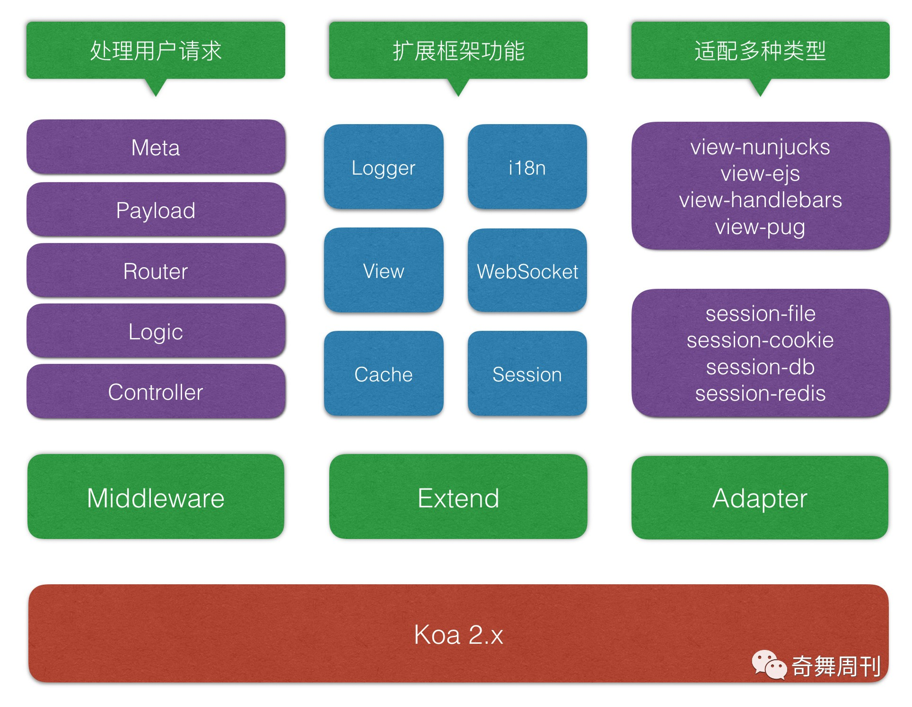

# ThinkJS

ThinkJS 是一款拥抱未来的 Node.js Web 框架，致力于集成项目最佳实践，规范项目让企业级团队开发变得更加简单高效。



## 特点

  - 基于 Koa 重构框架架构，完全兼容 Koa 的中间件
  - 精简核心，支持扩展和适配器
  - 多进程模型：开发think-cluster 模块直接内置了多进程模型，最大限度的利用多核 CPU 提高响应速度。 同时，提供一套进程之间通信的方式，如：：通知其他进程执行某个任务，代码在线更新后重启所有的子进程。
  - 增加 think-crontab 模块，强化框架的定时任务功能
  - 重构日志功能，基于 think-logger3 模块构建框架日志系统
  - 重构框架数据库操作逻辑，增加 think-model, think-mongoose, think-sequelize 模块完善框架数据库操作功能

# 初始化构建

```sh
# 安装 ThinkJS
npm install -g think-cli
# 创建项目
thinkjs new demo
# 安装依赖
npm install
# 启动服务
npm start
```

## 参考

* [文档](https://thinkjs.org/doc/index.html)