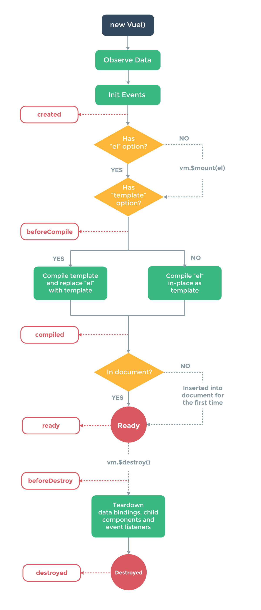

# [vuejs/vue](https://github.com/vuejs/vueb)

A progressive, incrementally-adoptable JavaScript framework for building UI on the web. http://vuejs.org

* 工程化
* 模块化
* 组件化
* 数据驱动

## 原理

* 不要用操作dom的思维去用Vue，用操作数据的思维去用
* MVVM模式（Model-View-ViewModel）：view 变动自动更新到 ViewModel，反之亦然，这种机制叫做双向绑定
  - 每个Vue实例在创建时都会经历一系列实例化步骤，例如，需要设置数据观察、编译模板、以及创建必要的数据绑定
* 数据:Vue实例都会代理其data对象中的所有属性.代理属性是反应式的，如果在实例创建之后添加一个新的属性到实例上，将不会触发任何视图更新
* 模板
* 要挂载元素
* 方法
* 属性
  - computed：通过函数来定义，函数体中是该属性的计算逻辑，在初次访问该计算属性时，通过对应函数体计算属性值并缓存起来，以后每次计算属性依赖的普通属性值发生变更，才会重新计算
* 生命周期回调



## 安装

```sh
sudo npm install -g vue-cli vue-router vuex vue-resource vue-loader webpack
#  webpack模板初始化项目：
 vue init webpack sell：程序文件名称
# 模块安装
npm insall
# 运行开发者模式
npm run dev(代码实时更新)
# 打包文件
npm run build，包含index文件与dist资源包
```

## 语法

* v-text：文本填充
* v-html：更新元素的html
* v-show：根据表达式的值切换displayCSS属性
* v-if：跟据值是否渲染元素
* v-for：根据数据多次渲染数据
* v-on：绑定事件监听器,简写 @click
* v-bind：动态绑定一个或多个特性，或一个组件prop表达式 简写 ：title
* v-model:数据动态绑定
* v-pre：模版中跳过vue编译，直接输出原始值
* v-cloak：刷新活着加载出现闪缩
* v-once：自渲染组件一次

## 使用

* 定义View
* 定义Model
* 创建一个Vue实例或"ViewModel"，它用于连接View和Model

### 添加插件

- package.json中添加"stylus-loader": "^1.4.0"，npm install安装插件

## [服务器端渲染（Server side rendering SSR）](https://github.com/vuejs/vue-ssr-docs)

## 组件

组件系统:可扩展HTML元素，封装可重用代码。自定义的元素

## 跨域

```json
// config/index.js的dev中添加配置项
proxyTable

dev: {
  proxyTable: {
    '/api':{
      target:'www.baidu.com',
      changeOrigin:true,
      pathRewrite:{
        '^/api':'/'
      }
    }
  }
}
```

## 教程


## 项目

* [pwa](https://github.com/vuejs-templates/pwa) progressive-web-apps
* [vuejs-templates/webpack](https://github.com/vuejs-templates/webpack):通过webpack打包的vuejs模版
* [bailicangdu/vue2-happyfri](https://github.com/bailicangdu/vue2-happyfri)vue2 + vue-router + vuex 入门项目
* [bailicangdu/node-elm](https://github.com/bailicangdu/vue2-elm)：基于 vue2 + vuex 构建一个具有 45 个页面的大型单页面应用，服务端
* [bailicangdu/vue2-elm](https://github.com/bailicangdu/vue2-elm):客户端
* [bailicangdu/vue2-manage](https://github.com/bailicangdu/vue2-manage):基于 vue + element-ui 的后台管理系统
* [vuejs/vue-hackernews-2.0](https://github.com/vuejs/vue-hackernews-2.0):HackerNews clone built with Vue 2.0, vue-router & vuex, with server-side rendering
* [liangxiaojuan/eleme](https://github.com/liangxiaojuan/eleme):vue2 +vue-router2 + es6 +webpack 高仿饿了么app商家详情，demo：http://yangyi1024.com/elem 还有我最新的实战项目,点它=》 http://yangyi1024.com/meizi
* [ustbhuangyi/vue-sell](https://github.com/ustbhuangyi/vue-sell):Vue.js高仿饿了么外卖App课程源码 http://coding.imooc.com/class/74.html
* [tonyfree/youzan](https://github.com/tonyfree/youzan):vue重构有赞商城
* [webpack 前后端分离开发接口调试解决方案，proxyTable解决方案](https://www.cnblogs.com/coolslider/p/7076191.html)
* [vue-cli + webpack 多页面实例配置优化方法](https://segmentfault.com/a/1190000006741478)
* [bluefox1688/vue-cli-multi-page](https://github.com/bluefox1688/vue-cli-multi-page):vue2-cli-vux2-multe-page，使用了webpack2+vuejs2+vuxUI2的多页面脚手架
* [codekerala/spa-laravel-vuejs](https://github.com/codekerala/spa-laravel-vuejs):Single Page Application with Laravel 5.3 and Vue.js 2.1.x https://codekerala.com
* [codecasts/spa-starter-kit](https://github.com/codecasts/spa-starter-kit):A highly opinionated starter kit for building Single Page Applications with Laravel and Vue.js
* [Plortinus/vue-multiple-pages](https://github.com/Plortinus/vue-multiple-pages):A modern Vue.js multiple pages cli which uses Vue 2, Webpack3, and Element UI （Thanks for your star）(Vue2、ElementUI多页应用脚手架)
* [KieSun/Vue-StudyMaps](https://github.com/KieSun/Vue-StudyMaps):使用 Vue.js 开发的聚合应用。通过爬虫抓取平时浏览的网站，省去逐个点开网页的时间。
* [vue-storefront](https://github.com/DivanteLtd/vue-storefront)
* [Eagle.js](https://github.com/Zulko/eagle.js)
* [Coffcer/vue-chat](https://github.com/Coffcer/vue-chat):chat example by vue.js + vuex + webpack http://coffcer.github.io/vue-chat/
* [lin-xin/vue-manage-system](https://github.com/lin-xin/vue-manage-system):The web management system solution based on Vue2 and Element UI. http://blog.gdfengshuo.com/example/work/

## 工具

* vue-resource
* better-scroll
* [ vitejs / vite ](https://github.com/vitejs/vite):Native-ESM powered web dev build tool. It's fast.
* [vuejs/vuex](https://vuex.vuejs.org/zh-cn/):Centralized State Management for Vue.js.
* [ElemeFE/vue-amap](https://github.com/ElemeFE/vue-amap):vue-amap - 基于 Vue 2.x 和高德地图的地图组件 https://elemefe.github.io/vue-amap/
* [vuejs/vetur](https://github.com/vuejs/vetur)：Vue tooling for VSCode.
* [vuejs/vue-loader](https://github.com/vuejs/vue-loader):Webpack loader for Vue.js components
* [vuejs/vue-class-component](https://github.com/vuejs/vue-class-component):ES / TypeScript decorator for class-style Vue components.
* [vuejs/vue-router](https://github.com/vuejs/vue-router):The official router for Vue.js.https://router.vuejs.org/zh-cn/
* [pagekit/vue-resource](https://github.com/pagekit/vue-resource):The HTTP client for Vue.js
* [vuejs-templates/webpack](https://github.com/vuejs-templates/webpack):A full-featured Webpack + vue-loader setup with hot reload, linting, testing & css extraction.
* [iview/iview-admin](https://github.com/iview/iview-admin):Vue 2.0 admin management system template based on iView https://iview.github.io/iview-admin
* [airyland/vux](https://github.com/airyland/vux):Mobile UI Components based on Vue & WeUI https://vux.li/
* [vuejs/vuex-router-sync](https://github.com/vuejs/vuex-router-sync):Effortlessly keep vue-router and vuex store in sync.
* [shentao/vue-multiselect](https://github.com/shentao/vue-multiselect):Universal select/multiselect/tagging component for Vue.js https://vue-multiselect.js.org/
* [ElemeFE/vue-amap](https://github.com/ElemeFE/vue-amap):🌍 基于 Vue 2.x 和高德地图的地图组件 https://elemefe.github.io/vue-amap/
* [kazupon/vue-i18n](https://github.com/kazupon/vue-i18n):🌐 Internationalization plugin for Vue.js https://kazupon.github.io/vue-i18n/
* [SortableJS/Vue.Draggable](https://github.com/SortableJS/Vue.Draggable):Vue component allowing drag-and-drop sorting in sync with View-Model. Based on Sortable.js
* [Akryum/vue-virtual-scroller](https://github.com/Akryum/vue-virtual-scroller):⚡️ Blazing fast scrolling for any amount of data
* [kaorun343/vue-property-decorator](https://github.com/kaorun343/vue-property-decorator):Vue.js and Property Decorator
* chart
    - [ElemeFE/v-charts](https://github.com/ElemeFE/v-charts):基于 Vue2.0 和 ECharts 封装的图表组件📈📊 https://v-charts.js.org
* [vuejs/vue-cli](https://github.com/vuejs/vue-cli):🛠️ Standard Tooling for Vue.js Development https://cli.vuejs.org/
  - `npm install -g @vue/cli` `yarn global add @vue/cli`
  - 3.0:图形化界面
  - `vue list`
  - `vue init <template-name> <project-name>` # vue init webpack my-project  vue init Plortinus/vue-multiple-pages new-project
* 模板
  - [ SimulatedGREG / electron-vue ](https://github.com/SimulatedGREG/electron-vue):An Electron & Vue.js quick start boilerplate with vue-cli scaffolding, common Vue plugins, electron-packager/electron-builder, unit/e2e testing, vue-devtools, and webpack. <https://simulatedgreg.gitbooks.io/electron-vue/content/>
    - [ epicmaxco / vuestic-admin ](https://github.com/epicmaxco/vuestic-admin):Free and Beautiful Vue.js Admin Template http://vuestic.epicmax.co
* [mimecorg/vuido](https://github.com/mimecorg/vuido):Native desktop applications using Vue.js.
* [halfrost/vue-objccn](https://github.com/halfrost/vue-objccn):🔥 用 Vue.js 开发的跨三端应用 / Use Vue.js to develop a cross-platform full stack application
* [SimulatedGREG/electron-vue](https://github.com/SimulatedGREG/electron-vue):An Electron & Vue.js quick start boilerplate with vue-cli scaffolding, common Vue plugins, electron-packager/electron-builder, unit/e2e testing, vue-devtools, and webpack.
* [vuejs/vue-devtools](https://github.com/vuejs/vue-devtools):Chrome devtools extension for debugging Vue.js applications.
* [vuejs/vue-class-component](https://github.com/vuejs/vue-class-component):ES / TypeScript decorator for class-style Vue components.
* [gridsome/gridsome](https://github.com/gridsome/gridsome):⚡️ Build super fast, modern websites with Vue.js https://gridsome.org
* test
  - [vuejs/vue-test-utils](https://github.com/vuejs/vue-test-utils):🔬 Utilities for testing Vue components https://vue-test-utils.vuejs.org
* Editor
  - [heyscrumpy/tiptap](https://github.com/heyscrumpy/tiptap):A rich-text editor for Vue.js https://tiptap.scrumpy.io
  - [hinesboy/mavonEditor](https://github.com/hinesboy/mavonEditor):mavonEditor - A markdown editor based on Vue that supports a variety of personalized features https://md.zhystar.com/
* 框架
  - [vuejs-templates/webpack](https://github.com/vuejs-templates/webpack):A full-featured Webpack + vue-loader setup with hot reload, linting, testing & css extraction.
  - [dcloudio/uni-app](https://github.com/dcloudio/uni-app):使用 Vue.js 开发跨平台应用的前端框架 http://uniapp.dcloud.io
  - [quasarframework/quasar](https://github.com/quasarframework/quasar):Quasar Framework - High performance, Material Design 2, full front end stack with Vue.js https://quasar.dev http://www.quasarchs.com
* UI
  - [vuetifyjs/vuetify](https://github.com/vuetifyjs/vuetify):Material Component Framework for Vue.js 2 https://vuetifyjs.com
  - [Quasar](https://github.com/quasarframework/quasar)
  - [ElemeFE/element](https://github.com/ElemeFE/element)A Vue.js 2.0 UI Toolkit for Web
  - [vuematerial/vue-material](https://github.com/vuematerial/vue-material):Material design for Vue.js http://vuematerial.io
  - [Keen-UI](https://github.com/JosephusPaye/Keen-UI)
  - [Buefy](https://github.com/buefy/buefy)
  - [AT-UI/at-ui](https://github.com/at-ui/at-ui):A fresh and flat UI-Kit specially for desktop application, made with ♥ by Vue.js 2.0 https://at.aotu.io
  - [museui/muse-ui](https://github.com/museui/muse-ui):Material Design UI library for Vuejs 2.0 https://museui.github.io
  - [airyland/vux](https://github.com/airyland/vux):Mobile UI Components based on Vue & WeUI https://vux.li/
  - [iview/iview](https://github.com/iview/iview):A high quality UI Toolkit built on Vue.js 2.0 https://iviewui.com/
  - [Uiv](https://github.com/wxsms/uiv)
  - [Onsen UI+Vue](https://onsen.io/v2/guide/vue/)
  - [Semantic UI+Vue](https://semantic-ui-vue.github.io/)
  - [Fish-UI](https://github.com/myliang/fish-ui)
  - [ElemeFE/mint-ui](https://github.com/ElemeFE/mint-ui/):Mobile UI elements for Vue.js http://mint-ui.github.io/#!/en
  - [Framework7 Vue](https://framework7.io/vue/)
  - [didi/cube-ui](https://github.com/didi/cube-ui):🔶 A fantastic mobile ui lib implement by Vue https://didi.github.io/cube-ui/
  - [Vueblu](https://github.com/chenz24/vue-blu)
  - [Ant Design Vue](https://github.com/okoala/vue-antd)
  - [airyland/vux](https://github.com/airyland/vux):Mobile UI Components based on Vue & WeUI https://vux.li/
  - [youzan/vant](https://github.com/youzan/vant):Lightweight Mobile UI Components built on Vue https://youzan.github.io/vant
  - [bootstrap-vue/bootstrap-vue](https://github.com/bootstrap-vue/bootstrap-vue/):BootstrapVue provides one of the most comprehensive implementations of Bootstrap 4 components and grid system for Vue.js and with extensive and automated WAI-ARIA accessibility markup. https://bootstrap-vue.js.org
  - [Weex-ui](https://github.com/alibaba/weex-ui)
  - [Eagle.js](https://github.com/Zulko/eagle.js)
  - [jdf2e/nutui](https://github.com/jdf2e/nutui):京东风格的轻量级移动端Vue组件库 (A Vue.js 2.0 UI Toolkit for Mobile Web) https://nutui.jd.com
  - [HEYUI](https://www.heyui.top/):基于Vue.js的高质量UI组件库
* Admin
  - [PanJiaChen / vue-element-admin](https://github.com/PanJiaChen/vue-element-admin):🎉 A magical vue admin https://panjiachen.github.io/vue-element-admin
  - [taylorchen709 / vue-admin](https://github.com/taylorchen709/vue-admin):admin template based on vuejs2 and element. https://taylorchen709.github.io/vue-admin/

## 参考

* [ vuejs / vue-next ](https://github.com/vuejs/vue-next):Repo for Vue 3.0 (currently in beta)
* [vuejs/vue-docs-zh-cn](https://github.com/vuejs/vue-docs-zh-cn)
* [NLRX-WJC/Learn-Vue-Source-Code](https://github.com/NLRX-WJC/Learn-Vue-Source-Code):🔥 🔥逐行剖析Vue.js源码 在线阅读地址https://nlrx-wjc.github.io/Learn-Vue-Source-Code/
* [官方文档](https://cn.vuejs.org/v2/guide/) [文档](https://vuejs.org/v2/guide/)
* [vuejs/awesome-vue](https://github.com/vuejs/awesome-vue):A curated list of awesome things related to Vue.js
* [JavaScript 进阶之 Vue.js + Node.js 入门实战开发](http://blog.csdn.net/gitchat/article/details/77931664)
* [HcySunYang/vue-design](https://github.com/HcySunYang/vue-design):📖逐行级别的源码分析 http://hcysun.me/vue-design/

* [Vue.js 技术揭秘](https://ustbhuangyi.github.io/vue-analysis/)
* [开发技巧](https://segmentfault.com/a/1190000020620972)
* http://www.cnblogs.com/keepfool/
* [Vue.js——60分钟快速入门](http://www.cnblogs.com/keepfool/p/5619070.html)
* [Vue2+VueRouter2+webpack 构建项目实战](http://blog.csdn.net/fungleo/article/details/53171052)
* [Vue 脱坑记 - 查漏补缺](https://juejin.im/post/59fa9257f265da43062a1b0e)
* [Vue.js 2.0 快速上手精华梳理](https://juejin.im/post/59aa1248518825392656a86a)
