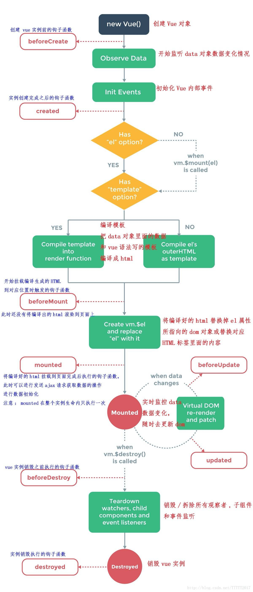

# [vuejs/vue](https://github.com/vuejs/vueb)

A progressive, incrementally-adoptable JavaScript framework for building UI on the web. http://vuejs.org

* 工程化
* 模块化
* 组件化
* 数据驱动
* 解耦视图和数据
* 可复用的组件
* 前端路由
* 状态管理
* 虚拟 DOM

## 原理

* **响应式**
* 不要用操作dom思维去用Vue，用操作数据思维
  - 只维护数据，不维护dom
  - vue 通过监听数据实现动态渲染 dom
* MVVM模式（Model-View-ViewModel）
  - 双向绑定:view 变动自动更新到 ViewModel，反之亦然
  - view  DOM Listers Model
  - model data bindings View
  - 每个Vue实例在创建时都会经历一系列实例化步骤，例如，需要设置数据观察、编译模板、以及创建必要的数据绑定
* 数据:Vue实例都会代理其data对象中的所有属性.代理属性是反应式的，如果在实例创建之后添加一个新的属性到实例上，将不会触发任何视图更新
* 生命周期钩子
  - created
  - mounted
  - updated
  - destroyed
* 生命周期
  + new Vue()
  + init Events & Lifecycle
    + beforeCreate
  + init injections & reactivity
    + created 钩子可以用来在一个实例被创建之后执行代码
  + has 'el' option?
  + has 'template' options
    + Compile template into render function
    + Compile el's outerHTML as template
    + beforeMount
  + create vm.\$el and replace 'el' with it
    + mounted
    + beforeUpdate
    + Virtual DOM re-render and patch
    + updated
  + when vm.\$destory() called
    + beforeDestory()
  + teardown watchers, child compontents and event listensers
  + Destroyed
    + destoryed
* 虚拟 DOM
  - 通过建立一个虚拟DOM来追踪要如何改变真实DOM,createNodeDescription，因为所包含的信息会告诉 Vue 页面上需要渲染什么样的节点，包括及其子节点的描述信息



## 版本

* vue2
  - 通过两Object.prototype
* Vue3
  - 通过proxy实现

## 安装

```sh
sudo npm install -g vue-cli vue-router vuex vue-resource vue-loader webpack
#  webpack模板初始化项目：
vue init webpack sell
# 模块安装
npm insall
# 运行开发者模式
npm run dev(
# 打包文件
npm run build
```

## 语法

- kebab-case (短横线隔开式)
- 声明式渲染:用简洁模板语法来声明式地将数据渲染进 DOM 系统
  - 数据和 DOM 已经被建立了关联，所有东西都是响应式的
* 模板语法:允许开发者声明式地将 DOM 绑定至底层 Vue 实例的数据
  - 底层的实现上，Vue 将模板编译成虚拟 DOM 渲染函数。
  - 结合响应系统，Vue 能够智能地计算出最少需要重新渲染多少组件，并把 DOM 操作次数减到最少
  - 插值
    + 数据绑定:最常见形式就是使用 “Mustache” 语法 (双大括号) 文本插值,绑定的数据对象上 message 属性发生了改变，插值处的内容都会更新
      * v-once:也能执行一次性地插值，当数据改变时，插值处的内容不会更新
  - v-bind|: 绑定属性
    + 动态绑定一个或多个特性，或一个组件prop表达式 简写 ：title
  - 提供了完全 JavaScript 表达式支持
    + 在所属 Vue 实例的数据作用域下作为 JavaScript 被解析
    + 每个绑定都只能包含单个表达式
  - v-modal 实现表单输入和应用状态之间的双向绑定
    - 会根据控件类型自动选取正确的方法来更新元素
    - 忽略所有表单元素的 value、checked、selected attribute 的初始值而总是将 Vue 实例的数据作为数据来源
    - 内部为不同输入元素使用不同 property 并抛出不同的事件
      - text 和 textarea 元素使用 value property 和 input 事件
      - checkbox 和 radio 使用 checked property 和 change 事件
      - select 字段将 value 作为 prop 并将 change 作为事件
    * 如果 v-model 表达式的初始值未能匹配任何选项，<select> 元素将被渲染为“未选中”状态,
- 指令 (Directives) 是带有 v- 前缀的特殊 attribute,职责是当表达式的值改变时，将其产生的连带影响，响应式地作用于 DOM
  - 值预期是单个 JavaScript 表达式 (v-for 是例外情况)
  - 能够接收一个“参数”，在指令名称之后以冒号表示
  - 动态参数:从 2.6.0 开始，可以用方括号括起来的 JavaScript 表达式作为一个指令的参数
    - 预期会求出一个字符串，异常情况下值为 null。这个特殊的 null 值可以被显性地用于移除绑定
    - 表达式有一些语法约束，因为某些字符，如空格和引号，放在 HTML attribute 名里是无效<form v-on:submit.prevent="onSubmit">...</form>`
  - v-on|@ 监听 DOM 事件,触发重新渲染时，调用方法将总会再次执行函数
  - v-if:条件性地渲染
    + 确保在切换过程中条件块内的事件监听器和子组件适当地被销毁和重建
    + 是惰性的：如果在初始渲染时条件为假，则什么也不做——直到条件第一次变为真时，才会开始渲染条件块
  - v-show：元素始终会被渲染并保留在 DOM 中。只是简单地切换元素的 CSS property display
    + 不管初始条件是什么，元素总是会被渲染，并且只是简单地基于 CSS 进行切换
  - v-html:输出真正的 HTML
  - v-for:基于一个数组来渲染一个列表 `v-for="(item, index) in items"`
    + 可选的第二个参数，即当前项的索引
    - 可以用 of 替代 in 作为分隔符
    - 可以遍历一个对象的 property `v-for="(value, name, index) in object"`,提供第二个的参数为 property 名称 (也就是键名),用第三个参数作为索引
    - v-for 的优先级比 v-if 更高
    - 默认使用“就地更新”的策略:如果数据项的顺序被改变，Vue 将不会移动 DOM 元素来匹配数据项的顺序，而是就地更新每个元素，并且确保它们在每个索引位置正确渲染
    - 这个默认的模式是高效的，但是只适用于不依赖子组件状态或临时 DOM 状态 (例如：表单输入值) 的列表渲染输出
    - 为了给 Vue 一个提示，以便它能跟踪每个节点的身份，从而重用和重新排序现有元素，你需要为每项提供一个唯一 key attribute.尽可能在使用 v-for 时提供 key attribute，除非遍历输出的 DOM 内容非常简单，或者是刻意依赖默认行为以获取性能上的提升
    - 当在组件上使用 v-for 时，key 现在是必须的
- 自定义指令:可以提供如下几个钩子函数
  - bind：只调用一次，指令第一次绑定到元素时调用。在这里可以进行一次性的初始化设置。
  - inserted：被绑定元素插入父节点时调用 (仅保证父节点存在，但不一定已被插入文档中)。
  - update：所在组件的 VNode 更新时调用，但是可能发生在其子 VNode 更新之前。指令的值可能发生了改变，也可能没有。但是你可以通过比较更新前后的值来忽略不必要的模板更新
  - componentUpdated：指令所在组件的 VNode 及其子 VNode 全部更新后调用
  - unbind：只调用一次，指令与元素解绑时调用
* v-text：文本填充
* v-pre：模版中跳过vue编译，直接输出原始值
* v-cloak：刷新活着加载出现闪缩

## 事件

- .preventDefault()
- .stopPropagation()
* 方法只有纯粹的数据逻辑，而不是去处理 DOM 事件细节
* 事件修饰符 (modifier) 是以半角句号 . 指明的特殊后缀，用于指出一个指令应该以特殊方式绑定
  - .stop
  - .prevent
  - .capture
  - .self
  - .once
  - .passive
* 按键码
  - .enter
  - .tab
  - .delete (捕获“删除”和“退格”键)
  - .esc
  - .space
  - .up
  - .down
  - .left:鼠标按钮修饰符
  - .right:鼠标按钮修饰符
* 系统修饰键
  - .ctrl
  - .alt
  - .shift
  - .meta: Windows 徽标键 (⊞)|command 键 (⌘)
- .exact 允许控制由精确的系统修饰符组合触发的事件
- .middle:鼠标按钮修饰符

- 用修饰符时，顺序很重要；相应代码会以同样的顺序产生。因此，用 v-on:click.prevent.self 会阻止所有的点击
- 不要把 .passive 和 .prevent 一起使用，因为 .prevent 将会被忽略，同时浏览器可能会向你展示一个警告。请记住，.passive 会告诉浏览器你不想阻止事件的默认行为
- 事件名不存在任何自动化的大小写转换。触发的事件名需要完全匹配监听这个事件所用的名称.始终使用 kebab-case 的事件名
- 事件侦听器
  - 通过 \$on(eventName, eventHandler) 侦听一个事件
  - 通过 \$once(eventName, eventHandler) 一次性侦听一个事件
  - 通过 \$off(eventName, eventHandler) 停止侦听一个事件

## vue 参数

* 要挂载元素 el
* data
  - 将 data 对象中的所有的 property 加入到 Vue 的响应式系统中, `vm.a == data.a // => true`
  - 只有当实例被创建时就已经存在于 data 中的 property 才是响应式的
  - 使用 Object.freeze()，这会阻止修改现有的 property，也意味着响应系统无法再追踪变化
  - Vue 实例还暴露了一些有用的实例 property 与方法。它们都有前缀 $，以便与用户定义的 property 区分开来 `vm.$data === data // => true`
  - this.\$root.foo
* method
* 模板 template
* 计算属性 computed
  - **基于响应式依赖进行缓存**,只在相关响应式依赖发生改变时才会重新求值
  - 通过函数来定义，函数体中是该属性的计算逻辑，在初次访问该计算属性时，通过对应函数体计算属性值并缓存起来，以后每次计算属性依赖的普通属性值发生变更，才会重新计算
  - 默认只有 getter,需要时也可以提供一个 setter：
* watch 侦听属性
  - 更通用的方法，来响应数据的变化
  - 通用方式来观察和响应 Vue 实例上的数据变动
  - 当需要在数据变化时执行异步或开销较大的操作时，这个方式是最有用的

## 混入 (mixin)

* 提供了一种非常灵活方式来分发 Vue 组件中的可复用功能。一个混入对象可以包含任意组件选项。当组件使用混入对象时，所有混入对象的选项将被“混合”进入该组件本身的选项
* 当组件和混入对象含有同名选项时，这些选项将以恰当的方式进行“合并”
* 同名钩子函数将合并为一个数组，都将被调用。混入对象的钩子将在组件自身钩子之前调用
* 可以进行全局注册。使用时格外小心！一旦使用全局混入，将影响每一个之后创建的 Vue 实例

## 数据

- array
  - push()
  - pop()
  - shift()
  - unshift()
  - sort()
  - filter() 返回一个新数组
  - contact() 返回一个新数组
  - splice() 返回一个新数组
  - reverse()
* created()
* 组件上的 v-model 默认会利用名为 value 的 prop 和名为 input 的事件,但是像单选框、复选框等类型的输入控件可能会将 value attribute 用于不同的目的。model 选项可以用来避免这样的冲突

## 使用

* 定义View
* 定义Model
* 创建一个Vue实例或"ViewModel"，用于连接View和Model

## [服务器端渲染（Server side rendering SSR）](https://github.com/vuejs/vue-ssr-docs)

## 组件 compontent

- 复用:每个组件都会各自独立维护它的数据
- 嵌套
- 注册：能在模板中使用，组件必须先注册以便 Vue 能够识别
  - 全局注册:可以用在其被注册之后的任何 (通过 new Vue) 新创建的 Vue 根实例，也包括其组件树中的所有子组件的模板中,整个 Vue 全局对象实例作用域内有效
  - 局部注册：通过普通 JavaScript 对象来定义组件，添加到compontents,注册到指定父组件
- 子组件可以通过调用内建的 \$emit 方法并传入事件名称来触发一个事件
- 父级组件监听事件时，通过 \$event 访问到被抛出的这个值
- v-modal
- 通过插槽分发内容
- 字符串 (例如：template: '...') 或者　单文件组件 (.vue)，不存在限制
- 在一个组件的根元素上直接监听一个原生事件,使用 v-on 的 .native 修饰符
- \$attrs
* slot:承载分发内容的出口
  - 插槽内可以包含任何模板代码，包括 HTML,甚至其它组件
  - 父级模板里的所有内容都是在父级作用域中编译的；子模板里的所有内容都是在子作用域中编译的
  - 设置具体的后备 (也就是默认的) 内容
  - 有一个特殊的 attribute：name,可以用来定义额外的插槽,不带 name 的 <slot> 出口会带有隐含的名字“default”
  - v-slot|#
  - <keep-alive> 元素将其动态组件包裹起来,第一次被创建的时候缓存下来
- 可以在自己的模板中调用自身的。只能通过 name 选项来做这件事
- 异步组件
* props：可以在组件上注册一些自定义 attribute。当一个值传递给一个 prop attribute 的时候，它就变成了那个组件实例的一个 property
  - 父子 prop 之间形成了一个 单向下行绑定：父级 prop 的更新会向下流动到子组件中，但是反过来则不行。这样会防止从子组件意外改变父级组件的状态，从而导致你的应用的数据流向难以理解
  - 不应该在一个子组件内部改变 prop
  - Prop 验证数据类型
  - 非 Prop 的 Attribute:会被添加到这个组件的根元素上,class 和 style attribute 会稍微智能一些，即两边的值会被合并起来
  - 禁用 Attribute 继承:在组件的选项中设置 `inheritAttrs: false`
* \$children
* data()：必须是一个函数
* created()
* 组件上的 v-model 默认会利用名为 value 的 prop 和名为 input 的事件,但是像单选框、复选框等类型的输入控件可能会将 value attribute 用于不同的目的。model 选项可以用来避免这样的冲突

- 访问父级组件实例:`this.$parent.map` `this.$parent.$parent.map`
- 访问子组件实例或子元素:`this.$refs.usernameInput`
- \$listeners
- 依赖注入:
  - provide 选项允许指定想要提供给后代组件的数据/方法

* 组件系统:可扩展HTML元素，封装可重用代码。自定义元素
* 数据传递:父组件通过 props 机制将数据传递给子组件
* 事件通知:子组件通过 $emit 传递事件和数据到父组件
* 每个 Vue 组件都应该有且只有一个根元素，重构的时候组件都在最外层包裹了 <div> 元素，否则会报错
* 插槽(slot)：**在组件模板中分发父作用域内容，实现嵌套组件之间的内容分发**
  - 组件
    + 模板中通过命名插槽方式<slot name=header></slot> 定义了多个插槽,渲染父级作用域定义的元素
    + 支持为插槽定义默认渲染内容,即便父级作用域没有定义要分发的内容，也可以通过默认的内容进行渲染
  - 父级作用域使用
    + 父作用域:可以是 Vue 全局容器（可以看作是一个全局的「根组件」），也可以是父组件
    + 通过`<template slot="header">标题</template>`  与定义呼应， name 值就是命名插槽对应的 name 属性值，将template 对应的内容就会分发到对应命名插槽中
    + 使用标签中定义其他的内容则会自动分发到未命名的插槽中 `<slot></slot>`
    + 父级作用域中调用组件插槽中的数据:slot-scope,声明对应插槽作用域

## 跨域

```json
// config/index.js的dev中添加配置项
proxyTable

dev: {
  proxyTable: {
    '/api':{
      target:'www.baidu.com',
      changeOrigin:true,
      pathRewrite:{
        '^/api':'/'
      }
    }
  }
}
```

## Vue Loader

* 一个 Webpack loader,实现单文件 Vue 组件

```sh
npm install -g @vue/cli
vue create demo-project
npm run serve
```

### 添加插件

- package.json中添加"stylus-loader": "^1.4.0"，npm install安装插件

## 项目

* [pwa](https://github.com/vuejs-templates/pwa) progressive-web-apps
* [vuejs-templates/webpack](https://github.com/vuejs-templates/webpack):通过webpack打包的vuejs模版
* [bailicangdu/vue2-happyfri](https://github.com/bailicangdu/vue2-happyfri)vue2 + vue-router + vuex 入门项目
* [bailicangdu/node-elm](https://github.com/bailicangdu/vue2-elm)：基于 vue2 + vuex 构建一个具有 45 个页面的大型单页面应用，服务端
* [bailicangdu/vue2-elm](https://github.com/bailicangdu/vue2-elm):客户端
* [bailicangdu/vue2-manage](https://github.com/bailicangdu/vue2-manage):基于 vue + element-ui 的后台管理系统
* [vuejs/vue-hackernews-2.0](https://github.com/vuejs/vue-hackernews-2.0):HackerNews clone built with Vue 2.0, vue-router & vuex, with server-side rendering
* [liangxiaojuan/eleme](https://github.com/liangxiaojuan/eleme):vue2 +vue-router2 + es6 +webpack 高仿饿了么app商家详情，demo：http://yangyi1024.com/elem 还有我最新的实战项目,点它=》 http://yangyi1024.com/meizi
* [ustbhuangyi/vue-sell](https://github.com/ustbhuangyi/vue-sell):Vue.js高仿饿了么外卖App课程源码 http://coding.imooc.com/class/74.html
* [tonyfree/youzan](https://github.com/tonyfree/youzan):vue重构有赞商城
* [webpack 前后端分离开发接口调试解决方案，proxyTable解决方案](https://www.cnblogs.com/coolslider/p/7076191.html)
* [vue-cli + webpack 多页面实例配置优化方法](https://segmentfault.com/a/1190000006741478)
* [bluefox1688/vue-cli-multi-page](https://github.com/bluefox1688/vue-cli-multi-page):vue2-cli-vux2-multe-page，使用了webpack2+vuejs2+vuxUI2的多页面脚手架
* [codekerala/spa-laravel-vuejs](https://github.com/codekerala/spa-laravel-vuejs):Single Page Application with Laravel 5.3 and Vue.js 2.1.x https://codekerala.com
* [codecasts/spa-starter-kit](https://github.com/codecasts/spa-starter-kit):A highly opinionated starter kit for building Single Page Applications with Laravel and Vue.js
* [Plortinus/vue-multiple-pages](https://github.com/Plortinus/vue-multiple-pages):A modern Vue.js multiple pages cli which uses Vue 2, Webpack3, and Element UI （Thanks for your star）(Vue2、ElementUI多页应用脚手架)
* [KieSun/Vue-StudyMaps](https://github.com/KieSun/Vue-StudyMaps):使用 Vue.js 开发的聚合应用。通过爬虫抓取平时浏览的网站，省去逐个点开网页的时间。
* [vue-storefront](https://github.com/DivanteLtd/vue-storefront)
* [Eagle.js](https://github.com/Zulko/eagle.js)
* [Coffcer/vue-chat](https://github.com/Coffcer/vue-chat):chat example by vue.js + vuex + webpack http://coffcer.github.io/vue-chat/
* [lin-xin/vue-manage-system](https://github.com/lin-xin/vue-manage-system):The web management system solution based on Vue2 and Element UI. http://blog.gdfengshuo.com/example/work/

## 工具

* vue-resource
* better-scroll
* [ vitejs / vite ](https://github.com/vitejs/vite):Native-ESM powered web dev build tool. It's fast.
* [vuejs/vuex](https://vuex.vuejs.org/zh-cn/):Centralized State Management for Vue.js.
* [ElemeFE/vue-amap](https://github.com/ElemeFE/vue-amap):vue-amap - 基于 Vue 2.x 和高德地图的地图组件 https://elemefe.github.io/vue-amap/
* [vuejs/vetur](https://github.com/vuejs/vetur)：Vue tooling for VSCode.
* [vuejs/vue-loader](https://github.com/vuejs/vue-loader):Webpack loader for Vue.js components
* [vuejs/vue-class-component](https://github.com/vuejs/vue-class-component):ES / TypeScript decorator for class-style Vue components.
* [vuejs/vue-router](https://github.com/vuejs/vue-router):The official router for Vue.js.https://router.vuejs.org/zh-cn/
* [pagekit/vue-resource](https://github.com/pagekit/vue-resource):The HTTP client for Vue.js
* [vuejs-templates/webpack](https://github.com/vuejs-templates/webpack):A full-featured Webpack + vue-loader setup with hot reload, linting, testing & css extraction.
* [iview/iview-admin](https://github.com/iview/iview-admin):Vue 2.0 admin management system template based on iView https://iview.github.io/iview-admin
* [airyland/vux](https://github.com/airyland/vux):Mobile UI Components based on Vue & WeUI https://vux.li/
* [vuejs/vuex-router-sync](https://github.com/vuejs/vuex-router-sync):Effortlessly keep vue-router and vuex store in sync.
* [shentao/vue-multiselect](https://github.com/shentao/vue-multiselect):Universal select/multiselect/tagging component for Vue.js https://vue-multiselect.js.org/
* [ElemeFE/vue-amap](https://github.com/ElemeFE/vue-amap):🌍 基于 Vue 2.x 和高德地图的地图组件 https://elemefe.github.io/vue-amap/
* [kazupon/vue-i18n](https://github.com/kazupon/vue-i18n):🌐 Internationalization plugin for Vue.js https://kazupon.github.io/vue-i18n/
* [SortableJS/Vue.Draggable](https://github.com/SortableJS/Vue.Draggable):Vue component allowing drag-and-drop sorting in sync with View-Model. Based on Sortable.js
* [Akryum/vue-virtual-scroller](https://github.com/Akryum/vue-virtual-scroller):⚡️ Blazing fast scrolling for any amount of data
* [kaorun343/vue-property-decorator](https://github.com/kaorun343/vue-property-decorator):Vue.js and Property Decorator
* chart
    - [ElemeFE/v-charts](https://github.com/ElemeFE/v-charts):基于 Vue2.0 和 ECharts 封装的图表组件📈📊 https://v-charts.js.org
* [vuejs/vue-cli](https://github.com/vuejs/vue-cli):🛠️ Standard Tooling for Vue.js Development https://cli.vuejs.org/
  - `npm install -g @vue/cli` `yarn global add @vue/cli`
  - 3.0:图形化界面
  - `vue list`
  - `vue init <template-name> <project-name>` # vue init webpack my-project  vue init Plortinus/vue-multiple-pages new-project
* 模板
  - [ SimulatedGREG / electron-vue ](https://github.com/SimulatedGREG/electron-vue):An Electron & Vue.js quick start boilerplate with vue-cli scaffolding, common Vue plugins, electron-packager/electron-builder, unit/e2e testing, vue-devtools, and webpack. <https://simulatedgreg.gitbooks.io/electron-vue/content/>
    - [ epicmaxco / vuestic-admin ](https://github.com/epicmaxco/vuestic-admin):Free and Beautiful Vue.js Admin Template http://vuestic.epicmax.co
* [mimecorg/vuido](https://github.com/mimecorg/vuido):Native desktop applications using Vue.js.
* [halfrost/vue-objccn](https://github.com/halfrost/vue-objccn):🔥 用 Vue.js 开发的跨三端应用 / Use Vue.js to develop a cross-platform full stack application
* [SimulatedGREG/electron-vue](https://github.com/SimulatedGREG/electron-vue):An Electron & Vue.js quick start boilerplate with vue-cli scaffolding, common Vue plugins, electron-packager/electron-builder, unit/e2e testing, vue-devtools, and webpack.
* [vuejs/vue-devtools](https://github.com/vuejs/vue-devtools):Chrome devtools extension for debugging Vue.js applications.
* [vuejs/vue-class-component](https://github.com/vuejs/vue-class-component):ES / TypeScript decorator for class-style Vue components.
* [gridsome/gridsome](https://github.com/gridsome/gridsome):⚡️ Build super fast, modern websites with Vue.js https://gridsome.org
* test
  - [vuejs/vue-test-utils](https://github.com/vuejs/vue-test-utils):🔬 Utilities for testing Vue components https://vue-test-utils.vuejs.org
* Editor
  - [heyscrumpy/tiptap](https://github.com/heyscrumpy/tiptap):A rich-text editor for Vue.js https://tiptap.scrumpy.io
  - [hinesboy/mavonEditor](https://github.com/hinesboy/mavonEditor):mavonEditor - A markdown editor based on Vue that supports a variety of personalized features https://md.zhystar.com/
* 框架
  - [vuejs-templates/webpack](https://github.com/vuejs-templates/webpack):A full-featured Webpack + vue-loader setup with hot reload, linting, testing & css extraction.
  - [dcloudio/uni-app](https://github.com/dcloudio/uni-app):使用 Vue.js 开发跨平台应用的前端框架 http://uniapp.dcloud.io
  - [quasarframework/quasar](https://github.com/quasarframework/quasar):Quasar Framework - High performance, Material Design 2, full front end stack with Vue.js https://quasar.dev http://www.quasarchs.com
* UI
  - [vuetifyjs/vuetify](https://github.com/vuetifyjs/vuetify):Material Component Framework for Vue.js 2 https://vuetifyjs.com
  - [Quasar](https://github.com/quasarframework/quasar)
  - [ElemeFE/element](https://github.com/ElemeFE/element)A Vue.js 2.0 UI Toolkit for Web
  - [vuematerial/vue-material](https://github.com/vuematerial/vue-material):Material design for Vue.js http://vuematerial.io
  - [Keen-UI](https://github.com/JosephusPaye/Keen-UI)
  - [Buefy](https://github.com/buefy/buefy)
  - [AT-UI/at-ui](https://github.com/at-ui/at-ui):A fresh and flat UI-Kit specially for desktop application, made with ♥ by Vue.js 2.0 https://at.aotu.io
  - [museui/muse-ui](https://github.com/museui/muse-ui):Material Design UI library for Vuejs 2.0 https://museui.github.io
  - [airyland/vux](https://github.com/airyland/vux):Mobile UI Components based on Vue & WeUI https://vux.li/
  - [iview/iview](https://github.com/iview/iview):A high quality UI Toolkit built on Vue.js 2.0 https://iviewui.com/
  - [Uiv](https://github.com/wxsms/uiv)
  - [Onsen UI+Vue](https://onsen.io/v2/guide/vue/)
  - [Semantic UI+Vue](https://semantic-ui-vue.github.io/)
  - [Fish-UI](https://github.com/myliang/fish-ui)
  - [ElemeFE/mint-ui](https://github.com/ElemeFE/mint-ui/):Mobile UI elements for Vue.js http://mint-ui.github.io/#!/en
  - [Framework7 Vue](https://framework7.io/vue/)
  - [didi/cube-ui](https://github.com/didi/cube-ui):🔶 A fantastic mobile ui lib implement by Vue https://didi.github.io/cube-ui/
  - [Vueblu](https://github.com/chenz24/vue-blu)
  - [Ant Design Vue](https://github.com/okoala/vue-antd)
  - [airyland/vux](https://github.com/airyland/vux):Mobile UI Components based on Vue & WeUI https://vux.li/
  - [youzan/vant](https://github.com/youzan/vant):Lightweight Mobile UI Components built on Vue https://youzan.github.io/vant
  - [bootstrap-vue/bootstrap-vue](https://github.com/bootstrap-vue/bootstrap-vue/):BootstrapVue provides one of the most comprehensive implementations of Bootstrap 4 components and grid system for Vue.js and with extensive and automated WAI-ARIA accessibility markup. https://bootstrap-vue.js.org
  - [Weex-ui](https://github.com/alibaba/weex-ui)
  - [Eagle.js](https://github.com/Zulko/eagle.js)
  - [jdf2e/nutui](https://github.com/jdf2e/nutui):京东风格的轻量级移动端Vue组件库 (A Vue.js 2.0 UI Toolkit for Mobile Web) https://nutui.jd.com
  - [HEYUI](https://www.heyui.top/):基于Vue.js的高质量UI组件库
* Admin
  - [PanJiaChen / vue-element-admin](https://github.com/PanJiaChen/vue-element-admin):🎉 A magical vue admin https://panjiachen.github.io/vue-element-admin
  - [taylorchen709 / vue-admin](https://github.com/taylorchen709/vue-admin):admin template based on vuejs2 and element. https://taylorchen709.github.io/vue-admin/

## 参考

* [ vuejs / vue-next ](https://github.com/vuejs/vue-next):Repo for Vue 3.0 (currently in beta)
* [vuejs/vue-docs-zh-cn](https://github.com/vuejs/vue-docs-zh-cn)
* [NLRX-WJC/Learn-Vue-Source-Code](https://github.com/NLRX-WJC/Learn-Vue-Source-Code):🔥 🔥逐行剖析Vue.js源码 在线阅读地址https://nlrx-wjc.github.io/Learn-Vue-Source-Code/
* [官方文档](https://cn.vuejs.org/v2/guide/) [文档](https://vuejs.org/v2/guide/)
* [vuejs/awesome-vue](https://github.com/vuejs/awesome-vue):A curated list of awesome things related to Vue.js
* [HcySunYang/vue-design](https://github.com/HcySunYang/vue-design):📖逐行级别的源码分析 http://hcysun.me/vue-design/

* [Vue.js 技术揭秘](https://ustbhuangyi.github.io/vue-analysis/)
* [开发技巧](https://segmentfault.com/a/1190000020620972)
* http://www.cnblogs.com/keepfool/
* [Vue.js——60分钟快速入门](http://www.cnblogs.com/keepfool/p/5619070.html)
* [Vue2+VueRouter2+webpack 构建项目实战](http://blog.csdn.net/fungleo/article/details/53171052)
* [Vue 脱坑记 - 查漏补缺](https://juejin.im/post/59fa9257f265da43062a1b0e)
* [Vue.js 2.0 快速上手精华梳理](https://juejin.im/post/59aa1248518825392656a86a)
* [JavaScript 进阶之 Vue.js + Node.js 入门实战开发](http://blog.csdn.net/gitchat/article/details/77931664
