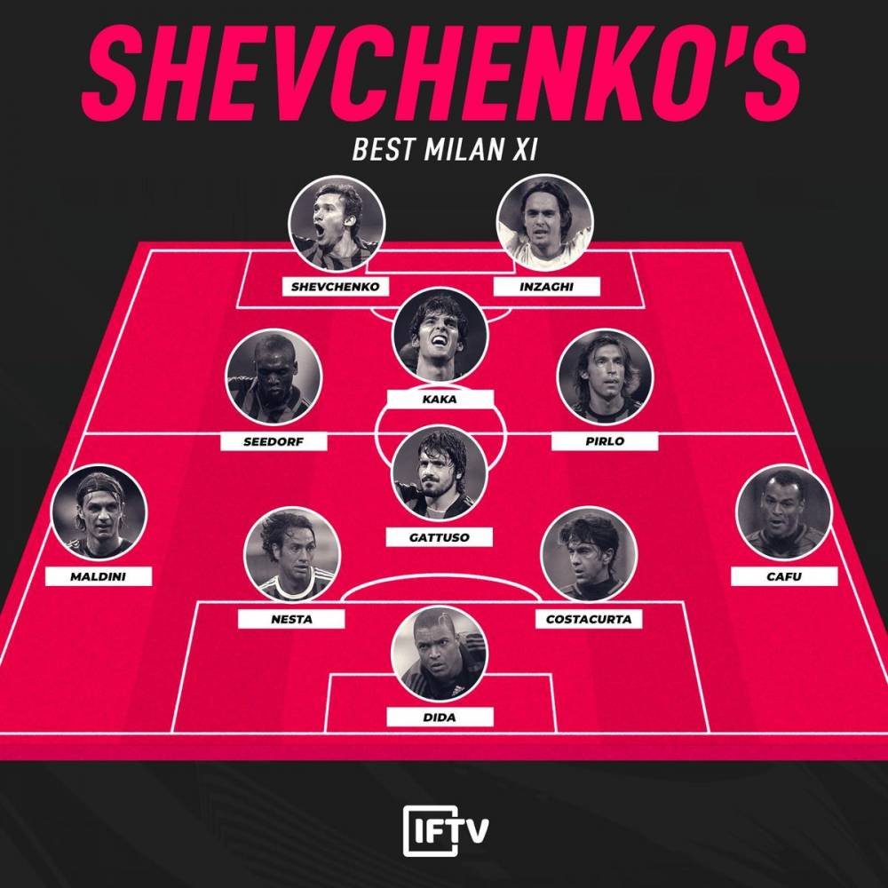

## 足球

* 快速转移，造成防守出错
* 埃弗顿中租借巴萨三人：虚名没用，有球踢才是正道。没那么多满意
* 博努奇
* 安胖
* 波切蒂诺：你可以说我选人的水平垃圾，但请尊重我的球员.预想到日子 会难过，真过起来，又是一回事了，无法抽身的
* 偶然的存在，让我们相信人的自由意志还有更多可能
* 球员成功遇见实例
    - 教练
    - 球队
    - 其他球队

## 事件

* 米歇尔斯的现代足球
    - 米歇尔斯的到来，为阿贾克斯培养了一众巨星，克鲁伊夫、内斯肯斯等等。然而使得他真正光芒万丈的，是他为整个足坛做出的贡献，一位改变世界足球命运的改革。
    - 足坛历史上有许多伟大的改革，比如“WM阵型”，“442阵型”，埃雷拉的“链式防守”等等。但在1970年前后，世界足球是完全不一样的两种足球。彼时，还名不见经传的米歇尔斯创造了一种名叫“全攻全守”的战术，同时，他还为球场上的球员定义了职责详细的场上定位。正是我们今日常说的：边后卫、后腰、前腰、影锋、边锋等等。米歇尔斯让足球变成一项职责详细且三条线紧密的运动，从此足球进入了“现代足球”时代。
    - 米歇尔斯对后世教练的影响同样深远，秉承其衣钵的足球文化源远流长，克鲁伊夫、范加尔、瓜迪奥拉，至今仍然在不断影响着足球运动。将足球战术不断细化，将进攻进行到底，是米歇尔斯的足球哲学。那句经典的“足球既战争”，早已家喻户晓。他的弟子克鲁伊夫曾称赞道：“米歇尔斯打破了世界足坛维系了很长时间的呆板和僵硬。”
    - 关于荣誉，很多年后，他的弟子们每每提起，都认为之后的很多荣誉都离不开他，他本应获得更多。退休多年后，米歇尔斯接受采访时曾表示：“很多年以前，球员带着荣誉感去比赛，踢球是为了获胜，而不是像今天一样为了不输球。对于华丽的足球，胜负那些（虚名）并不重要。”
* 1992年欧足联第一次改制
    - 欧冠从曾经的32支球队两回合单轮淘汰制改为16支球队4个小组比赛的淘汰晋级制。
    - 改制的开始，也意味着商业利益链的不断捆绑，欧冠作为全世界最高素质，最具影响力以及最高水平的俱乐部赛事，自然也注定成为世界上奖金最高的赛事。1997/98赛季，欧冠改制步伐加大，不再仅仅是联赛冠军才能参加的赛事，欧冠开始扩军为24支球队，分为6个小组，种子队则是卫冕冠军加五大联赛冠军。扩军后，五大联赛的亚军都可以参加欧冠，但第三名与第四名仍然将参加联盟杯。这一度也使得欧冠的观赏性更强，但无形中也放开了规则的有效限制。
* 博斯曼法案
    - 1990年，一名名叫博斯曼的比利时球员，因为对于球队工资不满，在合同期满后决定不再与RFC列日队续约，试图转会法国敦刻尔克俱乐部。但在当时，合同到期的球员的转会仍旧需要转会费，而敦刻尔克拒绝支付转会费。博斯曼则被迫留在了俱乐部。
    - 1990年7月，仍然不肯与RFC列日队签约的博斯曼，被该俱乐部根据比利时足协的规定，处以“无薪及不得代表RFC列日队以外任何球队踢球”的处罚。在没有合同仍然被俱乐部封杀的情况下，博斯曼决定捍卫自己的利益。
    - 同年8月，博斯曼将RFC列日、比利时足协和欧洲足联三方一起告上了法庭，要求赔偿他100万美元。他的诉讼依据竟然是《罗马条约》，这场长达五年的诉讼，使得他这名职业球员只能长期的在法国、比利时这样的低级别联赛踢业余的“野球”。
    - RFC列日俱乐部、比利时足协和欧洲足联三家不服判决提出上诉后4年，比利时最高法院才裁定驳回上述。不服气的欧足联采取了双管齐下的场外手段，一方面向欧盟部长理事会施加压力，希望他们能帮助欧足联维护对球员的管理权；另一方面，欧足联又向博斯曼表示和解上的诚意，提出以800万法郎私了。
    - 这场漫长的官司，让博斯曼成为了全球瞩目的新闻人物。获得广泛舆论支持的博斯曼，将官司上升到欧洲法院。顶住压力的博斯曼，终于熬到了1995年12月15日这一天，欧洲法院最终裁决，认定“现行的转会费制度与外援上场名额限制是非法的”，这就是著名的《博斯曼法案》。1996年2月19日，法案正式实施。
* 2003年欧足联第二次改制
    - 2003年，欧足联正式完成了意味着妥协的“二次改制”。这一切绝不是偶然。足坛从“三大杯时代”转入欧冠唯我独尊的时代。欧冠的“二次改制”既维护了顶级豪强的利益，普拉蒂尼也通过吸取更多国家登陆欧冠，为自己日后竞逐欧足联主席赢得了更多的选票。这三年所发生的一切绝不是偶然，直到很多年后才侧证这一切。
    - 在90年代，10次世界足球先生有5次来自联盟杯，但欧足联将所有吸引力全部集中到欧冠，曾经笑傲足坛的欧洲三大杯，为了世纪初欧洲整体的经济低迷而牺牲。欧冠改制后崛起的豪强，如拉齐奥、多特、拉科鲁尼亚、帕尔马等等都开始先后陷入各种危机，80年代发展至当时的群雄逐鹿的局面开始走向终结，军备竞赛垄断开始。因为联盟杯的扩军，欧冠的队伍的两极化，这让足球市场发生了翻天覆地的变化。随后的两三年时间里，欧洲优胜杯宣告取消，联盟杯改名“欧联杯”。
* 意甲电话门
    - 2006年5月4日，《米兰体育报》刊登了尤文图斯总经理莫吉与意甲裁判间的通话内容。5月8日，足协主席卡拉罗、副主席马齐尼相继辞职，那不勒斯、罗马和都灵等四大检察院开始介入调查。一场意甲历史上前所未有的风波掀起，尤文图斯官方发布声明宣布尤文图斯董事会集体辞职。
    - 伴随着调查的全面铺开，AC米兰、拉齐奥、佛罗伦萨相继卷入其中。同时，还有以莫吉为首，长达26人的起诉名单。而随着调查结果的公布，尤文图斯、AC米兰、佛罗伦萨、拉齐奥将被起诉，并要求降级，尤文图斯近2次联赛冠军将被剥夺。“电话门”事件经过了长达几个月的调查取证，二审最后做出了包括尤文降级扣除联赛积分并剥夺两个意甲联赛冠军；AC米兰、佛罗伦萨、拉齐奥等俱乐部扣分的处罚决定。当年的意甲冠军被排在第三名的国际米兰俱乐部替代，国际米兰也因此成为了意甲联赛唯一一支从未降级的球队。以莫吉为首的涉案人员，也都被判处相关的刑罚，并被终生禁止参与足球运动等。
* 2019
    - 热刺淘汰阿贾克斯，利物浦淘汰阿贾克斯：英国球队的坚韧和血性，永远都是克鲁伊夫式足球的噩梦

## 感想

* 豪门 荣耀不在，如何自处

## 欧冠

* 欧足联规定同一联赛最多只能有5支球队同时参加欧冠，因此一旦这种极端情况成立，那么由于要优先保证欧冠和欧联卫冕冠军的利益，获得第4名的球队将被剥夺资格
* 如欧冠冠军已经通过联赛获得欧冠小组赛的席位，则该小组的欧冠席位将授予欧战系数第11的联赛冠军；
* 如欧联冠军已经通过联赛获得欧冠小组赛的席位，则该小组的欧冠席位将授予欧战系数第5的季军；
* 四大联赛的同国球队获得欧冠和欧联杯冠军且未打进联赛前4，则该联赛第4名参加欧联杯。

## 英超

* 1、2、3名欧冠小组赛；4名参加欧冠资格赛
* 第5名参加欧罗巴联赛资格赛； 足总杯冠军和联赛杯冠军参加欧罗巴联赛资格赛
    - 若足总杯冠军已获得欧战资格，亚军替补参加，若冠亚军都已经获得欧战资格，联盟杯名额递补给联赛。
    - 若联赛杯冠军已获得欧战资格，联盟杯名额递补给联赛
* 天谴者阿特金森，豪门猎手克拉滕伯格，北伦敦狙击者麦克迪恩，盲侠奥利弗

## 阿森纳

* 防守问题
* 讲究反击效率:强队气质，打脏球
* 温格
    - 被问及生命中最糟糕的决定，温格说道：“应该是2006年在欧冠联赛中换下皮雷，我知道他永远都不会原谅我，我能够接受这一点。”
    - 2005/2006赛季欧冠决赛，阿森纳对阵巴萨，门将莱曼上半场侵犯埃托奥被罚出场，随后温格调整将皮雷换下，这是他最后一次代表阿森纳登场。决赛后，皮雷转会比利亚雷亚尔。
* 爱美丽
    - 没有中场，拖后后腰
    - 球员遇见没有想法的教练也是白给

## 曼联

* 认识我的董事会成员都知道我的原则：当任何一名曼联球员敢挑战教练的权威时，他就必须离开。我过去常说，‘一旦教练失去了权威，整支球队就不在你的控制当中了。球员们会开始自以为是，然后你就有麻烦了。

## 切尔西

* 切尔西对巴萨的“斯坦福桥惨案”
* 切尔西 0-6 曼城：我所看到的最糟糕的事情，是萨里把切尔西变成了阿森纳。固执的人有两种，一种是只有自己看透而别人看不透的坚持，一种是别人都看透了自己却看不透的蠢货

## 利物浦

* 2009——2010赛季，利物浦出售核心球员阿隆索，这一事件标志着利物浦阵痛期的开始。此后利物浦先后经历了多次教练更迭和财政危机，内忧外患重重，风雨飘摇似孤灯。联赛低迷，一直徘徊在欧冠之外。
* 2013——2014赛季利物浦才迎来复苏，时隔四年再次重返欧冠赛场。
* 2015——2016赛季随着克洛普入主利物浦，球队焕然一新，欧战成绩开始有了起色。
* 2017——2018赛季利物浦在克洛普追求速度、高位压迫的执教理念下时隔九年再次晋级欧冠淘汰赛并最终与皇马会师决赛。

## 米兰

* 2005年5月25日，土耳其伊斯坦布尔阿塔图克体育场。那是永载足球史册的奇迹之夜，那一夜诞生了欧冠历史上最不可思议的经典逆转。
    - 那场比赛，AC米兰凭借开场马尔蒂尼的闪击和之后克雷斯波的梅开二度在上半场取得3—0的巨大领先优势，就在所有球迷都认为比赛已经提前结束的时候，利物浦队却在绝境边缘演奏了属于“红军”的命运交响曲。
    - 下半场用不擅长的头球攻破迪达把守的球门，吹响了利物浦反击的号角，进球之后的杰拉德振臂高呼，鼓舞着队友和球迷，利物浦球迷集体高唱“你永远不会独行”，经典定格在了那一刻。之后利物浦士气大振在很短的时间内凭借斯米切尔和阿隆索的进球扳平比分，完成了不可能完成的任务。
    - 加时赛利物浦门将杜德克扑出舍普琴科近在咫尺的射门又在点球大战中扑出舍普琴科的点球
* 2007年5月23日，AC米兰和利物浦时隔两年再次会师欧冠决赛。在奥林匹克球场，皮尔洛和卡卡先后助攻因扎吉破门，AC米兰最终2—1力克利物浦完成复仇
* 2007——2008赛季，由于引援不利以及罗纳尔多因伤缺阵等诸多因素，AC米兰在欧冠1/8决赛被阿森纳淘汰，联赛位列第五名无缘下赛季欧冠。
* 2008——2009赛季，小罗、贝克汉姆的加盟以及舍普琴科的“二进宫”依然没有阻挡AC米兰下滑的趋势，当赛季AC米兰在欧洲联盟杯淘汰赛首轮被不莱梅淘汰，联赛只收获第三名。当赛季结束，功勋教练安切洛蒂告别，AC米兰正式进入球员和教练频繁更迭的动荡期。
* 2009——2010赛季，马尔蒂尼退役，卡卡转会皇马，贝克汉姆因为伤病早早告别球场，舍普琴科租借期满离开，AC米兰由于资金紧张没有进行有力引援而实力大大削弱。当赛季联赛屈居第三，欧冠赛场1/8决赛被曼联淘汰。
* 2010——2011赛季，随着伊布、罗比尼奥和卡萨诺的加盟，AC米兰实力有所提升获得当赛季联赛冠军，但是欧冠被热刺淘汰再次无缘八强。
* 2011——2012赛季，AC米兰放逐十年核心皮尔洛，皮尔洛转会尤文图斯，这一事件间接改变了当年意甲走势，最终AC米兰在意甲联赛被尤文图斯反超，无缘冠军。欧冠终于晋级八强后被巴萨淘汰。
* 2012——2013赛季，内斯塔远走美国大联盟，加图索奔赴瑞士联赛，伊布加盟巴黎圣日耳曼，因扎吉退役。当赛季AC米兰联赛获得第三名，欧冠1/8决赛在首回合2—0领先情况下次回合被巴萨4—0大比分逆转。
* 2013——2014赛季，卡卡重回圣西罗球场，球队名宿西多夫开始执教AC米兰。但是那个赛季AC米兰依然低迷，欧冠1/8决赛被马竞大比分淘汰，联赛仅仅获得第八名，从那个赛季开始，AC米兰开始了长期徘徊意甲联赛中游无缘欧冠的惨痛历史。
* 2014——2015赛季，卡卡离开AC米兰，因扎吉接替西多夫开始执教AC米兰。因扎吉仅仅执教一个赛季因为成绩惨淡下课告别。
* 之后经过米哈伊诺维奇的过度，加图索在2017年11月27日正式出任AC米兰主教练，加图索把球员时代的铁血足球风格带给了球队。
* 自从2012——2013赛季以后，AC米兰已经连续四个赛季无缘欧冠。

## 德甲

* 09年德甲第26轮。马加特率狼堡血洗拜仁。伤停补时换下门将。[视频](http://tieba.baidu.com/mo/q/videomiddle?vid=XODI1MTI0OTI=&tid=4606670690&fid=173802)

## 拜仁

* 怎么耀眼上去的，就有唏嘘掉下来的那天

### 国足

* 前延边富德主帅朴泰夏任中国女足黄队主帅，同为韩国人的前中国曲棍球女队教练，金昶伯任体能训练顾问
* 这支国足以85国青为主力框架，是中国上次杀入世青赛决赛圈的队伍。之后中国连续无缘7届世青赛决赛圈。未来10年中国足球后继人才匮乏。国足目前问题很多，请球迷做好心理准备，未来10年可能出现人才断档，国家队成绩可能会更加下滑。
* 因为国家队这么多年，赢的……很少，也没给球迷带来什么。
* 里皮一开始进国家队，他就经常跟我说——他很奇怪这些球员在联赛当中的发挥非常好，但来到国家队却踢不出真实水平的百分之四十、百分之五十。
* 我给他解释就是压力太大，他们背负了太多。他们在俱乐部比赛，心态非常放松。但来到国家队，压力就变得很大。
* 分析来分析去，哎，都好笑。十几年走的太多弯路，这会想着抄近道，拜托了，还是想想怎么培养年轻运动员。这么多好的例子，亚洲杯的卡塔尔、邻国的越南、泰国，想说的是摩天大楼不是一夜建好的，没有好的基础，也很难看到希望！​​​​”

### 趋势

* 朗尼克表示：“世界杯的结果已经证明，我们可以忘记去控制球权。这也一直是我的战术主题：拉开纵深，通过灵性地传导，以速度取胜。我们必须把速度加到第六档，第七档，否则是进不了球的。”
同时朗尼克认为法国队夺冠的另一大原因是球队良好的整体性和对年轻球员的正确指导：“八年前的法国队是一群自负的球员，而今年他们成为了世界冠军，尽管他们还是一支由背景各异的白人和黑人球员混合在一起的球队，但现在他们拥有了整体性，球员会得到明确的指导。
“年轻球员需要时常关心，俗气一点说，你需要给予他们关爱，就这点而言本届世界杯的法国队是一个良好的榜样。
* 向前传球
* 失误与主客场的关系

## 世界杯

* 德国小组赛首轮负，二轮瑞典：克罗斯补时4分钟任意球反超比分，最后的晚唱

## 新生代

* 球员创造力
* 孙兴慜
    - 父亲孙雄政经常到场边观看训练，帮忙捡球
* 狼队的鲁本-内维斯
* 哈弗茨
* 姆巴佩
    - 24场欧冠14球7助，追平大罗欧冠生涯进球总数
    - 姆巴佩边路超车真的是电光火石，快的我都怀疑这是不是人类，球一趟不放铲拉拽根本阻止不了他，而且到了最后还有力气玩些花式传球，关键他才20岁，踢得成熟的跟老球员一样，快慢自如，比在世界杯上又进步了一个档次

## 教练

* 温格
    - 我的红白人生

## 小罗

* 他的父亲乔奥一直痴迷足球，他的父亲把他的足球梦想寄托在了他的身上。他八岁那年，他的父亲不幸去世，此后小罗从出道到成名，每当进球，总会单手指天，告慰自己父亲的在天之灵…2005年，小罗在诺坎普球场展示他的金球奖奖杯，在数万球迷的喝彩声中，他把动人一吻献给了自己的母亲

## 亨利

* 32岁的亨利就坐在那里，深情的目光望过去，都是自己22岁的影子。380场比赛，226个进球，4座英超金靴，2座英超奖杯，49场不败。历史最佳射手，海布里的最后一战，海布里的最后一吻。当烟花升起的时刻，那个曾属于亨利的海布里国王时代不会随年华逝去，而只会在年华的飘零中常常记起。

## C罗

* 榜样的力量

## 伊瓜因

* C罗  老佛爷

## 技术

* 一脚出球

## UFC

##  NFL

## 资源

* [BeIN](https://www.beinsports.com/us/)
