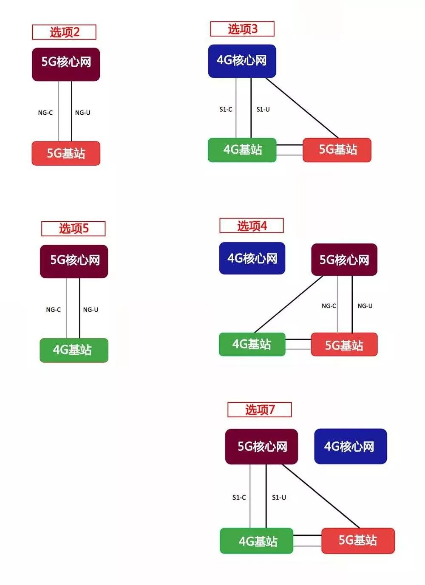

# 通信

* 调制
* 编码
* 多址
    - NOMA（非正交多址接入）是NTT Docomo于2014年9月首先倡导的。其思想是发射端不同的用户分配非正交的通信资源。在正交方案当中，如果一块资源平均分配给N个用户，那么受正交性的约束，每个用户只能够分配到1／N的资源。NOMA摆脱了正交的限制，因此每个用户分配到的资源可以大于1／N。在极限情况下，每个用户都可以分配到所有的资源，实现多个用户的资源共享。
* 组网
* 多天线(mass MIMO)
* 电磁波
    - 频率越高（波长越短），就越趋近于直线传播（绕射能力越差)
    - 频率越高，传播过程中的衰减也越大

## 结构

* 无线侧
    - 手机或者集团客户通过基站接入到无线接入网（RAN（Radio Access Network）），在接入网侧可以通过RTN或者IPRAN或者PTN解决方案来解决，将信号传递给BSC/RNC。
    - 在将信号传递给核心网，其中核心网内部的网元通过IP承载网来承载。
* 固网侧
    - 家客和集客通过接入网接入，接入网主要是GPON，包括ONT、ODN、OLT。
    - 信号从接入网出来后进入城域网，城域网又可以分为接入层、汇聚层和核心层。
    - BRAS为城域网的入口，主要作用是认证、鉴定、计费。
    - 信号从城域网走出来后到达骨干网，在骨干网处，又可以分为接入层和核心层。其中，移动叫CMNET、电信叫169、联通叫163。
* 固网侧和无线侧之间可以通过光纤进行传递，远距离传递主要是有波分产品来承担，波分产品主要是通过WDM+SDH的升级版来实现对大量信号的承载，OTN是一种信号封装协议，通过这种信号封装可以更好的在波分系统中传递。
* 最后信号要通过防火墙到达INTERNET，防火墙主要就是一个NAT，来实现一个地址的转换。这就是整个网络的架构。
* 逻辑架构：手机→接入网→承载网→核心网→承载网→接入网→手机
* 接入网架构演进
    - 一个基站
        + BBU（主要负责信号调制）：有时候挂墙，不过大部分时候是在机柜里。
        + RRU（主要负责射频处理）：挂在机房的墙上
            * 被搬到了天线的身边（RAN就变成了D-RAN，也就是Distributed RAN（分布式无线接入网））
                - 大大缩短了RRU和天线之间馈线的长度，可以减少信号损耗，也可以降低馈线的成本。
                - 让网络规划更加灵活，RRU加天线比较小，想怎么放，就怎么放
        + 馈线（连接RRU和天线）
        + 天线（主要负责线缆上导行波和空气中空间波之间的转换）
    - C-RAN（Centralized RAN）集中化无线接入网，把BBU全部都集中关押在中心机房（CO，Central Office）变成BBU基带池，运营商支持最大的成本是电费（基站里面空调是大头）
        + 极大减少基站机房数量，减少配套设备（特别是空调）的能耗
        + 拉远之后的RRU搭配天线，可以安装在离用户更近距离的位置。距离近了，发射功率就低了。意味着用户终端电池寿命的延长和无线接入网络功耗的降低
        + 所有的虚拟基站在BBU基带池中共享用户的数据收发、信道质量等信息。强化的协作关系，使得联合调度得以实现。小区之间的干扰，就变成了小区之间的协作（CoMP），大幅提高频谱使用效率，也提升了用户感知。
            * 多点协作传输(CoMP，Coordinated Multiple Points Transmission/Reception)是指地理位置上分离的多个传输点，协同参与为一个终端的数据(PDSCH)传输或者联合接收一个终端发送的数据(PUSCH)。 
        + BBU基带池既然都在CO（中心机房），就可以对它们进行虚拟化了！ 虚拟化，就是网元功能虚拟化（NFV）。以前BBU是专门的硬件设备，非常昂贵，现在，找个x86服务器，装个虚拟机（VM，Virtual Machines），运行具备BBU功能的软件，然后就能当BBU用
    - 5G网络接入网变化
        + 被重构为以下3个功能实体：
            * CU（Centralized Unit，集中单元）：原BBU的非实时部分将分割出来，重新定义为CU，负责处理非实时协议和服务。
            * DU（Distribute Unit，分布单元）：BBU的剩余功能重新定义为DU，负责处理物理层协议和实时服务。
            * AAU（Active Antenna Unit，有源天线单元）：BBU的部分物理层处理功能与原RRU及无源天线合并为AAU。将基带数字信号转换成模拟信号，然后调制成高频射频信号，再通过功放单元放大功率，通过天线发射出去 其实就是4G时代的RRU+天线
        + EPC（就是4G核心网）被分为New Core（5GC，5G核心网）和MEC（移动网络边界计算平台）两部分。MEC移动到和CU一起，就是所谓的“下沉”（离基站更近）
        + 之所以要BBU功能拆分、核心网部分下沉，根本原因，就是为了满足5G不同场景的需要
        + 依据5G提出的标准，CU、DU、AAU可以采取分离或合设的方式，所以，会出现多种网络部署形态
            * 与传统4G宏站一致，CU与DU共硬件部署，构成BBU单元。
            * DU部署在4G BBU机房，CU集中部署。
            * DU集中部署，CU更高层次集中。
            * CU与DU共站集中部署，类似4G的C-RAN方式。
* 核心网
    - 2G：MSC（Mobile Switching Center），移动交换中心
    - 2.5G（GPRS）：PS，Packet Switch，分组交换，包交换
        + SGSN：Serving GPRS Support Node，服务GPRS支持节点
        + GGSN：Gateway GPRS Support Node，网关GPRS支持节点
        + SGSN和GGSN都是为了实现GPRS数据业务
    - 3G：由RNC和NodeB组成
        + IP化：TDM电路（E1线，中继电路）-》TCP/IP，以太网。网线、光纤开始大量投入使用，设备的外部接口和内部通讯，都开始围绕IP地址和端口号进行
        + 分离：网元设备的功能开始细化，不再是一个设备集成多个功能，而是拆分开，各司其事。承载和控制分离
            * 用户面，就是用户的实际业务数据，就是你的语音数据，视频流数据之类的。
            * 控制面，是为了管理数据走向的信令、命令
    - 4G核心网
        + SGSN变成MME（Mobility Management Entity），GGSN变成SGW（Serving Gateway，服务网关）/PGW（PDN Gateway，PDN网关）
        + ATCA（Advanced Telecom Computing Architecture，先进电信计算架构）平台：里面的业务处理单板，本身就是一台单板造型的“小型化电脑”，有处理器、内存、硬盘，我们俗称“刀片”。
        + 网元功能虚拟化（Network Function Virtualization，NFV）：硬件上，直接采用HP、IBM等IT厂家的x86平台通用服务器，软件上，设备商基于openstack这样的开源平台，开发自己的虚拟化平台，把以前的核心网网元，“种植”在这个平台之上。
        + 虚拟化平台部署4G核心网，也就是，在为后面5G做准备，提前实验。
    - 5G：SBA架构（Service Based Architecture，即基于服务的架构）
        + 基于云原生构架设计，借鉴了IT领域的“微服务”理念。 把原来具有多个功能的整体，分拆为多个具有独自功能的个体。每个个体，实现自己的微服务。
        + 网元大量增加了，非常容易扩容、缩容，也非常容易升级、割接，相互之间不会造成太大影响
        + 模块化、软件化

## 2G

美国高通公司主导的CDMA（IS-95）并没有成为主流，却仍然凭借Viterbi 算法让业界相信 CDMA 代表了无线通信技术的发展方向。因此，到了 3G 时代，WCDMA、CDMA 2000 和 TD-SCDMA三种3G标准不约而同地全部采用了 CDMA 技术，从而让高通掌握了主导权。

## 3G

* 由于核心长码编码 Turbo 码和短码咬尾卷积码都不是由中国公司主导，仍然无法取得4G发展的主导权
* 在3G阶段，正是由于中国政府率先批准中国移动商用TD-SCDMA，才使得中国支持的TDD标准获得了一定的话语权
* 制式
    - WCDMA
    - TD-SCDMA
    - CDMA
    - 由于美国阵营的坚持，仍然在此后将WIMAX确定为第四种3G技术标准

## 4G

* 在随后的4G标准之争中引入了同样是TDD制式的TD LTE
* 3G演进到4G时，称之为”整体演进“，即无线接入网和核心网整体打包从3G演进到4G
* MIMO“多进多出”（Multiple-Input Multiple-Output），多根天线发送，多根天线接收

## 5G

* 特征:超高速率、超大连接、超低时延
    - 1Gbps的用户体验速率：eMBB
    - 毫秒级的延迟：uRLLC
    - 百万级/k㎡的终端接入：mMTC
* 网络进行分流管理 网络切片，就是根据不同的服务需求，比如时延、带宽、安全性和可靠性等，将运营商的物理网络划分为多个虚拟网络，优化网络资源分配，实现最大成本效率，以灵活的应对不同的网络应用场景。
    - 因为要切片，所以网元要能灵活移动；因为网元灵活移动，所以网元之间的连接也要灵活变化。所以，才有了DU和CU这样的新架构。
* 用1个G左右的带宽
    - GSM（中国移动的2G网络）整个移动才5M带宽，3G是20M带宽，4G是60M带宽
    - 必须用高频,高频的覆盖能力差.5G要覆盖目前全球4G覆盖的区域，基站数量至少是4G的5倍.
* 人流超高密度区的通信需求，是5G可行的潜在应用方向.用4G完成广域覆盖，5G基站建在大城市人流密集区域
* 4G向5G演进时无线接入网和核心网被拆开了，并且5G无线接入网（NR）、5G核心网、4G核心网和4G无线接入网（LTE）混合搭配，组成了多种网络部署选项的演进路线。
* 名词
    * DC代表Dual Connectivity，即双连接；
    * E代表E-UTRA，即4G无线接入网；
    * N代表NR，即5G新无线；
    * NG代表下一代核心网，即5G核心网
* 部署方式
    - 选项2：独立组网（SA）模式，引入5G核心网，仅5G基站连接5G核心网。
    - 选项3：非独立组网（NSA）模式，连接4G核心网，4G基站为主站，5G基站为辅站。
    - 选项4：非独立组网（NSA）模式，引入5G核心网，5G基站为主站，4G基站为辅站。
    - 选项5：独立组网（SA）模式，引入5G核心网，但仅4G基站连接到5G核心网。
    - 选项7：非独立组网（NSA）模式，引入5G核心网，4G基站为主站，5G基站为辅站
    - NR-NR双连接：由于有些运营商计划采用低频段（比如700/800/900MHz频段）来建设5G网络的覆盖层，再用高频段（比如毫米波频段）来补充网络容量，但由于低和高频段的无线传播特性相差太大，共站实现载波聚合技术有些不实际，因此提出了NR-NR双连接技术。
* 非独立组网就是LTE与NR新无线的双连接，由于在具体实现上有差别，因此包含了三种构架：EN-DC（选项3）、NE-DC（选项4）和NGEN-DC（选项7）构架
* 频段
    - 4G网络常用的中低频段（sub-6）
    - 美国运营商还与高通等技术公司合作，成功地实现了在毫米波（mmWave）频段的5G网络试验
* 增强移动宽带、超高可靠、低时延通信（uRLLC）、海量机器类通信（mMTC）
* Massive　MIMO
    - 天线特性要求，多天线阵列要求天线之间的距离保持在半个波长以上
    - 基站上布设天线阵列，通过对射频信号相位的控制，使得相互作用后的电磁波的波瓣变得非常狭窄，并指向它所提供服务的手机，而且能跟据手机的移动而转变方向。
    - 空间复用技术，由全向的信号覆盖变为了精准指向性服务，波束之间不会干扰，在相同的空间中提供更多的通信链路，极大地提高基站的服务容量。
* D2D(Device to Device)
* 华为在IMT-2020（5G）推进组组织的5G试验中完成2.6GHz频段下5G 基站新空口测试，至此华为正式完成中国5G技术研发试验第三阶段NSA（非独立组网）和SA（独立组网）实验室及外场测试，覆盖场景最多，测试频段最全面，其中包括前期已经完成测试的3.5GHz和4.9GHz，以及本次测试的2.6GHz。
* 6月6日，工信部正式向中国电信、中国移动、中国联通、中国广电四家运营商发放5G商用牌照，这标志着中国正式进入5G商用元年。
    - 中国移动：移动的 5G 测试以 NSA 为主。该公司预计 2019 年三季度完成 5G 网络搭建工作，其后重点城市将开始 5G 网络试商用。
    - 中国联通：联通有可能会采取非独立组网 NSA，目前在重点推进 4G 网络覆盖，以作为未来 5G 的「打底网」。据称，联通已在全国 16 个重点城市搭建 5G 网络，正在进行成规模网络测试。
    - 中国电信：中国电信明确使用 SA「一步到位」路线，并在 2 月 2 日宣布完成了业界首个基于虚拟机容器技术的 5G SA（独立组网）核心网的端到端技术和业务测试。
* 华为介绍，在工信部 IMT-2020(5G) 预商用系统组网验证中
    - 华为率先完成 5G 独立组网（SA）与非独立组网（NSA）的全部测试项目，覆盖了 5G 商用的所有主流频段
    - 单用户下行测试峰值超过 1.8Gbps，Sub 6GHz 单小区下行峰值超过 14.5Gbps
    - eMBB 业务下用户面单向时延低至 2ms，不断刷新业界记录。
* 功耗
    - 5G单站功耗是4G单站的2.5~3.5倍，AAU功耗增加是5G功耗增加的主要原因。
    - 目前单站满载功率近3700W，需对现网电源、配套进行提前扩容。
* 标准
    - R15为5G第一阶段标准
        + 2017年12月 R15 NR NSA（非独立组网）：选项3 需要使用4G基站和4G核心网，以4G作为控制面的锚点，满足激进运营商利用现有LTE网络资源，实现快速部署5G的需求。
            * (美 高通)LDPC被采纳为5G eMBB场景的数据信道的长码块编码方案。
            * (美 华为)LDPC码被采纳为5G eMBB场景的数据信道的短码块编码方案
            * (中 华为)Polar码则被选为5G eMBB场景的控制信道的短码块编码方案
        + 2018年6月14日 R15 NR SA（独立组网）：选项2
        + R15 Late Drop：选项4 （即NE-DC 构架）与选项7（即NGEN-DC构架） 两种架构，以及NR-NR双连接（synchronous case）：确保3GPP各种工作组之间充分协调，以及保证网络与终端、芯片之间更完善的兼容性等。
        + ASN.1
    - R16为5G第二阶段标准
* 承载网：把网元的数据传到另外一个网元上
    - 前传AAU↔DU
        + 光纤直连方式：实现起来很简单，但最大的问题是光纤资源占用很多
        + 无源WDM方式：将彩光模块安装到AAU和DU上，通过无源设备完成WDM功能，利用一对或者一根光纤提供多个AAU到DU的连接，节约了光纤资源，但是也存在着运维困难，不易管理，故障定位较难等问题。
            * 彩光模块： 光复用传输链路中的光电转换器，也称为WDM波分光模块。不同中心波长的光信号在同一根光纤中传输是不会互相干扰的，所以彩光模块实现将不同波长的光信号合成一路传输，大大减少了链路成本。
        + 有源WDM/OTN方式：在AAU站点和DU机房中配置相应的WDM/OTN设备，多个前传信号通过WDM技术共享光纤资源，相比无源WDM方案，组网更加灵活（支持点对点和组环网），同时光纤资源消耗并没有增加。
    - 中传（DU↔CU）和回传（CU以上）
        + 分组增强型OTN+IPRAN：利用分组增强型OTN设备组建中传网络，回传部分继续使用现有IPRAN架构
        + 端到端分组增强型OTN：中传与回传网络全部使用分组增强型OTN设备进行组网
    - 特点
        + 架构：核心层采用Mesh组网，L3逐步下沉到接入层，实现前传回传统一。
        + 分片：支持网络FlexE分片
        + SDN：支持整网的SDN部署，提供整网的智能动态管控。
        + 带宽：接入环达到50GE以上，汇聚环达到200GE以上，核心层达到400GE。

### 应用

只有在5G商用中获得了较高的市场份额，才能让自己主张的技术标准转化为主导性的标准，并掌握5G未来的发展方向

* 2019年美国四大运营商的5G商用规模将获得较快的发展，美国也很有可能成为第一个普及5G的大国
* 2018年12月10日，工信部已经向中国电信、中国移动、中国联通三大运营商发放了5G系统中低频段（sub-6）试验频率使用许可。

### 技术

* 华为研发的F-OFDM已经成为全球统一的5G的混合新波形技术标准
* eMBB（enhanced MobileBroadband，增强移动宽带场景），也就是大流量移动宽带场景，适用于3D高清视频、AR/VR等，这也是普通消费者理解的5G应用。
* mMTC （massive Machine Type Communications，大规模物联网场景），这其实打开了一个全新的应用场景，例如智能家庭、智能企业、智能城市等。
* URLLC （Ultra-Reliable and Low Latency Communications，高可靠低时延场景），它同样会打开一个巨大的市场，例如无人驾驶、工业自动化等。

## 室分

## 行业

* Embedded OEMs
    - Intel
    - Quallcomm
* Network Equipment Providers
    - Nokia
    - Huawei
        + 基站设备
        + 光通讯设备
    - ZTE
    - Ericsson
* Device OEMs
    - Huawei
    - Apple
* Mobile Operators
    - 美国
        + Verizon
        * AT&T
* 下游
    - Google
    - Facebook

## 运营商

## 专利

* 高通的专利威力，绝大部分来自1990年代积累的CDMA制式的2G网络技术。1990年代，Nokia称霸全球手机业，由他们带动的GSM技术，也成为手机网络的主流制式。但是，当时就只有高通默默地在美国深耕CDMA技术，悄悄地取得了大部分相关的标准要素专利技术，并筑起了不能逾越的专利墙。所以只要CDMA崛起，高通就能通过手上的标准要素专利而得益。
* 当手机开始进入4G年代，高通食髓知味，推出建基于CDMA技术的UMB标准。但当时手机公司和芯片业界已苦于高通的CDMA专利墙，纷纷改为支持以英特尔领头的OFDM技术，结果成为了今天的4G LTE，高通已无法像3G年代一样，垄断4G的标准要素专利 。
* 全网通手机出现的时候，消费者都十分高兴；但同一时间，高通也很高兴。根据Forbes的说法，中国对全网通的偏爱，为高通带来巨大的好处——因为全网通手机需要兼容所有2G至3G制式的网络，即使你有了4G网络，一样要求高通爸爸给你2G/3G授权。
* 高通一般只授权给组装厂（如富士康）使用CDMA授权，却又百般为难芯片业的竞争对手。
* 2017年起，苹果开始转投英特尔后，高通的芯片销售额就大幅下降

## 协会

* [3GPP](link)

## 参考

* [Introduction to Antennas](http://www.antenna-theory.com/intro/main.php)
