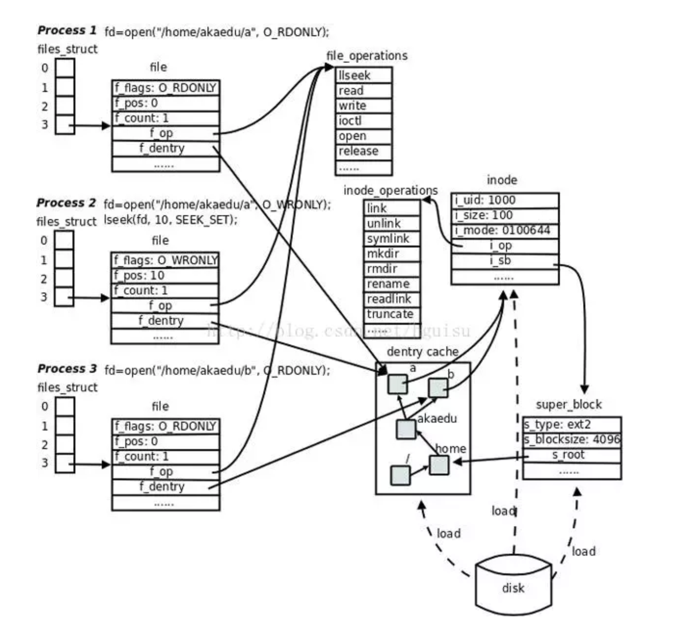
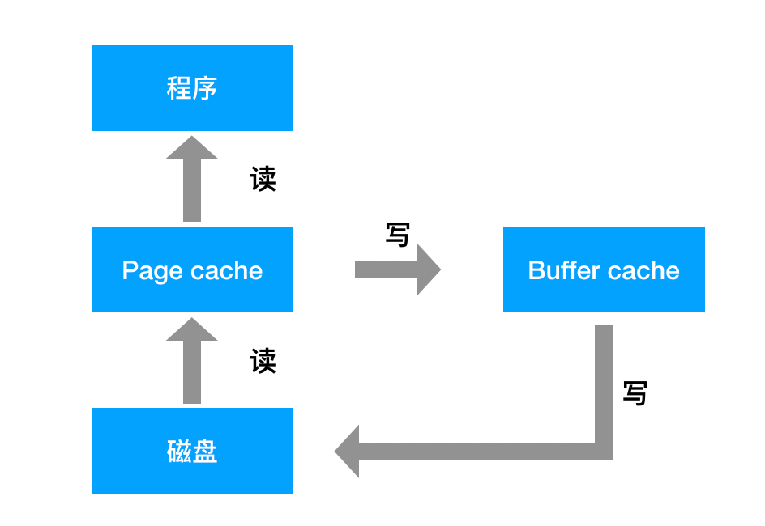

# [torvalds/linux](https://github.com/torvalds/linux)

* 一个可以实现多用户登陆的操作系统，多用户可以同时登陆同一台主机，共享主机的一些资源，不同的用户也分别有自己的用户空间，可用于存放各自的文件。虽然不同用户的文件是放在同一个物理磁盘上的甚至同一个逻辑分区或者目录里，但是由于 Linux 的用户管理和 文件权限机制，不同用户不可以轻易地查看、修改彼此的文件
* 系统默认的字符编码是 UTF-8。Windows 是 GBK 编码，不支持UTF8. 所以 Linux下 的中文文件名到 Windwos下就成了乱码
* 特点
  - 单内核，与之相反的是微内核
  - 模块化设计，支持动态加载内核模块
  - 支持对称多处理机制（SMP），多个处理器需要考虑共享资源问题
  - 抢占式多任务操作系统，内核对进程的调度属于抢占式
  - 支持内核线程，但不区分线程与进程，对他来说所有进程都一样

## Linux vs Unix

Linux是基于Unix的，属于Unix类，Uinx操作系统支持多用户、多任务、多线程和支持多种CPU架构的操作系统。Linux继承了Unix以网络为核心的设计思想，是一个性能稳定的多用户网络操作系统。

* Unix
  - Unix的历史起始于二十世纪六十年代的AT&T贝尔实验室，在那时，一小组程序员正在为PDP-7编写多任务、多用户操作系统。在贝尔实验室研究机构的这个小组里有两位最知名的人物，ken Thompson和Dennis Ritchie。尽管Unix的许多概念继承于它的先驱Multics，但在二十世纪八十代早期Unix小组用C语言重写这个小型操作系统的决定使得Unix与其它的系统区别开来。只有几百个系统调用，秉承一切皆文件的设计思想。那个时候的操作系统很少是可移植的。相反，由于先天的设计和底层源语言，那些操作系统和所被授权运行的硬件平台紧密地联系在一起。通过使用C语言重构Unix，现在Unix可以被移植到许多硬件平台。
  - 除了这个新的可移植移能力，有几个对于用户和程序员来说很有吸引力的操作系统设计的关键点使得Unix扩张到除贝尔实验室以外的其它领域，如研究、学术甚至商业用途。
  - 关键点一，Ken Thompson的Unix哲学成为了模块化软件设计和计算的强有力的典范。
  - Unix哲学建议使用小规模的为特定目的构建的程序的结合体来处理复杂的总体任务。由于Unix是围绕着文件和管道设计的，这个"piping（管道)“模型至今仍然很流行，它把程序的输入和输出链接在一起作为一系列的线性输入操作。实际上，当今的函数即服务（FaaS）/无服务器计算模型要更多地归功于对Unix哲学的继承。
  - 在20世纪70和80年代末，Unix成为了族谱的根，族谱扩展到研究届、学术届和不断增长的商业Unix操作系统业务。Unix不是开源软件，Unix源码可以与它的拥有者AT&T通过协议获得许可证。第一个已知的软件许可证在1975年卖给了伊利诺伊大学。
  - Unix在学术界发展迅速，随着伯克利成为重要的活动中心，在70年代给了Ken Thompson一个学术休假。通过在伯克利的Unix的所有活动，一个新的Unix软件支付诞生了：伯克利软件发行版，或者叫BSD。最初，BSD并不是AT&T的Unix的代替品，而是附加软件和功能附加品。直到1979年的2BSD（第二Berkeley软件发型版），ｓｙｓ伯克利研究生Bill Joy已经添加了现在知名的程序，例如vi和C shell（/bin/csh）。
  - 除了BSD，它成为了Unix家族中最受欢迎的分支之一，Unix的商业产品在20世纪80年代和90年代激增，包括HP-UX、IBM的AIX、Sun的Solaris、Sequent和Xenix。随着分支从最初的根开始增长，“Unix战争”开始了，标准化成为了社区的一个新焦点。POSIX标准诞生于1988年，以及其他开源工作组的标准化工作一直进行到到20世纪90年代。
  - BSD可能是当今所有现代Unix系统中最大的安装基础。此外，在最近的历史中，每一个苹果Mac硬件单元搭载的系统都可以被称为BSD，因为它的OS X（现在的macOS）操作系统是一个BSD-派生。
  - Unix树的BSD分支是开源的，而NetBSD、OpenBSD和FreeBSD都有强大的用户群和开源社区
* Linux
  - 由芬兰大学生linus在1991年开发，基于Intel80386微处理器，开发完后就在因特网发布了源码。它借鉴了unix的很多设计思想，但它的实现完全不同，算是一个不同的操作系统。开源协议非常自由，可以自由修改，但需要将改过的源码继续发布出来。
  - Linux操作系统实际上是90年代初期的两个成果的组合。 Richard Stallman希望创建一个作为替代私有Unix系统的真正免费的和开源的系统。他正在以GNU的名义开发实用工具和程序，这是一种递归算法，意思是“GNU不是Unix！” 虽然它有一个内核项目正在进行，但结果证实开展起来很困难，这样没有内核，免费并开源操作系统的梦想就无法实现。
  - Linus Torvald的工作:编写出一种可工作的和可行的内核，被他称为Linux--整个操作系统因此而诞生。鉴于Linus使用的是多种GNU工具（例如GNU编译器集合或GCC），GNU工具和Linux内核的结合是天生的绝配。
  - Linux发行版使用GNU提供的组件、Linux内核，MIT的X-Windows GUI以及其他可以在开源BSD许可下使用的BSD组件来实现。像Slackware和Red Hat这样的发行版的早期流行给了上世纪90年代的“普通PC用户”使用Linux操作系统的机会，以及他们在工作或学术生活中使用的许多专有的Unix系统功能和实用工具。
  - 在免费和开源组件之上提供支持的商业Linux产品变得可行，因为包括IBM在内的许多企业都从专有的Unix迁移到在Linux上提供中间件和软件解决方案。Red Hat在Red Hat Enterprise Linux周围建立了一个商业支持模型，德国供应商SUSE Linux Enterprise Server（SLES）也是如此。
  - GNU:是由Richard Stallman（理查德·斯托曼）在1983年9月27日公开发起的自由软件集体协作计划。它的目标是创建一套完全自由的操作系统。GNU也称为自由软件工程项目。
  - GNU系统与Linux内核结合构成一个完整的操作系统：一个基于Linux的GNU系统，该操作系统在通常情况下称为“GNU/Linux”，或简称Linux。
* GPL是GNU的通用公共许可证（GNU General Public License，GPL），即“反版权”概念，是GNU协议之一，目的是保护GNU软件可以自由的使用、复制、研究、修改和发布。同时要求软件必须以源代码的形式发布。
* 相似
  - 用户体验角度来讲，没有太多区别！Linux的大部分优点包括操作系统可跨多硬件架构（包括现代PC）特性，以及能够让Unix系统的管理员和用户使用他们熟悉的工具的能力。
  - 在Unix上编写的软件可以在Linux操作系统上编译，而在移植方面不用花费太多的功夫。
  - 作为把Linux作为主要目标的开发平台，macOS设备和操作系统的普及，可能归功于类BSD的macOS操作系统。很多Linux系统工具和脚本可以简单地在macOS终端运行。很多在Linux上可用的开源软件组件也可以在macOS上使用，如Homebrew。
* 区别
  - 开源vs私有，授权软件
    + Unix发行版中缺少通用内核对软件和硬件供应商都有影响。由于Unix家族的商业和学术分支，供应商可能不得不为不同版本的Unix开发不同的驱动，而且作为很多不同版本的Unix的二进制设备驱动，对这些软件的SDK或者发行版本的访问，也会让他们有授权和其他方面的担忧。
    + 对于Linux，供应商可以为特定硬件设备创建设备驱动，并有理由预计，它可以在大多数发行版中运行。
* Linux 已经显示出超越专有 Unix 的显著优势在于其在大量硬件平台和设备上的可用性。 Raspberry Pi 受到业余爱好者和发烧友的欢迎，它是 Linux 驱动的，为运行 Linux 的各种物联网设备打开了大门。 已经提到了 Android 设备，汽车（包括Automotive Grade Linux）和智能电视，其中Linux占有很大的市场份额

## 10 moments that shaped Linux history

* Linus Torvalds initially released Linux to the world in 1991 as a hobby. It didn't remain a hobby for long!
* In 1993, several Linux distributions were founded, notably Debian, Red Hat, and Slackware. These were important because they demonstrated Linux's gains in market acceptance and development that enabled it to survive the tumultuous OS wars, browser wars, and protocol wars of the 1990s. In contrast, many established, commercial, and proprietary products did not make it past the turn of the millennium!
* In 2000, IBM announced it would invest US$1 billion dollars in Linux. In his CNN Money [article about the investment](https://money.cnn.com/2000/12/12/technology/ibm_linux), Richard Richtmyer wrote: "The announcement underscores Big Blue's commitment to Linux and marks significant progress in moving the alternative operating system into the mainstream commercial market."
* In 2002, it seemed the entire Hollywood movie industry adopted Linux. Disney, Dreamworks, and Industrial Light & Magic all began making movies with Linux that year.
* In 2003, another big moment came with the US government's acceptance of Linux. Red Hat Linux was awarded the Department of Defense Common Operating Environment (COE) certification. This is significant because the government—intelligence and military agencies in particular—have very strict requirements for computing systems to prevent attacks and support national security. This opened the door for other agencies to use Linux. Later that year, the National Weather Service announced it would replace outdated systems with new computers running Linux.
* This "moment" is really a collection of my personal experiences. As my career progressed in the 2000s, I discovered several types of systems and devices that I managed were all running Linux. Some of the places I found Linux were VMware ESX, F5 Big-IP, Check Point UTM Edge, Cisco ASA, and PIX. This made me realize that Linux was truly viable and here to stay.
* In 2004, Canonical was founded by Mark Shuttleworth to provide an easy-to-use Linux desktop—Ubuntu Linux—based on the Debian distribution. I think Ubuntu Linux helped to expand the desktop Linux install base. It put Linux in front of many more people, from casual home users to professional software developers.
* Google released two operating systems based on the Linux kernel: the Android mobile operating system in mid-2008 and Chrome OS, running on a Chromebook, in 2011. Since then, millions of Android mobile phones and Chromebooks have been sold.
* In the past 10 years or so, cloud computing has gone from a grandiose vision of computing on the internet to a reinvention of how we use computers personally and professionally. The big players in the cloud space are built on Linux, including Amazon Web Services, Google Cloud Services, and Linode. Even in cases where we aren't certain, such as Microsoft Azure, running Linux workloads is well supported.
* Many automakers began introducing Linux a few years ago. This led to the formation of the collaborative open source project called Automotive Grade Linux. Major car makers, such as Toyota and Subaru, have joined together to develop Linux-based automotive entertainment, navigation, and engine-management systems.

### 发行版

* GNU
  - Linux
* BSD
  - Mac
* 入门：类似Windows的体验；安装简单；可靠；“类似Linux”，且不自成一派；“恰好管用”；
  - [Linux Mint](https://linuxmint.com/)
    + [Duter2016 / Guide-for-linuxmint](https://github.com/Duter2016/Guide-for-linuxmint)
  - Debian 10
* 进阶：完全掌控你的电脑和操作系统；了解Linux内部；精简的优化系统
  - Slackware Linux
  - [Arch Linux](https://www.archlinux.org/)
  - [Gentoo Linux](https://www.gentoo.org/)
* 安全与稳定：为学习最新的东西而甘冒风险；最新和最伟大的功能；有趣的配置以便于处理重大更改
  - Fedora 31 Workstation
  - [Kali](https://www.kali.org/)
    + [offensive-security/kali-linux-docker](https://github.com/offensive-security/kali-linux-docker):Kali Linux Docker
    + [ Jack-Liang / kalitools ](https://github.com/Jack-Liang/kalitools):Kali Linux工具清单
* 正常：运行平稳，维护量低；最小配置；大部分事情可以自动完成；兼容硬件和软件
  - [openSUSE](https://www.opensuse.org/)
  - Ubuntu 20.04 LTS
  - [UbuntuDDE](https://ubuntudde.com/): Powerful Ubuntu with the most beautiful desktop environment.
* 服务器：稳定性；安全；支持其他出于同样原因的程序员使用
  - [CentOS](https://www.centos.org/)
  - Red Hat Enterprise Linux (RHEL)
  - [FreeBSD](https://www.freebsd.org/)
* 性能：显著的性能提升；高负载计算
  - Clear Linux  (For Intel CPUS, by Intel)
* 桌面：安全性；匿名性
  - TAILS Linux
  - Alpine Linux
  - CoreOS
  - TENS Linux (DOD Project)
  - Tin Hat Linux
  - [OpenBSD](http://www.openbsd.org/)
  - [Manjaro](https://manjaro.org/):anjaro is a professionally made Linux based operating system that is a suitable replacement for Windows or MacOS. Multiple Desktop Environments are available through our Official and Community editions. We also work with manufacturers to design dedicated hardware. Visit the shop for more information 基于 Arch 的 Linux 发行版,安装是一件稍微复杂的工作
    + [Manjaro 配置记录](https://10101.io/2020/05/24/manjaro-configuration)
  - [Elementary OS](https://elementary.io/)
  - [openEuler](https://openeuler.org/):
* 最小化：将在旧的硬件上运行；尽可能最小化
  - ArchBang
  - [Kubuntu](https://kubuntu.org/):unites Ubuntu with KDE and the fabulous Plasma desktop, bringing you a full set of applications.  需要等待数月来获取新的 KDE 软件
  - [Lubuntu](https://lubuntu.net/):a fast and lightweight operating system with a clean and easy-to-use user interface.It is a Linux system, that uses the minimal desktop LXDE/LXQT, and a selection of light applications
  - Puppy Linux
  - Tiny Core Linux
  - Bodhi Linux
* SUSE Linux Enterprise Server
* [Zorin OS](https://zorinos.com/):努力提供了良好的用户体验
  - [Zorin Grid](https://itsfoss.com/zorin-grid/)
* Cub Linux
* Icaros Desktop
* [Pop!_os](https://system76.com/pop):an operating system for STEM and creative professionals who use their computer as a tool to discover and create
* [KDE Neon](https://neon.kde.org/):基于 Ubuntu 的轻量级 Linux 发行版,采用 KDE Plasma 桌面，看起来精美绝伦
* [Nitrux](https://nxos.org/)
* [MX Linux](https://mxlinux.org/)
* [AntiX](https://antixlinux.com/)

## 桌面环境

* UNIX/Linux 本身是没有图形界面的，通常在 UNIX/Linux 发行版上看到的图形界面实际都只是运行在 Linux 系统之上的一套软件,以前是 XFree86，现在则是 xorg（X.Org）
* 通过 X 窗口系统（X Window System，也常被称为 X11 或 X）实现的，X 本身只是工具包及架构协议，而 xorg 便是 X 架构规范的一个实现体，实现了 X 协议规范的一个提供图形界面服务的服务器，就像实现了 http 协议提供 web 服务的 Apache
* 如果只有服务器也是不能实现一个完整的桌面环境的，还需要一个客户端 X Client，像如下几个熟知也最流行的实现了客户端功能的桌面环境
  - [KDE](https://kde.org/)
  - [Xfce](https://www.xfce.org/)
  - GNOME
  - LXDE

## 启动

* 初始：BIOS -> MBR -> 引导加载程序 -> 内核
  - 自动从主板的BIOS(Basic Input/Output System)读取其中所存储的程序（直接连接在主板上的硬件(硬盘，网络接口，键盘，串口，并口)）
  - 从所选择的启动存储设备中读取起始的 512 bytes 主引导记录MBR (master boot record)，告诉电脑从该设备的某一个分区(partition)来装载引导加载程序(boot loader)。Boot loader储存有操作系统(OS)的相关信息，比如操作系统名称，操作系统内核 (内核)所在位置等。常用的boot loader有GRUB和LILO
  - boot loader会加载内核(kernel)。内核实际上是一个用来操作计算机的程序，它是计算机操作系统的内核，主要的任务是管理计算机的硬件资源，充当软件和硬件的接口。操作系统上的任何操作都要通过内核传达给硬件
* 内核：内核 -> init process
  - 内核会首先预留自己运行所需的内存空间
  - 通过驱动程序(driver)检测计算机硬件，操作系统就可以知道有哪些硬件可用
  - 内核会启动一个init进程。它是Linux系统中的1号进程(Linux系统没有0号进程)
* init process
  - 单用户模式(single user mode)：初始脚本还没有开始执行，可以检测并修复计算机可能存在的错误
  - 一系列的初始脚本(startup scripts)：常见的shell scripts，执行如下功能： 设置计算机名称，时区，检测文件系统，挂载硬盘，清空临时文件，设置网络
  - 给出登录(login)对话框，或者是图形化的登录界面
* GNU GRUB（GRand Unified Bootloader简称“GRUB”）是一个来自GNU项目的多操作系统启动引导管理程序。
  - GRUB是一个支持多种操作系统的启动引导管理器，在一台有多个操作系统的计算机中，可以通过GRUB在计算机启动时选择用户希望运行的操作系统。
  - 同时GRUB可以引导Linux系统分区上的不同内核，也可用于向内核传递启动参数，如进入单用户模式。
  - 同时支持EFI和BIOS方式的启动

```sh
# 启动盘制作
sudo dd bs=4M if=/home/hcf/dev/iso/ubuntu-16.04-desktop-amd64.iso of=/dev/sdb4
```

## 组成

* Linux内核处于用户进程和硬件之间，负责管理系统的进程、内存、设备驱动程序、文件和网络系统，决定着系统的性能和稳定性。除系统调用外，由五个主要的子系统组成：
  - 进程管理
    + 进程实际是某特定应用程序的一个运行实体
    + 调度程序:通过在短的时间间隔内轮流运行这些进程而实现“多任务”。这一短的时间间隔称为“时间片”，让进程轮流运行的方法称为“进程调度”
    + 进程调度控制进程对CPU的访问。当需要选择下一个进程运行时，由调度程序选择最值得运行的进程。可运行进程实际上是仅等待CPU资源的进程，如果某个进程在等待其它资源，则该进程是不可运行进程。Linux使用了比较简单的基于优先级的进程调度算法选择新的进程。
    + 通过多任务机制，每个进程可认为只有自己独占计算机，从而简化程序的编写。每个进程有自己单独的地址空间，并且只能由这一进程访问，这样，操作系统避免了进程之间的互相干扰以及“坏”程序对系统可能造成的危害
    + 进程间的通讯机制来帮助完成这样的任务。Linux 中常见的进程间通讯机制有信号、管道、共享内存、信号量和套接字等
    + 内核通过 SCI 提供了一个应用程序编程接口（API）来创建一个新进程（fork、exec 或 Portable Operating System Interface [POSⅨ] 函数），停止进程（kill、exit），并在它们之间进行通信和同步（signal 或者 POSⅨ 机制）。
  - 内存管理：允许多个进程安全地共享主内存区域，支持虚拟内存.括了管理可用内存的方式，以及物理和虚拟映射所使用的硬件机制
    + 将内存划分为容易处理的“内存页”（对于大部分体系结构来说都是 4KB）
    + 提供了对 4KB 缓冲区的抽象,使用 4KB 缓冲区为基数，然后从中分配结构，并跟踪内存页使用情况，比如哪些内存页是满的，哪些页面没有完全使用，哪些页面为空。这样就允许该模式根据系统需要来动态调整内存使用。
    + 交换:出现可用内存被消耗光的情况，页面可以移出内存并放入磁盘中。源代码可以在 ./linux/mm 中找到
    + Swap分区，即交换区，系统在物理内存不够时，与Swap进行交换。
      * 即当系统的物理内存不够用时，把硬盘中一部分空间释放出来，以供当前运行的程序使用。当那些程序要运行时，再从Swap分区中恢复保存的数据到内存中。
      * 那些被释放内存空间的程序一般是很长时间没有什么操作的程序。
      * Swap空间一般应大于或等于物理内存的大小，同时最小不应小于64M，最大应该是物理内存的两倍。
  - 设备驱动程序:为每一种硬件控制器所编写的设备驱动程序模块。实际控制操作系统和硬件设备之间的交互.运行在高特权级的处理器环境中，从而可以直接对硬件进行操作,任何一个设备驱动程序的错误都可能导致操作系统的崩溃.
    + 提供一组操作系统可理解的抽象接口完成和操作系统之间的交互，而与硬件相关的具体操作细节由设备驱动程序完成。一般而言，设备驱动程序和设备的控制芯片有关，例如，如果计算机硬盘是 SCSI  硬盘，则需要使用 SCSI  驱动程序，而不是 IDE 驱动程序。
  - 文件系统：将独立的文件系统组合成了一个层次化的树形结构，并且由一个单独的实体代表这一文件系统
    + 将新的文件系统通过一个称为“挂装”或“挂上”的操作将其挂装到某个目录上，从而让不同的文件系统结合成为一个整体
    + 类型
      * 普通文件：C语言元代码、SHELL脚本、二进制的可执行文件等。分为纯文本和二进制。
      * 目录文件：目录，存储文件的唯一地方。
      * 链接文件：指向同一个文件或目录的的文件。
      * 设备文件：与系统外设相关的，通常在/dev下面。分为块设备和字符设备。
      * 管道(FIFO)文件 :  提供进程建通信的一种方式
      * 套接字(socket) 文件： 该文件类型与网络通信有关
    + 虚拟文件系统(VirtualFileSystem,VFS):隐藏了各种不同硬件的具体细节，为所有设备提供统一的接口，支持多达数十种不同的文件系统，分为逻辑文件系统和设备驱动程序
      * 逻辑文件系统指Linux所支持的文件系统，如ext2,fat等
      * 设备驱动程序为每一种硬件控制器所编写的设备驱动程序模块
    + 虚拟文件系统（VFS）是 Linux 内核中非常有用的一个方面，因为它为文件系统提供了一个通用的接口抽象。VFS 在 SCI 和内核所支持的文件系统之间提供了一个交换层。即VFS 在用户和文件系统之间提供了一个交换层。
      * 在 VFS 上面，是对诸如 open、close、read 和 write 之类的函数的一个通用 API 抽象。在 VFS 下面是文件系统抽象，它定义了上层函数的实现方式。它们是给定文件系统（超过 50 个）的插件。文件系统的源代码可以在 ./linux/fs 中找到。
    + 文件系统层之下是缓冲区缓存，它为文件系统层提供了一个通用函数集（与具体文件系统无关）。这个缓存层通过将数据保留一段时间（或者随即预先读取数据以便在需要是就可用）优化了对物理设备的访问
    + 缓冲区缓存之下是设备驱动程序，它实现了特定物理设备的接口
  - 网络接口（NET）：提供了对各种网络标准协议的存取和各种网络硬件的支持，分为网络协议和网络驱动程序两部分；
    + 网络协议部分负责实现每一种可能的网络传输协议。众所周知，TCP/IP  协议是 Internet  的标准协议，同时也是事实上的工业标准。
    + 网络部分由BSD套接字、网络协议层和网络设备驱动程序组成。网络设备驱动程序负责与硬件设备通讯，每一种可能的硬件设备都有相应的设备驱动程序。
  - 系统调用接口：SCI 层提供了某些机制执行从用户空间到内核的函数调用。这个接口依赖于体系结构。SCI 实际上是一个非常有用的函数调用多路复用和多路分解服务。在 ./linux/kernel 中您可以找到 SCI 的实现，并在 ./linux/arch 中找到依赖于体系结构的部分
    + 每个系统调用都对应一个系统调用号，调用号用于指明具体哪个系统调用
    + 系统调用既为应用程序提供了请求接口，又保证了系统的安全和稳定。用户空间的程序不能直接访问内核代码，内核代码驻留在受保护的内存地址中，用户进程无法访问这块内存。
    + 应用程序一般会使用用户空间实现的应用编程接口来间接调用系统调用，API可以通过一个或若干个系统调用来实现一个接口，而且能屏蔽不同操作系统的差异，为应用程序提供相同的接口
    + 操作系统为用户态的进程与硬件设备(如CPU、磁盘和打印机等)之间的交互提供了一组接口，这些接口使得程序更具有可移植性，因为不同的操作系统只要所提供的一组接口相同，那么在这些操作系统之上就可以正确地编译和执行相同的程序，这组接口就是所谓的“系统调用”；
    + 引入系统调用的原因有：
      * 系统调用在用户进程和硬件设备之间增加一层，屏蔽了硬件的复杂操作，从而让应用层的使用更加便捷。
      * 使得编程更加容易
      * 极大地提高了系统的安全性
      * 使得操作系统更具有可移植性
* 一些GNU程序库和工具:图形界面的X Window系统和相应的桌面环境，如KDE或GNOME，并包含数千种从办公套件，编译器，文本编辑器到科学工具的应用软件
* 命令行shell：系统的用户界面，提供了用户与内核进行交互操作的一种接口。它接收用户输入的命令并把它送入内核去执行，是一个命令解释器
  - Bourne Shell：是贝尔实验室开发的。
  - BASH：是GNU的Bourne Again Shell，是GNU操作系统上默认的shell,大部分linux的发行套件使用的都是这种shell。
  - Korn Shell：是对Bourne SHell的发展，在大部分内容上与Bourne Shell兼容。
  - C Shell：是SUN公司Shell的BSD版本。

```sh
# 查看
free -h
# swap文件位置
swapon -s
# 新增
dd if=/dev/zero of=/swapmem bs=1G count=2
#　使用
mkswap -f swapmem
chmod 0600 swapmem
#　关闭
swapoff /swapfile
swapon /swapmem

# 开机启动 /etc/fstab
 UUID=fa207ef7-79a7-4092-8381-98c2a5143c74 /               ext4    errors=remount-ro 0       1
 10 /swapmem                                 none            swap    sw              0       0
 11 /dev/fd0        /media/floppy0  auto    rw,user,noauto,exec,utf8 0       0
```

## 配置

```sh
## ~/.bashrc:
# set default editor to Vim
export EDITOR=vim

lshw -class disk -class storage -short
```

## 内核

* [kernal](https://www.kernel.org/)
* 操作系统的核心是内核，独立于普通的应用程序，可以访问受保护的内存空间，也有访问底层硬件设备的所有权限

```sh
uname -sr
```

## 内存

* 地址
  - 将主板上的物理内存条所提供的内存空间定义为物理内存空间，其中每个内存单元的实际地址就是物理地址
  - 将程序员看到的内存空间定义为虚拟地址空间(或地址空间)，其中的地址就叫做虚拟地址(或虚地址)，一般用“段:偏移量”的形式来描述，如A815:CF2D
  - 线性地址空间是指一段连续的、不分段的、范围为0~4GB的地址空间，一个线性地址就是线性地址空间的一个绝对地址
* 虚地址转换为物理地址：在保护模式下，内存管理单元(MMU)由一个或一组芯片组成，其功能是指虚拟地址映射为物理地址，即进行地址转换；MMU是一种硬件电路，它包含分段部件和分页部件两个部件，分别叫做分段机制和分页机制
  - 分页机制是把一个线性地址转换为物理地址
  - 32位线性地址空间要采用两级页表：页表是把线性地址映射到物理地址的一种数据结构，4GB的线性空间可以被划分为1M个4KB大小的页，每个页表项占4字节，则1M个页表项的页表就需要占用4MB空间，而且还要求是连续的，于是采用两级页表来实现；两级页表就是对页表再进行分页，第一级称为页目录，其中存放关于页表的信息；4MB的页表再次分页，可以分为1K个4KB大小的页
* 页面高速缓存自动保留处理器最近使用的32项页表项，因此可以覆盖128KB范围的内存
* 采用分页机制来实现虚拟存储器管理
  - Linux的分段机制使得所有的进程都使用相同的段寄存器，这使得内存管理变得简单
  - Linux的设计目标之一就是能够被移植到绝大多数流行的处理平台上，但许多RISC处理器支持的分段功能非常有限；为了保证可移植性，Linux采用三级分页模式，因为许多处理器都采用64位结构；Linux定义了三种类型的页表：页目录(PGD)、中间目录(PMD)和页表(PT)。
* 请求调页
  - 如果被访问的页不在内存，也就是这个页还没有被存放在任何一个物理页面中内核分配一个新的页面并将其适当地初始化，这种技术称为“请求调页”；
  - “请求调页”是一种动态内存分配技术，将页面的分配推迟到不能再推迟为止，一直推迟到进程要访问的页不在物理内存时为止，由此引起一个缺页异常；该技术的引入主要是因为进程开始运行时并不访问其地址空间中的全部地址
* `free -m`: 可用的memory=free memory+buffers+cached
* Buffer和Cache
  - Cache（缓存）位于CPU与内存之间的临时存储器，缓存容量比内存小的多但交换速度比内存要快得多。Cache通过缓存文件数据块，解决CPU运算速度与内存读写速度不匹配的矛盾，提高CPU和内存之间的数据交换速度。Cache缓存越大，CPU处理速度越快。
  - Buffer（缓冲）高速缓冲存储器，通过缓存磁盘（I/O设备）数据块，加快对磁盘上数据的访问，减少I/O，提高内存和硬盘（或其他I/O设备）之间的数据交换速度。Buffer是即将要被写入磁盘的，而Cache是被从磁盘中读出来的。
* overcommit_memory
  - 0:表示内核将检查是否有足够的可用内存供应用进程使用；如果有足够的可用内存，内存申请允许；否则，内存申请失败，并把错误返回给应用进程。
  - 1:表示内核允许分配所有的物理内存，而不管当前的内存状态如何
  - 2:表示内核允许分配超过所有物理内存和交换空间总和的内存
* 零拷贝 zero-copy:避免 CPU 将数据从一块存储拷贝到另外一块存储
  - 服务端：文件内容是否缓存在内核缓冲区->循环的从磁盘读入文件内容->(DMA)内核缓冲区->用户空间缓冲区->网络堆栈相关内核缓冲区->已连接的 Socket
  - 让数据传输不需要经过 user space
  - mmap
    + 用 mmap () 来代替 read 调用:磁盘上的数据会通过 DMA 被拷贝的内核缓冲区，接着操作系统会把这段内核缓冲区与应用程序共享
    + 调用 write ()，操作系统直接将内核缓冲区的内容拷贝到 Socket 缓冲区中，这一切都发生在内核态，最后，Socket 缓冲区再把数据发到网卡去
    + 隐藏陷阱:当程序 map 了一个文件，但是当这个文件被另一个进程截断 (truncate) 时，Write 系统调用会因为访问非法地址而被 SIGBUS 信号终止。SIGBUS 信号默认会杀死你的进程并产生一个 coredump，如果你的服务器这样被中止了，那会产生一笔损失
    + 解决方案
      * 为 SIGBUS 信号建立信号处理程序:遇到 SIGBUS 信号时，信号处理程序简单地返回，Write 系统调用在被中断之前会返回已经写入的字节数，并且 errno 会被设置成 success
      * 使用文件租借锁:在文件描述符上使用租借锁，我们为文件向内核申请一个租借锁.当其他进程想要截断这个文件时，内核会向我们发送一个实时的 RTSIGNALLEASE 信号，告诉我们内核正在破坏加持在文件上的读写锁.这样在程序访问非法内存并且被 SIGBUS 杀死之前，你的 Write 系统调用会被中断。Write 会返回已经写入的字节数，并且置 errno 为 success
  - 从 2.1 版内核开始，Linux 引入了 sendfile 来简化操作：利用 DMA 引擎将文件内容拷贝到内核缓冲区去，然后将带有文件位置和长度信息的缓冲区描述符添加 Socket 缓冲区去
    + 系统调用 sendfile () 在代表输入文件的描述符 infd 和代表输出文件的描述符 outfd 之间传送文件内容（字节）
    + 描述符 outfd 必须指向一个套接字，而 infd 指向的文件必须是可以 mmap 的.这些局限限制了 sendfile 的使用，使 sendfile 只能将数据从文件传递到套接字上，反之则不行。
    +  不仅减少了数据拷贝的次数，还减少了上下文切换，数据传送始终只发生在 kernel space
    +  调用 sendfile 时，如果有其它进程截断了文件会发生什么:仅仅返回它在被中断之前已经传输的字节数，errno 会被置为 success
    +  在调用 sendfile 之前给文件加了锁，sendfile 的行为仍然和之前相同，我们还会收到 RTSIGNALLEASE 的信号
    +  省略页缓存数据拷贝到 Socket 缓存中：仅仅需要把缓冲区描述符传到 Socket 缓冲区，再把数据长度传过去，这样 DMA 控制器直接将页缓存中的数据打包发送到网络中就可以
    +  需要硬件以及驱动程序支持
    +  只适用于将数据从文件拷贝到套接字上
  - 2.6.17 版本引入 splice 系统调用，用于在两个文件描述符中移动数据
    + 调用在两个文件描述符之间移动数据，而不需要数据在内核空间和用户空间来回拷贝
    + 从 fdin 拷贝 len 长度的数据到 fdout，但是有一方必须是管道设备， splice 的一些局限性
    + flags 参数有以下几种取值：
      * SPLICEFMOVE：尝试去移动数据而不是拷贝数据。这仅仅是对内核的一个小提示：如果内核不能从 pipe 移动数据或者 pipe 的缓存不是一个整页面，仍然需要拷贝数据。
      * Linux 最初的实现有些问题，所以从 2.6.21 开始这个选项不起作用，后面的 Linux 版本应该会实现。
      * SPLICEFNONBLOCK：splice 操作不会被阻塞。然而，如果文件描述符没有被设置为不可被阻塞方式的 I/O ，那么调用 splice 有可能仍然被阻塞
      * SPLICEFMORE：后面的 splice 调用会有更多的数据
    + 数据必须在用户空间和内核空间之间拷贝
      * Linux 通常利用写时复制（copy on write）来减少系统开销，这个技术又时常称作 COW.多个程序同时访问同一块数据,只有当程序需要对数据内容进行修改时，才会把数据内容拷贝到程序自己的应用空间里去

```sh
# /etc/sysctl.conf ，改vm.overcommit_memory=1，然后sysctl -p 使配置文件生效
sysctl vm.overcommit_memory=1
echo 1 > /proc/sys/vm/overcommit_memory

buf = mmap(diskfd, len);
write(sockfd, buf, len);

## 应该在 mmap 文件之前加锁，并且在操作完文件后解锁
if(fcntl(diskfd, F_SETSIG, RT_SIGNAL_LEASE) == -1) {
    perror("kernel lease set signal");
    return -1;
}
/* l_type can be F_RDLCK F_WRLCK  加锁*/
/* l_type can be  F_UNLCK 解锁*/
if(fcntl(diskfd, F_SETLEASE, l_type)){
    perror("kernel lease set type");
    return -1;
}

#include<sys/sendfile.h>
ssize_t sendfile(int out_fd, int in_fd, off_t *offset, size_t count);

#define _GNU_SOURCE         /* See feature_test_macros(7) */
#include <fcntl.h>
ssize_t splice(int fd_in, loff_t *off_in, int fd_out, loff_t *off_out, size_t len, unsigned int flags);
```

## 进程&线程

* 程序是一些保存在磁盘上的指令的有序集合,是静态的的一个可执行映像中，可执行映像(executable image)就是一个可执行文件的内容
* 进程代表程序的执行过程，它是一个动态的实体，包括了动态创建、调度和消亡的整个过程,随着程序中指令的执行而不断地变化，在某个时刻进程的内容被称为进程映像(process image),是程序资源管理的最小单位
  - 程序执行过程是一个执行环境的总和，除了包括程序中各种指令和数据外，还有一些额外数据
  - 执行环境的动态变化体现了程序的运行，为了对动态变化的过程进行描述，就引入了“进程”概念
* 进程
  - 处于执行期的程序，包含各种资源，比如文件、信号、内核数据、处理器状态、内存空间、执行线程、全局数据段等。进程提供了虚拟处理器和虚拟内存，看起来进程就像自己独享相应资源
  - 内核将所有进程保存在任务队列中，是一个双向循环链表，该链表中每个节点的类型都是task_struct进程描述符结构
  - 所有进程都是PID为1的init进程的后代，内核启动的最后阶段启动init进程，负责读取系统的初始化脚本并执行其它相关程序
  - 每个进程都有一个父进程，每个进程也都可以有零个或多个子进程
  - fork()用于创建子进程，通过拷贝当前进程来创建一个子进程，父子进程区别在于PID、PPID、某些资源、统计量不同
    + 由操作系统内核实现的系统调用，用于创建当前进程自身的一个副本
    + fork()使用了写时拷贝机制，父进程和子进程共享同一个拷贝，只有需要写入时数据才会被复制
    + fork()的实际开销:复制父进程的页表以及给子进程创建唯一进程描述符
  - exec()负责读取可执行文件并将其载入空间开始运行
    + 由操作系统内核实现的系统调用，用于在已有进程的上下文中运行一个可执行文件
  - 进程调用exit()系统调用时进程被终结
  - 运行着的程序，每个进程都有着它自己的地址空间，由被允许进程访问的内存地址组成
  - 有一个或多个执行线程，而线程是一系列执行指令的集合
    + 一个进程中的线程共享各种资源，特别是地址空间
    + 一个进程中的线程可以直接通过共享内存来进行通信
  - 不同的进程，默认情况下，它们不能共享内存
  - 环境变量通常在系统启动时由初始化脚本进行初始化，然后由系统中的所有其他进程继承。同样，当在一个程序中打开另一个程序时，调用程序会先复制一个与自身完全一样的进程，即子进程。子进程可以根据需要修改环境变量。子进程再通过执行被调用的程序来覆盖自己
* 进程控制块：对进程的描述结构叫做task_struct，将这样的数据结构称作进程控制块(PCB)
  - PCB是一个其域多达80多项的相当庞大的数据结构，按其功能将所有域划分为：状态信息，链接信息、各种标识符、进程间通信信息、时间和定时器信息、调度信息、文件系统信息、虚拟内存信息和处理器环境信息
  - 组织方式有：进程链表、散列表、可运行队列和等待队列
* 进程切换:内核必须有能力挂起正在CPU上运行的进程，并恢复以前挂起的某个进程的执行
  - 流程
    + 保存处理机上下文，包括程序计数器和其他寄存器
    + 更新PCB信息
    + 把进程的PCB移入相应的队列，如就绪、在某事件阻塞等队列
    + 选择另一个进程执行，并更新其PCB
    + 更新内存管理的数据结构恢复处理机上下文
  - 进程阻塞：正在执行的进程，由于期待的某些事件未发生，如请求系统资源失败、等待某种操作的完成、新数据尚未到达或无新工作做等，则由系统自动执行阻塞原语(Block)，使自己由运行状态变为阻塞状态
* 内核状态
  - 运行态、就绪态和阻塞态(或等待态)
  - 四种可能的转换关系：运行态->阻塞态、运行态->就绪态、就绪态->运行态和阻塞态->就绪态
  - 将就绪态和运行态合并为一个状态—可运行态，再包括其它方面的一些改变，将进程状态划分为：可运行态、睡眠(或等待)态(分为深度睡眠态和浅度睡眠态)、暂停状态和僵死状态。
* 调度
  - 目的:最大限度地利用CPU时间，只要有可执行的任务就要尽量去执行，系统中几乎总是任务数大于处理器个数，所以肯定某个时刻有任务得不到执行
  - 多任务系统能并发地执行多个进程，一个CPU时是一对多，多个CPU时是多对多，所有任务看起来就像是同时在运行一样
  - 多任务系统分为抢占式和非抢占式
    + linux是抢占式调度，调度程序来决定进程的挂起和执行，每个进程能执行的时间为时间片，现代系统一般都有一定的策略来动态分配时间片
    + 非抢占式则是由进程自己主动停止，否则将一直运行下去，调度程序无法决定进程的运行停止，如果某个进程一直运行则会使系统奔溃
  - 调度策略
    + 进程分类
      * I/O密集型大部分时间进行各种I/O请求，通常这些进程只运行很短一段时间，然后就在I/O上阻塞了。
      * 处理器密集型则是大部分时间都用于代码执行上，不停地运行而且没有什么I/O请求。当然有些进程既是I/O密集型也是处理器密集型。对于前者我们希望时间片少一点，对于后者我们希望时间片多一点，调度策略就是要在两个矛盾中找到平衡，使得进程能够响应迅速又能最大系统利用率。
    + 优先级调度算法(非抢占式优先级算法和抢占式优先级算法)是最基本的一种调度算法，它把进程进行了分级，优先级高的先运行，优先级低的后运行，相同优先级的进程则轮流运行。某些系统中优先级高的进程将更频繁运行，且时间片也更长。调度程序选择时间片未用尽且优先级最高的进程来执行。linux有两种优先级范围，第一种是nice值，从-20到+19，默认为0，值越大优先级越低。第二种是实时优先级，默认范围是0到99，值越高表示优先级越高。任何实时进程的优先级都高于普通进程，也就是说nice优先级和实时优先级是两个不同维度。
    + 时间片轮转调度算法是进程在被抢占前所能持续运行的时间，默认的时间片大小不容易确定，时间片太长会使交互响应变差，时间片太短会增加进程切换带来的损耗。也就是前面说到的矛盾，I/O密集型希望时间片短点，而处理器密集型则希望时间片长点。
    + linux采用了完全公平调度（CFS）算法，它是一个针对普通进程的调度器，linux中称为SCHED_NORMAL，而POSIX则称为SCHED_OTHRER，实现类在kernel/sched_fair.c中。CFS允许每个进程运行一段时间、循环轮转、选择运行最少的进程作为待运行进程，CFS计算所有可运行进程总数作为基础，再计算一个进程应该运行多久，而不是靠优先级来计算时间片。CFS有一个最小时间片（最小粒度），默认是1ms。也就是说就算有无穷大个进程，每个进程最少也能有1ms时间片。CFS确保给每个进程公平的处理器使用比。
      * CFS不再简单使用时间片的概念，而是必须要维护每个进程运行的时间记账，以此确保每个进程公平分配。
      * CFS选择下一个待运行进程时它会挑一个具有最小运行时间的进程。
      * 睡眠（被阻塞）的进程处于不可执行状态，它将从可执行红黑树中移除，放到等待队列中。等待队列是简单链表结构，
      * 唤醒，与睡眠刚好相反，进程被设置为可执行状态，并且从等待队列中移到可执行红黑树中。
      * 上下文切换，即从一个可执行线程切换到另一个可执行进程，由kernel/sched.c的context_switch函数负责。将虚拟内存从上一个进程映射到新进程，保存恢复栈信息和寄存器信息以及其它相关信息。
      * 内核提供了need_resched标志来表明是否需要重新执行一次调度，内核无论是咋中断处理程序还是在系统调用后返回都会检查这个歌表示，如果被设置了则内核会选择一个更适合的进程投入运行。
    + 多级反馈队列调度算法
    + 实时调度算法：linux提供了两种实时调度策略：SCHED_FIFO和SCHED_RR。
      * 前者是一种简单的先入先出调度算法，它不使用时间片。处于SCHED_FIFO级别的进程会比任何SCHED_NORMAL级别的进程先得到调度。一旦某个SCHED_FIFO级别的进程处于可执行状态，它将会一直执行，直到它自己阻塞或显示释放CPU。只有更高优先级的SCHED_FIFO或SCHED_RR进程才能抢占它。两个相同优先级的SCHED_FIFO级别的进程会轮流执行，其它普通进程只能等它变为不可运行状态后才有机会执行。
      * SCHED_RR大致与SCHED_FIFO相同，但它是耗尽事先分配的时间后就不再继续执行，即SCHED_RR是带了时间片的SCHED_FIFO。时间片只是相对于同一优先级的进程，低优先级的进程无法抢占SCHED_RR任务，即使它的时间片耗尽也不行。
    + 考虑因素：考虑五个方面：公平、高效、响应时间、周转时间和吞吐量
* 为了保证用户进程不能直接操作内核（kernel），保证内核的安全，操心系统将虚拟空间划分为两部分
  - Linux的虚拟地址空间的大小为4GB，内核将这4GB的空间分为两部分
  - 内核空间:较高的1GB(虚地址0xC0000000到0xFFFFFFFF)供内核使用
  - 用户空间:较低的3GB(虚地址0x00000000到0xBFFFFFFF)供各个进程使用
  - 每个进程可以通过系统调用进入内核，内核空间由系统内的所有进程共享.从具体进程的角度来看，每个进程都可以拥有4GB的虚拟地址空间(也叫做虚拟内存)
* CPU活动状态
  - 运行于用户空间，执行用户进程
  - 运行于内核空间，处于进程上下文，表示执行某个进程
  - 运行于内核空间，处于中断上下文，此时与任务进程都无关，它在处理某个中断
* 线程是进程的活动对象，每个线程都拥有独立的程序计数器、进程栈和一组寄存器。操作操作系统能够进行运算调度的最小单位
  - 线程能在同一程序里面共享内存地址空间，共享文件和其它资源
  - 从内核角度来说linux并没有线程这个概念，它将线程当成是进程来看待
  - 内核线程没有独立的地址空间，只运行在内核空间，从不切换到用户空间
* 放弃处理器时间 linux 通过sched_yield()系统调用来放弃当前进程的处理器时间，让给其他待执行进行，对于实时进程，它会将进程从活动队列中移到其优先级队列的后面。早期linux的yield语义不一样，只会将进程放到优先级队列的末尾，放弃的时间不会太长。
* 文件描述符fd：用于表述指向文件的引用的抽象化概念，形式上是一个非负整数
  - 实际上，它是一个索引值，指向内核为每一个进程所维护的该进程打开文件的记录表
  - 当程序打开一个现有文件或者创建一个新文件时，内核向进程返回一个文件描述符
* 进程间通信（IPC  Inter-Process Communication）
  - 共享文件
    + 生产者应该在写入文件时获得一个文件的排斥锁。一个排斥锁最多被一个进程所拥有。这样就可以排除掉竞争条件的发生，因为在锁被释放之前没有其他的进程可以访问这个文件。
    + 消费者应该在从文件中读取内容时得到至少一个共享锁。多个读取者可以同时保有一个共享锁，但是没有写入者可以获取到文件内容，甚至在当只有一个读取者保有一个共享锁时。
    + 标准的 I/O 库中包含一个名为 fcntl 的实用函数，它可以被用来检查或者操作一个文件上的排斥锁和共享锁。该函数通过一个文件描述符（一个在进程中的非负整数值）来标记一个文件（在不同的进程中不同的文件描述符可能标记同一个物理文件）。对于文件的锁定， Linux 提供了名为 flock 的库函数，它是 fcntl 的一个精简包装
  - 共享内存（使用信号量）
  - 管道（命名的或非命名的管道）
  - 消息队列
  - 套接字 UNIX Domain Socket
    + 不需要经过网络协议栈，不需要打包拆包、计算校验和、维护序号和应答等，只是将应用层数据从一个进程拷贝到另一个进程
    + 用于同一台主机上两个没有亲缘关系的进程，并且是全双工的，提供可靠消息传递（消息不丢失、不重复、不错乱）的IPC机制
    + 跨机器： 在应用服务器上部署一个local-proxy；应用与local-proxy之间使用UNIX Domain Socket来通讯； local-proxy与后端服务进行TCP长连接通讯
  - 信号
* 工具
  - ps：report a snapshot of the current processes，PID ( Process IDentity )，pid唯一标识一个进程 `ps -ef|grep intresting`
  - strace: trace system calls and signals   跟踪进程内部的系统调用和信号 `strace  -c ./tiem_test`
    + 系统调用（system call），指运行在「用户态」的程序向操作系统「内核态」请求需要更高权限运行的服务，系统调用提供用户程序与操作系统之间的接口
    + strace后面跟着启动一个进程，可以跟踪启动后进程的系统调用和信号，这个命令可以看到进程执行时候都调用了哪些系统调用，通过指定不同的选项可以输出系统调用发生的时间，精度可以精确到微秒，甚至还可以统计分析系统「调用的耗时」，这在排查进程假死问题的时候很有用，能帮你发现进程卡在哪个系统调用上
  - pstack: print a stack trace of a running process 打印出运行中程序的堆栈信息,可以看到进程内启动的线程号，每个进程内线程的「堆栈」内容也能看到  `pstack pid`
    +  LPW是指Light-weight process 轻量级线程:Linux中没有真正的线程
    +  Linux中没有的线程Thread是由进程来模拟实现的所以称作：轻量级进程
    +  进程是「资源管理」的最小单元，线程是「资源调度」的最小单元（这里不考虑协程）
  -  pstree: display a tree of processes pstree按树形结构打印运行中进程结构信息 `pstree -p 11811`
  -  gdb是GNU开发的gcc套件中Linux下程序调试工具，可以查看程序的堆栈、设置断点、打印程序运行时信息，甚至还能调试多线程程序，功能十分强大.
    +  调试C/C++程序首先编译的时候要加-g选项
    +  可以直接用gdb启动程序调试，命令：gdb prog
    +  用gdb附着到一个已经启动的进程上调试也可以。命令：gdb prog pid
    +  程序崩溃之后参数corefile也可以用gdb调试，看看程序死掉之前留了什么遗言（堆栈信息）给你。命令：gdb prog corefile，这里有一点需要注意，有些Linux系统默认程序崩溃不生成corefile，这时你需要ulimit -c unlimited这样就能生成corefile了。
* 通过/proc/pid文件了解进程的运行时信息和统计信息。/proc系统是一个伪文件系统，它只存在内存当中，而不占用外存空间，以文件系统的方式为内核与进程提供通信的接口。
  - /proc目录下有很多以数字命名的目录，每个数字代表进程号PID它们是进程目录。系统中当前运行的每一个进程在/proc下都对应一个以进程号为目录名的目录/proc/pid，它们是读取进程信息的接口，可以进到这个文件里面，了解进程的运行时信息和统计信息
  - /proc/pid/environ 包含了进程的可用环境变量的列表 。程序出问题了如果不确定环境变量是否设置生效，可以cat这个文件出来查看确认一下
  - /proc/pid/fd/ 这个目录包含了进程打开的每一个文件的链接。从这里可以查看进程打开的文件描述符信息，包括标准输入、输出、错误流，进程打开的socket连接文件描述符也能看到，lsof命令也有类似的作用
  - /proc/pid/stat包含了进程的所有状态信息，进程号、父进程号、 线程组号、 该任务在用户态运行的时间 、 该任务在用内核态运行的时间、 虚拟地址空间的代码段、 阻塞信号的位图等等信息应有尽有
  - /proc/pid/cmdline 该文件保存了进程的完整命令行
  - /proc/pid/cwd一个符号连接, 指向进程当前的工作目录
  - /proc/pid/exe包含了正在进程中运行的程序链接
  - /proc/pid/mem包含了进程在内存中的内容
  - /proc/pid/statm包含了进程的内存使用信息
* 遇到了什么问题（崩溃coredump、假死、阻塞、系统调用超时、文件描述符异常）
  - ps查看进程id，看看进程还在不在以及进程状态
  - 如果在的话strace、psstack看下进程当前信息，是不是卡死在哪个位置，对比各帧最后调用信息找到异常点
  - 如果进程不再了，如果有corefile文件，直接上gdb查看corefile信息
  - 其他疑难杂症怀疑进程状态信息的时候，看看/proc/pid下面的进程状态信息，可能会给你启发

```c
// 生产者
#include <stdio.h>
#include <stdlib.h>
#include <fcntl.h>
#include <unistd.h>
#include <string.h>
#define FileName "data.dat"
#define DataString "Now is the winter of our discontent\nMade glorious summer by this sun of York\n"
void report_and_exit(const char* msg) {
  perror(msg);
  exit(-1); /* EXIT_FAILURE */
}
int main() {
  struct flock lock;
  lock.l_type = F_WRLCK;    /* read/write (exclusive versus shared) lock */
  lock.l_whence = SEEK_SET; /* base for seek offsets */
  lock.l_start = 0;         /* 1st byte in file */
  lock.l_len = 0;           /* 0 here means 'until EOF' */
  lock.l_pid = getpid();    /* process id */
  int fd; /* file descriptor to identify a file within a process */
  if ((fd = open(FileName, O_RDWR | O_CREAT, 0666)) < 0)  /* -1 signals an error */
    report_and_exit("open failed...");
  if (fcntl(fd, F_SETLK, &lock) < 0) /** F_SETLK doesn't block, F_SETLKW does **/
    report_and_exit("fcntl failed to get lock...");
  else {
    write(fd, DataString, strlen(DataString)); /* populate data file */
    fprintf(stderr, "Process %d has written to data file...\n", lock.l_pid);
  }
  /* Now release the lock explicitly. */
  lock.l_type = F_UNLCK;
  if (fcntl(fd, F_SETLK, &lock) < 0)
    report_and_exit("explicit unlocking failed...");
  close(fd); /* close the file: would unlock if needed */
  return 0;  /* terminating the process would unlock as well */
}

// 消费者程序
#include <stdio.h>
#include <stdlib.h>
#include <fcntl.h>
#include <unistd.h>
#define FileName "data.dat"
void report_and_exit(const char* msg) {
  perror(msg);
  exit(-1); /* EXIT_FAILURE */
}
int main() {
  struct flock lock;
  lock.l_type = F_WRLCK;    /* read/write (exclusive) lock */
  lock.l_whence = SEEK_SET; /* base for seek offsets */
  lock.l_start = 0;         /* 1st byte in file */
  lock.l_len = 0;           /* 0 here means 'until EOF' */
  lock.l_pid = getpid();    /* process id */
  int fd; /* file descriptor to identify a file within a process */
  if ((fd = open(FileName, O_RDONLY)) < 0)  /* -1 signals an error */
    report_and_exit("open to read failed...");
  /* If the file is write-locked, we can't continue. */
  fcntl(fd, F_GETLK, &lock); /* sets lock.l_type to F_UNLCK if no write lock */
  if (lock.l_type != F_UNLCK)
    report_and_exit("file is still write locked...");
  lock.l_type = F_RDLCK; /* prevents any writing during the reading */
  if (fcntl(fd, F_SETLK, &lock) < 0)
    report_and_exit("can't get a read-only lock...");
  /* Read the bytes (they happen to be ASCII codes) one at a time. */
  int c; /* buffer for read bytes */
  while (read(fd, &c, 1) > 0)    /* 0 signals EOF */
    write(STDOUT_FILENO, &c, 1); /* write one byte to the standard output */
  /* Release the lock explicitly. */
  lock.l_type = F_UNLCK;
  if (fcntl(fd, F_SETLK, &lock) < 0)
    report_and_exit("explicit unlocking failed...");
  close(fd);
  return 0;
}
```

## 线程

* 并没有为线程准备特定的数据结构，因为 Linux只有task_struct这一种描述进程的结构体。在内核看来只有进程而没有线程，线程调度时也是当做进程来调度的。Linux所谓的线程其实是与其他进程共享资源的轻量级进程
* 轻量级线程 Light-weight Process简称LWP ，是一种由内核支持的用户线程，每一个轻量级进程都与一个特定的内核线程关联
* 是基于内核线程的高级抽象，系统只有先支持内核线程才能有 LWP。每一个进程有一个或多个 LWPs ，每个LWP 由一个内核线程支持，在这种实现的操作系统中 LWP  就是用户线程
* 查看 LWP 信息 `pstack pid`
* 线程是被内核所调度，线程被调度切换到另一个线程上下文的时候，需要保存一个用户线程的状态到内存，恢复另一个线程状态到寄存器，然后更新调度器的数据结构，这几步操作设计用户态到内核态转换，开销比较多

## 协程

* 协程出现给高并发和 IO 密集型服务开发提供了另一种选择
* 一种比线程更加轻量级的微线程
  - 调度开销:完全由用户控制，协程拥有自己的寄存器上下文和栈，协程调度切换时，将寄存器上下文和栈保存到其他地方，在切回来的时候，恢复先前保存的寄存器上下文和栈，直接操作用户空间栈，完全没有内核切换的开销
  - 栈大小可以动态伸缩

## 硬件

* 磁盘分区
  - 引导分区类型:磁盘上存储分区信息的方式，包含了分区从哪里开始的信息
    + MBR（Master Boot Record）：存在于驱动器开始部分的一个特殊的启动扇区。这个扇区包含了已安装的操作系统的启动加载器和驱动器的逻辑分区信息
      * 分为基本分区（primary partion）和扩展分区（extension partion）两种
      * 主分区总数不能大于4个，其中最多只能有一个扩展分区
      * 基本分区可以马上被挂载使用但不能再分区，扩展分区必须再进行二次分区后才能挂载。扩展分区下的二次分区被称之为逻辑分区，逻辑分区数量限制视磁盘类型而定
      * MBR的主分区号为1-4，逻辑分区号为从5开始累加的数字
      * 主引导程序（偏移地址0000H--0088H ），它负责从活动分区中装载，并运行系统引导程序。 出错信息数据区，偏移地址0089H--00E1H 为出错信息，00E2H--01BDH 全为0 字节。
      * 分区表（DPT,Disk Partition Table ）含4 个分区项，偏移地址01BEH--01FDH, 每个分区表项长16 个字节，共64 字节为 分区项1 、分区项2 、分区项3 、分区项4
      * 结束标志字，偏移地址01FE--01FF 的2 个字节值为结束标志 55AA
    + GPT（GUID Partition Table）:驱动器上的每个分区都有一个全局唯一的标识符（globally unique identifier，GUID）没有主分区和逻辑分区之分，每个硬盘最多可以有128个分区
      * 分为4个区域：EFI信息区(GPT头)、分区表、GPT分区、备份区域
  - `etc/fstab`: `UUID=b543f8f7-579c-45b5-96d6-31de6fa1a55e /home/lgd/disk1 ext4 defaults 1 2`
    + 分区设备文件名或UUID
    + 挂载点
    + 文件系统名称
    + 挂载参数，挂载权限
    + 指定分区是否被dump备份，0代表不备份，1代表每天备份，2代表不定期备份。
    + 指定分区是否被fsck检测，0代表不检测，其他数字代表检测的优先级，比如1的优先级比2高。根目录所在的分区的优先级为1，其他分区的优先级为大于或等于2
  - 主分区和扩展分区的数目之和不能大于四个
  - 标识一般使用/dev/hd[a-z]X或者/dev/sd[a-z]X来标识，其中[a-z]代表硬盘号，X代表硬盘内的分区号。
  - 整块硬盘分区的块号标识:Linux下用hda、hdb、sda、sdb 等来标识不同的硬盘;
    + IDE接口硬盘：表示为/dev/hda1、/dev/hdb …；
    + SCSI 接口的硬盘、SATA接口的硬盘表示为/dev/sda、/dev/sdb … …
    + 硬盘内的分区：如果X的值是1到4,表示硬盘的主分区（包含扩展分区）；逻辑分区从是从5开始的，比如/dev/hda5肯定是逻辑分区了；
  - 主分区(Primary Partion)：马上被使用但不能再分区
  - 扩展分区(Extension Partion)：必须再进行分区后才能使用，也就是说它必须还要进行二次分区。
    + 扩展分区只不过是逻辑分区的“容器”，实际上只有主分区和逻辑分区进行数据存储。
    + 逻辑分区（(Logical Partion)）：由扩展分区建立起来的分区。逻辑分区没有数量上限制。
  - 用hda1、hda2、 hda5、hda6 来标识不同的分区。其中，字母a 代表第一块硬盘，b代表第二块硬盘，依次类推。而数字1 代表一块硬盘的第一个分区、2 代表第二个分区，依次类推。1 到4 对应的是主分区(Primary Partition)或扩展分区(Extension Partition)。从5开始，对应的都是硬盘的逻辑分区(Logical Partition)。一块硬盘即使只有一个主分区，逻辑分区也是从5开始编号的
* 设备驱动
  - 设备分为“块设备”和“字符设备”
    + Linux将设备看成文件，具有三方面的含义
      * 每个设备都对应一个文件名，在内核中也就对应一个索引节点
      * 对文件操作的系统调用大都适用于设备文件；
      * 从应用程序的角度看，设备文件的逻辑空间是一个线性空间；
      * 对于同一个具体的设备而言，文件操作和设备驱动是同一个事物的不同层次，概念上可以将一个系统划分为应用、文件系统和设备驱动三个层次；
    + Linux将设备分为两大类，
      * 一类是像磁盘那样的以块或扇区为单位、成块进行输入/输出的设备，称为块设备；
      * 另一类是像键盘那样以字符(字节)为单位，逐个字符进行输入/输出的设备，称为字符设备；文件系统通常都建立在块设备上。
  - 设备驱动程序：处理和管理硬件控制器的软件就是设备驱动程序
  - I/O端口包括控制寄存器、状态寄存器和数据寄存器三大类
  - 根据访问外设寄存器的不同方式，将CPU分为两大类：一类是“内存映射”(memory-mapped)方式，另一类是“I/O映射”(I/O- mapped)方式。
  - LSB(Linux Standard Base)
* 速度问题。CPU的速度非常快，但向硬件发起一个请求并接到其响应的速度是相当慢的
  - 轮询机制是让内核定期对硬件设备进行查询，看是否需要处理，如果需要则处理，这种情况可能会让内核做很多无用功
  - 中断机制则反过来，让硬件主动来发送信号，当硬件有事件发生时则向内核发出信号，然后内核再介入处理
  - 内核一般也是使用中断机制来管理硬件。
* 硬件产生了一个中断信号，它通过总线将电信号发送给中断控制器，中断控制器会将中断信号发往处理器。处理器会立即停止正在做的事情，然后关闭中断系统并跳到预定义的位置开始执行代码，这个预定义的代码就是由内核设置的中断处理程序入口。对于每个中断线，处理器都会跳转到对应一个唯一的入口位置。内核执行do_IRQ()函数对所接收到的中断进行响应
* 中断：让硬件能发通知给CPU，中断本质是一个特殊的电信号，处理器接收到中断后会马上告知内核
  - 为克服对I/O接口采用程序查询控制服务方式所带来的处理器低效率而产生的，它的主要优点是只有在I/O接口需要服务时才能得到处理器的响应，而不需要处理器不断地进行查询；因此，最初的中断全部是对外部设备而言的，称为外部中断(或硬件中断)；
  - 分类
    + 可屏蔽中断(INTR)：所有I/O设备产生的中断请求(IRQ)均引起
    + 非屏蔽中断(NMI)：紧急事件(如硬件故障)引起的故障则产生
  - 异常也叫做内部中断，它是为解决机器运行时所出现的某些随机事件及编程的方便而出现的；又分为故障(fault)和陷阱(trap)，它们的共同特点是既不使用中断控制器，又不能被屏蔽(异常其实是CPU发出的终端信号)。
  - 为使处理器可以容易地识别每种中断源，将256种向量中断从0到255进行编号，即赋以一个中断类型码n，把这个8位的无符号整数叫做向量，即中断向量。256个中断向量的分配如下
    + 编号为0~31的向量对应于异常和非屏蔽中断；
    + 编号为32~47的向量(即由I/O设备引起的中断)分配给可屏蔽中断；
    + 剩余的、编号为48~255的向量用来标识软中断；Linux只用其中的一个(即128或0x80向量)来实现系统调用
  - 中断描述符表：在实地址模式下，CPU将内存中从0开始的1KB空间作为一个中断向量表，表中每个表项占4个字节；
    + 在保护模式，由4个字节的表项构成的中断向量表满足不了要求；因此在保护模式下，中断向量表中的表项由8个字节组成，中断向量表也改称为中断描述符表(IDT)；IDT中的每个表项叫做一个门描述符(gate descriptor)。门描述符中类型码占3位，表示门描述符的类型，主要分为以下几类：
      * 中断门(interrupt gate)：其类型码为110，包含了一个中断或异常处理程序所在段的选择符和段内偏移量；
      * 陷阱门(trap gate)：其类型码为111；
      * 系统门(system gate)：是Linux内核特别设置的，用来让用户态的进程访问陷阱门
  - 处理程序：在响应每个特定的中断时都会执行指定的一个函数，该函数为中断处理程序，每个硬件有一个相应的中断处理程序，他属于设备驱动的一部分
    + 中断处理程序被内核调用来响应中断，它们运行在中断上下文中，在该上下文中执行的代码不能够阻塞。
    + 上半部用于执行有严格时限的工作，比如应答硬件。而下半部用于处理能够延后处理的工作。上半部和下半部其实就是一种异步化处理思想，这样既能够保证响应速度，又能够完成大工作量的处理。
      * 网卡来说，它的缓存大小是固定的，一旦网卡接收到数据后内核必须马上将它们拷贝到内存中，不然将可能导致网卡的缓存爆满而数据包被丢失。
      * 对于网卡的中断信号处理应该快速将网卡数据包拷贝到内存中，这就是上半部的工作，快速执行完后马上结束中断处理，将处理器交还给中断前的程序。
      * 耗时的数据包处理操作则放到下半部中，这部分可以稍后一点再处理，没有很强的时效性。
* 中断上下文是指内核在执行一个中断处理程序时所处的上下文，在该上下文中不能睡眠，也不能调用某些函数。中断处理程序时打断了其它正在执行的代码，所以它必须要快速简洁地执行完毕，中断处理程序有自己的栈。
* GUI
  - i-nex 收集硬件信息，并且类似于 Windows 下流行的 CPU-Z 的显示。
  - HardInfo 显示硬件具体信息，甚至包括一组八个的流行的性能基准程序，你可以用它们评估你的系统性能。
  - KInfoCenter 和 Lshw 也能够显示硬件的详细信息，并且可以从许多软件仓库中获取。
* df：列出文件系统的整体磁盘使用量
  - -a：列出所有的文件系统，包括系统特有的/proc等文件系统
  - -k：以KB的容量显示各文件系统
  - -m：以MB的容量显示各文件系统
  - -h：以人们较易阅读的GB,MB,KB等格式自行显示
  - -H：以M=1000K替代M=1024K的进位方式
  - -T：连同该分区的文件系统名称（例如ext3）也列出
  - -i：不用硬盘容量，而以inode的数量来显示
* du：显示每个文件和目录的磁盘使用空间（评估目录所占容量）
  - a : 列出所有的文件与目录容量，因为默认仅统计目录下面的文件量而已
  - -b  显示目录中文件的大小，以字节byte为单位
  - -h : 以人们较易读的容量格式（G/M）显示；
  - -s : 列出总量，而不列出每个个别的目录占用了容量；
  - -S : 不包括子目录下的总计，与-s有点差别；
  - -k : 以KB列出容量显示
  - -m : 以MB列出容量显示
* rm:删除文件之后，空间就被释放了吗
  - 只有当一个文件的引用计数为0（包括硬链接数）的时候，才可能调用unlink删除，只要它不是0，那么就不会被删除
  - 删除：文件名到 inode 的链接删除，只要不被重新写入新的数据，磁盘上的block数据块不会被删除
  - 如何释放： `lsof |grep deleted` 被标记为deleted的文件
* 工具
  - gparted
  - pydf:Colourised Filesystem Disk Space Usage

```sh
inxi -Fxz # 能够列出包括 CPU、图形、音频、网络、驱动、分区、传感器等详细信息 -F 参数意味着你将得到完整的输出，x 增加细节信息，z 参数隐藏像 MAC 和 IP 等私人身份信息
hwinfo --short
lshw -short

# cpu
lscpu
lshw -C cpu
lshw -C cpu | grep -i product # 只查看 CPU 品牌和型号
lscpu | grep -i mhz # 查看 CPU 的速度（兆赫兹）
lscpu | grep -i bogo # 或其 BogoMips 额定功率
cat /proc/cpuinfo |grep "model name"|uniq|cut -f2 -d:
time echo "scale=500;4*a(1)"|bc -l -q # 计算时间越短越好

# memory
dmidecode -t memory | grep -i size # 列出每根内存条和其容量
lshw -short -C memory # 获取系统内存更多的信息，包括类型、容量、速度和电压
dmidecode -t memory | grep -i max # 可以安装的最大内存
lshw -short -C memory | grep -i empty # 检查一下计算机是否有空闲的插槽可以插入额外的内存条

# 显卡内存
lspci | grep -i vga
lspci -v -s 00:02.0 #  加上视频设备号

# 磁盘文件系统和设备
sudo file -s /dev/nvme?n*
lsblk # shows the volumes 列出所有磁盘及其分区和大小
sudo growpart /dev/nvme0n1 1
sudo resize2fs /dev/xvda1
lshw -short -C disk # 显示每个磁盘设备的描述信息
hdparm -i /dev/sda # 获取任何指定的 SATA 磁盘详细信息，例如其型号、序列号以及支持的模式和扇区数量等
fdisk -l # 获取更多有关扇区数量、大小、文件系统 ID 和 类型以及分区开始和结束扇区
blkid # 列出了每个分区的唯一标识符（UUID）及其文件系统类型
df -m # 列出已挂载的文件系统和它们的挂载点，以及已用的空间和可用的空间
lsusb|lspci # 列出已挂载的文件系统和它们的挂载点，以及已用的空间和可用的空间
# 统计数据块使用情况
df -Th
df -aT # 查看分区的文件系统
df -h  /etc # Human-readable 显示目前所有文件系统的总容量，使用量，剩余容量
df -k
df -h /
df -h .
sudo du -h --max-depth=1 / | grep '[0-9]G\>'
dpkg-query -Wf '${Installed-Size}\t${Package}\n' | sort -n

sync; echo 3 > /proc/sys/vm/drop_caches # 清空缓存
hdparm -t /dev/sda # 测试读性能 选择测试磁盘，建议做 2-3 组取平均值
time dd if=/dev/zero of=/tmp/speed bs=1M count=2K conv=fsync;rm /tmp/speed # 测试写入性能 根据业务选择不同的 BlockSize 大小按需多次测试取平均值

# cannot create temp file for here-document: No space left on device  mounting a tmpfs to /tmp

# 查看目录的容量
# -h 同--human-readable 以K，M，G为单位，提高信息的可读性
# -a 同--all 显示目录中所有文件的大小
du -sh /* # 递归地运行，遍历每个子目录并且返回每个文件的单个大小
du -h --max-depth=1 /home  # 文件大小相加
du -sh /*
du -h --max-depth=1 /var/log/*
du -sm * | sort -n # /统计当前目录大小 并安大小 排序
du -sk * | sort -n
du -sk * | grep guojf 看一个人的大小
du -b /home # 查看目前/HOME目录的容量(k)及子目录的容量(k)
du -hd 1 .
du -hd 1 . | sort -n
du -kd 1 . | sort -n
du -hd 1 . | sort -hr
# 分区
sudo fdisk /dev/sdb # 硬盘进行分区
m # 查看所有命令的菜单及帮助信息
d # 删除不想要的分区
n # 添加一个新的分区
p # 设置一个主分区（e为扩展分区），再接下来设置起止扇区号（一个扇区512B，根据个人需要设置分区大小）
t # 更改分区类型
L # 可查看所有分区类型的编号，根据个人需求，输入对应的分区类型编号
w # 保存退出

sudo growpart /dev/xvda 1 # 对磁盘 分区4扩容
growpart /dev/sda 1 # Resize partition 1 on /dev/sda must supply disk and partition-number
sudo mkfs.ext4 /dev/sdb1 # 格式化成ext4文件系统 （输入sudo mkfs，按两次tab键，会出现多种文件系统，根据需求选择）

lshw -C network # 网卡硬件详细信息
ifconfig -a
ip link show
netstat -i

dmidecode -t bios # 显示了 UEFI 或 BIOS 的日期和版

arch| uname -m # 显示机器的处理器架构

# 查看linux系统信息
cat /proc/version # 说明正在运行的内核版本
cat /etc/issue # 显示的是发行版本信息
lsb_release -a
uname -a # 显示电脑以及操作系统的相关信息
uname -r # 显示正在使用的内核版本

## 硬件
dmidecode -q # 显示硬件系统部件 - (SMBIOS / DMI)
hdparm -i /dev/hda # 罗列一个磁盘的架构特性
hdparm -tT /dev/sda # 在磁盘上执行测试性读取操作
cat /proc/cpuinfo # 显示CPU info的信息
cat /proc/cpuinfo | grep name | cut -f2 -d: | uniq -c # cpu型号
at /proc/cpuinfo | grep physical | uniq -c # 物理cpu颗数
cat /proc/interrupts # 显示中断
cat /proc/meminfo # 内存使用
cat /proc/swaps # 显示哪些swap被使用
cat /proc/version # 显示内核的版本
cat /proc/net/dev # 显示网络适配器及统计
cat /proc/mounts # 显示已加载的文件系统
lscpu
lspci -tv # 罗列 PCI 设备
lsusb -tv # 显示 USB 设备

# Show info about disk sda
hdparm -i /dev/sda

# Perform a read speed test on disk sda
hdparm -tT /dev/sda

grep “model name” /proc/cpuinfo | cut -f2 -d: # 查看CPU

# Display processor related statistics
mpstat 1

# Display virtual memory statistics
vmstat 1

# Display I/O statistics
iostat 1

# Display the last 100 syslog messages  (Use /var/log/syslog for Debian based systems.)
tail 100 /var/log/messages

# bash: cannot create temp file for here-document: No space left on device
# 该磁盘空间已满，可以进行扩容，或者将该磁盘的部分目录迁移到别的磁盘

dd if=/dev/urandom of=/boot/test.txt bs=50M count=1 # 生成文件 挂载
```

## nmon

建议根据实际需求配置间隔时间和次数，配合 nmon Analyser 可以显示直观的图表数据

```
#author: OX
#function: monitor system information
#time:2015/03/06
#crontab -e
#0 0 * * * sh /tmp/nmon/nmon.sh >/dev/null 2>&1
npath=/tmp/nmon/log
# monitoring per 120 senonds
#nmon -s 120 -c 720 -f -m $npath
# monitoring per 300 senonds
/tmp/nmon/nmon_x86_sles11 -s 300 -c 288 -f -m $npath
#delete file before 365 day
#find /tmp -name *.nmon  -mtime +365 -exec rm {} \;
```

## 内核同步

* 临界区(critical regions)就是访问和操作共享数据的代码段，多个内核任务并发访问同一个资源通常是不安全的；
* 如果两个内核任务可能处于同一个临界区，就是一种错误现象；如果确实发生了这种情况，就称它为竞争状态；
* 避免并发和防止竞争状态称为同步(synchronization)。
* 死锁
  - 包括自死锁和ABBA死锁，
  - 产生死锁有四个原因：互斥使用、不可抢占、请求和保持，以及循环等待；
  - 避免死锁的方法有：破坏“不可剥夺”条件、破坏“请求和保持”条件、破坏“循环等待”条件。
* 并发执行：“伪并发”和“真并发”
  - 中断：它可能随时打断当前正在执行的代码；
  - 内核抢占：内核中的任务可能会被另一个任务抢占；
  - 睡眠及其与用户空间的同步：在内核执行的进程可能会睡眠，这就会唤醒调度程序，调度一个新的用户进程执行；
  - 对称多处理：两个或多个处理器可以同时执行代码。
* 信号量：是一种睡眠锁，它是1968年由Dijkstra提出的，如果一个任务试图获得一个已被持有的信号量，信号量会将其推入等待队列，然后让其睡眠；当持有信号量的进程将信号量释放后，在等待队列中的一个任务将被唤醒，从而可以获得这个信号量；
  - 信号量支持两个原子操作P()和V()，前者叫做测试操作，后者叫做增加操作；后来的系统把这两种操作分别叫做down()和up()；
  - down()操作通过对信号量计数减1来请求获得一个信号量；up()操作用来释放信号量，该操作也被称作“提升”(upping)信号量，因为它会增加信号量的计数值。

## 运行时

* 程序在执行过程中通常有用户态和内核态两种状态
* CPU对处于内核态根据上下文环境进一步细分，因此有了下面三种状态：
  - 内核态，运行于进程上下文，内核代表进程运行于内核空间。
  - 内核态，运行于中断上下文，内核代表硬件运行于内核空间。
  - 用户态，运行于用户空间
* 操作系统为每一个进程，分配了这么一个上下文，用来存放：代码、数据、用户堆栈、共享存储区、寄存器、进程控制块等
* 上下文切换
  - 让步式上下文切换:指执行线程主动释放CPU，与锁竞争严重程度成正比，可通过减少锁竞争来避免
  - 抢占式上下文切换:指线程因分配的时间片用尽而被迫放弃CPU，或者被其他优先级更高的线程所抢占。一般由于线程数大于CPU可用核心数引起，可通过调整线程数，适当减少线程数来避免
* `vmstat 1`
  - cs(context switch)

```sh
# 跟踪所有上下文切换，直到Ctrl-C：
perf record -e context-switches -c 1 -a

# 包括使用的原始设置（请参阅：man perf_event_open）：
perf record -vv -e context-switches -a

# 使用堆栈跟踪的示例上下文切换，直到Ctrl-C：
perf record -e context-switches -ag

perf report # 查看相关结果
```

## 文件系统

* 文件结构是文件存放在磁盘等存贮设备上的组织方法,主要体现在对文件和目录的组织上。
* 磁盘分区和目录的关系如下
  - 任何一个分区都必须挂载到某个目录上。
  - 目录是逻辑上的区分。分区是物理上的区分。
  - 磁盘Linux分区都必须挂载到目录树中的某个具体的目录上才能进行读写操作。
  - 根目录是所有Linux的文件和目录所在的地方，需要挂载上一个磁盘分区。
* 文件是一个抽象的概念，它是存放一切数据或信息的仓库
  - Windows操作系统也是采用树型结构，但其树型结构的根是磁盘分区的盘符，有几个分区就有几个树型结构，它们之间的关系式并列的
  - Linux中，无论操作系统管理几个磁盘分区，目录树只有一个,结构为：根目录(/)在上，其它的平行在下；
    + Linux是一个多用户系统，制定这样一个固定的目录规划有助于对系统文件和不同的用户文件进行统一管理；
    + Linux 文件系统是一个目录树的结构，文件系统结构从一个根目录开始，根文件系统所占空间一般应该比较小，因为其中的绝大部分文件都不需要经常改动，而且包括严格的文件和一个小的 不经常改变的文件系统不容易损坏。除了可能的一个叫/vmlinuz标准的系统引导映像之外，根目录一般不含任何文件
* 文件系统类型
  - ext2 ： 早期linux中常用的文件系统
  - ext3 ： ext2的升级版，带日志功能
  - RAMFS ： 内存文件系统，速度很快
  - NFS ： 网络文件系统，由SUN发明，主要用于远程文件共享
  - MS-DOS ： MS-DOS文件系统
  - VFAT ： Windows 95/98 操作系统采用的文件系统
  - FAT ： Windows XP 操作系统采用的文件系统
  - NTFS： Windows NT/XP 操作系统采用的文件系统
  - HPFS ： OS/2 操作系统采用的文件系统
  - PROC : 虚拟的进程文件系统
  - ISO9660 ： 大部分光盘所采用的文件系统
  - ufsSun : OS 所采用的文件系统
  - NCPFS ： Novell 服务器所采用的文件系统
  - SMBFS ： Samba 的共享文件系统
  - XFS ： 由SGI开发的先进的日志文件系统，支持超大容量文件
  - JFS ：IBM的AIX使用的日志文件系统
  - ReiserFS : 基于平衡树结构的文件系统
  - udf: 可擦写的数据光盘文件系统
* 特性
  - 分区完毕后还需要进行格式化(format)，之后操作系统才能够使用这个分区，格式化的目的是能使操作系统可以使用的文件系统格式
  - 每种操作系统能够使用的文件系统并不相同，Linux 的正统文件系统则为 Ext2 (Linux second extended file system, ext2fs)这一个。此外，在默认的情况下，windows 操作系统是不会认识 Linux 的 Ext2 的。
  - 可被挂载的数据为一个文件系统而不是一个分区：
    + 将一个分区格式化为多个文件系统(例如LVM)
    + 将多个分区合成一个文件系统(LVM, 软件磁盘阵列 RAID (software raid))
  - 被指定为相应的文件系统后，整个分区被分为 1024，2048 和 4096 字节大小的块。根据块使用的不同，可分为：
    + 超级块(Superblock): 这是整个文件系统的第一块空间。包括整个文件系统的基本信息，如块大小，inode/block的总量、使用量、剩余量，指向空间 inode 和数据块的指针等相关信息。
    + inode块(文件索引节点) : 文件系统索引,记录文件的属性。它是文件系统的最基本单元，是文件系统连接任何子目录、任何文件的桥梁。每个子目录和文件只有唯一的一个 inode 块。它包含了文件系统中文件的基本属性(文件的长度、创建及修改时间、权限、所属关系)、存放数据的位置等相关信息. 在 Linux 下可以通过 “ls -li” 命令查看文件的 inode 信息。硬连接和源文件具有相同的 inode 。
    + 数据块(Block) :实际记录文件的内容，若文件太大时，会占用多个 block。为了提高目录访问效率，Linux 还提供了表达路径与 inode 对应关系的 dentry 结构。它描述了路径信息并连接到节点 inode，它包括各种目录信息，还指向了 inode 和超级块。
    + 查看某个文件时，会先从inode table中查出文件属性及数据存放点，再从数据块中读取数据
    + 索引式文件系统(indexed allocation)：某一个文件的属性与权限数据是放置到 inode 4 号，而这个 inode 记录了文件数据的实际放置点为 2, 7, 13, 15 这四个 block 号码，此时操作系统就能够据此来排列磁盘的阅读顺序，可以一口气将四个 block 内容读出来
      * 如果文件系统使用太久， 常常删除/编辑/新增文件时，那么还是可能会造成文件数据太过于离散的问题，此时或许会需要进行重整一下的
    + FAT：并没有 inode 存在，每个 block 号码都记录在前一个 block 当中，要一个一个的将 block 读出后，才会知道下一个 block 在何处。
      * 如果同一个文件数据写入的 block 分散的太过厉害时，则我们的磁盘读取头将无法在磁盘转一圈就读到所有的数据， 因此磁盘就会多转好几圈才能完整的读取到这个文件的内容
      * 碎片整理：文件写入的 block 太过于离散了，此时文件读取的效能将会变的很差所致，将同一个文件所属的 blocks 汇整在一起
* 目录功用
  - /：每台机器都有根文件系统，它包含系统引导和使其他文件系统得以mount所必要的文件，根文件系统应该有单用户状态所必须的足够的内容。还应该包括修复损坏 系统、恢复备份等的工具。
  - /bin：包含了引导启动所需的命令或普通用户可能用的命令(可能在引导启动后),都是二进制可执行命令。多是系统中重要的系统文件
  - /boot：目录存放引导加载器(bootstrap loader)使用的文件，如lilo，核心映像也经常放在这里，而不是放在根目录中。但是如果有许多核心映像，这个目录就可能变得很大，这时使用单独的 文件系统会更好一些。还有一点要注意的是，要确保核心映像必须在ide硬盘的前1024柱面内。
  - /dev：存放了设备文件，即设备驱动程序，用户通过这些文件访问外部设备。比如，用户可 以通过访问/dev/mouse来访问鼠标的输入，就像访问其他文件一样。
    + /dev/console：系统控制台，也就是直接和系统连接的监视器。
    + /dev/hd：ide硬盘驱动程序接口。如：/dev/hda指的是第一个硬 盘，had1则是指/dev/hda的第一个分区。如系统中有其他的硬盘，则依次为/dev /hdb、/dev/hdc、. . . . . .；如有多个分区则依次为hda1、hda2 . . . . . .
    + /dev/sd：scsi磁盘驱动程序接口。如系统有scsi硬盘，就不会访问/dev/had， 而会访问/dev/sda。
    + /dev/fd：软驱设备驱动程序。如：/dev/fd0指 系统的第一个软盘，也就是通常所说的a盘，/dev/fd1指第二个软盘，. . . . . .而/dev/fd1 h1440则表示访问驱动器1中的4.5高密盘。
    + /dev/st：scsi磁带驱动器驱动程序。
    + /dev/tty：提供虚拟控制台支持。如：/dev/tty1指 的是系统的第一个虚拟控制台，/dev/tty2则是系统的第二个虚拟控制台。
    + /dev/pty：提供远程登陆伪终端支持。在进行telnet登录时就要用到/dev/pty设 备。
    + /dev/ttys：计算机串行接口，对于dos来说就是“com1”口。
    + /dev/cua：计算机串行接口，与调制解调器一起使用的设备。
    + /dev/cdrom     光盘
    + /dev/hdc       IDE硬盘   centos 5.5
    + /dev/sr0       光盘      centos 6.x
    + /dev/null：“黑洞”，所有写入该设备的信息都将消失。例如：当想要将屏幕 上的输出信息隐藏起来时，只要将输出信息输入到/dev/null中即可。
  - /etc：系统管理和配置文件
    + /etc/hostname:系统的hostname
    + /etc/network/interfaces：网络接口
    + /etc/resolv.conf:系统的dns服务
    + /etc/rc或者/etc/rc.d或者/etc/init.d：启动、或改变运行级时运行的脚本或脚本的目录。系统初始化文件
    + /etc/passwd：用户数据库，其中的域给出了用户名、真实姓名、用户起始目 录、加密口令和用户的其他信息
    + /etc/shadow：在安装了影子(shadow)口令软件的系统上的影子口令文件。影子口令文件将/etc/passwd文件中的加密口令移动到/etc/shadow中，而后者只对超级用户(root)可读。这使破译口令更困 难，以此增加系统的安全性。
    + /etc/fdprm：软盘参数表，用以说明不同的软盘格式。可用setfdprm进 行设置。更多的信息见setfdprm的帮助页。
    + /etc/fstab：指定启动时需要自动安装的文件系统列表。也包括用swapon -a启用的swap区的信息。
    + /etc/group：类似/etc/passwd ，但说明的不是用户信息而是组的信息。包括组的各种数据。
    + /etc/inittab：init 的配置文件。
    + /etc/issue：包括用户在登录提示符前的输出信息。通常包括系统的一段短说明 或欢迎信息。具体内容由系统管理员确定。
    + /etc/magic：“file”的配置文件。包含不同文件格式的说 明，“file”基于它猜测文件类型。
    + /etc/motd：motd是message of the day的缩写，用户成功登录后自动输出。内容由系统管理员确定。常用于通告信息，如计划关机时间的警告等。
    + /etc/mtab：当前安装的文件系统列表。由脚本(scritp)初始化，并由 mount命令自动更新。当需要一个当前安装的文件系统的列表时使用(例如df命令)。
    + /etc/login.defs：login命令的配置文件。
    + /etc/printcap：类似/etc/termcap ，但针对打印机。语法不同。
    + /etc/profile：系统环境变量
    + /etc/csh.login、/etc/csh.cshrc：登录或启动时bourne或cshells执行的文件。这允许系统管理员为所有用户建立全局缺省环境。
    + /etc/securetty：确认安全终端，即哪个终端允许超级用户(root) 登录。一般只列出虚拟控制台，这样就不可能(至少很困难)通过调制解调器(modem)或网络闯入系统并得到超级用户特权。
    + /etc/shells：列出可以使用的shell。chsh命令允许用户在本文件 指定范围内改变登录的shell。提供一台机器ftp服务的服务进程ftpd检查用户shell是否列在/etc/shells文件 中，如果不是，将不允许该用户登录。
    + /etc/termcap：终端性能数据库。说明不同的终端用什么“转义序列”控 制。写程序时不直接输出转义序列(这样只能工作于特定品牌的终端)，而是从/etc/termcap中查找要做的工作的 正确序列。这样，多数的程序可以在多数终端上运行。
    + /etc/apt/sources.list：软件源管理
    + /etc/init.d/:服务网初始化脚本
  - /home：用户主目录的基点
    + 比如用户user的主目录就是/home/user，可以用~user表示。
    + /root：系统管理员的主目录。
  - /lib：标准程序设计库，又叫动态链接共享库及内核模块，作用类似windows里的.dll文件。根文件系统上的程序所需的共享库，这些文件包含了可被许多程序共享的代码，以避免每个程序都包含有相同的子程序的副本，故可以使得可执行文件变得更小，节省空间。
    + /lib/modules目录包含系统核心可加载各种模块，尤其是那些在恢复损坏的系统时重 新引导系统所需的模块(例如网络和文件系统驱动)。
  - /mnt：系统管理员临时安装(mount)文件系统的安装点。程序并不自动支持安装到/mnt 。/mnt下面可以分为许多子目录，例如/mnt/dosa可能是使用 msdos文件系统的软驱，而/mnt/exta可能是使用ext2文件系统的软驱，/mnt/cdrom光 驱等等。
  - /opt：额外安装的可选应用程序包所放置的位置，刚才装的测试版firefox，就可以装到/opt/firefox_beta目录下，/opt/firefox_beta目录下面就包含了运 行firefox所需要的所有文件、库、数据等等。要删除firefox的时候，你只需删除/opt/firefox_beta目录即可，非常简单。
    + /proc：虚拟的目录，是系统内存的映射。可直接访问这个目录来获取系统信息。
    + /proc/x：关于进程x的信息目录，这x是这一进程的标识号。每个进程在 /proc下有一个名为自己进程号的目录。
    + /proc/cpuinfo：存放处理器(cpu)的信息，如cpu的类型、制造商、 型号和性能等。
    + /proc/devices：当前运行的核心配置的设备驱动的列表。
    + /proc/dma：显示当前使用的dma通道。
    + /proc/filesystems：核心配置的文件系统信息。
    + /proc/interrupts：显示被占用的中断信息和占用者的信息，以及被占用 的数量。
    + /proc/ioports：当前使用的i/o端口。
    + /proc/kcore：系统物理内存映像。与物理内存大小完全一样，然而实际上没有 占用这么多内存；它仅仅是在程序访问它时才被创建。(注意：除非你把它拷贝到什么地方，否则/proc下没有任何东西占用任何磁盘空间。)
    + /proc/kmsg：核心输出的消息。也会被送到syslog。
    +  /proc/ksyms：核心符号表。
    +  /proc/loadavg：系统“平均负载”；3个没有意义的指示器指出系统当前 的工作量。
    +  /proc/meminfo：各种存储器使用信息，包括物理内存和交换分区 (swap)。
    +  /proc/modules：存放当前加载了哪些核心模块信息。
    +  /proc/net：网络协议状态信息。
    +  /proc/self：存放到查看/proc的 程序的进程目录的符号连接。当2个进程查看/proc时，这将会是不同的连接。这主要便于程序得到它自己的进程目录。
    +  /proc/stat：系统的不同状态，例如，系统启动后页面发生错误的次数。
    +  /proc/uptime：系统启动的时间长度。
    +  /proc/version：核心版本。
  - /sbin：系统管理命令，也用于存储二进制文件。这里存放的是系统管理员使用的管理程序，只有root才能访问
  - /tmp：存放程序在运行时产生的信息和数据。但在引导启动后，运行的程序最好使用/var/tmp来 代替/tmp，因为前者可能拥有一个更大的磁盘空间。
  - /usr：最庞大的目录，要用到的应用程序和文件几乎都在这个目录，所有命令、库、man页和其他一般操作中所需的不改变的文件（节省了磁盘空间，且易于管理）。
    + /usr/local 本地管理员软件安装目录
    + /usr/x11r6：存放x window的目录。
    + /usr/bin：众多的应用程序。
    + /usr/sbin：超级用户的一些管理程序。
    + /usr/doc：linux文档。
    + /usr/include：linux下开发和编译应用程序所需要的头文件。
    + /usr/lib：常用的动态链接库和软件包的配置文件。
    + /usr/man：帮助文档。
    + /usr/src：源代码，linux内核的源代码就放在/usr/src/linux 里。
    + /usr/local下一般是你安装软件的目录，这个目录就相当于在windows下的programefiles这个目录
    + /usr/local/bin：本地增加的命令
    + /usr/local/lib：本地增加的库根文件系统
  - /var：用户创建的所有变量文件和临时文件的存储，比如spool目录(mail、news、打印机等用的)， log文件、 formatted manual pages和暂存文件。传统上/var 的所有东西曾在 /usr 下的某个地方，但这样/usr 就不可能只读安装了。
    + /var/catman：包括了格式化过的帮助(man)页。帮助页的源文件一般存在 /usr/man/catman中；有些man页可能有预格式化的版本，存在/usr/man/cat中。而其他的man页在第一次看时都需要格式化，格 式化完的版本存在/var/man中，这样其他人再看相同的页时就无须等待格式化了。(/var/catman经常被 清除，就像清除临时目录一样。)
    + /var/lib：存放系统正常运行时要改变的文件。
    + /var/local：存放/usr/local中 安装的程序的可变数据(即系统管理员安装的程序)。注意，如果必要，即使本地安装的程序也会使用其他/var目录，例如/var/lock 。
    + /var/lock：锁定文件。许多程序遵循在/var/lock中 产生一个锁定文件的约定，以用来支持他们正在使用某个特定的设备或文件。其他程序注意到这个锁定文件时，就不会再使用这个设备或文件。
    + /var/log：各种程序的日志(log)文件，尤其是login (/var/log/wtmplog纪 录所有到系统的登录和注销) 和syslog (/var/log/messages 纪录存储所有核心和系统程序信息)。/var/log 里的文件经常不确定地增长，应该定期清除。
    + /var/run：保存在下一次系统引导前有效的关于系统的信息文件。例如，/var/run/utmp包 含当前登录的用户的信息。
    + /var/spool：放置“假脱机(spool)”程序的目录，如mail、 news、打印队列和其他队列工作的目录。每个不同的spool在/var/spool下有自己的子目录，例如，用户的邮箱就存放在/var/spool/mail 中。
    + /var/tmp：比/tmp允许更大的或需要存在较长时间的临时文件。注意系统管理 员可能不允许/var/tmp有很旧的文件。
  - /lost+found：平时是空的，系统非正常关机而留下“无家可归”的文件就在这里。
* 挂载：所有存储设备都必须挂载使用，包括硬盘
  - 将一个文件系统的顶层目录挂到另一个文件系统的子目录上，使它们成为一个整体,把该子目录称为挂载点.
  - 挂载点必须是一个目录
  - 一个分区挂载在一个已存在的目录上，这个目录可以不为空，但挂载后这个目录下以前的内容将不可用
  - 光盘、软盘、其他操作系统使用的文件系统的格式与linux使用的文件系统格式是不一样的。光盘是ISO9660；软盘是fat16或ext2；windows NT是fat16、NTFS；windows98是fat16、fat32；windows2000和windowsXP是fat16、fat32、 NTFS。挂载前要了解linux是否支持所要挂载的文件系统格式。
    + -t 指定设备的文件系统类型（什么提到的文件类型）
    + -o 指定挂载文件系统时的选项。有些也可用在/etc/fstab中。常用的有
      * codepage=XXX 代码页
      * iocharset=XXX 字符集
      * ro 以只读方式挂载
      * rw 以读写方式挂载
      * nouser 使一般用户无法挂载
      * user 可以让一般用户挂载设备
  - 在/etc目录下有个fstab文件，它里面列出了linux开机时自动挂载的文件系统的列表
    + 第一列是挂载的文件系统的设备名，第二列是挂载点，第三列是挂载的文件系统类型，第四列是挂载的选项，选项间用逗号分隔
    + 参数defaults实际上包含了一组默认参数：
      * rw 以可读写模式挂载
      * suid 开启用户ID和群组ID设置位
      * dev 可解读文件系统上的字符或区块设备
      * exec 可执行二进制文件
      * auto 自动挂载
      * nouser 使一般用户无法挂载
      * async 以非同步方式执行文件系统的输入输出操作
* 文件系统在内核中的表示
  - 文件与IO: 每个进程在PCB（Process Control Block）中都保存着一份文件描述符表，文件描述符就是这个表的索引，每个表项都有一个指向已打开文件的指针.已打开的文件在内核中用file结构体表示，文件描述符表中的指针指向file结构体。
    + 维护File Status Flag（file结构体的成员f_flags）
    + 当前读写位置（file结构体的成员f_pos）
    + 指向一个file_operations结构体，这个结构体的成员都是函数指针，指向实现各种文件操作的内核函数.由内核调用file_operations的各成员所指向的内核函数完成用户请求
      * release成员用于完成用户程序的close请求,减少引用计数，只有引用计数减到0才关闭文件
    + f_count:引用计数（Reference Count）,当close(fd1)时并不会释放file结构体，而只是把引用计数减到1,引用计数减到0同时释放file结构体，这才真的关闭了文件
    + 一个指向dentry结构体的指针，“dentry”是directory entry（目录项）的缩写.为了减少读盘次数，内核缓存了目录的树状结构，称为dentry cache，其中每个节点是一个dentry结构体，只要沿着路径各部分的dentry搜索即可
      * 只保存最近访问过的目录项，如果要找的目录项在cache中没有，就要从磁盘读到内存中。
      * 每个dentry结构体都有一个指针指向inode结构体。inode结构体保存着从磁盘inode读上来的信息,例如所有者、文件大小、文件类型和权限位等。
      * 每个inode结构体都有一个指向inode_operations结构体的指针，后者也是一组函数指针指向一些完成文件目录操作的内核函数.inode_operations所指向的不是针对某一个文件进行操作的函数，而是影响文件和目录布局的函数
      * inode结构体有一个指向super_block结构体的指针。super_block结构体保存着从磁盘分区的超级块读上来的信息，例如文件系统类型、块大小等
      * super_block结构体的s_root成员是一个指向dentry的指针，表示这个文件系统的根目录被mount到哪里，在上图的例子中这个分区被mount到/home目录下。



```sh
mkdir /media/cdrom  # 新建镜像文件挂载目录
cd /usr/local/src  #进入系统镜像文件存放目录
ls  # 列出目录文件，可以看到刚刚上传的系统镜像文件

dd # 默认从标准输入中读取，并写入到标准输出中,但输入输出也可以用选项if（input file，输入文件）和of（output file，输出文件）改变。
# dd if=/dev/zero of=virtual.img bs=1M count=256  # 从/dev/zero设备创建一个容量为 256M 的空文件virtual.img
# dd if=/dev/stdin of=test bs=10 count=1 conv=ucase # 将输出的英文字符转换为大写再写入文件
sudo mount # 查看下主机已经挂载的文件系统，每一行代表一个设备或虚拟设备格式[设备名]on[挂载点]

# 挂载系统镜像 mount -t 文件系统 设备描述文件 挂载点（已经存在空目录）
mount -t iso9660 -o loop /usr/local/src/rhel-server-7.0-x86_64-dvd.iso  /media/cdrom
cd  /media/cdrom  # 进入挂载目录，使用ls命令可以看到已经有文件存在了

# /etc/fstab   # 添加以下代码。实现开机自动挂载
/dev/hda2 / ext3 defaults 1 1
/dev/hda1 /boot ext3 defaults 1 2
none /dev/pts devpts gid=5,mode=620 0 0
none /proc proc defaults 0 0
none /dev/shm tmpfs defaults 0 0
/dev/hda3 swap swap defaults 0 0
/dev/cdrom /mnt/cdrom iso9660 noauto,codepage=936,iocharset=gb2312 0 0
/dev/fd0 /mnt/floppy auto noauto,owner,kudzu 0 0
/dev/hdb1 /mnt/winc vfat defaults,codepage=936,iocharset=cp936 0 0
/dev/hda5 /mnt/wind vfat defaults,codepage=936,iocharset=cp936 0 0
/usr/local/src/rhel-server-7.0-x86_64-dvd.iso  /media/cdrom   iso9660    defaults,ro,loop  0 0

## 挂载 mount [-参数] [设备名称] [挂载点]
mount /dev/fd0 /mnt/floppy # 挂载一个软盘
mount /dev/cdrom /mnt/cdrom # 挂载一个cdrom或dvdrom
mount /dev/hdc /mnt/cdrecorder # 挂载一个cdrw或dvdrom
mount /dev/hdb /mnt/cdrecorder # 挂载一个cdrw或dvdrom
mount -o loop file.iso /mnt/cdrom 挂载一个文件或ISO镜像文件
mount -t vfat /dev/hda5 /mnt/hda5 # 挂载一个Windows FAT32文件系统
mount /dev/sda1 /mnt/usbdisk 挂载一个usb 捷盘或闪存设备
mount -t smbfs -o username=user,password=pass //WinClient/share /mnt/share 挂载一个windows网络共享
mkdir /media/cdrom  #新建镜像文件挂载目录
cd /usr/local/src  #进入系统镜像文件存放目录
mount -t iso9660 -o loop /usr/local/src/rhel-server-7.0-x86_64-dvd.iso  /media/cdrom #挂载光盘
cd  /media/cdrom  #进入挂载目录，使用ls命令可以看到已经有文件存在

umount  /media/cdrom  # 卸载系统镜像 退出挂载目录，才能卸载
```

## Network File System (NFS)

* 访问限制
	- 单个客户端： `/mnt/linuxidc clientIP(rw,sync,no_subtree_check)`
	- 多个客户端： `/mnt/linuxidc client1IP(rw,sync,no_subtree_check)`
	- 多个客户端，通过指定客户端所属的整个子网： `/mnt/linuxidc 192.168.182.0/24(rw,sync,no_subtree_check)`

```sh
sudo apt-get install -y nfs-kernel-server

cd ~
mkdir nfs
# vi /etc/exports 添加
/home/erick/nfs *(rw,sync,no_root_squash,no_subtree_check)

sudo /etc/init.d/rpcbind restart
sudo /etc/init.d/nfs-kernel-server restart

sudo apt-get install -y nfs-common
showmount -e 172.16.36.25
sudo mount -t nfs 172.16.36.25:/home/erick/nfs /mnt
sudo umount /mnt
```

## 信号量

* 一般的信号量也被叫做一个计数信号量，因为带有一个可以增加的值（通常初始化为 0）
* 同步机制
  - 考虑一家租用自行车的商店，在它的库存中有 100 辆自行车，还有一个供职员用于租赁的程序。每当一辆自行车被租出去，信号量就增加 1；当一辆自行车被还回来，信号量就减 1。在信号量的值为 100 之前都还可以进行租赁业务，但如果等于 100 时，就必须停止业务，直到至少有一辆自行车被还回来，从而信号量减为 99。
  - 二元信号量是一个特例，它只有两个值：0 和 1。在这种情况下，信号量的表现为互斥量（一个互斥的构造）。

## 进程通信(IPC)

* 共享存储
  - 共享文件：最为基础的 IPC 机制
    + 竞争条件可能会发生：生产者和消费者可能恰好在同一时间访问该文件，从而使得输出结果不确定。为了避免竞争条件的发生，该文件在处于读或写状态时必须以某种方式处于被锁状态，从而阻止在写操作执行时和其他操作的冲突。
      * 生产者应该在写入文件时获得一个文件的排斥锁。一个排斥锁最多被一个进程所拥有。这样就可以排除掉竞争条件的发生，因为在锁被释放之前没有其他的进程可以访问这个文件。
      * 消费者应该在从文件中读取内容时得到至少一个共享锁。多个读取者可以同时保有一个共享锁，但是没有写入者可以获取到文件内容，甚至在当只有一个读取者保有一个共享锁时。共享锁可以提升效率
    + 标准的 I/O 库中包含一个名为 fcntl 的实用函数，它可以被用来检查或者操作一个文件上的排斥锁和共享锁,该函数通过一个文件描述符（一个在进程中的非负整数值）来标记一个文件（在不同的进程中不同的文件描述符可能标记同一个物理文件）
    + 对于文件的锁定， Linux 提供了名为 flock 的库函数，它是 fcntl 的一个精简包装。
    + 内容还可以是纷繁复杂的，任意的字节数据（例如一个电影）都可以
* 共享内存
  - Linux 系统提供了两类不同的 API：传统的 System V API 和更新一点的 POSIX API,在单个应用中，这些 API 不能混用.POSIX 方式的一个坏处是它的特性仍在发展中，并且依赖于安装的内核版本，这非常影响代码的可移植性
  - 使用信号量来调整它们对共享内存的获取。在任何时候当共享内存进入一个写入者场景时，无论是多进程还是多线程，都有遇到基于内存的竞争条件的风险，所以，需要引入信号量来协调（同步）对共享内存的获取
  - 主要着重点都在 shm_open 和 mmap 函数上：在成功时，写调用返回一个备份文件的文件描述符，而读调用则使用这个文件描述符从共享内存段中获取一个指针
* 管道：拥有一个写端用于写入字节数据，还有一个读端用于按照先入先出的顺序读入这些字节数据
  - 命名管道:也被叫做 FIFO，因为第一个进入的字节，就会第一个出.一个可信且高效
  - 无名管道：在所有的现代系统中，符号 | 在命令行中都代表一个无名管道，前后程序以不同的进程执行，无名管道允许它们进行通信。
    + 前面为写入方，后面为读取方，默认情况下，读取方将会阻塞，直到从通道中能够读取到字节数据，而写入方在写完它的字节数据后，将发送 流已终止end-of-stream的标志。
    + cat test.dat | sort | uniq
    + fork 调用成功，则它将创建一个新的子进程，向父进程返回一个值，向子进程返回另外的一个值。在调用 fork 后父进程和子进程都将执行相同的代码。（子进程继承了到此为止父进程中声明的所有变量的拷贝）
      * 向子进程返回 0
      * 向父进程返回子进程的进程 ID
* 消息队列
  - 是一系列的消息，每个消息包含两部分
    + 荷载，一个字节序列（在 C 中是 char）
    + 类型，以一个正整数值的形式给定，类型用来分类消息，为了更灵活的回收

## 环境变量

每个进程都有其各自的环境变量设置，且默认情况下，当一个进程被创建时，处理创建过程中明确指定的话，它将继承其父进程的绝大部分环境设置。Shell 程序也作为一个进程运行在操作系统之上，而我们在 Shell 中运行的大部分命令都将以 Shell 的子进程的方式运行。

* 永久的：需要修改配置文件，变量永久生效； /etc/bashrc 存放的是 shell 变量 `echo "PATH=$PATH:/home/shiyanlou/mybin" >> .zshrc`
* .profile（不是/etc/profile） 只对当前用户永久生效，所以如果想要添加一个永久生效的环境变量，只需要打开 /etc/profile
* 环境变量理解生效 `source .zshrc` `. ./.zshrc`
* 临时的：使用 export 命令行声明即可，变量在关闭 shell 时失效。`PATH=$PATH:/home/zhangwang/mybin`给 PATH 环境变量追加了一个路径，它也只是在当前 Shell 有效，一旦退出终端，再打开就会发现又失效了。
* 当前 Shell 进程私有用户自定义变量，如上面我们创建的 tmp 变量，只在当前 Shell 中有效。
* ${变量名#匹配字串}: 从头向后开始匹配，删除符合匹配字串的最短数据
* ${变量名##匹配字串}: 从头向后开始匹配，删除符合匹配字串的最长数据
* ${变量名%匹配字串}: 从尾向前开始匹配，删除符合匹配字串的最短数据
* ${变量名%%匹配字串}: 从尾向前开始匹配，删除符合匹配字串的最长数据
* ${变量名/旧的字串/新的字串}:将符合旧字串的第一个字串替换为新的字串
* ${变量名//旧的字串/新的字串}: 将符合旧字串的全部字串替换为新的字串

```sh
declare tmp # 使用 declare 命令创建一个变量名为 tmp 的变量
tmp=God # 使用 = 号赋值运算符，将变量 tmp 赋值为 God
echo $tmp # 读取变量的值：使用 echo 命令和 $ 符号（$ 符号用于表示引用一个变量的值）
set:显示当前 Shell 所有变量，包括其内建环境变量（与 Shell 外观等相关），用户自定义变量及导出的环境变量。
env:显示与当前用户相关的环境变量，还可以让命令在指定环境中运行
export：显示从 Shell 中导出成环境变量的变量
unset temp : 删除变量temp

source ~/.zshrc

sudo update-alternatives --config editor # 修改默认编辑器
```

## 服务

```sh
# /lib/systemd/system/goweb.service
[Unit]
Description=goweb

[Service]
Type=simple
Restart=always # ensures that systemd will always try to restart the program if it stops
RestartSec=5s # wait time between restart attempts
ExecStart=/home/user/go/go-web/main #  the point of entry for this service

[Install]
WantedBy=multi-user.target

systemctl --version
whereis systemd|whereis systemctl
ps -eaf | grep [s]ystemd # 检查systemd是否运行
systemd-analyze blame #  分析启动时各个进程花费的时间
systemd-analyze critical-chain # 分析启动时的关键链
systemctl list-unit-files --type=service | grep enabled # 展示开机启动时的进程项

sudo systemctl is-active|stop|enable|disable|status|restart|start|reload|kill|is-enabled bluetooth.service
sudo systemctl mask|unmask bluetooth.service # 如何屏蔽（让它不能启动）或显示服务

## 禁用服务列表
accounts-daemon.service # AccountsService 的一部分，AccountsService 允许程序获得或操作用户账户信息
avahi-daemon.service # 用于零配置网络发现，使电脑超容易发现网络中打印机或其他的主机
brltty.service # 提供布莱叶盲文设备支持，例如布莱叶盲文显示器。
debug-shell.service # 开放了一个巨大的安全漏洞（该服务提供了一个无密码的 root shell ，用于帮助 调试 systemd 问题），除非你正在使用该服务，否则永远不要启动服务。
ModemManager.service # 该服务是一个被 dbus 激活的守护进程，用于提供移动
pppd-dns.service # 是一个计算机发展的遗物，如果你使用拨号接入互联网的话，保留它，否则你不需要它。
rtkit-daemon.service # 一个 实时内核调度器real-time kernel scheduler
whoopsie.service # 是 Ubuntu 错误报告服务。它用于收集 Ubuntu 系统崩溃报告，并发送报告到 https://daisy.ubuntu.com 。 可以放心地禁止其启动，或者永久的卸载它。
wpa_supplicant.service # 仅在你使用 Wi-Fi 连接时需要

systemctl list-units # 列出所有运行中单元
systemctl --failed # 列出所有失败单元

systemctl list-unit-files --type=mount # 列出所有系统挂载点
systemctl start|stop|restart|reload|status|is-active|enable|disable|mask|unmask tmp.mount # 挂载、卸载、重新挂载、重载系统挂载点并检查系统中挂载点状态

systemctl list-unit-files --type=socket # 列出所有可用系统套接口
systemctl start|restart|stop|reload|status|is-active|enable|disable|mask|unmask cups.socket

systemctl show -p CPUShares httpd.service # 获取当前某个服务的CPU分配额
systemctl set-property httpd.service CPUShares=2000 # 将某个服务（httpd.service）的CPU分配份额限制为2000 CPUShares/
# vi /etc/systemd/system/httpd.service.d/90-CPUShares.conf
[Service]
CPUShares=2000

systemctl show httpd # 检查某个服务的所有配置细节
systemd-analyze critical-chain httpd.service # 分析某个服务（httpd）的关键链
systemctl list-dependencies httpd.service # 获取某个服务（httpd）的依赖性列表
systemd-cgls # 按等级列出控制组
systemd-cgtop # 按CPU、内存、输入和输出列出控制组
systemctl get-default # 列出当前使用的运行等级
systemctl rescue # 启动系统救援模式
systemctl isolate runlevel5.target|graphical.target # 启动运行等级5，即图形模式
systemctl emergency # 进入紧急模式
systemctl isolate runlevel3.target|multiuser.target # 启动运行等级3，即多用户模式（命令行）
systemctl set-default runlevel3.target|runlevel5.target # 设置默认运行等级
systemctl reboot|halt|suspend|hibernate|hybrid-sleep # 重启、停止、挂起、休眠系统或使系统进入混合睡眠
```

## 启动项

* 启动目录： /etc/rc.d/rc[0~6].d
* 命令行脚本文件：/etc/init.d/ 查看系统引导时启动的服务项
* 本地文件：/etc/rc.local
* 添加 /etc/init.d/nginx start

```sh
sudo dmidecode

# 界面切换
init 3
init 5
--run level 0 :关机
--run level 3 :纯文本模式
--run level 5 :含有图形接口模式
--run level 6 :重新启动

chkconfig --list sshd

## 修改时区
sudo tzselect
sudo cp /usr/share/zoneinfo/Asia/Shanghai  /etc/localtime
# /etc/timezone 改为Asia/Shanghai

# 关机（必须用root用户）
shutdown -h now  ## 立刻关机
shutdown -h 10  ##  10分钟以后关机
shutdown -h 12:00:00  ##12点整的时候关机
shutdown -h # 关机后关闭电源
shutdown -r now  # 关机/重启 -h:关机 -r:重启
halt｜reboot｜poweroff
```

## 软件

* 包管理：apt|yum
  - 原理
    + 在本地的一个数据库中搜索关于 cowsay 软件的相关信息
    + 根据这些信息在相关的服务器上下载软件安装
    + 安装某个软件时，如果该软件有其它依赖程序，系统会为我们自动安装所以来的程序；
    + 如果本地的数据库不够新，可能就会发生搜索不到的情况，这时候需要我们更新本地的数据库，使用命令sudo apt-get update可执行更新；
    + 软件源镜像服务器可能会有多个，有时候某些特定的软件需要我们添加特定的源；
  - 参数
    + install 其后加上软件包名，用于安装一个软件包
    + update 从软件源镜像服务器上下载/更新用于更新本地软件源的软件包列表
    + upgrade 升级本地可更新的全部软件包，但存在依赖问题时将不会升级，通常会在更新之前执行一次update
    + dist-upgrade 解决依赖关系并升级(存在一定危险性)
    + remove 移除已安装的软件包，包括与被移除软件包有依赖关系的软件包，但不包含软件包的配置文件
    + autoremove 移除之前被其他软件包依赖，但现在不再被使用的软件包
    + purge 与remove相同，但会完全移除软件包，包含其配置文件
    + clean 移除下载到本地的已经安装的软件包，默认保存在/var/cache/apt/archives/
    + autoclean 移除已安装的软件的旧版本软件包
    + -y 自动回应是否安装软件包的选项，在一些自动化安装脚本中使用这个参数将十分有用
    + -q 静默安装方式，指定多个q或者-q=#,#表示数字，用于设定静默级别，这在你不想要在安装软件包时屏幕输出过多时很有用
    + -f 修复损坏的依赖关系
    + -d 只下载不安装
    + --reinstall 重新安装已经安装但可能存在问题的软件包
    + --install-suggests 同时安装APT给出的建议安装的软件包
    + sudo apt-cache search softname1 softname2 softname3...... 针对本地数据进行相关操作的工具，search 顾名思义在本地的数据库中寻找有关 softname1 softname2 ...... 相关软件的信息
* 编译安装
* 本地文件安装，下载相应deb软件包，使用dpkg命令来安装
  - 参数
    + -i 安装指定deb包,之后修复依赖关系的安装`sudo apt-get -f install`
    + -R 后面加上目录名，用于安装该目录下的所有deb安装包
    + -r remove，移除某个已安装的软件包
    + -I 显示deb包文件的信息
    + -s 显示已安装软件的信息
    + -S 搜索已安装的软件包
    + -L 显示已安装软件包的目录信息
* 从二进制软件包安装：需要做的只是将从网络上下载的二进制包解压后放到/opt，建立软连接/usr/local/bin/
* [Pkgs](https://pkgs.org/):Packages Search for Linux and Unix
* AppImage

```sh
sudo apt-get install cowsay
source ~/.zshrc

sudo add-apt-repository --remove ppa:finalterm/daily

# 配置本地yum源
cd /etc/yum.repos.d/   #进入yum配置目录
touch  rhel-media.repo   #建立yum配置文件
vi  rhel-media.repo   #编辑配置文件，添加以下内容

[rhel-media]
name=Red Hat Enterprise Linux 7.0   #自定义名称
baseurl=file:///media/cdrom #本地光盘挂载路径
enabled=1   #启用yum源，0为不启用，1为启用
gpgcheck=1  #检查GPG-KEY，0为不检查，1为检查
gpgkey=file:///media/cdrom/RPM-GPG-KEY-redhat-release   #GPG-KEY路径

yum clean all   #清除yum缓存
yum makecache  #缓存本地yum源中的软件包信息

yum install httpd   #安装apache
rpm -ql httpd  #查询所有安装httpd的目录和文件

sudo apt-get autoclean
sudo apt-get autoremove
sudo apt-get clean

./configure -h # 完全自定义 参数

sudo chmod +x ./Qv2ray-refs.tags.v1.99.6-linux.AppImage
sudo ./Qv2ray-refs.tags.v1.99.6-linux.AppImage
```

## [flatpak](https://www.flatpak.org/)

The Future of　Apps On linux

* a universal package management system to build and distribute applications on any Linux distros
* [Flathub](https://flathub.org/home):the home of hundreds of apps which can be easily installed on any Linux distribution

```sh
sudo add-apt-repository ppa:alexlarsson/flatpak
sudo apt-get update
sudo apt install flatpak
sudo apt install gnome-software-plugin-flatpak

# /var/lib/flatpak/repo/config （对于全局配置）
#  ~/.local/share/flatpak/repo/config
[remote “flathub”]
url=https://sel.flathub.org/repo/
url-is-set=true
xa.title=Flathub
gpg-verify=true
gpg-verify-summary=true
xa.comment=Central repository of Flatpak applications
xa.description=Central repository of Flatpak applications
xa.icon=https://dl.flathub.org/repo/logo.svg
xa.homepage=https://flathub.org/

flatpak remote-list
flatpak remote-add --if-not-exists flathub https://flathub.org/repo/flathub.flatpakrepo

[remote "flathub"]
url=https://dl.flathub.org/repo/
xa.title=Flathub
gpg-verify=true
gpg-verify-summary=true
xa.comment=Central repository of Flatpak applications
xa.description=Central repository of Flatpak applications
xa.icon=https://dl.flathub.org/repo/logo.svg
xa.homepage=https://flathub.org/

## restart

flatpak list
flatpak install --from /path/to/<app-id>.flatpakref
flatpak install flathub com.netease.CloudMusic
flatpak run com.netease.CloudMusic
```


## 指令

* /usr/bin/
* /bin/
* /sbin/
* ssh:连接到一个远程主机，然后登录进入其 Unix shell。通过本地机器的终端在服务器上提交指令
* grep:用来在文本中查找字符串,从一个文件或者直接就是流的形式获取到输入, 通过一个正则表达式来分析内容，然后返回匹配的行。该命令在需要对大型文件进行内容过滤的时候非常趁手`grep "$(date +"%Y-%m-%d")" all-errors-ever.log > today-errors.log`
* alias 这个 bash 内置的命令来为它们创建一个短别名:alias server="python -m SimpleHTTPServer 9000"
* Curl 是一个命令行工具，用来通过 HTTP（s），FTP 等其它几十种你可能尚未听说过的协议来发起网络请求
* Tree 用可视化的效果向你展示一个目录下的文件 tree -P '_.min._'
* Tmux 是一个终端复用器,它是一个可以将多个终端连接到单个终端会话的工具。可以在一个终端中进行程序之间的切换，添加分屏窗格，还有就是将多个终端连接到同一个会话，使它们保持同步。 当你在远程服务器上工作时，Tmux 特别有用，因为它可以让你创建新的选项卡，然后在选项卡之间切换
* du 命令会生成相关文件和有关目录的空间使用情况的报告。容易使用，也可以递归地运行，会遍历每个子目录并且返回每个文件的单个大小。`du -sh *`
* tar:用来处理文件压缩的默认 Unix 工具
* md5sum:它们可以用来检查文件的完整性。`md5sum ubuntu-16.04.3-desktop-amd64.iso` 将生成的字符串与原作者提供的（比如 UbuntuHashes）进行比较
* Htop 是个比内置的 top 任务管理更强大的工具。它提供了带有诸多选项的高级接口用于监控系统进程。
* ln:unix 里面的链接同 Windows 中的快捷方式类似，允许快速地访问到一个特定的文件。`sudo ln -s ~/Desktop/Scripts/git-scripts/git-cleanup /usr/local/bin/`
* nohup:不挂断地运行命令 `nohup Command [Arg …] [　& ]`
  - 无论是否将 nohup 命令的输出重定向到终端，输出都将附加到当前目录的 nohup.out 文件中
  - 如果当前目录的 nohup.out 文件不可写，输出重定向到 $HOME/nohup.out 文件中
  - 如果没有文件能创建或打开以用于追加，那么 Command 参数指定的命令不可调用
  - 输出重定向，默认重定向到当前目录下 nohup.out 文件
  - 使用 Ctrl + C 发送 SIGINT 信号，程序关闭
  - 关闭 Shell Session 发送 SIGHUP 信号，程序免疫
* 使用 & 运行程序：
  - 程序转入后台运行
  - 结果会输出到终端
  - 使用 Ctrl + C 发送 SIGINT 信号，程序免疫
  - 关闭 Shell session 发送 SIGHUP 信号，程序关闭

```sh
date # 获取当前时间
date +%Y-%m-%d
date +%Y-%m-%d  --date="-1 day" #加减也可以 month | year
date -s "2016-07-28 16:12:00" ## 修改时间
# Show how long the system has been running + load
uptime # 查看当前系统运行多长时间

clock -w # 将时间修改保存到 BIOS

--version/-V # 查看某个程序的版本
history # 显示历史
--help # 用于显示 shell 内建命令的简要帮助信息 help exit
man # 查看命令的帮助
info ls # 查看信息

cal # 日历
bc # 支持任意精度的交互执行的计算器语言
date # 获取当前时间

--version/-V # 查看某个程序的版本
grep  # 用来在文本中查找字符串,从一个文件或者直接就是流的形式获取到输入, 通过一个正则表达式来分析内容，然后返回匹配的行。该命令在需要对大型文件进行内容过滤的时候非常趁手`grep "$(date +"%Y-%m-%d")" all-errors-ever.log > today-errors.log`
# 使用 alias 这个 bash 内置的命令来为它们创建一个短别名
alias server="python -m SimpleHTTPServer 9000"

tar # 用来处理文件压缩的默认 Unix 工具.
md5sum  # 它们可以用来检查文件的完整性。`md5sum ubuntu-16.04.3-desktop-amd64.iso` 将生成的字符串与原作者提供的（比如 UbuntuHashes）进行比较

# 修改时区
sudo tzselect
sudo cp /usr/share/zoneinfo/Asia/Shanghai  /etc/localtime
sudo vi /etc/timezone # 改为Asia/Shanghai

# 搜索
whereis |  who  # 查找命令的命令，同时看到帮助文档位置 只能搜索二进制文件(-b)，man 帮助文件(-m)和源代码文件(-s)
where||type composer
locate /etc/sh(查找 /etc 下所有以 sh 开头的文件)  # 通过/var/lib/mlocate/mlocate.db数据库查找，不过这个数据库也不是实时更新的，系统会使用定时任务每天自动执行 updatedb 命令更新一次，所以有时候你刚添加的文件，它可能会找不到
locate /usr/share/\*.jpg # 注意要添加 * 号前面的反斜杠转义，否则会无法找到。
which man # 使用 which 来确定是否安装了某个指定的软件，因为它只从 PATH 环境变量指定的路径中去搜索命令

sudo find /etc/ -name interfaces/ 格式find [path] [option] [action] # 可以通过文件类型、文件名进行查找而且可以根据文件的属性（如文件的时间戳，文件的权限等）进行搜索 -name 文件名:按照文件名查找 -user 用户名:按照属主用户名查找文件 -group 组名:按照属组组名查找文件 -nouser:找没有属主的文件 (除了这三个文件：/proc、/sys、/mnt/cdrom) -size:按照文件大小k M  如：find / -size +50k -type:按照文件类型查找(f=普通  d=目录  l=链接) -perm:按照权限查找  如：find /root -perm 644 -iname:按照文件名查找，不区分大小写

grep -i "root" /etc/passwd # 查找符合条件的字串   -v:反向选择 -i:忽略大小写

命令1 | 命令2   # 管道符:命令1的执行结果，作为命令2的执行条件

sudo !! # 将之前的命令加上sudo

screen # 固定屏

diff -Naur sources-orig/ sources-fixed/ >myfixes.patch # 参数 -N 代表如果比较的文件不存在，则认为是个空文件， -a 代表将所有文件都作为文本文件对待，-u 代表使用合并格式并输出上下文，-r 代表递归比较目录

# 自定义输出文件 (标准输出和错误输出合并到 main.log)
nohup python main.py >> main.log 2>&1 &
# 不记录输出信息
nohup python main.py &> /dev/null &
# 不记录输出信息并将程序的进程号写入 pidfile.txt 文件中，方便后续杀死进程
nohup python main.py &> /dev/null & echo $! > pidfile.txt
```

## 重定向

* 0 标准输入
* 1 标准输出
* 2 标准错误输出 2>&1 是 将错误信息重定向到标准输出
* kill 可将指定的信息送至程序。预设的信息为 SIGTERM (15), 可将指定程序终止
* 若仍无法终止该程序，可使用 SIGKILL (9) 信息尝试强制删除程序，即 kill -9.可以无条件终止进程，其他信号进程都有权利忽略
  - HUP     1    终端断线
  - INT     2    中断（同 Ctrl + C）
  - QUIT    3    退出（同 Ctrl + \）
  - TERM   15    终止
  - KILL    9    强制终止
  - CONT   18    继续（与 STOP 相反， fg/bg 命令）
  - STOP   19    暂停（同 Ctrl + Z）

```sh
kill -l
```

### Network

* 类型
  - lo  回环接口
  - eth0 或 enp* 以太网接口
  - wlan0 无线网接口
  - ppp0  点对点协议接口（由拨号调制解调器、PPTP VPN 连接或者 USB 调制解调器使用）
  - vboxnet0 或 vmnet* 虚拟机网络接口
* 网络分内网与外网
* 端口
  - 使用
    - 是否暴漏
    - 修改防火墙规则
  - 分类
    + 0 - 1023： 常用端口和系统端口
    + 1024 - 49151： 软件的注册端口
    + 49152 - 65535： 动态端口或私有端口
  - /etc/services 文件可以查看到更多关于保留端口的信息
  - 扫描
* 服务：封装的命令行，带有设定的参数、日志记录、运行监控
* 启动服务会生成进程，端口占用
* netstat:打印网络连接、路由表、连接的数据统计、伪装连接以及广播域成员
  - -a 所有当前连接
  - -t 显示和tcp相关
  - -u 显示和udp相关
  - -x 显示和Unix sockets相关
  - -n|numeric 禁用域名解析功能  默认情况下 netstat 会通过反向域名解析技术查找每个 IP 地址对应的主机名
  - -l 显示处于Listen(监听)状态,不要使用 -a 选项，否则 netstat 会列出所有连接(还有连接)，而不仅仅是监听端口
  - -p|program 显示建立连接的程序名与进程号，必须运行在 root 权限之下，不然它就不能得到运行在 root 权限下的进程名
  - -s|statistics 网络统计数据，包括某个协议下的收发包数量
  - -r 选项打印内核路由信息
  - -ie 打印网络接口信息
  - -c 持续输出信息
  - -ep 可以同时查看进程名和用户名
  - -g 输出 IPv4 和 IPv6 的多播组信息
  - -g 输出 IPv4 和 IPv6 的多播组信息
  - -i 打印网络接口信息
  - -v|verbose shows Active Internet connections and Active UNIX domain sockets without server information.
* [google / bbr](https://github.com/google/bbr) TCP BBR（Bottleneck Bandwidth and Round-trip propagation time）由Google设计，于2016年发布的拥塞算法
  - 传统 TCP 拥塞控制算法，基于丢包反馈的协议（基于丢包来作为降低传输速率的信号），而BBR则基于模型主动探测
    + 基于「丢包反馈」的协议是一种 被动式 的拥塞控制机制，其依据网络中的丢包事件来做网络拥塞判断。即便网络中的负载很高时，只要没有产生拥塞丢包，协议就不会主动降低自己的发送速度。
    + 这种协议可以最大程度的利用网络剩余带宽，提高吞吐量。然而，由于基于丢包反馈协议在网络近饱和状态下所表现出来的侵略性，一方面大大提高了网络的带宽利用率；但另一方面，对于基于丢包反馈的拥塞控制协议来说，大大提高网络利用率同时意味着下一次拥塞丢包事件为期不远了，所以这些协议在提高网络带宽利用率的同时也间接加大了网络的丢包率，造成整个网络的抖动性加剧
    + 丢包并不总是拥塞导致，丢包可能原因是多方面，比如：
      * 全球最牛的防火墙 GWF 的随机丢包策略
      * 网路中由于多路径衰落（multi-path fading）所造成的信号衰减（signal degradation）
      * 通道阻塞造成的丢包（packet drop），再者损坏的封包（corrupted packets）被拒绝通过
      * 有缺陷的网路硬件、网路驱动软件发生故障
      * 信号的信噪比（SNR）的影响
  - 该算法使用网络最近出站数据分组当时的最大带宽和往返时间来创建网络的显式模型。数据包传输的每个累积或选择性确认用于生成记录在数据包传输过程和确认返回期间的时间内所传送数据量的采样率
  - 从 4.9 开始，Linux 内核已经用上了该算法，并且对于QUIC可用

```sh
systemd-resolve --flush-caches # 清理缓存
# /etc/sysctl.conf
net.ipv4.ip_local_port_range = 1024 65535 # 用户端口范围
net.ipv4.tcp_max_syn_backlog = 4096
net.ipv4.tcp_fin_timeout = 30
fs.file-max=65535 # 系统最大文件句柄，控制的是能打开文件最大数量

hostname # 返回系统的主机名称
host xx.xxx.com # 显示某域名相关托管服务器/邮件服务器
hostname  www  #设置主机名为www
# /etc/hostname # 编辑配置文件
www   localhost.localdomain  #修改localhost.localdomain为www

curl http://icanhazip.com # 查看本机IP
curl https://github.com/racaljk/hosts/blob/master/hosts -L >> /etc/hosts

ping -c 次数 ip # 测试网络畅通性
ping 8.8.8.8 # 检测连接
ip addr # 查看IP地址
# Send ICMP echo request to host
ping host

# interface configuration.’ It allows admins to view their network interfaces and assign, add, delete, or control interface parameters
ifconfig -a
# Display eth0 address and details
ifconfig eth0

# iwconfig command is very similar to ifconfig, except the fact that it is only for configuring wireless interfaces.
# iwconfig
# iwconfig --help
# man iwconfig

# Query or control network driver and hardware settings
ethtool eth0

# manage network devices, tunnels, routing, and many more
ip addr
# ip link
# ip addr add 192.168.1.XXX/24 dev eth0

# Display whois information for domain
whois google.com

# Display DNS information for domain
dig domain

# Reverse lookup of IP_ADDRESS
dig -x IP_ADDRESS

# querying DNS servers and grab essential information regarding remote servers
nslookup google.com

# display the routes our packets take before reaching a remote destination
traceroute google.com

# networking tool which displays the TCP/IP packets transmitted and received by your system
# tcpdump -c 15
# tcpdump --help

# Display DNS ip address for domain
host domain

# Display the network address of the host name.
hostname -i

# Display all local ip addresses
hostname -I

# Download http://domain.com/file
wget http://domain.com/file

# Display listening tcp and udp ports and corresponding programs
netstat -nutlp

sudo gedit /etc/modprobe.d/iwlwifi.config add `options iwlwifi 11n_disable=1`

# restrict or block IPs and is used to protect servers from various malicious attacks
iptables -L
service iptables status
service iptables stop # tempory
chkconfig optables off # always

# firewall as default
firewall-cmd --state
firewall-cmd --reload # restart
systemctl status|stop|disable firewalld.service # cancle start with system

/etc/init.d/iptables status|save
chkconfig iptables on|off # forever
chkconfig iptables start|stop # recover with restart
iptables -F # 删除所有现有规则

iptables -P INPUT DROP # 设置默认的 chain 策略
iptables -P FORWORD DROP
iptables -P OUTPUT DROP
iptables -I INPUT -p tcp --dport 80 -j ACCEPT # open port

iptables -A INPUT -p tcp --drop 端口号-j DROP
iptables -A OUTPUT -p tcp --dport 端口号-j DROP # 关闭端口
iptables -A INPUT -ptcp --dport  端口号-j ACCEPT　#　打开端口

## port test
yum install telnet.x86_64
telnet 10.0.3.69 2020  # 测试端口能否访问

# # List all open files on the system
lsof -i -P | grep ssh
lsof -i: (port) # 查看端口的占用情况
lsof -Pni4 | grep LISTEN | grep php
lsof -i:8080 # 查看8080端口占用
lsof abc.txt # 显示开启文件abc.txt的进程
lsof -c abc # 显示abc进程现在打开的文件
lsof -c -p 1234 # 列出进程号为1234的进程所打开的文件
lsof -g gid # 显示归属gid的进程情况
lsof +d /usr/local/ # 显示目录下被进程开启的文件
lsof +D /usr/local/ # 同上，但是会搜索目录下的目录，时间较长
lsof -d 4 # 显示使用fd为4的进程
lsof -i -U # 显示所有打开的端口和UNIX domain文件
# List files opened by user
lsof -u user

netstat -tunlp # 显示tcp，udp的端口和进程等相关
sudo netstat -plunt
netstat -tln | grep 8000
netstat -tunlp|grep (port)  # 指定端口号进程情况
netstat -anp | grep LISTEN # 通过进程id查看占用的端口
netstat -atnp | grep ESTA # 查询建立连接状态
sudo netstat -anp | grep 80 # 通过进程id查看占用的端口
watch -d -n0 "netstat -atnp | grep ESTA" # watch 命令监视 active 状态的连接
netstat -atnp | grep ESTA # 获得 active 状态的连接

ip route | column -t # 显示默认网关和路由表：
netstat -r

# native service
sudo systemctl enable|disable nginx | httpd.service # enable 设置开机启动 disable 使服务不自动启动
sudo systemctl status|start|restart|reload nginx | httpd.service # start 启动 stop 停止 restart 重启
systemctl list-units --type=service # 查看服务

# pidof prints out the process id of a running program. For example, below command will output the process ID of nginx
pidof nginx

# Display all the currently running processes on the system.
ps -ef | grep nginx # 根据进程名查看进程id
ps aux | grep nginx

kill pid
kill -9 pid # 关闭进程
kill -s 9 processId
kill -USR2 $(pidof nginx)
pkill -f nginx

# 退出
ctrl+c   ## 有些程序也可以用q键
ctrl+z   ## 进程会挂起到后台

jobs -l # 后台列表
fg %3   ## 让进程回到前台
bg jobid  ## 让进程在后台继续执行
kill -STOP %job_id

iotop # Sorts processes by disk writes, and show how much and how frequently programs are writing to the disk.
powertop # Lists processes by their energy consume. It\'s a vital command when you\'re outside, somewhere you can\'t charge your laptop.
nethogs # Lists processes by their network traffic.

top
top -bn1 | grep php-fpm

htop # Famous process monitor. It has a nice, colorful command-line UI. Some useful keybindings:
# \ Filter
# / Search
# , Choose sorting criteria
# k Send kill signal
# u Filter results by user
# t Open/close tree mode
# - and + Collabse / uncollapse selected process tree
# H Turn off displaying threads

# 下载工具
wget -O newname.md https://github.com/LCTT/TranslateProject/blob/master/README.md     ### 下载 README 文件并重命名为 newname.md
wget -c url     ### 下载 url 并开启断点续传
```

### [Tcpdump](http://www.tcpdump.org/)

在命令行中指定的表达式输出匹配捕获到的数据包的信息

* 模式
  - 主机过滤
  - 端口过滤
  - 网络过滤
  - 协议过滤
* 参数
  - -a 　　　将网络地址和广播地址转变成名字；
  - -d 　　　将匹配信息包的代码以人们能够理解的汇编格式给出；
  - -dd 　　　将匹配信息包的代码以c语言程序段的格式给出；
  - -ddd 　　　将匹配信息包的代码以十进制的形式给出；
  - -e 　　　在输出行打印出数据链路层的头部信息；
  - -f 　　　将外部的Internet地址以数字的形式打印出来；
  - -l 　　　使标准输出变为缓冲行形式；
  - -n 　　　不把网络地址转换成名字；
  - -t 　　　在输出的每一行不打印时间戳；
  - -v 　　　输出一个稍微详细的信息，例如在ip包中可以包括ttl和服务类型的信息；
  - -vv 　　　输出详细的报文信息；
  - -c 　　　在收到指定的包的数目后，tcpdump就会停止；
  - -F 　　　从指定的文件中读取表达式,忽略其它的表达式；
  - -i 　　　指定监听的网络接口；
  - -r 　　　从指定的文件中读取包(这些包一般通过-w选项产生)；
  - -w 　　　直接将包写入文件中，并不分析和打印出来；
  - -T 　　　将监听到的包直接解释为指定的类型的报文，常见的类型有rpc（远程过程调用）和snmp（简单网络管理协议）
* 表达式
  - 非 : ! or "not" (去掉双引号)
  - 且 : && or "and"
  - 或 : || or "or"

```sh
# 抓取所有经过网卡1，目的或源地址IP为172.16.7.206的网络数据
tcpdump -i eth1 [src|dst] host 172.16.7.206
# 抓取所有经过网卡1，目的或源端口为1234的网络数据
tcpdump -i eth1 [src|dst] port 1234

tcpdump -i eth1 [src|dst] net 192.168
# 抓取所有经过网卡1，协议类型为UDP的网络数据
tcpdump -i eth1 udp|arp|ip|tcp|icmp
# 抓取本地环路数据包
tcpdump -i lo udp # 抓取UDP数据
tcpdump -i lo udp port 1234 # 抓取端口1234的UDP数据
tcpdump -i lo port 1234 # 抓取端口1234的数据

# 抓取所有经过1234端口的UDP网络数据
tcpdump udp port 1234

# 抓取所有经过网卡1的SYN类型数据包
tcpdump -i eth1 ‘tcp[tcpflags] = tcp-syn’
# 抓取经过网卡1的所有DNS数据包（默认端口）
tcpdump -i eth1 udp dst port 53

# 逻辑语句过滤：抓取所有经过网卡1，目的网络是172.16，但目的主机不是192.168.1.200的TCP数据
tcpdump -i eth1 ‘((tcp) and ((dst net 172.16) and (not dst host 192.168.1.200)))’
# 抓取所有经过 eth1，目标 MAC 地址是 00:01:02:03:04:05 的 ICMP 数据
tcpdump -i eth1 '((icmp) and ((ether dst host 00:01:02:03:04:05)))'
# 抓取所有经过网卡1，目的主机为172.16.7.206的端口80的网络数据并存储
tcpdump -i eth1 host 172.16.7.206 and port 80 -w /tmp/xxx.cap

# 只抓 SYN 包
tcpdump -i eth1 'tcp[tcpflags] = tcp-syn'
# 抓 SYN, ACK
tcpdump -i eth1 'tcp[tcpflags] & tcp-syn != 0 and tcp[tcpflags] & tcp-ack != 0'
# 抓 SMTP 数据
# 抓取数据区开始为"MAIL"的包，"MAIL"的十六进制为 0x4d41494c。
tcpdump -i eth1 '((port 25) and (tcp[(tcp[12]>>2):4] = 0x4d41494c))'

# 抓 HTTP GET 数据
tcpdump -i eth1 'tcp[(tcp[12]>>2):4] = 0x47455420' # "GET "的十六进制是 47455420
#抓 SSH 返回
tcpdump -i eth1 'tcp[(tcp[12]>>2):4] = 0x5353482D' # "SSH-"的十六进制是 0x5353482D

# 抓老版本的 SSH 返回信息，如"SSH-1.99.."
tcpdump -i eth1 '(tcp[(tcp[12]>>2):4] = 0x5353482D) and (tcp[((tcp[12]>>2)+4):2]= 0x312E)'
# 抓取端口号8000的GET包，然后写入GET.log
tcpdump -i eth0 '((port 8000) and (tcp[(tcp[12]>>2):4]=0x47455420))' -nnAl -w /tmp/GET.log

# 抓 DNS 请求数据
tcpdump -i eth1 udp dst port 53
```

### 文件

Linux 的磁盘是"挂在"（挂载在）目录上的，每一个目录不仅能使用本地磁盘分区的文件系统，也可以使用网络上的文件系统。Linux的大部分目录结构是依据FHS标准（英文：Filesystem Hierarchy Standard 中文：文件系统层次结构标准）规定好的，多数 Linux 版本采用这种文件组织形式，FHS 定义了系统中每个区域的用途、所需要的最小构成的文件和目录同时还给出了例外处理与矛盾处理。

* FHS包含两层规范：
  - / 下面的各个目录应该要放什么文件数据，例如 /etc 应该放置设置文件，/bin 与 /sbin 则应该放置可执行文件等等。
  - 针对 /usr 及 /var 这两个目录的子目录来定义。例如 /var/log 放置系统登录文件，/usr/share 放置共享数据等等。
* 类型
  * `-` 普通文件：一般是用一些相关的应用程序创建的（如图像工具、文档工具、归档工具... 或 cp工具等),这类文件的删除方式是用rm 命令,而创建使用touch命令,用符号-表示；
  * `d` 目录：目录在Linux是一个比较特殊的文件，用字符d表示，删除用rm 或rmdir命令；
  * 块设备文件：存在于/dev目录下，如硬盘，光驱等设备，用字符d表示
  * 设备文件：（ /dev 目录下有各种设备文件，大都跟具体的硬件设备相关），如猫的串口设备，用字符c表示；
  * socket文件;用字符s表示，比如启动MySQL服务器时，产生的mysql.sock的文件;
  * pipe 管道文件：可以实现两个程序（可以从不同机器上telnet）实时交互，用字符p表示；
  * 链接文件:软链接等同于 Windows 上的快捷方式；用字符l表示； 软硬链接文件的共同点和区别：无论是修改软链接，硬链接生成的文件还是直接修改源文件，相应的文件都会改变，但是如果删除了源文件，硬链接生成的文件依旧存在而软链接生成的文件就不再有效了
  * 备份会以在文件名后附加 ~ 字符的文件名保存
* 查看
  - ls
    + 参数
      * -a:列出所有文件，包括隐藏文件
      * -A 所有隐藏文件（. 和 .. 除外）
      * -l:列出文件及其详细信息
      * -h｜--human:将文件大小转换为更加人性化的表示方法
      * -d:显示目录本身
      * -o 选项只显示所有者的列
      * -g 选项只显示所属组的列
      * -m:以逗号分隔文件列表
      * -1:每行一个文件
      * -X 按文件扩展名而不是文件名对条目进行排序
      * -R 递归地列出目录
      * --time-style
        - full-iso：ISO 完整格式（1970-01-01 21:12:00）
        - long-iso：ISO 长格式（1970-01-01 21:12）
        - iso：iso 格式（01-01 21:12）
        - locale：本地化格式（使用你的区域设置）
        - posix-STYLE：POSIX 风格（用区域设置定义替换 STYLE）
      * -t 根据文件的最近更改的时间（最新的文件最先列出）进行排序
    + 匹佩符
      * `*`：匹配 0 或多个字符，如`ls *.html`将匹配所有以html结尾的文件,`ls b*.png`将匹配所有以b开头，png结尾的文件；
      * `?`：匹配任意一个字符,如`ls abc?.png` 可匹配abcd.png/abce.png
      * `[list]` # 匹配 list 中的任意单一字符
      * `[!list]`:匹配 除list 中的任意单一字符以外的字符
      * `[c1-c2]`:匹配 c1-c2 中的任意单一字符 如：[0-9] [a-z]
      * `{string1,string2,...}`:匹配 string1 或 string2 (或更多)其一字符串，如 `{css,html}`， `ls app.{html.css}`将匹配app.css 和app.html;
      * `{c1..c2}`:匹配 c1-c2 中全部字符 如{1..10}
      * 通配符大小写敏感
    + 结果
      * 斜杠（/）表示目录（或“文件夹”）。
      * 星号（*）表示可执行文件。这包括二进制文件（编译代码）以及脚本（具有可执行权限的文本文件）。
      * 符号（@）表示符号链接（或“别名”）。
      * 等号（=）表示套接字。
      * 在 BSD 上，百分号（%）表示涂改whiteout（某些文件系统上的文件删除方法）。
      * 在 GNU 上，尖括号（>）表示门door（Illumos 和 Solaris上的进程间通信）。
      * 竖线（|）表示 FIFO 管道。    这个选项的一个更简单的版本是 -p，它只区分文件和目录。
  - cat:concatenate and write file(s) to your screen
    + -b, --number-nonblank    number nonempty output lines, overrides -n
    + -n, --number             number all output lines
    + -s option saves screen space
  - `less [参数] 文件` 上下滚动查看内容
    + -c 从顶部（从上到下）刷新屏幕，并显示文件内容。而不是通过底部滚动完成刷新；
    + -f 强制打开文件，二进制文件显示时，不提示警告；
    + -i 搜索时忽略大小写；除非搜索串中包含大写字母；
    + -I 搜索时忽略大小写，除非搜索串中包含小写字母；
    + -m 显示读取文件的百分比；
    + -M 显法读取文件的百分比、行号及总行数；
    + -N 在每行前输出行号；
    + -p pattern 搜索pattern；比如在/etc/profile搜索单词MAIL，就用 less -p MAIL /etc/profile
    + -s 把连续多个空白行作为一个空白行显示；
    + -Q 在终端下不响铃
    + wenbenshou
  - `more <filename>`
    + 空格键 向下翻页
    + q 退出
    + / 字符并在其后加上想要查找的文字
    + `ls | more`
    + `grep ‘productivity’ core.md Dict.md lctt2014.md lctt2016.md lctt2018.md README.md | more`
  - head tail
    + -n
  - wc(word count)
    + -l
  - grep
* 虚拟文件系统
  * 将各种不同文件系统的操作和管理纳入到一个统一的框架中，使得用户程序可以通过同一个文件系统界面，也就是同一组系统调用，对各种不同的文件系统以及文件进行操作；用户程序可以不关心不同文件系统的实现细节，而使用系统提供的统一、抽象、虚拟的文件系统界面；这种统一的框架就是所谓的虚拟文件系统转换，一般简称虚拟文件系统(VFS)；
  * VFS的对象类型包括：超级块(superblock)对象、索引节点(inode)对象、目录项(dentry)对象和文件(file)对象；
  * 虚拟文件系统界面是虚拟文件系统所提供的抽象界面，它主要由一组标准的、抽象的操作构成，这些函数(操作)以系统调用的形式供用户调用。
* ln 主要用于在两个文件中创建链接
  * 硬链接（Hard Link）：默认 硬链接是使用同一个索引节点（inode号）的链接， 即可以允许多个文件名指向同一个文件索引节点
    - 原文件名和连接文件名都指向相同的物理地址
    - 目录不能有硬连接
    - 修改其中一个，与其连接的文件同时被修改
    - 硬连接不能跨越文件系统（不能跨越不同的分区）文件在磁盘中只有一个拷贝，节省硬盘空间
    - 删除一个硬链接，不会影响该索引节点的源文件以及其下的多个硬链接,可以防止不必要的误删除
    - 增加一个文件的链接数，只要该文件的链接数不为 0 ，该文件就不会被物理删除，所以删除一个具有多个硬链接数的文件，必须删除所有它的硬链接才可删除。
    - 由于删除文件要在同一个索引节点属于唯一的连接时才能成功，因此可以防止不必要的误删除
  * 软连接（符号链接，Symbolic Link）：符号链接是以路径的形式创建的链接，类似于windows的快捷方式链接，符号链接允许创建多个文件名链接到同一个源文件，删除源文件，其下的所有软连接将不可用。（软连接支持目录，支持跨分区、跨文件系统）使用 -s 参数
  * 区别
    - 硬链接原文件和新文件的inode编号一致。而软链接不一样。
    - 对原文件删除，会导致软链接不可用，而硬链接不受影响。
    - 对原文件的修改，软、硬链接文件内容也一样的修改，因为都是指向同一个文件内容的。
* `dd if=/dev/zero of=virtual.img bs=1M count=256` 从/dev/zero设备创建一个容量为 256M 的空文件virtual.img
* `sudo mkfs.ext4 virtual.img` 格式化virtual.img为ext4格式
* dd：默认从标准输入中读取，并写入到标准输出中,但输入输出也可以用选项if（input file，输入文件）和of（output file，输出文件）改变。
* `dd if=/dev/stdin of=test bs=10 count=1 conv=ucase` 将输出的英文字符转换为大写再写入文件
* sudo mount 查看下主机已经挂载的文件系统，每一行代表一个设备或虚拟设备格式[设备名]on[挂载点]
* 权限:一个目录同时具有读权限和执行权限才可以打开并查看内部文件，而一个目录要有写权限才允许在其中创建其它文件，这是因为目录文件实际保存着该目录里面的文件的列表等信息。
  - 读权限：可以使用 `cat <file name>` 之类的命令来读取某个文件的内容; 读权限4：读取文件内容|查询目录下文件名 如：cat、more、head、tail ls
  - 写权限: 写权限2，编辑、新增、修改文件内容|修改目录结构的权限
  - 执行权限:通常指可以运行的二进制程序文件或者脚本文件(Linux 上不是通过文件后缀名来区分文件的类型);
  - 所有者权限，所属用户组权限，是指所在的用户组中的所有其它用户对于该文件的权限
  - chmod g+s: This means that all new files and subdirectories created within the current directory inherit the group ID of the directory, rather than the primary group ID of the user who created the file.  This will also be passed on to new subdirectories created in the current directory.
* 压缩
  - -r:表示递归打包包含子目录的全部内容
  - -q:表示为安静模式，即不向屏幕输出信息
  - -o:表示输出文件，需在其后紧跟打包输出文件名
  - -[1-9]:设置压缩等级，1 表示最快压缩但体积大，9 表示体积最小但耗时最久。
  - -x:排除我们上一次创建的 zip 文件，否则又会被打包进这一次的压缩文件中
  - -e：创建加密压缩包
  - -l:将 LF（换行） 转换为 CR+LF(windows 回车加换行)
  - -c 创建归档
  - -x 解压归档
  - -v 显示处理过程
  - -f 目标文件，其后必须紧跟 目标文件
  - -j 调用 bzip2 进行解压缩
  - -z 调用 gzip 进行解压缩
  - -t 列出归档中的文件
* 一个块是 512 个字节大小，不足或正好 512 个字节将占据一个块

```sh
ls -F # 查看目录中的文件
alias ls='ls -A -F -B --human --color'
ls -a|l|h|d directory # list 列出某文件夹下的文件，添加参数可实现更细致的功能

# -rw-------    1   root    root    1190    08-10 23:37     anaconda-ks.cfg 长格式实例： 权限位 引用计数 属主、组 大小 最后修改时间
tree # 查看文件列表
tree /home -p # 获取项目树形结构 Tree 用可视化的效果展示一个目录下的文件

cd /home/henry|~|..|../.. # change directory 通过相对路径、绝对路径切换目录,cd到不存在的目录时会报错
cd   # 进入用户主目录
cd -  # 返回进入此目录之前所在的目录

touch # 创建空文件 或 修改文件时间 touch file{1..5}.txt 使用通配符批量创建 5 个文件
touch  somefile.1  ## 创建一个空文件
touch  filename|dir/filename
touch -t 0712250000 file1 # 修改一个文件或目录的时间戳 - (YYMMDDhhmm)
file logo.png # Returns information for given file
file /bin/ls # 查看文件类型

echo "hi,boy" > somefile.2  ## 利用重定向“>”的功能，将一条指令的输出结果写入到一个文件中，会覆盖原文件内容，如果指定的文件不存在，则会创建出来
echo "hi baby" >> somefile.2  ## 将一条指令的输出结果追加到一个文件中，不会覆盖原文件内容

rename # 批量重命名,需要用到正则表达式
rename 's/.txt/.c/' *.txt 批量将这 5 个后缀为 .txt 的文本文件重命名为以 .c 为后缀的文件:
rename 'y/a-z/A-Z/' *.c 批量将这 5 个文件，文件名改为大写

pwd # print working directory 打印当前目录

mkdir  newdir # make directories 创建目录
mkdir -p father/son/grandson # 递归创建
mkdir  dir/newdir|dir/dir/newdir
basename，dirname

# 移动文件、文件重命名
mv  sourcefile  destinationDirectory|desalinationFile  #  移动文件、文件重命名 将当前目录下的install.log 移动到aaa文件夹中去
mv  dir1  dir2                # dir1移动到dir2目录下,并给改名字为"原名"
mv  dir1  dir2/newdir         # dir1移动到dir2目录下,并给改名字为newdir
mv  dir1/dir2  dir3/dir4      # dir2移动到dir4目录下,并给改名字为"原名"
mv  dir1/dir2  dir3/dir4/newdir  # dir2移动到dir4目录下,并给改名字为 newdir
mv  dir1/dir2  ./             # dir2移动到 当前 目录下,并给改名字为"原名"
mv  dir1/dir2  ./newdir           # dir2移动到 当前 目录下,并给改名字为newdir

rmdir # remove empty directories 删除目录
rm -rf directory # r递归删除，f参数表示强制
rm -rf log/* # 方法二：删除logs文件夹下的所有文件，而不删除文件夹本身
rm filename      # 普通文件删除
rm dir # 删除目录
rm -r dir         # 删除目录[无视层次]需要-r参数
rm -rf  文件      # recursive force 递归强制删除文件,force 避免删除隐藏文件的提示
rm -rf /         # 递归强制方式删除系统里边的全部内容

# 生产环境把rm -rf 命令替换为mv，再写个定时shell定期清理
# 帐号权限的分离，线上分配work帐号，只能够删除/home/work/logs/目录，无法删除根目录。
# cd ${log_path} && rm -rf *
# 制定编码规范，对目录进行操作之前，要先判断目录是否存在。

wc  -l|-m|-w # 行 字符 字 获取某一个文件的行数和字数`wc package.json`

cp -r|p|d|a 源文件 目标位置/目标名称 # 复制文件或目录  r:复制目录 p:连带文件属性一起复制 -d:源文件是链接文件，则复制链接属性 a:相当于pdr
cp  file1  dir1  # file1被复制到dir1目录下一份，并给改名字为“原名”
cp  file1  dir1/newfile  # file1被复制到dir1目录下一份，并给改名字为newfile
cp -r dir1  dir2 # dir1被复制到dir2目录下一份，并给改名字为“原名” # recursive递归方式拷贝目录
cp -r dir1  dir2/newdir  # dir1被复制到dir2目录下一份，并给改名字为newdir
cp -r dir1/dir2/dir3   dir4/dir5  # dir3被复制到dir5目录下一份，并给改名字为"原名"

sort # 排序
diff file1 file2 # 比较两个文件的异同
md5sum  file
md5sum -c file

dos2unix # 行结束符转换成unix
base64 inputfile output
base64 -d inputfile output

cat -n file # 查看文件内容，从头到尾的内容 -n:列出行号 当一个文档太长时， cat 只能展示最后布满屏幕的内容
cat  filename   # 在终端显示文件全部内容,读取某一个文件内的内容,打印文件内容到标准输出(正序)
less filename   # "上下左右"键方式查看文件各个部分内容,支持回看，q键退出查看

wc  filename     # 计算文件行数
nl # 显示的时候，顺道输出行号
umask # 档案预设权限
chattr # 配置文件档案隐藏属性
lsattr # 显示档案隐藏属性

tac # 打印文件内容到标准输出(逆序)

head  -n 20 file # 显示文件头几行(默认显示10行)
tail -n 1 /etc/passwd # 查看文件的尾几行（默认10行）
tail -f file

# Enter 键向下滚动一行 Space 键向上滚动一屏 h 显示帮助 q 退出
more file # 分屏显示文件内容,终端底部显示当前阅读的进度 逐行显示内容
more +100 /etc/locale.gen       # 从 100 行开始显示

# 动作
回车键 向下移动一行
y 向上移动一行
空格键 向下滚动一屏
b 向上滚动一屏
d 向下滚动半屏
h less的帮助
u 向上洋动半屏
w 可以指定显示哪行开始显示，是从指定数字的下一行显示 比如指定的是6，那就从第7行显示
g 跳到第一行
G 跳到最后一行
p n% 跳到n%，比如 10%，也就是说比整个文件内容的10%处开始显示
/pattern 搜索pattern ，比如 /MAIL表示在文件中搜索MAIL单词
v 调用vi编辑器
q 退出less

grep -i "security" jan2017articles.csv

echo  内容 > filename    # 给文件“覆盖写”方式追加内容
echo  内容 >> filename   # 给文件纯追加内容
cat file >> another file # 文件追加

ln source new-link
ln -s source new-link
ln -s 源文件 目标文件 创建链接文件 # 链接文件相当于快捷方式 (文件名都必须写绝对路径)
ln -l /user/bin/java #  show link info
ln  # unix 里面的链接同 Windows 中的快捷方式类似，允许你快速地访问到一个特定的文件。
sudo ln -s ~/Desktop/Scripts/git-scripts/git-cleanup /usr/local/bin/

psketch

tee # It splits the output of a program, so we can both print & save it. For example, add a new entry to hosts file;
echo "127.0.0.1 foobar" | sudo tee -a /etc/hosts

tree -d # Lists contents of a directory in tree-like format

sudo mkfs.ext4 virtual.img # 格式化virtual.img为ext4格式

cat $FILE | pbcopy # 将内容复制到粘贴板

# 复制
scp foobar.txt your_username@remotehost.edu:/some/remote/directory
scp foo.txt bar.txt your_username@remotehost.edu:~
scp -r foo your_username@remotehost.edu:/some/remote/directory/bar
scp -P 2264 foobar.txt your_username@remotehost.edu:foobar.txt /some/local/directory
scp your_username@rh1.edu:/some/remote/directory/foobar.txt your_username@rh2.edu:/some/remote/directory/
scp your_username@remotehost.edu:/some/remote/directory/\{a,b,c\} .
scp your_username@remotehost.edu:~/\{foo.txt,bar.txt\} .
scp /home/space/music/1.mp3 root@www.runoob.com:/home/root/others/music
scp /home/space/music/1.mp3 root@www.runoob.com:/home/root/others/music/001.mp3

# -r-xr-x---
chmod 755 test # change the permissions mode of a file 修改权限  赋予一个shell文件test.sh可执行权限，拥有者可读、写、执行，群组账号和其他人可读、执行。
chmod  u g o a | +（加入） -（除去） =（设置） | r w x | 文档路径
chmod u=rwx,g+rwx,o-rwx test
chmod 000  filename   # 所有用户没有任何权限
sudo chown user1:user1 /etc/apt/sources.list # 修改文件的属主或属组 change file ownership

chown [-R] [帐号名称] [文件或目录]
chown [-R] [帐号名称]:[群组名称] [文件或目录]

zip -r -9 -q -o shiyanlou_9.zip /home/shiyanlou -x ~/*.zip # 设置不同压缩等级
zip -r -e -o shiyanlou_encryption.zip /home/shiyanlou  # 创建加密
zip -r -l -o shiyanlou.zip /home/shiyanlou   # 解决windows和linux对换行的不同处理问题

unzip -q shiyanlou.zip -d ziptest   # 静默且指定解压目录，目录不存在会自动创建
unzip -O GBK 中文压缩文件.zip # 使用 -O（英文字母，大写 o）参数指定编码类型
gzip，zcat
bzip2，bzcat

tar -zcvf 压缩文件名 源文件 # 压缩/解压 同时打包 -z:识别.gz格式  -c:压缩  -v:显示压缩过程  -f:指定压缩包名
tar -zxvf  压缩文件名   # 解压缩同时解打包

tar -jcvf 压缩文件名 源文件   # 压缩同时打包
tar -jxvf aa.tar.bz2  /tmp/ # 解打包同时解压缩

tar -ztvf aa.tar.gz  # 查看不解压
tar -jtvf aa.tar.bz2 # -t  只查看，不解压

rar a all *.jpg
unrar e all.rar

whereis who  # 只能搜索二进制文件(-b)，man 帮助文件(-m)和源代码文件(-s)。
where composer
type composer
locate /etc/sh(查找 /etc 下所有以 sh 开头的文件)  # 通过/var/lib/mlocate/mlocate.db数据库查找，不过这个数据库也不是实时更新的，系统会使用定时任务每天自动执行 updatedb 命令更新一次，所以有时候你刚添加的文件，它可能会找不到
locate /usr/share/\*.jpg # 注意要添加 * 号前面的反斜杠转义，否则会无法找到。
which man # 使用 which 来确定是否安装了某个指定的软件，因为它只从 PATH 环境变量指定的路径中去搜索命令
```

## 文件查找

* `find [path] [option] [action]`: 不但可以通过文件类型、文件名进行查找而且可以根据文件的属性（如文件的时间戳，文件的权限等）进行搜索
* 第一个参数：搜索的起点
* 可选参数
  - -name：按名称搜索
  - 在末尾添加`-ls`会显示文件相关的详细信息
  - `-size 189b`:找到 189 个块大小的文件，而不是 189 个字节
    + 189c（字符）
    + 200w：字
  - -inum: 通过用于维护文件元数据（即除文件内容和文件名之外的所有内容）的索引节点来查找文件
  - -group:用户组拥有的文件
  - -nouser: 查找不属于当前系统上的任何用户的文件
  - -mtime:查找在某个参考时间范围内状态（如权限）发生更改的文件
  - -atime:查找在访问过的本地文件
  - -newer:查找比其他文件更新的文件
  - 过文件类型找到一个文件
    + b      块特殊文件（缓冲的）
    + c      字符特殊文件（无缓冲的）
    + d      目录
    + p      命名管道（FIFO）
    + f      常规文件
    + l      符号链接
    + s      套接字
  - -mindepth 和 -maxdepth 选项控制在文件系统中搜索的深度（从当前位置或起始点开始）
  - -empty:寻找空文件，但不进入目录及其子目录
  - -perm:查找具有特定权限集的文件
  - -exec:执行命令
    + {} 代表根据搜索条件找到的每个文件的名称
    + -exec 替换为 -ok：会在删除任何文件之前要求确认
* 通配符 `*` ，请将搜索字符串放到单引号或双引号内，以避免通配符被 shell 所解释

```sh
find  /  -name  passwd     # "递归遍历"系统全部目录查找名字等于passwd的文件
find . -type f -name "*.css"  # List all CSS files (including subdirectories)
find . -type f \( -name "*.css" -or -name "*.html" \) # List all CSS or HTML files
find . -name  "an*"  # 模糊查找文件名字以an开始

find -size +1G -ls 2>/dev/null
find  ./  -size  +50c # 在当前目录下查找大小[大于]50个字节的文件

find -inum 919674 -ls 2>/dev/null

find / -user user1 # 搜索属于用户 'user1' 的文件和目录
find /tmp -group admins -ls
find /tmp -nouser -ls

find /usr/bin -type f -atime +100 # 搜索在过去100天内未被使用过的执行文件
find /usr/bin -type f -mtime -10 # 搜索在10天内被创建或者修改过的文件
find . -newer dig1 -ls

find . -type l -ls

find . -maxdepth 2 -empty -type f -ls

find -perm 777 -type f -ls

find / -name \*.rpm -exec chmod 755 '{}' \; # 搜索以 '.rpm' 结尾的文件并定义其权限
find . -name runme -exec rm {} \; # 定位并删除文件
find . -name runme -ok rm -rf {} \;

find / -xdev -name \*.rpm # 搜索以 '.rpm' # 结尾的文件，忽略光驱、捷盘等可移动设备

find / -name passwd -mindepth 3 -maxdepth 4 # 在3到4个层次的目录里边定位passwd文件
```

### 用户管理

* 默认情况下在 sudo 用户组里的可以使用 sudo 命令获得 root 权限。
* 家目录修改后需要手动创建，不同于创建用户家目录设置
* 创建用户时设置家目录，该目录会自动创建
* 修改用户家目录时，该目录不会自动创建(需要手动创建)
* 用户owner
  - 用户帐号和其相关信息 (密码除外) 是存放在 /etc/passwd  `用户名:未使用:UID:GID:备注:家目录:shell`
  - 由于所有用户对 passwd 文件均有读取的权限，因此密码信息并未保存在该文件中，而是采用 MD5 加密算法加密 保存在了 /etc/shadow 中，只有 root 用户可以读取 `用户名:加密密码:上次修改时间:最短使用天数:最长使用天数间:修改前警示天数:过期后宽限时间:未使用`
    + passwd 文件中，一行定义一个用户帐号，每行均由多个不同的字段构成，各字段值间用 ":” 分隔，每个字段均代表该帐号某方面的信息
    + 系统自动创建了 linux 进程或部分服务程序正常工作所需要使用的账户，账户的最后一个字段的值一般为 /sbin/nologin，表示该帐号不能用来登录系统`account:password(用 x 占位):accountId:groupId:accountName:homeDir:shell`
    + 让某用户没有 telnet 权限，即不允许该用户利用 telnet 远程登录和访问 linux 操作系统，则设置该用户所使用的 shell 为 / bin/true 即可
    + 让用户没有 telnet 和 ftp 登录权限，则可设置该用户的 shell 为 / bin/false
    + 每行定义和保存一个账户的相关信息。第一个字段为用户帐户名，第二个字段为账户的密码
    + 设置所有用户账户密码过期的时间，则可通过修改 / etc/login.defs 配置文件中的 PASS_MAX_DAYS 配置项的值来实现，其默认值为 99999，代表用户账户密码永不过期。其中 PASS_MIN_LEN 配置项用于指定账户密码的最小长度，默认为 5 个字符。
  - 新建用户 `useradd [option] username`
    + 不指定用户组的话，默认会自动创建一个与用户名相同的用户组
    + 系统会自动创建该用户对应的主目录，该目录默认放在 / home 目录下，若要改变位置，可以利用 -d 参数指定；
    + 对于用户登录时使用的 shell，默认为 / bin/bash，若要更改，则使用 - s 参数指定
    + 参数
      * -c 注释      用户设置对账户的注释说明文字
      * -b 设置另一个可以创建家目录的基础目录,指定 /home2 而不是 /home
      * -d 主目录    指定用来取代默认的 / home/username 的主目录
      * -k 会在创建新用户时，复制 /etc/skel 目录下的所有文件到用户的家目录中
      * -m          若主目录不存在，则创建它。-r 与 - m 相结合，可为系统账户创建主目录
      * -e YYYY-MM-DD 的格式指定一个用户的过期时间
      * -M          不创建主目录
      * -e date     指定账户过期的日期。日期格式为 MM/DD/YY
      * -f days     帐号过期几日后永久停权。若指定为 0，则立即被停权，若为 -1，则关闭此功能
      * -g 用户组     指定将用户加入到哪个用户组，该用户组必须存在
      * -G 用户组列表 指定用户同时加入的用户组列表，各组用逗分隔
      * -n          不为用户创建私有用户组
      * -s shell    指定用户登录时使用的 shell，默认为 / bin/bash
      * -r          创建一个用户 ID 小于 500 的系统账户，默认不创建对应的主目录
      * -u 用户 ID    手动指定新用户的 ID 值，该值必须唯一，且大于 499
      * -p password 为新建用户指定登录密码。此处的 password 是对应登录密码经 MD5 加密后所得到的密码值，不实真实密码原文，因此在实际应用中，该参数选项使用较少，通常单独使用 passwd 命令来为用户设置登录密码。
  - 锁定用户：通过在密码文件 shadow 的密码字段前加 “！” 来标识该用户被锁定
  - 除了用户账户可被锁定外，账户密码也可被锁定，任何一方被锁定后，都将无法登录系统。只有 root 用户才有权执行该命令
  - LDAP
* 用户组group
  - 用户组帐号信息保存在 /etc/group 配置文件中，任何用户均可以读取。用户组的真实密码保存在 /etc/gshadow 配置文件中 `组名:未使用:GID:成员列表`
  - /etc/group：第一个字段代表用户组的名称，第二个字段为 x，第三个为用户组的 ID 号，第四个为该用户组的用户成员列表，各用户名间用逗号分隔
  - 默认情况下在 sudo 用户组里的可以使用 sudo 命令获得 root 权限
  - others
  - nobody:nogroup
* gid
* [sudo](https://www.sudo.ws/): %wheel ALL=(ALL) ALL
  - 第一个参数（%wheel）定义组的成员。 wheel 组的成员可以以所有主机上的所有用户身份运行所有应用程序
  - 第二个参数（ALL）定义组成员可以在其上运行命令的主机。
  - 第三个参数（(ALL)）定义了可以执行命令的用户名。
  - 最后一个参数（ALL）定义可以运行的应用程序。
* 系统管理员向其他用户发送消息
  - `wall file`,通过更新文件执行
  - `write username`:交互实时执行
  - `talk username`

```sh
who # 查看谁在线
last # 查看最近的登陆历史记录
whoami # 只列出用户名 用于查询当前用户的名称
who mom likes/who am i # 列出用户名，所使用终端的编号和开启时间
w # Show who is logged in and what they are doing.
finger # 列出当前用户的详细信息，需使用apt-get提前安装

su <user> # 切换到用户user,执行时需要输入目标用户的密码
su - <user> # 切换用户，同时环境变量也会跟着改变成目标用户的环境变量
su -l lilei # 切换登录用户
su -
su - root

useradd  username      # 创建用户会同时创建同名组
sudo useradd -u 1020 -c "Perry Example" \
-G tgroup -b /home2 \
-s /usr/bin/zsh \
-e 20201201 -f 5 perry

getent passwd perry; getent group perry; getent shadow perry; id perry

useradd -m -g users -G tgroup,fgroup,libvirt milly -c "Bailey is cool" -s /usr/bin/bash newuser ### -m 创建 home 目录， -g 所属的主组， -G 指定该用户在哪些附加组， -s 设定默认的 shell ，newuser 为新的用户名
useradd -g 组编号 -u 用户编号 -d 家目录 username # 创建用户同时，指定组别、用户编号、家目录
useradd -d /var/vodup -s /sbin/nologin vodup
id nisj # uid=502(nisj) gid=500(babyfish) groups=500(babyfish) id 命令用于显示当前用户的 uid，gid 和所属的用户组的列表
tail -1 /etc/passwd # nisj:x:502:500::/home/nisj:/bin/bash
sudo adduser lilei # 新建一个叫做lilei的用户，添加用户到系统，同时也会默认为新用户创建 home目录

getent passwd sonny timmy
getent group sonny timmy

usermod  -g gid  username     # 修改组别是常见操作
usermod  -g gid -u uid -d 家目录  -l newname username # 修改组别、用户编号、家目录、名字
usermod techmoe -G sudo # 用户添加进sudo组
usermod [option] username
usermod -l nsj0820 nsj820 # -l newName oldName 改变用户帐户名，主目录仍为原来
usermod -d /home/nsj0820 nsj0820 # 修改主目录
usermod -L user # 锁定账户
usermod -U user # 接锁账户
usermod -a -G group1,group2 username
usermod -G sudo <student>  # </student>不同的组对不同的文件可能具有不同的操作权限，比如说通过上述命令新建的用户默认是没有使用sudo的权限的，我们可以使用usermod命令把它加入sudo组用以具备相应的权限。

# 修改 user test to love
usermod -l love -d /home/love -m test
groupmod -n love test

getent group 1001
groups zhangwang # 查看用户属于那些组（groups）
cat /etc/group | sort # 命令查看某组包含那些成员
sudo usermod -G sudo student # 不同的组对不同的文件可能具有不同的操作权限，比如说通过上述命令新建的用户默认是没有使用sudo的权限的，可以使用usermod命令把它加入sudo组用以具备相应的权限。
sudo usermod -aG sudo,root jacks # add the user 'jacks' to 'root' and 'sudo' group
usermod -a -G groupA user # -a 代表 append， 将自己添加到 用户组 groupA 中，而不必离开其他用户组
sudo deluser student --remove-home # 删除用户及用户相关文件；
userdel username     # 删除用户(删除passwd文件对应信息)，此时其家目录需要手动删除
userdel -r username # -r 在删除该账户的同时，一并删除该账户对应的主目录

passwd 用户名  # 设定密码:只有 root 用户才有权设置指定账户的密码。一般用户只能设置或修改自己账户的密码（不带参数）
sudo passwd username # 强制修改用户密码，没有密码强度限制
passwd -l 帐户名
passwd -u 帐户名 # 解锁账户密码
passwd -S 账户名 # 查询当前账户的密码是否被锁定
passwd -d 帐户名 # 帐户密码被删除后，将不能登录系统，除非重新设置密码 该命令也只有 root 用户才有权执行

chgrp [-options] [群组名] [文档路径]

groupadd [r] group_name # 创建用户组,命令带有 - r 参数，则创建系统用户组，该类用户组的 GID 值小于 500；若没有 - r 参数，则创建普通用户组，其 GID 值大于或等于 500.
groupmod -n new_group_name old_group_name # 重命名一个用户组
groupmod -g new_GID 用户组名称 # 重设用户组的 GID,但不能与已有用户组的 GID 值重复
groupdel group_name # 删除用户组
groupmod -g gid  -n newname  groupname

gpasswd -a 用户账户  用户组名 # 可以将用户添加到指定的组，使其成为该组的成员
gpasswd -d 用户账户  用户组名 # 若要从用户组中移除某用户

groups nisj # groups 用于产看指定用户所隶属的用户组
gpasswd -A 用户账户 要管理的用户组 # 将指定的用户设置为指定用户组的用户管理员。用户管理员只能对授权的用户组进行用户管理 (添加用户到组或从组中删除用户)，无权对其他用户组进行管理。

choot

# 修改用户
henry:x:1000:1000:henry.li,,,:/home/henry:/bin/bash

# 关掉sudo的密码:所有sudo组内的用户使用sudo时就不需要密码
sudo visudo

%sudo   ALL=(ALL:ALL) ALL # change
%sudo   ALL=(ALL:ALL) NOPASSWD:ALL

# 关闭root账号登陆和使用密码登陆
# /etc/ssh/sshd_config
PermitRootLogin no # 关闭root账号登陆
PasswordAuthentication yes # 关闭密码登陆
systemctl reload ssh.service
```

## [Openssl](https://www.openssl.org/)

a robust, commercial-grade, and full-featured toolkit for the Transport Layer Security (TLS) and Secure Sockets Layer (SSL) protocols. It is also a general-purpose cryptography library

```sh
perl: warning: Setting locale failed.
perl: warning: Please check that your locale settings:
    LANGUAGE = (unset),
    LC_ALL = (unset),
    LANG = "en_US.UTF-8"
are supported and installed on your system.
perl: warning: Falling back to the standard locale ("C").

# .bashrc
export LC_CTYPE=en_US.UTF-8
export LC_ALL=en_US.UTF-8

# openssl: error while loading shared libraries: libcrypto.so.1.1: cannot open shared object file: No such file or directory

ln -s /usr/local/openssl/lib/libssl.so.1.1 /usr/lib/libssl.so.1.1
ln -s /usr/local/openssl/lib/libcrypto.so.1.1 /usr/lib/libcrypto.so.1.1
```

### SFTP

stands for SSH File Transfer Protocol, or Secure File Transfer Protocol, is a separate protocol packaged with SSH that works in a similar way over a secure connection.

```sh
sftp [-oPort=custom_port] sammy@your_server_ip_or_remote_hostname

help | ?

# Local
lls
lcd Desktop

## Transferring Files
get -[r | P] remoteFile localFile # 下载重新命名 r:递归 P：维护权限与时间
put localFile # 上传文件

df -h # remote
du -f --max-depth=[遍历文件夹的深度] [file/folder] # 读性好的查看文件空间
! df -h # local

get /etc/group
!less group # 参看本地文件
```

## 虚拟化

* Hypervisor：Linux的最重要创新之一，引入Hypervisor，运行其他操作系统的操作系统，它们为执行提供独立的虚拟硬件平台，同时硬件虚拟平台可以提供对底层机器的虚拟的完整访问.在解决软件架构设计问题时，通常做法是引入一个抽象层来解决，其实这种做法是有点普世原理，同样适用于硬件封装，Hypervisor正是这样一种虚拟抽象层。 只有5%的时间在全负荷工作，其他时间则处于休眠或者空闲状态，虚拟化技术可以大大提升服务器的利用率，从而间接减少服务器数量，即成本！  Hypervisor作为虚拟技术的核心，抽象虚拟化硬件平台.它支持给每一个虚拟机分配内存，CPU， 网络和磁盘，并加载虚拟机的客户操作系统。当然，在获取到这么优秀功能（对硬件的虚拟化，并搭载操作系统）的代价，自然牺牲了启动速度及在资源利用率，性能的开销等。
* LXC(Linux Container）：一种内核虚拟化技术，相比上述的Hypervisor技术则提供更轻量级的虚拟化，以隔离进程和资源，且无需提供指令解析机制及全虚拟化的复杂性，LXC或者容器将操作系统层面的资源分到孤立／隔离的组中，用来管理使用资源。LXC为Sourceforge上的开源项目，其实现是借助Linux的内核特性，（cgroups子系统+namespace）, 在OS层次上做整合为进程提供虚拟执行环境，即称之为容器，除了分配绑定cpu，内存，提供独立的namespace（网络，pid，ipc，mnt，uts）

## Samba

```sh
sudo apt-get install samba samba-common
sudo apt-get autoremove samba

mkdir /home/myshare
chmod 777 /home/myshare

sudo smbpasswd  -a  henry # add user
sudo ufw allow 'Samba'
# /etc/samba/smb.conf 添加下列设定
 ntlm auth = yes
#======================= Share Definitions =====================

[share]
comment=This is samba dir
browseable = yes
path=/home/myshare
create mask=0755
directory mask=0755
writeable=yes
valid users=henry
browseable=yes
public = yes
available = yes
writable = yes

sudo service samba|smbd status|start|stop|restart

# mac 链接 finder中com＋K
smb://192.168.100.106
# windows cmd
\\192.168.182.188

# windows access internet \\192.168.1.13 share
```

## I/O

* 阻塞 I/O（blocking IO）:默认情况下所有的 socket 都是blocking
  - 当用户进程调用了 recvfrom 这个系统调用，kernel 就开始了 IO 的第一个阶段
    + 准备数据（对于网络IO来说，数据在一开始还没有到达。比如，还没有收到一个完整的 UDP 包。 kernel 就要等待足够的数据到来）。需要等待，也就是说数据被拷贝到操作系统内核的缓冲区中需要一个过程
    + 在用户进程这边，整个进程会被阻塞（当然，是进程自己选择的阻塞）。当 kernel 一直等到数据准备好了，会将数据从kernel中拷贝到用户内存，然后kernel返回结果，用户进程才解除 block 的状态，重新运行起来
* 非阻塞 I/O（nonblocking IO）
  - 当用户进程发出read操作时，如果kernel中的数据还没有准备好，那么它并不会block用户进程，而是立刻返回一个error
  - 用户进程判断结果是一个error时，就知道数据还没有准备好，于是可以再次发送read操作
  - kernel中的数据准备好了，并且又再次收到了用户进程的system call，就将数据拷贝到了用户内存，然后返回
* I/O 多路复用（ IO multiplexing）:也称为 event driven IO, select，poll，epoll这个function会不断的轮询所负责的所有socket，当某个socket有数据到达了，就通知用户进程
  - 当用户进程调用了select，整个进程会被block，而同时，kernel会“监视”所有select负责的socket，当任何一个socket中的数据准备好了，select就会返回。这个时候用户进程再调用read操作，将数据从kernel拷贝到用户进程
  - 特点:通过一种机制一个进程能同时等待多个文件描述符，而这些文件描述符（套接字描述符）其中的任意一个进入读就绪状态，select()函数就可以返回
  - select
    + 分3类，分别是writefds、readfds、和exceptfds,直到有描述副就绪（有数据 可读、可写、或者有except），或者超时（timeout指定等待时间，如果立即返回设为null即可），函数返回
    + 当select函数返回后，通过遍历fdset，来找到就绪的描述符
    + 缺点:单个进程能够监视的文件描述符的数量存在最大限制，在Linux上一般为1024，可以通过修改宏定义甚至重新编译内核的方式提升这一限制，但 是这样也会造成效率的降低
  - poll
    + 使用一个 pollfd的指针实现:包含了要监视的event和发生的event，不再使用select“参数-值”传递的方式
    + pollfd并没有最大数量限制（数量过大后性能也是会下降）
    + poll返回后，需要轮询pollfd来获取就绪的描述符
    + select和poll都需要在返回后，通过遍历文件描述符来获取已经就绪的socket。事实上，同时连接的大量客户端在一时刻可能只有很少的处于就绪状态，因此随着监视的描述符数量的增长，其效率也会线性下降
  - epoll:使用一个文件描述符管理多个描述符，将用户关系的文件描述符的事件存放到内核的一个事件表中，在用户空间和内核空间的copy只需一次
    + int epoll_create(int size):创建一个epoll的句柄
      * size用来告诉内核这个监听的数目一共有多大,参数size并不是限制了epoll所能监听的描述符最大个数，只是对内核初始分配内部数据结构的一个建议
      * 当创建好epoll句柄后，它就会占用一个fd值，在linux下如果查看/proc/进程id/fd/，是能够看到这个fd的
      * 在使用完epoll后，必须调用close()关闭，否则可能导致fd被耗尽
    + int epoll_ctl(int epfd, int op, int fd, struct epoll_event event):对指定描述符fd执行op操作
      * epfd：是epoll_create()的返回值
      * op：表示op操作，用三个宏来表示：添加EPOLL_CTL_ADD，删除EPOLL_CTL_DEL，修改EPOLL_CTL_MOD。分别添加、删除和修改对fd的监听事件
      * fd：是需要监听的fd（文件描述符）
      * epoll_event：是告诉内核需要监听什么事
    + int epoll_wait(int epfd, struct epoll_event * events, int maxevents, int timeout): 等待epfd上的io事件，最多返回maxevents个事件
      * 参数events用来从内核得到事件的集合，maxevents告之内核这个events有多大，这个maxevents的值不能大于创建epoll_create()时的size，参数timeout是超时时间（毫秒，0会立即返回，-1将不确定，也有说法说是永久阻塞）
      * 该函数返回需要处理的事件数目，如返回0表示已超时
    + 工作模式
      * LT（level trigger）:默认模式 当epoll_wait检测到描述符事件发生并将此事件通知应用程序，应用程序可以不立即处理该事件。下次调用epoll_wait时，会再次响应应用程序并通知此事件(状态保持)
        -
      * ET（edge trigger）:当epoll_wait检测到描述符事件发生并将此事件通知应用程序，应用程序必须立即处理该事件。如果不处理，下次调用epoll_wait时，不会再次响应应用程序并通知此事件（不复现）
        - 很大程度上减少了epoll事件被重复触发的次数，因此效率要比LT模式高
    + 优点
      * 监视的描述符数量不受限制
  - select/poll中，进程只有在调用一定的方法后，内核才对所有监视的文件描述符进行扫描，而epoll事先通过epoll_ctl()来注册一 个文件描述符，一旦基于某个文件描述符就绪时，内核会采用类似callback的回调机制，迅速激活这个文件描述符，当进程调用epoll_wait() 时便得到通知。(此处去掉了遍历文件描述符，而是通过监听回调的的机制。这正是epoll的魅力所在。)
  - 需要使用两个system call (select 和 recvfrom)，而blocking IO只调用了一个system call (recvfrom)。但是，用select的优势在于它可以同时处理多个connection
  - 如果处理的连接数不是很高的话，使用select/epoll的web server不一定比使用multi-threading + blocking IO的web server性能更好，可能延迟还更大。优势并不是对于单个连接能处理得更快，而是在于能处理更多的连接。）
  - 实际中，对于每一个socket，一般都设置成为non-blocking，但是整个用户的process其实是一直被block的。只不过process是被select这个函数block，而不是被socket IO给block
* 信号驱动 I/O（ signal driven IO）
* 异步 I/O（asynchronous IO）
  - 用户进程发起read操作之后，立刻就可以开始去做其它的事
  - 另一方面，从kernel的角度，当它受到一个asynchronous read之后，首先它会立刻返回，所以不会对用户进程产生任何block。然后，kernel会等待数据准备完成，然后将数据拷贝到用户内存，当这一切都完成之后，kernel会给用户进程发送一个signal，告诉它read操作完成
* synchronous IO VS asynchronous IO
  - A synchronous I/O operation causes the requesting process to be blocked until that I/O operation completes;
  - An asynchronous I/O operation does not cause the requesting process to be blocked;

```c
int select (int n, fd_set *readfds, fd_set *writefds, fd_set *exceptfds, struct timeval *timeout);

int poll (struct pollfd *fds, unsigned int nfds, int timeout);
struct pollfd {
    int fd; /* file descriptor */
    short events; /* requested events to watch */
    short revents; /* returned events witnessed */
};

int epoll_create(int size)；//创建一个epoll的句柄，size用来告诉内核这个监听的数目一共有多大
int epoll_ctl(int epfd, int op, int fd, struct epoll_event *event)；
int epoll_wait(int epfd, struct epoll_event * events, int maxevents, int timeout);

struct epoll_event {
  __uint32_t events;  /* Epoll events */
  epoll_data_t data;  /* User data variable */
};
//events可以是以下几个宏的集合：
EPOLLIN ：表示对应的文件描述符可以读（包括对端SOCKET正常关闭）；
EPOLLOUT：表示对应的文件描述符可以写；
EPOLLPRI：表示对应的文件描述符有紧急的数据可读（这里应该表示有带外数据到来）；
EPOLLERR：表示对应的文件描述符发生错误；
EPOLLHUP：表示对应的文件描述符被挂断；
EPOLLET： 将EPOLL设为边缘触发(Edge Triggered)模式，这是相对于水平触发(Level Triggered)来说的。
EPOLLONESHOT：只监听一次事件，当监听完这次事件之后，如果还需要继续监听这个socket的话，需要再次把这个socket加入到EPOLL队列里

while(rs){
  buflen = recv(activeevents[i].data.fd, buf, sizeof(buf), 0);
  if(buflen < 0){
    // 由于是非阻塞的模式,所以当errno为EAGAIN时,表示当前缓冲区已无数据可读
    // 在这里就当作是该次事件已处理处.
    if(errno == EAGAIN){
        break;
    }
    else{
        return;
    }
  }
  else if(buflen == 0){
     // 这里表示对端的socket已正常关闭.
  }
 if(buflen == sizeof(buf){
      rs = 1;   // 需要再次读取
 }
 else{
      rs = 0;
 }
}

    #define IPADDRESS   "127.0.0.1"
    #define PORT        8787
    #define MAXSIZE     1024
    #define LISTENQ     5
    #define FDSIZE      1000
    #define EPOLLEVENTS 100
    listenfd = socket_bind(IPADDRESS,PORT);
    struct epoll_event events[EPOLLEVENTS];
    //创建一个描述符
    epollfd = epoll_create(FDSIZE);
    //添加监听描述符事件
    add_event(epollfd,listenfd,EPOLLIN);
    //循环等待
    for ( ; ; ){
        //该函数返回已经准备好的描述符事件数目
        ret = epoll_wait(epollfd,events,EPOLLEVENTS,-1);
        //处理接收到的连接
        handle_events(epollfd,events,ret,listenfd,buf);
    }
    //事件处理函数
    static void handle_events(int epollfd,struct epoll_event *events,int num,int listenfd,char *buf)
    {
         int i;
         int fd;
         //进行遍历;这里只要遍历已经准备好的io事件。num并不是当初epoll_create时的FDSIZE。
         for (i = 0;i < num;i++)
         {
             fd = events[i].data.fd;
            //根据描述符的类型和事件类型进行处理
             if ((fd == listenfd) &&(events[i].events & EPOLLIN))
                handle_accpet(epollfd,listenfd);
             else if (events[i].events & EPOLLIN)
                do_read(epollfd,fd,buf);
             else if (events[i].events & EPOLLOUT)
                do_write(epollfd,fd,buf);
         }
    }
    //添加事件
    static void add_event(int epollfd,int fd,int state){
        struct epoll_event ev;
        ev.events = state;
        ev.data.fd = fd;
        epoll_ctl(epollfd,EPOLL_CTL_ADD,fd,&ev);
    }
    //处理接收到的连接
    static void handle_accpet(int epollfd,int listenfd){
         int clifd;
         struct sockaddr_in cliaddr;
         socklen_t  cliaddrlen;
         clifd = accept(listenfd,(struct sockaddr*)&cliaddr,&cliaddrlen);
         if (clifd == -1)
         perror("accpet error:");
         else {
             printf("accept a new client: %s:%d\n",inet_ntoa(cliaddr.sin_addr),cliaddr.sin_port);                       //添加一个客户描述符和事件
             add_event(epollfd,clifd,EPOLLIN);
         }
    }
    //读处理
    static void do_read(int epollfd,int fd,char *buf){
        int nread;
        nread = read(fd,buf,MAXSIZE);
        if (nread == -1)     {
            perror("read error:");
            close(fd); //记住close fd
            delete_event(epollfd,fd,EPOLLIN); //删除监听
        }
        else if (nread == 0)     {
            fprintf(stderr,"client close.\n");
            close(fd); //记住close fd
            delete_event(epollfd,fd,EPOLLIN); //删除监听
        }
        else {
            printf("read message is : %s",buf);
            //修改描述符对应的事件，由读改为写
            modify_event(epollfd,fd,EPOLLOUT);
        }
    }
    //写处理
    static void do_write(int epollfd,int fd,char *buf) {
        int nwrite;
        nwrite = write(fd,buf,strlen(buf));
        if (nwrite == -1){
            perror("write error:");
            close(fd);   //记住close fd
            delete_event(epollfd,fd,EPOLLOUT);  //删除监听
        }else{
            modify_event(epollfd,fd,EPOLLIN);
        }
        memset(buf,0,MAXSIZE);
    }
    //删除事件
    static void delete_event(int epollfd,int fd,int state) {
        struct epoll_event ev;
        ev.events = state;
        ev.data.fd = fd;
        epoll_ctl(epollfd,EPOLL_CTL_DEL,fd,&ev);
    }
    //修改事件
    static void modify_event(int epollfd,int fd,int state){
        struct epoll_event ev;
        ev.events = state;
        ev.data.fd = fd;
        epoll_ctl(epollfd,EPOLL_CTL_MOD,fd,&ev);
    }
    //注：另外一端我就省了

```

## OS Page Cache和Buffer Cache

* 缓存 I/O
  - 缓存 I/O 又被称作标准 I/O，大多数文件系统的默认 I/O 操作都是缓存 I/O
  - 在 Linux 的缓存 I/O 机制中，操作系统会将 I/O 的数据缓存在文件系统的页缓存（ page cache ）中，也就是数据会先被拷贝到操作系统内核的缓冲区中，然后才会从操作系统内核的缓冲区拷贝到应用程序的地址空间。
  - 缺点：数据在传输过程中需要在应用程序地址空间和内核进行多次数据拷贝操作，这些数据拷贝操作所带来的 CPU 以及内存开销是非常大的
* pagecache：文件系统层级的缓存
  - 从磁盘里读取的内容是存储到这里，这样程序读取磁盘内容就会非常快，比如使用Linux的grep和find等命令查找内容和文件时，第一次会慢很多，再次执行就快好多倍，几乎是瞬间
  - page cache的数据被修改过后，也即脏数据，等到写入磁盘时机到来时，会转移到buffer cache 而不是直接写入到磁盘。
  - 看到的cached这列的数值表示的是当前的页缓存（page cache）的占用量，page cache文件的页数据，页是逻辑上的概念，因此page cache是与文件系统同级的
* buffer cache：磁盘等块设备的缓冲，内存的这一部分是要写入到磁盘里的
  - buffers列表示当前的块缓存（buffer cache）占用量，buffer cache用于缓存块设备（如磁盘）的块数据。
  - 块是物理上的概念，因此buffer cache是与块设备驱动程序同级的
* 两者都是用来加速数据IO
  - 将写入的页标记为dirty，然后向外部存储flush
  - 读数据时首先读取缓存，如果未命中，再去外部存储读取，并且将读取来的数据也加入缓存
* 操作系统总是积极地将所有空闲内存都用作page cache和buffer cache，当os的内存不够用时也会用LRU等算法淘汰缓存页

```sh
free -m
-/+ buffers/cache
```



## RAID

磁盘阵列（Redundant Arrays of independent Disks,RAID）,廉价冗余（独立）磁盘阵列。RAID是一种把多块独立的物理硬盘按不同的方式组合起来形成一个硬盘组（逻辑硬盘），提供比单个硬盘更高的存储性能和数据备份技术。RAID技术，可以实现把多个磁盘组合在一起作为一个逻辑卷提供磁盘跨越功能；可以把数据分成多个数据块（Block）并行写入/读出多个磁盘以提高访问磁盘的速度；可以通过镜像或校验操作提供容错能力。具体的功能以不同的RAID组合实现。在用户看来，RAID组成的磁盘组就像是一个硬盘，可以对它进行分区、格式化等操作。RAID的存储速度比单个硬盘高很多，并且可以提供自动数据备份，提供良好的容错能力。RAID级别，不同的RAID组合方式分为不同的RAID级别：

* RAID 0：称为Stripping条带存储技术，所有磁盘完全地并行读，并行写，是组建磁盘阵列最简单的一种形式，只需要2块以上的硬盘即可，成本低，可以提供整个磁盘的性能和吞吐量，但RAID 0没有提供数据冗余和错误修复功能，因此单块硬盘的损坏会导致所有的数据丢失。（RAID 0只是单纯地提高磁盘容量和性能，没有为数据提供可靠性保证，适用于对数据安全性要求不高的环境）
* RAID 1：镜像存储，通过把两块磁盘中的一块磁盘的数据镜像到另一块磁盘上， 实现数据冗余，在两块磁盘上产生互为备份的数据，其容量仅等于一块磁盘的容量。当数据在写入一块磁盘时，会在另一块闲置的磁盘上生产镜像，在不影响性能情况下最大限度的保证系统的可靠性和可修复性；当原始数据繁忙时，可直接从镜像拷贝中读取数据（从两块硬盘中较快的一块中读出），提高读取性能。相反的，RAID 1的写入速度较缓慢。RAID 1一般支持“热交换”，即阵列中硬盘的移除或替换可以在系统运行状态下进行，无须中断退出系统。RAID 1是磁盘阵列中硬盘单位成本最高的，但它提供了很高的数据安全性、可靠性和可用性，当一块硬盘失效时，系统可以自动切换到镜像磁盘上读写，而不需要重组失效的数据。
* RAID 0+1：也被称为RAID 10，实际是将RAID 0和RAID 1结合的形式，在连续地以位或字节为单位分割数据并且并行读/写多个磁盘的同时，为每一块磁盘做镜像进行冗余。通过RAID 0+1的组合形式，数据除分布在多个盘上外，每个盘都有其物理镜像盘，提供冗余能力，允许一个以下磁盘故障，而不影响数据可用性，并且有快速读/写能力。RAID 0+1至少需要4个硬盘在磁盘镜像中建立带区集。RAID 0+1技术在保证数据高可靠性的同时，也保证了数据读/写的高效性。
* RAID 5：是一种存储性能、数据安全和存储成本兼顾的存储解决方案。RAID 5可以理解为是RAID 0和RAID 1的折衷方案，RAID 5至少需要三块硬盘。RAID 5可以为系统提供数据安全保障，但保障程度要比镜像低而磁盘空间利用率要比镜像高。RAID 5具有和RAID 0相近似的数据读取速度，只是多了一个奇偶校验信息，写入数据的速度比对单个磁盘进行写入操作稍慢。同时由于多个数据对应一个奇偶校验信息，RAID 5的磁盘空间利用率要比RAID 1高，存储成本相对较低，是目前运用较多的一种解决方案。

## 日志

* Syslog
* tracelog
* logrotate
  - 为系统监控和故障排查保留必要的日志内容，同时又防止过多的日志造成单个日志文件太大
  - 在一组日志文件之中，编号最大的（最旧的）一个日志文件会被删除，其余的日志文件编号则依次增大并取代较旧的日志文件，而较新的文件则取代它作为当前的日志文件
  - crontab 会每天定时执行 /etc/cron.daily 目录下的脚本  logrotate
  -
  - 配置路径：`/etc/logrotate.d`
    + /usr/sbin/logrotate -- the logrotate command itself (the executable)
    + /etc/cron.daily/logrotate -- the shell script that runs logrotate on a daily basis (note that it might be /etc/cron.daily/logrotate.cron on some systems)
    + /etc/logrotate.conf -- the log rotation configuration file
    + /var/lib/logrotate/status file -- created when /etc/cron.daily/logrotate runs, shows the date and time when each of the log files was last rotated
  - 手动执行：`logrotate -f /etc/logrotate.d/rsyslog`
  - `logrotate -f /etc/logrotate.d/nginx`
  - [Linux 日志切割神器 logrotate 原理介绍和配置详解](https://wsgzao.github.io/post/logrotate/)

```
journalctl -b -1 # 命令可以重现上一次启动时候的信息
journalctl -b -2 # 可以重现倒数第 2 次启动
systemd-analyze blame # 这个命令可以显示进程耗时

/etc/logrotate.d/nginx
/var/log/nginx/*.log {
  # 打包日志频率 daily:每天 weekly:每周 monthly:每月
  daily
  # 打包文件添加日期后缀
  dateext
  # 找不到日志也ok
  missingok
  # 保存14份日志
  rotate 14
  # 压缩日志 默认gzip
  compress
  # 延时压缩到下次rotate
  delaycompress
  # 忽略空日志
  notifempty
  # ？
  create 0640 www-data adm
  # 执行完所有rotate再执行脚本
  sharedscripts
  # ?
  prerotate
          if [ -d /etc/logrotate.d/httpd-prerotate ]; then \
                  run-parts /etc/logrotate.d/httpd-prerotate; \
          fi \
  endscript
  # ？
  postrotate
          invoke-rc.d nginx rotate >/dev/null 2>&1
  endscript
}
```

### [oguzhaninan/Stacer](https://github.com/oguzhaninan/Stacer)

Linux System Optimizer and Monitoring

```sh
sudo add-apt-repository ppa:oguzhaninan/stacer
sudo apt-get update
sudo apt-get install stacer
```

### grep：Global search REgrular expression and Print out the line

* 参数
  + --color=auto：对匹配到的文本着色显示
  + -v：显示不被pattern 匹配到的行，反向选择 ,查找文件中不包含"test"内容的行 `grep -v test log.txt`
  + -i：忽略字符大小写
  + -n：显示匹配的行号
  + -c：统计匹配的行数
  + -o：仅显示匹配到的字符串
  + -q：静默模式，不输出任何信息
  + -A #：after，后#行 ,显示包含这行后续#行
  + -B #：before，前#行
  + -C #：context，前后各#行
  + -e：实现多个选项间的成逻辑or关系，grep –e 'cat ' -e 'dog' file
  + -w：匹配整个单词,（字母，数字，下划线不算单词边界）
  + -E：使用ERE
  + -r或--recursive 此参数的效果和指定"-d recurse"参数相同

## tr

```sh
grep "20 Jan 2017" jan2017articles.csv | tr ',' '\t' > jan20only.tsv
```

## sort

```sh
sort -nr -t$'\t' -k8 jan20only.tsv | head -n 1
```

## cut

```sh
cut -d',' -f3 jan17no_headers.csv > authors.txt
```

## uniq

```sh
sort authors.txt | uniq -c > authors-sorted.txt
```

## sed

一种流编辑器，它一次处理一行内容。处理时，把当前处理的行存储在临时缓存区中，称为"模式空间"(patternspace)，接着用sed命令处理缓存区中的内容，处理完成后，把缓存区的内容送往屏幕。然后读入下一行，执行下一个循环。如果没有使用诸如'D'的特殊命令，那么会在两个循环之间清空模式空间，但不会清空保留空间。这样不断重复，直到文件末尾。文件内容并没有改变，除非你使用重定向存储输出。 sed的功能：主要用来自动编辑一个或多个文件，简化对文件的反复操作，编写转换程序等，且支持正则表达式！
* 用来自动编辑一个或多个文件，简化对文件的反复操作，编写转换程序等，且支持正则表达式！
* 一种流编辑器，它一次处理一行内容。处理时，把当前处理的行存储在临时缓存区中，称为"模式空间"(patternspace)
* 接着用sed命令处理缓存区中的内容，处理完成后，把缓存区的内容送往屏幕。然后读入下一行，执行下一个循环。如果没有使用诸如'D'的特殊命令，那么会在两个循环之间清空模式空间，但不会清空保留空间。这样不断重复，直到文件末尾。文件内容并没有改变，除非你使用重定向存储输出

* 地址定界：就是说明用来处理一行中的那个些部分的
  + 不给地址：对全文进行处理
  + `#` ：指定的行/pattern/能够被模式匹配到的每一行
  + `# ,#`：从第n行到第m行
  + `# ,+#`：从第n行，加上其后面m行
  + `/pat1/,/pat2/`：符合第一个模式和第二个模式的所有行
  + `# ,/pat1/`：从第n行到符合 /pat1/ 这个模式的行
  + `1~2` ：~ 这个符号表示步进，1~2 表示的是奇数行
  + `2~2`：表示的是偶数行
* 编辑命令：地址定界后，对范围内的内容进行相关编辑
  + d：删除模式空间匹配的行，并立即启用下一轮循环 `nl log.txt | sed '2,3d'`
  + p：打印当前模式空间内容，追加到默认输出之后
  + q：读取到指定行之后退出
  + `a [\]text`：在指定行后面追加文本支持使用\n 实现多行行后追加 `sed -e 4a\newline log.txt`
  + `i [\]text`：在行前面插入文本
  + `c [\]text`：替换行为单行或多行文本 `nl log.txt | sed '2,3c No 2-3 number'`
  + w /path/somefile：保存模式匹配的行至指定文件
  + r /path/somefile：读取指定文件的文本至模式空间中匹配到的行后
  + =：为模式空间中的行打印行号
  + !：模式空间中匹配行取反处理
  + s///：查找替换, 支持使用其它分隔符，s@@@ ，s### `nl log.txt | sed -e '3d' -e 's/test/TEST/'`
  + ；：对一行进行多次操作的命令的分割
  + &：配合s///使用，代表前面所查找到的字符等，&sm ；sm&。
  + g：行内全局替换。也可以指定行内的第几个符合要求的进行替换：2g,就表示第2个替换。
  + p：显示替换成功的行 `nl log.txt | sed -n '/is/p'` a替换A，多个用;分开`nl log.txt | sed -n '/is/{s/a/A/;p}'`
  + w /PATH/TO/SOMEFILE：将替换成功的行保存至文件中

  - d：删除模式空间匹配的行，并立即启用下一轮循环 `nl log.txt | sed '2,3d'`
  - p：打印当前模式空间内容，追加到默认输出之后
  - q：读取到指定行之后退出
  - `a [\]text`：在指定行后面追加文本支持使用\n 实现多行行后追加 `sed -e 4a\newline log.txt`
  - `i [\]text`：在行前面插入文本
  - `c [\]text`：替换行为单行或多行文本 `nl log.txt | sed '2,3c No 2-3 number'`
  - w /path/somefile：保存模式匹配的行至指定文件
  - r /path/somefile：读取指定文件的文本至模式空间中匹配到的行后
  - =：为模式空间中的行打印行号
  - !：模式空间中匹配行取反处理
  - s///：查找替换, 支持使用其它分隔符，s@@@ ，s### `nl log.txt | sed -e '3d' -e 's/test/TEST/'`
  - ；：对一行进行多次操作的命令的分割
  - &：配合s///使用，代表前面所查找到的字符等，&sm ；sm&。
  - g：行内全局替换。也可以指定行内的第几个符合要求的进行替换：2g,就表示第2个替换。
  - p：显示替换成功的行 `nl log.txt | sed -n '/is/p'` a替换A，多个用;分开`nl log.txt | sed -n '/is/{s/a/A/;p}'`
  - w /PATH/TO/SOMEFILE：将替换成功的行保存至文件中
  - -e

* 参数
  + P：打印模式空间开端至\n 内容，并追加到默认输出之前
  + h：把模式空间中的内容覆盖至保持空间中；m &gt; b
  + H：把模式空间中的内容追加至保持空间中; m&gt;&gt;b
  + g：从保持空间取出数据覆盖至模式空间; b&gt;m
  + G：从保持空间取出内容追加至模式空间; b&gt;&gt;m
  + x：把模式空间中的内容与保持空间中的内容进行互换; m &lt;-&gt;b
  + n：读取匹配到的行的下一行覆盖至模式空间; n&gt;m
  + N：读取匹配到的行的下一行追加至模式空间; n&gt;&gt;m
  + d：删除模式空间中的行; delete m
  + D：如果模式空间包含换行符，则删除直到第一个换行符的模式空间中的文本，并不会读取新的 输入行，而使用合成的模式空间重新启动循环。如果模式空间不包含换行符，则会像发出d 命令那样启动正常的新循环


```sh
# 在每一行后面增加一空行
sed G

# 将原来的所有空行删除并在每一行后面增加一空行。
# 这样在输出的文本中每一行后面将有且只有一空行。
sed ‘/^$/d;G’

# 在每一行后面增加两行空行
sed ‘G;G’

# 将第一个脚本所产生的所有空行删除（即删除所有偶数行）
sed ‘n;d’

# 在匹配式样“regex”的行之前插入一空行
sed ‘/regex/{x;p;x;}’

# 在匹配式样“regex”的行之后插入一空行
sed ‘/regex/G’

# 在匹配式样“regex”的行之前和之后各插入一空行
sed ‘/regex/{x;p;x;G;}’

编号：
——–

# 为文件中的每一行进行编号（简单的左对齐方式）。这里使用了“制表符”
# （tab，见本文末尾关于’\t’的用法的描述）而不是空格来对齐边缘。
sed = filename | sed ‘N;s/\n/\t/’

# 对文件中的所有行编号（行号在左，文字右端对齐）。
sed = filename | sed ‘N; s/^/ /; s/ *\(.\{6,\}\)\n/\1 /’

# 对文件中的所有行编号，但只显示非空白行的行号。
sed ‘/./=’ filename | sed ‘/./N; s/\n/ /’

# 计算行数 （模拟 “wc -l”）
sed -n ‘$=’

文本转换和替代：
——–

# Unix环境：转换DOS的新行符（CR/LF）为Unix格式。
sed ‘s/.$//’ # 假设所有行以CR/LF结束
sed ‘s/^M$//’ # 在bash/tcsh中，将按Ctrl-M改为按Ctrl-V
sed ‘s/\x0D$//’ # ssed、gsed 3.02.80，及更高版本

# Unix环境：转换Unix的新行符（LF）为DOS格式。
sed “s/$/`echo -e \\\r`/” # 在ksh下所使用的命令
sed "s/$'"/`echo \\\r`/” # 在bash下所使用的命令
sed “s/$/`echo \\\r`/” # 在zsh下所使用的命令
sed ‘s/$/\r/’ # gsed 3.02.80 及更高版本

# DOS环境：转换Unix新行符（LF）为DOS格式。
sed “s/$//” # 方法 1
sed -n p # 方法 2

# DOS环境：转换DOS新行符（CR/LF）为Unix格式。
# 下面的脚本只对UnxUtils sed 4.0.7 及更高版本有效。要识别UnxUtils版本的
# sed可以通过其特有的“–text”选项。你可以使用帮助选项（“–help”）看
# 其中有无一个“–text”项以此来判断所使用的是否是UnxUtils版本。其它DOS
# 版本的的sed则无法进行这一转换。但可以用“tr”来实现这一转换。
sed “s/\r//” infile >outfile # UnxUtils sed v4.0.7 或更高版本
tr -d \r <infile >outfile # GNU tr 1.22 或更高版本

# 将每一行前导的“空白字符”（空格，制表符）删除
# 使之左对齐
sed ‘s/^[ \t]*//’ # 见本文末尾关于’\t’用法的描述

# 将每一行拖尾的“空白字符”（空格，制表符）删除
sed ‘s/[ \t]*$//’ # 见本文末尾关于’\t’用法的描述

# 将每一行中的前导和拖尾的空白字符删除
sed ‘s/^[ \t]*//;s/[ \t]*$//’

# 在每一行开头处插入5个空格（使全文向右移动5个字符的位置）
sed ‘s/^/ /’

# 以79个字符为宽度，将所有文本右对齐
sed -e :a -e ‘s/^.\{1,78\}$/ &/;ta’ # 78个字符外加最后的一个空格

# 以79个字符为宽度，使所有文本居中。在方法1中，为了让文本居中每一行的前
# 头和后头都填充了空格。 在方法2中，在居中文本的过程中只在文本的前面填充
# 空格，并且最终这些空格将有一半会被删除。此外每一行的后头并未填充空格。
sed -e :a -e ‘s/^.\{1,77\}$/ & /;ta’ # 方法1
sed -e :a -e ‘s/^.\{1,77\}$/ &/;ta’ -e ‘s/\( *\)\1/\1/’ # 方法2

# 在每一行中查找字串“foo”，并将找到的“foo”替换为“bar”
sed ‘s/foo/bar/’ # 只替换每一行中的第一个“foo”字串
sed ‘s/foo/bar/4’ # 只替换每一行中的第四个“foo”字串
sed ‘s/foo/bar/g’ # 将每一行中的所有“foo”都换成“bar”
sed ‘s/\(.*\)foo\(.*foo\)/\1bar\2/’ # 替换倒数第二个“foo”
sed ‘s/\(.*\)foo/\1bar/’ # 替换最后一个“foo”

# 只在行中出现字串“baz”的情况下将“foo”替换成“bar”
sed ‘/baz/s/foo/bar/g’

# 将“foo”替换成“bar”，并且只在行中未出现字串“baz”的情况下替换
sed ‘/baz/!s/foo/bar/g’

# 不管是“scarlet”“ruby”还是“puce”，一律换成“red”
sed ‘s/scarlet/red/g;s/ruby/red/g;s/puce/red/g’ #对多数的sed都有效
gsed ‘s/scarlet\|ruby\|puce/red/g’ # 只对GNU sed有效

# 倒置所有行，第一行成为最后一行，依次类推（模拟“tac”）。
# 由于某些原因，使用下面命令时HHsed v1.5会将文件中的空行删除
sed ‘1!G;h;$!d’ # 方法1
sed -n ‘1!G;h;$p’ # 方法2

# 将行中的字符逆序排列，第一个字成为最后一字，……（模拟“rev”）
sed ‘/\n/!G;s/\(.\)\(.*\n\)/&\2\1/;//D;s/.//’

# 将每两行连接成一行（类似“paste”）
sed ‘$!N;s/\n/ /’

# 如果当前行以反斜杠“\”结束，则将下一行并到当前行末尾
# 并去掉原来行尾的反斜杠
sed -e :a -e ‘/\\$/N; s/\\\n//; ta’

# 如果当前行以等号开头，将当前行并到上一行末尾
# 并以单个空格代替原来行头的“=”
sed -e :a -e ‘$!N;s/\n=/ /;ta’ -e ‘P;D’

# 为数字字串增加逗号分隔符号，将“1234567”改为“1,234,567”
gsed ‘:a;s/\B[0-9]\{3\}\>/,&/;ta’ # GNU sed
sed -e :a -e ‘s/\(.*[0-9]\)\([0-9]\{3\}\)/\1,\2/;ta’ # 其他sed

# 为带有小数点和负号的数值增加逗号分隔符（GNU sed）
gsed -r ‘:a;s/(^|[^0-9.])([0-9]+)([0-9]{3})/\1\2,\3/g;ta’

# 在每5行后增加一空白行 （在第5，10，15，20，等行后增加一空白行）
gsed ‘0~5G’ # 只对GNU sed有效
sed ‘n;n;n;n;G;’ # 其他sed

选择性地显示特定行：
——–

# 显示文件中的前10行 （模拟“head”的行为）
sed 10q

# 显示文件中的第一行 （模拟“head -1”命令）
sed q

# 显示文件中的最后10行 （模拟“tail”）
sed -e :a -e ‘$q;N;11,$D;ba’

# 显示文件中的最后2行（模拟“tail -2”命令）
sed ‘$!N;$!D’

# 显示文件中的最后一行（模拟“tail -1”）
sed ‘$!d’ # 方法1
sed -n ‘$p’ # 方法2

# 显示文件中的倒数第二行
sed -e ‘$!{h;d;}’ -e x # 当文件中只有一行时，输入空行
sed -e ‘1{$q;}’ -e ‘$!{h;d;}’ -e x # 当文件中只有一行时，显示该行
sed -e ‘1{$d;}’ -e ‘$!{h;d;}’ -e x # 当文件中只有一行时，不输出

# 只显示匹配正则表达式的行（模拟“grep”）
sed -n ‘/regexp/p’ # 方法1
sed ‘/regexp/!d’ # 方法2

# 只显示“不”匹配正则表达式的行（模拟“grep -v”）
sed -n ‘/regexp/!p’ # 方法1，与前面的命令相对应
sed ‘/regexp/d’ # 方法2，类似的语法

# 查找“regexp”并将匹配行的上一行显示出来，但并不显示匹配行
sed -n ‘/regexp/{g;1!p;};h’

# 查找“regexp”并将匹配行的下一行显示出来，但并不显示匹配行
sed -n ‘/regexp/{n;p;}’

# 显示包含“regexp”的行及其前后行，并在第一行之前加上“regexp”所
# 在行的行号 （类似“grep -A1 -B1”）
sed -n -e ‘/regexp/{=;x;1!p;g;$!N;p;D;}’ -e h

# 显示包含“AAA”、“BBB”或“CCC”的行（任意次序）
sed ‘/AAA/!d; /BBB/!d; /CCC/!d’ # 字串的次序不影响结果

# 显示包含“AAA”、“BBB”和“CCC”的行（固定次序）
sed ‘/AAA.*BBB.*CCC/!d’

# 显示包含“AAA”“BBB”或“CCC”的行 （模拟“egrep”）
sed -e ‘/AAA/b’ -e ‘/BBB/b’ -e ‘/CCC/b’ -e d # 多数sed
gsed ‘/AAA\|BBB\|CCC/!d’ # 对GNU sed有效

# 显示包含“AAA”的段落 （段落间以空行分隔）
# HHsed v1.5 必须在“x;”后加入“G;”，接下来的3个脚本都是这样
sed -e ‘/./{H;$!d;}’ -e ‘x;/AAA/!d;’

# 显示包含“AAA”“BBB”和“CCC”三个字串的段落 （任意次序）
sed -e ‘/./{H;$!d;}’ -e ‘x;/AAA/!d;/BBB/!d;/CCC/!d’

# 显示包含“AAA”、“BBB”、“CCC”三者中任一字串的段落 （任意次序）
sed -e ‘/./{H;$!d;}’ -e ‘x;/AAA/b’ -e ‘/BBB/b’ -e ‘/CCC/b’ -e d
gsed ‘/./{H;$!d;};x;/AAA\|BBB\|CCC/b;d’ # 只对GNU sed有效

# 显示包含65个或以上字符的行
sed -n ‘/^.\{65\}/p’

# 显示包含65个以下字符的行
sed -n ‘/^.\{65\}/!p’ # 方法1，与上面的脚本相对应
sed ‘/^.\{65\}/d’ # 方法2，更简便一点的方法

# 显示部分文本——从包含正则表达式的行开始到最后一行结束
sed -n ‘/regexp/,$p’

# 显示部分文本——指定行号范围（从第8至第12行，含8和12行）
sed -n ‘8,12p’ # 方法1
sed ‘8,12!d’ # 方法2

# 显示第52行
sed -n ’52p’ # 方法1
sed ’52!d’ # 方法2
sed ’52q;d’ # 方法3, 处理大文件时更有效率

# 从第3行开始，每7行显示一次
gsed -n ‘3~7p’ # 只对GNU sed有效
sed -n ‘3,${p;n;n;n;n;n;n;}’ # 其他sed

# 显示两个正则表达式之间的文本（包含）
sed -n ‘/Iowa/,/Montana/p’ # 区分大小写方式

选择性地删除特定行：
——–

# 显示通篇文档，除了两个正则表达式之间的内容
sed ‘/Iowa/,/Montana/d’

# 删除文件中相邻的重复行（模拟“uniq”）
# 只保留重复行中的第一行，其他行删除
sed ‘$!N; /^\(.*\)\n\1$/!P; D’

# 删除文件中的重复行，不管有无相邻。注意hold space所能支持的缓存
# 大小，或者使用GNU sed。
sed -n ‘G; s/\n/&&/; /^\([ -~]*\n\).*\n\1/d; s/\n//; h; P’

# 删除除重复行外的所有行（模拟“uniq -d”）
sed ‘$!N; s/^\(.*\)\n\1$/\1/; t; D’

# 删除文件中开头的10行
sed ‘1,10d’

# 删除文件中的最后一行
sed ‘$d’

# 删除文件中的最后两行
sed ‘N;$!P;$!D;$d’

# 删除文件中的最后10行
sed -e :a -e ‘$d;N;2,10ba’ -e ‘P;D’ # 方法1
sed -n -e :a -e ‘1,10!{P;N;D;};N;ba’ # 方法2

# 删除8的倍数行
gsed ‘0~8d’ # 只对GNU sed有效
sed ‘n;n;n;n;n;n;n;d;’ # 其他sed

# 删除匹配式样的行
sed ‘/pattern/d’ # 删除含pattern的行。当然pattern
# 可以换成任何有效的正则表达式

# 删除文件中的所有空行（与“grep ‘.’ ”效果相同）
sed ‘/^$/d’ # 方法1
sed ‘/./!d’ # 方法2

# 只保留多个相邻空行的第一行。并且删除文件顶部和尾部的空行。
# （模拟“cat -s”）
sed ‘/./,/^$/!d’ #方法1，删除文件顶部的空行，允许尾部保留一空行
sed ‘/^$/N;/\n$/D’ #方法2，允许顶部保留一空行，尾部不留空行

# 只保留多个相邻空行的前两行。
sed ‘/^$/N;/\n$/N;//D’

# 删除文件顶部的所有空行
sed ‘/./,$!d’

# 删除文件尾部的所有空行
sed -e :a -e ‘/^\n*$/{$d;N;ba’ -e ‘}’ # 对所有sed有效
sed -e :a -e ‘/^\n*$/N;/\n$/ba’ # 同上，但只对 gsed 3.02.*有效

# 删除每个段落的最后一行
sed -n ‘/^$/{p;h;};/./{x;/./p;}’

# 移除手册页（man page）中的nroff标记。在Unix System V或bash shell下使
# 用’echo’命令时可能需要加上 -e 选项。
sed “s/.`echo \\\b`//g” # 外层的双括号是必须的（Unix环境）
sed ‘s/.^H//g’ # 在bash或tcsh中, 按 Ctrl-V 再按 Ctrl-H
sed ‘s/.\x08//g’ # sed 1.5，GNU sed，ssed所使用的十六进制的表示方法

# 提取新闻组或 e-mail 的邮件头
sed ‘/^$/q’ # 删除第一行空行后的所有内容

# 提取新闻组或 e-mail 的正文部分
sed ‘1,/^$/d’ # 删除第一行空行之前的所有内容

# 从邮件头提取“Subject”（标题栏字段），并移除开头的“Subject:”字样
sed ‘/^Subject: */!d; s///;q’

# 从邮件头获得回复地址
sed ‘/^Reply-To:/q; /^From:/h; /./d;g;q’

# 获取邮件地址。在上一个脚本所产生的那一行邮件头的基础上进一步的将非电邮
# 地址的部分剃除。（见上一脚本）
sed ‘s/ *(.*)//; s/>.*//; s/.*[:<] *//’

# 在每一行开头加上一个尖括号和空格（引用信息）
sed ‘s/^/> /’

# 将每一行开头处的尖括号和空格删除（解除引用）
sed ‘s/^> //’

# 移除大部分的HTML标签（包括跨行标签）
sed -e :a -e ‘s/<[^>]*>//g;/</N;//ba’

# 将分成多卷的uuencode文件解码。移除文件头信息，只保留uuencode编码部分。
# 文件必须以特定顺序传给sed。下面第一种版本的脚本可以直接在命令行下输入；
# 第二种版本则可以放入一个带执行权限的shell脚本中。（由Rahul Dhesi的一
# 个脚本修改而来。）
sed ‘/^end/,/^begin/d’ file1 file2 … fileX | uudecode # vers. 1
sed ‘/^end/,/^begin/d’ “$@” | uudecode # vers. 2

# 将文件中的段落以字母顺序排序。段落间以（一行或多行）空行分隔。GNU sed使用
# 字元“\v”来表示垂直制表符，这里用它来作为换行符的占位符——当然你也可以
# 用其他未在文件中使用的字符来代替它。
sed ‘/./{H;d;};x;s/\n/={NL}=/g’ file | sort | sed ‘1s/={NL}=//;s/={NL}=/\n/g’
gsed ‘/./{H;d};x;y/\n/\v/’ file | sort | sed ‘1s/\v//;y/\v/\n/’

# 分别压缩每个.TXT文件，压缩后删除原来的文件并将压缩后的.ZIP文件
# 命名为与原来相同的名字（只是扩展名不同）。（DOS环境：“dir /b”
# 显示不带路径的文件名）。
echo @echo off >zipup.bat
dir /b *.txt | sed “s/^\(.*\)\.TXT/pkzip -mo \1 \1.TXT/” >>zipup.bat

使用SED：Sed接受一个或多个编辑命令，并且每读入一行后就依次应用这些命令。
当读入第一行输入后，sed对其应用所有的命令，然后将结果输出。接着再读入第二
行输入，对其应用所有的命令……并重复这个过程。上一个例子中sed由标准输入设
备（即命令解释器，通常是以管道输入的形式）获得输入。在命令行给出一个或多
个文件名作为参数时，这些文件取代标准输入设备成为sed的输入。sed的输出将被
送到标准输出（显示器）。因此：

cat filename | sed ’10q’ # 使用管道输入
sed ’10q’ filename # 同样效果，但不使用管道输入
sed ’10q’ filename > newfile # 将输出转移（重定向）到磁盘上

要了解sed命令的使用说明，包括如何通过脚本文件（而非从命令行）来使用这些命
令，请参阅《sed & awk》第二版，作者Dale Dougherty和Arnold Robbins
（O’Reilly，1997；http://www.ora.com），《UNIX Text Processing》，作者
Dale Dougherty和Tim O’Reilly（Hayden Books，1987）或者是Mike Arst写的教
程——压缩包的名称是“U-SEDIT2.ZIP”（在许多站点上都找得到）。要发掘sed
的潜力，则必须对“正则表达式”有足够的理解。正则表达式的资料可以看
《Mastering Regular Expressions》作者Jeffrey Friedl（O’reilly 1997）。
Unix系统所提供的手册页（“man”）也会有所帮助（试一下这些命令
“man sed”、“man regexp”，或者看“man ed”中关于正则表达式的部分），但
手册提供的信息比较“抽象”——这也是它一直为人所诟病的。不过，它本来就不
是用来教初学者如何使用sed或正则表达式的教材，而只是为那些熟悉这些工具的人
提供的一些文本参考。

括号语法：前面的例子对sed命令基本上都使用单引号（’…’）而非双引号
（”…”）这是因为sed通常是在Unix平台上使用。单引号下，Unix的shell（命令
解释器）不会对美元符（$）和后引号（`…`）进行解释和执行。而在双引号下
美元符会被展开为变量或参数的值，后引号中的命令被执行并以输出的结果代替
后引号中的内容。而在“csh”及其衍生的shell中使用感叹号（!）时需要在其前
面加上转义用的反斜杠（就像这样：\!）以保证上面所使用的例子能正常运行
（包括使用单引号的情况下）。DOS版本的Sed则一律使用双引号（”…”）而不是
引号来圈起命令。

‘\t’的用法：为了使本文保持行文简洁，我们在脚本中使用’\t’来表示一个制表
符。但是现在大部分版本的sed还不能识别’\t’的简写方式，因此当在命令行中为
脚本输入制表符时，你应该直接按TAB键来输入制表符而不是输入’\t’。下列的工
具软件都支持’\t’做为一个正则表达式的字元来表示制表符：awk、perl、HHsed、
sedmod以及GNU sed v3.02.80。

不同版本的SED：不同的版本间的sed会有些不同之处，可以想象它们之间在语法上
会有差异。具体而言，它们中大部分不支持在编辑命令中间使用标签（:name）或分
支命令（b,t），除非是放在那些的末尾。这篇文档中我们尽量选用了可移植性较高
的语法，以使大多数版本的sed的用户都能使用这些脚本。不过GNU版本的sed允许使
用更简洁的语法。想像一下当读者看到一个很长的命令时的心情：

sed -e ‘/AAA/b’ -e ‘/BBB/b’ -e ‘/CCC/b’ -e d

好消息是GNU sed能让命令更紧凑：

sed ‘/AAA/b;/BBB/b;/CCC/b;d’ # 甚至可以写成
sed ‘/AAA\|BBB\|CCC/b;d’

此外，请注意虽然许多版本的sed接受象“/one/ s/RE1/RE2/”这种在’s’前带有空
格的命令，但这些版本中有些却不接受这样的命令:“/one/! s/RE1/RE2/”。这时
只需要把中间的空格去掉就行了。

速度优化：当由于某种原因（比如输入文件较大、处理器或硬盘较慢等）需要提高
命令执行速度时，可以考虑在替换命令（“s/…/…/”）前面加上地址表达式来
提高速度。举例来说：

sed ‘s/foo/bar/g’ filename # 标准替换命令
sed ‘/foo/ s/foo/bar/g’ filename # 速度更快
sed ‘/foo/ s//bar/g’ filename # 简写形式

当只需要显示文件的前面的部分或需要删除后面的内容时，可以在脚本中使用“q”
命令（退出命令）。在处理大的文件时，这会节省大量时间。因此：

sed -n ‘45,50p’ filename # 显示第45到50行
sed -n ’51q;45,50p’ filename # 一样，但快得多

 或--expression=<script> 以选项中指定的script来处理输入的文本文件。
  -f<script文件>或--file=<script文件> 以选项中指定的script文件来处理输入的文本文件。
  -n或--quiet或--silent 仅显示script处理后的结果。
  sed 可以直接修改文件的内容，不必使用管道命令或数据流重导向！ 不过，由於这个动作会直接修改到原始的文件，所以请你千万不要随便拿系统配置来测试！ 添加一行

sed -i &#39;$aHow are you today&#39; log.txt

sed ‘2p’ /etc/passwd
sed –n ‘2p’ /etc/passwd
sed –n ‘1,4p’ /etc/passwd
sed –n ‘/root/p’ /etc/passwd
sed –n ‘2,/root/p’ /etc/passwd
sed -n ‘/^$/=’ file
sed –n –e ‘/^$/p’ –e ‘/^$/=’ file
sed ‘/root/a\superman’ /etc/passwd
sed ‘/root/i\superman’ /etc/passwd
sed ‘/root/c\superman’ /etc/passwd
sed ‘/^$/d’ file
sed ‘1,10d’ file
nl /etc/passwd | sed ‘2,5d’
nl /etc/passwd | sed ‘2a tea’
sed &#39;s/test/mytest/g&#39; example
sed –n ‘s/root/&amp;superman/p’ /etc/passwd
sed –n ‘s/root/superman&amp;/p’ /etc/passwd
sed -e ‘s/dog/cat/’ -e ‘s/hi/lo/’ pets
sed –i.bak ‘s/dog/cat/g’ pets
sed -n &#39;n;p&#39; FILE
sed &#39;1!G;h;$!d&#39; FILE
sed &#39;N;D‘ FILE
sed &#39;$!N;$!D&#39; FILE
sed &#39;$!d&#39; FILE
sed ‘G’ FILE
sed ‘g’ FILE
sed ‘/^$/d;G’ FILE
sed &#39;n;d&#39; FILE
sed -n &#39;1!G;h;$p&#39; FILE
```

## Keymap

* ctrl+a 行首
* ctrl+e 行尾
* ctrl+f 右移一个单词
* ctrl+b 左移一个单词
* ctrl+insert 复制
* shift+insert 粘贴
* ctrl+k 剪切 光标到行尾
* ctrl+d 剪切 光标到行首
* ctrl+w 剪切 光标前一个单词
* ctrl+y 粘贴
* ctrl+c 中断 或者删除整行
* ctrl+h 删除光标前一个字符
* !! 执行上一条

## 求职问题

### 操作系统

1. 进程的有哪几种状态，状态转换图，及导致转换的事件。
2. 进程与线程的区别。
3. 进程通信的几种方式。
4. 线程同步几种方式。(一定要会写生产者、消费者问题，完全消化理解)
5. 线程的实现方式. (也就是用户线程与内核线程的区别)
6. 用户态和核心态的区别。
7. 用户栈和内核栈的区别。
8. 内存池、进程池、线程池。(c++程序员必须掌握)
9. 死锁的概念，导致死锁的原因.
10. 导致死锁的四个必要条件。
11. 处理死锁的四个方式。
12. 预防死锁的方法、避免死锁的方法。
13. 进程调度算法。(周转时间 =  程序结束时间-- 开始服务时间、带权周转时间=  周转时间/  要求服务时间)
14. Windows内存管理的方式(块式、页式、段式、段页式).
15. 内存连续分配方式采用的几种算法及各自优劣。
16. 动态链接及静态链接.

### 计算机网络

10. 分组转发算法。
11. IP报文的格式，格式的各个字段的含义要理解。
12. MTU的概念，啥叫路径MTU？ MTU发现机制，TraceRoute(了解)。
13. RIP协议的概念及算法。
14. ICMP协议的主要功能。
15. 组播和广播的概念，IGMP的用途。(环回地址、广播地址)
16. Ping协议的实现原理，ping 命令格式。
17. 子网划分的概念，子网掩码。
18. IP地址的分类，如何划分的，及会计算各类地址支持的主机数。
19. DNS的概念，用途，DNS查询的实现算法。
20. TCP与UDP的概念，相互的区别及优劣。
21. UDP报文的格式，字段的意义。
22. TCP 报文的格式，字段的意义。
23. TCP通过哪些措施，保证传输可靠？
24. 三次握手，四次断开过程。
25. TIME_WAIT状态的概念及意义。
26. 滑动窗口协议 与停止等待协议的区别。
27. TCP的流量控制和拥塞控制实现原理(会画拥塞控制的典型图)。
28. TCP的快速重传与快速恢复算法。
29. TFTP 与 FTP的区别。
30. 阻塞方式和非阻塞方式，阻塞connect与非阻塞connect。(比较难，有兴趣可以了解)
31. HTTP基本格式。（java程序员必须掌握）

### 设计模式

1. 各种常用模式的用途，使用方法(类图)。
2. 单例模式的双重检查实现。
3. MVC模式

### Linux基本命令

1. 绝对路径用什么符号表示？当前目录、上层目录用什么表示？主目录用什么表示? 切换目录用什么命令？
2. 怎么查看当前进程？怎么执行退出？怎么查看当前路径？
3. 怎么清屏？怎么退出当前命令？怎么执行睡眠？怎么查看当前用户id？查看指定帮助用什么命令？
4. Ls 命令执行什么功能？ 可以带哪些参数，有什么区别？
5. 建立软链接(快捷方式)，以及硬链接的命令。
6. 目录创建用什么命令？创建文件用什么命令？复制文件用什么命令？
7. 文件权限修改用什么命令？格式是怎么样的？
8. 查看文件内容有哪些命令可以使用？
9. 随意写文件命令？怎么向屏幕输出带空格的字符串，比如”hello  world”?
10. 终端是哪个文件夹下的哪个文件？黑洞文件是哪个文件夹下的哪个命令？
11. 移动文件用哪个命令？改名用哪个命令？
12. 复制文件用哪个命令？如果需要连同文件夹一块复制呢？如何需要有提示功能呢？
13. 删除文件用哪个命令？如果需要连目录及目录下文件一块删除呢？删除空文件夹用什么命令？
14. Linux下命令有哪几种可使用的通配符？分别代表什么含义?
15. 用什么命令对一个文件的内容进行统计？(行号、单词数、字节数)
16. Grep命令有什么用？ 如何忽略大小写？ 如何查找不含该串的行?
17. Linux中进程有哪几种状态？在ps显示出来的信息中，分别用什么符号表示的？
18. 怎么使一个命令在后台运行?
19. 利用ps怎么显示所有的进程? 怎么利用ps查看指定进程的信息？
20. 哪个命令专门用来查看后台任务?
21. 把后台任务调到前台执行使用什么命令?把停下的后台任务在后台执行起来用什么命令?
22. 终止进程用什么命令? 带什么参数?
23. 怎么查看系统支持的所有信号？
24. 搜索文件用什么命令? 格式是怎么样的?
25. 查看当前谁在使用该主机用什么命令? 查找自己所在的终端信息用什么命令?
26. 使用什么命令查看用过的命令列表?
27. 使用什么命令查看磁盘使用空间？ 空闲空间呢?
28. 使用什么命令查看网络是否连通?
29. 使用什么命令查看ip地址及接口信息？
30. 查看各类环境变量用什么命令?
31. 通过什么命令指定命令提示符?
32. 查找命令的可执行文件是去哪查找的? 怎么对其进行设置及添加?
33. 通过什么命令查找执行命令?
34. 怎么对命令进行取别名？

### Linux编程

1. 列举Linux内存管理相关的几个函数，各自有什么功能？
2. GCC只编译的选项是什么？只进行预处理的选项是什么？在命令行定义宏的选项是什么？
3. Linux静态库的使用，怎么创建一个静态库？ 怎么使用一个静态库？静态库文件的后缀名是什么？静态库的命名规范。
4. nm 工具的作用，ldd工具的作用。
5. Linux动态库的使用，怎么创建一个动态库？ 动态库文件的后缀名是什么？怎么使用一个动态库？动态库的命名规范？ 系统默认的动态库的查找路径？动态库显示连接所使用的系统库是什么？
6. Linux下make 与makefile。用什么参数指定makefile文件？ 什么是默认的makefile文件。
7. 在哪个文件夹下存有进程运行时的所有信息？
8. 每个程序默认打开哪三个文件设备？
9. 操作文件描述符的读写函数是什么？打开文件描述符以及关闭文件描述符的函数？
10. Fcntl函数主要的几个作用。
11. 创建进程的几个函数，及各自区别。
12. 父进程先结束，子进程会变为？ 子进程先结束，子进程会变为？
13. 怎么使父进程回收子进程？ 相关的几个函数。
14. 子进程在创建时与父进程的内存资源的复制问题。
15. 中断信号、终止信号、定时器信号的宏是什么？
16. 在程序中注册信号和发送信号用什么函数?
17. 信号的可靠与不可靠的含义。哪些信号是可靠的？哪些信号是不可靠的？
18. 信号屏蔽用什么函数？ SigSuspend的作用？Sigpending的作用？
19. 信号处理函数处理信号时是否会被信号中断？
20. 最新版本的信号发送与处理函数？与老版本的发送与数据函数有什么区别？
21. Linux下进程有哪些通信方式(IPC)？
22. TCP服务器编程模型。
23. UDP服务器编程模型。
24. TCP编程特征，由于每次不定长数据到达，则一般使用什么选项？
25. Selected模型是什么？ 相比而言多进程实现方式有什么区别？Selected、epoll模型、poll模型的区别。
26. 常用的socket选项有哪些？利用哪个函数来设置socket选项？
27. 怎么发送和设置带外(OOB)数据？
28. Linux 下多线程的库是什么？ 利用哪个函数创建线程？利用哪个函数强制结束线程？主线程等待子线程结束时使用的函数?
29. 线程怎样在被迫退出时能做一些善后处理？以及怎么用linux特有的方式处理？

## 镜像源

* [USTC Mirror](http://mirrors.ustc.edu.cn/help/index.html#)
* [阿里巴巴开源软件站](https://opsx.alibaba.com/)

## 图书

* Essential System Administration: Tools and Techniques for Linux and Unix Administration by Æleen Frisch
* Learning the UNIX Operating System, Fifth Edition by Jerry Peek , Grace Todino-Gonguet , John Strang
* Linux in a Nutshell: A Desktop Quick Reference by Ellen Siever and Stephen Figgins
* Classic Shell Scripting  by Arnold Robbins and Nelson H.F. Beebe
* Sed & Awk  by Dale Dougherty
* Learning the vi and Vim Editors: Text Processing at Maximum Speed and power  Arnold Robbins
* bash Cookbook : Solutions and Examples for bash Users by Carl Albing
* Bash Pocket Reference: Help for Power Users and Sys Admins  By Armold Robbins
* TCP/IP Network Administration (3rd Edition; O’Reilly Networking) by Craig Hunt
* DNS and BIND byCricket Liu
* 《Unix环境高级编程》
* 《Linux高性能服务器编程》
* 《POSIX多线程程序设计》
* 深入Linux内核架构

## 工具

* [GNU](http://ftp.gnu.org/gnu/)
* [p-gen/smenu](https://github.com/p-gen/smenu):Terminal utility that allows you to use words coming from the standard input to create a nice selection window just below the cursor. Once done, your selection will be sent to standard output. More in the Wiki
* [backup/backup](https://github.com/backup/backup):Easy full stack backup operations on UNIX-like systems. http://backup.github.io/backup/v4/
* [gopasspw/gopass](https://github.com/gopasspw/gopass):The slightly more awesome standard unix password manager for teams https://www.gopass.pw/
* [trimstray/iptables-essentials](https://github.com/trimstray/iptables-essentials):Iptables Essentials: Common Firewall Rules and Commands.
* [akavel/up](https://github.com/akavel/up):Ultimate Plumber is a tool for writing Linux pipes with instant live preview
* [iovisor/bcc](https://github.com/iovisor/bcc):BCC - Tools for BPF-based Linux IO analysis, networking, monitoring, and more
* Monitor
  - [Monit](https://mmonit.com/monit/):功能异常强大的进程、文件、设备、系统监控软件，适用于Linux/Unix系统 With all features needed for system monitoring and error recovery. It's like having a watchdog with a toolbox on your server
  - [ aristocratos / bashtop ](https://github.com/aristocratos/bashtop):Linux resource monitor
  - [Cockpit](https://cockpit-project.org/):The easy-to-use, integrated, glanceable, and open web-based interface for your servers
* [Linuxbrew/brew](https://github.com/Linuxbrew/brew):🍺🐧 The Homebrew package manager for Linux https://linuxbrew.sh
* [johnfactotum/foliate](https://github.com/johnfactotum/foliate):A simple and modern GTK eBook reader https://johnfactotum.github.io/foliate/
* [systemd/systemd](https://github.com/systemd/systemd):systemd is a suite of basic building blocks for a Linux system. It provides a system and service manager that runs as PID 1 and starts the rest of the system. systemd provides aggressive parallelization capabilities, uses socket and D-Bus activation for starting services, offers on-demand starting of daemons, keeps track of processes using Linux control groups, maintains mount and automount points, and implements an elaborate transactional dependency-based service control logic.
* [AlternativeTo](https://alternativeto.net/)
* bench.sh `wget -qO- bench.sh | bash` `curl -Lso- bench.sh | bash` 查看 Linux 系统信息，测试网络带宽及硬盘读写速率
* [843723683 / LTF](https://github.com/843723683/LTF):Linux test framework

## 参考

* [luong-komorebi/Awesome-Linux-Software](https://github.com/luong-komorebi/Awesome-Linux-Software):A list of awesome applications, software, tools and other materials for Linux distros. https://luong-komorebi.github.io/Awesome-Linux-Software/
* [The Linux Kernel documentation](https://www.kernel.org/doc/html/latest/index.html)
* [LVS：跑在Linux内核上的负载均衡器](https://liangshuang.name/2017/11/19/lvs/)
* [The Linux Kernel documentation](https://www.kernel.org/doc/html/v4.20/index.html)
* [Introduction to Linux](https://www.ibm.com/developerworks/linux/newto/) – 来自IBM的教程，用于给那些想学习Linux的人。
* [Linux Desktop 101](https://www.lifewire.com/learn-how-linux-4102755) – 这是一个 14周 课时的教程，主要用于学校里教学生如何在一个PC上运行一个Linux操作系统。
* [Hands-On Introduction to Linux](http://tldp.org/LDP/intro-linux/html/index.html) – Machtelt Garrels 的一个格式相当不错的教程。
* [Getting Started with Linux](https://www.linux.org/lessons/beginner/index.html) – 来自Linux Online 的20课时的用于新手的教程。
* [Advanced Linux Programming](http://www.advancedlinuxprogramming.com/) 一本免费下载电子书,主要教程序员们怎么在Linux下做软件和编程序。
* [IBM’s Technical Library](https://www.ibm.com/developerworks/views/linux/libraryview.jsp?type_by=Tutorials) – IBM’s Technical Library 提供的一组给高级Linux用户的教程。
* [HAPPY HACKING LINUX](https://azer.bike/happy-hacking-linux/)
* [linuxkit/linuxkit](https://github.com/linuxkit/linuxkit):A toolkit for building secure, portable and lean operating systems for containers
* [jaywcjlove/linux-command](https://github.com/jaywcjlove/linux-command):Linux命令大全搜索工具，内容包含Linux命令手册、详解、学习、搜集。https://git.io/linux https://git.io/linux
* [feiskyer/linux-perf-examples](https://github.com/feiskyer/linux-perf-examples):《Linux 性能优化实战》案例
* [trimstray/test-your-sysadmin-skills](https://github.com/trimstray/test-your-sysadmin-skills):A collection of *nix Sysadmin Test Questions and Answers. Test your knowledge and skills in different fields with these Q/A.
* [aleksandar-todorovic/awesome-linux](https://github.com/aleksandar-todorovic/awesome-linux):🐧 A list of awesome projects and resources that make Linux even more awesome. 🐧
* [learnbyexample/Command-line-text-processing](https://github.com/learnbyexample/Command-line-text-processing):From finding text to search and replace, from sorting to beautifying text and more
* [面向 Linux 程序员和系统管理员的技术资源](https://www.ibm.com/developerworks/cn/linux/)
* [Linux 内核揭密](https://xinqiu.gitbooks.io/linux-insides-cn/content/index.html)
* [trimstray/the-practical-linux-hardening-guide](https://github.com/trimstray/the-practical-linux-hardening-guide):🔥 This guide details the planning and the tools involved in creating a secure Linux production systems - work in progress.
* [linux 内存管理初探](https://mp.weixin.qq.com/s?__biz=MzA3OTgyMDcwNg==&mid=2650636296&idx=1&sn=48ca904ca1e71ffb467fb0befdd39853&chksm=87a482c5b0d30bd3da8d6fba90d8eb17438103806bb99d20c8713dd67af7929833ceea7502ab)
* [十五分钟制作一个属于自己得Linux操作系统](https://mp.weixin.qq.com/s?__biz=MzA3OTgyMDcwNg==&mid=2650636229&idx=1&sn=5904d82ee06d0e78a6140e1905bd06f0&chksm=87a47d08b0d3f41e592774b07f2977876f42e4d14d7f148e53f0f805d249bd20cdd83495a337)
* [VITUX](https://vitux.com) Linux Compendium
* [judasn/Linux-Tutorial](https://github.com/judasn/Linux-Tutorial):《Java 程序员眼中的 Linux》 https://github.com/judasn/Linux-Tutorial
* [Linux From Scratch]http://www.linuxfromscratch.org/):a project that provides you with step-by-step instructions for building your own custom Linux system, entirely from source code
* [Unix Toolbox](http://cb.vu/unixtoolbox.xhtml)

* [全面理解Linux性能优化](https://mp.weixin.qq.com/s/C7KDLcHUhr7QR2hq_pm4kA)
* [Borg+Vorta is finally a usable backup solution for Linux desktop](https://simon-frey.com/blog/borgvorta-is-finally-a-usable-backup-solution-for-linux-desktop/)
* [nevermosby / linux-bpf-learning](https://github.com/nevermosby/linux-bpf-learning):learn how to use BPF/eBPF
