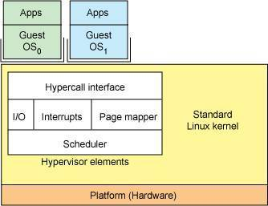

# Linux

[torvalds/linux](https://github.com/torvalds/linux): Linux kernel source tree

以Ubuntu为主要使用系统，不用修改hosts can access google

UNIX/Linux 本身是没有图形界面的，我们通常在 UNIX/Linux 发行版上看到的图形界面实际都只是运行在 Linux 系统之上的一套软件,而 Linux 上的这套软件以前是 XFree86，现在则是 xorg（X.Org），而这套软件又是通过 X 窗口系统（X Window System，也常被称为 X11 或 X）实现的，X 本身只是工具包及架构协议，而 xorg 便是 X 架构规范的一个实现体，也就是说它是实现了 X 协议规范的一个提供图形界面服务的服务器，就像实现了 http 协议提供 web 服务的 Apache 。如果只有服务器也是不能实现一个完整的桌面环境的，当然还需要一个客户端，我们称为 X Client，像如下几个大家熟知也最流行的实现了客户端功能的桌面环境 KDE，GNOME，XFCE，LXDE 。

Linux 是一个可以实现多用户登陆的操作系统，多用户可以同时登陆同一台主机，共享主机的一些资源，不同的用户也分别有自己的用户空间，可用于存放各自的文件。虽然不同用户的文件是放在同一个物理磁盘上的甚至同一个逻辑分区或者目录里，但是由于 Linux 的用户管理和 文件权限机制，不同用户不可以轻易地查看、修改彼此的文件。

## 环境变量

每个进程都有其各自的环境变量设置，且默认情况下，当一个进程被创建时，处理创建过程中明确指定的话，它将继承其父进程的绝大部分环境设置。Shell 程序也作为一个进程运行在操作系统之上，而我们在 Shell 中运行的大部分命令都将以 Shell 的子进程的方式运行。

* 永久的：需要修改配置文件，变量永久生效； /etc/bashrc 存放的是 shell 变量 `echo "PATH=$PATH:/home/shiyanlou/mybin" >> .zshrc`
* .profile（不是/etc/profile） 只对当前用户永久生效，所以如果想要添加一个永久生效的环境变量，只需要打开 /etc/profile
* 环境变量理解生效 `source .zshrc` `. ./.zshrc`
* 临时的：使用 export 命令行声明即可，变量在关闭 shell 时失效。`PATH=$PATH:/home/zhangwang/mybin`给 PATH 环境变量追加了一个路径，它也只是在当前 Shell 有效，一旦退出终端，再打开就会发现又失效了。
* 当前 Shell 进程私有用户自定义变量，如上面我们创建的 tmp 变量，只在当前 Shell 中有效。
* ${变量名#匹配字串}: 从头向后开始匹配，删除符合匹配字串的最短数据
* ${变量名##匹配字串}: 从头向后开始匹配，删除符合匹配字串的最长数据
* ${变量名%匹配字串}: 从尾向前开始匹配，删除符合匹配字串的最短数据
* ${变量名%%匹配字串}: 从尾向前开始匹配，删除符合匹配字串的最长数据
* ${变量名/旧的字串/新的字串}:将符合旧字串的第一个字串替换为新的字串
* ${变量名//旧的字串/新的字串}: 将符合旧字串的全部字串替换为新的字串

```sh
declare tmp // 使用 declare 命令创建一个变量名为 tmp 的变量
tmp=God // 使用 = 号赋值运算符，将变量 tmp 赋值为 God
echo $tmp // 读取变量的值：使用 echo 命令和 $ 符号（$ 符号用于表示引用一个变量的值）
set:显示当前 Shell 所有变量，包括其内建环境变量（与 Shell 外观等相关），用户自定义变量及导出的环境变量。
env:显示与当前用户相关的环境变量，还可以让命令在指定环境中运行
export：显示从 Shell 中导出成环境变量的变量
unset temp : 删除变量temp
```

## 虚拟机


## 软件

### 在线安装

`sudo apt-get install cowsay` `source ~/.zshrc`

sudo add-apt-repository --remove ppa:finalterm/daily

- 在本地的一个数据库中搜索关于 cowsay 软件的相关信息
- 根据这些信息在相关的服务器上下载软件安装
- 安装某个软件时，如果该软件有其它依赖程序，系统会为我们自动安装所以来的程序；
- 如果本地的数据库不够新，可能就会发生搜索不到的情况，这时候需要我们更新本地的数据库，使用命令sudo apt-get update可执行更新；
- 软件源镜像服务器可能会有多个，有时候某些特定的软件需要我们添加特定的源；

#### apt-get

程序安装有home路径，bin路径

ubuntu.16替换apt-get为apt

* install 其后加上软件包名，用于安装一个软件包
* update 从软件源镜像服务器上下载/更新用于更新本地软件源的软件包列表
* upgrade 升级本地可更新的全部软件包，但存在依赖问题时将不会升级，通常会在更新之前执行一次update
* dist-upgrade 解决依赖关系并升级(存在一定危险性)
* remove 移除已安装的软件包，包括与被移除软件包有依赖关系的软件包，但不包含软件包的配置文件
* autoremove 移除之前被其他软件包依赖，但现在不再被使用的软件包
* purge 与remove相同，但会完全移除软件包，包含其配置文件
* clean 移除下载到本地的已经安装的软件包，默认保存在/var/cache/apt/archives/
* autoclean 移除已安装的软件的旧版本软件包
* -y 自动回应是否安装软件包的选项，在一些自动化安装脚本中使用这个参数将十分有用
* -q 静默安装方式，指定多个q或者-q=#,#表示数字，用于设定静默级别，这在你不想要在安装软件包时屏幕输出过多时很有用
* -f 修复损坏的依赖关系
* -d 只下载不安装
* --reinstall 重新安装已经安装但可能存在问题的软件包
* --install-suggests 同时安装APT给出的建议安装的软件包
* sudo apt-cache search softname1 softname2 softname3...... 针对本地数据进行相关操作的工具，search 顾名思义在本地的数据库中寻找有关 softname1 softname2 ...... 相关软件的信息

#### 从磁盘安装deb安装包

下载相应deb软件包，使用dpkg命令来安装

* -i 安装指定deb包,之后修复依赖关系的安装`sudo apt-get -f install`
* -R 后面加上目录名，用于安装该目录下的所有deb安装包
* -r remove，移除某个已安装的软件包
* -I 显示deb包文件的信息
* -s 显示已安装软件的信息
* -S 搜索已安装的软件包
* -L 显示已安装软件包的目录信息

#### 从二进制软件包安装

需要做的只是将从网络上下载的二进制包解压后放到合适的目录，然后将包含可执行的主程序文件的目录添加进PATH环境变量即可

#### 从源代码安装

源管理：sudo gedit /etc/apt/sources.list

### 列表

* 云笔记:simplenote
* video: VLC
* editor: atom
* oh my zsh 而非 zsh fish
* KchmViewer:阅读CHM
* LaTeX

## Usage:

```
关闭终端:ctrl+d

where||type composer
```

### Network

sudo gedit /etc/modprobe.d/iwlwifi.config add `options iwlwifi 11n_disable=1`

### 终端

终端本质上是对应着 Linux 上的 /dev/tty 设备，Linux 的多用户登陆就是通过不同的 /dev/tty 设备完成的

Ubuntu具体说来，它默认提供七个终端，其中第一个到第六个虚拟控制台是全屏的字符终端，第七个虚拟控制台是图形终端，用来运行GUI程序，按快捷键CTRL+ALT+F1，或CTRL+ALT+F2.......CTRL+ALT+F6，CTRL+ALT+F7可完成对应的切换

## 文件

Linux 的磁盘是"挂在"（挂载在）目录上的，每一个目录不仅能使用本地磁盘分区的文件系统，也可以使用网络上的文件系统。Linux的大部分目录结构是依据FHS标准（英文：Filesystem Hierarchy Standard 中文：文件系统层次结构标准）规定好的，多数 Linux 版本采用这种文件组织形式，FHS 定义了系统中每个区域的用途、所需要的最小构成的文件和目录同时还给出了例外处理与矛盾处理。

FHS包含两层规范：

* / 下面的各个目录应该要放什么文件数据，例如 /etc 应该放置设置文件，/bin 与 /sbin 则应该放置可执行文件等等。
* 针对 /usr 及 /var 这两个目录的子目录来定义。例如 /var/log 放置系统登录文件，/usr/share 放置共享数据等等。

### 文件类型

* 普通文件：一般是用一些相关的应用程序创建的（如图像工具、文档工具、归档工具... 或 cp工具等),这类文件的删除方式是用rm 命令,而创建使用touch命令,用符号-表示；
* 目录：目录在Linux是一个比较特殊的文件，用字符d表示，删除用rm 或rmdir命令；
* 块设备文件：存在于/dev目录下，如硬盘，光驱等设备，用字符d表示;
* 设备文件：（ /dev 目录下有各种设备文件，大都跟具体的硬件设备相关），如猫的串口设备，用字符c表示；
* socket文件;用字符s表示，比如启动MySQL服务器时，产生的mysql.sock的文件;
* pipe 管道文件：可以实现两个程序（可以从不同机器上telnet）实时交互，用字符p表示；
* 链接文件:软链接等同于 Windows 上的快捷方式；用字符l表示； 软硬链接文件的共同点和区别：无论是修改软链接，硬链接生成的文件还是直接修改源文件，相应的文件都会改变，但是如果删除了源文件，硬链接生成的文件依旧存在而软链接生成的文件就不再有效了。

### 文件权限

一个目录同时具有读权限和执行权限才可以打开并查看内部文件，而一个目录要有写权限才允许在其中创建其它文件，这是因为目录文件实际保存着该目录里面的文件的列表等信息。

* 读权限：可以使用 `cat <file name>` 之类的命令来读取某个文件的内容;
* 写权限，表示你可以编辑和修改某个文件；
* 执行权限，通常指可以运行的二进制程序文件或者脚本文件(Linux 上不是通过文件后缀名来区分文件的类型);
* 所有者权限，所属用户组权限，是指你所在的用户组中的所有其它用户对于该文件的权限
* `chmod 700 iphone6`
* `sudo chown zhangwang /etc/apt/sources.list`

#### 文件压缩

##### 压缩

* -r:表示递归打包包含子目录的全部内容
* -q:表示为安静模式，即不向屏幕输出信息
* -o:表示输出文件，需在其后紧跟打包输出文件名
* -[1-9]:设置压缩等级，1 表示最快压缩但体积大，9 表示体积最小但耗时最久。
* -x:排除我们上一次创建的 zip 文件，否则又会被打包进这一次的压缩文件中
* -e：创建加密压缩包
* -l:将 LF（换行） 转换为 CR+LF(windows 回车加换行)

```sh
zip -r -9 -q -o shiyanlou_9.zip /home/shiyanlou -x ~/*.zip // 设置不同压缩等级
zip -r -e -o shiyanlou_encryption.zip /home/shiyanlou  // 创建加密
zip -r -l -o shiyanlou.zip /home/shiyanlou   // 解决windows和linux对换行的不同处理问题

unzip -q shiyanlou.zip -d ziptest   // 静默且指定解压目录，目录不存在会自动创建
unzip -O GBK 中文压缩文件.zip // 使用 -O（英文字母，大写 o）参数指定编码类型
```

### shell

Shell之所以叫Shell 是因为它隐藏了操作系统底层的细节。命令解析器

* Tab:点击Tab键可以实现命令补全,目录补全、命令参数补全;
* Ctrl+c:强行终止当前程序（常用）;
* Ctrl+d:键盘输入结束或退出终端（常用）;
* Ctrl+s:暂停当前程序，暂停后按下任意键恢复运行;
* Ctrl+z:将当前程序放到后台运行，恢复到前台为命令fg;
* Ctrl+a:将光标移至输入行头，相当于Home键;
* Ctrl+e:将光标移至输入行末，相当于End键;
* Ctrl+k:删除从光标所在位置到行末,常配合ctrl+a使用;
* Alt+Backspace:向前删除一个单词，常配合ctrl+e使用;
* Shift+PgUp:将终端显示向上滚动;
* Shift+PgDn:将终端显示向下滚动;

#### 操作文件

* du命令可以查看目录的容量，-h #同--human-readable 以K，M，G为单位，提高信息的可读性；-a #同--all 显示目录中所有文件的大小 -d:指定查看目录的深度 `du -h -d 1 ~`
* touch:来更改已有文件的时间戳的（比如，最近访问时间，最近修改时间） touch file{1..5}.txt 使用通配符批量创建 5 个文件
* rename:批量重命名,需要用到正则表达式
* rename 's/.txt/.c/' *.txt 批量将这 5 个后缀为 .txt 的文本文件重命名为以 .c 为后缀的文件:
* rename 'y/a-z/A-Z/' *.c 批量将这 5 个文件，文件名改为大写:
* ls:列出某文件夹下的文件，添加参数可实现更细致的功能，
* ls -a 列出所有文件，包括隐藏文件
* ls -l 列出文件及其详细信息(权限)
* tree:查看文件列表
* cd切换目录,cd到不存在的目录时会报错
* pwd打印当前目录
* cat:读取某一个文件内的内容
* wc:获取某一个文件的行数和字数`wc package.json`
* cp:复制某文件 -r
* mkdir:创建目录
* rm dir：删除目录
* rm -rf:r递归删除，f参数表示强制
* mv 移动文件、文件重命名
* sort排序
* diff:比较两个文件的异同
* mkdir -p father/son/grandson:新建多级目录
* cat:打印文件内容到标准输出(正序)
* tac:打印文件内容到标准输出(逆序)
* more:比较简单，只能向一个方向滚动,查看文件：打开后默认只显示一屏内容，终端底部显示当前阅读的进度。可以使用 Enter 键向下滚动一行，使用 Space 键向下滚动一屏，按下 h 显示帮助，q 退出。
* file:查看文件类型`file /bin/ls`
* head:查看文件的头几行（默认10行）
* tail:查看文件的尾几行（默认10行） `tail -n 1 /etc/passwd`
* `dd if=/dev/zero of=virtual.img bs=1M count=256` 从/dev/zero设备创建一个容量为 256M 的空文件virtual.img
* `sudo mkfs.ext4 virtual.img` 格式化virtual.img为ext4格式
* dd默认从标准输入中读取，并写入到标准输出中,但输入输出也可以用选项if（input file，输入文件）和of（output file，输出文件）改变。
* `dd if=/dev/stdin of=test bs=10 count=1 conv=ucase` 将输出的英文字符转换为大写再写入文件
* sudo mount 查看下主机已经挂载的文件系统，每一行代表一个设备或虚拟设备格式[设备名]on[挂载点]

#### 系统相关：

* date:获取当前时间
* uname:返回系统名称
* hostname：返回系统的主机名称
* --version/-V 查看某个程序的版本
* history 显示历史
* help 用于显示 shell 内建命令的简要帮助信息 help exit
* man
* info ls

#### 修改时区

```sh
sudo tzselect
sudo cp /usr/share/zoneinfo/Asia/Shanghai  /etc/localtime

sudo vi /etc/timezone
改为Asia/Shanghai
```
#### 网络相关：

* host xx.xxx.com：显示某域名相关托管服务器/邮件服务器
* ping 8.8.8.8检测连接

#### 搜索相关命令

```sh
`whereis who`  # 只能搜索二进制文件(-b)，man 帮助文件(-m)和源代码文件(-s)。
`locate /etc/sh`(查找 /etc 下所有以 sh 开头的文件)  # 通过/var/lib/mlocate/mlocate.db数据库查找，不过这个数据库也不是实时更新的，系统会使用定时任务每天自动执行 updatedb 命令更新一次，所以有时候你刚添加的文件，它可能会找不到
`locate /usr/share/\*.jpg` # 注意要添加 * 号前面的反斜杠转义，否则会无法找到。
`which man` 使用 which 来确定是否安装了某个指定的软件，因为它只从 PATH 环境变量指定的路径中去搜索命令
`sudo find /etc/ -name interfaces/` 格式find [path] [option] [action];  不但可以通过文件类型、文件名进行查找而且可以根据文件的属性（如文件的时间戳，文件的权限等）进行搜索。
```

#### 用户管理

每次次新建用户如果不指定用户组的话，默认会自动创建一个与用户名相同的用户组； 默认情况下在 sudo 用户组里的可以使用 sudo 命令获得 root 权限。

```sh
who am i:只列出用户名
who mom likes/who am i:列出用户名，所使用终端的编号和开启时间；
finger:列出当前用户的详细信息，需使用apt-get提前安装；

su <user>:切换到用户user,执行时需要输入目标用户的密码；
su - <user>:切换用户，同时环境变量也会跟着改变成目标用户的环境变量。
su -l lilei:切换登录用户; 
sudo adduser lilei:新建一个叫做lilei的用户，添加用户到系统，同时也会默认为新用户创建 home目录：
sudo useradd:只创建用户，创建完了需要用 passwd lilei 去设置新用户的密码; 
groups zhangwang:查看用户属于那些组（groups）   // 每
cat /etc/group | sort 命令查看某组包含那些成员:/etc/group文件中分行显示了用户组（Group）、用户组口令、GID 及该用户组所包含的用户（User）
sudo usermod -G sudo student:不同的组对不同的文件可能具有不同的操作权限，比如说通过上述命令新建的用户默认是没有使用sudo的权限的，我们可以使用usermod命令把它加入sudo组用以具备相应的权限。
sudo deluser student --remove-home：删除用户及用户相关文件；
```

#### 匹配符

- `*`：匹配 0 或多个字符，如`ls *.html`将匹配所有以html结尾的文件,`ls b*.png`将匹配所有以b开头，png结尾的文件；
- `?`：匹配任意一个字符,如`ls abc?.png` 可匹配abcd.png/abce.png
- `[list]`:匹配 list 中的任意单一字符
- `[!list]`:匹配 除list 中的任意单一字符以外的字符
- `[c1-c2]`:匹配 c1-c2 中的任意单一字符 如：[0-9] [a-z]
- `{string1,string2,...}`:匹配 string1 或 string2 (或更多)其一字符串，如 `{css,html}`， `ls app.{html.css}`将匹配app.css 和app.html;
- `{c1..c2}`:匹配 c1-c2 中全部字符 如{1..10}
- 注意通配符大小写敏感

## 操作

### ssh

基于密钥的验证是最安全的几个身份验证模式使用OpenSSH,如普通密码和Kerberos票据。 基于密钥的验证密码身份验证有几个优点,例如键值更难以蛮力,比普通密码或者猜测,提供充足的密钥长度。 其他身份验证方法仅在非常特殊的情况下使用。

SSH可以使用RSA(Rivest-Shamir-Adleman)或“DSA(数字签名算法)的钥匙。 这两个被认为是最先进的算法,当SSH发明,但DSA已经被视为近年来更不安全。 RSA是唯一推荐选择新钥匙,所以本指南使用RSA密钥”和“SSH密钥”可以互换使用。

基于密钥的验证使用两个密钥,一个“公共”键,任何人都可以看到,和另一个“私人”键,只有老板是允许的。 安全通信使用的基于密钥的认证,需要创建一个密钥对,安全地存储私钥在电脑人想从登录,并存储公钥在电脑上一个想登录。

使用基于密钥登录使用ssh通常被认为是比使用普通安全密码登录。 导的这个部分将解释的过程中生成的一组公共/私有RSA密钥,并将它们用于登录到你的Ubuntu电脑通过OpenSSH(s)。如果只有服务器也是不能实现一个完整的桌面环境的，当然还需要一个客户端，我们称为

### 密钥生成

```sh
ssh-keygen -t rsa -b 4096
ssh-copy-id <username>@<host>
chmod 700 ~/.ssh
chmod 600 ~/.ssh/authorized_keys
```
- 传输文件通过ssh：

  ```
  scp id_rsa.pub git@172.26.186.117:/home/git/
  scp -P 1101 username@servername:/remote_path/filename  ~/local_destination   // 源文件  目标文件
  ssh -p 2222 user@host   # 登陆服务器
  ```

- 文件文件 cat file >> another file

- 服务管理：

  ```sh
  sudo systemctl enable nginx
  sudo systemctl start nginx
  sudo systemctl restart nginx
  systemctl status nginx
  sudo systemctl reload nginx
  ```

- 修改hosts

  ```sh
  sudo su
  curl https://github.com/racaljk/hosts/blob/master/hosts -L >> /etc/hosts
  ```

# sougou pinyin install

- command line
- package

  - get package: download sogou_pinyin_linux_1.0.0.0033_amd64.deb
  - install:

```sh
sudo dpkg  -i   sogou_pinyin_linux_1.0.0.0033_amd64.deb
```

- config:

  - system setting->language support
  - choose language,key input fcitx

## atom install

```sh
sudo add-apt-repository ppa:webupd8team/atom
sudo apt-get update
sudo apt-get install atom


# ervernote
sudo add-apt-repository ppa:nixnote/nixnote2-daily
sudo apt update
sudo apt install nixnote2
File->Add Another User…
Tools->Synchronize
```

## clean

```sh
sudo apt-get autoclean
sudo apt-get autoremove
sudo apt-get clean
```

## chrome(firefox 禁用console.log)

```sh
sudo wget http://www.linuxidc.com/files/repo/google-chrome.list -P /etc/apt/sources.list.d/
wget -q -O - https://dl.google.com/linux/linux_signing_key.pub  | sudo apt-key add -
sudo apt-get update
sudo apt-get install google-chrome-stable
```

## ufw防火墙

```sh
sudo ufw allow 'Nginx HTTP' 
sudo ufw status 
sudo ufw allow https
sudo ufw enable/disable
```

## 指令

* 实时刷新文件：tail -f file
* 查看linux系统信息

  - uname -a：显示电脑以及操作系统的相关信息
  - cat /proc/version:说明正在运行的内核版本
  - cat /etc/issue:显示的是发行版本信息
  - lsb_release -a

## 启动项

启动目录： /etc/rc.d/rc[0~6].d 命令行脚本文件：/etc/init.d/ 本地文件：/etc/rc.local 添加 /etc/init.d/nginx start

- 提高电池的寿命并且减少过热

  ```sh
  sudo add-apt-repository ppa:linrunner/tlp
  sudo apt-get update
  sudo apt-get install tlp tlp-rdw
  sudo tlp start
  ```

## 命令行

```
Ctrl+d:键盘输入结束或退出终端（常用）;
Ctrl+s:暂停当前程序，暂停后按下任意键恢复运行;
Ctrl+z:将当前程序放到后台运行，恢复到前台为命令fg;
Ctrl+a:将光标移至输入行头，相当于Home键;
Ctrl+e:将光标移至输入行末，相当于End键;
Ctrl+k:删除从光标所在位置到行末,常配合ctrl+a使用;
Alt+Backspace:向前删除一个单词，常配合ctrl+e使用;
Shift+PgUp:将终端显示向上滚动;
Shift+PgDn:将终端显示向下滚动;
pwd打印当前目录
cat:读取某一个文件内的内容
wc:获取某一个文件的行数和字数
psketch
date:获取当前时间
uname:返回系统名称
hostname：返回系统的主机名称

host xx.xxx.com：显示某域名相关托管服务器/邮件服务器
ping 8.8.8.8检测连接

whereis
who
locate
```

## Boot分区不足

```
\\ 查看已安装的linux-image各版本
dpkg --get-selections |grep linux-image
// 查看使用版本
uname -a
／／清除旧版本
sudo apt-get purge linux-image-3.5.0-27-generic
图中因使用remove命令而残留的deinstall的
sudo dpkg -P linux-image-extra-3.5.0-17-generic
```

## 端口 进程

```
// 查看某一端口的占用情况
[sudo ]lsof -i : (port)
// 显示tcp，udp的端口和进程等相关
netstat -tunlp
// 指定端口号进程情况
netstat -tunlp|grep (port)
// 进程查看
ps -ef | grep nginx
ps aux | grep nginx
lsof -Pni4 | grep LISTEN | grep php
// 关闭进程
kill -9 pid
```

chkconfig --list sshd

## 终端命令

* ssh:连接到一个远程主机，然后登录进入其 Unix shell。这就使得通过自己本地机器的终端在服务器上提交指令成为了可能。   
* grep:用来在文本中查找字符串,从一个文件或者直接就是流的形式获取到输入, 通过一个正则表达式来分析内容，然后返回匹配的行。该命令在需要对大型文件进行内容过滤的时候非常趁手`grep "$(date +"%Y-%m-%d")" all-errors-ever.log > today-errors.log`
* 使用 alias 这个 bash 内置的命令来为它们创建一个短别名:alias server="python -m SimpleHTTPServer 9000"
* Curl 是一个命令行工具，用来通过 HTTP（s），FTP 等其它几十种你可能尚未听说过的协议来发起网络请求。
* Tree 用可视化的效果向你展示一个目录下的文件 tree -P '_.min._'
* Tmux 是一个终端复用器,它是一个可以将多个终端连接到单个终端会话的工具。可以在一个终端中进行程序之间的切换，添加分屏窗格，还有就是将多个终端连接到同一个会话，使它们保持同步。 当你在远程服务器上工作时，Tmux 特别有用，因为它可以让你创建新的选项卡，然后在选项卡之间切换
* du 命令会生成相关文件和有关目录的空间使用情况的报告。它很容易使用，也可以递归地运行，会遍历每个子目录并且返回每个文件的单个大小。`du -sh *`
* tar:用来处理文件压缩的默认 Unix 工具.
* md5sum:它们可以用来检查文件的完整性。`md5sum ubuntu-16.04.3-desktop-amd64.iso` 将生成的字符串与原作者提供的（比如 UbuntuHashes）进行比较
* Htop 是个比内置的 top 任务管理更强大的工具。它提供了带有诸多选项的高级接口用于监控系统进程。
* ln:unix 里面的链接同 Windows 中的快捷方式类似，允许你快速地访问到一个特定的文件。`sudo ln -s ~/Desktop/Scripts/git-scripts/git-cleanup /usr/local/bin/`

```sh
ssh username@remote_host
ssh username@remote_host ls /var/www
```

## Hypervisor

Linux的最重要创新之一，引入Hypervisor，运行其他操作系统的操作系统，它们为执行提供独立的虚拟硬件平台，同时硬件虚拟平台可以提供对底层机器的虚拟的完整访问.在解决软件架构设计问题时，通常做法是引入一个抽象层来解决，其实这种做法是有点普世原理，同样适用于硬件封装，Hypervisor正是这样一种虚拟抽象层。 只有5%的时间在全负荷工作，其他时间则处于休眠或者空闲状态，虚拟化技术可以大大提升服务器的利用率，从而间接减少服务器数量，即成本！  Hypervisor作为虚拟技术的核心，抽象虚拟化硬件平台.它支持给每一个虚拟机分配内存，CPU， 网络和磁盘，并加载虚拟机的客户操作系统。当然，在获取到这么优秀功能（对硬件的虚拟化，并搭载操作系统）的代价，自然牺牲了启动速度及在资源利用率，性能的开销等。

## LXC(Linux Container）

一种内核虚拟化技术，相比上述的Hypervisor技术则提供更轻量级的虚拟化，以隔离进程和资源，且无需提供指令解析机制及全虚拟化的复杂性，LXC或者容器将操作系统层面的资源分到孤立／隔离的组中，用来管理使用资源。LXC为Sourceforge上的开源项目，其实现是借助Linux的内核特性，（cgroups子系统+namespace）, 在OS层次上做整合为进程提供虚拟执行环境，即称之为容器，除了分配绑定cpu，内存，提供独立的namespace（网络，pid，ipc，mnt，uts）

## Samba服务

### 安装与配置

```sh
apt-get install samba
mkdir -p /home／directory
chmod 777 /home／directory
vim /etc/samba/smb.conf
[global]的地方添加 security = user
文件最后添加下列设定

[share]
path = /home/username/share      
available = yes
browsealbe = yes
public = yes
writable = yes

useradd username
sudo smbpasswd -a username
/etc/init.d/samba restart

mac 链接
finder中com＋K
smb://192.168.100.106
\\172.16.44.175\Ubuntu
```

## shell扩展

### grep：Global search REgrular expression and Print out the line

- --color=auto：对匹配到的文本着色显示
- -v：显示不被pattern 匹配到的行，反向选择 ,查找文件中不包含"test"内容的行 `grep -v test log.txt`
- -i：忽略字符大小写
- -n：显示匹配的行号
- -c：统计匹配的行数
- -o：仅显示匹配到的字符串
- -q：静默模式，不输出任何信息
- -A #：after，后#行 ,显示包含这行后续#行
- -B #：before，前#行
- -C #：context，前后各#行
- -e：实现多个选项间的成逻辑or关系，grep –e 'cat ' -e 'dog' file
- -w：匹配整个单词,（字母，数字，下划线不算单词边界）
- -E：使用ERE
- -r或--recursive 此参数的效果和指定"-d recurse"参数相同。

## sed

一种流编辑器，它一次处理一行内容。处理时，把当前处理的行存储在临时缓存区中，称为"模式空间"(patternspace)，接着用sed命令处理缓存区中的内容，处理完成后，把缓存区的内容送往屏幕。然后读入下一行，执行下一个循环。如果没有使用诸如'D'的特殊命令，那么会在两个循环之间清空模式空间，但不会清空保留空间。这样不断重复，直到文件末尾。文件内容并没有改变，除非你使用重定向存储输出。 sed的功能：主要用来自动编辑一个或多个文件，简化对文件的反复操作，编写转换程序等，且支持正则表达式！

### 地址定界：就是说明用来处理一行中的那个些部分的。

- 不给地址：对全文进行处理
- # ：指定的行/pattern/能够被模式匹配到的每一行
- # ,#：从第n行到第m行
- # ,+#：从第n行，加上其后面m行
- /pat1/,/pat2/：符合第一个模式和第二个模式的所有行
- # ,/pat1/：从第n行到符合 /pat1/ 这个模式的行
- 1~2 ：~ 这个符号表示步进，1~2 表示的是奇数行
- 2~2：表示的是偶数行

### 编辑命令：地址定界后，对范围内的内容进行相关编辑。

- d：删除模式空间匹配的行，并立即启用下一轮循环 `nl log.txt | sed '2,3d'`
- p：打印当前模式空间内容，追加到默认输出之后
- q：读取到指定行之后退出
- `a [\]text`：在指定行后面追加文本支持使用\n 实现多行行后追加 `sed -e 4a\newline log.txt`
- `i [\]text`：在行前面插入文本
- `c [\]text`：替换行为单行或多行文本 `nl log.txt | sed '2,3c No 2-3 number'`
- w /path/somefile：保存模式匹配的行至指定文件
- r /path/somefile：读取指定文件的文本至模式空间中匹配到的行后
- =：为模式空间中的行打印行号
- !：模式空间中匹配行取反处理
- s///：查找替换, 支持使用其它分隔符，s@@@ ，s### `nl log.txt | sed -e '3d' -e 's/test/TEST/'`
- ；：对一行进行多次操作的命令的分割
- &：配合s///使用，代表前面所查找到的字符等，&sm ；sm&。
- g：行内全局替换。也可以指定行内的第几个符合要求的进行替换：2g,就表示第2个替换。
- p：显示替换成功的行 `nl log.txt | sed -n '/is/p'` a替换A，多个用;分开`nl log.txt | sed -n '/is/{s/a/A/;p}'`
- w /PATH/TO/SOMEFILE：将替换成功的行保存至文件中
- -e

## 求职问题

### 操作系统

1. 进程的有哪几种状态，状态转换图，及导致转换的事件。
2. 进程与线程的区别。
3. 进程通信的几种方式。
4. 线程同步几种方式。(一定要会写生产者、消费者问题，完全消化理解)
5. 线程的实现方式. (也就是用户线程与内核线程的区别)
6. 用户态和核心态的区别。
7. 用户栈和内核栈的区别。
8. 内存池、进程池、线程池。(c++程序员必须掌握)
9. 死锁的概念，导致死锁的原因.
10. 导致死锁的四个必要条件。
11. 处理死锁的四个方式。
12. 预防死锁的方法、避免死锁的方法。
13. 进程调度算法。(周转时间 =  程序结束时间-- 开始服务时间、带权周转时间=  周转时间/  要求服务时间)
14. Windows内存管理的方式(块式、页式、段式、段页式).
15. 内存连续分配方式采用的几种算法及各自优劣。
16. 动态链接及静态链接.


### 计算机网络-Linux就业必备

10. 分组转发算法。
11. IP报文的格式，格式的各个字段的含义要理解。
12. MTU的概念，啥叫路径MTU？ MTU发现机制，TraceRoute(了解)。
13. RIP协议的概念及算法。
14. ICMP协议的主要功能。
15. 组播和广播的概念，IGMP的用途。(环回地址、广播地址)
16. Ping协议的实现原理，ping 命令格式。
17. 子网划分的概念，子网掩码。
18. IP地址的分类，如何划分的，及会计算各类地址支持的主机数。
19. DNS的概念，用途，DNS查询的实现算法。
20. TCP与UDP的概念，相互的区别及优劣。
21. UDP报文的格式，字段的意义。
22. TCP 报文的格式，字段的意义。
23. TCP通过哪些措施，保证传输可靠？
24. 三次握手，四次断开过程。
25. TIME_WAIT状态的概念及意义。
26. 滑动窗口协议 与停止等待协议的区别。
27. TCP的流量控制和拥塞控制实现原理(会画拥塞控制的典型图)。
28. TCP的快速重传与快速恢复算法。
29. TFTP 与 FTP的区别。
30. 阻塞方式和非阻塞方式，阻塞connect与非阻塞connect。(比较难，有兴趣可以了解)
31. HTTP基本格式。（java程序员必须掌握）

### 设计模式

1. 各种常用模式的用途，使用方法(类图)。
2. 单例模式的双重检查实现。
3. MVC模式

### Linux基本命令Linux就业必备

1. 绝对路径用什么符号表示？当前目录、上层目录用什么表示？主目录用什么表示? 切换目录用什么命令？
2. 怎么查看当前进程？怎么执行退出？怎么查看当前路径？
3. 怎么清屏？怎么退出当前命令？怎么执行睡眠？怎么查看当前用户id？查看指定帮助用什么命令？
4. Ls 命令执行什么功能？ 可以带哪些参数，有什么区别？
5. 建立软链接(快捷方式)，以及硬链接的命令。
6. 目录创建用什么命令？创建文件用什么命令？复制文件用什么命令？
7. 文件权限修改用什么命令？格式是怎么样的？
8. 查看文件内容有哪些命令可以使用？
9. 随意写文件命令？怎么向屏幕输出带空格的字符串，比如”hello  world”?
10. 终端是哪个文件夹下的哪个文件？黑洞文件是哪个文件夹下的哪个命令？
11. 移动文件用哪个命令？改名用哪个命令？
12. 复制文件用哪个命令？如果需要连同文件夹一块复制呢？如何需要有提示功能呢？
13. 删除文件用哪个命令？如果需要连目录及目录下文件一块删除呢？删除空文件夹用什么命令？
14. Linux下命令有哪几种可使用的通配符？分别代表什么含义?
15. 用什么命令对一个文件的内容进行统计？(行号、单词数、字节数)
16. Grep命令有什么用？ 如何忽略大小写？ 如何查找不含该串的行?
17. Linux中进程有哪几种状态？在ps显示出来的信息中，分别用什么符号表示的？
18. 怎么使一个命令在后台运行?
19. 利用ps怎么显示所有的进程? 怎么利用ps查看指定进程的信息？
20. 哪个命令专门用来查看后台任务?
21. 把后台任务调到前台执行使用什么命令?把停下的后台任务在后台执行起来用什么命令?
22. 终止进程用什么命令? 带什么参数?
23. 怎么查看系统支持的所有信号？
24. 搜索文件用什么命令? 格式是怎么样的?
25. 查看当前谁在使用该主机用什么命令? 查找自己所在的终端信息用什么命令?
26. 使用什么命令查看用过的命令列表?
27. 使用什么命令查看磁盘使用空间？ 空闲空间呢?
28. 使用什么命令查看网络是否连通?
29. 使用什么命令查看ip地址及接口信息？
30. 查看各类环境变量用什么命令?
31. 通过什么命令指定命令提示符?
32. 查找命令的可执行文件是去哪查找的? 怎么对其进行设置及添加?
33. 通过什么命令查找执行命令?34. 怎么对命令进行取别名？


### Linux编程

1. 列举Linux内存管理相关的几个函数，各自有什么功能？
2. GCC只编译的选项是什么？只进行预处理的选项是什么？在命令行定义宏的选项是什么？
3. Linux静态库的使用，怎么创建一个静态库？ 怎么使用一个静态库？静态库文件的后缀名是什么？静态库的命名规范。
4. nm 工具的作用，ldd工具的作用。
5. Linux动态库的使用，怎么创建一个动态库？ 动态库文件的后缀名是什么？怎么使用一个动态库？动态库的命名规范？ 系统默认的动态库的查找路径？动态库显示连接所使用的系统库是什么？
6. Linux下make 与makefile。用什么参数指定makefile文件？ 什么是默认的makefile文件。
7. 在哪个文件夹下存有进程运行时的所有信息？
8. 每个程序默认打开哪三个文件设备？
9. 操作文件描述符的读写函数是什么？打开文件描述符以及关闭文件描述符的函数？
10. Fcntl函数主要的几个作用。
11. 创建进程的几个函数，及各自区别。
12. 父进程先结束，子进程会变为？ 子进程先结束，子进程会变为？
13. 怎么使父进程回收子进程？ 相关的几个函数。
14. 子进程在创建时与父进程的内存资源的复制问题。
15. 中断信号、终止信号、定时器信号的宏是什么？
16. 在程序中注册信号和发送信号用什么函数?
17. 信号的可靠与不可靠的含义。哪些信号是可靠的？哪些信号是不可靠的？
18. 信号屏蔽用什么函数？ SigSuspend的作用？Sigpending的作用？
19. 信号处理函数处理信号时是否会被信号中断？
20. 最新版本的信号发送与处理函数？与老版本的发送与数据函数有什么区别？
21. Linux下进程有哪些通信方式(IPC)？
22. TCP服务器编程模型。
23. UDP服务器编程模型。
24. TCP编程特征，由于每次不定长数据到达，则一般使用什么选项？
25. Selected模型是什么？ 相比而言多进程实现方式有什么区别？Selected、epoll模型、poll模型的区别。
26. 常用的socket选项有哪些？利用哪个函数来设置socket选项？
27. 怎么发送和设置带外(OOB)数据？
28. Linux 下多线程的库是什么？ 利用哪个函数创建线程？利用哪个函数强制结束线程？主线程等待子线程结束时使用的函数?
29. 线程怎样在被迫退出时能做一些善后处理？以及怎么用linux特有的方式处理？

## 扩展

* [The Linux Kernel documentation](https://www.kernel.org/doc/html/latest/index.html):

## 参考

* [learnbyexample/Command-line-text-processing](https://github.com/learnbyexample/Command-line-text-processing):From finding text to search and replace, from sorting to beautifying text and more
* [LVS：跑在Linux内核上的负载均衡器](https://liangshuang.name/2017/11/19/lvs/)
