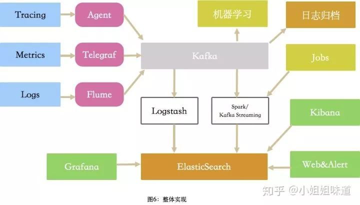

# 监控

* Raygun:领先的错误监控以及崩溃报告的平台。应用程序性能监控（APM）是其最近的项目。Raygun的DevOps工具帮助用户分析性能问题，并且定位到代码的某一行，某个function或者API调用。APM工具和Raygun的错误管理工作流可以协同工作。比如，它自动定位最高优先级的问题，并创建issue。
    - Raygun： https://raygun.com/
    - 应用程序性能监控： https://raygun.com/platform/apm
* Nagios:最流行的免费并开源的DevOps监控工具
    - 功能
        + 可以监控基础架构从而帮助用户发现并解决问题。
        + 记录事件，运行中断以及故障。
        + 通过Nagios的图表和报告监控趋势。
        + 预测运行中断和错误，并且发现安全攻击。
    - 因为其丰富的插件生态而脱颖而出。提供了四中开源监控解决方案：
        + Nagios Core：一个命令行工具，提供了所有基本功能
        + Nagios XI：提供了基于网页的GUI以及监控向导程序
        + Nagios Log Server
        + Nagios Fusion
* datadog
* 数据收集组件
    - telegraf:用来收集监控项，influxdata家族的一员，是一个用Go编写的代理程序,可收集系统和服务的统计数据,并写入到多种数据库。支持的类型可谓非常广泛。
    - flume 主要用来收集日志类数据，apache家族。Flume-og和Flume-ng版本相差很大，是一个高可用的，高可靠的，分布式的海量日志采集、聚合和传输的系统。 Flume支持在日志系统中定制各类数据发送方，用于收集数据；同时，Flume提供对数据进行简单处理，并写到各种数据接受方（可定制）的能力。
    - Logstash Logstash是一个开源的日志收集管理工具，elastic家族成员。功能和flume类似，但占用资源非常的贪婪，建议使用时独立部署。功能丰富，支持ruby定义过滤条件。
    - StatsD node开发，使用udp协议传输，专门用来收集数据，收集完数据就发送到其他服务器进行处理。与telegraf类似。
    - CollectD collectd是一个守护(daemon)进程，用来定期收集系统和应用程序的性能指标，同时提供了机制，以不同的方式来存储这些指标值。
* 可视化:独立的可视化组件比较少，不过解决方案里一般都带一个web端，像grafana这么专注的，不太多。
    - Grafana 专注展示，颜值很高，集成了非常丰富的数据源。通过简单的配置，即可得到非常专业的监控图。
* 存储 Grafana Plugins - extend and customize your Grafana.
    - InfluxDB influx家族产品。Influxdb是一个开源的分布式时序、时间和指标数据库，使用go语言编写，无需外部依赖。支持的数据类型非常丰富，性能也很高。单节点使用时不收费的，但其集群要收费。
    - OpenTSDB OpenTSDB是一个时间序列数据库。它其实并不是一个db，单独一个OpenTSDB无法存储任何数据，它只是一层数据读写的服务，更准确的说它只是建立在Hbase上的一层数据读写服务。能够承受海量的分布式数据。
    - Elasticsearch 能够存储监控项，也能够存储log，trace的关系也能够存储。支持丰富的聚合函数，能够实现非常复杂的功能。但时间跨度太大的话，设计的索引和分片过多，ES容易懵逼。
* anglia:核心包含gmond、gmetad以及一个Web前端。主要是用来监控系统性能，如：cpu 、mem、硬盘利用率， I/O负载、网络流量情况等，通过曲线很容易见到每个节点的工作状态，对合理调整、分配系统资源，提高系统整体性能起到重要作用。
* Nagios： https://www.nagios.org/
    - 插件生态： https://exchange.nagios.org/
    - 功能的比对： https://www.nagios.org/downloads/nagios-core/
* [pyflame](https://github.com/uber/pyflame):非侵入式得对运行中的 python 进程做 snapshot, 输出成 svg
    - `pyflame -s 60 -r 0.01 ${pid} | flamegraph.pl > myprofile.svg`
* [newrelic](https://newrelic.com/)
* [netdata/netdata](https://github.com/netdata/netdata):Real-time performance monitoring, done right! https://my-netdata.io/
* [Monit](link)
* CAT:作为美团点评基础监控组件，已经在中间件框架（MVC框架，RPC框架，数据库框架，缓存框架等）中得到广泛应用，为美团点评各业务线提供系统的性能指标、健康状况、基础告警等。

Grafana求，配合 Prometheus 以及 Prometheus 相关的 Exporter

## 工具

* [nicolargo / glances](https://github.com/nicolargo/glances):Glances an Eye on your system. A top/htop alternative for GNU/Linux, BSD, Mac OS and Windows operating systems. http://nicolargo.github.io/glances/
* [plausible-insights / plausible](https://github.com/plausible-insights/plausible):Simple, lightweight analytics for your website https://plausible.io
* [usefathom/fathom](https://github.com/usefathom/fathom):Fathom. Simple, trustworthy website analytics. Built with Golang & Preact. https://usefathom.com/
* [Countly/countly-server](https://github.com/Countly/countly-server):Countly helps you get insights from your application. Available self-hosted or on private cloud. https://count.ly
* [ openspug / spug ](https://github.com/openspug/spug):开源运维平台：面向中小型企业设计的轻量级无Agent的自动化运维平台，整合了主机管理、主机批量执行、主机在线终端、应用发布部署、在线任务计划、配置中心、监控、报警等一系列功能。 https://spug.dev
* [grafana/grafana](https://github.com/grafana/grafana)The tool for beautiful monitoring and metric analytics & dashboards for Graphite, InfluxDB & Prometheus & More
