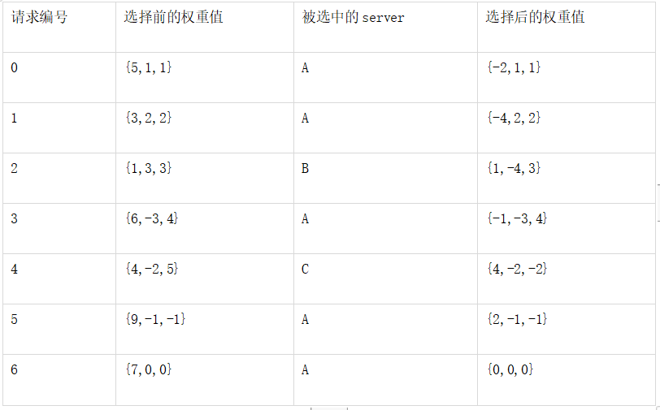

# [nginx/nginx](https://github.com/nginx/nginx)

一个免费、开源、高性能、轻量级的 HTTP 和反向代理服务器 基于事件驱动（event-driven） 非阻塞模式的 Web 服务器.与事件循环相比 fork 子进程消耗更多系统资源，基于事件的 HTTP 服务器完胜。
解决基于进程模型产生的C10k问题，请求时即使无状态连接如web服务都无法达到并发响应量级一万现状。2006年俄罗斯编写。全称为engine X，缩减合并称为nginx。

## 特性

× 高并发 高性能
    - 内存消耗低：10000个keep-alive连接模式下的非活动连接仅消耗2.5M内存；
    - 非阻塞、高并发连接：官方测试能够支撑5万并发连接，在实际生产环境中跑到2～3万并发连接数
    - 事件驱动：通信机制采用 epoll 模型，支持更大的并发连接
        - 支持event-driven事件驱动模型, aio异步驱动机制, mmap内存映射；
        - 新的epoll（Linux 2.6内核）和kqueue（freebsd）网络I/O模型
    - 节省带宽：支持 GZIP 压缩，可以添加浏览器本地缓存的 Header 头
* 高可靠性：基于master/worker模式，一个 master 进程，生成一个或多个 worker 进程
    - 功能：如果 Nginx 代理的后端的某台 Web 服务器宕机了，不会影响前端访问
    - 用于反向代理，宕机的概率微乎其微
* 热部署(平滑迁移)：不停机更新配置文件、更换日志、更新服务器程序版本；
* 可扩展性好：高度模块化（非DSO机制）
* 跨平台：Nginx 可以在大多数 Unix like OS编译运行，而且也有 Windows 的移植版本
* 配置异常简单：非常容易上手
* 缺点
    - 仅能支持http、https 和 Email 协议，这样就在适用范围上面小些
    - 对后端服务器的健康检查，只支持通过端口来检测，不支持通过 url来检测。不支持 Session 的直接保持，但能通过 ip_hash 来解决
    - 模块默认编译进 Nginx 中，如果需要增加或删除模块，需要重新编译 Nginx，这一点不如 Apache 的动态加载模块方便
    - Apache:一个进程处理一个链接

## 版本

* Nginx 从 1.7.11 开始实现了线程池机制，大部分场景中可以避免使用阻塞，整体性能有了数倍提升。https://www.nginx.com/blog/thread-pools-boost-performance-9x/
* NGINX Plus 由 Web 服务器、内容缓存和负载均衡器组成。流行的开源 NGINX Web 服务器的商业版本。NGINX Web 应用程序防火墙（WAF）是一款基于开源 ModSecurity 研发的商业软件，为针对七层的攻击提供保护，例如 SQL 注入或跨站脚本攻击，并根据如 IP 地址或者报头之类的规则阻止或放行， NGNX WAF 作为 NGINX Plus 的动态模块运行，部署在网络的边缘，以保护内部的 Web 服务和应用程序免受 DDoS 攻击和骇客入侵。
    - NGINX Unit 是 Igor Sysoev 设计的新型开源应用服务器，由核心 NGINX 软件开发团队实施。可运行 PHP、Python 和 Go 的新型开源应用服务器。Unit 是"完全动态的"，并允许以蓝绿部署的方式无缝重启新版本的应用程序，而无需重启任何进程。所有的 Unit 配置都通过使用 JSON 配置语法的内置 REST API 进行处理，并没有配置文件。目前 Unit 可运行由最近版本的 PHP、Python 和 Go 编写的代码。在同一台服务器上可以支持多语言的不同版本混合运行。即将推出更多语言的支持，包括 Java 和 Node.JS。
    - NGINX Controller 是 NGINX Plus 的中央集中式监控和管理平台。Controller 充当控制面板，并允许用户通过使用图形用户界面"在单一位置管理数百个 NGINX Plus 服务器"。该界面可以创建 NGINX Plus 服务器的新实例，并实现负载平衡、 URL 路由和 SSL 终端的中央集中配置。Controller 还具备监控功能，可观察应用程序的健壮性和性能。
    - NGINX Plus（Kubernetes）Ingress Controller 解决方案基于开源的 NGINX kubernetes-ingress 项目，经过测试、认证和支持，为 Red Hat OpenShift 容器平台提供负载平衡。该解决方案增加了对 NGINX Plus 中高级功能的支持，包括高级负载平衡算法、第7层路由、端到端认证、request/rate 限制以及内容缓存和 Web 服务器。
    - NGINX 还发布了 nginmesh，这是 NGINX 的开源预览版本，作为 Istio Service Mesh 平台中第7层负载平衡和代理的服务代理。它旨在作为挎斗容器（sidecar container）时，能提供与 Istio 集成的关键功能，并以"标准、可靠和安全的方式"促进服务之间的通信能力。此外，NGINX 将通过加入 Istio 网络特别兴趣小组，与 Istio 社区合作。
    - NGINX Web 应用防火墙（WAF）
    - NGINX Controller NGINX Plus 的中央控制面板 
* 淘宝网发起的 Web 服务器 Tengine
* 基于 Nginx 和 Lua 的 Web 平台 OpenResty

## 功能

* 由内核和一系列模块组成，内核提供 Web 服务的基本功能，如启用网络协议，创建运行环境，接收和分配客户端请求，处理模块之间的交互。
* 模块从结构上分为：
    - 核心模块 core module：HTTP 模块、EVENT 模块和 MAIL 模块
    - 基础模块 Standard HTTP  modules：HTTP Access 模块、HTTP FastCGI 模块、HTTP Proxy 模块和 HTTP Rewrite 模块。
    - Optional HTTP  modules：可选HTTP模块
    - 第三方模块 3rd party modules：HTTP Upstream Request Hash 模块、Notice 模块和 HTTP Access Key 模块及用户自己开发的模块。
* Web 服务器，以 B/S（Browser/Server）方式提供服务
    - 静态资源服务
    - 支持 CGI 协议的动态语言，比如 Perl、PHP 等，但是不支持 Java。将处理过的内容通过 HTTP Server 分发
    - 虚拟主机（server）
    - keepalive
    - 访问日志（支持基于日志缓冲提高其性能）
    - urlrewirte
    - 路径别名
    - 基于IP及用户的访问控制
    - 支持速率限制及并发数限制
    - 能缓存打开的文件（元数据：文件的描述符等等信息）
* 动静分离：让动态程序（Java、PHP）去访问应用服务器，让缓存、图片、JS、CSS 等去访问 Nginx
    - 纯粹把静态文件独立成单独的域名，放在独立的服务器上，也是目前主流推崇的方案；
    - 动态跟静态文件混合在一起发布，通过 Nginx 来分开。
* 反向代理
    * pop3, smpt,imap4等邮件协议的反向代理，应用服务集群扩展，动态扩容
    * 缓存：是边缘节点，减少时间延迟
    * 负载均衡：容灾
* 支持过滤器，例如zip，SSI
* 支持SSL加密机制
* API服务：OpenResty

## 进程模型

* 多进程模型 架构设计是采用模块化的、基于事件驱动、异步、单线程且非阻塞
* 大量使用多路复用和事件通知，Nginx 启动以后，会在系统中以 daemon 的方式在后台运行，其中包括一个 master 进程，n(n>=1) 个 worker 进程。所有的进程都是单线程（即只有一个主线程）的，且进程间通信主要使用共享内存的方式。
* master/worker模型
    - 一个master进程:充当整个进程组与用户的交互接口，同时对进程进行监护，管理 Worker 进程来实现重启服务、平滑升级、更换日志文件、配置文件实时生效等功能
        + 主要负责收集、分发请求
        + fork Worker进程：按照配置fork出N个Worker进程，一般说来配置推荐Worker进程数量和CPU核数保持一致即可
        + 监控Worker进程，当某个Worker异常挂了后，Master进程负责重新拉起一个
        + 每当一个请求过来时，Master 就拉起一个 Worker 进程负责处理这个请求。同时 Master 进程也负责监控 Woker 的状态，保证高可靠性。
        + 接受外界信号，进行启动、重启、停止
        + 可以给Worker进程发信号
    - 多个worker进程:用来处理基本的网络事件，每个 worker 请求相互独立且平等的竞争来自客户端的请求，共同竞争来处理来自客户端的请求
        + 请求只能在一个 worker 进程中被处理，且一个 worker 进程只有一个主线程，所以同时只能处理一个请求
        + 为了减少进程切换（需要系统调用）的性能损耗，一般设置 Worker 进程数量和 CPU 数量一致。
        + 每个worker基于时间驱动机制可以并行响应多个请求
        + 采取了 Reactor 模型（也就是 I/O 多路复用，NIO）
            * I/O 多路复用模型：最重要的系统调用函数就是 Select（其他的还有 epoll 等）
            * 该方法能够同时监控多个文件描述符的可读可写情况（每一个网络连接其实都对应一个文件描述符），当其中的某些文件描述符可读或者可写时，Select 方法就会返回可读以及可写的文件描述符个数。
            * Work 进程使用 I/O 多路复用模块同时监听多个 FD（文件描述符），当 Accept、Read、Write 和 Close 事件产生时，操作系统就会回调 FD 绑定的事件处理器。这时候 Work 进程再去处理相应事件，而不是阻塞在某个请求连接上等待。
            * 这样就可以实现一个进程同时处理多个连接。每一个 Worker 进程通过 I/O 多路复用处理多个连接请求。
        + accept客户端请求，完成请求，数据返回给客户端
        + http服务，http代理，fastcgi代理
    - 设置 Worker数量：Nginx 同 Redis 类似都采用了 IO 多路复用机制，每个 Worker 都是一个独立的进程，但每个进程里只有一个主线程，通过异步非阻塞的方式来处理请求，即使是成千上万个请求也不在话下。
        + 每个 Worker 的线程可以把一个 CPU 的性能发挥到极致。所以 Worker 数和服务器的 CPU 数相等是最为适宜的。设少了会浪费 CPU，设多了会造成 CPU 频繁切换上下文带来的损耗。
        + 连接数 worker_connection：这个值是表示每个 Worker 进程所能建立连接的最大值。
        + 一个 Nginx 能建立的最大连接数，应该是 worker_connections*worker_processes
            * 对于 HTTP 请 求 本 地 资 源 来 说 ， 能 够 支 持 的 最 大 并 发 数 量 是 worker_connections*worker_processes
            * 如果是支持 http1.1 的浏览器每次访问要占两个连接。所以普通的静态访问最大并发数是：worker_connections*worker_processes /2。
            * 如果是 HTTP 作为反向代理来说，最大并发数量应该是 worker_connections*worker_processes/4。作为反向代理服务器，每个并发会建立与客户端的连接和与后端服务的连接，会占用两个连接
    - 优点
        + 可以使用 nginx-s reload 热部署。
        + 每个 Worker 是独立的进程，不需要加锁，省掉了锁带来的开销。采用独立的进程，可以让互相之间不会影响，一个进程退出后，其他进程还在工作，服务不会中断，Master 进程则很快启动新的 Worker 进程。
* fast-CGI：一个协议
    - CGI不涉及进程管理，PHP解析器被调用完一次后，就销毁掉了，下次调用需要重新初始化
    - fastCGI涉及到了进程管理，携带着PHP解析器功能的FPM进程是常驻内存的，解析完毕后就一直静静地还在那里，等待请求
* PHP-FPM（PHP FastCGI Process Manager）PHP对于fast-CGI协议具体实现
    - php-fpm的进程模型和nginx一模一样，就是一个Master进程按照配置fork出Worker进程
    - 不同的是，fpm的worker进程没有“powered by epoll”，每个worker进程内都内嵌了php解析器用来解析php代码，一个fpm进程在已经干活的时候拒绝接受新的请求，是完完全全的基于同步阻塞的工作方式，只有活干完了才会接受新的请求
    - Nginx和php-FPM之间是如何通信的？其实就是靠socket
    - php-PFM会监听在回环地址的9000端口上，然后Nginx会将解析PHP的请求发到9000端口上
    - 或者通过本地unixsocket的方式与php-FPM进行通信
* 事件驱动：多进程（单线程）&多路 IO 复用模型，异步，非阻塞 epoll(Linux),kqueue（FreeBSD）, /dev/poll(Solaris)
* 消息通知：select,poll, rt signals
    - 支持sendfile,  sendfile64
    - 支持AIO，mmap


## 安装

* ubunutu
    - `/usr/share/doc/nginx-doc/examples/`
* Mac
    - 程序文件 /usr/local/Cellar/nginx
    - 配置文件 /usr/local/etc/nginx/nginx.conf   /usr/local/nginx/conf/nginx.conf
    - 日志与服务器文件 /usr/local/var/log/nginx/
    - Severs config:/usr/local/etc/nginx/servers/
    - Docroot is: /usr/local/Cellar/nginx/1.12.2_1/html /usr/local/var/www, 软件更新后版本号会发生变化，默认也会失效

```sh
brew info nginx
sudo chown root:wheel /usr/local/Cellar/nginx/1.12.2_1/bin/nginx
sudo chmod u+s /usr/local/Cellar/nginx/1.12.2_1/bin/nginx
brew services start nginx
brew edit nginx

# LuaJIT
wget http://luajit.org/download/LuaJIT-2.0.2.tar.gz
make install PREFIX=/usr/local/LuaJIT

export LUAJIT_LIB=/usr/local/LuaJIT/lib
export LUAJIT_INC=/usr/local/LuaJIT/include/luajit-2.0

wget https://github.com/simpl/ngx_devel_kit/archive/v0.3.0.tar.gz
wget https://github.com/openresty/lua-nginx-module/archive/v0.10.9rc7.tar.gz

wget ftp://ftp.csx.cam.ac.uk/pub/software/programming/pcre/pcre-8.43.tar.gz && tar -zxf pcre-8.43.tar.gz
wget http://zlib.net/zlib-1.2.11.tar.gz && tar -zxf zlib-1.2.11.tar.gz
wget http://www.openssl.org/source/openssl-1.1.1c.tar.gz && tar -zxf openssl-1.1.1c.tar.gz
wget http://nginx.org/download/nginx-1.17.6.tar.gz && tar -zxvf nginx-1.17.6.tar.gz

 ./configure
--prefix=/usr/share/nginx \
--sbin-path=/usr/sbin/nginx \
--conf-path=/etc/nginx/nginx.conf \
--pid-path=/run/nginx.pid \
--with-pcre=../pcre-8.43
--with-zlib=../zlib-1.2.11
--with-openssl=../openssl-1.1.0c \
--with-openssl-opt=enable-ec_nistp_64_gcc_128 \
--with-openssl-opt=no-nextprotoneg \
--with-openssl-opt=no-weak-ssl-ciphers \
--with-openssl-opt=no-ssl3 \
--with-http_ssl_module
--with-stream
--with-stream_realip_module \
--with-stream_ssl_module \
--with-stream_ssl_preread_module \
--with-mail \
--with-mail_ssl_module \
--with-mail=dynamic
--add-module=/usr/build/nginx-rtmp-module
--add-dynamic-module=/usr/build/3party_module
--modules-path=/usr/lib/nginx/modules \
--error-log-path=/var/log/nginx/error.log \
--http-log-path=/var/log/nginx/access.log \
--lock-path=/var/lock/nginx.lock \
--user=www-data \
--group=www-data \
--build=Ubuntu \
--http-client-body-temp-path=/var/lib/nginx/body \
--http-fastcgi-temp-path=/var/lib/nginx/fastcgi \
--http-proxy-temp-path=/var/lib/nginx/proxy \
--http-scgi-temp-path=/var/lib/nginx/scgi \
--http-uwsgi-temp-path=/var/lib/nginx/uwsgi \
--with-pcre-jit \
--with-compat \
--with-file-aio \
--with-threads \
--with-http_addition_module \
--with-http_auth_request_module \
--with-http_dav_module \
--with-http_flv_module \
--with-http_gunzip_module \
--with-http_gzip_static_module \
--with-http_mp4_module \
--with-http_random_index_module \
--with-http_realip_module \
--with-http_slice_module \
--with-http_ssl_module \
--with-http_sub_module \
--with-http_stub_status_module \
--with-http_v2_module \
--with-http_secure_link_module \
--with-debug \
--with-cc-opt='-g -O2 -fPIE -fstack-protector-strong -Wformat -Werror=format-security -Wdate-time -D_FORTIFY_SOURCE=2' \
--with-ld-opt='-Wl,-Bsymbolic-functions -fPIE -pie -Wl,-z,relro -Wl,-z,now'

./configure --prefix=/etc/nginx --sbin-path=/usr/sbin/nginx --modules-path=/usr/lib64/nginx/modules --conf-path=/etc/nginx/nginx.conf --error-log-path=/var/log/nginx/error.log --http-log-path=/var/log/nginx/access.log --pid-path=/var/run/nginx.pid --lock-path=/var/run/nginx.lock --http-client-body-temp-path=/var/cache/nginx/client_temp --http-proxy-temp-path=/var/cache/nginx/proxy_temp --http-fastcgi-temp-path=/var/cache/nginx/fastcgi_temp --http-uwsgi-temp-path=/var/cache/nginx/uwsgi_temp --http-scgi-temp-path=/var/cache/nginx/scgi_temp --user=nginx --group=nginx --with-compat --with-file-aio --with-threads --with-http_addition_module --with-http_auth_request_module --with-http_dav_module --with-http_flv_module --with-http_gunzip_module --with-http_gzip_static_module --with-http_mp4_module --with-http_random_index_module --with-http_realip_module --with-http_secure_link_module --with-http_slice_module --with-http_ssl_module --with-http_stub_status_module --with-http_sub_module --with-http_v2_module --with-mail --with-mail_ssl_module --with-stream --with-stream_realip_module --with-stream_ssl_module --with-stream_ssl_preread_module --with-cc-opt='-O2 -g -pipe -Wall -Wp,-D_FORTIFY_SOURCE=2 -fexceptions -fstack-protector-strong --param=ssp-buffer-size=4 -grecord-gcc-switches -m64 -mtune=generic -fPIC' --with-ld-opt='-Wl,-z,relro -Wl,-z,now -pie' --add-module=/opt/download/ngx_devel_kit-0.3.0 --add-module=/opt/download/lua-nginx-module-0.10.9rc7
make -j 4 && make install

echo "/usr/local/LuaJIT/lib" >> /etc/ld.so.conf
ldconfig

# /etc/systemd/system/nginx.service
[Unit]
Description=A high performance web server and a reverse proxy server
After=network.target

[Service]
Type=forking
PIDFile=/run/nginx.pid
ExecStartPre=/usr/sbin/nginx -t -q -g 'daemon on; master_process on;'
ExecStart=/usr/sbin/nginx -g 'daemon on; master_process on;'
ExecReload=/usr/sbin/nginx -g 'daemon on; master_process on;' -s reload
ExecStop=-/sbin/start-stop-daemon --quiet --stop --retry QUIT/5 --pidfile /run/nginx.pid
TimeoutStopSec=5
KillMode=mixed

[Install]
WantedBy=multi-user.target

sudo systemctl start nginx.service && sudo systemctl enable nginx.service

# /etc/ufw/applications.d/nginx
[Nginx HTTP]
title=Web Server (Nginx, HTTP)
description=Small, but very powerful and efficient web server
ports=80/tcp

[Nginx HTTPS]
title=Web Server (Nginx, HTTPS)
description=Small, but very powerful and efficient web server
ports=443/tcp

[Nginx Full]
title=Web Server (Nginx, HTTP + HTTPS)
description=Small, but very powerful and efficient web server
ports=80,443/tcp

sudo ufw app list

sudo nginx # 启动命令
sudo ngixn -c /usr/local/etc/nginx/nginx.conf
sudo nginx -s reload|reload|reopen|stop|quit # 重新配置后都需要进行重启操作
sudo nginx -t -c /usr/local/etc/nginx/nginx.conf

wget https://github.com/winshining/nginx-http-flv-module/archive/master.zip
unzip master.zip
./configure --add-module=../nginx-http-flv-module-master

sudo 2>&1 nginx -V | tr -- - '\n' | grep _module # View Compiled Nginx Modules

Upgrade Nginx on the Fly
Nginx allows admins to upgrade the binary and/or configuration file on the fly. This means your client requests will not be interrupted due to server upgrades. To do this, first, we need to locate the PID of the master Nginx process. We can do it using a simple command that we’ve already demonstrated.

$ cat /run/nginx.pid
Your new Nginx binary should be ready by now. Spawn a new set of Nginx master/worker processes which use the new binary via the below command.

$ sudo kill -s USR2 `cat /run/nginx.pid`
Now kill the worker processes used by the first master process using the following command.

$ sudo kill -s WINCH `cat /run/nginx.pid.oldbin`
Follow it by killing the old master process.

$ sudo kill -s QUIT `cat /run/nginx.pid.oldbin`
```

## 组成

* nginx 二进制可执行文件
* nginx.conf 配置文件
* accedd.log 访问日志
* error.log 错误日志

### 配置

* 语法：
    - 配置文件由指令和指令块构成
    - 每条指令以分号（;）结尾，指令和参数间以空格符分隔
    - 指令块以大括号{}将多条指令组织在一起
    - include 语句允许组合多个配置文件以提高可维护性
    - 使用 # 添加注释
    - 使用 $ 定义变量
    - 部分指令的参数支持正则表达式
* 全局块：主要影响Nginx全局，通常包括下面几个部分：
    - 配置运行Nginx服务器用户（组）
        - PHP7默认的用户和组是www-data。The main configuration file is: /etc/nginx/nginx.conf
    - worker process数:worker角色的工作进程的个数
        + master进程是接收并分配请求给worker处理
        + 简单一点可以设置为cpu的核数grep ^processor /proc/cpuinfo | wc -l，也是 auto 值
        + 如果开启了ssl和gzip更应该设置成与逻辑CPU数量一样甚至为2倍，可以减少I/O操作
    - worker_cpu_affinity:在高并发情况下，通过设置cpu粘性来降低由于多CPU核切换造成的寄存器等现场重建带来的性能损耗。如worker_cpu_affinity 0001 0010 0100 1000; （四核）
    - worker_rlimit_nofile 10240 默认是没有设置，可以限制为操作系统最大的限制65535
    - Nginx进程PID存放路径
    - 错误日志的存放路径
    - 配置文件的引入
* events:该部分配置主要影响Nginx服务器与用户的网络连接
    - worker_connections:每一个worker进程能并发处理（发起）的最大连接数（包含与客户端或后端被代理服务器间等所有连接数）
        + 最大连接数 = worker_processes * worker_connections/4
        + 不能超过后面的worker_rlimit_nofile
    - 设置网络连接的序列化
    - keepalive 连接数是能够有效减少延迟提升 web 页面加载速度的优化性能手段
    - keepalive_requests 指令用于设置单个客户端能够在一个 keepalive 连接上处理的请求数量。
    - keepalive_timeout 设置空闲 keepalive 连接保持打开的时间。
    - keepalive 是关于 upstream（上游） 服务器和 Nginx 连接有关的配置 - 当 Nginx 充当代理或负载均衡服务器角色时。表示在空闲状态 upstream 服务器在单个 worker 进程中支持的 keepalive 连接数。
    - 是否允许同时接收多个网络连接
    - 事件驱动模型的选择
    - 最大连接数的配置
    - 事件模型：
        + 标准事件模型：Select、poll属于标准事件模型，如果当前系统不存在更有效的方法，nginx会选择select或poll
    - 高效事件模型
        + Kqueue：使用于FreeBSD 4.1+, OpenBSD 2.9+, NetBSD 2.0 和 MacOS X.使用双处理器的MacOS X系统使用kqueue可能会造成内核崩溃。
        + Epoll：使用于Linux内核2.6版本及以后的系统。
        + /dev/poll：使用于Solaris 7 11/99+，HP/UX 11.22+ (eventport)，IRIX 6.5.15+ 和 Tru64 UNIX 5.1A+。
        + Eventport：使用于Solaris 10。 为了防止出现内核崩溃的问题， 有必要安装安全补丁
* HTTP 块：代理、缓存和日志定义等绝大多数功能和第三方模块的配置都在这里
    - sendfile on 开启高效文件传输模式，sendfile指令指定nginx是否调用sendfile函数来输出文件，减少用户空间到内核空间的上下文切换。对于普通应用设为 on，如果用来进行下载等应用磁盘IO重负载应用，可设置为off，以平衡磁盘与网络I/O处理速度，降低系统的负载。
    - 定义MIMI-Type
    - keepalive_timeout 65 : 长连接超时时间，单位是秒 长连接请求大量小文件的时候，可以减少重建连接的开销，但假如有大文件上传，65s内没上传完成会导致失败。如果设置时间过长，用户又多，长时间保持连接会占用大量资源。
    - send_timeout : 用于指定响应客户端的超时时间。这个超时仅限于两个连接活动之间的时间，如果超过这个时间，客户端没有任何活动，Nginx将会关闭连接。
    - 自定义服务日志
    - client_max_body_size 10m 允许客户端请求的最大单文件字节数。如果有上传较大文件，请设置它的限制值
    - client_body_buffer_size 128k  缓冲区代理缓冲用户端请求的最大字节数
    - 允许sendfile方式传输文件
    - 连接超时时间
    - 单连接请求数上限
    - windows调用php-cgi启动服务
    - linux通过转交服务给php-fpm处理:配置www.conf服务转交TCP socket或Unix Socket
        + Unix Sockets
            * Nginx is run as user/group www-data. PHP-FPM's unix socket therefore needs to be readable/writable by this user.
            * If we change the Unix socket owner to user/group ubuntu, Nginx will then return a bad gateway error, as it can no longer communicate to the socket file. We would have to change Nginx to run as user "ubuntu" as well, or set the socket file to allow "other" (non user nor group) to be read/written to, which is insecure.
        + TCP Sockets
            * This makes PHP-FPM able to be listened to by remote servers
            * listen.allowed_clients = 127.0.0.1
    - http_proxy：:nginx作为反向代理服务器的功能，包括缓存功能
        + proxy_connect_timeout 60 nginx跟后端服务器连接超时时间(代理连接超时)
        + proxy_read_timeout 60 连接成功后，与后端服务器两个成功的响应操作之间超时时间(代理接收超时)
        + proxy_buffer_size 4k 设置代理服务器（nginx）从后端realserver读取并保存用户头信息的缓冲区大小，默认与proxy_buffers大小相同，其实可以将这个指令值设的小一点
        + proxy_buffers 4 32k proxy_buffers缓冲区，nginx针对单个连接缓存来自后端realserver的响应，网页平均在32k以下的话，这样设置
        + proxy_busy_buffers_size 64k 高负荷下缓冲大小（proxy_buffers*2）
        + proxy_max_temp_file_size  当proxy_buffers放不下后端服务器的响应内容时，会将一部分保存到硬盘的临时文件中，这个值用来设置最大临时文件大小，默认1024M，它与proxy_cache没有关系。大于这个值，将从upstream服务器传回。设置为0禁用。
        + proxy_temp_file_write_size 64k 当缓存被代理的服务器响应到临时文件时，这个选项限制每次写临时文件的大小。proxy_temp_path（可以在编译的时候）指定写到哪那个目录。
        + proxy_pass，proxy_redirect见 location 部分。
    - http_gzip gzip on : 开启gzip压缩输出，减少网络传输
        + gzip_min_length 1k ：设置允许压缩的页面最小字节数，页面字节数从header头得content-length中进行获取。默认值是20。建议设置成大于1k的字节数，小于1k可能会越压越大。
        + gzip_buffers 4 16k ：设置系统获取几个单位的缓存用于存储gzip的压缩结果数据流。4 16k代表以16k为单位，安装原始数据大小以16k为单位的4倍申请内存。
        + gzip_http_version 1.0 ：用于识别 http 协议的版本，早期的浏览器不支持 Gzip 压缩，用户就会看到乱码，所以为了支持前期版本加上了这个选项，如果你用了 Nginx 的反向代理并期望也启用 Gzip 压缩的话，由于末端通信是 http/1.0，故请设置为 1.0。
        + gzip_comp_level 6 ：gzip压缩比，1压缩比最小处理速度最快，9压缩比最大但处理速度最慢(传输快但比较消耗cpu)
        + gzip_types ：匹配mime类型进行压缩，无论是否指定,”text/html”类型总是会被压缩的。
        + gzip_proxied any ：Nginx作为反向代理的时候启用，决定开启或者关闭后端服务器返回的结果是否压缩，匹配的前提是后端服务器必须要返回包含”Via”的 header头。
        + gzip_vary on ：和http头有关系，会在响应头加个 Vary: Accept-Encoding ，可以让前端的缓存服务器缓存经过gzip压缩的页面，例如，用Squid缓存经过Nginx压缩的数据。
* server：也被叫做“虚拟服务器”部分，它描述的是一组根据不同server_name指令逻辑分割的资源，这些虚拟服务器响应 HTTP 请求，因此都包含在 HTTP 部分。
    - 配置网络监听
    - 基于名称的虚拟主机配置
    - 基于IP的虚拟主机配置
    - http_stream
        + 通过一个简单的调度算法来实现客户端IP到后端服务器的负载均衡，upstream后接负载均衡器的名字，后端realserver以 host:port options; 方式组织在 {} 中。如果后端被代理的只有一台，也可以直接写在 proxy_pass
* location：基于 Nginx 服务器接收到的请求字符串（例如 server_name/uri-string），对虚拟主机名称 （也可以是 IP 别名）之外的字符串（例如前面的 /uri-string）进行匹配，对特定的请求进行处理。
    - location配置
    - 请求根目录配置
    - 更改location的URI
        + proxy_pass http:/backend 请求转向backend定义的服务器列表，即反向代理，对应upstream负载均衡器。也可以proxy_pass http://ip:port。
    - 网站默认首页配置
* 通用
    - autoindex on;  允许列出整个目录
    - autoindex_exact_size off; 默认为on，显示出文件的确切大小，单位是bytes。改为off后，显示出文件的大概大小，单位是kB或者MB或者GB
    - autoindex_localtime on;默认为off，显示的文件时间为GMT时间。改为on后，显示的文件时间为文件的服务器时间

```json
$args # 请求中的参数
$content_length # 请求 HEAD 中的 Content-length
$content_type # 请求 HEAD 中的 Content_type
$document_root # 当前请求中 root 的值
$host # 主机头
$http_user_agent # 客户端 agent
$http_cookie # 客户端 cookie
$limit_rate # 限制连接速率
$request_method # 客户端请求方式，GET/POST
$remote_addr # 客户端 IP
$remote_port # 客户端端口
$remote_user # 验证的用户名
$request_filename # 请求的文件绝对路径
$request_body_file  # 做反向代理时发给后端服务器的本地资源的名称
$scheme # http/http
$server_protocol # 协议，HTTP/1.0 OR HTTP/1.1
$server_addr # 服务器地址
$server_name # 服务器名称
$server_port # 服务器端口
$request_uri # 包含请求参数的 URI
$uri # 不带请求参数的 URI
$document_uri # 同 $uri

-f/!-f # 判断文件是否存在
-d/!-d # 判断目录是否存在
-e/!-e # 判断文件或目录是否存在
-x/!-x # 判断文件是否可以执行

# nginx.conf
{
    # 运行nginx用户和组，linux系统尤其重要，如出现403 forbidden错误，很有可能是这个没有设置正确。不配置或者配置为 user nobody nobody(window下不指定)，则默认所有用户都可以启动Nginx进程
    user  www-data www-data;

    # 工作进程的个数，通常和cpu的数量相同
    # master进程是接收并分配给worker处理。
    # 如果开启了ssl和gzip一般设置为CPU数量的2倍，可以减少I/O操作
    # 如果Nginx服务器还有其它服务，可以考虑适当减少
    # auto：Nginx进程将自动检测
    worker_processes  3| auto
    #work 绑定 cpu(4 work 绑定 4cpu)。
    worker_cpu_affinity 0001 0010 0100 1000
    #work 绑定 cpu (4 work 绑定 8cpu 中的 4 个) 。
    worker_cpu_affinity 0000001 00000010 00000100 00001000

    # 日志输出到标准错误输出
    error_log stderr;
    #全局错误日志定义类型，[debug | info | notice | warn | error | crit]
    #error_log  /var/log/logs/error.log  notice;

    #日志文件存放路径 access_log path [format [buffer=size | off]]
    access_log /data/nginx/logs/lazyegg.com/web/access.log combinedio;

    # 系统守护进程在运行，需要在某文件中保存当前运行程序的主进程号
    pid        /var/run/nginx.pid;

    #  进程可以打开的最大描述符,可以限制为操作系统最大的限制65535, 超过10240了，会返回502错误
    worker rlimit nofile 10240
    # 配置文件的引入
    include mime.types

    # 设置网络连接的序列化:该指令默认为on状态，表示会对多个Nginx进程接收连接进行序列化，防止多个进程对连接的争抢。
    # 所谓的 “惊群问题”，当一个新网络连接来到时，多个worker进程会被同时唤醒，但仅仅只有一个进程可以真正获得连接并处理之。如果每次唤醒的进程数目过多的话，其实是会影响一部分性能的。
    # accept_mutex on，那么多个worker将是以串行方式来处理，其中有一个worker会被唤醒；
    # accept_mutex off，那么所有的worker都会被唤醒，不过只有一个worker能获取新连接，其它的worker会重新进入休眠状态
    # 这个值的开关与否其实是要和具体场景挂钩的
    accept_mutex on | off;

    # 是否允许同时接收多个网络连接:off:每个worker process 一次只能接收一个新到达的网络连接。若想让每个Nginx的worker process都有能力同时接收多个网络连接，则需要开启此配置
    multi_accept on | off;

    events {
        # 在Linux操作系统下，Nginx默认使用epoll事件模型,x在OpenBSD或FreeBSD操作系统上采用类似于epoll的高效事件模型kqueue
        # epoll是多路复用IO(I/O Multiplexing)中的一种方式 事件驱动模型select|poll|kqueue|epoll|resig
        use epoll;
        # 单个后台worker process进程的最大并发链接数 Nginx作为反向代理服务器，计算公式最大连接数 = worker_processes * worker_connections / 4，所以这里客户端最大连接数是1024，这个可以增到8192，但不能超过worker_rlimit_nofile。当Nginx作为http服务器时，计算公式里面是除以2.
        worker_connections  1024;
        keepalive_timeout 60;
        # 客户端请求头部的缓冲区大小
        client_header_buffer_size;
        # 打开文件指定缓存，默认是没有启用的，max指定缓存数量，建议和打开文件数一致，inactive是指经过多长时间文件没被请求后删除缓存
        open_file_cache max=65535 inactive=60s;
        # 多长时间检查一次缓存的有效信息
        open_file_cache_valid 80s;

        # 使每个worker进程可以同时处理多个客户端请求 设置一个进程是否同时接受多个网络连接，默认为off
        multi_accept on
        # 使用内核的FD文件传输功能，可以减少user mode和kernel mode的切换，从而提升服务器性能
        # 不用 sendfile 的传统网络传输过程： 硬盘 >> kernel buffer >> user buffer >> kernel socket buffer >> 协议栈
        # 用 sendfile() 来进行网络传输的过程： 硬盘 >> kernel buffer (快速拷贝到 kernelsocket buffer) >>协议栈
        sendfile on
        # 当tcp_nopush设置为on时，会调用tcp_cork方法进行数据传输。 使用该方法会产生这样的效果：当应用程序产生数据时， 内核不会立马封装包，而是当数据量积累到一定量时才会封装，然后传输。
        tcp_nopush on
        # 关闭网络连接序列化，当其设置为开启的时候，将会对多个 Nginx 进程接受连接进行序列化，防止多个进程对连接的争抢。当服务器连接数不多时，开启这个参数会让负载有一定程度的降低。但是当服务器的吞吐量很大时，为了效率，请关闭这个参数；并且关闭这个参数的时候也可以让请求在多个 worker 间的分配更均衡。
        accept_mutex on; #设置网路连接序列化，防止惊群现象发生，默认为on
    }
}

# 设定http服务器，利用它的反向代理功能实现负载均衡支持
http {
    # 文件扩展名与文件类型映射表
    include mime.types;
    # 设定默认文件类型
    default_type application/octet-stream;

    #默认编码
    charset utf-8;
    # Stop Displaying Server Version in Configuration
    server_tokens off;
    #服务器名字的hash表大小
    server_names_hash_bucket_size 128;

    #客户端请求头部的缓冲区大小。
    client_header_buffer_size 32k;
    #客户请求头缓冲大小。
    large_client_header_buffers 4 64k;

    #允许客户端请求的最大单个文件字节数
    client_max_body_size 8m;
    # 缓冲区代理缓冲用户用户端请求的最大字节数
    client_body_timeout 15;
    client_header_timeout 15;

    # 指定相应客户端的超时时间，这个超时仅限于两个连接活动之间的时间，如果超过这个时间，客户端没有任何活动，Nginx将会关系连接。
    send_timeout 15;

    #开启高效文件传输模式，sendfile指令指定nginx是否调用sendfile函数来输出文件，对于普通应用设为 on，如果用来进行下载等应用磁盘IO重负载应用，可设置为off，以平衡磁盘与网络I/O处理速度，降低系统的负载。注意：如果图片显示不正常把这个改成off。
    sendfile on;

    # sendfile 指令指定 nginx 是否调用 sendfile 函数（zero copy 方式）来输出文件，对于普通应用，必须设为 on,如果用来进行下载等应用磁盘IO重负载应用，可设置为 off，以平衡磁盘与网络I/O处理速度，降低系统的uptime.
    # 开启高效文件传输模式，sendfile指令指定nginx是否调用sendfile函数来输出文件，
    # 对于普通应用设为 on，如果用来进行下载等应用磁盘IO重负载应用，可设置为off，以平衡磁盘与网络I/O处理速度，降低系统的负载。注意：如果图片显示不正常把这个改成off。
    # 指令若size>0，则Nginx进程的每个worker process每次调用sendfile()传输的数据了最大不能超出此值；若size=0则表示不限制。默认值为0
    sendfile on;
    sendfile_max_chunk 3000;

    # 允许或禁止使用socke的TCP_CORK的选项，此选项仅在使用sendfile的时候使用
    tcp_nopush on;
    tcp_nodelay on;

    #开启目录列表访问，适合下载服务器，默认关闭。
    autoindex on;
    autoindex_exact_size off;
    autoindex_localtime on;

    #长连接超时时间，单位是秒 涉及到浏览器的种类、后端服务器的超时设置、操作系统的设置，相对比较敏感
    # header_timeout 为可选项，表示在应答报文头部的 Keep-Alive 域设置超时时间：“Keep-Alive : timeout = header_timeout”
    keepalive_timeout 22 [header_timeout];
    # 单连接请求数上限:用于限制用户通过某一个连接向Nginx服务器发起请求的次数
    keepalive_requests number;

    #FastCGI相关参数是为了改善网站的性能：减少资源占用，提高访问速度。下面参数看字面意思都能理解。
    fastcgi_connect_timeout 300;
    fastcgi_send_timeout 300;
    fastcgi_read_timeout 300;
    fastcgi_buffer_size 64k;
    fastcgi_buffers 4 64k;
    fastcgi_busy_buffers_size 128k;
    fastcgi_temp_file_write_size 128k;

    #gzip模块设置
    gzip on; #开启gzip压缩输出
    gzip_static on;
    gzip_disable "msie6"; # IE6浏览器不启用压缩
    gzip_min_length 1k;    #最小压缩文件大小 允许压缩的页面最小字节数，页面字节数从header头中的Content-Length中进行获取。默认值是0，不管页面多大都压缩。建议设置成大于1k的字节数，小于1k可能会越压越大
    gzip_vary on;
    gzip_proxied any;
    gzip_buffers 4 16k;    #压缩缓冲区
    gzip_http_version 1.0; #压缩版本（默认1.1，前端如果是squid2.5请使用1.0） 设置压缩级别，范围1-9,9压缩级别最高，也最耗费CPU资源
    gzip_comp_level 2;     #压缩等级
    gzip_types text/plain application/x-javascript text/css application/xml;    #压缩类型，默认就已经包含textml，所以下面就不用再写了，写上去也不会有问题，但是会有一个warn。
    gzip_vary on;

    # Let NGINX get the real client IP for its access logs
    set_real_ip_from 127.0.0.1;
    real_ip_header X-Forwarded-For;

    # 日志格式 request_time 后端所花时间
    # $http_x_forwarded_for：真实ip地址
    log_format  main   $remote_addr - $remote_user [$time_local] "$request"
                      $status $body_bytes_sent $request_body "$http_referer"
                      "$http_user_agent" "$http_x_forwarded_for" "$request_time";
    log_format log404 '$status [$time_local] $remote_addr $host$request_uri $sent_http_location';
    access_log  /usr/local/var/log/nginx/access.log main;
    access_log  logs/host.access.404.log  log404;
    access_log off; #取消服务日志

    application/javascript application/x-javascript application/json
    application/xml  application/rss+xml font/truetype application/x-font-ttf
    font/opentype application/vnd.ms-fontobject image/svg+xml;

    # Cache
    open_file_cache max=200000 inactive=20s;
    open_file_cache_valid 30s;
    open_file_cache_min_uses 2;
    open_file_cache_errors on;

    # 后端服务器连接的超时时间_发起握手等候响应超时时间
    proxy_connect_timeout 90;
    # 连接成功后_等候后端服务器响应时间_其实已经进入后端的排队之中等候处理（也可以说是后端服务器处理请求的时间）
    proxy_read_timeout 180;
    # 后端服务器数据回传时间_就是在规定时间之内后端服务器必须传完所有的数据
    proxy_send_timeout 180;
    # 设置从被代理服务器读取的第一部分应答的缓冲区大小，通常情况下这部分应答中包含一个小的应答头，默认情况下这个值的大小为指令proxy_buffers中指定的一个缓冲区的大小，不过可以将其设置为更小
    proxy_buffer_size 256k;
    # 设置用于读取应答（来自被代理服务器）的缓冲区数目和大小，默认情况也为分页大小，根据操作系统的不同可能是4k或者8k
    proxy_buffers 4 256k;
    proxy_busy_buffers_size 256k;
    # 设置在写入proxy_temp_path时数据的大小，预防一个工作进程在传递文件时阻塞太长
    proxy_temp_file_write_size 256k;
    # proxy_temp_path和proxy_cache_path指定的路径必须在同一分区
    proxy_temp_path /data0/proxy_temp_dir;
    # 设置内存缓存空间大小为200MB，1天没有被访问的内容自动清除，硬盘缓存空间大小为30GB。
    proxy_cache_path /data0/proxy_cache_dir levels=1:2 keys_zone=cache_one:200m inactive=1d max_size=30g;
    proxy_set_header Host $host;
    proxy_set_header X-Forwarder-For $remote_addr;

    # 设定负载均衡的服务器列表 weigth参数表示权值，权值越高被分配到的几率越大
    upstream phpbackend {
      server unix:/var/run/php5-fpm.sock1 weight=100 max_fails=5 fail_timeout=5;
      server unix:/var/run/php5-fpm.sock2 weight=100 max_fails=5 fail_timeout=5;
      server unix:/var/run/php5-fpm.sock3 weight=100 max_fails=5 fail_timeout=5;
      server unix:/var/run/php5-fpm.sock4 weight=100 max_fails=5 fail_timeout=5;
      server 192.168.8.3:80  weight=6;
    }

    # 加载配的本地虚拟机
    include /usr/local/etc/nginx/conf.d/`*.conf`;
    include servers/`*`;
    include vhost/`*.conf`;
}
```

### server

* http服务上支持若干虚拟主机，每个虚拟主机对应一个server配置项
* backlog 默认位 128，1024 这个值换成自己正常的 QPS
* 流程
    - First, the incoming URI will be normalized even before any of the location matching takes place. For example, First it will decode the “%XX” values in the URL.
    - It will also resolve the appropriate relative path components in the URL, if there are multiple slashes / in the URL, it will compress them into single slash etc. Only after this initial normalization of the URL, the location matching will come into play.
    - When there is no location modifier, it will just be treated as a prefix string to be matched in the URL.
    - Nginx will first check the matching locations that are defined using the prefix strings.
    - If the URL has multiple location prefix string match, then Nginx will use the longest matching prefix location.
    - After the prefix match, nginx will then check for the regular expression location match in the order in which they are defined in the nginx configuration file.
    - So, the order in which you define the regular expression match in your configuration file is important. The moment nginx matches a regular expression location configuration, it will not look any further. So, use your important critical regular expression location match at the top of your configuration.
    - If there is no regular expression matching location is found, then Nginx will use the previously matched prefix location configuration.
* location匹配优先级:一次请求只能匹配一个location，一旦匹配成功后，便不再继续匹配其余
    - 先匹配普通字符串，然后再匹配正则表达式
        + 普通字符串匹配顺序是根据配置中字符长度从长到短，也就是说使用普通字符串配置的location顺序是无关紧要的
        + 正则表达式按照配置文件里的顺序测试。找到第一个比配的正则表达式将停止搜索。
    - `=` 精确匹配并且终止搜索。match only the following EXACT URL
    - `~` 区分大小写的正则匹配；case sensitive regular expression match modifier
    - `~*` 不区分字符大小写正则表达式匹配
    - `^~` uri以指定字符或字符串开头，立即使用此 Location 处理请求，而不再使用 Location 块中的正则 URI 和请求字符串做匹配；this configuration will be used as the prefix match, but this will not perform any further regular expression match even if one is available.等同无标志符号，多了不会匹配后面对应规则
    - 不带任何修饰符，也表示前缀匹配，但是在正则匹配之后 location /uri
    - `/` 通用匹配，任何请求都会匹配到
    - 优先级：= >完整路径 >^~ > ~* > ~ > /
    - 没有正则表达式的 Location 被作为最佳的匹配，独立于含有正则表达式的 Location 顺序。
    - 在配置文件中按照查找顺序进行正则表达式匹配。在查找到第一个正则表达式匹配之后结束查找。由这个最佳的 Location 提供请求处理。
* rewrite：使用正则匹配请求的url，然后根据定义的规则进行重写和改变，需ngx_http_rewrite_module模块来支持url重写功能，该模块是标准模块，默认已经安装
    - 正则表达式需要使用PCRE格式。PCRE正则表达式元字符：
        + 字符匹配
            * . : 匹配除换行符以外的任意字符
            * 匹配单个字符
                - [a-z] ： 匹配a-z小写字母的任意一个
                - [^]
        + 次数匹配：* +  ?  {m}  {m,} {m,n}
            * \d ：匹配数字
        + 位置锚定
            * ^
          + $ at the end means that the specified keyword should be at the end of the URL.
        + 或者：|  OR operator
        + 分组：(),后向引用, $1, $2, ...
        + ( ) – all the values inside this regular expression will be considered as keywords in the URL
    -  if(condition){...}
            * 用= ,!= 比较的一个变量和字符串，true/false
            * 使用~， ~*与正则表达式匹配的变量，如果这个正则表达式中包含右花括号}或者分号;则必须给整个正则表达式加引号
            * 使用-f ，!-f 检查一个文件是否存在
            * 使用-d, !-d 检查一个目录是否存在
            * 使用-e ，!-e 检查一个文件、目录、符号链接是否存在
            * 使用-x ， !-x 检查一个文件是否可执行
        + return code URL;完成对请求的处理，直接给客户端返回状态码，改指令后所有的nginx配置都是无效的
        + set variable value;定义一个变量并赋值，值可以是文本，变量或者文本变量混合体
        + uninitialized_variable_warn on | off 控制是否输出为初始化的变量到日志
        + rewrite regex replacement [flag]; 通过正则来改变url，可以同时存在一个或者多个指令
            * last 停止处理后续rewrite指令集，然后对当前重写的新URI在rewrite指令集上重新查找。
            * break 停止处理后续rewrite指令集，并不在重新查找,但是当前location内剩余非rewrite语句和location外的的非rewrite语句可以执行。
            * redirect 如果replacement不是以http:// 或https://开始，返回302临时重定向
            * permant 返回301永久重定向
            * last和break标记的区别在于，last标记在本条rewrite规则执行完后，会对其所在的server { … } 标签重新发起请求，而break标记则在本条规则匹配完成后，停止匹配，不再做后续的匹配。另外有些时候必须使用last，比如在使用alias指令时，而 使用proxy_pass指令时则必须使用break。
            * rewrite 规则优先级要高于location，在nginx配置文件中，nginx会先用rewrite来处理url，最后再用处理后的url匹配location
* alias指令来更改location接收到的URI请求路径
* 命名匹配：使用@比绑定一个模式，类似变量替换的用法
* 缓存
    - 浏览器缓存，静态资源缓存用：`expires 7d;`
    - 代理层缓存

```
server {
    # nginx监听的端口，Mac下默认为8080，小于1024的要以root启动
    # listen *:8080
    listen       [127.0.0.1]:80 [default] backlog = 1024;
    # 基于名称和IP的虚拟主机配置, 可以通过正则匹配
    server_name  www.exam.com .... ~^www\d+\.myserver\.com$;
    #允许客户端请求的最大单文件字节数
    client_max_body_size 1024M;

    #默认入口文件名称
    index index.html index.htm index.php;
    root /data/www/lazyegg;
    keepalive_requests 120 ; #单连接请求上限次数

    #charset koi8-r;
    #日志格式设定
    #$remote_addr与$http_x_forwarded_for用以记录客户端的ip地址；
    #$remote_user：用来记录客户端用户名称；
    #$time_local： 用来记录访问时间与时区；
    #$request： 用来记录请求的url与http协议；
    #$status： 用来记录请求状态；成功是200，
    #$body_bytes_sent ：记录发送给客户端文件主体内容大小；
    #$http_referer：用来记录从那个页面链接访问过来的；
    #$http_user_agent：记录客户浏览器的相关信息；
    #通常web服务器放在反向代理的后面，这样就不能获取到客户的IP地址了，通过$remote_add拿到的IP地址是反向代理服务器的iP地址。反向代理服务器在转发请求的http头信息中，可以增加x_forwarded_for信息，用以记录原有客户端的IP地址和原来客户端的请求的服务器地址。
    log_format access '$remote_addr - $remote_user [$time_local] "$request" '
    '$status $body_bytes_sent "$http_referer" '
    '"$http_user_agent" $http_x_forwarded_for';

    # 设定本虚拟机的访问日志,使用“main”日志格式
    access_log  logs/host.access.log  main;
    access_log  /usr/local/nginx/logs/host.access.log  main;
    access_log  /usr/local/nginx/logs/host.access.404.log  log404;
    rewrite_log on; # 开启重写日志

    # location（URL匹配特定位置配置） http服务中，某些特定的URL对应的一系列配置项。
    location / {
        # 定义服务器默认网站根目录，如果locationURL匹配的是子目录或文件，root没什么作用，一般放在server指令里面或/下。
        root   html;
        # 定义首页索引文件的名称，默认访问的文件名
        index  index.html index.htm;

        rewrite ^(.*)$ http://www.******.com/;
    }
    # 开启nginx列目录
    location download {
        autoindex on;
        # on(默认)时显示文件的确切大小，单位是byte；改为off显示文件大概大小，单位KB或MB或GB
        autoindex_exact_size off;
        # autoindex_localtime： 为off(默认)时显示的文件时间为GMT时间；改为on后，显示的文件时间为服务器时间
        autoindex_localtime on;
    }

    # 启用反向代理
    location / {
        if ($http_user_agent ~* "xnp") {
            rewrite ^(.*)$ http://i1.***img.com/help/noimg.gif;
        }

        proxy_pass http://img_relay$request_uri;
        proxy_redirect off;
        proxy_set_header Host $host;
        proxy_set_header X-Real-IP $remote_addr;
        #后端的Web服务器可以通过X-Forwarded-For获取用户真实IP
        proxy_set_header X-Forwarded-For $proxy_add_x_forwarded_for;

        #缓冲区代理缓冲用户端请求的最大字节数，
        #如果把它设置为比较大的数值，例如256k，那么，无论使用firefox还是IE浏览器，来提交任意小于256k的图片，都很正常。如果注释该指令，使用默认的client_body_buffer_size设置，也就是操作系统页面大小的两倍，8k或者16k，问题就出现了。
        #无论使用firefox4.0还是IE8.0，提交一个比较大，200k左右的图片，都返回500 Internal Server Error错误
        client_body_buffer_size 128k;

        #表示使nginx阻止HTTP应答代码为400或者更高的应答。
        proxy_intercept_errors on;

        #后端服务器连接的超时时间_发起握手等候响应超时时间
        #nginx跟后端服务器连接超时时间(代理连接超时)
        proxy_connect_timeout 90;

        #后端服务器数据回传时间(代理发送超时)
        #后端服务器数据回传时间_就是在规定时间之内后端服务器必须传完所有的数据
        proxy_send_timeout 90;

        #连接成功后，后端服务器响应时间(代理接收超时)
        #连接成功后_等候后端服务器响应时间_其实已经进入后端的排队之中等候处理（也可以说是后端服务器处理请求的时间）
        proxy_read_timeout 90;

        #设置代理服务器（nginx）保存用户头信息的缓冲区大小
        #设置从被代理服务器读取的第一部分应答的缓冲区大小，通常情况下这部分应答中包含一个小的应答头，默认情况下这个值的大小为指令proxy_buffers中指定的一个缓冲区的大小，不过可以将其设置为更小
        proxy_buffer_size 4k;

        #proxy_buffers缓冲区，网页平均在32k以下的设置
        #设置用于读取应答（来自被代理服务器）的缓冲区数目和大小，默认情况也为分页大小，根据操作系统的不同可能是4k或者8k
        proxy_buffers 4 32k;

        #高负荷下缓冲大小（proxy_buffers*2）
        proxy_busy_buffers_size 64k;

        #设置在写入proxy_temp_path时数据的大小，预防一个工作进程在传递文件时阻塞太长
        #设定缓存文件夹大小，大于这个值，将从upstream服务器传
        proxy_temp_file_write_size 64k;

        #error_page 404 http://i1.***img.com/help/noimg.gif;
        error_page 404 = @fetch;
    }

    #本地动静分离反向代理配置
    #所有jsp的页面均交由tomcat或resin处理
    location ~ .(jsp|jspx|do)?$ {
        proxy_set_header Host $host;
        proxy_set_header X-Real-IP $remote_addr;
        proxy_set_header X-Forwarded-For $proxy_add_x_forwarded_for;
        proxy_pass http://127.0.0.1:8080;
    }

    #图片缓存时间设置
    location ~ .*.(gif|jpg|jpeg|png|bmp|swf)$
    {
        expires 10d;
    }

    #JS和CSS缓存时间设置
    location ~ .*.(js|css)?$
    {
        expires 1h;
    }

    location @fetch {
        access_log /data/logs/baijiaqi.log log404;
        rewrite ^(.*)$ http://i1.***img.com/help/noimg.gif redirect;
    }

    # 对以“mp3或exe”结尾的地址进行负载均衡
    location ~* \.(mp3|exe)$ {
        # 设置被代理服务器的端口或套接字，以及URL
        proxy_pass http://img_relay$request_uri;

        # 将代理服务器收到的用户的信息传到真实服务器上
        proxy_set_header Host $host;
        proxy_set_header X-Real-IP $remote_addr;
        proxy_set_header X-Forwarded-For $proxy_add_x_forwarded_for;
        proxy_connect_timeout 90;          #nginx跟后端服务器连接超时时间(代理连接超时)
        proxy_send_timeout 90;             #后端服务器数据回传时间(代理发送超时)
        proxy_read_timeout 90;             #连接成功后，后端服务器响应时间(代理接收超时)
        proxy_buffer_size 4k;              #设置代理服务器（nginx）保存用户头信息的缓冲区大小
        proxy_buffers 4 32k;               #proxy_buffers缓冲区，网页平均在32k以下的话，这样设置
        proxy_busy_buffers_size 64k;       #高负荷下缓冲大小（proxy_buffers*2）
        proxy_temp_file_write_size 64k;    #设定缓存文件夹大小，大于这个值，将从upstream服务器传
    }
    # 直接返回验证文件
    location = /XDFyle6tNA.txt {
        default_type text/plain;
        return 200 'd6296a84657eb275c05c31b10924f6ea';
    }

    if ($request_uri ~ "gid=\d{9,12}")
    {
        return 403;
    }
    # 定义
    error_page  404              /404.html;
    location = /404.html {
        root   /var/www/html/errors;
    }
    # 反爬虫
    if ($user_agent ~ 'YisouSpider|MJ12bot/v1.4.2|YoudaoBot|Tomato')
    {
        return 403;
    }

    # redirect server error pages to the static page /50x.html
    error_page   500 502 503 504  /50x.html;
    location = /50x.html {
        root   html;
    }

    # proxy the PHP scripts to Apache listening on 127.0.0.1:80
    #
    #location ~ \.php$ {
    #    proxy_pass   http://127.0.0.1;
    #}

    # pass the PHP scripts to FastCGI server listening on 127.0.0.1:9000
    #
    #location ~ \.php$ {
    #    root           html;
    #    fastcgi_pass   127.0.0.1:9000;
    #    fastcgi_index  index.php;
    #    fastcgi_param  SCRIPT_FILENAME  /scripts$fastcgi_script_name;
    #    include        fastcgi_params;
    #}
    # 设定查看Nginx状态
    location ~ ^/status$ {
        stub_status on;
        access_log on;
        auth_basic "NginxStatus";
        auth_basic_user_file conf/htpasswd;
    }

    location /img/ {
        root /custom/images;
    }

    location /imgage/test {
        alias /images/location2/;
        index index.html;
    }

    # deny access to .htaccess files, if Apache"s document root
    # concurs with nginx"s one
    #
    #location ~ /\.ht {
    #    deny  all;
    #}

    # URL/db – Will look for index.html file under /data/db
    # URL/db/index.html – Will look for index.html file under /data/db
    # URL/db/connect/index.html – Will look for index.html file under /data/db/connect
     location /db {
        root   /data;
        ...
    }

    # URL/db – Will work.
    # URL/db/index.html – Will not work.
    # URL/db/connect/index.html – Will not work.
    location = /db {
        root   /data;
    }

    location ~ .(png|gif|ico|jpg|jpe?g)$ {
        expires 1d; //1d表示1天，也可以用24h表示一天。
    }

    location / {
      try_files $uri $uri/ @custom;
    }

    location @custom {
        rewrite ^/(.+)$ /index.php?_route_=$1 last;
    }

    location ~ .*\.(?:jpg|jpeg|gif|png|ico|cur|gz|svg|svgz|mp4|ogg|ogv|webm)$
    {
        expires      7d;
    }

    location ~ .*\.(?:js|css)$
    {
        expires      7d;
    }

    # html 不缓存
    location ~ .*\.(?:htm|html)$
    {
        add_header Cache-Control "private, no-store, no-cache, must-revalidate, proxy-revalidate";
    }

    # 所有动态请求都转发给tomcat处理
    location ~ .(jsp|do)$ {
        proxy_pass  http://test;
    }
}

# 命名匹配：使用@比绑定一个模式，类似变量替换的用法
error_page 404 = @not_found
location @not_found {
    rewrite http://google.com;
}

# 负载均衡
upstream app_weapp {
    server localhost:5757;
    keepalive 8;
}

server {
    listen      443;
    server_name wx.ijason.cc;

    ssl on;

    ssl_certificate           /data/release/nginx/1_wx.ijason.cc_bundle.crt;
    ssl_certificate_key       /data/release/nginx/2_wx.ijason.cc.key;
    ssl_session_timeout       5m;
    ssl_protocols             TLSv1 TLSv1.1 TLSv1.2;
    ssl_ciphers               ECDHE-RSA-AES256-GCM-SHA384:ECDHE-RSA-AES128-GCM-SHA256:DHE-RSA-AES256-GCM-SHA384:ECDHE-RSA-AES256-SHA384:ECDHE-RSA-AES128-SHA256:ECDHE-RSA-AES256-SHA:ECDHE-RSA-AES128-SHA:DHE-RSA-AES256-SHA:DHE-RSA-AES128-SHA;
    ssl_session_cache         shared:SSL:50m;
    #数字签名，此处使用MD5
    ssl_ciphers  HIGH:!aNULL:!MD5;
    ssl_prefer_server_ciphers on;

    location / {
        proxy_pass http://app_weapp;
        proxy_http_version 1.1;
        proxy_set_header Upgrade $http_upgrade;
        proxy_set_header Connection 'upgrade';
        proxy_set_header Host $host;
        proxy_cache_bypass $http_upgrade;
    }
}

# windows 配置
server {
    listen       80;
    server_name  local.ciie.com;
    root   "D:/Workspace/ciie/trunk/web";

    access_log logs/ciie_access.log;
    error_log logs/ciie_error.log;

    location / {
        index  index.html index.htm index.php;
        #autoindex  on;
    }

    location ~ \.php(.*)$ {
        fastcgi_pass   127.0.0.1:9000;
        fastcgi_index  index.php;
        fastcgi_split_path_info  ^((?U).+\.php)(/?.+)$;
        fastcgi_param  SCRIPT_FILENAME  $document_root$fastcgi_script_name;
        fastcgi_param  PATH_INFO  $fastcgi_path_info;
        fastcgi_param  PATH_TRANSLATED  $document_root$fastcgi_path_info;
        include        fastcgi_params;
    }
}

# access_module：基于ip白名单的访问控制
imit_except  GET {
    allow  172.16.0.0/16;
    denyall;
}

location /
{
    allow 192.168.0.0/24;
    allow 127.0.0.1;
    deny all;
}

location /admin/ {
    auth_basic"Admin Area";
    auth_basic_user_file/etc/nginx/.ngxhtpasswd;
}

imit_rate  # 限制客户端每秒钟所能够传输的字节数，默认为0表示无限制

rewrite^(/download/.*)/media/(.*)\..*$ $1/mp3/$2.mp3 last;
rewrite^(/download/.*)/audio/(.*)\..*$ $1/mp3/$2.ra last;
return  403; # last和break请求处理是在服务器内部完成，客户端仅请求一次。redirect和permanent需要客户端再次请求

ssl_certificate  FILE; # 证书文件路径
ssl_certificate_key  FILE; # 证书对应的私钥文件
ssl_ciphers  CIPHERS; # 指明由nginx使用的加密算法，可以是OpenSSL库中所支持各加密套件
ssl_protocols  # ; # 指明支持的ssl协议版本，[SSLv2]  [SSLv3] [TLSv1] [TLSv1.1] [TLSv1.2]默认为后三个
ssl_session_timeout  #; # ssl会话超时时长；即ssl  session cache中的缓存有效时长
ssl_session_cache # ; # 指明ssl会话缓存机制；off | none | [builtin[:size]] [shared:name:size]，默认使用shared

include fastcgi_params;

location  /images/ {
    alias /data/imgs/;
}

location  = / {
  # matches the query / only.
  [ configuration A ]
}
location  / {
  # matches any query, since all queries begin with /, but regular
  # expressions and any longer conventional blocks will be
  # matched first.
  [ configuration B ]
}
location /documents/ {
  # matches any query beginning with /documents/ and continues searching,
  # so regular expressions will be checked. This will be matched only if
  # regular expressions don't find a match.
  [ configuration C ]
}
location ^~ /images/ {
  # matches any query beginning with /images/ and halts searching,
  # so regular expressions will not be checked.
  [ configuration D ]
}
location ~* \.(gif|jpg|jpeg)$ {
  # matches any request ending in gif, jpg, or jpeg. However, all
  # requests to the /images/ directory will be handled by
  # Configuration D.
  [ configuration E ]
}

location = / {
    # 精确匹配 / ，主机名后面不能带任何字符串
    [ configuration A ]
}
location  / {
    # 因为所有的地址都以 / 开头，所以这条规则将匹配到所有请求  # 但是正则和最长字符串会优先匹配
    [ configuration B]
}
location /documents/ {
    # 匹配任何以 /documents/ 开头的地址，匹配符合以后，还要继续往下搜索
    # 只有后面的正则表达式没有匹配到时，这一条才会采用这一条
    [ configuration C ]
}
location ~ /documents/Abc {
    # 匹配任何以 /documents/ 开头的地址，匹配符合以后，还要继续往下搜索
    # 只有后面的正则表达式没有匹配到时，这一条才会采用这一条
    [ configuration CC]
}
location ^~ /images/ {
    # 匹配任何以 /images/ 开头的地址，匹配符合以后，停止往下搜索正则，采用这一条。
    [ configuration D]
}
location ~* \.(gif|jpg|jpeg)$ {
    # 匹配所有以 gif,jpg或jpeg 结尾的请求
    # 然而，所有请求 /images/ 下的图片会被 config D 处理，因为 ^~ 到达不了这一条正则
    [ configuration E]
}
location /images/ {
    # 字符匹配到 /images/，继续往下，会发现 ^~ 存在
    [ configuration F]
}
location /images/abc {
    # 最长字符匹配到 /images/abc，继续往下，会发现 ^~ 存在
    # F与G的放置顺序是没有关系的
    [ configuration G]
}
location ~ /images/abc/ {
    # 只有去掉 config D 才有效：先最长匹配 config G 开头的地址，继续往下搜索，匹配到这一条正则
    [ configuration H]
}

server {
    listen      80;
    server_name wx.ijason.cc;

    rewrite ^(.*)$ https://$server_name$1 permanent;
    rewrite ^(.*) https://$server_name$1 permanent;
    return 301 https://$server_name$request_uri;
}

server {
    listen 443 ssl;
    listen 80;
    server_name domain.com;
    ssl on;
    # other
    error_page 497 https://$server_name$request_uri;
}

if ($http_user_agent ~ MSIE) {
     rewrite ^(.*)$ /msie/$1 break;
}
if ($http_cookie ~* "id=([^;]+)(?:;|$)") {
    set $id $1;
}
if ($request_method = POST) {
    return 405;
}
if ($slow) {
    limit_rate 10k;
}

# URL结尾添加斜杠
rewrite ^(.*[^/])$ $1/ permanent;
# 删除URL结尾的斜杠
rewrite ^/(.*)/$ /$1 permanent;

# 配置跨域请求
add_header Access-Control-Allow-Origin *;
header(“Access-Control-Allow-Credentials”:“true”);  //可选 是否允许发送cookie
add_header Access-Control-Allow-Headers "Origin, X-Requested-With, Content-Type, Accept"; # Request header field Content-Type is not allowed by Access-Control-Allow-Headers in preflight response.
add_header Access-Control-Allow-Methods "GET, POST, OPTIONS"; # Content-Type is not allowed by Access-Control-Allow-Headers in preflight response.

# secure_link_module：对数据安全性提供 加密验证和 时效性 /download?md5=xxxx&expires=xxxx
location / {
    # 提取参数
    secure_link $arg_md5,
    $arg_expires;
    secure_link_md5 "$secure_link_expiress$uri key字符串";

    # 不满足就跳转
    if ($secure_link = ""){
    return 403 ;
    }

    if ($secure_link = "0"){
     return 410 ;
    }
}

# access_module来设置ip访问频率

# enable-cors.conf 文件中设置 cors
# allow origin list
set $ACAO '*';
# set single origin
if ($http_origin ~* (www.javastack.cn)$) {
 set $ACAO $http_origin;
}

if ($cors = "trueget") {
   add_header 'Access-Control-Allow-Origin' "$http_origin";
   add_header 'Access-Control-Allow-Credentials' 'true';
   add_header 'Access-Control-Allow-Methods' 'GET, POST, OPTIONS';
   add_header 'Access-Control-Allow-Headers' 'DNT,X-Mx-ReqToken,Keep-Alive,User-Agent,X-Requested-With,If-Modified-Since,Cache-Control,Content-Type';
}

if ($request_method = 'OPTIONS') {
 set $cors "${cors}options";
}

if ($request_method = 'GET') {
 set $cors "${cors}get";
}

if ($request_method = 'POST') {
 set $cors "${cors}post";
}

upstream front_server{
 server www.javastack.cn:9000;
}

upstream api_server{
 server www.javastack.cn:8080;
}

server {

 listen       80;
 server_name  www.javastack.cn;

 location ~ ^/api/ {
   include enable-cors.conf;
   proxy_pass http://api_server;
   rewrite "^/api/(.*)$" /$1 break;
 }

 location ~ ^/ {
   proxy_pass http://front_server;
 }

}
```

### 伪静态

用 rewrite 来实现，通过 Nginx 提供的变量或自己设置的变量，配合正则与标志位来进行 URL 重写。实现 URL 重写和重定向功能

* 标识位
    - last：本条规则匹配完成后，继续向下匹配新的 Location URI 规则，This flag will stop the processing of the rewrite directives in the current set, and will start at the new location that matches the changed URL.
    - break：本条规则匹配完成即终止，不再匹配后面的任何规则 rewrite This flag will stop the processing of the rewrite directives in the current set.
    - redirect：返回 302 临时重定向，浏览器地址会显示跳转新的 URL 地址 This flag will do a temporary redirection using 302 HTTP code. This is mainly used when the replacement string is not http, or https, or $scheme
    - permanent：返回 301 永久重定向。浏览器地址会显示跳转新的 URL 地址  This flag will do a permanent redirection using 301 HTTP code
* 利用客户访问的时间局部性原理，对客户已经访问过的内容在Nginx服务器本地建立副本，这样在一段时间内再次访问该数据，就不需要通过Ｎginx服务器再次向后端服务器发出请求，所以能够减少Ｎginx服务器与后端服务器之间的网络流量，减轻网络拥塞，同时还能减小数据传输延迟，提高用户访问速度。
* 当后端服务器宕机时，Nginx服务器上的副本资源还能够回应相关的用户请求
* 基于Proxy Store:只能缓存200状态下的响应数据，同时不支持动态链接请求。比如:getsource?id=1和getsource?id=2这两个请求，返回的是相同的资源。所以实际上，一般是采用Nginx搭配Squid服务器架构实现方案。
    - 404错误驱动：服务器能够捕捉404错误，进一步转向后端服务器请求相关数据，最后将后端请求到的数据传回客户端，并在服务器本地缓存
    - 资源不存在驱动:通过location块的location if条件判断直接驱动Nginx服务器和后端服务器的通信和Ｗeb缓存，而不对资源不存在产生404错误
* 基于memcached的缓存机制:memcached在内存中开辟一块空间，然后建立一个Ｈash表，将缓存数据通过键/值存储在Hash表中进行管理。memcached由服务端和客户端两个核心模块组成，服务端通过计算“键”的Hash值来确定键/值对在服务端所处的位置。当位置确定后，客户端就会向对应的服务端发送一个查询请求，让服务端查找并返回所需数据。

```
location / {
  try_files $uri $uri/ /index.php?q=$uri&$args;
}

location / {
  if ( $args ~ "mosConfig_[a-zA-Z_]{1,21}(=|\%3d)" ) {
    set $args "";
    rewrite ^.*$ http://$host/index.php last;
  return 403;}
  if ( $args ~ "base64_encode.*\(.*\)") {
    set $args "";
    rewrite ^.*$ http://$host/index.php last;
  return 403;}
  if ( $args ~ "(\<|%3C).*script.*(\>|%3E)") {
    set $args "";
    rewrite ^.*$ http://$host/index.php last;
  return 403;}
  if ( $args ~ "GLOBALS(=|\[|\%[0-9A-Z]{0,2})") {
   set $args "";
    rewrite ^.*$ http://$host/index.php last;
  return 403;}
  if ( $args ~ "_REQUEST(=|\[|\%[0-9A-Z]{0,2})") {
    set $args "";
    rewrite ^.*$ http://$host/index.php last;
  return 403;}
  if (!-e $request_filename) {
    rewrite (/|\.php|\.html|\.htm|\.feed|\.pdf|\.raw|/[^.]*)$ /index.php last;
    break;}
}

location / {
  rewrite ^/(space|network)\-(.+)\.html$ /$1.php?rewrite=$2 last;
  rewrite ^/(space|network)\.html$ /$1.php last;
  rewrite ^/([0-9]+)$ /space.php?uid=$1 last;
}

location /data/ {
    rewrite ^/linux/(.*)$ /linux.php?distro=$1 last;
    rewrite ^(/data/.*)/geek/(\w+)\.?.*$ $1/linux/$2.html break;
    return  403;
}

if ($scheme = "http") {
  rewrite ^ https://www.thegeekstuff.com$uri permanent;
}
if ($http_host = thegeekstuff.com) {
  rewrite  (.*)  https://www.thegeekstuff.com$1;
}
if ($http_user_agent = MSIE) {
    rewrite ^(.*)$ /pdf/$1 break;
}

location /{
    root /web/server/;
    #将404错误定向到/error_page目录下
    error_page 404 =200 /error_page$request_uri;
}

# 捕获404错误的重定向
location /error_page/{
    internal;
    alias /home/html;
    proxy_pass http://backend/;  #后端upstream地址或者源地址
    proxy_store on;   #指定Ｎginx将后端服务器返回的文件保存
    proxy_store_access user:rw group:rw all:r;
    #配置临时目录，目录需要和/web/server/在同一个硬盘分区内
    proxy_temp_path /web/server/tmp;
}

location /{
    root /web/server/;
    internal;
    alias /home/html;
    proxy_store on;   #指定Ｎginx将后端服务器返回的文件保存
    proxy_store_access user:rw group:rw all:r;
    #配置临时目录，目录需要和/web/server/在同一个硬盘分区内
    proxy_temp_path /web/server/tmp;

    #判断请求文件是否存在，不存在则执行代理，向后端服务器发出请求
    if( !-f $request_filename)
    {
    proxy_pass http://backend/;  #后端upstream地址或者源地址
    }
}

location / {
    　　root html/dist;
    　　index index.html index.htm;
    　　try_files $uri $uri/ /index.html;
}
// api/test 会转发，api/test/test 不会转发
location ~^/api/[^\/]+/[^\/]+ {
　　rewrite ^(/api)(.*)$ $2 break;
　　proxy_pass http://myServer;
　　proxy_set_header Host $host;
　　proxy_set_header X-Real-IP $remote_addr;
　　proxy_set_header X-Forwarded-For $proxy_add_x_forwarded_for;
}


location = /room/nginx/queryNewLiveNum.do{
    include conf.d/modules/ssdf.header;
    proxy_cache_methods： GET HEAD POST; #用来设置HTTP哪些方法会被缓存，直播间接口配置了GET、HEAD、POST；
    proxy_cache_valid:   200 5s; #用来设置对不同HTTP状态码的不同缓存时间。直播间接口配置了对于 返回值为200的状态码，缓存5秒；
    proxy_cache_min_uses: 3 #用来设置多少次访问后，应答值会被缓存，配置为3次；
    proxy_cache_key:      $scheme$host$uri?roomId=$arg_sinceId&liveType=$arg_livetype; #设置Web缓存的key 如果没有配置协议，所以无论用http访问，还是https访问，只要被缓存后，返回的内容都是一样的，而不会区分http或https。从而引起了跨域问题。
    proxy_cache:  qz_fa_cache        #用来设置哪个缓存区将被使用，并定义缓存区的名称
    proxy_pass http http://backend_qz_fa;
}

location ~ \.(htm|html)?$ {
    proxy_cache cache;
    roxy_cache_key:      $uri$is_args$args;
    add_header X-Cache $upstream_cache_status;
    proxy_cache_valid:   200 10m;
    proxy_cache_valid:   any 1m;
    proxy_pass http http://real_server;
    proxy_redirect off;
}
```

## 代理

* 正向代理:位于客户端和原始服务器(origin server)之间的服务器，为了从原始服务器取得内容，客户端向代理发送一个请求并指定目标(原始服务器)，然后代理向原始服务器转交请求并将获得的内容返回给客户端。“代理”的是客户端
    - 只有客户端才能使用正向代理。当需要把你的服务器作为代理服务器的时候，可以用Nginx来实现正向代理.正向代理发生在 client 端，用户能感知到的且是用户主动发起的代理。
    - 客户端非常明确要访问的服务器地址；服务器只清楚请求来自哪个代理服务器，而不清楚来自哪个具体的客户端；正向代理模式屏蔽或者隐藏了真实客户端信息
    - vpn:将请求发送给代理服务器，代理服务器去访问国外的网站，然后将访问到的数据传递给我们
    - 不支持HTTPS
    - 代理可以记录用户访问记录（上网行为管理），对外隐藏用户信息
    - 静态代理：可以做缓存，加速访问资源
    - 对客户端访问授权，上网进行认证
* 反向代理（Reverse Proxy）:以代理服务器来接受internet上的连接请求，然后将请求转发给内部网络上的服务器，并将从服务器上得到的结果返回给internet上请求连接的客户端。“代理”的是服务端。
    - 简单来说就是真实的服务器不能直接被外部网络访问，所以需要一台代理服务器，而代理服务器能被外部网络访问的同时又跟真实服务器在同一个网络环境，当然也可能是同一台服务器，端口不同而已。
    - 保护和隐藏原始资源服务器 保证内网的安全，通常将反向代理作为公网访问地址，Web 服务器是内网
    - 加密和 SSL 加速
    - 通过缓存静态资源，加速 Web 请求
    - 实现负载均衡，通过反向代理服务器来优化网站的负载
    - 地址重定向：Nginx 的 Rewrite 主要的功能就是实现 URL 重写


```
#将请求"http:127.0.0.1:80/helloworld" 转向服务器 "http://127.0.0.1:8081"
server {
        listen       80;
        server_name  127.0.0.1;

        location /helloworld {
            proxy_pass     http://127.0.0.1:8081; # 表明了所代理的服务器
            proxy_set_header Host $host:$server_port;
        }

# websocket的反向代理配置
server {
    listen 9000; # 监听9000端口
    server_name   websocket_server;

    # 允许跨域
    add_header Access-Control-Allow-Origin *;
    add_header Access-Control-Allow-Methods 'GET, POST, OPTIONS';
    add_header Access-Control-Allow-Headers 'DNT,X-Mx-ReqToken,Keep-Alive,User-Agent,X-Requested-With,If-Modified-Since,Cache-Control,Content-Type,Authorization';
    if ($request_method = 'OPTIONS') {
        return 204;
    }

    location / {
        #添加wensocket代理
        proxy_pass http://127.0.0.1:9093;  # websocket服务器。不用管 ws://
        // proxy_pass https://www.baidu.com;
        proxy_http_version 1.1;
        proxy_set_header Upgrade $http_upgrade;
        proxy_set_header Connection "upgrade";
    }
}

# Nginx 反向代理 Https 实际的后端服务器直接 http 启动，证书配置在 Nginx 上。
server
    {
        listen 80;
        server_name domain.com;
        rewrite ^(.*)$ https://domain.com$1 permanent;
    }

server
    {
        listen 443 ssl http2;
        server_name domain.com ;

        ssl on;
        ssl_certificate path;
        ssl_certificate_key path;
        ssl_session_timeout 5m;
        ssl_protocols TLSv1 TLSv1.1 TLSv1.2;
        ssl_prefer_server_ciphers on;
        ssl_ciphers "YOUR";
        ssl_session_cache builtin:1000 shared:SSL:10m;
        ssl_dhparam path;
        location /
        {
            # 注意这里是http
            proxy_pass http://127.0.0.1:8081;
            proxy_set_header Host domain.com;
            proxy_set_header X-Forwarded-Proto https;
        }
    }
```

## 负载均衡

* 分摊到多个操作单元上进行执行,共同完成工作任务，以反向代理的方式进行负载均衡的
* 算法
    - Round Robin（默认）:轮询(weight=1):每个请求按时间顺序逐一分配到不同的后端服务器，如果后端服务器down掉，能自动剔除。
    - weight 加权轮询:指定轮询几率，weight和访问比率成正比，用于后端服务器性能不均的情况。
    - Least Connections(least_conn): 跟踪和backend当前的活跃连接数目，最少的连接数目说明这个backend负载最轻，将请求分配给他，这种方式会考虑到配置中给每个upstream分配的weight权重信息；
    - Least Time(least_time): 请求会分配给响应最快和活跃连接数最少的backend
        + fair（第三方插件）:按后端服务器的响应时间来分配请求，响应时间短的优先分配。
    - Generic Hash(hash): 以用户自定义资源(比如URL)的方式计算hash值完成分配，其可选consistent关键字支持一致性hash特性
        + url_hash（第三方插件）:按访问url的hash结果来分配请求，使每个url定向到同一个后端服务器，后端服务器为缓存服务器时比较有效。server语句中不能写入weight等其他的参数。在upstream中加入hash语句，hash_method是使用的hash算法。
    - ip_hash:每个请求按访问ip的hash结果分配，这样每个访客固定访问一个后端服务器，可以解决session不能跨服务器的问题。如果后端服务器down掉，要手工down掉。
        - 会出现session不落到同一台服务器上，设置只有一台服务器运行测试代码
+ 会话一致性:用户(浏览器)在和服务端交互的时候，通常会在本地保存一些信息，而整个过程叫做一个会话(Session)并用唯一的Session ID进行标识,最简单的情况是保证会话一致性——相同的会话每次请求都会被分配到同一个backend上去。通过sticky开启的
    * 在backend第一次response之后，会在其头部添加一个session cookie，即由负载均衡器向客户端植入 cookie，之后客户端接下来的请求都会带有这个cookie值，Nginx可以根据这个cookie判断需要转发给哪个backend了。 sticky cookie srv_id expires=1h domain=.example.com path=/;
    * Sticky Routes,也是在backend第一次response之后，会产生一个route信息，route信息通常会从cookie/URI信息中提取。sticky route $route_cookie $route_uri;
    * Learn:自动监测request和response中的session信息，而且通常需要回话一致性的请求、应答中都会带有session信息，这和第一种方式相比是不用增加cookie，而是动态学习已有的session。用到zone结构，在Nginx中zone都是共享内存，可以在多个worker process中共享数据用的。
+ 后台服务端的动态配置
    * 直接修改配置文件，然后按照之前的方式通过向master process发送信号重新加载配置
    * 采用Nginx的on-the-fly配置
        - curl http://localhost/upstream_conf?upstream=backend
        - curl http://localhost/upstream_conf?upstream=backend\&id=1\&drain=1
    * 健康监测:涉及到两个参数，max_fails=1 fail_timeout=10s;意味着只要Nginx向backend发送一个请求失败或者没有收到一个响应，就认为该backend在接下来的10s是不可用的状态。
+ 基于DNS的负载均衡缺陷：DNS不会检查主机和IP地址的可访问性，所以分配给客户端的IP不确保是可用的(Google 404)；DNS的解析结果会在客户端、多个中间DNS服务器不断的缓存，所以backend的分配不会那么的理想。
    * backend group中的主机可以配置成域名的形式，如果在域名的后面添加resolve参数，那么Nginx会周期性的解析这个域名，当域名解析的结果发生变化的时候会自动生效而不用重启。
* TCP/UDP流量的负载均衡
    - HTTP和HTTPS的负载均衡叫做七层负载均衡:均衡器可以根据HTTP/HTTPS协议的头部(User-Agent、Language等)、响应码甚至是响应内容做额外的规则，达到特定条件特定目的的backend转发的需求。
    - TCP和UDP协议的负载均衡叫做四层负载均衡:适用于LDAP/MySQL/RTMP和DNS/syslog/RADIUS各种应用场景。这类情况的负载均衡使用stream来配置，Nginx编译的时候需要支持–with-stream选项
    - 因为TCP、UDP的负载均衡都是针对通用程序的，所以之前HTTP协议支持的match条件(status、header、body)是没法使用的。TCP和UDP的程序可以根据特定的程序，采用send、expect的方式来进行动态健康检测。
* 其他特性
    - slow_start=30s：防止新添加/恢复的主机被突然增加的请求所压垮，通过这个参数可以让该主机的weight从0开始慢慢增加到设定值，让其负载有一个缓慢增加的过程。
    - max_conns=30：可以设置backend的最大连接数目，当超过这个数目的时候会被放到queue队列中，同时队列的大小和超时参数也可以设置，当队列中的请求数大于设定值，或者超过了timeout但是backend还不能处理请求，则客户端将会收到一个错误返回。通常来说这还是一个比较重要的参数，因为Nginx作为反向代理的时候，通常就是用于抗住并发量的，如果给backend过多的并发请求，很可能会占用后端过多的资源(比如线程、进程非事件驱动)，最终反而会影响backend的处理能力。
* #client_body_in_file_only设置为On 可以讲client post过来的数据记录到文件中用来做debug
* client_body_temp_path设置记录文件的目录 可以设置最多3层目录

```
server {
    listen       81;
    server_name  localhost;
    client_max_body_size 1024M;

    location / {
        proxy_pass http://bakend;
        proxy_set_header Host $host:$server_port;
    }

    # 轮询（默认）
    upstream backend {
        server 192.168.1.10;
        server 192.168.1.11;
        keepalive 1024;
    }
    # weight
    upstream bakend {
        server 192.168.1.10 weight=1;
        server 192.168.1.11 weight=2;
    }
    # ip_hash 在需要使用负载均衡的server中增加 proxy_pass http://bakend/;
    upstream bakend{
        ip_hash;
        server 192.168.1.10:8080;
        server 192.168.1.11:8080;
    }

    upstream bakend{
        fair;
        server 192.168.1.10:8080;
        server 192.168.1.11:8080;
    }
    # url_hash
    upstream bakend{
        hash $request_uri;
        hash_method crc32;
        server 192.168.1.10:8080;
        server 192.168.1.11:8080;
    }
    upstream backend {
        server squid1:3128;
        server squid2:3128;
        hash $request_uri;
        hash_method crc32;
    }
    # down 表示单前的server暂时不参与负载
    # weight 权重,默认为1。 weight越大，负载的权重就越大。
    # max_fails 允许请求失败的次数默认为1。当超过最大次数时，返回proxy_next_upstream 模块定义的错误
    # fail_timeout max_fails次失败后，暂停的时间。
    # backup 备用服务器, 其它所有的非backup机器down或者忙的时候，请求backup机器。所以这台机器压力会最轻。
    # 当upstream中只有一个 server 时，max_fails 和 fail_timeout 参数可能不会起作用。weight\backup 不能和 ip_hash 关键字一起使用
    upstream tel_img_stream {
        #ip_hash;
        server 192.168.11.68:20201;
        server 192.168.11.69:20201 weight=100 down;
        server 192.168.11.70:20201 weight=100;
        server 192.168.11.71:20201 weight=100 backup;
        server 192.168.11.72:20201 weight=100 max_fails=3 fail_timeout=30s;
    }
}

sticky learn
   create=$upstream_cookie_examplecookie
   lookup=$cookie_examplecookie
   zone=client_sessions:1m
   timeout=1h;

match server_ok {
    status 200-399;
    header Content-Type = text/html;
    body !~ "maintenance mode";
}
server {
    location / {
        proxy_pass http://backend;
        health_check interval=10 fails=3 passes=2 match=server_ok;
    }
}

http {
    resolver 10.0.0.1 valid=300s ipv6=off;
    resolver_timeout 10s;
    server {
        location / {
            proxy_pass http://backend;
        }
    }

    upstream backend {
        zone backend 32k;
        least_conn;
        ...
        server backend1.example.com resolve;
        server backend2.example.com resolve;
    }
}

match http {
    send      "GET / HTTP/1.0\r\nHost: localhost\r\n\r\n";
    expect ~* "200 OK";
}
```

*  Smooth Weighted Round-Robin（SWRR）:有 3 台机器 A、B、C 权重分别为 5、1、1，其中数组 s 代表机器列表、n 代表机器数量，每个机器的 cw 初始化为 0、ew 初始化为机器权重、tw 代表本轮选择中所有机器的 ew 之和、best 表示本轮被选中的机器。简单的描述就是每次选择机器列表中 cw 值最大的机器，被选中机器的 cw 将会减去 tw，从而降低下次被选中的机会，简单的伪代码描述如下：

```c
best = NULL;
tw = 0;
for(i = random() % n; i != i || falg; i = (i + 1) % n) {
    flag = 0;
    s[i].cw += s[i].ew;
    tw += s[i].ew;
    if (best == NULL || s[i].cw > best->cw) {
        best = &s[i];
    }
}
 
best->cw -= tw;
return best;
```


## TLS

* The SSL key is kept secret on the server. It is used to encrypt content sent to clients. 
* The SSL certificate is publicly shared with anyone requesting the content. It can be used to decrypt the content signed by the associated SSL key.
* create a strong Diffie-Hellman group, which is used in negotiating Perfect Forward Secrecy with clients.

```sh
codesudo openssl req -x509 -nodes -days 365 -newkey rsa:2048 -keyout /etc/ssl/private/nginx-selfsigned.key -out /etc/ssl/certs/nginx-selfsigned.crt

sudo openssl dhparam -out /etc/nginx/dhparam.pem 4096

# /etc/nginx/snippets/self-signed.conf
ssl_certificate /etc/ssl/certs/nginx-selfsigned.crt;
ssl_certificate_key /etc/ssl/private/nginx-selfsigned.key;

# /etc/nginx/snippets/ssl-params.conf
ssl_protocols TLSv1.2;
ssl_prefer_server_ciphers on;
ssl_dhparam /etc/nginx/dhparam.pem;
ssl_ciphers ECDHE-RSA-AES256-GCM-SHA512:DHE-RSA-AES256-GCM-SHA512:ECDHE-RSA-AES256-GCM-SHA384:DHE-RSA-AES256-GCM-SHA384:ECDHE-RSA-AES256-SHA384;
ssl_ecdh_curve secp384r1; # Requires nginx >= 1.1.0
ssl_session_timeout  10m;
ssl_session_cache shared:SSL:10m;
ssl_session_tickets off; # Requires nginx >= 1.5.9
ssl_stapling on; # Requires nginx >= 1.3.7
ssl_stapling_verify on; # Requires nginx => 1.3.7
resolver 8.8.8.8 8.8.4.4 valid=300s;
resolver_timeout 5s;
# Disable strict transport security for now. You can uncomment the following
# line if you understand the implications.
# add_header Strict-Transport-Security "max-age=63072000; includeSubDomains; preload";
add_header X-Frame-Options DENY;
add_header X-Content-Type-Options nosniff;
add_header X-XSS-Protection "1; mode=block";

# /etc/nginx/sites-available/example.com
server {
    listen 443 ssl;
    listen [::]:443 ssl;
    include snippets/self-signed.conf;
    include snippets/ssl-params.conf;

    server_name example.com www.example.com;

    root /var/www/example.com/html;
    index index.html index.htm index.nginx-debian.html;

    . . .
}

## Certbot
sudo add-apt-repository ppa:certbot/certbot
sudo apt install python-certbot-nginx

sudo ufw allow 'Nginx Full'
sudo ufw delete allow 'Nginx HTTP'

sudo certbot --nginx --webroot -w /var/www/html/ -d example.com -d www.example.com
sudo crontab -e
30 5 * * 1 /usr/bin/certbot renew -a nginx --quiet
sudo certbot renew --dry-run
```

## 故障转移和高可用

* Keepalived 软件起初是专为 LVS 负载均衡软件设计的，用来管理并监控 LVS 集群系统中各个服务节点的状态。后来又加入了可以实现高可用的 VRRP (Virtual Router Redundancy Protocol ，虚拟路由器冗余协议）功能
    - 故障切换转移，是通过 VRRP 来实现的
        + 在 Keepalived服务正常工作时，主 Master 节点会不断地向备节点发送（多播的方式）心跳消息，用以告诉备 Backup 节点自己还活着。
        + 当主 Master 节点发生故障时，就无法发送心跳消息，备节点也就因此无法继续检测到来自主  Master 节点的心跳了，于是调用自身的接管程序，接管主 Master 节点的 IP 资源及服务。
        + 而当主 Master节点恢复时，备 Backup 节点又会释放主节点故障时自身接管的 IP 资源及服务，恢复到原来的备用角色。
    - 模仿
        + 准备两台安装 Nginx 和 Keepaliver(yum install keepalived -y)的服务器.配置如下
        + 启动 Nginx 和 Keepalived（systemctl start keepalived.service）
        + 模拟 Nginx 故障（关闭主服务器 Nginx），验证，仍可以通过配置的虚拟 IP 访问
        + 启动 Nginx 和 Keepalived

```
#主机
#检测脚本
vrrp_script chk_http_port {
    script "/usr/local/src/check_nginx.sh" #心跳执行的脚本，检测nginx是否启动
    interval 2                          #（检测脚本执行的间隔，单位是秒）
    weight 2                            #权重
}
#vrrp 实例定义部分
vrrp_instance VI_1 {
    state MASTER            # 指定keepalived的角色，MASTER为主，BACKUP为备
    interface ens33         # 当前进行vrrp通讯的网络接口卡(当前centos的网卡) 用ifconfig查看你具体的网卡
    virtual_router_id 66    # 虚拟路由编号，主从要一直
    priority 100            # 优先级，数值越大，获取处理请求的优先级越高
    advert_int 1            # 检查间隔，默认为1s(vrrp组播周期秒数)
    #授权访问
    authentication {
        auth_type PASS #设置验证类型和密码，MASTER和BACKUP必须使用相同的密码才能正常通信
        auth_pass 1111
    }
    track_script {
        chk_http_port            #（调用检测脚本）
    }
    virtual_ipaddress {
        192.168.16.150            # 定义虚拟ip(VIP)，可多设，每行一个
    }
}

# 备机
#检测脚本
vrrp_script chk_http_port {
    script "/usr/local/src/check_nginx.sh" #心跳执行的脚本，检测nginx是否启动
    interval 2                          #（检测脚本执行的间隔）
    weight 2                            #权重
}
#vrrp 实例定义部分
vrrp_instance VI_1 {
    state BACKUP                        # 指定keepalived的角色，MASTER为主，BACKUP为备
    interface ens33                      # 当前进行vrrp通讯的网络接口卡(当前centos的网卡) 用ifconfig查看你具体的网卡
    virtual_router_id 66                # 虚拟路由编号，主从要一直
    priority 99                         # 优先级，数值越大，获取处理请求的优先级越高
    advert_int 1                        # 检查间隔，默认为1s(vrrp组播周期秒数)
    #授权访问
    authentication {
        auth_type PASS #设置验证类型和密码，MASTER和BACKUP必须使用相同的密码才能正常通信
        auth_pass 1111
    }
    track_script {
        chk_http_port                   #（调用检测脚本）
    }
    virtual_ipaddress {
        192.168.16.150                   # 定义虚拟ip(VIP)，可多设，每行一个
    }
}

#  新建检测脚本
chmod 775 check_nginx.sh
#!/bin/bash
#检测nginx是否启动了
A=`ps -C nginx --no-header |wc -l`
if [ $A -eq 0 ];then    #如果nginx没有启动就启动nginx
      systemctl start nginx                #重启nginx
      if [ `ps -C nginx --no-header |wc -l` -eq 0 ];then    #nginx重启失败，则停掉keepalived服务，进行VIP转移
              killall keepalived
      fi
fi
```

## 限流

* 连接数限流模块ngx_http_limit_conn_module
    - 可以根据定义的键来限制每个键值的连接数，如同一个IP来源的连接数。并不是所有的连接都会被该模块计数，只有那些正在被处理的请求（这些请求的头信息已被完全读入）所在的连接才会被计数
* 漏桶算法实现的请求限流模块ngx_http_limit_req_module
    - limit_req_zone定义在http块中，$binary_remote_addr 表示保存客户端IP地址的二进制形式
    - Zone定义IP状态及URL访问频率的共享内存区域。zone=keyword标识区域的名字，以及冒号后面跟区域大小。16000个IP地址的状态信息约1MB，所以示例中区域可以存储160000个IP地址。
    - Rate定义最大请求速率。示例中速率不能超过每秒100个请求
    - burst排队大小，nodelay不限制单个请求间的时间

```
## 连接数限流
# http{}中加上如下配置实现限制 限制每个用户的并发连接数，取名one
limit_conn_zone $binary_remote_addr zone=one:10m; # 针对单个IP的并发限制
limit_conn_zone $ server_name zone=perserver:10m; # 针对域名进行并发限制
#配置记录被限流后的日志级别，默认error级别
limit_conn_log_level error;
#配置被限流后返回的状态码，默认返回503
limit_conn_status 503;

# server{}里加上如下代码
#限制用户并发连接数为1
limit_conn one 1;

ab -n 5 -c 5 http://10.23.22.239/index.html

## 请求数限制
# http{}中配置 区域名称为one，大小为10m，平均处理的请求频率不能超过每秒一次。
limit_req_zone $binary_remote_addr zone=one:10m rate=100r/s;

# 在server{}中配置 设置每个IP桶的数量为5
limit_req zone=one burst=5;
ab -n 10 -c 10 http://10.23.22.239/index.html
```

## 黑白名单

```
# 不限流白名单
geo $limit{
    122.16.11.0/24 0;
}

map $limit $limit_key{
    1 $binary_remote_addr;
    0 "";
}

limit_req_zone $limit_key zone=mylimt:10m rate=1r/s;

location / {
    limit_req zone=mylimit burst=1 nodelay;
    proxy_pass http://serveice3Cluster
}

# 黑名单
location / {
    deny 10.52.119.21;
    deny 10.52.119.0/24;
    allow 10.1.1.0/16;
    allow 1001:0db8::/32;
    deny all;
}
```

## [鉴权配置](https://docs.nginx.com/nginx/admin-guide/security-controls/configuring-http-basic-authentication/)

http basic auth

```sh
htpasswd -cb your/path/to/api_project_accounts.db admin password_for_admin
htpasswd -b your/path/to/api_project_accounts.db liuxu 123456
htpasswd your/path/to/api_project_accounts.db xiaoming

location /dist {
    deny  192.168.1.2;
    allow 192.168.1.1/24;
    allow 127.0.0.1;
    deny  all;

    auth_basic              "my api project login";
    auth_basic_user_file    your/path/to/api_project_accounts.db;
}

sticky learn
   create=$upstream_cookie_examplecookie
   lookup=$cookie_examplecookie
   zone=client_sessions:1m
   timeout=1h;
```

## 日志

* gnuplot:生成png
* [allinurl / goaccess](https://github.com/allinurl/goaccess):GoAccess is a real-time web log analyzer and interactive viewer that runs in a terminal in *nix systems or through your browser. https://goaccess.io
* ngxtop 统计实时数据
    - `pip install ngxtop`
    - `ngxtop -c conf/nginx.conf -t 1` -c 指定配置文件，-t 刷新频率，单位为秒
* lua-nginx-module，nginx/tengine
* 直接安装openresty的话，就方便了，内嵌了lua，不需要重新编译nginx了

```sh
awk '{print $11}' access.log | sort | uniq -c | sort -rn # Processing log file group by HTTP Status Code
awk '($11 ~ /502/)' access.log | awk '{print $4, $9}' | sort | uniq -c | sort -rn # Getting All URL's in log file of specific Status Code, below example 502
awk '($11 ~ /502/)' access.log | awk '{print $9}' | sed '/^$/d' | sed 's/\?.*//g' | sort | uniq -c | sort -rn  #  To group by request_uri's excluding query string params below is the command
awk -F\" '{print $2}' access.log | awk '{print $2}' | sort | uniq -c | sort -r #  Most Requested URL
awk -F\" '($2 ~ "xyz"){print $2}' access.log | awk '{print $2}' | sort | uniq -c | sort -r # Most Requested URL containing xyz

# 获取pv数
cat /usr/local/nginx/logs/access.log | wc -l
# 获取ip数
cat /usr/local/nginx/logs/access.log | awk '{print $1}' | sort -k1 -r | uniq | wc -l
# 获取最耗时的请求时间、url、耗时，前10名, 可以修改后面的数字获取更多，不加则获取全部
cat /usr/local/class/logs/access.log | awk '{print $4,$7,$NF}' | awk -F '"' '{print $1,$2,$3}' | sort -k3 -rn | head -10
# 获取某一时刻的请求数量，可以把秒去掉得到分钟的数据，把分钟去掉得到小时的数据，以此类推
cat /usr/local/class/logs/access.log | grep 2017:13:28:55 | wc -l
# 获取每分钟的请求数量，输出成csv文件，然后用excel打开，可以生成柱状图
cat /usr/local/class/logs/access.log  | awk '{print substr($4,14,5)}' | uniq -c | awk '{print $2","$1}' > access.csv
cat /usr/local/nginx/logs/access.log | docker run --rm -i diyan/goaccess   --time-format='%H:%M:%S'   --date-format='%d/%b/%Y'   --log-format='%h %^[%d:%t %^] "%r" %s %b "%R" "%u"' > index.html

cp /var/log/nginx/access.log /var/log/nginx/test.log
cat /var/log/nginx/test.log
192.168.232.1 - - [14/Mar/2015:01:12:59 -0700] "GET / HTTP/1.1" 200 2230 "-" "Mozilla/5.0 (compatible; MSIE 9.0; Windows NT 6.1; WOW64; Trident/5.0)" "-"

cat /var/log/nginx/test.log | awk ‘{print $1,$4,$7}’ # $1是ip地址 ，$4是时间 , $7是被访问地址

create database test;
use test;
CREATE TABLE log (
    `id` int(11) unsigned NOT NULL AUTO_INCREMENT,
    `ip` varchar(15) NOT NULL DEFAULT '127.0.0.1' COMMENT '//客户端ip',
    `url` varchar(255) NOT NULL DEFAULT '' COMMENT '访问的url',
    `time` char(20) NOT NULL DEFAULT '' COMMENT '详细时间',
    `date` int(8) unsigned NOT NULL DEFAULT '0' COMMENT '年月日',
     PRIMARY KEY (`id`)
) ENGINE=InnoDB DEFAULT CHARSET=utf8;

vim nginx_log_to_mysql.sh

#!/bin/bash
# 处理时间[14/Mar/2015:01:12:59成2015-Mar-14 01:12:59
function unixtime()
{
    if [ -n "$!"] ;
    then
        TIME=`echo ${1:1} | awk -F'[:\b/]' '{print $3"-"$2"-"$1" "$4":"$5":"$6}'`
        echo $TIME
    fi
}

#存放日志的路径
LOG_PATH='/var/log/nginx/'

#有那些日志
LOGS=('test')

#处理昨天的日志
YESTERDAY=`date -d "yesterday" +"%Y-%m-%d"`

#连接数据库的账号密码及其数据库
SQLCNT='/usr/local/mysql/bin/mysql -uroot -p123456 test'
SQL="INSERT INTO log(ip,url,time,date)VALUES"

#获取当前的时间
DATE=`date -d "yesterday" +"%Y%m%d"`

#循环读取所有的日志 ， 并进行读取
for LOG in ${LOGS[@]} ;
do
    #读取后缀为/ .或者.html 或php的访问文件
    DATA=`/bin/cat "$LOG_PATH$LOG-$YESTERDAY.log" | awk '$7 ~ /(\/$|\.html.*|\.php.*)/ {print $1"--"$4"--"$7}'  `
    #计算器 , 插入的数据超过1000条先提前插入
    I=1
    QRYSQL=''
    for D in ${DATA[@]} ;
    do
          #将上面时间获取ip—时间—访问的url进行转化为数组
          DD=(`echo ${D//--/ }`)
          QRYSQL=$QRYSQL"('${DD[0]}','${DD[2]}','`unixtime ${DD[1]}`','$DATE'),"
          #超过1000条先插入
          if [ $I == 1000 ] ;
          then
                QRYSQL=$SQL${QRYSQL%%,}";"
                echo $QRYSQL | $SQLCNT &> /dev/null
                I=0
                QRYSQL=''
          fi
          I=`expr $I+1`
    done
    if [ -n $WRYSQL ] ; then
          QRYSQL=$SQL${QRYSQL%%,}";"
          echo $QRYSQL | $SQLCNT &> /dev/null
    fi
done

chmod +x /root/shell/nginx_log_to_mysql.sh
crontab –e
# 凌晨0时15分执行
15 0 * * * /root/shell/nginx_log_to_mysql.sh &> /var/log/nginx_sh.log

sudo goaccess logs/access.log  -o html/report.html --real-time-html --time-format='%H:%M:%S' --date-format='%d/%b/%Y' --log-format=COMBINED
```

## 优化

* 调整 worker_processes：指 Nginx 要生成的 Worker 数量，最佳实践是每个 CPU 运行 1 个工作进程。
* 最大化 worker_connections
* 启用 Gzip 压缩：压缩文件大小，减少了客户端 HTTP 的传输带宽，因此提高了页面加载速度。
* 为静态文件启用缓存。
* 禁用 access_logs：访问日志记录，记录每个 Nginx 请求，因此消耗了大量 CPU 资源，从而降低了 Nginx 性能。

## [Nginx+Lua](https://github.com/loveshell/ngx_lua_waf)

* 防火墙进行防护：
    - 拦截Cookie类型工具
    - 拦截异常post请求
    - 拦截CC洪水攻击
    - 拦截URL
    - 拦截arg（提交的参数）
* 配置
    - attacklog：记录攻击日志
    - logdir：日志目录设置
    - urldeny：url规则匹配
    - redirect；拦截后重定向
    - cookiematch：cookie匹配
    - postmatch：post请求的匹配
    - whitemodule：是否开启白名单
        + ipwhitelist：白名单列表
    - black_fileExt：禁止上传的文件后缀
    - ccdeny：防CC
        + ccrate：频率设置（默认1分钟同一个IP只能请求同一个地址100次）
    - html：拦截后的返回内容

```
# /etc/nginx/nginx.conf
lua_package_path "/etc/nginx/waf/?.lua";
lua_shared_dict limit 10m ;
init_by_lua_file /etc/nginx/waf/init.lua;
access_by_lua_file /etc/nginx/waf/waf.lua ;
```

## docker 配置

* www目录将映射为nginx容器配置的虚拟目录
* logs目录将映射为nginx容器的日志目录
* conf目录里的配置文件将映射为nginx容器的配置文件

```
mkdir -p ~/nginx/www ~/nginx/logs ~/nginx/conf

# 进入创建的nginx目录，创建Dockerfile
FROM debian:jessie

MAINTAINER NGINX Docker Maintainers "docker-maint@nginx.com"

ENV NGINX_VERSION 1.10.1-1~jessie

RUN apt-key adv --keyserver hkp://pgp.mit.edu:80 --recv-keys 573BFD6B3D8FBC641079A6ABABF5BD827BD9BF62 \
        && echo "deb http://nginx.org/packages/debian/ jessie nginx" >> /etc/apt/sources.list \
        && apt-get update \
        && apt-get install --no-install-recommends --no-install-suggests -y \
                                                ca-certificates \
                                                nginx=${NGINX_VERSION} \
                                                nginx-module-xslt \
                                                nginx-module-geoip \
                                                nginx-module-image-filter \
                                                nginx-module-perl \
                                                nginx-module-njs \
                                                gettext-base \
        && rm -rf /var/lib/apt/lists/*

# forward request and error logs to docker log collector
RUN ln -sf /dev/stdout /var/log/nginx/access.log \
        && ln -sf /dev/stderr /var/log/nginx/error.log

EXPOSE 80 443

CMD ["nginx", "-g", "daemon off;"]

docker pull nginx
docker run -p 80:80 --name mynginx -v $PWD/www:/www -v $PWD/conf/nginx.conf:/etc/nginx/nginx.conf -v $PWD/logs:/wwwlogs  -d nginx

docker build -t nginx .
docker images nginx
```

## 问题

```
FastCGI sent in stderr: “Primary script unknown”
fastcgi_param  SCRIPT_FILENAME  /scripts$fastcgi_script_name; 改为
fastcgi_param SCRIPT_FILENAME $document_root$fastcgi_script_name;
```

## 模块

* [winshining/nginx-http-flv-module](https://github.com/winshining/nginx-http-flv-module):Media streaming server based on nginx-rtmp-module, HTTP-FLV/RTMP/HLS/DASH supported.
* [arut/nginx-rtmp-module](https://github.com/arut/nginx-rtmp-module):NGINX-based Media Streaming Server http://nginx-rtmp.blogspot.com

## 工具

* [openresty/openresty](https://github.com/openresty/openresty):Turning Nginx into a Full-Fledged Scriptable Web Platform https://openresty.org
* [kubernetes/ingress-nginx](https://github.com/kubernetes/ingress-nginx):NGINX Ingress Controller for Kubernetes https://kubernetes.github.io/ingress-nginx/
* [valentinxxx/nginxconfig.io](https://github.com/valentinxxx/nginxconfig.io):⚙️ NGiИX config generator generator on steroids 💉 https://nginxconfig.io
* [lebinh/ngxtop](https://github.com/lebinh/ngxtop):Real-time metrics for nginx server
    - `pip install ngxtop`
    - `ngxtop [选项]（print | top | avg | sum） <var>`
    - `ngxtop top remote_addr`  `ngxtop -i'status> = 404'`
    - `ngxtop -l /path/access.log` `ngxtop -f common -l /path/access.l`
* [sumory/orange](https://github.com/sumory/orange):OpenResty/Nginx Gateway for API Monitoring and Management. http://orange.sumory.com

## 参考

* [git-mirror/nginx](https://github.com/git-mirror/nginx)：A mirror of the nginx SVN repository. <http://nginx.org/>
* [alibaba/tengine](https://github.com/alibaba/tengine):A distribution of Nginx with some advanced features http://tengine.taobao.org/
* [Nginx documentation](http://nginx.org/en/docs/)
* [《Nginx官方文档》使用nginx作为HTTP负载均衡](http://ifeve.com/nginx-http/)
* [xuexb/learn-nginx](https://github.com/xuexb/learn-nginx):学习nginx配置, 包括: 编译安装、反向代理、重定向、url重写、nginx缓存、跨域配置等
* [Nginx 配置简述](http://www.cnblogs.com/hustskyking/p/nginx-configuration-start.html)
* [Understanding the Nginx Configuration File Structure and Configuration Contexts](https://www.digitalocean.com/community/tutorials/understanding-the-nginx-configuration-file-structure-and-configuration-contexts)
* [jaywcjlove/nginx-tutorial](https://github.com/jaywcjlove/nginx-tutorial):Nginx安装维护入门学习笔记，以及各种实例。
* [chef-cookbooks/nginx](https://github.com/chef-cookbooks/nginx):Development repository for nginx cookbook https://supermarket.chef.io/cookbooks/nginx
