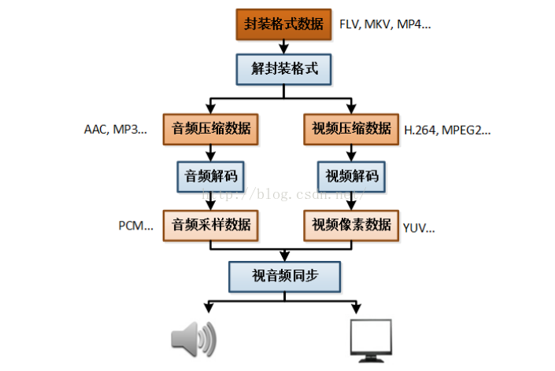

## Video

视频流原理
卫星电视播放

## 技术

H.264、FLV、WMV、MPEG-1、MPEG-2以及MPEG-4

h.264  acc

hls
webm

## 资源

- TED
- YouTube
- [Hashem AL-ghaili](https://youtube.com/user/hashemalghaili)
- [Vimeo](https://vimeo.com/)
- [iTunes Movie Trailers ](http://trailers.apple.com/):苹果官网里的一个电影预告片页面
- [Sandwichvideo](https://sandwichvideo.com/):演示短片
- [Arc](http://thisisarc.com/):集合了超多优秀的短片制作公司，绝对是视频从业者的宝库。
- Quicktime:切分音视频，可以录屏
- [phobal/ivideo](https://github.com/phobal/ivideo):一个可以观看国内主流视频平台所有视频的客户端（Mac、Windows、Linux），包括 VIP 资源
* [Bilibili](https://www.bilibili.com/)

## 工具

* [obsproject/obs-studio](https://github.com/obsproject/obs-studio):OBS Studio - Free and open source software for live streaming and screen recording https://obsproject.com/
* [ossrs/srs](https://github.com/ossrs/srs):SRS's a simplest, conceptual integrated, industrial-strength live streaming origin cluster.
* [video-dev/hls.js](https://github.com/video-dev/hls.js):JavaScript HLS client using Media Source Extension http://video-dev.github.io/hls.js/stable/demo
* [xbmc/xbmc](https://github.com/xbmc/xbmc):Kodi is an award-winning free and open source home theater/media center software and entertainment hub for digital media. With its beautiful interface and powerful skinning engine, it's available for Android, BSD, Linux, macOS, iOS and Windows. https://kodi.tv/
* [MoePlayer/DPlayer](https://github.com/MoePlayer/DPlayer):🍭 Wow, such a lovely HTML5 danmaku video player http://dplayer.js.org
* [iina/iina](https://github.com/iina/iina):The modern video player for macOS. https://iina.io
* [mifi/lossless-cut](https://github.com/mifi/lossless-cut):Save space by quickly and losslessly trimming video and audio files
