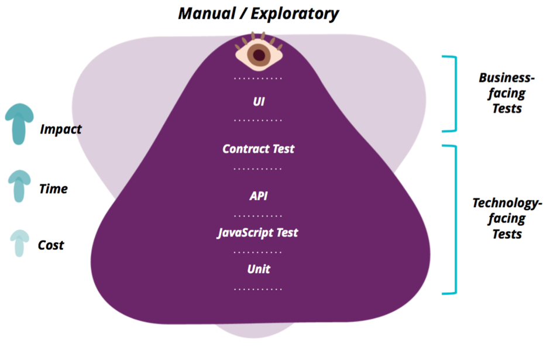

# 测试

自动化包括一切通过工具（程序）的方式来代替或辅助手工测试的行为都可以看做自动化，包括性能测试工具（loadrunner、jmeter）,或自己所写的一段程序，用于生成1到100个测试数据。
分层的自动化测试倡导产品的不同阶段（层次）都需要自动化测试。从单元测试->集成/接口测试->UI测试的金字塔结构。为了表示不同阶段所投入自动化测试的比例。如果一个产品从没有做单元测试与接口测试，只做UI层的自动化测试是不科学的，从而很难从本质上保证产品的质量。如果你妄图实现全面的UI层的自动化测试，那更是一个劳民伤财的举动，投入了大量人力时间，最终获得的收益可能会远远低于所支付的成本。因为越往上层，其维护成本越高。尤其是UI层的元素会时常的发生改变。所以，我们应该把更多的自动化测试放在单元测试与接口测试阶段进行。在《google 测试之道》一书，对于google产品，70%的投入为单元测试，20%为集成、接口测试，10% 为UI层的自动化测试。



- 单元测试关注代码的实现逻辑
- 集成、接口测试关注的一是个函数、类（方法）所提供的接口是否可靠
- UI测试：

数据的正确性包括：数据写入和数据提取，数据写入时使用ui界面直接操作，测试涵盖前端操作，接口正确测试，后端逻辑验证。
数据输出时使用数据库语句提取正确数据然后和前端返回显示的数据做比较来验证，验证包括后端数据库语句正确，接口正确返回数据，前端正确显示数据。

## 策略

应该着重聚焦于业务需求和测试要求

## 路线

* 测试用例编写 -> 单元测试unittest | 接口测试 -> 性能测试Apache ab -> UI自动化测试
* 测试类型
    - 功能测试
    - 性能测试
    - 压力测试
    - GUI测试
    - 安装测试
    - 文档测试。
* 测试阶段分类
    - 单元测试: 测试单个函数是否符合预期功能。
    - 集成测试: 把两个已经测试过的单元组合成一个组件，测试它们之间的接口。API测试属于该阶段。
    - 系统测试: 主要的就是功能测试，测试软件《需求规格说明书》中提到的功能是否有遗漏，是否正确的实现。测试方法一般都使用黑盒测试.
    - 验收测试：验收测试的目的是确保软件准备就绪，并且可以让最终用户将其用于执行软件的既定功能和任务

## 单元测试

* 单元测试是“白盒测试”， 应该覆盖各个分支流程、异常条件
* 单元测试面向的是一个单元("Unit"), 是java中的一个类或者几个类组成的单元。
* 单元测试运行一定要快！
* 单元测试一定是可重复执行的
* 单元测试之间不能有相互依赖，应该是独立的。
* 单元测试代码和业务代码同等重要， 要一并维护。

### 准则

* 解决依赖过重
* 不断重构、测试
* 没有必要特别追求代码覆盖率
* 测试自动化

## 分层

### UI层自动化

- UI层自动化的适用场景是做核心功能的回归测试和冒烟测试，所以在实施过程中，要注意不要把所有的用例都堆砌在UI层，而是尽可能放到接口测试和单元测试中去做。
- 在代码层面，我们可以遵循page object的设计模式，避免在测试代码中直接操作html元素。这样就可以减少重复的代码并提高代码的可维护性。

### 接口层

- 接口功能测试：在写功能测试的过程中，我们可能会和一些其他的模块或第三方API有依赖，在这种情况下，通常可以通过Mock的方法去解决。
- 接口性能测试：

- 在开发过程中，测试人员会和开发合作去写接口的功能测试。
- 在整个功能大概完成，API已经基本确定后，测试和开发一起结对写性能测试。

### 单元测试

单元测试是对软件中最小的测试单元进行验证，在这一层上发现问题时解决成本最低，测试用例的维护成本也不高，具有很好的投入产出比。一般情况下，我们是需要开发人员在开发过程中写单元测试。而作为一个QA，我们更多的是一个单元测试的引导者：

- 和团队一起制定单元测试覆盖率的标准：如果这是一个全新的项目，我们可以把覆盖率设的相对高一点，如85%，这有利于我们在前期就对代码质量做出保证。如果这是一个已经相对成熟的项目，由于前期根本没有单元测试，我们可以先把要求设置的低一点，然后一步步的提升我们的代码覆盖率。
- 为开发人员提供单元测试的用例：我们需要提前把需要验证的用例列在开发的任务卡片里面，这样能帮助开发更有效率的去完成我们期望测试的用例 。
- 定期回顾开发人员写的单元测试：这里并不是要检查代码和具体实现，而是和开发一起去回顾看看单元测试的写法和角度是不是在同一认知上面。这样有助于整个团队建立一种质量保证的意识。

选择nose test这个工具去做单元测试，通过nose test的插件，我们可以拿到单元测试覆盖率的报表

为了解决对数据库的依赖，我们可以建立一个内存数据库去模拟真实数据库，便于我们的测试用例能快速的运行。如在我们的真实项目中，我们的数据库选用的是亚马逊的RDS＋Postgres，但是在做单元测试的时候我们使用的sqlite＋python绑定来模拟真实的数据库

## 分类

### A/B 测试

就是为同一个目标制定两个方案（比如两个页面），让一部分用户使用 A 方案，另一部分用户使用 B 方案，记录下用户的使用情况，看哪个方案更符合设计。

## 后续流程

- 推送到代码到远端后会自动开始运行自动化测试和代码审查。
- 当单元测试通过后会自动部署到测试环境。
- 在部署完成后会自动生成测试报告。
- 小组所有成员会收到部署成功或失败的邮件提醒。

## 什么项目适合做自动化测试

- 软件需求变动不频繁
- 项目周期较长
- 自动化测试脚本可重复使用

## 工具选择

- 桌面程序的工具有：QTP、 AutoRunner
- web应用的工具有：QTP、AutoRunner、Robot Framework、watir、selenium

## 搭建过程

- 在项目开始之前首先搭建持续集成的框架，第一次的时候先写一个最简单的单元测试，如1+1=2，确保可以在CI上运行测试，为后续的开发奠定基础。
- 开发在项目实现过程中进行单元测试，每次开发推送代码时都可以自动运行单元测试和代码风格审查，当单元测试覆盖低于85%或代码风格检查不通过时，构建就会失败。
- 测试和开发在项目实现过程中合作写接口层的功能测试。
- 功能开发大体完成后，测试和开发合作写接口的性能测试。
- 当项目发布之后，测试开始根据核心功能编写UI层面的自动化测试，也相当于是写项目的回归测试。

## 总结

- 项目只有UI自动化测试是不够的，越低层的自动化测试反而越有意义。
- 自动化测试的目的是减少重复的手动测试的成本，使测试人员可以做更多有意义的事情，在实现自动化的过程中，我们花费的精力甚至更多。
- 测试并不是越多越好，除了用例数量还要考虑维护代价。我们希望测试代码能够尽量稳定，因为代码需要不断的被重构，如果发现重构一次代码就修改很多测试，那么这种测试可能会成为负担，也是一种坏味道。
- 测试人员在自动化测试落地的实践中，更多的是一个推动者而不是实现者，我们需要帮助团队建立起一种质量保证的意识，然后共同实现自动化测试的落地。

## 压力测试

[来源](http://www.techug.com/post/stress-testing-in-a-programmer-eyes.html)

### 目的

压力测试其实有两个目的，一是测试应用在高并发情况下是否会报错，进程是否会挂掉；二是测试应用的抗压能力，预估应用的承载能力，为运维同学提供扩容的依据。所以通常是在满足第一点的前提下，再根据可能到来的高并发压力来计算需要多少实例来承载，而这就需要我们压出极限。

### 过程

#### 第一次压力测试

接口开发完成之后就可以进行第一次压力测试。这一次压力测试可以简单压一下，在本机进行就可以。压力测试的目的是检查代码在高并发下是否会报错。另外，编译型语言要观察是否存在内存泄漏，比如golang。因为本机性能有限，一般来说按照100、200、300、500进程数进行压力测试，压到500如果没有报错就可以进行疲劳测试，观察内存占用。

#### 第二次压力测试

所以这就对仿真环境提出了更高的要求，有条件的要保证仿真和线上配置一致。次之也要和线上成比例，这样可以方便后续评估计算。

这一次压力测试重点是压极限。需要特别要注意，这里的极限不是数据库极限，不是Redis极限，而是是指应用服务器的极限承受能力。上面已经说了，压极限是为了给运维同学提供扩容的参考，所以我们要做的是压到服务器的承受极限，看下到底能够承受多大的并发。假设现在线上是双实例8C8G，仿真双实例4C4G。

比如说我们我们压出仿真的极限承受能力是1000，那么我们就可以预估线上能够承受2000并发。比如我们预估接下来我们会迎来一次5000并发的冲击，那么运维同学就可以根据这些数据来评估出相应的扩容方案。

### 步骤

比如第一次压500的时候就出现了一些报错，这时候就是遇到了第一个瓶颈。当解决第一个之后再继续压500，确认解决了第一个瓶颈就可以继续往上加，如此循环直到压到服务器极限。在这个过程中我们会遇到很多瓶颈，冲破这一路瓶颈就像过关斩将一样。

### 常见的瓶颈

- php-fpm进程数。一般php-fpm的进程数是dynamic模式，也就是说动态调整。这种模式下无法应对瞬时的高并发情况，因为他的进程数有个逐渐增加的过程。所以需要调整成static模式然后再根据服务器性能配置合理的进程数。
- 负载均衡限额。比如阿里云的SLB最近就增加了配额限制，免费版的实例只有5000的最大连接数，3000的CPS和1000的QPS。
- 压力测试机性能限制。这是一个比较容易忽略限制，所以我们在压力测试的过程中也要注意观察压力测试机的负载。如果达到这个瓶颈，就要考虑采用多机压力测试。
- 应用服务器、Redis、MySQL的最大连接数、CPU和内存等等。这些都是比较严重的限制，所以一定要在压力测试之前就搞清楚。
- Redis带宽。阿里云的Redis带宽限制大概是200M+，如果数据量比较大，在高并发情况下很容易把带宽打满。目前的解决方案有两个，一是在存入Redis之前进行数据压缩，在读取Redis之后再进行解压。二是采用pb进行存储，当然这两种方案我都还没有真正使用过，等我解决了这个瓶颈再来更新。

### 现象

- 503 -- 服务不可用，一般是负载均衡、nginx达到限制。
- 502 -- Bad Gateway，通常是应用进程挂掉了，或者进程不够用处理不过来。
- 500 -- 应用故障，一般是应用抛出了异常没有正常响应，比如达到Redis和MySQL的瓶颈。
- 压力测试不出来的坑：现在大多数正式的项目都是前后端分离的，所以上述说的其实都是压后端接口，而有一种情况是压根压不出来的，那就是接口调用数。作为后端开发，一定要搞清楚承受冲击的前端页面在加载的过程中会调用几个接口，调用几次。如果不搞清楚这些，在真实环境中后端服务器就可能承受比前端服务器还高的压力，从而影响之前针对压力测试数据做出的评估。针对这种情况，其实最好的方案就是在开发之时就跟前端约定好接口调用规则，在接口设计和交互上进行避免。

```
ab -c 100 -n 100000 http://127.0.0.1:8888/hello/index/
This is ApacheBench, Version 2.3 <$Revision: 655654 $>
Copyright 1996 Adam Twiss, Zeus Technology Ltd, http://www.zeustech.net/
Licensed to The Apache Software Foundation, http://www.apache.org/

Benchmarking 127.0.0.1 (be patient)
Completed 10000 requests
Completed 20000 requests
Completed 30000 requests
Completed 40000 requests
Completed 50000 requests
Completed 60000 requests
Completed 70000 requests
Completed 80000 requests
Completed 90000 requests
Completed 100000 requests
Finished 100000 requests

Server Software:        Swoole
Server Hostname:        127.0.0.1
Server Port:            8888

Document Path:          /hello/index/
Document Length:        11 bytes

Concurrency Level:      100
Time taken for tests:   10.717 seconds
Complete requests:      100000
Failed requests:        0
Write errors:           0
Total transferred:      27500000 bytes
HTML transferred:       1100000 bytes
Requests per second:    9330.83 [#/sec] (mean)
Time per request:       10.717 [ms] (mean)
Time per request:       0.107 [ms] (mean, across all concurrent requests)
Transfer rate:          2505.84 [Kbytes/sec] received

Connection Times (ms)
              min  mean[+/-sd] median   max
Connect:        0    1   1.0      1       9
Processing:     1   10   5.6      8      63
Waiting:        0    7   5.4      6      62
Total:          1   11   5.5      9      63

Percentage of the requests served within a certain time (ms)
  50%      9
  66%     11
  75%     12
  80%     13
  90%     17
  95%     22
  98%     28
  99%     32
 100%     63 (longest request)
```

## 能力

* 测试用例
* 测试方法
* 缺陷生命周期
* 单元测试
* 接口测试

## 性能测试

性能测试的执行是基本功能的重复和并发，需要模拟多用户，在性能测试执行时需要监控指标参数，同时性能测试的结果不是那么显而易见，需要对数据进行分析

* 服务器端性能测试工具：需要支持产生压力和负载，录制和生成脚本，设置和部署场景，产生并发用户和向系统施加持续的压力。LoadRunner和Jmeter
* web前端性能测试工具：需要关于心浏览器等客户端工具对具体需要展现的页面的处理过程。 Web Bench、ab、Siege
* 移动端性能测试工具：同web端性能测试工具也需要关心页面的处理过程，另外还要具体数据采集的功能，比如：手机CPU、内存、电量，启动时间等数据的记录。
* 资源监控工具：这个主要是能够收集性能测试过程中的数据以及良好的结果展现方式。

## 测试流程

* 功能测试
* 链接测试
  - 测试所有链接是否按指示的那样确实链接到了该链接的页面
  - 测试所链接的页面是否存在
  - 保证Web应用系统上没有孤立的页面
  - 推荐工具：
    + Xenu Link Sleuth 免费 绿色免安装软件
    + HTML Link Validator 共享（30天试用）
* 表单测试
  - 按钮能正常工作
  - 数据能够被正确处理
  - 服务器能正确保存这些数据
* 数据校验
  - 如果系根据业务规则需要对用户输入进行校验，需要保证这些校验功能正常工作。
  - 2和3的采取措施：第一个完整的版本采用手动检查，同时形成WinRunner（QTP）脚本；回归测试以及升级版本主要靠WinRunner（QTP）自动回放测试。
* cookies测试
  - Cookies是否起作用
  - 是否按预定的时间进行保存
  - 刷新对Cookies有什么影响
  - cookie能够正常处理注册信息而且已对这些信息加密
  - 如果使用 cookie 来统计次数，需要验证次数累计正确。
  - 采取措施：
    + 采用黑盒测试：采用上面提到的方法进行测试
    + 采用查看cookies的软件进行（初步的想法）
  - 推荐工具：
    + IECookiesView v1.50
    + Cookies Manager v1.1
* 数据库测试
  - 数据一致性错误主要是由于用户提交的表单信息不正确而造成的
  - 输出错误主要是由于网络速度或程序设计问题等引起的
* 应用程序特定的功能需求
  - 尝试用户可能进行的所有操作
* 设计语言测试
  - 主要是Web设计语言版本的统一
* 性能测试
* 连接速度测试
* 负载测试
  - Web应用系统能允许多少个用户同时在线
  - 如果超过了这个数量，会出现什么现象
  - Web应用系统能否处理大量用户对同一个页面的请求
* 压力测试
  - 测试Web应用系统会不会崩溃
  - 在什么情况下会崩溃。
  - 推荐工具：WAS、ACT
* 用户界面测试
* 导航测试
  - 导航是否直观？
  - Web系统的主要部分是否可通过主页存取？
  - Web系统是否需要站点地图、搜索引擎或其他的导航帮助？
* 图形测试
  - 要确保图形有明确的用途，图片或动画不要胡乱地堆在一起，以免浪费传输时间
  - 验证所有页面字体的风格是否一致
  - 背景颜色应该与字体颜色和前景颜色相搭配
  - 图片的大小和质量也是一个很重要的因素，一般采用JPG或GIF压缩，最好能使图片的大小减小到 30k 以下
  - 最后，需要验证的是文字回绕是否正确。如果说明文字指向右边的图片，应该确保该图片出现在右边。不要因为使用图片而使窗口和段落排列古怪或者出现孤行。
* 内容测试
  - 内容测试用来检验Web应用系统提供信息的正确性、准确性和相关性
* 表格测试
  - 需要验证表格是否设置正确
* 整体界面测试
  - 当用户浏览Web应用系统时是否感到舒适？
  - 是否凭直觉就知道要找的信息在什么地方？
  - 整个Web应用系统的设计风格是否一致？
  - 测试方法：一般Web应用系统采取在主页上做一个调查问卷的形式，来得到最终用户的反馈信息。
* 兼容性测试
* 平台测试：在Web系统发布之前，需要在各种操作系统下对Web系统进行兼容性测试
* 浏览器测试：测试浏览器兼容性的一个方法是创建一个兼容性矩阵。在这个矩阵中，测试不同厂商、不同版本的浏览器对某些构件和设置的适应性
* 分辨率测试：不同分辨率下显示是否正常
* Modem/连接速率
* 打印机：用户可能会将网页打印下来，因此网也在设计的时候要考虑到打印问题
* 组合测试：根据实际情况，采取等价划分的方法，列出兼容性矩阵
* 安全测试
* 目录设置
* SSL
* 登录
  - 用户登录是否有次数限制?
  - 是否限制从某些 IP 地址登录?
  - 如果允许登录失败的次数为3，你在第三次登录的时候输入正确的用户名和口令，能通过验证吗?
  - 口令选择有规则限制吗?
  - 是否可以不登陆而直接浏览某个页面？
  - Web应用系统是否有超时的限制，没有点击任何页面，是否需要重新登陆才能正常使用。
* 日志文件
  - 日志是否记所有的事务处理?
  - 是否记录失败的注册企图?
  - 是否记录被盗信用卡的使用?
  - 是否在每次事务完成的时候都进行保存?
  - 记录IP 地址吗?
  - 记录用户名吗?
* 脚本语言
* 接口测试
* 服务器接口
* 外部接口：测试人员需要确认软件能够处理外部服务器返回的所有可能的消息
* 错误处理：在理解需求的基础上，充分发挥想象力，尽量比较全面的列出各种异常情况

## 冒烟测试

* 冒烟测试是这样的一种测试，不要求覆盖面有多广，但至少要保证覆盖待测产品的绝大部分功能；
* 不要求每个功能都测的很详细，但至少要保证被修复了的bug所属的功能和系统其他骨干功能都是可用的（即这个版本能拿去做系统功能测试了）。
* 而要做到覆盖骨干功能和bug所属功能，却不是简简单单在页面中点几下就行了的。
* 任何一个项目或者产品，骨干功能都有它的使用场景。冒烟测试就是要保证这些骨干功能的使用场景都能跑通，如果没跑通，后续的系统测试就没必要了。

## 参考

- [我们是怎样在项目内落地自动化测试体系的](http://blog.csdn.net/gitchat/article/details/78086617)
- [How We Made Writing Tests Fun and Easy](https://blog.daftcode.pl/how-we-made-writing-tests-fun-and-easy-2d7e1fac6d16)

## 工具

* redmine
* [locustio/locust](https://github.com/locustio/locust):Scalable user load testing tool written in Python http://locust.io
* JUnit
* Mocha
* Selenium
* Soap UI
* Cucumber
* Katalon Studio
* Calabash
* Appium
* Apache JMeter
* Meissa
* EasyMock
* jmockit
* [ripienaar/free-for-dev](https://github.com/ripienaar/free-for-dev):A list of SaaS, PaaS and IaaS offerings that have free tiers of interest to devops and infradev
* [getgauge/gauge](https://github.com/getgauge/gauge):Light weight cross-platform test automation https://gauge.org
* [abseil/googletest](https://github.com/abseil/googletest):Google Test
