# [git/git](https://github.com/git/git)

fast, scalable, distributed revision control system.一个分布式的代码管理容器，本地和远端都保有一份相同的代码。

* 分布式
* 基于时间点的快照：将提交点指向提交时的项目快照
* 分支模型：SVN等版本控制工具将每个分支都要放在不同的目录中, Git可以在同一个目录中切换不同的分支
* 不必将所有的分支都上传到GitHub中去
* 用户可以随时创建、合并、删除分支, 多人实现不同的功能, 可以创建多个分支进行开发, 之后进行分支合并, 这种方式使开发变得快速, 简单, 安全

## 服务

* [GitHub](https://github.com/)
* [Bitbucket](https://bitbucket.org/product)
* [Gitlab](https://gitlab.com/)
* [码云](https://gitee.com)
* [Coding](https://github.com/)
* [sourceforge](https://sourceforge.net/):The Complete Open-Source Software Platform
* [GitKraken](link)
* [LaunchPad](link)

## 搭建服务

* [gitlabhq/gitlabhq](https://github.com/gitlabhq/gitlabhq):GitLab CE | Please open new issues in our issue tracker on GitLab.com https://about.gitlab.com/getting-help/
* [gogits/gogs](https://github.com/gogits/gogs):Gogs is a painless self-hosted Git service. https://gogs.io
* [go-gitea/gitea](https://github.com/go-gitea/gitea):Gitea: Git with a cup of tea http://gitea.io

## 安装

```sh
sudo apt-get install git

brew install git
brew install git-flow
brew install git && brew install bash-completion

# Add bash-completion to your ~/.bash_profile or ~/.zshrc
if [ -f $(brew --prefix)/etc/bash_completion ]; then
  . $(brew --prefix)/etc/bash_completion
fi
```

## 配置

* 全局配置: git config --global -l
  - /etc/gitconfig文件
  - ubuntu:~/.gitconfig
* 系统配置： `git config --system`
* 项目配置：project/.git/config   `git config`
* alias说明
  + prune = fetch --prune - 当在其他人将分支推送到远程仓库时，我也会得到了大量的本地分支。Prune可以删除远端已经删除的任何本地分支。
  + undo = reset --soft HEAD ^ - 如果我在做出提交时犯了一个错误，这个命令会把代码恢复到提交之前的样子。通常我只是在这种情况下修改现有的提交，因为它保留了提交信息。
  + stash-all = stash save --include-untracked - 当你正在开发，有人临时要求你切换分支时，stash 是非常有用的。这个命令确保当你 stash 时，可以记录没有被 git add 的新文件。
  + merge
    + ff = only 确保只有在每一个合并都是 fast-forward 的时候，你才会看到报错。否则只要你配置了这个选项，什么合并提交，什么历史记录，通通都不需要，只是两次提交之间的平滑过渡。你可能会想知道如何完成这项工作。答案是用 git rebase，把一个分支的修改合并到当前分支，它非常有用当我 pull 代码与 master 有冲突的时候，我使用这种方式来处理。当你在本地分支上修改后，同时其他人在 master 上 做了修改，我想这样比你直接 merge 到你本地分支时的 commit 更好。这样你可以避免多出一个 merge 的 commit。如果我打算新建一个merge commit，我可以用明确的 git merge -ff 来创建。
  + commit
    + gpgSign = true 确保您的所有 commit 都由你的 GPG 密钥签名。这通常是一个好主意，因为 .gitconfig 文件中没有验证您的用户信息，这意味着看起来像您这样的提交可能会轻松显示在其他人的提交 信息中。事实上，我曾经用过别人的凭据，因为帐户和机器配置耗时太长。我的提交请求是通过别人的帐号提交的，但内部的所有提交都是我的真实账号。将你的 GPG key 添加到 Github并尝试一次提交，你可能就会解决你现在的疑问，您提交内容将会有一个"已验证"标记。
    + 如果您有多个 GPG 密钥，可以使用 user.signingKey 选项指定要使用的密钥。
    + 上述的配置在 GUI 工具里不会生效，你需要在工具里的设置里找配置项。
    + gpg-agent可以保存口令，让我们更方便。
  + Push
    + default = simple可能是你已经设置的配置项。它可以更轻松地将您的本地分支推送到远程，当二者分支名一样的时候。
    + followTags = true很简单。配置它以后，当你 git push 的时候可以直接将本地的 tags 提交到远程，而不用每次都加参数 --follow-tags。不知道你是不是和我一样，我如果创建了一个tag，我就基本上一定会将它推到远程的。

```sh
git --version
man git # Git User Manual

git config --list --show-origin # 查看配置
git config --local # repository配置
git config -l                       # 列举所有配置

git config --global user.name "name"
git config --global user.email "email"
git config --global color.ui "auto"
git config --global core.editor vim # 设置编辑器为 vim

git config --global credential.helper osxkeychain

git config --global core.excludesfile ~/.gitignore
echo .DS_Store >> ~/.gitignore

git config --global mergetool.sublime.cmd "subl -w \$MERGED"
git config --global mergetool.sublime.trustExitCode false
git config --global merge.tool sublime | vimdiff
git mergetool -y

git config --global alias.ls 'log --name-status --oneline --graph'
git config --global rebase.autoStash true
git config --global alias.st 'status --porcelain'

[user]
email = liboming88@yeah.net
name = Henryli

[alias]  # .gitconfig中添加alias
prune = fetch --prune
# Because I constantly forget how to do this
# https://git-scm.com/docs/git-fetch#git-fetch--p

undo = reset --soft HEAD^
# Not quite as common as an amend, but still common
# https://git-scm.com/docs/git-reset#git-reset-emgitresetemltmodegtltcommitgt

stash-all = stash save --include-untracked
# We wanna grab those pesky un-added files!
# https://git-scm.com/docs/git-stash

glog = log --graph --pretty=format:'%Cred%h%Creset -%C(yellow)%d%Creset %s %Cgreen(%cr) %C(bold blue)<%an>%Creset'
# No need for a GUI - a nice, colorful, graphical representation
# https://git-scm.com/docs/git-log
# via https://medium.com/@payload.dd/thanks-for-the-git-st-i-will-use-this-4da5839a21a4

[merge]
ff = only
# I pretty much never mean to do a real merge, since I use a rebase workflow.
# Note: this global option applies to all merges, including those done during a git pull
# https://git-scm.com/docs/git-config#git-config-mergeff

conflictstyle = diff3
# Standard diff is two sets of final changes. This introduces the original text before each side's changes.
# https://git-scm.com/docs/git-config#git-config-mergeconflictStyle

[commit]
gpgSign = true
# "other people can trust that the changes you've made really were made by you"
# https://help.github.com/articles/about-gpg/
# https://git-scm.com/docs/git-config#git-config-commitgpgSign

[push]
default = simple
# "push the current branch back to the branch whose changes are usually integrated into the current branch"
# "refuse to push if the upstream branch’s name is different from the local one"
# https://git-scm.com/docs/git-config#git-config-pushdefault

followTags = true
# Because I get sick of telling git to do it manually
# https://git-scm.com/docs/git-config#git-config-pushfollowTags

[status]
showUntrackedFiles = all
# Sometimes a newly-added folder, since it's only one line in git status, can slip under the radar.
# https://git-scm.com/docs/git-config#git-config-statusshowUntrackedFiles

[transfer]
fsckobjects = true
# To combat repository corruption!
# Note: this global option applies during receive and transmit
# https://git-scm.com/docs/git-config#git-config-transferfsckObjects
# via https://groups.google.com/forum/#!topic/binary-transparency/f-BI4o8HZW0

# A nice little github-like colorful, split diff right in the console.
# via http://owen.cymru/github-style-diff-in-terminal-with-icdiff/
[diff]
tool = icdiff
[difftool]
prompt = false
[difftool "icdiff"]
cmd = /usr/local/bin/icdiff --line-numbers $LOCAL $REMOTE

[remote "public"] # 定义远程仓库
 url = git@github.com:aaa/bbb.git
 url = kch@homeserver:ccc/ddd.git
```

## 传输协议

常见的有三种协议

* SSH:SSH keys的使用需保证remote的源为git方式
* HTTP(S)
* Git

### SSH

* 生成路径 `~/.ssh/`
* 公钥添加到github账户

```sh
ssh-keygen -t rsa -b 4096 -C "your_email@example.com" -f ~/.ssh/github
ssh-add -K ~/.ssh/github # 如果不是默认密钥 id_rsa ，则需要以下命令注册密钥文件，-K 参数将密钥存入 Mac Keychain
cat ~/.ssh/github.pub
ssh -T git@github.com  # 验证

eval "$(ssh-agent -s)"
ssh-add -K ~/.ssh/id_rsa

# ~/.ssh/config:
Host *
  AddKeysToAgent yes
  UseKeychain yes
  IdentityFile ~/.ssh/id_rsa
```

### GPG

* 为提交内容添加一个"已验证"标记
* 与SSH配合使用，都添加到GitHub中
* bitbucket不支持gpg添加密钥

```sh
sudo apt-get install gnupg # Debian / Ubuntu 环境
yum install gnupg # Fedora 环境
brew install gpg

gpg --help

gpg --full-generate-key # 4096

gpg --list-secret-keys --keyid-format LONG  # list GPG keys for which you have both a public and private key. A private key is required for signing commits or tags.

sec   4096R/3AA5C34371567BD2 2016-03-10 [expires: 2017-03-10] # GPG key ID is 3AA5C34371567BD2
uid                          Hubot # 用户ID Henry Lee <liboming88@yeah.net>
ssb   4096R/42B317FD4BA89E7A 2016-03-10

gpg --armor --export 3AA5C34371567BD2 | Hubot  # get the public key,add to github

git config --global user.signingkey 3AA5C34371567BD2 # git配置,commit生效
git config --global commit.gpgsign true

git commit -S -m your commit message
git tag -s -m "GPG-sign tag"

git log --show-signature # 查看本地commit有签名

gpg --delete-key [用户ID] # 删除密钥

gpg --recipient [用户ID] --output demo.en.txt --encrypt demo.txt
gpg --decrypt demo.en.txt --output demo.de.txt

gpg --sign demo.txt #签名
```

## 原理

Git维护的就是一个commitID树，分别保存着不同状态下的代码。 所以你对代码的任何修改，最终都会反映到 commit 上面去。创建和保存项目的快照及与之后的快照进行对比

* 工作区（当前文件状态Workspace）:进行开发改动的地方，任何对象都是在工作区中诞生和被修改；文件状态：modified:working directory
* 暂存区（提交最新的版本Index/Stage）:.git目录下的index文件, 暂存区会记录git add添加文件的相关信息(文件名、大小、timestamp...)，不保存文件实体, 通过id指向每个文件实体。任何修改都是从进入index区才开始被版本控制；文件状态：staged:Stage(Index)
* 版本库 本地仓库（所有历史版本Repository）:保存了对象被提交过的各个版本，只有把修改提交到本地仓库，该修改才能在仓库中留下痕迹；.git文件夹里还包括git自动创建的master分支，并且将HEAD指针指向master分支。文件状态：committed:History
* 远程仓库(Remote):通常使用clone命令将远程仓库拷贝到本地仓库中，开发后推送到远程仓库中即可；


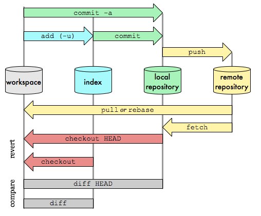

### 创建工作区 start a working area

```sh
git clone [url] [project-name] # 下载一个项目和它的整个代码历史,支持多种协议
git clone http[s]://example.com/path/to/repo.git/
git clone ssh://example.com/path/to/repo.git/
git clone [user@]example.com:path/to/repo.git/
git clone git://example.com/path/to/repo.git/
git clone /opt/git/project.git
git clone file:///opt/git/project.git
git clone ftp[s]://example.com/path/to/repo.git/
git clone rsync://example.com/path/to/repo.git/
git clone -o jQuery https://github.com/jquery/jquery.git # 所使用的远程主机自动被Git命名为origin。如果想自定义主机名，需要用git clone命令的-o选项指定

git init --bare # 远程仓库文件构建
git init [project-name] # 初始化git仓库 在当前目录内新建一个Git代码库，会生成.git文件，用于新建空项目文件或者将项目添加git管理，默认URL文件名称，也可以自定义project-name
```

#### working tree

writing clear commit messages, you can make it easier for other people to follow along and provide feedback.

* git reset -- files 用来撤销最后一次git add files，你也可以用git reset 撤销所有暂存区域文件。
* git checkout -- files 把文件从暂存区域复制到工作目录，用来丢弃本地修改。
* git commit -a git commit files git checkout HEAD -- files 回滚到复制最后一次提交。跳过暂存区域直接从仓库取出文件或者直接提交代码
* 在master分支的祖父节点maint分支进行一次提交.这样，maint分支就不再是master分支的祖父节点。此时，合并 (或者 衍合) 是必须的。
* 如果想更改一次提交，使用 git commit --amend。git会使用与当前提交相同的父节点进行一次新提交，旧的提交会被取消。
* checkout命令用于从历史提交（或者暂存区域）中拷贝文件到工作目录，也可用于切换分支。git checkout HEAD~ foo.c会将提交节点HEAD~(即当前提交节点的父节点)中的foo.c复制到工作目录并且加到暂存区域中。
    - 如果命令中没有指定提交节点，则会从暂存区域中拷贝内容
    - 当不指定文件名，而是给出一个（本地）分支时，那么HEAD标识会移动到那个分支（也就是说，我们“切换”到那个分支了），然后暂存区域和工作目录中的内容会和HEAD对应的提交节点一致。新提交节点（下图中的a47c3）中的所有文件都会被复制（到暂存区域和工作目录中）；只存在于老的提交节点（ed489）中的文件会被删除；不属于上述两者的文件会被忽略，不受影响。
    - 如果既没有指定文件名，也没有指定分支名，而是一个标签、远程分支、SHA-1值或者是像master~3类似的东西，就得到一个匿名分支，称作detached HEAD（被分离的HEAD标识）。这样可以很方便地在历史版本之间互相切换。比如说你想要编译1.6.6.1版本的git，你可以运行git checkout v1.6.6.1（这是一个标签，而非分支名），编译，安装，然后切换回另一个分支，比如说git checkout master。然而，当提交操作涉及到“分离的HEAD”时，其行为会略有不同
        + 当HEAD处于分离状态（不依附于任一分支）时，提交操作可以正常进行，但是不会更新任何已命名的分支.一旦此后你切换到别的分支，比如说master，那么这个提交节点（可能）再也不会被引用到，然后就会被丢弃掉了。注意这个命令之后就不会有东西引用2eecb。如果你想保存这个状态，可以用命令git checkout -b name来创建一个新的分支。
* reset命令把当前分支指向另一个位置，并且有选择的变动工作目录和索引。也用来在从历史仓库中复制文件到索引，而不动工作目录。
    - 如果不给选项，那么当前分支指向到那个提交。如果用--hard选项，那么工作目录也更新，如果用--soft选项，那么都不变。
    - 没有给出提交点的版本号，那么默认用HEAD。这样，分支指向不变，但是索引会回滚到最后一次提交，如果用--hard选项，工作目录也同样。
    - 如果没有给出提交点的版本号，那么默认用HEAD。这样，分支指向不变，但是索引会回滚到最后一次提交，如果用--hard选项，工作目录也同样。
    - 如果给了文件名(或者 -p选项), 那么工作效果和带文件名的checkout差不多，除了索引被更新。

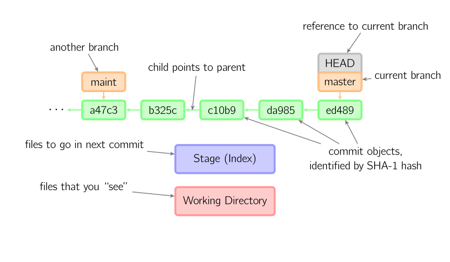
绿色的5位字符表示提交的ID，分别指向父节点。分支用橘色显示，分别指向特定的提交。当前分支由附在其上的HEAD标识。 这张图片里显示最后5次提交，ed489是最新提交。 master分支指向此次提交，另一个maint分支指向祖父提交节点。
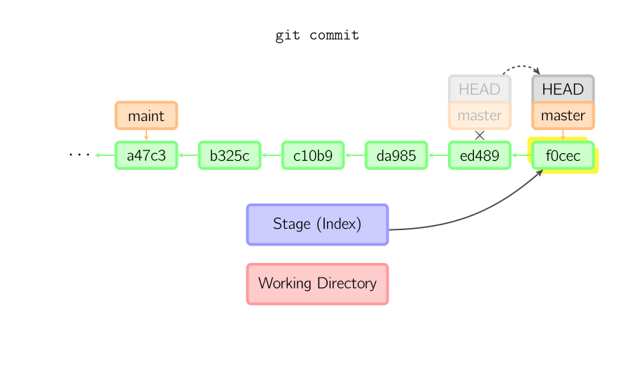
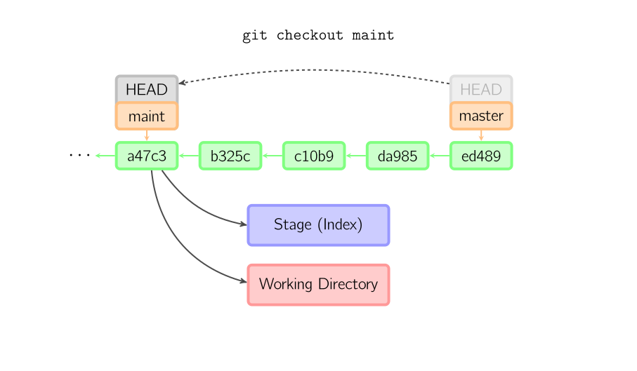
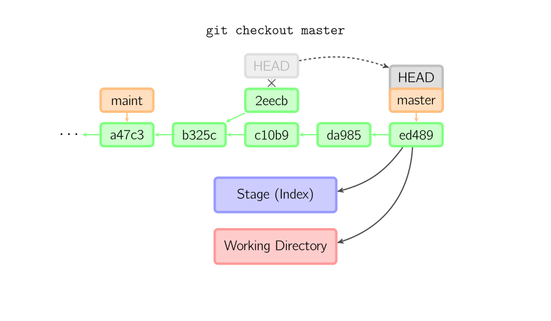
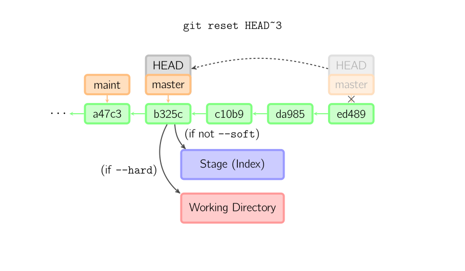
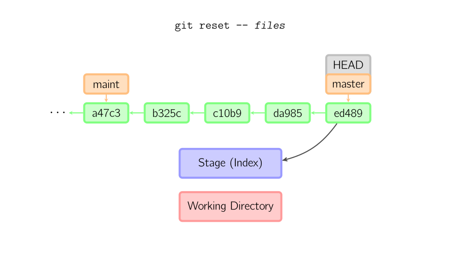
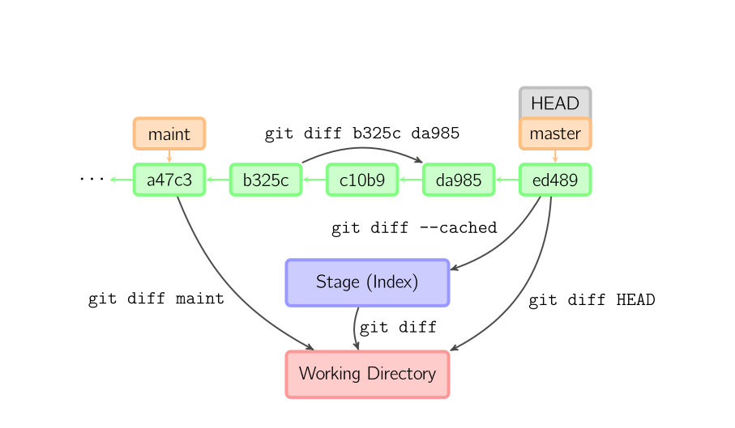

```sh
git stutus # 查看本地的代码状态,工作树与暂存区的文件对比差别,显示有变更的文件

git add .|<file1>(<file2> <file3>)|[dir] #（所有修改过的文件/单个文件 或通过使用通配符将一组文件添加到暂存区）
git add -p # 添加每个变化前，都会要求确认,对于同一个文件的多处变化，可以实现分次提交
git add -A # 添加所有变化（新增 new、修改 modified、删除 deleted）到暂存区
git add -u # 添加修改(modified)和被删除(deleted)文件，不包括新文件(new)也就是不是被追踪文件（untracked）
git add -p <file> # 添加文件内某些改动到暂存区

git mv [file-original] [file-renamed]  # 改名文件，并且将这个改名放入暂存区

git rm [file1] [file2] ... # 删除工作区文件，并且将这次删除放入暂存区
git rm --cached [file]  # 停止追踪指定文件，但该文件会保留在工作区

git reset # Reset the index to match the most recent commit
git reset [HEAD] [file] # 撤销文件跟踪，重置暂存区的指定文件，与上一次commit保持一致，但工作区不变
git reset --soft # 重置
git reset --hard # 重置暂存区与工作区，与上一次commit保持一致
git reset [commit] # 重置当前分支的指针为指定commit，同时重置暂存区，但工作区不变 会将提交记录回滚，代码不回滚
git reset --hard b14bb52 # 会将提交记录和代码全部回滚 重置当前分支的HEAD为指定commit，同时重置暂存区和工作区，与指定commit一致
git reset --keep [commit] # 重置当前HEAD为指定commit，但保持暂存区和工作区不变
git reset HEAD~1 # Undo last commit
git revert [commit] # 回退到某个提交，但是不删除commit

git diff # 显示暂存区和工作区的差异 查看执行 git status 的结果的详细信息
git diff <fileName>
git diff --staged # 暂存区与最新一次提交之间的差别
git diff HEAD # 本次提交与上次提交之间的区别 HEAD：最后一次提交,HEAD^^:前两次提交 HEAD~3：前三次提交
git diff --cached [file] # 显示暂存区和上一个commit的差异
git diff [first-branch]...[second-branch] # 显示两次提交之间的差异
git diff --shortstat "@{0 day ago}" # 显示今天你写了多少行代码

git checkout [file]  # 恢复暂存区的指定文件到工作区
git checkout [commit] [file] # 恢复某个commit的指定文件到暂存区和工作区
git checkout origin/master -- path/to/file
git checkout ./file # 回滚最新版本库文件，抛弃工作区修改
git checkout  branchname/ remotes/origin/branchname  / 158e4ef8409a7f115250309e1234567a44341404 / HEAD
```

#### 暂存区

* merge 命令把不同分支合并起来。合并前，索引必须和当前提交相同。
    - 如果另一个分支是当前提交的祖父节点，那么合并命令将什么也不做。
    - 如果当前提交是另一个分支的祖父节点，就导致fast-forward合并。指向只是简单的移动，并生成一个新的提交。
    - 一次真正的合并。默认把当前提交(ed489 如下所示)和另一个提交(33104)以及他们的共同祖父节点(b325c)进行一次三方合并。结果是先保存当前目录和索引，然后和父节点33104一起做一次新提交。
* cherry-pick命令"复制"一个提交节点并在当前分支做一次完全一样的新提交。
* 衍合是合并命令的另一种选择。合并把两个父分支合并进行一次提交，提交历史不是线性的。衍合在当前分支上重演另一个分支的历史，提交历史是线性的。 本质上，这是线性化的自动的 cherry-pick
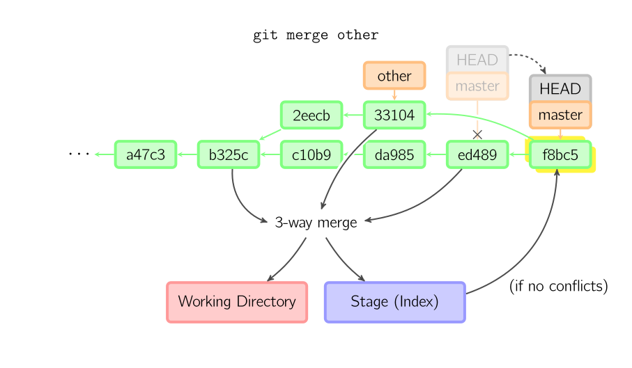
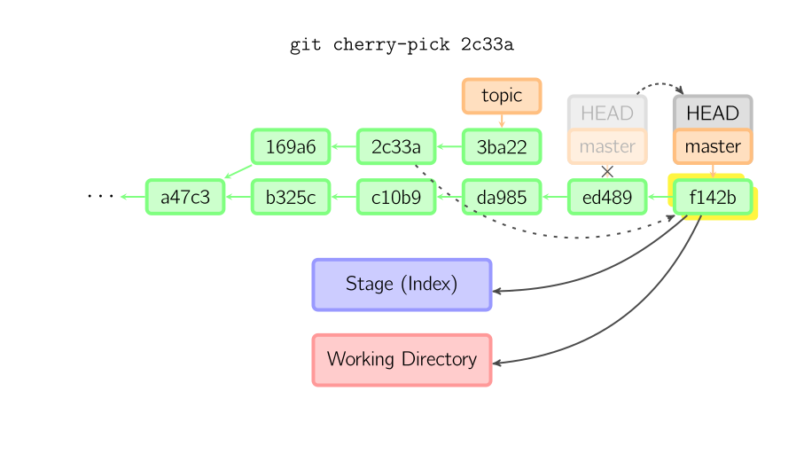
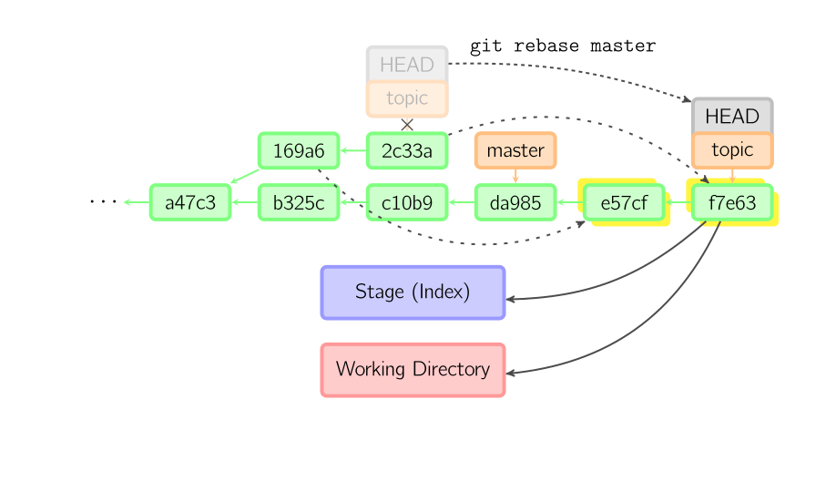:上面的命令都在topic分支中进行，而不是master分支，在master分支上重演，并且把分支指向新的节点。注意旧提交没有被引用，将被回收。

```sh
git commit -m "the first commit" # 每个 commit 都是一份完整的代码状态，用一个 commitID 来唯一标志.进行一次包含最后一次提交加上工作目录中文件快照的提交。并且文件被添加到暂存区域。
git commit [file1] [file2] ... -m [message]
git commit -a # 提交工作区自上次commit之后的变化，直接到仓库区,通过编辑器添加message
git commit -v # 提交时显示所有diff信息
git commit –-am/--amend -m [message] # 使用一次新的commit，替代上一次提交,如果代码没有任何新变化，则用来改写上一次commit的提交信息
git commit --amend [file1] [file2] ... # 修改上一次提交日志

# 在开发中的时候尽量保持一个较高频率的代码提交，这样可以避免不小心代码丢失。但是真正合并代码的时候，我们并不希望有太多冗余的提交记录.压缩日志之后不经能让 commit 记录非常整洁，同时也便于使用 rebase 合并代码。
git log # 找到起始 commitID
git log -p <file> # 跟踪查看某个文件的历史修改记录 每一次diff

--oneline #  --pretty only show the commit id and comment per-commit
--graph # gives you that visual representation The * indicates that there is a commit on the line
--decorate # more information
--reverse
--all
--author="Linus"
--oneline
--since="yesterday"
--grep="day of week"
--stat # can give you useful information about what changed.
-G "chef-client" # Regex on Commits
-5
--before={3.weeks.ago}
--after={2010-04-18}
--no-merges # 显示当前分支的版本历史
--abbrev-commit  # （仅展示commit信息的图形化分支）
-S [keyword]  # 搜索提交历史，根据关键词

git log [tag] HEAD --pretty=format:%s   # 显示某个commit之后的所有变动，每个commit占据一行
git log [tag] HEAD --grep feature  # 显示某个commit之后的所有变动，其"提交说明"必须符合搜索条件
git log --follow [file]  # 显示某个文件的版本历史，包括文件改名
git reflog # 显示当前分支的最近几次提交,
git log -3
git log
git log --name-status --oneline
git whatchanged [file]  # 显示某个文件的版本历史，包括文件改名
git log -5 --pretty --oneline  # 显示过去5次提交
git shortlog -sn  # 显示所有提交过的用户，按提交次数排序

git show [commit] # 显示某次提交的元数据和内容变化
git show --name-only [commit] # 显示某次提交发生变化的文件
git show [commit]:[filename] # 显示某次提交时，某个文件的内容

git blame filename # 查看指定文件是什么人在什么时间修改过

git stash # 将当前工作状态（WIP，work in progress）临时存放在 stash 队列中,注意：未提交到版本库的文件会自动忽略，只要不运行 git clean -fd . 就不会丢失
git stash save "stash name"
git stash list # 查看 stash 队列中已暂存了多少 WIP
git stash apply # 恢复stash内容到工作区，但是并不删除stash中的内容
git stash drop # 删除stash中的内容
git stash pop # 恢复上一次的 WIP 状态，并从队列中移除
git stash pop stash@{num} # 恢复指定编号的 WIP，同时从队列中移除
git stash apply stash@{num} # 恢复指定编号的 WIP，但不从队列中移除

git pull <remote> <branch>    # 抓取远程仓库所有分支更新并合并到本地
git pull --no-ff                 # 抓取远程仓库所有分支更新并合并到本地，不要快进合并
git pull --rebase origin master # 取回远程主机某个分支的更新，再与本地的指定分支合并
git fetch origin # 从远程更新代码到本地但不合并
git merge origin/master             # 抓取远程仓库更新   将远程主分支合并到本地当前分支 等同于git pull


# 合并 commit
git merge master #  merge是两个分支处理冲突后，新增一个 commit 追加到master上。
git rebase master # 将someFeature分支上的commit记录追加到主分支上
# rebase:将本次修改起始的远程仓库节点之后的修改内容优先合并到本地修改分支上
# conflict：git rebase出现冲突，修改冲突文件，每次修改,只修改自己添加的内容，每次不需commit，最后git push -f提交到远程仓库
git add .
git rebase --continue
git rebase --abort

git rebase -i # 通过交互式的 rebase，提供对分支 commit 的控制，从而可以清理混乱的历史。

git clean # Remove untracked files
git reset file # Remove file from index
```

* git merge 处理冲突更直接
* git rebase 能够保证清晰的 commit 记录。
    - rebase 先找出共同的祖先节点
    - 从祖先节点把功能分支的提交记录摘下来，然后 rebase 到 master 分支
    - rebase 之后的 commitID 其实已经发生了变化


使用 git reset --hard commitID 把本地开发代码回滚到了一个之前的版本，而且还没有推到远端，怎么才能找回丢失的代码呢？ 你如果使用 git log 查看提交日志，并不能找回丢弃的那些 commitID。 而 git reflog 却详细的记录了你每个操作的 commitID，可以轻易的让你复原当时的操作并且找回丢失的代码。

#### 分支

branch name should be descriptive。创建分支后, 分支操作不会影响master分支, 但是master分支改变会影其它分支

```sh
git branch [-r]|[-a] # 列出所有远程/所有分支
git branch -av # 查看所有分支（包括远程分支）和最后一次提交日志

git branch <new-branch> <old-branch> # 新建分支，不带old-branch为默认在当前分支上建立新分支
git checkout -b newBrach origin/master # 在origin/master的基础上，创建一个新分支，并切换到new分支
git checkout -b branch-name origin/branch-name # 从本地创建和远程对应的分支
git checkout --track origin/branch     # 跟踪某个远程分支创建相应的本地分支

git branch [branch-name] [commit] # 新建一个分支，指向指定commit,但依然停留在当前分支
git branch --track [branch] [remote-branch] # 新建一个分支，与指定的远程分支建立追踪关系

git branch -d [branch-name] # 删除已合并分支
git branch -D branchName # 删除分支

git checkout dev # 切换
git checkout - # 切换到上一个分支

git branch -m new # Rename current branch

git merge new # 合并指定分支到当前分支
git merge origin/master # 在本地分支上合并远程分支
git merge --no-ff master
git mergetool # 使用配置的合并工具来解决冲突
git add|rm <resolved-file> # 处理已手动合并的文件

git rebase master # 合并分支，但是不合并提交记录（commit），rebase合并如果有冲突则一个一个文件的去合并解决冲突
git rebase origin/master # 在本地分支上合并远程分支
git rebase source destiantion # 将source压缩到destiantion
git rebase –continue | –skip | –abort # 如果出错的话

git rebase -i HEAD~5 # Squash last n commits into one commit

git bisect start
git bisect good
git bisect bad # Find bug in commit history in a binary search tree style

git cherry-pick [commit] # 选择一个commit，合并进当前分支
git cherry-pick hash_commit_A hash_commit_B

git branch --set-upstream-to=origin/master master
git branch --set-upstream master origin/master # 建立追踪关系，在现有分支与指定的远程分支之间
git branch --set-upstream develop origin/develop

git push origin branchName #  提交分支
git push origin qixiu/feature  # 新建本地分支，然后更新到远端的方式来新增一个远端分支
git push origin -d qixiu/feaure # 删除远程分支
git push origin :qixiu/feature

git push origin --delete <branch> # 删除远程分支
git branch -dr <remote/branch>
```

Pull Request:useful for contributing to open source projects and for managing changes to shared repositories.
code review:project guidelines,unit tests

#### 远程分支

```sh
git fetch [remote] # 下载远程仓库的所有变动
git fetch <远程主机名> <分支名>  # 只想取回特定分支的更新,所取回的更新，在本地主机上要用"远程主机名/分支名"的形式读取
git fetch origin master # 拉取指定分支的变化
git fetch # 拉取所有分支的变化
git fetch -p # 拉取所有分支的变化，并且将远端不存在的分支同步移除

git config get --remote.origin.url
git remote -v # 列出所有的仓库地址
git remote show [remote] # 显示某个远程仓库的信息
git remote add origin git@github.com:han1202012/TabHost_Test.git # 本地git仓库关联GitHub仓库
git remote set-url origin git@github.com:whuhacker/Unblock-Youku-Firefox.git # 设置远程仓库地址(用于修改远程仓库地址)
git remote rm <主机名> # 删除 origin 仓库信息
git remote rename <原主机名> <新主机名> # 用于远程主机的改名
git remote prune origin

git remote update wilson # 更新源代码信息

git branch -m old new               # Rename branch locally
git push origin :old                 # Delete the old branch
git push --set-upstream origin new   # Push the new branch, set local branch to track the new remote

git pull <远程主机名> <远程分支名>:<本地分支名> #  取回远程仓库的变化，并与本地分支合并;远程分支是与当前分支合并，则冒号后面的部分可以省略;等同于先做git fetch，再做git merge.如果当前分支与远程分支存在追踪关系，`git pull`就可以省略远程分支名
git pull # 执行的是 git merge
git pull -r origin master # 执行的是git rebase git pull origin master
git pull origin master --allow-unrelated-histories # 合并两个不同的项目

git push                         # push所有分支
git push <远程主机名> <本地分支名>:<远程分支名> # 上传本地指定分支到远程仓库. git push origin my:master
git push [remote] --force # 强行推送当前分支到远程仓库，即使有冲突
git push [remote] --all # 不管是否存在对应的远程分支，将本地的所有分支都推送到远程主机
git push origin master # 省略本地分支名，则表示删除指定的远程分支，因为这等同于推送一个空的本地分支到远程分支
git push origin --delete master # 表示删除origin主机的master分支
git push origin branch-name # 从本地推送分支
git push --force origin  # 如果远程主机的版本比本地版本更新，推送时Git会报错，要求先在本地做git pull合并差异，然后再推送到远程主机。这时，如果你一定要推送，可以使用--force选项
git push <remote repository name> <branch name> # （第一次 git push -u：-u 选项设置本地分支去跟踪远程对应的分支）
git push <remote name> <local branch name>:<remote branch name>
git push [-u] origin master        # 将本地主分支推到远程(如无远程主分支则创建，用于初始化远程仓库) 设置本地分支与远程分支保持同步，在第一次 git push 的时候带上 -u 参数即可
git push origin <local_branch>   # 创建远程分支， origin是远程仓库名
git push origin <local_branch>:<remote_branch>  # 创建远程分支

git branch -d <branch>
git push origin :<remote_branch>  # 删除远程分支

git branch -dr [remote/branch] # 删除远程分支
git push origin --delete dev # 删除远程分支


git checkout -- files # 将部分代码文件回滚
```

deploy your changes to verify them in production.If your branch causes issues, you can roll it back by deploying the existing master into production.

#### 撤销

```sh
git clean -fd . # 此类文件的状态为 Untracked files. . 表示当前目录及所有子目录中的文件，也可以直接指定对应的文件路径
git checkout . # 提交过版本库，但未提交至暂存区的文件（未执行 git add) 此类文件的状态为 Changes not staged for commit
git reset . # 已提交至暂存区的文件 此类文件的状态为 Changes to be
git log
git reset <版本号>
git reset head~1
git reflog # 回滚后再还原

# 冲突
git checkout --ours <文件名> # 使用当前分支 HEAD 版本
git checkout --theirs <文件名> # # 使用合并分支版本，通常是源冲突文件的 >>>>>>> 标记部分
git add <文件名> # # 标记为解决状态加入暂存区
git mergetool <文件名>  # Mac 系统下，运行 默认的是 FileMerge
```

#### Tag

```sh
git tag # 列出所有tag

git tag [tag] # 新建一个tag在指定commit
git tag -a v2.1 -m 'first version'
git push origin v2.1
git tag -l v1.* # 限定

git tag new old # Rename tag
git tag -d old
git push origin :refs/tags/old
git push --tags # 上传标签

git push origin :refs/tags/<tagname> # Move tag from one commit to another commit
git tag -fa tagname
git push origin master --tags

git show [tag]  # 查看tag信息

git tag -d [tag] # 删除本地tag
git push origin --delete v1.0.0
git push origin :refs/tags/[tagName]   # 删除远程tag

git push [remote] [tagname]  # 提交指定tag
git push [remote] --tags  # 提交所有tag
git checkout -b [branch] [tag]  # 新建一个分支，指向某个tag
git push origin --tags # 提交标签到GitHub中
```

#### archive

```sh
git archive
```
## GitHub


## cherry-pick

从develop分支新开的分支fromdevelop-01，然后commit两次，这时候develop分支只需要第二次提交的信息，步骤：

* git checkout develop
* git cherry-pick 第二次commitID
* resolving the conflicts
* add ,commit

## .gitignore

* 过滤目录 : /bin/ 就是将bin目录过滤, 该文件下的所有目录和文件都不被提交;
* 过滤某个类型文件 : *.zip *.class 就是过滤zip 和 class 后缀的文件, 这些文件不被提交;
* 过滤指定文件 : /gen/R.java, 过滤该文件, 该文件不被提交;
* 可以递归忽略.gitignore文件内容

### 搭建git私有服务器

```sh
groupadd git
adduser git -g git

mkdir -p ~/.ssh  # 创建证书
chmod 700 .ssh
touch .ssh/authorized_keys
chmod 600 .ssh/authorized_keys

# 将客户端的id_rsa.pub文件，把导入到服务器端
/home/git/.ssh/authorized_keys

# 新建仓库
mkdir /home/testgit
cd /home/testgit
git init --bare /path/to/repo.git
sudo chown -R git:git sample.git
# 禁止git用户登录shell:修改/etc/passwd 为
git:x:1001:1001:,,,:/home/git:/usr/bin/git-shell //可以正常通过ssh使用git，但无法登录shell
git clone git@server:/path/to/repo.git
git clone git@115.159.146.94:/home/testgit/sample.git lsgogit
```

### git hook

git操作有它自身的生命周期，在不同的生命周期，我们可以做一些自动化的事情。

* pre-commit的时候我们可以做 eslint
* post-commit的时候，我们可以做利用 jenkins 类似的工具做持续集成

```sh
cd /home/testgit/sample.git
cd hooks
# 这里我们创建post-receive文件
vim post-receive
# 在该文件里输入以下内容,自动同步到站点目录（www）
#!/bin/bash
git --work-tree=/home/www checkout -f
# 保存退出后，将该文件用户及用户组都设置成git
chown git:git post-receive
# 由于该文件其实就是一个shell文件，我们还应该为其设置可执行权限
chmod +x post-receive
```

### 基于功能分支的开发流程

* 分支命名：ownerName/featureName
* 较多频次的提交代码到本地仓库，以便能够更灵活的保存或撤销修改。
* 为了保证提交日志的清晰，建议备注清楚的注释。
* 功能开发完成，可以发起一个CodeReview流程
* 代码测试通过，合并到 master:合并到本地master分支还是功能分支
* 不要在公共的分支上使用 rebase
* 团队用merge
* pull request:方便CodeReview

```sh
git checkout master
git pull -r origin master
git checkout qixiu/newFeature
git rebase master # 处理冲突
git checkout master
git merge qixiu/newFeature
git push origin master// 精简版 合并到 master

git checkout qixiu/newFeature
git pull -r origin master # 将master的代码更新下来，并且rebase处理冲突
git push origin master # 将本地代码更新到远端
```

### 习惯

* 在开始修改代码前先 git pull 一下；
* 将业务代码进行划分，尽量不要多个人在同一时间段修改同一文件；
* 通过 Gitflow 工作流 也可以提升 git 流程效率，减少发生冲突的可能性。
* git pull --rebase 可以让分支的代码和 origin 仓库的代码保持兼容，同时还不会破坏线上代码的可靠性。

```sh
git pull --rebase # 将当前分支的版本追加到从远程 pull 回来的节点之后
git rebase --continue # 若发生冲突，则按以上其他方法进行解决，解决后继续
git push origin # 直到所有冲突得以解决，待项目最后上线前再执行
git rebase --skip # 若多次提交修改了同一文件，可能需要直接跳过后续提交，按提示操作即可
git pull --rebase --autostash
```

## 工作流

- **1.集中式工作流**：维护一个master分支，开发者提交自己功能修改到中央库前，需要先fetch在中央库的新增提交，rebase自己提交到中央库提交历史之上.

  ```
   git pull --rebase origin master
  ```

- **2.功能性分支**：所有的功能开发应该在一个专门的分支，而不是在master分支上。功能开发隔离也让pull requests工作流成功可能， pull requests工作流能为每个分支发起一个讨论，在分支合入正式项目之前，给其它开发者有表示赞同的机会。

  - 开发者每次在开始新功能前先创建一个新分支。 功能分支应该有个有描述性的名字，比如animated-menu-items或issue-#1061，隔离功能的开发。 `git checkout -b animated-menu-items master`
  - 功能分支也可以（且应该）push到中央仓库中 `git push -u origin animated-menu-items`
  - 合并：push到中央仓库的功能分支上并发起一个Pull Request请求去合并修改到master。Code Review

    ```shell
      git checkout master
      git pull
      git pull origin animated-menu-items(合并分支)
      git push
    ```

- **3.Gitflow工作流**：通过为功能开发、发布准备和维护分配独立的分支，让发布迭代过程更流畅。

  - 分支：

    - develop分支作为功能的集成分支，包含了项目的全部历史。用于整合 Feature 分支。

      ```shell
        git branch develop
        git push -u origin develop
      ```

    - 功能分支（feature）：使用develop分支作为父分支。当新功能完成时，合并回develop分支。不直接和 Master 分支交互。

      ```shell
        git checkout -b some-feature develop
        git pull origin develop
        git checkout develop
        git merge some-feature
        git push
        git branch -d some-feature
      ```

    - 发布分支（release）：清理发布、执行所有测试、更新文档和其它为下个发布做准备操作的地方，像是一个专门用于改善发布的功能分支。只要创建这个分支并push到中央仓库，这个发布就是功能冻结的。任何不在develop分支中的新功能都推到下个发布循环中（自动化脚本执行）。通常对应一个迭代。将一个版本的功能全部合并到 Develop 分支之后，从 Develop 切出一个 Release 分支。这个分支不在追加新需求，可以完成 bug 修复、完善文档等工作。务必记住，代码发布后，需要将其合并到 Master 分支，同时也要合并到 Develop 分支。

      ```sh
        git checkout -b release-0.1 develop
      ```

    - master分支存储了正式发布的历史：合并修改到master分支和develop分支上，删除发布分支。用于存放线上版本代码，可以方便的给代码打版本号。

      ```sh
        git checkout master（功能回归分支）
        git merge release-0.1
        git push
        git checkout develop
        git merge release-0.1
        git push
        git branch -d release-0.1
        git tag -a 0.1 -m "Initial public release" master（打好Tag以方便跟踪）
        git push --tags
      ```

    - Hotfix维护分支：生成快速给产品发布版本（production releases）打补丁，这是唯一可以直接从master分支fork出来的分支。 修复完成，修改应该马上合并回master分支和develop分支（当前的发布分支），master分支应该用新的版本号打好Tag。

      ```sh
        git checkout -b issue-#001 master
        # Fix the bug
        git checkout master
        git merge issue-#001
        git push
        git checkout develop（重要修改需要包含到develop分支）
        git merge issue-#001
        git push
        git branch -d issue-#001
      ```

  - 流程：develop分支上有了做一次发布（或者说快到了既定的发布日）的足够功能，就从develop分支上checkout一个发布分支。 新建的分支用于开始发布循环，所以从这个时间点开始之后新的功能不能再加到这个分支上---- 这个分支只应该做Bug修复、文档生成和其它面向发布任务。 一旦对外发布的工作都完成了，发布分支合并到master分支并分配一个版本号打好Tag。 另外，这些从新建发布分支以来的做的修改要合并回develop分支
  - 利用Git有提供各种勾子（hook），即仓库有事件发生时触发执行的脚本。 可以配置一个勾子，在你push中央仓库的master分支时，自动构建好对外发布。

- **4.Forking工作流**

让各个开发者都有一个服务端仓库。这意味着各个代码贡献者有2个Git仓库而不是1个：一个本地私有的（fork，其它开发者不允许push到这个仓库，但可以pull到修改。为了方便和其它的开发者共享分支。 各个开发者应该用分支隔离各个功能，就像在功能分支工作流和Gitflow工作流一样。），另一个服务端公开的（公开的正式仓库存储在服务器上，**让正式仓库之所以正式的唯一原因是它是项目维护者的公开仓库**）

- 优点：贡献的代码可以被集成，而不需要所有人都能push代码到仅有的中央仓库中。 开发者push到自己的服务端仓库，而只有项目维护者才能push到正式仓库。 这样项目维护者可以接受任何开发者的提交，但无需给他正式代码库的写权限。
- fork操作基本上就只是一个服务端的克隆，clone到本地
- 需要2个远程别名 —— 一个指向正式仓库，另一个指向开发者自己的服务端仓库。别名的名字可以任意命名，常见的约定是使用origin作为远程克隆的仓库的别名 （这个别名会在运行git clone自动创建），upstream（上游）作为正式仓库的别名。
- 功能修改提交到自己仓库中，跟随正式仓库，pull快进合并
- 项目维护者：第一种,直接在pull request中查看代码；第二种，pull代码到他自己的本地仓库，再手动合并。
- 解析Pull Request：当要发起一个Pull Request，你所要做的就是请求（Request）另一个开发者（比如项目的维护者） 来pull你仓库中一个分支到他的仓库中。这意味着你要提供4个信息以发起Pull Request： 源仓库、源分支、目的仓库、目的分支。
- Code Review

```shell
git remote add upstream https://user@bitbucket.org/maintainer/repo.git

git checkout -b some-feature
# Edit some code
git commit -a -m "Add first draft of some feature"
git pull upstream master（开发者和正式仓库做同步）
git push origin feature-branch
# pull requests（简单的通知，而是为讨论提交的功能的一个专门论坛)

git fetch https://bitbucket.org/user/repo feature-branch
# 查看变更
git checkout master
git merge FETCH_HEAD
```

* 测试环境
  - 开发者的feature分支开发、自测验收通过后，merge到测试环境的develop分支，（QA）部署到测试环境，等待QA验收。
  - QA提bug issue，开发者从develop切分支修正再次合并、部署、验收。
* 预发布环境
  - 测试环境验收通过之后，合并到预发布环境的master，部署预发布环境
  - QA全面回归，发现问题提bug issue，开发者从master切分支修正再次合并、部署、验收。
  - 回归完毕打tag，准备上线
* 生产环境
  - 上线验收通过的tag
  - 回归测试，发现问题开发者从master切分支hotfix修正。

### 实际场景

使用 Git 作为版本控制软件最看重的还是结合公司自己搭建的 Gitlab，将 Code Review 加入打包部署持续集成的流程中，这样，代码开发完成，提交测试前，便可以对开发人员提交的代码进行 Review，发现潜在的问题，及时指导，对于新人来讲，也能更快更好的学习。

* 能支持日常迭代开发、紧急线上bug修复、多功能并行开发
* 大概50人左右的团队，平日迭代项目较多，且周期短（1~2周一个迭代）
* 能够通过tag重建整个系统
* 支持code review
* 所有上线的代码必须都是经过测试保证，且能自动同步到下一次的迭代中
* 能和公司的项目管理/持续集成系统整合

下面为团队在日常开发中总结出来的适合企业开发的模式，下面进行简单的介绍，方便大家学习了解（本模式适合敏捷开发流程，小迭代上线，传统的瀑布开发模型并没有进行测试）

* 迭代需求会、冲刺会后确定本次迭代的目标后，将迭代内容视为一个项目，在 Gitlab 上创建一个 Repository，初始化工程代码结构，根据上线日期，比如20150730上线，开出分支 release20150730、dev20150730 两个分支，dev 分支作为日常开发主干分支，release 分支作为提测打包、Code Review 的分支。 -
* 迭代开始，日常开发进行中，开发人员在 dev 分支上进行 Commit、Push 代码，并且解决掉日常协同开发中的冲突等问题，等到达到提测条件的时候，提测者，首先 Merge Master 分支上的最新代码 git merge --no-ff origin/master ，使得 Master 分支上的变更更新到迭代开发分支dev上面，之后，在 Gitlab 上面发起 pull request 请求，并指定 Code Review 人，请求的分支选择本次上线的 release 分支，即 release20150730。
* 被指定 Code Review 的人，对发起者的代码 Review 后，决定是否可以提交测试，若有问题，评论注释代码后，提交者对代码进行进行修改，重复步骤2，直到代码 Review 者认为 Ok。之后便可以借助自己公司的打包部署，对这些代码发布到测试环境验证。
* 步骤2-3重复多次后，就会达到一个稳定可发布的版本，即上线版本，上线后，将 release 版本上面最后的提交（图中0.2.4上线对应处）合并到 Master 分支上面，并打 Tag0.3。至此，一次完整的迭代开发完成。
* 若此次上线后，不久发现生产环境有 Bug 需要修复，则从 Tag 处新开分支 release_bugfix_20150731、dev_bugfix_20150731 ，开发人员从 dev_bugfix_20150731分支上进行开发，提测code review在 release_bugfix_20150731 分支上，具体步骤参考2-3，测试环境验证通过后，发布到线上，验证OK，合并到 Master 分支，并打 Tag0.2.3，此次 Bug 修复完毕，专为解 Bug 而生的这两个分支可以退伍了，删除release_bugfix_20150731、dev_bugfix_20150731两分支即可。（所有的历史 Commit 信息均已经提交到了 Master 分支上，不用担心丢失）
* master：master永远是线上代码，最稳定的分支，存放的是随时可供在生产环境中部署的代码，当开发活动告一段落，产生了一份新的可供部署的代码时，发布成功之后，代码才会由 aone2 提交到 master，master 分支上的代码会被更新。应用上 aone2 后禁掉所有人的 master的写权限
* develop：保存当前最新开发成果的分支。通常这个分支上的代码也是可进行每日夜间发布的代码，只对开发负责人开放develop权限。 -
* feature: 功能特性分支，每个功能特性一个 feature/ 分支，开发完成自测通过后合并入 develop 分支。可以从 master 或者develop 中拉出来。 - hotfix: 紧急bug分支修复分支。修复上线后，可以直接合并入master。

#### Git-Develop 分支模式：

是基于 Git 代码库设计的一种需要严格控制发布质量和发布节奏的开发模式。develop 作为固定的持续集成和发布分支，并且分支上的代码必须经过 CodeReview 后才可以提交到 Develop 分支。它的基本流程如下：


* 每一个需求/变更都单独从Master上创建一条Branch分支；
* 用户在这个Branch分支上进行Codeing活动；
* 代码达到发布准入条件后aone上提交Codereview，Codereview通过后代码自动合并到- Develop分支；
* 待所有计划发布的变更分支代码都合并到Develop后，系统再 rebase master 代码到Develop 分支，然后自行构建，打包，部署等动作。
* 应用发布成功后Aone会基于Develop分支的发布版本打一个"当前线上版本Tag"基线；
* 应用发布成功后Aone会自动把Develop分支的发布版本合并回master；

# 问题列表Issues

# GitHub

GitHub集成其他功能：`repository > Settings > Integrations & services`


```shell
# 获取主干最新代码
git checkout master
git pull

# 新建一个开发分支myfeature
git checkout -b myfeature

# 提交分支commit
git add --all
git status
git commit --verbose

commit:第一行是不超过50个字的提要，然后空一行，罗列出改动原因、主要变动、以及需要注意的问题。最后，提供对应的网址（比如Bug ticket）。
Present-tense summary under 50 characters

* More information about commit (under 72 characters).
* More information about commit (under 72 characters).

http://project.management-system.com/ticket/123

# 同步主干
git fetch origin
git rebase origin/master

# 多个commit合并，进入交互模式
git rebase -i origin/master

# 推送到远程仓库，因为rebase以后，分支历史改变了，跟远程分支不一定兼容，有可能要强行推送
git push --force origin myfeature
```

### 合并commit选项

* pick：正常选中
* reword：选中，并且修改提交信息；
* edit：选中，rebase时会暂停，允许你修改这个commit（参考这里）
* squash：选中，会将当前commit与上一个commit合并，会有多个commit信息
* fixup：与squash相同，但不会保存当前commit的提交信息，会舍去commit信息
* exec：执行其他shell命令

### github pages:必须使用master作为分支

- hexo：添加文章后现hexo g（生成） hexo d（部署）
- jekyll：直接push到master就好

### git-flow

A collection of Git extensions to provide high-level repository operations for Vincent Driessen's branching model


* 主分支用于组织与软件开发、部署相关的活动；所有开发活动的核心分支。所有的开发活动产生的输出物最终都会反映到主分支的代码中。主分支分为
  - master分支:存放的应该是随时可供在生产环境中部署的代码，它承担的责任就是：仅在发布新的可供部署的代码时才更新到master分支上的代码。当开发活动告一段落，产生了一份新的可供部署的代码时，master分支上的代码会被更新。同时，每一次更新，最好添加对应的版本号标签（TAG）。
  - development分支:保存当前最新开发成果的分支，它承担的责任就是功能开发完毕等待最后QA的验收，通常这个分支上的代码也是可进行每日夜间发布的代码。当代码已经足够稳定时，就可以将所有的开发成果合并回master分支了。
* 辅助分支组织为了解决特定的问题而进行的各种开发活动。它的生存周期伴随着它的功能完成而消失.完成它的使命之后在merge到主分支之后，也将被删除。
  - 用于并行开发新功能时所使用的feature分支；
  - 用于辅助版本发布的release分支；
  - 用于修正生产代码中的缺陷的hotfix分支。
* 分支的名字是一种共识，更重要的是它承担的责任。

### 使用

```
init
feature
release
hotfix
suport
version
```

### Version Control Best Practices

* Commit Related Changes:A commit should be a wrapper for related changes. For example, fixing two different bugs should produce two separate commits. Small commits make it easier for other team members to understand the changes and roll them back if something went wrong. With tools like the staging area and the ability to stage only parts of a file, Git makes it easy to create very granular commits.
* Commit Often:Committing often keeps your commits small and, again, helps you commit only related changes. Moreover, it allows you to share your code more frequently with others. That way it’s easier for everyone to integrate changes regularly and avoid having merge conflicts. Having few large commits and sharing them rarely, in contrast, makes it hard both to solve conflicts and to comprehend what happened.
* Don’t Commit Half-Done Work:You should only commit code when it’s completed. This doesn’t mean you have to complete a whole, large feature before committing. Quite the contrary: split the feature’s implementation into logical chunks and remember to commit early and often. But don’t commit just to have something in the repository before leaving the office at the end of the day. If you’re tempted to commit just because you need a clean working copy (to check out a branch, pull in changes, etc.) consider using Git’s “Stash” feature instead.
* Test Before You Commit:Resist the temptation to commit something that you “think” is completed. Test it thoroughly to make sure it really is completed and has no side effects (as far as one can tell). While committing half-baked things in your local repository only requires you to forgive yourself, having your code tested is even more important when it comes to pushing / sharing your code with others.
* Write Good Commit Messages:Begin your message with a short summary of your changes (up to 50 characters as a guideline). Separate it from the following body by including a blank line. The body of your message should provide detailed answers to the following questions: What was the motivation for the change? How does it differ from the previous implementation? Use the imperative, present tense („change“, not „changed“ or „changes“) to be consistent with generated messages from commands like git merge.
* Version Control is not a Backup System:Having your files backed up on a remote server is a nice side effect of having a version control system. But you should not use your VCS like it was a backup system. When doing version control, you should pay attention to committing semantically (see “related changes”) – you shouldn’t just cram in files.
* Use Branches:Branching is one of Git’s most powerful features – and this is not by accident: quick and easy branching was a central requirement from day one. Branches are the perfect tool to help you avoid mixing up different lines of development. You should use branches extensively in your development workflows: for new features, bug fixes, experiments, ideas…
* Agree on a Workflow:Git lets you pick from a lot of different workflows: long-running branches, topic branches, merge or rebase, git-flow… Which one you choose depends on a couple of factors: your project, your overall development and deployment workflows and (maybe most importantly) on your and your teammates’ personal preferences. However you choose to work, just make sure to agree on a common workflow that everyone follows.

## 语法

### 格式化输出

```
git log --graph --pretty=format:'%C(yellow)%h%Creset -%C(cyan)%d%Creset %s %Cgreen(%an, %cr)' --abbrev-commit
git config --global alias.ll "log --graph --pretty=format:'%C(yellow)%h%Creset -%C(cyan)%d%Creset %s %Cgreen(%an, %cr)' --abbrev-commit"
%H  commit hash
%h  commit short hash
%T  tree hash
%t  tree short hash
%P  parent hash
%p  parent short hash
%an 作者名字
%aN .mailmap 中对应的作者名字
%ae 作者邮箱
%aE .mailmap 中对应的作者邮箱
%ad –date=制定的日期格式
%aD RFC2822 日期格式
%ar 日期格式，例如：1 day ago
%at UNIX timestamp 日期格式
%ai ISO 8601 日期格式
%cn 提交者名字
%cN .mailmap 对应的提交的名字
%ce 提交者邮箱
%cE .mailmap 对应的提交者的邮箱
%cd –data=制定的提交日期的格式
%cD RFC2822 提交日期的格式
%cr 提交日期的格式，例如：1day ago
%ct UNIX timestamp 提交日期的格式
%ci ISO 8601 提交日期的格式
%d  ref 名称
%e  encoding
%s  commit 信息标题
%f  过滤 commit 信息的标题使之可以作为文件名
%b  commit 信息内容
%N  commit notes
%gD reflog selector, e.g., refs/stash@{1}
%gd shortened reflog selector, e.g., stash@{1}
%gs reflog subject
%Cred   切换至红色
%Cgreen 切换至绿色
%Cblue  切换至蓝色
%Creset 重设颜色
%C(color)   制定颜色，as described in color.branch.* config option
%m  left right or boundary mark
%n  换行
%%  a raw %
%x00    print a byte from a hex code
%w([[,[,]]])    switch line wrapping, like the -w option of git-shortlog(1).
```

## 功能

### git-submodule

git submodule 主要用来管理一些单向更新的公共模块或底层逻辑。

* 它允许你的项目模块化成为每一个 Repository，最终汇聚成一个完整的项目
* Git Submodule 可以别人的 Repo 挂到你自己的 Repo 中的任何位置，成为的 Repo 的一部分。
* 在你的项目 Repository 下产生一个 .gitmodules 文件，来记录你的 Submodule 信息，同时 another_project项目也clone下来.
* 远程库更新后，本地还要重复删除、更新操作

```sh
# 会添加一个.gitmodules文件在repository的根目录里
git submodule add git@domain.com:another_project.git file_path/another_project

# 更新 repo 下所有的 submodules
git submodule foreach git pull

# clone后初始化
git submodule init
git submodule update

# 删除 首先删除.gitsubmodule中的项目配置
git rm --cached another_project # 删除项目
vim .git/config # ...remove another_project...
```

### git-subtree

git subtree 对于部分需要双向更新的可复用逻辑来说，特别适合管理.比如一些需要复用的业务组件代码。在我之前的实践中，我也曾用subtree来管理构建系统逻辑。

Merge subtrees together and split repository into subtrees

[文档](https://github.com/git/git/blob/master/contrib/subtree/git-subtree.txt)

```sh
git clone git@github.com:Ihavee/dotfiles.git
cd dotfiles

git remote add bash git@github.com:Ihavee/bash.git        # 可以理解为远程仓库的别名
git subtree add pull -P home/.bash bash master --squash   # 拉取远程仓库 bash 到本地仓库的home/.bash 目录。

...... edit home/.bash/file......
git commit -a -m 'update some'
git subtree push -P home/.bash bash master
git push origin master                                    # 顺便主项目也 push

git subtree pull -P home/.bash bash master --squash

对 git-subtree 下子项目有修改需求的，请先 git subtree pull

git subtree add --prefix=client <https://github.com/example/project-client.git> master # 建立主项目里子树
```

### [git-lfs/git-lfs](https://github.com/git-lfs/git-lfs)

Git extension for versioning large files https://git-lfs.github.com

```sh
git lfs install
git lfs track "*.zip"
git add .gitattributes
git add my.zip
git commit -m "add zip"
git lfs ls-files
git push origin master
```

### [kennethreitz/legit](https://github.com/kennethreitz/legit)

Git for Humans, Inspired by GitHub for Mac™. http://www.git-legit.org/

```python
pip3 install legit

switch <branch>
Switches to specified branch. Defaults to current branch. Automatically stashes and unstashes any changes. (alias: sw)
sync [<branch>]
Synchronizes the given branch. Defaults to current branch. Stash, Fetch, Auto-Merge/Rebase, Push, and Unstash. You can only sync published branches. (alias: sy)
publish [<branch>]
Publishes specified branch to the remote. (alias: pub)
unpublish <branch>
Removes specified branch from the remote. (alias: unp)
undo
Un-does the last commit in git history. (alias: un)
branches
```

### [so-fancy/diff-so-fancy](https://github.com/so-fancy/diff-so-fancy)

Good-lookin' diffs. Actually… nah… The best-lookin' diffs. tada git diff 格式化显示工具

```sh
#  install
npm install -g diff-so-fancy
yarn install -g diff-so-fancy

#Arch Linux下面工作，更简单：
sudo pacman -S diff-so-fancy

## config
git config --global color.ui true

git config --global color.diff-highlight.oldNormal    "red bold"
git config --global color.diff-highlight.oldHighlight "red bold 52"
git config --global color.diff-highlight.newNormal    "green bold"
git config --global color.diff-highlight.newHighlight "green bold 22"

git config --global color.diff.meta       "yellow"
git config --global color.diff.frag       "magenta bold"
git config --global color.diff.commit     "yellow bold"
git config --global color.diff.old        "red bold"
git config --global color.diff.new        "green bold"
git config --global color.diff.whitespace "red reverse"

git config --global core.pager "diff-so-fancy | less --tabs=4 -RFX"
git config --bool --global diff-so-fancy.markEmptyLines false
git config --bool --global diff-so-fancy.changeHunkIndicators false
git config --bool --global diff-so-fancy.stripLeadingSymbols false
git config --bool --global diff-so-fancy.useUnicodeRuler false

git config --global alias.dsf '!f() { [ -z "$GIT_PREFIX" ] || cd "$GIT_PREFIX" '\
'&& git diff --color "$@" | diff-so-fancy  | less --tabs=4 -RFX; }; f'
```

### Commit Message

* type: commit 的类型
  - feat: 新特性
  - fix: 修改问题
  - refactor: 代码重构
  - docs: 文档修改
  - style: 代码格式修改, 注意不是 css 修改
  - test: 测试用例修改
  - chore: 其他修改, 比如构建流程, 依赖管理.
* scope: commit 影响的范围, 比如: route, component, utils, build...
* subject: commit 的概述, 建议符合  50/72 formatting
* body: commit 具体修改内容, 可以分为多行, 建议符合 50/72 formatting
* footer: 一些备注, 通常是 BREAKING CHANGE 或修复的 bug 的链接.

```
<type>(<scope>): <subject>
<BLANK LINE>
<body>
<BLANK LINE>
<footer>
```

### [arzzen/git-quick-stats](https://github.com/arzzen/git-quick-stats)

Git quick statistics is a simple and efficient way to access various statistics in git repository.

```sh
brew install git-quick-stats

git quick-stats
# or
git-quick-stats
```

### Aliases

| Alias                | Command                                                                                                                                 |
| :------------------- | :-------------------------------------------------------------------------------------------------------------------------------------- |
| g                    | git                                                                                                                                     |
| ga                   | git add                                                                                                                                 |
| gaa                  | git add --all                                                                                                                           |
| gapa                 | git add --patch                                                                                                                         |
| gb                   | git branch                                                                                                                              |
| gba                  | git branch -a                                                                                                                           |
| gbda                 | git branch --merged \| command grep -vE "^(\*\|\s*master\s*$)" \| command xargs -n 1 git branch -d                                      |
| gbl                  | git blame -b -w                                                                                                                         |
| gbnm                 | git branch --no-merged                                                                                                                  |
| gbr                  | git branch --remote                                                                                                                     |
| gbs                  | git bisect                                                                                                                              |
| gbsb                 | git bisect bad                                                                                                                          |
| gbsg                 | git bisect good                                                                                                                         |
| gbsr                 | git bisect reset                                                                                                                        |
| gbss                 | git bisect start                                                                                                                        |
| gc                   | git commit -v                                                                                                                           |
| gc!                  | git commit -v --amend                                                                                                                   |
| gca                  | git commit -v -a                                                                                                                        |
| gcam                 | git commit -a -m                                                                                                                        |
| gca!                 | git commit -v -a --amend                                                                                                                |
| gcan!                | git commit -v -a -s --no-edit --amend                                                                                                   |
| gcb                  | git checkout -b                                                                                                                         |
| gcf                  | git config --list                                                                                                                       |
| gcl                  | git clone --recursive                                                                                                                   |
| gclean               | git clean -df                                                                                                                           |
| gcm                  | git checkout master                                                                                                                     |
| gcd                  | git checkout develop                                                                                                                    |
| gcmsg                | git commit -m                                                                                                                           |
| gco                  | git checkout                                                                                                                            |
| gcount               | git shortlog -sn                                                                                                                        |
| gcp                  | git cherry-pick                                                                                                                         |
| gcpa                 | git cherry-pick --abort                                                                                                                 |
| gcpc                 | git cherry-pick --continue                                                                                                              |
| gcs                  | git commit -S                                                                                                                           |
| gd                   | git diff                                                                                                                                |
| gdca                 | git diff --cached                                                                                                                       |
| gdt                  | git diff-tree --no-commit-id --name-only -r                                                                                             |
| gdw                  | git diff --word-diff                                                                                                                    |
| gf                   | git fetch                                                                                                                               |
| gfa                  | git fetch --all --prune                                                                                                                 |
| gfo                  | git fetch origin                                                                                                                        |
| gg                   | git gui citool                                                                                                                          |
| gga                  | git gui citool --amend                                                                                                                  |
| ggf                  | git push --force origin $(current_branch)                                                                                               |
| ghh                  | git help                                                                                                                                |
| ggpull               | ggl                                                                                                                                     |
| ggpur                | ggu                                                                                                                                     |
| ggpush               | ggp                                                                                                                                     |
| ggsup                | git branch --set-upstream-to = origin/$(current_branch)                                                                                 |
| gpsup                | git push --set-upstream origin $(current_branch)                                                                                        |
| gignore              | git update-index --assume-unchanged                                                                                                     |
| gignored             | git ls-files -v \| grep "^[[:lower:]]"                                                                                                  |
| git-svn-dcommit-push | git svn dcommit && git push github master:svntrunk                                                                                      |
| gk                   | \gitk --all --branches                                                                                                                  |
| gke                  | \gitk --all $(git log -g --pretty = format:%h)                                                                                          |
| gl                   | git pull                                                                                                                                |
| glg                  | git log --stat --color                                                                                                                  |
| glgg                 | git log --graph --color                                                                                                                 |
| glgga                | git log --graph --decorate --all                                                                                                        |
| glgm                 | git log --graph --max-count = 10                                                                                                        |
| glgp                 | git log --stat --color -p                                                                                                               |
| glo                  | git log --oneline --decorate --color                                                                                                    |
| glog                 | git log --oneline --decorate --color --graph                                                                                            |
| glol                 | git log --graph --pretty = format:'%Cred%h%Creset -%C(yellow)%d%Creset %s %Cgreen(%cr) %C(bold blue)<%an>%Creset' --abbrev-commit       |
| glola                | git log --graph --pretty = format:'%Cred%h%Creset -%C(yellow)%d%Creset %s %Cgreen(%cr) %C(bold blue)<%an>%Creset' --abbrev-commit --all |
| glp                  | _git_log_prettily                                                                                                                       |
| gm                   | git merge                                                                                                                               |
| gmom                 | git merge origin/master                                                                                                                 |
| gmt                  | git mergetool --no-prompt                                                                                                               |
| gmtvim               | git mergetool --no-prompt --tool = vimdiff                                                                                              |
| gmum                 | git merge upstream/master                                                                                                               |
| gp                   | git push                                                                                                                                |
| gpd                  | git push --dry-run                                                                                                                      |
| gpoat                | git push origin --all && git push origin --tags                                                                                         |
| gpristine            | git reset --hard && git clean -dfx                                                                                                      |
| gpu                  | git push upstream                                                                                                                       |
| gpv                  | git push -v                                                                                                                             |
| gr                   | git remote                                                                                                                              |
| gra                  | git remote add                                                                                                                          |
| grb                  | git rebase                                                                                                                              |
| grba                 | git rebase --abort                                                                                                                      |
| grbc                 | git rebase --continue                                                                                                                   |
| grbi                 | git rebase -i                                                                                                                           |
| grbm                 | git rebase master                                                                                                                       |
| grbs                 | git rebase --skip                                                                                                                       |
| grh                  | git reset HEAD                                                                                                                          |
| grhh                 | git reset HEAD --hard                                                                                                                   |
| grmv                 | git remote rename                                                                                                                       |
| grrm                 | git remote remove                                                                                                                       |
| grset                | git remote set-url                                                                                                                      |
| grt                  | cd $(git rev-parse --show-toplevel \|\| echo ".")                                                                                       |
| gru                  | git reset --                                                                                                                            |
| grup                 | git remote update                                                                                                                       |
| grv                  | git remote -v                                                                                                                           |
| gsb                  | git status -sb                                                                                                                          |
| gsd                  | git svn dcommit                                                                                                                         |
| gsi                  | git submodule init                                                                                                                      |
| gsps                 | git show --pretty = short --show-signature                                                                                              |
| gsr                  | git svn rebase                                                                                                                          |
| gss                  | git status -s                                                                                                                           |
| gst                  | git status                                                                                                                              |
| gsta                 | git stash save                                                                                                                          |
| gstaa                | git stash apply                                                                                                                         |
| gstd                 | git stash drop                                                                                                                          |
| gstl                 | git stash list                                                                                                                          |
| gstp                 | git stash pop                                                                                                                           |
| gstc                 | git stash clear                                                                                                                         |
| gsts                 | git stash show --text                                                                                                                   |
| gsu                  | git submodule update                                                                                                                    |
| gts                  | git tag -s                                                                                                                              |
| gunignore            | git update-index --no-assume-unchanged                                                                                                  |
| gunwip               | git log -n 1 \| grep -q -c "\-\-wip\-\-" && git reset HEAD~1                                                                            |
| gup                  | git pull --rebase                                                                                                                       |
| gupv                 | git pull --rebase -v                                                                                                                    |
| glum                 | git pull upstream master                                                                                                                |
| gvt                  | git verify-tag                                                                                                                          |
| gwch                 | git whatchanged -p --abbrev-commit --pretty = medium                                                                                    |
| gwip                 | git add -A; git rm $(git ls-files --deleted) 2> /dev/null; git commit -m "--wip--"                                                      |

## Functions

### Current

| Command                | Description                             |
| :--------------------- | :-------------------------------------- |
| current_branch         | Return the name of the current branch   |
| current_repository     | Return the names of the current remotes |
| git_current_user_name  | Returns the `user.name` config value    |
| git_current_user_email | Returns the `user.email` config value   |

### WiP

These features allow to pause a branch development and switch to another one (_"Work in Progress"_,  or wip). When you want to go back to work, just unwip it.

| Command          | Description                                     |
| :--------------- | :---------------------------------------------- |
| work_in_progress | Echoes a warning if the current branch is a wip |
| gwip             | Commit wip branch                               |
| gunwip           | Uncommit wip branch                             |

## 客户端

* msysgit
* sourcetree
* [GitHawkApp/GitHawk](https://github.com/GitHawkApp/GitHawk):A GitHub project manager app for iOS. http://githawk.com

## 问题

> error: insufficient permission for adding an object to repository database .git/objects

chown -R henry:henry .git/objects

## 文档

* [文档](https://git-scm.com/docs)
* [tiimgreen/github-cheat-sheet](https://github.com/tiimgreen/github-cheat-sheet):A list of cool features of Git and GitHub. http://git.io/sheet
* [atlassian](https://www.atlassian.com/git)
* [progit/progit](https://github.com/progit/progit):Pro Git 2nd Edition
* [geeeeeeeeek/git-recipes](https://github.com/geeeeeeeeek/git-recipes):Git recipes in Chinese. 高质量的Git中文教程.
* [GitHub规范](https://guides.github.com/)
* [xirong/my-git](https://github.com/xirong/my-git):Individual collecting material of learning git（有关 git 的学习资料） https://github.com/xirong/my-git
* [github/gitignore](https://github.com/github/gitignore):A collection of useful .gitignore templates
* [A successful Git branching model](http://nvie.com/posts/a-successful-git-branching-model/)
* [Git权威指南](http://www.worldhello.net/):GotGitHub
* [MarkLodato/visual-git-guide](https://github.com/MarkLodato/visual-git-guide):A visual guide to git.http://marklodato.github.io/visual-git-guide/index-en.html
* [练习沙盒](https://try.github.io)
* [git-tips/tips](https://github.com/git-tips/tips):Most commonly used git tips and tricks. http://git.io/git-tips
* [521xueweihan/HelloGitHub](https://github.com/521xueweihan/HelloGitHub): :octocat:分享 GitHub 上好玩、容易上手的项目，帮你找到编程的乐趣。欢迎推荐、自荐项目，让更多人知道你的项目star
* [susam/gitpr](https://github.com/susam/gitpr#with-merge-commit):A quick reference guide on fork and pull request workflow
* [git-flight-rules](https://github.com/k88hudson/git-flight-rules):Flight rules for git
* [Git Immersion](http://gitimmersion.com/):The surest path to mastering Git is to immerse oneself in its utilities and operations, to experience it first-hand
* [Atlassian Git Tutorial](https://www.atlassian.com/git/tutorials)
* [git-tutorial](https://www.learnenough.com/git-tutorial)
* [GitHub Helps](https://help.github.com/)

## 工具

* [github/hub](https://github.com/github/hub)hub helps you win at git. http://hub.github.com/
* [donnemartin/gitsome](https://github.com/donnemartin/gitsome):A supercharged Git/GitHub command line interface (CLI). An official integration for GitHub and GitHub Enterprise: https://github.com/works-with/category/desktop-tools
* [tj/git-extras](https://github.com/tj/git-extras):GIT utilities -- repo summary, repl, changelog population, author commit percentages and more
* [nvie/gitflow](https://github.com/nvie/gitflow):Git extensions to provide high-level repository operations for Vincent Driessen's branching model.
* [jonas/tig](https://github.com/jonas/tig):text-mode interface for git
* [cloudson/gitql](https://github.com/cloudson/gitql):A git query language
* [kennethreitz/legit](https://github.com/kennethreitz/legit):Git for Humans, Inspired by GitHub for Mac™. http://www.git-legit.org/
* [jayphelps/git-blame-someone-else](https://github.com/jayphelps/git-blame-someone-else):Blame someone else for your bad code.
* [kamranahmedse/git-standup](https://github.com/kamranahmedse/git-standup):Recall what you did on the last working day. Psst! or be nosy and find what someone else in your team did ;-)
* [typicode/husky](https://github.com/typicode/husky):🐶 Git hooks made easy
* [conventional-changelog/conventional-changelog](https://github.com/conventional-changelog/conventional-changelog):Generate a changelog from git metadata.
* [pstadler/keybase-gpg-github](https://github.com/pstadler/keybase-gpg-github):Step-by-step guide on how to create a GPG key on keybase.io, adding it to a local GPG setup and use it with Git and GitHub.
* [jesseduffield/lazygit](https://github.com/jesseduffield/lazygit):simple terminal UI for git commands

## 参考

* attributes   Defining attributes per path
* everyday     Everyday Git With 20 Commands Or So
* glossary     A Git glossary
* ignore       Specifies intentionally untracked files to ignore
* modules      Defining submodule properties
* revisions    Specifying revisions and ranges for Git
* tutorial     A tutorial introduction to Git (for version 1.5.1 or newer)
* workflows    An overview of recommended workflows with Git
* [alias](https://github.com/robbyrussell/oh-my-zsh/wiki/Plugin:git):oh my zsh 中的 alias
* [Conventional Commits](https://conventionalcommits.org/)
* [git-commit-guidelines](https://github.com/angular/angular.js/blob/master/DEVELOPERS.md#-git-commit-guidelines)
* [Git 工作流](https://juejin.im/post/5a014d5f518825295f5d56c7)
