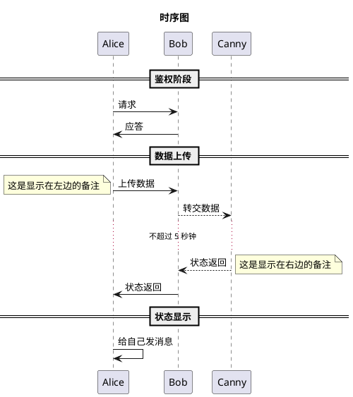

# UML

[TOC]

UML是一种开放的方法，用于说明、可视化、构建和编写一个正在开发的、面向对象的、软件密集系统的制品的开放方法

* 功能模型：从用户的角度展示系统的功能，包括用例图
* 对象模型：采用对象，属性，操作，关联等概念展示系统的结构和基础，包括类别图、对象图
* 动态模型：展现系统的内部行为。包括序列图，活动图，状态图

* 时序图:通过描述对象之间发送消息的时间顺序显示多个对象之间的动态协作。 ->表示消息传递，-->表示异步消息传递，note [left | right]对消息进行说明。


* 用例图:参与者与用例的交互。下图是饭店的用例图

; customer -> (pay for food); chef -> (cook food); } ）

* 活动图:当流程图来用，描述程序的处理过程。下图描述的是一个经典的程序员笑话。

 --> "buy 10 apples"; if "is there watermelon " then; -->[true] "buy a apple"; -right-> (_); else; ->[false] "Something else"; -->(_); endif; )

* 组件图:表示组件是如何互相组织以构建更大的组件或是软件系统。下图是Web项目的组件图。


* 状态图:描述一个对象在其生存期间的动态行为。


类图：用来描述类与类之间的关系

访问权限控制

```
class Dummy {
  - private field1
  # protected field2
  ~ package method1()
  + public method2()
}
```

类与类之间的关系

继承


实现


依赖:一个类A使用到了另一个类B，而这种使用关系是具有偶然性的、临时性的、非常弱的，表现在代码层面，_/ _*为类B作为参数被类A在某个method中使用__ 例如人和烟草的关系。


关联:强依赖关系，表现在代码层面，**为被关联类B以类属性的形式出现在关联类A中**


聚合：关联关系的一种特例，他体现的是整体与部分、拥有的关系，即has-a的关系，此时整体与部分之间是可分离的，他们可以具有各自的生命周期。


组合：关联关系的一种特例，他体现的是一种contains-a的关系，这种关系比聚合更强，也称为强聚合；他同样体现整体与部分间的关系，但此时整体与部分是不可分的，整体的生命周期结束也就意味着部分的生命周期结束。


## [Graphviz - Graph Visualization Software](http://www.graphviz.org/gallery/)

https://graphviz.gitlab.io/

* install and add  graphviz/bin to environment
* dot --help

```sh
# first.dot
digraph first2{
a;
b;
c;
d;
a->b;
b->d;
c->d;
}

dot -Tpng first.dot -o first.png # 用的是dot布局 -T表示格式，即画成png格式，-o表示output
```

* [使用graphviz绘制流程图](http://icodeit.org/2012/01/%E4%BD%BF%E7%94%A8graphviz%E7%BB%98%E5%88%B6%E6%B5%81%E7%A8%8B%E5%9B%BE/)

# PlantUML


## 文档

* [Drawing UML with PlantUML](http://plantuml.com/PlantUML_Language_Reference_Guide.pdf)
* [plantuml使用教程](http://archive.3zso.com/archives/plantuml-quickstart.html)

## 使用 Sublime + PlantUML 高效地画图

用文字表达出图的内容，然后就可以直接生成图片

### 安装

* sublime
* 安装 graphviz `brew install graphviz`
* 安装插件 sublime_diagram_plugin
* Alt + d 来生成 PlantUML 图片

### 不同类型语法

* 时序图 sequence diagram
    - 使用 title 来指定标题
    - '->' 和 '-->' 来指示线条的形式，用 -> , -->, `<-`, `<--` 来绘制参与者（Participants）之 间的消息（Message
    - 在每个时序后面加冒号 : 来添加注释 注释语句:以单引号开始头行，即是一个单行注释。多行注释可以使用"'"表 示注释内容的开始，然后使用"'"来表示注释内容的结束。
    - 使用 note 来显示备注，备注可以指定显示在左边或右边
    - 使用 == xxx == 来分隔时序图
    - 使用 ... 来表示延迟省略号
    - 节点可以给自己发送消息，方法是发送方和接收方使用同一个主体即可
* 用例图 use case diagram
    - 用例图是指由参与者（Actor）、用例（Use Case）以及它们之间的关系构成的用于描述系统功能的静态视图
    - 百度百科上有简易的入门资料，其中用例之间的关系 (include, extends) 是关键
    - 使用 actor 来定义参与者
    - 使用括号 (xxx) 来表示用例，用例用椭圆形表达
    - 使用不同的线条表达不同的关系。包括参与者与用例的关系，用例与用例的关系
* 流程图 activity diagram
    - 使用 start 来表示流程开始，使用 stop 来表示流程结束
    - 顺序流程使用冒号和分号 :xxx; 来表示
    - 条件语句使用 if ("condition 1") then (true/yes/false/no) 来表示
    - 条件语句可以嵌套
* 组件图
    - 使用方括号 [xxx] 来表示组件
    - 可以把几个组件合并成一个包，可以使用的关键字为 package, node, folder, frame, cloud, database。不同的关键字图形不一样。
    - 可以在包内部用不同的箭头表达同一个包的组件之间的关系
    - 可以在包内部直接表达到另外一个包内部的组件的交互关系
    - 可以在流程图外部直接表达包之间或包的组件之间的交互关系
* 状态图 state diagram
    - 使用 [*] 来表示状态的起点
    - 使用 state 来定义子状态图
    - 状态图可以嵌套
    - 使用 scale 命令来指定生成的图片的尺寸



## 工具

* [bpmn-io/bpmn-js](https://github.com/bpmn-io/bpmn-js):A BPMN 2.0 rendering toolkit and web modeler. https://bpmn.io/toolkit/bpmn-js/
* [knsv/mermaid](https://github.com/knsv/mermaid):Generation of diagram and flowchart from text in a similar manner as markdown http://knsv.github.io/mermaid/
* Draw.io
* 软件
  - ProcessOn
  - Umlet
  - ArgoUML
  - PlantUML
  - [staruml](https://sourceforge.net/projects/staruml/)
  - Lucidchart
  - [diagram](https://webdemo.myscript.com)
* [WebSequenceDiagrams](https://www.websequencediagrams.com/):Create sequence diagrams in seconds.

## 参考

* [入门UML](http://www.jianshu.com/p/1256e2643923)
* [图说设计模式](http://design-patterns.readthedocs.io/zh_CN/latest/index.html)
