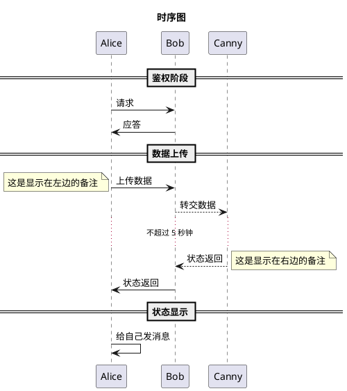

# PlantUML

## 文档

* [Drawing UML with PlantUML](http://plantuml.com/PlantUML_Language_Reference_Guide.pdf)
* [plantuml使用教程](http://archive.3zso.com/archives/plantuml-quickstart.html)

## 使用 Sublime + PlantUML 高效地画图

用文字表达出图的内容，然后就可以直接生成图片

### 安装

* sublime
* 安装 graphviz `brew install graphviz`
* 安装插件 sublime_diagram_plugin
* Alt + d 来生成 PlantUML 图片

### 不同类型语法
* 时序图 sequence diagram
    - 使用 title 来指定标题
    - '->' 和 '-->' 来指示线条的形式，用 -> , -->, `<-`, `<--` 来绘制参与者（Participants）之 间的消息（Message
    - 在每个时序后面加冒号 : 来添加注释 注释语句:以单引号开始头行，即是一个单行注释。多行注释可以使用"'"表 示注释内容的开始，然后使用"'"来表示注释内容的结束。
    - 使用 note 来显示备注，备注可以指定显示在左边或右边
    - 使用 == xxx == 来分隔时序图
    - 使用 ... 来表示延迟省略号
    - 节点可以给自己发送消息，方法是发送方和接收方使用同一个主体即可
* 用例图 use case diagram  
    - 用例图是指由参与者（Actor）、用例（Use Case）以及它们之间的关系构成的用于描述系统功能的静态视图
    - 百度百科上有简易的入门资料，其中用例之间的关系 (include, extends) 是关键
    - 使用 actor 来定义参与者
    - 使用括号 (xxx) 来表示用例，用例用椭圆形表达
    - 使用不同的线条表达不同的关系。包括参与者与用例的关系，用例与用例的关系
* 流程图 activity diagram 
    - 使用 start 来表示流程开始，使用 stop 来表示流程结束
    - 顺序流程使用冒号和分号 :xxx; 来表示
    - 条件语句使用 if ("condition 1") then (true/yes/false/no) 来表示
    - 条件语句可以嵌套
* 组件图
    - 使用方括号 [xxx] 来表示组件
    - 可以把几个组件合并成一个包，可以使用的关键字为 package, node, folder, frame, cloud, database。不同的关键字图形不一样。
    - 可以在包内部用不同的箭头表达同一个包的组件之间的关系
    - 可以在包内部直接表达到另外一个包内部的组件的交互关系
    - 可以在流程图外部直接表达包之间或包的组件之间的交互关系
* 状态图 state diagram
    - 使用 [*] 来表示状态的起点
    - 使用 state 来定义子状态图
    - 状态图可以嵌套
    - 使用 scale 命令来指定生成的图片的尺寸

