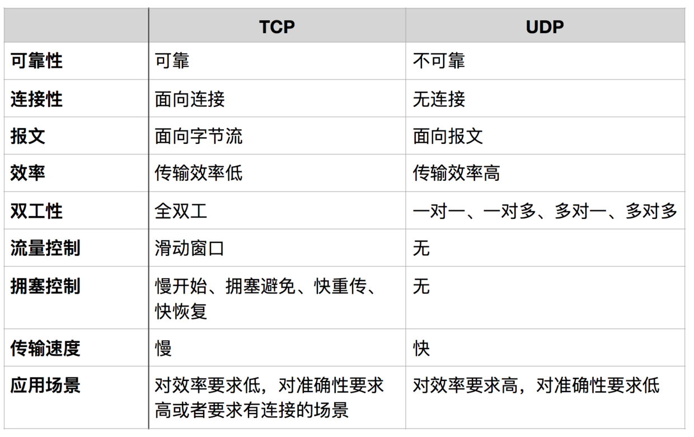

# HTTP

HTTP协议（HyperText Transfer Protocol，超文本传输协议）是因特网上应用最为广泛的一种基于 TCP/IP 通信协议来传递数据的网络传输应用层协议。

* TCP/IP协议是传输层协议，主要解决数据如何在网络中传输
* HTTP是应用层协议，主要解决如何包装数据。HTTP协议详细规定了浏览器与服务器之间相互通信的规则，是万维网交换信息的基础。
* 无状态的协议。针对其无状态特性，在实际应用中又需要有状态的形式，因此一般会通过session/cookie技术来解决此问题。无状态是指协议对于事务处理没有记忆能力。缺少状态意味着如果后续处理需要前面的信息，则它必须重传，这样可能导致每次连接传送的数据量增大。另一方面，在服务器不需要先前信息时它的应答就较快。
* HTTP 是媒体独立的：只要客户端和服务器知道如何处理的数据内容，任何类型的数据都可以通过 HTTP 发送。客户端以及服务器指定使用适合的 MIME-type 内容类型。 
* HTTP是基于请求-响应形式并且是短连接，客户端发送的每次请求都需要服务器回送响应，在请求结束后，会主动释放连接（无连接）
    * 从建立连接到关闭连接的过程称为"一次连接"。在HTTP 1.1中则可以在一次连接中处理多个请求，并且多个请求可以重叠进行，不需要等待一个请求结束后再发送下一个请求。 
    * 由于HTTP在每次请求结束后都会主动释放连接，因此HTTP连接是一种"短连接"，要保持客户端程序的在线状态，需要不断地向服务器发起连接请求。
    * 通常的做法是即时不需要获得任何数据，客户端也保持每隔一段固定的时间向服务器发送一次"保持连接"的请求，服务器在收到该请求后对客户端进行回复，表明知道客户端"在线"。
    * 若服务器长时间无法收到客户端的请求，则认为客户端"下线"，若客户端长时间无法收到服务器的回复，则认为网络已经断开。

# TCP/IP模型

TCP/IP协议模型（Transmission Control Protocol/Internet Protocol），包含了一系列构成互联网基础的网络协议，是Internet的核心协议。

```
HTTP/1.1 200 OK
    Content-Type: application/json;charset=UTF-8
    Cache-Control: no-store
    Pragma: no-cache
```

- 实现跨域
- 线程与进程区别
- session共享
- 403、304含义
- 不缓存cache-control设置

## OSI（Open Systems Interconnection Model）TCP/IP ，从上往下的，越底层越接近硬件，越往上越接近软件，是一个标准

- 应用层：HTTP,解决如何包装数据。各种应用软件，包括 Web 应用。
- 表示层：数据格式标识，基本压缩加密功能。
- 会话层：控制应用程序之间会话能力；如不同软件数据分发给不同软件。_软件_
- 传输层：端到端传输数据的基本功能；如 TCP、UDP。 数据被称作段（Segments）
- 网络层：定义IP编址，定义路由功能；如不同设备的数据转发。 数据被称做包（Packages）
- 数据链路层：定义数据的基本格式，如何传输，如何标识；如网卡MAC地址。责将0、1序列划分为数据帧从一个节点传输到临近的另一个节点,这些节点是通过MAC来唯一标识的(MAC,物理地址，一个主机会有一个MAC地址)。数据被称为帧（Frames） _操作系统_

  - 封装成帧: 把网络层数据报加头和尾，封装成帧,帧头中包括源MAC地址和目的MAC地址。
  - 透明传输:零比特填充、转义字符。
  - 可靠传输: 在出错率很低的链路上很少用，但是无线链路WLAN会保证可靠传输。
  - 差错检测(CRC):接收者检测错误,如果发现差错，丢弃该帧。

- 物理层：数据被称为比特流（Bits）负责0、1比特流与物理设备电压高低、光的闪灭之间的互换。 _物理设备_

计算机与网络传输：每层进行层层解包和附加自己所要传递的信息，术语叫做报头。

## TCP/IP（Transmission Control Protocol/Internet Protocol）一个实现的应用模型

TCP/IP协议通信的过程其实就对应着数据入栈与出栈的过程。入栈的过程，数据发送方每层不断地封装首部与尾部，添加一些传输的信息，确保能传输到目的地。出栈的过程，数据接收方每层不断地拆除首部与尾部，得到最终传输的数据。

- 应用层：应用层 表示层 会话层
- 传输层
- 互联网层：网络层
- 网络访问层：数据链路层 物理层

握手过程中传送的包里不包含数据，三次握手完毕后，客户端与服务器才正式开始传送数据。理想状态下，TCP连接一旦建立，在通信双方中的任何一方主动关闭连接之前，TCP 连接都将被一直保持下去。断开连接时服务器和客户端均可以主动发起断开TCP连接的请求，断开过程需要经过"四次握手"

### 建立连接

- 第一次握手：客户端发送syn包(syn=j)到服务器，并进入SYN_SEND状态，等待服务器确认；
- 第二次握手：服务器收到syn包，必须确认客户的SYN（ack=j+1），同时自己也发送一个SYN包（syn=k），即SYN+ACK包，此时服务器进入SYN_RECV状态；
- 第三次握手：客户端收到服务器的SYN＋ACK包，向服务器发送确认包ACK(ack=k+1)，此包发送完毕，客户端和服务器进入ESTABLISHED状态，完成三次握手。

我们在传输数据时，可以只使用（传输层）TCP/IP协议，但是那样的话，如果没有应用层，便无法识别数据内容，如果想要使传输的数据有意义，则必须使用到应用层协议，应用层协议有很多，比如HTTP、FTP、TELNET等，也可以自己定义应用层协议。WEB使用HTTP协议作应用层协议，以封装HTTP文本信息，然后使用TCP/IP做传输层协议将它发到网络上。

### 网络层

#### IP协议

IP协议是TCP/IP协议的核心，所有的TCP，UDP，IMCP，IGMP的数据都以IP数据格式传输。要注意的是，IP不是可靠的协议，这是说，IP协议没有提供一种数据未传达以后的处理机制，这被认为是上层协议：TCP或UDP要做的事情。

数据链路层中我们一般通过MAC地址来识别不同的节点，而在IP层我们也要有一个类似的地址标识，这就是IP地址。32位IP地址分为网络位和地址位，这样做可以减少路由器中路由表记录的数目，有了网络地址，就可以限定拥有相同网络地址的终端都在同一个范围内，那么路由表只需要维护一条这个网络地址的方向，就可以找到相应的这些终端了。

- A类IP地址: 0.0.0.0~127.0.0.0
- B类IP地址:128.0.0.1~191.255.0.0
- C类IP地址:192.168.0.0~239.255.255.0

IP协议头：八位的TTL字段。这个字段规定该数据包在穿过多少个路由之后才会被抛弃。某个IP数据包每穿过一个路由器，该数据包的TTL数值就会减少1，当该数据包的TTL成为零，它就会被自动抛弃。这个字段的最大值也就是255，也就是说一个协议包也就在路由器里面穿行255次就会被抛弃了，根据系统的不同，这个数字也不一样，一般是32或者是64。

#### ARP及RARP协议

ARP：是根据IP地址获取MAC地址的一种协议。ARP（地址解析）协议是一种解析协议，本来主机是完全不知道这个IP对应的是哪个主机的哪个接口，当主机要发送一个IP包的时候，会首先查一下自己的ARP高速缓存（就是一个IP-MAC地址对应表缓存）。如果查询的IP－MAC值对不存在，那么主机就向网络发送一个ARP协议广播包，这个广播包里面就有待查询的IP地址，而直接收到这份广播的包的所有主机都会查询自己的IP地址，如果收到广播包的某一个主机发现自己符合条件，那么就准备好一个包含自己的MAC地址的ARP包传送给发送ARP广播的主机。而广播主机拿到ARP包后会更新自己的ARP缓存（就是存放IP-MAC对应表的地方）。发送广播的主机就会用新的ARP缓存数据准备好数据链路层的的数据包发送工作。RARP协议的工作与此相反，不做赘述。

### 工具

- ping：是ICMP的最著名的应用，是TCP/IP协议的一部分。利用"ping"命令可以检查网络是否连通，可以很好地帮助我们分析和判定网络故障。原理是用类型码为0的ICMP发请 求，受到请求的主机则用类型码为8的ICMP回应。
- Traceroute是用来侦测主机到目的主机之间所经路由情况的重要工具。它收到到目的主机的IP后，首先给目的主机发送一个TTL=1的UDP数据包，而经过的第一个路由器收到这个数据包以后，就自动把TTL减1，而TTL变为0以后，路由器就把这个包给抛弃了，并同时产生 一个主机不可达的ICMP数据报给主机。主机收到这个数据报以后再发一个TTL=2的UDP数据报给目的主机，然后刺激第二个路由器给主机发ICMP数据 报。如此往复直到到达目的主机。这样，traceroute就拿到了所有的路由器IP。 -

### TCP与UDP区别

TCP/UDP都是是传输层协议，但是两者具有不同的特性，同时也具有不同的应用场景， 

- 面向报文：面向报文的传输方式是应用层交给UDP多长的报文，UDP就照样发送，即一次发送一个报文。因此，应用程序必须选择合适大小的报文。若报文太长，则IP层需要分片，降低效率。若太短，会是IP太小。
- 面向字节流的话，虽然应用程序和TCP的交互是一次一个数据块（大小不等），但TCP把应用程序看成是一连串的无结构的字节流。TCP有一个缓冲，当应用程序传送的数据块太长，TCP就可以把它划分短一些再传送。
- TCP：当对网络通讯质量有要求的时候，传输过程中都有一个ack，接收方通过ack告诉发送方收到那些包了。这样发送方能知道有没有丢包，进而确定重传.比如：整个数据要准确无误的传递给对方，这往往用于一些要求可靠的应用，比如HTTP、HTTPS、FTP等传输文件的协议，POP、SMTP等邮件传输的协议。 TELENT：远程终端接入
- UDP：当对网络通讯质量要求不高的时候，要求网络通讯速度能尽量的快，这时就可以使用UDP。DNS（域名转换）TFTP SNMP NFS（远程文件服务器）

### DNS

DNS（Domain Name System，域名系统），因特网上作为域名和IP地址相互映射的一个分布式数据库，能够使用户更方便的访问互联网，而不用去记住能够被机器直接读取的IP数串。通过主机名，最终得到该主机名对应的IP地址的过程叫做域名解析（或主机名解析）。DNS协议运行在UDP协议之上，使用端口号53。

### 状态码 Status Code

HTTP 状态码包含三个十进制数字，第一个数字是类别，后俩是编号

* 1XX 信息：服务器收到请求，需要请求者继续执行操作
    - 100 Continue：继续。客户端应继续其请求
    - 101 Switching Protocols：切换协议。服务器根据客户端的请求切换协议。只能切换到更高级的协议，例如，切换到 HTTP 的新版本协议
* 2XX 成功：操作被成功接收并处理
    - 200 OK：请求成功。一般用于 GET 与 POST 请求
    - 201 Created：已创建。成功请求并创建了新的资源
    - 202 Accepted：已接受。已经接受请求，但未处理完成
    - 203 Non-Authoritative Information：非授权信息。请求成功。但返回的 meta 信息不在原始的服务器，而是一个副本
    - 204 No Content：无内容。服务器成功处理，但未返回内容。在未更新网页的情况下，可确保浏览器继续显示当前文档
    - 205 Reset Content：重置内容。服务器处理成功，用户终端（例如：浏览器）应重置文档视图。可通过此返回码清除浏览器的表单域
    - 206 Partial Content：部分内容。服务器成功处理了部分GET请求
    - 3XX 重定向：需要进一步的操作以完成请求
* 300 Multiple Choices：多种选择。请求的资源可包括多个位置，相应可返回一个资源特征与地址的列表用于用户终端（例如：浏览器）选择
    - 301 Moved Permanently：永久移动。请求的资源已被永久的移动到新 URI，返回信息会包括新的 URI，浏览器会自动定向到新URI。今后任何新的请求都应使用新的URI代替
    - 302 Found：临时移动。与 301 类似。但资源只是临时被移动。客户端应继续使用原有 URI
    - 303 See Other：查看其它地址。与 301 类似。使用 GET 和 POST 请求查看
    - 304 Not Modified：未修改。所请求的资源未修改，服务器返回此状态码时，不会返回任何资源。客户端通常会缓存访问过的资源，通过提供一个头信息指出客户端希望只返回在指定日期之后修改的资源
    - 305 Use Proxy：使用代理。所请求的资源必须通过代理访问
    - 306 Unused：已经被废弃的HTTP状态码
    - 307 Temporary Redirect：临时重定向。与 302 类似。使用 GET 请求重定向
* 4XX 客户端错误：请求包含语法错误或无法完成请求
    - 400 Bad Request：客户端请求的语法错误，服务器无法理解
    - 401 Unauthorized：请求要求用户的身份认证
    - 402 Payment Required：保留，将来使用
    - 403 Forbidden：服务器理解请求客户端的请求，但是拒绝执行此请求
    - 404 Not Found：服务器无法根据客户端的请求找到资源（网页）。通过此代码，网站设计人员可设置”您所请求的资源无法找到”的个性页面
    - 405 Method Not Allowed：客户端请求中的方法被禁止
    - 406 Not Acceptable：服务器无法根据客户端请求的内容特性完成请求
    - 407 Proxy Authentication Required：请求要求代理的身份认证，与401类似，但请求者应当使用代理进行授权
    - 408 Request Time-out：服务器等待客户端发送的请求时间过长，超时
    - 409 Conflict：服务器完成客户端的PUT请求是可能返回此代码，服务器处理请求时发生了冲突
    - 410 Gone：客户端请求的资源已经不存在。410 不同于 404，如果资源以前有现在被永久删除了可使用 410 代码，网站设计人员可通过 301 代码指定资源的新位置
    - 411 Length Required：服务器无法处理客户端发送的不带 Content-Length 的请求信息
    - 412 Precondition Failed：客户端请求信息的先决条件错误
    - 413 Request Entity Too Large：由于请求的实体过大，服务器无法处理，因此拒绝请求。为防止客户端的连续请求，服务器可能会关闭连接。如果只是服务器暂时无法处理，则会包含一个 Retry-After 的响应信息
    - 414 Request-URI Too Large：请求的URI过长（URI通常为网址），服务器无法处理
    - 415 Unsupported Media Type：服务器无法处理请求附带的媒体格式
    - 416 Requested range not satisfiable：客户端请求的范围无效
    - 417 Expectation Failed
* 5XX 服务器端错误：服务器在处理请求的过程中发生了错误
    - 500 Internal Server Error：服务器内部错误，无法完成请求
    - 501 Not Implemented：服务器不支持请求的功能，无法完成请求
    - 502 Bad Gateway：充当网关或代理的服务器，从远端服务器接收到了一个无效的请求
    - 503 Service Unavailable：由于超载或系统维护，服务器暂时的无法处理客户端的请求。延时的长度可包含在服务器的Retry-After头信息中
    - 504 Gateway Time-out：充当网关或代理的服务器，未及时从远端服务器获取请求
    - 505 HTTP Version not supported：服务器不支持请求的HTTP协议的版本，无法完成处理

### HTTP Request Header

* Allow：服务器支持哪些请求方法（如GET、POST等）。
* Content-Encoding：
    - 文档的编码(Encode)方法。只有在解码之后才可以得到 Content-Type 头指定的内容类型
    - 利用gzip压缩文档能够显著地减少HTML文档的下载时间
* Content-Length：表示内容长度。只有当浏览器使用持久 HTTP 连接时才需要这个数据
* Content-Type：表示后面的文档属于什么 MIME 类型
* Date：当前的 GMT 时间
* Expires：应该在什么时候认为文档已经过期，从而不再缓存它.
* Last-Modified：文档的最后改动时间。客户可以通过 If-Modified-Since 请求头提供一个日期，该请求将被视为一个条件 GET，服务器端的资源没有变化,只有改动时间迟于指定时间的文档才会返回，否则返回一个 304(Not Modified) 状态
* Location：表示客户应当到哪里去提取文档
* Refresh：表示浏览器应该在多少时间之后刷新文档，以秒计
    - 注意：这种功能通常是通过设置 HTML 页面 HEAD 区的 ＜META HTTP-EQUIV=”Refresh” CONTENT=”5;URL=http://host/path"＞实现
    - 注意：Refresh 的意义是”N秒之后刷新本页面或访问指定页面”，而不是”每隔N秒刷新本页面或访问指定页面”。因此，连续刷新要求每次都发送一个Refresh头，而发送204状态代码则可以阻止浏览器继续刷新，不管是使用Refresh头还是＜META HTTP-EQUIV=”Refresh” …＞。
    - 注意 Refresh 头不属于 HTTP 1.1 正式规范的一部分，而是一个扩展
* Server：服务器名字
* Set-Cookie：设置和页面关联的 Cookie
* WWW-Authenticate：客户应该在 Authorization 头中提供什么类型的授权信息？在包含401(Unauthorized) 状态行的应答中这个头是必需的

### Content Type

用来向浏览器和服务器提供信息，表示该 URL 对应的资源类型

```
文件后缀    Content-Type(Mime-Type)
.css    text/css
.gif    image/gif
.htm    text/html
.html   text/html
.jpeg   image/jpeg
.jpg    image/jpeg
.js application/x-javascript
.ico    image/x-icon
.mp3    audio/mp3
.mp4    video/mpeg4
.mpeg   video/mpg
.mpg    video/mpg
.pdf    application/pdf
.png    image/png
.tif    image/tiff
.tiff   image/tiff
.torrent    application/x-bittorrent
.wav    audio/wav
.xhtml  text/html
```

### CORS

```
// server 
$origin = isset($_SERVER['HTTP_ORIGIN'])? $_SERVER['HTTP_ORIGIN'] : '';  
  
$allow_origin = array(  
    'http://client1.runoob.com',  
    'http://client2.runoob.com'  
);  
  
if(in_array($origin, $allow_origin)){  
    header('Access-Control-Allow-Origin:'.$origin);       
} 

允许所有域名访问则只需在http://server.runoob.com/server.php文件头部添加如下代码：
header('Access-Control-Allow-Origin:*'); 
```

## HTTTPS


## 参考

* [HTTP 下午茶](http://book.haoduoshipin.com/tealeaf-http/)
* [关于 TCP/IP，必知必会的十个问题](https://juejin.im/post/598ba1d06fb9a03c4d6464ab)
* [面试 -- 网络 HTTP](https://juejin.im/post/5872309261ff4b005c4580d4)
* [jakubroztocil/httpie](https://github.com/jakubroztocil/httpie)Modern command line HTTP client – user-friendly curl alternative with intuitive UI, JSON support, syntax highlighting, wget-like downloads, extensions, etc. <https://httpie.org> <https://twitter.com/clihttp>
* 图解HTTP
* HTTP权威指南：需要理解HTTP的本质复杂度，并且避免被作者引入的非本质复杂度的干扰。
