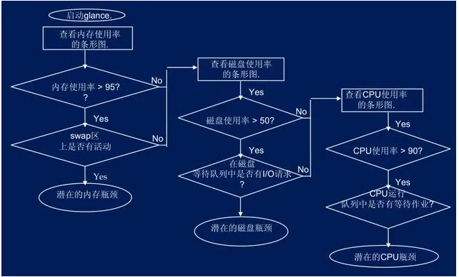

# Performance

* 性能不仅仅是一个技术问题：很重要，而且引入到工作流时，设计决策必须根据其性能影响来决定。
* 必须不断的测量、监视和改进性能，而且 Web 日益复杂的情况带来了新的挑战，使得性能指标难以被跟踪，因为性能指标将因设备、浏览器、协议、网络类型和延迟（CDN、运营商、缓存、代理、防火墙、负载平衡器和服务器都在其中发挥作用）而有很大差异。
* 对于业务系统性能诊断，从静态角度从以下三个方面进行分类
  - 操作系统和存储层面
  - 中间件层面（包括了数据库，应用服务器中间件）
  - 软件层面（包括了数据库SQL和存储过程，逻辑层，前端展现层等）
* 软件代码
  - 循环中初始化大的结构对象，数据库连接等
  - 资源不释放导致的内存泄露等
  - 没有基于场景需求来适度通过缓存等方式提升性能
  - 长周期事务处理耗费资源
  - 处理某一个业务场景或问题的时候，没有选择最优的数据结构或算法

## 定义

调优性需要找到程序中的Hotspot，也就是被调用最多的地方。只要你能优化一点点，你的性能就会有质的提高

* 指标
  - Throughput ，吞吐量。也就是每秒钟可以处理的请求数，任务数。
  - Latency， 系统延迟。也就是系统在处理一个请求或一个任务时的延迟。
* 关系
  - Throughput越大，Latency会越差。因为请求量过大，系统太繁忙，所以响应速度自然会低。
  - Latency越好，能支持的Throughput就会越高。因为Latency短说明处理速度快，于是就可以处理更多的请求。

## 测试

* 需要定义Latency这个值，比如说，对于网站系统响应时间必需是5秒以内（对于某些实时系统可能需要定义的更短，比如5ms以内，这个更根据不同的业务来定义）。Latency，如果吞吐量很少，这个值估计会非常稳定，当吞吐量越来越大时，系统的Latency会出现非常剧烈的抖动，所以，我们在测量Latency的时候，我们需要注意到Latency的分布，也就是说，有百分之几的在我们允许的范围，有百分之几的超出了，有百分之几的完全不可接受。也许，平均下来的Latency达标了，但是其中仅有50%的达到了我们可接受的范围。那也没有意义。
* 开发性能测试工具，一个工具用来制造高强度的Throughput，另一个工具用来测量Latency。对于第一个工具，你可以参考一下“十个免费的Web压力测试工具”，关于如何测量Latency，你可以在代码中测量，但是这样会影响程序的执行，而且只能测试到程序内部的Latency，真正的Latency是整个系统都算上，包括操作系统和网络的延时，你可以使用Wireshark来抓网络包来测量。这两个工具具体怎么做，这个还请大家自己思考去了。
* 开始性能测试。你需要不断地提升测试的Throughput，然后观察系统的负载情况，如果系统顶得住，那就观察Latency的值。这样，你就可以找到系统的最大负载，并且你可以知道系统的响应延时是多少。
* 定义一个时间段。比如：在某个吞吐量上持续15分钟。因为当负载到达的时候，系统会变得不稳定，当过了一两分钟后，系统才会稳定。另外，也有可能是，你的系统在这个负载下前几分钟还表现正常，然后就不稳定了，甚至垮了。所以，需要这么一段时间。这个值，我们叫做峰值极限。
* 需要做Soak Test，也就是在某个吞吐量下，系统可以持续跑一周甚至更长。这个值，我们叫做系统的正常运行的负载极限。

## 定位性能瓶颈

* 查看系统负载:通过了解操作系统的性能，才知道性能的问题，不需要调整程序的，只需要调整一下硬件或操作系统的配置就可以
  
  - Windows:perfmon
  - Linux下也有很多相关的命令和工具，比如：SystemTap，LatencyTOP，vmstat, sar, iostat, top, tcpdump等等
  - CPU利用率
    + CPU利用率不高，但是系统的Throughput和Latency上不去了，这说明程序并没有忙于计算，而是忙于别的一些事，比如IO
    + 内核态的和用户态的，内核态的一上去了，整个系统的性能就下来了。而对于多核CPU来说，CPU 0 是相当关键的，如果CPU 0的负载高，那么会影响其它核的性能，因为CPU各核间是需要有调度的，靠CPU0完成
  - IO大不大:IO和CPU一般是反着来的，CPU利用率高则IO不大，IO大则CPU就小。关于IO，要看三个事
    + 磁盘文件IO
    + 驱动程序的IO（如：网卡）
    + 内存换页率
  - 网络带宽使用情况，在Linux下，可以使用iftop, iptraf, ntop, tcpdump这些命令来查看。或是用Wireshark来查看
  - 如果CPU不高，IO不高，内存使用不高，网络带宽使用不高。但是系统的性能上不去。这说明程序有问题，比如程序被阻塞了。可能是因为等那个锁，可能是因为等某个资源，或者是在切换上下文。

* 使用Profiler测试：看一下程序运行性能
  
  * Java的JProfiler/TPTP/CodePro Profiler，GNU的gprof，IBM的PurifyPlus，Intel的VTune，AMD的CodeAnalyst，还有Linux下的OProfile/perf，后面两个可以让你对你的代码优化到CPU的微指令级别，如果你关心CPU的L1/L2的缓存调优，那么你需要考虑一下使用VTune。让你程序中各个模块函数甚至指令的很多东西，如：运行的时间 ，调用的次数，CPU的利用率，等等
  * 重点观察运行时间最多，调用次数最多的那些函数和指令。这里注意一下，对于调用次数多但是时间很短的函数，你可能只需要轻微优化一下，你的性能就上去了
  * 因为Profiler会让你的程序运行的性能变低，像PurifyPlus这样的工具会在你的代码中插入很多代码，会导致你的程序运行效率变低，从而没发测试出在高吞吐量下的系统的性能
    - 在你的代码中自己做统计，使用微秒级的计时器和函数调用计算器，每隔10秒把统计log到文件中。
    - 分段注释你的代码块，让一些函数空转，做Hard Code的Mock，然后再测试一下系统的Throughput和Latency是否有质的变化，如果有，那么被注释的函数就是性能瓶颈，再在这个函数体内注释代码，直到找到最耗性能的语句。

* 对于性能测试，不同的Throughput会出现不同的测试结果，不同的测试数据也会有不同的测试结果。所以，用于性能测试的数据非常重要，性能测试中，需要观测试不同Throughput的结果

## 潜在的场景

* 业务出现大并发的访问，导致出现性能瓶颈
* 上线后的系统数据库数据日积月累，数据量增加后出现性能瓶颈
* 其它关键环境改变，比如常说的网络带宽影响
* iostat,ps,sar,top,vmstat

## 硬件环境

* 常说的计算，存储和网络资源
* 对于服务器的计算能力，一般来说厂家都会提供TPMC参数作为一个参考数据，实际看到相同TPMC能力下的X86服务器能力仍然低于小型机的能力
* 存储设备，影响到存储的重点又是IO读写性能问题。有时候监控发现CPU和内存居高不下，而真正的瓶颈通过分析反而发现是由于IO瓶颈导致，由于读写性能跟不上，导致大量数据无法快速持久化并释放内存资源



## 运行环境

* 拿Oracle数据库来说，影响数据库性能的因素包括：系统、数据库、网络。数据库的优化包括：优化数据库磁盘I/O、优化回滚段、优化Rrdo日志、优化系统全局区、优化数据库对象。
* 数据库性能优化应该是一个持续性的工作，一个方面是本身的性能和参数巡检，另外一个方面就是DBA也会经常提取最占用内存的低效SQL语句给开发人员进一步分析，同时也会从数据库本身的以下告警KPI指标中发现问题。
* 应用中间件容器即我们常说的Weblogic, Tomcat等应用中间件容器或Web容器。应用中间件调优一个方面是本身的配置参数优化设置，一个方面就是JVM内存启动参数调优。
  - 应用中间件本身的参数设置，主要包括了JVM启动参数设置，线程池设置，连接数的最小最大值设置等。如果是集群环境，还涉及到集群相关的配置调优
  - 对于JVM启动参数调优，往往也是应用中间件调优的一个关键点，但是一般JVM参数调优会结合应用程序一起进行分析
    + -Xmx设置最大堆空间
    + -Xms设置最小堆空间
    + -XX:MaxNewSize设置最大新生代空间
    + -XX:NewSize设置最小新生代空间
    + -XX:MaxPermSize设置最大永久代空间(注：新内存模型已经替换为Metaspace)
    + -XX:PermSize设置最小永久代空间(注：新内存模型已经替换为Metaspace)
    + -Xss设置每个线程的堆栈大小

## 软件程序性能问题分析

## 常见瓶颈与解决

* 用空间换时间。各种cache如CPU L1/L2/RAM到硬盘，都是用空间来换时间的策略。这样策略基本上是把计算的过程一步一步的保存或缓存下来，这样就不用每次用的时候都要再计算一遍，比如数据缓冲，CDN，等。这样的策略还表现为冗余数据，比如数据镜象，负载均衡什么的。

* 用时间换空间。有时候，少量的空间可能性能会更好，比如网络传输，如果有一些压缩数据的算法（如前些天说的“Huffman 编码压缩算法” 和 “rsync 的核心算法”），这样的算法其实很耗时，但是因为瓶颈在网络传输，所以用时间来换空间反而能省时间。

* 简化代码。最高效的程序就是不执行任何代码的程序，所以，代码越少性能就越高。关于代码级优化的技术大学里的教科书有很多示例了。如：减少循环的层数，减少递归，在循环中少声明变量，少做分配和释放内存的操作，尽量把循环体内的表达式抽到循环外，条件表达的中的多个条件判断的次序，尽量在程序启动时把一些东西准备好，注意函数调用的开销（栈上开销），注意面向对象语言中临时对象的开销，小心使用异常（不要用异常来检查一些可接受可忽略并经常发生的错误），…… 等等，等等，这连东西需要我们非常了解编程语言和常用的库。

* 并行处理。如果CPU只有一个核，你要玩多进程，多线程，对于计算密集型的软件会反而更慢（因为操作系统调度和切换开销很大），CPU的核多了才能真正体现出多进程多线程的优势。并行处理需要我们的程序有Scalability，不能水平或垂直扩展的程序无法进行并行处理。从架构上来说，这表再为——是否可以做到不改代码只是加加机器就可以完成性能提升？

* 算法调优
  
  - 过滤算法，系统需要对收到的请求做过滤，我们把可以被filter in/out的东西配置在了一个文件中，原有的过滤算法是遍历过滤配置，后来，我们找到了一种方法可以对这个过滤配置进行排序，这样就可以用二分折半的方法来过滤，系统性能增加了50%。
  - 哈希算法。计算哈希算法的函数并不高效，一方面是计算太费时，另一方面是碰撞太高，碰撞高了就跟单向链表一个性能（可参看Hash Collision DoS 问题）。我们知道，算法都是和需要处理的数据很有关系的，就算是被大家所嘲笑的“冒泡排序”在某些情况下（大多数数据是排好序的）其效率会高于所有的排序算法。哈希算法也一样，广为人知的哈希算法都是用英文字典做测试，但是我们的业务在数据有其特殊性，所以，对于还需要根据自己的数据来挑选适合的哈希算法。对于我以前的一个项目，公司内某牛人给我发来了一个哈希算法，结果让我们的系统性能上升了150%。（关于各种哈希算法，你一定要看看StackExchange上的这篇关于各种hash算法的文章 ）
  - 分而治之和预处理。以前有一个程序为了生成月报表，每次都需要计算很长的时间，有时候需要花将近一整天的时间。于是我们把我们找到了一种方法可以把这个算法发成增量式的，也就是说我每天都把当天的数据计算好了后和前一天的报表合并，这样可以大大的节省计算时间，每天的数据计算量只需要20分钟，但是如果我要算整个月的，系统则需要10个小时以上（SQL语句在大数据量面前性能成级数性下降）。这种分而治之的思路在大数据面前对性能有很帮助，就像merge排序一样。SQL语句和数据库的性能优化也是这一策略，如：使用嵌套式的Select而不是笛卡尔积的Select，使用视图，等等。

* 代码调优
  
  - 字符串操作。这是最费系统性能的事了，无论是strcpy, strcat还是strlen，最需要注意的是字符串子串匹配。所以，能用整型最好用整型。举几个例子，第一个例子是N年前做银行的时候，我的同事喜欢把日期存成字符串（如：2012-05-29 08:30:02），我勒个去，一个select  where between语句相当耗时。另一个例子是，我以前有个同事把一些状态码用字符串来处理，他的理由是，这样可以在界面上直接显示，后来性能调优的时候，我把这些状态码全改成整型，然后用位操作查状态，因为有一个每秒钟被调用了150K次的函数里面有三处需要检查状态，经过改善以后，整个系统的性能上升了30%左右。还有一个例子是，我以前从事的某个产品编程规范中有一条是要在每个函数中把函数名定义出来，如：const char fname[]=”functionName()”, 这是为了好打日志，但是为什么不声明成 static类型的呢？
  - 多线程调优。有人说，thread is evil，这个对于系统性能在某些时候是个问题。因为多线程瓶颈就在于互斥和同步的锁上，以及线程上下文切换的成本，怎么样的少用锁或不用锁是根本（比如：多版本并发控制(MVCC)在分布式系统中的应用 中说的乐观锁可以解决性能问题），此外，还有读写锁也可以解决大多数是读操作的并发的性能问题。这里多说一点在C++中，我们可能会使用线程安全的智能指针AutoPtr或是别的一些容器，只要是线程安全的，其不管三七二十一都要上锁，上锁是个成本很高的操作，使用AutoPtr会让我们的系统性能下降得很快，如果你可以保证不会有线程并发问题，那么你应该不要用AutoPtr。我记得我上次我们同事去掉智能指针的引用计数，让系统性能提升了50%以上。对于Java对象的引用计数，如果我猜的没错的话，到处都是锁，所以，Java的性能问题一直是个问题。另外，线程不是越多越好，线程间的调度和上下文切换也是很夸张的事，尽可能的在一个线程里干，尽可能的不要同步线程。这会让你有很多的性能。
  - 内存分配。不要小看程序的内存分配。malloc/realloc/calloc这样的系统调非常耗时，尤其是当内存出现碎片的时候。我以前的公司出过这样一个问题——在用户的站点上，我们的程序有一天不响应了，用GDB跟进去一看，系统hang在了malloc操作上，20秒都没有返回，重启一些系统就好了。这就是内存碎片的问题。这就是为什么很多人抱怨STL有严重的内存碎片的问题，因为太多的小内存的分配释放了。有很多人会以为用内存池可以解决这个问题，但是实际上他们只是重新发明了Runtime-C或操作系统的内存管理机制，完全于事无补。当然解决内存碎片的问题还是通过内存池，具体来说是一系列不同尺寸的内存池（这个留给大家自己去思考）。当然，少进行动态内存分配是最好的。说到内存池就需要说一下池化技术。比如线程池，连接池等。池化技术对于一些短作业来说（如http服务） 相当相当的有效。这项技术可以减少链接建立，线程创建的开销，从而提高性能。
  - 异步操作。我们知道Unix下的文件操作是有block和non-block的方式的，像有些系统调用也是block式的，如：Socket下的select，Windows下的WaitforObject之类的，如果我们的程序是同步操作，那么会非常影响性能，我们可以改成异步的，但是改成异步的方式会让你的程序变复杂。异步方式一般要通过队列，要注间队列的性能问题，另外，异步下的状态通知通常是个问题，比如消息事件通知方式，有callback方式，等，这些方式同样可能会影响你的性能。但是通常来说，异步操作会让性能的吞吐率有很大提升（Throughput），但是会牺牲系统的响应时间（latency）。这需要业务上支持。
  - 语言和代码库。我们要熟悉语言以及所使用的函数库或类库的性能。比如：STL中的很多容器分配了内存后，那怕你删除元素，内存也不会回收，其会造成内存泄露的假像，并可能造成内存碎片问题。再如，STL某些容器的size()==0  和 empty()是不一样的，因为，size()是O(n)复杂度，empty()是O(1)的复杂度，这个要小心。Java中的JVM调优需要使用的这些参数：-Xms -Xmx -Xmn -XX:SurvivorRatio -XX:MaxTenuringThreshold，还需要注意JVM的GC，GC的霸气大家都知道，尤其是full GC（还整理内存碎片），他就像“恐龙特级克赛号”一样，他运行的时候，整个世界的时间都停止了。

* 网络调优:[TCP/IP详解 卷1：协议](https://book.douban.com/subject/1088054/)
  
  - 最大传输单元（其实这对TCP也一样，因为这是链路层上的东西）。所谓最大传输单元，你可以想像成是公路上的公交车，假设一个公交车可以最多坐70人，带宽就像是公路的车道数一样，如果一条路上最多可以容下100辆公交车，那意味着我最多可以运送7000人，但是如果公交车坐不满，比如平均每辆车只有20人，那么我只运送了2000人，于是我公路资源（带宽资源）就被浪费了。 所以，我们对于一个UDP的包，我们要尽量地让他大到MTU的最大尺寸再往网络上传，这样可以最大化带宽利用率。对于这个MTU，以太网是1500字节，光纤是4352字节，802.11无线网是7981。但是，当我们用TCP/UDP发包的时候，我们的有效负载Payload要低于这个值，因为IP协议会加上20个字节，UDP会加上8个字节（TCP加的更多），所以，一般来说，你的一个UDP包的最大应该是1500-8-20=1472，这是你的数据的大小。当然，如果你用光纤的话， 这个值就可以更大一些。
  - TCP调优:TCP链接是有很多开销的，一个是会占用文件描述符，另一个是会开缓存，一般来说一个系统可以支持的TCP链接数是有限的，我们需要清楚地认识到TCP链接对系统的开销是很大的。正是因为TCP是耗资源的，所以，很多攻击都是让你系统上出现大量的TCP链接，把你的系统资源耗尽。
    + 注意配置KeepAlive参数，这个参数的意思是定义一个时间，如果链接上没有数据传输，系统会在这个时间发一个包，如果没有收到回应，那么TCP就认为链接断了，然后就会把链接关闭，这样可以回收系统资源开销.
    + TCP的TIME_WAIT这个状态，主动关闭的一方进入TIME_WAIT状态，TIME_WAIT状态将持续2个MSL(Max Segment Lifetime)，默认为4分钟，TIME_WAIT状态下的资源不能回收。有大量的TIME_WAIT链接的情况一般是在HTTP服务器上。对此，有两个参数需要注意
    + RWIN（TCP Receive Window Size），这个东西的意思是，我一个TCP链接在没有向Sender发出ack时可以接收到的最大的数据包。为什么这个很重要？因为如果Sender没有收到Receiver发过来ack，Sender就会停止发送数据并会等一段时间，如果超时，那么就会重传。这就是为什么TCP链接是可靠链接的原因。重传还不是最严重的，如果有丢包发生的话，TCP的带宽使用率会马上受到影响（会盲目减半），再丢包，再减半，然后如果不丢包了，就逐步恢复。
      * 理论上的RWIN应该设置成：吞吐量  * 回路时间。Sender端的buffer应该和RWIN有一样的大小，因为Sender端发送完数据后要等Receiver端确认，如果网络延时很大，buffer过小了，确认的次数就会多，于是性能就不高，对网络的利用率也就不高了。也就是说，对于延迟大的网络，我们需要大的buffer，这样可以少一点ack，多一些数据，对于响应快一点的网络，可以少一些buffer。因为，如果有丢包（没有收到ack），buffer过大可能会有问题，因为这会让TCP重传所有的数据，反而影响网络性能。（当然，网络差的情况下，就别玩什么高性能了） 所以，高性能的网络重要的是要让网络丢包率非常非常地小（基本上是用在LAN里），如果网络基本是可信的，这样用大一点的buffer会有更好的网络传输性能（
  - UDP调优
    + UDP还有一个最大的好处是multi-cast多播，这个技术对于你需要在内网里通知多台结点时非常方便和高效。

* 网卡调优：用ifconfig查看网上的统计信息，如果我们看到overrun上有数据，我们就可能需要调整一下txqueuelen的尺寸（一般默认为1000），我们可以调大一些，如：ifconfig eth0 txqueuelen 5000。Linux下还有一个命令叫：ethtool可以用于设置网卡的缓冲区大小。在Windows下，我们可以在网卡适配器中的高级选项卡中调整相关的参数（如：Receive Buffers, Transmit Buffer等，不同的网卡有不同的参数）。把Buffer调大对于需要大数据量的网络传输非常有效。

* 其它网络性能
  
  - 多路复用技术，也就是用一个线程来管理所有的TCP链接，有三个系统调用要重点注意：
    - 一个是select，这个系统调用只支持上限1024个链接，
    - 第二个是poll，其可以突破1024的限制，
    - 但是select和poll本质上是使用的轮询机制，轮询机制在链接多的时候性能很差，因主是O(n)的算法，所以，epoll出现了
    - epoll是操作系统内核支持的，仅当在链接活跃时，操作系统才会callback，这是由操作系统通知触发的，但其只有Linux Kernel 2.6以后才支持（准确说是2.5.44中引入的），当然，如果所有的链接都是活跃的，过多的使用epoll_ctl可能会比轮询的方式还影响性能，不过影响的不大。
    - DNS Lookup的系统调用要小心，比如：gethostbyaddr/gethostbyname，这个函数可能会相当的费时，因为其要到网络上去找域名，因为DNS的递归查询，会导致严重超时，而又不能通过设置什么参数来设置time out，对此你可以通过配置hosts文件来加快速度，或是自己在内存中管理对应表，在程序启动时查好，而不要在运行时每次都查。另外，在多线程下面，gethostbyname会一个更严重的问题，就是如果有一个线程的gethostbyname发生阻塞，其它线程都会在gethostbyname处发生阻塞，这个比较变态，要小心。

* 系统调优
  
  - I/O模型：真正提高I/O性能方式是把和外设的I/O的次数降到最低，最好没有，所以，对于读来说，内存cache通常可以从质上提升性能，因为内存比外设快太多了。对于写来说，cache住要写的数据，少写几次，但是cache带来的问题就是实时性的问题，也就是latency会变大，我们需要在写的次数上和相应上做权衡。
    + Linux
      * 第一种，同步阻塞式I/O，这个不说了。
      * 第二种，同步无阻塞方式。其通过fctnl设置 O_NONBLOCK 来完成。
      * 对于select/poll/epoll这三个是I/O不阻塞，但是在事件上阻塞，算是：I/O异步，事件同步的调用。
      * AIO方式。这种I/O 模型是一种处理与 I/O 并行的模型。I/O请求会立即返回，说明请求已经成功发起了。在后台完成I/O操作时，向应用程序发起通知，通知有两种方式：一种是产生一个信号，另一种是执行一个基于线程的回调函数来完成这次 I/O 处理过程。
      * 第四种因为没有任何的阻塞，无论是I/O上，还是事件通知上，所以，其可以让你充分地利用CPU，比起第二种同步无阻塞好处就是，第二种要你一遍一遍地去轮询。Nginx之所所以高效，是其使用了epoll和AIO的方式来进行I/O的。
    + Windows
      * 一个是WriteFile系统调用，这个系统调用可以是同步阻塞的，也可以是同步无阻塞的，关于看文件是不是以Overlapped打开的。关于同步无阻塞，需要设置其最后一个参数Overlapped，微软叫Overlapped I/O，你需要WaitForSingleObject才能知道有没有写完成。这个系统调用的性能可想而知。
      * 另一个叫WriteFileEx的系统调用，其可以实现异步I/O，并可以让你传入一个callback函数，等I/O结束后回调之， 但是这个回调的过程Windows是把callback函数放到了APC（Asynchronous Procedure Calls）的队列中，然后，只用当应用程序当前线程成为可被通知状态（Alterable）时，才会被回调。只有当你的线程使用了这几个函数时WaitForSingleObjectEx, WaitForMultipleObjectsEx, MsgWaitForMultipleObjectsEx, SignalObjectAndWait 和 SleepEx，线程才会成为Alterable状态。可见，这个模型，还是有wait，所以性能也不高。
      * 然后是IOCP – IO Completion Port，IOCP会把I/O的结果放在一个队列中，但是，侦听这个队列的不是主线程，而是专门来干这个事的一个或多个线程去干（老的平台要你自己创建线程，新的平台是你可以创建一个线程池）。IOCP是一个线程池模型。这个和Linux下的AIO模型比较相似，但是实现方式和使用方式完全不一样。
  - 多核CPU调优：如果0号CPU被用得过狠的话，别的CPU性能也会下降，因为CPU0是有调整功能的，所以，我们不能任由操作系统负载均衡，因为我们自己更了解自己的程序，所以，我们可以手动地为其分配CPU核，而不会过多地占用CPU0，或是让我们关键进程和一堆别的进程挤在一起。
    + 对于Windows来说，我们可以通过“任务管理器”中的“进程”而中右键菜单中的“设置相关性……”（Set Affinity…）来设置并限制这个进程能被运行在哪些核上。
    + 对于Linux来说，可以使用taskset命令来设置（你可以通过安装schedutils来安装这个命令：apt-get install schedutils）
    + 多核CPU还有一个技术叫NUMA技术（Non-Uniform Memory Access）。传统的多核运算是使用SMP(Symmetric Multi-Processor )模式，多个处理器共享一个集中的存储器和I/O总线。于是就会出现一致存储器访问的问题，一致性通常意味着性能问题。NUMA模式下，处理器被划分成多个node， 每个node有自己的本地存储器空间。对NUMA调优的命令是：numactl
  - 文件系统调优:因为文件系统也是有cache的，所以，为了让文件系统有最大的性能。首要的事情就是分配足够大的内存，这个非常关键，在Linux下可以使用free命令来查看 free/used/buffers/cached，理想来说，buffers和cached应该有40%左右。然后是一个快速的硬盘控制器，SCSI会好很多。最快的是Intel SSD 固态硬盘，速度超快，但是写次数有限。
    + Linux的Ext3/4来说，几乎在所有情况下都有所帮助的一个参数是关闭文件系统访问时间，在/etc/fstab下看看你的文件系统 有没有noatime参数（一般来说应该有），还有一个是dealloc，它可以让系统在最后时刻决定写入文件发生时使用哪个块，可优化这个写入程序。还要注间一下三种日志模式：data=journal、data=ordered和data=writeback。默认设置data=ordered提供性能和防护之间的最佳平衡。
    + iotop，可以让你看到各进程的磁盘读写的负载情况。
  - 数据库调优
    + 数据库引擎调优
      * 数据库的锁的方式。这个非常非常地重要。并发情况下，锁是非常非常影响性能的。各种隔离级别，行锁，表锁，页锁，读写锁，事务锁，以及各种写优先还是读优先机制。性能最高的是不要锁，所以，分库分表，冗余数据，减少一致性事务处理，可以有效地提高性能。NoSQL就是牺牲了一致性和事务处理，并冗余数据，从而达到了分布式和高性能。
      * 数据库的存储机制。不但要搞清楚各种类型字段是怎么存储的，更重要的是数据库的数据存储方式，是怎么分区的，是怎么管理的，比如Oracle的数据文件，表空间，段，等等。了解清楚这个机制可以减轻很多的I/O负载。比如：MySQL下使用show engines;可以看到各种存储引擎的支持。不同的存储引擎有不同的侧重点，针对不同的业务或数据库设计会让你有不同的性能。
      * 数据库的分布式策略。最简单的就是复制或镜像，需要了解分布式的一致性算法，或是主主同步，主从同步。通过了解这种技术的机理可以做到数据库级别的水平扩展。
    + SQL语句优化:MySQL SQL Query Analyzer，Oracle SQL Performance Analyzer，或是微软SQL Query Analyzer.可以使用explain来看看SQL语句最终Execution Plan会是什么样的。
      * 全表检索。比如：select * from user where lastname = “xxxx”，这样的SQL语句基本上是全表查找，线性复杂度O(n)，记录数越多，性能也越差（如：100条记录的查找要50ms，一百万条记录需要5分钟）。对于这种情况，我们可以有两种方法提高性能：一种方法是分表，把记录数降下来，另一种方法是建索引（为lastname建索引）。索引就像是key-value的数据结构一样，key就是where后面的字段，value就是物理行号，对索引的搜索复杂度是基本上是O(log(n)) ——用B-Tree实现索引（如：100条记录的查找要50ms，一百万条记录需要100ms）。
      * 索引。对于索引字段，最好不要在字段上做计算、类型转换、函数、空值判断、字段连接操作，这些操作都会破坏索引原本的性能。当然，索引一般都出现在Where或是Order by字句中，所以对Where和Order by子句中的子段最好不要进行计算操作，或是加上什么NOT之类的，或是使用什么函数。
      * 多表查询。关系型数据库最多的操作就是多表查询，多表查询主要有三个关键字，EXISTS，IN和JOIN（关于各种join，可以参看图解SQL的Join一文）。基本来说，现代的数据引擎对SQL语句优化得都挺好的，JOIN和IN/EXISTS在结果上有些不同，但性能基本上都差不多。有人说，EXISTS的性能要好于IN，IN的性能要好于JOIN，我各人觉得，这个还要看你的数据、schema和SQL语句的复杂度，对于一般的简单的情况来说，都差不多，所以千万不要使用过多的嵌套，千万不要让你的SQL太复杂，宁可使用几个简单的SQL也不要使用一个巨大无比的嵌套N级的SQL。还有人说，如果两个表的数据量差不多，Exists的性能可能会高于In，In可能会高于Join，如果这两个表一大一小，那么子查询中，Exists用大表，In则用小表。这个，我没有验证过，放在这里让大家讨论吧。另，有一篇关于SQL Server的文章大家可以看看《IN vs JOIN vs EXISTS》
      * JOIN操作。有人说，Join表的顺序会影响性能，只要Join的结果集是一样，性能和join的次序无关。因为后台的数据库引擎会帮我们优化的。Join有三种实现算法，嵌套循环，排序归并，和Hash式的Join。（MySQL只支持第一种）
        * 嵌套循环，就好像是我们常见的多重嵌套循环。注意，前面的索引说过，数据库的索引查找算法用的是B-Tree，这是O(log(n))的算法，所以，整个算法复法度应该是O(log(n)) * O(log(m)) 这样的。
        * Hash式的Join，主要解决嵌套循环的O(log(n))的复杂，使用一个临时的hash表来标记。
        * 排序归并，意思是两个表按照查询字段排好序，然后再合并。当然，索引字段一般是排好序的。
        * 还是那句话，具体要看什么样的数据，什么样的SQL语句，你才知道用哪种方法是最好的。
      * 部分结果集。我们知道MySQL里的Limit关键字，Oracle里的rownum，SQL Server里的Top都是在限制前几条的返回结果。这给了我们数据库引擎很多可以调优的空间。一般来说，返回top n的记录数据需要我们使用order by，注意在这里我们需要为order by的字段建立索引。有了被建索引的order by后，会让我们的select语句的性能不会被记录数的所影响。使用这个技术，一般来说我们前台会以分页方式来显现数据，Mysql用的是OFFSET，SQL Server用的是FETCH NEXT，这种Fetch的方式其实并不好是线性复杂度，所以，如果我们能够知道order by字段的第二页的起始值，我们就可以在where语句里直接使用>=的表达式来select，这种技术叫seek，而不是fetch，seek的性能比fetch要高很多。
      * 字符串。正如我前面所说的，字符串操作对性能上有非常大的恶梦，所以，能用数据的情况就用数字，比如：时间，工号，等。
      * 全文检索。千万不要用Like之类的东西来做全文检索，如果要玩全文检索，可以尝试使用Sphinx。
      * 其它。
        - 不要select *，而是明确指出各个字段，如果有多个表，一定要在字段名前加上表名，不要让引擎去算。
        - 不要用Having，因为其要遍历所有的记录。性能差得不能再差。
        - 尽可能地使用UNION ALL  取代  UNION。
        - 索引过多，insert和delete就会越慢。而update如果update多数索引，也会慢，但是如果只update一个，则只会影响一个索引表。

* PHP中Getter和Setter的效率：性能要比直接读写成员变量要差一倍以上

* Python程序在函数内执行得更快：本地变量是存在一个数组中（直到），用一个整型常量去访问，而全局变量存在一个dictionary中，查询很慢。

* 为什么排好序的数据在遍历时会更快：

```sh
net.ipv4.tcp_keepalive_probes = 5
net.ipv4.tcp_keepalive_intvl = 20
net.ipv4.tcp_fin_timeout = 30

# 表示重用TIME_WAIT，后者表示回收TIME_WAIT的资源
net.ipv4.tcp_tw_reuse=1
net.ipv4.tcp_tw_recycle=1

net.core.wmem_default = 8388608
net.core.rmem_default = 8388608
net.core.rmem_max = 16777216
net.core.wmem_max = 16777216

# 指定命令“myprogram arg1 arg2”运行在node 0 上，其内存分配在node 0 和 1上
numactl --cpubind=0 --membind=0,1 myprogram arg1 arg2
# 上面这个命令并不好，因为内存跨越了两个node，这非常不好。最好的方式是只让程序访问和自己运行一样的node
numactl --membind 1 --cpunodebind 1 --localalloc myapplication
```

## 前端

* 准备：规划和指标
  - 建立性能文化：只要团队之间没有协作，高性能就无法长期维持。研究用户反馈中常见的抱怨，看看提高性能是否可以帮助缓解其中一些问题。用真实数据来建立适合自己的案例和模型。在设计过程中就开始规划加载顺序和权衡。
  - 选择正确的性能指标：并非每个指标都同等重要。研究最重要的度量标准：一般而言，它与您开始渲染最重要像素的速度以及提供输入响应的速度有关。根据客户的感受确定页面加载的优先级。可交互时间、页面大标题元素的渲染时间、首次有效绘制时间（FMP）、速度指数（Speed Index）一般都很重要。
  - 比你的竞争对手快至少 20%：收集代表您受众的设备上的数据。在数据来源上，真实设备比模拟数据更好。选择一台 Moto G4、中端三星设备或者 Nexus 5X 等性能良好的中端设备。或者，也可以通过在电脑上，通过设置网络限速（例如：150ms RTT，1.5Mbps 下载，0.7Mbps 上传）和 CPU 限速（5 倍慢速）以模拟移动体验。最后在常规 3G、4G 和 Wi-Fi 之间切换。收集数据、设置电子表格、将指标提高 20% 并设置目标（即“性能预算”）。
  - 把这张检查表分享给你的同事：确保团队中的每个成员都熟悉该清单。每一个决策都涉及性能问题，前端开发人员的积极参与将使您的项目受益匪浅。将你的性能预算映射到设计决策上。
* 制定现实的目标
  - 100 毫秒的响应时间 + 每秒60帧:每帧动画应在少于 16 毫秒（理想情况下为 10 毫秒）内完成，从而达到每秒 60 帧（1 秒 ÷ 60 = 16.6毫秒）。保持乐观，明智地利用空闲时间。对于像动画这样的高压点，只要能，就不要做任何其它事情。预计输入延迟时间（Estimated Input Latency）应低于 50 毫秒。
  - 速度指数（SpeedIndex）小于 1250，可交互时间（Time-To-Interactive）在 3G 上小于 5 秒：目标是在 1 秒内（在高速网络下）完成首次绘制（FMP），速度指数（SpeedIndex）低于 1250 毫秒。考虑速度基线是一台有着 3G 网络的，价格为 200 美元左右的 Android 手机（译注：国产千元机水平），那么可以以 400 毫秒 RTT 和 400kb/s 的传输速度进行网络模拟，以达成可交互时间（Time-To-Interactive）小于 5 秒，第二次打开的速度低于 2 秒。尽你所能地降低这些指标。
  - 核心块 = 15kb，关键文件 < 170 kb：HTML 的前 14~15kb 是最关键的核心块（chunk），也是整个文件中唯一可以在第一个 RTT 内被下载的部分。要实现上述目标，请设定关键文件的最大尺寸“预算”。170kb gzip 后的文件（原始文件尺寸 0.8~1mb），在普通手机上可能需要 1 秒才能解析和编译完成。
* 定义环境
  - 选择并设置你的构建工具：不要太注意所谓的“酷”。只要您能够快速获得结果，而且在维护构建过程上没有问题就很好了。
  - 渐进增强：首先设计和构建核心功能，然后再在此基础上为功能强大的浏览器的高级功能增强效果，从而创建弹性的体验。如果您的网站在性能差、网络差的机器上还能运行得比较快，那在性能好、网络棒的机器上只会运行得更快。
  - 设定硬性的性能基准：用 JavaScript 实现交互效果的成本相当高昂。170kb 的尺寸预算已经包含了核心的 HTML / CSS / JavaScript、路由、状态管理、工具函数、框架还有产品逻辑，因此，请彻底检查我们选择的框架的网络传输成本、解析 / 编译时间和其运行时的时间成本。
  - 圣战止于智者：Angular, React 还是 Ember：并不是每个项目都需要框架。但是如果你的项目需要框架，那么最好选择使用一个支持服务器端渲染（SSR）的框架。在使用框架之前，请确保在移动设备上以服务器端渲染和客户端渲染两种模式来评估框架的启动时间。了解您将依赖的框架的具体细节。了解 PRPL 模式和 App Shell 模型。
  - 你会使用 AMP 或者 Instant Articles 吗：（译注：AMP 为 Google 的开源项目，意在以组件化的形式以提升移动设备对网站的访问速度；Instant Articles 是 Facebook 的协议，意在通过渲染页面的精简版本以提升页面在 Facebook App 内的打开速度。在国内，MIP 是和 AMP 类似的解决方案。）没有它们，你也可以获得良好的性能。但是 AMP 提供了一个可靠的性能框架，有免费的 CDN ，而 Instant Articles 将提高你在 Facebook 上的知名度和性能。你也可以构建一个渐进式 AMP（译注：Progressive Web AMP，PWA 和 AMP 的结合体）。
  - 选择合适的 CDN：您可以将部分内容“外包”给静态站点生成器，然后将其推送到 CDN，并从CDN 提供静态版本，从而避免数据库请求（即 JAMStack）。当然，这取决于您拥有的动态数据量。仔细检查 CDN 是否为您执行了内容压缩和转换、智能 HTTP/2 和边缘端包含（ESI, edge-side includes）。
* 优化构建
  - 合理安排优先级：把你所有的静态资源（JavaScript，图片，字体，第三方脚本，尺寸大的模块）列成一个表，然后把它们按优先级分成三组：基本核心功能（老浏览器也能浏览的核心内容）、增强体验效果（为现代浏览器设计的强大功能和丰富体验）、附加功能（不一定需要并且可以惰性加载的资源，比如字体、轮播脚本、视频播放器、分享按钮等）。
  - 使用“符合标准”技术：译注：“符合标准”技术（cutting-the-mustard technique）是 BBC News 开发者博客提出的，一种基于浏览器特性来检测其支持程度，并以此选择要加载哪些功能的技术。）对老旧的浏览器，仅输出核心功能代码；对现代浏览器输出增强的功能代码。严格按标准加载静态资源：直接加载核心代码，在 DOMContentLoaded 事件中加载增强代码，并在 load 事件中加载剩下的代码。注意：廉价的 Android 手机虽然很符合标准，但这些手机的内存和 CPU 性能有限。因此，您可能需要使用读取设备内存大小的 JavaScript API 来检测设备性能，只有不支持的时候才按“符合标准”技术来。
  - 减少 JavaScript 体积：由于解析 JavaScript 很耗时，所以请尽可能的减少 JavaScript 的体积。在构建 SPA 时，您可能需要用一定时间初始化应用程序之后，才能开始渲染页面。寻找可以加快初始渲染事件的模块和技术（在低端移动设备上，这可以轻松将速度提高 2-5 倍）。彻底检查每一个 JavaScript 依赖，以找出谁在消耗初始化的宝贵时间。
  - 使用微优化和渐进式启动：使用服务器端渲染来获得快速的首次有效绘制时间（FMP），但也在页面里输出一些最小功能的 JavaScript 来保持交互时间（TTI）接近首次有效绘制时间（FMP）。然后，如果有需要或者有多余的时间，才开始启动应用程序的非必要部分。在加载时显示一个骨架屏幕，而不是“加载中”动画。
  - 使用摇树和代码分割：使用摇树（Tree Shaking）技术和代码分割（Code Splitting）技术以减少代码体积。摇树（Tree Shaking）技术是一种通过丢弃未使用的代码以在构建过程清理代码的方法。代码分割（Code Splitting）技术将您的代码拆分为按需加载的“chunks（块）”。作用域提升（Scope Hoisting）技术使得链式的依赖能被无缝地转换成行内函数。通过 WebPack 将上述技术用于您的代码。使用 AOT 编译器（译注：例如 Closure Compiler）将一些客户端计算移到服务端。
  - 异步加载 JavaScript：作为开发者，我们必须显式地使用 defer 和 async 属性来告诉浏览器不要等待脚本下载、开始渲染页面。如果你不需要关注 IE 9 及以下版本的浏览器，那么使用 defer 更好；否则，使用 async 更好。使用静态的分享按钮、静态链接交互式地图而不是使用第三方库。
  - HTTP 缓存头是否设置好了：重新检查你是否正确的设置了 Expires, Cache-Control, Max-Age 等 HTTP 缓存控制响应头。通常而言，一个资源要么只被缓存很短的时间（比如经常修改的资源），要么永久缓存（比如不会被更改的那种资源）。使用专为带哈希指纹的静态文件设计的响应头 Cache-Control: imuutable 以避免浏览器重新请求文件。
* 静态资源优化
  - 是否使用了 Brotli 或 Zopfli 压缩：Brotli 是一种新的无损压缩格式。现在，所有的现代浏览器都支持它。它比 Gzip 和 Deflate 压缩率更高，压缩非常慢，但是解压速度很快。使用最高压缩比的 Brotli+Gzip 预压缩静态文件，并使用 1~4 级的 Brotli 实时压缩动态内容。也顺便检查一下 CDN 是否支持 Brotli。或者，你也可以试试在不常变化的资源上使用 Zopfli —— 它将数据用 Deflate、Gzip 和 Zlib 格式压缩，并且被设计为一次压缩、多次下载。
  - 图片是否被正确优化：尽可能使用通过 srcset、sizes 和 <picture> 元素实现的响应式图片。使用 WebP 格式的图片；这可通过 <picutre> 标签配合 JPEG fallback，或者通过 Accept 请求头来实现。对于核心图片，使用渐进式的 JPEG 并用高斯滤镜模糊掉不重要的部分。
  - Web Font 是否被正确优化：您使用的 Web Font 很可能包含未真正被使用的执行和额外的特性。制作字体的子集（译注：仅包含部分文字的字体，如 fontmin 等方案）。优先使用 WOFF2 并使用 WOFF 作为后备。立即使用后备字体显示文字、异步加载字体（例如，使用 loadCSS），然后再切换字体。同时也考虑本地操作系统中已经安装了的字体。不要忘记在 CSS 中写 font-display: optional；如果你无法从您的服务器加载字体，请记得使用 Font Load Events。
* 分发优化
  - 快速推送核心 CSS：将所有首屏渲染所需要的 CSS 放在一起，然后放在 <head> 标签中。考虑有选择的内联的方法。或者，使用 HTTP/2 服务端推送；但这样你可能需要构建一个可感知缓存的 HTTP/2 服务端推送机制。
  - 使用 babel-preset-env 以仅转译 ES2015+ 特性：由于 ES2015 已被广泛支持了，您可以考虑使用 babel-preset-env 以仅转译现代浏览器不支持的 ES2015+ 特性。然后你可以编译两份，一份是 ES6 ，另一份是 ES5。使用 `<script type="module">` 使得有 ESM 支持的浏览器加载新文件，剩下的老的浏览器可以使用 `<script nomodule>` 来加载老的文件。
  - 提升渲染性能：使用 CSS 包含（CSS Containment）隔离渲染十分耗时的组件。请保证在滑动页面或者元素动画的时候，页面不会卡顿，而且你的页面能持续以 60fps 的速度渲染。如果那不可能，那么至少也要把 fps 控制在 15~60 之间。使用 CSS 的 will-change 属性通知浏览器哪个元素将会变化。
  - 使用 Intersection Observer 懒加载大型脚本：Intersection Observer API 提供了异步监听目标元素与祖先元素或顶层文档视口交点中的更改的能力。浏览器支持？Chrome, Firefox, Edge 和三星浏览器都支持了。WebKit 还在开发。浏览器不支持？懒加载一个 polyfill。
  - 是否优化了渲染体验：不要低估感知性能的作用。在加载静态文件时，尽量始终领先用户一步，这样在后台发生很多事情时，会感觉体验上很快。例如，要让用户持续关注你的页面，请使用骨架屏幕而不是一些加载中的动画。
  - 预热连接以加快分发速度：使用骨架屏幕，然后懒加载所有的大型组件，比如字体、JavaScript、轮播图、视频和 iframe 等。使用资源提示（Resource Hints），如 dns-prefetch、preconnect、prefetch 和 preload来节省时间。
* HTTP/2
  - 为 HTTP/2 做准备：HTTP/2 支持很好，而且提供了不小的性能提升。缺点是，您必须迁移到 HTTPS；根据您不支持 HTTP/2 的用户群大小，你可能需要为 HTTP/1.1 和 HTTP/2 的用户返回不同版本的代码，这就要求您调整您的编译工具。
  - 正确地部署 HTTP/2：您需要在打包模块和并行加载许多小模块之间找到一个良好的平衡。将整个界面分解为许多小模块；然后分组、压缩和打包。整个网站分为大约 6 到 10 个包应该是一个不错的折衷方案（对于传统浏览器来说也不错）。通过实验和数据监测来为您的网站找到正确的平衡。
  - 你为 Save-Data 头节约数据流量了吗：Save-Data 请求提示头可以让我们为关心流量费用和性能的用户提供个性化的响应。例如，你可以把所有高清的图片都改成低清的，不用 Web Font 和华丽的动效，关掉视频自动播放和服务器推送，甚至修改你的应用界面。
  - 确保服务器上的安全性是无懈可击的：再次检查安全标头是否设置正确，消除已知漏洞，并检查 SSL 证书。确保所有外部插件和跟踪脚本都是通过 HTTPS 加载的、没有 XSS，并且 HSTS 响应头和内容安全策略（CSP）响应头都已正确设置。
  - 你的服务器和 CDN 都支持 HTTP/2 吗：不同的服务器和 CDN 可能对 HTTP/2 有不同的支持。使用 Is TLS Fast Yet? 来检查你的设置，或者直接看看你的服务器性能如何，支持的特性情况怎么样。
  - 是否启用了 OCSP Stapling：在服务器上启用 OCSP Stapling 有助于提升 TLS 握手速度。OCSP 协议可以让浏览器无需下载并检索证书信息，从而减少握手时间。
  - 你使用 IPv6 了吗：研究标明，IPv6 的邻居发现（NDP）和路由优化可以使网站快 10% ~ 15%。升级到支持 IPv6 的 DNS 以为未来做好准备。只需确保双栈网络能正常工作——这使得 IPv6 和 IPv4 能同时运行。毕竟，IPv6 不是向后兼容的。
  - HPACK 压缩启用了吗：如果你使用了 HTTP/2，再次检查你的服务器是否实现了 HPACK 压缩。HPACK 压缩可以压缩 HTTP 响应头，以减少不必要的开支。由于 HTTP/2 服务器现在都很新，他们可能不能完全支持包括 HPACK 压缩在内的所有标准。H2spec 是一个非常好的用于检测标准支持程度的工具。
  - 你使用了 Service Worker 来缓存或者提供离线内容吗：网络再怎么优化，也不会比本地缓存更快。如果你的网站使用了 HTTPS，那么你可以把静态资源放在 Service Worker 的缓存中，而不用请求网络。
* 测试和监控
  - 监控混合内容警告：如果您最近从 HTTP 迁移到了 HTTPS，请确保使用类似 Report-URI.io 之类的服务监控了严格的或被动的混合内容报警。你也可以用 Mixed Content Scan 来扫描你的 HTTPS 站点上是否有非 HTTPS 的混合内容。
  - 使用 DevTools 的开发工作流是优化过的吗：选择一个调试工具，并试着点击每一个按钮。请确保您理解如何分析渲染性能、控制台输出、调试 JavaScript 和编辑 CSS 样式。
  - 是否在代理浏览器和老式浏览器上测试过了：在 Chrome 和 Firefox 上测试是不够的。请看看你的网站在代理浏览器和老式浏览器（包括 UC 浏览器和 Opera Mini 等。译者注：此处的代理浏览器即指国内浏览器中常见的云加速功能）上是什么样子。统计你受众国家的网络平均速度，避免出现重大意外。使用网络节流并模拟高 DPI 设备。虽然 BrowserStack 很好，但也得在真机上测试。
  - 是否设置了持续的监控：良好的性能指标是被动和主动监控工具的组合。拥有 WebPagetest 的私有实例和使用 Lighthouse 确实有利于快速测试，但也需要使用诸如 Calibre、speedscurve 等 RUM 工具建立持续的监控体系。设置您自己的用户计时打点以监控特定的业务速度指标。

### 优先解决

* 统计真实的用户体验，设置可接受的目标。一个好的目标大致是：FMP < 1s，速度指数 < 1250，TTI 在 3G 网络上 < 5s 、二次访问 < 2s。优化开始渲染时间和 TTI。
* 为你的主模板准备核心 CSS，并放在 <head> 标签里（你的预算是 14KB）。对于 CSS/JS，请保证核心文件尺寸最大为 170kb （gzip 后的尺寸；压缩前 0.8~1Mb）
* 延迟或懒加载尽可能多的脚本，不管是你自己的还是第三方的——特别是分享按钮、视频播放器和其它的复杂模块。
* 增加资源提示，包括 dns-lookup, preconnect, prefetch 和 preload。
* 为 Web Font 创建子集，并异步加载（或者干脆别用）。
* 优化图片。考虑在关键的页面（比如落地页）上用 WebP 格式。
* 检查 HTTP 缓存头和安全头是否正确设置了。
* 在服务器上启用 Brotli 或者 Zopfli 压缩。如果不支持，别忘了开 gzip。
* 如果有 HTTP/2，启用 HPACK 压缩并上报混合内容警告。如果使用了 LTS，那么请打开 OCSP 装订。
* 如果可能，将静态资源（包括字体、样式、脚本和图片等）尽可能多地在 service worker 里缓存起来。

### 优化

当面对一个未知的问题时，如何定位复杂条件下的核心问题、如何抽丝剥茧地分析问题的潜在原因、如何排除干扰还原一个最小的可验证场景、如何抓住关键数据验证自己的猜测与实验，都是体现程序员思考力的最好场景。是的，在衡量理想程序员的标准上，思考力比经验更加重要。

* 先了解问题出现的背景，问题的严重程度。然后大致根据自己的经验积累作出预估
* 尝试问题重现。如果在测试环境能够重现，那这种问题就很好跟踪分析。如果问题不能稳定重现或仅能在生产环境重现，那问题就相对比较棘手，这时要立刻收集现场证据，包括但不限于抓dump、收集应用程序以及系统日志、关注CPU内存情况、数据库备份等等，之后不妨再尝试重现，比如恢复客户数据库到测试环境重现。
* 大致对问题进行分类，是代码层次的业务逻辑问题还是数据库层次的操作耗时问题，又或是系统架构的吞吐量问题。
* 那如何确定呢？先从数据库动手，使用数据库监控工具，先跟踪下Sql耗时情况。如果监控到耗时较长的SQL语句，那基本上就是数据库层次的问题，否则就是代码层次。若为代码层次，再研究完代码后，再细化为算法或架构层次问题。
  - Sql耗时问题，推荐使用免费的Plan Explorer分析执行计划。
  - 代码问题定位，
    - 优先推荐使用VS自带的Performance Profiler
      - Analyze–>Profiler–>New Performance Session
      - 打开Performance Explorer
      - 找到新添加的Performance Session，右键Targets，然后选择Add Target Binary，添加要跟踪的dll文件即可
      - 将应用跑起来
      - 选中Performance Session，右键Attach对应进程即可跟踪分析性能了
      - 在跟踪过程中，可随时暂停跟踪和停止跟踪
    - 其次是RedGate的性能分析套件.NET Developer Bundle；
    - 然后还有Jet Brains的dotTrace — .NET performance profiler，dotMemory– .NET memory profiler；
    - 再然后就是反人类的Windbg；
  - 算法优化
* 性能调优是一个循序渐进的过程，不可能一蹴而就，重在平时的点滴积累。

## 上线前的性能测试

* 硬件能否完全模拟真实环境？最好的性能测试往往是直接在搭建完成的生产环境进行。
* 数据量能否模拟实际场景？真实场景往往是多个业务表都已经存在大数据量的积累而非空表。
* 并发能否模拟真实场景？一个是需要录制复合业务场景，一个是需要多台压测机。

## 工具

* [pagespeed](https://developers.google.com/speed/pagespeed/) Analyze and optimize your website with PageSpeed tools
* [元素加载时间具体耗时](http://www.webpagetest.org/)
* Apache ab
* Apache JMeter
* LoadRunner
* [wg / wrk](https://github.com/wg/wrk):Modern HTTP benchmarking tool
* [k6](https://k6.io/):The best developer experience for load testing

## 参考

* [GoogleChrome/lighthouse](https://github.com/GoogleChrome/lighthouse):Auditing, performance metrics, and best practices for Progressive Web Apps
* [paularmstrong/normalizr](https://github.com/paularmstrong/normalizr):Normalizes nested JSON according to a schema
* [thedaviddias/Front-End-Performance-Checklist](https://github.com/thedaviddias/Front-End-Performance-Checklist):🎮 The only Front-End Performance Checklist that runs faster than the others https://frontendchecklist.io(soon on)
* [高性能网页开发概要](http://www.jianshu.com/p/2818f6dcbf23)
* [性能调优攻略](https://coolshell.cn/articles/7490.html)
* [使用异步 I/O 大大提高应用程序的性能](https://www.ibm.com/developerworks/cn/linux/l-async/)
* [Linux日志文件系统及性能分析](https://www.ibm.com/developerworks/cn/linux/l-jfs/)
