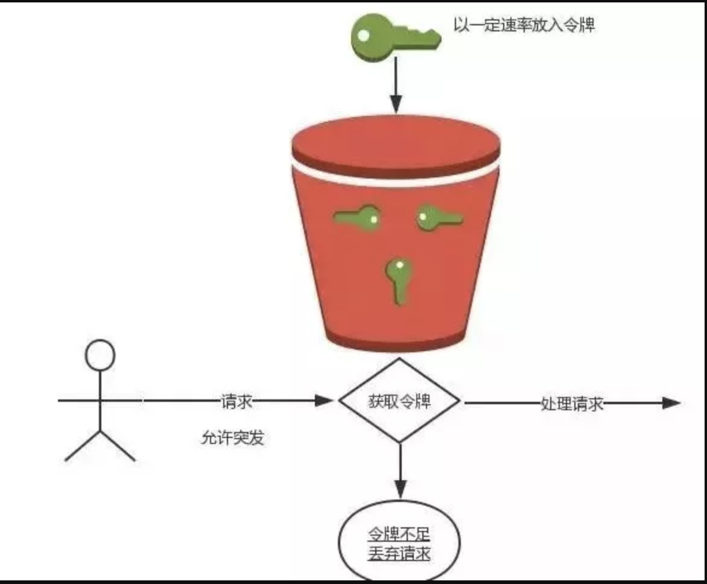

# 秒杀

## 特点

瞬间高并发,疯狂的点着鼠标
库存少

## 用户规模

用户规模可大可小，几百或者上千人的活动单体架构足以可以应付，简单的加锁、进程内队列就可以轻松搞定。
一旦上升到百万、千万级别的规模就要考虑分布式集群来应对瞬时高并发。

## 架构


* 遇到各种不怀好意的DDOS攻击(利用无辜的吃瓜群众夺取资源)，导致真正的我们无法获得服务！所以说高防IP还是很有必要的
* 接入SLB，对多台云服务器进行流量分发，可以通过流量分发扩展应用系统对外的服务能力，通过消除单点故障提升应用系统的可用性。
* 基于SLB价格以及灵活性考虑后面我们接入Nginx做限流分发，来保障后端服务的正常运行。
* 后端秒杀业务逻辑，基于Redis 或者 Zookeeper 分布式锁，Kafka 或者 Redis 做消息队列，DRDS数据库中间件实现数据的读写分离。

## 优化

* 分流:再牛逼的机器也抵挡不住高级别的并发。
* 限流:毕竟秒杀商品有限，防刷的前提下没有绝对的公平，根据每个服务的负载能力，设定流量极限。
* 缓存:尽量不要让大量请求穿透到DB层，活动开始前商品信息可以推送至分布式缓存。提升系统访问速度和增强系统的处理能力
* 异步:分析并识别出可以异步处理的逻辑，比如日志，缩短系统响应时间。
* 主备:如果有条件做好主备容灾方案也是非常有必要的(参考某年锤子的活动被攻击)。分布式锁解决了集群下数据的安全一致性问题
* 为了支撑更高的并发，追求更好的性能，可以对服务器的部署模型进行优化，部分请求走正常的秒杀流程，部分请求直接返回秒杀失败，缺点是开发部署时需要维护两套逻辑。

## 分层优化

* 前端优化：活动开始前生成静态商品页面推送缓存和CDN，静态文件(JS/CSS)请求推送至文件服务器和CDN。
* 网络优化：如果是全国用户，最好是BGP多线机房，减少网络延迟。
* 应用服务优化：Nginx最佳配置、Tomcat连接池优化、数据库配置优化、数据库连接池优化。

## 全链路压测

压测优化过程就是一个不断优化不断改进的过程，事先通过测试不断发现问题，优化系统，避免问题，指定应急方案，才能让系统的稳定性和性能都得到质的提升。

* 分析需压测业务场景涉及系统
* 协调各个压测系统资源并搭建压测环境
* 压测数据隔离以及监控(响应时间、吞吐量、错误率等数据以图表形式实时显示)
* 压测结果统计(平均响应时间、平均吞吐量等数据以图表形式在测试结束后显示)
* 优化单个系统性能、关联流程以及整个业务流程

```sh
yum -y install httpd-tools
ab -v
ab --help

ab -n 1000 -c 100 http://127.0.0.1/
```

## 限流

当访问频率或者并发请求超过其承受范围的时候，这时候我们就要考虑限流来保证接口的可用性，以防止非预期的请求对系统压力过大而引起的系统瘫痪。通常的策略就是拒绝多余的访问，或者让多余的访问排队等待服务。

### 算法

* 令牌桶算法：是网络流量整形（Traffic Shaping）和速率限制（Rate Limiting）中最常使用的一种算法。典型情况下，令牌桶算法用来控制发送到网络上的数据的数目，并允许突发数据的发送。
* 漏桶：控制数据注入到网络的速率，平滑网络上的突发流量。漏桶算法提供了一种机制，通过它，突发流量可以被整形以便为网络提供一个稳定的流量。无论你流入速率多大，我都按照既定的速率去处理，如果桶满则拒绝服务。



### 策略

* 应用
    - Tomcat
    - 配置Connector
* API限流：用开源工具包guava提供的限流工具类RateLimiter进行API限流
* 分布式限流
    - Nginx
* OpenResty限流
    - 限制接口总并发数/请求数:resty.limit.count
    - 限制接口时间窗请求数:resty.limit.conn
    - 平滑限制接口请求数:resty.limit.req

```
#统一在http域中进行配置
#限制请求
limit_req_zone $binary_remote_addr $uri zone=api_read:20m rate=50r/s;
#按ip配置一个连接 zone
limit_conn_zone $binary_remote_addr zone=perip_conn:10m;
#按server配置一个连接 zone
limit_conn_zone $server_name zone=perserver_conn:100m;
server {
        listen       80;
        server_name  seckill.52itstyle.com;
        index index.jsp;

        location / {
              #请求限流排队通过 burst默认是0
              limit_req zone=api_read burst=5;
              #连接数限制,每个IP并发请求为2
              limit_conn perip_conn 2;
              #服务所限制的连接数(即限制了该server并发连接数量)
              limit_conn perserver_conn 1000;
              #连接限速
              limit_rate 100k;
              proxy_pass      http://seckill;
        }
}

upstream seckill {
        fair;
        server  172.16.1.120:8080 weight=1  max_fails=2 fail_timeout=30s;
        server  172.16.1.130:8080 weight=1  max_fails=2 fail_timeout=30s;
}
```

## 问题

* 如何防止单个用户重复秒杀下单？
* 如何防止恶意调用秒杀接口？
* 如果用户秒杀成功，一直不支付该怎么办？
* 消息队列处理完成后，如果异步通知给用户秒杀成功？
* 如何保障 Redis、Zookeeper 、Kafka 服务的正常运行(高可用)？
* 高并发下秒杀业务如何做到不影响其他业务(隔离性)？

## 参考

* [小柒2012 / spring-boot-seckill](https://gitee.com/52itstyle/spring-boot-seckill):从0到1构建分布式秒杀系统 https://blog.52itstyle.com/archives/2853/
* [分布式秒杀系统构建中的多种限流实现](https://mp.weixin.qq.com/s?__biz=MzI4NTA1MDEwNg==&mid=2650768375&idx=1&sn=0b1de5c41ac15db0fc53f279fcfa58b6&chksm=f3f93662c48ebf7481bd7ce8ca74a3f2ad66fd80e7f50e313d8ebd1152a094045d75113a832d)
* [openresty/lua-resty-limit-traffic](https://github.com/openresty/lua-resty-limit-traffic):Lua library for limiting and controlling traffic in OpenResty/ngx_lua
