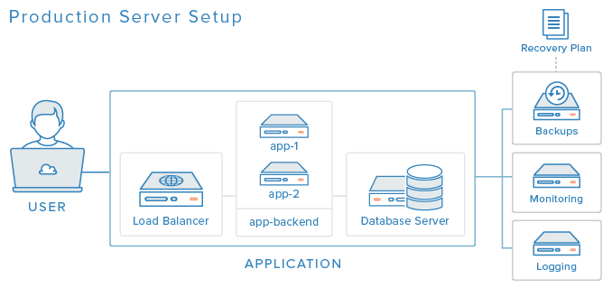

# WEB服务

接收用户http请求，然后处理请求，最后将处理结果返回给用户

- Apache拥有丰富的模块组件支持，稳定性强，BUG少，动态内容处理强。
- Nginx轻量级，占用资源少，负载均衡，高并发处理强，静态内容处理高效。

## TCP/IP

网络通讯大部分是基于TCP/IP的，而TCP/IP是基于IP地址的.

* 用户主机上运行着DNS的客户端
* 浏览器将接收到的url中抽取出域名字段，就是访问的主机名
* DNS客户机端向DNS服务器端发送一份查询报文，报文中包含着要访问的主机名字段（中间包括一些列缓存查询以及分布式DNS集群的工作）
* 该DNS客户机最终会收到一份回答报文，其中包含有该主机名对应的IP地址
* 一旦该浏览器收到来自DNS的IP地址，就可以向该IP地址定位的HTTP服务器发起TCP连接

### IP

网卡唯一的MAC编号，网路分配唯一的IP地址

* 127.0.0.1:绑定本机的IP

```sh
ipconfig # windows
nslookup www.baidu.com

ifconfig # linux mac
```

### 域名(Domain Name)

DNS是应用层协议，事实上他是为其他应用层协议工作的，包括不限于HTTP和SMTP以及FTP，用于将用户提供的主机名解析为ip地址。

DNS（Domain Name System）域名解析系统，就是将域名翻译成IP地址,运行在互联网上的主机。是DNS服务器,存储了IP地址和域名对应关系，是一台数据库服务器。

当用户在浏览器中输入网址域名时，首先就会访问系统设置的DNS域名解析服务器（通常由ISP运营商如电信、联通提供）。如果该服务器内保存着该域名对应的IP信息，则直接返回该信息供用户访问网站。否则，就会向上级DNS逐层查找该域名的对应数据。

本机DNS文件

* `C:\Windows\System32\drivers\etc\hosts`隐藏文件没有扩展名
* `/etc/hosts`

www.baidu.com 通过dig +trace

* 权威dns

#### 公共DNS服务

设计为分布式集群的工作方式：使用分布式的层次数据库模式以及缓存方法来解决单点集中式的问题。
可通过修改网络连接的DNS server 地址

* Google的8.8.8.8：主8.8.8.8 备 8.8.4.4
* 114DNS
    - 纯净无劫持，无需再忍受被强扭去看广告或粗俗网站之痛苦： 114.114.114.114  114.114.115.115
    - 拦截钓鱼病毒木马网站，增强网银、证券、购物、游戏、隐私信息安全：114.114.114.119 114.114.115.119
    - 学校或家长可选，拦截色情网站，保护少年儿童免受网络色情内容的毒害 114.114.114.110 114.114.115.110
* 阿里DNS（`http://www.alidns.com/`）DNS递归解析系统，面向互联网用户提供快速、稳定、智能的免费DNS递归解析服务:223.5.5.5  223.6.6.6
* SDNS（`http://www.sdns.cn/`）1.2.4.8  210.2.4.8
* 中科大的DNS:202.38.64.1 202.112.20.131 202.141.160.95 202.141.160.99 202.141.176.95 202.141.176.99 
* OneDNS: 112.124.47.27 南方首选/北方备用  114.215.126.16 北方首选/南方备用

国内用户普遍使用的是ISP运营商提供的DNS服务器，这样有着一个巨大的风险，就是DNS劫持,目前国内ISP运营商普遍采用DNS劫持的方法，干扰用户正常上网，例如，当用户访问一个不存在（或者被封）的网站，电信运营商就会把用户劫持到一个满屏都是广告的页面，以帮助自己盈利！

劫持广告：原来的网页被放置到一个iframe里，并注入了flash广告。
面地址后面是不是有后缀

* 低延迟说明全国各地（至少在省内或者附近，不会南方跨到北方）直接返回被劫持的IP；
* TCP查询同样中枪，排除黑阔采用全国发UDP包方式进行劫持；
* 同网段有那啥网站。

利用DNS实现DNS的负载均衡，并且在配置运营商CDN机房时也是重要的一部分。DNS技术属于前端架构甚至更前的一部分，不难看出一个大型网站在提供好扎实的应用层和数据层服务后亟待解决的是访问的问题，访问安全问题也是伴随着要解决的问题之一。

出于资源消耗和响应速度的综合考虑，一般来说从主机到本地DNS服务器是递归查询，从本地DNS到其他DNS服务器是迭代查询。

### 处理方式

* Apache提供一系列多重处理模块，通过这些多重处理模块来使用操作系统的资源，对进程和线程池进行管理，控制处理用户请求。三种多重处理模块：mpm_prefork、mpm_worker、mpm_envent，
    - mpm_prefork：模块产生众多子进程，每个子进程是单线程的，每个线程链接一个请求，如此一对一的关系。所以如果请求数大于进程数时，服务器的性能就表现得差强人意了。
    - mpm_worker：worker中子进程是多线程的，每个线程管理一个用户连接。线程数要多于进程数量，这也就意味着新的连接能立刻得到一个空闲的线程，而不用等待进程空闲。
    - mpm_event：该模块与worker相似，区别在于event可以处理长连接(keep-alive)，以避免线程被请求长期占用而造成资源浪费，同时也增强了高并发场景下的请求处理能力。 
* Nginx是通过异步的、非阻塞的、事件驱动的方式在实现的。Nginx的工作进程是单线程的，每个线程可以异步的处理大量的用户请求。下面是Nginx的工作原理图：

### 静态与动态内容的处理

* Apache具有内置的解析和执行各种动态脚本语言（包括PHP，Python和Perl）的功能，无需借助外部处理器。
* Nginx处理动态内容的效率并不高,且需借助外部的处理器。

## 架构

网站的架构逐渐从单机服务演进

* 前端是各地的CDN服务器集群，连接各反向代理服务器集群，连接负载均衡服务器集群
* 接下来将访问请求转到按照业务划分的应用服务器集群上，通过消息队列集群传到分布式服务集群上
* 然后通过缓存或一致性数据访问模块连接到数据源：分布式缓存、分布式数据库、分布式文件集群，外加NoSQL和搜索引擎服务器等等。
* 分层化与分布化

* BS：browser-Server  浏览器和服务器，通过浏览器来访问服务器，比如：百度，新浪等等
* CS：client-server  客户端和服务器，通过客户端软件去访问服务器

## 部署

* 域名购买：GoDaddy
* "L2TP" 或者 "Shadowsocks" anyconnnect
* nginx 提供php python

## 生产环境

可用性
可还原
性能

* Backup
    - 备份数据
    - 备份策略
    - 数据留存期
* 恢复计划
* Load Balancing:应对单点失效
* Monitoring：Tracking the status of services and the trends of your server resource utilization, thus providing great visibility into your environment.
* Centralized Logging



## 演化

* Everything On One Server：Web Application Database
* Separate Database Server:
* Load Balancer (Reverse Proxy)
* HTTP Accelerator (Caching Reverse Proxy)
* Master-Slave Database Replication:database Cache

## 工具

* [sullo/nikto](https://github.com/sullo/nikto):Nikto web server scanner
* [Neilpang/acme.sh](https://github.com/Neilpang/acme.sh):A pure Unix shell script implementing ACME client protocol https://acme.sh
* [snail007/goproxy](https://github.com/snail007/goproxy):Proxy is a high performance HTTP(S), websocket, TCP, UDP,Secure DNS, Socks5 proxy server implemented by golang. Now, it supports chain-style proxies,nat forwarding in different lan,TCP/UDP port forwarding, SSH forwarding.Proxy是golang实现的高性能http,https,websocket,tcp,防污染DNS,socks5代理服务器,支持内网穿透,链式代理,通讯加密,智能HTTP,SOCKS5代理,域名黑白名单,跨平台,KCP协议支持,集成外部API。
