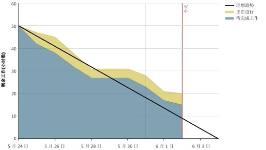
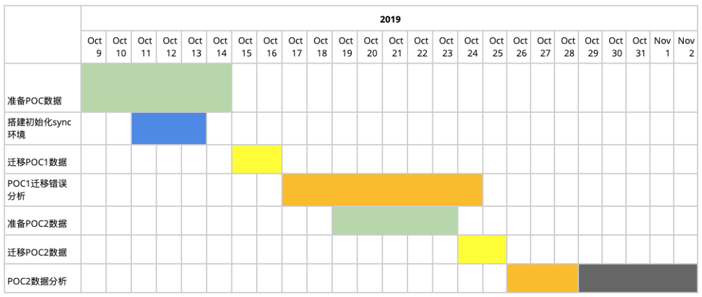
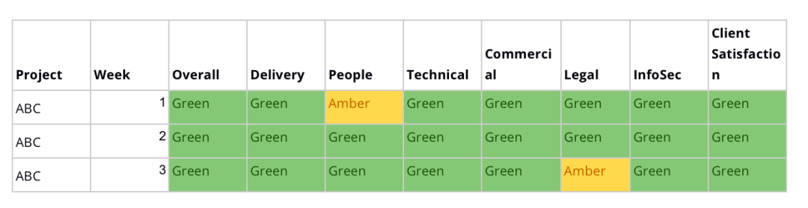
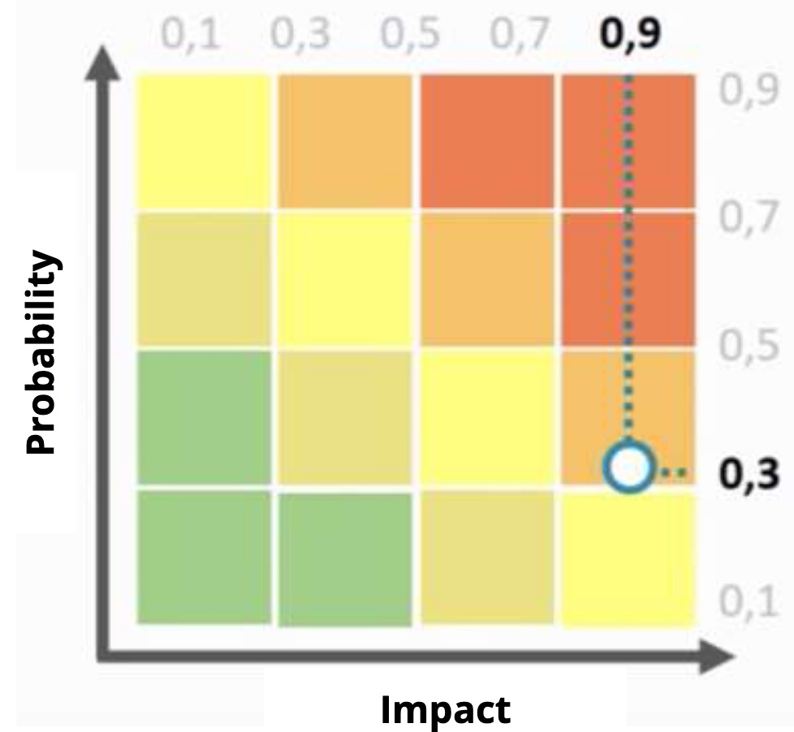
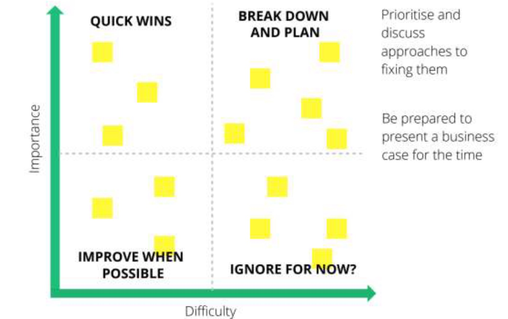
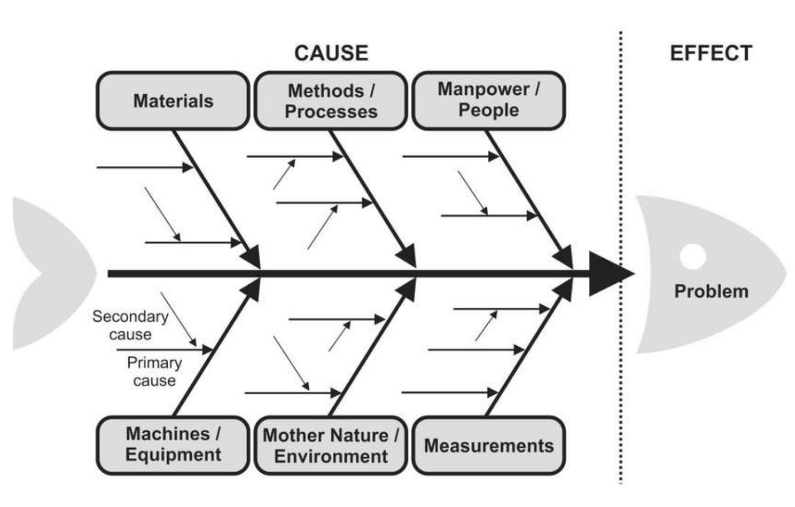

# 敏捷实施@ThoughtWorks

* 一种不停尝试、不停调整、不停优化的状态
* 产品和业务开发本来就是一个探索的过程，开始时一定是最无知的时刻。项目中的大部分决策也一定是在项目开始的时刻做出的，这将有一个重大的悖论，在最无知的时刻，做出了最重要而且是绝大部分的决策，并把它作为随后执行的依据。
  - 通过迭代应对这一问题，只做初始决策，定大致的方向
  - 通过市场反馈不断修正对产品的认知，增量的决策和调整
* 通过迭代将瀑布模型分隔成更小的周期，从而实现迭代.每一次迭代时间可能是2周。每个迭代都能都有交付的工件，如果交付物不能满足市场或客户需求。可以在下一个迭代再一次进行分析、调整和开发，从而响应变化
* 每一次迭代都包括了需求定义、需求分析、设计、代码实现与测试
* 采用这种方法，开发工作可以在需求被完整地确定前启动，并在每次迭代中完成系统的一部分功能开发工作，再通过客户的反馈来细化需求，并开始新一轮的迭代
* 敏捷开发:60% Scrum + 40% XP
  - XP的一个Sprint的迭代长度大致为1~2周, 而Scrum的迭代长度一般为 2~ 4周
  - XP在一个迭代中，如果一个User Story还没有实现，则可以考虑用另外的需求将其替换，替换的原则是需求实现的时间量是相等的。
  - 而Scrum是不允许这样做的，一旦迭代开工会完毕, 任何需求都不允许添加进来，并有Scrum Master严格把关，不允许开发团队受到干扰
  - XP是务必要遵守优先级别的。但Scrum在这点做得很灵活，可以不按照优先级别来做，Scrum这样处理的理由是：如果优先问题的解决者，由于其它事情耽搁，不能认领任务，那么整个进度就耽误了。 另外一个原因是，如果按优先级排序的User Story #6和#10，虽然#6优先级高，但是如果#6的实现要依赖于#10，则不得不优先做#10.
  - Scrum非常突出Self-Orgnization,XP注重强有力的工程实践约束。举个通俗理解Scrum的例子，Scrum:指的是英式橄榄球中一股脑争球这一战术或行为。scrum 即为这样一种方式，大家一拥而上，团队是球员，球是产品目标，人员环环相扣，围绕着产品目标进行工作。这里面多少有点“统筹法”的影子，人员深入协作以达到最优化效果
* 本质是义无反顾的思考产品的价值，以价值为驱动去思考、设计、开发、协作，让结果能给客户、用户产生价值

## [开发模型演化](https://mp.weixin.qq.com/s/FtJFtGYu_jA2aBCD2aCUhA)

* 瀑布开发
  - 预先做大量的设计:所有的设计和规划都在初期完成
  - 基于文档开发 所有开发工作都基于需求文档和设计图
  - 测试滞后:等所有设计和开发工作完成才开始测试
  - 最后交付价值 只有在产品最后发布才能收到回报
  - 通过里程碑，将大的项目变成小的、可控的工作
  - 通过里程碑的环环相扣，顺序操作，让方案简单可以实施
  - 问题：
    + 需求文档经常描述不清楚，或者遗漏
    + 工作人员经常认为编码完了，工作就完了
    + 各种设计文档工作量很大，内容乏味，但编码完成后基本都对不上了
  - 本质问题并不是阶段，而是批量。需求批量地在一起进行设计，然后是批量地开发，批量地测试、交付等等,缺乏并行迭代的概念
    + 批量让价值交付延迟，所有需求在最后的阶段才能交付，价值交付比较晚
* V模型:瀑布模型的变种,凸显了测试和开发环节的对应关系
* 原形模型
  - 原形要解决的问题就是需求不准，避免需求经过长时间的开发，浪费了大量的金钱和人力，得到的软件还不是用户所期望的
  - 采用的方式是：开发团队在分析需求的时候，尽快开发出一个用户看得到的原形，让用户尽早感受到效果。其实原形模型更多的是一种沟通方式，只是有人不丢掉原形，在原形的基础上继续开发，才被定位为原形模型。不过原形的开发过程时间紧，任务重，结果非常粗糙，重用的成本一般很高，建议还是丢掉
  - 制作原形的时候，有时会做得很逼真，用户可以像真的系统一样操作，只是后台的逻辑都是假的；有时会做的很简洁，只是一些图片。据说iPad的开发过程使用了原形，那个时候的原形仅仅是一个木板，上面画了几个按钮，想要做什么就在上面假装点点，想象着它完成了想要的操作。只要有好的沟通效果，形式不重要
* 迭代模型:将大的需求变成小的需求，让问题的复杂度降低了很多
  - 当需求变小后，每个需求的开发过程就会变简单，每个阶段的工作也都可控了。每个迭代的需求都像瀑布模型一样有分析、设计、开发、测试，但是因为需求小，对文档的依赖减弱很多
  - 开发人员可以将前一个迭代学到的东西用在下一个迭代，开发越来越顺畅
  - 为开发不确定需求提供了可能。虽然整个需求没有完全想清楚，但是想清楚的部分可以先开发
* 敏捷模型
  - 初期定义产品愿景 Inception 在项目启动中，定义产品愿景，产品路 线图，发布计划等
  - 及时产生价值 每个迭代完成，交付可工作的软件以及功能
  - 需求，设计，开发同步 需求分析，设计，开发，测试同步在每 个迭代完成，缩减反馈时间
  - 迭代开发 每个迭代重复相同的流程，直到完成产品愿景
  - 快速交付，持续重构
    + 通过TDD过程，在开发需求之前就细化了需求的细节，对详细设计的结果有提升
    + TDD产出的测试用例，提升编码质量，避免反馈周期长。如果没有测试用例，一个Story很容易被当皮球踢
    + 项目中遗留的测试用例，能避免软件成为打地鼠软件。当增加一个A功能，发现B功能有问题，修复了B功能发现C功能故障了，修复了C功能，发现A功能又故障了
    + 通过Pipeline，让构建、测试更频繁，因为工具化了，成本更低，出错更少
    + 通过Pair、CodeReview，让知识流动起来
  - 演进的需求和方案
    + 用户的需求一般都只是一个大方向，具体的价值和实现方式都是不确定的，用户也在不断探索他们的业务。敏捷接纳了原型法的需求分析方法，还提出了Inception来分析更有价值的需求，通过MVP圈定最小开发范围，快速验证方案，这就是演进的需求和方案
    + 确定的需求设计好，不确定的需求就需要演进
  - 自组织(Self-Organizing)且跨功能的团队
    + 每个人都致力于项目的目标，团队成员互相尊重，每个人都专注于工作，开放，团队成员有勇气站出来参与该项目。这里最关键的就是每个人都致力于项目的目标

## 目的

* 更快交付价值
  - 更早交付:当向用户交付产品后，用户反馈,瞬间狂涨知识，并感叹道“你怎么不早说呢？”
  - 更多可能的是，用户这时才清楚或能够描述他们要的是啥，更有甚者，我们可能一开始连用户是谁也未必能准确地定义
  - 产品和业务开发本来就是一个探索的过程，开始时一定是最无知的时刻。项目中的大部分决策也一定是在项目开始的时刻做出的，这将有一个重大的悖论，在最无知的时刻，做出了最重要而且是绝大部分的决策，并把它作为随后执行的依据
  - 通过迭代应对这一问题，只做初始决策，定大致的方向。通过市场反馈不断修正对产品的认知，增量的决策和调整。
* 有效学习和灵活响应变化
* 缩短开发周期
* 提高质量
* 提升用户满意度
* 提升团队人员能力
* 增强协作
* 减少工作量，提高产能
* 产品创新
* 改变管理方式，增强成员参与感

## [Manifesto for Agile Software Development](https://agilemanifesto.org/)

* 个体和互动 高于流程和工具 Individuals and interactions over processes and tools
* 工作软件 高于详尽的文档 Working software over comprehensive documentation
  - 需求管理：正确需求拆解方法，一定是“纵切蛋糕”，每一个需求单元拆得再小，也是能够独立发布、独立创造价值的。
  - 项目管理：要管的就一定是如何把小块的需求流动起来，尽快、尽可能频繁地把小块需求交付给用户去使用，因为这才是每周、每天的工作真正体现为“可工作的软件”
  - 配置管理：功能是一点一点加上去的，代码是不断反复修改的，并且任何人都有可能修改任何一块代码
    + 单一代码库
  - 质量保障：不可能靠人肉回归测试来保障质量，必须依赖全面、可靠、快速的自动化测试来构建软件质量的安全网
* 客户合作 高于合同谈判 Customer collaboration over contract negotiation
* 响应变化 高于遵循计划 Responding to change over following a plan

## 阶段

* 愿景 VISION
* 产品路线图 ROADMAP
  - 一个可执行计划，它显示了产品可能如何发展。它通常包括几个主要的产品版本。Roman Pichler
  - 说明产品在几个主要版本中可能如何演进。与发布计划不同的是，它是一种超越单个项目或发布的产品计划:它描述了在接下来的12个月或者更长的时间里 你想要带你的产品走的路线——就像路线图帮助你计划旅行一样。 Janna Bastow
  - 创建
    + 识别产品需求：与干系人一起识别产品需求， 可以在便利贴上写下尽可能多的想法
    + 整理产品需求：将这些想法按照使用流程，技 术类似性，业务逻辑进行分组 ，比如:查询余额，支付账单
    + 产品需求的估算：团队开发对需求所需的工作量 进行评估，评估相对优先级
    + 确定大致时间线：根据需求的优先级，工作量,预估的开发速率评估大致的时间线
  - 需求复杂度估算
    + 所有故事的大小都是相对的
    + 整理用户故事，找到最小的
    + 与这个故事相关的所有其他故事的大小，两倍大，三倍大，等等
    + 斐波那契序列
  - 优先级评估框架：有各种各样的工具可以用来确定待办事项的优先级，并帮助创造出 MVP
    + 商业价值大小
    + 开发复杂度
    + MoSCoW：Must have, Should have, Could have, Won’t have
    + 功能使用频率
    + 外部依赖
  - 开发速率估算
    + 主持人安排故事的样本
    + 开发者会选择他们认为可以在迭代中“完成”的用户故事
    + 主持人统计总数
* 发布计划 RELEASE PLAN：了解有价值的产品/服务将如何交付以及团队需要如何支持的初步计划
  - 以两周为周期生成 Sprint
  - 为什么需要发布计划?
    + 让干系人和团队了解清晰的交付内容，时间点，优先级，发布时间
    + 和其他团队沟通以制定集成的时间点
  - 创建发布计划
    + 细化用户需求，用户故事分解
      - 主题(THEMES)：项目中要解决的主要概念。例如：客户｜安全
      - 史诗故事(EPICS)：深入主题可以揭示更多的功能领域。例如：客户的维护｜登陆
      - 特性(FEATURE)：功能区域可以分解为解决方案的特性。例如：新建/删除用户｜客户登录
      - 用户故事(STORIES)：特性被分解为应该在解决方案中可用的功能片段。例如：在线注册新用户/停用现有客户在线档案｜忘记密码
      - 任务(TASKS)：为了实现一个故事，团队需要完成许多技术任务。例如：确定客户不存在/验证客户余额为0｜连接到LDAP
    + 用户故事估算：当需求拆分到用户故事级别之后，和团队一起对用户故事进行估算
      * BA和团队讲述故事卡内容
      * 从一个最简单的故事开始，参与者对该故事做估算作为参考基准 - 1个故事点
      * 从高优先级的故事开始，和1个故事点故事对比， 参与者给出故事点数
      * 只有在有分歧时才讨论，如果大家都同意 ，那就没有必要讨论了，讨论分歧点——“为什么你认为它是一个......”
      * 将大家都同意的点数作为故事卡点数
    + 制定产品待办列表(Backlog)：产品待办列表是项目相关的所有用户故事的列表。产品负责人不断的添加用户故事，优先级排序来维护产品待办列表。
    + 创建发布计划：根据需求的优先级，工作量, 预估的开发速率评估大致的时间线
* 迭代计划 Iteration Planning
  - 在每次迭代开始时调用迭代计划会议，以生成该迭代的编程任务计划。每次迭代为1到3周
  - 客户从发布计划中按照对客户最有价值的顺序选择用户故事进行此次迭代。还选择了要修复的失败验收测试。客户选择的用户故事的估计总计达到上次迭代的项目速度
  - 从客户价值维度和技术风险的角度来排定优先级。下图中是常用的工具之一——需求优先级矩阵
  - 用户故事和失败的测试被分解为支持它们的编程任务。任务记录在索引卡上，如用户故事。虽然用户故事是客户的语言，但任务是使用开发人员的语言。可以删除重复的任务。这些任务卡将是迭代的详细计划
  - 开发人员注册执行任务，然后估计他们自己的任务需要多长时间才能完成。对于接受任务的开发人员而言，重要的是估计完成任务所需的时间。人们不可互换，而且要完成任务的人必须估计需要多长时间
  - 每项任务应估计为1,2或3（如果需要，添加1/2）持续时间的理想编程天数。如果没有干扰，理想的编程日期是完成任务需要多长时间。短于1天的任务可以组合在一起。超过3天的任务应该进一步细分
  - 现在再次使用项目速度来确定迭代是否超过预定。在任务的理想编程天中总计时间估计值，这不得超过上一次迭代的项目速度。如果迭代次数太多，那么客户必须选择要推迟的用户故事，直到稍后的迭代（也叫雪耕 - Snow Plowing）
  - 如果迭代太少，则可以接受另一个故事。任务天的速度（迭代计划）会覆盖故事周的速度（发布计划）因为它更准确
  - 看到用户故事被雪覆盖通常令人震惊。不要惊慌。记住单元测试和重构的重要性。任何一个领域的债务都会让你失望。在安排之前避免添加任何功能。只需添加今天所需的内容。添加额外的东西会减慢你的速度
  - 不要试图改变你的任务和故事估计。规划过程依赖于一致估计的冷现实，将它们勉强降低会产生更多问题
  - 密切关注您的项目速度和积雪。您可能需要重新估算所有故事并每三到五次迭代重新协商发布计划，这是正常的。只要您始终首先实施最有价值的故事，您将始终尽可能为您的客户和管理层做好准备
  - 迭代开发风格可以为开发过程增加灵活性。通过不比当前迭代更远地规划特定的编程任务来尝试及时规划
  - 迭代会议(IPM)通常发生在每个迭代的第一天，团队成员一起制定迭代计划。这个会议由BA主持，大家一起同步几个方面的内容：
    + 下一个迭代的用户故事
    + 对下一个迭代的期望和计划
    + 风险的评估和总结
  - 迭代会议的主要产出是下一个迭代中需要完成的用户故事，这些用户故事即为下一个迭代所要完成的主要目标
* 每日站会 DAILY STANDUP:团队在一起快速地开一个会(通常在物理墙前)，成员逐个更新自己的状态
  - 更新包含以下几个方面
    + 昨天完成的工作
    + 今天计划做的工作
    + 面临什么阻碍，需要什么帮助
    + 自己手头用户故事的进展，是否存在技术风险
  - 不宜过长，10分钟左右为佳。建议团队成员站着开会，因为研究表明，当人们坐着开会的时候，会议的时间会被无形中拉长
  - 实践原则：
    + 团队成员都要参加站会，轮流主持，谁迟到了都不等——仪式感很重要。
    + 站会的时候，每位团队成员围绕故事卡进行更新。介绍一种有意思的实践——使用Token(也就是使用一个实物作为”令牌”，准备发言的人首先取得”令牌”，发言完成后将“令牌”传给下一个人。令牌要醒目，可以是毛绒玩具，也可以是一顶帽子)。
* 功能演示 SHOWCASE:通常发生在每个迭代的最后一天，目的是演示可工作的软件。团队把一个迭代中开发好的功能给相关人员演示，并收集反馈，以便在下一个迭代中可以对变化作出快速响应
* 迭代回顾 Retrospective
  - 目的是通过新的沟通形式唤起大家对团队的集体意识，指出团队或个人在一段时间内的不足并列出对应行动
  - 持续而有效的回顾和反馈，可以保证团队关心生产力和效率，了解自身的不足，这将成为团队持续改进的起点
  - 关注点也多种多样，除了“项目开发”之外，还可以关注“敏捷成熟度”、“团队角色和职责”、“人员技能提升”等
  - 坚持回顾的同时，需要做的还有保证回顾的有效性
  - 应根据团队建设目标的发展变化，不断调整回顾的关注点和形式，确保回顾能够有针对性地发现团队的缺陷并转化为实践
  - 实践
    + 最大程度可视化
      * 挂在墙上的“人人可见的大图表”是一种普遍的实践，它被用来共享项目的状态并将之可视化。比如表示项目状态的物理墙，这样的物理墙通常包括三个元素：时间、任务和团队
      * 还会可视化其他的元素，比如团队应坚持的规则、项目上的经验分享以及项目的里程碑
      * 通过有关联的团队和个人之间相互协商，可以识别出未来一段时间里各自的活动，以及相应的、对成功的衡量方式，然后将其可视化出来，每段时间再回顾和调整一次。有了这样的可视化，团队会更加容易对齐目标，并不断培养和加深责任感
      * 好处：
        - 日常工作透明，将迭代过程中所有的故事卡可视化出来，团队成员可以随时知道当前需要完成的工作以及将要完成的工作。由于人对视觉反应更灵敏，可视化的故事墙能立刻聚焦团队的注意力
        - 将迭代过程中遇到的问题暴露出来，可以促进团队成员在工作中一起积极讨论解决方案
        - 团队也可以根据现在的进度以及遇到的问题，了解需要哪些帮助，更好的分配资源，减少开发进度被滞后的风险
    + 年初时都做过展望与总结

## [敏捷开发](https://insights.thoughtworks.cn/agile-development-thoughtworks/)

* 核心原则
  - 价值驱动
  - 技术卓越
* 实践
  - 基于统一迭代节奏的全功能团队:为了交付软件所需要的技能都应该在一个团队里 [Responsibility Activity](https://www.zybuluo.com/zhongjianxin/note/569074)
    + BA:分析下一个迭代卡，验收当前完成的卡
      * 与利益相关者保持沟通
      * 需求澄清
      * 促进共同的理解,达成共识
      * 如何保证在整个交付周期之中，原始的需求价值可以被快速，正确的交付到用户手中？
      * 怎样才能保证开发团队能够时刻理解需求提出方的想法和变更？
      * 保持沟通，及时需求澄清，促进与利益相关者的共同理解，并时刻保持共识是基本保障
      * 在需求不明确的情况下，做的越多浪费的越多
      * 需求不等于要求，需求不可以谈判，要求可以谈判，所以做项目的时候要挖掘客户背后的需求
    + QA:给下一个迭代卡片写AC，测试当前迭代卡
      * 尽可能早的发现缺陷
      * 尽可能早的修复缺陷
      * 保证交付的质量
      * 质量3个层级：可用性，适用性（以适合顾客需要的程度作为衡量依据）和易用性
      * 项目中三角约束：Time，Scope，Cost
      * 新的敏捷三角将质量可视化：价值 质量 约束（成本、时间、范围）
    + Dev
      * 尽可能早的修复缺陷
      * 保证交付的质量
      * 共同承担责任
      * 尽早集成，缩短反馈周期，减少沟通成本和浪费
      * 紧密合作，加强团队成员之间的沟通，保证整个团队上下文一致，目标一致
      * 开发人员不要只关注代码，需要关注整体：需求、质量、架构等
    + UX：
  - 基于Story需求及范围实时管理
    + Story是开发团队的最小工作单元.不对Story进行更技术的Task拆分，这样做保证了大家都关注Story承载的业务价值，当然这需要技术能力上的“全栈”文化支持，即大家以能够同时做多个技术栈为荣
      * 运行成熟的ThoughtWorks开发团队有Tasking这个环节，形式可能是全队在迭代启动会上针对复杂Story进行“实现预演”，也可能是资深开发人员在自己显示器上贴出的彩色纸条，每张纸条承载着一个技术动作
    + 虽然有整体项目的Backlog，但Story一般是迭代澄清，为了保证统一迭代，BA一般只会提前一个迭代梳理下一个迭代（类似Scrum中的Sprint）的需求
      * 非常成熟的ThoughtWorks开发团队在这个过程中能够让客户或业务负责人持续迭代参与Story澄清，并能够持续调整Story优先级
    + 工具
      * 燃起图（Burn-Up）：Scrum的燃尽图并不推荐，原因是很容易营造一种遵循计划的假象。对于客户/业务和项目管理者，从燃起图能够看到实时需求范围的变化，按期交付风险也能够实时推测
      * 累积流量图（CFD来至于Kanban）：在成熟团队广泛应用，它能够直观告诉开发团队瓶颈在哪里，驱动改进。能够收集累计流量图所需的数据，本身也说明团队具备了一定的成熟度
      * Jira、Mingle和Rally
  - 基于持续集成和测试前置的质量内建
    + 持续集成纪律有两条核心
      * 必须每次提交触发构建
      * 每次提交必须基于上次的成功构建
    + 提前验收 Desk Check 或 Shoulder Check
      * 开发人员完成Story后，在最后提交前邀请BA和QA快速在开发机上做展示。这样做的好处是尽量避免Story被移动到后期测试或客户验收的时候，才发现需求实现有问题，返工浪费
    + Code Review 开发团队在完成每天代码之后，会聚在一起评审当天的代码
      * 团队经过一天高强度的思考与编码，适当地停下来，看看其他人写的代码，同时将自己的代码讲解出来，往往能获得一些意外的灵感，或许能解决自己面临的阻碍
      * 互相了解设计思路，获得更好的建议和进行思路重构，提高代码质量
      * 及早发现潜在缺陷，降低事故成本：如果这个时候发现代码的坏味道和一些需要改进的地方，代码审查结束后可以花少量时间作出更改
      * 促进团队内部的知识共享
  - 基于Velocity和Cycle Time的持续改进
    + 围绕Velocity（即迭代交付的Story点数）：只服务于项目管理，即目前规划和实际情况是否出现偏差，是否需要进行风险管理，调整项目范围
      * 坚决反对把Velocity作为交付KPI，即不作为迭代内的开发合同
    + 交付时间Cycle Time
      * 从需求进入开发团队，到制造出可工作软件的速度
      * 理论上当然是越快越好，Kanban告诉我们流速快的团队效率高、响应力快
    + 特别注意不会聚焦到个体，比如我们说到的Story估点和Velocity统计都是团队为单位，不会指定或统计到个人
  - 基于客户深度参与的统一团队
    + 客户参加迭代内站会、展示会和回顾会是ThoughtWorks敏捷开发提出的要求
    + 大家都能够体会到这种模式下快速建立的信任关系
    + 要求控制每种会议的时间。一些比较普遍的原则有：
      * 迭代站会不超过15分钟
      * 需求澄清每次不超过1小时
      * 展示会1小时以内
      * 回顾会不超过两小时
* Dev 在从 Ready for Dev 栏领取 Story 时，流程如下：
  - 拿下物理卡
  - 打开电子卡理解需求
  - 找 BA 和 QA kick off
  - 确定 AC
* 缺点
  - 敏捷软件开发的特征是增量的，因此每个迭代都会有新的业务分析，新的开发工作在进行。这带来的一个问题是，不会有一个统一的 PRD 文档出现，最后在项目结束时候，交付物中没有好的文档。所以敏捷往往强调可交付的软件更为重要，在代码质量上下功夫，做到代码即文档
  - 参与人员都是根据团队划分的，例如独立的PM、BA、DEV，不再存在管理部分、研发部门。带来的矛盾是对个体的要求变高了，有时候往往一个团队中只有一个 BA 或者 UI，对新人挑战较大
* 管理体系
  - 需求管理：包含从需求澄清到需求最终实现的整个生命周期
    + Story作为需求的管理方法
    + 所有的技术、质量和迭代管理其实都是围绕这个中心，毕竟最后开发目的是实现价值，而Story承载着业务价值。
    + Story的质量其实是一个核心问题，ThoughtWorks从来不提倡一句话Story描述，即仅仅表面上遵循了As … I want … So that的经典模式，验收条件对于一个Story来说至关重要。
    + 围绕Story的可视化系统，每个团队都会有一面迭代看板，看板上流动的是迭代内的Story，而Story的生命周期则通过顺序的泳道展现给团队所有人
  - 技术管理：包含开发、测试技术的选择和运用
  - 质量管理：包含开发过程中的质量管理及软件交付前的质量保障
  - 迭代管理：包含开发团队迭代运作规则及纪律

## 工作量估算 Estimation

* Estimation is valuable when helps you make a significant decision.只有当团队对达成一个目标的工作量以及完成它之后的“收益”有明确的认知，才能做出明智的决定
* 当团队在为工作排定优先级、制定迭代计划时，业务分析师需要知道每个用户故事的成本，团队成员需要知道每个用户故事的价值
* 用故事点为单位估工作量，是正确做法
  - 纯粹对用户故事大小的相对度量，不应该跟任何的天数或者工作量等关联
  - 用户故事本身的大小属性不会发生变化，基于故事点的估算不会过期，不会受到团队技术能力和业务领域熟悉度的影响而发生变化。比如，一个点数为3的用户故事，它的复杂度相对于那个点数为1的基准故事来说不会发生变化，不管谁、也不管用什么技术来开发这个用户故事
  - 故事点的大小是指团队所有角色工作加一起的统一估算数值，需要多个角色一起合作讨论才能得出这个估算，因此，故事点的估算方法有利于帮助团队实现跨功能合作的行为
  - 通常不采用简单连续的数列，比如1，2，3，4，5等——而是采用一种近似菲波拉契数列的形式，像1，2，3，5，8，13等（正如《达芬奇密码》里面看到的），这样当数字越大、相邻数之间的间隔就越大，使得团队更容易区分哪个故事更小、哪个更大
  - 特别注意，不应该按照开发的点数、测试的点数去估算用户故事的大小，需要结合一起给出一个唯一的数值。
* 用人天为单位估工作量，是错误的做法
  - 基于这样的假设：
    + 所估算的故事是唯一要做的工作
    + 所有需要的东西在故事开始前都会准备好
    + 故事开发过程中不会被打断
  - 理想时间跟耗用时间是不同的。理想人天的估算是基于理想时间的，在软件开发过程中会有多个因素导致实际耗用时间跟理想时间会有很大的不同，比如开会、讨论等
  - 很容易让人根据一个故事所需完成的任务多少去估算，而不是从这个故事跟其他故事的相对大小角度去考虑；不同人估算的理想人天也会有不同，导致估算可能会不太准确
* 因为「工作量」按照定义就是一个「量」的概念，而不是「时间」的概念。最多的一个例子：搬一千块砖，就是搬一千块砖的工作量。搬得快，它是一千块砖；搬得慢，它还是一千块砖。工作量的大小，是与时间无关的。 `工作量 ➗ 速率 = 时间`
* 如何知道速率
  - 知道谁来做这个故事吗？生手和熟手程序员，速率是不一样的吧。
  - 知道做的人每天花多少时间来做这个故事吗？外部干扰多的一周，和外部干扰少的一周，体现在每天上的速率是不一样的吧。
  - 知道在什么时候做这个故事吗？项目初始阶段，和项目临近尾声，开发一个故事的速率是不一样的吧。
* `项目总体工作量 ➗ 团队速率 = 预期交付时间`:昨天的天气。要跑两个迭代，就会知道这个团队的速率
* 用时间来估工作量:因为他们假设速率是常量。既然速率是常量，那么工作量与时间就始终成正比.背后的观念
  - 程序员都是可替换的「人力资源」，A程序员和B程序员是没区别的，生手程序员和熟手程序员是没区别的，这个程序员离职了马上去大街上招一个，对速率也是没有重大影响的。
  - 程序员是不会成长的，在项目启动阶段的速率是这样，做到项目结尾时，速率还是这样，程序员并不会在项目过程中收获经验和技能，程序员的速率不会因为知识和熟练度的增加而提高。
  - 团队的环境是无关紧要的，团队成员彼此协作的方式要么不可能有任何改变、要么这种改变不会对速率产生任何影响
  - 只有预设了程序员就是机器上无差别可替换的齿轮时，一个团队、一个公司才会认为：软件开发的速率是一个常量
* 什么情况需要重估
  - 没有在预定的天数内完成考虑给故事涨点，也就是重估，这种以进度来驱动重估的做法是不对的,不能是因为做不完赶不上进度而调整。没有在估算天数内做完可能有两个方面的原因
    + 估算不准确，低估了
    + 被其他工作所打断，或者团队技术原因导致进度较慢...
  - 不需要重估的情况
    + 假设一个团队有4个复杂度相当的用户故事，原本估算均为3，预计能够在一个迭代完成的。在第一个迭代结束后，只完成了其中的两个用户故事，也就是完成了6个点，团队感觉这两个用户故事比预估的要大，想调整为原来点数的两倍，由6变成12；由于四个用户故事的大小相当，剩下的两个用户故事也需要调整为原来的两倍，剩下的工作量也变成了12，同样的可能还需要一个迭代才能完成。这样的重估就没有意义。
    + 如果只是发现用户故事实际耗费时间比原来预测的要多，但是**故事的相对大小并没有问题的时候**，不需要重估，而是要去回顾和分析耗费时间长的原因，并采取相应的措施去改进。
  - 需要重估的情况
    + 假设团队由A、B、C、D四个用户故事，刚开始给每个故事的估点均为3。在开发故事A的过程中发现A比原来估算的值要大，需要调整为5才合适，另一个类似的故事B也是一样，需要调整为5；但是C和D跟它们不一样，估算值应该是准确的，还可以保持为3。这种情况下对A和B的重估是有价值的，因为**相对大小发生了变化**
* 速度（Velocity）
  - 对团队的进度生产率的度量，可以通过计算团队在一次迭代中完成的用户故事所分配的故事点数的总和来得到。比如，完成5个3个点的用户故事，速度是15；如果完成了2个5个点的用户故事，速度是10。关于“完成”的定义不能只是到“开发完成”，而应该是“交付完成”
  - 可以修正计划的误差。估算把对工作量的估算和对工作时长的估算完全隔离开来，将必须完成的所有用户故事的点数总和除以迭代的速度，可以推算出迭代的次数，也就是项目持续时间
  - 假设团队估算出项目中包含了200个故事点的工作，一开始认为可以在每次迭代中完成25点，也就是将用8次迭代来完成工作。但是，在项目开始以后，团队发现速度只能达到20点。这样，不用对任何工作进行重估，就可以正确的认识到项目需要10次迭代，而不是8次。
  - 速度不会是稳定不变的。根据团队对技术和业务领域知识的熟悉程度，速度可能会增加；而随着团队人员调整，有新人加入以后，速度可能会下降。在故事点估算准确的情况下，速度正好是反映团队状态的一个参数。不应该为了保持速度的不变去调整估算的结果，而应该根据速度的变化来观察和分析团队的健康程度。
* 效率度量
  - 指标
    + 交付速度(Velocity):每个迭代完成的总Story Points
      * 说明
        - 前提:拆分故事、每个故事估点，并且是基于团队的估算
        - 算应把各种工作考虑全面，比如:设计、开发、自测、Code Review/Code Diff，测试等
        - 如果没有严格的迭代时间概念(比如:看板方式)，每两周统计一次，第一列可以变成时间段
        - 能够利用燃尽图的数据
      * 策略
        - 通过几个迭代，找到团队适合的速率
        - 如果团队速率总是稳定不下来，仔细分析原因
        - 当稳定一段速率之后，看看是否还有可以提高的空间
    + 交付(前置)时间(Lead Time):当前迭代完成的Story中，从需求进入IPM至需求交付的耗时。一个新任务出现在工作流程中 到它最终离开系统之间的时间
      * Lead Time越长，吞吐率将基本不增长，必须要减少Lead Time，减少等待、快速流动起来
      * 等待时间超过3天以上，需要仔细分析
      * 流程周期效率% = Cycle Time/Lead Time，理想情况大于50%
      * 带来的added value:
        - 更短的cycle time
        - 更高的throughput
    + 周期时间(Cycle Time):完成Story实际花费的时间，开始于当新 产品进入“进展中”阶段 ，并且有人正在对其 进行工作的那一刻
    + 吞吐率(Throughput): 某个给定时间段交付的Story工作项数量
  - 据以上指标，绘制燃起图(burnup chart)，以及累计流图(cfd)，在迭代回顾会议上，团队一起分析讨论，识别瓶颈、评估交付速度及风险、分析交付改进方向及方法，并给出具体行动计划。并在下一次迭代会议中进行回顾
  - Story也包括技术卡;
  - 如果没有严格的迭代概念(比如:看板方式)，每两周统计一次;
  - 吞吐率用累计流图去看;
* 估算与计划
  - 估算是为了更好的做计划，通过估算推算出的持续时间是一种可能性，而不是对交付时限的一种承诺。估算的是用户故事固有的属性，其大小不应该受到交付时长的干扰。
  - 客户都会希望更短的时间交付更多的功能，但是不要让客户只把目光关注到进度上，要引导客户更多的关注交付的业务价值。因此，在考虑任务的优先级的时候，需要以价值为导向，而不是进度为导向。比如，重构等技术改进、性能调优、生产环境的支持，这些可能比新的特性开发带来的价值更大、有着更高的优先级。
* 如何提升开发效率
  - 调整沟通协作的方式
  - 提升质量和基础设施
  - 提升团队能力
  - 定期梳理技术风险和债务
  - 定期梳理业务风险和依赖
  - 消除干扰
  - 迭代回顾-Retro
* 成本管理
  - 创建初始成本预算
    + 硬件成本
    + 软件，软件许可成本
    + 托管服务的成本
    + 培训成本
    + 差旅费，团队建设，办公用品等
  - 根据发布计划确定长期成本
  - 如何降低成本
    + 提升开发效率
    + 放弃优先级低的需求，从而减少开发时间
    + 根据项目进程，合理安排团队结构
    + 合理安排团队梯队，培养新人
    + 合理安排出差
    + 托管服务资源回收

## DevOps vs 敏捷

* DevOps:基于其它两个领域的实践:精益和敏捷。不是一个公司内的岗位或角色；它是一个组织或团队对持续交付、持续部署和持续集成的坚持不懈的追求
  - Gene Kim（Phoenix 项目和 Unicorn 项目的作者）认为，有三种方式定义 DevOps 的理念：
    + 第一种: 流程原则
    + 第二种: 反馈原则
    + 第三种: 持续学习原则
  - 一种灵活的实践，它的本质是一种关于软件开发和 IT 或基础设施实施的共享文化和思维方式
    + 软件交付能力很重要，它极大地影响到组织的成果，例如利润、市场份额、质量、客户满意度以及组织战略目标的达成。
    + 优秀的团队能达到很高的交付量、稳定性和质量；他们并没有为了获得这些属性而进行取舍。
    + 可以通过实施精益、敏捷和 DevOps 中的实践来提升能力。
    + 实施这些实践和能力也会影响你的组织文化，并且会进一步对你的软件交付能力和组织能力产生有益的提升。
    + 懂得怎样改进能力需要做很多工作
* 相似之处
  - 毫无疑问，两者都是软件开发技术。
  - 敏捷已经存在了 20 多年，DevOps 是最近才出现的。
  - 两者都追求软件的快速开发，它们的理念都基于怎样在不伤害客户或运维利益的情况下快速开发出软件。
* 不同之处
  - 两者的差异在于软件开发完成后发生的事情。
    + 在 DevOps 和敏捷中，都有软件开发、测试和部署的阶段。然而，敏捷流程在这三个阶段之后会终止。相反，DevOps 包括后续持续的运维。因此，DevOps 会持续的监控软件运行情况和进行持续的开发。
  - 敏捷中，不同的人负责软件的开发、测试和部署。而 DevOps 工程角色负责所有活动，开发即运维，运维即开发。
  - DevOps 更关注于削减成本，而敏捷则是精益和减少浪费的代名词，侧重于像敏捷项目会计和最小可行产品的概念。
  - 敏捷专注于并体现了经验主义（适应、透明和检查），而不是预测性措施。
  - 敏捷    DevOps
  - 从客户得到反馈 从自己得到反馈
  - 较小的发布周期 较小的发布周期，立即反馈
  - 聚焦于速度   聚焦于速度和自动化
  - 对业务不是最好 对业务最好

## [敏捷度量](https://mp.weixin.qq.com/s/khJRYAPhK5QP-2Bqi8YzwA)

* 为什么要做度量（Why）：敏捷项目通过度量来拉通目标和行动、指导团队制定工作计划和任务，并协助团队持续改进
  - 拉通目标和行动：可工作的软件长什么样子，它具备什么功能，它为谁提供价值，采取什么样的行动能获得这些价值，这些都是敏捷团队需要回答的问题，敏捷团队不仅仅要知道问题的答案，为了快速实现目标，敏捷团队还需要定期评估行动的效果，为了拉通目标和行动，度量的引入能帮助团队及时纠偏，少走弯路，减少浪费。
  - 定位当下的位置，计划下阶段的任务：实际工作中，经常会有客户邀请我们的顾问评估一下他们的现状，他们基于现状做下一个阶段或者下一年度的计划，这样的诉求在接近季度末或者年底的时候尤其多。正如人需要定期做体检一样，体检结果让我们对自己的身体状况有更好的了解，敏捷项目也需要定期的健康度评估，这些评估和度量的结果，除了揭示项目存在的问题，还能够帮助团队总结经验反思教训，从而更好的指导下一阶段的计划
  - 改进，改进，改进：敏捷项目推崇持续改进，以更好的方式、更快的速度交付更优的价值，这是很多团队追求的目标，这个目标不是一蹴而就的，有的时候团队需要引入更好的工具，有的时候团队需要借鉴更丰富的经验，有的时候则依赖团队持续的成长。敏捷项目引入工具和他人经验的过程也是不断试错的过程，在试错的过程中团队需要知道哪些改变是成功的，哪些是失败的，这个评估通常是通过度量来完成的，所以引入度量也是为了更好的改进
* 度量什么（What）：如果敏捷项目是一个长方体的话，长方体的体积代表团队所要交付的目标，长方体的长、宽、高决定了长方体的体积。敏捷项目度量的是交付效能、团队能力和产品的价值，以及保证这这些目标能够达成的团队健康度
  - 长度代表交付的速度，也叫交付的效能，长度越长，交付的效率越高，团队也就能更快的接近目标，实际工作中，我们经常听到的研发效能、测试效能、管理效能，cycle time（需求提出到上线所用的时间）等等，都和速度有关，这些指标决定了团队以多快的速度实现目标，这是度量中非常关键的指标
  - 宽度代表团队的能力，实际工作中，我们提到的测试质量，代码覆盖率，敏捷实践实施，持续集成和交付，统一配置管理，灰度发布，债务管理，松耦合架构，等等，和团队实践以及工具相关的指标都和能力有关，这些指标决定了团队能不能应对不确定性带来的挑战，能不能解决各种复杂、繁杂甚至混沌的问题，能不能做到持续优化和改进
  - 高度又叫深度，代表产品（软件）价值，实际工作中，我们做的需求价值分析、MVP拆分、产品愿景、优先级排序、价值验证等等，都是团队基于自己的经验展现出的对业务的理解，并在此基础之上准确无误的给出方案，交付客户期望的价值，这些指标决定了团队能不能基于自己深度的积累，精准的帮助客户实现目标，并且能在极少浪费的情况下实现目标
  - 健康：这个维度就如同我们给这个长方体上的颜色，是沮丧的灰色，焦虑的红色，抑郁的蓝色，还是生机勃勃的绿色？团队是什么成熟度，项目整体是否健康，这些也需要度量，常见的指标，比如，项目满足的财务指标，干系人管理，团队协作，团队成长，管理的透明化，成员的稳定性等等，敏捷团队健康度这个维度决定了团队能否长期稳定的以此种方式工作，团队能不能自我优化
* 谁来做度量（Who）：由团队共同承诺、共同行动和共同负责来完成
  - 角色之间交叉度量。团队负责不代表不能有分工，如果团队自行组织度量的话，建议角色互换来度量，比如开发人员做价值交付维度的发起者，需求人员提供信息；测试人员做开发相关指标度量的发起者，开发人员输入信息，这样做能更好的保证度量的客观性，对团队来讲，也是一次不错的知识和经验分享的过程。
  - 引入外部的顾问来做度量。外部的顾问可以是其他团队的人员，也可以是独立的第三方顾问，这样做的好处除了保证度量的客观性，外部顾问还能带来更多的经验，甚至会把跨行业和领域的经验带给团队，帮助团队改进和优化，建设能力。这个方法实施的注意事项是，一定要保证两次度量的评价标准一致，否则会失去度量的价值
  - 无论是团队自组织做还是引入外部顾问，都需要全员参与。因为度量不仅是团队拉（XI）通（NAO）目标、明确任务、统一行动的机会，度量还能够帮助团队提高凝聚力
* 什么时候做度量（When）除了例行的度量之外，在经历了大的危机、重大的里程碑事件之后也是执行度量、总结经验和教训来优化和改进的好时机
  - 项目在经历重大的事件之后，这里专指风险事件或者危机事件，团队需要集体反思、总结教训，这个时候项目需要做一次度量，找到那些把风险带给团队的指标，以此来寻找优化和解决问题的方法
  - 里程碑事件之后，或者一个关键的MVP发布之后，团队积累了大量的经验，当然也有教训，这个时候也应该引入度量，评估一下和目标的差距，制定下个阶段的计划，带着经验继续优化和改进
  - 周期性的度量，建议3-6个月，之所以选择这样一个周期，是因为少于3个月，很多持续性的行动还很难产出效果，长于6个月的话，某些行为具备了惯性，掉头的难度比较大，综合考虑，3-6个月是比较合适的周期，具体选择多长时间，由团队来决定

## 时间，成本管理

* 问题
  - 项目定位不稳定，缺乏明确目标
  - 需求变化过于频繁
  - 需求不合理
  - 用户、客户等涉众意见不合
  - 需求和工作拆分不详细
  - 工作量过载
  - 团队成员不想学习新东西
  - 流程或运作模式笨重
  - 团队之间协作不良、能力不足、异地分布
  - 需求实现技术复杂
  - 代码或架构不良
  - 开发、测试、运维协作不良
* 时间成本估算
  - 如何做好时间管理，如何理顺千头万绪的工作，
  - 时间怎么合理分配
  - 基于敏捷开发下成本和时间怎么规划 996氛围下如何做好时间管理 实践做法都有什么
  - 时间和成本该如何估算，如何在项目前期充分识别 并在后期减 少偏差 时间与成本之间的关系是从开始就要做好预估的吗 大多数项目的时间和成本都并不富裕，估算工作量时的需求也 并不明确，如何控制成本或合理预估成本?
  - 外部第三方实际没法控制的如何时间管理?对于小的延续功能 优化如何预测成本? 如何准确的评估时间和成本并按时执行? 时间和成本管理有时候在创业公司有诸多不完善之处，如何进行符合事情时间和成本管理?
* 时间和成本平衡
  - 时间和成本的合理性， 成本与进度的平衡， 时间和成本之间的关系，时间决定成本?
  - 时间和成本发生冲突时，如何处理? 团队既有开发任务又有生产问题调查和修复 如何平 衡时间和成本
  - 如何平衡二者? 时间和成本如何做选择? 投入产出比? 时间长了，成本如何控制?
* 项目延期处理:
  - 延期控制，延迟如何处理? 项目总是delay，如何合理规划时间?
  - 面临即将超出的工期和成本该怎么办? 时间拖延如何调整? 延期后如何调整?
* 时间固定的项目成本管理
  - 时间不变，成本不变，加班? 迭代需求变化，但是时间和人力固定，怎么管理
  - 如何在时间固定，项目周期倒排的情况下，保证项目进度和成本?
* 如何提升效率降低成本:
  - 如何做到高效低成本?如何有提升团队速率? 时间急，资源优先，如何能够尽快出活?
  - 如何管理时间与成本做到少付出 高回报? 如何通过时间和成本控制提升效能? 有没有因成本太过而调整周期的可能?
* 敏捷项目的时间和成本管理与瀑布式有何不同
  - 传统项目时间管理
    + 固定的范围直接决定项目的进度,PM根据项目初期收集的需 求确定项目时间
    + 在设计，开发，测试，部署等多个阶段，团队同时处理所有 需求
    + 传统项目时间更容易变化
    + 项目启动阶段，PM在对产品了解不足的情况下，就试图预 测进度
  - 敏捷项目时间管理
    + 范围是可变的，团队可以处理在时间范围内优先级比较高的 需求
    + 团队以迭代的方式开展工作，优先完成高优先级，高价值需 求
    + 在项目进行中，团队不断评估给定时间内能完成的任务
    + 团队基于迭代的实际开发速率来决定长期时间估算，在项目 过程中会根据迭代速率调整时间估算

## 最小可用产品 Minimum Viable Product，MVP

* 从整体功能规划中定位出一小部分核心功能，打造能基本运转、对用户有价值的最小可用产品

## Inception

* 启动软件设计和交付项目的方法，通过集中式、互动式的设计工作坊，帮助客户在最短时间内对项目范围达成一致，快速进入项目交付

## 沟通计划 Communication Plan

* 自组织团队其实是敏捷的结果，而不是先决条件。实施敏捷的过程也是打造自组织团队的过程
* 每个团队成员在面对“做什么、怎么做”的问题时，也会以自组织的方式去解决。
* 每一天，团队中的每一个人都要其他成员保持协调。为了保持同步，会创造基于敏捷实践的沟通机会，这个也是实施敏捷的过程之一
* Inception的一个产出就是沟通计划(Communication Plan)

## Desk Check

* 在开发完，把卡片挪到 Ready for QA 前，需把 QA 叫到自己的电脑上，使用测试环境，根据 AC 演示功能
* Dev 在开发完用户故事之后，流到下一个环节之前对于价值、方案和 AC（验收条件）等的一个快速确认
  - 一般都是在开发人员的座位上利用开发机器来完成
  - 参与人员有 BA（业务分析师）、Dev（开发）和 QA，有时候也会有 UX（用户体验设计师）
  - 内容包括功能、性能、安全、UI 布局等，QA 还会查看底层的单元测试和 API 集成测试，有的团队还会对日志记录进行验收。
* 高效验收清单
  - 提前告知 QA 和 BA:QA 和 BA 往往同时工作在多个用户故事上，可能不会对将要验收的用户故事记得那么清楚，提前熟悉一下用户故事，对于要重点关注的地方有所把握，是可以帮助更有效的进行用户故事验收的。
  - 环境准备就绪:因为是在开发机器上做验收，开发环境变化频繁，保持一个能正常验收的环境非常重要，需要开发人员在召集大家来验收之前确保环境是正常工作的。曾经经历过多次的情况是大家准备就绪，结果一开始发现程序启动不起来了，原来是有代码更新需要重新编译，这样就会浪费大家的时间。
  - 检查点准备好根据用户故事卡上的验收条件（AC）和 QA 提供的测试用例，提前把功能和跨功能的检查点都列好，可以让整个验收过程更加顺畅和高效，尽可能减少关键点的遗漏。同时，对于底层测试和日志信息，也要提前打开相应的 IDE 准备好，理清楚要验收的测试和日志有哪些。
  - 开发自测一遍：开发人员提前根据检查点自测一遍，确保都是通过的，如果有问题就修复好再做验收。
  - 验收流程：根据优先级和依赖关系来进行验收，可以做到有条不紊，尽可能减少对参与人员时间的浪费。一般推荐的流程是：功能->跨功能->UI->测试或日志等。功能和跨功能需求的验证需要 BA 参加，UI 的验证需要 UX 参与，其他的就是 Dev 和 QA 一起就行了。这样的流程能够尽量的节省 BA 和 UX 的时间。
  - 验收形式：推荐开发人员操作演示给其他参与人员的形式，当然也可以是 BA 或者 QA 去操作，没有严格的规范。功能的验收要基于业务来进行演示，不要只是简单的页面操作流程。演示完成后，QA 和 BA 可以对于某些关键点再进行对应的检查，但不要抠过多的细节。

## [敏捷教练软技能](https://xie.infoq.cn/article/98e8777893b6a50595c3f7419)

* 会听，时常会听到这样一句话，一名合格的敏捷教练
  - 学会善于倾听。在聆听对方讲话的同时，你需要时不时给他眼神的反馈和肯定，让他能够感受到，自己的倾诉有被认真对待，唯一要提醒自己的是千万不要打断发言者的谈话。做到这一点，就迈出了倾听的第一步
  - 在倾听的过程中，能够感知到发言人的情绪、个人状态等，在倾听的过程中，能够表现出共情的情绪反馈，这会让发言者感到场域的安全，进而更愿意表达内心想法。举个例子，当倾诉者在表达一种悲伤的情绪时，教练在此时呈现出嘴角弧度上扬的微笑，这会立刻打破安全的氛围，倾诉者会觉得你并不在意这次对话甚至在嘲笑他，对话会马上中止。因此，善于倾听，需要教练忍住嘴，用耳朵听，并能给出合适的情绪反馈。
* 会看，这一条其实不难理解，教练是为提升团队能量而存在的，正如赛龙舟上的鼓手，有节奏的鼓点给大家注入无尽的动力
  - 看事，意味着能够看清楚团队发生的一切，比如这个迭代的开发质量、测试是否延期、演示是否得到良好的反馈、需求变革的有效性等等，这些真实发生在迭代里的开发过程，教练都应该关注，能够看清楚事情背后的原因，从而才能帮助团队提升共创。这里的过程状态主要指一些定性的问题，并不是仪表盘里清晰的数据
  - 看人，团队成员都是独立个体，即使是一个良好的自组织团队，不同个体之间依然是特色鲜明迥异，不是每位成员都会时常有倾诉的意愿的，很多人更愿意把情绪隐藏，把话憋在心里不说，这时候教练的察言观色就尤为重要，在每个会议上，看出成员的情绪和态度，给予合适的引导，才能事半功倍。
* 会说（引导），引导技能其实严格意义上算是教练的“硬”技能之一，有专门的书籍和课程来介绍引导技能，而我主要介绍著名的引导模型“grow”模型，这个模型也是我在日常引导团队过程中使用最多且有效的方法
  - G——goal，首先，要明确被引导人的目标，或许他的前情提要很长，背景很感人，但是作为教练，不能被发言人的情绪带走，而是要时刻在内心提醒自己“帮他找到他的目标”。因为，明确的目标能够让人朝着正确的方向前进
  - R——reality，现状。在了解目标后，接下来要能够分析清楚现状，在这一part，我认为，需要不断引导对方学会讲客观事实，讲真实存在的东西，而不是主观感受“我认为、我觉得”，客观事实的剖析才有助于发现问题和寻找动机
  - O——options，找到客观存在的问题后，接下来就是识别选择方案，即我们目前有多少种方案，可以帮助解决问题，达成目标呢，一一找出来
  - W——will，针对选择的方案，制定切实可行的实施计划，迈出执行的第一步。具体的理论和案例学习，可以参考《高绩效教练》这本书，是学习引导技能的不二法宝。下图就是grow模型圈。每一次的引导都是一个闭环，是一个圈，这个圈在我看来，其实是3D上升的螺旋立体圈，多次的引导叠加，人会不断进步，变得更好

## 实例化需求

* 实例化需求的方式既能清晰地表述需求，消除客户、需求分析师、开发人员与测试人员在沟通中可能产生的理解分歧；又极为融洽地支持开发人员进行有效地测试驱动，帮助测试人员条理清晰地完成对需求功能的验收和测试
* 定义：一段很好的需求说明，加上实例（场景+数据），实际上就是所描述的功能的验收测试
  - 精确、可测
  - 真正的需求说明，而不是脚本
  - 关于业务功能的，而不是关于软件设计的
* 实例化
  - GIVEN从句描述的是场景的前提条件、初始状态，通常是一种现在完成时态；
  - WHEN从句是采取某个动作或者是发生某个事件，一定是动词，通常是一般现在时；
  - THEN从句用“应该…(should be…)”来描述一种期望的结果，而不用断言（assert），后者与测试关联更紧密
* 方法：由Gojko Adzic的著作Specification By Example（实例化需求），介绍了如何通过实例去分析和沟通需求。它是一组过程模式，可以协助软件产品的变更，确保有效地交付正确的产品。实例化需求的过程分为
  - 从目标中获取范围
  - 用实例进行描述
  - 精炼需求说明
  - 自动化验证，无须改变需求说明
  - 频繁验证
  - 演进出一个文档系统
* 单元测试不能针对方法编写测试，而应根据业务编写测试用例。一个测试方法只能做一件事情，代表一个测试样本和一个业务规则

## 经验

1、清晰的变量名和方法名
2、能提取成公共组件/方法/类的的绝不复制粘贴
3、拥抱函数式编程，使用声明式编程（因为可读性强）
4、写好方法/函数注释，写出每一个参数的描述和数据类型，对可选参数赋默认值
5、优先使用组合而不是继承
6、使用智能的编辑器，规避语法错误（因为高效）
7、不搞特殊化，坚持规范，不偷懒
8、使用更高层次的抽象，维护更少的状态，尽量提高代码的复用性

1.善于使用逻辑反转，简化代码
2.多使用接口，可以减少工作量，以及开发粗心的后果
3.使用代码format工具
4.写代码多使用注释，以及抱着给别人写代码看的态度
5.要打log,判断运行时间，多做优化

1:注释。如果你能靠变量名说明原由的，你可以不写，不然请写上注释。
2:变量方法命名。一个清晰的命名可以让后面的人知道这是来干什么的。
3:方法行数尽量少，清晰的结构，尽量用获取的方式来赋值变量，那么就不必把获取的代码全揉在一个方法中。
4:六大原则和设计模式：工厂、策略、代理等用起来会让人感觉很爽，再次来修改代码的时候会比较得心应手。
5:适当运动。在努力的同时，请保持一个好身体。

1.凝聚人的力量，紧密协（合）作。包括业务负责人、开发团队、客户、管理者之间的关系，所有这些关系在以前都是造成项目危机的原因之一，那么，在敏捷时代，我们需要这些角色 紧密合作，最大限度的发挥各个角色的力量.
2.聚焦客户价值，消除浪费（如何聚焦用户价值，即频繁的交付用户可工作的软件，快速收到用户反馈）

* Upgrade early and upgrade often. The closer you are to a new version of Rails, the easier upgrades will be. This encourages your team to fix bugs in Rails instead of monkey-patching the application or reinventing features that exist upstream.
* Keep upgrade infrastructure in place. There will always be a new version to upgrade to, so once you’re on a modern version of Rails add a build to run against the master branch. This will catch bugs in Rails and your application early, make upgrades easier, and increase your upstream contributions.
* Upstream your tooling instead of rolling your own. The more you push upstream to gems or Rails, the less logic you need in your application. Save your application code for what truly makes your company special (i.e. Pull Requests), instead of tools to make your application run smoothly (i.e. concurrent testing libraries)
* Avoid using private API’s in your frameworks. Rails has a lot of code that’s not private but isn’t documented on purpose. That code is subject to change without notice, so writing code that relies on private code can easily break in an upgrade.
* Address technical debt often. It’s easy to think “this is working, why mess with it”, but if no one knows how that code works, it can quickly become a bottleneck for upgrades. Try to prevent coupling your application logic too closely to your framework. Ensure that the line where your application ends and your framework begins is clear. You can do this by addressing technical debt before it becomes difficult to remove.
* Do incremental upgrades. Each minor version of Rails provides the deprecation warnings for the next version. By upgrading from 3.2 to 4.0, 4.0 to 4.1, etc we were able to identify problems in the next version early and define clear milestones.
* Keep up the momentum. Rails upgrades can seem daunting. Create ways in which your team can have quick wins to keep momentum going. Share the responsibility across teams so that everyone is familiar with the new version of the framework and prevent burnout. Once you’re on the newest version add a build to your app that periodically runs your suite against edge Rails so you can catch bugs in your code or your framework early.
* Expect things to break. Upgrades are hard and in an application as large as GitHub things are bound to break. While we didn’t take the site down during the upgrade we had issues with CI, local development, slow queries, and other problems that didn’t show up in our CI builds or click testing.

## 敏捷开发十二原则

* Our highest priority is to satisfy the customer through early and continuous delivery of valuable software. 我们最重要的目标，是通过持续不断地及早交付有价值的软件使客户满意
* Welcome changing requirements, even late in development. Agile processes harness change for the customer's competitive advantage. 欣然面对需求变化，即使在开发后期也一样
* Deliver working software frequently, from a couple of weeks to a couple of months, with a preference to the shorter timescale. 经常交付可工作的软件，相隔几星期或一两个月，倾向于采取较短的周期
* Business people and developers must work together daily throughout the project. 业务人员和开发人员必须相互合作，项目中的每一天都不例外
* Build projects around motivated individuals. Give them the environment and support they need, and trust them to get the job done. 激发个体的斗志，以他们为核心搭建项目。提供所需的环境和支援，辅以信任，从而达成目标
* The most efficient and effective method of conveying information to and within a development team is face-to-face conversation. 面对面沟通是传递信息的最佳的也是效率最高的方法
* Working software is the primary measure of progress. 可工作的软件是进度的首要度量标准
* Agile processes promote sustainable development. The sponsors, developers, and users should be able to maintain a constant pace indefinitely.敏捷流程倡导可持续的开发，责任人、开发人员和用户要能够共同维持其步调稳定延续
* Continuous attention to technical excellence and good design enhances agility.坚持不懈地追求技术卓越和良好设计，敏捷能力由此增强
* Simplicity--the art of maximizing the amount of work not done--is essential. 以简洁为本，它是极力减少不必要工作量的艺术
* The best architectures, requirements, and designs emerge from self-organizing teams. 最好的架构，需求和设计出自自组织团队
* At regular intervals, the team reflects on how to become more effective, then tunes and adjusts its behavior accordingly. 团队定期地反思如何能提高成效，并依此调整自身的举止表现

## [敏捷测试](https://insights.thoughtworks.cn/agile-testing-thoughtworks/)

* QA Quality Analyst 质量分析师：主要工作是在承担项目部分权责的情况下，负责各种质量相关的工作，通过各种实践让团队中所有人都会对质量负责，并做一部分质量相关的工作
* 宣言
  - 全程测试介入
    + 敏捷测试提倡测试左移和右移，从软件生命周期的早期（左侧）一直到产品发布上线后的生产环境，都需要有测试的介入和测试活动的开展。
    + 左移是为了更好的理解和澄清需求，以减少需求理解不一致导致的浪费；而右移是充分利用生产环境的数据来优化开发和测试流程，以增强软件系统应对各种不可预测性的能力。
    + 左移和右移并不仅仅是将测试活动移到两侧端点，更强调的是每个环节的参与，也就是全程测试介入，这是从流程上保障高质量软件交付的关键。
  - 团队整体对质量负责
    + 敏捷提倡全功能团队，团队的角色之间分工不再那么明确，不同角色间的协作更加密切，团队一起为质量负责，是敏捷测试需要遵循的指导性原则。
    + 团队需要对质量目标有统一认识，在敏捷软件生命周期的每个环节有不同角色的共同参与，实现质量目标是每个角色的职责。
  - 持续性精准自动化测试
    + 自动化测试是敏捷测试的基础，是快速反馈的必要手段。自动化测试不能一味的追求覆盖率，而是要追求有目的的精准覆盖。也就是说，自动化测试首先必须是有效的，是基于业务风险考虑的，才能真正实现快速反馈。
    + 自动化测试需要能够在持续集成流水线上持续的运行，为每次代码提交提供反馈，以确保系统功能不会因为新代码的提交而被破坏；同时，随着功能的不断迭代，自动化测试需要相应的更新、增加，确保新功能是有有效自动化测试覆盖的。
  - 质量内建
    + 质量内建是敏捷测试的核心，需要将测试全程介入、团队为质量负责和持续精准的自动化测试结合起来，在敏捷软件生命周期的每个环节做好缺陷的预防，把质量融入到产品的开发构建中
* 阶段
  - 迭代开发中
    + 测试分析
      * 由于测试前移，测试分析所关注的实践要关注更多的东西
      * 风险分析需要尽可能的指出业务或者技术层面上问题，它们会在什么时候、在什么地方、对产品的利益相关者产生多大的影响等
      * 测试设计则需要指出如何在有限的时间和资源的情况下如何高效的覆盖高风险的功能等
      * QA必须在每个项目中都做测试分析，并且在项目的不同的阶段都需要做。比如和业务分析一起结对写验收测试条件的时候、设计回归测试套件的时候、做探索性测试的时候、开发和维护自动化测试的时候，以及当要忽略回归测试套件中某些测试用例的时候
    + 测试策略
      * QA需要经常和团队的其他成员合作来完成测试策略，比如开发人员、项目经理等。由于一个大型软件项目需要开发大量的自动化测试，并且不少自动化测试都需要开发人员来完成，所以需要有一个测试策略来指导整个团队成员来完成各种类型的测试，比如单元测试、功能测试、服务契约测试、界面测试等等。
  - 故事卡开发过程中
    + 故事启动：在传统瀑布开发模式中，测试人员一般是不参与故事启动相关工作，但是在敏捷开发流程中，QA需要从这里就开始介入，其经典实践包括：
      * 需求澄清
      * 业务场景和验收测试（AC）的确认
      * 这个实践也属于测试前移。这两个实践的核心是需要QA和业务分析人员以及开发配合，一起来澄清所有不清楚和有疑问的需求，并确认所有的验收条件即验收测试用例。如果QA发现业务需求分析本身有问题，或者验收条件不合理、不可测等，那么QA就需要挑战这些问题和不合理，尽量保证开发拿到的故事卡是业务清晰，验收条件合理并可测。通过这些实践可以实现测试前移和ATDD，尽量在开发之前发现缺陷，从而预防缺陷，并保证三方人员对于需求的理解都是一致的。这个活动也称为Kick Off。
    + 故事计划：故事启动并澄清需求后，就是故事计划了。其实很多团队是没有故事计划的，或者故事计划是在迭代开始前一次性做一次。不过还是建议在每个故事开发前做一个简短的计划工作，用于计划这个故事卡。在其中QA需要计划测试工作，其经典实践包括：
      * 测试工作估算
      * 制定测试计划
      * 这个测试计划和工作估算是针对这个故事卡的，其中包括我需要对这张卡做哪些测试，测试数据和测试环境的计划与准备，测试工作大概需要多少个点等。但是估算并不是承诺，只是让大家了解测试工作内容的复杂度以及困难度。对于困难的测试点，则可以计划让开发人员帮助一起做。
  + 故事开发：如果有故事计划，那么完成计划之后开始开发工作，如果没有就在故事启动后直接开始。在开发过程中，QA需要尽可能的在开发完毕之前发现产生的缺陷，从而实现缺陷的快速反馈，其经典实践包括：
    * QA和开发结对实现自动化测试
    * QA和开发或者业务分析结对做每日内部演示和反馈（Desk Check 或者 Shoulder Check）
    * 及时和团队沟通发现的问题和缺陷
    * 这三个经典的实践可以防止缺陷流动到测试阶段，减少缺陷的反馈周期，减少返工的成本，从而降低软件开发周期，提高单位时间内的软件质量。
    * 一个团队中不同角色的人会关注不同的风险和问题。比如QA需要详细的，精准的将缺陷告知开发人员；但是对于PM，QA需要帮助其了解项目整体上的风险，帮助其管理项目进度和发布计划。所以记录缺陷，并且对于严重缺陷或者风险需要告知整个团队或者管理层是QA的一项重要工作。
    * 对于那些自动化测试成本很高的项目，应该首先至少做一遍手动测试后，然后做完之后再来评估哪些需要做自动化，哪些不需要。
  + 故事验收
    * 通过前面加入了敏捷实践而开发出来的功能，其验收测试的用例应该大部分甚至全部通过。但是为了防止漏网之鱼以及开发人员最后提交的代码修改出现side effect，我们仍然在开发完成之后定义了一个“故事验收”阶段，用于整体验证功能的所有验收条件等，其经典实践包括：
    * QA和业务分析结对进行快速验收测试，提供快速反馈
    * 通过这个环节，可以尽可能的保障验收条件不会存在缺陷，从而减少缺陷发现和修复的周期。但是如果业务没有时间，也可以由QA一人或者QA和开发人员结对完成。
    * 验收测试可以是手动测试，也可以是自动化测试。但是大部分实际情况中，都是先做手动测试，再通过手动测试的用例再来编写自动化测试。对于实现了ATDD的团队，那么也建议在功能开发完毕后做一遍手动测试，因为自动化测试很多时候可能会遗漏一些验证条件，忽略一些细节。而通过至少做一遍手动测试，可以发现一些通过自动化测试发现不了的东西。比如发现了一个bug，需要添加自动化测试来覆盖它；或者某些自动化测试断言过少；或者某些测试没有实践的意义，或者是重复的，需要删除等。
  + 故事测试
    * 通过故事验收以后，理论上验收条件应该大部分或者全部满足了，所以不应该存在明显的缺陷了。这个时候应该做更多的测试，比如探索性测试，安全测试等，从而发现验收条件以外的缺陷。其经典实践包括：
      - 执行探索性测试，安全测试等
      - 强调会阻碍故事发布的风险因素
      - 为测试发现的严重缺陷添加自动化测试
      - 执行自动化验收测试，可以是回归测试
    * 通过这个环节可以尽最大可能发现所有问题，并在最后给客户演示之前评估完所有的风险，并尽最大可能防止风险会影响到客户。
  + 系统测试和客户演示
    * 如果故事功能属于一个完整业务流程中的一个节点功能，那么这种情况下就需要进行业务层面上的端到端测试。当端到端测试成功之后，就可以进行功能的最终客户验收演示，从而最终完成功能故事卡的开发。其经典实践包括：
      - 执行业务层面上端到端的系统测试
      - 和团队及客户就功能特性的质量和稳定性进行沟通
      - 给客户验收功能和特性
    * 如果客户验收成功，那么这个功能就可以准备上线了。但是如果验收失败，就需要进行分析，为什么失败？确认是第一步“故事启动”里面的验收条件有错误或者遗漏，还是功能本身就分析和设计错误，满足不了客户的需求。然后通过“5 Whys”或者“Retro”等会议找到为什么验收失败的原因，并且制定下一步改进的方案。理论上，通过前面这些步骤之后再验收失败的可能性很小，除非业务分析人员本身由于能力等原因就从最开始就分析错了，并且通过和开发人员、QA等的结对也没有发现。虽然仍然没有办法避免验收演示失败这种小概念事件，但是一旦发生，由于敏捷中的持续改进，我们可以通过持续改进并进一步减小其发生的概率。
    * 除了敏捷测试故事环中的常规工作和实践，还需要经常对测试进行维护与重构。一般一个成功的大型软件项目都有大规模的测试用例或者自动化测试，并且项目的成功与否和这些测试用例或者自动化测试的有效性以及健壮性直接相关。但是现实中大规模自动化测试有一个大问题，那就是“易碎性”。而这种“易碎性”最主要是由于环境的改变或者自动化测试代码的改动。对于环境的改变，测试人员应该参与到DevOps建设中，从而建立起一套稳定的测试环境，包括测试数据系统等。而对于自动化测试脚本的改变，很多时候是由于新加功能而需要修改测试系统通用代码，从而导致的副作用。所以对于自动化测试代码也需要像对待产品代码一样，进行重构和维护。
  - 产品环境中：测试后移
    + 产品统计数据分析 产品环境中软件系统在运行过程中会产生大量的数据，如果通过A/B测试还可以获得大量不同特征的数据。而通过分析这些数据，往往可以找到优化和提高软件质量的方案。比如统计一个Web系统在产品环境下所有页面的下载和加载的平均时间、最长时间以及趋势，可以有效的发现一些性能问题；又比如客户端浏览器类型统计，可以帮助优化测试策略，加强对于用户量最多的浏览器的兼容性测试等等。从而通过这种方式有效的持续提高产品的质量。
    + 可调式性日志分析和优化 现代的服务系统越来越复杂，导致调试也越来越困难，特别是线上调试就更为困难。很多线上系统主要是通过日志来进行调试，所以日志的可调式性就非常重要。因为日志的可调式性直接影响到了当产品出现问题之后调试并发现问题原因的速度和时效，如果可调式性好，那么产品环境遇到问题后修复的时间也会相对缩短。因此QA可以通过各种机会，比如定期，或者某次产品遇到产品环境问题后，对于产品环境的日志进行可调式性分析，并协助团队一起对其进行优化。
    + 持续业务功能监控 当前业界对于产品环境的监控主要以服务监控为主，比如服务是不是在线或者下线等，而很少做业务功能级别的监控，比如监控某一个核心业务功能是不是工作正常。而产品环境下的QA需要帮助团队搭建核心业务功能的监控方案，比如提供测试场景和步骤，提供业务成功的验证方案等等。然后当某个业务功能工作不正常的时候，但是系统服务仍在线的情况下，依然可以在最短的时间内获得业务功能的反馈。
* 原则
  - 目标在于和团队一起尽快地交付高质量软件
  - 测试人员尽早参与软件早期阶段，与所有团队角色合作，通过实例化需求，确保对业务价值理解的一致性
    + 测试左移
  - 测试人员关注生产环境状态，收集数据，指导和优化前期的分析、开发和测试
    + 测试右移:由于生产环境的特殊性，并不能将测试活动简单右移到生产环境，只能通过收集和分析生产环境的数据，利用这些数据来优化开发、测试和业务价值，让生产环境和开发过程形成良性环路
  - 测试人员和开发人员同处一个产品项目团队，而不是独立的测试团队或部门
  - 测试人员负责探索性测试，和开发人员结对，设计、实现和维护自动化测试
    + 单元测试和接口测试主要由开发人员负责
    + 界面层自动化测试同样需要开发人员一起参与设计、实现和维护，这样才更高效
    + 可以让测试人员抽离出来去做更有价值的事情——探索性测试
  - 自动化测试在流水线中持续精准执行，快速发现每次代码提交对于已有功能的影响
  - 测试数据对于自动化测试是充分的，并能按需获得
    + 包括正常和异常情况的覆盖、满足不同环境或不同平台的执行要求等
    + 需要有完善的数据创建和管理方案，确保不同需求下的自动化测试能够获得相应的测试数据
  - 测试活文档化，和代码一起，作为知识资产进行版本化管理
  - 自动化测试需要有效的分层
    + 根据不同的测试对象进行有效分层
    + 越往底层的测试实现成本更低、执行更高效、定位更准确，但覆盖范围有限，不能跟业务很好的关联
    + 越往顶层的测试越接近业务、更能体现业务价值，但是执行速度、稳定性较差、定位问题较难
    + 需要根据系统要求、技术架构等项目具体情况规划每层测试的合理占比，不能盲目的追求多而全的覆盖
  - 预防缺陷，而不是关注缺陷的数量
    + 质量内建是敏捷测试追求的核心价值观，而质量内建本质上就是缺陷预防
    + 敏捷测试需要团队把重心放在预防缺陷上，提高软件的内建质量，而只关注缺陷数量、甚至把缺陷数量当做考核指标的情况是违背这一核心价值观的
    + 对缺陷数量趋势的正确跟踪和对缺陷根因的深入分析，是帮助预防缺陷的有效手段，是值得推荐的
* 敏捷阶梯模型，表示团队在互信的基础上，以消除“价值最大、质量最差”这个最大瓶颈为愿景，“尽早、频繁、小批”地进行PDCA（Plan/Do/Check/Adjust）迭代，一个迭代进步一点地进行改进

## 风险管理 risk management

* why:Software developmentprocess involves many factors,so analyze and plan is necessary beforeyou start developing, otherwise, seriouserrorsmay occur
* what 构成
  - 风险事件
  - 风险概率 probability
  - 风险影响 impact
* when 风险管理越早越好
  - Yesterday's problemsare today's risks
* where
  - 商业风险
  - 外部风险
  - 技术，质量和性能风险
  - 管理风险
* who
  - 在敏捷团队中，整个团队都需要参与到风险管理中
  - 客户
  - 销售和售前
  - 所有利益相关者
  - 专家
  - Probability & Impact–概率影响矩阵
  - Sensible–敏感性分析
  - DecisionTree–决策树分析
  - Monte CarloSimulation -蒙特卡洛分析（模拟工具，获取概率分布曲线）
* how Risk Management Cycle
  - 风险识别 RBS
    + 针对风险事件进行识别
    + 谁参与识别
    + 关注风险类别而不是结果
    + 产出风险列表，触发和制约条件
    + 工具
      * Delphi–德尔菲技术
      * Brainstorming–头脑风暴
      * Cause/effect–根因分析
      * SWOT–态势分析
      * Assumption&Constraints–假设和制约分析
  - 风险评估和分析
    + 定性分析,输出**概率影响矩阵**
    + 定量分析:目标-寻求不确定条件或者结果下的最佳项目管理决策
      * 基于数据进行分析
      * 定量分析结果趋势
      * 工具
        - Sensible–敏感性分析（龙卷风图）
        - Monte Carlo–蒙特卡洛
        - Decision tree–决策树
    + 更新风险列表并排优先级
  - 风险应对
    + 负面风险应对策略
    + 正面风险应对策略
    + 触发条件
    + 应急应对策略和备用策略
    + 更新项目规划
  - 风险监控
    + 识别，分析和规划新识别的风险
    + 持续跟踪并重新评估风险列表（尚未发生）
    + 解决已发生风险的行动举措
    + 更新风险管理计划
    + 由于项目变更或风险发生而导致的现有项目风险变更（二次风险和残余风险）
    + 新发现的风险（风险跟踪和控制）
    + 已发生并已解决或不再可能发生时,关闭风险
    + 评估风险管理计划的有效性与应对效力
    + 应急储备评估
    + 汲取的经验教训可用于将来的项目

## RAIDS

* 目的：在Inception结束之前，将目前所知道的所有不确定因素列出来，和甲方一起澄清。这样可以查漏补缺，控制甲方预期，丑话说在前头
* 步骤:和客户一起在这四个维度下面列举能够想到的内容项目，写在便签纸上
  - Risk 风险，尚未确定的事情.针对那些会对项目产生负面影响的事件.
    + 风险，是指这些事件可能发生的概率，和随之对项目带来的影响.如果这些事件很容易发生，并且对项目产生很大的影响,这些事件就是你的风险. 在日志中，需要包含对于风险的描述以及相应的应急备案.
  - Assumption 假设，有哪些关键结论是基于假设做出的，假设是什么
    + 指那些可以想到的，一旦发生就会对促进项目成功的各种因素.需要包含假设的描述，提出假设的原因，对假设进行验证的步骤
  - Issue 问题，现在已经发现的问题，未来必须要解决，否则会带来损失
    + 在项目中的，任何不恰当的，需要管理和解决的事情.在日志中，需要包含问题的描述，对应的影响，解决方案，解决与否的状态。问题要想一下解决的方式和责任人、deadline
  - Dependence 依赖，如果希望项目可以顺利进行必须准备就绪的一些依赖，比如服务器、开发环境。任何项目所依赖的，或者依赖该项目的事件和工作.需要记录你依赖哪些人，他们应该何时交付什么东西。可能还要包含哪些人依赖你。每一条依赖要有deadline和责任人
* 在项目开始就创建的RAID日志，可以在项目中持续使用，帮助你记录和跟踪项目中，目前和未来的任何可以影响团队的事情。不断更新RAID日志，每周的团队会议上进行回顾

## 措施

* 建立敏捷实施工作组
* 领导积极参与敏捷实施工作
* 培养企业内部敏捷教练
* 建立技术内部团队来落地持续集成、自动化测试等交付技术
* 雇佣外部敏捷教练
* 组织敏捷相关工作
* 调整运作流程规范
* 新的敏捷角色，Scrum master
* 调整绩效管理制度, 把敏捷改进设为团队目标
* 改造原有系统架构，更快速响应变化
* 快速迭代
* 持续集成
* 精益创业
* 需要自适应的规划、演进式的开发和交付
* 精益方法Lean
* 特性驱动开发Feature-Driven Development（FDD）
* 水晶方法Crystal
* 动态系统开发方法 Dynamic Systems Development Method（DSDM）
* 自适应软件开发 Adaptive Software Development（ASD）
* 大规模敏捷（SAFs LeSS）
* 特性团队
* 领域建模，可变化设计（UML）
* 持续发布
* 前端需求管理的敏捷（需求价值分析、电梯演讲、MVP）
* 敏捷管理工具（JIRA、TFS、RTC、Rally）
* 微服务框架
* 黑客营销
* 项目组合的敏捷管理
* 预算与绩效管理的敏捷
* 物理墙：看到要做的事情、正在做的事情和已经搞定的事情，并且要有owner
* 以周为一个迭代，大概经过n个迭代就可以顺利release了
* 做记录量化统计

## 坏习惯

* 不会划分优先级：如果认为所有任务都很重要，也就意味着所有任务都不重要
  - 每次仅完成一件事，并将其做到最好
* 祥林嫂式的抱怨：一方面他们往往散发着浓郁的负能量，看着什么都充满怨念，另一方面，不愿意或者不能够提出任何有效的改进方法。
* 眼高手低：缺少的不是用简笔画画出几个圆圈，而正是那些被轻视的细节。用相同的方法和原则把复杂的业务逻辑抽象并归类.技巧是：
  - Code kata
  - 用脚本来自动化一些常见任务
  - 重构复杂的业务代码
  - 通过刻意训练保持动手能力
* 致命的舒适区
  - 大多数情况下，是他们没有勇气走出“舒适区”。他们误以为目前已经熟练掌握的技术永不过期，且是解决手头问题的最佳方案
  - 追逐一切新奇的事物:会浪费你大量的时间和精力在那些可能永远不会涉及的技术上。
  - 对新技术保持好奇和新鲜的态度，同时与其保持一定的距离.花一些时间来保证自己了解其与同类产品的优劣对比，以及主要的应用场景等可以使你不至于在做技术决策时过于盲目和偏颇。
* 后端返回数据不对
  - 不应该作为一个问题的结论，恰恰相反，它应该是进一步探索的开端：一个更系统的，更端到端的解决问题的方案的开端
  - 这个描述可以指导物理上分离的两组同事一起面对问题，并找出适合当前架构的方案。
* 历史遗留问题
  - 尝试将自己置身事外，并将问题归因到另一些人
  - 当你决定要写点代码出来的那个时刻起，代码和架构就已经在准备腐坏了，除非你花费足够多的时间和精力去将其不断完善和修葺。而这正是事物的本性，并不随着人的客观意志为转移
  - 压根不存在历史遗留问题这回事儿，它们只是普通问题。解决问题的第一步，永远是直面问题，认识到所谓的历史遗留问题是和我们将要开发的新需求，或者要修复的线上defect，以及刚刚sign off的卡上的一个微小的需求变更并无二致
  - 可以像故事墙那样维护一个技术债务板，并定期维护，按照工作量和价值来划分优先级，然后按部就班的将其消除。
  - **建立测试以形成安全网，做适度的重构（小到重命名一个变量，大到删除一个模块），并让代码比之前变好一点点。**

## 实践和解决方案

* 团队目标不一致
  - 用电子墙和物理墙展示用户故事、需求全景图、项目进度燃尽图
  - 通过迭代会议和功能演示会议对齐迭代计划，项目进度、识别项目风险
* 团队成员不熟悉
  - 基于敏捷实践，创造更多的沟通机会，比如回顾会议、代码审查和站立会议。通过不断地创造这样的沟通机会让团队成员更加默契
* 信息发布不顺畅
  - 共享信息，制定沟通计划
  - 最大程度的可视化

## 图表

* 燃尽图 Burndown Chart
  - 敏捷项目中最频繁使用的一类图表，它是在工作完成前对于进度的一种可视化表示。我们经常会利用迭代燃尽图来监控用户故事是否如期进行，当然也可以利用Feature燃尽图来监控MVP的完成情况
  - 该图横轴是时间，纵轴是剩余的用户故事点，灰色线是按照团队平均速率用户故事应该被完成的情况（水平部分是周末），蓝色线是实际情况。通过此图我们可以很清晰地看到该迭代团队的开发速率高于期望并且差距不是很大，项目处于很健康的状况。如果蓝线一直高于灰线或者蓝线偏离灰线太远，项目经理就需要注意了，有可能的原因包括迭代计划不合理、团队开发速率出现了问题等，这会导致团队在迭代后期Backlog不够或者迭代结束不能正常完成计划的点数，所以需要项目管理者和团队一起分析具体的原因并且尽快采取措施
* 速率表 Velocity Chart
  - 敏捷开发以迭代为周期开展工作，在每个迭代开始之前都会按照团队的平均Velocity来安排迭代计划，所以持续地关注团队的Velocity便于更准确地了解团队的交付能力，更合理的做迭代计划。项目经理通过Velocity表可以从总体上分析团队的开发速度是否正常、迭代计划是否合理以及对于剩余的Scope是否有交付的风险
  - 该图表横轴是迭代，纵轴是完成的用户故事点数，绿色表示实际完成的故事点数，灰色表示按照团队能力应该完成的故事点数。通过该图我们可以看到绿色和灰色虽然有时不同但一直比较接近，团队处于很健康的状况。如果绿色和灰色某一次或者总是差距很大，有可能的原因包括某一段时期的feature复杂度提升、团队内频繁的人员调整或者各类会议增多导致的开发时间减少等，这时候项目经理就要意识到团队可能有交付风险或者需要调整迭代计划了。
* 甘特图 Gantt Chart
  - 也叫横道图，是项目管理领域最常用到图表形式，一般用来展示活动或者事件随着时间和费用的变化，通常会包括活动清单、活动日期、进度期限和每天的进展。在敏捷项目管理中，我们可以借助甘特图来可视化某个特定项目（包含一系列的子活动）的进展
  - 该图拿数据迁移这一事件为例，横轴是时间，纵轴是完成数据迁移需要的一系列活动，相同颜色代表同样的活动，灰色表示还没有完成的工作。通过该图可以看到数据迁移的大部分工作已经完成，只剩下最后的POC2的数据分析，并且能看到各项子活动的实际耗时，便于之后类似活动的计划和安排。在敏捷项目中我们还可以借助甘特图来管理Epic用户故事的进展、预算的花费情况等，如果发现某些子活动没有进展，或者消费超过预算太多，项目经理就要考虑采取一些措施推进某些子活动或者消减某方面的投入了。
* 以上三类是通用的一些图表，很多项目管理软件已经支持，比如 Jira, Mingle 可以自动生成燃尽图和速率表，甘特图有专门的绘制软件
* 日报 Daily Update
  - 在离岸交付项目长期摸索的过程中使用最频繁也最重要的一个图表，对于每日的沟通非常有用
  - 该图分为三大块
    + 每天的用户故事进展，然后是已有的Backlog的情况，最后是开放性问题，绿色背景是每天内有变化的故事卡，黄色是由于各种原因被block的故事卡，该报表的目的不是为了汇报工作，而是为了让异地的团队和客户对于每天的进展都能一目了然。虽然我们有项目管理工具比如Jira等，但是对于离岸团队来说，通过这样的图表更能清晰地看到每天的变化，让不和我们坐在一起的客户增加信心，也便于我们把遇到的blocker可视化出来。
* 红黄绿报告 RAG Report
  - RAG是Red，Amber，Green的缩写，该报告采用了和交通灯一样的呈现方式，简单易懂，可以用来做项目、人员等的健康度报表，拿项目健康度报表举例，项目经理可以按照自己项目需要关注的维度制定该表，然后定期监控每一项是否健康，对于敏捷团队来说，一周一般就可以了
  - 该图横向是项目是否健康需要考虑的几个维度，纵向是时间，每一个单元格里的颜色采用了RAG，红色表示该项出现了严重的问题，如果不尽快采取措施，会有不能接受的影响；黄色表示有一定的影响，团队已经在通过一些方案减小影响；绿色表示该项如期进行。通过该图可以看到该项目在过去的三周没有严重问题，总体来说比较健康，People方面虽然在第一周遇上了一些问题但是通过采取措施已经完全解决，Legal方面目前还在尝试解决。如果发现有红色出现或者某项持续绿色，项目经理就需要马上找相应人员采取措施了。

## 名词

* Work in Process WIP

## 图书

* 解析极限编程
* 精益思想
* 《持续交付》Jez Humble
* 持续交付2.0：业务引领的DevOps精要 乔梁
* Agile IT organization design
* [Google工作法](https://www.yuque.com/heqingbao/msfy2c/zg56gm)
* 《Clean Agile》
* The Unicorn Project
* 软件需求与可视化模型
* 敏捷软件开发——原则、模式与实践
* 精益创业
  - MVP：优先最小化可行产品
* 大教堂与集市
* 用户故事与敏捷方法 User Stories Applied: For Agile Software Development
* 《深入核心的敏捷开发》
* 简单思考 作者-森川亮：抓住本质，精简一切.正如商业的本质是用户，是所做产品是否被用户需要

## 工具

* OpenUP
* MyCollab
* Odoo
* OpenProject
* OrangeScrum
* Taiga
* Tuleap
* Jira Software from Atlassian
* conflurence : document
* VivifyScrum
* Binfire
* VersionOne
* Wrike
* Zoho Sprints
* PivotalTracker
* Assembla
* Planbox
* Axosoft
* [TAPD](https://www.tapd.cn/official/index):腾讯敏捷研发体系十余年的发展成果，为产品研发全生命周期提供解决方案，支持敏捷需求规划、迭代计划跟踪、测试与质量保证、持续构建交付等全过程研发实践
* [snipper](https://snipper.io):you collaborate with your friends on the same code in real time and keep track of versions.

* 
*   get this priority data as part of your backlog
* 
  - 1943 Created by chemical engineer Kaoru Ishikawa
  - Every problem has a specific cause, thereby eliminating the root cause
  - From generic to specific problem

## 参考

* [The Agile Coach](https://www.atlassian.com/agile)
* [AGILE FLUENCY PROJECT](https://www.agilefluency.org/)
