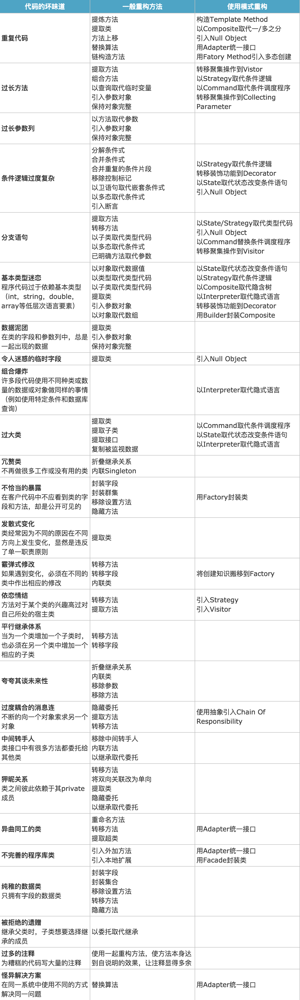

# Refactor

重构是一种对软件内部结构的改善，目的是在保证既有功能的外部行为不变的前提下，对其代码设计做出优化，去除坏味道

* 时刻保证代码质量
* 随着系统的演进，重构代码也是不可避免

## 为什么要重构

* No code is perfect(不要怕删除代码)
* 改进设计
  - 消除坏味道
  - 提高可扩展性
* 提高可读性
  - 代码是写给人看的而不是编译器
  - 明确的表达业务意图
* 帮助发现Bug

## 什么时候重构

* 新增功能时
* Code review时
* 代码有坏味道

## 坏味道

* Duplicated Code(重复代码)
  - 如果在一个以上的地点看到相同的程序结构，设法将他们合而为一，程序会变得更好
  - 同一个类的两个函数含有相同的表达式，采用Extract Method(提炼函数)提炼出重复的代码
  - 两个互为兄弟的子类含有相同的表达式，首先对两个类都使用Extract Method(提炼函数)，然后再对提炼出来的代码使用Pull Up Method(函数上移)，将它推入超类
  - 如果代码之间只是类似，并非完全相同，运用Extract Method(提炼函数)将相似部分和差异部分分割开，然后可以运用Form Template Method(塑造模板函数)获取一个莫模板方法
  - 如果有些函数以不同算法做相同的事情，你可与选择其中较清晰的一个，使用Substitute Algorithm(替换算法)将其他函数的算法替换掉
  - 如果两个毫不相关的类出现重复代码，应考虑对其中一个使用Extract Class(提炼类)，将重复代码提炼到一个独立的类中
  - 重复代码所在的函数应该只属于某一个类，另一个类调用它；或者应该属于第三个类，另两个类引用这第三个类。决定重复函数的最合适位置，确保只有一份
* Long Method(过长函数)
  - 拥有短函数的对象会活的比较好、比较长。
  - 绝大部分情况下，要把函数变小，只需要使用Extract Method(提炼函数)。
  - 使用Extract Method(提炼函数)时，如果函数中有个别参数和临时变量，可以把他们当做参数，传递给被提炼出来的新函数。
  - 如果被提炼函数内有大量的参数和临时变量，可以运用Replace Temp with Query(以查询取代临时变量)来消除这些临时元素。
  - 使用Introduce Parameter Object(引入参数对象)可以将过长的参数列变得更简洁一些。
  - 如果被提炼函数仍然有太多临时变量和参数，可以使用Replace Method with Method Object(以函数对象取代函数)。
  - 注释通常能够指出应该被提炼的代码。就算只有一行代码，如果它需要以注释来说明，那也值得将它提炼到独立函数去。
  - 可以使用Decompose Conditional(分解条件表达式)处理条件表达式。
  - 你应该将循环和其内的代码提炼到一个独立的函数中。
* Large Class(过大的类)
  - 如果想利用单个类做太多事情，其内往往就会出现太多实例变量。一旦如此，重复代码也就接踵而至了。
  - 可以运用Extract Class(提炼类)将几个彼此相关的实例变量一起提炼至新类内。如果被提炼出的类适合作为一个子类，使用Extract Subclass(提炼子类)往往比较简单。
  - 有时候类并非所有时刻都使用所有实例变量。你可以多次使用Extract Class(提炼类)或Extract Subclass(提炼子类)。
  - 和“太多实例变量”一样，类内如果有太多代码，也是代码重复、混乱并最终走向死亡的源头。
  - 如果有五个“百行函数”，他们之中有很多代码相同，那么你也许可以把他们变成五个“十行函数”和十个提炼出的“双行函数”。
  - 和“太多实例变量”一样，类内如果有太多代码，往往也适合使用Extract Class(提炼类)或Extract Subclass(提炼子类)。
  - 如果你的过大的类是一个GUI类，你可能需要把数据和行为移到一个独立的类中。
* Long Parameter List(过长参数列)
  - 太长的参数列难以理解，太多参数会造成前后不一致、不易使用。
  - 刚开始学习编程时，老师教我们：把函数所需的所有东西都以参数传递进去。这可以理解，因为除此之外只能选择全局数据，而全局数据是邪恶的东西。
  - 对象技术改变了这一情况：如果你手上没有所需的东西，总可以叫另一个对象给你。有了对象，函数需要的东西多半可以在函数的宿主类中找到。面向对象程序中的函数，其参数列通常比在传统程序中短的多。
  - 如果向已有的对象发出一条请求就可以取代一个参数，那么你应该激活重构手法Replace Parameter with Method(以函数取代参数)。
  - 你还可以运用Preserve Whole Object(保持对象完整)将来自同一对象的一堆数据收集起来，并以该对象替换他们。
  - 如果某些数据缺乏合理的对象归属，可使用Introduce Parameter Object(引入参数对象)为他们制造出一个“参数对象”。
  - 这里有一个例外：有时候明显不希望造成“被调用对象”与“较大对象”间的某种依赖关系。这时候将数据从对象拆解出来单独作为参数，也很合情合理。但是请权衡其所引发的代价。
* Divergent Change(发散式变化)
  - 我们希望软件能够更容易被修改。一旦需要修改，我们希望能够跳到系统的某一点，只在该处做修改。
  - 如果某个类经常因为不同的原因在不同的方向上发生变化， Divergent Change(发散式变化)就出现了。
  - 针对某一外界变化的所有相应修改，都只应该发生在单一类中。为此，应该找出某特定原因而造成的所有变化，运用Extract Class(提炼类)将他们提炼到另一个类中。
* Shotgun Surgery(散弹式修改)
  - Shotgun Surgery(散弹式修改)类似Divergent Change(发散式变化)，但恰恰相反。
  - 如果每遇到某种变化，你都必须在许多不同的类内做出许多小修改，你所面临的坏味道就是Shotgun Surgery(散弹式修改)。
  - 如果需要修改的代码散布四处，你不但很难找到他们，也很容易忘记某个重要的修改。
  - 你应该使用Move Method(搬移函数)和Move Field(搬移字段)把所有需要修改的代码放进同一个类。
  - 如果眼下没有合适的类可以安置这些代码，就创造一个。通常可以运用Inline Class(将类内联化)把一系列相关行为放进同一个类。
  - Divergent Change(发散式变化) 是指“一类受多种变化的影响”。
  - Shotgun Surgery(散弹式修改)则是指“一种变化引起多个类响应修改”。这两种情况你都希望整理代码，使“外界变化”与“需要修改的类”趋于一一对应。
* Feature Envy(依恋情节)
  - 对象技术即是一种“将数据和对数据的操作行为包装在一起”的技术。
  - Feature Envy(依恋情节)指的是：函数对某个类的兴趣高过对自己所处类的兴趣。
  - 常常看到某个函数为了计算某个值，从另一个对象那儿调用了几乎半打的取值函数。此时，应该使用Move Method(搬移函数)把它移到它该去的地方。
  - 先使用Extract Method(提炼函数)，将这个函数分解为数个较小函数并分别置于不同地点，有助于Move Method(搬移函数)重构手法的实施。
  - 如果一个函数用到几个类的功能，那么需要判断哪个类拥有最多被此函数使用的数据，然后就把这个函数和那些数据摆在一起
* Data Clumps(数据泥团)
  - 数据项就像小孩子，喜欢成群结队地待在一块儿。这些总是绑在一起出现的数据真应该拥有属于它们自己的对象。
  - 首先运用Extract Class(提炼类)将他们提炼到一个独立对象中，然后将注意力转移到函数签名上，运用Introduce Parameter Object(引入参数对象)或Preserve Whole Object(保持对象完整性)为它减肥。这样做可以缩短参数列，简化函数调用。
  - 如果删掉众多数据中的一项，其他数据不再有意义，那么他们应该以一个对象的形式存在。
  - 一旦拥有新对象，你就有机会让程序散发出一种芬芳。可以将适当的程序行为移至新类。不必太久，所有的类都将在他们的小小社会中发挥价值。
* Primitive Obsession(基类类型偏执)
  - 大多数编程环境都有两种数据：结构类型允许你将数据组织成有意义的形式；基本类型则是构成结构类型的积木块。
  - 对象技术的新手通常不愿意在小任务上运用小对象——像是结合数值和币种money类、由一个起始值和一个结束值组成的range类、电话号码或邮政编码等的特殊字符串。
  - 你可以运用Replace Data Value with Object(以对象取代数据值)将原本单独存在的数据值替换为对象，从而走出洞窟，进入炙手可热的对象世界。
  - 如果想要替换的数据值是类型码，而它并不影响行为，则可以运用Replace Type Code with Class(以类取代类型码)将它换掉。
  - 如果有与类型码相关的条件表达式，可运用Replace Type Code with Subclass(以子类取代类型码)或Replace Type Code with State/Strategy(以State/Strategy取代类型码)加以处理。
  - 如果有一组应该总是被放在一起的字段，可运用Extract Class(提炼类)。
  - 如果在参数列中看到基本类型数据，不妨试试Introduce Parameter Object(引入参数对象)。
  - 如果发现自己正从数组中挑选数据(数组中的元素各自代表不同的东西)，可运用Replace Array with Object(以对象取代数组)。
* Switch Statements(Switch惊悚现身)
  - 面向对象程序的一个最明显特征就是：少用switch语句。从本质上说，switch语句的问题在于重复。面向对象中的多态概念可为此带来优雅的解决办法。
  - 使用Extract Method(提炼函数)将switch语句提炼到一个独立函数中，再以Move Method(搬移函数)将它搬移到需要多态性的那个类里。
  - 必须决定是否使用Replace Type Code with Subclass(以子类取代类型码)或Replace Type Code with State/Strategy(以State/Strategy取代类型码)。一旦这样完成继结构之后，就可以运用Replace Conditional with Polymorphism(以多态取代条件表达式)了。
  - 如果只是在单一函数中使用switch语句，多态就有点杀鸡用牛刀了。这种情况下Replace Parameter with Explicit Methods(以明确函数取代参数)是个不错的选择。如果你的选择条件之一是null，可以试试Introduce Null Object(引入null对象)。
* Parallel Inheritance Hierarchies(平行继承体系)
  - Parallel Inheritance Hierarchies(平行继承体系)其实是Shotgun Surgery(散弹式修改)的特殊情况。在这种情况下，每当你为某个类添加一个子类，必须也为另一个类相应增加一个子类。
  - 让一个继承体系的实例引用另一个继承体系的实例。如果再接再厉运用Move Method(搬移函数)和Move Field(搬移字段)，就可以将引用端的继承体系消弭于无形。
* Lazy Class(冗赘类)
  - 创建的每一个类，都得有人去维护它。如果一个类的所得不值其身价，就应该消失。
  - 如果某些子类没有做足够的工作，试试Collapse Hierarchy(折叠继承体系)。
  - 对于几乎没用的组件，你应该以Inline Class(将类内联化)对付他们。
* Speculative Generality(夸夸其谈未来性)
  - 当有人说“噢，我想我们总有一天需要做这事”，并企图以各式各样的钩子和特殊情况来处理一些非必要的事情，这种坏味道就出现了。
  - 如果所有装置都会被用到，那就值得那么做；如果用不到，就不值得。用不上的装置只会挡你的路，所以，把它搬开吧。
  - 如果你的某个抽象类其实没有太大作用，请运用Collapse Hierarchy(折叠继承体系)。
  - 不必要的委托可运用Inline Class(将类内联化)除掉。
  - 如果函数的某些参数未被用上，可对它实施Remove Parameter(移除参数)。
  - 如果函数名称带有多余的抽象意味，应该对它实施Rename Method(函数改名)，让它更现实一些。
* Temporary Field(令人迷惑的暂时字段)
  - 有时会看到这样的对象：其内某个实例变量仅为某种特定情况而设。这样的代码让人不宜理解，因为通常认为对象在所有时候都需要它的所有变量。
  - 请使用Extract Class(提炼类)给这个可怜的孤儿创造一个家，然后把所有和这个变量相关的代码都放进这个新家。
  - 或许还可以使用Introduce Null Object(引入Null对象)在变量不合法的情况下创建一个Null对象，从而避免写出条件式代码。
  - 如果类中有一个复杂算，需要好几个变量，实现者不希望传递一长串参数，所以他把这些参数放进字段中，导致坏味道。这些字段只在使用该算法时才有效，你可以利用Extract Class(提炼类)把这些变量和其相关函数提炼到一个独立类中。提炼后的新对象将是一个函数对象。
* Message Chains(过度耦合的消息链)
  - 如果你看到用户向一个对象请求另一个对象，然后再向后者请求另一个对象，然后再请求另一个对象……这就是消息链。
  - 应该使用Hide Delegate(隐藏“委托关系”)。
  - 先观察消息链最终得到的对象时用来干什么的，看看能否以Extract Method(提炼函数)把使用该对象的代码提炼到一个独立函数中，再运用Move Method(搬移函数)把这个函数推入消息链。
* Middle Man(中间人)
  - 对象的基本特征之一就是封装——对外部世界隐藏其内部细节。封装往往伴随委托。
  - 人们可能过度运用委托。你也许会看到某个类接口有一半的函数都委托给其他类，这样就是过度运用。
  - 这时应该使用Remove Middle Man(移除中间人)，直接和真正负责的对象打交道。
  - 如果这样“不干实事”的函数只有少数几个，可以运用Inline Method(内联函数)把他们放进调用端。
  - 如果这些中间人还要其他行为，可以运用Replace Delegation with Inheritance(以继承取代委托)把它变成实责对象的子类，这样你既可以扩展原对象的行为，又不必负担那么多的委托动作。
* Inappropriate Intimacy(狎昵关系)
  - 有时你会看到两个类过于亲密，花费太多时间去探究彼此的私有成分。如果这发生在两个“人”之间，我们不必做卫道士；但对于类，我们希望他们严守清规。
  - 可以采取Move Method(搬移函数)和Move Field(搬移字段)帮他们划清界限，从而减少狎昵关系。
  - 你也可以看看是否可以运用Change Bidirectional Association to Unidirectional(将双向关联改为单向关联)，让其中一个类对另一个斩断情丝。
  - 如果两个类实在是情投意合，可以运用Extract Class(提炼类)把两者共同点提炼到一个安全地点，让他们坦荡地使用这个新类。或者也可以尝试运用Hide Delegate(隐藏“委托关系”)让另一个类来为他们传递相思情。
  - 继承往往造成过度亲密，因为子类对超类的了解总是超过后者的主观愿望。如果你觉得是该让这个孩子独自生活了，请运用Replace Inheritance with Delegation(以委托取代继承)让它离开继承体系。
* Alternative Classes with Different Interfaces(异曲同工的类)
  - 如果两个函数做同一件事，却有着不同的签名，请运用Rename Method(函数改名)根据他们的用途重新命名。
  - 反复运用Move Method(搬移函数)将某些行为移入类，直到两者的协议一致为止。如果你必须重复而赘余地移入代码才能完成这些，或许可运用Extract Superclass(提炼超类)为自己赎点罪。
* Incomplete Library Class(不完美的库类)
  - 复用常被视为对象的终极目的。许多编程技术都建立在程序库的基础上。
  - 库类构筑者没有未卜先知的能力，我们不能因此责怪他们。库往往构造的不够好，而且往往不可能让我们修改其中的类使它完成我们希望完成的工作。
  - 如果你只想修改库类的一两个函数，可以运用Introduce Foreign Method(引入外加函数)；如果想要添加一大堆额外行为，就得运用Introduce Local Extension(引入本地扩展)。
* Data Class(幼稚的数据类)
  - 幼稚的数据类是指：他们拥有一些字段，以及用于访问(读写)这些字段的函数，除此之外一无长物。
  - 这样的类只是一种不会说话的数据容器，他们几乎一定被其他类过分细锁地操纵着。
  - 应该运用Encapsulate Collection(封装集合)把他们封装起来。对于那些不该被其他类修改的字段，请运用Remove Setting Method(移除设值函数)。
  - 找出这些取值/设值函数被其他类运用的地点。尝试Move Method(搬移函数)把那些调用行为搬移到Data Class(幼稚的数据类)来。如果无法搬移整个函数，就运用Extract Method(提炼函数)产生一个可被搬移的函数。不久以后你就可以运用Hide Method(隐藏函数)把这些取值/设置函数隐藏起来了。
  - Data Class(幼稚的数据类)就像小孩子。作为一个起点很好，但若要让它们像成熟的对象那样参与整个系统的工作，它们就必须承担一定责任。
* Refused Bequest(被拒绝的遗赠)
  - 子类应该继承超类的函数和数据。但如果他们得到所有礼物，却只从中挑选几样来玩！又该怎么办呢？
  - 按传统做法，你需要为这个子类新建一个兄弟类，再运用Push Down Method(函数下移)和Push Down Field(字段下移)把所有用不到的函数从超类下推给那个兄弟。这样，超类就只持有所有子类共享的东西。
  - 不建议胡乱修改继承体系，应该运用Replace Inheritance with Delegation(以委托取代继承)来达到目的。
* Comments(过多的注释)
  - 注释本身不是一种坏味道，事实上他们还是一种香味呢。
  - 有时候，注释之所以存在乃是因为代码很糟糕。把注释当做除臭剂是一种坏味道。
  - 很多时候，注释可以帮助我们找到代码的坏味道。找到坏味道之后，我们首先应该以各种重构手法把坏味道去除。完成之后我们常常会发现：注释已经变得多余了，因为代码已经清晰说明了这一切。
  - 如果需要注释来解释一块代码做了什么，试试Extract Method(提炼函数)；如果函数已经提炼出来，但还是需要注释来解释其行为，试试Rename Method(函数改名)；如果需要注释说明某些系统的需求规格，试试Introduce Assertion(引入断言)。
  - 当感觉需要撰写注释时，请先尝试重构，试着让所有注释都变得多余。
  - 注释应该用来记述将来的打算、标记你并无十足把握的区域。你可以在注释里写下自己“为什么做某某事”。这类信息可以帮助将来的修改者，尤其是那些健忘的家伙。

## 方法

* 大型重构:对顶层代码设计的重构，包括：系统、模块、代码结构、类与类之间的关系等的重构
  - 分层、模块化、解耦、抽象可复用组件
* 小型重构:对代码细节的重构
  - 规范命名、规范注释、消除超大类或函数、提取重复代码
  - 提取类或接口
    + 在父子类之间转移方法
      * Pull Members Up 选项将子类方法上移到父类中
      * Push Members Down
  - 提取方法、变量、字段
    + Extract:封装方法
  - 变量
  - 重命名
  - 重构接口
    + 抽象出来构建一个接口
* 封装变量、参数
* 用多态替换条件
* 重构依赖于单元测试和可测试的代码（即短小、可 mock 的代码）

## 层次

* 业务架构的审查重构:这是最高层次的代码审查重构。其实，这个阶段的审查并未真正涉及到具体的代码实现，而是针对客户需求，对相应的业务逻辑的设计进行审查，目的在于使业务逻辑架构的设计与用户需求保持精确一致。
  - 审查复杂且完整的业务逻辑的架构，比如支付相关的业务逻辑架构，导航，map，语音相关的业务等等。这个层次的审查需要我们充分了解相关的业务知识，进而审查业务架构的合理性与准确性。以支付为例，我们需要熟悉支付方式以及支付的整个流程，另外还有其中涉及的一些关键问题。最终确保我们的业务逻辑的架构设计符合这一系列的需求。
  - 审查简单的单个功能点的业务逻辑设计实现，例如用户的注册与登录功能。我们需要确保这些业务逻辑的设计完全符合UX的设计，并最终符合用户需求。
* 代码架构的审查重构:项目中采用的具体的架构模式，目的在于审查代码是否符合架构模式。在我们目前的项目中采用的是mvvm架构模式，因此在这个层次的代码审查的时候应注重审查代码是否遵循了mvvm的基本原则。
  - View部分：其中包含了view组件以及ViewController主要的功能应在于处理界面的显示，而不应有任何的业务逻辑的处理；
  - ViewModel部分：应主要负责业务逻辑的处理，并不涉及任何页面的展示逻辑。
  - Model部分：应主要负责业务数据模型的建立，使用它可以根据业务逻辑建立相应的业务数据。
* 设计模式的审查重构:主要针对的是面向对象开发中的类之间的组织结构以及类自身行为属性的设计，这可能就会涉及到一些设计模式的使用。通过使用设计模式，可以使我们的代码更加的可复用，可扩展以及可测试。这是我们这个阶段进行设计模式的审查重构的目的。然而设计模式的过度使用也会使代码陷入“万恶的深渊”，提前设计与设计过度同样不可取。
  - 代码应尽量保持简单，只有在必要的时候才使用设计模式，避免过度设计与提前设计。
  - 设计应遵循面向对象编程的SOLID原则。
  - 使用规范化的设计模式的“术语”编写，如设计模式中类的命名等相关“术语”应标准化，规范化。
  - 使用结构型设计模式进行类的组织结构设计。这其中包括：Composite, Decorator, Adapter, Bridge, Facade, Proxy, Flyweight。
  - 使用行为型设计模式进行类方法的设计, 进行封装变化，对象做为参数的封装，对象间通信，类间解耦合。包括：Strategy, State, Template method, Visitor, Command, Memento, Observer, Mediator, Iterator, Interpreter, Chain of responsibility。
  - 使用创建型设计模式进行类型的创建初始化。它包括：Factory method, Abstract factory, Builder, Prototype, singleton。
* 最优算法的审查重构:审查重构针对的是代码算法的使用，主要审查面向对象类中方法的算法设计实现。这里说的算法的使用并非一定要使用那些经典的算法，例如排序算法，查找算法等，而指的是使用合理的数据结构进行时间与空间最优化的代码编写，不分配不必要的空间，尽量设计时间复杂度更低的的代码段。总之，设计更为高效的代码段。
* 语言与代码规范的审查重构
  - 语言最佳实践的审查与重构:代码编写首先应符合使用的编程语言的语法规范，除此之外，我们还应该努力践行编程语言的最佳实践，比如尽量使用语言已提供的库中的API，避免重复建造轮子。我们项目中采用的是swift语言，在涉及到集合类的遍历处理的时候，我们不应该自己编写for in loop来实现遍历的功能，而应使用集合类的从sequenceType中继承而来的foreach方法，通过闭包的方式讲要处理的行为变量传人，从而实现遍历处理的功能。
  - 代码风格的规范的审查与重构:统一的代码风格规范是团队开发的重要要素之一。代码规范的统一有利于代码的阅读维护，有利于代码的“集体所有制”。
    + 命名：使用帕斯卡命名法命名类名，即名称中每个单词首字母大写，采用形容词+名词的形式；驼峰法命名函数与属性，即名称中除第一个单词首字母小写外，其他单词首字母均大写。函数命名采用动词+名词的组合形式。属性命名采用形容词+名词的形式。通过使用有意义的命名，使属性与函数通过名称可以自我表达，从而取代注释。
    + 函数：保证每个函数的单一功能性，让每个函数只做一件事情。采用“To”方法编写函数，就是将函数分步编写，使每个步骤单独成为一个新的函数。函数参数个数应尽量减少，可以封装在一起的尽量封装起来。
    + 避免重复：应避免代码的随处拷贝，拷贝是重复的根源之一。应将可复用的部分提取出来，供不同的使用者调用。
    + 代码一致性：一致性可以使代码更整洁美观。项目中为了保持一致性，我们需要一些约定俗成的事情，例如命名规则，要不要使用宏定义等等。
    + 去除魔幻数：不应在代码中硬编码一些数据，比如：expectedValue = actualValue*5 + 20，类似这种代码，没人能看明白代码中的5和20是神马意思。我们可以使用宏定义或者创建静态属性的方式实现，定义成为可被理解阅读的代码。
    + 封装条件表达式中的条件判断：代码中的条件表达式中如果有很多的条件判断时，对于阅读代码的人来说，很难读懂到底为了判定什么东西设立的这些条件。将条件表达式中的条件判断封装成为一个单独的方法，并命名一个有意义的名称，可以极大的提高代码的可读性。
    + 函数异常处理：保持代码的安全性，需要时刻注意异常的处理。异常处理分为两个部分，首先是空值的判定，避免程序因空值造成的crash。空值判定主要包括函数参数的空值判定以及内部局部变量的空值判定；其次是异常的处理，比如io异常等等。
    + 单元测试：单元测试的重要性相信大家都应该清楚，只是鉴于开发进度压力，往往被忽视。对于小型并不复杂的项目而言，可能单元测试的作用没有完全体现出来，但是对于复杂度很高，团队规模较大的项目而言，单元测试就无比重要了。我目前所做的项目，复杂度非常高，团队规模也很大，并且需要与欧美团队协同开发，因此保证单元测试的代码覆盖度非常重要。因此，应保证每段代码都应被单元测试覆盖。
    + 多线程并发处理。开发中会经常涉及到多线程的问题，因此多线程的并发处理需要高度重视，很多问题就是由于多线程并发造成。

## 能力

* UT 覆盖率
* 代码复杂度
* 代码耦合度
* 语言是否对 refactor 提供支持

## IDE重构

借助于 IDE 来对代码进行重构

* 编写代码的过程中，看到可以重构的地方，按下IDE 的快速键，迅速地完成战斗
* 应该作为日常开发的一部分，而不是额外的花费时间进行重构
* 只要能开始去改变，那就是一个好的开始
* 一种有限的代码质量改善

## 环境

让程序员能花时间去改善代码。但是，这种重构需要存在时间的限制

* 如果花几天、一天、两天的时间，要对之前一个月的代码重构，那么并不存在问题——业务在不断叠加，每隔一段时间都会出现代码、架构上的问题。这个时候的抢救，能及时把设计正确的方式。再往后推移，可能会影响整个系统的架构，成功地实现了 “千里之堤，溃于蚁穴”。
* 如果一处代码的重构，需要花费四五天的时间，那么就需要正视这个问题。它不是一个小问题，可能存在多个问题。对它的重构和改善，往往需要和团队里的资深程序员一起讨论。

## 图书

* 《架构腐化之谜》

## 参考

* [Js重构](https://github.com/hankzhuo/Blog/blob/master/JS/%E4%BB%A3%E7%A0%81%E9%87%8D%E6%9E%84.md)
* [代码审查与重构的5个层次](http://www.techug.com/post/five-level-of-code-review.html)
* [refactoring-kata](https://github.com/aikin/refactoring-kata):Refactoring Kata：涵盖所有重构手法练习的栗子和测试。重构刻意练习。
