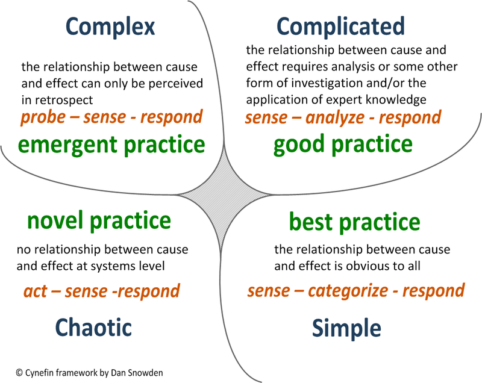

# Cynefin

* 1999年被Dave Snowden开发出来
* 问题划分到5个域中
  - 简单（Simple）问题，该域中的因果关系非常明显，解决这些问题的方法是感知-分类-响应（Sense-Categorise-Respond），有对应的最佳实践
  - 复合（Complicated）问题，该域中的因果关系需要分析，或者需要一些其他形式的调查和/或专业知识的应用，解决这些问题的方法是感知-分析-响应（Sense-Analyze-Respond），有对应的好的实践
  - 复杂（Complex）问题，该域中的因果关系仅能够从回顾中发现，解决这些问题的方法是探索-感知-响应（Probe-Sense-Respond），我们能够感知涌现实践（emergent practice）
  - 混乱（Chaotic）问题，该域中没有系统级别的因果关系，方法是行动-感知-响应（Act-Sense-Respond），我们能够发现新颖实践（novel practice）
  - 失序（Disorder）问题，该域中没有因果关系，不可感知，其中的问题也无法被解决

## 参考

* 
