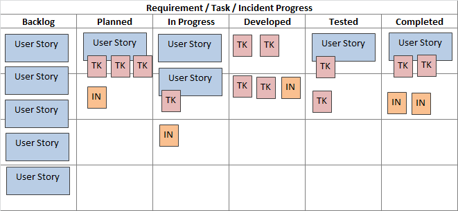

# 看板Kanban（可视化工作流）

* 一个敏捷框架，有时也叫工作流管理系统，帮助团队可视化工作从而最大化效率
* 通常由数字或物理展示板来呈现,团队的工作在展示板上随着进度而移动，例如从未启动到进行中，一直到测试中、已完成
* 每个团队成员可以随时查看到所有工作的状态
    - Todo （待开发）
    - Plan （计划）
    - Develop （开发）
    - Test （测试）
    - Deploy （部署）
    - Done （已完成）
* 所有需要完成的任务，都做成卡片，贴在一块白板上面

