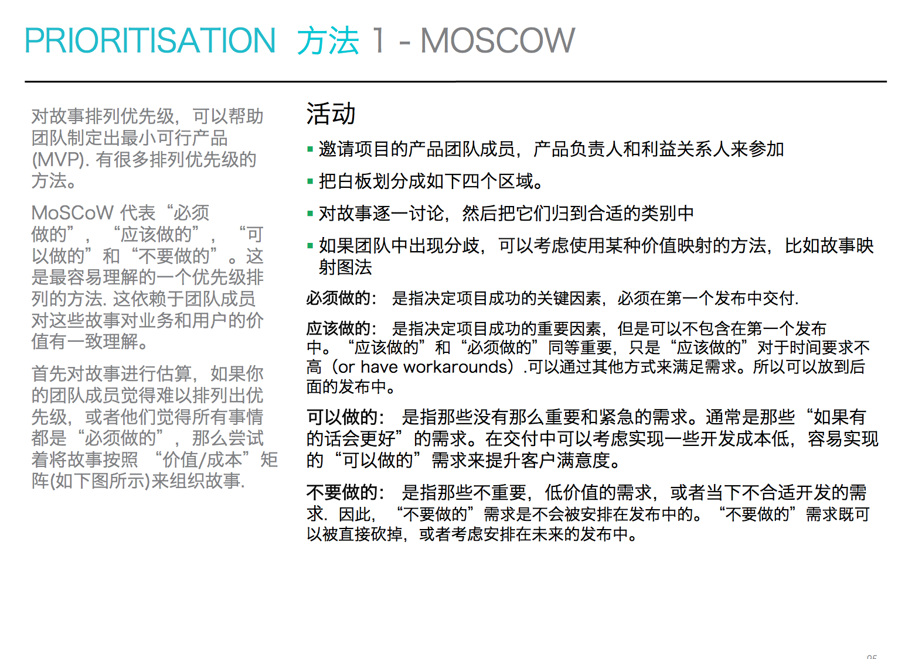
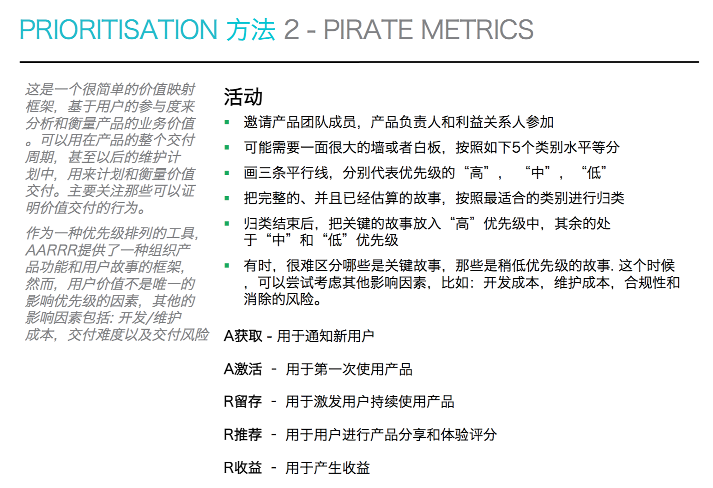
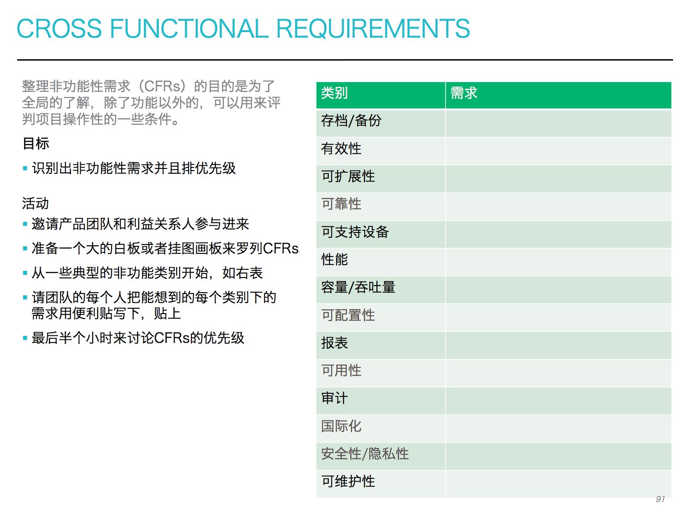
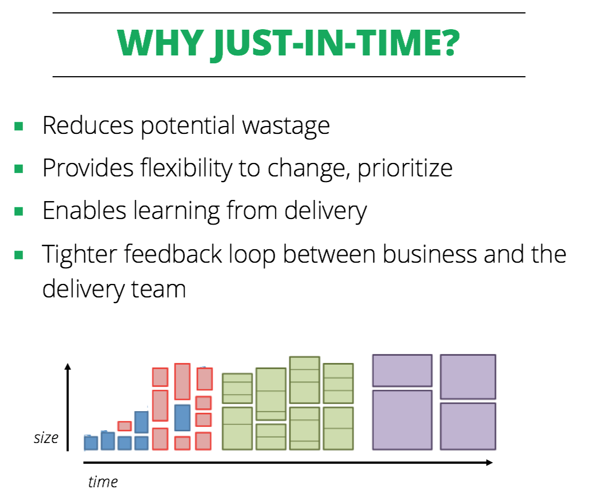
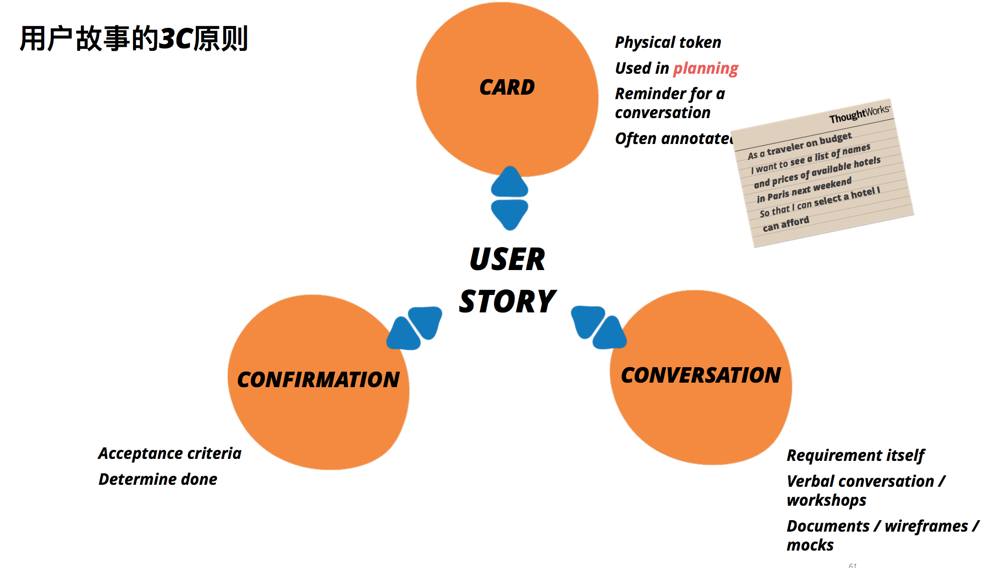
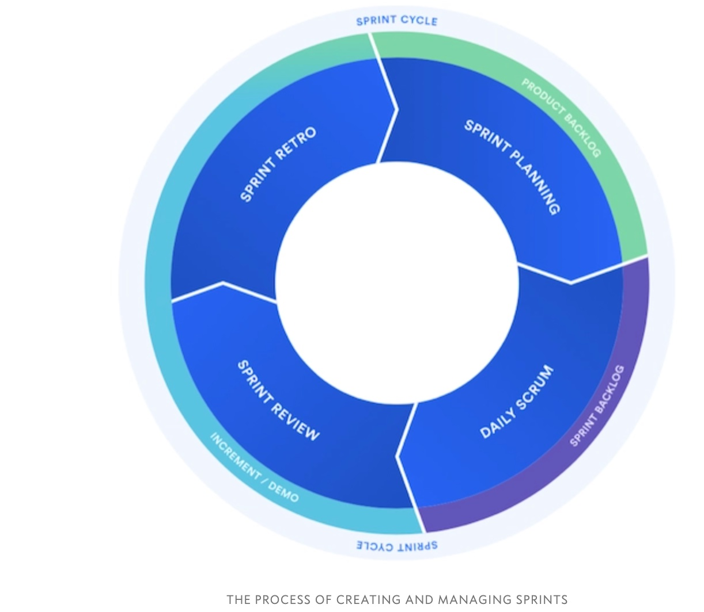

# [Scrum](https://www.scrum.org/)

* 一种敏捷开发框架，是一个增量的、迭代的开发过程，具备可视、可集成和可运行使用的特征
* 采用该框架的团队通常由一个 Scrum 教练、产品经理和开发人员组成，该团队以跨职能、自主的工作方式运作，能够加快软件交付速度从而给客户带来巨大的商业价值。其关注点是较小增量的快速迭代
  - 一个团队有自己的代办事项，对代办事项进行拆小。
  - 按客户价值进行优先级排序，产品经理负责价值排序。
  - 小而稳定，跨职能团队。
  - 多个团队松耦合（依赖性比较低），对齐迭代时间和战略目标。
* 只写有必要的文档，或尽量少写文档，敏捷开发注重的是人与人之间，面对面的交流
* 迭代是指把一个复杂且开发周期很长的开发任务，分解为很多小周期可完成的任务，这样一个周期就是一次迭代的过程；同时每一次迭代都可以生产或开发出一个可以交付的软件产品。
* Scrum 的英文意思是橄榄球运动的一个专业术语，表示 “争球” 的动作
* Scrum以经验性过程控制理论（经验主义）做为理论基础的过程。经验主义主张知识源于经验,以及基于已知的东西做决定。Scrum 采用迭代、增量的方法来优化可预见性并控制风险。Scrum 的三大支柱支撑起每个经验性过程控制的实现
  - 透明性（Transparency） 透明度是指，在软件开发过程的各个环节保持高度的可见性，影响交付成果的各个方面对于参与交付的所有人、管理生产结果的人保持透明。管理生产成果的人不仅要能够看到过程的这些方面，而且必须理解他们看到的内容。也就是说，当某个人在检验一个过程，并确信某一个任务已经完成时，这个完成必须等同于他们对完成的定义。
  - 检验（Inspection） 开发过程中的各方面必须做到足够频繁地检验，确保能够及时发现过程中的重大偏差。在确定检验频率时，需要考虑到检验会引起所有过程发生变化。当规定的检验频率超出了过程检验所能容许的程度，那么就会出现问题。幸运的是，软件开发并不会出现这种情况。另一个因素就是检验工作成果人员的技能水平和积极性。
  - 适应（Adaptation） 如果检验人员检验的时候发现过程中的一个或多个方面不满足验收标准，并且最终产品是不合格的，那么便需要对过程或是材料进行调整。调整工作必须尽快实施，以减少进一步的偏差
* 团队承诺在固定时间段内完成一组用户故事。一般来说，冲刺是一，二，四周。由队伍决定冲刺的长度。一旦确定了冲刺节奏，团队将永远按照这种节奏运作。只要拥有几个完成的冲刺的数据，固定长度的冲刺能增强评估技能，并且能够预测团队的未来速度
* Scrum包括了两个方面的PDCA持续改进
  - 一方面是产品的持续改进
  - 另一方面是开发过程的持续改进。需要组织的专业管理支持
    + 实习生进公司后，根本不了解业务、系统，也缺乏软件工程经验。这种情况下，如果让他们进Scrum团队，基本上干活就等于“埋雷”，这会严重拖累团队.需要进行集中的专业教育，组织学习业务、系统和工程技术，并做一些虚拟项目来掌握这些知识和能力。直到这些都基本掌握了，才能安排他们进Scrum团队
    + 以往都只做手工测试，现在要搞自动化测试。而各个Scrum团队往往都面临着巨大的业务交付压力，没有时间去研究自动化测试技术

```
Scrum is a framework that helps teams work together by encouraging teams to learn through experiences, self-organize while working on a problem, and reflect on their wins and losses to continuously improve.

Atlassian Agile Coach
```
## 价值

* 承诺 – 愿意对目标做出承诺
* 专注– 把你的心思和能力都用到你承诺的工作上去
* 开放– Scrum 把项目中的一切开放给每个人看
* 尊重– 每个人都有他独特的背景和经验
* 勇气– 有勇气做出承诺，履行承诺，接受别人的尊重

## 组织架构设计

* 在敏捷的组织架构设计时，要兼顾“业务交付”和“专业管理”两条线。例如，业界常用的“教授-企业家”模型
  - “业务交付”：交付什么价值，以及按什么样的顺序和节奏来交付
  - “专业管理”：如何为Scrum团队培养合格的专业人员，如何打造高效的组织级专业能力，以实现更加高效和高质量的价值交付

### 组建专业线

  - 建立专业线组织
    + 最核心人员是专业线负责人（有的组织称作“专业线带头人”）。组织通常会设置一名专业线负责人管理本专业的建设工作。这位负责人通常是本专业领域的资深专家，全职投入到专业线工作中。
    + HR部门还会派一名HRBP（HR Business Partner），协助专业线负责人来开展专业线工作。
    + 当组织规模上升到一定程度时，专业线负责人就需要有几名技术专家协助其开展专业线工作，通常这些人也是Scrum团队的技术教练。
    + 这些技术教练，可以是全职的，也可以是轮职的，一般不建议是兼职的，因为兼职人员往往会忙于团队开发工作而无法保证对专业线的投入。对于轮职的技术教练，每年会有部分时间在Scrum开发团队全职从事开发工作，部分时间在专业线全职担任技术专家/技术教练。
    + 所有专业人员都是专业线的成员，需要接受专业线在专业技术上的管理。
  - 运作
    + 学习、引入和推广新的专业技术，组织进行各类专业技术交流和培训活动，提升组织及各Scrum团队的专业主义氛围和专业技术能力。
    + 建立、发布和维护组织的专业技术体系，包括各类标准、指南、工具、模板、知识库等。
    + 必要时，进入Scrum团队，参与关键的技术分析和评审工作，协助解决专业技术问题，或辅导团队成员掌握新的专业技术
  - 对于一定规模以上的组织，专业线还可能会有以下工作内容：
    + 定义专业技术等级、能力模型及其成长路线图。
    + 组织进行人员的专业技术等级评估。
    + 组织进行专业人员的成长规划和实施。
* 实践社区(COPCommunity of Practice)
  - 实践社区是将对某一特定知识领域感兴趣的人联系在一起的网络。大家自愿组织起来，围绕这一知识领域共同工作和学习，并共同分享和发展该领域的知识。专业线是组织中的官方组织，而实践社区则是组织中的民间组织。
  - 具有以下特征：
    + 实践社区通常由志愿者组成，人们可以凭兴趣爱好，自由地加入或者退出某个实践社区；
    + 每个实践社区都有专门的主题内容，涵盖有关核心知识领域，如某项技术或某门专业；
    + 实践社区会定期活动，往往有其组织者；
    + 不同的成员具有潜在的不同身份，如核心专家、外围成员等，这些成员通过其分享知识和帮助他人的行为而自动取得该身份，而非由组织正式任命；
    + 成员相互之间信任程度高；
    + 规模大小不限。
  - 实践社区作为非正式组织，为企业创造了大量的非正式沟通渠道，其沟通方式可以是：定期开会或仅利用午餐休息时间讨论，或纯粹以Email、讨论区、在线交谈等网络系统来相互联系。
  - 为组织带来收益：
    + 为发展、共享和管理专业知识提供便捷的非正式途径，极大地促进了知识和经验在组织内的传递。
    + 以问题为导向，主动探索和发现新的知识和技术，是组织正式专业技术发展的重要补充，为潜在的机会和威胁提供早期提醒和预警。
    + 打造了知识共享的文化，改善了组织的专业主义氛围。
    + 是一个组织在内部发掘专业技术人才的重要途径。
    + 能够极大地帮助组织建设和完善组织知识库。
  - 给组织成员带来好处：
    + 成员可以得到社区专家的帮助和指导，从而开阔视野，提升专业水平。
    + 成员也可以在工作中通过社区获得知识和得到帮助，提高工作的效率和质量。
    + 社区为成员发表个人的意见和想法提供了一个开放、自由交流、展示自己专业特长的平台，能够扩大成员的专业知名度。
  - 通过以下手段来引导和促进实践社区的良好运作：
    + 通过专业线来牵头成立实践社区，以及组织开展实践社区活动。
    + 为成员参与实践社区活动提供必要的时间、空间或者资源支持，例如：把每周五下午作为自由交流时间，对于实践社区给予一定经费支持，让HRBP协助组织实践社区活动等。
    + 提供必要的基础设施，例如：社区论坛、知识库、搜索引擎等。

## 团队架构

* 凝聚人的力量，紧密协（合）作。包括业务负责人、开发团队、客户、管理者之间的关系，所有这些关系在以前都是造成项目危机的原因之一，那么，在敏捷时代，需要这些角色 紧密合作，最大限度的发挥各个角色的力量.
* 聚焦客户价值，消除浪费（如何聚焦用户价值，即频繁的交付用户可工作的软件，快速收到用户反馈）

### 产品负责人 Product Owner PO

* 负责产品的需求、进度、目标

### Scrum Master SM 敏捷教练

* 负责阻挡外界对开发团队干扰，保证团队顺利工作
+ 帮助他们理解职责边界
    * 敏捷团队被告知他们是自组织的。但是，这并不意味着每个企业的自组织都完全一样。比如说： 团队是否有权将团队的技术需求添加到Sprint中？ 团队是否可以决定谁在这个团队中？ 团队是否可以在不询问Scrum Master的情况下改变他们的Sprint长度？ 在未经许可的情况下，团队可以在工具、团建活动或任何其它事情上花多少钱？ 等等等等，这个列表可以无限长
    * 当团队第一次被告知他们是自组织时，他们经常会很挣扎，因为他们不知道这意味着什么。作为Scrum Master，你需要帮助团队了解他们可以自由操作的职责边界
+ 让他们感觉到安全
    * 一项重要工作就是创造安全感。例如，团队能够进行Sprint计划，而不必担心如果他们没有完成他们预期的一切而被大吼大叫。
    * 团队需要交付高质量的成果，但是如果因为疏忽导致了一个生产环境的缺陷，团队诚实地承认错误，他们知道不会因此而遇到麻烦。
    * 当被问及完成这些功能需要多长时间时，团队能够真实地回答，而不用担心延期或者提前完成会产生不好的影响。
+ 赞美他们
    * 每个人都喜欢听到“你做的很好，太棒了”
    * 在我坐下来写这篇文章之前，我在遛狗的时候，遇到了一个女士带着一只漂亮的棕色拉布拉多犬，我说，“你这个狗狗很漂亮啊。”她的脸发亮，笑容满面。我猜她在狗狗的打扮上一定下了不少功夫，她显然非常感激这种赞美。
    * 你的团队成员也是一样的。当一个人做得很棒时，让他们知道。即使是简单的“你很棒！”也可以提供帮助。当然，态度要诚恳，一旦你开始寻找赞扬团队成员的机会，你会发现很多。
+ 支持他们
    * 团队需要你的支持。帮助团队移除障碍是你职责的一部分，但更重要的是，你应该努力在问题成为障碍之前将其移除。
    * 支持团队不仅仅是处理障碍。当你对他们始终诚实，并且让他们感到公平时，团队成员会感受到支持。
    * 言出必行，当你告诉团队成员你会做某事时，接着就完成它。你帮助团队，让他们对自己的承诺负责，对你自己要用同样或更高的标准。
    * 平易近人，如果你每天都是坏脾气，那你不可能指望团队成员在需要帮助时来找你。
    * 与团队成员交谈。不要说太多，以避免影响团队工作的推进，但你应该了解每个人在Sprint期间的表现。知道什么时候提供帮助，即使只是为了倾听，或者在某个早晨为某人带来一杯他最喜欢的咖啡。
+ 让他们感觉很牛
    * 遇到的最糟糕的Scrum Master们都有一个共同的特点：他们认为这一切都是为了让自己看起来很棒。在Sprint评审会上，这些Scrum Master会说“让我来给大家展示我团队的成果”。
    * Scrum Master的工作是让团队看起来很棒。这不是形式上的，而是感受到的。优秀的Scrum Masters帮助团队成员尽其所能。然后他们确保组织知道团队成员正在很好地进行他们的工作。
+ 知道什么时候打破规则
    * Scrum的规则很少，但它们存在的理由很充分。每个都有助于团队敏捷并增加成功的可能性。但是，正如俗话所说，规则意味着被打破。
    * 你的团队希望你在适当的时候可以打破规则。有时候常识占上风，而规则会妨碍常识。一个好的Scrum Master会认识到这些情况。例如，永远不要延长Sprint是我遵循的规则，通常是这样的。我打破了吗？是的，偶尔，而且总是有充分理由。
    * 3个小时是是Sprint回顾的时长上限。我的99％的回顾都是在更短的时间内完成的，通常时间要少得多。但是我辅导过的团队打破了3小时的规则吗？是的，我们偶尔会讨论一个非常热门的话题，而且似乎继续讨论比推迟要更好。
+ 如果没有和团队商议，请不要代表团队做任何承诺。
    * 作为一个Scrum Master，你没有任何权利代表团队接受需求变更，不管它有多小。即使你可以完全确定团队可以搞定它。你可以这么来回答：“我需要和团队沟通后再确认是否可以接受。”
    * 当然也不能在没有和团队商议的情况下承诺任何交付日期，交付物，或其它的任何东西。当然，你也许不必每次都召开全员会议来和大家沟通，有些情况下，团队内的部分相关成员经过沟通后也是可以做出决定的。但是，这仍然是团队的决定，而非你的决定。
+ 记住，你的目标是让团队看起来很棒。
    * 作为一个Scrum Master并不是要让自己看起来很棒。当团队看起来很棒的时候，你自然也看起来很棒。 当团队做得很好的时候，他们才看起来很棒。
    * 当团队外的人开始怀疑是否还需要你的时候，你知道你干的不错。是的，如果你的老板怀疑是否还需要你的时候，那就太可怕了。但是，一个好老板会知道你的技能和专业知识会使你显得不必要，而事实上你是不可或缺的。
    * 相信您的经理会明白显得不必要和实际上不需要之间的区别。
      +不要用敏捷规则手册来怼团队
    * Scrum和敏捷都没有附带规则手册（尽管有些人试图创建规则手册）。
    * 如果您的产品有用户，请考虑编写用户故事。但故事并非敏捷必需。如果有人需要知道你什么时候交付：请估算，如果没人想知道，也许你可以不做估算。如果您认为Sprint结束时做Sprint评审，收到反馈太晚，请在开发完每个功能时评审。
    * 保持敏捷是指尊重创造敏捷性的原则和价值观。如果你只是生搬硬套这些规则，你可能不会走得太远。
      +没有什么是永恒的，所以请验证你的过程
    * 尊重敏捷性原则的其中一个方面是验证您的过程。鼓励团队尝试新事物。
    * 你的团队是否喜欢为期两周的Sprint，并认为他们运行的完美无缺? 如果是的，那非常棒。现在让他们尝试一周或三周的冲刺并观察结果。实验可能并不总是受欢迎，但它们是确保您继续发现新的，更好的工作方式的最佳途径。
      +确保团队成员和利益干系人视彼此为同行
    * 团队成员和业务方利益干系人各自为产品开发计划带来了重要的视角。因此，每个人都需要得到平等的对待。
    * 如果双方出现隔阂，整个组织都会受到损害。开发团队需要了解利益干系人带来的独特视角，利益干系人需要尊重开发团队，包括倾听开发人员说：“这个截止日期是不现实的”。
      +保护团队，用比你想象的更多的方式
    * Scrum Master需要保护团队避免受到过于苛刻的产品负责人或利益干系人的影响，这是我们经常听到的对Scum Master的建议，这是个好建议。有时候，产品负责人很强势，只是简单地要求更快、更多。这会迫使团队牺牲质量，到头来困扰着项目。因此，一个优秀的Scrum Master可以保护团队不受此影响。
    * 你可能不知道，一个优秀的Scrum Master也应该防范团队陷入自满。优秀的Scrum团队会不断寻求改进。有些团队，可能不自觉的认为自己已经足够好了，他们的确有可能比敏捷之前有了显著的进步。但即使是最棒的团队，也经常有机会变得更好。卓越的Scrum Master保护团队，不会让他们感到没有任何东西需要学习。
      +把失败从你的词汇表中移除
    * 我偶尔会碰到一些团队，如果他们在Sprint结束时未能交付他们计划的所有内容，他们会将这个Sprint称为“失败的Sprint”。我不认为这是失败，特别是如果团队完成了大部分计划的条目，或者他们巧妙地处理了紧急情况。
    * 当篮球运动员将球投向篮筐并得分时，它被称为进球得分（Field Goals）。如果球员没投中，这就是所谓的投篮尝试（Field Goals Attempt）。不是失败，而是一次尝试。
    * 优秀的Scrum Master帮助团队调整他们的思维，以便他们认识到未能达到预期的Sprint和功能特性不是失败而是尝试。
      +经常赞美，但永远诚挚
    * 有一天，我告诉我十几岁的女儿，我为她感到骄傲，她立刻兴高采烈。这不应该让我感到惊讶。谁不想知道某人为他们感到骄傲？
    * 但她的反应让我意识到我不能经常告诉她这一点。我认为这相当于我告诉她一些明显的事情，比如“你很高”。但我知道事实并非如此。
    * 永远不要提供虚假的赞美。没有人想听到这个。但是，当你发现你的团队成员的工作做的很好的时候，请告诉他们。他们很可能不会经常听到。
      +鼓励团队接管你的工作
    * 对敏捷不熟悉的团队将重度依赖他们的Scrum Master或教练。团队可能不知道如何让每日站会在十五分钟内完成。或者他们可能不了解如何交错式地工作，以及建立跨职能团队的重要性。
    * 一个没有经验的球队也是如此。学习踢球的小孩的教练需要教会他们一切。当我的女儿们6岁的时候，他们的教练会在边线跑动，整场比赛大喊“踢，跑！”如果他不这么做，那么年轻球员就会忘记。即使他大喊大叫，偶尔也会有一些孩子坐在草地上发呆。
    * 将年幼孩子的教练与世界杯队的教练进行对比。在世界杯球队中，球员们已经学会了做什么。如果训练的时候，教练迟到了，球员知道用什么样的演练或练习开始一天的训练。世界杯教练不需要提醒球员踢球和跑动。但是世界杯球队永远不会告诉你他们根本不需要教练。
    * 无论敏捷团队有多好，我认为他们仍然可以从Scrum Master或者教练的辅导中受益。但是，优秀的敏捷团队会更加主动地去学习，以精通产品开发所需的技能。
+ 闭嘴听
    * 很多时候，聆听、保持沉默是最好的辅导，让团队自己找到答案。
    * 这可能很难。当你看到你的团队正在努力弄清楚要做什么时，很自然地想要插话并提供建议。但是如果你解决了问题，或者轻易地提供了建议，团队成员就会等着你为他们解决每一个问题。
    * 我不想暗示你不能提供任何建议。你是个聪明人，否则你就不会担任现在的角色了。但作为一名优秀的Scrum Master，要帮助团队学习如何自己解决问题。如果你解决了团队成员面临的每一个问题，他们就没有机会知道他们自己行不行，可否自己搞定这些问题了。
 
#### [敏捷教练软技能](https://xie.infoq.cn/article/98e8777893b6a50595c3f7419)

* 会听，时常会听到这样一句话，一名合格的敏捷教练
  - 学会善于倾听。在聆听对方讲话的同时，你需要时不时给他眼神的反馈和肯定，让他能够感受到，自己的倾诉有被认真对待，唯一要提醒自己的是千万不要打断发言者的谈话。做到这一点，就迈出了倾听的第一步
  - 在倾听的过程中，能够感知到发言人的情绪、个人状态等，在倾听的过程中，能够表现出共情的情绪反馈，这会让发言者感到场域的安全，进而更愿意表达内心想法。举个例子，当倾诉者在表达一种悲伤的情绪时，教练在此时呈现出嘴角弧度上扬的微笑，这会立刻打破安全的氛围，倾诉者会觉得你并不在意这次对话甚至在嘲笑他，对话会马上中止。因此，善于倾听，需要教练忍住嘴，用耳朵听，并能给出合适的情绪反馈。
* 会看，这一条其实不难理解，教练是为提升团队能量而存在的，正如赛龙舟上的鼓手，有节奏的鼓点给大家注入无尽的动力
  - 看事，意味着能够看清楚团队发生的一切，比如这个迭代的开发质量、测试是否延期、演示是否得到良好的反馈、需求变革的有效性等等，这些真实发生在迭代里的开发过程，教练都应该关注，能够看清楚事情背后的原因，从而才能帮助团队提升共创。这里的过程状态主要指一些定性的问题，并不是仪表盘里清晰的数据
  - 看人，团队成员都是独立个体，即使是一个良好的自组织团队，不同个体之间依然是特色鲜明迥异，不是每位成员都会时常有倾诉的意愿的，很多人更愿意把情绪隐藏，把话憋在心里不说，这时候教练的察言观色就尤为重要，在每个会议上，看出成员的情绪和态度，给予合适的引导，才能事半功倍。
* 会说（引导），引导技能其实严格意义上算是教练的“硬”技能之一，有专门的书籍和课程来介绍引导技能，而我主要介绍著名的引导模型“grow”模型，这个模型也是我在日常引导团队过程中使用最多且有效的方法
  - G——goal，首先，要明确被引导人的目标，或许他的前情提要很长，背景很感人，但是作为教练，不能被发言人的情绪带走，而是要时刻在内心提醒自己“帮他找到他的目标”。因为，明确的目标能够让人朝着正确的方向前进
  - R——reality，现状。在了解目标后，接下来要能够分析清楚现状，在这一part，我认为，需要不断引导对方学会讲客观事实，讲真实存在的东西，而不是主观感受“我认为、我觉得”，客观事实的剖析才有助于发现问题和寻找动机
  - O——options，找到客观存在的问题后，接下来就是识别选择方案，即我们目前有多少种方案，可以帮助解决问题，达成目标呢，一一找出来
  - W——will，针对选择的方案，制定切实可行的实施计划，迈出执行的第一步。具体的理论和案例学习，可以参考《高绩效教练》这本书，是学习引导技能的不二法宝。下图就是grow模型圈。每一次的引导都是一个闭环，是一个圈，这个圈在我看来，其实是3D上升的螺旋立体圈，多次的引导叠加，人会不断进步，变得更好

 #### Consult

* 顾问：概念思维（Conceptual Thinking）—— 从一个整体视角，一定抽象层面或理论高度来寻找有效的解决方案。
* 教练：赋能他人（Empowering Others）—— 表达对团队取得成功能力的信心，特别是在挑战新的任务方面。委托重大责任和权力，让团队自主决定如何实现目标并解决问题。
* 老师：技术专业（Technical Expertise）—— 在技术领域的知识和技能的深度。

##### Active Listening and Ask Questions

* purpose
  - 倾听的作用
  - 如何做到积极倾听
  - 如何去提问
* Learning Objectives
  - 3F 倾听
  - 开放性问题和封闭性问题
* Key Points：
  - Openging
  - 聊聊倾听以及有效倾听
* 3F 倾听
  - Fact 事实
    + 关注形容词和副词，发现掩盖事实的地方 比如，她总是迟到
    + 语言表达 比如“帅哥”“美女”
  - Feel 情绪 情绪是自我保护的机制，一旦遇到相似的经历，便调取过去的记忆，立即产生反应
    + 观点与立场 比如家庭关系
    + 心智成熟度 同样的结果对不同的人有不同的感受和接受程度
  - Focus 意见
  - 例子：客户一直对我们抱怨：
    + fact：客户不满意
    + feel：客户失望
    + focus：客户希望我们能解决问题
* 好的倾听总是能听到背后积极正面的东西，所以找出关注点很重要
  - Ask Question Why, What, Where, who, when, which, how
  - 问题之间的逻辑性；利用已知信息；没有区分感觉和事实；预设引导（目标性）

##### 解决问题的顾问

* 了解自己的行业，并且有不少的相关经验,给出客户面临的客观问题和挑战（也包含组织及团队的赋能问题）的解决方案
* 能够帮助企业和团队发现自身问题根源，并设计解决方案的人。

##### 推动改进的教练

* 不仅仅给出了一个自认为合理的解决方案，并且需要带着核心人员实施。为了能够落地解决方案，一般会要求客户团队成立教练组，和我一起来承担改进任务的执行和反馈调整
* 咋选教练
  - 主动交流沟通好的
  - 自我驱动推动能力强的
* 核心工作是去务实的影响一个正在改进道路上下挫的团队，让他们坚定信心和方向
* 应当是一个引导者：这个引导者能够帮助团队建立改进的共识，持续反思改进过程中的问题；同时又是一个催化者：像催化剂一样让团队能力得到放大
* 比尔盖茨在自己的TED演讲上说“所有人都需要教练”，论述了包括老师在内的每个人都需要一面会说话的镜子，才能够持续提升。良好的教练可以根据团队或个体希望改善的具体领域提供可行的见解和发展机会。这个改进的过程中目标必须清楚，成功标准必须明确。 但不管是改进目标还是成功标准，都不是教练制定的，而是改进团队或个体在教练的引导下完成的。

##### 传授技艺的老师


### Project Manager PM

* Communicate project vision, business objectives, scope and priorities to the project team and relevant stakeholders
* Represent the team in stakeholder meetings
* Create and maintain a communication plan
* Identify, track and mitigate project risks and issues in collaboration with Iteration Manager and relevant stakeholders
* Ensure development and maintenance of the deployment strategy – CI, environments, integration, UAT, data migration, production deployment, production support etc.
* Ensure development and maintenance of the test strategy – functional automation, performance, security, etc in appropriate environments
* Ensure that scope is effectively managed by the Business Analyst(s), Iteration Manager and Product Owner
* Assist with Release Planning based on agreed scope and priorities
* Manage budget and resources (capacity)
* Track and communicate project status / progress with stakeholders and the team
* Remove obstacles that can affect project timelines (e.g. hardware, tools, resource constraints)
* Track external dependencies across projects and teams – these will include other development teams as well as areas like infrastructure and environments.
* Keep the management as agile and as lightweight as possible

#### 责任

* 要负责统筹规划项目进度及产品生命，其工作职能直接对公司高层负责
* 即在有限的资源约束下，运用系统的观点、方法和理论，对项目涉及的全部工作进行有效地管理
* 团队里的每个人都不好管，而且每个人都认为自己不需要被管理（当然这种想法在大多都是错误的)
* 需要和客户快速建立信任，并推动项目进入正轨
* 需要了解大量与项目相关的上下文（业务上下文，人员关系，资源协调等）
* 识别所有的项目风险，然后不断跟进
  - 技术风险
  - 资源风险
* 在项目之初将项目范围定下来，这个范围的划分非常依赖经验
  - 划得少了团队得天天加班，累得跟狗一样才能保证交付（据我的经验，虽然项目一般不会天天加班，但是总会有一些攻关、打补丁的事儿，最后还是会累成狗）
  - 划得多了客户不买单，意思是就这个小功能你要做两个月，绝对不行
* 察言观色
  - 在showcase的时候，有个客户说，“嗯，挺好，整个流程就是这样的，后续你们的UI是不是还会美化
    + 先判断，提出这个问题的人是什么角色，以及他在系统中的话语权如何
    + 还有其他人就此问题的反应如何等，然后找到一个合适的答案
* 扯皮
  - 释放团队中的负面情绪，保证团队士气，还需要做一些开发不屑于做的琐碎事情
* 作为开发
  - 不要因为一个人不会某个技术而鄙视他
  - 学习如何报告进度
    + 站会前自己花3分钟整理一下昨天做的工作
    + 根据story的验收条件（最好有和BA/QA一起的讨论需求），进行合理的任务划分（tasking技能）
    + 可以借助便签纸等工具，帮助自己明确进度（划分了5个子任务，昨天完成了3个，那么可以粗略的估计为60%）
  - 合理估算
    + 明确告诉PM，有哪些需求是不可能按时交付的，PM会根据实际情况来重新定计划，并和客户确认
    + 明确告诉PM一些可能的风险，团队整体对交付负责，而不是PM，或者开发

#### 项目

* 客户细分：所服务的客户群体、⼲系人
* 价值主张：项⽬或服务的特殊价值，差异点
* 关键业务：确保⽬标达成做的重要事情
* 渠道通路：如何接触客户 /⼲系人传递主张成果
* 客户关系：团队和客户建立和维持什么样的关系
* 重要伙伴：让项⽬有效运作需要的伙伴或者支持
* 核⼼资源：保证项⽬结果产出需要的最重要的资源
* 成功目标：项⽬成功希望达成或收获的目标
* ⻛险和机遇：不确定性，可能存在的风险或者机遇

#### 活动

* 拉
  - 做计划，带团队交付
  - 培养人
* 推
  - 组织会议，跟踪⾏动
  - 监督指导

#### [产品需求分析](https://insights.thoughtworks.cn/product-requirement-analysis/)

* 工作流系统
  - 横切：先切分出工作流中核心且轻薄的一层，然后再去实现各个步骤中的细节部分
    + 对于那些核心业务逻辑比较简单、但每个步骤的附属功能多且复杂的工作流系统来说比较适用
    + 不影响本步骤走通的情况下，最小化这个步骤的工作量，加速打通整个业务流程
    + 优势在于可以快速实现核心逻辑，并快速上线，验证假设并收集反馈，可以根据反馈的结果来决定每个步骤中的功能应该如何设计、优先级是什么，来避免一些可能出现的浪费
    + 缺点在于整个工作流设计会采用短平快的原则，用户体验较差
  - 纵切：按照工作流中的每一个步骤进行切分，这样可以使每一个步骤都具有相对完善的功能，这在某些需要关注终端用户交互体验的产品中应用较多
    + 如果在整个工作流中，需要跟终端用户进行交互的功能仅出现在某几步中，如第一步和最后一步，而中间的N-2步都是后台流程，在开发中，可以先实现第一步和最后一步的功能，而中间的流程处理环节，仍然采用逐步线上化的方式，这样可以使整个工作流系统最快的上线，同时能平衡用户的交互体验
    + 这几个步骤拆出来优先实现，及早上线；而中间的跟票务相关的步骤，仍然采用线下的形式
    + 对于一些流程复杂但用户量较小的初创公司比较适用，可以在保证用户体验的情况下，大大提升产品上线速度，并降低试错成本
  - 不管是横切还是纵切，工作流中的每一个步骤都会遵循80/20法则，也就是20%的功能决定了这个步骤的核心价值，而80%的功能仅仅是锦上添花的，所以我们需要更深刻地研究客户的真正需求是什么，提炼出这20%的业务价值到底在哪里，从而进行更加合理的拆分
* 功能模块拆分
  - 按业务规则拆分：典型例子是搜索引擎，输入框只有一个，会根据所输入的数据规则的不同，来进行不同的处理操作
    + 可以把每一个业务规则都单独拆分成一个用户故事
    + 虽然这些用户故事看起来很相似，但是大部分情况下，这些规则的优先级是截然不同的。总会有一簇最高优先级的用户故事以及围绕在外围的用户故事
  - 1+N模式：对同样一个流程，在终端接不同的网关或渠道。最典型的例子是在线支付
    + 第一次实现支付的功能，可能会比较复杂，但后面如果从一种扩充到多种支付方式，就相对比较简单
    + 最先需要支持什么样的支付方式，可能在一开始也拿不定主意。这个时候，我们不妨将支付功能拆成2张卡
      * 会员可以使用微信支付/京东支付/网银支付中的一种进行支付
      * 会员可以使用微信支付/京东支付/网银支付三种渠道进行支付
    + 可以延迟决策-我们需要最先支持哪种支付方式，同时合理的评估项目的工作量
* 复杂业务模型拆分
  - 非常复杂的业务模型，如果一上来就要考虑清楚这个业务模型的方方面面，是个性价比很低的事情——做了很多功课，但没有给客户带来真正的业务价值
  - 区分哪些信息是核心信息，是对用户来说最有价值的，把这些信息从业务模型中提取出来，而后设计相应的更小的业务功能，切忌一蹴而就
  - 将业务模型，按照实际需要提供功能进行拆分。比如，要做一个中介搜索系统，可以仅取出模型中的中介信息，而不需要处理其它部分。即使需要整个业务模型去做一些事情，也可以把其拆成一个个子模型，根据子模型的业务价值及优先级去设计相应的功能
* 需求拆分是没有银弹的，要根据具体的场景、限制来选择合适的拆分方法。在遇到使用某个拆分方法，不能满足当前业务需求时，看看是不是可以换个思路，换个方法，在选择拆分方法时，也有一些技巧
  - 基于80/20法则，选择那些可以拆出低优先级卡片（或者可以被扔掉的卡片）的拆卡法。
  - 选择可以把卡片拆的大小差不多的方法，未来在发布计划中更容易做需求置换
  - 选择开发团队更容易理解和实现的方式
* 反模式
  - 按照技术架构分层进行拆分，常见的会按照持久层、应用层、展示层进行拆分。这种拆分方式拆出来的用户故事，会明显破坏INVEST中的Valuable的原则，而且各个故事卡由于各方面的原因，如开发进度不统一，无法灵活的集成上线
  - 拆分时，把复杂的UI交互算在故事卡片中。大部分情况下，比较fancy的UI交互都不是核心的业务功能，这部分功能可以作为用户体验优化的卡片，独立拆出来
  - 拆分时，过早考虑性能问题。在性能基本达标、不出现大问题的情况下，提升性能很多情况下也属于用户体验的一部分，可以单独拆出来，左右优化卡片
  - 拆出一些管理类的卡片。比如管理产品，实际上可能包含很多产品相关的操作，如导入、编辑、同步信息、改变状态、上架、下架等，所以应该根据具体的功能，拆分成更为准确和大小合适的故事卡片

#### 实例化需求

* 实例化需求的方式既能清晰地表述需求，消除客户、需求分析师、开发人员与测试人员在沟通中可能产生的理解分歧；又极为融洽地支持开发人员进行有效地测试驱动，帮助测试人员条理清晰地完成对需求功能的验收和测试
* 定义：一段很好的需求说明，加上实例（场景+数据），实际上就是所描述的功能的验收测试
  - 精确、可测
  - 真正的需求说明，而不是脚本
  - 关于业务功能的，而不是关于软件设计的
* 实例化
  - GIVEN从句描述的是场景的前提条件、初始状态，通常是一种现在完成时态；
  - WHEN从句是采取某个动作或者是发生某个事件，一定是动词，通常是一般现在时；
  - THEN从句用“应该…(should be…)”来描述一种期望的结果，而不用断言（assert），后者与测试关联更紧密
* 方法：由Gojko Adzic的著作Specification By Example（实例化需求），介绍了如何通过实例去分析和沟通需求。它是一组过程模式，可以协助软件产品的变更，确保有效地交付正确的产品。实例化需求的过程分为
  - 从目标中获取范围
  - 用实例进行描述
  - 精炼需求说明
  - 自动化验证，无须改变需求说明
  - 频繁验证
  - 演进出一个文档系统
* 单元测试不能针对方法编写测试，而应根据业务编写测试用例。一个测试方法只能做一件事情，代表一个测试样本和一个业务规则

#### 用户故事 User Story

* 用户故事描述了客户或用户如何使用产品，从用户的角度进行表达。另外，用户故事特别有助于捕捉特定的功能。首先进行必要的用户研究，否则，就有基于自己的想法和信念写出假想的故事的风险，而不是基于数据和经过验证的证据。
* 使用角色来发现正确的故事：人物角色是基于目标群体的第一手知识的虚构人物。他们通常由一个名字和一张照片组成，还包括相关的特征、行为和态度、以及一个目标。目标是人物想要获得的利益，或者人物想要通过使用产品来解决的问题
  - 人物角色的目标可以帮助你发现正确的故事：问问自己，为了达到人物角色的目标，产品应该提供什么样的功能。正如我在“ 从角色到用户故事” 的文章中解释的那样。可以从romanpichler.com/tools/persona-template下载一个方便的模板来描述您的角色
* 合作创作故事：用户故事旨在作为一种轻量级的技术，而是一个协作工具。故事不应该交给开发团队。相反，他们应该被嵌入到一个对话中：产品负责人（PO）和团队应该一起讨论这些故事。这使您只能捕获最少量的信息，减少开销并加速交付。让团队协作来写故事，这可以是产品backlog梳理过程中的一个环节。如果你不能让开发团队参与用户的故事工作，那么你应该考虑使用另一种更正式的技术来捕获产品功能，例如用例
* 保持故事简单和简洁：避免混淆和模棱两可的条款，并使用主动语态。专注于重要的东西，而忽略其余的东西 `作为<persona>, 我想要<what？> 以便<why？>`
* 从Epics开始：史诗是一个大而粗略，粗糙的故事。它通常会随着时间的变迁而分解成多个用户故事 – 基于用户对早期原型和产品增量的反馈。你可以把它看作是一个标题和一个更详细的故事的占位符
  - 从史诗故事开始，能够让你在不关注太多产品详细信息的情况下捕获产品的功能。这对于描述新的产品和功能特别有帮助：它可以让您捕捉到粗略的范围，这节省了你了解如何最好地满足用户的需求的时间。
  - 也减少了整合新想法所需的时间和精力。如果在产品Backlog中有很多详细的故事，那么将反馈和对应的条目关联起来往往是非常棘手和耗时的，并且还有导致信息不一致的风险。
* 细化故事，直到准备就绪：把史诗分成更小，更详细的故事，直到准备就绪：清晰，可用，可测试。所有的开发团队成员应该对故事的意义有一个共同的理解; 这个故事不应该太大且能放到一个Sprint，还必须有一个有效的方法来确定故事是否完成
* 添加验收标准（AC）：把史诗分成更小的故事时，请记住添加验收标准。验收标准补充叙述：它们用来描述故事达到完成必须完成的条件。验收标准丰富了故事，使其成为可测试的，并确保故事可以演示或发布给用户和其他干系人
* 使用纸卡：用户故事出现在极限编程（XP）中，早期的XP文献讲述了故事卡而不是用户故事。有一个简单的原因：用户故事被捕获在纸卡上。这种方法提供了三个好处：首先，纸卡便宜且易于使用。其次，他们促进合作：每个人都可以拿一张卡片并记下一个想法。第三，卡片可以很容易地分组在桌子或墙上，以检查一致性和完整性，并可视化依赖关系。即使你的故事是以电子方式存储的，当你写新的故事时，使用纸卡也是值得的。
* 保持你的故事可见和可访问：故事要传达信息。因此，不要将其隐藏在你的服务器和电脑上。可以把它们放在墙上，使它们可见。这会促进协作，创建透明度，而且可以很快的发现过快地添加了太多的故事，因为的墙面快用完了。有一个方便的工具可以帮助你来发掘、可视化和管理你的故事，这就是我的产品画布
* 不要单靠用户故事：创造出色的用户体验（UX）需要的不仅仅是用户故事。用户故事有助于捕捉产品功能，但不能很好地描述用户旅程和视觉设计。因此，可以用其他技术来补充用户故事，例如故事地图，工作流程图，故事板，草图和模型

* 敏捷开发的基础，从用户的角度来对需求进行描述。软件开发是为了实现产品的商业价值，满足用户需求。只要需求足够明确，所有人都了解其具体内容，团队就能简单有效地把需求转化成可实现、可测试、能够发布的代码
* 定义
  - A tool for iterative development
  - Represents a unit of work that should be developed
  - Help track that piece of functionality;s lifecycle
  - It is a token for a conversation , a placeholder for a conversation
* 作用
  - 用于需求描述
  - 促进共同理解
* Story Card
  - A conversation placeholder, not a detailed requirements document
  - Designs may be needed for a story before it is ready for development
  - Focus on the user,their goals and the value they seek
  - Mock ups are a low-fi sketch that convey story concept and prompt early feedback
  - NARRATIVE: Describes the purpose of a story
  - ACCEPTANCE CRITERIA: describe the requirements to complete a card: Given when That
  - Structure
    + Biz Value
    + Description
    + Hi-fi/low-fi Mockup
    + ACCEPTANCE CRITERIA
* 用户故事开卡 Story kick-off
  - 在每个用户故事开发之前，要确保BA、DEV和QA对用户故事理解一致
  - 这个沟通活动通常表现为由DEV讲解这个用户故事要完成的功能及AC，一旦发现任何疏漏，BA及时补充
  - DEV有任何疑惑也需及时提出来，当场确认，使这些功能得以正确实现
  - 在后续开发中如果碰到任何疑惑，也应及时找BA了解清楚。QA会严格按照AC来验收用户故事
* 怎么写
  - 要素
    + 角色：谁要使用这个功能
    + 活动：需要完成什么样的功能
    + 商业价值：为什么需要这个功能，这个功能带来什么价值
  - 角色:从系统中的角色出发，沿着User Journey梳理用户故事。细分角色，比如一个育儿社区应用，用户可以有爸爸，妈妈，爷爷奶奶等，他们需求和痛点可能是不一样的
  - 格式:`As a ... I want ... So that ...` 作为一个< 某种类型的用户角色>，我要< 达成某些目的>，只有这样我才能够获取< 商业价值>
    + 原来描述需求时，基本只有中间的功能部分。不提这个功能是为谁做的，需求不明确时，不知道该找谁确认，功能上线后，不知道找谁要反馈。也不提满足了用户的什么价值，做出来也没有用户去用
  - 原则
    + 3C原则
      * Card，用粗笔将 User Story 写到物理卡片上，用粗笔是强迫不能写太多太详细，促进当面沟通
      * Conversation，Dev 会拿着卡去找 BA 和 QA 讨论
      * Confirmation，讨论完要确认验收条件
    + INVEST模型：Bill Wake提出了一个好用户故事的验收标准
      * Independent：每个用户故事应该是独立的，不会和其他用户故事产生耦合.如果用户故事存在依赖性那么就会导致用户故事之间存在着不同的优先级，只有被依赖的用户故事完成才能继续开发依赖的用户故事。一般可以通过组合用户故事或者分割用户故事来减少用户故事间的相互依赖性。
      * Negotiable：并不会非常明确的阐述功能，细节应带到开发阶段跟程序员、客户来共同商议
      * Valuable：每一个用户故事的交付都要能够给用户带来用户价值,因此应该站在用户的角度去编写，描述的是一个一个的feature，而非一个一个的task
      * Estimable：最直观的判断就是看它能不能被估算。如果很难估算，要么是故事没有描述清楚，要么是这个故事太大
      * Small：要小一点，但不是越小越好，短小的故事可以减少划分过程中估算的误差，最好的故事是能够在一个迭代周期之内完成的。如果太大就应该考虑将其拆分为多个粒度更小的用户故事
      * Testable：需要能够进行验收测试，最好能把Test Case提前加进去
        - 对应的验收测试也最好是自动运行的
        - 必须在定义了验收测试通过的标准后才能认为故事划分完毕
  - 用户故事一旦被确定，那么所要实现的功能、需求范围、所需工作量也就随之确认了。之后开发人员所要做的就是根据这个用户故事的内容进行开发，只有当所有Acceptance Criteria 被覆盖到，测试人员完成测试，发现所有功能是可测试的、可运行的，这个用户故事才算完成了
  - 准备
    + 开始写共识之前，先完成用户体验地图和人物形象构建是很有用的。从产品草图开始也一样
    + 做准备时，确保准备好卡片、马克笔、和大面的墙以及排卡片时需要的大桌子
    + 确保产品负责人和团队都参与写故事，对于大型团队，考虑组成小队，并分别专注于用户体验的不同部分
  - 对于API卡，两点建议
    + 从User Story描写的角度，“As a ” 这个User可以是一个Persona，也可以是第三方的系统。比如说“As e-Comm Digital web app, I want to call Customer API to retrieve customer details”.
    + 最适合用GIVEN WHEN THEN的方式来定义AC
      * GIVEN a customer exists
      * WHEN a GET request of Customer API is made
      * THEN Customer Name, Contact Details, Product Details are returned in the response.
* Check
  - Simple to understand
  - Testable
  - Estimable
  - Has Business Value
  - Can be aimed in an iteration (timebox)
  - Understandable by the user
* [如何拆分](https://insights.thoughtworks.cn/product-requirement-analysis/)
* 如何划分优先级
  - 
  - 
  - 
* 估算:相对估算
  - 
* 非功能性需求
  - 
* 交付管理
  - 
  - 
  - 
* 什么是好的Story,几个反模式
  - 按照技术架构分层进行拆分，常见的会按照持久层、应用层、展示层进行拆分。这种拆分方式拆出来的用户故事，会明显破坏INVEST中的Valuable的原则，而且各个故事卡由于各方面的原因，如开发进度不统一，无法灵活的集成上线。
  - 拆分时，把复杂的UI交互算在故事卡片中。大部分情况下，比较fancy的UI交互都不是核心的业务功能，这部分功能可以作为用户体验优化的卡片，独立拆出来。
  - 拆分时，过早考虑性能问题。在性能基本达标、不出现大问题的情况下，提升性能很多情况下也属于用户体验的一部分，可以单独拆出来，左右优化卡片。
  - 拆出一些管理类的卡片。比如管理产品，实际上可能包含很多产品相关的操作，如导入、编辑、同步信息、改变状态、上架、下架等，所以应该根据具体的功能，拆分成更为准确和大小合适的故事卡片



#### 故事点 Story Point

* 一个度量单位，用于表示完成一个产品待办项或者其他任何某项工作所需的所有工作量的估算结果
* 为每个待办项分配一个点数。待办项估算结果的原生数据并不重要，只关注最后得到的相对估算结果。一个估算值为2的用户故事应该是估算值为1的用户故事的2倍。而也应该是另一个估算值为3的用户故事的三分之二
* 团队不要采用100、200、300，或者1百万、2百万、3百万，而要使用1、2、3。估算结果是比值，而不是绝对值
* 内容：代表了开发用户发故事所需的全部工作量，所以团队的估算必须考虑到影响工作量的所有因素。这可能包括
  - 要开展的工作的数量（The Amount of Work）
  - 工作复杂度（Complexity）
  - 要开展的工作中存在的任何风险或不确定性（Risk and Uncertainty）
* 故事点估算必须要覆盖直到实现产品待办项待真正完成的所有事项。如果团队的“完成的定义”中包括了创建自动化测试来验证这个故事（并且这是一个好主意）这个事项，那么创建这些测试的工作量也应该包含在故事点估算结果中

#### 跨功能需求 Cross-Functional Requirements CFR

#### 非功能需求 Non-Functional Requirements NFR

* In systems engineering and requirements engineering, a non-functional requirement (NFR) is a requirement that specifies criteria that can be used to judge the operation of a system, rather than specific behaviors. They are contrasted with functional requirements that define specific behavior or functions. The plan for implementing functional requirements is detailed in the system design. The plan for implementing non-functional requirements is detailed in the system architecture, because they are usually architecturally significant requirements.
* Broadly, functional requirements define what a system is supposed to do and non-functional requirements define how a system is supposed to be. Functional requirements are usually in the form of “system shall do “, an individual action or part of the system, perhaps explicitly in the sense of a mathematical function, a black box description input, output, process and control functional model or IPO Model. In contrast, non-functional requirements are in the form of “system shall be “, an overall property of the system as a whole or of a particular aspect and not a specific function. The system’s overall properties commonly mark the difference between whether the development project has succeeded or failed.
* Non-functional requirements are often called “quality attributes” of a system. Other terms for non-functional requirements are “qualities”, “quality goals”, “quality of service requirements”, “constraints”, “non-behavioral requirements”, or “technical requirements”. Informally these are sometimes called the “ilities”, from attributes like stability and portability. Qualities—that is non-functional requirements—can be divided into two main categories:
		- Execution qualities, such as safety, security and usability, which are observable during operation (at run time).
		- Evolution qualities, such as testability, maintainability, extensibility and scalability, which are embodied in the static structure of the system.
   
### 团队成员 Scrum Team 

* 一般 5~10 人，包括开发、测试和运维等，不仅需要技术能力，还需要很强的沟通能力和自我管理能力。

#### BA Business Analyst 业务分析师

* 与产品经理的作用是类似的，即将想法整理出需要列表，可以是 Excel 的形式，也可以是高大上的看板
* Produce and explore requirements in collaboration with users, at a different level of detail to what is required following the traditional blue process methodology
* Facilitate and participate in discovery workshops aimed at engaging with potential and existing users to understand their needs and pains
* Facilitate and participate in inception workshops to create a shared understanding of user needs and the potential technology solution required to deliver to these needs
* Identify user journeys which map out how a user will go through the system
* Identify features, epics and user stories
* Write stories that adhere to the quality and standards of INVEST principles; break down larger stories into smaller, manageable chunks if necessary
* Identify missing requirements in collaboration with Product Owner
* Work with the Product Owner and QAs to develop acceptance criteria or test cases for the system
* Mentor developers, testers and user experience team on how things work in the business domain
* Work ahead of the team to get clarity on requirements before the next iteration
* Wear different hats: UX designer, tester, facilitator, product owner, etc., as needed
* Work very closely with user experience (UX) team to ensure that processes, wireframes/rough sketches and content are optimally intuitive to end-users
* Help the UX analysts in conducting user testing and feed in the feedback items to the backlog
* Create a shared understanding of what the product is supposed to do, within the team
* Lead and facilitate story estimation sessions with the technical team members
* Manage the stories (in the electronic tool), ensuring that all requirements are loaded as stories, ensuring the stories are assigned to epics and ensure that stories are addressed in the correct iterations
* Liaise continuously with business, product owner and the developers to ensure that the prioritisation of stories is correct and that if stories are blocked, these stories are assigned to other iterations and new stories identified to replace them in the current iteration
* Facilitate story kick offs when the story is picked up by developers - do a kick off with the PO, UX, Devs, and the QA to have a shared understanding of the acceptance criteria and the kind of testing to be done for that story
* Facilitate story desk checks on Dev machine when the story is done by developers – do a desk check with the PO, UX, Devs, and the QA to check if al the acceptance criteria of the story are developed and the functionality is working as expected to reduce the feedback loop/ping pong between developers, QAs and PO
* Facilitate informal story showcases to PO when a story has been QA-tested
* Showcase stories that are QA-tested at the end of an iteration to stakeholders 6
* Facilitate discussions between members of the team and product owner and other stakeholders for requirements clarity and understanding
* Perform UAT on completed stories
* Maintain a constant line of communication with the PO and IM: when stories needed to be prioritised, or when defects are found, to raise potential risks that may affect a story
* Constantly help the PO to re-prioritise the backlog along with the IM as and when there are changes in requirements or bugs arise or any issues surface

#### [汉堡法拆分用户故事](https://mp.weixin.qq.com/s/lim4x3ClVuqkKg0lUPu-9w)

* 确定汉堡包的层次:对该用户故事进行实现过程抽象
  - 查询数据库
  - 输入界面
  - 数据处理
  - 邮件通知
  - 推送通知
* 为步骤1定义的层次确定替代方案
  - 查询数据库：可以批量或实时查询数据库。
  - 输入界面：可以单独输入或批量输入。
  - 数据处理：直接发送DB保存或优化处理保存。
  - 邮件通知：手工或者自动通知、个性化配置通知。
  - 推送通知：简单推送、用户行为推送
* 删除重复的不必要的任务，并根据需要组合任务
  - 不需要导入操作，因为导入功能将通过批量上传来覆盖。另外，在此阶段，无需从其他格式导入食谱
* 根据最终用户的业务价值对任务进行排序
  - 查询数据库：批量查询是由实时查询功能组成的，因此优先实现实时查询。
  - 输入画面：批量输入是由单独输入功能组合而成，因此优先实现单独输入。
  - 数据处理：直接将数据保存数据库是优化保存的基础，因此先实现直接保存数据库。
  - 邮件通知：自动发送 > 个性化发送 > 手工发送（基于社群需要单独实现界面）。
  - 推送通知：简单推送是基于食谱上传触发的，而用户行为推送则是基于社群的，因此优先实现简单推送。
* 第一口: 从上往下选择一些任务成为你的“第一口”。有时，可以在同一个层中选取多个任务，也可以在一层中不选择任何任务
  - 第一口将是第一个将被实现的用户故事
* 一次只咬一口:根据实际情况来确定下一口（用户故事），直至全部吃完
* 优势
  - 每次选择或者思考都聚焦于最有价值的内容
* 这种方法十分灵活，根据实际条件的变化可以对实现内容进行灵活组合

#### QA

* 需求的验证、测试的设计、质量状态的关注、风险的把控、快速的发现和定位问题
* 发展
	* 1.0 —— 机械化流水线作业
	  - 在各种测试环境中按照详细设计的文档，编写测试用例，并逐条测试，检查功能完整性，发现软件中可能出现的功能缺陷，并进行追踪
	* 2.0 —— 过程化带来不同的工作内容和价值体现
	  - 用户提出一个功能的时候，测试人员可以快速的进行需求分析，回顾并确定是否与此前的功能有冲突
	  - 当开发人员对某一块业务不了解的时候，测试人员也可以组织会议进行阐明】由于对业务和客户的深入了解，测试人员可以为客户提出建设性意见和功能，有时也会是做出决策的人
	* 3.0 —— 自动化技能提高生产力
	  - 利用工具和程序对测试进行快速的回归，对软件性能进行有效监控，无论是前端还是后端、web应用还是移动平台
	* 4.0 —— 角色向多技能、服务化转型
	  - 对客户实施怎样的方案，取决于客户的领域、产品/项目特性、用户群、技术水平、政治文化、技术栈以及目标和期望等等
* 价值观
  - 交付价值：敏捷特别强调价值的持续和尽早交付，因此，团队所有角色对价值的理解、业务价值在团队的传递非常重要。
  - 质量内建：质量内建通过测试左移、多个角色的合作，在缺陷暴露之前做到提前预防，将质量构建在软件系统里。
  - 快速反馈：快速反馈就是要做到软件开发生命周期的每个环节都能收到反馈，需要加强每个环节的测试相关活动和大量自动化测试的覆盖。

##### 为团队质量保障赋能

* 全流程标准化：严格设定整个软件开发流程，流程上每个环节的具体做法都有标准的定义
  - 标准流程：可能包括需求计划、代码审查、静态扫描、动态测试、部署发布、监控等，流程标准化就是定义清楚流程中都有哪些环节，常见的做法就是采用流水线，以及流水线上的标准工具来实现
    + Google 的分布式构建系统 Blaze、基于 Web 的代码评审工具、用于单元测试的 Mocking 框架、缺陷跟踪工具 Buganizer、发布验收审核工具等。
    + Amazon 也有很多称为构建者工具（Builder's tool）供整个软件开发和交付流程使用。所有团队采用同样的系统和工具，对于流程的标准化是很重要的一部分。
    + 有些环节还需要结合规则或者政策进行一定的约束来做到，如代码提交规则、测试覆盖率的要求、失败回滚政策、发布的规则等
      * Amazon 提供模板告诉人们正确的做法，并且采用政策来阻止新人犯错，同时鼓励人们创建更多的政策来优化以找到最优的实践方案，一旦有错误出现就会添加新的相关政策来优化，比如：单元测试覆盖率不能低于 70%、每次部署不允许同时部署到所有区域（Region）等。
      * Google 和 Facebook 也都有类似的一些规则，比如代码必须有一名代码所有者、并且是除作者以外的一人评审通过才能提交。
  - 标准实践：流程外的标准实践主要是针对标准流程以外的一些特定领域或者特定场景下的实践，像针对安全领域的威胁建模、针对微服务架构带来的不确定性的混沌工程等
    + 对安全性要求特别高的 Amazon 则要求所有软件工程师都像安全工程师一样思考，在软件开发初期需要考虑安全模型，并且构建的安全模型需要通过安全专家的评审。
  - 事实标准与书面标准：除了有书面的指标要求，更多的是规定了实现指标的路径，比如：各团队统一的代码仓库管理与严格的代码提交权限，各个环节规定统一工具的使用、统一的模板和政策，使得整个软件开发和交付流程只有一种选择，并且遵循这些规则和路径一定可以实现指标的要求。
* 大规模自动化
  - 测试自动化：自动化测试当然是跟流水线和标准化分不开的，通常流水线上自动化测试不仅有动态的测试脚本执行，也有静态的自动代码扫描。
    + Google、Amazon 和 Facebook 都是对自动化测试要求比较高的，除了单元测试、集成测试、端到端测试外，还都非常关注自动化的性能测试，如负载测试是部署前必须完成的测试。
  - 流程自动化
    + 测试自动化主要是用来验证系统是否按照预期在运行，保证的是软件系统的质量。而流程自动化是保障流程更高效、更正确执行的非常重要的手段。
    + Amazon 提倡的是自动化每一件事情，也就是软件开发流程中所有手动完成的任务都做到自动化完成。这种自动化一切的做法，使得每次代码提交可以直接部署到生产环境，不仅有测试的保证，也不需要人为的干预。构建了很多的检查器（Checker）来检查整个流水线上强制政策执行情况，比如：单元测试覆盖率低于 70%不让提交、AWS 同时部署多个区域会自动中止并自动回滚等。
    + Google 同样有工具自动度量单元测试覆盖率，并且可以通过工具自动地推荐合适的代码评审人员等。
* 所有权（Ownership）：一种可以激励员工内在动力去主动承担质量保障职责的方式
  - Google 和 Facebook 的代码所有权制度，任何人改代码都得有所有者的许可，这对代码质量的保障是很有效的。
  - Facebook 的开发人员需要负责支持所开发产品的运维工作，使得他们更加重视质量。
  - Amazon 是每个小团队负责一个服务，不仅需要负责开发和运维，还需要自行制定需求计划。采用由下往上发起计划的方式，由一线员工去计划接下来的开发内容，因为他们最接近客户、最清楚客户所遇到的问题和真正的需求。这样的方式让增强了工程师的使命感，从而对质量更加重视、更有意愿去把质量搞好。
  - 所有权制度也可能导致跟我们提倡的“团队共同承担质量保障职责”产生矛盾，形成不同的利益群体，真正遇到问题的时候发生“踢皮球”现象。因此，所有权实践也是需要小心谨慎的，注意评估、持续改进很重要，也可以由小团队共同承担所有权职责的方式，或者不同的人或团队轮流承担所有权职责。像 Google 的构建警察，就是由有经验的同事轮流来担任的。
* 标准化、自动化和所有权三者有机结合，是质量保障赋能成功的关键。
  - 标准化和自动化相辅相成，标准化做的好就能更方便的实现自动化，而自动化又是有助于标准化实现的手段。
  - 全面的标准化和自动化使得犯错几率降低，加快了软件交付速度，但同时也可能影响技术人员的能力提升。因此，需要鼓励团队创新，将经验教训固化为新的规则政策，创建新的和优化已有的标准。这些流程实践并不是一成不变的，而是不断演进完善的。
  - 鼓励创新是公司提供的文化氛围，是一种外在的激励因素，而所有权制度是可以激励员工内在动力的方式。
  - 所有权制度也可能带来负面的效果，不仅需要时刻回顾和改进，还务必跟标准化和自动化结合起来，以形成有机整体，尽量减少任何一个实践带来的负面影响。
* ThoughtWorks 实践
  - 测试全流程介入
    + “全程的测试介入”是被写进敏捷测试宣言的一条价值观，测试左移、持续测试和测试右移都是价值观具体的体现。
    + 从赋能的角度来看，敏捷开发团队的 QA 全流程介入，参与多个环节，承担赋能者的职责，起到帮助团队做好质量保障赋能的作用，具体的实践可以总结为以下三个方面的内容。
      * QA 跟不同角色共同制定一系列的模板或者清单，以帮助该角色更清晰的了解到所处环节需要考虑或者完成的事情。这些模板或清单可能是：
      * 需求分析清单/用户故事模板：包括用户故事价值描述、带需求实例的验收条件、性能和安全需求检查点等，以尽量减少需求分析阶段的遗漏点；
      * 完成的定义（Definition of Done，DoD）：清晰定义用户故事开发完成的条件，以帮助开发人员确认用户故事开发过程中需要做的事情；
      * 发布清单：定义发布流程中的任务以及需要注意的点，让发布流程更加顺畅；
      * 线上事故诊断信息收集清单：对于线上事故的诊断，需要第一时间收集哪些相关信息，以帮助更快速的定位问题；
    + 结对或评审（Pair/Review）
      * QA 通过与不同角色的结对，可以把测试技能和对质量的关注意识传递给其他角色，以提高整个团队的整体质量意识。
      * 跟不同角色的结对实践可以有：跟 BA 结拆分用户故事和编写验收条件，跟开发结对拆分任务、实现端到端自动化测试，跟运维结对设定线上监控与分析等。
      * 除了结对，QA 还可以通过评审的方式传递质量意识，比如用户故事、单元测试、日志记录情况的评审等。
    + 质量主题分享或工作坊
      * QA 可以定期跟团队分享质量保障内容，也可以邀请不同角色的同事一起来分享，这些内容可以是：质量保障小知识、项目测试策略与计划、项目质量状态与风险、一些典型 bug 的发现过程或者诊断定位过程。
      * 除了独立的分享以外，还可以通过工作坊的形式邀请团队成员深度参与体验，比如：头脑风暴测试方案、缺陷根因的深度分析、bug 大扫除（bug bash）、生产环境支持策略和流程的改进等。
      * 这样的两种方式，一方面有助于帮助团队普及质量知识和提高质量意识，另一方面让团队不同角色对质量有更深的体会、更强的参与感，从而也就有了更大的责任感，起到赋能的效果。
  - 业务价值驱动测试
    + 交付业务价值是软件开发的根本目的，如果没能清晰理解业务价值，在开发过程中跟业务价值有偏离，将会带来很大的浪费。虽然大家都知道业务价值的重要性，然而业务价值要让整个团队都能很清晰的理解，并不是一件容易的事情。
    + 特别强调业务价值驱动测试，所采取的业务价值驱动的测试实践，有助于将业务价值传递给整个团队，让业务价值跟系统实现和测试紧密关联起来。
  - 缺陷分析
    + 传递业务价值是正向的帮助团队开发正确的软件，而缺陷分析是通过对出现的问题进行详尽的根因分析、反向帮助团队改进的一种实践。失败是成功之母，缺陷分析的重要性和价值不难理解。
    + 缺陷分析不是某个角色独有的职责，需要团队的共同参与，可以让团队不同角色对产品质量状态有更清晰的认识，这是一种有效的质量保障赋能实践。
* 团队质量保障赋能的必要条件
  - 质量目标驱动
    + 要做好质量保障赋能，不仅需要质量目标驱动，很关键的一点是质量目标需要让团队每个人都清楚，并且需要定期回顾，持续调整。
    + 每个阶段团队所有成员都需要清楚：
      * 质量要求（质量目标）是什么？
      * 当前状态怎么样？
      * 需要做哪些调整以更好的实现目标？
  - 测试策略指导
    + 测试策略是质量保障的指南，为了让测试策略真正发挥价值，并且团队每个成员都能对测试策略有清晰的了解，推荐《一页纸测试策略》。
    + 一页纸策略图只是策略的总览，背后需要大量的沟通和协作，更加有利于团队质量保障赋能，增强团队成员的质量意识。
  - QA 职责转变
    + 职责
      * QA = Quality Assurance 质量保障第一个层次 QA 的要求是做好质量保障工作，确保我们交付给客户的软件产品是正常工作的。
      * QA = Quality Analyst 质量分析第二个层次的 QA 通过测试、数据收集的方式，分析系统的质量，识别风险，并反馈给团队，和团队所有成员一起确保交付的质量是合格的。
      * QA = Quality Advocate 质量倡导者第三个层次的 QA 不再局限于只关注质量，通过培养对产品和流程持续改进的思维模式、了解产品的整体质量视图和持续关注产品质量的意识，引导整个团队构建正确的产品，并且正确地构建产品。
    + QA 只有从认知上做好转变，不再是简单测试人员的思维，才能更好的承担起这个艰巨的赋能任务。

## 流程

* 产品分析用户需求，按照商业价值依次排序估算，输出计划产品功能列表，产品BACKLOG，由PM具体负责，内容：
  - 用户调研、需求分析，确定产品迭代功能，出具产品BACKLOG。
  - 决定产品的发布日期与发布内容，给迭代计划预设目标。
  - 根据RIO（商业价值/工作量）排序优先级，考虑必要风险。
  - 制定 Sprint 计划，根据实际情况调整功能与优先级。
* 经过计划会议讨论，按照计划面板梳理功能列表，输出产品版本迭代任务。产品BACKLOG，Sprint计划会议，Sprint BACKLOG，由开发经理负责内容：
  - 将产品BACKLOG拆分为在本次Sprint中可细化的Sprint BACKLOG
  - Sprint BACKLOG中的开发任务以小时估算，预计1-16小时的工作量化
  - 根据开发优先级管理Sprint BACKLOG，随时更新Sprint BACKLOG状态。
  - 每个团队成员都可以自主挑选任务，修改Sprint BACKLOG。
* 进入开发迭代周期，按照任务面板增量迭代开发，输出可交付的迭代版本。Sprint BACKLOG，迭代开发周期，可交付的迭代版本，由开发团队共同推进，内容
  - 依照Sprint BACKLOG，开始开发工作，更新工作任务面板。
  - 参加每日例会，明确各团队的整体开发进度与开发难点。
  - 保证整体开发进度不大幅度的偏离预设的Sprint燃尽图。
  - 高度的自我组织管理，保持良好的跨职能团队沟通，确保实现Sprint目标。
* 进入评审验收环节，按照发布面板汇总问题原因，输出迭代周期报表数据。验收发布版本，评审回顾会议，周期数据报表。Sprint团队成员共同参与，内容：
  - 产品开发团队通过操作演示的方式展示Sprint中完成的功能与架构
  - PM根据产品BACKLOG，验收开发交付的迭代版本，发布产品迭代版本
  - 收集Sprint问题反馈，寻找根本原因，讨论解决方法，改善Sprint过程

## Events

### Sprints

  - Sprints are short periods of time where a certain amount of work is to be done. Sprints contain stories, which of course are part of Epics, but some epics will cross into multiple Sprints.
  - Sprints are set periods of time where a defined number of stories are worked on.
  
* Sprint Plan Meeting（明确目标，细化任务）
  - 在启动每个 Sprint 前召开，PO 和团队成员将 backlog 分解小模块制定任务优先级，团队成员确认理解需求并计算小模块的工作量
  - 需要明确Sprint目标与Sprint BACKLOG，讨论时要考虑团队的接受力，开发的速度、技术水平和商业条件等，提前确定好Sprint交付日期，增量迭代开发任务，产品版本迭代内容等
  - 需要在迭代周期的最后一天召开，1个小时左右就可以了，需要客户出席，如果客户不能出席，则需要产品经理出席.在开迭代计划会议之前应该准备好所有的需求分析，如果遇到需求不合理应该及时跳过，不应该在会议中寻求解决方案。 2h
* Daily Scrum Meeting（定点，定时，人齐，会短，高效）
  - 团队交流的形式，固定地点，固定时间点，团队成员都参与，会议维持在15分钟左右，发言内容围绕昨日进度、今日安排、所遇困难三个方面快速的梳理一遍任务面板上的工作内容，所遇困难在会后点对点进行讨论解决。
  - 每例会是在Sprint周期内（2-4周）的开发进度反馈，在这个周期内，会经常更新任务面板。
  - 任务面板是“任务状态/工作进程”的二维工作面板，便签颜色可代表团队成员，便签内容代表团队成员所负责的开发任务。任务状态一般可划分为：ToDo，Doing，Tested，Reviewed，Finished五个状态，在一块方形划分区域中贴满了颜色便签，随时更新任务面板状态，保证团队所有成员随时随地都可以了解Sprint周期内的整体开发进度
  - 每个开发成员汇报昨天做了什么，今天计划做什么，是否遇到障碍？检验Sprint目标的进展，做出调整，从而优化次日的工作价值
  - 每日5分钟左右的一个简单例会，尽可能多的开发人员参与进来对紧要问题的讨论。目的是更新进度和暴露开发中遇到的问题，不应该讨论具体的问题。 15min
* Sprint Review Meeting:在每个 Sprint 结束后，将这个 Sprint 的工作成果演示给 PO、客户、老板和其他相关的人员。
* print Retrospective Meeting:
  - 对刚结束的 Sprint 进行总结。会议的参与人员为团队开发的内部人员。一般该会议为 1 小时。
  - 用来回顾已经完成的Sprint，并且确定做出什么样的改善可以使接下来的Sprint更加高效、更加令人满意，并且工作更快乐。
  - 做Sprint交付版本与计划版本的验收
  - 总结和完善后续Sprint的开发建设。
  - 在每个迭代结束时进行，总结工作中的经验和教训，时间维持在30-60分钟内，整个团队都需要参加（Scrum Master、Product Owner、开发团队以及客户）。把重点放到上一次行动是否明确执行以及需要改进点上。可以通过投票讨论优先级高的改进点
  - 定量分析:包含团队是否完成了迭代目标，收集并评审迭代度量指标（包括速率、迭代燃尽图、迭代计划故事和实际完成故事、计划发布日期与实际发布日期、客户满意度、团队满意度、生产环境Bug数、生产Bug解决时间、用户故事等）
  - 定性分析:包含哪些工作良好（应该继续保持），哪些做的不好（应该停止）？哪些可以改进（团队选出１－２条在下一个迭代实现）
* 产品展示会议 show case 30min
  - Showcase就是开发团队把开发好的功能给客户的Product Owner（产品经理，以下简称PO）等业务相关人员演示，以获取他们对所开发系统的反馈，是敏捷开发流程中的一个实践。其频率一般是一个迭代一次，也可以根据项目具体情况做调整
  - 目标观众是客户的PO等业务人员，他们是决定是否认可开发团队所开发功能的至关重要的人物，因此，Showcase是展示开发团队面貌的关键时刻，在Showcase过程中表现出专业性和高效率非常重要
  - 准备工作没做好
    + 从业务的角度把整个要演示的功能尽可能的串起来，准备好showcase演示的步骤；
    + 演示数据也需要准备好，showcase的时候可以直接使用，只需要操作所演示功能部分，不需要临场创建准备数据；
    + 演示环境要提前准备好，包括部署好需要演示的应用程序版本，而且要告诉团队不要破坏了准备好的环境。
  - 没有上下文铺垫
    + 开始演示前要先介绍上下文：根据自己对所演示功能的理解，先介绍该功能的业务价值，满足了用户的什么业务需求，让在座的各位业务人员能够更容易理解后续showcase的内容。
  - 逐条过AC：Showcase的过程就是按照用户故事（story）的验收标准（AC,  Acceptance  Criteria）一条一条的过一遍
    + 以功能为单位演示：不要一个一个用户故事演示，而是将整个功能串起来，最好定义出一个一个的业务场景演示给客户看，并且尽量使用业务语言描述。这样，让客户的业务人员感觉更有亲切感，看到开发团队的人员能够用业务语言描述和演示，他们一定会留下好的印象。
  - 企图覆盖所有路径
    + 只演示最关键路径：对于多个路径实现相同或相似功能的时候，对其中一条最复杂/重要的路径进行详细演示，其他路径提到即可，并指出其他路径不同的地方，不需要一一演示，以节省时间。
  - 过多提及跟演示功能无关内容
    + 只提及要演示的功能：有时候一个showcase周期内可能开发了一个主要的功能，还有一些小的feedback的改动等，这时候showcase可以考虑只演示最主要的功能，那些小的feedback就不需要show了，也不要提及任何还未完成的功能模块，而且对于团队正在开发的技术卡或者还不成熟的技术方案等，一定不要提及，因为对方是业务人员，不会对技术相关内容感兴趣。
  - 认为showcase仅仅是BA或QA的事情
    + 人人都可以showcase：Showcase不是某个角色独占的，团队所有人只要对业务、对要演示的系统功能足够了解就可以负责showcase，通常可以采用团队不同人员轮换负责showcase方式，以增加团队成员在客户面前的曝光率，同时也能增强团队不同角色人员熟悉系统、熟悉业务的意识。另外，就算不是主导showcase，团队人员也可以尽量的多参加showcase会议，这是一个了解系统、听取客户反馈的非常好的机会。
  - 不熟悉的新人负责showcase
    + showcase前先充分了解系统和业务：不建议利用给不熟悉的新人提供showcase的机会来提高能力，如果是要给新人锻炼机会，可以让新人在结对编程、Story Kickoff、Desk Check的时候多多的主导，等到对系统和业务有了一定的了解再给客户展示比较好；或者新人非常有意愿直接主导showcase，那么一定要在演示前做好对系统和业务的充分了解，以能应付和解答客户的挑战和疑问。
* 实践
  - 每个会议必须有主持人、会议目标、会议准备，否则会议是冗长而无效的
  - 参会人员应该准时到达:对迟到的容忍就是对准时到的人惩罚

```
A sprint is a short, time-boxed period when a scrum team works to complete a set amount of work.

Atlassian Agile Coach

With Scrum, a product is built in a series of iterations called sprints that break down big, complex projects into bite-sized pieces.

Megan Cook, Group Product Manager, Atlassian
```




## 成果 Artifacts

* Product Backlog:可以预知的所有任务，包括功能性的和非功能性的所有任务。
  - 由产品负责人维护管理的一个已排序，已估算，可渐进的需求清单列表，可参考PRD文档中的功能模块记录列表或者产品需求池的记录列表。
  - 在一般的情况下，会根据功能模块对应的用户故事流程来表示BACKLOG条目内容。
  - 在每个Sprint结束或者临时需求变更时，都需要更新优先级的排列顺序
* Sprint Backlog:在 1 个 Sprint 周期内所需要完成的任务
  - 开发负责人维护管理的一个Sprint任务清单，根据产品BACKLOG细化而来，细化为开发过程中可用的产品功能任务，每个任务用小时估算时间，
  - 团队成员可自行管理任务，每天的任务进度会更新到对应的任务面板上。
* 燃尽图 Burndown Chart:在 1 个 Sprint 周期内，工时 / 工作量的二维图表
  - 主要是为了让团队成员明白在Sprint截止时间点前剩余开发工作量的整体情况
  - 通过实际燃尽图与理想燃尽图的线性对比，可快速调整开发节奏，降低Sprint版本交付存在的风险
* 障碍积压订单：(Impediments List)，Scrum 负责人要维护一个障碍列表


## [Jira](https://www.atlassian.com/software/jira)

敏捷开发，处理项目中的多个步骤,用于规划和跟踪工作，并确定优先级，处理产品发布，产品交付后监控性能

* Epic 史诗:更大的工作，涉及到很多的故事
  - 可以跨越多个冲刺和版本
  - 史诗帮助团队创建层次结构和架构
  - 对于看板(kanban)可以用作泳道来分割不同的工作流
  - 使用scrum，史诗可以帮助标记冲刺中的工作
  - 燃尽图(Burndown)也可用于可视化史诗，从而保持团队的积极性与执行利益相关者的关注
* Story 故事:最小的工作单元
  - 目标是将特定价值提供给客户
  - 由产品所有者(product owner)勾画出来，然后整个产品团队共同决定更详细的要求。这些细粒度工作，有助于定义故事和即将到来的冲刺的执行
  - 在一个故事中，需要一系列任务，这些任务在用户故事的估计过程中应该被补充，并在团队的问题跟踪器中进行链接。
* Version 版本:向客户发布软件的实际版本
  - 每个冲刺结束时，团队应该能够将软件提交给客户
  - 版本是产品所有者实际提交的策划变更
  - 软件发布给客户的时间点
  - 通过几个版本交付某个史诗，产品所有者可以了解市场如何响应史诗，并对其未来发展方向做出评估决策，而不是做一个巨大的发布
* Sprint 冲刺:团队事务处理的迭代,实践周期管理
  - 有多个用户故事和史诗
  - 一个很短的周期，开发团队实施并提供离散和潜在可交付的应用程序增量
  - 一旦团队承担了一连串冲刺的用户故事，并且Sprint已经开始，Scrum主管将负责防范用户故事的更改。 这使得团队集中精力，并且抗击“范围蠕变”（在冲刺开始之后，将工作量添加到冲刺中）。 加入中期冲刺可以帮助团队准确预测和估计团队的能力
  - 燃尽图表:清楚地跟踪Y轴上的“剩余工作”和X轴上的“时间”在整个冲刺中的进度
    + Burndown图表是团队的强大动力，在冲刺中保持每个人的注意力
    + 这些图表提供了有关冲刺进度的讨论中的支持数据

### [issue](https://confluence.atlassian.com/jira064/what-is-an-issue-720416138.html)

* 非常灵活，页面可以定制，字段也可以定义
* Type
  - Bug — 故障，功能失效
  - Improvement — 提升，既有功能增强
  - New Feature — 新功能
  - Task — 任务
  - Custom Issue — 根据需要客户化定制
* Priority
  - Highest — 最高级别，表明问题阻塞了业务流程正常进行
  - High — 高级，表明问题引发明显故障，需要紧急关注
  - Medium — 中级，表明问题有一个明显的影响
  - Low — 低级，表明问题有一个轻微的影响
  - Lowest — 最低级
* Status
  - Open — 打开状态，表明问题单已经被创建，等待被分配到开始处理状态。
  - In Progress — 处理中状态，表明问题单已经被分配人激活，并处于被处理状态中.
  - Resolved — 已解决状态，表明问题已经被处理完成，等待问题报告人的验证。从这个状态，问题单一般可以进一步变更为重新打开状态（Reopened）或关闭状态（Closed）
  - Reopened — 重新打开状态，问题经过验证发现没有被解决，就可以变更到这个状态。
  - Closed — 关闭状态，问题被彻底解决就可以转为这个状态。
* Resolution
  - Fixed — 修复。
  - Won't Fix — 不用修复。例如这个问题所描述的现象已不再有影响了。
  - Duplicate — 重复。同其它已经存在的问题重复了，推荐把相关的单子链接起来.
  - Incomplete — 未完成。没有足够的信息继续完成这个问题。
  - Cannot Reproduce — 不能重现。如果以后有更多信息可以继续可以重新打开这张单子.
  - Won't Do — 不做。类似于不用修复的方案，试用于软件项目的默认状态。
* Task

### milestone

### Workflow 工作流

* 由一系列的状态（statuses）和变迁（transitions）构成，一个问题单在其生命周期中会经过这些状态和变迁

## 实践

* 产品 BACKLOG 来源一定要尽可能的准确，最好是有明确的数据分析结果作为支持依据，Sprint BACKALOG的任务细化尽可能细致，保证在后续的Sprint迭代过程中，团队的工作目标清晰明确。
  - 因为没有人会希望自己的工作量最后转化为无用功，而不是KPI，这对于团队士气是一种相当沉重的打击。如果还是出现了这种情况，Sprint负责人也要积极转移大家的情绪，劝慰大家尽快投入下一个更加正确的Sprint周期中去。
* 团队成员之间要形成积极沟通的氛围，保证各职能团队之间的信息沟通准确对称。
  - 为了保证开发过程中灵活性，敏捷开发往往为了高效而不会过多的对成员做工作流程上的束缚，需求在迭代过程随时可发生变动，开发任务清单可由团队成员自主选择，任务面板由成员自主更新，是一种以沟通为主的工作模式。
  - 非理想工作模型下，团队成员往往更愿意被动的选择工作分配。开发经理应该合理的根据团队成员的能力维度安排工作任务清单，尽可能避免团队成员因为能力失控导致进度延期、工作效率低、工作情绪泛滥等不利于团队建设的情况出现。
* 团队成员组成结构在Sprint周期内尽量保证不变动，尤其是核心主导成员更不能做人事变动。在一个Sprint周期内，团队整体的开发关注力是需要高度集中的，如果这时团队的头部成员发生更换，一定会存在沟通成本损耗，影响整体迭代效率。
* Sprint 开发过程，会议的频次与时长需要做适当的把控。笔者参加过蛮多工作会议，个人觉得有些会议的RIO并不成正比，耗时且没有正向的工作计划输出，这往往是蛮多人都吐槽且不喜欢参加会议的原因。每次最好由负责人主导会议，做好会议相关数据报表的输入输出，阶段性的展示成果，给予团队积极的正向会议反馈

## Scrum vs  XP

* Scrum 是一种工作方式的框架，从组织到团队的设计，而XP关注的是具体的工程技术实践
* XP 一个 Sprint 的迭代长度大致为1~2周, 而Scrum的迭代长度一般为 2~ 4周
* XP 一个迭代中，如果一个User Story还没有实现，则可以考虑用另外的需求将其替换，替换的原则是需求实现的时间量是相等的。而 Scrum 是不允许这样做的，一旦迭代开工会完毕, 任何需求都不允许添加进来，并有Scrum Master严格把关，不允许开发团队受到干扰
* XP 是务必要遵守优先级别的。但 Scrum 在这点做得很灵活，可以不按照优先级别来做，Scrum这样处理的理由：
	- 如果优先问题的解决者，由于其它事情耽搁，不能认领任务，那么整个进度就耽误了。 
	- 如果按优先级排序的User Story `#6`和`#10`，虽然#6优先级高，但是如果#6的实现要依赖于#10，则不得不优先做`#10`
* Scrum 非常突出 Self-Orgnization, XP 注重强有力的工程实践约束。举个通俗理解例子
	- Scrum:指的是英式橄榄球中一股脑争球这一战术或行为。scrum 即为这样一种方式，大家一拥而上，团队是球员，球是产品目标，人员环环相扣，围绕着产品目标进行工作。这里面多少有点“统筹法”的影子，人员深入协作以达到最优化效果
	  
## 问题

* 为什么开发人员每天三句话没有信息量？
  - 为什么任务粒度大？
  - 为什么没有频繁交付？
  - 为什么严重依赖测试人员手工回归？为什么没有自动化测试覆盖？
* 为什么开发人员不关心别人的三句话？
  - 为什么任务分到人头不能互相帮助？
  - 为什么严格划分代码责任田？
  - 为什么不熟悉的代码一改就出错？
  - 为什么没有自动化测试覆盖？
* 为什么编程方法的实践要放在最中心？因为少了这些东西，其他的一切实践都玩不转啊！
  - 涉及到软件开发四项基本能力：需求管理、项目管理、配置管理、质量保障。没有小颗粒的用户故事（需求管理），没有集体代码所有制和持续集成（配置管理），每日站会这个项目管理的动作就做不出来。
  - 没有TDD，敏捷就会僵尸化。

## 图书

* 硝烟中的Scrum和XP
* Scrum精髓：敏捷转型指南 [Essential Scrum：A Practical Guide to the Most Popular Agile Process]
* Succeeding with Agile:Software Development Using Scrum
* 敏捷软件测试 Lisa Crispin

## 工具

* [leangoo](https://www.leangoo.com/):更敏捷的项目协作平台
* [laravel-gitscrum](https://github.com/gitscrum-ce/laravel-gitscrum):Simple and Robust solution to manage your software development project

## 参考

* [](https://www.mountaingoatsoftware.com/)
* [The Scrum Guide](https://www.scrumguides.org/docs/scrumguide/v2020/2020-Scrum-Guide-US.pdf)
* [Scrum 中文网](https://www.scrumcn.com/)
* [Scrum in 3 Minutes](https://www.visual-paradigm.com/scrum/scrum-in-3-minutes/)
