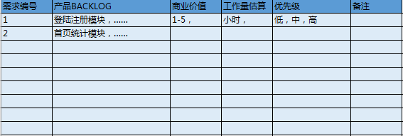
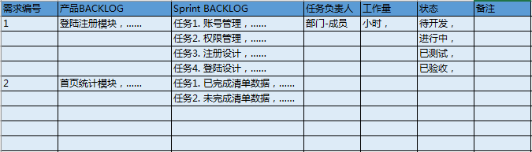

# [Scrum](https://www.scrum.org/)

* 一种敏捷开发框架，是一个增量的、迭代的开发过程，具备可视、可集成和可运行使用的特征
* 采用该框架的团队通常由一个 Scrum 教练、产品经理和开发人员组成，该团队以跨职能、自主的工作方式运作，能够加快软件交付速度从而给客户带来巨大的商业价值。其关注点是较小增量的快速迭代
  - 一个团队有自己的代办事项，对代办事项进行拆小。
  - 按客户价值进行优先级排序，产品经理负责价值排序。
  - 小而稳定，跨职能团队。
  - 多个团队松耦合（依赖性比较低），对齐迭代时间和战略目标。
* 只写有必要的文档，或尽量少写文档，敏捷开发注重的是人与人之间，面对面的交流
* 迭代是指把一个复杂且开发周期很长的开发任务，分解为很多小周期可完成的任务，这样一个周期就是一次迭代的过程；同时每一次迭代都可以生产或开发出一个可以交付的软件产品。
* Scrum 的英文意思是橄榄球运动的一个专业术语，表示 “争球” 的动作
* Scrum以经验性过程控制理论（经验主义）做为理论基础的过程。经验主义主张知识源于经验,以及基于已知的东西做决定。Scrum 采用迭代、增量的方法来优化可预见性并控制风险。Scrum 的三大支柱支撑起每个经验性过程控制的实现
  - 透明性（Transparency） 透明度是指，在软件开发过程的各个环节保持高度的可见性，影响交付成果的各个方面对于参与交付的所有人、管理生产结果的人保持透明。管理生产成果的人不仅要能够看到过程的这些方面，而且必须理解他们看到的内容。也就是说，当某个人在检验一个过程，并确信某一个任务已经完成时，这个完成必须等同于他们对完成的定义。
  - 检验（Inspection） 开发过程中的各方面必须做到足够频繁地检验，确保能够及时发现过程中的重大偏差。在确定检验频率时，需要考虑到检验会引起所有过程发生变化。当规定的检验频率超出了过程检验所能容许的程度，那么就会出现问题。幸运的是，软件开发并不会出现这种情况。另一个因素就是检验工作成果人员的技能水平和积极性。
  - 适应（Adaptation） 如果检验人员检验的时候发现过程中的一个或多个方面不满足验收标准，并且最终产品是不合格的，那么便需要对过程或是材料进行调整。调整工作必须尽快实施，以减少进一步的偏差。

## 角色

- 产品负责人（Product Owner）PO，负责产品的需求、进度、目标
- 项目经理 (Scrum Master)  SM，俗称敏捷教练，负责阻挡外界对开发团队干扰，保证团队顺利工作
  + 帮助他们理解职责边界
    * 敏捷团队被告知他们是自组织的。但是，这并不意味着每个企业的自组织都完全一样。比如说： 团队是否有权将团队的技术需求添加到Sprint中？ 团队是否可以决定谁在这个团队中？ 团队是否可以在不询问Scrum Master的情况下改变他们的Sprint长度？ 在未经许可的情况下，团队可以在工具、团建活动或任何其它事情上花多少钱？ 等等等等，这个列表可以无限长
    * 当团队第一次被告知他们是自组织时，他们经常会很挣扎，因为他们不知道这意味着什么。作为Scrum Master，你需要帮助团队了解他们可以自由操作的职责边界
  + 让他们感觉到安全
    * 一项重要工作就是创造安全感。例如，团队能够进行Sprint计划，而不必担心如果他们没有完成他们预期的一切而被大吼大叫。
    * 团队需要交付高质量的成果，但是如果因为疏忽导致了一个生产环境的缺陷，团队诚实地承认错误，他们知道不会因此而遇到麻烦。
    * 当被问及完成这些功能需要多长时间时，团队能够真实地回答，而不用担心延期或者提前完成会产生不好的影响。
  + 赞美他们
    * 每个人都喜欢听到“你做的很好，太棒了”
    * 在我坐下来写这篇文章之前，我在遛狗的时候，遇到了一个女士带着一只漂亮的棕色拉布拉多犬，我说，“你这个狗狗很漂亮啊。”她的脸发亮，笑容满面。我猜她在狗狗的打扮上一定下了不少功夫，她显然非常感激这种赞美。
    * 你的团队成员也是一样的。当一个人做得很棒时，让他们知道。即使是简单的“你很棒！”也可以提供帮助。当然，态度要诚恳，一旦你开始寻找赞扬团队成员的机会，你会发现很多。
  + 支持他们
    * 团队需要你的支持。帮助团队移除障碍是你职责的一部分，但更重要的是，你应该努力在问题成为障碍之前将其移除。
    * 支持团队不仅仅是处理障碍。当你对他们始终诚实，并且让他们感到公平时，团队成员会感受到支持。
    * 言出必行，当你告诉团队成员你会做某事时，接着就完成它。你帮助团队，让他们对自己的承诺负责，对你自己要用同样或更高的标准。
    * 平易近人，如果你每天都是坏脾气，那你不可能指望团队成员在需要帮助时来找你。
    * 与团队成员交谈。不要说太多，以避免影响团队工作的推进，但你应该了解每个人在Sprint期间的表现。知道什么时候提供帮助，即使只是为了倾听，或者在某个早晨为某人带来一杯他最喜欢的咖啡。
  + 让他们感觉很牛
    * 遇到的最糟糕的Scrum Master们都有一个共同的特点：他们认为这一切都是为了让自己看起来很棒。在Sprint评审会上，这些Scrum Master会说“让我来给大家展示我团队的成果”。
    * Scrum Master的工作是让团队看起来很棒。这不是形式上的，而是感受到的。优秀的Scrum Masters帮助团队成员尽其所能。然后他们确保组织知道团队成员正在很好地进行他们的工作。
  + 知道什么时候打破规则
    * Scrum的规则很少，但它们存在的理由很充分。每个都有助于团队敏捷并增加成功的可能性。但是，正如俗话所说，规则意味着被打破。
    * 你的团队希望你在适当的时候可以打破规则。有时候常识占上风，而规则会妨碍常识。一个好的Scrum Master会认识到这些情况。例如，永远不要延长Sprint是我遵循的规则，通常是这样的。我打破了吗？是的，偶尔，而且总是有充分理由。
    * 3个小时是是Sprint回顾的时长上限。我的99％的回顾都是在更短的时间内完成的，通常时间要少得多。但是我辅导过的团队打破了3小时的规则吗？是的，我们偶尔会讨论一个非常热门的话题，而且似乎继续讨论比推迟要更好。
  + 如果没有和团队商议，请不要代表团队做任何承诺。
    * 作为一个Scrum Master，你没有任何权利代表团队接受需求变更，不管它有多小。即使你可以完全确定团队可以搞定它。你可以这么来回答：“我需要和团队沟通后再确认是否可以接受。”
    * 当然也不能在没有和团队商议的情况下承诺任何交付日期，交付物，或其它的任何东西。当然，你也许不必每次都召开全员会议来和大家沟通，有些情况下，团队内的部分相关成员经过沟通后也是可以做出决定的。但是，这仍然是团队的决定，而非你的决定。
  + 记住，你的目标是让团队看起来很棒。
    * 作为一个Scrum Master并不是要让自己看起来很棒。当团队看起来很棒的时候，你自然也看起来很棒。 当团队做得很好的时候，他们才看起来很棒。
    * 当团队外的人开始怀疑是否还需要你的时候，你知道你干的不错。是的，如果你的老板怀疑是否还需要你的时候，那就太可怕了。但是，一个好老板会知道你的技能和专业知识会使你显得不必要，而事实上你是不可或缺的。
    * 相信您的经理会明白显得不必要和实际上不需要之间的区别。
      +不要用敏捷规则手册来怼团队
    * Scrum和敏捷都没有附带规则手册（尽管有些人试图创建规则手册）。
    * 如果您的产品有用户，请考虑编写用户故事。但故事并非敏捷必需。如果有人需要知道你什么时候交付：请估算，如果没人想知道，也许你可以不做估算。如果您认为Sprint结束时做Sprint评审，收到反馈太晚，请在开发完每个功能时评审。
    * 保持敏捷是指尊重创造敏捷性的原则和价值观。如果你只是生搬硬套这些规则，你可能不会走得太远。
      +没有什么是永恒的，所以请验证你的过程
    * 尊重敏捷性原则的其中一个方面是验证您的过程。鼓励团队尝试新事物。
    * 你的团队是否喜欢为期两周的Sprint，并认为他们运行的完美无缺? 如果是的，那非常棒。现在让他们尝试一周或三周的冲刺并观察结果。实验可能并不总是受欢迎，但它们是确保您继续发现新的，更好的工作方式的最佳途径。
      +确保团队成员和利益干系人视彼此为同行
    * 团队成员和业务方利益干系人各自为产品开发计划带来了重要的视角。因此，每个人都需要得到平等的对待。
    * 如果双方出现隔阂，整个组织都会受到损害。开发团队需要了解利益干系人带来的独特视角，利益干系人需要尊重开发团队，包括倾听开发人员说：“这个截止日期是不现实的”。
      +保护团队，用比你想象的更多的方式
    * Scrum Master需要保护团队避免受到过于苛刻的产品负责人或利益干系人的影响，这是我们经常听到的对Scum Master的建议，这是个好建议。有时候，产品负责人很强势，只是简单地要求更快、更多。这会迫使团队牺牲质量，到头来困扰着项目。因此，一个优秀的Scrum Master可以保护团队不受此影响。
    * 你可能不知道，一个优秀的Scrum Master也应该防范团队陷入自满。优秀的Scrum团队会不断寻求改进。有些团队，可能不自觉的认为自己已经足够好了，他们的确有可能比敏捷之前有了显著的进步。但即使是最棒的团队，也经常有机会变得更好。卓越的Scrum Master保护团队，不会让他们感到没有任何东西需要学习。
      +把失败从你的词汇表中移除
    * 我偶尔会碰到一些团队，如果他们在Sprint结束时未能交付他们计划的所有内容，他们会将这个Sprint称为“失败的Sprint”。我不认为这是失败，特别是如果团队完成了大部分计划的条目，或者他们巧妙地处理了紧急情况。
    * 当篮球运动员将球投向篮筐并得分时，它被称为进球得分（Field Goals）。如果球员没投中，这就是所谓的投篮尝试（Field Goals Attempt）。不是失败，而是一次尝试。
    * 优秀的Scrum Master帮助团队调整他们的思维，以便他们认识到未能达到预期的Sprint和功能特性不是失败而是尝试。
      +经常赞美，但永远诚挚
    * 有一天，我告诉我十几岁的女儿，我为她感到骄傲，她立刻兴高采烈。这不应该让我感到惊讶。谁不想知道某人为他们感到骄傲？
    * 但她的反应让我意识到我不能经常告诉她这一点。我认为这相当于我告诉她一些明显的事情，比如“你很高”。但我知道事实并非如此。
    * 永远不要提供虚假的赞美。没有人想听到这个。但是，当你发现你的团队成员的工作做的很好的时候，请告诉他们。他们很可能不会经常听到。
      +鼓励团队接管你的工作
    * 对敏捷不熟悉的团队将重度依赖他们的Scrum Master或教练。团队可能不知道如何让每日站会在十五分钟内完成。或者他们可能不了解如何交错式地工作，以及建立跨职能团队的重要性。
    * 一个没有经验的球队也是如此。学习踢球的小孩的教练需要教会他们一切。当我的女儿们6岁的时候，他们的教练会在边线跑动，整场比赛大喊“踢，跑！”如果他不这么做，那么年轻球员就会忘记。即使他大喊大叫，偶尔也会有一些孩子坐在草地上发呆。
    * 将年幼孩子的教练与世界杯队的教练进行对比。在世界杯球队中，球员们已经学会了做什么。如果训练的时候，教练迟到了，球员知道用什么样的演练或练习开始一天的训练。世界杯教练不需要提醒球员踢球和跑动。但是世界杯球队永远不会告诉你他们根本不需要教练。
    * 无论敏捷团队有多好，我认为他们仍然可以从Scrum Master或者教练的辅导中受益。但是，优秀的敏捷团队会更加主动地去学习，以精通产品开发所需的技能。
  + 闭嘴听
    * 很多时候，聆听、保持沉默是最好的辅导，让团队自己找到答案。
    * 这可能很难。当你看到你的团队正在努力弄清楚要做什么时，很自然地想要插话并提供建议。但是如果你解决了问题，或者轻易地提供了建议，团队成员就会等着你为他们解决每一个问题。
    * 我不想暗示你不能提供任何建议。你是个聪明人，否则你就不会担任现在的角色了。但作为一名优秀的Scrum Master，要帮助团队学习如何自己解决问题。如果你解决了团队成员面临的每一个问题，他们就没有机会知道他们自己行不行，可否自己搞定这些问题了。
- 团队成员 (Scrum Team) ，一般 5~10 人，包括开发、测试和运维等，不仅需要技术能力，还需要很强的沟通能力和自我管理能力。

## 价值

* 承诺 – 愿意对目标做出承诺
* 专注– 把你的心思和能力都用到你承诺的工作上去
* 开放– Scrum 把项目中的一切开放给每个人看
* 尊重– 每个人都有他独特的背景和经验
* 勇气– 有勇气做出承诺，履行承诺，接受别人的尊重

## 流程

* 产品分析用户需求，按照商业价值依次排序估算，输出计划产品功能列表，产品BACKLOG，由PM具体负责，内容：
  - 用户调研、需求分析，确定产品迭代功能，出具产品BACKLOG。
  - 决定产品的发布日期与发布内容，给迭代计划预设目标。
  - 根据RIO（商业价值/工作量）排序优先级，考虑必要风险。
  - 制定Sprint计划，根据实际情况调整功能与优先级。
* 经过计划会议讨论，按照计划面板梳理功能列表，输出产品版本迭代任务。产品BACKLOG，Sprint计划会议，Sprint BACKLOG，由开发经理负责内容：
  - 将产品BACKLOG拆分为在本次Sprint中可细化的Sprint BACKLOG
  - Sprint BACKLOG中的开发任务以小时估算，预计1-16小时的工作量化
  - 根据开发优先级管理Sprint BACKLOG，随时更新Sprint BACKLOG状态。
  - 每个团队成员都可以自主挑选任务，修改Sprint BACKLOG。
* 进入开发迭代周期，按照任务面板增量迭代开发，输出可交付的迭代版本。Sprint BACKLOG，迭代开发周期，可交付的迭代版本，由开发团队共同推进，内容
  - 依照Sprint BACKLOG，开始开发工作，更新工作任务面板。
  - 参加每日例会，明确各团队的整体开发进度与开发难点。
  - 保证整体开发进度不大幅度的偏离预设的Sprint燃尽图。
  - 高度的自我组织管理，保持良好的跨职能团队沟通，确保实现Sprint目标。
* 进入评审验收环节，按照发布面板汇总问题原因，输出迭代周期报表数据。验收发布版本，评审回顾会议，周期数据报表。Sprint团队成员共同参与，内容：
  - 产品开发团队通过操作演示的方式展示Sprint中完成的功能与架构
  - PM根据产品BACKLOG，验收开发交付的迭代版本，发布产品迭代版本
  - 收集Sprint问题反馈，寻找根本原因，讨论解决方法，改善Sprint过程

## Events

* Sprint Plan Meeting（明确目标，细化任务）
  - 在启动每个 Sprint 前召开，PO 和团队成员将 backlog 分解小模块制定任务优先级，团队成员确认理解需求并计算小模块的工作量
  - 需要明确Sprint目标与Sprint BACKLOG，讨论时要考虑团队的接受力，开发的速度、技术水平和商业条件等，提前确定好Sprint交付日期，增量迭代开发任务，产品版本迭代内容等
  - 需要在迭代周期的最后一天召开，1个小时左右就可以了，需要客户出席，如果客户不能出席，则需要产品经理出席.在开迭代计划会议之前应该准备好所有的需求分析，如果遇到需求不合理应该及时跳过，不应该在会议中寻求解决方案。 2h
* Daily Scrum Meeting（定点，定时，人齐，会短，高效）
  - 团队交流的形式，固定地点，固定时间点，团队成员都参与，会议维持在15分钟左右，发言内容围绕昨日进度、今日安排、所遇困难三个方面快速的梳理一遍任务面板上的工作内容，所遇困难在会后点对点进行讨论解决。
  - 每例会是在Sprint周期内（2-4周）的开发进度反馈，在这个周期内，会经常更新任务面板。
  - 任务面板是“任务状态/工作进程”的二维工作面板，便签颜色可代表团队成员，便签内容代表团队成员所负责的开发任务。任务状态一般可划分为：ToDo，Doing，Tested，Reviewed，Finished五个状态，在一块方形划分区域中贴满了颜色便签，随时更新任务面板状态，保证团队所有成员随时随地都可以了解Sprint周期内的整体开发进度
  - 每个开发成员汇报昨天做了什么，今天计划做什么，是否遇到障碍？检验Sprint目标的进展，做出调整，从而优化次日的工作价值
  - 每日5分钟左右的一个简单例会，尽可能多的开发人员参与进来对紧要问题的讨论。目的是更新进度和暴露开发中遇到的问题，不应该讨论具体的问题。 15min
* Sprint Review Meeting:在每个 Sprint 结束后，将这个 Sprint 的工作成果演示给 PO、客户、老板和其他相关的人员。
* print Retrospective Meeting:
  - 对刚结束的 Sprint 进行总结。会议的参与人员为团队开发的内部人员。一般该会议为 1 小时。
  - 用来回顾已经完成的Sprint，并且确定做出什么样的改善可以使接下来的Sprint更加高效、更加令人满意，并且工作更快乐。
  - 做Sprint交付版本与计划版本的验收
  - 总结和完善后续Sprint的开发建设。
  - 在每个迭代结束时进行，总结工作中的经验和教训，时间维持在30-60分钟内，整个团队都需要参加（Scrum Master、Product Owner、开发团队以及客户）。把重点放到上一次行动是否明确执行以及需要改进点上。可以通过投票讨论优先级高的改进点
  - 定量分析:包含团队是否完成了迭代目标，收集并评审迭代度量指标（包括速率、迭代燃尽图、迭代计划故事和实际完成故事、计划发布日期与实际发布日期、客户满意度、团队满意度、生产环境Bug数、生产Bug解决时间、用户故事等）
  - 定性分析:包含哪些工作良好（应该继续保持），哪些做的不好（应该停止）？哪些可以改进（团队选出１－２条在下一个迭代实现）
* 产品展示会议 30min
* 每个会议必须有主持人、会议目标、会议准备，否则会议是冗长而无效的
* 参会人员应该准时到达:对迟到的容忍就是对准时到的人惩罚

* Scrum包括了两个方面的PDCA持续改进
  - 一方面是产品的持续改进
  - 另一方面是开发过程的持续改进。需要组织的专业管理支持
    + 实习生进公司后，根本不了解业务、系统，也缺乏软件工程经验。这种情况下，如果让他们进Scrum团队，基本上干活就等于“埋雷”，这会严重拖累团队.需要进行集中的专业教育，组织学习业务、系统和工程技术，并做一些虚拟项目来掌握这些知识和能力。直到这些都基本掌握了，才能安排他们进Scrum团队
    + 以往都只做手工测试，现在要搞自动化测试。而各个Scrum团队往往都面临着巨大的业务交付压力，没有时间去研究自动化测试技术

## 组织架构设计

* 在敏捷的组织架构设计时，要兼顾“业务交付”和“专业管理”两条线。例如，业界常用的“教授-企业家”模型
  - “业务交付”：交付什么价值，以及按什么样的顺序和节奏来交付
  - “专业管理”：如何为Scrum团队培养合格的专业人员，如何打造高效的组织级专业能力，以实现更加高效和高质量的价值交付
* 组建专业线
  - 建立专业线组织
    + 最核心人员是专业线负责人（有的组织称作“专业线带头人”）。组织通常会设置一名专业线负责人管理本专业的建设工作。这位负责人通常是本专业领域的资深专家，全职投入到专业线工作中。
    + HR部门还会派一名HRBP（HR Business Partner），协助专业线负责人来开展专业线工作。
    + 当组织规模上升到一定程度时，专业线负责人就需要有几名技术专家协助其开展专业线工作，通常这些人也是Scrum团队的技术教练。
    + 这些技术教练，可以是全职的，也可以是轮职的，一般不建议是兼职的，因为兼职人员往往会忙于团队开发工作而无法保证对专业线的投入。对于轮职的技术教练，每年会有部分时间在Scrum开发团队全职从事开发工作，部分时间在专业线全职担任技术专家/技术教练。
    + 所有专业人员都是专业线的成员，需要接受专业线在专业技术上的管理。
  - 运作
    + 学习、引入和推广新的专业技术，组织进行各类专业技术交流和培训活动，提升组织及各Scrum团队的专业主义氛围和专业技术能力。
    + 建立、发布和维护组织的专业技术体系，包括各类标准、指南、工具、模板、知识库等。
    + 必要时，进入Scrum团队，参与关键的技术分析和评审工作，协助解决专业技术问题，或辅导团队成员掌握新的专业技术
  - 对于一定规模以上的组织，专业线还可能会有以下工作内容：
    + 定义专业技术等级、能力模型及其成长路线图。
    + 组织进行人员的专业技术等级评估。
    + 组织进行专业人员的成长规划和实施。
* 实践社区(COPCommunity of Practice)
  - 实践社区是将对某一特定知识领域感兴趣的人联系在一起的网络。大家自愿组织起来，围绕这一知识领域共同工作和学习，并共同分享和发展该领域的知识。专业线是组织中的官方组织，而实践社区则是组织中的民间组织。
  - 具有以下特征：
    + 实践社区通常由志愿者组成，人们可以凭兴趣爱好，自由地加入或者退出某个实践社区；
    + 每个实践社区都有专门的主题内容，涵盖有关核心知识领域，如某项技术或某门专业；
    + 实践社区会定期活动，往往有其组织者；
    + 不同的成员具有潜在的不同身份，如核心专家、外围成员等，这些成员通过其分享知识和帮助他人的行为而自动取得该身份，而非由组织正式任命；
    + 成员相互之间信任程度高；
    + 规模大小不限。
  - 实践社区作为非正式组织，为企业创造了大量的非正式沟通渠道，其沟通方式可以是：定期开会或仅利用午餐休息时间讨论，或纯粹以Email、讨论区、在线交谈等网络系统来相互联系。
  - 为组织带来收益：
    + 为发展、共享和管理专业知识提供便捷的非正式途径，极大地促进了知识和经验在组织内的传递。
    + 以问题为导向，主动探索和发现新的知识和技术，是组织正式专业技术发展的重要补充，为潜在的机会和威胁提供早期提醒和预警。
    + 打造了知识共享的文化，改善了组织的专业主义氛围。
    + 是一个组织在内部发掘专业技术人才的重要途径。
    + 能够极大地帮助组织建设和完善组织知识库。
  - 组织成员带来好处：
    + 成员可以得到社区专家的帮助和指导，从而开阔视野，提升专业水平。
    + 成员也可以在工作中通过社区获得知识和得到帮助，提高工作的效率和质量。
    + 社区为成员发表个人的意见和想法提供了一个开放、自由交流、展示自己专业特长的平台，能够扩大成员的专业知名度。
  - 通过以下手段来引导和促进实践社区的良好运作：
    + 通过专业线来牵头成立实践社区，以及组织开展实践社区活动。
    + 为成员参与实践社区活动提供必要的时间、空间或者资源支持，例如：把每周五下午作为自由交流时间，对于实践社区给予一定经费支持，让HRBP协助组织实践社区活动等。
    + 提供必要的基础设施，例如：社区论坛、知识库、搜索引擎等。

## 成果 Artifacts

* Product Backlog:可以预知的所有任务，包括功能性的和非功能性的所有任务。
  - 由产品负责人维护管理的一个已排序，已估算，可渐进的需求清单列表，可参考PRD文档中的功能模块记录列表或者产品需求池的记录列表。
  - 在一般的情况下，会根据功能模块对应的用户故事流程来表示BACKLOG条目内容。
  - 在每个Sprint结束或者临时需求变更时，都需要更新优先级的排列顺序
* Sprint Backlog:在 1 个 Sprint 周期内所需要完成的任务
  - 开发负责人维护管理的一个Sprint任务清单，根据产品BACKLOG细化而来，细化为开发过程中可用的产品功能任务，每个任务用小时估算时间，
  - 团队成员可自行管理任务，每天的任务进度会更新到对应的任务面板上。
* 燃尽图 Burndown Chart:在 1 个 Sprint 周期内，工时 / 工作量的二维图表
  - 主要是为了让团队成员明白在Sprint截止时间点前剩余开发工作量的整体情况
  - 通过实际燃尽图与理想燃尽图的线性对比，可快速调整开发节奏，降低Sprint版本交付存在的风险
* 障碍积压订单：(Impediments List)，Scrum 负责人要维护一个障碍列表

## 实践

* 产品BACKLOG的来源一定要尽可能的准确，最好是有明确的数据分析结果作为支持依据，Sprint BACKALOG的任务细化尽可能细致，保证在后续的Sprint迭代过程中，团队的工作目标清晰明确。
  - 因为没有人会希望自己的工作量最后转化为无用功，而不是KPI，这对于团队士气是一种相当沉重的打击。如果还是出现了这种情况，Sprint负责人也要积极转移大家的情绪，劝慰大家尽快投入下一个更加正确的Sprint周期中去。
* 团队成员之间要形成积极沟通的氛围，保证各职能团队之间的信息沟通准确对称。
  - 为了保证开发过程中灵活性，敏捷开发往往为了高效而不会过多的对成员做工作流程上的束缚，需求在迭代过程随时可发生变动，开发任务清单可由团队成员自主选择，任务面板由成员自主更新，是一种以沟通为主的工作模式。
  - 非理想工作模型下，团队成员往往更愿意被动的选择工作分配。开发经理应该合理的根据团队成员的能力维度安排工作任务清单，尽可能避免团队成员因为能力失控导致进度延期、工作效率低、工作情绪泛滥等不利于团队建设的情况出现。
* 团队成员的组成结构在Sprint周期内尽量保证不变动，尤其是核心主导成员更不能做人事变动。在一个Sprint周期内，团队整体的开发关注力是需要高度集中的，如果这时团队的头部成员发生更换，一定会存在沟通成本损耗，影响整体迭代效率。
* Sprint开发过程，会议的频次与时长需要做适当的把控。笔者参加过蛮多工作会议，个人觉得有些会议的RIO并不成正比，耗时且没有正向的工作计划输出，这往往是蛮多人都吐槽且不喜欢参加会议的原因。每次最好由负责人主导会议，做好会议相关数据报表的输入输出，阶段性的展示成果，给予团队积极的正向会议反馈。

## 图书

* 硝烟中的Scrum和XP
* Scrum精髓：敏捷转型指南 [Essential Scrum：A Practical Guide to the Most Popular Agile Process]
* Succeeding with Agile:Software Development Using Scrum

## 工具

* [leangoo](https://www.leangoo.com/):更敏捷的项目协作平台

## 参考

* 
* [Scrum 中文网](https://www.scrumcn.com/)
* [Scrum in 3 Minutes](https://www.visual-paradigm.com/scrum/scrum-in-3-minutes/)
