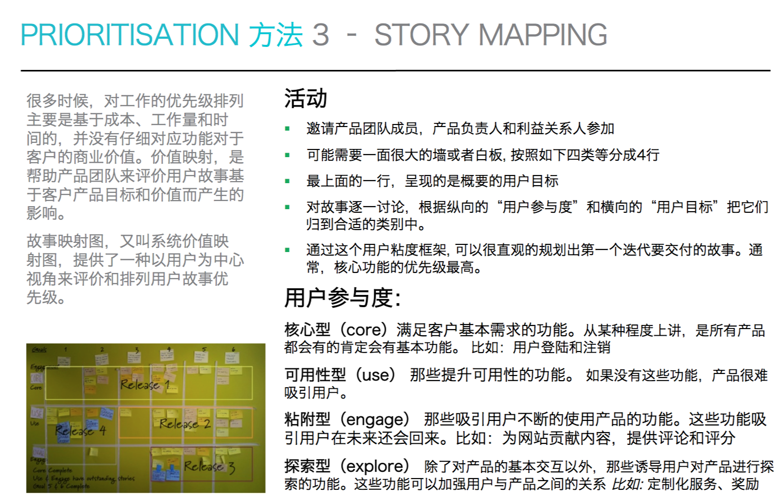
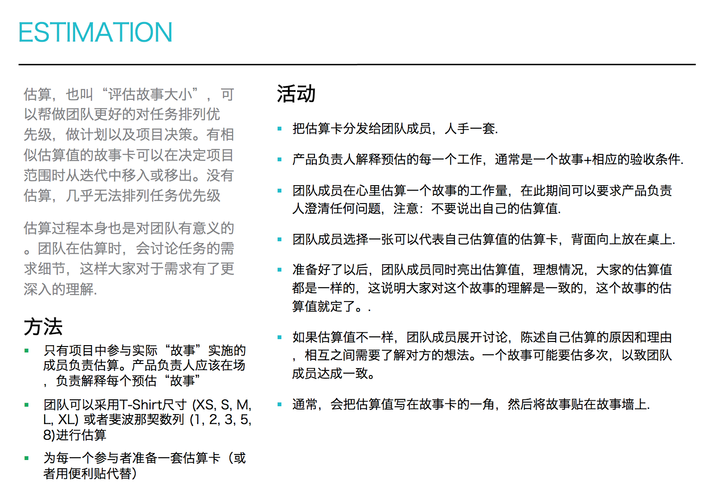
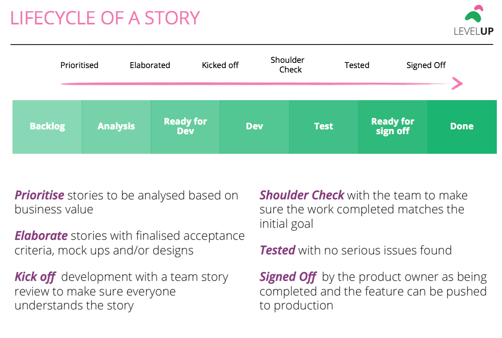
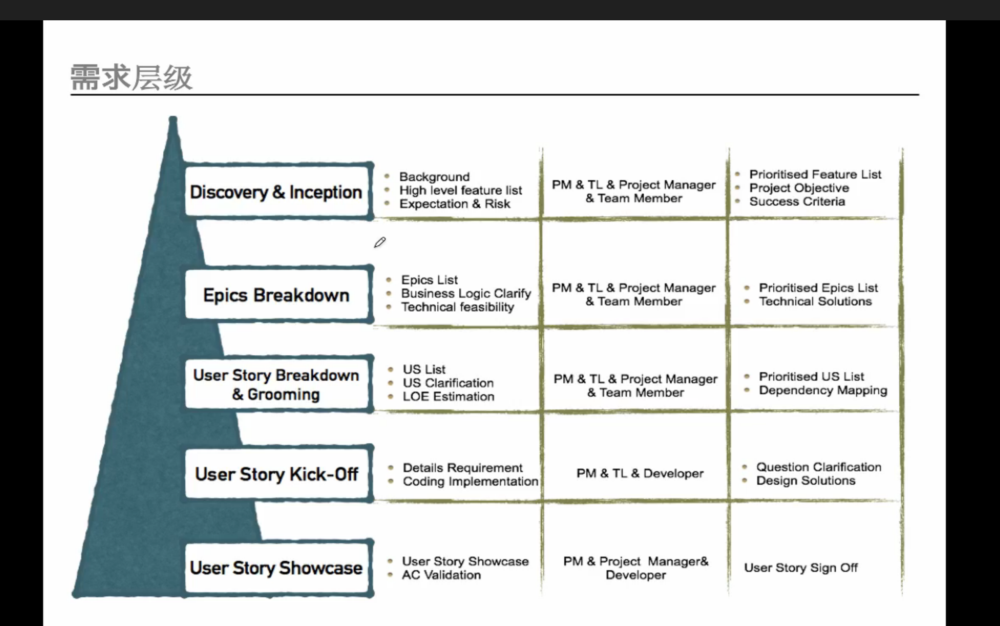

## [产品需求分析](https://insights.thoughtworks.cn/product-requirement-analysis/)

* 工作流系统
    - 横切：先切分出工作流中核心且轻薄的一层，然后再去实现各个步骤中的细节部分
        + 对于那些核心业务逻辑比较简单、但每个步骤的附属功能多且复杂的工作流系统来说比较适用
        + 不影响本步骤走通的情况下，最小化这个步骤的工作量，加速打通整个业务流程
        + 优势在于可以快速实现核心逻辑，并快速上线，验证假设并收集反馈，可以根据反馈的结果来决定每个步骤中的功能应该如何设计、优先级是什么，来避免一些可能出现的浪费
        + 缺点在于整个工作流设计会采用短平快的原则，用户体验较差
    - 纵切：按照工作流中的每一个步骤进行切分，这样可以使每一个步骤都具有相对完善的功能，这在某些需要关注终端用户交互体验的产品中应用较多
        + 如果在整个工作流中，需要跟终端用户进行交互的功能仅出现在某几步中，如第一步和最后一步，而中间的N-2步都是后台流程，在开发中，可以先实现第一步和最后一步的功能，而中间的流程处理环节，仍然采用逐步线上化的方式，这样可以使整个工作流系统最快的上线，同时能平衡用户的交互体验
        + 这几个步骤拆出来优先实现，及早上线；而中间的跟票务相关的步骤，仍然采用线下的形式
        + 对于一些流程复杂但用户量较小的初创公司比较适用，可以在保证用户体验的情况下，大大提升产品上线速度，并降低试错成本
    - 不管是横切还是纵切，工作流中的每一个步骤都会遵循80/20法则，也就是20%的功能决定了这个步骤的核心价值，而80%的功能仅仅是锦上添花的，所以我们需要更深刻地研究客户的真正需求是什么，提炼出这20%的业务价值到底在哪里，从而进行更加合理的拆分
* 功能模块拆分
    - 按业务规则拆分：典型例子是搜索引擎，输入框只有一个，会根据所输入的数据规则的不同，来进行不同的处理操作
        + 可以把每一个业务规则都单独拆分成一个用户故事
        + 虽然这些用户故事看起来很相似，但是大部分情况下，这些规则的优先级是截然不同的。总会有一簇最高优先级的用户故事以及围绕在外围的用户故事
    - 1+N模式：对同样一个流程，在终端接不同的网关或渠道。最典型的例子是在线支付
        + 第一次实现支付的功能，可能会比较复杂，但后面如果从一种扩充到多种支付方式，就相对比较简单
        + 最先需要支持什么样的支付方式，可能在一开始也拿不定主意。这个时候，我们不妨将支付功能拆成2张卡
            * 会员可以使用微信支付/京东支付/网银支付中的一种进行支付
            * 会员可以使用微信支付/京东支付/网银支付三种渠道进行支付
        + 可以延迟决策-我们需要最先支持哪种支付方式，同时合理的评估项目的工作量
* 复杂业务模型拆分
    - 非常复杂的业务模型，如果一上来就要考虑清楚这个业务模型的方方面面，是个性价比很低的事情——做了很多功课，但没有给客户带来真正的业务价值
    - 区分哪些信息是核心信息，是对用户来说最有价值的，把这些信息从业务模型中提取出来，而后设计相应的更小的业务功能，切忌一蹴而就
    - 将业务模型，按照实际需要提供功能进行拆分。比如，要做一个中介搜索系统，可以仅取出模型中的中介信息，而不需要处理其它部分。即使需要整个业务模型去做一些事情，也可以把其拆成一个个子模型，根据子模型的业务价值及优先级去设计相应的功能
* 需求拆分是没有银弹的，要根据具体的场景、限制来选择合适的拆分方法。在遇到使用某个拆分方法，不能满足当前业务需求时，看看是不是可以换个思路，换个方法，在选择拆分方法时，也有一些技巧
    - 基于80/20法则，选择那些可以拆出低优先级卡片（或者可以被扔掉的卡片）的拆卡法。
    - 选择可以把卡片拆的大小差不多的方法，未来在发布计划中更容易做需求置换
    - 选择开发团队更容易理解和实现的方式
* 反模式
    - 按照技术架构分层进行拆分，常见的会按照持久层、应用层、展示层进行拆分。这种拆分方式拆出来的用户故事，会明显破坏INVEST中的Valuable的原则，而且各个故事卡由于各方面的原因，如开发进度不统一，无法灵活的集成上线
    - 拆分时，把复杂的UI交互算在故事卡片中。大部分情况下，比较fancy的UI交互都不是核心的业务功能，这部分功能可以作为用户体验优化的卡片，独立拆出来
    - 拆分时，过早考虑性能问题。在性能基本达标、不出现大问题的情况下，提升性能很多情况下也属于用户体验的一部分，可以单独拆出来，左右优化卡片
    - 拆出一些管理类的卡片。比如管理产品，实际上可能包含很多产品相关的操作，如导入、编辑、同步信息、改变状态、上架、下架等，所以应该根据具体的功能，拆分成更为准确和大小合适的故事卡片

## 用户故事 User Story

* 敏捷开发的基础，从用户的角度来对需求进行描述。软件开发是为了实现产品的商业价值，满足用户需求。只要需求足够明确，所有人都了解其具体内容，团队就能简单有效地把需求转化成可实现、可测试、能够发布的代码
* 定义
    - A tool for iterative development
    - Represents a unit of work that should be developed
    - Help track that piece of functionality;s lifecycle
    - It is a token for a conversation , a placeholder for a conversation
* 作用
    - 用于需求描述
    - 促进共同理解
* Story Card
    - A conversation placeholder, not a detailed requirements document
    - Designs may be needed for a story before it is ready for development
    - Focus on the user,their goals and the value they seek
    - Mock ups are a low-fi sketch that convey story concept and prompt early feedback
    - NARRATIVE: Describes the purpose of a story
    - ACCEPTANCE CRITERIA: describe the requirements to complete a card: Given when That
    - Structure
        + Biz Value
        + Description
        + Hi-fi/low-fi Mockup
        + ACCEPTANCE CRITERIA
* 用户故事开卡 Story kick-off
    - 在每个用户故事开发之前，要确保BA、DEV和QA对用户故事理解一致
    - 这个沟通活动通常表现为由DEV讲解这个用户故事要完成的功能及AC，一旦发现任何疏漏，BA及时补充
    - DEV有任何疑惑也需及时提出来，当场确认，使这些功能得以正确实现
    - 在后续开发中如果碰到任何疑惑，也应及时找BA了解清楚。QA会严格按照AC来验收用户故事
* 怎么写
    - 要素
        + 角色：谁要使用这个功能
        + 活动：需要完成什么样的功能
        + 商业价值：为什么需要这个功能，这个功能带来什么价值
    - 角色:从系统中的角色出发，沿着User Journey梳理用户故事。细分角色，比如一个育儿社区应用，用户可以有爸爸，妈妈，爷爷奶奶等，他们需求和痛点可能是不一样的
    - 格式:`As a ... I want ... So that ...` 作为一个< 某种类型的用户角色>，我要< 达成某些目的>，只有这样我才能够获取< 商业价值>
        + 原来描述需求时，基本只有中间的功能部分。不提这个功能是为谁做的，需求不明确时，不知道该找谁确认，功能上线后，不知道找谁要反馈。也不提满足了用户的什么价值，做出来也没有用户去用
    - 原则
        + 3C原则
            * Card，用粗笔将 User Story 写到物理卡片上，用粗笔是强迫不能写太多太详细，促进当面沟通
            * Conversation，Dev 会拿着卡去找 BA 和 QA 讨论
            * Confirmation，讨论完要确认验收条件
        + INVEST模型：Bill Wake提出了一个好用户故事的验收标准
            * Independent：每个用户故事应该是独立的，不会和其他用户故事产生耦合.如果用户故事存在依赖性那么就会导致用户故事之间存在着不同的优先级，只有被依赖的用户故事完成才能继续开发依赖的用户故事。一般可以通过组合用户故事或者分割用户故事来减少用户故事间的相互依赖性。
            * Negotiable：并不会非常明确的阐述功能，细节应带到开发阶段跟程序员、客户来共同商议
            * Valuable：每一个用户故事的交付都要能够给用户带来用户价值,因此应该站在用户的角度去编写，描述的是一个一个的feature，而非一个一个的task
            * Estimable：故事不能太大，也不要有太大的业务和技术不确定因素，否则就无法评估
            * Small：要小一点，但不是越小越好，短小的故事可以减少划分过程中估算的误差，最好的故事是能够在一个迭代周期之内完成的。如果太大就应该考虑将其拆分为多个粒度更小的用户故事
            * Testable：需要能够进行验收测试，最好能把Test Case提前加进去
                - 对应的验收测试也最好是自动运行的
                - 必须在定义了验收测试通过的标准后才能认为故事划分完毕
    - 用户故事一旦被确定，那么所要实现的功能、需求范围、所需工作量也就随之确认了。之后开发人员所要做的就是根据这个用户故事的内容进行开发，只有当所有Acceptance Criteria 被覆盖到，测试人员完成测试，发现所有功能是可测试的、可运行的，这个用户故事才算完成了
    - 准备
        + 开始写共识之前，先完成用户体验地图和人物形象构建是很有用的。从产品草图开始也一样
        + 做准备时，确保准备好卡片、马克笔、和大面的墙以及排卡片时需要的大桌子
        + 确保产品负责人和团队都参与写故事，对于大型团队，考虑组成小队，并分别专注于用户体验的不同部分
    - 对于API卡，两点建议
        + 从User Story描写的角度，“As a ” 这个User可以是一个Persona，也可以是第三方的系统。比如说“As e-Comm Digital web app, I want to call Customer API to retrieve customer details”.
        + 最适合用GIVEN WHEN THEN的方式来定义AC
            * GIVEN a customer exists
            * WHEN a GET request of Customer API is made
            * THEN Customer Name, Contact Details, Product Details are returned in the response.
* Check
    - Simple to understand
    - Testable
    - Estimable
    - Has Business Value
    - Can be aimed in an iteration (timebox)
    - Understandable by the user
* [如何拆分](https://insights.thoughtworks.cn/product-requirement-analysis/)
* 如何划分优先级
    - 
    - 
    - 
* 估算:相对估算
    - 
* 非功能性需求
    - 
* 交付管理
    - 
    - 
    - 
* 什么是好的Story,几个反模式
    - 按照技术架构分层进行拆分，常见的会按照持久层、应用层、展示层进行拆分。这种拆分方式拆出来的用户故事，会明显破坏INVEST中的Valuable的原则，而且各个故事卡由于各方面的原因，如开发进度不统一，无法灵活的集成上线。
    - 拆分时，把复杂的UI交互算在故事卡片中。大部分情况下，比较fancy的UI交互都不是核心的业务功能，这部分功能可以作为用户体验优化的卡片，独立拆出来。
    - 拆分时，过早考虑性能问题。在性能基本达标、不出现大问题的情况下，提升性能很多情况下也属于用户体验的一部分，可以单独拆出来，左右优化卡片。
    - 拆出一些管理类的卡片。比如管理产品，实际上可能包含很多产品相关的操作，如导入、编辑、同步信息、改变状态、上架、下架等，所以应该根据具体的功能，拆分成更为准确和大小合适的故事卡片

