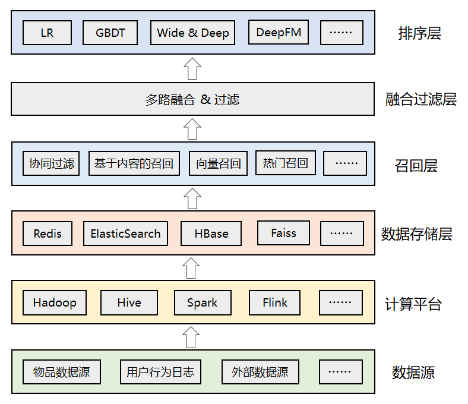

# 推荐系统

自动联系用户和物品的一种工具，它能够在信息过载的环境中帮助用户发现令他们感兴趣的信息，也能将信息推送给对它们感兴趣的用户。推荐系统属于资讯过滤的一种应用。

* 会产生一种幻觉，以为自己的喜好和立场是主流，跟大多数人一致。但是实际上，这完全是假象
* 不管是多么少的少数，它都有办法满足你，让你产生幻觉，高估自己的份量。你明明是人群的1%，却误以为大多数人跟你一样，这样就容易做出错误判断
* 如何从众多信息中找到用户感兴趣的信息，这个便是推荐系统的价值

## reason

* 基于用户维度的推荐：根据用户的历史行为和兴趣进行推荐，比如淘宝首页的猜你喜欢、抖音的首页推荐等。
* 基于物品维度的推荐：根据用户当前浏览的标的物进行推荐，比如打开京东APP的商品详情页，会推荐和主商品相关的商品

## 搜索 vs 推荐 vs 广告

* 搜索：有明确的搜索意图，搜索出来的结果和用户的搜索词相关。
* 推荐：不具有目的性，依赖用户的历史行为和画像数据进行个性化推荐。
* 广告：借助搜索和推荐技术实现广告的精准投放，可以将广告理解成搜索推荐的一种应用场景，技术方案更复杂，涉及到智能预算控制、广告竞价等。

## 结构

* 数据源：推荐算法所依赖的各种数据源，包括物品数据、用户数据、行为日志、其他可利用的业务数据、甚至公司外部的数据。
* 计算平台：负责对底层的各种异构数据进行清洗、加工，离线计算和实时计算。
* 数据存储层：存储计算平台处理后的数据，根据需要可落地到不同的存储系统中，比如Redis中可以存储用户特征和用户画像数据，ES中可以用来索引物品数据，Faiss中可以存储用户或者物品的embedding向量等。
* 召回层：包括各种推荐策略或者算法，比如经典的协同过滤，基于内容的召回，基于向量的召回，用于托底的热门推荐等。为了应对线上高并发的流量，召回结果通常会预计算好，建立好倒排索引后存入缓存中。
* 融合过滤层：触发多路召回，由于召回层的每个召回源都会返回一个候选集，因此这一层需要进行融合和过滤。
* 排序层：利用机器学习或者深度学习模型，以及更丰富的特征进行重排序，筛选出更小、更精准的推荐集合返回给上层业务。

* 特征
  - 离线特征:计算由于数据量大，通常采用大数据的离线和实时处理技术，像Spark、Flink等
  - 实时特征：将计算结果保存在Redis或者其他存储系统中（比如HBase、MongoDB或者ES），供召回和排序模块使用
* 算法
  - 召回算法：从海量数据中快速获取一批候选数据，要求是快和尽可能的准。这一层通常有丰富的策略和算法，用来确保多样性，为了更好的推荐效果，某些算法也会做成近实时的
    + 协同过滤 Collaborative Filtering，CF：基于用户的历史行为（浏览、收藏、评论等），去发现用户对物品的喜好，并对喜好进行度量和打分，最终筛选出推荐集合
      * 基于用户的协同过滤：User-CF，核心是找相似的人
      * 基于物品的协同过滤：Item-CF，核心是找相似的物品
    + 衡量相似性方法
  - 排序算法：对多路召回的候选集进行精细化排序。它会利用物品、用户以及它们之间的交叉特征，然后通过复杂的机器学习或者深度学习模型进行打分排序，这一层的特点是计算复杂但是结果更精准。

## 关键

* 海量数据的收集、清洗和加工，最终构造出模型可使用的数据集
* 复杂且繁琐的特征工程：从业务角度选择出可用的特征，然后对数据进行清洗、标准化、归一化、离散化，并通过实验效果进一步验证特征的有效性
* 算法复杂度如何降低：
* 实时性如何满足：
* 算法效果和性能的权衡。从算法角度追求多样性和准确性，从工程角度追求性能，这两者之间必须找到一个平衡点
* 推荐系统的稳定性和效果追踪。需要有一套完善的数据监控和应用监控体系，同时有 ABTest 平台进行灰度实验，进行效果对比

## 课程

* [《Recommender Systems Specialization》](https://www.coursera.org/specializations/recommender-systems)

## 书籍

* 《推荐系统实践》（项亮 著）
* 《推荐系统》（Dietmar Jannach等 著，蒋凡 译）
* 《用户网络行为画像》（牛温佳等 著）
* 《Recommender Systems Handbook》（Paul B·Kantor等 著）

## 算法库

* [LibRec](https://github.com/guoguibing/librec):Java版本的覆盖了70余个各类型推荐算法的推荐系统开源算法库 <https://www.librec.net/>
* [LibMF](http://www.csie.ntu.edu.tw/~cjlin/libmf/):C++版本开源推荐系统，主要实现了基于矩阵分解的推荐系统。针对SGD（随即梯度下降）优化方法在并行计算中存在的 locking problem 和 memory discontinuity问题，提出了一种 矩阵分解的高效算法FPSGD（Fast Parallel SGD），根据计算节点的个数来划分评分矩阵block，并分配计算节点。
* [SurPRISE](http://surpriselib.com/):一个Python版本的开源推荐系统
* [Neural Collaborative Filtering](https://github.com/hexiangnan/neural_collaborative_filtering):神经协同过滤推荐算法的Python实现
* [Crab](http://muricoca.github.io/crab/):基于Python开发的开源推荐软件，其中实现有item和user的协同过滤

## 数据集

+ [MovieLen](https://grouplens.org/datasets/movielens/):用户对自己看过的电影进行评分，分值为1~5。MovieLens包括两个不同大小的库，适用于不同规模的算法。小规模的库是943个独立用户对1 682部电影作的10 000次评分的数据；大规模的库是6 040个独立用户对3 900部电影作的大约100万次评分。适用于传统的推荐任务
+ [Douban](https://www.cse.cuhk.edu.hk/irwin.king.new/pub/data/douban):豆瓣的匿名数据集，它包含了12万用户和5万条电影数据，是用户对电影的评分信息和用户间的社交信息，适用于社会化推荐任务。
+ [BookCrossing](http://www2.informatik.uni-freiburg.de/~cziegler/BX/):网上的Book-Crossing图书社区的278858个用户对271379本书进行的评分，包括显式和隐式的评分。这些用户的年龄等人口统计学属性(demographic feature)都以匿名的形式保存并供分析

## 论文

* <https://github.com/hongleizhang/RSPapers>

## 项目

+ [今日头条推荐系统机制介绍，面向内容创作者](https://v.qq.com/x/page/f0800qavik7.html?)
+ [3分钟了解今日头条推荐系统原理](https://v.qq.com/x/page/g05349lb80j.html)
+ [facebook是如何为十亿人推荐好友的](https://code.facebook.com/posts/861999383875667/recommending-items-to-more-than-a-billion-people/)
+ [Netflix的个性化和推荐系统架构](http://techblog.netflix.com/2013/03/system-architectures-for.html)

## 资源

* [deep-recommender-system](https://github.com/chocoluffy/deep-recommender-system)
