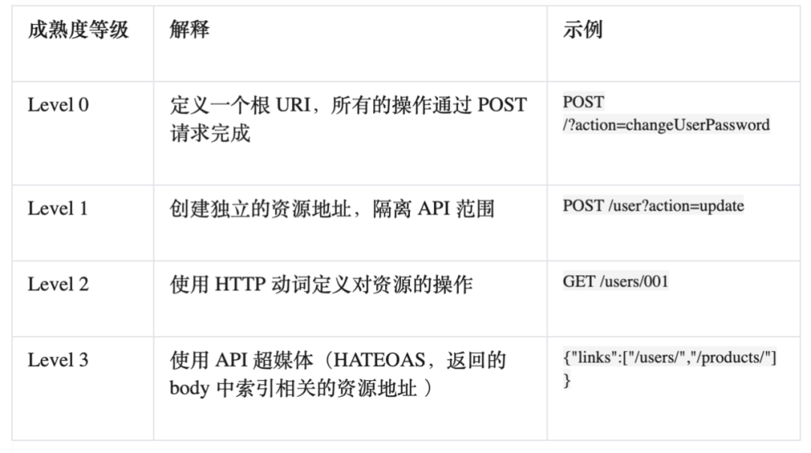

# Representational State Transfer REST

* 由 Roy Fielding 在他2000年的博士论文中提出。是HTTP协议（1.0版和1.1版）的主要设计者、Apache服务器软件的作者之一、Apache基金会的第一任主席
* REST一组架构约束条件和原则。满足这些约束条件和原则的应用程序或设计就是 RESTful
* 服务的目的是提供一个窗口给客户端以便客户端能访问这些资源。服务架构师和开发人员想要这些服务变得易于实现、维护、扩展、伸缩。RESTful 服务应该有下面的属性和特征：
  - 表现层（Representations）:网络上的一个实体，或者说是网络上的一个具体信息。可以用一个URI（统一资源定位符）指向它，每种资源对应一个特定的URI。URI就成了每一个资源的地址或独一无二的识别符。URI只代表资源的实体，不代表它的形式的具体表现形式，应该在HTTP请求的头信息中用Accept和Content-Type字段指定，这两个字段才是对"表现层"的描述。
  - 消息（Messages）
  - URIs:只是表达被操作的资源位置，因此不应该使用动词，且注意单复数区分 动词在http协议中
  - 一致接口（Uniform interface） -（无状态）Stateless
  - 缓存（Caching）:客户端可以缓存
* 基于 REST 的 Web 服务遵循一些基本的设计原则，使得 RESTful 应用更加简单、轻量，开发速度也更快：
  - 通过 URI 来标识资源:系统中的每一个对象或是资源都可以通过一个唯一的 URI 来进行寻址，URI 的结构应该简单、可预测且易于理解，比如定义目录结构式的 URI。
  - 统一接口：POST,GET,PUT,DELETE
  - 资源多重表述:URI
* 一个 HTTP 请求完成一次完整操作
* Headers
  - Accept：服务器需要返回什么样的content。如果客户端要求返回"application/xml"，服务器端只能返回"application/json"，那么最好返回status code 406 not acceptable（RFC2616），当然，返回application/json也并不违背RFC的定义。一个合格的REST API需要根据Accept头来灵活返回合适的数据。
  - If-Modified-Since/If-None-Match：如果客户端提供某个条件，那么当这条件满足时，才返回数据，否则返回304 not modified。比如客户端已经缓存了某个数据，它只是想看看有没有新的数据时，会用这两个header之一，服务器如果不理不睬，依旧做足全套功课，返回200 ok，那就既不专业，也不高效了。
  - If-Match：在对某个资源做PUT/PATCH/DELETE操作时，服务器应该要求客户端提供If-Match头，只有客户端提供的Etag与服务器对应资源的Etag一致，才进行操作，否则返回412 precondition failed
* 鉴权:restful API是无状态的也就是说用户请求的鉴权和cookie以及session无关，每一次请求都应该包含鉴权证明。统一使用Token或者OAuth2.0认证
* 服务器返回的数据格式，应该尽量使用JSON，避免使用XML
* 错误处理（Error handling）
  - 如果状态码是4xx，就应该向用户返回出错信息。一般来说，返回的信息中将error作为键名，出错信息作为键值即可。
  - RESTful API最好做到Hypermedia，即返回结果中提供链接，连向其他API方法，使得用户不查文档，也知道下一步应该做什么。比如 api.example.com
  - rel表示这个API与当前网址的关系（collection关系，并给出该collection的网址），href表示API的路径，title表示API的标题，type表示返回类型。

```json
# error
{
  "link":
    {
      "rel": "collection <https://www.example.com/zoos>",
      "href": "<https://api.example.com/zoos>",
      "title": "List of zoos",
      "type": "application/vnd.yourformat+json"
    }
}
```

## Concept

* Http Status
  - 200 OK - [GET]：服务器成功返回用户请求的数据，该操作是幂等的（Idempotent）,对应，GET,PUT,PATCH,DELETE.
  - 201 CREATED - [POST/PUT/PATCH]：用户新建或修改数据成功
  - 202 Accepted - [_]：表示一个请求已经进入后台排队（异步任务）
  - 204 NO CONTENT - [DELETE]：用户删除数据成功
  - 304 not modified   - HTTP缓存有效
  - 400 INVALID REQUEST - [POST/PUT/PATCH]：用户发出的请求有错误，服务器没有进行新建或修改数据的操作，该操作是幂等的
  - 401 Unauthorized - [_]：表示用户没有权限（令牌、用户名、密码错误）
  - 403 Forbidden - [_] 表示用户得到授权（与401错误相对），但是访问是被禁止的,鉴权成功，但是该用户没有权限
  - 404 NOT FOUND - [_]：用户发出的请求针对的是不存在的记录，服务器没有进行操作，该操作是幂等的
  - 405 method not allowed - 该http方法不被允许
  - 406 Not Acceptable - [GET]：用户请求的格式不可得（比如用户请求JSON格式，但是只有XML格式）
  - 415 unsupported media type - 请求类型错误
  - 422 unprocessable entity - 校验错误时用
  - 429 too many request - 请求过多。
  - 410 Gone -[GET]：用户请求的资源被永久删除，且不会再得到的
  - 422 Unprocesable entity - [POST/PUT/PATCH] 当创建一个对象时，发生一个验证错误
  - 500 INTERNAL SERVER ERROR - [*]：服务器发生错误，用户将无法判断发出的请求是否成功
* Http Operation： Verb， 无状态协议， 客户端和服务器之间，传递资源的某种表现层（json/xml）,通过请求方法实现状态转化
  - GET（SELECT） /zoos：列出所有动物园 从服务器取出资源（一项或多项）。不应有副作用，一次和N次具有相同的副作用，而不是每次GET的结果相同
  - POST（CREATE） /zoos：新建一个动物园 在服务器新建一个资源
    + 所对应的URI并非创建的资源本身，而是资源的接收者
    + 不具备幂等性
  - GET /zoos/ID：获取某个指定动物园的信息
  - PUT (replace）/zoos/ID：更新某个指定动物园的信息（提供该动物园的全部信息）在服务器更新资源（客户端提供改变后的完整资源）
    + 对应的URI是要创建或更新的资源本身
    + 对同一URI进行多次PUT的副作用和一次PUT是相同的；因此，PUT方法具有幂等性
  - PATCH （update）/zoos/ID：更新某个指定动物园的信息（提供该动物园的部分信息） 在服务器更新资源（客户端提供改变的属性）
  - DELETE（remove） /zoos/ID：删除某个动物园 从服务器删除资源。有副作用，但它应该满足幂等性
  - GET /zoos/ID/animals：列出某个指定动物园的所有动物
  - DELETE /zoos/ID/animals/ID：删除某个指定动物园的指定动物
  - HEAD：获取资源的元数据
  - OPTIONS：获取信息
  - 除了POST和DELETE之外，其他的操作需要幂等的，例如对数据多次更新应该返回同样的内容
* URI:格式，Noun(名词):"资源"，就是网络上的一个实体，或者说是网络上的一个具体信息
* Representation : State, playload(Json,xml,html...)
  - 所访问的每个资源都可以使用不同的形式加以表示（比如 XML 或者 JSON），具体的表现形式取决于访问资源的客户端，客户端与服务提供者使用一种内容协商的机制（请求头与 MIME 类型）来选择合适的数据格式，最小化彼此之间的数据耦合。在 REST 的世界中，资源即状态，而互联网就是一个巨大的状态机，每个网页是其一个状态；URI 是状态的表述；REST 风格的应用则是从一个状态迁移到下一个状态的状态转移过程。早期互联网只有静态页面的时候，通过超链接在静态网页间浏览跳转的 page->link->page->link… 模式就是一种典型的状态转移过程。也就是说早期的互联网就是天然的 REST
* 状态转化（State Transfer）:建立在表现层之上
* State less: 每次请求包含所有信息（认证，授权，表单）
  - 对服务器端的请求应该是无状态的，完整、独立的请求不要求服务器在处理请求时检索任何类型的应用程序上下文或状态。这里的无状态服务器，是指服务器不保存会话状态(Session)；而资源本身则是天然的状态，通常是需要被保存的；这里所指无状态服务器均指无会话状态服务器。这里可以列举用户登录的状态保持
* Client-Server: 客户端发起, 服务器端支持分布式架构

## 规范

* 无状态:每个 RESTful API请求都包含了所有足够完成本次操作的信息，服务器端无须保持Session,不会为任何客户端保持状态。一个请求不应该依赖过去的请求，服务对待每个请求都是独立的
* 幂等 Idempotence
  - Methods can also have the property of "idempotence" in that (aside from error or expiration issues) the side-effects of N > 0 identical requests is the same as for a single request.指一次和多次请求某一个资源应该具有同样的副作用。
  - 幂等性属于语义范畴，正如编译器只能帮助检查语法错误一样，HTTP规范也没有办法通过消息格式等语法手段来定义它，这可能是它不太受到重视的原因之一
  - 分布式事务:通过引入支持分布式事务的中间件来保证withdraw功能的事务性
    + 优点是对于调用者很简单，复杂性都交给了中间件来管理
    + 缺点
      * 架构太重量级，容易被绑在特定的中间件上，不利于异构系统的集成
      * 分布式事务虽然能保证事务的ACID性质，而但却无法提供性能和可用性的保证
  - 幂等设计
    + 一个完整的取钱流程被分解成了两个步骤：1.调用create_ticket()获取ticket_id；2.调用idempotent_withdraw(ticket_id, account_id, amount)
    + 虽然create_ticket不是幂等的，但在这种设计下，它对系统状态的影响可以忽略，加上idempotent_withdraw是幂等的，所以任何一步由于网络等原因失败或超时，客户端都可以重试，直到获得结果
    + 相同ticket_id记录操作结果，保证操作只能一次
    + 和分布式事务相比，幂等设计的优势在于它的轻量级，容易适应异构环境，以及性能和可用性方面
* 兼容性：版本，遵循兼容扩展标准
* 可缓存
* 安全
* 一切实体都被抽象成资源，每个资源有一个唯一的标识 —— URI，所有的行为都应该是在资源上的 CRUD 操作
* 状态转化（State Transfer）:使用标准的方法来更改资源的状态，常见的操作有：资源的增删改查操作

## Rest API 成熟度模型

* Level 0
* Level 1 - Resources 通过分割和拆解来解决与处理复杂性的问题，将大型服务端点分解成多个资源
* Level 2 - HTTP Verbs 引入一套标准动词，以同样的方式处理类似的情况，消除不必要的变化
* Level 3 - Hypermedia Controls:HATEOAS (Hypertext As The Engine Of Application State). 引入可发现性，提供使协议更加能自我描述的方法



## 安全

* 请求数据验证
  - Request headers是否合法：如果出现了某些不该有的头，或者某些必须包含的头没有出现或者内容不合法，根据其错误类型一律返回4xx。比如说你的API需要某个特殊的私有头（e.g. X-Request-ID），那么凡是没有这个头的请求一律拒绝。这可以防止各类漫无目的的webot或crawler的请求，节省服务器的开销。
  - Request URI和Request body是否合法：如果请求带有了不该有的数据，或者某些必须包含的数据没有出现或内容不合法，一律返回4xx。比如说，API只允许querystring中含有query，那么"?sort=desc"这样的请求需要直接被拒绝。有不少攻击会在querystring和request body里做文章，最好的对应策略是，过滤所有含有不该出现的数据的请求。
* 数据完整性验证：保证要修改的数据和服务器里的数据是一致的 —— 这是通过Etag来完成。
  - Etag可以认为是某个资源的一个唯一的版本号。当客户端请求某个资源时，该资源的Etag一同被返回，而当客户端需要修改该资源时，需要通过"If-Match"头来提供这个Etag。服务器检查客户端提供的Etag是否和服务器同一资源的Etag相同，如果相同，才进行修改，否则返回412 precondition failed。
  - 使用Etag可以防止错误更新。比如A拿到了Resource X的Etag X1，B也拿到了Resource X的Etag X1。B对X做了修改，修改后系统生成的新的Etag是X2。这时A也想更新X，由于A持有旧的Etag，服务器拒绝更新，直至A重新获取了X后才能正常更新。
  - Etag类似一把锁，是数据完整性的最重要的一道保障。Etag能把绝大多数integrity的问题扼杀在摇篮中，当然，race condition还是存在的：如果B的修改还未进入数据库，而A的修改请求正好通过了Etag的验证时，依然存在一致性问题。这就需要在数据库写入时做一致性写入的前置检查。
* 访问控制：授权验证某个请求是由一个合法的请求者发起
  - Basic Auth会把用户的密码暴露在网络之中，并非最安全的解决方案
  - OAuth的核心部分与HMAC Auth差不多，只不过多了很多与token分发相关的内容
  - HMAC Auth保证一致性：请求的数据在传输过程中未被修改，因此可以安全地用于验证请求的合法性
    + 在请求头中使用两个字段：Authorization和Date（或X-Auth-Timestamp）
    + Authorization字段的内容由":"分隔成两部分，":"前是access-key，":"后是HTTP请求的HMAC值
    + 在API授权的时候一般会为调用者生成access-key和access-secret，前者可以暴露在网络中，后者必须安全保存。
    + 当客户端调用API时，用自己的access-secret按照要求对request的headers/body计算HMAC，然后把自己的access-key和HMAC填入Authorization头中。服务器拿到这个头，从数据库（或者缓存）中取出access-key对应的secret，按照相同的方式计算HMAC，如果其与Authorization header中的一致，则请求是合法的，且未被修改过的；否则不合法。
    + 做HMAC的时候，request headers中的request method，request URI，Date/X-Auth-Timestamp等header会被计算在HMAC中。将时间戳计算在HMAC中的好处是可以防止replay攻击。做HMAC的时候，request headers中的request method，request URI，Date/X-Auth-Timestamp等header会被计算在HMAC中。将时间戳计算在HMAC中的好处是可以防止replay攻击。
    + 使用HMAC可以很大程度上防止DOS攻击 —— 无效的请求在验证HMAC阶段就被丢弃，最大程度保护服务器的计算资源。

## 功能

* rate limiting：访问限制
* metrics：服务器应该收集每个请求的访问时间，到达时间，处理时间，latency，便于了解API的性能和客户端的访问分布，以便更好地优化性能和应对突发请求。
* docs：丰富的接口文档 - API的调用者需要详尽的文档来正确调用API，可以用swagger来实现。
* hooks/event propogation：其他系统能够比较方便地与该API集成。比如说添加了某资源后，通过kafka或者rabbitMQ向外界暴露某个消息，相应的subscribers可以进行必要的处理。不过要注意的是，hooks/event propogation可能会破坏REST API的幂等性，需要小心使用。

## 最佳实践

* 幂等性
* 使用名词赖描述资源，而不是动词
* GET方法与查询参数不应该修改任何状态，用PUT, POST 和 DELETE 方法来代替GET方法修改状态
* 使用复数名词:不要混合单数和复数名词。 保持简单，对所有资源只使用复数名词
* 使用子资源赖描述关系:如果一个资源与另一个资源有关系，使用资资源的写法
  - GET /cars/711/drivers/ Returns a list of drivers for car 711
  - GET /cars/711/drivers/4 Returns driver #4 for car 711
* 使用HTTP Headers来为客户端和服务端序列化数据格式，他们都需要知道数据接收后如何解析与格式化以便相互通信。格式化类型必须在HTTP Header中定义。**Content-Type** 用来定义请求格式化类型；**Accept** 定义一组可以被接收了Response 格式化类型。
* 使用 HATEOAS Hypermedia as the Engine of Application State 是应用超文本链接让API能够创建更好的资源导航
* 为集合提供 filtering, sorting, field selection and paging
  - Filtering: 对所有字段使用唯一的查询参数或用于过滤的查询语言。Use a unique query parameter for all fields or a query language for filtering. `GET /cars?seats<=2`
  - Sorting: 允许在多个字段上进行升序和降序排序。`GET /cars?sort=-manufactorer,+model`
  - Field selection,客户端在列表中只显示一些属性。他们不需要资源的所有属性。让API消费者能够选择返回的字段。这也将减少网络流量并加快API的使用。`GET /cars?fields=manufacturer,model,id,color`
  - paging 使用limit和offset来进行分页。它对于用户而言是灵活的，在领先的数据库中是常见的 `GET /cars?offset=10&limit=5`
    + 在playload中提供到下一页或上一页的链接。重要的是遵循此链接标题值而不是构建自己的URL `https://blog.mwaysolutions.com/sample/api/v1/cars?offset=50&limit=3 rel="last"`
* API版本管理 (Optional)使API版本成为强制性的，不发布没有版本的API。使用简单的序数，并避免使用诸如2.5的点符号。如可以使用URL作为API版本，以字母“v”开头 应该设置默认值 `/blog/api/v1`
* 使用HTTP状态代码处理错误:没有错误处理的API是很难被应用的。纯粹返回HTTP 500和堆栈跟踪信息也并不是很有帮助.使用统一 error payloads,应将所有异常映射到error payloads中
* 允许重载 HTTP method (Optional):一些代理只支持POST和GET方法。为了支持具有这些限制的RESTful API，API需要一种方法来覆盖HTTP方法.使用自定义HTTP头 X-HTTP-Method-Override 来覆盖POST方法
* 域名部署： <https://api.example.com/v1/> 或者 <https://example.org/api/v1/> 或者将版本号放在HTTP头信息中
* 路径endpoint：每个网址代表一种资源（resource），所以网址中不能有动词，只能有名词，而且所用的名词往往与数据库的表格名对应。一般来说，数据库中的表都是同种记录的"集合"（collection），所以API中的名词也应该使用复数
* 围绕「资源」展开，且这些资源通过 URL 进行标识，比如 /posts 用于表示所有文章，/posts/15 用于表示 ID 为 15 的文章，至于资源名称用单数还是复数，没有统一规定，但通常使用复数，另外 URL 要尽可能简单，不要拖泥带水；
* 与资源的交互通过 HTTP 请求方法来实现，而不是将操作动作包含到 URL 中，比如 GET /posts/15 用于获取 ID 为 15 的文章，DELETE /posts/15 用于删除 ID 为 15 的文章
* 接口的设计需要遵循无状态原则，不同的接口请求之间不要有持久化的 Session 认证，每个接口请求都需要自己独自去认证；
* 返回的响应状态码尽可能精准描述服务器处理结果，比如成功用 2XX 状态码，重定向用 3XX 状态码，资源不存在用 404，没有权限用 403，需要认证用 401，服务器错误用 5XX 状态码，并且对异常情况尽可能在响应实体中予以说明；
* 约定在客户端与服务器交互过程中以 JSON 格式传递数据，即资源的外在表现形式是 JSON。

```
{
  "errors": [
   {
    "userMessage": "Sorry, the requested resource does not ist",
    "internalMessage": "No car found in the database",
    "code": 34,
    "more info": "http://dev.mwaysolutions.com/blog/api/v1/errors/12345"
   }
  ]
}
```

## RESTful vs RPC

* RESTful API的优势是HTTP具备更好的易用性，让异构系统更容易集成，且开发执行效率比较高，面向资源要求也比较高
* RPC API可以使用更广泛的框架和方案，技术层面更底层也更为灵活，设计起来相对简单，掌握起来有一定门槛

        RESTful API RPC API

  是否有统一规范 HTTP    无
  面向资源    是   不确定
  性能  中   高
  通用性 高   弱
  复杂度 中   高

## 实例

* <https://api.github.com/>
* <https://developer.github.com/v3/>
* [yahoo天气api](https://query.yahooapis.com/v1/public/yql?q=select%20*%20from%20weather.forecast%20where%20woeid%20%3D%202151330&format=json)

## 工具

* [thx/RAP](https://github.com/thx/RAP)Web API management, free and open sourced, mock data generator, auto test, made by Alibaba,
* [brookshi/Hitchhiker](https://github.com/brookshi/Hitchhiker):a Restful Api test tool <http://www.hitchhiker-api.comw>
* [typicode/jsonplaceholder](https://github.com/typicode/jsonplaceholder):A simple online fake REST API server <https://jsonplaceholder.typicode.com>
* Python: django-rest-framework（django），eve（flask）。各有千秋。可惜python没有好的类似webmachine的实现。
* Erlang/Elixir: webmachine/ewebmachine
* Ruby: webmachine-ruby
* Clojure：liberator
* REST Client:VS code 插件

## 参考

* [RESTful Web 服务：教程](https://zhuanlan.zhihu.com/p/21644769)
* [RESTful API 设计指南](http://www.ruanyifeng.com/blog/2014/05/restful_api)
* [Kerberos](http://danlebrero.com/2017/03/26/Kerberos-explained-in-pictures/)
* [restapitutorial](https://www.restapitutorial.com/)
* [A API Design Case](https://www.ibm.com/developerworks/cn/webservices/0907_rest_soap/)
* [StrongLoop](https://mac.aotu.io/docs/dev-rd/strongloop.html): StrongLoop API Platform构建于开源的LoopBack.io之上，LoopBack是一个高度可扩展的Node.js API框架。借助于LoopBack，可以快速创建可扩展的API和数据库映射。
  - [文档](https://docs.strongloop.com/pages/viewpage.action?pageId=10879061)
* [best-practices-for-a-pragmatic-restful-api](https://www.vinaysahni.com/best-practices-for-a-pragmatic-restful-api)
