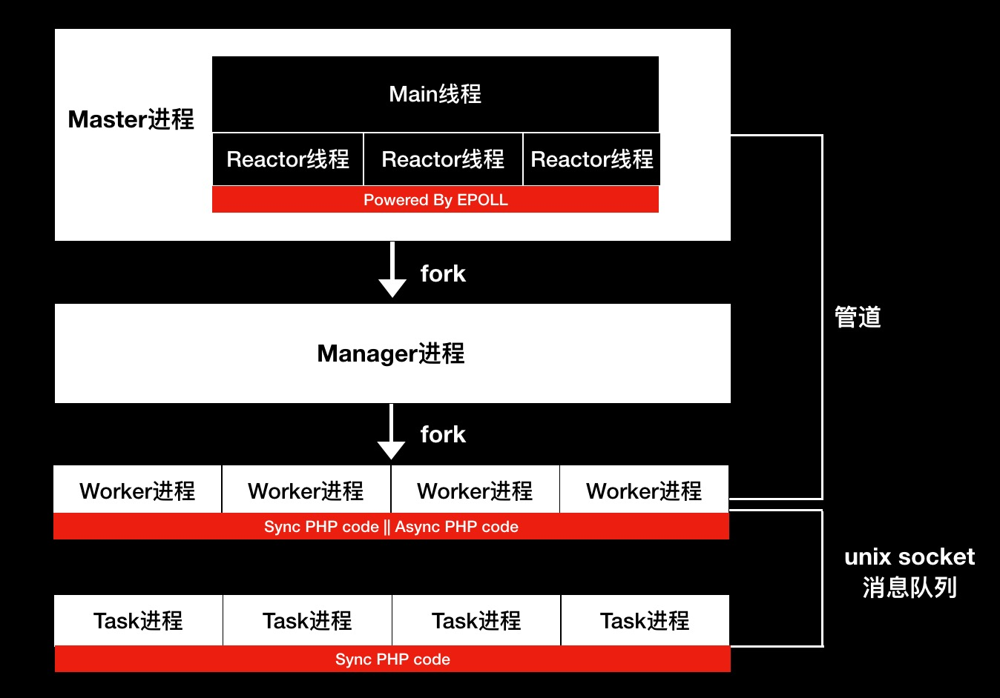
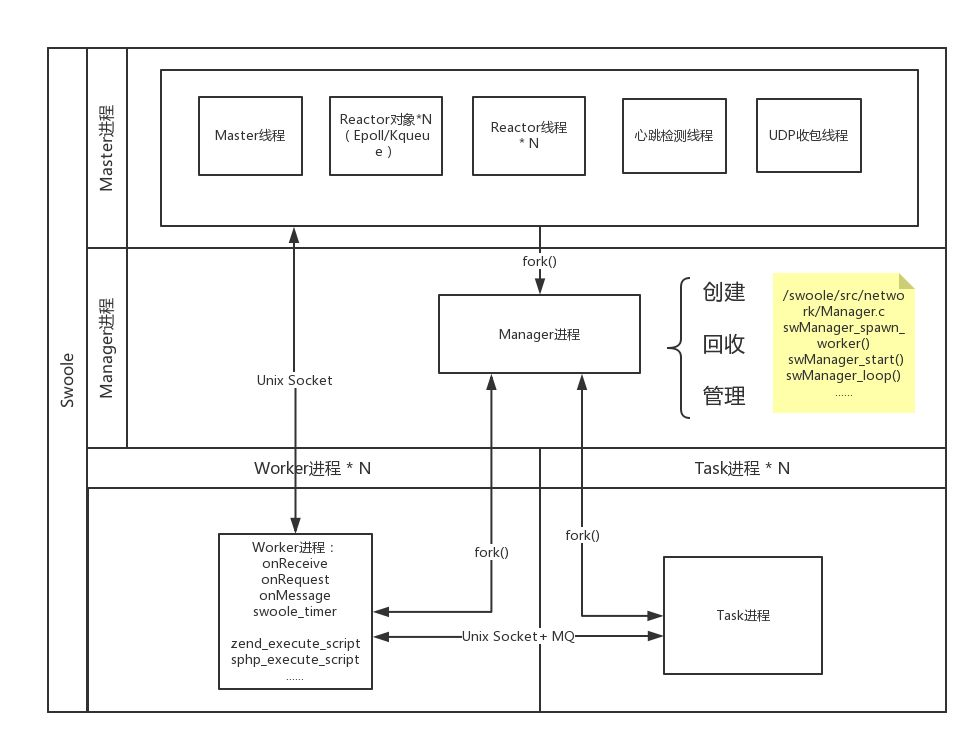
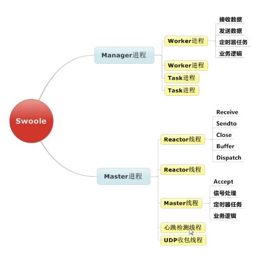

# [swoole-src](https://github.com/swoole/swoole-src)

Event-driven asynchronous & concurrent & coroutine networking engine with high performance for PHP. <http://www.swoole.com/>

* 一个异步并行的通信引擎，作为 PHP 的扩展来运行
* 常驻内存，避免重复加载带来的性能损耗，提升性能,意味着mysql和redis等连接将会是长连接
* 协程异步，提高对 I/O 密集型场景并发处理能力
* 方便地开发Http、WebSocket、TCP、UDP 等应用，可以与硬件通信
  - TCP/UDP/UnixSock 服务器端
  - Http/WebSocket/Http2.0 服务器端
  - 协程 TCP/UDP/UnixSock 客户端
  - 协程 MySQL 客户端
  - 协程 Http/WebSocket 客户端
  - 协程 Http2 客户端
  - AsyncTask
  - 毫秒定时器
  - 协程文件读写
* 优点
  - Node.js 异步回调
  - Go语言协程
  - 常驻内存 Server 程序:在每个 Worker 进程中，应用启动及之前的环境初始化工作只执行一次，请求结束后，应用实例不会回收，后续发给该 Worker 进程处理的请求会复用之前已经启动应用实例，再结合 MySQL、Redis 长连接，从而极大提高了应用性能
  - 实现 TCP 、 UDP 异步网络通信
* 缺点
  - 无法做密集计算:php甚至是所有动态语言都存在的问题
  - 容易内存泄露:在处理全局变量，静态变量一定要小心，不会被GC清理的变量会存在整个生命周期中，如果没有正确的处理，很容易消耗完所有内存
* 场景
  - WebSocket 即时通信、聊天
  - 推送服务器
  - RPC 远程调用服务、网关、代理、游戏服务器等

## 版本

* 4.0
  - 提供了完整协程(Coroutine)+通道(Channel)特性，带来全的CSP编程模型
  - 底层加入 Hook 机制，使原生 Mysql PDO、Redis 操作协程化
  - 协程（Coroutine）取代了异步回调，成为 Swoole 官方推荐编程方式
  - 解决了异步回调编程困难的问题，应用层使用同步编程方式，底层自动实现异步IO，既保证了编程的简单性，又可借助异步 IO，提升系统的并发能力
* 4.3
  - 异步回调模块已过时，目前仅修复 BUG，不再进行维护, 且在4.3版本中移除了异步模块。使用 Coroutine 协程模块
* 4.4
  - 支持 CURL 协程化

## 安装

```sh
cp -R /usr/local/Cellar/openssl/1.0.2o_1/include/openssl /usr/local/include # fatal error: 'openssl/ssl.h' file not found #include <openssl/ssl.h>
# Enable http2 support, require nghttp2 library.
brew install hiredis # fatal error: 'hiredis/hiredis.h'

brew install openssl
brew install nghttp2
brew install swoole

wget https://github.com/swoole/swoole-src/archive/v1.10.2.zip
tar zxvf v1.10.2.zip
cd swoole
phpize
./configure  --enable-openssl --enable-async-redis --with-php-config=/Applications/MAMP/bin/php/php7.1.0/bin/php-config    --prefix=/usr/local   CPPFLAGS="-I/usr/local/opt/openssl/include"  LDFLAGS="-L/usr/local/opt/openssl/lib" --enable-swoole-debug
./configure \
--enable-coroutine \
--enable-openssl  \
--enable-http2  \
--enable-async-redis \
--enable-sockets \
--enable-mysqlnd \
with-openssl-dir=/usr/local/Cellar/openssl/1.0.2s

make clean && make && sudo make install  # 编译后的模块在 /modules 中，将swoole.so添加到php.ini中

# ubuntu
sudo apt install php-pear
sudo pecl channel-update pecl.php.net
// Enable openssl support, require openssl library
sudo pecl download swoole

# php.ini
extension=swoole.so

# add swoole.ini
sudo ln -s  /etc/php/7.2/mods-available/swoole.ini 20-swoole.ini

# check
php -m | grep swoole
# 查看是否有 async_redis => enabled
php --ri swoole
```

## 知识储备

* 多进程/多线程
  - 了解 Linux 操作系统进程和线程的概念
  - 了解 Linux 进程/线程切换调度的基本知识
  - 了解进程间通信的基本知识，如管道、UnixSocket、消息队列、共享内存
* SOCKET
  - 了解 SOCKET 的基本操作如 accept/connect、send/recv、close、listen、bind
  - 了解 SOCKET 的接收缓存区、发送缓存区、阻塞/非阻塞、超时等概念
* IO复用
  - 了解 select/poll/epoll
  - 了解基于 select/epoll 实现的事件循环，Reactor 模型
  - 了解可读事件、可写事件
* TCP/IP网络协议
  - 了解 TCP/IP 协议
  - 了解 TCP、UDP 传输协议
* 调试工具
  - 使用 gdb 调试 Linux 程序
  - 使用 strace 跟踪进程的系统调用
  - 使用 tcpdump 跟踪网络通信过程
  - 其他 Linux 系统工具，如 ps、lsof、top、vmstat、netstat、sar、ss 等

## 原理

* 上下文:存在不同生命周期，就有了不同的上下文 Context
  - 上下文对象都实现了基础的 ContextInterface 接口，因此可以使用上下文存取当前请求生命周期的数据
* master进程：一个包含多线程进程，启动 Swoole PHP 脚本时
  - 创建 master 进程（整个应用的 root 进程）
  - master 进程 fork 出 Manager 进程 和 Reactor 线程组
  - Reactor线程组：包含在 Master 进程中的多线程程序，用来处理 TCP 连接和数据收发（异步非阻塞方式）
    + 以多线程方式运行
    + 负责维护客户端TCP连接、处理网络IO、处理协议、收发数据
    + Reactor 主线程用于accept在 Accept 新的连接后,会将这个连接分配给一个固定的 Reactor 线程，并由这个线程负责监听此 socket
    + 后面的网络数据IO则靠Reactor线程与客户端完成
      * 将TCP客户端发来的数据缓冲、拼接、拆分成完整的一个请求数据包
      * 在 socket 可读时读取数据，并进行协议解析，将请求投递到 Worker 进程(不包括Tasker进程)
      * 在 socket 可写时将数据发送给 TCP 客户端
    + 完全是异步非阻塞的模式
    + 方法
      * onStart
      * onShutdown
* manager进程
  - 方法
    + onManagerStart
    + onManagerStop
  - 负责管理 Worker 进程
    + fork worker进程
    + 监控worker进程状态
    + 当Worker进程异常退出，如发生PHP的致命错误、被其他程序误杀，或达到max_request次数之后正常退出。会重新拉起新的Worker进程
    + 子进程结束运行时，负责回收此子进程，避免成为僵尸进程
    + 服务器关闭时，manager进程将发送信号给所有子进程，通知子进程关闭服务
    + 服务器reload时，manager进程会逐个关闭/重启子进程
    + Master进程是多线程，不能安全的执行fork操作
* worker进程
  - 以多进程方式运行
  - 请求的处理逻辑
    + 接受由 Reactor 线程投递的请求数据包，并执行 PHP 回调函数处理数据
    + 生成响应数据并发给 Reactor 线程，由 Reactor 线程发送给客户端
      * TCP客户端，Worker进程处理完请求后，调用$server->send会将数据发给Reactor线程，由Reactor线程再发给客户端
      * UDP客户端，Worker进程处理完请求后，调用$server->sendto会直接发给客户端，无需经过Reactor线程
  - 可以是异步非阻塞模式，也可以是同步阻塞模式
  - 方法
    + onWorkerStart
    + onWorkerStop
    + onConnect
    + onClose
    + onReceive
    + onFinish
* TaskWorker进程：以多进程方式运行
  - 用于任务分发：当 Worker 进程将任务异步分发到任务队列时，Task Worker 负责从队列中消费这些任务（同步阻塞方式处理），处理完成后将结果返回给 Worker 进程
    + 接受由Worker进程通过swoole_server->task/taskwait方法投递的任务
    + 处理任务，并将结果数据返回（使用swoole_server->finish）给Worker进程
  - 支持定时器
  - 做一些异步慢速任务，比如webim中发广播，发送邮件
  - 实现PHP的数据库连接池，异步队列等
  - 完全是同步阻塞模式
  - 方法
    + onTask
    + onWorkerStart
  - 底层会为Worker进程、TaskWorker进程分配一个唯一的ID
  - 不同的Worker和TaskWorker进程之间可以通过sendMessage接口(unix socket)进行通信
* 关系
  - Reactor就是nginx，Worker就是php-fpm
  - Reactor线程异步并行地处理网络请求，然后再转发给Worker进程中去处理
  - Reactor和Worker间通过UnixSocket进行通信
  - Server就是一个工厂，那Reactor就是销售，接受客户订单
  - Worker就是工人，当销售接到订单后，Worker去工作生产出客户要的东西
  - TaskWorker可以理解为行政人员，可以帮助Worker干些杂事，让Worker专心工作
* 一个形象的比喻，如果把基于 Swoole 的 Web 服务器比作一个工厂，那么 Reactor 就是这个工厂的销售员，Worker 是负责生产的工人，销售员负责接订单，然后交给工人生产，而 Task Worker 可以理解为行政人员，负责提工人处理生产以外的杂事，比如订盒饭、收快递，让工人可以安心生产






## Server

* 强大的TCP/UDP Server框架，支持多线程，EventLoop，事件驱动，异步，Worker进程组，Task异步任务，毫秒定时器，SSL/TLS隧道加密
* 类型
  - `swoole_http_server` swoole_server子类，内置Http支持
    + 采用优秀的 Reactor 模型，处理速度可逼进 NGINX 处理静态页面速度
  - `swoole_websocket_server`是swoole_http_server的子类，内置了WebSocket的支持
  - `swoole_redis_server`是swoole_server子类，内置Redis服务器端协议支持
* 默认使用SWOOLE_PROCESS模式，因此会额外创建Master和Manager两个进程
* TCP协议
  - 流式：数据包没有边界.在接收1个大数据包时，可能会被拆分成多个数据包发送。多次Send底层也可能会合并成一次进行发送
    + 分包：Server收到了多个数据包，需要拆分数据包
    + 合包：Server收到数据只是包的一部分，需要缓存数据，合并成完整的包
  - 基于TCP协议的应用层协议：HTTP、HTTPS、FTP、SMTP、POP3、IMAP、SSH、Redis、Memcache、MySQL
  - 自定义网络通信协议
    + EOF协议:每个数据包结尾加一串特殊字符表示包已结束。如memcache、ftp、stmp都使用\r\n作为结束符。发送数据时只需要在包末尾增加\r\n即可。使用EOF协议处理，一定要确保数据包中间不会出现EOF，否则会造成分包错误。
    + 固定包头+包体协议:一个数据包总是由包头+包体2部分组成。包头由一个字段指定了包体或整个包的长度，长度一般是使用2字节/4字节整数来表示。服务器收到包头后，可以根据长度值来精确控制需要再接收多少数据就是完整的数据包。
      * Swoole的Server和异步Client都是在onReceive回调函数中处理数据包，当设置了协议处理后，只有收到一个完整数据包时才会触发onReceive事件
      * 同步客户端在设置了协议处理后，调用 $client->recv() 不再需要传入长度，recv函数在收到完整数据包或发生错误后返回
* 多进程使用fork()系统调用
* 多线程使用pthread线程库
* 使用了eventfd作为线程/进程间消息通知的机制
* 用了signalfd来实现对信号的屏蔽和处理。可以有效地避免线程/进程被信号打断，系统调用restart的问题。在主进程中Reactor/AIO线程不会接受任何信号
* 进程错误后会继续重启

```php
# tcp/udp server,可封装rpc
$s = new \Swoole\Server();

//http server,替代fpm
$s = new \Swoole\Http\Server()
// 开启http2 支持,实现基于http2 的grpc
$s->set(['open_http2_protocol' => true]);

// websocket
$s = new \Swoole\WebScoket\Server();

// 网络通信协议设计
$server->set(array(
    'open_eof_split' => true,
    'package_eof' => "\r\n",
));
$client->set(array(
    'open_eof_split' => true,
    'package_eof' => "\r\n",
));

dtruss|strace -f -p masterPid
```

## Client

* TCP/UDP/UnixSocket客户端，支持IPv4/IPv6，支持SSL/TLS隧道加密，支持SSL双向证书，支持同步并发调用，支持异步事件驱动编程

## Event

* EventLoop API，让用户可以直接操作底层的事件循环，将socket，stream，管道等Linux文件加入到事件循环中
* eventloop接口仅可用于socket类型的文件描述符，不能用于磁盘文件读写

## Async

* 异步IO接口，提供了异步文件系统IO，定时器，异步DNS查询，异步MySQL等API，异步Http客户端，异步Redis客户端
* `swoole_async_read/swoole_async_write` 文件系统操作的异步接口,4.3 已放弃，用协程实现
* MySQL
  - 勿同时使用异步回调和协程MySQL
  - swoole_mysql 已移除
  - Swoole\Redis 移除

## swoole_timer

异步毫秒定时器，可以实现间隔时间或一次性的定时任务

* 底层基于 epoll_wait（异步）和 setitimer（同步）实现，数据结构使用最小堆。定时器的添加和删除，全部为内存操作，无 IO 消耗，因此性能是非常高
* `swoole_timer_tick` 间隔时钟控制器
* `swoole_timer_after` 指定的时间后执行
* `swoole_timer_clear` 删除定时器

## 协程 Coroutine

* 异步回调的一种解决方案,非标准的线程实现
* 在2.0开始内置协程(Coroutine)能力，提供了具备协程能力IO接口（统一在命名空间Swoole\Coroutine*）
  - 在4.4之前的版本中，Swoole一直不支持CURL协程化，在代码中无法使用curl。由于curl使用了libcurl库实现，无法直接hook它的socket，4.4版本使用Swoole\Coroutine\Http\Client模拟实现了curl的API，并在底层替换了curl_init等函数的C Handler
* 协程是子程序的一种，可以通过yield的方式转移程序控制权，协程之间不是调用者与被调用者的关系，而是彼此对称、平等的
* 每个 Worker 进程会存在一个协程调度器来调度协程，协程切换的时机就是遇到 I/O 操作或代码显性切换时，进程内以单线程的形式运行协程，也就意味着一个进程内同一时间只会有一个协程在运行且切换时机明确，也就无需处理像多线程编程下的各种同步锁的问题
* 有轻量，高效，快速等特点
  - 用户态线程，遇到 IO 主动让出
  - PHP 代码依然是串行执行的，无需加锁
  - 开销极低，仅占用内存，不存在进程/线程切换开销
  - 并发量大，单个进程可开启 50W 个协程
  - 随时随地，只要想并发，就调用 go 创建新协程
* 底层封装了协程，对比传统的PHP层协程框架，开发者不需要使用yield关键词来标识一个协程IO操作，所以不再需要对yield的语义进行深入理解以及对每一级的调用都修改为yield，极大提高了开发效率
* 完全有用户态程序控制，也被称为用户态的线程,由用户以非抢占的方式调度，所有的操作都可以在用户态完成，创建和切换的消耗更低。而不是操作系统，没有系统调度上下文切换的开销.开发者可以无感知的用同步的代码编写方式达到异步IO的效果和性能，避免了传统异步回调所带来的离散的代码逻辑和陷入多层回调中导致代码无法维护
* 缺点
  - 基于PHP生成器Generators\Yield方式实现
    + 所有主动让出的逻辑都需要yield关键字。给程序员带来极大的概率犯错，导致大家对协程的理解转移到了对Generators语法的原理的理解
    + 由于语法无法兼容老的项目，改造老的项目工程复杂度巨大，成本太高
  - PHP执行需要的所有状态都保存在一个个通过链表结构关联的VM栈里，每个栈默认会初始化为256K，Swoole可以单独定制这个栈的大小(协程默认为8k),当栈容量不足的时候，会自动扩容，仍然以链表的关系关联每个栈。在每次函数调用的时候，都会在VM Stack空间上申请一块新的栈帧来容纳当前作用域执行所需。
  - 改变原本php的运行方式，不是在函数运行结束切换栈帧，而是在函数执行当前op_array中间任意时候（swoole内部控制为遇到IO等待），可以灵活切换到其他栈帧。
* 使用go函数可以让一个函数并发地去执行
  - 使用 `go()(\Swoole\Coroutine::create() 的简写)` 创建一个协程
  - 在 go() 的回调函数中, 加入协程需要执行代码(非阻塞代码)
* 协程通信
  - 通道（Channel）:在Swoole4协程中使用`new chan`创建一个通道。通道可以理解为自带协程调度的队列，两个接口
    + push：向通道中写入内容，如果已满，它会进入等待状态，有空间时自动恢复
    + pop：从通道中读取内容，如果为空，它会进入等待状态，有数据时自动恢复
* 延时任务：用defer实现
  - 可以将请求响应式的接口拆分为两个步骤：先发送数据, 再并发收取响应结果
* 需要的功能协程 runtime 下还没支持
  - 官方和社区已经贡献了很多协程版 API 可供使用
  - 可以使用 swoole 提供的协程版 client 进行封装, 可以参考 官方 amqp client 封装, 将 socket() 函数实现的 tcp client, 使用 swoole 协程版 tcp client 实现即可
* task 也可以开启协程
* 内部调用redis mysql,执行时间为 max(redis, mysql)
* swoole 的协程 vs go 的协程
  - swoole 的协程 和 golang的调度方式完全不同，每一个进程里面的协程都是串行执行所以无需担心访问资源加锁问题
  - 都是利用多进程实现并行: 进程的协程是串行执行.如何利用 多核 CPU 实现并行呢。答案是利用多进程实现。现在 task 也可以开启协程
  - 基础知识: 网络编程 + 协程, 不会因为是用 swoole 还是 go 而有所减少, 基础不大好, 表现出来了就是学着学着就容易卡住, 效率上不来
  - 以为写的是 swoole, 不不不, 写的是一个又一个功能的 API, go 也同样(要用到 redis/mysql/mq, 相应的 API 还是得学得会), 区别在于
    + swoole 趋势是在底层实现支持(比如 协程runtime), 这样 PHPer 可以无缝切换过来
    + Gopher 则需要学习一个又一个基于 go 协程封装好的 API. 当初在 PHP 中学习的这些 API, 到 go 里面, 一样需要再熟悉一遍
  - 性能： 用 swoole 达不到的性能, 换个语言, 呵呵呵. 难易程度排行: 加机器 < 加程序员 < 加语言.
* 注意事项
  - 不能存在阻塞代码:Swoole 提供的异步函数的 MySQL、Redis、Memcache、MongoDB、HTTP、Socket等客户端，文件操作、sleep/usleep 等均为阻塞函数
    + Swoole 提供了 MySQL、PostgreSQL、Redis、HTTP、Socket 的协程客户端可以使用，同时 Swoole 4.1 之后提供了一键协程化的方法 \Swoole\Coroutine::enableCoroutine()，只需在使用协程前运行这一行代码，Swoole 会将 所有使用 php_stream 进行 socket 操作均变成协程调度的异步 I/O
  - 不能通过全局变量储存状态:`$_GET/$_POST/$_REQUEST/$_SESSION/$_COOKIE/$_SERVER`等$_开头的变量、global 变量，以及 static 静态属性
    + 同一个 Worker 内还会存在多个协程并存在协程切换，也就意味着一个 Worker 会在一个时间周期内同时处理多个协程（或直接理解为请求）的代码，也就意味着如果使用了全局变量来储存状态可能会被多个协程所使用，也就是说不同的请求之间可能会混淆数据
    + 对于全局变量，均是跟随着一个 请求(Request) 而产生的,CLI 应用，会存在 全局周期 和 请求周期(协程周期) 两种长生命周期
      * 全局周期，我们只需要创建一个静态变量供全局调用即可，静态变量意味着在服务启动后，任意协程和代码逻辑均共享此静态变量内的数据，也就意味着存放的数据不能是特别服务于某一个请求或某一个协程；
      * 协程周期，由于 Hyperf 会为每个请求自动创建一个协程来处理，那么一个协程周期在此也可以理解为一个请求周期，在协程内，所有的状态数据均应存放于 Hyperf\Utils\Context 类中，通过该类的 get、set 来读取和存储任意结构的数据，这个 Context(协程上下文) 类在执行任意协程时读取或存储的数据都是仅限对应的协程的，同时在协程结束时也会自动销毁相关的上下文数据。
* 适用场景
  - 高并发服务，如秒杀系统、高性能 API 接口、RPC 服务器，使用协程模式，服务的容错率会大大增加，某些接口出现故障时，不会导致整个服务崩溃
  - 爬虫，可实现非常强大的并发能力，即使是非常慢速的网络环境，也可以高效地利用带宽
  - 即时通信服务，如 IM 聊天、游戏服务器、物联网、消息服务器等等，可以确保消息通信完全无阻塞，每个消息包均可即时地被处理
* 问题
  - 需要为每个并发保存栈内存并维护对应的虚拟机状态，如果程序并发很大可能会占用大量内存
  - 调度会增加额外的一些 CPU 开销
* 协程在底层实现上是单线程的，因此同一时间只有一个协程在工作，协程的执行是串行的，与线程不同，多个线程会被操作系统调度到多个 CPU 并行执行
  - 一个协程正在运行时，其他协程会停止工作。当前协程执行阻塞 IO 操作时会挂起，底层调度器会进入事件循环。当有 IO 完成事件时，底层调度器恢复事件对应的协程的执行。
  - 在 Swoole 中对 CPU 多核的利用，仍然依赖于 Swoole 引擎的多进程机制
* 编程范式
  - 协程之间通讯不要使用全局变量或者引用外部变量到当前作用域，而要使用 Channel
  - 项目中如果有扩展 hook 了 zend_execute_ex 或者 zend_execute_internal 这两个函数，需要特别注意一下 C 栈，可以使用 co::set 重新设置 C 栈大小
* Swoole 会在 TCP Server 和 HTTP Server 回调函数中会自动开启协程，所以不需要显式通过 go 关键字启动协程，可以在回调函数中使用 MySQL 和 Redis 客户端协程组件发起请求

| 多进程   | 多线程       | 协程           |
| -------- | ------------ | -------------- |
| 创建     | fork         | pthread_create |
| 回收     | wait         | pthread_join   |
| 通信方式 | IPC 进程间通 | 数据同步/锁    |
| 资源消耗 | 进程切换开销 | 进程切换开销   |
| 并发能力 | 数百         | 数千           |
| 编程难度 | 困难         | 非常困难       |

```php
// 没有开启协程runtime,需要协程版 API
use Swoole\Coroutine as Co; // 常用的缩写方式

go(function () { // 创建协程, 回调函数中写需要在协程中执行的代码
    echo "daydaygo";
    Co::sleep(1); // 不能是阻塞代码
});

// 开启协程runtime
\Swoole\Runtime::enableCoRoutine();
go(function () { // 创建协程, 回调函数中写需要在协程中执行的代码
    echo "daydaygo";
    sleep(1); // 不能是阻塞代码
});

Swoole\Runtime::enableCoroutine();

go(function () {
    echo "a";
    defer(function () {
        echo "~a";
    });
    echo "b";
    defer(function () {
        echo "~b";
    });
    sleep(1);
    echo "c";
});

function Swoole\Coroutine::create(callable $function, ...$args) : int|false;
function go(callable $function, ...$args) : int|false; // 短名API
```

## 进程 Process

* 进程管理模块，可以方便的创建子进程，进程间通信，进程管理
* PHP自带的pcntl，存在很多不足
  - 没有提供进程间通信的功能
  - 不支持重定向标准输入和输出
  - 只提供了fork这样原始的接口，容易使用错误
  - swoole_process提供了比pcntl更强大的功能，更易用的API，使PHP在多进程编程方面更加轻松
* 特性
  - 基于Unix Socket和sysvmsg消息队列的进程间通信，只需调用write/read或者push/pop即可
  - 支持重定向标准输入和输出，在子进程内echo不会打印屏幕，而是写入管道，读键盘输入可以重定向为管道读取数据
  - 配合Event模块，创建的PHP子进程可以异步的事件驱动模式
  - 提供了exec接口，创建的进程可以执行其他程序，与原PHP父进程之间可以方便的通信
* 场景
  - 多进程并行
* `Swoole\Process::__construct(callable $function, $redirect_stdin_stdout = false, $create_pipe = true)`
  - `$function`：子进程创建成功后要执行的函数，底层会自动将函数保存到对象的callback属性上。如果希望更改执行的函数，可赋值新的函数到对象的callback属性
  - `$redirect_stdin_stdout`，重定向子进程的标准输入和输出。启用此选项后，在子进程内输出内容将不是打印屏幕，而是写入到主进程管道。读取键盘输入将变为从管道中读取数据。默认为阻塞读取。
  - `$create_pipe`：是否创建管道，启用$redirect_stdin_stdout后，此选项将忽略用户参数，强制为true。如果子进程内没有进程间通信，可以设置为 false。
* 进程间的通讯
  - 管道pipe：每次创建一个进程后，就会随之创建一个管道
    + 半双工: 数据单向流动, 一端只读, 一端只写
    + 同步 vs 异步: 默认为同步阻塞模式, 可以使用 swoole_event_add() 添加管道到 swoole 的 event loop 中, 实现异步IO
  - 消息队列

```php
pstree -p pid

$process = new Swoole\Process('callback_function', false, true);
$process->write('数据');#写入数据
$process->read()#读取数据

for ($i = 0; $i < 3; $i++) {
    $process = new Swoole\Process(function ($process) {
        var_dump('子进程：' . $process->pop());
//        $process->push('hello 主进程');#推送到主进程
    });
    $process->useQueue(1, 2 | swoole_process::IPC_NOWAIT);//启用消息队列，争抢模式，非阻塞，可能会被任意一个子进程接收到
    $pid = $process->start();

    $process->push('hello 子进程');#推送到子进程,不能当做管道使用
//    echo '主进程消息：' . $process->pop() . PHP_EOL;
}
```

## Buffer

强大的内存区管理工具，像C一样进行指针计算，又无需关心内存的申请和释放，而且不用担心内存越界，底层全部做好了

## Memory

* 优点
  - Memory下的模块可以安全的用于异步非阻塞程序中，不存在任何IO消耗
  - 所有模块均为多进程安全的，无需担心数据同步问题
  - Memory相关模块对象为有限资源，不可大量创建
* Table：基于共享内存和自旋锁实现的超高性能内存表。彻底解决线程，进程间数据共享，加锁同步等问题。
  - swoole_table的性能可以达到单线程每秒读写200W次
  - 应用代码无需加锁，Table内置行锁自旋锁，所有操作均是多线程/多进程安全。用户层完全不需要考虑数据同步问题。
  - 支持多进程，Table可以用于多进程之间共享数据
  - 使用行锁，而不是全局锁，仅当2个进程在同一CPU时间，并发读取同一条数据才会进行发生抢锁
* 优点
  - 进程间共享

## SMProxy

一个基于 Swoole 开发的 MySQL 数据库连接池

* 将数据库连接作为对象实例存储在内存中，当用户需要访问数据库时，第一次会建立连接，后面并不会建立新的连接，而是从连接池中取出一个已建立的空闲连接对象。使用完毕后，也不会将连接关闭，而是将连接放回连接池中，以供下一个请求访问使用。连接的建立、断开都由连接池自身来管理。
* 可以通过设置连接池的参数来控制连接池中的初始连接数、连接的上下限数以及每个连接的最大使用次数、最大空闲时间等等。也可以通过其自身的管理机制来监视数据库连接的数量、使用情况等。超出最大连接数会采用协程挂起，等到有连接关闭再恢复协程继续操作。
* 特性
  - 支持读写分离
  - 支持数据库连接池，能够有效解决 PHP 带来的数据库连接瓶颈
  - 支持 SQL92 标准
  - 采用协程调度
  - 支持多个数据库连接，多个数据库，多个用户，灵活搭配
  - 遵守 MySQL 原生协议，跨语言，跨平台的通用中间件代理
  - 支持 MySQL 事务
  - 支持 HandshakeV10 协议版本
  - 完美兼容 MySQL5.5 - 8.0
  - 兼容各大框架，无缝提升性能

```sh
git clone https://github.com/louislivi/SMProxy.git
cd SMProxy
composer install --no-dev

./bin/SMProxy start
```

## 压测

* -c 参数，并发的数量，会启动对应数量的进程用于测试
* -n 参数，请求的总数量，-n 10000, -c 100，平均到每个子进程的数量为100
* -s 参数，Server的IP:PORT
* -f 参数，测试单元的名称，目前提供了long_tcp/short_tcp/udp/websocket 函数，可以自行实现单元测试函数

```sh
php run.php -c 100 -n 10000 -s tcp://127.0.0.1:9501 -f long_tc
```

## 服务保持

* 使用下面的脚本需要将Server程序的进程名称设置为master，如 `cli_set_process_title("php server.php: master")`
* 可以通过netstat -lnp 检测端口是否在监听，如果未在监听，则执行restart
* 通过一个check.php发送一段带有逻辑的请求，试探服务器是否可以正常工作，如果无法工作，执行restart
* 使用supervisor监控进程的工具
* 如果在Docker容器中使用，可以在docker run时增加参数--restart=always

```sh
*/1 * * * * /data/script/check_server.sh

# /data/script/check_server.sh
count=`ps -fe |grep "server.php" | grep -v "grep" | grep "master" | wc -l`

echo $count
if [ $count -lt 1 ]; then
ps -eaf |grep "server.php" | grep -v "grep"| awk '{print $2}'|xargs kill -9
sleep 2
ulimit -c unlimited
/usr/local/bin/php /data/webroot/server.php
echo "restart";
echo $(date +%Y-%m-%d_%H:%M:%S) >/data/log/restart.log
fi
```

## MySQL

* 长连接就可以避免每次请求都创建连接的开销，节省了时间和IO消耗。提升了PHP程序的性能
* 断线重连
  - mysql_query执行后检测返回值
  - 如果`mysql_query`返回失败，检测错误码发现为2006/2013（这2个错误表示连接失败），再执行一次`mysql_connect`
  - 执行`mysql_connect`后，重新执行`mysql_query`，这时必然会成功，因为已经重新建立了连接
  - 如果mysql_query返回成功，那么连接是有效的，这是一次正常的调用
* 异步
  - MySQL是根据连接数分配资源的，一个MySQL连接同时只能执行1个SQL线程，如果异步MySQL存在并发那么必须创建多个MySQL连接。1000连接那么需要维持1000线程才可以。线程数量增加后，线程间切换会占用大量CPU资源。
  - MySQL短连接反而不会出现此问题，因为短连接在使用完后就释放了。不会占用MySQL-Server的连接资源
  - 异步MySQL并没有节省SQL执行的时间
  - 异步回调程序中，异步MySQL并没有提升性能。异步最大的好处是可以高并发，如果并发1万个请求，那么就需要建立1万个MySQL连接，这会给MySQL-Server带来巨大的压力。
  - MySQL短连接反而不会出现此问题，因为短连接在使用完后就释放了。不会占用MySQL-Server的连接资源
  - 异步MySQL还带来了额外的编程复杂度，所以除非是特殊场景的需求，否则不建议使用异步MySQL。
  - 坚持要使用异步，那么必须是异步MySQL+连接池的形式。超过规定的MySQL最大连接后，应当对SQL请求进行排队，而不是创建新连接，避免大量并发请求导致MySQL服务器崩溃。
* 连接池
  - 连接池使用一个共享资源的模式，如并发100个请求，实际上并不是每个请求的所有时间都在执行SQL查询。这样100个请求，共享20个MySQL连接就可以满足需求了。当一个请求操作完数据库后，开始进入模板渲染等流程，这时就会释放数据库连接给其他的请求使用。
  - 仅在超大型应用中才有价值
  - 同步阻塞模式
    + 可基于swoole的AsyncTask模块实现的连接池，编程简单，没有数据同步和锁的问题。甚至可以多个服务共享连接池
    + 缺点是
      * 灵活性不如多线程连接池，无法动态增减连接
      * 有一次进程间通信的开销

## 是否阻塞

* 同步阻塞函数
  - mysql、mysqli、pdo以及其他DB操作函数
  - sleep、usleep
  - curl
  - stream、socket扩展的函数
  - swoole_client同步模式
  - memcache、redis扩展函数
  - file_get_contents/fread等文件读取函数
  - swoole_server->taskwait
  - swoole_server->sendwait
* 异步非阻塞函数
  - swoole_client异步模式
  - mysql-async库
  - redis-async库
  - swoole_timer_tick/swoole_timer_after
  - swoole_event系列函数
  - swoole_table/swoole_atomic/swoole_buffer
  - swoole_server->task/finish函数

## 内存分配

* 不建议使用jemalloc, 可能会降低程序稳定性，建议使用标准的malloc和PHP官方提供的emalloc (默认)
* 异步程序是基于回调链引用计数实现内存的管理

## 日志

* 设置
  - Swoole\Server->set方法
  - Swoole\Coroutine::set静态方法
  - Swoole\Async::set静态方法
* 等级
  - `SWOOLE_LOG_DEBUG`：调试日志，仅作为内核开发调试使用
  - `SWOOLE_LOG_TRACE`：跟踪日志，可用于跟踪系统问题，调试日志是经过精心设置的，会携带关键性信息
  - `SWOOLE_LOG_INFO`：普通信息，仅作为信息展示
  - `SWOOLE_LOG_NOTICE`：提示信息，系统可能存在某些行为，如重启、关闭
  - `SWOOLE_LOG_WARNING`：警告信息，系统可能存在某些问题
  - `SWOOLE_LOG_ERROR`：错误信息，系统发生了某些关键性的错误，需要即时解决

```php
$serv->set([
    'log_level' => SWOOLE_LOG_TRACE,
    'trace_flags' => SWOOLE_TRACE_ALL,
]);
```

## HTTP

* Swoole 与 Nginx 结合使用

```
# enable-swoole-php.conf
location ~ [^ /]\.php(/ | $ ) {
    proxy_http_version 1.1 ;
    proxy_set_header Connection "keep-alive";
    proxy_set_header X - Real - IP $remote_addr ;
    proxy_pass http : //127.0.0.1:9501;
}

# list
ps - ef | grep 'swoole_process_server'| grep - v 'grep'
# worker reload
ps aux | grep swoole_process_server_master | awk '{print $2}'| xargs kill - USR1
```

## 通信

* CSP 有一句很经典的话：不要通过共享内存来通信，而应该通过通信来共享内存

## strace

## 注意事项

* 全局变量:超全局变量, 如：`$_GET/$_POST/$_GLOBAL`等等; 类的静态的数组，如`static $array=array`,在fpm下，全局变量带来了很多便利，可以随时随地可以存取相关的信息，但在协程模式下，这样就会出现很大的数据错误乱的
  - fpm下，由于每个进程同时只处理一个请求，所以全局变量怎么读取都没有问题，但在协程下，同一进程可以运行很多的协程，只要当某一个协程修改了全局变量，那所有依赖这个全局变量的协程都数据都变化了
  - 用全局变量的情况
    + 有跨请求的需要
    + 只读：Config之类的资源池
* 上下文传递
  - onRequest回调，swoole会自动新建一个协程来处理，通过Coroutine::getuid方法，可以拿到当前协程的id，在此基础上可以打造一个Context池，把每个Context跟据所属的协程ID进行隔离了

## 项目

* [wh469012917/swoole-vue-webim](https://github.com/wh469012917/swoole-vue-webim):一个Web聊天应用，基于Vue和Swoole构建
* [brewlin/swoft-im](https://github.com/brewlin/swoft-im):基于swoft-cloud的微服务架构，最小化拆分粒度，PHP7、多进程、协程、异步任务、mysql连接池、redi连接池、rpc连接池、服务治理、服务注册与发现、Aop切面、全注解 <http://chat.huido.site>
* [matyhtf/webim](https://github.com/matyhtf/webim):使用PHP+Swoole实现的网页即时聊天工具

## 工具

* 框架
  - [Tencent/tsf](https://github.com/Tencent/tsf):coroutine and Swoole based php server framework in tencent
  - [bixuehujin/blink](https://github.com/bixuehujin/blink):A high performance web framework and application server in PHP. <https://docs.rethinkphp.com/blink-framework/v0.4/zh-CN/>
  - [SwooleDistributed/SwooleDistributed](https://github.com/SwooleDistributed/SwooleDistributed):swoole 分布式全栈框架
  - [EasySwoole](https://github.com/easy-swoole/easyswoole):High performance Coroutine PHP Framework, base on Swoole <http://easyswoole.com/>
  - [Swoft](https://doc.swoft.org/)
  - [One](https://www.kancloud.cn/vic-one/php-one/826876)
  - [mix-php/mix](https://github.com/mix-php/mix):轻量 PHP 框架，基于 Swoole 的常驻内存型 PHP 高性能框架 (开发文档完善) <http://mixphp.cn>
  - [matyhtf/framework](https://github.com/matyhtf/framework)PHP advanced Web development framework. The built-in application server based on the development of swoole extension
  - [shenzhe/zphp](https://github.com/shenzhe/zphp)ZPHP是一个极轻的的，定位于后置SOA服务的框架，可开发独立高效的长驻服务，并能适应多端的变化。
  - [xcl3721/Dora-RPC](https://github.com/xcl3721/Dora-RPC):DoraRPC is an RPC For the PHP MicroService by The Swoole
  - [bingcool/swoolefy](https://github.com/bingcool/swoolefy):swoolefy是一个基于swoole扩展实现的轻量级高性能的API和MVC应用服务框架
  - [hyperf-cloud/hyperf](https://github.com/hyperf-cloud/hyperf):🚀 A coroutine framework that focuses on hyperspeed and flexibility, specifically used for build microservices or middlewares. <https://www.hyperf.io>
  - [matyhtf / framework](https://github.com/matyhtf/framework):SPF （Swoole PHP Framework），世界第一款基于Swoole扩展的PHP框架，开发者是Swoole创始人
* [eaglewu/swoole-ide-helper](Auto completion, trigger suggest and view docs for Swoole in editor):Put the source code path into Include Path in IDE.
* [swlib/saber](https://github.com/swlib/saber):Saber, 高性能高可用HTTP客户端 - Swoole人性化组件库 | High performance and high availability HTTP client - Swoole Humanization Component Library
* [LinkedDestiny/swoole-yaf](https://github.com/LinkedDestiny/swoole-yaf)
* [LinkedDestiny/swoole-thinkphp](https://github.com/LinkedDestiny/swoole-thinkphp)
* [youzan/yz_swoole](https://github.com/youzan/yz_swoole)youzan swoole branch
* [Swoole Tracker](https://www.swoole-cloud.com/tracker/index)

## 参考

* [Concise Guide to Swoole文档](https://linkeddestiny.gitbooks.io/easy-swoole/content/)
* [](https://www.gitbook.com/book/linkeddestiny/easy-swoole)
* [源码分析](https://github.com/LinkedDestiny/swoole-src-analysis)
* [官方Wiki](https://wiki.swoole.com/)
