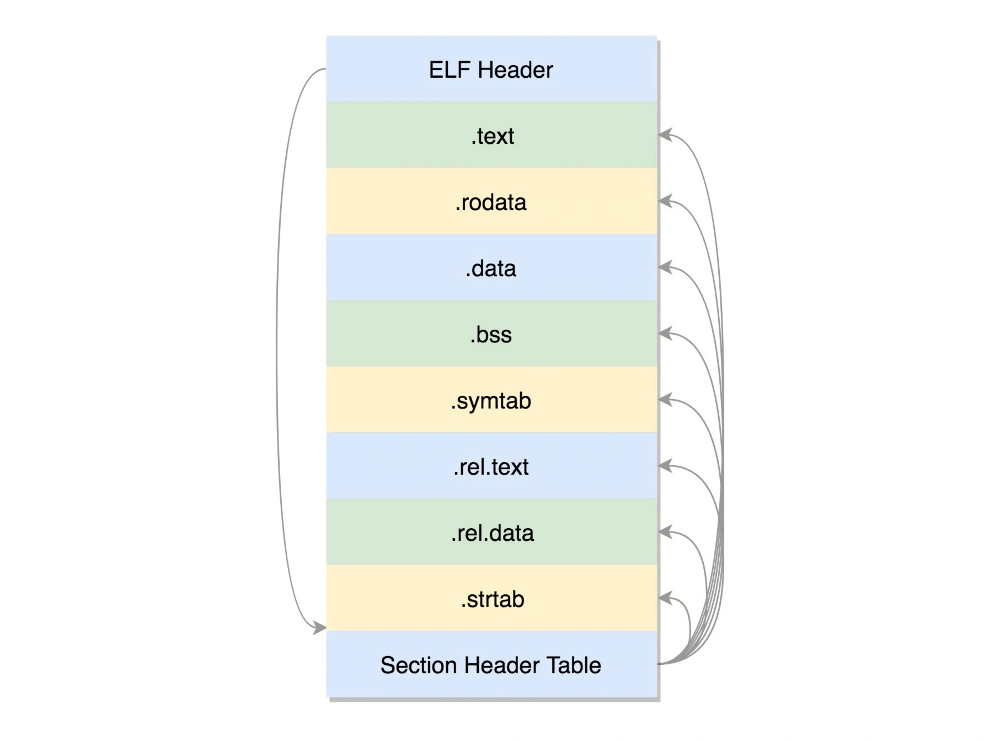
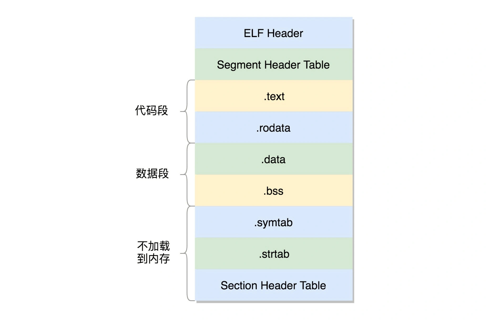

# [C](link)

## 配置


```sh
g++ -v -E -x c++ -

# 添加到 includePath中
```

## 准备

* 编写好的C程序需要先编译成可执行的机器指令才能运行

### 编译器

* GCC GNU Compiler Collection GNU 编译器套件:由GNU开发的GPL许可的编译器自由软件。刚开始只作为C语言编译器，但后来发展成多种语言编译器，比如C、C++、Java、Android、Objective-C和Fortran等等。现在很多unix-like操作系统自带GCC，将其作为标准编译器。
* MS C:与微软的Visual Studio一起集成发布，由微软提供的一套完整的集成开发环境，编译后能在微软的所有操作系统上运行
* Clang:一个基于LLVM的C/C++/Objective-C轻量级编译器，常用于Mac系统下。
* Turbo C:一个比较流行的C编译器，小巧快速
* cc C Compiler:一个unix系统古老的编译器，很多经典书籍会看到这个编译器。为保持兼容，现在 linux系统会将cc作为一个符号连接指向gcc，即/usr/bin/cc -> gcc。
* CMake 编译::执行 Cmake 生成配置文件，主要是 Makefile
	* 执行`cd build && cmake -f ../`命令，之后在 build 目录下，会发现 CMake 根据系统环境如编译器、头文件等自动生成了一份 Makefile
	* 在 build 目录运行 make，让 make 驱动 gcc 编译、链接生成二进制可执行程序，过程可能会持续几分钟
	* 最后在 build/bin 目录下，会生成所有可运行的二进制程序

```sh
sudo apt install gcc-7 g++-7 gcc-8 g++-8 gcc-9 g++-9

gcc --version
# ubuntu
gcc test.c -o test
./test

# vscode
Ctrl+Shift+B
```

### 原理

* ELF Executeable and Linkable Format，可执行与可链接格式：Linux 下面，二进制的程序的严格的格式，根据编译的结果不同，分为不同格式
* 可重定位文件 Relocatable File:编译成 .o 文件,一个一个的 section|节
	* objdump 查看.o目标文件，可以看到其地址都是0，1，2等相对地址
	* ELF 文件头:用于描述整个文件的，有描述这个文件的节头部表的位置，有多少个表项等等信息。文件格式在内核中有定义，分别为 struct elf32_hdr 和 struct elf64_hdr
	* text：放编译好的二进制可执行代码
	* .data：已经初始化好的全局变量
	* .rodata：只读数据，例如字符串常量、const 的变量
	* .bss：未初始化全局变量，运行时会置 0
	* .symtab：符号表，记录 函数和变量
	* .strtab：字符串表、字符串常量和变量名
	* Section Header Table:保存这些节的元数据信息。表里面，每一个 section 都有一项，在代码里面也有定义 struct elf32_shdr 和 struct elf64_shdr
* 库文件：让函数作为库文件被重用，不能以.o 的形式存在，而是要形成库文件
	- 最简单类型是静态链接库.a 文件（Archives）：将一系列对象文件（.o）归档为一个文件，用命令 ar 创建
		- 一个 .a 里面可以有多个.o
		- 静态链接库一旦链接进去，代码和变量的 section 都合并了，因而程序运行的时候，就不依赖于这个库是否存在。
		- 缺点:相同的代码段，如果被多个程序使用的话，在内存里面就有多份，而且一旦静态链接库更新了，如果二进制执行文件不重新编译，也不随着更新。
		- 当程序使用静态连接库的时候，会将.o 文件提取出来，链接到程序中
			- -L 表示在当前目录下找.a 文件
	- 动态链接库 Shared Libraries
		- 不仅仅是一组对象文件的简单归档，而是多个对象文件的重新组合，可被多个程序共享
		- 当一个动态链接库被链接到一个程序文件中的时候，最后的程序文件并不包括动态链接库中的代码，而仅仅包括对动态链接库的引用，并且不保存动态链接库的全路径，仅仅保存动态链接库的名称。
		- 默认情况下，系统在 /lib 和 /usr/lib 文件夹下寻找动态链接库。如果找不到就会报错，可以设定 LD_LIBRARY_PATH 环境变量，程序运行时会在此环境变量指定的文件夹下寻找动态链接库。
- 链接：重定位起作用.生成二进制可执行文件
	- 和.o 文件大致相似,只不过这些 section 是多个.o 文件合并过的
	- 这些 section 被分成需要加载到内存里面的代码段、数据段和不需要加载到内存里面的部分
	- 将小的 section 合成大的段 segment，并且在最前面加一个段头表（Segment Header Table）。在代码里面的定义为 struct elf32_phdr 和 struct elf64_phdr，里面除了有对于段的描述之外，最重要的是 p_vaddr 段加载到内存的虚拟地址。
	- ELF 头里面，有一项 e_entry，也是个虚拟地址，是这个程序运行的入口
- 动态链接库，就是 ELF 的第三种类型，共享对象文件（Shared Object）。
	- 多了一个.interp 的 Segment，里面是 ld-linux.so，这是动态链接器，运行时的链接动作都是它做的
	- 多了两个 section，一个是.plt，过程链接表（Procedure Linkage Table，PLT），一个是.got.plt，全局偏移量表（Global Offset Table，GOT）
	- 如何工作：使得程序运行的时候，可以将 so 文件动态链接到进程空间
		- dynamiccreateprocess 程序要调用 libdynamicprocess.so 里的 create_process 函数。由于是运行时才去找，编译的时候，压根不知道这个函数在哪里，就在 PLT 里面建立一项 PLT[x]。这一项也是一些代码，有点像一个本地的代理，在二进制程序里面，不直接调用 create_process 函数，而是调用 PLT[x]里面的代理代码，这个代理代码会在运行的时候找真正的 create_process 函数。
		- 用 GOT 找代理代码，这里面也会为 create_process 函数创建一项 GOT[y]。这一项是运行 create_process 函数在内存中真正的地址。
		- 如果这个地址在 dynamiccreateprocess 调用 PLT[x]里面的代理代码，代理代码调用 GOT 表中对应项 GOT[y]，调用的就是加载到内存中的 libdynamicprocess.so 里面的 create_process 函数
	- GOT 怎么知道GOT[y] 地址的？
		- 对于 create_process 函数，GOT 一开始就会创建一项 GOT[y]，但是这里面没有真正的地址，因为它也不知道
		- 但是它有办法，又回调 PLT，告诉它，你里面的代理代码来找我要 create_process 函数的真实地址，我不知道，你想想办法吧。
		- PLT 这个时候会转而调用 PLT[0]，也即第一项，PLT[0]转而调用 GOT[2]，这里面是 ld-linux.so 的入口函数，这个函数会找到加载到内存中的 libdynamicprocess.so 里面的 create_process 函数的地址，然后把这个地址放在 GOT[y]里面。下次，PLT[x]的代理函数就能够直接调用了。
	- 运行程序为进程
		- load_elf_binary
- ELF工具
	- readelf 工具用于分析 ELF 的信息
	- objdump 工具用来显示二进制文件的信息
	- hexdump 工具用来查看文件的十六进制编码
	- nm 工具用来显示关于指定文件中符号的信息
- 参考
	- 《程序员的自我修养-链接、装载和库》




```c 
gcc -c -fPIC process.c
gcc -c -fPIC createprocess.c


ar cr libstaticprocess.a process.o

# -lstaticprocess 会自动补全文件名，比如加前缀 lib，后缀.a，变成 libstaticprocess.a，
# 找到这个.a 文件后，将里面的 process.o 取出来，和 createprocess.o 做一个链接，形成二进制执行文件 staticcreateprocess
gcc -o staticcreateprocess createprocess.o -L. -lstaticprocess

# 动态链接
gcc -shared -fPIC -o libdynamicprocess.so process.o


gcc -o dynamiccreateprocess createprocess.o -L. -ldynamicprocess

# 定义加载二进制文件的方法的数据结构
struct linux_binfmt {
        struct list_head lh;
        struct module *module;
        int (*load_binary)(struct linux_binprm *);
        int (*load_shlib)(struct file *);
        int (*core_dump)(struct coredump_params *cprm);
        unsigned long min_coredump;     /* minimal dump size */
} __randomize_layout;

# ELF 文件格式，有对应的实现
static struct linux_binfmt elf_format = {
        .module         = THIS_MODULE,
        .load_binary    = load_elf_binary,
        .load_shlib     = load_elf_library,
        .core_dump      = elf_core_dump,
        .min_coredump   = ELF_EXEC_PAGESIZE,
};
```

### 运行

* 预处理:对源文件进行一些处理，比如将#define替换成实际值、将#include指定的文件内容填充进来
* 编译 compile:源代码到目标代码
* 链接 link:将各个目标文件链接起来从而形成一个可执行的程序，当然链接器也会引入被程序所用到的所有标准C函数库的函数

```sh
gcc -E test.c -o test.i  // 预处理
gcc -c test.s  // 编译

gcc -c adder.c
gcc -c name.c
gcc name.o adder.o hello.c

* -o 指定输出文件的文件名

* -S：gcc -S test.i  // 将预处理输出文件test.i汇编成test.s文件
* -c：
* -O：gcc -O1 test.c -otest // 使用编译优化级别1编译程序。级别为1~3，级别越大优化效果越好，但编译时间越长
* gcc testfun.c test.c -o test // 编译链接
* gcc -otestfun.o test.o -o test // 链接
```

## 结构体 struct

* 复合数据类型的一种。同时也是一些元素的集合，这些元素称为结构体的成员，且这些成员可以为不同的类型
* 成员一般用名字访问
* 结构体可以被声明为变量、指针或数组等，用以实现较复杂的数据结构

## 指针

## 内存管理

## 编译安装

* 配置 configure
  - 因为不同计算机系统环境不一样，通过指定编译参数，编译器就可以灵活适应环境，编译出各种环境都能运行的机器码。这个确定编译参数的步骤
  - 配置信息保存在一个配置文件之中，约定俗成是一个叫做configure的脚本文件。通常它是由autoconf工具生成的。编译器通过运行这个脚本，获知编译参数
  - 手动向configure脚本提供编译参数 `./configure --prefix=/www --with-mysql`
* 确定标准库和头文件的位置
  - 从配置文件中知道标准库和头文件的位置。一般来说，配置文件会给出一个清单，列出几个具体的目录。等到编译时，编译器就按顺序到这几个目录中，寻找目标。
* 确定依赖关系
  - 编译器需要确定编译的先后顺序,编译顺序保存在一个叫做makefile的文件中，里面列出哪个文件先编译，哪个文件后编译。
  - makefile文件由configure脚本运行生成，这就是为什么编译时configure必须首先运行的原因。
* 头文件的预编译（precompilation）
  - 不同的源码文件，可能引用同一个头文件（比如stdio.h）。为了节省时间，编译器会在编译源码之前，先编译头文件。这保证了头文件只需编译一次，不必每次用到的时候，都重新编译了。
  - 用来声明宏的#define命令，就不会被预编译
* 预处理（Preprocessing）
  - 替换掉源码中bash的头文件和宏
* 编译（Compilation）
  - 生成机器码。对于某些编译器来说，还存在一个中间步骤，会先把源码转为汇编码（assembly），然后再把汇编码转为机器码
* 连接（Linking）
  - 把外部函数的代码（通常是后缀名为.lib和.a的文件），添加到可执行文件中
  - 静态连接:通过拷贝，将外部函数库添加到可执行文件的方式
    + 适用范围比较广，不用担心用户机器缺少某个库文件；缺点是安装包会比较大，而且多个应用程序之间，无法共享库文件
  - make命令:从头文件预编译开始，一直到做完这一步
* 安装（Installation）
  - 上一步的连接是在内存中进行的，即编译器在内存中生成了可执行文件。下一步，必须将可执行文件保存到用户事先指定的安装目录。
  - 将可执行文件（连带相关的数据文件）拷贝过去:创建目录、保存文件、设置权限等步骤
* 操作系统连接
  - 在操作系统中，登记这个程序的元数据：文件名、文件描述、关联后缀名等等。Linux系统中，这些信息通常保存在/usr/share/applications目录下的.desktop文件中
  - make install命令:用来完成"安装"和"操作系统连接"
* 动态连接: 外部函数库不进入安装包，只在运行时动态引用
  - 好处是安装包会比较小，多个应用程序可以共享库文件；缺点是用户必须事先安装好库文件，而且版本和安装位置都必须符合要求，否则就不能正常运行。
  - 现实中，大部分软件采用动态连接，共享库文件。这种动态共享的库文件，Linux平台是后缀名为.so的文件，Windows平台是.dll文件，Mac平台是.dylib文件

## 课程

* [cse251](http://cse.msu.edu/~cse251/)

## 图书

* 《C Programming Language (2nd Edition) C程序设计语言（第2版）》
* C语言程序设计现代方法
* 《C Primer Plus》
  - 有一个巨大的错觉，就是读完一遍《C Primer Plus》后就觉得自己会CLang了
  - 有这种优越感的，请尝试用CLang做个什么东西出来？然后发现似乎真的什么也做不了，这会儿就可以步入到《Unix环境高级编程》的节奏
  - 面向对象编程的哲学思想是通过对语言建模来适应问题，而不是对问题建模来适应语言。
* 《[C标准库](https://www.amazon.cn/gp/product/B00IZW4DK8)》
* 《[C和指针](https://www.amazon.cn/gp/product/B00163LU68)》
* 《[C专家编程](https://www.amazon.cn/gp/product/B0012NIW9K)》
* 《[C陷阱与缺陷](https://www.amazon.cn/gp/product/B0012UMPBY)》
* 《[C语言接口与实现](https://www.amazon.cn/gp/product/B01D10NSCM)》
* 《C语言参考手册（第5版）》
* [C Internals](http://www.avabodh.com/cin/cin.html)

## 工具

* [tbox](https://github.com/tboox/tbox):📦 A glib-like multi-platform c library <http://tboox.org>
* [http-parser](nodejs/http-parser):http request/response parser for c
* [Source Insight](https://www.sourceinsight.com/)
* ccache：高速C/C++编译缓存工具，反复编译内核非常有用
* 陈皓 《跟我一起写makefile》
