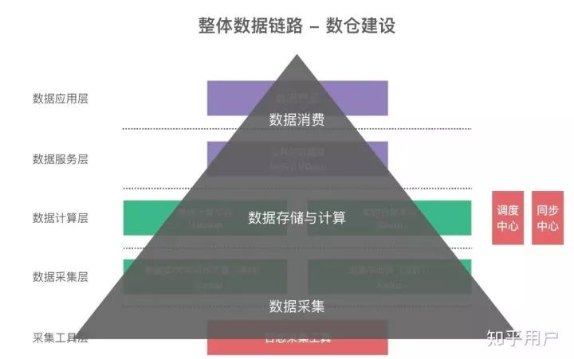

# 大数据

* 商业洞见
* 统计概率知识
* 计算机科学和软件编程技能
* 文字和视觉沟通能力
* 理顺逻辑—构建算法—代码实现—模拟实验
* 方向
  - 传统分析/商业统计
    + Excel 作为电子表格软件，适合简单统计（分组/求和等）需求，由于其方便好用，功能也能满足很多场景需要，所以实际成为研究人员最常用的软件工具
    + SPSS（SPSS Statistics)和SAS作为商业统计软件，提供研究常用的经典统计分析（如回归、方差、因子、多变量分析等）处理
      * SPSS 轻量、易于使用，但功能相对较少，适合常规基本统计分析
      * SAS 功能丰富而强大（包括绘图能力），且支持编程扩展其分析能力，适合复杂与高要求的统计性分析
  - 数据挖掘
    + SPSS Modeler：提供面向商业挖掘的机器学习算法（决策树、神经元网络、分类、聚类和预测等）的实现
  - 可视化分析
    + TableAU
  - 关系分析
    + Gephi
  - 时空数据分析
    + NanoCubes（http://www.nanocubes.net/）
  - 文本/非结构化分析
* 编程语言
  - R语言：最适合统计研究背景的人员学习，具有丰富的统计分析功能库以及可视化绘图函数可以直接调用。通过Hadoop-R更可支持处理百亿级别的数据。 相比SAS，其计算能力更强，可解决更复杂更大数据规模的问题。
  - Python语言：最大的优势是在文本处理以及大数据量处理场景，且易于开发。在相关分析领域，Python代替R的势头越来越明显。
  - Java语言：通用性编程语言，能力最全面，拥有最多的开源大数据处理资源（统计、机器学习、NLP等等）直接使用。也得到所有分布式计算框架（Hadoop/Spark）的支持。

## 历史

* 20世纪90年代，商业智能（也就是我们熟悉的BI系统）诞生，将企业已有的业务数据转化成为知识，帮助老板们进行经营决策。比如零售场景中：需要分析商品的销售数据和库存信息，以便制定合理的采购计划
* 商业智能离不开数据分析，需要聚合多个业务系统的数据（比如交易系统、仓储系统），再进行大数据量的范围查询。而传统数据库都是面向单一业务的增删改查，无法满足此需求，这样就促使了数据仓库概念的出现
* Hadoop诞生
  - 2000年左右，PC互联网时代来临，同时带来了海量信息，很典型的两个特征：
    + 数据规模变大：Google、雅虎等互联网巨头一天可以产生上亿条行为数据
    + 数据类型多样化：除了结构化的业务数据，还有海量的用户行为数据，以图像、视频为代表的多媒体数据
  - 2003年，Google公布了3篇鼻祖型论文（俗称「谷歌3驾马车」），包括：分布式处理技术MapReduce，列式存储BigTable，分布式文件系统GFS。这3篇论文奠定了现代大数据技术的理论基础
  - 2005年，Yahoo资助Hadoop按照这3篇论文进行了开源实现，这一技术变革正式拉开了大数据时代的序幕
  - Hadoop相对于传统数据仓库，有以下优势：
    + 完全分布式：可以采用廉价机器搭建集群，完全可以满足海量数据的存储需求
    + 弱化数据格式：数据模型和数据存储分离，可以满足对异构数据的分析需求
      - 2010年的Hadoop世界大会上，提出了「数据湖」的概念。 数据湖是一个以原始格式存储数据的系统。企业可以基于Hadoop构建数据湖，将数据作为企业的核心资产。由此，数据湖拉开了Hadoop商业化的大幕
* 数据工厂时代：大数据平台兴起
  - 商用Hadoop包含上十种技术，整个数据研发流程非常复杂。为了完成一个数据需求开发，涉及到数据抽取、数据存储、数据处理、构建数据仓库、多维分析、数据可视化等一整套流程。这种高技术门槛显然会制约大数据技术的普及
  - 大数据平台（平台即服务的思想，PaaS）应运而生，是面向研发场景的全链路解决方案，能够大大提高数据的研发效率，让数据像在流水线上一样快速完成加工，原始数据变成指标，出现在各个报表或者数据产品中
* 数据价值时代：阿里提出数据中台
  - 2016年左右，已经属于移动互联网时代了，随着大数据平台的普及，也催生了很多大数据的应用场景
  - 开始暴露出一些新问题：为了快速实现业务需求，烟囱式开发模式导致了不同业务线的数据是完全割裂的，这样造成了大量数据指标的重复开发，不仅研发效率低、同时还浪费了存储和计算资源，使得大数据的应用成本越来越高
  - 数据中台的核心思想是：避免数据的重复计算，通过数据服务化，提高数据的共享能力，赋能业务

## 核心概念

* 大数据是一种海量的、高增长率的、多样化的信息资产，需要新的存储和计算模式才能具有更强的决策力、流程优化能力，典型特征
  - Volume：海量的数据规模，数据体量达到PB甚至EB级别
  - Variety：异构的数据类型，不仅仅包含结构化的数据、还包括半结构化和非结构化数据，比如日志文件、图像、音视频等
  - Velocity：快速的数据流转，数据的产生和处理速度非常快
  - Value：价值密度低，有价值的数据占比很小，需要用到人工智能等方法去挖掘新知识
* 数据仓库(Data Warehouse)
  - 面向主题的（Subject Oriented）、集成的（Integrated）、相对稳定的（Non-Volatile）、随着时间变化（Time Variant）的海量数据集合(包括大量冗余数据)，用以支持经营管理中的决策制定过程，核心是海量数据存放和海量数据检索
    + 面向主题的：表示按照主题或者业务场景组织数据
    + 集成的：从多个异构数据源采集数据，进行抽取、加工、集成
    + 随时间变化的：关键数据需要标记时间属性
    + 相对稳定的：极少进行数据删除和修改，而只是进行数据新增
  - 相对于操纵型数据库来说其突出的特点是对海量数据的支持和快速的检索技术
  - 为了实现决策支持型数据处理与事务型数据处理的分离，按照一定的周期将事务型数据转换导入决策支持数据库中
  - 一个信息提供平台，从业务处理系统获得数据，主要以星型模型和雪花模型进行数据组织，为用户提供各种手段从中获取信息和知识
  - 数据仓库按照数据的覆盖范围可以分为企业级数据仓库和部门级数据仓库（通常称为数据集市）
  - 从功能结构划分，数据仓库系统至少应该包含数据获取（Data Acquisition）、数据存储（Data Storage）、数据访问（Data Access）三个关键部分
  - 一个独立的数据环境，需要通过抽取过程将数据从联机事务处理环境、外部数据源或者脱机的数据存储介质导入到数据仓库中
* 联机分析处理(OLAP) 也称实时系统(Real Time System)，支持事务快速响应和大并发，系统典型的有ATM机(Automated Teller Machine)系统、自动售票系统等，但有些银行转账并不是实时到账的
  - OLTP反映企业当前的运行状态，完成企业管理所包含的日常任务的数据库应用，一般没有复杂的查询和分析处理

## 架构

* 数据传输层
  - Sqoop：支持RDBMS和HDFS之间的双向数据迁移，通常用于抽取业务数据库（比如MySQL、SQLServer、Oracle）的数据到HDFS
  - Cannal：阿里开源的数据同步工具，通过监听MySQL binlog，实现增量数据订阅和近实时同步
  - Flume：用于海量日志采集、聚合和传输，将产生的数据保存到HDFS或者HBase中
  - Flume + Kafka：满足实时流式日志的处理，后面再通过Spark Streaming等流式处理技术，可完成日志的实时解析和应用
* 数据存储层
  - HDFS：分布式文件系统，它是分布式计算中数据存储管理的基础，是Google GFS的开源实现，可部署在廉价商用机器上，具备高容错、高吞吐和高扩展性
  - HBase：分布式的、面向列的NoSQL KV数据库， 它是Google BigTable的开源实现，利用HDFS作为其文件存储系统，适合大数据的实时查询（比如：IM场景）
  - Kudu：折中了HDFS和HBase的分布式数据库，既支持随机读写、又支持OLAP分析的大数据存储引擎（解决HBase不适合批量分析的痛点）
* 资源管理层
  - Yarn：Hadoop的资源管理器，负责Hadoop集群资源的统一管理和调度，为运算程序（MR任务）提供服务器运算资源（CPU、内存），能支持MR、Spark、Flink等多种框架
  - Kubernates：由Google开源，一种云平台的容器化编排引擎，提供应用的容器化管理，可在不同云、不同版本操作系统之间进行迁移。目前，Spark、Storm已经支持K8S
* 数据计算层： 大数据计算引擎决定了计算效率，是大数据平台最核心的部分，它大致了经历以下4代的发展，又可以分成离线计算框架和实时计算框架
  - 离线计算框架
    + MapReduce：面向大数据并行处理的计算模型、框架和平台（将计算向数据靠拢、减少数据传输，这个设计思路非常巧妙）
    + Hive：一个数据仓库工具，能管理HDFS存储的数据，可以将结构化的数据文件映射为一张数据库表，并提供完整的SQL查询功能（实际运行时，是将Hive SQL翻译成了MapReduce任务），适用离线非实时数据分析
    + Spark sql：引入RDD（弹性分布式数据集）这一特殊的数据结构，将SQL转换成RDD的计算，并将计算的中间结果放在内存中，因此相对于Hive性能更高，适用实时性要求较高的数据分析场景
  - 实时计算框架
    + Spark Streaming：实时流数据处理框架（按时间片分成小批次，s级延迟），可以接收Kafka、Flume、HDFS等数据源的实时输入数据，经过处理后，将结果保存在HDFS、RDBMS、HBase、Redis、Dashboard等地方
    + Storm：实时流数据处理框架，真正的流式处理，每条数据都会触发计算，低延迟（ms级延迟）
    + Flink：更高级的实时流数据处理框架，相比Storm，延迟比storm低，而且吞吐量更高，另外支持乱序和调整延迟时间
  - 多维分析层
    + Kylin：分布式分析引擎，能在亚秒内查询巨大的Hive表，通过预计算（用空间换时间）将多维组合计算好的结果保存成Cube存储在HBase中，用户执行SQL查询时，将SQL转换成对Cube查询，具有快速查询和高并发能力
    + Druid：适用于实时数据分析的高容错、高性能开源分布式系统，可实现在秒级以内对十亿行级别的表进行任意的聚合分析

## 流程

* 数据采集：从不同数据源收集数据获取数据到统一装置中 数据来源主要是两类，第一类是各个业务系统的关系数据库，通过Sqoop或者Cannal等工具进行定时抽取或者实时同步；第二类是各种埋点日志，通过Flume进行实时收集
* 数据存储：借助存储介质将收集到的数据持久化保存，比如硬盘 将这些数据存储在HDFS中，实时日志流情况下则通过Kafka输出给后面的流式计算引擎
* 数据清洗，将不符合规范的数据进行特定处理，使得数据达到准确完整一致等要求
* 数据建模，定义满足业务所需要的数据要求的过程，一般需要业务建模师参与
* 数据处理，对数据的采集、存储、检索、加工、变换、传输等操作，从海量数据中抽取提取有价值的数据
* 数据分析，使用数据挖掘技术从海量数据中获取有价值的信息。 最核心的环节，包括离线处理和流处理两种方式，对应的计算引擎包括MapReduce、Spark、Flink等，处理完的结果会保存到已经提前设计好的数据仓库中，或者HBase、Redis、RDBMS等各种存储系统上
* 数据应用：包括数据的可视化展现、业务决策、或者AI等各种数据应用场景
* 数据可视化，将数据以直观的可视化方式展示给用户

## 大数据下的数仓体系架构

* 数据仓库是从业务角度出发的一种数据组织形式，它是大数据应用和数据中台的基础
* 数仓系统分成了4层：源数据层、数据仓库层、数据集市层、数据应用层。采用这样的分层结构，和软件设计的分层思想类似，都是为了将复杂问题简单化，每一层职责单一，提高了维护性和复用性。每一层的具体作用如下
  - ODS：源数据层，源表
  - DW：数据仓库层，包含维度表和事实表，通过对源表进行清洗后形成的数据宽表，比如：城市表、商品类目表、后端埋点明细表、前端埋点明细表、用户宽表、商品宽表
  - DM：数据集市层，对数据进行了轻粒度的汇总，由各业务方共建，比如：用户群分析表、交易全链路表
  - ADS：数据应用层，根据实际应用需求生成的各种数据表
* 各层的数据表都会采用统一的命名规则进行规范化管理，表名中会携带分层、主题域、业务过程以及分区信息

### 联机事务处理(OLTP)

* OLAP也称决策支持系统(Decision Support System，DSS)，是数据仓库系统的主要应用形式，使分析人员、管理人员或执行人员能够从多种角度对从原始数据中转化出来的、能够真正为用户所理解的、并真实反映企业维特性的信息进行快速、一致、交互地存取，从而获得对数据的更深入了解的一类软件技术。
* 联机分析处理
* 数据挖掘
* 目标:满足决策支持或多维环境特定的查询和报表需求，技术核心概念是维(观察数据的特定角度，如时间维)，因此OLAP也可以说是多维数据分析工具的集合
* 按照数据存储格式
  - Relational OLAP(ROLAP）：基本数据和聚合数据均存放在RDBMS之中
  - Multidimensional OLAP(MOLAP）：存放于多维数据库中
  - Hybrid OLAP(HOLAP）：本数据存放于RDBMS之中，聚合数据存放于多维数据库中
* E.F.Codd提出12条准则来描述OLAP系统：
  - OLAP模型必须提供多维概念视图　　
  - 透明性　
  - 存取能力推测 　　
  - 稳定的报表能力 　　
  - 客户/服务器体系结构 　　
  - 维的等同性　
  - 动态的稀疏矩阵处理
  - 多用户支持能力　
  - 非受限的跨维操作 　　
  - 直观的数据操纵 　　
  - 灵活的报表生成 　　
  - 不受限的维与聚集层次
* ETL(Extraction-Transformation-Loading)
  - 负责将分布的、异构数据源中的数据如关系数据、平面数据(去除了所有特定应用格式，可以迁移到其他应用上进行处理的一类数据，比如逗号分隔数据)文件等抽取到临时中间层后进行清洗、转换、集成，最后加载到数据仓库或数据集市中，成为联机分析处理、数据挖掘的基础，是BI(Business Intelligence)/DW的核心和灵魂，是数据仓库中的非常重要的一环
  - 在技术上，ETL主要涉及到关联、转换、增量、调度和监控等几个方面
  - 数据仓库系统中数据不要求与联机事务处理系统中数据实时同步，所以ETL可以定时进行
  - 在数据仓库建设中最难部分是用户需求分析和模型设计，而ETL规则设计和实施则是工作量最大的，约占整个项目的60%～80%

## [Wolfram](https://www.wolfram.com/)

* [WOLFRAM DATA REPOSITORY](https://datarepository.wolframcloud.com/)
* [The Wolfram Data Drop](https://datadrop.wolframcloud.com/):an open service that makes it easy to accumulate data of any kind, from anywhere—setting it up for immediate computation, visualization, analysis, querying, or other operations.

## 课程

* 《数据科学导论》：数据科学的先导课和认知类课程。用形象生动的教学模式为学生普及数据挖掘、大数据相关的基础知识、核心概念和思维模式，从工程技术、法律规范、应用实践等不同角度描绘数据科学的美好蓝图
* 《数据挖掘：理论与算法》：本课程完整覆盖数据挖掘领域的各项核心技术，包括数据预处理、分类、聚类、回归、关联、推荐、集成学习、进化计算等
* 《高级大数据系统》：主要讲解高级大数据系统的实现、优化和应用，包括分布式文件系统、MapReduce/Spark、Storm/Spark streaming、Mahout等系统的原理、实现、策略优化
* 《大数据机器学习》：主要包括统计学习基本理论，机器学习基本方法，深度学习理论和方法。牢固掌握大数据机器学习方法，并能够解决实际问题等综合能力
* 《数据可视化》：主要包括可视化的基本概念、历史沿革、视觉认知理论、各类可视化技术（软件工具及程序开发）等
* [CS109 Data Science](http://cs109.github.io/2015/)

## 图书

* 《机器学习》（俗称西瓜书） 周志华著，清华大学出版社
* 《分布式系统：概念与设计（原书第五版）》，机械工业出版社
* 《Spark大数据处理：技术、应用》，机械工业出版社
* 《Hadoop: The Definitive Guide: Storage and Analysis at Internet Scale》 Tom White
* 《Learning Spark: Lightning-Fast Big Data Analysis》 Holden Karau, Andy Kowinski, Mark Hamstra, Matei Zaharia
* 《Data Architecture: A Primer for the Data Scientist: Big Data, Data Warehouse and Data Vault》 W.H. Inmon, Daniel Linstedt
* 《SQL反模式》 Bill Karwin
* 《事务处理：概念与技术》 Jim Gray, Andreas Reuter
* 《Designing Data-Intensive Applications》 Martin Kleppmann
* 《Streaming Systems》 Tyler Akidau, Slava Chernyak, Reuven Lax
* [ Vonng / ddia ](https://github.com/Vonng/ddia):《Designing Data-Intensive Application》DDIA中文翻译
* 干净的数据：数据清洗入门与实践
* 数据科学入门
* Python网络数据采集
* 洞悉数据：用可视化方法发掘数据真义
* 决策知识自动化：大数据时代的商业决策分析方法
* 社会媒体挖掘
* 云数据中心网络技术
* 人人都是数据分析师：Tableau应用实战
* Spark快速大数据分析
* 《Spark高级数据分析（第2版）》 作者：[美] 桑迪·里扎 , [美] 于里·莱瑟森 , [英] 肖恩·欧文 , [美] 乔希·威尔斯 译者：龚少成 , 邱鑫 * 数据科学家修炼之道
* 编程谜题
* 《Flink基础教程》 作者：埃伦·弗里德曼 , 科斯塔斯·宙马斯 译者：王绍翾
* Spark机器学习（第2版）》 作者：[印]拉结帝普·杜瓦 , [印]曼普利特·辛格·古特拉 , [南非]尼克·彭特里思 译者：蔡立宇 , 黄章帅 , 周济民

## Visualization

* Excel
* Google Chart API
* D3（Data Driven Documents）是支持SVG渲染的另一种JavaScript库
* R：用于统计分析、绘图的语言和操作环境
* Visual.ly
* Processing
* Leaflet
* Openlayers：所有地图库中可靠性最高的一个
* PolyMaps：地图库，主要面向数据可视化用户
* Charting Fonts是将符号字体与字体整合
* Gephi是进行社会图谱数据可视化分析的工具，不但能处理大规模数据集并且Gephi是一个可视化的网络探索平台，用于构建动态的、分层的数据图表。
* CartoDB很轻易就把表格数据和地图关联起来，这方面CartoDB是最优秀的选择。
* Weka是一个能根据属性分类和集群大量数据的优秀工具，Weka不但是数据分析的强大工具，还能生成一些简单的图表。
* NodeBox是OS X上创建二维图形和可视化的应用程序，你需要了解Python程序
* Kartograph不需要任何地图提供者像Google Maps，用来建立互动式地图，由两个libraries组成，从空间数据开放格式，利用向量投影的Python library以及post GIS，并将两者结合到SVG和JavaScript library，并把这些SVG资料转变成互动性地图
* Modest Maps是一个很小的地图库，在一些扩展库的配合下，例如Wax、Modest Maps立刻会变成一个强大的地图工具。
* Tangle是一个用来探索，Play和可以立即查看文档更新的交互工具。
* Crossfilter既是图表，又是互动图形用户界面的小程序，当你调整一个图表中的输入范围时，其他关联图表的数据也会随之改变
* Raphael是创建图表和图形的JavaScript库，与其他库最大的不同是输出格式仅限SVG和VML. http://raphaeljs.com/
* jsDraw2DX是一个标准的JavaScript库，用来创建任意类型的SVG交互式图形，可生成包括线、矩形、多边形、椭圆、弧线等图形
* Pizza Pie Charts是个响应式饼图图表，基于Adobe Snap SVG框架，通过HTML标记和CSS来替代JavaScript对象，更容易集成各种先进的技术。
* Fusion Charts Suit XT是一款跨平台、跨浏览器的JavaScript图表组件，为你提供令人愉悦的JavaScript图表体验。
* iCharts提供可一个用于创建并呈现引人注目图表的托管解决方案。
* Modest Maps是一个轻量级、可扩展的、可定制的和免费的地图显示类库，这个类库能帮助开发人员在他们自己的项目里能够与地图进行交互。
* Raw局域非常流行的D3.js库开发，支持很多图表类型，例如泡泡图、映射图、环图等
* Springy设计清凉并且简答。它提供了一个抽象的图形处理和计算的布局
* Bonsai使用SVG作为输出方式来生成图形和动画效果，拥有非常完整的图形处理API，可以使得你更加方便的处理图形效果
* Cube是一个开源的系统，用来可视化时间系列数据。它是基于MongoDB、NodeJS和D3.js开发。用户可以使用它为内部仪表板构建实时可视化的仪表板指标。
* Gantti是一个开源的PHP类，帮助用户即时生成Gantti图表。使用Gantti创建图表无需使用JavaScript，纯HTML-CSS3实现。
* Smoothie Charts是一个十分小的动态流数据图表路。通过推送一个webSocket来显示实时数据流。
* Flot是一个优秀的线框图表库，支持所有支持canvas的浏览器
* Tableau Public是一款桌面可视化工具，用户可以创建自己的数据可视化，并将交互性数据可视化发布到网页上。
* Many Eyes是一个Web应用程序，用来创建、分享和讨论用户上传图形数据。
* Anychart是一个灵活的基于Flash/JavaScript(HTML5)的图表解决方案
* Dundas Chart处于行业领先地位的NET图表处理控件，于2009年被微软收购，并将图表产品的一部分功能集成到Visual Studio中。
* TimeFlow Analytical Timeline是为了暂时性资料的视觉化工具，现在有alpha版本因此有机会可以发现差错，提供以下不同的呈现方式：时间轴、日历、柱状图、表格等。
* Protovis是一个可视化JavaScript图表生成工具。
* Choosel是可扩展的模块化Google网络工具框架，可用来创建基于网络的整合了数据工作台和信息图表的可视化平台。
* Zoho Reports支持丰富的功能帮助不同的用户解决各种个性化需求，支持SQL查询、类四暗自表格界面等。
* Quantum GIS(QDIS)是一个用户界面友好、开源代码的GIS客户端程序，支持数据的可视化、管理、编辑与分析和印刷地图的制作。
* NodeXLDE 主要功能是社交网络可视化。
* OpenStreetMap是一个世界地图，由像您一样的人们所构筑，可依据开放协议自由使用。
* OpenHeatMap简单易用，用户可以用它上传数据、创建地图、交流信息。它可以把数据（如Google Spreadsheet的表单）转化为交互式的地图应用，并在网上分享。
* Circos最初主要用于基因组序列相关数据的可视化
* Impure是一个可视化编程语言，旨在收集、处理可视化信息。
* Polymaps是一个基于矢量和tile创建动态、交互式的动态地图。
* Rickshaw是一个基于D3.JS来创建序交互式的时间序列图表库。
* Sigma.js是一个开源的轻量级库，用来显示交互式的静态和动态图表。
* Timeline即时间轴，用户通过这个工具可以一目了然的知道自己在何时做了什么。
* BirdEye是Decearative Visual Analytics，它属于一个群体专案，为了要提升设计和广泛的开源资料视觉化发展，并且为了Adobe Flex建视觉分析图库，这个动作以叙述性的资料库为主，让使用者能够建立多元资料视觉化界面来分析以及呈现资讯。
* Arbor.Js提供有效率、以力导向的版面配置演算法，抽象画图表组织以及筛选更新的处理。
* Highchart.js是单纯由JavaScript所写的图表资料库，提供简单的方法来增加互动性图表来表达你的网站或网站应用程式。目前它能支援线图、样条函数图。
* Paper.js是一个开源向量图表叙述架构，能够在HTML5 Canvas 运作
* Visualize Free是一个建立在高阶商业后台集游InetScoft开发的视觉化软体免费的视觉分析工具，可从多元变量资料筛选并看其趋势，或是利用简单地点及方法来切割资料或是小范围的资料。
* GeoCommons可以使用户构建富交互可视化应用来解决问题，即使他们没有任何传统地图使用经验
* [El Grapho](https://www.elgrapho.com/):A Graph Data Visualization Framework Not For The Faint of Heart

## 工具

* [pachyderm/pachyderm](https://github.com/pachyderm/pachyderm):Reproducible Data Science at Scale! http://pachyderm.io

* [metabase/metabase](https://github.com/metabase/metabase):The simplest, fastest way to get business intelligence and analytics to everyone in your company 😋 https://metabase.com

* [OpenRefine/OpenRefine](https://github.com/OpenRefine/OpenRefine):OpenRefine is a free, open source power tool for working with messy data and improving it http://openrefine.org/

* [airbnb/knowledge-repo](https://github.com/airbnb/knowledge-repo):A next-generation curated knowledge sharing platform for data scientists and other technical professions.

* [facebook/osquery](https://github.com/facebook/osquery):SQL powered operating system instrumentation, monitoring, and analytics. https://osquery.io

* [protocolbuffers/protobuf](https://github.com/protocolbuffers/protobuf):Protocol Buffers - Google's data interchange format https://developers.google.com/protocol-buffers/

* [ha/doozerd](https://github.com/ha/doozerd):A consistent distributed data store.

* [hashicorp/consul](https://github.com/hashicorp/consul):Consul is a distributed, highly available, and data center aware solution to connect and configure applications across dynamic, distributed infrastructure. https://www.consul.io/

* [ag-grid/ag-grid](https://github.com/ag-grid/ag-grid):Advanced Data Grid / Data Table supporting Javascript / React / AngularJS / Web Components http://www.ag-grid.com

* [brendangregg / FlameGraph](https://github.com/brendangregg/FlameGraph):Stack trace visualizer http://www.brendangregg.com/flamegraphs.html

* HDFS，分布式文件系统

* HBase，分布式数据库

* MapReduce，由用户编写的运行在hadoop集群上的并行程序

* zookeeper，作为分布式程序的协调中心

* hive，基于hadoop的数据仓库管理工具

* pig，大数据分析工具

* yarn，hadoop集群资源管理系统

* sqoop，hadoop与传统数据库之间进行数据交换的工具

* chukawa，分布式数据收集分析系统

* hcatalog，管理hadoop产生的数据表存储管理系统

* redis，分布式缓存系统

* kafka，分布式消息系统

* Cassandra，分布式结构和数据存储

* neo4j，nosql图数据库

* spark，分布式计算引擎

* storm，分布式实时计算系统

* elasticsearch，分布式全文搜索

* flume，分布式日志采集系统

* flink，分布式流处理引擎

* [ darktable-org / darktable ](https://github.com/darktable-org/darktable): darktable is an open source photography workflow application and raw developer https://www.darktable.org

* [bigdata_practice](https://github.com/TurboWay/bigdata_practice):大数据分析可视化实践  nginx 日志分析可视化 http://analyze.turboway.top/line
