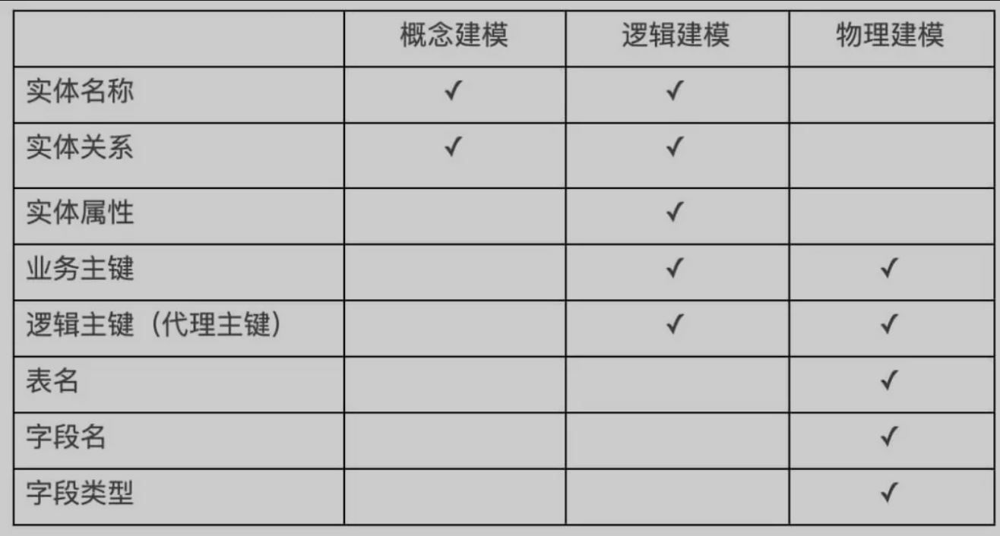
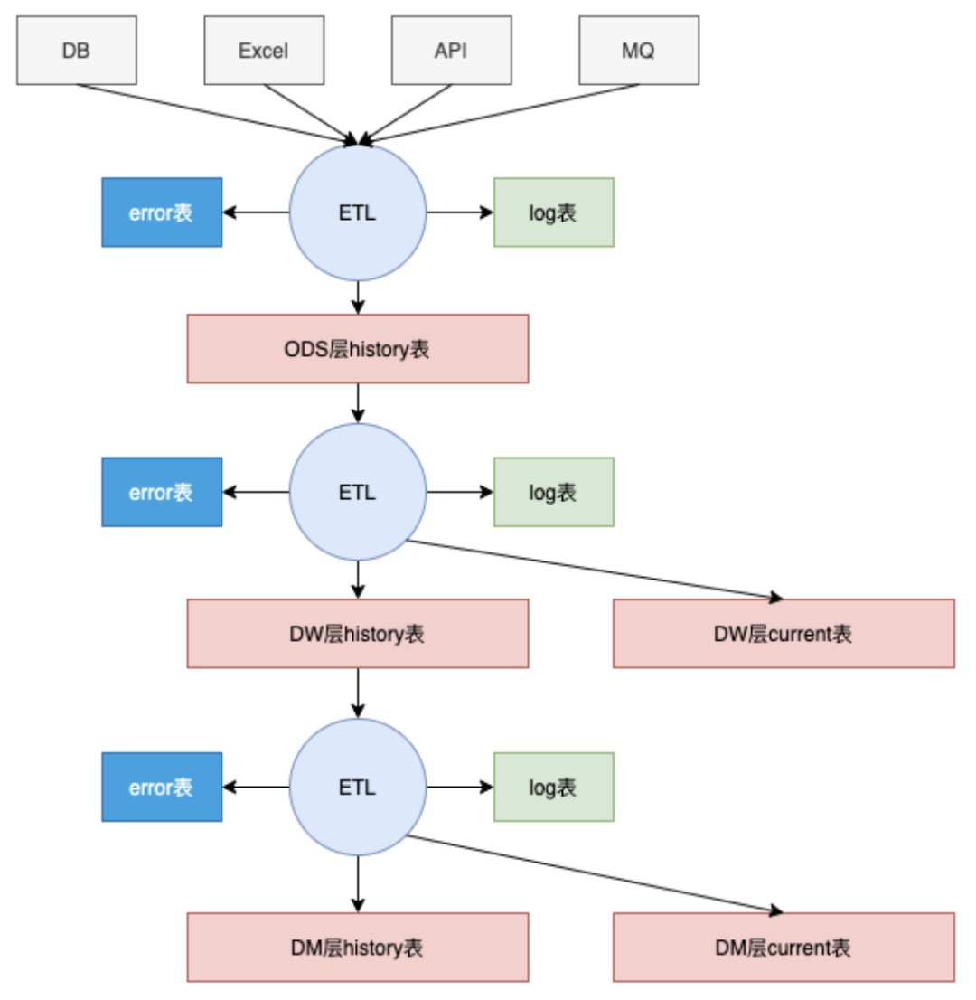

# DW 数据仓库

* 数据仓库是从业务角度出发的一种数据组织形式，它是大数据应用和数据中台的基础

## 数据项目 vs 应用项目

* 前期调研阶段
  - 应用项目聚焦业务本身，需要梳理具体的业务流程
  - 数据项目聚焦于数据流向，需要梳理数据全景图。
* 数据存储
  - 对于建模阶段，应用项目多遵循三范式，多有物理主外键，常使用数据库自身事务保证数据一致性
  - 数据项目建模多采用维度建模，基本不使用物理主外键，数据一致性由ETL保证。
* 开发过程
  - 应用项目的模型相对简单，可以实现快速迭代；数据项目模型复杂，需要构建底层模型后，再进行快速迭代，见效时间会长于应用项目，
  - 通常数据项目需要对底层建模完成，并且对应的数据清洗处理后，才可以进行需求的快速迭代响应。

## 业务确认

* 采用的建模方法是维度建模，按照事实表（fact数据），维度表（dim数据）来构建数据仓库。因此，业务确认需要确认以下几点：
  - 哪些数据为维度数据，哪些数据为事实数据
  - 数据的生产者、使用者以及数据的管理者
  - 业务边界

## 数据收集

* 考虑
  - 数据定义，要确定主数据以及事实数据的具体业务含义，以及对于事实数据的统计口径进行确认。
  - 数据更新频率，实时更新还是每日更新或是按需更新等。
  - 数据更新方式，增量更新还是半全量更新或是全量更新等。
  - 数据逻辑主键，对于数据的逻辑主键需要和业务方进行确认，根据经验在和业务方确认完成粒度后需要拿到部分数据（维度数据最好全量，事实数据为近一个月数据），对数据进行检查，如逻辑主键是否有空，是否有重复等情况。事实证明，我经常会接触到数据的展现形式和业务方提供的逻辑主键有出入，因此这部分工作建议一定要做，避免后续会有返工。
  - 维度数据质量检查，需要确认数据是否包含关键字段，同时，需要对一些通用信息的关联进行检查，如省市信息，需要和业务沟通省市信的来源（国家统计局/百度/…），再和相应的来源进行校验确认数据质量。
  - 事实数据质量检查，事实数据的质量检查主要为和主数据是否可以完全关联，如果有关联不上的主数据，需要确认原因。
  - 数据范围确认，基于所提供的demo数据来确认是否和上述确认的业务边界匹配。
* 重点
  - 需要了解每一个数据的业务含义，需要确保各方使用的数据口径的统一。如对于产品的定义，多方定义可能不同，有的定义一个产品是SKU，有的定义却是SPU。因此数据收集阶段非常重要，会直接影响数据建模的质量

## 数据建模

* 探索数据结构的行为，建模的过程与应用开发中的类建模类似，创建实体，用属性填充实体，设置关联，最后实例化到数据存储，区别在于，类建模有数据和行为，而数据建模只有数据
* 概念建模
  - 自上而下创建数据模型，精确描述业务组织，构想业务总体结构，并给出主题领域信息。
  - 由实体类型和关系组成。在这个过程中，未声明主键，未指定实体属性。
  - 在概念建模阶段，从数据全景出发，而不是局限于现有数据，这样有利于数仓的数据架构扩展。
  - 需要与业务用户深入交流，从业务的角度出发，尽量全的构建数据全景图。
  - 可以不去考虑现有数据，只考虑在特定业务场景下，应该有什么数据。根据数据全景图，定义所需的实体，以及实体和实体之间的关系。
  - 注意:在定义实体的边界时，没有一个正确的标准的方法，但是必须遵循统一的划分维度。
* 逻辑建模
  - 逻辑模型定义实体的数据结构和实体之间的关系，在此过程需要定义业务主键和逻辑主键，规范化实体属性，以及细化实体之间的关联关系，同时定义数据源。
  - 需要确认数据的管理者，数据的生产者以及数据的规范，需要确认数据的更新频率，粒度，保存时长以及维度口径定义。
* 物理建模
  - 通过数据库规则，将逻辑模型实例化为物理数据模型。物理数据模型可能与逻辑数据模型不同，根据数据仓库的存储介质不同，需要对物理模型进行相应的优化。
  - 重点需要考虑的是数据的分层。数据分层的价值主要体现在以下几点：
    + 有助于降低数据处理各阶段的耦合程度，清晰的定义数据处理各阶段的界线，有助于提高用户追踪异常的效率，降低运维成本
    + 有助于评估、分析及追踪数据在不同处理阶段所消耗的系统资源，不同层次可以使用不同的计算引擎或者存储，调整优化硬件配置
    + 有助于数据复用，模型复用，降低开发成本，提高开发效率
  - 注意
    + 需要重点考虑数据分层，使数据结构更清晰，便于维护。在本例中只是简单的举例了一个客户汇总需要ETL进行预计算
    + 充分利用各数据库对不同数据类型的处理，事实表尽量使用整型
    + 尽量少的使用可空，如果有空值，尽量提前处理。例如可在维度表中，创建一个ID为-1的记录，代表空值，事实表中如果查找不到维度，打上-1的标签
    + 尽量考虑扩展，布尔型可以使用smallint代替，比如是否，男女类型的字段，未来有可能出现增加一个未知的记录
    + 考虑到性能问题，在关系数据库中，不要使用物理的主键和外键，而是使用ETL保证数据的完整性和一致性
* 注意
  - 物理表可以存在逻辑主键，但是不要存在物理主键和物理外键，数据完整性和一致性需要通过ETL保证
* 价值:数据建模是一个语义层，是连接业务和物理存储的通道。需要充分理解业务术语，同时提供正确的信息，供业务人员灵活的查询。
  - 对业务进行全方位的梳理，构建数据的全方位视角
  - 通过对源系统的透彻理解，缩短重复开发时间
  - 提高数据结果的准确性
  - 提高透明度，使业务用户和开发人员能够了解他们可以获得的信息
  - 有助于降低业务复杂度，降低数据处理各阶段的耦合度
  - 有助于评估、分析及追踪数据在不同处理阶段所消耗的系统资源，并依此进行调整，优化硬件资源配置
* 方法
  - 范式建模法:构建数据模型常用的一个方法，该方法主要由 Inmon 所提倡，我们在应用类关系型数据库中，大部分采用的是三范式建模法
  - 维度建模:在数据仓库领域，最常使用的建模方法。由Kimball 提出这一概念，按照事实表，维度表来构建数据仓库。
    + 星型模式（Star-schema）牺牲了性能，减少了维护成本。
    + 雪花型模式（Snowflake Schema）提高了性能，增加了维护成本
    + 维度建模通过增加数据冗余，提高了查询的便捷，但是同时，为了保证数据的一致性，也增加了ETL的复杂度。
    + 术语
      * 维度：一类描述信息。例如，时间维度。
      * 属性：维度中的级别。例如，月是时间维度中的一个属性。
      * 层次结构：表示维度中不同属性之间关系的级别规范。例如，时间维度中一个可能的层次结构是年→季度→月→日。
      * 事实表：事实表是包含度量值的表。例如，销售额是一个度量值。此度量值以维度设计的粒度存储在事实表中。例如，它可以是按商店每天的销售额。在这种情况下，事实表将包含三列：日期ID列、商店ID列和销售额列。注意：事实表的汇总粒度，取决于事实表中包含的维度信息。
      * 代理键：在维度建模中，一般使用一个系统分配的虚拟主键，来表示一个维度的唯一性，该虚拟主键存在于事实表中。例如如下例子，业务主键为复合主键，需要生成一个虚拟主键为代理键。
      * 维度渐变：这是数据仓库常见的问题之一，表示维度数据随着时间的变化而变化，但是数据仓库要保留历史痕迹。门店的业务主键为门店名称，当门店类型发生变更时，门店ID跟着改变，这样可以保留门店信息变更的历史。
* 例子:某面向C端的零售企业，需要对购买其产品的客户，按照指定时间段内，在不同购买渠道的购买频率进行分组
  - 概念建模
    + 假设通过与用户的交流，涉及以下维度：时间、门店、产品，客户，购买地址，购买渠道等。
    + 事实表有订单表和订单明细表，订单表以每条订单为最小粒度，订单明细表以每条订单每个产品为最小粒度，相同订单相同产品为一条数据，用数量做标识。
  - 逻辑建模
    + 门店和客户信息的属性是可变更的，地址库由于门店所属商圈变更，也会有变化，因此门店、地址和客户维度，需要做维度渐变
  - 物理建模
    + 需要把逻辑建模的结果，实例化到数据存储中

## 数据处理

### 数据分层

各层的数据表都会采用统一的命名规则进行规范化管理，表名中会携带分层、主题域、业务过程以及分区信息

- ODS层（staging层）数据通常和原始数据保持一致，目的是保持数据的完整性，不做任何数据方面的操作。因此ODS层的表结构会和原始数据保持一致。
- DW层（数据仓库层）模型层，该层的数据通常会通过我们之前对业务的了解，对ODS层的数据进行清洗，转化等操作。同时，DW层的数据类型会跟业务的数据类型保持一致
  + 包含维度表和事实表，通过对源表进行清洗后形成的数据宽表，比如：城市表、商品类目表、后端埋点明细表、前端埋点明细表、用户宽表、商品宽表
- DM层（数据集市层）最贴近业务需求的数据，如会根据业务需求对DW层的数据进行某些指标的计算，或对某个维度的聚合等操作，可供其他系统直接使用或为报表展示提供数据
  + 对数据进行了轻粒度的汇总，由各业务方共建，比如：用户群分析表、交易全链路表
- ADS：数据应用层，根据实际应用需求生成的各种数据表

## Extraction-Transformation-Loading ETL

* 负责将分布的、异构数据源中的数据如关系数据、平面数据(去除了所有特定应用格式，可以迁移到其他应用上进行处理的一类数据，比如逗号分隔数据)文件等抽取到临时中间层后进行清洗、转换、集成，最后加载到数据仓库或数据集市中，成为联机分析处理、数据挖掘的基础，是BI(Business Intelligence)/DW的核心和灵魂，是数据仓库中的非常重要的一环
* 技术上涉及到关联、转换、增量、调度和监控等几个方面
* 数据不要求与联机事务处理系统中数据实时同步，所以可以定时进行
* 在数据仓库建设中最难部分是用户需求分析和模型设计，而ETL规则设计和实施则是工作量最大的，约占整个项目的60%～80%
* 通常数仓项目通过基于日志驱动的机制进行ETL的管理，对于每个数据源，每一层的ETL都会有对应的日志信息，日志表主要目的是记录本次ETL是否执行成功，在下一次执行ETL时，需要根据上一层的ETL日志表中的执行成功的记录和本层ETL 日志表中执行成功的记录取差集，则为本次ETL需要执行的数据。
  - 即每次ETL是否执行，需要处理的数据是什么，都是通过上一层的日志表和本层的日志表计算得来。
  - 对于大批量的数据，可以采用异步处理方式，将待处理的数据编号存储到队列中，由订阅该队列的ETL来处理相应的数据。
* 日志数据可以很清晰的看到数据在每一层的数据处理记录，对于业务复杂的场景，可以对指定层的指定数据进行数据处理。同时，对应的日志表还会有一张error表，用来数据的异常
* 从数据源到ODS层
  - 通常数据源有API、Excel、DB、邮件、消息队列等，在数据源到ODS层的数据，对应的日志表会记录每次ETL读取的数据量，进入到ODS层的数据量，ETL的执行开始时间和结束时间，数据源是什么（对于文件等方式，可以记录文件的版本名称等）以及ETL的执行结果。对于事实数据，通常还会记录该批次数据的业务最大时间和最小时间。
  - 本次ETL对数据处理后的异常数据，会存储在对应的error表中。对于到ODS层的ETL，主要的错误类型有数据长度超过ODS层规定长度和数据源不规范导致的错误（如接口返回数据字段缺失或Excel数据中缺少对应sheet/列名等）。
  - ODS层的业务数据只有历史记录表，记录了每次ETL进来的数据，每次的ETL数据会有对应的etllogid来作为标识，用于下一层ETL来获取数据的查询条件。
* 从ODS层到DW层
  - 维度数据
    + 数据校验:数据错误类型分为两种级别，error和warning。error级别的数据错误不会进入到DW层（具体哪些类型为error通常由业务决定，通常情况下逻辑主键为空和重复为error错误），而warning的数据错误则会进入下一层，但这些类型的错误都会在error表中体现。
    + 数据渐变:更新数据会与current表（维度数据的current表为包含历史渐变信息和当前快照信息的表；而事实数据的current表为当前快照信息表）中的数据根据逻辑主键进行对比，并通过starttime、endtime和isvalid字段来确认数据的有效性并体现渐变，starttime和`end_time`一般采用前闭后开原则.新更新的数据为对历史current表进行更新，则旧数据对应的endtime则会为新数据的starttime，同时代表该条数据有效性的is_valid会被置为0.通常对于相同逻辑主键的数据，starttime和endtime必须连贯且没有交集，否则后续事实数据关联主数据则会出现异常
    + 通常会在维度数据中插入ID为-1的数据，该数据的目的在于和主数据关联不上的事实数据，在进行后续统计时，采用inner join可以把关联不上主数据的事实数据也统计上（inner join比left join的性能好，因此在大数据量情况下采用inner join进行数据分析等操作）。
    + 对于区域和时间等主数据信息，需要进行维护。如区域信息，需要维护不同来源的数据（国家统计局/百度/腾讯…），这样对不同区域来源的数据关联采用相同的区域数据，确保后续关于地区数据的口径统一。时间数据的维护如对于某一天需要记录该日期数据当前年的第几天、当前周的第几天，当前年的第几周等信息，方便后续和事实数据关联后能快速分析。
  - 事实数据
    + 对于和主数据关联。需要根据事实数据的产生时间和主数据的有效时间来进行关联,对于关联不上的主数据，通常事实表中主数据的ID列的值为-1
    + 数据回滚:通常做法是使用一个temp表（一般temp表和current的表结构相同），一般导致ETL异常的情况为更新的数据发生异常导致ETL报错等，因此先将更新数据插入到temp表中，如果成功，则再删除current指定数据，这样可以避免在删除完current表中的数据后，插入current表中数据中途报错导致数据不完整。关于temp并没有完全解决数据数据的回滚，只是能避免上述场景导致的数据问题，通常数据仓库允许ETL批次调度间隔内存在数据异常，下一次成功运行后，数据恢复正常
* 日志监控
  - job错误:通常是指调度工作出现异常，如azkaban的job调度错误，导致ETL执行失败。针对这类错误的监控，azkaban自带了SLA，可以对每个job进行配置，设定告警邮件和触发条件等
  - ETL错误:ETL在执行过程中由于代码或数据的异常导致ETL报错。针对这类错误，需要通过代码来定时监控的ETL是否正常工作
  - 数据错误:数据错误则是数据仓库需要处理的异常数据，该数据为通过质量校验后存入error表中的数据。通常这些数据会导致报表的数据质量，因此需要邮件相关数据的管理者来对数据进行确认处理。
* 日志级别
  - 调度级别，主要是ETL调度器所产生的日志，这部分日志主要依赖ETL调度器，大多数情况下，不会发生错误，例如现在比较流行的Azkaban
  - ETL级别，ETL运行日志，需要记录ETL内部的每个模块和ETL整体的运行情况，运行时间，维度表的错误处理，事实表运行了多少条数据，多少条成功，多少条失败，失败的原因等等，以流水账的形式记录，供运维人员查看，方便日后排查错误和性能调优。从这部分日志可以清晰的看到数据仓库的数据情况和源系统数据质量的变化
  - 数据级别，这是数据仓库面向运维最重要的一部分日志，需要记录每个批次运行的数据范围，每个批次运行后的数据结果，实现了日志驱动数据仓库层与层之间的数据流动

## 数据可视化/分析

* 对于快速变化的业务报表需求，可以快速对DM层（report层）的数据进行进行建模，但DW层的数据模型则不用修改，因此这种分层可以快速响应不断变化的业务需求

## 挑战

* 数据跟随业务在不断变化，分散的存储和管理由于时效性和各系统的侧重点不同，而无法保证数据一致性，系统对接会造成大量的沟通成本。
* 源系统的数据更新频率导致数据问题频发。
* 业务需求不断变化，模型修改时间过长

## 关注

* 数据建模：数据仓库项目中最重要的一环，决定了是否健壮，是否性能优越，是否易扩展，是否易使用，主要分为概念建模、逻辑建模、物理建模三个阶段，一般采用维度建模中的星型模型，在这个阶段需要梳理数据全景图，考虑已存在和未存在的数据，标识数据源，查看数据质量。
* 架构选型：参考数据源，数据量，性能要求等指标，选择适合的数据存储，ETL工具和报表工具。
* 日志运维：数据的事务、ETL的幂等性由数据日志控制。日志分为任务调度、ETL、数据三个级别。任务调度的日志由调度器维护，例如，Azkaban。ETL的日志，需要记录内部每个模块和ETL的整体运行情况。数据日志记录每个批次运行的数据范围，每个批次运行后的数据结果，例如：维度表的错误处理，事实表每次处理的数据量、成功量、失败量、失败的原因等。运维人员一站式查看、处理ETL运行情况，日志驱动数据流向，每个数据层有对应的日志表，生成本层需要处理的数据范围并记录状态，且层与层之间解耦

## 参考

* [健壮的数据仓库项目搭建](https://mp.weixin.qq.com/s/8KnedgjOt6mC44jTUbQ9eA)
