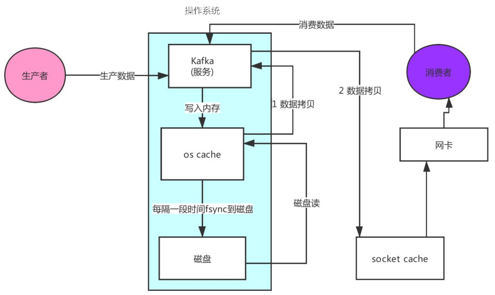
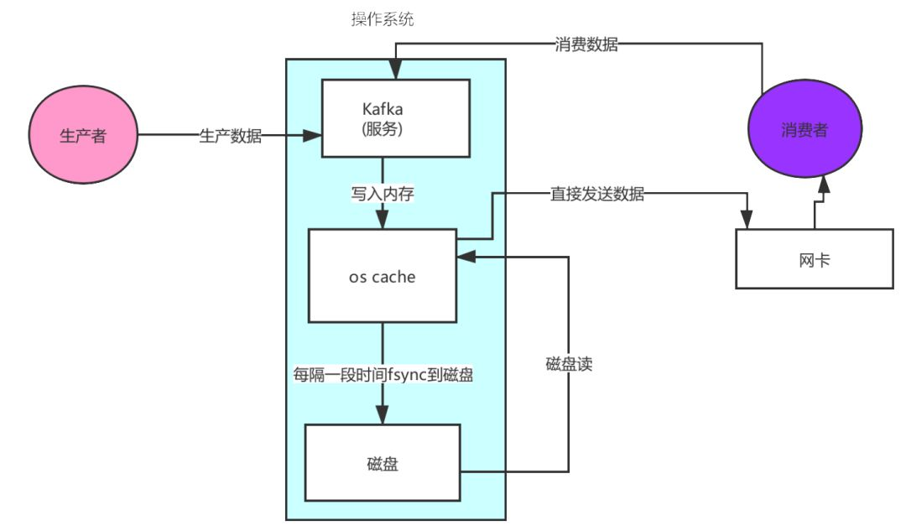
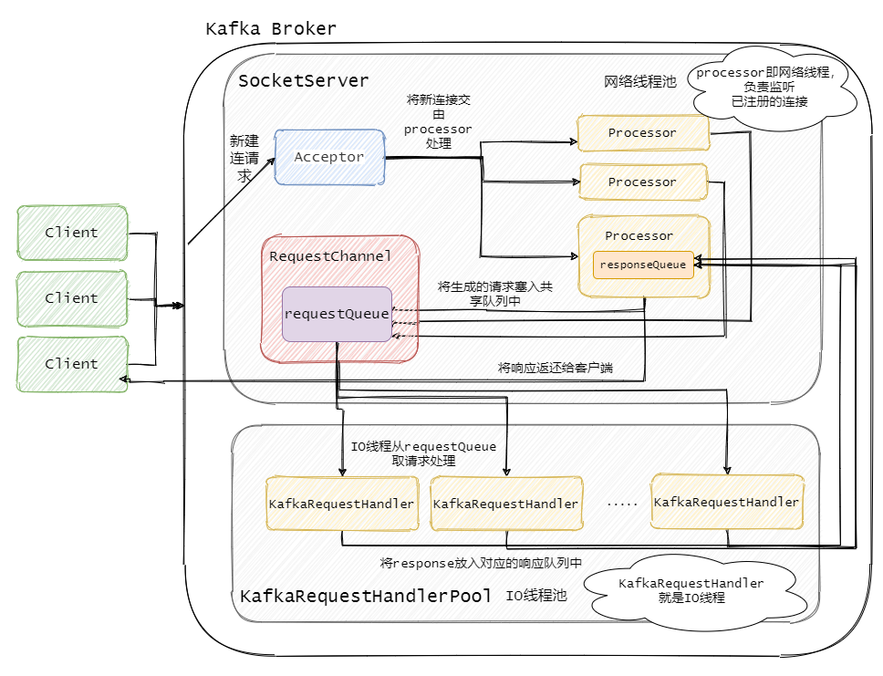

# [kafka](https://github.com/apache/kafka)

* 最初由 LinkedIn 采用 Scala 语言开发，用作 LinkedIn 的活动流追踪和运营系统数据处理管道的基础
* Kafka维护着“主数据库”，每个消费者程序都是“从数据库”，只要记住编号，消息都可以从“主数据库”复制到“从数据库”
* 不是消息中间件的一种实现。相反，它只是一种分布式流式系统
* 存储层是使用分区事务日志来实现的。Kafka也提供流式API用于实时的流处理以及连接器API用来更容易的和各种数据源集成

## 特性

* 高吞吐、低延迟：kakfa 最大的特点就是收发消息非常快，每秒可以处理几十万条消息，它的最低延迟只有几毫秒
* 高伸缩性：每个主题(topic) 包含多个分区(partition)，主题中的分区可以分布在不同的主机(broker)中
* 持久性、可靠性：通过副本增加可靠性,Kafka 能够允许数据的持久化存储，消息被持久化到磁盘，并支持数据备份防止数据丢失，Kafka 底层的数据存储是基于 Zookeeper 存储的，Zookeeper 知道它的数据能够持久存储。
* 容错性：允许集群中的节点失败，某个节点宕机，Kafka 集群能够正常工作
* 高并发：通过分片增加并行度,当具有百万以及千万的consumer的时候，同等配置的机器下，Kafka所拥有的Producer和Consumer会更多
* 磁盘锁：相对其他MQ，Kafka在进行IO操作的时候，其同步锁住IO的场景更少，发生等待的时间更短




## 技术实现

* 以牺牲延迟和抖动为代价优化了吞吐量，但并没有牺牲，比如持久性、严格的记录有序性和至少一次的分发语义
* 顺序读写
  - 利用分段、追加日志的方式，在很大程度上将读写限制为顺序I/O（sequential I/O）.存储介质的性能，很大程度上依赖于数据被访问的模式
  - 现代的操作系统提供了**预先读和延迟写**的技术，这些技术可以以块为单位，预先读取大量数据，并将较小的逻辑写操作合并成较大的物理写操作。因此，顺序I/O和随机I/O之间的性能差异在闪存和其他固态非易失性介质中仍然很明显，不过它们在旋转存储，比如固态硬盘中的性能差异就没有那么明显。
  + 避免了随机磁盘寻址的浪费 通过mmap提高I/O速度，写入数据时由于单个Partion是末尾添加所以速度最优；读取数据的时候配合sendfile直接暴力输出
  + 顺序写入：由于现代的操作系统提供了预读和写技术，磁盘的顺序写大多数情况下比随机写内存还要快.顺序写能到 600M/S，而随机写只有 100K/S
  + 磁盘读写的快慢取决于怎么使用它，也就是顺序读写或者随机读写。在顺序读写的情况下，磁盘的顺序读写速度和内存持平
  + 因为硬盘是机械结构，每次读写都会寻址->写入，其中寻址是一个“机械动作”，它是最耗时的。所以硬盘最讨厌随机I/O，最喜欢顺序I/O。为了提高读写硬盘的速度，Kafka就是使用顺序I/O。
  + 磁盘操作有以下几个好处
    * 磁盘顺序读写速度超过内存随机读写
    * JVM的GC效率低，内存占用大。使用磁盘可以避免这一问题
    * 系统冷启动后，磁盘缓存依然可用
  + 每一个Partition其实都是一个文件 ，收到消息后Kafka会把数据插入到文件末尾
  + 这种方法有一个缺陷——没有办法删除数据 ，所以Kafka是不会删除数据的，会把所有的数据都保留下来，每个消费者（Consumer）对每个Topic都有一个offset用来表示读取到了第几条数据
  + 删除数据策略
    * 基于时间
    * 基于partition文件大小
* Zero-copy 零拷贝
  - 避免了内核之间的切换,快速移动数据。少了一次内存交换。提升了消费的效率
  - 基于sendfile实现 Zero Copy,sendfile系统调用则提供了一种减少以上多次copy，提升文件传输性能的方法 `sendfile(socket, file, len);`
  - 传统模式下，文件进行传输具体流程：
    * 硬盘—>内核buf—>用户buf—>socket相关缓冲区—>协议引擎
    * 调用read函数，文件数据被copy到内核缓冲区
    * read函数返回，文件数据从内核缓冲区copy到用户缓冲区
    * write函数调用，将文件数据从用户缓冲区copy到内核与socket相关的缓冲区。
    * 数据从socket缓冲区copy到相关协议引擎
  + sendfile系统调用，文件数据被copy至内核缓冲区
  + 再从内核缓冲区copy至内核中socket相关的缓冲区
  + 最后再socket相关的缓冲区copy到协议引擎
  + Linux 的 sendFile 技术（NIO），省去了进程切换和一次数据拷贝，让性能变得更好
* 消息压缩
  - 当启用压缩时，对批处理的影响特别明显，因为随着数据大小的增加，压缩通常会变得更有效。特别是在使用基于文本的格式时，比如JSON，压缩的效果会非常明显，压缩比通常在5x到7x之间。此外，记录的批处理主要作为一个客户端操作，负载在传递的过程中，不仅对网络带宽有积极影响，而且对服务端的磁盘I/O利用率也有积极影响。
  - 更有效的数据压缩并减少 I/O 延迟,支持多种压缩协议，包括Gzip和Snappy压缩协议
  + 如果每个消息都压缩，但是压缩率相对很低。批量压缩，即将多个消息一起压缩而不是单个消息压缩
* Batching of Messages 记录批处理
  - 顺序I/O在大多数存储介质上都非常快，可以与网络I/O的最高性能相媲美。在实践中，这意味着一个设计良好的日志持久化层能跟上网络的读写速度
  - Kafka的性能瓶颈通常并不在硬盘上，而是网络IO
  - 客户端和服务端会在一个批处理中积累多个记录——包括读写记录，然后在通过网络发送出去。记录的批处理可以缓解网络往返的开销，使用更大的数据包，提高带宽的效率
  + 允许使用递归的消息集合，批量的消息可以通过压缩的形式传输并且在日志中也可以保持压缩格式，直到被消费者解压缩

+ 便宜的消费者
  - 不同于传统的消息队列模型，当消息被消费时会删除消息（会导致随机I/O），Kafka不会在消息被消费后删除它们——相反，它会独立地跟踪每个消费者组的偏移量。可以参考Kafka的内部主题__consumer_offsets了解更多。
  - 由于只是追加操作，所以速度很快。消息的大小在后台被进一步减少（使用Kafka的压缩特性），只保留任何给定消费者组的最后已知偏移量。
  - 此模型与传统的消息模型进行对比，后者通常提供几种不同的消息分发拓扑。一种是消息队列——用于点对点消息传递的持久化传输，没有点对多点功能。另一种是发布订阅主题允许点对多点消息通信，但这样做的代价是持久性。在传统消息队列模型中实现持久化的点对多点消息通信模型需要为每个有状态的使用者维护专用消息队列。这将放大读写的消耗。消息生产者被迫将消息写入多个消息队列中。另外一种选择是使用扇出中继，扇出中继可以消费来自一个队列中的记录，并将记录写入其他多个队列中，但这只会将延迟放大点。并且，一些消费者正在服务端上生成负载——读和写I/O的混合，既有顺序的，也有随机的。
  - Kafka中的消费者是“便宜的”，只要他们不改变日志文件（只有生产者或Kafka的内部进程被允许这样做）。这意味着大量消费者可以并发地从同一主题读取数据，而不会使集群崩溃。添加一个消费者仍然有一些成本，但主要是顺序读取夹杂很少的顺序写入。因此，在一个多样化的消费者系统中，看到一个主题被共享是相当正常的。

* 未刷新的缓冲写操作
  - Kafka在确认写操作之前并没有调用fsync。ACK的唯一要求是记录已经写入I/O缓冲区。这是一个鲜为人知的事实，但却是一个至关重要的事实。实际上，这就是Kafka的执行方式，就好像它是一个内存队列一样——Kafka实际上是一个由磁盘支持的内存队列（受缓冲区/页面缓存大小的限制）
  - 这种形式的写入是不安全的，因为副本的出错可能导致数据丢失，即使记录似乎已经被ACK。换句话说，与关系型数据库不同，仅写入缓冲区并不意味着持久性。保证Kafka持久性的是运行几个同步的副本。即使其中一个出错了，其他的（假设不止一个）将继续运行——假设出错的原因不会导致其他的副本也出错。因此，无fsync的非阻塞I/O方法和冗余的同步副本组合为Kafka提供了高吞吐、持久性和可用性
* Pull 拉模式 使用拉模式进行消息的获取消费，与消费端处理能力相符
* 避免垃圾回收
  - 大量使用通道、缓冲区和页面缓存还有一个额外的好处——减少垃圾收集器的工作负载。经过正确调优的垃圾收集器的吞吐量可能非常高，特别是在处理短生存期对象时。
  - 真正的收益在于减少抖动。通过避免垃圾回收，服务端不太可能遇到因垃圾回收引起的程序暂停，从而影响客户端，加大记录的通信延迟。
  - 像Shenandoah和ZGC这样的现代垃圾收集器可以扩展到巨大的、多TB级的堆，在最坏的情况下，并且可以自动调整垃圾收集的暂停时间，降到几毫秒。现在，可以看见大量的基于Java虚拟机的应用程序使用堆缓存，而不是堆外缓存

## 版本

* 0.9:从“一个高吞吐量，分布式的消息系统”改为”一个分布式流平台“
  - 之前的版本偏移量存储在 ZooKeeper。之后的版本偏移量存储在 Kafka中。Kafka 定义了一个系统 Topic，专用用来存储偏移量的数据
* 0.11
  - 引入幂等性解决 Kakfa 集群内部的数据重复

## 场景

* 分布式消息队列
* 流式处理平台
* 发布和订阅
* 存储及实时地处理大规模流数据
* 消息系统,订阅发布记录流:类似于企业中的消息队列 或 企业消息传递系统
  - 传递消息：Kafka 另外一个基本用途是传递消息，应用程序向用户发送通知就是通过传递消息来实现的，这些应用组件可以生成消息，而不需要关心消息的格式，也不需要关心消息是如何发送的。
  - 限流削峰：Kafka 多用于互联网领域某一时刻请求特别多的情况下，可以把请求写入 Kafka 中，避免直接请求后端程序导致服务崩溃。
* 存储系统:以容错的方式存储记录流
  - 日志记录：Kafka 的基本概念来源于提交日志，比如我们可以把数据库的更新发送到 Kafka 上，用来记录数据库的更新时间，通过 kafka 以统一接口服务的方式开放给各种 consumer，例如 hadoop、Hbase、Solr 等
* 流处理器,实时记录流
  - 活动跟踪：跟踪用户行为，比如经常回去淘宝购物，打开淘宝的那一刻，的登陆信息，登陆次数都会作为消息传输到 Kafka ，当浏览购物的时候，浏览信息，搜索指数，购物爱好都会作为一个个消息传递给 Kafka ，这样就可以生成报告，可以做智能推荐，购买喜好等
  - 流式处理：流式处理是有一个能够提供多种应用程序的领域。
* 度量指标：记录运营监控数据。包括收集各种分布式应用的数据，生产各种操作的集中反馈，比如报警和报告

## 概念

* Topic（主题）:使用一个类别属性来划分消息的所属类，划分消息的这个类称为 topic。topic 相当于消息的分配标签，是一个逻辑概念。主题好比是数据库的表，或者文件系统中的文件夹
  - Kafka为每个主题维护一个消息分区日志。每个分区都是由有序的不可变的记录序列组成，并且消息都是连续的被追加在尾部。
  - Leader 负责给定分区的所有读取和写入的节点，每个节点都会通过随机选择成为 leader。
  - Replicas 是为该分区复制日志的节点列表，无论它们是 Leader 还是当前处于活动状态。
  - Isr 是同步副本的集合。它是副本列表的子集，当前仍处于活动状态并追随Leader。
  - 当消息到达时，Kafka就会把他们追加到分区尾部。默认情况下，Kafka使用轮询分区器（partitioner）把消息一致的分配到多个分区上
* Partition（分区）:一个 Topic 可以分为多个 Partition，每个 Partition 是一个有序的队列，Partition 中的每条消息都存在一个有序的偏移量（Offest），同一个 Consumer Group 中，只有一个 Consumer 实例可消费某个 Partition 的消息
  - 一个物理概念，对应到系统上的就是一个或若干个目录，一个分区就是一个 提交日志.分区的编号是从 0 开始的
  - 6-12最佳，最好能够被节点数整除，避免数据倾斜
  - 每个 Partition 在存储层面是 log 文件
  - 任何发布到此 Partition 的消息都会被直接 append 到 log 文件的尾部
  - 先后以顺序的方式读取
  - 每条消息在文件中的位置称为 Offest（偏移量），消费者都会实时记录自己消费到了那个 Offset，以便出错的时候从上次的位置继续消费，这个 Offset 就保存在 Index 文件中。
  - Partition 是以文件的形式存储在文件系统中，log 文件根据 Broker 中的配置保留一定时间后删除来释放磁盘空间
  - 由于一个主题包含无数个分区，因此无法保证在整个 topic 中有序，但是单个 Partition 分区可以保证有序。消息被迫加写入每个分区的尾部。Kafka 通过分区来实现数据冗余和伸缩性
  - 分区可以分布在不同的服务器上，也就是说，一个主题可以跨越多个服务器，以此来提供比单个服务器更强大的性能
  - Offset一般由消费者管理，当然也可以通过程序按需要设置。Offset只有commit以后，才会改变，否则，将一直获取重复的数据。新的kafka已经将这些Offset的放到了一个专有的主题：__consumer_offsets
  - 一个分区内的 .log 文件最大为 1G，做这个限制目的是为了方便把 .log 加载到内存去操作
* 段 Segment：为防止 Log 文件过大导致数据定位效率低下，采用分片和索引的机制，将每个 Partition 分为多个 Segment
  - 每个 segment 文件的大小相等。每个 Segment 对应 2 个文件 Index 文件和 Log 文件,位于同一个文件夹下，文件夹的命名规则为：Topic 名称+分区序号
  - 文件名以这个 Segment 中起始的 Offset 命名，文件扩展名是 .log。Segment 对应的索引的文件名字一样，扩展名是 .index
  - Index 文件中存储的数据的索引信息，第一列是 Offset，第二列数据所对应的 Log 文件中的偏移量
  - 去消费 Offset 为 3 的数据，首先通过二分法找到数据在哪个 Index 文件中，然后在通过 Index 中 Offset 找到数据在 Log 文件中的 Offset
  - 减少索引文件的大小，降低空间使用，方便直接加载进内存中，这里的索引使用稀疏矩阵，不会每一个 Message 都记录下具体位置，而是每隔一定的字节数，再建立一条索引。 索引包含两部分：
    + BaseOffset：意思是这条索引对应 Segment 文件中的第几条 Message。这样做方便使用数值压缩算法来节省空间。例如 Kafka 使用的是 Varint。
    + Position：在 Segment 中的绝对位置。
  - 查找 Offset 对应的记录时，会先用二分法，找出对应的 Offset 在哪个 Segment 中，然后使用索引，在定位出 Offset 在 Segment 中的大概位置，再遍历查找 Message
* 每一条消息记录包含三个要素：键（key）、值（value）、时间戳（Timestamp）
* Producer（生产者）：将某 topic 的消息发布到相应的 partition 中
  - 默认情况下把消息均衡地分布到主题的所有分区上，而并不关心特定消息会被写到哪个分区
  - 客户端中指定 Partition
  - 分区的原因主要就是提供并发提高性能，因为读写是 Partition 为单位读写的
* Consumer（消费者）：订阅主题消息的客户端程序，消费者用于处理生产者产生的消息
  - 一个消费者可以消费多个 topic 的消息，对于某一个 topic 的消息，其只会消费同一个 partition 中的消息
  - 消费者的个数，不要超过分区的个数。否则，多出来的消费者，将接收不到任何数据
* 消费者组 (Consumer Group)：由一个或多个消费者组成的群体。生产者与消费者的关系，是一个生产者对应多个消费者
  - 让多个消费者并行消费信息而存在的，而且它们不会消费到同一个消息
  - Consumer Group 需要设定一个 group.id，Consumer Group 的唯一标识
  - Consumer Group 下可以有一个或多个 Consumer 实例，Consumer 实例可以是一个进程，也可以是一个线程
  - Consumer Group 可以订阅多个 Topic，但一个 Topic 下的一个分区只能分配给某个 Consumer 实例消费，不同的 Consumer Group 可以消费 Topic 下同一个分区的数据；
  - Consumer Group 最多的 Consumer 实例个数不应超过订阅的 Topic 的分区数，因为一个分区只能给一个 Consumer 实例消费，多出来的 Consumer 实例完全是浪费；
* 偏移量：偏移量（Consumer Offset）是一种元数据，是一个不断递增的整数值，用来记录消费者发生重平衡时的位置，以便用来恢复数据。
  - 消费组的偏移重置设定（auto.offset.reset）,已提交的 offset 不是指 producer 发送的消息对应的 offset ，而是指消费者消费的消息对应的 offset 。
    + largest(默认),也可以使用 latest、end
      * 当各分区下有已提交的 offset 时，从提交的 offset 开始消费
      * 无提交的 offset 时，消费新产生的该分区下的数据
      * 没有启动 Consumer 实例的情况下，Producer 向某个 Topic 发布了消息。之后当 Consumer 实例启动时是不会消费之前发布的数据的，只有新发布的数据会被消费；
      * 在 Consumer 实例启动的情况下，当 Producer 向某个 Topic（n 个分区） 发布消息时，当 Consumer 实例挂掉时并没有对所有分区有过消费记录，在挂掉期间，如果 Producer 发布的消息恰好落到没有消费记录的分区，Consumer 实例重新启动后，这部分消息（落到没有消费记录分区）将不会消费，只有新发布的数据会被消费；
    + smallest，也可以使用 earliest、beginning:当各分区下有已提交的 offset 时，从提交的 offset 开始消费；无提交的offset时，从头开始消费
    + error: Topic 各分区都存在已提交的 offset 时，从 offset 后开始消费；只要有一个分区不存在已提交的 offset ，则抛出异常
* broker: 一个独立的 Kafka 服务器就被称为 broker
  - 接收来自生产者的消息，为消息设置偏移量，并提交消息到磁盘保存
  - 为消费者提供服务，对读取分区的请求作出响应，返回已经提交到磁盘上的消息
* broker 集群：broker 是集群 的组成部分，broker 集群由一个或多个 broker 组成，每个集群都有一个 broker 同时充当了集群控制器的角色（自动从集群的活跃成员中选举出来）
  - 每个集群中都会有一个 broker 同时充当了 集群控制器(Leader)的角色，它是由集群中的活跃成员选举出来的
  - 每个集群中的成员都有可能充当 Leader，Leader 负责管理工作，包括将分区分配给 broker 和监控 broker
  - 分区复制:一个分区从属于一个 Leader，但是一个分区可以分配给多个 broker（非Leader）
* ISR(In-Sync Replicas)副本：消息的备份又叫做 副本（Replica），副本的数量是可以配置的，Kafka 定义了两类副本
  - 分布式系统保证数据可靠性的一个常用手段就是增加副本个数
  - 副本数对Kafka的吞吐率是有一定的影响，但极大的增强了可用性。一般2-3个为宜
  - 副本有两个要素，一个是数量要够多，一个是不要落在同一个实例上
  - ISR是针对与Partition的，每个分区都有一个同步列表。N个replicas中，其中一个replica为leader，其他都为follower, leader处理partition的所有读写请求，其他的都是备份。与此同时，follower会被动定期地去复制leader上的数据
  - 如果一个flower比一个leader落后太多，或者超过一定时间未发起数据复制请求，则leader将其重ISR中移除
  - 当ISR中所有Replica都向Leader发送ACK时，leader才commit
  - ISR的管理最终都会反馈到Zookeeper节点上。具体位置为：/brokers/topics/[topic]/partitions/[partition]/state。当Leader节点失效，也会依赖Zk进行新的Leader选举
  - Offset转移到Kafka内部的Topic以后，KAFKA对ZK的依赖就越来越小了
  - 领导者副本（Leader Replica）：对外提供服务
  - 追随者副本（Follower Replica）：只是被动跟随
* 集群管理
  - 所有的 Broker 在启动的时候都会往 Zookeeper 进行注册，目的就是选举出一个 Controller
  - 成为 Controller 之后要做啥呢，它会监听 Zookeeper 里面的多个目录，例如有一个目录 /brokers/，其他从节点往这个目录上**注册（就是往这个目录上创建属于自己的子目录而已）**自己。
    + 命名规则一般是它们的 id 编号，比如 /brokers/0,1,2。注册时各个节点必定会暴露自己的主机名，端口号等等的信息
    + Controller 就要去读取注册上来的从节点的数据（通过监听机制），生成集群的元数据信息，之后把这些信息都分发给其他的服务器，让其他服务器能感知到集群中其它成员的存在
    + Controller 就监听到了这一改变，它会去同步这个目录的元信息，然后同样下放给它的从节点，通过这个方法让整个集群都得知这个分区方案，此时从节点就各自创建好目录等待创建分区副本即可。这也是整个集群的管理机制
* 重平衡：Rebalance。消费者组内某个消费者实例挂掉后，其他消费者实例自动重新分配订阅主题分区的过程。Rebalance 是 Kafka 消费者端实现高可用的重要手段
  - 消费端Rebalance: 消费端的上线下线会造成分区与消费者的关系重新分配，造成Rebalance。业务会发生超时、抖动等
  - 服务端reassign: 服务器扩容、缩容，节点启动、关闭，会造成数据的倾斜，需要对partition进行reassign。在kafka manager后台可以手动触发这个过程，使得分区的分布更加平均。 这个过程会造成集群间大量的数据拷贝，当你的集群数据量大，这个过程会持续数个小时或者几天，谨慎操作。
* Connector 连接器Task，包含Source和Sink两种接口，给用户提供了自定义数据流转的可能。比如从JDBC导入到Kafka，或者将Kafka数据直接落地到DB。
* Stream 类似于Spark Stream，能够进行流数据处理。但它本身没有集群，只是在KAFKA集群上的抽象。如果你想要实时的流处理，且不需要Hadoop生态的某些东西

```
00000000000000000000.index
00000000000000000000.log
00000000000000000000.timeindex

00000000000005367851.index
00000000000005367851.log
00000000000005367851.timeindex

00000000000009936472.index
00000000000009936472.log
00000000000009936472.timeindex
```

## 消息队列

* 点对点模式：支持消费者群组的，也就是说 Kafka 中会有一个或者多个消费者，如果一个生产者生产的消息由一个消费者进行消费
* 发布订阅模式：一个生产者或者多个生产者产生的消息能够被多个消费者同时消费的情

## 架构

* Kafka 通过 Zookeeper 管理集群配置，选举 leader，以及在 Consumer Group 发生变化时进行 rebalance。Producer 使用 push 模式将消息发布到 broker，Consumer 使用 pull 模式从 broker 订阅并消费消息。
* 一个典型的 Kafka 集群
  - 若干 Producer（可以是 web 前端产生的 Page View，或者是服务器日志，系统 CPU、Memory 等）
  - 若干 broker（Kafka 支持水平扩展，一般 broker 数量越多，集群吞吐率越高）
  - 若干 Consumer Group
  - 一个 Zookeeper 集群:Broker 列表管理、Partition 与 Broker 的关系、Partition 与 Consumer 的关系、Producer 与 Consumer 负载均衡、消费进度 Offset 记录、消费者注册
* 一个分区一个文件
* 消息写入对于单分区来说也是顺序写，如果分区不多的话从整体上看也算顺序写，它的日志文件并没有用到 mmap，而索引文件用了 mmap。但发消息 Kafka 用到了零拷贝
* 对于消息的写入来说 mmap 其实没什么用，因为消息是从网络中来。而对于发消息来说 sendfile 对比 mmap+write 觉得效率更高，因为少了一次页缓存到 SocketBuffer 中的拷贝
* 分区多了的话，写入需要频繁的在多个文件之间来回切换，对于每个文件来说是顺序写入的，但是从全局看其实算随机写入，并且读取的时候也是一样，算随机读

## API

* Producer API:应用程序向一个或多个 topics 上发送消息记录
* Consumer API:允许应用程序订阅一个或多个 topics 并处理为其生成的记录流
* Streams API:允许应用程序作为流处理器，从一个或多个主题中消费输入流并为其生成输出流，有效的将输入流转换为输出流。
* Connector API:允许构建和运行将 Kafka 主题连接到现有应用程序或数据系统的可用生产者和消费者。例如，关系数据库的连接器可能会捕获对表的所有更改

## 安装和重要配置

* broker 端配置
  - broker.id 每个 kafka broker 都有一个唯一的标识来表示，它的默认值是 0。这个值在 kafka 集群中必须是唯一的，这个值可以任意设定
  - port 如果使用配置样本来启动 kafka，它会监听 9092 端口。修改 port 配置参数可以把它设置成任意的端口。要注意，如果使用 1024 以下的端口，需要使用 root 权限启动 kakfa。
  - zookeeper.connect 用于保存 broker 元数据的 Zookeeper 地址是通过 zookeeper.connect 来指定的。比如我可以这么指定 localhost:2181 表示这个 Zookeeper 是运行在本地 2181 端口上的。我们也可以通过 比如我们可以通过 zk1:2181,zk2:2181,zk3:2181 来指定 zookeeper.connect 的多个参数值。该配置参数是用冒号分割的一组 hostname:port/path 列表，其含义如下
    + hostname 是 Zookeeper 服务器的机器名或者 ip 地址。
    + port 是 Zookeeper 客户端的端口号
    + /path 是可选择的 Zookeeper 路径，Kafka 路径是使用了 chroot 环境，如果不指定默认使用跟路径
    + 如果有两套 Kafka 集群，假设分别叫它们 kafka1 和 kafka2，那么两套集群的zookeeper.connect参数可以这样指定：zk1:2181,zk2:2181,zk3:2181/kafka1和zk1:2181,zk2:2181,zk3:2181/kafka2
  - log.dirs Kafka 把所有的消息都保存到磁盘上，存放这些日志片段的目录是通过 log.dirs 来制定的，它是用一组逗号来分割的本地系统路径，log.dirs 是没有默认值的，必须手动指定他的默认值。其实还有一个参数是 log.dir，这个配置是没有 s 的，默认情况下只用配置 log.dirs 就好了，比如可以通过 /home/kafka1,/home/kafka2,/home/kafka3 这样来配置这个参数的值。
  - num.recovery.threads.per.data.dir 对于如下 3 种情况，Kafka 会使用可配置的线程池来处理日志片段。
    + 服务器正常启动，用于打开每个分区的日志片段；
    + 服务器崩溃后重启，用于检查和截断每个分区的日志片段；
    + 服务器正常关闭，用于关闭日志片段。
    + 默认情况下，每个日志目录只使用一个线程。因为这些线程只是在服务器启动和关闭时会用到，所以完全可以设置大量的线程来达到井行操作的目的。特别是对于包含大量分区的服务器来说，一旦发生崩愤，在进行恢复时使用井行操作可能会省下数小时的时间。设置此参数时需要注意，所配置的数字对应的是 log.dirs 指定的单个日志目录。也就是说，如果 num.recovery.threads.per.data.dir 被设为 8，并且 log.dir 指定了 3 个路径，那么总共需要 24 个线程。
  - auto.create.topics.enable 默认情况下，kafka 会使用三种方式来自动创建主题，下面是三种情况：
    + 当一个生产者开始往主题写入消息时
    + 当一个消费者开始从主题读取消息时
    + 当任意一个客户端向主题发送元数据请求时
    + 建议最好设置成 false，即不允许自动创建 Topic。在线上环境里面有很多名字稀奇古怪的 Topic，大概都是因为该参数被设置成了 true 的缘故
  - delete.topic.enable 如果想要删除一个主题，可以使用主题管理工具。默认情况下，是不允许删除主题的，delete.topic.enable 的默认值是 false 因此不能随意删除主题。这是对生产环境的合理性保护，但是在开发环境和测试环境，是可以允许删除主题的
* 主题默认配置:Kafka 为新创建的主题提供了很多默认配置参数，下面就来一起认识一下这些参数
  - num.partitions 参数指定了新创建的主题需要包含多少个分区。如果启用了主题自动创建功能（该功能是默认启用的），主题分区的个数就是该参数指定的值。该参数的默认值是 1。要注意，可以增加主题分区的个数，但不能减少分区的个数。
  - default.replication.factor 表示 kafka 保存消息的副本数，如果一个副本失效了，另一个还可以继续提供服务 default.replication.factor 的默认值为 1，这个参数在你启用了主题自动创建功能后有效。
  - log.retention.ms Kafka 通常根据时间来决定数据可以保留多久，默认是 168 个小时，也就是一周。除此之外，还有两个参数 log.retention.minutes 和 log.retentiion.ms 。这三个参数作用是一样的，都是决定消息多久以后被删除，推荐使用 log.retention.ms。
  - log.retention.bytes 另一种保留消息的方式是判断消息是否过期。它的值通过参数 log.retention.bytes 来指定，作用在每一个分区上。也就是说，如果有一个包含 8 个分区的主题，并且 log.retention.bytes 被设置为 1GB，那么这个主题最多可以保留 8GB 数据。所以，当主题的分区个数增加时，整个主题可以保留的数据也随之增加。
  - log.segment.bytes 上述的日志都是作用在日志片段上，而不是作用在单个消息上
    + 当消息到达 broker 时，它们被追加到分区的当前日志片段上，当日志片段大小到达 log.segment.bytes 指定上限（默认为 1GB）时，当前日志片段就会被关闭，一个新的日志片段被打开(log rolling)
    + 如果一个日志片段被关闭，就开始等待过期。这个参数的值越小，就越会频繁的关闭和分配新文件，从而降低磁盘写入的整体效率
  - log.segment.ms 上面提到日志片段经关闭后需等待过期，那么 log.segment.ms 这个参数就是指定日志多长时间被关闭的参数和，log.segment.ms 和 log.retention.bytes 也不存在互斥问题。日志片段会在大小或时间到达上限时被关闭，就看哪个条件先得到满足。
  - message.max.bytes 来限制单个消息的大小，默认是 1000 000， 也就是 1MB，如果生产者尝试发送的消息超过这个大小，不仅消息不会被接收，还会收到 broker 返回的错误消息。跟其他与字节相关的配置参数一样，该参数指的是压缩后的消息大小，也就是说，只要压缩后的消息小于 mesage.max.bytes，那么消息的实际大小可以大于这个值 这个值对性能有显著的影响。值越大，那么负责处理网络连接和请求的线程就需要花越多的时间来处理这些请求。它还会增加磁盘写入块的大小，从而影响 IO 吞吐量。
  - retention.ms 规定了该主题消息被保存的时常，默认是 7 天，即该主题只能保存 7 天的消息，一旦设置了这个值，它会覆盖掉 Broker 端的全局参数值。
  - retention.bytes 规定了要为该 Topic 预留多大的磁盘空间。和全局参数作用相似，这个值通常在多租户的 Kafka 集群中会有用武之地。当前默认值是 -1，表示可以无限使用磁盘空间。
* JVM 参数配置: JDK 版本一般推荐直接使用 JDK1.8
  - 堆:业界最推崇的一种设置方式就是直接将 JVM 堆大小设置为 6GB，这样会避免很多 Bug 出现
  - 另一个重要参数就是垃圾回收器的设置(GC 设置) :如果你依然在使用 Java 7，那么可以根据以下法则选择合适的垃圾回收器：
    + 如果 Broker 所在机器的 CPU 资源非常充裕，建议使用 CMS 收集器。启用方法是指定-XX:+UseCurrentMarkSweepGC。
    + 使用吞吐量收集器。开启方法是指定-XX:+UseParallelGC。
    + 当然了，如果已经在使用 Java 8 了，那么就用默认的 G1 收集器就好了。在没有任何调优的情况下，G1 表现得要比 CMS 出色，主要体现在更少的 Full GC，需要调整的参数更少等，所以使用 G1 就好了。 一般 G1 的调整只需要这两个参数即可
      * MaxGCPauseMillis 该参数指定每次垃圾回收默认的停顿时间。该值不是固定的，G1 可以根据需要使用更长的时间。它的默认值是 200ms，也就是说，每一轮垃圾回收大概需要 200 ms 的时间。
      * InitiatingHeapOccupancyPercent 该参数指定了 G1 启动新一轮垃圾回收之前可以使用的堆内存百分比，默认值是 45，这就表明 G1 在堆使用率到达 45 之前不会启用垃圾回收。这个百分比包括新生代和老年代。
* 配置建议
  - 不同的应用场景有不一样的配置策略和不一样的SLA服务水准。需要搞清楚自己的消息是否允许丢失或者重复，然后设定相应的副本数量和ACK模式。
  - Lag 要时刻注意消息的积压。Lag太高意味着处理能力有问题。如果在低峰时候消息有积压，那么当大流量到来，必然会出问题
  - 扩容：会涉及到partition的重新分布，网络带宽可能会是瓶颈
  - 磁盘满了 建议设置过期天数，或者设置磁盘最大使用量 `log.retention.bytes`
  - 过期删除 磁盘空间是有限的，建议保留最近的记录，其余自动删除
  - 大流量下的KAFKA是非常吓人的，数据经常将网卡打满。而一旦Broker当机，如果单节点有上T的数据，光启动就需要半个小时，它还要作为Follower去追赶其他Master分区的数据。所以，不要让的KAFKA集群太大，故障恢复会是一场灾难。启动以后，如果执行reassign，又会是另一番折腾了

```sh
# zookeeper
tar -zxvf zookeeper-3.4.10.tar.gz
mv zoo_sample.cfg zoo.cfg
# zoo.cfg
dataDir = /usr/local/zookeeper/zookeeper-3.4.10/data

# 集群 配置不同 dir 和监听端口 conf/zoo.cfg
tickTime=2000 # 作为 Zookeeper 服务器之间或客户端与服务器之间维持心跳的时间间隔，每个 tickTime 时间就会发送一个心跳
initLimit=10 # 置 Zookeeper 接受客户端（这里所说的客户端不是用户连接 Zookeeper 服务器的客户端，而是 Zookeeper 服务器集群中连接到 Leader 的 Follower 服务器）初始化连接时最长能忍受多少个心跳时间间隔数。当已经超过 5个心跳的时间（也就是 tickTime）长度后 Zookeeper 服务器还没有收到客户端的返回信息，那么表明这个客户端连接失败。总的时间长度就是 5*2000=10 秒
syncLimit=5 # 标识 Leader 与Follower 之间发送消息，请求和应答时间长度，最长不能超过多少个 tickTime 的时间长度，总的时间长度就是5*2000=10秒
# 快照日志的存储路径
dataDir=/usr/local/zookeeper/zookeeper-3.4.10/data
# 事务日志的存储路径，如果不配置这个那么事务日志会默认存储到dataDir指定的目录，这样会严重影响zk的性能，当zk吞吐量较大的时候，产生的事务日志、快照日志太多
dataLogDir=/usr/local/zookeeper/zookeeper-3.4.10/log
# 客户端连接 Zookeeper 服务器的端口，Zookeeper 会监听这个端口，接受客户端的访问请求。
clientPort=2181

# 集群配置
# server.x 分别对应myid文件的内容（每个 zoo.cfg 文件都需要添加）
# 12888(通讯端口):master 与 slave 之间的通信接口，默认是 2888
# 13888:leader选举的端口，集群刚启动的时候选举或者leader挂掉之后进行新的选举的端口，默认是 3888
server.1=192.168.1.7:12888:13888
server.2=192.168.1.8:12888:13888
server.3=192.168.1.9:12888:13888

# server.1
echo "1" > /usr/local/zookeeper/zookeeper-3.4.10/data/myid
# server.2
echo "2" > /usr/local/zookeeper/zookeeper-3.4.10/data/myid
# server.3
echo "3" > /usr/local/zookeeper/zookeeper-3.4.10/data/myid

zkServer.sh status|start|stop # 查看状态

# Mac 会自动安装依赖zookeeper
brew install kafka
brew services start kafka

# linux
wget http://www-us.apache.org/dist/kafka/2.4.0/kafka_2.13-2.4.0.tgz
tar xzf kafka_2.13-2.4.0.tgz
mv kafka_2.13-2.4.0 /usr/local/kafka

# 启动 zookeeper
# /etc/systemd/system/zookeeper.service
/usr/local/etc/kafka/zookeeper-server-start /usr/local/etc/kafka/zookeeper.properties
/usr/local/kafka/bin/zookeeper-server-start.sh /usr/local/kafka/config/zookeeper.properties

# 启动kafka服务
# config/server.properties
broker.id=0 # 初始是0，每个 server 的broker.id 都应该设置为不一样的，就和 myid 一样 三个服务分别设置的是 1,2,3 当前机器在集群中的唯一标识，和zookeeper的myid性质一样
port=9092 #当前kafka对外提供服务的端口默认是9092
host.name=192.168.1.7 #这个参数默认是关闭的，在0.8.1有个bug，DNS解析问题，失败率的问题。
num.network.threads=3 #这个是borker进行网络处理的线程数
num.io.threads=8 #这个是borker进行I/O处理的线程数
log.dirs=/usr/local/kafka/kafka_2.12-2.3.0/log #  消息存放的目录，这个目录可以配置为“，”逗号分割的表达式，上面的num.io.threads要大于这个目录的个数这个目录，如果配置多个目录，新创建的topic他把消息持久化的地方是，当前以逗号分割的目录中，那个分区数最少就放那一个

socket.send.buffer.bytes=102400 #发送缓冲区buffer大小，数据不是一下子就发送的，先回存储到缓冲区了到达一定的大小后在发送，能提高性能
socket.receive.buffer.bytes=102400 #kafka接收缓冲区大小，当数据到达一定大小后在序列化到磁盘
socket.request.max.bytes=104857600 #这个参数是向kafka请求消息或者向kafka发送消息的请请求的最大数，这个值不能超过java的堆栈大小
num.partitions=1 #默认的分区数，一个topic默认1个分区数

log.retention.hours=168 #默认消息的最大持久化时间，168小时，7天
message.max.byte=5242880  #消息保存的最大值5M
default.replication.factor=2  #kafka保存消息的副本数，如果一个副本失效了，另一个还可以继续提供服务
replica.fetch.max.bytes=5242880  #取消息的最大直接数

log.segment.bytes=1073741824 #这个参数是：因为kafka的消息是以追加的形式落地到文件，当超过这个值的时候，kafka会新起一个文件
log.retention.check.interval.ms=300000 #每隔300000毫秒去检查上面配置的log失效时间（log.retention.hours=168 ），到目录查看是否有过期的消息如果有，删除
log.cleaner.enable=false #是否启用log压缩，一般不用启用，启用的话可以提高性能
zookeeper.connect=192.168.1.7:2181,192.168.1.8:2181,192.168.1.9:2181 #设置zookeeper的连接端口

# /etc/systemd/system/kafka.service
/usr/local/kafka/bin/kafka-server-start.sh /usr/local/kafka/config/server.properties
./kafka-server-start.sh -daemon ../config/server.properties
bin\windows\kafka-server-start.bat .\config\server.properties

# 创建topic
kafka-topics --create --zookeeper localhost:2181 --replication-factor 1 --partitions 1 --topic test # 只有 3 个 Broker 节点，则 replication-factor 最大就是 3
bin/kafka-topics.sh --create --zookeeper 192.168.1.7:2181 --replication-factor 2 --partitions 1 --topic cxuan # 复制两份 创建1个分区
/usr/local/kafka/bin/kafka-topics.sh --create --zookeeper localhost:2181 --replication-factor 1 --partitions 1 --topic testTopic

# 查看创建的topic
kafka-topics --list --zookeeper localhost:2181
/usr/local/kafka/bin/kafka-topics.sh --list --zookeeper 192.168.1.7:2181
/usr/local/kafka/bin/kafka-topics.sh --describe --zookeeper 192.168.1.7:2181 --topic cxuantopic
Topic: cxuantopic Partition: 0 Leader: 1 Replicas: 1,2 Isr: 1,2 # 主题 cxuantopic 的分区为0 Replicas: 1，2  复制因子为2 复制的为1，2

# 生产者生产数据
/usr/local/kafka/bin/kafka-console-producer --broker-list localhost:9092 --replication-factor 1 --partitions 1  --topic testTopic
./kafka-console-producer.sh --broker-list 192.168.1.7:9092 --replication-factor 1 --partitions 1  --topic cxuantopic

# 消费者
/usr/local/kafka/bin/kafka-console-consumer --bootstrap-server localhost:9092 --topic test --from-beginning
/usr/local/kafka/bin/bin/kafka-console-consumer.sh --bootstrap-server 192.168.1.7:9092 --topic cxuantopic --from-beginning
/usr/local/kafka/bin/bin/kafka-console-consumer.sh --bootstrap-server 192.168.1.7:9092 --topic cxuantopic --from-beginning # 另外两个节点上使用
/usr/local/kafka/bin/kafka-console-consumer.sh --bootstrap-server localhost:9092 --topic testTopic --from-beginning
```

## Producer

* 对外使用 Topic 的概念，生产者往 Topic 里写消息，消费者从中读消息
  - 为了做到水平扩展，一个 Topic 实际是由多个 Partition 组成的，遇到瓶颈时，可以通过增加 Partition 的数量来进行横向扩容。单个 Parition 内是保证消息有序
  - 创建一条记录，记录中一个要指定对应的 Topic 和 Value，Key 和 Partition 可选,如果 Partition 没填
    + Key 有填。按照 Key 进行哈希，相同 Key 去一个 Partition。（如果扩展了 Partition 的数量那么就不能保证了）
    + Key 没填。Round-Robin 来选 Partition。
  - 先序列化，然后按照 Topic 和 Partition，放进对应的发送队列中
  - Kafka Produce 都是批量请求，会积攒一批，然后一起发送，不是调 send() 就立刻进行网络发包。
  - 同一个 Partition 的请求按照配置，攒一波，然后由一个单独的线程一次性发过去
* Partition:存在多副本的情况下，会尽量把多个副本，分配到不同的 Broker 上
  - Kafka 会为 Partition 选出一个 Leader，之后所有该 Partition 的请求，实际操作的都是 Leader，然后再同步到其他的 Follower
  - 一个 Broker 歇菜后，所有 Leader 在该 Broker 上的 Partition 都会重新选举，选出一个 Leader
  - Controller：Partition 的分配，还有 Leader 的选举，使用 ZK 在 Broker 中选出一个 Controller
    + Partition 的分配：
      * 将所有 Broker（假设共 n 个 Broker）和待分配的 Partition 排序。
      * 将第 i 个 Partition 分配到第（i mod n）个 Broker 上 （这个就是 Leader）。
      * 将第 i 个 Partition 的第 j 个 Replica 分配到第（(i + j) mode n）个 Broker 上。
    + Leader 容灾
      * Controller 会在 ZK 的 /brokers/ids 节点上注册 Watch，一旦有 Broker 宕机，它就能知道。
      * 当 Broker 宕机后，Controller 就会给受到影响的 Partition 选出新 Leader。
      * Controller 从 ZK 的 /brokers / topics / [topic] / partitions / [partition] / state 中，读取对应 Partition 的 ISR（in-sync replica 已同步的副本）列表，选一个出来做 Leader。
      * 选出 Leader 后，更新 ZK，然后发送 LeaderAndISRRequest 给受影响的 Broker，让它们知道改变这事。
  - 多副本同步：Follower 从 Leader 批量拉取数据来同步，具体的可靠性，是由生产者来决定的
    + 生产者生产消息的时候，通过 request.required.acks 参数来设置数据的可靠性
      * Acks=-1 的时候，如果 ISR 少于 min.insync.replicas 指定的数目，那么就会返回不可用
      * Acks=1 写leader成功后返回，异步写
      * Acks=0 发过去就行，不关心broker是否处理成功
    + ISR 列表中的机器是会变化的，根据配置 replica.lag.time.max.ms，多久没同步，就会从 ISR 列表中剔除
    + 高水位：对于 Partition 和 Leader，就是所有 ISR 中都有的最新一条记录。消费者最多只能读到高水位。
    + 从 ISA 中选出 Leader 后，Follower 会把自己日志中上一个高水位后面的记录去掉，然后去和 Leader 拿新的数据。因为新的 Leader 选出来后，Follower 上面的数据，可能比新 Leader 多，所以要截取。
* Broker、Topics、Partitions 的一些元信息用 ZK 来存，监控和路由都会用到 ZK
* 流程
  - Producers 往 Brokers 里面的指定 Topic 中写消息
  - Consumers 从 Brokers 里面拉取指定 Topic 的消息


```sh
.\bin\windows\kafka-topics.bat --create --zookeeper localhost:2181,localhost:2182,localhost:2183 --replication-factor 1 --partitions 1 --topic testTopic
.\bin\windows\kafka-console-producer.bat --broker-list localhost:9092,localhost:9093,localhost:9094 --topic testTopic
.\bin\windows\kafka-console-consumer.bat --bootstrap-server localhost:9092,localhost:9093,localhost:9094 --topic testTopic
```

## 消费

* 订阅 Topic 是以一个消费组来订阅的，一个消费组里面可以有多个消费者。同一个消费组中的两个消费者，不会同时消费一个 Partition
* Partition 的分配问题，即确定哪个 Partition 由哪个消费者来消费
  - 轮询（RountRobin）对于 Topic 组生效: 前提是一个消费者组中的所有消费者订阅的主题是一样的
  - (Range）对于单个 Topic 生效: 会出现消费者数据不均衡的问题
  - 同一个消费者组里的消费者不能同时消费同一个分区
* API：订阅 Topic 时，可以用正则表达式，如果有新 Topic 匹配上，那能自动订阅上
* Offset 的保存
  - 一个消费组消费 Partition，需要保存 Offset 记录消费到哪，以前保存在 ZK 中，由于 ZK 的写性能不好，以前的解决方法都是 Consumer 每隔一分钟上报一次
  - ZK 的性能严重影响了消费的速度，而且很容易出现重复消费。在 0.10 版本后，Kafka 把这个 Offset 的保存，从 ZK 总剥离，保存在一个名叫 consumeroffsets topic 的 Topic 中
  - 消息的 Key 由 Groupid、Topic、Partition 组成，Value 是偏移量 Offset
  - Topic 配置的清理策略是 Compact。总是保留最新的 Key，其余删掉
  - 一般情况下，每个 Key 的 Offset 都是缓存在内存中，查询的时候不用遍历 Partition，如果没有缓存，第一次就会遍历 Partition 建立缓存，然后查询返回
* 分配 Partition—Reblance:消费者组里的消费者个数变化的时候
  - 消费也要从 Broker 中选一个 Coordinator，用于分配 Partition。选 Coordinator：看 Offset 保存在那个 Partition；该 Partition Leader 所在的 Broker 就是被选定的 Coordinator。
  - 交互流程：把 Coordinator 选出来之后，就是要分配了。整个流程是这样的：
    + Consumer 启动、或者 Coordinator 宕机了，Consumer 会任意请求一个 Broker，发送 ConsumerMetadataRequest 请求。
    + Broker 会按照上面说的方法，选出这个 Consumer 对应 Coordinator 的地址。
    + Consumer 发送 Heartbeat 请求给 Coordinator，返回 IllegalGeneration 的话，就说明 Consumer 的信息是旧的了，需要重新加入进来，进行 Reblance。
  - Reblance 流程
    + Consumer 给 Coordinator 发送 JoinGroupRequest 请求。
    + 这时其他 Consumer 发 Heartbeat 请求过来时，Coordinator 会告诉他们，要 Reblance 了
    + 其他 Consumer 发送 JoinGroupRequest 请求。
    + 所有记录在册的 Consumer 都发了 JoinGroupRequest 请求之后，Coordinator 就会在这里 Consumer 中随便选一个 Leader。 然后回 JoinGroupRespone，这会告诉 Consumer 你是 Follower 还是 Leader，对于 Leader，还会把 Follower 的信息带给它，让它根据这些信息去分配 Partition。
    + Consumer 向 Coordinator 发送 SyncGroupRequest，其中 Leader 的 SyncGroupRequest 会包含分配的情况。
    + Coordinator 回包，把分配的情况告诉 Consumer，包括 Leader
    + 会 Reblance 的情况
      * 增加 Partition
      * 增加消费者
      * 消费者主动关闭
      * 消费者宕机了
      * Coordinator 自己也宕机了
* 如果 Kafka 没有数据，消费者可能会陷入死循环，一直返回空数据:在消费数据时候回传递一个 Timeout 参数，如果当时没有数据可供消费，消费者会等待一段时间在返回

## 保证数据可靠性

* 生产：通过 Ack 来保证
  - 为保证生产者发送的数据，能可靠的发送到指定的 Topic，Topic 的每个 Partition 收到生产者发送的数据后，都需要向生产者发送 Ack（确认收到），如果生产者收到 Ack，就会进行下一轮的发送，否则重新发送数据
  - 什么时候向生产者发送 Ack：确保 Follower 和 Leader 同步完成，Leader 在发送 Ack 给生产者，能确保 Leader 挂掉之后，能在 Follower 中选举出新的 Leader 后，数据不会丢失
    + Acks 为 0：生产者不等 Ack，只管往 Topic 丢数据就可以了，这个丢数据的概率非常高
    + Ack 为 1（默认）：leader 落盘后就会返回 Ack，会有数据丢失的现象，如果 leader 在同步完成后出现故障，则会出现数据丢失
    + Ack 为 -1（all）：Leader 和 Follower（ISR）落盘才会返回 Ack，会有数据重复现象，如果在 Leader 已经写完成，且 Follower 同步完成，但是在返回 Ack 时出现故障，则会出现数据重复现象
  - 有一个 Follower 因为某种故障，一直无法完成同步，那 Leader 就要一直等下
    + Leader 维护了一个动态的 ISR 列表（同步副本的作用），只需要这个列表中的 Follower 和 Leader 同步。
    + 当 ISR 中的 Follower 完成数据的同步之后，Leader 就会给生产者发送 Ack，如果 Follower 长时间未向 Leader 同步数据，则该 Follower 将被剔除 ISR，这个时间阈值也是自定义的
    + 同样 Leader 故障后，就会从 ISR 中选举新的 Leader
  - ISR 节点的选择
    + 通信的时间要快，要和 Leader 可以很快的完成通信，这个时间默认是 10s
    + Leader 数据差距，消息条数默认是 10000 条(后面版本被移除)
      * Kafka 发送消息是批量发送的，所以会一瞬间 Leader 接受完成，但是 Follower 还没有拉取，所以会频繁踢出和加入 ISR，数据会保存到 ZooKeeper 和内存中，所以会频繁更新 ZooKeeper 和内存
      * 对于某些不太重要的数据，对数据的可靠性要求不是很高，能够容忍数据的少量丢失，所以没必要等 ISR 中的 Follower 全部接受成功
* 保证消费数据的一致性：通过 HW 来保证
  - LEO：指每个 Follower 的最大的 Offset
  - HW（高水位）：指消费者能见到的最大的 Offset，LSR 队列中最小的 LEO。（单patriation 多副本的平均合格水位）
  - 就是说消费者只能看到最公共数据，后面的数据看不到，也消费不了
  - Follower 故障
    + Follower 发生故障后会被临时踢出 LSR
    + 待该 Follower 恢复后，Follower 会读取本地的磁盘记录的上次的 HW，并将该 Log 文件高于 HW 的部分截取掉，从 HW 开始向 Leader 进行同步
    + 等该 Follower 的 LEO 大于等于该 Partition 的 HW，即 Follower 追上 Leader 后，就可以重新加入 LSR
  - Leader 故障
    + Leader 发生故障后，会从 ISR 中选出一个新的 Leader，
    + 为了保证多个副本之间的数据一致性，其余的 Follower 会先将各自的 Log 文件高于 HW 的部分截掉（新 Leader 自己不会截掉）
    + 从新的 Leader 同步数据。

## 消息投递语义

* 类型
  - At most once：最多一次，消息可能会丢失，但不会重复。先获取数据，再进行业务处理，业务处理成功后 Commit Offset
    + 生产者生产消息异常，消息是否成功写入不确定，重做，可能写入重复的消息。
    + 消费者处理消息，业务处理成功后，更新 Offset 失败，消费者重启的话，会重复消费
  - At least once：最少一次，消息不会丢失，可能会重复。先获取数据，再 Commit Offset，最后进行业务处理
    + 生产者生产消息异常，不管，生产下一个消息，消息就丢了。
    + 消费者处理消息，先更新 Offset，再做业务处理，做业务处理失败，消费者重启，消息就丢了。
  - Exactly once：只且一次，消息不丢失不重复，只且消费一次.首先要保证消息不丢，再去保证不重复
    + 生产者重复:生产保证幂等性，Ack 默认就是 -1
      * 为每个 Producer 分配一个 Pid，作为该 Producer 的唯一标识
      * Producer 会为每一个维护一个单调递增的 Seq（Seqnumber）, eq_seq == broker_seq+1 时，Broker 才会接受该消息，因为：
        - 消息的 Seq 比 Broker 的 Seq 大时，说明中间有数据还没写入，即乱序了
        - 消息的 Seq 不比 Broker 的 Seq 小，那么说明该消息已被保存
      * 如果 Pid、Partition、Seqnumber 三者一样，则 Kafka 认为是重复数据，就不会落盘保存
    + 如果生产者挂掉后，也会出现有数据重复的现象；所以幂等性解决在单次会话的单个分区的数据重复，但是在分区间或者跨会话的是数据重复的是无法解决的
    + 重复消费
      * 下游系统保证幂等性，重复消费也不会导致多条记录。
      * 把 Commit Offset 和业务处理绑定成一个事务
* 事务性/原子性广播:
  - 先从多个源 Topic 中获取数据
  - 做业务处理，写到下游的多个目的 Topic
  - 更新多个源 Topic 的 Offset
  - 思路
    + 引入 Tid（transaction id），和 Pid 不同，这个 ID 是应用程序提供的，用于标识事务，和 Producer 是谁并没关系。 就是任何 Producer 都可以使用这个 Tid 去做事务，这样进行到一半就死掉的事务，可以由另一个 Producer 去恢复。
    + 同时为了记录事务的状态，类似对 Offset 的处理，引入 Transaction Coordinator 用于记录 Transaction Log。
    + 在集群中会有多个 Transaction Coordinator，每个 Tid 对应唯一一个 Transaction Coordinator。
  - 做法
    + 做事务时，先标记开启事务，写入数据，全部成功就在 Transaction Log 中记录为 Prepare Commit 状态，否则写入 Prepare Abort 的状态。
    + 之后再去给每个相关的 Partition 写入一条 Marker（Commit 或者 Abort）消息，标记这个事务的 Message 可以被读取或已经废弃。
    + 成功后在 Transaction Log记录下 Commit/Abort 状态，至此事务结束
  - 数据流：
    + 首先使用 Tid 请求任意一个 Broker（代码中写的是负载最小的 Broker），找到对应的 Transaction Coordinator。
    + 请求 Transaction Coordinator 获取到对应的 Pid，和 Pid 对应的 Epoch，这个 Epoch 用于防止僵死进程复活导致消息错乱。当消息的 Epoch 比当前维护的 Epoch 小时，拒绝掉。Tid 和 Pid 有一一对应的关系，这样对于同一个 Tid 会返回相同的 Pid。
    + Client 先请求 Transaction Coordinator 记录的事务状态，初始状态是 Begin，如果是该事务中第一个到达的，同时会对事务进行计时。Client 输出数据到相关的 Partition 中；Client 再请求 Transaction Coordinator 记录 Offset 的事务状态；Client 发送 Offset Commit 到对应 Offset Partition。
    + Client 发送 Commit 请求，Transaction Coordinator 记录 Prepare Commit/Abort，然后发送 Marker 给相关的 Partition。全部成功后，记录 Commit/Abort 的状态，最后这个记录不需要等待其他 Replica 的 ACK，因为 Prepare 不丢就能保证最终的正确性了。

## Kafka Broker 网络通信模型

* Broker 中有个Acceptor(mainReactor)监听新连接的到来，与新连接建连之后轮询选择一个Processor(subReactor)管理这个连接
  - 每个listener只有一个Acceptor线程，因为它只是作为新连接建连再分发，没有过多的逻辑，很轻量，一个足矣
* Processor会监听其管理的连接，当事件到达之后，读取封装成Request，并将Request放入共享请求队列中
  - Processor 在Kafka中称之为网络线程，默认网络线程池有3个线程，对应的参数是num.network.threads。并且可以根据实际的业务动态增减
* IO线程池不断的从该队列中取出请求，执行真正的处理。处理完之后将响应发送到对应的Processor的响应队列中，然后由Processor将Response返还给客户端
  - IO 线程池，即KafkaRequestHandlerPool，执行真正的处理，对应的参数是num.io.threads，默认值是 8。IO线程处理完之后会将Response放入对应的Processor中，由Processor将响应返还给客户端
* 网络线程和IO线程之间利用的经典的生产者 - 消费者模式，不论是用于处理Request的共享请求队列，还是IO处理完返回的Response
  - 生产者和消费者之间解耦了，可以对生产者或者消费者做独立的变更和扩展



## 流处理的并行性

* 日志的I/O效率是性能的一个重要方面，主要的性能影响在于写。Kafka对主题结构和消费生态系统中的并行性处理是其读性能的基础。这种组合产生了整体非常高的端到端消息吞吐量。将并发性深入到分区方案和使用者组的操作中，这实际上是Kafka中的一种负载均衡机制——将分区平均地分配到各个消费者中。将此与传统的消息队列进行比较：在RabbitMQ的设置中，多个并发的消费者可以以轮询的方式从队列中读取数据，但这样做会丧失消息的有序性。
* 分区机制有利于Kafka服务端的水平扩展。每个分区都有一个专门的领导者。因此，任何重要的多分区的主题都可以利用整个服务端集群进行写操作。这是Kafka和传统消息队列的另一个区别。当后者利用集群来提高可用性时，Kafka通过负载均衡来提高可用性、持久性和吞吐量。
* 发布具有多个分区的主题时，生产者指定发布记录时的分区。（可能有一个单分区主题，那就不是问题了。）可以通过指定分区索引直接完成，或通过记录键间接完成，记录键通过计算散列值确定分区索引。具有相同散列值的记录共享相同的分区。假设一个主题有多个分区，那么具有不同键的记录可能会出现在不同的分区中。然而，由于散列冲突，具有不同散列值的记录也可能最终出现在同一个分区中。这就是散列的本质。如果你理解了散列表的工作方式，一切都很自然了。
* 记录的实际处理由消费者完成，在一个可选的消费者组中完成。Kafka保证一个分区最多只能分配给消费者组中的一个消费者。（为什么用”最多“，当所有消费者都离线时，那就是0个消费者了。）当组中的第一个消费者订阅主题时，它将接收该主题上的所有分区。当第二个消费者订阅主题时，它将接收到大约一半的分区，从而减轻第一个消费者的负载。根据需要添加消费者（理想情况下，使用自动伸缩机制），这使你能够并行地处理事件流，前提是你已经对事件流进行了分区。以两种方式控制记录的吞吐量：
  - 主题分区方案。应该对主题进行分区，最大化事件流的数量。换句话说，只有在绝对需要时才提供记录的顺序。如果任何两个记录不存在关联，它们就不应该被绑定到同一个分区。这意味着要使用不同的键，因为Kafka使用记录键的散列值作为分区映射的根据。
  - 组中消费者的数量。可以增加消费者的数量来均衡入站记录的负载，消费者的数量最多可以增加到和分区数量一样多。（你可以增加更多的消费者，但每个分区最多只能有一个的活动消费者，剩下的消费者将处于闲置状态。）请注意，你可以提供一个线程池，根据消费者执行工作负载的不同，消费者可以是一个进程或一个线程。

## 设计

* 作为一个完整的生态系统，它在整体上仍然是无与伦比的。它展示了出色的性能，同时提供了一个丰富和成熟的环境，Kafka仍在以令人羡慕的速度增长。
* 设计者和维护者在设计一个以性能为核心的解决方案时做了大量的工作。它的设计元素中很少有让人觉得是事后才想到的，或者是补全的。从将工作负载转移到客户端，到服务端日志的持久性、批处理、压缩、零拷贝I/O和并行流处理——Kafka向任何其他消息中间件厂商发起挑战，无论是商业的还是开源的。最令人印象深刻的是，它做到了这一点，却没有牺牲持久性、记录有序性和至少一次分发的语义。
* Kafka不是最简单的消息中间件平台，还有许多需要改进的地方。在设计和构建高性能事件驱动系统之前，必须掌握总体和部分的顺序、主题、分区、消费者和消费者组的概念。虽然知识曲线很陡峭，但值得你花时间去学习。如果你知道这个谚语“red pill”（red pill，指为了达到对某种事物的深度探索或追求，选择去思考，不放弃，继续走下去，哪怕这条路多难走。）

## 问题

* 单zookeeper单broker
* 单zookeeper多broker
* 多zookeeper多broker

```
broker

topic

Error: Exception thrown by the agent : java.rmi.server.ExportException: Port already in use: 7203; nested exception is:
        java.net.BindException: Address already in use
unset JMX_PORT;bin/kafka-topics.sh --list --zookeeper zoo1:2181/kafka1,zoo2:2181/kafka1,zoo3:2181/kafka1

larger than available brokers 0
```

## 压测

```sh
./kafka-producer-perf-test.sh --topic test001 --num- records 1000000 --record-size 1024 --throughput -1 --producer.config ../config/producer.properties
```


* [Apache Kafka Foundation Course](https://www.learningjournal.guru/courses/kafka/kafka-foundation-training)

## 图书

* 《Kafka源码解析与实战》 王亮
* 《Kafka 权威指南 Kafka: The Definitive Guide》

## 工具

* GUI
  - [kafka-manager](https://github.com/yahoo/kafka-manager):A tool for managing Apache Kafka. 雅虎出品，可管理多个Kafka集群，是目前功能最全的管理工具。但是注意，当你的Topic太多，监控数据会占用大量的带宽，造成你的机器负载增高。其监控功能偏弱，不满足需求
  - KafkaOffsetMonitor 程序一个jar包的形式运行，部署较为方便。只有监控功能，使用起来也较为安全。
  - Kafka Web Console 监控功能较为全面，可以预览消息，监控Offset、Lag等信息，不建议在生产环境中使用
  - Burrow 是LinkedIn开源的一款专门监控consumer lag的框架。支持报警，只提供HTTP接口，没有webui
  - [kafkahq](https://github.com/tchiotludo/kafkahq):Kafka GUI for topics, topics data, consumers group, schema registry, connect and more... <https://tchiotludo.github.io/kafkahq/>
* client
  - [kafka-php](https://github.com/weiboad/kafka-php):kafka php client
  - [kafka-python](https://github.com/dpkp/kafka-python):Python client for Apache Kafka <http://kafka-python.readthedocs.io/>
  - [arama](https://github.com/Shopify/sarama):Sarama is a Go library for Apache Kafka 0.8, and up. <https://shopify.github.io/sarama>
* [Cruise Control](http://www.infoq.com/cn/news/2017/09/LinkedIn-open-Cruise-Control-Kaf):一个Kafka集群自动化运维新利器
* [kafka-docker](https://github.com/wurstmeister/kafka-docker):Dockerfile for Apache Kafka <http://wurstmeister.github.io/kafka-d>…
* [KafkaCenter](https://github.com/xaecbd/KafkaCenter):KafkaCenter is a unified one-stop platform for Kafka cluster management and maintenance, producer / consumer monitoring, and use of ecological components. <https://xaecbd.github.io/KafkaCenter/>

## 参考

* [Documentation](http://kafka.apache.org/documentation.html)
  - [kafka-doc-zh](https://github.com/apachecn/kafka-doc-zh):Kafka 中文文档 <http://kafka.apachecn.org>

* [Kafka知识点大全](https://mp.weixin.qq.com/s?__biz=MzAwNzA5MzA0NQ==&mid=2652151715&idx=2&sn=2f9124f7162e68a441def68af832becd)
<https://juejin.im/post/5ba792f5e51d450e9e44184d>
* [重磅开源KSQL：用于Apache Kafka的流数据SQL引擎](http://www.infoq.com/cn/news/2017/08/KSQL-open-source-apache-kafka):一个基于流的SQL。推出KSQL是为了降低流式处理的门槛，为处理Kafka数据提供简单而完整的可交互式SQL接口。
* <https://www.confluent.io/blog/publishing-apache-kafka-new-york-times/>
* [在生产环境使用Kafka构建和部署大规模机器学习](https://juejin.im/entry/5a02660b6fb9a0452a3bbe53)
* [RabbitMQ 七战 Kafka，差异立现](https://mp.weixin.qq.com/s/uEmD5YVGG5LHQEmJQ2GSfw)
