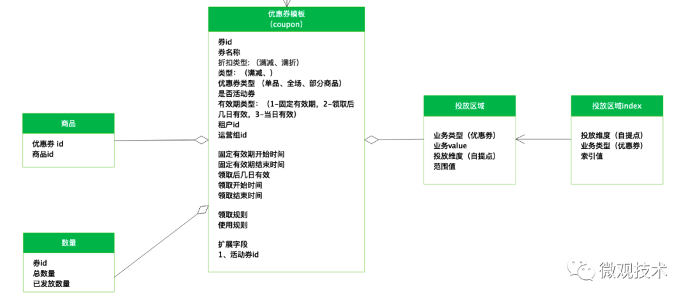
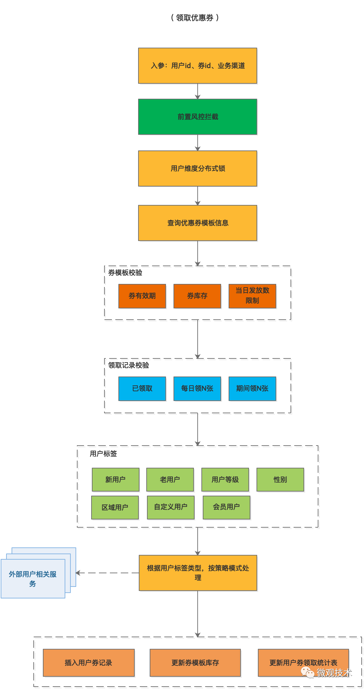
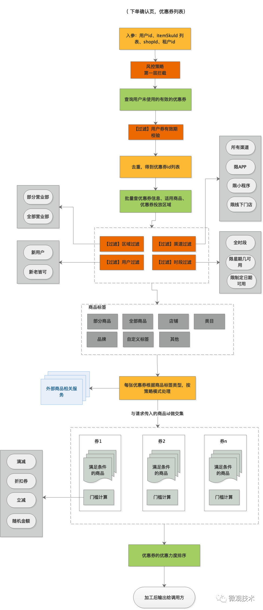

# E-emercance

电商
是一个相对于线下商业的概念，就是在网上卖东西。首先要想好，卖什么？在哪里卖？市场大环境如何？竞争对手多不多，卖的怎么样？我是否能卖的比大家都好？需要什么技术条件？需要什么同志帮忙？没有钱从哪里找？开店之后没有人看怎么办？线上可以看到神马数据，这些数据的背后又指向哪里？……等等等等的细节，组成了区别于线下市场的线上生态环境。
数据可以反映好多消费者和我们运营人员做的动作之间的关系。这些数据可以帮助你获得最终解决问题的方向参考。很多数据无法直接的告诉你解决办法，但是却可以给你提供思路

* 一般分析商业看下单率，转化率，漏斗模型，更重要的指标是什么，复购率，续费率，长期留存率
* 用 Shopify 建店，在社交媒体做广告，使用 Stripe 处理支付，通过 ShipBob 管理库存和订单，用 Returnly 处理退货，用 DarkStore 提供当日送货服务

## 功能

* 用户域

  - 收获地址

* 商品域

  - 扣库存
  - 优惠
  - 评价

* 订单域

  - 下单
  - 成交记录

* 支付域

  - 付款
  - 退款

* 购物车

* 核心域：销售域

  - 价格，销售方式，购买的方式，已经购买

## 需求

* 高频交易依然会产生海量数据，底层存储设计要提前预留扩展
* 营销活动总是特别多
* 业务玩法总是特别多，要学会抽离共性组件，模块化，采用流程引擎灵活满足不同业务诉求
* 按DDD设计思想，确定好限界上下文，拆分一系列子域，如：会员域、商品域、交易域、库存域、支付域、物流域、营销域等等

## 流程

* 正向
  - 用户添加购物车分为登录态和非登录态
    + 登录态好理解，将商品及购买数量关联到用户id上
    + 对于非登录态，server端会创建用户临时token标识，除了关联商品记录外，还会将标识缓存到客户端。如果处于登录态，会将临时表的数据合并到购物车表。
  - 新创建的订单会放入超时表，由定时任务扫描记录，未付款超时执行订单关闭，释放库存
  - 购物车批量下单，如果涉及多个店铺，会进行拆单
  - 发货环节，如果涉及多个商品，可能会拆包分批发货，关联多个物流单
  - 对于恶意刷单要接入风控处理
* 逆向
  - 有一个重要的子域业务，人工介入平台。早期订单不多时可以内部人工消化，随着业务量的快速增长，可以考虑智能客服，或者大众评审。
  - 买家可以整单或部分申请退款
  - 风控检测到订单存在风险会自动发起退款
  - 如果有使用优惠券，部分退款，要扣掉优惠券部分

## 经验

* 交易订单分为在线库（只保留近三个月的订单数据），对于超过三个月且状态结束（交易成功、交易关闭）的订单会移到归档库中，大大提高了查询性能。
* 电商平台一般发展比较迅猛，如果再搞点市场活动，订单数据是比较容易出现因为单个数据库表中的数据量过大而造成性能的瓶颈。如何选择分表键，买家uid、还是订单id、又或者是卖家uid，貌似都无法满足所有的业务场景。
  - 淘宝的做法，规则最大化适用原则，订单号拆成两部分，前面为全局唯一自增id，后面为买家id的后六位，分表键按照买家uid的后6位来计算，未来最大支持扩展100万张逻辑分表。可以支持按订单id或买家uid来查询，至于卖家部分，采用数据异构方式，将卖家uid及订单id放入另一张数据表中。
* 大多数业务都是读多写少，如果访问性能开始出现瓶颈，可以考虑一主多从、读写分离等优化策略 主从存储间数据同步都是异步操作，如果延迟较大，很容易影响用户体验。对于实时性要求较高的业务，可以依赖主库，或者借助缓存。
* 系统拆分
  - 基础业务逻辑下沉到服务，业务模型需要统一抽象，能支持定制扩展。比如，对不同规格优惠券原子性拆分、动作类型定义，数据重组。
  - 非核心数据可以考虑复合字段，数据异构化并考虑引入搜索，满足多维度查询。
  - Web 产品层专注表示逻辑和编排，可以借助 SPI 业务框架、流程引擎、规则引擎等这些基础业务框架，在业务支撑上做到了灵活可扩展。系统也做了比较合理的分层，每层只需要关心本层所需关注的能力即可。
* 复杂且较多外部RPC依赖，如何保证全局性的事务处理，最直接场景就是交易的下单
  - 营销优惠券服务、库存服务、下单服务是分开部署。交易创建流程中，订单、券和库存的状态必须要保证一致性
  - 调用券/库存服务超时/失败，异步发消息通知回滚；复杂性可控
  - MQ 生产端发送失败，可以重试，消息框架要采用幂等性生产者 。消费端通过ACK 机制保证最终一致
  - 消除了二阶段提交等分布式事务框架的侵入性影响
  - 最后一步的数据库订单置为 “可见” 要采用事务性消息，保证一致性。
* 支付环节如何保证多节点间数据一致性。采用消息+异步任务补偿
  - 订单创建成功后，会自动拉起三方支付的收银台，待用户付款成功后，会通过回调页面或API接口的方式通知支付系统，有支付系统发送MQ消息
  - 交易任务系统，消费消息做订单状态、减库存、销量等字段更新
  - 如果处理失败，会插入补偿表，通过阶梯式的异步补偿任务，保证最终一致性
* 如果业务逻辑复杂，内部涉及大量的接口调用，串行调用等待时间较长，如果各个节点间没有依赖关系，可以考虑并行化处理。
* 尽可能使用缓存。既有本地缓存，也有分布式缓存。 大促活动时，提前对缓存预热，借助缓存的高性能抗住大部分访问压力。

## 库存扣减

* 下单时预占库存,订单有一个时效,超过时效后，系统自动取消订单，回退预占库存
* 跟支付结果绑定，体验不好
* 重复下单
  - 原因
    + 用户点击过快，重复提交两次
    + 网络延时，用户刷新或者点击下单重复提交
    + 网络框架重复请求，某些网络框架，在延时比较高的情况下会自动重复请求
    + 用户恶意行为
  - 办法
    + 在UI拦截，点击后按钮置灰，不能继续点击，防止用户，连续点击造成的重复下单。redis 深处token,验证请求有效性
* 安全减扣库存
  - 数据库操作商品库存：更新库存语句增加可用库存数量 大于 0, availableNum - num >= 0 ;实质是使用了数据库的乐观锁来控制库存安全，在并发量不是很大的情况下可以这么做。但是如果是秒杀，抢购，瞬时流量很高的话，压力会都到数据库，可能拖垮数据库
  - Redis 分布式锁：强制控制同一个商品，同时只能一个请求处理下单。其他请求返回 ‘系统繁忙稍后再试！’；强制把处理请求串行化，缺点并发不高 ，处理比较慢，不适合抢购等方案 。用户体验也不好，明明看到库存是充足，就是抢不到。相比减轻了数据库的压力
  - 利用Redis increment 的原子操作，保证库存安全。事先需要把库存的数量等其他信息保存到Redis，并保证更新库存的时候，更新Redis。 先 get 库存数量是否充足，再执行 increment。能否下但以redis increment 为准

## 商品详情页

* 商品详情、产品介绍是几乎每个产品运营、营销推广人员都会面对的工作。作为产品对外的传播物料，直接影响到了产品的转化，若是电商渠道更是直接影响产品销售额
* 商品图片、标题、SKU规格、库存、价格、成交记录、评价、商品描述

## 优惠券

* 创建
  - 模板
  - 适用的商品列表
* 透出
  - 活动会场
  - 开机屏
  - 流量最大的还是在商品详情页
  - 按item_id反查商品表,查到所有配置到该商品的优惠券
  - 高并发访问:专门的”优惠券同步中心“，将运营发布的优惠券按商品维度维护到Cache中,提前预热好数据，这样当商详页访问时只需要查缓存即可，可以支持比较高的QPS
  - 券过期了维护缓存的数据一致性
    + 优惠券详细信息接口内部会引入stream流的 filter机制，会对优惠券的可用时间做校验计算，将失效的券过滤掉
    + 会发一个优惠券过期的消息，由”优惠券同步中心“接受MQ消息对缓存中已经失效的优惠券做清理
* 领取
  - 限制
    + 只有新人可以领
    + 一天只能领一张
    + 需要完成任务或达到一定门槛才可以领
  - 券模板校验：
    + 优惠券模板本身设置领取时间，只有在区间时间内才有机会领取优惠券，当然是否能最终领取还取决于其他条件。
    + 券库存。正如商品一样，没有库存的商品是无法下单售卖
    + 当日发放限制。为了防止用户对券哄抢，同时为了延长活动的黏性效果，会限量每天发放优惠券数量。
  - 定位好用户群体，什么样的优惠券发给什么类型的用户才能获得最大收益。所以我们在创建优惠券时，除了设置适用的商品范围，还要限制优惠券的用户类型
  - 适用商品范围一般在页面展示或下单时才用到
  - 用户类型则相反，需要前置控制，也就是说在用户领取时校验，一旦用户领取成功就属于用户个人财产，只要没有过期都可以使用
  - 用户领取记录校验：
    + 根据券模板的领取条件限制，以及用户的领取记录，判断是否还可以领取
  - 用户标签校验：
    + 有些券限制只有新人才可以领取。如：新人专享活动
    + 券也可以跟用户等级挂钩，只有达到设置的等级才可以领取
    + 黑名单用户。用风控挂钩，识别风险刷券用户
    + 自定义用户。可以给用户打一些特定标签。并针对该类型的用户发放。
  - 技术挑战：
    + 风控如何接入，领券接口的QPS会比较高，对风控接口性能有较高要求
    + 券缓存如何设计。一般会按变化的频率做拆分。券模板本身内容可以封装一个缓存模型。其中的券库存由于经常变化，需要单独剥离处理，采用缓存+数据库。但如何保证两者的数据一致性需要特别关注
    + 领取记录同样采用缓存+数据库
    + 用户标签。由于不用的优惠券会限制发放给不用的用户人群，所以我们会根据券模板设置的用户标，采用策略模式，调用外部服务，实时查询用户是否满足领取条件。
  - 优惠券计算接口，也会返回不可用的优惠券，并标明不可用原因，引导用户调整下单商品。
* 下单时优惠券查询
  - 只显示可以当前可用且按优惠力度排序的优惠券
  - 商品作用范围有哪些：
    + 单品：创建单品优惠券，限制只有该商品才可以使用
    + 部分商品：可以与活动绑定，也可以独立设置，只有指定的这些商品才可以适用优惠券
    + 所有商品：全场券，所有售卖的商品都可使用。
    + 店铺商品：店铺优惠券，限制只有购买本店铺的商品才可以使用，当然要满足金额门槛
    + 商品分类：类目券，根据商品的类目属性做适用条件
    + 商品品牌：按品牌决定是否可以使用优惠券
    + 商品标签：为指定商品打上自定义标签，然后优惠券模板中配置
    + 指定商品/排除特殊商品：针对特殊商品做给运营人员的灵活配置。
    + 渠道商品：根据商品进货或者销售渠道定义优惠券范围
    + 区域商品：根据商品销售区域划分，此类优惠券社区电商用的较多。
    + 订单范围就是订单金额满减、满赠、包邮等条件下可使用的优惠券。
* 核销

## 技能

* Word，Excel和PPT，思维导图
* 会PS加分，英语好非常加分，会用Excel做甘特图，并会运用VLOOKCUP等数据计算方式加分

## 概念

* 产品怎么样？与行业和竞争对手相比优势在哪里？
* 客单价多少？怎么能卖的更多？流量多少，如何能保证新客不断，老客不走？
* 发货速度和包裹内容物设计是否合理和惊喜？
* 店铺购物路径是否清晰，UED是否合理？
* 设计是不是好看，详情页的逻辑是不是清晰且有吸引力
* 流量入口的人进到店铺后都产生购买欲，都买的很多，都觉得买完之后以后还会来，还打算介绍给朋友一起来
* 销售额=流量（UV）×转化率×客单价（平均到每个人身上每次花多少钱）
* 流量即是访客数，也称UV，线上流量，用户进店的入口
  - 免费流量：通过小奖励生成收藏
    + 自主访问的老客户流量
    + 搜索流量
      * 如何被搜到
      * 被搜到之后如何被关注脱颖而出
      * 如何最大程度的让点进来的流量更多转化。
  - 付费流量
    + 钻展（CPM按千次展现成本计费）：淘宝首页，尤其是首焦看到的大部分广告；主要看素材本身基于不同目的不太一样。
    + 直通车（CPC按点击计费）：资源主要主要在搜索页，分成产品和店铺两种推广手段；
    + 硬广（CPT按时段计费）：费用充足可以直接购买部分硬广，把一个位置包个一段时间；
    + 淘宝客（CPS按实际销售产品的提成计费）：比如360导航和早期美丽说都有淘客的抽成；现在的淘客部分可能会深耕内容，聚划算和双十一等坑位资源，报官方活动的费用资源。
* 客单价：平均到每个人身上每次花多少钱。主要在于店铺的产品
  - 产品结构：是不是品类很多，而且不同产品还能分出个主推和次推；
  - 产品组合形式：A+B、B+C还是A+C；
  - 促销方式：满额赠或者满额减的形式都比较容易刺激部分消费者为了凑单，买的更多点儿；
  - 客单价当然越高越好。说明客户买的东西越多，越贵，商家当然挣得越多
* 转化率：消费者为啥来了不买。转化率既可作为一个虚值，与一切皆相关，又可以落到两种简单的数据参考来看
  - 咨询转化率：跟客服相关，主要考察客服的反应时间，接客量，咨询后的下单率，推荐的顺序，客服的话术是不是给力
  - 静默下单率：考察店铺页面的引导力
    + 店铺的购物路径，即流量从什么入口进到了店铺后，继而是引导到了什么位置。是首页直接到详情页下单？还是从首页，经过了活动二级页和分类导航页再到宝贝详情页？
    + 通过各个路径进行购买的流量比例有多大？哪种方式消费者花的钱比较多？
  - 产品不给力？折扣不给力？页面引导不给力？模特不给力？设计很难看？文案风格他不喜欢？还是我送的礼物没人喜欢？或者是包裹里我没放礼物
* 活动
  - 快速下单（赶紧买）——拉高客单价（多买点儿）——对品牌留印象（常来买）；
  - 指标
    + 故事线索（主要是活动噱头和文案的引导顺序）
    + 营销线索（主要说店铺的促销机制）
    + 设计线索（头图主KV，店招，导航，货架，轮播，互动，活动页和分类页以及详情页的配合……）
* 促销
  - 看有没有门槛。有就是“满”，没有就是“买”。
  - 看看是满额还是满量
  - 赠（实体还是虚拟？钱还是物？大还是小？分什么层次？）/减（减价还是换物）/折（直接折扣还是下次折扣？是几个层次的折扣？）
  - 为了活跃客户的反应：限时或者限量
* 分析竞争对手
  - 行业：行业趋势和涨幅，类目销售情况
  - 品牌：品牌定位及所处阶段，品牌的卖点和核心价值链
  - 店铺：店铺历史销售情况，店铺成交与品牌销售的占比，店铺运营节奏
  - 产品：产品卖点，产品价格段和不同时间的价格设计，产品组合形式，赠品选择，产品营销，产品款式，产品风格，产品
  - 用户：既然是竞争对手，那就自然要分析用户

## 促销

* 目的
  - 拉新。可以吸引很多新用户到平台注册。
  - 清库存。降低库存的仓储成本
  - 提升品牌效应。
  - 推广新品。借助促销流量，给新品更多的曝光流量。
  - 与竞品抢生意。毕竟市场就那么多，一个用户想买个苹果手机，如果选择了淘宝，可能就不会在京东下单。
  - 提高客单价，网站GMV。每年淘宝双11，就是各种优惠券、津贴、红包、促销活动组合玩法，给用户营造一种有便宜可占的氛围。
* 组成
  - 基础设置 像活动名称、活动id、活动时间、推广平台、促销渠道、用户范围、推广链接等
  - 促销规则 针对不同类型的活动，会有不同的活动规则，直接影响订单的优惠计算。
  - 活动商品 设置促销活动商品范围时，可以选择全部商品或部分商品。有赠品的促销活动还要选择配置赠品。
* 规则
  - 满减促销。又可以细化为三种形式：单次满减、每满减、阶梯满减。单次满减，如满100减10，订单330需要实付320。每满减，如每满100减10，订单330需要实付300。阶梯满减，如满100减10、满200减30、满300减50。
  - 单品促销。可以分为单品特定价、单品满减（分为数量、金额）、单品打折（分为数量、金额）
  - 组合促销。将商品组合按优惠价出售。例如：A商品70元，B商品50元，组合来卖100元
  - 赠品促销。购买主商品之后赠送商品。对于赠品，也有多种赠送方式，全部赠送或者选一件赠品。例如：卖手机送手机壳
  - 满赠促销。购买商品满足X元后送某商品，或者购买商品金额满X元后再加价Y元送某商品。
  - 多买优惠促销。例如：全场10元2件，2件8折
  - 定金促销。采用预付定金的模式，提前交定金可以享受优惠价。定金杠杆，例如：充100抵150
* 管理
  - 创建活动
  - 审核活动
  - 编辑活动
  - 删除活动
  - 状态机一般有“未开始”、“进行中”、“已结束”、“已删除”
* 优惠计算:一个商品参加多种促销活动时，一般按最优原则，自动选择最佳优惠方案计算
* 注意事项
  - 策划促销活动，需要提前核算运营活动成本，以及预估活动的效果，选择最佳的促销手段。
  - 提前做安全评估，严防薅羊毛事件发生。
  - 为了验证活动效果，可以做 A/B Test

## 品牌

* 产品：远是基础，想要挣钱，卖得好，产品必须要跟得上
* 节奏和时间：不能急于求成，如果没有极棒的创意和极其精准的定位，那么时间要更长，积累信任和真实的品牌触感非常重要，看的清楚点儿，是积累，说明时间要长一点
* 用户体验：差异化更多就向着服务和体验的差异化来走，你做了一件事叫A，你的竞争对手没做，那么你的体验就好于他，长期积累，不断创新和增加这一点点的优势，在这场比赛中，你就更具优势
  - 用户自己知道是，要用户习惯；用户自己都忽视的，叫人类本能
  - 习惯有多深，以及是谁培养的
* 故事：一方面你得有故事可以讲，一方面你用了正确的渠道帮助这个故事加以扩散。那么你的品牌有什么故事可以讲？讲的故事是否让你的目标用户感觉良好
* 信任：信任作为一个目的，当然也有被达成的办法。以退为进，你大可以承认自己在某些方面的不足，扬长避短，让客户对你更加信任。

## 平台

* 聚划算
  - 分阶段：预热期和正式期，以及聚划算后的工作；每一个阶段有不同的工作侧重点
  - 先是报名（图片+库存+产品价格），再是审核，审核通过排期，锁库存等。再之后店铺想好承接方案，并匹配更多的流量跟进。
  - 作为平台，本身的流量和能够承载的转化销售是有时间周期的。具体的时间周期，基本可以与淘宝平台的大流量相一致。
  - 货品是关键
    + 款式本身（颜色，图案，材质，颜色……标品涉及到每个类目的具体要求），款式数量的配置，库存，组合形式，价格，折扣（日常与聚划算价格不同）等，综合来说就是价格段和款式本身的问题
* 天猫双11
  - 2009光棍节前，时任淘宝商城主管的明梅，给总经理张勇发电子邮件。 邮件只有一行话： 我们打算做一个全场5折的活动，预算2000万。
  - 当天白天，明梅察觉异常。活动专题中，一款裤子，库存50条，但页面收藏人数远超历史记录。明梅判断购物高峰在早上七八点，留人值班后，设了6点的闹铃。 闹铃响时，大部分品牌已被一扫而空。
  - 2009年冬夜，山西运城河津市，公务员闫军刚临时起意，想买一张手机话费卡。 他在淘宝上下单，花费144元买了张148元话费卡。14秒后，付款成功，订单时间定格在2009年11月11日0分14秒。
  - 11月12日早上9点，妖怪活动最终销售额5200万。第二年，参加活动的品牌从27家激增至711家，单日销售额达9.36亿，数百万包裹如山洪般流向铁路、国道与航班。
  - 2019年双十一，入夜有多场晚会，年轻的偶像，站在波光粼粼的光海中，撩拨着新一代的欲望。 更火热的战场在直播间。李佳琦直播间当夜冲入3683万人，一件商品展示12秒，就能卖出数万件。
  - 十一年前，我们是狂欢的主角；十一年间，我们是夜宴的过客；十一年后，我们只是流量。
* 亚马逊给出的策略是：不参加价格战，因为价格战是忽悠，非持续经营之道。当时总部认为，低价促销不符合长期利益，不喜欢只追求短期利益的行为。
* Shopify
* ebay

## 优衣库

* 1998年11月28日，CEO柳井正大清早站在东京的街头，忐忑不安。这是柳井正第一次将优衣库（UNIQLO）开到日本的市中心——原宿。在此之前，优衣库一直定位于城乡结合部，而公众对于优衣库的认知也停留在“便宜没好货”。没有市区销售经验的柳井正“只求能够卖掉就好了”[2]。
* 原宿是日本东京涩谷区的时尚中心，商铺位租金不仅高得离谱，而且非常紧俏。在日本经历经济泡沫崩溃后，大量服装商家撤出原宿的店铺，租金相应有所回落。与此同时，优衣库也同样经历了一系列战略性失败。但柳井正决定反周期入驻市区核心地带，拓展高端客户群。
* 柳井正把反周期打法的命运，压在了一种名叫“摇粒绒”的料子上。摇粒绒是一种耐穿快干易洗，且在受潮时仍能御寒的面料。这种料子因为被美国垄断，进口成本高昂，导致其多用在登山服这类户外高单价产品。一件摇粒绒衣物能卖到1万日元以上，柳井正决定自主生产摇粒绒。
* 柳井正找来中国加工企业，与优衣库共同着手摇粒绒的研发。经过多次改良，自成体系的生产流程成熟：日本东丽公司购入原料，印度尼西亚纺织成丝，最后到中国进行纺织、染色、缝制。这套流程大幅提高了质量。“低价格高品质”的摇粒绒送到了柳井正的手上，这一战有希望能赢。
* 原宿店开门前夕，印有“优衣库的摇粒绒衫，1900日元”的广告张贴在了涩谷车站、原宿车站，还有地铁轻轨的每节车厢里。三层楼面的商场，柳井正把摇粒绒衫堆满了整个一楼。开店当天，顾客排起了长队，进店就开始疯抢，电视和杂志媒体闻风而来，“卖疯了”成了当日头条。
* 摇粒绒，让顾客对优衣库的心智认知产生了巨大扭转，从“便宜没好货”到“衣服便宜，但质量也真不错”。在商业模式没有任何改变的情况下，优衣库在东京，乃至整个日本的品牌声誉一战成名。顾客冲着来买摇粒绒的同时，也捎带着其他物品，店铺整体销售额直线提升。
* 设计大师原研哉在《设计中的设计》写过：在对最合适的素材、制作手法、外观摸索过程中，“简约”孕育出新的价值观和审美观。所要实现的，并不是最低的价格，而是充实的低成本，和最为聪明的低价格区间。
* 优衣库正是选用了原始的成分，孕育出一种非炫耀性的消费。消费者不会因为购买优衣库商品而自夸或者炫耀。优衣库是一种对名牌的反抗，剔除不必要价值，提供需要的生活方式。与原先多数品牌以彰显个性为主打而占领市场不同，优衣库反其道行之，给品牌做减法。

## 时代

* 消费观从来都不只是个人意志的选择，而是整体宏观经济和社会结构下，所做出的无意识决定。
* 不同国家在面临不同时代的经济萧条，都在消费观上出现了追捧国潮、折扣零售的相通性
  - 日本在“失去二十年”里孕育出的优衣库
  - 美国石油危机里诞生了最大的折扣零售T.J.MAXX

## 项目

* [ linlinjava / litemall ](https://github.com/linlinjava/litemall): 又一个小商城。litemall = Spring Boot后端 + Vue管理员前端 + 微信小程序用户前端 + Vue用户移动端

## 工具

* 拼多多
  - 小镇真正的力量源泉还得回到生育层面
* [1688](https://www.1688.com)

## 参考

* [优惠卷实现](https://mp.weixin.qq.com/s/d1T3EiW_XaJOtWvZnYRtMw)
